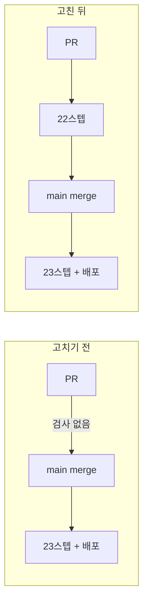
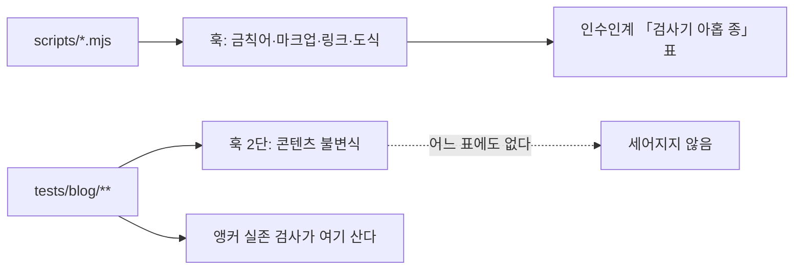

# Changelog

이 저장소의 사용자에게 영향이 큰 변경만 날짜별로 간단히 적습니다. (커밋 해시는 선택적으로 추적합니다.)

## 지난 기록

본체에는 최신 3개 절만 둔다. 그 아래는 월별 파일로 옮겼다.

| 월 | 절 수 | 날짜 |
| --- | ---: | --- |
| [`2026-09`](docs/changelog/2026-09.md) | 19 | 2026-09-04 · 2026-09-04 · 2026-09-04 · 2026-09-03 · 2026-09-03 · 2026-09-03 · 2026-09-03 · 2026-09-03 · 2026-09-02 · 2026-09-02 · 2026-09-02 · 2026-09-02 · 2026-09-02 · 2026-09-02 · 2026-09-02 · 2026-09-02 · 2026-09-01 · 2026-09-01 · 2026-09-01 |
| [`2026-08`](docs/changelog/2026-08.md) | 36 | 2026-08-31 · 2026-08-31 · 2026-08-30 · 2026-08-30 · 2026-08-30 · 2026-08-30 · 2026-08-29 · 2026-08-29 · 2026-08-29 · 2026-08-19 · 2026-08-18 · 2026-08-18 · 2026-08-18 · 2026-08-18 · 2026-08-18 · 2026-08-18 · 2026-08-18 · 2026-08-17 · 2026-08-17 · 2026-08-17 · 2026-08-17 · 2026-08-16 · 2026-08-16 · 2026-08-16 · 2026-08-13 · 2026-08-13 · 2026-08-12 · 2026-08-11 · 2026-08-11 · 2026-08-09 · 2026-08-09 · 2026-08-08 · 2026-08-08 · 2026-08-08 · 2026-08-08 · 2026-08-07 |
| [`2026-07`](docs/changelog/2026-07.md) | 5 | 2026-07-21 · 2026-07-08 · 2026-07-07 · 2026-07-06 · 2026-07-05 |
| [`2026-06`](docs/changelog/2026-06.md) | 1 | 2026-06-02 |
| [`2026-05`](docs/changelog/2026-05.md) | 1 | 2026-05-01 |

---

## 2026-09-05 — **검사는 있었는데 merge 전에 돌지 않았다.** CI 를 PR 에도 걸고, 인수인계의 낡은 수치 여섯을 실측으로 고쳤다

> 직전 세션이 「CI ✅ 22스텝」이라고 남겼다. 이번 세션에 PR 을 열어 보니 `gh pr checks` 가
> **`no checks reported`** 를 냈다. 워크플로가 하나뿐이고 트리거가 `push: [main]` 이라
> 검사는 **merge 된 뒤에야** 돌고 있었다.
>
> 이 리포에는 프리뷰 환경이 없어 `main` 이 곧 프로덕션이다. 즉 PR 단계에서 걸러야 할 것이
> 프로덕션에서 드러나는 구조였고, 직전 세션의 대비 1.06 결함이 실제로 그 경로로 배포됐다.
>
> ⇒ 🔴 **「CI 에 있다」와 「merge 전에 돈다」는 다른 말이다.** 세 세션이 검사의 목록은 계속
> 세면서 검사가 **도는 시점**은 아무도 세지 않았다.

### 무엇이 달라졌나



`.github/workflows/deploy.yml` 한 파일에서 네 곳을 고쳤다.

| # | 어디 | 바꾼 것 | 왜 |
| ---: | --- | --- | --- |
| 1 | `on:` | `pull_request: branches: [main]` 을 더했다 | PR 에서도 검사가 돈다 |
| 2 | `deploy` job | `if: github.event_name != 'pull_request'` | PR 이 Pages 에 배포하면 안 된다 |
| 3 | `Upload artifact` | 같은 조건 | 배포하지 않을 아티팩트를 만들 이유가 없다 |
| 4 | `concurrency` | 그룹을 `${{ github.workflow }}-${{ github.ref }}` 로 나눴다 | `"pages"` 하나로 두면 **PR 검사가 배포와 같은 큐에 끼어든다** |

🔴 **파일을 나누지 않은 이유가 규칙이다.** `ci.yml` 을 따로 만들면 검사 목록이 두 벌이 되어
스텝을 더할 때 한쪽만 고쳐진다. 이 리포가 뮤턴트 수 · 훅 단수 · 검사기 종 수에서 **세 세션
연속으로 겪은 실패가 정확히 그 유형이다.**

### 실측 — 대가가 없었다

| 무엇 | 값 |
| --- | --- |
| PR 검사 (run `33951647521`) | `build` **pass 2m26s** · `deploy` **skipping** |
| 그중 건너뛴 스텝 | **`Upload artifact` 하나뿐** (27개 중 26개 실행) |
| merge 뒤 배포 (run `33952978065`) | `build` success · `deploy` **success** — 회귀 없음 |
| 기존 배포 소요 | 2m24s ~ 2m47s |

빌드와 산출물 스캔(`check-forbidden:built`)까지 PR 에서 돈다. 검사를 앞당긴 시간 비용이
사실상 0 이다.

### 낡은 수치 여섯 — 전부 실측으로 고쳤다

| 무엇 | 적혀 있던 것 | 실제 |
| --- | --- | --- |
| CI 스텝 수 | 22스텝 | `build` **23** + `deploy` 1 (PR 은 22) |
| README 의 `:verify` | **6개가 없다** | **12개가 전부 있다** — 독립 행 7 · 본문 병기 5 |
| `diagram-design` 설치 | `/plugin marketplace add` 로 설치한다 | **이미 v2.6.12 로 설치**되어 있다 |
| 후보 B | `themeVariables` 를 **교체** | `fontSize` 하나뿐이라 **신설**이다 (mermaid **11.16.0**) |
| 사이트 폰트 | Inter 하나 | `_document.tsx` 가 **이미 Google Fonts** 를 쓴다 (Nanum Pen Script) |
| 검토 질문 넷 | 전부 후보 B 에 해당 | **질문 2·3 은 해당하지 않는다** — B 는 색 값만 빌린다 |

두 번째가 성격이 다르다. 「없다」가 아니라 **서술 방식이 두 가지**였고, 두 세션 동안
「미해결 작업」으로 이월되어 있었다. ⇒ **검사기의 신호를 판정 없이 목록으로 옮기면
오탐이 작업으로 승격된다.**

### L4 의 완화책을 채웠다 — 분량은 결과였다

`content/blog/ai-agent/groundedness-cost-limits.md` 가 분량 하한에 **19 B** 모자란 채
SOFT 목록에 있었다. 하한 주석은 「이보다 작으면 **인접 편과 병합을 검토한다**」인데,
하한의 **0.14%** 가 모자란 편은 병합 검토 대상이 아니다.

그래서 바이트를 채우는 대신 본문을 대조했더니 빈 칸이 하나 드러났다.

| 한계 | 본문의 대응 |
| --- | --- |
| L3 재시도 상한 없음 | C7 에서 대응책 제시 ✅ |
| **L4 2진 판정, 부분 환각** | **어디에도 없었다** ❌ |
| L5 검증 비용 · 지연 | 비용 절 인용에서 팬아웃 · 계층화 ✅ |

본문이 「L3·L4·L5 는 구현을 고쳐 완화할 수 있다」고 선언해 놓고 **L4 의 완화책만 끝까지
나오지 않았다.** 표가 셋을 묶었기에 빈 칸이 보였다. 판정 단위를 문장으로 내리는 완화책과,
그것이 다시 비용과 충돌한다는 사실을 인용 블록으로 더했다.

| 값 | 전 | 후 |
| --- | ---: | ---: |
| 바이트 | 13,281 B | **13,844 B** (하한 대비 +544) |
| 분량 하한 SOFT | 5편 | **4편** |

⇒ **분량이 목적이 되면 바이트만 늘고 편은 그대로다.** 누락을 찾아 채우면 분량은 따라온다.

### 커밋

| 해시 | 무엇 |
| --- | --- |
| `1f21183` | 수정: CI 를 PR 에서도 돌리고 낡은 수치 여섯을 실측으로 고친다 (PR [#6](https://github.com/withwooyong/withwooyong.github.io/pull/6)) |
| `08ead8a` | 내용: L4 의 완화책을 채워 한계 다섯의 빈 칸을 메운다 (PR [#7](https://github.com/withwooyong/withwooyong.github.io/pull/7)) |

PR #7 이 **새 트리거의 첫 실전 적용**이었고, 발행본 변경이 merge 전에 22스텝을 통과했다.

---

## 2026-09-05 — 발행본 **184편을 훑을 수단**을 만들었다 (사이드바 트리 · `Ctrl+K` 검색 · 시리즈 진행도) · 그리고 **검사 전부가 통과시킨 대비 결함**을 사용자가 화면을 보고 잡았다

> 이 리포의 여덟 세션은 검사기의 사각지대를 닫아 왔고, 이번 세션은 처음으로 **기능을 만들었다.**
> 184편이 있는데 훑을 수단이 없었다.
>
> 그런데 배포된 검색 팔레트는 **다크 모드에서 읽히지 않았다.** 대비 **1.06 : 1** 이었고,
> 자동 검사 전부와 리뷰 아홉과 뮤테이션 58개가 그것을 통과시켰다.
>
> ⇒ 🔴 **규칙이 「있는 것」을 검사하면 「없는 것」은 구조적으로 보이지 않는다.**

### 무엇이 생겼나

| 기능 | 어디 | 비고 |
| --- | --- | --- |
| 카테고리 · 시리즈 · 편의 3단 사이드바 | `components/blog/category-tree.tsx` | `<details>` 라 **JS 없이도 동작한다** |
| `Ctrl+K` 검색 팔레트 | `components/blog/search-dialog.tsx` | 첫 열림에만 인덱스를 받는다. 실패하면 카테고리 목록으로 폴백한다 |
| 시리즈 진행도 | `components/blog/series-progress.tsx` | 「n편 중 k번째」와 나머지 편 목록. 독립편 20편에는 그리지 않는다 |
| 검색 인덱스 | `scripts/build-search-index.mjs` | 빌드 산출물의 목차를 재사용한다. **184편 · 헤딩 2,671개 · 311 KB** |
| 순수 함수 | `lib/blog/tree.ts` · `lib/blog/search.ts` | `fs` 도 DOM 도 모른다. 테스트가 픽스처를 주입한다 |

**신규 의존성은 0개**이고 `tsconfig.json` 은 건드리지 않았다. Pages Router 와 정적 export 전제도 그대로다.

### 🔴 배포된 채로 읽히지 않았다 — 대비 1.06

`DialogContent` 에 `bg-background` 는 있는데 **`text-foreground` 가 없었다.** 모달은 포털로 그려져
`blog-shell` 의 `dark:text-slate-100` 바깥에 놓이므로, 색을 명시하지 않은 요소가 `body` 색인
`rgb(0,0,0)` 을 그대로 상속받았다. 배경은 `rgb(10,10,10)` 이었다.

| 요소 | 고치기 전 | 고친 뒤 |
| --- | ---: | ---: |
| 검색 결과의 편 제목 20개 | **1.06 : 1** | **18.97 : 1** |
| **검색 입력창** | **1.06 : 1** | **18.97 : 1** |
| 헤딩 30개 | 7.72 : 1 | 7.72 : 1 (변화 없음) |

**입력창까지 같은 값이라 자기가 친 글자도 보이지 않았다.** 헤딩 줄만 멀쩡했던 것은 거기에만
색이 명시되어 있었기 때문이다.

### 왜 아무도 못 봤나

| 단계 | 기준 | 왜 못 봤나 |
| --- | --- | --- |
| 태스크 리뷰 · 최종 리뷰 | 「모든 색 클래스에 `dark:` 짝이 있는가」 | 그 자리들은 **색 클래스가 아예 없어** 짝지을 대상이 없었다 |
| 뮤테이션 58개 | 알려진 결함을 되살린다 | 이 부류가 목록에 없었다 |
| 컨트롤러의 브라우저 확인 | 열림 · 이동 · 닫힘 같은 **동작** | 색을 재지 않았다 |

잡은 것은 **사용자가 화면을 보고 한 지적**이었다.

### 두 번에 나눠 고쳤다 — 증상과 원인

`Dialog` 를 쓰는 곳이 넷이라 개별 호출부가 아니라 **원시 요소**에서 고쳤다(PR #4). 그러나 그것은
`DialogContent` 하나만 지킨다. 원인은 `body` 에 색이 없다는 것이므로 `styles/globals.css` 에서
닫았다(PR #5).

**되돌려 실측했다** (프로덕션 · 다크 모드 · 검색 결과 44개):

| 상태 | 최저 대비 | 입력창 |
| --- | ---: | ---: |
| 옛 판 (`body` 색 없음 + `text-foreground` 없음) | **1.06** | **1.06** |
| `body` 규칙만 (`text-foreground` 를 벗겨도) | **7.72** | **18.97** |
| 둘 다 (현재) | 7.72 | 18.97 |

가운데 줄이 근거다. 다이얼로그가 자기 색을 잃어도 팔레트가 읽힌다.

보이는 변화는 없다 — 홈 535개 · 블로그 613개 텍스트 요소 중 `body` 색을 상속받는 것이
라이트·다크 양쪽에서 **0개**다.

### 나머지 세 다이얼로그도 눈으로 봤다

| 다이얼로그 | 최저 대비 |
| --- | ---: |
| `SystemDiagramCard` (홈 「크게 보기」) | 7.85 |
| 위 SVG 도식 글자 34개 | 7.72 |
| `ThesisSummaryDialog` (홈 「논문 요약」) | 7.85 |
| `Mermaid` 확대 뷰어 (블로그 본문) | 7.87 |

### 그 밖에 잡힌 것

- **최종 전체 리뷰가 검색 결함 하나를 잡았다.** `MIN_QUERY_LENGTH` 가 **질의 전체**의 문턱이어야
  하는데 **토큰마다** 걸려서, 훅 · 앱 · 봇 같은 1음절 명사가 조용히 버려지고 있었다.
  계획서가 지시한 대로 구현한 결과였으므로 **계획서를 따르는 것만으로는 잡히지 않았다.**
- 단축키 표기가 `Win32` 에서도 「Cmd K」로 고정돼 **누르지 않는 키를 안내하고 있었다.**
- 🔴 **「검사기 종 수」와 「뮤테이션이 돌리는 검사 수」는 다른 수인데 둘 다 「아홉」으로 적혀
  있었다.** 실제로는 아홉과 여덟이었다. 이제 문장이 두 수를 구분해 적는다.

### 수가 바뀐 자리

| 무엇 | 전 | 후 |
| --- | ---: | ---: |
| `scripts/` 검사기 | 아홉 종 | **열 종** |
| 뮤턴트 | 50개 | **58개** |
| `tests/blog` | 5파일 54케이스 | **8파일 87케이스** |
| 리포 문서 도식 | 55파일 110개 | **56파일 112개** |

### ⚠️ 계산된 스타일은 한 호출 늦게 온다

위 세 상태를 한 스크립트로 재었더니 값이 **한 칸씩 밀려** 「옛 판이 멀쩡하고 고친 판이 깨졌다」는
정반대 표가 나왔다. `await setTimeout` 을 넣어도, 같은 실행 안에서 두 번 재도 마찬가지다.
**변경하는 호출과 재는 호출을 나눠라.**

---

## 2026-09-04 — **인수인계 문서 자체는 검증 대상이 아니었다.** 낡은 자기 검사 건수 다섯 자리를 실측으로 고쳤고, 「남은 사각지대」의 첫 후보는 **이미 닫혀 있었다**

> 이 리포는 「증명하기 전에는 0을 믿지 마라」를 아홉 검사기에 새겨 왔다. 그런데 그 규칙이
> **인수인계 문서에는 한 번도 적용되지 않았다.** 이번 세션은 코드를 고치지 않고 문서에 적힌
> 수치를 전부 실측과 대조했는데, 자기 검사 건수 **다섯 자리**가 낡아 있었고 「남은 사각지대」의
> 첫 후보인 **앵커 유효성은 이미 훅과 CI 양쪽에서 돌고 있었다.**
>
> ⇒ 🔴 낡은 문서는 틀린 값을 주는 데 그치지 않는다. **이미 있는 것을 다시 만들게 한다.**

### 자기 검사 건수 다섯 자리가 낡아 있었다

아홉 검사기의 `--self-test` 를 **전부 돌려** 문서의 값과 대조했다. 넷이 정확히 일치했으므로
계수 방식은 문서의 관례와 같고, 어긋난 자리는 값이 낡은 것이다.

| 어디 | 적혀 있던 값 | 실측 |
| --- | ---: | ---: |
| `README.md:83` `check-forbidden:verify` | 15건 | **63** |
| `HANDOFF.md` 표 `check-forbidden` | 15건 | **63** |
| `HANDOFF.md` 표 `dup-scan` | 7건 | **12** |
| `HANDOFF.md` 표 `source-overlap` | 28건 | **42** |
| `CLAUDE.md:51` 검사기 개수 | 여덟 | **아홉** |
| `check-markup` · `fix-markup` · `check-links` · `check-mermaid` | 24 · 19 · 23 · 26 | ✅ 동일 |
| 뮤턴트 수 | 50개 | ✅ 50 |

🔴 **직전 세션은 `check-forbidden` 하나만 낡았다고 기록했지만 실제로는 셋이었다.** 한 자리를
「자동 대조가 안 된다」는 이유로 남기면, **같은 이유로 낡은 옆자리는 아예 세어 보지 않게 된다.**

### 어긋난 셋은 전부 「검사기가 스스로 세지 않는 것」이었다

| 검사기 | 자기 검사 건수를 어떻게 읽나 |
| --- | --- |
| `check-markup` · `check-links` · `check-mermaid` · `source-overlap` | 검사기가 `24/24` 형태로 **스스로 출력한다** |
| `check-forbidden` | 형식이 달라 `통과 63 / 실패 0` 으로 낸다 |
| 🔴 `dup-scan` · `fix-markup` | **요약 숫자를 내지 않는다.** `PASS` 줄을 세야 한다 |

계수 명령을 하나로 고정했다.

```
node scripts/<검사기>.mjs --self-test 2>&1 | grep -cE '(PASS|✅)'
```

### 🔴 「남은 사각지대」의 첫 후보가 이미 닫혀 있었다

`HANDOFF.md` 는 **앵커 유효성**을 다음 후보 첫 줄에 두고 「`check-links` 는 앵커를 분리만 하고
판정하지 않는다」고 적어 두었다. 사실이지만 결론이 틀렸다. 판정은 **다른 곳**에서 이미 하고 있다.

| 무엇 | 어디에 | 상태 |
| --- | --- | --- |
| 도착지 집합 | `lib/toc.ts:75` `headingIds` | 렌더러와 **같은** `github-slugger` 를 쓴다 |
| 앵커 추출 | `tests/blog/content/links.test.ts` `anchorLinks` | `%`-인코딩을 디코드한다 |
| 판정 | 같은 파일 `brokenAnchors` | 대상 편이 없는 경우는 **일부러 제외**한다 |
| 자기검사 · 본 검사 | `describe` 「앵커 실존」 | ✅ 둘 다 통과 |
| 「0건 검사」 가드 | `expect(seen.length).toBeGreaterThan(0)` | 하나도 못 뽑으면 실패시킨다 |
| 게이트 | 훅 2단 · CI | ✅ **양쪽에서 돈다** |

테스트와 **동일한 정규식**으로 직접 세니 발행본 184개에서 앵커 링크 **28개**로, 목록에 적힌 수와
같았다. 링크가 0개로 잡혀 검사가 헛도는 상태가 아니다.

### 원인 — 목록이 검사기의 절반만 세고 있었다



훅 2단의 이름이 **「콘텐츠 불변식」** 이고 그 실체가 `npx vitest run tests/blog` 다. 이름만으로는
Vitest 를 가리키는지 알 수 없어, 이미 돌고 있던 검사가 **세 세션 동안 「없는 것」으로 세어졌다.**

`check-links.mjs` 가 앵커를 버리는 것도 결함이 아니라 역할 분담이다. 앵커 판정은 렌더러와 같은
슬러거를 불러야 하는데 그것은 TypeScript 부품이라, **구조적으로 `.mjs` 검사기에서는 살 수 없다.**

⇒ `HANDOFF.md` 에 「Vitest 가 보는 것」 절을 새로 두고, 검사기 표 제목을 「`scripts/` 의 검사기
아홉 종」으로 바꿔 **절반임을 제목이 말하게** 했다. `CLAUDE.md` 의 게이트 절에도 같은 사실을 적었다.

### 남은 사각지대를 전수 재검증했다

넷 중 하나만 낡았고 셋은 유효하다.

| 후보 | 기재 | 실측 | 판정 |
| --- | --- | --- | --- |
| 앵커 유효성 | 28개 · 「판정하지 않는다」 | 28개 · **이미 판정 중** | 🔴 낡음 |
| 도식의 의미 | 649개 | 발행본 544 + 문서 105 = **649** | ✅ 유효 |
| 분량 하한 SOFT | 5편 | 파일명까지 일치 | ✅ 유효 |
| 새 배치 | — | — | ✅ 유효 |

### 검증

| 무엇 | 결과 |
| --- | --- |
| 문서 6단 · 두 회차 | ✅ 파일 54개 · 마크업 0회 · 링크 0곳 · 도식 105개 **판정 도달 105개** · 0곳 |
| `npx vitest run tests/blog` | ✅ **54/54** |
| 발행본 도식 스캔 | ✅ 184개 파일 · 도식 544개 · 판정 도달 544개 · 0곳 |
| 정본 줄바꿈 | ✅ 세 문서 전부 LF |
| CI · 배포 | ✅ 두 회차 모두 `build` · `deploy` **success** |

커밋 `d9328e4`(건수 정정) · `b56fa57`(검사기의 자리를 문서에 남김).

---

