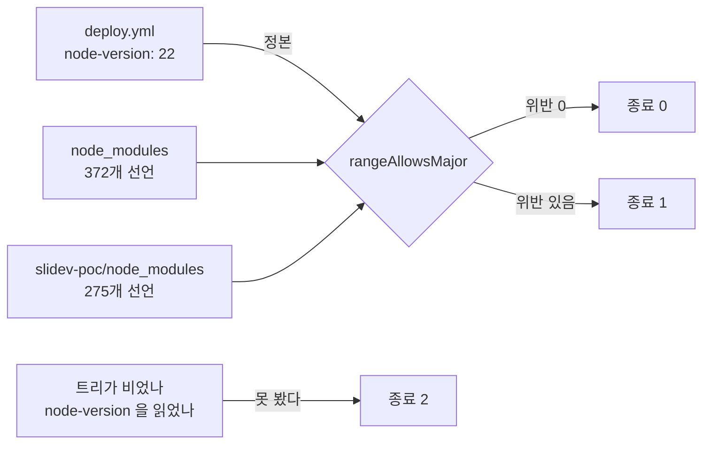
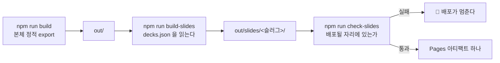
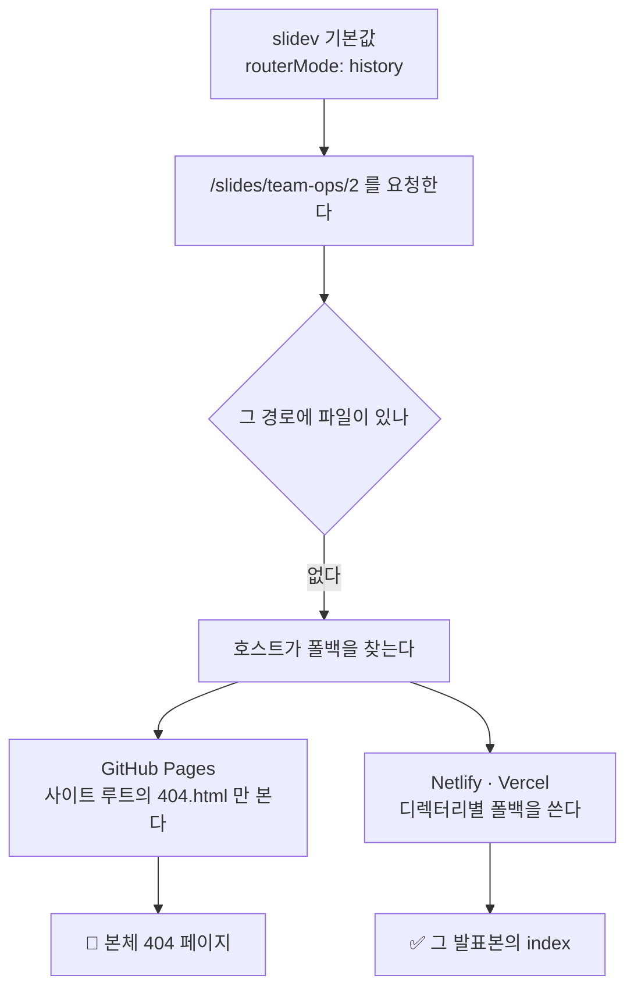

# Changelog

이 저장소의 사용자에게 영향이 큰 변경만 날짜별로 간단히 적습니다. (커밋 해시는 선택적으로 추적합니다.)

## 지난 기록

본체에는 최신 3개 절만 둔다. 그 아래는 월별 파일로 옮겼다.

| 월 | 절 수 | 날짜 |
| --- | ---: | --- |
| [`2026-09`](docs/changelog/2026-09.md) | 41 | 2026-09-09 · 2026-09-09 · 2026-09-09 · 2026-09-09 · 2026-09-09 · 2026-09-08 · 2026-09-07 · 2026-09-07 · 2026-09-06 · 2026-09-06 · 2026-09-06 · 2026-09-06 · 2026-09-06 · 2026-09-06 · 2026-09-06 · 2026-09-06 · 2026-09-06 · 2026-09-05 · 2026-09-05 · 2026-09-05 · 2026-09-05 · 2026-09-04 · 2026-09-04 · 2026-09-04 · 2026-09-04 · 2026-09-03 · 2026-09-03 · 2026-09-03 · 2026-09-03 · 2026-09-03 · 2026-09-02 · 2026-09-02 · 2026-09-02 · 2026-09-02 · 2026-09-02 · 2026-09-02 · 2026-09-02 · 2026-09-02 · 2026-09-01 · 2026-09-01 · 2026-09-01 |
| [`2026-08`](docs/changelog/2026-08.md) | 36 | 2026-08-31 · 2026-08-31 · 2026-08-30 · 2026-08-30 · 2026-08-30 · 2026-08-30 · 2026-08-29 · 2026-08-29 · 2026-08-29 · 2026-08-19 · 2026-08-18 · 2026-08-18 · 2026-08-18 · 2026-08-18 · 2026-08-18 · 2026-08-18 · 2026-08-18 · 2026-08-17 · 2026-08-17 · 2026-08-17 · 2026-08-17 · 2026-08-16 · 2026-08-16 · 2026-08-16 · 2026-08-13 · 2026-08-13 · 2026-08-12 · 2026-08-11 · 2026-08-11 · 2026-08-09 · 2026-08-09 · 2026-08-08 · 2026-08-08 · 2026-08-08 · 2026-08-08 · 2026-08-07 |
| [`2026-07`](docs/changelog/2026-07.md) | 5 | 2026-07-21 · 2026-07-08 · 2026-07-07 · 2026-07-06 · 2026-07-05 |
| [`2026-06`](docs/changelog/2026-06.md) | 1 | 2026-06-02 |
| [`2026-05`](docs/changelog/2026-05.md) | 1 | 2026-05-01 |

---

## 2026-09-12 — 🗑️ **발표본 갈래를 통째로 걷어냈다** — 사용자가 삭제를 지시했고, 그 과정에서 `check-engines` 의 **대조군이 헛돌 뻔했다**

> 배포되어 있던 발표본 넷(`patterns` 29장 · `team-ops` 30장 · `governance` 25장 ·
> `search` 35장, 합계 119장)을 사용자 지시로 지웠다. 근거는 두 가지다 — **문서 품질이
> 마음에 들지 않는다**는 것과, **만들 때마다 실물을 확인시키지 않아** 사용자가 한 번도
> 보지 않은 채 119장이 쌓였다는 것이다. 필요해지면 다시 만들어 달라고 요청하겠다고 했다.

### 무엇을 지웠나

| 자리 | 내용 |
| --- | --- |
| `slidev-poc/` | 발표본 소스 여섯 · `decks.json` · `pages/` · `components/` · `snippets/` |
| `scripts/` | `check-slides.mjs`(검사기) · `build-slides.mjs`(빌더) |
| `package.json` | `check-slides` · `check-slides:verify` · `build-slides` |
| `.github/workflows/deploy.yml` | 발표본 스텝 넷 |
| `scripts/mutate.mjs` | 뮤턴트 여섯(`C5` · `SL1`~`SL5`)과 `CHECKS` 한 줄 |
| `scripts/check-forbidden.mjs` | 발표본 소스 13개를 모으던 수집부 |
| `scripts/check-engines.mjs` | 둘째 대상 트리 |
| `public/robots.txt` | `Disallow: /slides/` |

### 🔴 수가 처음으로 줄었다

| 수 | 전 | 후 |
| --- | ---: | ---: |
| 검사기 종 수 | 열네 종 | **열세 종** |
| 뮤턴트 | 127 | **121** |
| 뮤테이션이 돌리는 검사 | 열네 개 | **열세 개** |
| 워크플로 `build` job 스텝 | 34 | **30** |
| `scripts/*.mjs` 파일 | 18 | **16** |

세 문서가 전부 「늘어나기만 한다」는 전제로 쓰여 있었다. 그 전제를 `CLAUDE.md` 에 적어 고쳤다 —
**갈래를 걷어내면 줄어든다.**

### 🔴 `check-engines` 의 대조군이 헛돌 뻔했다

종전 대조군은 「Node 20 으로 재면 실제로 위반이 나온다」였는데, 그 위반이 **전부 발표본
트리에서 나온 것**이었다. 트리를 걷어낸 채 그대로 두면 대조군이 0 을 내면서도 케이스는
「위반이 있다」를 요구하지 않으므로 통과한다. 실측으로 확인하고 **Node 16** 으로 낮췄다.

⇒ **갈래를 지울 때는 그 갈래에 기대던 대조군이 무엇이었는지 함께 세라.** 검사기를 남기는
것만으로는 그 검사기가 살아 있다는 뜻이 되지 않는다.

### 확인

| 검사 | 결과 |
| --- | --- |
| 자기 검사 열다섯 종 | 전부 통과 |
| 본 스캔 아홉 | 전부 통과 |
| 린트 · 타입 · Vitest | 통과 · 통과 · **14파일 200케이스** |
| 빌드 | 성공 · `out/slides` 없음 |

⚠️ `slidev-poc/node_modules` 와 `dist-probe`(합계 503 MB)는 추적되지 않아 남아 있다.
git 이 모르는 파일이라 되돌릴 수 없으므로 지우지 않았다.

**되살리려면** `git revert` 한 번이면 된다. 재구축 방법은
[`docs/superpowers/specs/2026-09-09-slides-deploy-design.md`](docs/superpowers/specs/2026-09-09-slides-deploy-design.md)
에 그대로 남아 있다.

## 2026-09-10 — 🔴 **`engines` 사각지대를 검사기로 닫았다** — 직접 의존성만 보는 판은 **이 사례를 잡지 못했고**, 그것을 드러낸 것은 자기 검사가 아니라 되돌림이었다 (PR [#31](https://github.com/withwooyong/withwooyong.github.io/pull/31))

> `npm install` 은 의존성의 `engines` 를 강제하지 않는다. 그래서 로컬 Node 에서만 만족되는
> 패키지가 경고 없이 설치되고 **CI 에서만 죽는다.** 이 리포는 그것을 두 번 겪었고
> (jsdom 30 · 발표본 의존성 넷), 대조하던 자리는 `check-mermaid` 의 자기 검사 ㉖ 하나였다.
> 그것이 보던 것은 **리포 루트의 `node_modules` 안 jsdom 하나**뿐이라 `slidev-poc` 는
> 통째로 사각지대였다. 검사기 `check-engines` 를 세워 두 트리의 설치본 전량을 보게 했다.

### 무엇을 보나

정본은 워크플로의 `node-version` 이고, 판정은 **메이저 단위**다. `actions/setup-node` 가 그
대역의 최신 patch 를 주므로 워크플로 파일만으로는 patch 를 알 수 없다.

| 항목 | 값 |
| --- | ---: |
| 판정 대상 | **647개** (루트 372 · `slidev-poc` 275) |
| 자기 검사 | **26/26** |
| 본 스캔 소요 | 0.75초 |
| 뮤턴트 | `E1`~`E10` (전량 **127개** · 잡힘 127 · 생존 0) |
| CI `build` 스텝 | 32 → **34** (PR 33) |

### 🔴 처음 고른 「직접 의존성만」이 실측으로 반증됐다

인수인계의 「넷 전부 `dependencies` 이므로 `--omit=dev` 로 빠지지 않는다」를 「직접 의존성」으로
읽었으나, 실제로는 **`dependencies` 갈래를 통해 들어온다**는 뜻이었다. 넷은 전부 `@slidev/cli`
아래에서 hoisting 된 transitive 이고 `slidev-poc/package.json` 에는 `@slidev/cli` 만 있다.

| 대상 범위 | 판정 대상 | Node 22 위반 | Node 20 위반 |
| --- | ---: | ---: | ---: |
| 직접 의존성 | 14개 | 0건 | **0건** ❌ |
| 설치 트리 전량 | **647개** | 0건 | **4건** ✅ |

자기 검사 21/21 을 내던 판이 이 사례를 못 잡고 있었다. 드러난 것은 되돌림 하나다 —
워크플로의 `node-version` 을 20 으로 낮췄는데 종료 0 이 나왔다. 전량으로 바꾸니 `commander` ·
`postcss-nested` · `unplugin-vue-markdown` · `vite-plugin-static-copy` 넷이 정확히 나왔다.

⇒ **「이 사례를 잡는가」는 케이스가 아니라 되돌림이 답한다.** 그래서 대조군을 자기 검사에
상설로 두었다 — Node 20 으로 재면 위반이 나오는지 보는 케이스다. 그것이 없으면 다음 사람은
「0건」이 결론인지 검사기의 고장인지 가르지 못한다.

### 🔴 대상을 넓히는 순간 거짓 양성이 셋 터졌다

`jsdom` 하나만 보던 동안은 드러나지 않았다. `engines.node` 가 `*` 인 셋(`fraction.js` ·
`glob` · `minimatch`)과 `>=v12.22.7`(`saxes`)이 위반으로 올라왔는데, 정규식이 숫자를 못 찾은
것을 **불허로 읽었기** 때문이다. 넷 다 진짜 위반이 아니다.
⇒ **「모르는 형식」을 불허로 두면 대상을 넓힐 때 그대로 소음이 된다.**

### 함께 고친 것 — 낡은 수 다섯과 치환 실패 셋

| 어디 | 적혀 있던 값 | 실제 |
| --- | ---: | ---: |
| `README.md` CI 스텝 | 28 | **34** |
| `README.md` `check-forbidden:verify` | 63건 | **65건** |
| `README.md` `check-baseline:verify` | 16건 | **19건** |
| `HANDOFF.md` 검사기 | 열두 종 · 뮤턴트 112 | **열네 종 · 127** |
| `HANDOFF.md` CI | 28스텝 | **34스텝** |

전량 뮤테이션이 치환 실패 3건(`C1`·`C2`·`C4`)을 냈다. 작업 트리의 `check-forbidden.mjs` 가
CR **436**, 정본이 **0** 이었고 `from` 에 개행이 든 셋만 매칭에 실패한 것이다 — 이미 기록된
`core.autocrlf` 기전 그대로다. `git cat-file blob` 으로 LF 본을 덮어써 닫았고 다음 실행에서
치환 실패가 **0** 이 되었다.

🆕 **치환 실패는 미리 셀 수 있다.** `from` 의 **런타임 값**에 개행이 있는지와 대상 파일의 CR 을
곱하면 되고, 예측 3건이 실측 3건과 일치했다. 🔴 소스의 표기로 세면 오탐한다 — `M5` 의 `from` 은
`"\\n"` 이라 개행처럼 보이지만 백슬래시와 n 두 글자다.

또 하나, CHANGELOG 절을 월별 파일로 내리자 상대 링크 **3곳**이 깨졌다. 기준 디렉터리가 리포
루트에서 `docs/changelog/` 로 바뀌기 때문인데, 옮기는 작업 자체는 내용을 한 글자도 바꾸지
않으므로 「고칠 것이 없다」고 넘기기 쉽다. `check-links:docs` 가 잡았다.

### CI 실측

PR 단계 run [`34471579290`](https://github.com/withwooyong/withwooyong.github.io/actions/runs/34471579290) 이 **success** 다 (전체 **208초** · `build` **38스텝 · 202초** · `deploy` **skipped**).
38 은 워크플로 정의의 **34** 에 러너가 넷을 붙인 수이며 `success 37 · skipped 1` 이고 그 하나가
`Upload artifact` 다. 새 스텝 둘(`Prove engines checker` · `Check dependency engines against
CI Node`)이 모두 success 이므로 검사기가 ubuntu · Node 22 에서 도는 것은 실측이다.

PR 은 merge 커밋 [`b94d6b7`](https://github.com/withwooyong/withwooyong.github.io/commit/b94d6b7c28d0a886a2dd309c844b3c4661745121) 으로 `main` 에 닫혔고 배포 run
[`34479043998`](https://github.com/withwooyong/withwooyong.github.io/actions/runs/34479043998) 도 **success** 다 (전체 **207초** · `build` **38스텝 · 190초 · skipped 0** ·
`deploy` **3스텝 · 9초**). push 이벤트라 `Upload artifact` 와 `deploy` 가 설계대로 돌았고,
같은 스텝 29·30 이 배포 경로에서도 success 다.

🆕 **그 merge 를 기록한 문서 커밋 `136f7a8` 은 사흘 동안 푸시되지 않은 채 남아 있었다.**
2026-09-12 세션이 `git status -sb` 에서 `ahead 1` 을 읽어 발견했고, 푸시한 뒤 배포 run
[`34668318584`](https://github.com/withwooyong/withwooyong.github.io/actions/runs/34668318584)
도 **success** 였다 (`build` **38스텝 · 실패 0 · skipped 0** · `deploy` **3스텝**).
문서 두 파일만 바뀌었으므로 산출물은 불변이어야 하는데, 그것을 판정하는
`Check non-blog baseline` 스텝이 통과했으므로 **불변은 추정이 아니라 실측이다.**
🔴 **기록의 재귀는 커밋을 남기는 것만으로 닫히지 않는다** — 세션이 마지막 문서 커밋을
만들고 푸시하지 않으면 원격에는 그 기록이 없다. ⇒ **세션을 닫기 전에 `ahead` 를 읽어라.**

---

## 2026-09-10 — 🚀 **발표본 넷을 `/slides/` 에 배포한다** · 🔴 **CI 의 Node 가 20 에서는 슬라이드 빌드가 죽는다** — 로컬이 Node 24 라 38초에 끝나 어긋남이 드러나지 않았다 · 🔴 **그 배포의 장별 URL 이 전부 404 였다** — GitHub Pages 는 사이트 루트의 `404.html` 만 쓴다 (PR [#29](https://github.com/withwooyong/withwooyong.github.io/pull/29) · [#30](https://github.com/withwooyong/withwooyong.github.io/pull/30))

> `slidev-poc` 의 발표본 넷(`patterns` · `team-ops` · `governance` · `search`)을 같은 도메인의
> `/slides/<슬러그>/` 에 배포한다. 본체에서 링크하지 않고 `robots.txt` 로 색인만 막으므로
> URL 을 아는 사람만 연다. 산출물은 커밋하지 않고 **CI 에서 매번 빌드한다** — 커밋하면
> 627파일 19 MB 가 리포에 들어간다.

### 무엇이 배포되나

Pages 는 아티팩트가 하나이므로 본체 산출물과 발표본이 **한 부대에 실린다.** 그래서 발표본
빌드가 깨지면 본체 배포도 함께 멈춘다. `continue-on-error` 를 쓰지 않은 이유는, 본체만
올라가면 `/slides/` 가 404 인 채로 배포가 **초록으로** 끝나기 때문이다.

### 🔴 CI 의 Node 를 20 에서 22 로 올렸다 — 대조하지 않았으면 배포에서 죽었다

발표본의 **운영** 의존성 넷이 Node 22 이상을 요구하는데 `--omit=dev` 로 빠지지 않는다.

| 패키지 | `engines.node` | 구분 |
| --- | --- | :---: |
| `commander@15.0.0` | `>=22.12.0` | 운영 |
| `postcss-nested@8.0.1` | `^22 \|\| ^24 \|\| >=26` | 운영 |
| `unplugin-vue-markdown@32.1.1` | `>=22` | 운영 |
| `vite-plugin-static-copy@4.1.1` | `^22 \|\| >=24` | 운영 |

로컬이 Node 24 라 넷 모두 **38초에** 빌드되었고, 그래서 이 어긋남은 로컬에서 드러날 수
없었다. `npm install` 이 `engines` 를 강제하지 않는다는 함정의 **두 번째 사례**다 — 첫 번째는
`jsdom@30` 이 로컬 Node 24 에서 21/21 을 내고 CI 의 Node 20 에서 죽은 일이었다.

⚠️ **대조는 `check-mermaid` 의 자기 검사에 이미 있지만 그것이 보는 것은 리포 루트의
`node_modules` 다.** `slidev-poc/node_modules` 는 아직 아무도 보지 않는다.

### 검사기 하나를 세우고 둘을 고쳤다

| 검사기 | 무엇을 하나 | 자기 검사 |
| --- | --- | ---: |
| `check-slides` 🆕 | 발표본 산출물이 **배포될 자리에 있는지** 판정한다. `slidev build` 의 성공은 「빌드가 됐다」만 말한다 | 9/9 |
| `check-baseline` | `slides/` 아래를 대상에서 뺀다. 빼지 않으면 발표본 여덟 파일이 **「추가」 8건**으로 잡혀 GC-6 가 즉시 빨간불이 된다 | 19/19 |
| `check-forbidden` | 발표본 소스 13개를 스캔 대상에 더한다. 스캔 파일이 **195개에서 208개**가 되었다 | 65/0 |

`check-baseline` 의 제외는 **슬래시까지 포함해** 비교한다. `slides` 로만 적으면
`slidesheet.html` 처럼 이름이 겹칠 뿐인 것까지 함께 빠지는데, 그것은 위반을 **놓치는** 쪽의
실수라 통과만 보고는 드러나지 않는다. 케이스 ⑱ 이 그 자리를 지킨다.

### 증명 없는 통과를 남기지 않았다

이 갈래의 판정은 전부 **되돌려 보고** 확인했다.

| 무엇 | 어떻게 증명했나 | 결과 |
| --- | --- | --- |
| `build-slides` 의 `out/` 가드 | `out/` 을 잠깐 옮기고 돌렸다 | 종료 코드 **2** |
| `check-slides` | `index.html` 하나를 지웠다 | 종료 코드 **1** · 복구 뒤 0 |
| `check-forbidden` 의 새 대상 | 발표본에 금칙어를 심었다 | HARD **3건** · 복구 뒤 0 |
| 뮤턴트 `SL1`~`SL4` | 전량 실행 | 넷 모두 `check-slides` 가 잡았다 |
| 뮤턴트 `B8` · `C5` | 격리 실행 | 19/19 → **18/19** · 65/0 → **64/1** |
| 발표본 넷의 화면 | 정적 서버를 띄우고 브라우저로 열었다 | 첫 장이 그려진다 · 요청 960건에 **404 0건** |

🔴 **`grep` 이 센 뮤턴트 수와 러너의 수가 이번에는 일치했다(116).** 여러 줄 선언을 정규식이
놓친 전례가 있어 대조했고, 그 뒤 `B8` · `C5` 를 더해 **118개**가 되었다.

### 함께 고친 것

| 무엇 | 내용 |
| --- | --- |
| `README.md` 의 뮤턴트 수 | **98개**로 적혀 있었다. `CLAUDE.md` 가 112 를 적는 동안 갈라져 있었고, 「세 문서가 갈라진다」는 경고의 현재 사례였다 |
| 뮤턴트 id 배정 | 계획서가 지정한 `F9` 를 **`C5`** 로 바꿨다. `F` 는 `fix-markup` 계열이고 `check-forbidden` 은 `C1`~`C4` 를 쓴다 |
| 뮤테이션 소요 | 「3~5분」이 아니라 **118개 기준 약 28분**이다. 세션 끝이 아니라 시작에 백그라운드로 건다 |
| 배포 run `34340890496` | PR #28 이 merge 된 뒤의 문서 커밋이 낸 run 이며 `success` 다. 어느 문서에도 없어 여기 적는다 |

### ✅ PR 단계의 CI 가 Node 22 를 검증했다

run [`34433738192`](https://github.com/withwooyong/withwooyong.github.io/actions/runs/34433738192) 이
**success** 다 (전체 **179초** · `build` **176초 · 36스텝** · `deploy` **skipped**). 36 은 워크플로
정의 **32** 에 러너가 붙이는 넷(`Set up job` · `Post Setup Node` · `Post Checkout` · `Complete job`)을
더한 값이다.

| 스텝 | 결과 |
| --- | :---: |
| 26 `Prove slides checker` | ✅ |
| 28 `Install slides dependencies` (Node 22 · `--omit=dev`) | ✅ |
| 29 `Build slides into out/slides` | ✅ |
| 30 `Check slides output` | ✅ |
| 32 **`Check non-blog baseline`** | ✅ |

🔴 **32번이 이 변경의 마지막 방어선이었다.** 본체 빌드도 Node 22 에서 돌므로 산출물이 달라지면
GC-6 가 여기서 잡는데, 로컬에 Node 20 이 없어 미리 잴 수 없었다. **통과했으므로 Node 를 올려도
비블로그 산출물은 불변이다** — 추정이 아니라 실측이다.

⚠️ **인수인계가 「배포 run 둘이 어느 문서에도 없다」고 적었으나 하나는 이미 있었다.**
`34336637777` 은 바로 위 절과 `HANDOFF.md` 에 기록되어 있었고 없던 것은 `34340890496`
하나다. **인수인계에 적힌 「없다」도 대조 없이는 근거가 아니다** — 「푸시 완료」가 거짓이었던
사례와 같은 부류이며, 이번에는 `grep` 한 번으로 갈렸다.

### 🔴 배포된 발표본의 장별 URL 이 전부 404 였다 — 산출물은 멀쩡했다

배포 직후 브라우저로 열어 보니 `/slides/<슬러그>/` 는 그려지는데 `/slides/<슬러그>/2` 처럼
장 번호가 붙은 URL 이 **전부 본체의 Next.js 404 페이지**로 떨어졌다. 발표 중 새로고침과
특정 장 링크 공유가 그대로 깨진다.

기전은 둘이 맞물린 것이다. slidev 는 슬러그마다 `404.html` 을 만들어 두지만 **GitHub Pages 는
사이트 루트의 것만 읽고 나머지를 무시한다.** 같은 산출물이 Netlify 에서는 멀쩡하므로
「slidev 가 잘못 만들었다」로는 설명되지 않는다.

| 무엇이 초록이었나 | 왜 못 봤나 |
| --- | --- |
| `slidev build` | 빌드는 성공한다. 라우팅은 런타임 동작이다 |
| `check-slides` | `index.html` 과 `assets` 는 멀쩡히 있었다 |
| `curl "…/#/2"` | 🔴 **프래그먼트는 서버로 전송되지 않는다.** 실제 요청은 `/slides/team-ops/` 라서 200 이 나오는 것이 당연하다. 근거가 되지 못한다 |

고침은 발표본 다섯의 frontmatter 에 `routerMode: hash` 를 넣은 것이다. hash 라우팅이면 요청이
언제나 `index.html` 로 가므로 정적 호스트에서 이 문제가 없다. `decks.json` 에 아직 없는
`slides-es.md` 도 함께 고쳤다 — 목록에 더해지는 순간 같은 결함이 되살아난다.
확인은 브라우저로 했다 (`#/2` 를 직접 열어 2장이 그려지는 것을 보았다).

### 규칙을 문서가 아니라 검사기에 남겼다

`check-slides` 에 순수 함수 `decideRouter` 와 `readRouterMode` 를 더해, `decks.json` 이 가리키는
발표본이 전부 `routerMode: hash` 인지 판정한다. 자기 검사가 **9 → 17케이스**, 뮤턴트가
**118 → 119개**(`SL5`)가 되었다.

| 케이스 | 무엇을 지키나 |
| --- | --- |
| ⑪ history 로 적혀 있으면 위반 | 값을 보지 않고 **존재만** 보는 구현을 떨어뜨린다 (`SL5` 가 이것에 잡힌다) |
| ⑫ 아예 없으면 위반 | 🔴 slidev 의 기본값이 history 다. **적지 않은 것이 곧 결함이다** |
| ⑬ frontmatter 밖은 세지 않는다 | 이 규칙을 설명하는 슬라이드가 한 장만 있어도 통과해 버린다 |
| ⑭ 주석 네 줄 아래도 읽는다 | 실제 발표본이 그 형태다 |
| ⑮ 소스를 못 읽으면 위반 | 못 읽은 것을 「깨끗함」으로 세지 않는다 |
| ⑰ 실제 넷이 전부 hash 다 | 대조할 것이 있는지 먼저 센다 |

되돌려 확인했다. 실제 `slides-search.md` 를 history 로 바꾸니 본 검사가 종료 코드 1 을 내고
⑰ 이 FAIL 로 떨어졌으며, `SL5` 를 격리 실행하니 ⑪ 이 FAIL 로 잡았다. **통과만 보고는 케이스가
헛도는지 알 수 없다.**

✅ **PR [#30](https://github.com/withwooyong/withwooyong.github.io/pull/30) 의 CI run
[`34449385717`](https://github.com/withwooyong/withwooyong.github.io/actions/runs/34449385717)
이 success 다** (전체 **182초** · `build` **178초 · 36스텝** · `deploy` **skipped**).
`MERGEABLE / CLEAN` 이고 `gh run list --branch` 로 **run 이 실제로 생성된 것**을 따로 확인했다.

### ✅ 배포된 실물에서 404 가 닫혔다

| 항목 | 값 |
| --- | --- |
| merge 커밋 | [`bc35821`](https://github.com/withwooyong/withwooyong.github.io/commit/bc35821) |
| 배포 run | [`34451040468`](https://github.com/withwooyong/withwooyong.github.io/actions/runs/34451040468) · **success** · 201초 · `build` · `deploy` 둘 다 success |

확인은 브라우저로 했다. `curl` 은 프래그먼트를 서버로 보내지 않으므로 근거가 되지 못한다.

| 연 주소 | 그려진 것 |
| --- | --- |
| `/slides/team-ops/#/2` | 2장 (「이론이 무엇이 존재하는가라면…」) |
| `/slides/governance/#/7` | 7장 (「상한선과 한계가 같은 자리에 있습니다」) |
| `/slides/patterns/#/4` | **`4 / 29`** — 장 표시를 텍스트로 읽었다 |
| `/slides/search/#/11` | **`11 / 35`** · 도식도 그려진다 |
| `governance` 에서 **F5 새로고침** | 🔴 **7장이 그대로 유지된다** — 발표 중 새로고침이 이 결함의 본체였다 |

네 발표본 모두 장별 URL 로 직접 열린다. 배포 run 의 success 는 「배포가 끝났다」만 말하므로
**실물을 열어 세는 일은 따로 한다.**

### merge 와 배포

| 항목 | 값 |
| --- | --- |
| merge 커밋 | [`48a91c6`](https://github.com/withwooyong/withwooyong.github.io/commit/48a91c6) |
| 배포 run | [`34438737873`](https://github.com/withwooyong/withwooyong.github.io/actions/runs/34438737873) · **success** |

둘 다 문서에서 옮겨 적지 않고 `git log origin/main` 과 `gh run list --branch main` 에서 읽었다.
배포된 실물을 브라우저로 열어 본 결과가 바로 위의 404 결함이다 — **배포 run 의 success 는
「배포가 끝났다」만 말하고 「열린다」를 말하지 않는다.**
