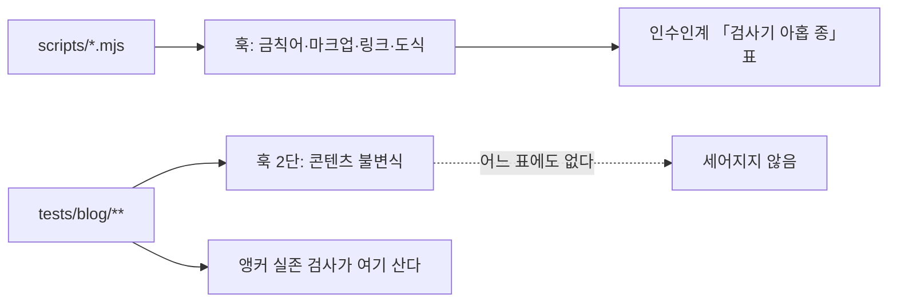

# Changelog

이 저장소의 사용자에게 영향이 큰 변경만 날짜별로 간단히 적습니다. (커밋 해시는 선택적으로 추적합니다.)

## 지난 기록

본체에는 최신 3개 절만 둔다. 그 아래는 월별 파일로 옮겼다.

| 월 | 절 수 | 날짜 |
| --- | ---: | --- |
| [`2026-09`](docs/changelog/2026-09.md) | 17 | 2026-09-04 · 2026-09-03 · 2026-09-03 · 2026-09-03 · 2026-09-03 · 2026-09-03 · 2026-09-02 · 2026-09-02 · 2026-09-02 · 2026-09-02 · 2026-09-02 · 2026-09-02 · 2026-09-02 · 2026-09-02 · 2026-09-01 · 2026-09-01 · 2026-09-01 |
| [`2026-08`](docs/changelog/2026-08.md) | 36 | 2026-08-31 · 2026-08-31 · 2026-08-30 · 2026-08-30 · 2026-08-30 · 2026-08-30 · 2026-08-29 · 2026-08-29 · 2026-08-29 · 2026-08-19 · 2026-08-18 · 2026-08-18 · 2026-08-18 · 2026-08-18 · 2026-08-18 · 2026-08-18 · 2026-08-18 · 2026-08-17 · 2026-08-17 · 2026-08-17 · 2026-08-17 · 2026-08-16 · 2026-08-16 · 2026-08-16 · 2026-08-13 · 2026-08-13 · 2026-08-12 · 2026-08-11 · 2026-08-11 · 2026-08-09 · 2026-08-09 · 2026-08-08 · 2026-08-08 · 2026-08-08 · 2026-08-08 · 2026-08-07 |
| [`2026-07`](docs/changelog/2026-07.md) | 5 | 2026-07-21 · 2026-07-08 · 2026-07-07 · 2026-07-06 · 2026-07-05 |
| [`2026-06`](docs/changelog/2026-06.md) | 1 | 2026-06-02 |
| [`2026-05`](docs/changelog/2026-05.md) | 1 | 2026-05-01 |

---

## 2026-09-04 — **인수인계 문서 자체는 검증 대상이 아니었다.** 낡은 자기 검사 건수 다섯 자리를 실측으로 고쳤고, 「남은 사각지대」의 첫 후보는 **이미 닫혀 있었다**

> 이 리포는 「증명하기 전에는 0을 믿지 마라」를 아홉 검사기에 새겨 왔다. 그런데 그 규칙이
> **인수인계 문서에는 한 번도 적용되지 않았다.** 이번 세션은 코드를 고치지 않고 문서에 적힌
> 수치를 전부 실측과 대조했는데, 자기 검사 건수 **다섯 자리**가 낡아 있었고 「남은 사각지대」의
> 첫 후보인 **앵커 유효성은 이미 훅과 CI 양쪽에서 돌고 있었다.**
>
> ⇒ 🔴 낡은 문서는 틀린 값을 주는 데 그치지 않는다. **이미 있는 것을 다시 만들게 한다.**

### 자기 검사 건수 다섯 자리가 낡아 있었다

아홉 검사기의 `--self-test` 를 **전부 돌려** 문서의 값과 대조했다. 넷이 정확히 일치했으므로
계수 방식은 문서의 관례와 같고, 어긋난 자리는 값이 낡은 것이다.

| 어디 | 적혀 있던 값 | 실측 |
| --- | ---: | ---: |
| `README.md:83` `check-forbidden:verify` | 15건 | **63** |
| `HANDOFF.md` 표 `check-forbidden` | 15건 | **63** |
| `HANDOFF.md` 표 `dup-scan` | 7건 | **12** |
| `HANDOFF.md` 표 `source-overlap` | 28건 | **42** |
| `CLAUDE.md:51` 검사기 개수 | 여덟 | **아홉** |
| `check-markup` · `fix-markup` · `check-links` · `check-mermaid` | 24 · 19 · 23 · 26 | ✅ 동일 |
| 뮤턴트 수 | 50개 | ✅ 50 |

🔴 **직전 세션은 `check-forbidden` 하나만 낡았다고 기록했지만 실제로는 셋이었다.** 한 자리를
「자동 대조가 안 된다」는 이유로 남기면, **같은 이유로 낡은 옆자리는 아예 세어 보지 않게 된다.**

### 어긋난 셋은 전부 「검사기가 스스로 세지 않는 것」이었다

| 검사기 | 자기 검사 건수를 어떻게 읽나 |
| --- | --- |
| `check-markup` · `check-links` · `check-mermaid` · `source-overlap` | 검사기가 `24/24` 형태로 **스스로 출력한다** |
| `check-forbidden` | 형식이 달라 `통과 63 / 실패 0` 으로 낸다 |
| 🔴 `dup-scan` · `fix-markup` | **요약 숫자를 내지 않는다.** `PASS` 줄을 세야 한다 |

계수 명령을 하나로 고정했다.

```
node scripts/<검사기>.mjs --self-test 2>&1 | grep -cE '(PASS|✅)'
```

### 🔴 「남은 사각지대」의 첫 후보가 이미 닫혀 있었다

`HANDOFF.md` 는 **앵커 유효성**을 다음 후보 첫 줄에 두고 「`check-links` 는 앵커를 분리만 하고
판정하지 않는다」고 적어 두었다. 사실이지만 결론이 틀렸다. 판정은 **다른 곳**에서 이미 하고 있다.

| 무엇 | 어디에 | 상태 |
| --- | --- | --- |
| 도착지 집합 | `lib/toc.ts:75` `headingIds` | 렌더러와 **같은** `github-slugger` 를 쓴다 |
| 앵커 추출 | `tests/blog/content/links.test.ts` `anchorLinks` | `%`-인코딩을 디코드한다 |
| 판정 | 같은 파일 `brokenAnchors` | 대상 편이 없는 경우는 **일부러 제외**한다 |
| 자기검사 · 본 검사 | `describe` 「앵커 실존」 | ✅ 둘 다 통과 |
| 「0건 검사」 가드 | `expect(seen.length).toBeGreaterThan(0)` | 하나도 못 뽑으면 실패시킨다 |
| 게이트 | 훅 2단 · CI | ✅ **양쪽에서 돈다** |

테스트와 **동일한 정규식**으로 직접 세니 발행본 184개에서 앵커 링크 **28개**로, 목록에 적힌 수와
같았다. 링크가 0개로 잡혀 검사가 헛도는 상태가 아니다.

### 원인 — 목록이 검사기의 절반만 세고 있었다



훅 2단의 이름이 **「콘텐츠 불변식」** 이고 그 실체가 `npx vitest run tests/blog` 다. 이름만으로는
Vitest 를 가리키는지 알 수 없어, 이미 돌고 있던 검사가 **세 세션 동안 「없는 것」으로 세어졌다.**

`check-links.mjs` 가 앵커를 버리는 것도 결함이 아니라 역할 분담이다. 앵커 판정은 렌더러와 같은
슬러거를 불러야 하는데 그것은 TypeScript 부품이라, **구조적으로 `.mjs` 검사기에서는 살 수 없다.**

⇒ `HANDOFF.md` 에 「Vitest 가 보는 것」 절을 새로 두고, 검사기 표 제목을 「`scripts/` 의 검사기
아홉 종」으로 바꿔 **절반임을 제목이 말하게** 했다. `CLAUDE.md` 의 게이트 절에도 같은 사실을 적었다.

### 남은 사각지대를 전수 재검증했다

넷 중 하나만 낡았고 셋은 유효하다.

| 후보 | 기재 | 실측 | 판정 |
| --- | --- | --- | --- |
| 앵커 유효성 | 28개 · 「판정하지 않는다」 | 28개 · **이미 판정 중** | 🔴 낡음 |
| 도식의 의미 | 649개 | 발행본 544 + 문서 105 = **649** | ✅ 유효 |
| 분량 하한 SOFT | 5편 | 파일명까지 일치 | ✅ 유효 |
| 새 배치 | — | — | ✅ 유효 |

### 검증

| 무엇 | 결과 |
| --- | --- |
| 문서 6단 · 두 회차 | ✅ 파일 54개 · 마크업 0회 · 링크 0곳 · 도식 105개 **판정 도달 105개** · 0곳 |
| `npx vitest run tests/blog` | ✅ **54/54** |
| 발행본 도식 스캔 | ✅ 184개 파일 · 도식 544개 · 판정 도달 544개 · 0곳 |
| 정본 줄바꿈 | ✅ 세 문서 전부 LF |
| CI · 배포 | ✅ 두 회차 모두 `build` · `deploy` **success** |

커밋 `d9328e4`(건수 정정) · `b56fa57`(검사기의 자리를 문서에 남김).

---

## 2026-09-04 — **마지막 사각지대를 닫았다.** 도식 검사기를 두어 Mermaid **649개**를 전량 판정했고, 「거짓 0」의 새로운 형태와 **헛도는 자기 검사**를 하나 잡았다

> 직전 세션이 「남은 사각지대 — 다음 후보」의 첫 줄에 **Mermaid 문법 검사**를 적고
> 「마지막 사각지대」라고 남겼다. 이번 세션이 그것을 닫았다. `check-mermaid` 를 만들어
> 훅과 CI 에 걸었고, 발행본 544 · 문서 105 **합계 649개**가 전량 판정에 도달해 위반 0 이다.
>
> ⇒ 🔴 그 과정에서 **거짓 0 의 세 번째 형태**를 만났다. 이전 둘은 「대상을 조용히 버린다」와
> 「없는 위반을 만든다」였는데, 이번 것은 **판정에 닿지도 못한 것을 통과로 센다** 였다.

### 검사기가 96%를 보지 않고 「위반 0」을 냈다

`mermaid` 는 브라우저용이라 Node 에는 없는 DOM 을 쓴다. DOM 없이 `parse()` 를 부르면
파싱에 닿기도 전에 `DOMPurify.addHook is not a function` 으로 죽는다.

| 무엇을 | 블록 | 판정 도달 | 통과 | 문법 오류 | **환경 오류** |
| --- | ---: | ---: | ---: | ---: | ---: |
| DOM 없이 | 648 | 27 | 27 | 0 | **621** |
| `jsdom` 을 세운 뒤 | 649 | **649** | 649 | 0 | 0 |

윗줄의 「문법 오류 0」은 결론이 아니다. **96%가 파서에 도달하지 못했다.** 통과한 27개는
sanitize 경로를 타지 않는 `sequenceDiagram` 계열이었다.

그래서 오류를 둘로 가른다. 갈래를 정하는 방향이 중요하다.

```
 parse() 실패
   │
   ├─ Error          → 파서가 낸 것    → 위반         → 종료 코드 1
   └─ TypeError      → 환경이 깨진 것  → 판정 미도달  → 종료 코드 2
      ReferenceError
```

🔴 **환경 쪽을 열거하고 나머지를 위반으로 둔다.** 반대로 두면 — 위반의 모양을 열거하고
나머지를 환경으로 두면 — mermaid 가 새 오류 형태를 도입한 날 **진짜 위반이 「환경 문제」로
분류되어 조용히 사라진다.** 위반을 놓치는 쪽보다 검사기가 시끄럽게 죽는 쪽이 낫다.

분류는 2차 방어다. 1차는 스캔 앞에 두는 **카나리**로, 반드시 그려져야 할 도식 하나를 먼저
파싱한다. 그것이 실패하면 스캔을 시작하지 않는다.

### 🔴 자기 검사 21/21 안에서 한 케이스가 아무것도 지키지 않고 있었다

뮤테이션이 잡았다. `core.quotePath` 를 되돌리는 뮤턴트 **CM10 만 생존**했다.

| 케이스 | ㉑ 「수집한 경로가 전부 `.md` 로 끝난다」 |
| --- | --- |
| 무엇을 지키려 했나 | quotePath 가 한글 경로를 따옴표로 감싸 대상에서 빠지는 것 |
| **왜 헛돌았나** | 감싸인 경로는 **있지도 않은 이름**이 되어 `existsSync` 에서 걸러진다. 남은 것은 전부 `.md` 로 끝나므로 케이스가 통과한다 |
| 실측 | 정상 54개(비-ASCII 4개) 대 뮤턴트 **50개(비-ASCII 0개)** |
| 고친 방법 | **대조할 비-ASCII 경로가 실제로 있는지를 먼저 센다.** 없으면 지키는 것이 없으므로 FAIL |

일반화하면 이렇다 — **필터를 통과한 집합으로 그 필터를 검사할 수 없다.** 걸러진 것은
집합에 없고, 남은 것은 정의상 조건을 만족한다. `check-links` 의 ㉓ 은 이미 이 조건을
갖고 있었는데, 그것을 참고하고도 옮겨 오지 못했다.

고친 뒤 뮤턴트를 격리 적용해 **실제로 FAIL 하는지**를 확인했다. 통과만 보고는 케이스가
헛도는지 알 수 없다.

### 무엇이 서 있나

| 자리 | 이전 | 지금 |
| --- | --- | --- |
| `content/blog/*.md` 커밋 | 7단 | **9단** (도식 증명 · 도식 스캔 추가) |
| 그 밖의 `*.md` 커밋 | 마크업 2단 + 링크 2단 | **+ 도식 2단** |
| CI (`deploy.yml`) | 19스텝 | **22스텝** |
| 뮤턴트 | 38개 | **50개** · 잡힘 50 · 생존 0 |

### 문서가 낡아 있던 자리

`CLAUDE.md` 는 뮤턴트를 **16개**, `README.md` 는 **38개**라고 적고 있었다. 실제로는 38개였고
이번에 48개가 됐다. 세는 사람이 없으면 숫자는 반드시 낡는다 — 둘 다 48개로 맞췄다.

### 실측

| 항목 | 값 |
| --- | --- |
| `check-mermaid:verify` | **26/26** · 2.1초 |
| `check-mermaid` (발행본) | 184파일 · 도식 544 · 판정 도달 544 · 위반 0 · 4.3초 |
| `check-mermaid:docs` (문서) | 54파일 · 도식 105 · 판정 도달 105 · 위반 0 · 3.2초 |
| `npm run mutate` | 50/50 · 생존 0 · 치환실패 0 |
| 빌드 · 산출물 금칙어 · 개수 | 통과 · HARD 0 · 184편 4곳 일치 |

### 🔴 푸시했더니 CI 가 죽었다 — 로컬 검증 전체가 다른 런타임에서 돌고 있었다

위 실측은 전부 로컬(Node 24)의 값이다. 푸시하자 CI 가 **`Prove mermaid checker` 에서
종료 코드 2** 로 죽었다.

| 무엇을 | 로컬 (Node 24) | CI (Node 20) |
| --- | --- | --- |
| `jsdom@30.0.1` 설치 | 성공 · 경고 없음 | — |
| `check-mermaid:verify` | 21/21 | 🔴 `webidl.util.markAsUncloneable is not a function` |
| 종료 코드 | 0 | **2** |

`jsdom@30` 의 요구는 `^22.22.2 || ^24.15.0 || >=26.0.0` 이라 Node 20 이 어느 대역에도 없다.
🔴 **`npm install` 은 이 값을 강제하지 않는다** — `engine-strict` 를 켜지 않는 한 경고조차
나오지 않는다.

**검사기 자체는 설계대로 동작했다.** 환경이 깨졌을 때 조용히 「위반 0」을 내지 않고 종료
코드 2 로 죽었다. 문제는 검사기가 아니라 **로컬 검증이 CI 와 다른 런타임에서 돌고 있었다는
사실이 어느 로그에도 나오지 않은 것**이다.

```
 로컬 Node 24  →  jsdom 30 설치 · 21/21 · exit 0   →  「통과했다」
 CI   Node 20  →  jsdom 30 로드 실패 · exit 2      →  배포 실패
                 ↑
                 이 차이는 어느 로그에도 나오지 않는다
```

**대응 셋.**

| # | 무엇 |
| ---: | --- |
| 1 | `jsdom` 을 **26.1.0**(`>=18`)으로 낮췄다. 검사기 전용이라 최신일 이유가 없다 |
| 2 | 🔴 자기 검사 **㉖** — `node_modules/jsdom/package.json` 의 `engines.node` 와 `.github/workflows/deploy.yml` 의 `node-version` 을 실제로 읽어 맞춘다. **로컬에서 이 사고를 잡는 유일한 자리다** |
| 3 | 뮤턴트 `CM11`·`CM12`. `engines` 를 jsdom 30 의 값으로 되돌려 ㉖ 이 실제로 FAIL 하는 것을 확인했다 (25/26 · 종료 코드 1) |

⇒ 도구 함정 **46번**. 이 문서의 다른 함정 대부분은 **한 환경 안에서** 도구가 거짓을 말하는
경우인데, 이번 것은 **두 환경이 다르다는 사실 자체가 숨었다.** 어느 쪽도 거짓말하지 않았고
결과만 갈렸다.


커밋 `626a4ad` · `ac2fea7` · CI 대응 커밋.

---

## 2026-09-04 — 문서를 지키는 **게이트를 걸고** 링크 검사기를 새로 두었다 · 검사기가 **없는 위반을 만들어 내는** 유형을 처음 겪었다

> 직전 세션이 리포 문서의 렌더 실패 250회를 비워 **0회**를 만들고, 「훅·CI 에 걸 수 있는
> 유일한 시점」이라고 남겼다. 이번 세션이 그것을 걸었다. 이어서 남은 사각지대 가운데
> **링크**를 닫았고, 문서에 깨진 채 남아 있던 **42곳**을 비웠다.
>
> ⇒ 🔴 그 과정에서 **거짓 양성**을 처음 만났다. 기존 함정 43건이 거의 전부 「있는 것을
> 못 찾는」 쪽인데, 이번 것은 **없는 위반 31건을 만들어 냈다.**

### 게이트가 서기 전과 후

```
 커밋 경로            이전                     지금
 ───────────────────────────────────────────────────────────────
 content/blog/*.md →  [5단]        → 통과   →  [7단]  (링크 2단 추가)
 docs/**.md        →  (무검사)     → 통과   →  [마크업 2단 + 링크 2단]
 코드만            →  (즉시 통과)          →  그대로 (출력 0줄)

 CI (deploy.yml)   →  마크업·링크 없음      →  19스텝 (마크업 3 + 링크 3)
```

**훅만 있는 검사는 지켜지지 않는 검사다.** `--no-verify` 로 지나갈 수 있고 웹 UI 편집은
애초에 훅을 타지 않는다. 마크업 검사가 훅에만 있고 CI 에는 **아예 없던** 것이 그 상태였다.

### 검사기가 대상을 **조용히 버리고 있었다**

문서 게이트의 대상 집합을 정하다가 드러났다. 54개를 넘겼는데 50개만 스캔하고 **종료 코드 0**
이 나왔다.

| 무엇을 | 결과 |
| --- | ---: |
| `git ls-files '*.md'` | 54줄 · 그중 **4줄이 `.md` 로 끝나지 않음** |
| `git -c core.quotePath=false ls-files '*.md'` | 54줄 · 전부 `.md` 로 끝남 |
| 앞의 것을 넘긴 스캔 | **50개** |

`core.quotePath` 기본값이 한글 경로를 `"pages/…\355\227\210….md"` 로 감싸 끝이 `.md` 가
아니게 되고, 검사기는 `.md` 아닌 인자를 `continue` 로 건너뛰고 있었다.

🔴 **「대상 없음」 가드는 하나도 못 받았을 때만 발동한다.** 「받은 것 중 일부를 버렸다」는
통과하며, 부른 쪽은 전량을 검사했다고 믿는다. **일부 누락은 대상 없음보다 다루기 어렵다** —
숫자가 그럴듯하게 나오기 때문이다.

⇒ 대상이 되지 못한 경로가 있으면 **종료 코드 2**. 수집은 검사기 안으로 옮겨
`core.quotePath` 를 끄는 자리를 한 곳으로 모았다.

### 링크 검사기 — 판정을 파서에 맡긴 셋째 이유

규칙은 셋이다.

| # | 무엇을 | 왜 |
| --- | --- | --- |
| R1 | 발행본의 `/blog/<카테고리>/<슬러그>/` 가 실제 편이나 카테고리를 가리키는가 | 편을 지우거나 슬러그를 바꾸면 **다른 편**이 깨진다 |
| R2 | 발행본의 상대 `.md` 는 **언제나** 위반 | `components/markdown.tsx` 가 내부 링크를 `<Link href>` 로 그대로 내보내는데 정적 export 에 `.md` 경로가 없다 |
| R3 | 문서의 상대 `.md` 가 실제로 있는가 | 기준은 리포 루트가 아니라 **그 문서가 놓인 디렉터리**다 — 실측 22곳이 루트 기준으로 적혀 있었다 |

### 🔴 검사기가 **없는 문제를 만들어 냈다**

실태를 파악하려고 정규식으로 짠 일회성 스크립트가 두 번 연달아 틀린 위반을 보고했다.

| 보고 | 실제 |
| --- | --- |
| 발행본 2곳이 없는 `.md` 를 가리킨다 | ```markdown 코드 블록 **안의 예시**였다 |
| 발행본 29곳이 없는 편을 가리킨다 | 앵커가 붙어 있었을 뿐 편은 전부 있었다 |
| 문서 44곳이 깨졌다 | 파서로 세면 **42곳** |

최종 실측은 **발행본 1,612개 링크 전부 온전 · 문서 42곳 깨짐**이었다. 처음 보고한
「발행본이 404 를 낸다」는 통째로 사실이 아니었고, 그대로 믿었다면 멀쩡한 편을 손댔을 것이다.

🔴 **거짓 양성은 스스로 검증되는 것처럼 보인다.** 위반 목록이 파일명과 줄 번호까지 갖추고
나오므로 「검사기가 일했다」는 인상을 준다. **0건은 의심받지만 42건은 의심받지 않는다.**

⇒ **위반이 나왔을 때도 검사기를 의심하라.** 몇 건을 열어 확인한 뒤에 고치러 간다.

### 문서 42곳의 교정

| 유형 | 개수 | 무엇을 |
| --- | ---: | --- |
| A — 리포 루트 기준으로 적혔고 대상이 존재 | 22 | 상대 경로로 고쳐 썼다 |
| B — 대상이 리포 밖이라 고칠 수 없음 | 20 | 링크만 벗기고 글자는 남겼다 |

34줄만 바뀌었다(한 줄에 여러 곳이 있었다). 바이트가 아니라 **링크 구문만** 건드렸으므로
분량 예산과 무관하다.

### Added

- 🔴 **링크 검사기** `scripts/check-links.mjs` — 규칙 셋, 자기 검사 23건 (`56e8ebd`)
- `npm run check-markup:docs` · `check-links` · `check-links:docs` · `check-links:verify` (`c686c9f` · `56e8ebd`)
- 훅에 문서 갈래를 신설하고 발행본 갈래를 **5단 → 7단**으로 (`c686c9f` · `56e8ebd`)
- CI 에 마크업 3단과 링크 3단 — **19스텝** (`c686c9f` · `56e8ebd`)
- 뮤턴트 `M6`·`M7`·`M8`·`CL1`~`CL7` — 총 **28개 → 38개** (`c686c9f` · `56e8ebd`)
- 도구 함정 **43번**(`git ls-files` 의 따옴표) · **44번**(정규식 링크 검사의 거짓 양성)

### Changed

- 검사기가 `--files` 로 받은 경로를 **조용히 버리지 않는다** — 대상이 되지 못한 것이 있으면 종료 코드 2 (`c686c9f`)
- 대상 수집을 검사기 안으로 옮겨 `core.quotePath` 를 끄는 자리를 한 곳으로 (`c686c9f` · `56e8ebd`)
- 뮤턴트 ID 충돌 해소 — `check-links` 쪽을 `CL1`~`CL7` 로 (`56e8ebd`)

### Fixed

- 문서의 깨진 링크 **42곳** — 유형 A 22곳 경로 교정 · 유형 B 20곳 링크 해제 (`56e8ebd`)
- 인덱스에만 있고 작업 트리에 없는 파일에서 **ENOENT 스택으로 죽던 것** (`c686c9f`)
- `CLAUDE.md` 의 「도구 함정 41건 809줄」이 실제와 어긋나 있던 것 → **44건 986줄** (`c686c9f` · `56e8ebd`)
- README 의 「자체 검사 19건」 → 24건, 「알려진 결함 28개」 → 38개

### 검증

| 무엇을 | 결과 |
| --- | --- |
| `check-markup` 자기 검사 | **24/24** |
| `check-links` 자기 검사 | **23/23** |
| 뮤테이션 | **38개 · 잡힘 38 · 생존 0 · 치환실패 0** |
| 발행본 | 마크업 0회 · 링크 0곳 (1,612개 검사) |
| 리포 문서 | 마크업 0회 · 링크 0곳 (54개 파일) |
| `tsc` · `vitest` | 0 · **54/54** |
| CI | 두 회차 모두 **success** · 배포 완료 |

---
