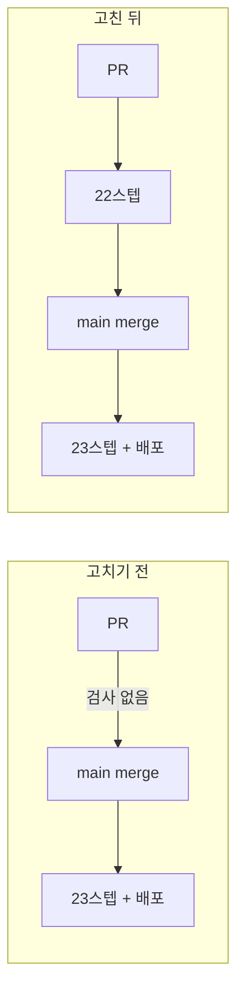

# Changelog

이 저장소의 사용자에게 영향이 큰 변경만 날짜별로 간단히 적습니다. (커밋 해시는 선택적으로 추적합니다.)

## 지난 기록

본체에는 최신 3개 절만 둔다. 그 아래는 월별 파일로 옮겼다.

| 월 | 절 수 | 날짜 |
| --- | ---: | --- |
| [`2026-09`](docs/changelog/2026-09.md) | 21 | 2026-09-05 · 2026-09-04 · 2026-09-04 · 2026-09-04 · 2026-09-04 · 2026-09-03 · 2026-09-03 · 2026-09-03 · 2026-09-03 · 2026-09-03 · 2026-09-02 · 2026-09-02 · 2026-09-02 · 2026-09-02 · 2026-09-02 · 2026-09-02 · 2026-09-02 · 2026-09-02 · 2026-09-01 · 2026-09-01 · 2026-09-01 |
| [`2026-08`](docs/changelog/2026-08.md) | 36 | 2026-08-31 · 2026-08-31 · 2026-08-30 · 2026-08-30 · 2026-08-30 · 2026-08-30 · 2026-08-29 · 2026-08-29 · 2026-08-29 · 2026-08-19 · 2026-08-18 · 2026-08-18 · 2026-08-18 · 2026-08-18 · 2026-08-18 · 2026-08-18 · 2026-08-18 · 2026-08-17 · 2026-08-17 · 2026-08-17 · 2026-08-17 · 2026-08-16 · 2026-08-16 · 2026-08-16 · 2026-08-13 · 2026-08-13 · 2026-08-12 · 2026-08-11 · 2026-08-11 · 2026-08-09 · 2026-08-09 · 2026-08-08 · 2026-08-08 · 2026-08-08 · 2026-08-08 · 2026-08-07 |
| [`2026-07`](docs/changelog/2026-07.md) | 5 | 2026-07-21 · 2026-07-08 · 2026-07-07 · 2026-07-06 · 2026-07-05 |
| [`2026-06`](docs/changelog/2026-06.md) | 1 | 2026-06-02 |
| [`2026-05`](docs/changelog/2026-05.md) | 1 | 2026-05-01 |

---

## 2026-09-05 — **아무도 세지 않은 수가 세 번 드러났다.** 지역 그래프 위젯을 만들어 배포했다 (PR [#11](https://github.com/withwooyong/withwooyong.github.io/pull/11))

> 발행본 184편 사이에 링크가 **921쌍** 있었지만, 독자가 그 연결을 볼 방법은 본문 안의
> 문장뿐이었다. 본문 사이드바 하단에 현재 편을 중심으로 한 링크 그래프를 그렸다.
>
> ⇒ 🔴 **초록이 세 번 부족했다.** 로컬 검사 열 개가 CI 를 통과시키지 못했고, 뮤턴트 하나가
> 검사 열두 개를 그대로 지나갔으며, 계획서가 「+262초」라고 적은 자리에 **비교할 기준선이
> 없었다.** 셋 다 「무엇을 세지 않았는가」가 원인이다.

### 무엇을 만들었나

| 자리 | 무엇 |
| --- | --- |
| `lib/blog/graph.ts` | 링크 추출과 지역 그래프 조립. **「무엇이 편을 잇는 링크인가」의 정본**이며 판정을 파서가 한다 |
| `lib/blog/graph-layout.ts` | 좌표 계산. **난수를 쓰지 않아** 같은 입력이 같은 좌표를 내고, 서버 렌더와 클라이언트 렌더가 어긋나지 않는다 |
| `components/blog/local-graph.tsx` | 연결선은 SVG, 노드는 그 위에 절대 배치한 HTML 앵커. 로더를 import 하지 않아 `node:fs` 가 클라이언트 번들에 들어가지 않는다 |
| `tests/blog/content/graph.test.ts` | 발행본 184편 전량 불변식 5케이스 |

새 런타임 의존성을 들이지 않았고, 이웃은 12까지 담고 초과분은 `+N` 으로 보여 준다.
연결선에 **이웃끼리의 선도** 담는데, 중심에서 뻗은 선만 담으면 배치가 언제나 바퀴살이 되어
힘 계산이 무의미해지기 때문이다.

### ① 로컬 초록 열 개가 CI 를 통과시키지 못했다

푸시 전에 타입 · 린트 · 테스트 · 빌드 · 금칙어 · 개수 · 검색 인덱스까지 **열 개 명령을 각각
단독으로 돌려 전부 종료 코드 0** 을 받았다. 그런데 첫 CI 의 `build` job 이 55초에 죽었다.

| 케이스 | CI 실측 | 판정 |
| --- | ---: | --- |
| 내부 링크의 대상이 전부 실재한다 | **5,173 ms** | 타임아웃 5,000 ms 초과 → 실패 |
| 들어오는 링크가 없는 편이 없다 | 3,603 ms | 통과했으나 경계에 붙어 있다 |
| 모든 카테고리가 바깥과 양방향으로 이어져 있다 | 3,163 ms | 같음 |

원인은 케이스마다 추출 함수를 불러 **184편을 다시 판** 것이다. 정규식일 때는 그래도 됐지만
파서로 옮긴 뒤로는 1회가 실측 1.5초다. **로컬은 개발 머신이 러너보다 빨라 통과했다.**

| 고른 것 | 왜 |
| --- | --- |
| 추출 결과를 **파일 수준에서 한 번만** 만든다 | vitest 의 타임아웃은 각 `it` 에만 걸리고 파일 수준 초기화에는 걸리지 않는다. `tests` 시간이 **17 ms** 가 됐다 |
| 타임아웃을 늘리지 않는다 | 증상만 가리고 다음 케이스가 같은 벽에 부딪힌다 |
| 이미 있는 `buildLinkIndex` 를 재사용하지 않는다 | 그것은 실재하지 않는 대상을 **이미 버린다.** 죽은 링크를 찾는 케이스가 그것을 쓰면 언제나 통과한다 |
| 캐시를 함수 안에 숨기지 않는다 | 자기검사 케이스가 **키는 같고 본문만 다른** 가짜 편을 넘긴다. 키로 조회하면 그 케이스가 헛돈다 |
| 고친 뒤 캐시 경로에 죽은 링크를 **주입해 FAIL 을 확인한다** | 빨라진 것과 여전히 잡는 것은 다른 말이다 |

⇒ 🔴 **판정 방식을 바꾸는 리팩터링은 실행 시간도 바꾼다.** 리뷰와 검증이 이것을 놓친 이유는
분명하다 — 성능을 물을 때 **빌드 시간만 묻고 테스트 실행 시간은 아무도 세지 않았다.**

### ② 뮤턴트 G7 이 검사 열두 개를 그대로 지나갔다

좌표를 뷰박스 안으로 접는 식에서 **가로 축소식을 통째로 지웠는데** `graph-layout.test.ts`
12케이스가 전부 통과했다. 기본 뷰박스가 가로 200 · 세로 180 이라 **세로 한계가 언제나 먼저
걸리기** 때문이다.

뮤턴트를 지우는 대신 「좌표가 뷰박스 안에 있다」 케이스에 **가로가 좁은 뷰박스 두 종**을 더했고,
뮤턴트를 손으로 되살려 그 케이스가 실제로 FAIL 하는 것까지 확인했다. 케이스 수는 12 그대로다.

⇒ **검사가 도는 것과 검사가 무언가를 지키는 것은 다른 말이고, 그 차이는 뮤테이션에서만 드러난다.**

### ③ 증분은 적혀 있었는데 기준선이 없었다

계획서는 「링크 지형을 빌드당 한 번만 만들지 않으면 빌드가 **약 262초 늘어난다**」고 적었다.
그런데 **평소 빌드 시간을 절대값으로 남긴 문서가 리포에 없었다.** 그래서 이번 검증은
「55.9초는 262초보다 훨씬 작다」는 정황으로만 판단할 수 있었고, 직전 커밋과의 직접 대조는
빌드를 한 번 더 돌려야 해서 하지 못했다.

⇒ **증분만 적고 기준선을 안 적으면 다음 세션이 같은 판단을 다시 한다.** 55.9초를
`HANDOFF.md` 에 기준선으로 남겼다.

### 화면은 열어서 셌다

테스트 초록과 배포 성공 로그는 화면이 맞다는 근거가 되지 못하므로 프로덕션에서 직접 쟀다.

| 확인 | 실측 |
| --- | --- |
| 이웃이 가장 많은 편 | 점 12개 · 캡션 「12편과 이어져 있다 (+18)」 · 연결선 35개 |
| 이웃이 가장 적은 편 | 중심 포함 3점 · 최소 거리 **70.5 px** (노드 지름 12 px) |
| 어두운 모드 대비 | 이웃 3.61 · 연결선 3.51 · 중심 7.93 (비텍스트 기준 3:1) |
| 낮은 화면 | 높이 720 px 미만이면 `display: none`, 목차는 유지 |
| 프로덕션 | 위젯 224×261 · 노드 간 최소 47.8 px · 겹침 0 |

검증 도중 이 환경의 함정을 하나 만났다. **백그라운드 탭에서는 Chrome 이 레이아웃 계산을
미룬다.** 위젯이 정상인데도 크기가 0×0 으로 나오고 호버·포커스가 죽은 것처럼 보여
**없는 결함을 두 번 쫓았다.** 스크린샷을 찍어 렌더를 강제한 뒤 재면 정상값이 나온다.

### 머지 방식

`gh pr merge` 의 기본값은 squash 지만 **이 리포는 PR #5~#11 에서 squash 를 쓴 적이 없다.**
커밋 12개가 태스크 단위로 사유를 담고 있어 merge 커밋으로 병합했다.

### 커밋

| 해시 | 무엇 |
| --- | --- |
| `e492613` | PR [#11](https://github.com/withwooyong/withwooyong.github.io/pull/11) merge — 배포 run `33976481159` success |
| `3f37672` | 수정: 링크 검사가 발행본을 케이스마다 다시 파싱하지 않게 한다 |
| `4029095` | 수정: 개발 서버에서는 링크 지형을 캐시하지 않는다 |
| `69b7221` | 검사: 그래프 뮤턴트 7개를 더하고 늘어난 검사 수치를 문서에 반영한다 |
| `f943d2b` | 기능: 블로그 사이드바 하단에 지역 그래프 위젯을 붙인다 |
| `ed087d8` | 검사: 발행본 184편 전량에 지역 그래프 불변식을 건다 |
| `ce4656b` | 수정: 링크 추출을 정규식에서 파서로 옮겨 판정의 정본을 하나로 모은다 |
| `c6f4ba1` | 기능: 난수를 쓰지 않는 힘 시뮬레이션으로 그래프 좌표를 계산한다 |
| `8f57400` | 기능: 편 사이 링크를 뽑아 지역 그래프를 만드는 모듈을 추가한다 |

---

## 2026-09-05 — **넷을 한 덩어리로 다루면 안 됐다.** 분량 하한 SOFT 를 편별로 판정해 하나는 보강하고 셋은 정당하다고 기록했다

> 분량 하한에 미달한 네 편이 두 세션째 「미해결」로 실려 있었다. 부족분이 1,865~5,164 B 라
> 같은 작업이 아닐 것 같아 **절 수와 절 두께를 실측했더니** 짧은 이유가 편마다 달랐다.
>
> ⇒ 🔴 **가장 짧은 편이 가장 부실한 편은 아니었다.** `rag-knowledge-map` 은 넷 중 절이
> 가장 두꺼웠고, 짧은 이유는 22편을 가리키는 **지도 문서**라는 형식 때문이었다.

### 판정 — 짧은 이유가 넷 다 달랐다

| 편 | 절 수 | 평균 | 왜 짧은가 | 피인용 | 판정 |
| --- | ---: | ---: | --- | ---: | --- |
| `elasticsearch-architecture` | 11 | **1,040 B** | 주제는 넓은데 **각 절이 얇다** (다섯 절이 700 B 미만) | 6회 | ✅ **보강** |
| `search-system-overview` | 7 | 1,343 B | 카테고리 **개괄**이라 넓고 얕다 | 0회 | ⬜ 정당 |
| `search-engineering-in-practice` | 5 | 1,627 B | 절 수가 적다. **경력 서술이라 소재를 늘리면 금칙어에 걸린다** | 2회 | ⬜ 정당 |
| `rag-knowledge-map` | 4 | **2,595 B** | **절이 가장 두껍다.** 「지도」라 4절로 완결되며 발신 링크가 22편을 가리킨다 | 0회 | ⬜ 정당 |

피인용·발신 링크를 세지 않았다면 허브 문서 둘을 「부실한 편」으로 오인했을 것이다.
**`rag-knowledge-map` 은 피인용 0 · 발신 22 이고, 그 비대칭이 곧 지도라는 증거다.**

### 병합도 답이 아니었다

하한 주석은 「이보다 작으면 **인접 편과 병합을 검토한다**」이므로 세 조합을 실측했다.

| 조합 | 합계 | 왜 안 되나 |
| --- | ---: | --- |
| `elasticsearch-architecture` + `elasticsearch-operations` | 27,920 B | 카테고리 최대가 되고 **피인용 6회를 전부 고쳐야 한다** |
| `search-system-overview` + `search-engineering-in-practice` | 17,538 B | 개괄과 경력 서술이라 **성격이 다르다** |
| `rag-knowledge-map` + 무엇이든 | — | 22편을 가리키는 허브라 **지도가 사라진다** |

⇒ 판정을 `HANDOFF.md` 에 남겨 **다시 작업 목록에 오르지 않게 했다.** 같은 세션 전반부에
README 의 `:verify` 6개가 「오탐인데 두 세션 동안 미해결 작업으로 실려 있던」 것을 겪었기 때문이다.

### 보강한 편에서 채운 것 — 본문이 스스로 만든 빈 칸 셋

| # | 빈 칸 | 무엇이 문제였나 |
| ---: | --- | --- |
| ① | `Coordinating Node` 가 **정의 없이 등장한다** | 클러스터 계층 절의 도식에도 용어 정리 표에도 없는데, Query then Fetch 절에서 「코디네이터가 전 샤드에 broadcast」로 일한다 |
| ② | 「샤드 개수를 못 바꾼다」고 못 박고 **「몇 개로 잡나」가 없다** | 도입부가 이 글의 독자를 「성능·용량 설계를 해야 하는 엔지니어」로 **선언했다.** 선언한 독자가 바로 부딪히는 질문이다 |
| ③ | custom routing 의 **대가가 없다** | 「같은 값을 한 샤드에 모은다」고만 하고 그 결과인 샤드 편중을 말하지 않는다. 459 B 로 이 편에서 가장 얇은 절이었다 |

②가 가장 강한 빈 칸이다. **글이 스스로 독자를 선언하면 그 독자에게 필요한 것이 목록이 된다.**

| 값 | 전 | 후 |
| --- | ---: | ---: |
| `elasticsearch-architecture` | 11,435 B | **15,082 B** |
| 분량 하한 SOFT | 4편 | **3편** |

### 도입하지 않은 것

편 내부 앵커 링크(`](#절-제목)`)를 ①에 한 번 넣었다가 되돌렸다. `github-slugger` 로 계산한
id 는 헤딩과 일치했지만, **발행본 184편에 그 형태의 전례가 0건**이었다. 검사를 통과한다는 것이
관례를 새로 만들 이유는 아니다.

### 커밋

| 해시 | 무엇 |
| --- | --- |
| `d79c0a6` | 내용: ES 아키텍처의 빈 칸 셋을 채우고 남은 SOFT 셋을 정당하다고 판정한다 (PR [#9](https://github.com/withwooyong/withwooyong.github.io/pull/9)) |

---

## 2026-09-05 — **검사는 있었는데 merge 전에 돌지 않았다.** CI 를 PR 에도 걸고, 인수인계의 낡은 수치 여섯을 실측으로 고쳤다

> 직전 세션이 「CI ✅ 22스텝」이라고 남겼다. 이번 세션에 PR 을 열어 보니 `gh pr checks` 가
> **`no checks reported`** 를 냈다. 워크플로가 하나뿐이고 트리거가 `push: [main]` 이라
> 검사는 **merge 된 뒤에야** 돌고 있었다.
>
> 이 리포에는 프리뷰 환경이 없어 `main` 이 곧 프로덕션이다. 즉 PR 단계에서 걸러야 할 것이
> 프로덕션에서 드러나는 구조였고, 직전 세션의 대비 1.06 결함이 실제로 그 경로로 배포됐다.
>
> ⇒ 🔴 **「CI 에 있다」와 「merge 전에 돈다」는 다른 말이다.** 세 세션이 검사의 목록은 계속
> 세면서 검사가 **도는 시점**은 아무도 세지 않았다.

### 무엇이 달라졌나

`.github/workflows/deploy.yml` 한 파일에서 네 곳을 고쳤다.

| # | 어디 | 바꾼 것 | 왜 |
| ---: | --- | --- | --- |
| 1 | `on:` | `pull_request: branches: [main]` 을 더했다 | PR 에서도 검사가 돈다 |
| 2 | `deploy` job | `if: github.event_name != 'pull_request'` | PR 이 Pages 에 배포하면 안 된다 |
| 3 | `Upload artifact` | 같은 조건 | 배포하지 않을 아티팩트를 만들 이유가 없다 |
| 4 | `concurrency` | 그룹을 `${{ github.workflow }}-${{ github.ref }}` 로 나눴다 | `"pages"` 하나로 두면 **PR 검사가 배포와 같은 큐에 끼어든다** |

🔴 **파일을 나누지 않은 이유가 규칙이다.** `ci.yml` 을 따로 만들면 검사 목록이 두 벌이 되어
스텝을 더할 때 한쪽만 고쳐진다. 이 리포가 뮤턴트 수 · 훅 단수 · 검사기 종 수에서 **세 세션
연속으로 겪은 실패가 정확히 그 유형이다.**

### 실측 — 대가가 없었다

| 무엇 | 값 |
| --- | --- |
| PR 검사 (run `33951647521`) | `build` **pass 2m26s** · `deploy` **skipping** |
| 그중 건너뛴 스텝 | **`Upload artifact` 하나뿐** (27개 중 26개 실행) |
| merge 뒤 배포 (run `33952978065`) | `build` success · `deploy` **success** — 회귀 없음 |
| 기존 배포 소요 | 2m24s ~ 2m47s |

빌드와 산출물 스캔(`check-forbidden:built`)까지 PR 에서 돈다. 검사를 앞당긴 시간 비용이
사실상 0 이다.

### 낡은 수치 여섯 — 전부 실측으로 고쳤다

| 무엇 | 적혀 있던 것 | 실제 |
| --- | --- | --- |
| CI 스텝 수 | 22스텝 | `build` **23** + `deploy` 1 (PR 은 22) |
| README 의 `:verify` | **6개가 없다** | **12개가 전부 있다** — 독립 행 7 · 본문 병기 5 |
| `diagram-design` 설치 | `/plugin marketplace add` 로 설치한다 | **이미 v2.6.12 로 설치**되어 있다 |
| 후보 B | `themeVariables` 를 **교체** | `fontSize` 하나뿐이라 **신설**이다 (mermaid **11.16.0**) |
| 사이트 폰트 | Inter 하나 | `_document.tsx` 가 **이미 Google Fonts** 를 쓴다 (Nanum Pen Script) |
| 검토 질문 넷 | 전부 후보 B 에 해당 | **질문 2·3 은 해당하지 않는다** — B 는 색 값만 빌린다 |

두 번째가 성격이 다르다. 「없다」가 아니라 **서술 방식이 두 가지**였고, 두 세션 동안
「미해결 작업」으로 이월되어 있었다. ⇒ **검사기의 신호를 판정 없이 목록으로 옮기면
오탐이 작업으로 승격된다.**

### L4 의 완화책을 채웠다 — 분량은 결과였다

`content/blog/ai-agent/groundedness-cost-limits.md` 가 분량 하한에 **19 B** 모자란 채
SOFT 목록에 있었다. 하한 주석은 「이보다 작으면 **인접 편과 병합을 검토한다**」인데,
하한의 **0.14%** 가 모자란 편은 병합 검토 대상이 아니다.

그래서 바이트를 채우는 대신 본문을 대조했더니 빈 칸이 하나 드러났다.

| 한계 | 본문의 대응 |
| --- | --- |
| L3 재시도 상한 없음 | C7 에서 대응책 제시 ✅ |
| **L4 2진 판정, 부분 환각** | **어디에도 없었다** ❌ |
| L5 검증 비용 · 지연 | 비용 절 인용에서 팬아웃 · 계층화 ✅ |

본문이 「L3·L4·L5 는 구현을 고쳐 완화할 수 있다」고 선언해 놓고 **L4 의 완화책만 끝까지
나오지 않았다.** 표가 셋을 묶었기에 빈 칸이 보였다. 판정 단위를 문장으로 내리는 완화책과,
그것이 다시 비용과 충돌한다는 사실을 인용 블록으로 더했다.

| 값 | 전 | 후 |
| --- | ---: | ---: |
| 바이트 | 13,281 B | **13,844 B** (하한 대비 +544) |
| 분량 하한 SOFT | 5편 | **4편** |

⇒ **분량이 목적이 되면 바이트만 늘고 편은 그대로다.** 누락을 찾아 채우면 분량은 따라온다.

### 커밋

| 해시 | 무엇 |
| --- | --- |
| `1f21183` | 수정: CI 를 PR 에서도 돌리고 낡은 수치 여섯을 실측으로 고친다 (PR [#6](https://github.com/withwooyong/withwooyong.github.io/pull/6)) |
| `08ead8a` | 내용: L4 의 완화책을 채워 한계 다섯의 빈 칸을 메운다 (PR [#7](https://github.com/withwooyong/withwooyong.github.io/pull/7)) |

PR #7 이 **새 트리거의 첫 실전 적용**이었고, 발행본 변경이 merge 전에 22스텝을 통과했다.

---