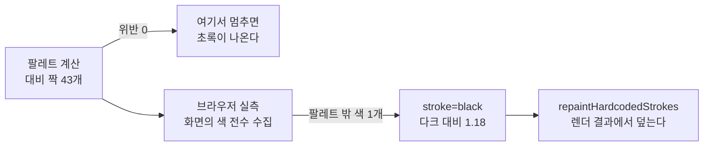

# Changelog

이 저장소의 사용자에게 영향이 큰 변경만 날짜별로 간단히 적습니다. (커밋 해시는 선택적으로 추적합니다.)

## 지난 기록

본체에는 최신 3개 절만 둔다. 그 아래는 월별 파일로 옮겼다.

| 월 | 절 수 | 날짜 |
| --- | ---: | --- |
| [`2026-09`](docs/changelog/2026-09.md) | 26 | 2026-09-06 · 2026-09-06 · 2026-09-05 · 2026-09-05 · 2026-09-05 · 2026-09-05 · 2026-09-04 · 2026-09-04 · 2026-09-04 · 2026-09-04 · 2026-09-03 · 2026-09-03 · 2026-09-03 · 2026-09-03 · 2026-09-03 · 2026-09-02 · 2026-09-02 · 2026-09-02 · 2026-09-02 · 2026-09-02 · 2026-09-02 · 2026-09-02 · 2026-09-02 · 2026-09-01 · 2026-09-01 · 2026-09-01 |
| [`2026-08`](docs/changelog/2026-08.md) | 36 | 2026-08-31 · 2026-08-31 · 2026-08-30 · 2026-08-30 · 2026-08-30 · 2026-08-30 · 2026-08-29 · 2026-08-29 · 2026-08-29 · 2026-08-19 · 2026-08-18 · 2026-08-18 · 2026-08-18 · 2026-08-18 · 2026-08-18 · 2026-08-18 · 2026-08-18 · 2026-08-17 · 2026-08-17 · 2026-08-17 · 2026-08-17 · 2026-08-16 · 2026-08-16 · 2026-08-16 · 2026-08-13 · 2026-08-13 · 2026-08-12 · 2026-08-11 · 2026-08-11 · 2026-08-09 · 2026-08-09 · 2026-08-08 · 2026-08-08 · 2026-08-08 · 2026-08-08 · 2026-08-07 |
| [`2026-07`](docs/changelog/2026-07.md) | 5 | 2026-07-21 · 2026-07-08 · 2026-07-07 · 2026-07-06 · 2026-07-05 |
| [`2026-06`](docs/changelog/2026-06.md) | 1 | 2026-06-02 |
| [`2026-05`](docs/changelog/2026-05.md) | 1 | 2026-05-01 |

---

## 2026-09-06 — **0건만 의심하는 것으로는 모자랐다.** 도식 663개의 의미를 세고 검사기를 만들지 않기로 판정했다 (PR [#18](https://github.com/withwooyong/withwooyong.github.io/pull/18))

> 인수인계의 우선순위 **5번**이며 사용자가 「먼저 실태만 조사한다」를 골랐다. 착수 절차의
> 1단계에서 결론이 났으므로 검사기 신설 · 뮤턴트 · 훅 배선은 하지 않았다.
>
> ⇒ 🔴 **첫 판정이 456건을 냈고 그중 참은 0건이었다.** 이 리포는 「증명하기 전에는 0 을 믿지
> 마라」를 지켜 왔지만, 이번에는 **반대 방향**이었다. 위반이 쏟아져도 그것이 참인지는 같은
> 방법으로 알 수 없다. 판정을 세 번 고칠 때마다 위반의 78~100%가 사라졌다.

### 무엇을 세었나

판정은 정규식이 아니라 **화면을 그리는 mermaid 자신의 `flowDb`** 가 세운 노드·간선 목록이
한다. 발행본의 96%가 `flowchart` 이므로 그 종류만 보았다.

| 지표 | 정의 |
| --- | --- |
| 유령 노드 | 라벨 없이 간선에서만 생겨난 노드. 노드 id 에 오타가 나면 mermaid 는 오류 대신 **그 id 를 라벨로 쓴 상자**를 만든다 |
| 고립 노드 | 어느 간선에도 닿지 않는 노드 |
| 성분 분리 | 무향으로 보아 연결 성분이 둘 이상 |

### 판정을 세 번 고쳤다

| 판 | 무엇을 고쳤나 | 유령 | 고립 | 성분 분리 | 합 |
| --- | --- | ---: | ---: | ---: | ---: |
| 1차 | 노드와 간선만 본다 | 79 | 153 | 224 | **456** |
| 2차 | 서브그래프를 노드에서 빼고 **소속을 연결로** 센다 | 17 | 0 | 83 | 100 |
| 3차 | **간선에 쓰이지 않은** 서브그래프도 잇는다 | 17 | 0 | 39 | **56** |

1차 → 2차의 근거는 `ai-agent-knowledge-map.md:19` 이다. mermaid 는 `L1 --> L2` 를 만나면
서브그래프 id 를 `vertices` 에도 넣는데, **화면에 그려지는 라벨은 서브그래프 선언의 title 이다.**
그것을 노드로 세면 「라벨 없는 유령」이 된다. 같은 도식에서 상자 안의 노드는 간선에 닿지
않지만 화면에서는 묶여 있어 떨어져 나와 보이지 않는다 — **소속은 시각적으로 연결이다.**

2차 → 3차의 근거는 `llm-app-bottleneck-shift.md:154` 다. 상자가 둘뿐인데 성분 4 로 세어졌다.
서브그래프가 간선에 쓰이지 않으면 `vertices` 에 들어오지 않는데, 그 id 를 union-find 의 부모
배열에 넣지 않아 **소속 연결이 통째로 건너뛰어졌다.**

### 🔴 자기 검사 케이스 둘이 결함 있는 판정에서도 통과했다

| 케이스 | 왜 놓쳤나 |
| --- | --- |
| 「서브그래프 안의 노드는 고립이 아니다」 | `isolated` 만 보고 `components` 를 보지 않았다 |
| 「서브그래프끼리 이으면 한 성분이다」 | 서브그래프가 **간선에 쓰인** 입력이라 `vertices` 에 들어 있었다. 결함이 드러나지 않는 입력이었다 |

둘 다 PASS 인 채로 성분 **44건**이 거짓이었다. 케이스를 하나 더 세운 뒤 **판정을 옛 판으로
되돌려 그것이 실제로 FAIL 하는지** 확인했다 (10/11). `CLAUDE.md` 가 `source-overlap` 에 대해
적어 둔 절차이며, **이번에도 통과만으로는 케이스가 헛도는지 알 수 없었다.**

### 「보지 못한 것」과 「볼 대상이 아닌 것」은 다른 수다

처음에는 종류를 확인하기 전에 노드 목록을 불러 `sequenceDiagram` 등 **56개가 파싱 실패로
집계되었다.** 전부 정상이었고 종류가 다를 뿐이다. 종류를 먼저 읽도록 순서를 바꾸어
**판정 도달 663 = 대상 663** 으로 맞췄고, 그래서 아래의 0 이 결론이 된다.

### 남은 56건도 결함이 아니었다

| 지표 | 남은 수 | 무엇이었나 |
| --- | ---: | --- |
| 유령 노드 | 17 | `retrieve`·`generate`·`grade_documents` — **LangGraph 코드에 실제로 있는 노드 이름**이다. 라벨을 붙이는 쪽이 오히려 부정확하다 |
| 고립 노드 | **0** | 발행본 522 · 문서 85 전량에서 0 이다 |
| 성분 분리 | 39 | 「폴링 · 롱폴링 · 스트리밍」처럼 **나란히 놓고 비교하는** 도식이다. 표본 여덟을 열어 전부 확인했다 |

### 판정 — 세 지표 모두 검사기로 가지 않는다

| 지표 | 착수 전 | 실측 뒤 |
| --- | :---: | :---: |
| 유령 노드 | ✅ 기계 | ❌ **사람** — 세는 것까지가 기계이고, 오타인지 의도인지는 세어서 갈리지 않는다 |
| 고립 노드 | ✅ 기계 | ✅ 기계 · **위반 0** |
| 도달 불가 · 성분 분리 | ✅ 기계 | ❌ **지표 아님** — 병렬 나열이 정당한 관용구다 |

고립 노드 하나만을 위한 검사기를 두는 선택지는 남지만, **얻는 것이 「0 인 상태의 고정」뿐인데
정당한 서브그래프 용법을 계속 예외 처리해야 한다.** 이번 조사에서 그 용법을 두 번 빠뜨렸고
그때마다 거짓 양성이 100건 단위로 나왔다.

### 이 조사로 드러난 종류 분포

| 종류 | 전체 | 발행본 | 리포 문서 |
| --- | ---: | ---: | ---: |
| `flowchart` | 607 | 522 | 85 |
| `sequence` | 23 | 14 | 9 |
| `stateDiagram` | 16 | 8 | 8 |
| `gantt` · `er` · `journey` · `quadrantChart` · `mindmap` | 17 | **0** | 17 |
| 합 | **663** | **544** | **119** |

발행본 기준의 기존 분포표는 정확했다. **리포 문서에만 있는 다섯 종류**가 새로 드러난 것이다.

### 무엇을 바꾸지 않았나

콘텐츠 · 코드 · 검사기 **열 종** · 뮤턴트 **96개** · `tests/blog` **14파일 194케이스**가 전부
그대로다. 조사 스크립트는 절차대로 스크래치패드에 두고 리포에 남기지 않았다. 재현 절차는
보고서의 「부록」 여섯 단계에 있다.

| 무엇 | 어디 |
| --- | --- |
| 조사 전문 | [`docs/superpowers/reports/2026-09-06-diagram-semantics-survey.md`](docs/superpowers/reports/2026-09-06-diagram-semantics-survey.md) |
| 판정과 반박할 것 셋 | `HANDOFF.md` 의 「도식 의미 검사 — 조사를 마쳤고 만들지 않기로 판정했다」 |

### merge · 배포

| 항목 | 값 |
| --- | --- |
| merge | PR #18 이 **merge 커밋 `0a0583d`** 로 닫혔다 (부모 둘: `572a849` + `5dc1aeb`) |
| 배포 | run `34021838010` **success** · 전체 **2분 38초** · `build` **2분 21초** · `deploy` **10초** |
| PR 단계 CI | run `34021022251` **success** · 전체 **2분 35초** · `Upload artifact` 와 `deploy` 가 설계대로 **skipped** |
| 화면 | **달라진 것이 없다.** 이번 변경은 문서뿐이라 `out/` 에 들어가지 않는다 |

**이 표가 말하는 것**: 배포가 success 인 것과 화면이 바뀐 것은 다른 말이다. 문서만 바뀐 배치는
파이프라인이 끝까지 도는 동안에도 산출물이 그대로이며, **그 사실 자체를 적어 두지 않으면
다음 세션이 「배포됐는데 왜 안 보이나」를 묻게 된다.**

---

## 2026-09-06 — **카테고리 목록에 그래프가 없던 것은 화면 높이가 아니라 데이터였다.** 지역 그래프를 카테고리 목록에도 띄운다 (PR [#17](https://github.com/withwooyong/withwooyong.github.io/pull/17))

> 인수인계의 우선순위 **8번**이다. 사용자가 「카테고리 목록에도 그래프가 보이게 하려면
> 어떻게 하는가」를 물어 조사한 결과, 원인은 `tall`(높이 720px) 기준이 아니라
> **`BlogShell` 에 `graph` 가 전달되지 않는 것**이었다. 프로덕션 창 높이가 1231px 로
> 기준을 넘는데도 패널이 DOM 에 아예 없었다.

### 무엇이 막고 있었나 — 데이터를 넘기기만 하면 되는 것이 아니었다

| 확인 | 실측 | 뜻 |
| --- | --- | --- |
| `BlogShell` 을 쓰는 페이지 | 5개 | 그중 `graph` 를 넘기는 것은 **본문 하나뿐**이었다 |
| `buildLocalGraph` 의 요구 | 중심 편 **필수** | 찾지 못하면 던진다. `LocalGraph.center` 도 필수 필드다 |
| 카테고리의 중심 | **정해져 있지 않다** | 「지금 보고 있는 편」이 없는 페이지다 |

그러므로 중심을 **고르는 규칙**을 새로 정하는 것이 이 작업의 본체였다.

### 허브를 고르는 규칙 — 전순서를 끝까지 세운다

빌드마다 중심이 달라지면 같은 커밋에서 다른 화면이 나오고 그 차이를 재현할 방법이 없다.
그래서 `pickCategoryHubId` 는 세 기준을 끝까지 세워 답을 하나로 고정한다.

| 순위 | 기준 | 왜 | 실측으로 갈리는 자리 |
| --- | --- | --- | --- |
| 1 | 피인용 수 내림차순 | 다른 편이 많이 가리키는 편이 그 카테고리의 관문이다 | 카테고리 여덟 중 **다섯**이 1차에서 결정된다 |
| 2 | 나가는 링크 수 내림차순 | 동점이면 이웃이 더 많이 붙는 쪽이 그래프를 채운다 | 나머지 **셋**(`ai-transformation` 2편 · `rag` 3편 · `search-engineering` 2편이 동점)이 여기서 갈린다 |
| 3 | id 사전순 오름차순 | 둘 다 같아도 답이 하나로 정해진다 | 지금 발행본에서는 쓰이지 않지만, 없으면 입력 순서에 답이 끌려간다 |

피인용은 **카테고리 밖에서 온 것도 센다.** `buildLocalGraph` 가 만드는 이웃이 카테고리
경계를 넘으므로, 안쪽 피인용만 세면 중심을 고른 기준과 그려지는 범위가 어긋난다.

### 이웃 상한 12 는 그대로 둔다 — 카테고리 편 수와 무관한 값이었다

인수인계는 「편이 6개부터 51개까지라 상한 12 를 다시 판단하라」고 남겼는데, 그 경고는
중심 없이 카테고리 전체를 그리는 **B·C 안의 것**이었다. A 안이 그리는 것은 여전히
**한 편의 이웃**이고 위젯 크기(224픽셀)도 본문과 같다.

| 카테고리 | 편 | 허브 | 이웃 후보 | 감춘 수 |
| --- | ---: | --- | ---: | ---: |
| `ai-agent` | 51 | `langgraph-state-reducer` | **15** | **+3** |
| `backend-engineering` | 43 | `transactions-and-concurrency-control` | 11 | 0 |
| `agentic-coding` | 31 | `scaling-routing-collapse` | 12 | 0 |
| `rag` | 25 | `langgraph-parallel-multiagent` | 10 | 0 |
| `ai-transformation` | 11 | `sdlc-human-gates` | 13 | +1 |
| `ai-product-planning` | 9 | `planning-harness-map` | 11 | 0 |
| `product-management` | 8 | `product-management-map` | 10 | 0 |
| `search-engineering` | 6 | `korean-text-search` | 7 | 0 |

여덟 중 **여섯이 상한에 닿지도 않는다.** 상한을 늘리면 같은 224픽셀 안에 점만 빽빽해진다.
편이 51개인 `ai-agent` 조차 후보가 15개이므로, 카테고리 크기가 아니라 **그 한 편의 연결도**가
이웃 수를 정한다는 사실이 실측으로 확인됐다.

### 문맥은 문구만의 문제가 아니었다 — 중심이 링크여야 한다

본문에서 중심은 지금 보고 있는 편이라 링크가 아니다(``). 카테고리에서는
중심이 **허브로 뽑힌 남의 편**이므로, 그대로 두면 화면에서 가장 큰 점이 아무 데도 가지 않는다.

그래서 `LocalGraphPanel` 에 `variant: "post" | "category"` 를 두어 **제목 · aria-label ·
중심의 링크 여부 · 캡션 구조**를 한 번에 결정한다. `BlogShell` 도 `graph?: LocalGraph` 가
아니라 `graph?: { data, variant }` 로 받는다. 따로 받아 기본값을 두면 카테고리에서
빠뜨렸을 때 본문 문구가 조용히 나오기 때문이다.

| 자리 | `post` | `category` |
| --- | --- | --- |
| 제목 · `aria-label` | 이어진 글 · 이 글과 이어진 글 | **이 카테고리의 허브** |
| 중심 노드 | `` (링크가 아니다) | **`<a>`** 로 허브 편에 간다 |
| 캡션 높이 | `h-8` (2줄) | **`h-12`** (3줄) |
| 캡션 내용 | `N편과 이어져 있다 (+N)` | 허브 제목과 이웃 수를 **다른 줄로** |

🔴 **캡션을 한 줄로 이어 붙였더니 이웃 수가 통째로 잘렸다.** 처음에는
`허브 제목 외 N편` 으로 썼는데, 허브 제목만으로 `leading-4` 두 줄을 채우는 편이 많아
브라우저 실측에서 「외 12편 (+3)」이 보이지 않았다. 제목과 요약을 다른 줄로 나누고
높이를 세 줄로 잡아 닫았다.

### 실물 확인

개발 서버에서 카테고리 셋과 본문 하나를 열어 DOM 을 셌다.

| 확인 | 값 |
| --- | --- |
| `/blog/ai-agent/` 의 앵커 | **13개**(중심 1 + 이웃 12) · 중심 `href` 가 허브 편을 가리킨다 |
| `/blog/search-engineering/` 의 앵커 | **8개**(중심 1 + 이웃 7) |
| 본문 `/blog/search-engineering/korean-text-search/` | 앵커 **7개**(이웃만) · 중심은 링크가 아니다 · 캡션 높이 **32px** |
| 문맥 혼입 | 카테고리 페이지에 본문 섹션 **없음** · 본문 페이지에 카테고리 섹션 **없음** |
| 라이트 · 다크 | 양쪽 모두 정상이다 |

빌드 산출물에서도 카테고리 여덟 페이지 전부에 「이 카테고리의 허브」가 **2회씩**
(`aria-label` 과 제목) 들어갔다.

### 검사

| 무엇 | 값 |
| --- | --- |
| `tests/blog` | 14파일 **180 → 194케이스** (`graph.test.ts` 21 → 28 · `content/graph.test.ts` 5 → 12) |
| 뮤턴트 | **92 → 96개** (`G9`–`G12` 가 허브 선정의 세 기준과 카테고리 필터를 되살린다) |
| 검사기 종 수 · 뮤테이션이 돌리는 검사 수 | **열 종 · 열 개**로 그대로다 |

🔴 **`CLAUDE.md`·`README.md`·`HANDOFF.md` 에 적혀 있던 「175케이스」는 낡은 값이었다.**
작업 전 기준선을 `git stash` 로 되돌려 실제로 재니 **180** 이었다. 세 문서를 실측으로 고쳤다.

### merge · 배포 · 프로덕션 실측

| 단계 | 값 |
| --- | --- |
| merge | PR #17 이 **merge 커밋 `572a849`** 로 닫혔다 (부모 둘: `16c1107` + `f4db64d`) |
| 배포 | run `34018339741` **success** · 전체 **2분 3초** · `build` **success** · `deploy` **success** |
| PR 단계 CI | run `34017972226` **success** · 전체 **2분 30초** · `Upload artifact` 와 `deploy` 가 설계대로 **skipped** |
| 프로덕션 실측 — 카테고리 | `/blog/ai-agent/` 에서 앵커 **13개**(중심 1 + 이웃 12) · 중심이 **링크**(`/blog/ai-agent/langgraph-state-reducer/`) · 연결선 **36개** · 캡션 **두 줄 48px** 로 잘리지 않았다 · 중심거리 표준편차 **15.72** · 이웃 간 최소 간격 **23.86** |
| 프로덕션 실측 — 본문 | 앵커 **7개** · 중심이 링크가 **아니다** · 캡션 **32px** |

두 페이지의 값이 갈리는 것이 이 실측의 핵심이다. 같은 위젯이 같은 자리에 그려지지만
**중심이 링크인지 · 캡션이 몇 줄인지 · 이웃이 몇인지가 모두 다르다.** 카테고리는 「이 묶음의
허브」를 가리키므로 중심을 눌러 갈 곳이 있고, 본문은 지금 읽는 편이 중심이라 갈 곳이 없다.
표준편차가 0 이 아닌 것은 힘 계산이 배포된 화면에서 실제로 돌았다는 뜻이다.

---

## 2026-09-06 — **계산이 통과한 색과 화면에 그려진 색은 다른 집합이었다.** mermaid 도식 662개를 사이트 팔레트로 바꾸고 대비를 검사기에 넣었다 (PR [#16](https://github.com/withwooyong/withwooyong.github.io/pull/16))

> 인수인계의 「`diagram-design` 적용 검토」에 있던 **후보 B** 다. `components/mermaid.tsx` 의
> `themeVariables` 는 `{ fontSize: "14px" }` 하나뿐이었고 색은 mermaid 11.16.0 의 내장
> `default`/`dark` 를 그대로 썼다. 사이트는 sky 계열인데 도식만 보라 계열 노드에 회색
> 테두리로 그려져, 발행본 **544개**와 문서 **118개**가 다른 제품처럼 보였다.
>
> ⇒ 색만 바꾸므로 **콘텐츠는 한 글자도 건드리지 않았다.**

### 팔레트의 출처 — 리포 안에 이미 진실원이 둘 있었다

착수 전에 어디를 따를지 물었고, `tailwind.config.js` 의 `primary` 와 `slate` 를 골랐다.

| 후보 | 실측 | 채택 |
| --- | --- | :---: |
| `tailwind.config.js` 의 `primary` | sky 계열 하드코딩 (`50 #f0f9ff` … `900 #0c4a6e`). 리포 안에 값이 있어 다른 세션이 검증할 수 있다 | ✅ |
| `styles/globals.css` 의 `--primary` | shadcn 기본값인 **무채색**(`0 0% 9%`)이다. 브랜드색이 아니다 | ❌ |
| `diagram-design` 스킬의 토큰 | 스킬 하나가 수만 토큰이고, 사이트 팔레트와 어긋나면 도식만 다른 브랜드가 된다 | ❌ |

`mermaid.tsx` 자신이 이미 `slate-200`/`slate-800` 테두리와 `blue-400` 강조를 쓰고 있었으므로,
노드는 `primary`, 선과 면은 `slate` 로 나누어 도식과 그것을 감싼 카드가 같은 색 체계가 되게 했다.

### 대비를 산문이 아니라 검사기에 넣었다

이 리포는 다크 모드 대비 **1.06** 인 검색 팔레트를 프로덕션에 배포한 적이 있다. 그때 통과한
검사들이 놓친 것은 색이 아니라 **재지 않은 자리**였다 — 짝지을 대상이 없으면 `dark:` 짝 검사도
그 자리를 보지 못한다. 그래서 색을 고르는 자리가 아니라 검사가 도는 자리에 판정을 두었다.

| 파일 | 무엇이 사나 |
| --- | --- |
| `lib/contrast.ts` | WCAG 2.1 상대 휘도와 대비비. 임계값은 글자 **4.5**(AA 일반 크기), 테두리·선 **3**(1.4.11) |
| `lib/mermaid-theme.ts` | 라이트·다크 색 변수 **각 42개**와, 재야 하는 짝 **43개**(글자 21 · 비텍스트 22)를 데이터로 둔다 |
| `tests/blog/mermaid-theme.test.ts` | **25케이스.** 훅 2단과 CI 의 `Content invariants` 양쪽에서 돈다 |

테두리는 안쪽 채움과 바깥쪽 캔버스 **양쪽**에 접하므로 두 면을 각각 짝으로 적었다. 한쪽만
적으면 반대쪽에서 도형이 사라져도 검사가 통과한다.

케이스는 「위반 0」만 보지 않는다. **판정에 도달한 수**가 짝 목록의 수와 같은지, 그리고
**짝에 한 번도 나오지 않은 색 변수가 없는지**를 함께 본다 — 재지 않은 색은 재서 통과한 색과
구분되지 않기 때문이다.

### 🔴 그런데 계산이 통과한 뒤에 브라우저가 결함 하나를 더 냈다

라이트와 다크 양쪽에서 실제 페이지를 열어 `getComputedStyle` 로 SVG 의 색을 전수 수집했다.
팔레트에 **없는** 색이 나오면 그것이 재지 않은 자리다.

mermaid 11 의 `insertStickTopArrowHead`·`insertStickBottomArrowHead` 는 화살촉에
`.attr("stroke", "black")` 을 **속성으로 직접 건다.** 다른 화살촉(`arrowhead`·`crosshead`)과
달리 대응하는 CSS 규칙이 없어서 테마를 무엇으로 두든 검정이 남고, 다크 캔버스(`#0f172a`)
위에서 대비가 **1.18** 이 된다.

⚠️ **이 결함은 지금 화면에 없다.** 그 화살촉을 부르는 문법(`-)` 계열)이 발행본과 문서를
통틀어 **0건**이기 때문이다. 그래도 덮은 이유는, 결함이 **문법 하나를 쓰는 순간** 나타나는데
그때는 아무도 팔레트를 다시 보지 않기 때문이다.

### 실측 — 두 페이지 · 도식 10개 · 세 종류 · 양쪽 모드

| 대상 | 도식 | 글자 | 도형 | 팔레트 밖 색 | 대비 위반 |
| --- | ---: | ---: | ---: | ---: | ---: |
| `transactions-and-concurrency-control` (state · flowchart · sequence) | 3 | 29 | 56 | 0 | 0 |
| `agent-harness-architecture` (flowchart · `subgraph` 포함) | 7 | 38 | 121 | 0 | 0 |
| 확대 뷰어 — **포털로 그려지는 표면** | 1 | 10 | — | 0 | 0 |

라이트와 다크에서 각각 같은 값이 나왔다. 확대 뷰어를 따로 잰 이유는 **1.06 결함이 났던 자리가
정확히 포털**이었기 때문이다 — 포털은 `blog-shell` 바깥에 그려져 색을 상속받는다.

⚠️ **측정 중에 두 번 헛짚었다.** 카드 배경이 `rgb(145,149,158)` 로 읽혀 결함처럼 보였는데,
흰색과 slate-900 사이의 **전환 애니메이션 보간값**이었다. 탭이 포그라운드가 아니면 전환이
`running` 인 채 시계가 멈춰 끝나지 않는다. `document.getAnimations()` 를 `finish()` 로
끝낸 뒤에야 `rgb(15,23,42)` 가 나왔다.

### 뮤턴트 18개 — 케이스가 헛도는지 확인했다

케이스의 통과는 「케이스가 있다」만 말한다. 그래서 결함을 되살려 잡히는지 확인했다.

| 되살린 결함 | 잡는 케이스 |
| --- | --- |
| 감마 보정을 벗기지 않는다 | `#767676` 이 AA 경계 4.5 를 넘는지 보는 앵커 |
| 글자 임계값을 4.5 에서 1 로 낮춘다 | 임계값 상수를 직접 대조하는 케이스 |
| 첫 짝만 판정한다 | **판정에 도달한 수**와 목록의 수를 대조하는 케이스 |
| 짝이 없는 색 변수를 더한다 | 재지 않은 변수를 세는 케이스 |
| 컴포넌트가 팔레트를 부르지 않는다 | 소스에서 `themeVariables:` 의 인자를 보는 케이스 |
| 미리보기 카드의 배경만 바꾼다 | 도식 표면 **두 곳 모두**에 클래스가 있는지 세는 케이스 |

🔴 **테스트 파일을 새로 만들었으므로 `scripts/mutate.mjs` 의 `blog-unit` 나열에 추가했다.**
`blog-unit` 은 `tests/blog` 를 통째로 돌리지 않고 파일을 이름으로 나열한다 — 나열하지 않으면
케이스가 아예 실행되지 않아 새 뮤턴트가 전부 생존한다. 직전에 같은 실수로 아홉 중 여덟이
생존한 적이 있다. 새 id 가 기존과 겹치지 않는지도 `sort | uniq -d` 로 확인했다.

### 수치가 바뀐 자리

| 항목 | 이전 | 지금 |
| --- | ---: | ---: |
| `tests/blog` | 13파일 155케이스 | **14파일 175케이스** |
| 뮤턴트 | 74 | **92** |
| `scripts/` 검사기 종 수 | 열 종 | 열 종 (그대로) |
| 뮤테이션이 돌리는 검사 수 | 열 개 | 열 개 (그대로) |

### 이 세션의 끝 — 재귀가 실제로 닫혔다

이 절을 담은 PR 은 문서만 고치는 PR 이 아니라 **코드와 문서를 함께 실은 PR** 이었다. 그래서
자기 자신의 병합 기록을 남기지 못하는 자리가 딱 한 칸으로 줄었고, 그 한 칸을 **뒤이은 세션이
실측으로 채웠다.** 아래 값은 옮겨 적은 것이 아니라 `gh run view --json` 과 `git log --format=%P`
로 다시 잰 것이다.

| 단계 | 값 | 어떻게 쟀나 |
| --- | --- | --- |
| PR CI | run `34010490249` **success** · 전체 **99초** · `build` **95초** · `Upload artifact` 와 `deploy` job 이 설계대로 **skipped** | `gh run view --json jobs` |
| merge | PR #16 이 **merge 커밋 `16c1107`** 로 닫혔다 (부모 둘: `827c3e2` + `7631c1c`) | `git log -1 --format=%P` |
| 배포 | run `34011795806` **success** · 전체 **130초** · `build` **115초** · `deploy` **9초** · `headSha` 가 `16c1107` | `gh run view --json` |
| 브랜치 | `docs/session-handoff-branch-cleanup` 을 원격·로컬에서 지웠다. 끝 커밋 `7631c1c` 가 `main` 에서 도달 가능함을 삭제 전후로 확인했고, **원격에는 `main` 만 남았다** | `git merge-base --is-ancestor` · `git branch -r` |

⚠️ **`build` 시간이 134초에서 115초로 줄었지만 개선의 근거로 삼지 마라.** 같은 워크플로가
같은 스텝을 도는데도 PR run 은 95초였다. 러너 부하가 달라 세 값이 흩어진 것이므로, 비교하려면
같은 조건에서 잰 대조군이 있어야 한다.

| 해시 | 무엇 |
| --- | --- |
| `211fd55` | 도식: mermaid 색을 사이트 팔레트로 바꾸고 대비를 검사기에 넣는다 |
| `7631c1c` | 문서: 도식 팔레트 작업을 인수인계·변경기록·함정 문서에 반영한다 |
| `16c1107` | Merge pull request #16 |

