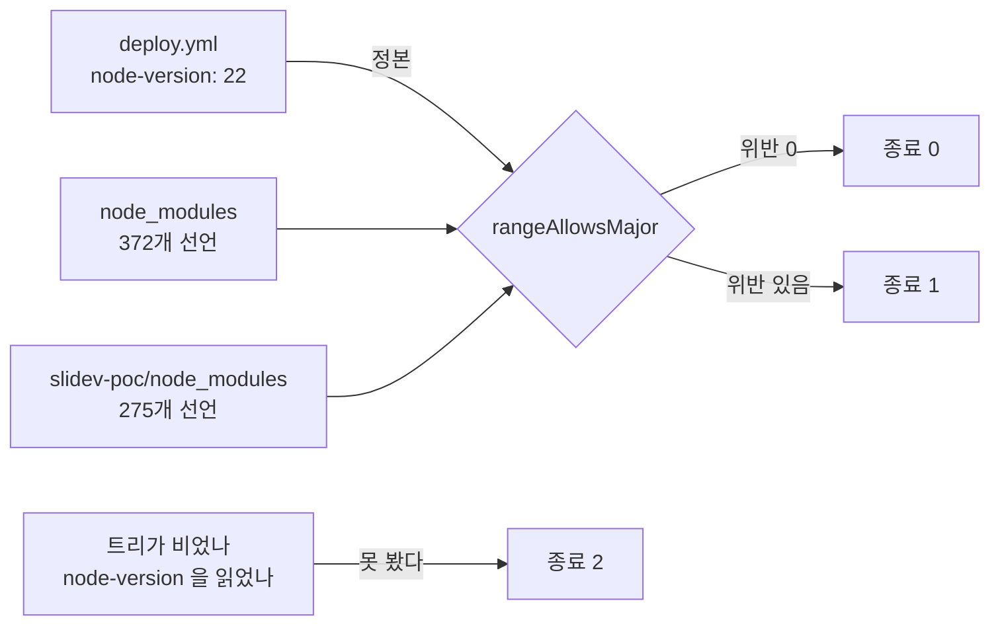

# Changelog

이 저장소의 사용자에게 영향이 큰 변경만 날짜별로 간단히 적습니다. (커밋 해시는 선택적으로 추적합니다.)

## 지난 기록

본체에는 최신 3개 절만 둔다. 그 아래는 월별 파일로 옮겼다.

| 월 | 절 수 | 날짜 |
| --- | ---: | --- |
| [`2026-09`](docs/changelog/2026-09.md) | 42 | 2026-09-10 · 2026-09-09 · 2026-09-09 · 2026-09-09 · 2026-09-09 · 2026-09-09 · 2026-09-08 · 2026-09-07 · 2026-09-07 · 2026-09-06 · 2026-09-06 · 2026-09-06 · 2026-09-06 · 2026-09-06 · 2026-09-06 · 2026-09-06 · 2026-09-06 · 2026-09-06 · 2026-09-05 · 2026-09-05 · 2026-09-05 · 2026-09-05 · 2026-09-04 · 2026-09-04 · 2026-09-04 · 2026-09-04 · 2026-09-03 · 2026-09-03 · 2026-09-03 · 2026-09-03 · 2026-09-03 · 2026-09-02 · 2026-09-02 · 2026-09-02 · 2026-09-02 · 2026-09-02 · 2026-09-02 · 2026-09-02 · 2026-09-02 · 2026-09-01 · 2026-09-01 · 2026-09-01 |
| [`2026-08`](docs/changelog/2026-08.md) | 36 | 2026-08-31 · 2026-08-31 · 2026-08-30 · 2026-08-30 · 2026-08-30 · 2026-08-30 · 2026-08-29 · 2026-08-29 · 2026-08-29 · 2026-08-19 · 2026-08-18 · 2026-08-18 · 2026-08-18 · 2026-08-18 · 2026-08-18 · 2026-08-18 · 2026-08-18 · 2026-08-17 · 2026-08-17 · 2026-08-17 · 2026-08-17 · 2026-08-16 · 2026-08-16 · 2026-08-16 · 2026-08-13 · 2026-08-13 · 2026-08-12 · 2026-08-11 · 2026-08-11 · 2026-08-09 · 2026-08-09 · 2026-08-08 · 2026-08-08 · 2026-08-08 · 2026-08-08 · 2026-08-07 |
| [`2026-07`](docs/changelog/2026-07.md) | 5 | 2026-07-21 · 2026-07-08 · 2026-07-07 · 2026-07-06 · 2026-07-05 |
| [`2026-06`](docs/changelog/2026-06.md) | 1 | 2026-06-02 |
| [`2026-05`](docs/changelog/2026-05.md) | 1 | 2026-05-01 |

---

## 2026-09-13 — 🧹 **원격에 남아 있던 병합 완료 브랜치 열 개를 지웠다** — `--merged` 의 판정만으로는 부족해서, 「지워도 사라지는 것이 없다」를 **커밋 단위로 먼저 증명했다**

> 2026-09-12 세션이 병합이 끝난 브랜치를 정리하면서 **로컬만 지우고 원격을 그대로 두었다.**
> 그래서 `origin` 에는 열 개가 남아 있었고, 이번 세션이 사용자 승인을 받아 지웠다.
> 원격을 건드리는 작업은 되돌릴 수 없으므로 실행 전과 실행 후에 각각 다른 것을 확인했다.

### 지운 브랜치 열 개

| 브랜치 | tip | `origin/main` 에 없는 커밋 | PR | 병합 시각 |
| --- | --- | ---: | ---: | --- |
| `chore/remove-slides` | `94a6e892` | 0 | [#32](https://github.com/withwooyong/withwooyong.github.io/pull/32) | 2026-09-12 |
| `feat/check-engines` | `8101be65` | 0 | [#31](https://github.com/withwooyong/withwooyong.github.io/pull/31) | 2026-09-10 |
| `fix/slides-hash-router` | `f62bb34b` | 0 | [#30](https://github.com/withwooyong/withwooyong.github.io/pull/30) | 2026-09-10 |
| `feat/deploy-slides` | `2c692fa9` | 0 | [#29](https://github.com/withwooyong/withwooyong.github.io/pull/29) | 2026-09-10 |
| `content/pm-practice-part8` | `f5ef1943` | 0 | [#27](https://github.com/withwooyong/withwooyong.github.io/pull/27) | 2026-09-09 |
| `content/pm-practice-part7` | `89108672` | 0 | [#26](https://github.com/withwooyong/withwooyong.github.io/pull/26) | 2026-09-09 |
| `content/pm-practice-part6` | `30d20ae1` | 0 | [#25](https://github.com/withwooyong/withwooyong.github.io/pull/25) | 2026-09-09 |
| `content/pm-practice-part5` | `21274a4e` | 0 | [#24](https://github.com/withwooyong/withwooyong.github.io/pull/24) | 2026-09-09 |
| `content/pm-practice-part4` | `c7fdf69c` | 0 | [#23](https://github.com/withwooyong/withwooyong.github.io/pull/23) | 2026-09-08 |
| `content/pm-practice-part3` | `72659a00` | 0 | [#22](https://github.com/withwooyong/withwooyong.github.io/pull/22) | 2026-09-08 |

원격에 남은 것은 이제 `refs/heads/main` 하나뿐이다.

### 🔴 `--merged` 의 판정을 결론으로 쓰지 않았다

`git branch -r --merged origin/main` 은 브랜치의 **tip 이 `main` 의 조상인지**만 본다.
그것이 참이면 브랜치의 모든 커밋이 `main` 에 있다는 결론이 따라 나오기는 하지만,
**그 추론을 믿는 것과 직접 세는 것은 다른 일이다.** 그래서 셋을 따로 확인했다.

| 무엇을 확인했나 | 명령 | 결과 |
| --- | --- | --- |
| 브랜치마다 `main` 에 없는 커밋이 몇 개인가 | `git rev-list --count origin/main..origin/<브랜치>` | 열 개 모두 **0** |
| 그 브랜치를 head 로 쓰는 열린 PR 이 있는가 | `gh pr list --state open` | **하나도 없다** |
| 삭제한 뒤에도 tip 이 `main` 에서 도달 가능한가 | `git merge-base --is-ancestor <tip> origin/main` | 열 개 모두 **포함됨** |

셋째 줄이 삭제 **뒤에** 돌린 확인이다. 「지워도 된다」를 증명하는 것과 「지운 뒤에도 남아 있다」를
증명하는 것은 시점이 다르므로 둘 다 필요하다.

### 🔴 원격의 상태를 `git branch -r` 로 읽지 마라

`git branch -r` 이 보여주는 것은 원격이 아니라 **로컬의 remote-tracking 캐시**다.
`--prune` 을 붙인 `fetch` 를 돌리기 전까지는 이미 사라진 브랜치를 그대로 보여주므로,
「지워졌는가」를 그것으로 판정하면 자기가 방금 한 삭제도 보이지 않는다.
원격에 실제로 무엇이 있는지는 `git ls-remote --heads origin` 이 원격에 직접 묻는다.

| 읽는 곳 | 무엇을 말하나 |
| --- | --- |
| `git branch -r` | 마지막 `fetch` 시점의 **로컬 캐시** |
| `git ls-remote --heads origin` | **지금 원격에 있는 것** |

### 병합된 PR 은 브랜치를 지워도 커밋을 계속 보여준다

지운 뒤 PR [#32](https://github.com/withwooyong/withwooyong.github.io/pull/32) 를
`gh pr view 32 --json commits` 로 다시 읽어 커밋 목록이 그대로 나오는 것을 확인했다.
브랜치 참조가 사라져도 GitHub 이 PR 의 커밋을 따로 붙들고 있기 때문이다.

### 미기록이던 두 건을 함께 채웠다

앞 세션이 PR [#32](https://github.com/withwooyong/withwooyong.github.io/pull/32) 를 merge 한 뒤
그 merge 커밋과 배포 run 을 기록에 적지 못한 채 세션을 닫았다.

| 항목 | 값 |
| --- | --- |
| merge 커밋 | [`c3b0f9b3`](https://github.com/withwooyong/withwooyong.github.io/commit/c3b0f9b3) — `Merge pull request #32 from withwooyong/chore/remove-slides` |
| 배포 run | [`34688560748`](https://github.com/withwooyong/withwooyong.github.io/actions/runs/34688560748) · **success** · 2분 15초 |

둘 다 문서에서 옮겨 적지 않고 `gh run view 34688560748` 과 `git ls-remote` 에서 읽었다.

### 🔴 이 갱신에 PR 을 열지 않은 이유

`CLAUDE.md` 는 **문서 갱신만을 위한 PR 을 열지 말라**고 적어 두었다. 그런 PR 은 자기 자신의
merge 커밋과 배포 run 을 어느 문서에도 적지 못해 기록이 영구히 한 칸 뒤처지기 때문이다.
같은 파일은 **문서 갱신을 실질 작업의 PR 에 함께 실으라**고도 적어 두었는데,
이번 세션의 실질 작업은 원격 참조를 지우는 것이어서 **리포의 파일을 하나도 바꾸지 않는다.**
그래서 함께 실을 PR 이 애초에 만들어지지 않는다.

⇒ **실질 작업이 리포 밖에만 있으면 기록 커밋을 `main` 에 직접 올린다.** PR 을 만들면
그것이 곧 「문서 갱신만을 위한 PR」이 되어 위 규칙을 어기게 된다. `main` 은 보호 브랜치이므로
이 푸시는 사용자 승인을 받았다.

---

## 2026-09-12 — 🗑️ **발표본 갈래를 통째로 걷어냈다** — 사용자가 삭제를 지시했고, 그 과정에서 `check-engines` 의 **대조군이 헛돌 뻔했다**

> 배포되어 있던 발표본 넷(`patterns` 29장 · `team-ops` 30장 · `governance` 25장 ·
> `search` 35장, 합계 119장)을 사용자 지시로 지웠다. 근거는 두 가지다 — **문서 품질이
> 마음에 들지 않는다**는 것과, **만들 때마다 실물을 확인시키지 않아** 사용자가 한 번도
> 보지 않은 채 119장이 쌓였다는 것이다. 필요해지면 다시 만들어 달라고 요청하겠다고 했다.

### 무엇을 지웠나

| 자리 | 내용 |
| --- | --- |
| `slidev-poc/` | 발표본 소스 여섯 · `decks.json` · `pages/` · `components/` · `snippets/` |
| `scripts/` | `check-slides.mjs`(검사기) · `build-slides.mjs`(빌더) |
| `package.json` | `check-slides` · `check-slides:verify` · `build-slides` |
| `.github/workflows/deploy.yml` | 발표본 스텝 넷 |
| `scripts/mutate.mjs` | 뮤턴트 여섯(`C5` · `SL1`~`SL5`)과 `CHECKS` 한 줄 |
| `scripts/check-forbidden.mjs` | 발표본 소스 13개를 모으던 수집부 |
| `scripts/check-engines.mjs` | 둘째 대상 트리 |
| `public/robots.txt` | `Disallow: /slides/` |

### 🔴 수가 처음으로 줄었다

| 수 | 전 | 후 |
| --- | ---: | ---: |
| 검사기 종 수 | 열네 종 | **열세 종** |
| 뮤턴트 | 127 | **121** |
| 뮤테이션이 돌리는 검사 | 열네 개 | **열세 개** |
| 워크플로 `build` job 스텝 | 34 | **30** |
| `scripts/*.mjs` 파일 | 18 | **16** |

세 문서가 전부 「늘어나기만 한다」는 전제로 쓰여 있었다. 그 전제를 `CLAUDE.md` 에 적어 고쳤다 —
**갈래를 걷어내면 줄어든다.**

### 🔴 `check-engines` 의 대조군이 헛돌 뻔했다

종전 대조군은 「Node 20 으로 재면 실제로 위반이 나온다」였는데, 그 위반이 **전부 발표본
트리에서 나온 것**이었다. 트리를 걷어낸 채 그대로 두면 대조군이 0 을 내면서도 케이스는
「위반이 있다」를 요구하지 않으므로 통과한다. 실측으로 확인하고 **Node 16** 으로 낮췄다.

⇒ **갈래를 지울 때는 그 갈래에 기대던 대조군이 무엇이었는지 함께 세라.** 검사기를 남기는
것만으로는 그 검사기가 살아 있다는 뜻이 되지 않는다.

### 확인

| 검사 | 결과 |
| --- | --- |
| 자기 검사 열다섯 종 | 전부 통과 |
| 본 스캔 아홉 | 전부 통과 |
| 린트 · 타입 · Vitest | 통과 · 통과 · **14파일 200케이스** |
| 빌드 | 성공 · `out/slides` 없음 |

⚠️ `slidev-poc/node_modules` 와 `dist-probe`(합계 503 MB)는 추적되지 않아 남아 있다.
git 이 모르는 파일이라 되돌릴 수 없으므로 지우지 않았다.

**되살리려면** `git revert` 한 번이면 된다. 재구축 방법은
[`docs/superpowers/specs/2026-09-09-slides-deploy-design.md`](docs/superpowers/specs/2026-09-09-slides-deploy-design.md)
에 그대로 남아 있다.

## 2026-09-10 — 🔴 **`engines` 사각지대를 검사기로 닫았다** — 직접 의존성만 보는 판은 **이 사례를 잡지 못했고**, 그것을 드러낸 것은 자기 검사가 아니라 되돌림이었다 (PR [#31](https://github.com/withwooyong/withwooyong.github.io/pull/31))

> `npm install` 은 의존성의 `engines` 를 강제하지 않는다. 그래서 로컬 Node 에서만 만족되는
> 패키지가 경고 없이 설치되고 **CI 에서만 죽는다.** 이 리포는 그것을 두 번 겪었고
> (jsdom 30 · 발표본 의존성 넷), 대조하던 자리는 `check-mermaid` 의 자기 검사 ㉖ 하나였다.
> 그것이 보던 것은 **리포 루트의 `node_modules` 안 jsdom 하나**뿐이라 `slidev-poc` 는
> 통째로 사각지대였다. 검사기 `check-engines` 를 세워 두 트리의 설치본 전량을 보게 했다.

### 무엇을 보나

정본은 워크플로의 `node-version` 이고, 판정은 **메이저 단위**다. `actions/setup-node` 가 그
대역의 최신 patch 를 주므로 워크플로 파일만으로는 patch 를 알 수 없다.

| 항목 | 값 |
| --- | ---: |
| 판정 대상 | **647개** (루트 372 · `slidev-poc` 275) |
| 자기 검사 | **26/26** |
| 본 스캔 소요 | 0.75초 |
| 뮤턴트 | `E1`~`E10` (전량 **127개** · 잡힘 127 · 생존 0) |
| CI `build` 스텝 | 32 → **34** (PR 33) |

### 🔴 처음 고른 「직접 의존성만」이 실측으로 반증됐다

인수인계의 「넷 전부 `dependencies` 이므로 `--omit=dev` 로 빠지지 않는다」를 「직접 의존성」으로
읽었으나, 실제로는 **`dependencies` 갈래를 통해 들어온다**는 뜻이었다. 넷은 전부 `@slidev/cli`
아래에서 hoisting 된 transitive 이고 `slidev-poc/package.json` 에는 `@slidev/cli` 만 있다.

| 대상 범위 | 판정 대상 | Node 22 위반 | Node 20 위반 |
| --- | ---: | ---: | ---: |
| 직접 의존성 | 14개 | 0건 | **0건** ❌ |
| 설치 트리 전량 | **647개** | 0건 | **4건** ✅ |

자기 검사 21/21 을 내던 판이 이 사례를 못 잡고 있었다. 드러난 것은 되돌림 하나다 —
워크플로의 `node-version` 을 20 으로 낮췄는데 종료 0 이 나왔다. 전량으로 바꾸니 `commander` ·
`postcss-nested` · `unplugin-vue-markdown` · `vite-plugin-static-copy` 넷이 정확히 나왔다.

⇒ **「이 사례를 잡는가」는 케이스가 아니라 되돌림이 답한다.** 그래서 대조군을 자기 검사에
상설로 두었다 — Node 20 으로 재면 위반이 나오는지 보는 케이스다. 그것이 없으면 다음 사람은
「0건」이 결론인지 검사기의 고장인지 가르지 못한다.

### 🔴 대상을 넓히는 순간 거짓 양성이 셋 터졌다

`jsdom` 하나만 보던 동안은 드러나지 않았다. `engines.node` 가 `*` 인 셋(`fraction.js` ·
`glob` · `minimatch`)과 `>=v12.22.7`(`saxes`)이 위반으로 올라왔는데, 정규식이 숫자를 못 찾은
것을 **불허로 읽었기** 때문이다. 넷 다 진짜 위반이 아니다.
⇒ **「모르는 형식」을 불허로 두면 대상을 넓힐 때 그대로 소음이 된다.**

### 함께 고친 것 — 낡은 수 다섯과 치환 실패 셋

| 어디 | 적혀 있던 값 | 실제 |
| --- | ---: | ---: |
| `README.md` CI 스텝 | 28 | **34** |
| `README.md` `check-forbidden:verify` | 63건 | **65건** |
| `README.md` `check-baseline:verify` | 16건 | **19건** |
| `HANDOFF.md` 검사기 | 열두 종 · 뮤턴트 112 | **열네 종 · 127** |
| `HANDOFF.md` CI | 28스텝 | **34스텝** |

전량 뮤테이션이 치환 실패 3건(`C1`·`C2`·`C4`)을 냈다. 작업 트리의 `check-forbidden.mjs` 가
CR **436**, 정본이 **0** 이었고 `from` 에 개행이 든 셋만 매칭에 실패한 것이다 — 이미 기록된
`core.autocrlf` 기전 그대로다. `git cat-file blob` 으로 LF 본을 덮어써 닫았고 다음 실행에서
치환 실패가 **0** 이 되었다.

🆕 **치환 실패는 미리 셀 수 있다.** `from` 의 **런타임 값**에 개행이 있는지와 대상 파일의 CR 을
곱하면 되고, 예측 3건이 실측 3건과 일치했다. 🔴 소스의 표기로 세면 오탐한다 — `M5` 의 `from` 은
`"\\n"` 이라 개행처럼 보이지만 백슬래시와 n 두 글자다.

또 하나, CHANGELOG 절을 월별 파일로 내리자 상대 링크 **3곳**이 깨졌다. 기준 디렉터리가 리포
루트에서 `docs/changelog/` 로 바뀌기 때문인데, 옮기는 작업 자체는 내용을 한 글자도 바꾸지
않으므로 「고칠 것이 없다」고 넘기기 쉽다. `check-links:docs` 가 잡았다.

### CI 실측

PR 단계 run [`34471579290`](https://github.com/withwooyong/withwooyong.github.io/actions/runs/34471579290) 이 **success** 다 (전체 **208초** · `build` **38스텝 · 202초** · `deploy` **skipped**).
38 은 워크플로 정의의 **34** 에 러너가 넷을 붙인 수이며 `success 37 · skipped 1` 이고 그 하나가
`Upload artifact` 다. 새 스텝 둘(`Prove engines checker` · `Check dependency engines against
CI Node`)이 모두 success 이므로 검사기가 ubuntu · Node 22 에서 도는 것은 실측이다.

PR 은 merge 커밋 [`b94d6b7`](https://github.com/withwooyong/withwooyong.github.io/commit/b94d6b7c28d0a886a2dd309c844b3c4661745121) 으로 `main` 에 닫혔고 배포 run
[`34479043998`](https://github.com/withwooyong/withwooyong.github.io/actions/runs/34479043998) 도 **success** 다 (전체 **207초** · `build` **38스텝 · 190초 · skipped 0** ·
`deploy` **3스텝 · 9초**). push 이벤트라 `Upload artifact` 와 `deploy` 가 설계대로 돌았고,
같은 스텝 29·30 이 배포 경로에서도 success 다.

🆕 **그 merge 를 기록한 문서 커밋 `136f7a8` 은 사흘 동안 푸시되지 않은 채 남아 있었다.**
2026-09-12 세션이 `git status -sb` 에서 `ahead 1` 을 읽어 발견했고, 푸시한 뒤 배포 run
[`34668318584`](https://github.com/withwooyong/withwooyong.github.io/actions/runs/34668318584)
도 **success** 였다 (`build` **38스텝 · 실패 0 · skipped 0** · `deploy` **3스텝**).
문서 두 파일만 바뀌었으므로 산출물은 불변이어야 하는데, 그것을 판정하는
`Check non-blog baseline` 스텝이 통과했으므로 **불변은 추정이 아니라 실측이다.**
🔴 **기록의 재귀는 커밋을 남기는 것만으로 닫히지 않는다** — 세션이 마지막 문서 커밋을
만들고 푸시하지 않으면 원격에는 그 기록이 없다. ⇒ **세션을 닫기 전에 `ahead` 를 읽어라.**
