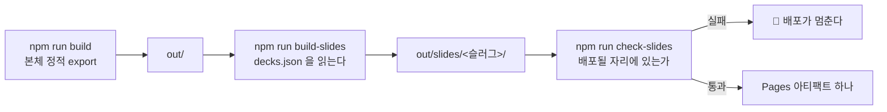

# Changelog

이 저장소의 사용자에게 영향이 큰 변경만 날짜별로 간단히 적습니다. (커밋 해시는 선택적으로 추적합니다.)

## 지난 기록

본체에는 최신 3개 절만 둔다. 그 아래는 월별 파일로 옮겼다.

| 월 | 절 수 | 날짜 |
| --- | ---: | --- |
| [`2026-09`](docs/changelog/2026-09.md) | 39 | 2026-09-09 · 2026-09-09 · 2026-09-09 · 2026-09-08 · 2026-09-07 · 2026-09-07 · 2026-09-06 · 2026-09-06 · 2026-09-06 · 2026-09-06 · 2026-09-06 · 2026-09-06 · 2026-09-06 · 2026-09-06 · 2026-09-06 · 2026-09-05 · 2026-09-05 · 2026-09-05 · 2026-09-05 · 2026-09-04 · 2026-09-04 · 2026-09-04 · 2026-09-04 · 2026-09-03 · 2026-09-03 · 2026-09-03 · 2026-09-03 · 2026-09-03 · 2026-09-02 · 2026-09-02 · 2026-09-02 · 2026-09-02 · 2026-09-02 · 2026-09-02 · 2026-09-02 · 2026-09-02 · 2026-09-01 · 2026-09-01 · 2026-09-01 |
| [`2026-08`](docs/changelog/2026-08.md) | 36 | 2026-08-31 · 2026-08-31 · 2026-08-30 · 2026-08-30 · 2026-08-30 · 2026-08-30 · 2026-08-29 · 2026-08-29 · 2026-08-29 · 2026-08-19 · 2026-08-18 · 2026-08-18 · 2026-08-18 · 2026-08-18 · 2026-08-18 · 2026-08-18 · 2026-08-18 · 2026-08-17 · 2026-08-17 · 2026-08-17 · 2026-08-17 · 2026-08-16 · 2026-08-16 · 2026-08-16 · 2026-08-13 · 2026-08-13 · 2026-08-12 · 2026-08-11 · 2026-08-11 · 2026-08-09 · 2026-08-09 · 2026-08-08 · 2026-08-08 · 2026-08-08 · 2026-08-08 · 2026-08-07 |
| [`2026-07`](docs/changelog/2026-07.md) | 5 | 2026-07-21 · 2026-07-08 · 2026-07-07 · 2026-07-06 · 2026-07-05 |
| [`2026-06`](docs/changelog/2026-06.md) | 1 | 2026-06-02 |
| [`2026-05`](docs/changelog/2026-05.md) | 1 | 2026-05-01 |

---

## 2026-09-10 — 🚀 **발표본 넷을 `/slides/` 에 배포한다** · 🔴 **CI 의 Node 가 20 에서는 슬라이드 빌드가 죽는다** — 로컬이 Node 24 라 38초에 끝나 어긋남이 드러나지 않았다 (PR [#PENDING](https://github.com/withwooyong/withwooyong.github.io/pulls))

> `slidev-poc` 의 발표본 넷(`patterns` · `team-ops` · `governance` · `search`)을 같은 도메인의
> `/slides/<슬러그>/` 에 배포한다. 본체에서 링크하지 않고 `robots.txt` 로 색인만 막으므로
> URL 을 아는 사람만 연다. 산출물은 커밋하지 않고 **CI 에서 매번 빌드한다** — 커밋하면
> 627파일 19 MB 가 리포에 들어간다.

### 무엇이 배포되나



Pages 는 아티팩트가 하나이므로 본체 산출물과 발표본이 **한 부대에 실린다.** 그래서 발표본
빌드가 깨지면 본체 배포도 함께 멈춘다. `continue-on-error` 를 쓰지 않은 이유는, 본체만
올라가면 `/slides/` 가 404 인 채로 배포가 **초록으로** 끝나기 때문이다.

### 🔴 CI 의 Node 를 20 에서 22 로 올렸다 — 대조하지 않았으면 배포에서 죽었다

발표본의 **운영** 의존성 넷이 Node 22 이상을 요구하는데 `--omit=dev` 로 빠지지 않는다.

| 패키지 | `engines.node` | 구분 |
| --- | --- | :---: |
| `commander@15.0.0` | `>=22.12.0` | 운영 |
| `postcss-nested@8.0.1` | `^22 \|\| ^24 \|\| >=26` | 운영 |
| `unplugin-vue-markdown@32.1.1` | `>=22` | 운영 |
| `vite-plugin-static-copy@4.1.1` | `^22 \|\| >=24` | 운영 |

로컬이 Node 24 라 넷 모두 **38초에** 빌드되었고, 그래서 이 어긋남은 로컬에서 드러날 수
없었다. `npm install` 이 `engines` 를 강제하지 않는다는 함정의 **두 번째 사례**다 — 첫 번째는
`jsdom@30` 이 로컬 Node 24 에서 21/21 을 내고 CI 의 Node 20 에서 죽은 일이었다.

⚠️ **대조는 `check-mermaid` 의 자기 검사에 이미 있지만 그것이 보는 것은 리포 루트의
`node_modules` 다.** `slidev-poc/node_modules` 는 아직 아무도 보지 않는다.

### 검사기 하나를 세우고 둘을 고쳤다

| 검사기 | 무엇을 하나 | 자기 검사 |
| --- | --- | ---: |
| `check-slides` 🆕 | 발표본 산출물이 **배포될 자리에 있는지** 판정한다. `slidev build` 의 성공은 「빌드가 됐다」만 말한다 | 9/9 |
| `check-baseline` | `slides/` 아래를 대상에서 뺀다. 빼지 않으면 발표본 여덟 파일이 **「추가」 8건**으로 잡혀 GC-6 가 즉시 빨간불이 된다 | 19/19 |
| `check-forbidden` | 발표본 소스 13개를 스캔 대상에 더한다. 스캔 파일이 **195개에서 208개**가 되었다 | 65/0 |

`check-baseline` 의 제외는 **슬래시까지 포함해** 비교한다. `slides` 로만 적으면
`slidesheet.html` 처럼 이름이 겹칠 뿐인 것까지 함께 빠지는데, 그것은 위반을 **놓치는** 쪽의
실수라 통과만 보고는 드러나지 않는다. 케이스 ⑱ 이 그 자리를 지킨다.

### 증명 없는 통과를 남기지 않았다

이 갈래의 판정은 전부 **되돌려 보고** 확인했다.

| 무엇 | 어떻게 증명했나 | 결과 |
| --- | --- | --- |
| `build-slides` 의 `out/` 가드 | `out/` 을 잠깐 옮기고 돌렸다 | 종료 코드 **2** |
| `check-slides` | `index.html` 하나를 지웠다 | 종료 코드 **1** · 복구 뒤 0 |
| `check-forbidden` 의 새 대상 | 발표본에 금칙어를 심었다 | HARD **3건** · 복구 뒤 0 |
| 뮤턴트 `SL1`~`SL4` | 전량 실행 | 넷 모두 `check-slides` 가 잡았다 |
| 뮤턴트 `B8` · `C5` | 격리 실행 | 19/19 → **18/19** · 65/0 → **64/1** |
| 발표본 넷의 화면 | 정적 서버를 띄우고 브라우저로 열었다 | 첫 장이 그려진다 · 요청 960건에 **404 0건** |

🔴 **`grep` 이 센 뮤턴트 수와 러너의 수가 이번에는 일치했다(116).** 여러 줄 선언을 정규식이
놓친 전례가 있어 대조했고, 그 뒤 `B8` · `C5` 를 더해 **118개**가 되었다.

### 함께 고친 것

| 무엇 | 내용 |
| --- | --- |
| `README.md` 의 뮤턴트 수 | **98개**로 적혀 있었다. `CLAUDE.md` 가 112 를 적는 동안 갈라져 있었고, 「세 문서가 갈라진다」는 경고의 현재 사례였다 |
| 뮤턴트 id 배정 | 계획서가 지정한 `F9` 를 **`C5`** 로 바꿨다. `F` 는 `fix-markup` 계열이고 `check-forbidden` 은 `C1`~`C4` 를 쓴다 |
| 뮤테이션 소요 | 「3~5분」이 아니라 **118개 기준 약 28분**이다. 세션 끝이 아니라 시작에 백그라운드로 건다 |
| 배포 run `34340890496` | PR #28 이 merge 된 뒤의 문서 커밋이 낸 run 이며 `success` 다. 어느 문서에도 없어 여기 적는다 |

⚠️ **인수인계가 「배포 run 둘이 어느 문서에도 없다」고 적었으나 하나는 이미 있었다.**
`34336637777` 은 바로 위 절과 `HANDOFF.md` 에 기록되어 있었고 없던 것은 `34340890496`
하나다. **인수인계에 적힌 「없다」도 대조 없이는 근거가 아니다** — 「푸시 완료」가 거짓이었던
사례와 같은 부류이며, 이번에는 `grep` 한 번으로 갈렸다.

## 2026-09-09 — 🔴 **`check-baseline` 을 CI 에서 되살렸다** — 1년 가까이 꺼져 있던 원인은 **크기가 바이트까지 같은 파일** 안의 해시 하나였다 (PR [#28](https://github.com/withwooyong/withwooyong.github.io/pull/28))

> 비블로그 페이지의 빌드 산출물이 바뀌지 않았는지 보는 `check-baseline`(GC-6)은 2026-08-18 에
> CI 에서 주석 처리된 뒤 계속 꺼져 있었고, 로컬에서는 언제나 **14건 위반**을 내어 신호가 되지
> 못했다. 「기준선 갱신 · 검사 폐기 · 환경 독립 재설계」 셋 가운데 **재설계**를 골라 닫았다.

### 🔴 「산출물이 환경에 따라 다르다」는 진단이 지나치게 넓었다

껐을 당시 주석은 「무엇이 다른지 먼저 실측하라」고 남겼는데, 아무도 그 실측을 하지 않은 채
넓은 진단만 이어받았다. 배포된 실물이 곧 ubuntu CI 산출물이므로 같은 커밋(`8dfbf9c`)의
Windows 로컬 빌드와 대조했다.

| 무엇 | CI 와 로컬 | 조치 |
| --- | --- | --- |
| `chunks/*-<16진수16>.js` | **다르다** — `index.html` 의 참조 10개 중 `_app` **하나** | 마스킹한다 |
| `css/<16진수16>.css` | 같다 | 지우지 않는다 |
| `media/<16진수16>-s.p.woff2` | 같다 | 지우지 않는다 |
| 파일 **크기** | **바이트까지 같다** (`404.html` 56,452 B) | 크기 대조로는 드러나지 않는다 |

Next.js 가 JS 청크 파일명에 박는 콘텐츠 해시는 16진수 16자로 **길이가 고정**이라 크기가 변하지
않는다. `cmp` 로 첫 차이(byte 1147)를 잡아 그 자리를 읽고서야 원인이 나왔다. 그 한 자리를
`buildId` 와 같은 방식으로 마스킹하니 비블로그 **15개가 두 환경에서 전량 일치**했다.

⇒ 주석이 되살리는 조건으로 제시했던 「ubuntu 에서 기준선 생성」과 「CI 안에서 두 번 빌드」는
**둘 다 필요하지 않았다.**

### 🔴 이 검사기는 「검사기 열한 종」에 세어지지 않고 있었다

`scripts/` 에 있고 `package.json` 에 등록돼 있는데 **자기 검사(`:verify`)가 없어** 뮤테이션이
돌리지 않았고, 그래서 목록에서 조용히 빠졌다. 되살리며 함께 갖췄다.

| 무엇 | 값 |
| --- | --- |
| 자기 검사 `check-baseline:verify` | **16케이스.** 넷이 **마스킹이 넓어지지 않았음**을 본다 — CSS·폰트 해시와 본문의 16진수는 지우지 않아야 하고, 본문이 바뀌면 여전히 잡혀야 한다 |
| 뮤턴트 `B1`~`B7` | 마스킹이 **사라지는 쪽**과 **넓어지는 쪽**을 양방향으로 되살린다. 넓어지는 쪽이 더 위험하다 — 전량이 조용히 통과하며 초록불이 된다 |
| 순수 함수 | `normalize()` · `diff()`. 파일을 읽는 자리 안에 두면 통째로 지워도 케이스가 전부 통과한다 |
| CI 스텝 | `Prove baseline checker`(빌드 앞) · `Check non-blog baseline`(산출물 스캔 뒤) |

마스킹을 넣기 **전에** 자기 검사를 돌려 ①②만 실패하고 나머지 14가 통과하는 것을 확인했다.
케이스가 헛도는지는 통과만 보고는 알 수 없기 때문이다.

### ✅ ubuntu CI 가 Windows 로컬 기준선으로 통과했다

PR 단계 CI(run **34334630292** · `build` 117초)에서 **`Check non-blog baseline` 이 success** 다.
로컬에서 만든 기준선이 ubuntu 산출물과 맞는지를 처음으로 실제 확인한 자리이며, 이것이
통과하지 못했다면 되살리기 자체가 성립하지 않는다. `Upload artifact` 와 `deploy` 는
PR 이므로 예정대로 skipped 였다.

merge 커밋은 **`6ab7eed`** 이고 배포 run **34336637777** 도 `success` 다
(`build` 32스텝 170초 · `deploy` 3스텝 10초 · 이 run 에서도 baseline 두 스텝 통과).
배포된 실물에서 `/` · `/404.html` · `/product-lead/` · `/blog/` · `/tving-brief/` 가 전부
HTTP 200 이고 `search-index.json` 은 192편이다. 🔴 **`404.html` 56,452 B 와
`product-lead/index.html` 85,577 B 가 작업 전에 잰 값과 같다** — 비블로그 페이지가
실제로 불변임을 실물이 확인한다.

⇒ 검사기 **열한 종 → 열두 종** · 뮤턴트 **105 → 112개** · CI `build` **26 → 28스텝**
(러너 보고 기준으로는 30 → **32스텝**).
직전 세션이 적어 둔 「기준선에 지금 없는 `notion/index.html` 이 남아 있다」는 **사실이 아니었다** —
그 파일은 지금도 있고 해시까지 일치한다. 도구 함정 [53번](docs/TOOL-TRAPS.md)에 전문을 적었다.

---

## 2026-09-09 — `product-management` **프로덕트 실무 편8**(총 192편) · ✅ **시리즈 여덟 편이 끝났다** — 여섯 편의 역산 k 가 0.043 폭 안에 그대로 있다 (PR [#27](https://github.com/withwooyong/withwooyong.github.io/pull/27))

> 편8 [`global-decision-and-communication`](content/blog/product-management/global-decision-and-communication.md) 를 발행하며 `product-management-practice` 시리즈를 닫았다.
> 원본 `10-글로벌-협업` 의 §5~§7 을 배정받아 주간 공유 · 의사결정의 구조 · 소통 원칙 셋 ·
> 케이스 스터디 · 자리 잡기를 여덟 절로 다룬다. 입사 과정은 설계서 §4-1 대로 편7 을 링크하고
> 다시 설명하지 않았다.

### 🔴 초고 24,486 B — 규칙 16 을 세 편 연속 발동했다

목표 21,546 대비 **+13.6%** 로 10% 문턱을 넘었다. 편6 · 편7 에 이어 세 편 연속이다.
§10-6-b 의 절차대로 대조군을 세워 원인을 갈랐는데, 이번에는 **대조군을 둘** 놓았다.

| 대조군 | 고정 3절 | 배정 절 배율 |
| --- | ---: | ---: |
| 편7 최종 | 5,477 | 1.917 |
| **목표 자체** (편5 · 편6 · 편7 최종 평균) | **5,338** | **1.804** |

편7 최종만 대조군으로 쓰면 초과의 39%가 설명되지 않고 남는다. 그 몫은 **편7 자신이 목표를
+5.1% 넘겨 착지한 값**이기 때문이다. ⇒ 🔴 **앞 편 최종을 대조군으로 삼으면 그 편의 초과분이
분해에 이월되어 보이지 않는다.** 목표를 함께 대조군으로 놓아야 원인이 100% 갈린다.

| 원인 | 계산 | B | 초과 대비 |
| --- | --- | ---: | ---: |
| 배정 절 배율 (1.804 → 2.087) | 8,983 × 0.283 | +2,542 | **86.5%** |
| 고정 3절 (5,338 → 5,738) | 마지막 편의 마무리 문단 | +400 | 13.6% |

편7 은 배율 80.9% · 고정 3절 19.1% 였고 이번은 배율 쪽으로 더 치우쳤다. **고정 3절은 편7 에
이어 이번에도 원인 목록에서 빠지지 않았다** — 대조군을 세우는 절차가 「②는 언제나 원인이
아니다」를 뜻하지 않는다는 §10-7-a 의 판정이 두 편 연속 유지된다.

### ✅ §10-7-b 의 예고가 이번에는 최댓값을 짚었다

편7 은 「원본이 짧은 절」만 표시해 두었다가 최고 배율(2.861)을 **도식과 접합 문단이 함께 들어간
절**에서 맞았고, 그래서 §10-7-b 가 둘을 모두 미리 표시하라고 남겼다. 편8 은 그대로 따랐다.

| 절 | 원본 B | 초고 B | 배율 | 예고에 걸렸나 |
| --- | ---: | ---: | ---: | --- |
| §5-1 (주간 공유) | 608 | 2,336 | **3.84** | ✅ **짧은 원본 + 접합**, 유일하게 🔴 로 표시했다 |
| §5-2 (한 명의 결정권자) | 803 | 2,146 | 2.67 | ✅ 짧은 원본 + 도식 |
| §6-2 (세 사례) | 1,274 | 2,586 | 2.03 | ❌ 아니다 |

⇒ **두 위험이 겹치는 절을 따로 표시한 것이 최댓값을 짚었다.** 최종에서도 §5-1 이 3.076 으로
가장 높으며, 편7 의 최고(2.861)보다 크다. 접합 문단은 원본에 대응물이 없으므로 **짧은 원본에
얹히면 배율이 3을 넘는다**는 것이 이번 표본이다.

### 발행 실측 — 역산 k = 2.055

| 값 | 편6 | 편7 | **편8** |
| --- | ---: | ---: | ---: |
| 목표 B | 20,009 | 22,953 | **21,546** |
| 초고 B | 24,813 | 28,507 | **24,486** |
| 목표 대비 | +24.0% | +24.2% | **+13.6%** |
| 최종 B | 20,909 | 24,113 | **22,499** |
| **역산 k** | 2.059 | 2.068 | **2.055** |

여섯 편의 k(2.050 · 2.033 · 2.076 · 2.059 · 2.068 · 2.055)가 **0.043 폭** 안에 그대로 있다.
밴드(20,273 ~ 22,820) 상단 여유는 **321 B** 로 편7(214)과 편5(121)보다 넉넉하다.

### 검사에서 걸린 것

| 검사 | 결과 |
| --- | --- |
| `dup-scan` | **2건 → 0건.** 둘 다 결함이었다 |
| `source-overlap` ① | **2건 → 0건.** 둘 다 서술 문장의 축자 복사였다 |
| `source-overlap` ③ | 0건 — 🔴 **구조적 0이다.** 편8 배정 절(§5~§7)에 원본 도식이 없어 대조 대상 자체가 없고, 검사기가 센 원본 라벨 10개는 전부 편7 배정 구역의 것이다 |
| 나머지 다섯 | 192개 파일 · 도식 564개(판정 도달 564) · 표 2,131개 · 위반 0. `tests/blog` 14파일 200케이스 통과 |

🔴 **`dup-scan` 이 잡은 30자는 「이 편이 쓴 용어」 절의 도입 문장이었다.** 편7 의 같은 자리를
그대로 따라 쓴 것인데, 시리즈의 정형 문구인지 확인하니 **편5 · 편6 은 다른 문구를 쓰고 편7 만
그렇게 적었다.** ⇒ 정형과 답습은 `grep` 한 번으로 갈린다 — 같은 자리의 다른 편을 세어 보면
된다. 복제를 고친 뒤 분량은 **32 B 줄었다** (편7 +44 · 편4 +158). 「복제를 지우면 는다」는
편3 이후 세 번 중 두 번 반증됐다.

### 🔴 §6-1 의 outbound 세기 명령이 형제편만 세지 않는다

마지막 편이므로 §6-1 의 명령을 발행 직전에 돌렸고 **8** 이 나왔다. 그런데 세어야 할 형제편은
일곱이다. 목록을 열어 보니 여덟째는 `product-management-map` 으로 **다른 시리즈의 지도편**이었다.

```
grep -o '/blog/product-management/[a-z-]*/' … | sort -u | wc -l
```

⚠️ **이 명령은 카테고리 안의 모든 슬러그를 센다.** 형제편이 여섯만 있고 기존 시리즈 링크가
둘이어도 똑같이 8 이 나오므로, **수가 맞았다는 사실이 일곱 편을 다 가리킨다는 증거가 아니다.**
⇒ 슬러그 일곱 개를 하나씩 `grep -c` 로 대조해 전부 1 이상임을 확인했다. 규칙 9 는 「세는
명령을 실행하라」인데, **세는 대상이 무엇인지가 명령에 적혀 있지 않았다.**

### 접합부는 도메인 시리즈에서 새로 찾았다

§6-2 는 편8 에 접합부를 남겨 두지 않았으므로 규칙 10 대로 낱말 실재부터 확인했다.
`product-management-domains` 여덟 편에서 「커뮤니케이션」과 「소통」이 **0건**이었다 —
편7 이 「글로벌」에서 겪은 것과 같은 상황이다.

⇒ [`tactics-and-goal-setting`](content/blog/product-management/tactics-and-goal-setting.md) 의 **18행**(발표를 걷어내면 논리만 남는다) ·
**20행**(서술형 문서를 먼저 읽고 회의를 시작한다) · **35행**(과업을 건네는 회의와 문제를 건네는
회의)으로 정했다. 그쪽은 **한 번의 승인 자리**에서 형식을 바꾸고 편8 은 **매주 반복되는 자리**
에서 같은 것을 한다. §6-2 의 목표 「4건 이상」이 이 건으로 채워졌다.

### 함께 처리한 것

- 지도편의 편 목록 표에서 편8 행을 링크로 바꾸고, 편7 의 마지막 예고 문장에 편8 링크를 걸었다
  (설계서 §10-4-b · 편5 · 편6 · 편7 에 이어 네 번째다).
- `CHANGELOG.md` 본체를 규칙대로 세 절로 줄이며 편5 절을 [`docs/changelog/2026-09.md`](docs/changelog/2026-09.md) 로 옮기고
  상대 링크를 그 파일 기준으로 고쳤다.

### merge 와 배포 — 실물까지 확인했다

| 자리 | 값 |
| --- | --- |
| PR 단계 CI | run `34318644234`(커밋 `4931fce`) · `34318935183`(커밋 `f5ef194`) 이 **둘 다 success** 다. 뒤쪽이 전체 164초 · `build` 30스텝 159초이고 skipped 하나는 `Upload artifact` 다 |
| merge 커밋 | **`85b96bc`** — 부모 둘이 `eb92250` + `f5ef194` 이고 실린 커밋은 셋(`2b9a987` + `4931fce` + `f5ef194`)이다. 앞 세션의 문서 갱신 `2b9a987` 이 이 PR 에 함께 실렸다 |
| 배포 run | **`34321271566` success** — 전체 179초 · `build` success 30스텝 157초 · `deploy` success 3스텝 11초다. push 이벤트이므로 `Upload artifact` 와 `deploy` 가 설계대로 돌아 skipped 가 하나도 없다 |
| 배포된 실물 | 편8 페이지가 `HTTP 200 · 188,111 B` 이고 `<title>` 이 편8 의 것이다. `search-index.json` 은 `HTTP 200 · 332,701 B · 192편`으로 로컬 빌드 실측(192편 · 325 KB)과 일치한다 |

배포 파이프라인의 네 자리가 모두 success 이고, 편수는 로컬과 배포 양쪽에서 192 로 같다.

⚠️ **페이지 크기만은 대조군이 없다.** 편8 을 빌드한 임시 워크트리가 정리되어 `out/` 이 남아 있지
않으므로, 편7 때처럼 「로컬 빌드와 같은 크기」라고 말할 근거가 이번에는 없다. 검색 인덱스는
편수와 크기가 인수인계에 기록되어 있어 대조가 되었다.

