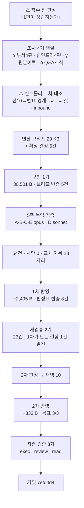

# 인수인계 (HANDOFF)

**갱신일**: 2026-08-17
**브랜치**: `main` · T6 발행 커밋 **`7efd4d4`**
**푸시 상태**: ⚠️⚠️ **미푸시 2건** — `7efd4d4`(T6 발행) + 이 HANDOFF 커밋. **사용자가 푸시를 요청하지 않았다.**
⚠️⚠️ **「푸시돼 있다/없다」를 승계하지 말고 매번 `git log origin/main..HEAD`로 실측하라.**
**T5 HANDOFF 초판이 미푸시 2건을 「이미 푸시돼 있다」고 적었다가 실측으로 정정됐다.** 이 줄 자체가 그 실패의 기록이다.
**작업트리**: 커밋 직후 `git status --short` **비어 있음 확인 완료** (T3 사고 재발 없음 · **3배치 연속**)
**발행본**: **123편** (`ai-agent` 51 · `rag` 25 · `agentic-coding` 31 · `search-engineering` 6 · **`ai-transformation` 10**) · sitemap **186 URL**

> **`ai-transformation` T6를 발행했다.** 11편 중 **10편**이 나갔고 **1편(T7 지도편)이 남았다.**

---

## 1. 이번 세션에서 한 일

**원본 `08 §3`(가용 5,707 B)의 8문항 + 발행본 9편에서 수급한 10문항을 편10 Q&A로 발행했다.**



| | slug | 가용 | 발행 | 구조 |
| :---: | --- | ---: | ---: | --- |
| **편10** | `ai-transformation-qna-org-operations` | 5,707 B | **27,673 B · 230줄** | H2 20 · Q문항 18 · 표 2 · 펜스 0 |

**제목**: 「같은 도구를 깔아도 결과가 갈린다 — 조직 운영과 부서 자동화 18문답」

### 단계별 산출

| 단계 | 결과 |
| --- | --- |
| 착수 전 판정 | ⚠️ **「하한 미달 위험」이 성립하지 않음을 확정.** 설계서 §9가 「+ 각 편」의 뜻을 이미 정해 두었다 |
| 조사 4기 | ⚠️ **조사 보고 오류 3건**(H2 개수 = 실은 Q문항 수 · 「물음표로 끝남」 = 실은 없음 · 「11편 전건 대시 뒤」 = 실은 혼합) |
| 컨트롤러 교차 대조 | **편10↔편11 경계 확정 · 태그 패싯 함정 · inbound 최저 2편 지목** |
| 구현 1기 | **구현자가 브리프 오류 5건 반증** |
| 5축 검증 | **54건** (A 14 · B 15 · C 10 · D 0 · E 15) · 차단 0 · **교차 지목 13자리** |
| 1차 반영 | 채택 29 → 반영 22·변형 5·**거부 2** · **−2,495 B** · ⚠️ **판정표 반증 8건** |
| 재검증 2기 | **23건** (1기 12 · 2기 11) · ⚠️ **1차 반영이 만든 결함 1건 발견** |
| 2차 반영 | **목표 3/3** — **−333 B** · **새 문장 0자리** · 구조 불변 · 판정표 반증 3건 |
| 최종 검증 3기 | **전원 「발행 가능」 · 차단 0건** · ⚠️ **review가 컨트롤러 판정 2건 반증** |

**순증감 30,501 → 28,006 → 27,673 = −2,828 B.** ⚠️ **T4·T5의 「1차는 늘고 2차는 준다」와 달리 이번엔 1차부터 크게 줄었다** — 처방의 다수가 「근거 없는 판정을 삭제하라」였기 때문이다.

---

## 2. ⚠️⚠️ 이번 세션 최상위 — **좌표가 정확한 것과 그 좌표가 내 주장을 받치는 것은 다르다** (금지선 35)

**이 배치 결함의 최대 무리가 하나의 형태였다. 인용한 좌표는 실재하고 문면도 정확한데, 그 문면이 주장을 받치지 않는다.**

| 사례 | 쓴 것 | 좌표가 실제로 말하는 것 |
| --- | --- | --- |
| **① 부서 착수 순서** | 「고객 접점이 먼저, 백오피스가 나중이다」 | 편7 `:17`·편8 `:15`는 **편7이 먼저 발행됐다**는 사실이다. 3계열 검색 0건 · 원본 §3에 부서 이야기 없음 |
| **② 세 겹 절차** | 「**순서를 지키는 것이 요점이다**」 + 인과 2개 | 편9 `:17`은 「이 세 겹이 **원 자료의 순서 그대로다**」 — **서술 순서** 진술이다 |
| **③ 검증자도 같은 실수** | 축 A-7 「편7 `:347`이 「셋 중 **둘**만 법적 근거」라 했으니 전칭을 빼라」 | `:347`은 **HARD-GATE 내부 구성**을 세는 문장이지 장치 이름을 한정하는 문장이 아니다 (1차 반영자가 반증) |
| **④ 검증자도 같은 실수** | 축 C-3 「「**넷**」이라 해 놓고 **셋**만 호명한다」 | **두 개의 다른 목록**이었다 — 「넷」은 인프라 넷(편4 `:277`), 호명된 셋은 ROI 다섯 중 셋(편4 `:279`) (2차 반영자가 반증) |

> ### ⇒ 왜 이 배치에서 유난히 많이 났나 — **색인 글의 구조다**
>
> **여느 편은 자기 내용만 책임지면 된다.**
> **색인 글은 링크 30개마다 「저 글에 무엇이 있다」는 검증 가능한 주장을 함께 진다.**
> **⇒ 결함이 더 난 것이 아니라 더 많이 드러나는 구조다.**
>
> **⇒ T7 브리프에 절차로 넣어라:**
>
> ```bash
> # 좌표를 인용하기 전에 그 좌표가 「무엇의 무엇」인지 한 줄로 적어라
> sed -n '<n-3>,<n+3>p' "$TARGET"   # 앞뒤를 함께 읽는다
> # ⚠️ 「N번째로 서술됐다」와 「N번째로 하라」는 다르다
> # ⚠️ 「이 표의 셋 중 둘」과 「이 개념의 셋 중 둘」은 다르다
> ```

---

## 3. ⚠️⚠️ **삭제는 세 가지를 남긴다** — 금지선 31 확장

**1차 반영이 결함을 하나 만들었고, 반영자는 두 확인을 실제로 돌리고 출력까지 실었는데도 놓쳤다.**

| | |
| --- | --- |
| 지운 것 | `## Q. 레포에 무엇을 커밋하나` 절의 「**자격증명도 같은 이유로 밖에 남는다**」 |
| 남은 것 | **7줄 위**의 「…훅이 **전부** 레포 파일이 된다」가 **반례 없이 홀로** |

**⇒ 지운 문장이 다른 문장의 「예외」를 제공하고 있었다. 방향이 반대라 「앞뒤 5줄」로는 안 잡힌다.**

> ### ⇒ 세 번째 확인을 넣어라
>
> ```bash
> grep -nE "<지우려는 주장의 핵심어>" "$F"                    # ① 같은 주장의 다른 사본  (T5 확립)
> sed -n '<n-5>,<n+5>p' "$F"                                  # ② 떠받치던 근거          (T4 확립)
> # ③ ⚠️ 그 문장이 속한 절 전체에서 전칭을 찾아라 — 예외를 제공하고 있었는가  (T6 신설)
> awk -v n=<n> 'NR<=n && /^## /{s=NR} NR>=s && NR<=n+40' "$F" | grep -nE "전부|모두|전건|예외 없|만 |뿐"
> ```

⚠️ **2차 반영자가 이 확인으로 두 번째 여파를 찾아 보고했으나, 최종 검증 `review`가 「결함 아님」으로 판정했다** — 편5가 자격증명을 Layer 3에 넣지 않았고 편10이 옮긴 것은 편5 `:417`의 Layer 3 정의 축자였다. **확인 절차는 옳게 작동했고 판정이 그것을 걸렀다.**

---

## 4. ⚠️ **귀속에 세 번째 방향이 있다** — 금지선 32 확장

**컨트롤러가 「편2 문장을 68자 축자로 가져오면서 「이 배정은 이 글의 정리다」 귀속을 뗐다」를 위반으로 판정했다.**
**최종 검증 `review`가 반증했다.**

| 방향 | |
| --- | --- |
| ① (T3~T5) | 창작에 귀속을 안 붙였다 → **원본으로 밀어 올림** |
| ② (T5) | 원본에 있는 것에 귀속을 붙였다 → **이 글의 정리로 강등** |
| **③ (T6 신설)** | ⚠️ **다른 편이 「이 글의 정리다」로 표시한 판정을 옮기며 같은 표지를 달았다 → 그 판정이 내 것이 된다. 이것도 강등이다** |

> **⇒ 다른 편이 귀속을 단 판정을 옮길 때는 귀속을 달지 않는 것이 옳다.**
> **⇒ 대신 넘김 문장으로 출처를 밝힌다.** 편10은 두 줄 뒤 `:147`이 편2를 가리킨다.

**같은 논리로 「이 글의 정리다」 어형이 글 전체에 0건인 것이 정상으로 판정됐다** —
요약표 8행을 전건 대조한 결과 **이 글이 새로 만든 기준은 0개**였다(편1 `:233`·편7 `:15`·편6 `:136`·편5 `:423`·편4 `:70`·원본 §3 유래).

---

## 5. ⚠️⚠️ 컨트롤러 오류 **8건** — T3 2 → T4 8 → T5 9 → **T6 8**

**6건이 「브리프를 쓰는 단계」에서 났고 그중 4건이 같은 형태 — 조사자나 앞 문서의 요약을 검증 없이 옮긴 것이다.**

| # | 어디서 | 컨트롤러가 쓴 것 | 실측 | 누가 잡았나 |
| ---: | --- | --- | --- | --- |
| 1 | 조사 브리프 | 편 번호를 slug 알파벳 순으로 부여 | **설계서 번호와 다르다.** 조사 보고 해석이 어긋날 뻔했다 | 컨트롤러 자신 |
| 2 | 조사 δ 브리프 | Q&A 표본을 2개 카테고리로 지정 | ⚠️ **`rag-qna-*` 3편 누락.** 그 3편만 코드펜스를 쓴다 — 「펜스 0」이 전칭으로 거짓이 될 뻔했다 | 컨트롤러 자신 |
| 3 | 공통 브리프 §2-4 | 「기발행 Q&A는 링크에 대시 **앞**을 쓴다」 | ⚠️ **표본 1건 일반화.** 실제는 앞·뒤·축약 혼합 | 조사 δ (반대로 틀림) |
| 4 | HANDOFF 승계 | 「`series`·`source`를 쓰지 않는다」 | ⚠️ **4/9편이 쓴다.** §7 참조 | 구현자 |
| 5 | 브리프 §1 | 「18 × 1,200~1,400 = 21.6~25.2 KB」 | ⚠️ **요약절·용어정리·도입·마무리 고정 절 약 7 KB 누락** | 구현자 |
| 6 | 브리프 §2-2 문항 9 | 「고객 접점 → 백오피스 **순서**」 | ⚠️⚠️ **좌표는 발행 순서였다.** §2 ① | 축 B + 컨트롤러 통독 |
| 7 | 브리프 §2 문항 5·18 | 두 문항에 **거의 같은 근거** 배정 | ⚠️ 글이 「한 내용을 두 자리에서 읽게 하지 않는다」를 자기 규칙으로 선언한 뒤 스스로 어겼다 | 축 C |
| 8 | **1차 판정표** | — | ⚠️⚠️ **축 A-1(높음)을 채택·이월 어디에도 옮기지 않아 통째로 증발.** 교차 지목 표에는 적어 놓고 처방 목록에 안 옮겼다 | 1차 반영자 |

> ### ⇒ T7 컨트롤러가 지킬 것
>
> | # | |
> | ---: | --- |
> | 1 | ⚠️⚠️ **판정표를 다 쓴 뒤 「축이 낸 높음이 전건 채택 또는 이월에 있는가」를 세라.** 8번은 **지적을 찾는 것과 처방 목록으로 옮기는 것이 다른 작업**인데 후자에 검증자가 없어서 났다 |
> | 2 | **조사자의 「요약」과 「좌표」를 구분해 옮겨라.** 좌표는 그대로, 요약은 다시 확인 |
> | 3 | **표본 범위를 지정할 때 「전부인가」를 물어라.** 2번은 카테고리 둘만 지정해서 났다 |
> | 4 | **앞 HANDOFF의 「확정된 결정」도 실측하라.** 4번이 그래서 났다 |

---

## 6. 다음 세션이 이어받을 것

### ▶ **T7 착수 — 편11 지도편. 카테고리를 닫는다**

| 배치 | 편 | 원본 | 상태 |
| :---: | --- | --- | :---: |
| ~~T1~~ | ~~편6·7·8~~ | ~~`aiagent/06`~~ | ✅ `9c0b9fd` |
| ~~T2~~ | ~~편9~~ | ~~`aiagent/08 §4~§8·§10`~~ | ✅ `6a56f4a` |
| ~~T3~~ | ~~편1·편4~~ | ~~`aiteam/01·02·07` · `05·06`~~ | ✅ `695cdad` |
| ~~T4~~ | ~~편2·편3~~ | ~~`aiteam/03` · `04_영역별` 7파일~~ | ✅ `37e413b` |
| ~~T5~~ | ~~편5~~ | ~~`aiteam/09`·`09a`·`09b`~~ | ✅ `e83cfd3` |
| ~~T6~~ | ~~편10 Q&A~~ | ~~`aiteam/08 §3` + 각 편~~ | ✅ **`7efd4d4`** |
| **T7** | **편11 지도편** | `00 §1` 골격 + 재작성 | **▶ 다음. 카테고리를 닫는다** |

### ⚠️⚠️ T7이 먼저 알아야 할 것 — **편10과 겹치지 않는다. 계층이 다르다**

`[T6 컨트롤러 실측]`

| | **편11 지도편** | 편10 Q&A |
| --- | --- | --- |
| 조직 단위 | **글** | 질문 |
| 독자가 찾는 것 | **어느 글을 읽을까** | 이 물음의 답 |
| 전편 커버 | ⚠️⚠️ **책임진다** | 부분 커버 |
| 링크 밀도(선례) | **125회 / 30편 고유** | 30회 / 9편 고유 |

**선례 2건**: `agentic-coding/topic-map-reading-paths`(25,311 B) · `ai-agent/ai-agent-knowledge-map`(21,463 B)

⚠️⚠️ **`topic-map-reading-paths:219`에 H2 `## 결론부터 보려면 — Q&A 4편`이 있다 — 지도편이 Q&A편을 한 항목으로 품는다.**
**⇒ 편11은 편10을 항목으로 포함하되, 편10이 이미 연 문항을 다시 열지 마라.**

**지도편의 H2 구조 선례**:
- `topic-map-reading-paths`: 30편이 어떻게 묶여 있는가 · 시리즈별 30편 · 목적별 읽는 순서 · 주제에서 글로 15주제 교차 참조 · 결론부터 보려면 · 닫으며
- `ai-agent-knowledge-map`: 카테고리 구조 · 개념 계보 · 문제에서 편으로 · 한 장 요약 · 주제 교차 지도 · 표현을 고를 때 조심할 것 · 도입 전 확인할 열 가지 · 통합 용어집

⚠️ **`topic-map-reading-paths` description 축자**: 「두 지도 어느 쪽에서도 **빠지는 편이 없는지 자리를 세어 확인한다**」 — **전편 커버를 명시적으로 검산한다.**

### T7 브리프에 반드시 넣을 것

| # | 항목 | 근거 |
| ---: | --- | --- |
| 1 | **금지선 1~35 전문** | 설계서 §11 + `agentic-coding` 설계서 L1998~L2021. **35는 T6 신설 — §2** |
| 2 | ⚠️⚠️ **금지선 35 — 좌표가 정확한 것과 그 좌표가 내 주장을 받치는 것은 다르다** | **§2. 이번 배치 최상위** |
| 3 | ⚠️⚠️ **금지선 31 확장 — 삭제는 세 가지를 남긴다** | **§3** |
| 4 | ⚠️ **금지선 32 확장 — 다른 편이 귀속한 판정을 옮길 때는 귀속을 달지 마라** | **§4** |
| 5 | ⚠️⚠️ **편11은 전편 커버를 책임진다. 편10과 계층이 다르다** | **§6** |
| 6 | ⚠️ **`series`·`source`의 실제 규칙** | **§7** |
| 7 | ⚠️ **`LC_ALL=C` 없이는 이모지 grep이 거짓 음성** | T4 확립 · T5·T6 재확인 |
| 8 | ⚠️ **다중 파일 awk는 `FNR`.** mermaid는 `next` 때문에 따로 세라 | T5 확립 · T6 재확인 |
| 9 | **1인칭 정제식 + 오탐 목록 10종** | §8-4 |
| 10 | ⚠️ **「처방도 검증 대상이다」** | T2 3연 · T3 4건 · T4 14건 · T5 6건 · **T6 11건**(1차 8 · 2차 3) |
| 11 | **`dup-scan`은 단일 파일 모드로** | T2~T6 재확인 |
| 12 | **`Bash` heredoc으로 산출물을 써라. ~10 KB에서 잘리니 5~6 KB 분할 append** | `reviewer`·`scout`에 `Write` 없음 |
| 13 | ⚠️⚠️ **판정표를 다 쓴 뒤 「축이 낸 높음이 전건 목록에 있는가」를 세라** | **§5 오류 8** |
| 14 | **0편 태그 목록 첨부** | B9·T1~T6 모두 사용 0건이나 계속 첨부 |

### 확정된 결정 (다시 묻지 마라)

| 사안 | 결정 |
| --- | --- |
| **분량** | **상한 없다. 하한 13.3 KB만** (금지선 11·13) |
| **팽창률** | ⚠️ **실측 1.63~2.71.** ⚠️⚠️ **단 Q&A·지도편에는 팽창률을 쓰지 마라 — 분량을 정하는 것은 원본 크기가 아니라 항목 수다**(T6 실측) |
| **시리즈 페이지** | 없다. `series`는 frontmatter 메타데이터일 뿐 |
| ⚠️ **frontmatter** | **`series`·`seriesOrder`·`source`는 편11에도 쓰지 마라. 단 근거는 「카테고리 관례」가 아니다** — §7 |
| **`date`** | **실제 발행일을 적어라.** `loader.ts:64`가 **`date` 내림차순 · 동률이면 제목 가나다순** |
| ⚠️ **순서 호칭** | **「다음 편」·「앞 편」·「2편」·「마지막 편」을 쓰지 마라.** ⚠️ **단 「발행본에 없다」는 거짓이다** — T1·T2 발행본 4편이 쓴다. **T3 이후 규칙이다** |
| ⚠️ **링크 호칭** | **대상 제목의 대시(—) 뒤 부제를 축자로.** ⚠️ **`ai-transformation` 실측 7 대 1로 지배 패턴.** ⚠️ **`agentic-coding`은 앞·뒤·축약 혼합이니 그쪽을 선례로 삼지 마라**(T6 정정) |
| **태그 패싯** | 3~5개, **같은 패싯 최대 2개**(`tags.ts:28`). ⚠️ **`org-design`·`engineering-leadership`·`knowledge-management`는 셋 다 패싯 D다** |
| ⚠️ **「첫 90일에 할 일」** | **편 제목·H2로 쓰지 마라**(금지선 26) |

### 진행 방식 — 15배치로 검증된 절차

```
1단계  분할 설계 → 승인                         ✅ 완료
2단계  배치로 나눠 변환, 배치마다 커밋·보고       ◀ T7이 여기 (마지막)
3단계  구현 미참여 에이전트가 5축 독립 검증
4단계  판정 → 1차 반영 → 스냅샷 → 재검증 2기 → 2차 판정 → 2차 반영 → 최종 검증 3기 → 커밋
```

| 축 | 무엇을 보는가 | 티어 |
| :---: | --- | :---: |
| A | 쓰여 있는데 **틀린** 것 — ⚠️ **개수에 붙은 술어** + ⚠️ **착지점**(T6에서 5건) | opus |
| B | 쓰여 있는데 **근거가 없는** 것 — ⚠️ **+ 「좌표가 그 주장을 받치는가」**(금지선 35) | opus |
| C | **없는** 것 — ⚠️ **발행본을 열기 전에 인벤토리를 먼저 만든다** + ⚠️ **「이 글이 스스로 약속하고 지키지 않은 것」** | opus |
| D | **실행**하면 나오는 것 | sonnet |
| E | ⚠️⚠️ **배치마다 재정의하라.** T6에서는 「중복」이 아니라 **「링크로 넘기지 않고 다시 쓴 자리」**였다 | opus |

> ### ✅ 재검증 2기의 축 분할 — T1에서 확립, T6까지 재확인
> | 기 | 담당 |
> | :---: | --- |
> | 1 | **지금 글에 있는 근거 없는 주장** — 총평 · 전칭 · 개수+술어 · 부정 주장 · **귀속(3방향)** · 표의 열 이름 · ⚠️ **삭제가 남긴 자리** |
> | 2 | **값과 그것을 가리키는 것 사이의 어긋남** — 지시어·역참조 · 개수↔실제 · **넘김 계약↔도착지** · 선언↔이행 · **도입 열거↔마무리 회수** · 서식 일관성 |
>
> **T6 실적**: 1기 12건 · 2기 11건. ⚠️ **2기가 「1차 반영이 만든 결함」을 잡았다 — 수정 뒤 재검증의 값이 여기 있다.**

> ### ✅ 최종 검증은 **3역할로 나눠라** — T5에서 개선, T6에서 재확인
> | 역할 | 티어 | 무엇 |
> | --- | :---: | --- |
> | **exec** | sonnet | 명령을 돌려 수치를 낸다. ⚠️ **0건 검사는 전건 원본 대조** |
> | **review** | opus | ⚠️ **「수정이 잦았던 절」을 표로 지목해 전건 열게 한다** |
> | **read** | opus | ⚠️⚠️ **좌표 없이 통독한다** |
>
> **T6 실적**: read 13건 · review 5건 · exec 0건. **전원 「발행 가능」.**
> ⚠️⚠️ **read에게는 좌표가 하나도 없는 별도 브리프를 줘라**(`T6-FINAL-BRIEF-READ.md` 참조). T5에서 「일부를 보지 마라」가 실행 불가능함이 실측됐다.
> **T6에서 read가 아무도 못 본 것을 잡았다** — `:143` 「단계 **사이마다** 게이트」(=5) ↔ `:145` 「앞의 둘·가운데 둘·뒤의 둘」(=6). **열 명이 이 절의 「3/3 분할」을 고치는 데 시선이 쏠려 두 줄 위를 아무도 세지 않았다.**

> ### ⚠️ 검증자에게 브리프도 판정표도 반영 보고서도 주지 마라 — B5에서 확립, T6까지 재확인
> **대가는 오탐 2건 내외다. 설계된 대가다.**
> ⚠️ **T6에서 검증자가 낸 「높음」·「보통」이 오판으로 되잡힌 것이 2건 있다**(§2 ③④). **그래도 준 것보다 낫다** — 반영자가 원본을 열어 반증했고, 브리프를 봤다면 「지시대로 됐다」로 통과했을 자리가 더 많다.

---

## 7. ⚠️ T6에서 새로 실측된 것

### 7-1. ⚠️⚠️ **Q&A·지도편에는 팽창률을 쓰지 마라 — 분량을 정하는 것은 항목 수다**

**인수인계가 「§3 5,054 B × 1.63~2.71 = 8.2~13.7 KB로 하한에 걸린다」고 경고했으나 성립하지 않았다.**

| 기발행 Q&A 11편 실측 | 문항 수 | B | 문항당 B |
| --- | ---: | ---: | ---: |
| `agentic-coding` 4편 | 10~17 | 14,365~23,709 | **1,197~1,631** |
| `ai-agent` 4편 | 22~26 | 14,196~16,289 | 585~740 |
| `rag` 3편 | 20~25 | 19,284~26,182 | 954~1,247 |
| **편10** | **18** | **27,673** | **1,537** |

⚠️ **예측이 상한을 넘은 이유**: 「18 × 1,200~1,400」은 **문항 본문만**이고, 요약절 표 + 용어 정리 표 + 도입 + 마무리 + frontmatter가 **약 7 KB** 더 붙는다.

### 7-2. ⚠️⚠️ **`series`·`source`의 실제 규칙** — 「확정된 결정」이 전칭으로 거짓이었다

| 편 | `series` | `source` |
| --- | --- | --- |
| 편6·7·8 | `"department-agents"` | `"AI 에이전트 실무 과정"` |
| 편9 | — | `"AI 에이전트 실무 과정"` |
| 편1~5·편10 | — | — |

**⇒ 실제 규칙은 「`aiagent/*` 원본에서 온 편만 쓴다」다.** 편6~9는 `aiagent/06`·`aiagent/08`에서 왔고 그 원본이 「AI 에이전트 실무 과정」 유래다. 편1~5·편10은 `aiteam/*`이라 출처가 다르다.
**⇒ 편11도 `aiteam/00`에서 오므로 생략이 맞다. 그러나 근거를 「카테고리 관례」로 적지 마라.**

### 7-3. ⚠️ **기발행 Q&A 11편이 서식 참조 파일이자 덫이다**

| 자리 | 기발행 Q&A | `ai-transformation` |
| --- | --- | --- |
| frontmatter | **11편 전건이 `series`·`source`를 쓴다** | 쓰지 않는다 |
| 링크 문구 | `agentic-coding`은 **앞·뒤·축약 혼합** | **대시 뒤 부제 축자**(7 대 1) |
| 코드펜스 | ⚠️ **`rag` 3편만 쓴다**(6·10·18개) | 0 |

**⇒ 「11편 전건이 ~한다」는 진술을 만들 때 세 카테고리를 모두 확인하라.** T6 조사가 두 카테고리만 보고 전칭을 냈다.

### 7-4. 1인칭 오탐 트랩 — **10종**이 됐다

| 나이브 패턴 | 오탐 원인 | 발견 |
| --- | --- | :---: |
| `나의 ` | `하나의 ` | T1 |
| `제가 ` | `주제가` · `전제가` | T1 |
| `지원자` | `지원자 스크리너` | T1 |
| `제가 ` | `공제가` | T2 |
| `제가 ` | `과제가` · `문제가` | T3 |
| `제가 ` | `명제가` | T4 |
| `입사` | `신규 입사자를 온보딩할 때` | T5 |
| **`제가 `** | ⚠️ **`강제가`** — 「**강제가** 아니라 채택을 설계한다」는 **이 카테고리의 핵심 명제**라 앞으로 계속 걸린다 | **T6** |

```bash
grep -nE "(^|[^하])나의 |(^|[^주전공과문])제가 |저는 |내가 |입사|본인은|데려갈|우리 팀|본 팀|현 팀" "$F"
grep -nE "본인|본 [가-힣]|우리 [가-힣]|현 [가-힣]|내 [가-힣]" "$F"
```

> ⚠️⚠️ **배제 문자류에 `명`·`강`을 더하지 마라**(T3 확립 · T6 재확인). **패턴을 고치지 말고 오탐 목록에 등재한다.**
> ⚠️ **어절 경계 오탐군** — `사내 데이터`·`사내 문서`·`사내 지식`·`원본 보관`·`꺼내 놓는`·`본 기재`·`2주 내 폐기`·`요약본 사이`·`구현 세부`·`IDE 내 채팅`·**`기본 선택지`**(T6)

### 7-5. ⚠️ **두 규약이 정면으로 부딪히는 자리가 있다 — 축자 인용 vs 축자 복제**

**1차 판정의 처방 5건이 「발행본 문면과 일치시켜라」였고, 일치시킨 결과가 `dup-scan` 히트다.**

| dup-scan 19건 | 건수 | 판정 |
| --- | ---: | --- |
| 링크 제목 축자 | 12 | ✅ 카테고리 규칙 |
| 고유명사 전개 | 2 | ✅ 축약 불가 |
| **판정표가 지시한 축자 복원** | 5 | ✅ **어긋나는 쪽이 독자에게 더 나쁘다** |

⚠️ **최장 68자**(편2 `:146` 게이트 2/2/2 배정). **T5의 최장 29자에서 늘었다 — 처방의 부작용이고 의도된 것이다.**

---

## 8. 미해결 과제

### 8-1. T6 이월 — **최종 검증 비차단 관찰**

> ⚠️ **최종 검증에서 나온 비차단 관찰은 반영하지 않는 것이 절차다** — 손대면 다시 검증해야 하고 그 재검증은 아무도 하지 않는다.
> **그러나 이월에는 반드시 적는다.**

| # | 자리 | 요지 | 낸 역할 |
| ---: | --- | --- | :---: |
| **T6-a** | 편10 `:143` ↔ `:145` | ⚠️⚠️ **게이트를 세면 5 vs 6.** 「여섯 단계로 자르고 **단계 사이마다**」(=5) ↔ 「앞의 둘·가운데 둘·뒤의 둘」(=6). **열 명이 이 절의 3/3 분할을 고치면서 두 줄 위를 아무도 세지 않았다** | read |
| T6-b | 편10 `:185` | 「레포 밖에 남는 것은 …다」가 편5 `:417` Layer 3 정의 축자이나 **스코프어를 「셋째 층에」→「레포 밖에」로 넓혔고 그 확장분에서 반례가 생긴다**(편5 `:92` 자격증명) | review |
| T6-c | 편10 `:161`→`:163` | 「넷」의 선행사가 글 안에 없는데 다음 문단이 **다른 목록**(편4 「ROI 다섯」)의 셋을 이름으로 든다 | review + 재검증 2기 |
| T6-d | 편10 `:111`~`:117` | **문항은 순서를 묻는데 답이 축을 바꾼다.** 편1 `:273`에 순서 근거(「ROI는 백오피스에 있는데 예산은 세일즈·마케팅에 과배분」)가 있으나 이 절은 편1을 가리키지 않는다 | review |
| T6-e | 편10 `:37`·`:77`·`:203`·`:228` | **논지가 같은 문형으로 네 번.** 「프로세스·규칙·공유 자산」이 축자로 2회 | read |
| T6-f | 편10 `:22~31` | **요약표 8행 중 5행이 본문을 근사 축자로 미리 말한다.** 대응 구조는 8/8 건강하고 **문제는 어휘가 압축되지 않은 것** | read |
| T6-g | 편10 `:123` | 「장치의 종류가 넷인 것이지 **기준이 하나인 것이 아니다**」가 같은 문단 첫 문장(「**같은 요구**가 다른 장치로」)을 부정하는 것처럼 읽힌다 | read |
| **T6-h** | ⚠️ **전 카테고리** | **`결함율` → `결함률`.** 맞춤법상 ㅁ 받침 뒤는 「률」이다. **편1 `:100`·`:294` · 편4 `:309`·`:355`·`:356` · 편10 `:45` = 6자리 일괄 수정 사항** | read |
| T6-i | 편10 `:193` | **도식이 없는 글에 작도 규약이 남았다** — 「라벨이 없는 선은 소속 표시다」 | read |
| T6-j | 편10 `:133` | 「법무부」가 관청으로 읽힌다 | read |
| T6-k | 편10 Q17 ↔ Q11 | **순서상 튀는 유일한 자리** — 에이전트 정의(Q17)가 에이전트 개수(Q11)에서 여섯 문항 뒤에 다시 열린다 | read |
| T6-l | 편10 `:14`·`:230` ↔ `:22`·`:209` | 「표·수치는 그쪽으로 넘긴다」인데 표가 둘 (각론 표는 아니다) | review |
| T6-m | 편10 `:214` | 「70% Problem」이 본문에 축자 없음(개념은 `:57`). **편1 선례상 비결함** | review + read |

### 8-2. T6 2차 판정 이월 (13건 — `T6-JUDGMENT-2ND.md` §2)

**I-1~I-13.** 주요한 것만:

| # | 자리 | 요지 |
| ---: | --- | --- |
| I-1~3 | `:67`·`:87`·`:135` | 출처 0건인 수사적 부연 3건. ⚠️ **최종 검증 review가 「새 사실·수치·비교를 만들지 않아 독립적으로 틀릴 수 없다」로 판정** |
| I-13 | `:228` | ⚠️ **「이 카테고리의 아홉 편」 하드코딩 — T7 편11 발행 시 열 편이 된다** |

### 8-3. T5 이월 (10건)

| # | 자리 | 요지 |
| ---: | --- | --- |
| T5-a | 편5 `:54`→`:475` | ⚠️ 「도구 하나당 넷이 는다」를 세우고 마무리가 둘만 회수. **T3-a와 같은 유형** |
| T5-b~j | 편5 | Layer 3 밀도 · `:229` 정의 주체 · `index.md` 해설 부재 · `:189` 「앞 절」 · 도식 3 무라벨 · `:163`·`:169` 치환 공시 사각 · `:475` 귀속 어형 · `:442` 두 편 합친 요약 · 도식 1 영문 혼용 |

### 8-4. T4·T3·T2·T1 이월

| # | 자리 | 요지 |
| ---: | --- | --- |
| T4-a~f | 편3·편2 | 마무리 부재(사용자 「그대로 발행」 결정) · 불릿 비대칭 · **「이 글의 정리」 25건** · `:83` 위험 · `approval rules` 도식 전용 · MCP 용어 갈림 |
| T3-a | 편1 `:280` | ⚠️ **72%가 마무리에서 회수되지 않는다. T5-a와 같은 유형** |
| T3-b~e · T2-a~d · T1-a~k | — | 링크 호칭 3종 · 3단 모델 L2 배정 · C갈래 이름 · 약어 5종 등 |

### 8-5. 기존 이월

| # | 항목 | 상태 |
| ---: | --- | --- |
| 1 | mermaid 노드 라벨 우측 클리핑 | `foreignObject` 폭 문제. 전역 |
| 2 | FR-1.4 스크롤스파이 미구현 | 기존 위키에도 없음 |
| 3 | 메인 페이지 LCP 6.6초 | Lighthouse 77점 |
| 4 | 싱글톤 태그 재측정 | 2차 전체를 마친 뒤 |
| 5 | `cto_learning_roadmap` Q1·Q3 | 발행 가능 판정을 받았으나 미변환 |
| 6 | 0편 태그 | **T6도 신규 0** — 태그 4종 전부 기존이라 sitemap 예측 「185+1=186」이 적중 |
| 8 | 원본 `04 §8-2` 「3대 구성 요소」인데 표 4행 | 제외 범위와 겹쳐 미처리 |
| 10~15 | 기발행본 수정 계열 | ⚠️ **T6는 기발행본을 한 자리도 고치지 않았다.** 편10이 색인이라 다른 편이 가리킬 필요가 적고 **T7 지도편이 그 일을 한다** |
| 19~22 | 원본 모순 병기 · Supabase 탈브랜딩 · 앞 배치 표 수치 · `industry-claude-md-templates.md:131` | — |
| 24 | **20자 임계값** | 「반증」 유지 — ⚠️ **T6에서 68자 히트가 나왔으나 정당 판정**(§7-5) |
| 26~29 | `10 §5` 수치 출처 · `search-engineering` inbound 0 · 주제 10 깊이 · 지도편 mermaid | ⚠️ **29는 T7 사안이다** |
| 30 | `reviewer`·`scout`에 `Write` 없음 | **브리프에 heredoc 명시** |
| 35 | `dup-scan --category` 한계 | ✅ **우회책 실증(T3~T6)** |
| 36 | mermaid 렌더는 CI로 검증 불가 | **대안: 문법 실재 대조.** ⚠️ **T6는 mermaid 0개** |
| 37 | sitemap 예측 | ✅ **T5·T6 연속 적중** |
| **40** | ⚠️ **`ai-transformation` 편별 inbound 불균형** | **신규(T6 실측).** 편3·편5가 **3**으로 최저였고 편10이 각각 +1. **편6은 22.** ⇒ **T7 지도편이 균형을 맞출 마지막 기회다** |

---

## 9. 검증 명령

```powershell
cd C:\Users\aeby\vscode\withwooyong.github.io

npm test              # 36개 통과
npx tsc --noEmit      # 0
npm run build         # 0, [sitemap] 186개 URL

npm run dup-scan:verify                              # 본 스캔 전에 반드시
npm run dup-scan -- content/blog/<카테고리>/<slug>.md  # ⚠️ 단일 파일 모드를 써라
```

> **2026-08-17 실측**: `npm test` **36/36** · `npx tsc --noEmit` **exit 0** · `npm run build` **성공, 186 URL** ·
> `dup-scan` 자체검사 **4/4 PASS**, 편10 19건 **전건 정당**(§7-5).

### `ai-transformation` 발행 시 검사

```bash
F="content/blog/ai-transformation/<slug>.md"

grep -nE "면접|커닝페이퍼|암기용|화이트보드|이력서|강의|수강|Part [0-9]|CH0[0-9]|예상 질문" "$F"
grep -nE "히츠|야나두|TVING|티빙|BTV|허우용|teddylee|teddynote|argus|FASTCAMPUS|실장|커머스개발" "$F"
grep -nE "(^|[^하])나의 |(^|[^주전공과문])제가 |저는 |내가 |입사|본인은|데려갈|우리 팀|본 팀|현 팀" "$F"
grep -nE "본인|본 [가-힣]|우리 [가-힣]|현 [가-힣]|내 [가-힣]" "$F"
LC_ALL=C grep -nE "🖊️" "$F"            # ⚠️⚠️ LC_ALL=C 필수
grep -nE "한 줄 메시지|TODO" "$F"
grep -nE "다음 편|앞 편|이어지는 글|이전 편|첫 편|마지막 편|[0-9]편\]" "$F"
grep -nE "exit 2|stderr|stdout|permissionDecision" "$F"   # ⚠️ 훅 채널 단언 금지
grep -c "classDef" "$F"                  # 기대 0

# 내부 링크 실재
grep -ho '/blog/[a-z-]*/[a-z0-9-]*/' "$F" | sort -u | while read l; do
  cat=$(echo "$l" | cut -d/ -f3); slug=$(echo "$l" | cut -d/ -f4)
  [ -n "$slug" ] && [ ! -f "content/blog/$cat/$slug.md" ] && echo "MISSING: $l"
done
grep -noE '/blog/[a-z-]*/[a-z0-9-]*[^/)]\)' "$F"     # 후행 슬래시 누락 — 기대 0
```

> ⚠️⚠️ **히트가 0건이면 검사 유효성을 먼저 확인하라 — 같은 명령을 원본에 돌려 히트가 나오는지 보라.**
> ⚠️⚠️ **그리고 유효성 대조를 통과한 0건도 거짓 음성일 수 있다**(금지선 33). **개념 검색은 어휘 3계열로.**

### 발행본 구조 실측

```bash
LC_ALL=C awk '
  /^```/ { fence=!fence; fc++; next }
  !fence && /^## / { h2++ }
  !fence && /^### / { h3++ }
  !fence && /^[ ]*>?[ ]*\|[ ]*[-:][- :|]*\|[ ]*$/ { tb++ }
  END { printf "H2 %d · H3 %d · 표 %d · 펜스 %d\n", h2, h3, tb, fc }' "$F"

LC_ALL=C grep -c '^```mermaid' "$F"    # ⚠️ 위 awk에 넣지 마라 — next에 걸려 0이 나온다
```

**⚠️ 다중 파일이면 `NR`이 아니라 `FNR`이다.** **⚠️ 펜스 마커가 짝수인지 확인하라.**

### ⚠️ 커밋 절차 — T3 사고 재발 방지 (T4·T5·T6에서 재발 없음)

```bash
cp <파일> <스크래치패드>/CONTROLLER-ONLY-<편>-스냅샷.md   # ⚠️ git add가 아니라 파일 복사

# ... 1차·2차 반영 ...

git add <파일>          # 커밋 직전에만 add
git commit -F- <<'EOF'
...
EOF
git status --short      # ⚠️ 비어야 정상
```

**⚠️ `Bash`는 `<<'EOF'`, `PowerShell`은 `@'...'@`다.**

---

## 10. 소스 위치

| | 경로 |
| --- | --- |
| 원본 (읽기 전용, **수정 금지**) | `C:\Users\aeby\vscode\yanadoo-exit\shared\knowledge\` |
| 발행본 | [`content/blog/<카테고리>/<slug>.md`](content/blog/) — **123편** |
| 카테고리 정의 | [`content/blog/categories.ts`](content/blog/categories.ts) — 12개 등록, **5개 발행** |
| 태그 통제 어휘 | [`content/blog/tags.ts`](content/blog/tags.ts) — 81종. ⚠️ **패싯 규칙은 `:28`** |
| frontmatter 검증 | [`lib/blog/frontmatter.ts`](lib/blog/) — ⚠️ **빈 문자열 거부는 `:29`** |
| 시리즈 내비게이션 | [`lib/blog/loader.ts:64`](lib/blog/loader.ts) 정렬 비교자 · `:160~:179` `getAdjacentPosts` |
| 축자 복제 스캔 | [`scripts/dup-scan.mjs`](scripts/dup-scan.mjs) — ⚠️ **단일 파일 모드를 써라** |
| 요구사항 | [`docs/superpowers/specs/2026-08-07-tech-blog-requirements.md`](docs/superpowers/specs/2026-08-07-tech-blog-requirements.md) |
| ▶ **`ai-transformation` 설계서** | [`docs/superpowers/plans/2026-08-14-ai-transformation-category-split-design.md`](docs/superpowers/plans/2026-08-14-ai-transformation-category-split-design.md) — **T7은 §3·§9·§11을 먼저 읽어라** |
| `agentic-coding` 설계서 | [`docs/superpowers/plans/2026-08-08-agentic-coding-category-split-design.md`](docs/superpowers/plans/2026-08-08-agentic-coding-category-split-design.md) — **금지선 1~20은 L1998~L2021** |

### T6 산출물 — `/clear` 후에도 이 경로로 읽어라

```
C:\Users\aeby\AppData\Local\Temp\claude\C--Users-aeby-vscode-withwooyong-github-io\
  82c55587-e228-498e-a06a-f2883946d2c3\scratchpad\
    T6-SURVEY-COMMON.md          조사 공통 브리프 (⚠️ 「판정하지 마라, 실측만 하라」)
    T6-CONTROLLER-NOTES.md       ▶ 컨트롤러 교차 대조 — **편10↔편11 경계·태그 패싯·inbound**
    T6-BRIEF.md                  ▶ 변환 브리프 29 KB
    T6-VERIFY-BRIEF.md           5축 공통 브리프
    T6-FINAL-BRIEF.md            최종 검증 exec·review 용 (⚠️ 「수정이 잦았던 절」 표)
    T6-FINAL-BRIEF-READ.md       ⚠️⚠️ **read 전용 — 좌표가 하나도 없다. T7도 이렇게 나눠라**
    T6-JUDGMENT.md / -2ND.md     1·2차 판정표
    T6-survey-{alpha,beta,gamma,delta}.md   조사 4기
    T6-report.md                 변환 보고서 (⚠️ **브리프 반증 5건**)
    T6-verify-{A,B,C,D,E}.md     5축 검증 보고서
    T6-verify-C-inventory.md     ⚠️ 발행본 열기 전 작성된 원본 인벤토리
    T6-recheck-{1,2}.md          재검증 보고서
    T6-fix.md / T6-fix2.md       1·2차 반영 보고서 (⚠️ **판정표 반증 11건이 여기 있다**)
    T6-final-{exec,review,read}.md   최종 검증 3기
    CONTROLLER-ONLY-편10-{1,2}차반영전-스냅샷.md
```

### 앞 배치 조사 산출물 (T7에 필요)

```
C:\Users\aeby\AppData\Local\Temp\claude\C--Users-aeby-vscode-withwooyong-github-io\
  898dce7e-a7a1-49f2-b313-330be3d2a99d\scratchpad\survey\
```

| 축 | 파일 | T7에 필요한가 |
| :---: | --- | --- |
| **G** | `survey-G.md` (71 KB) | ▶ **교차 중복·태그 패싯·slug 관례. ⚠️ 요약행이 아니라 본문을 읽어라** |
| A~F | — | T1~T6에서 소진 |

---

## 11. README/문서 갱신

### ✅ 이번 세션에서 갱신한 것

| 파일 | 무엇을 |
| --- | --- |
| 설계서 | L5 진행 · §3 분할표 편10 · §9 T6·T7 |
| CHANGELOG | **T6 항목 신설** |
| README | 122→**123편** · 185→**186 URL** (L9·L10·L104) |

### ⚠️ 환경변수 검사 신호는 **오탐이다. 고치지 마라**

`LANGCHAIN_PROJECT`·`OPENAI_API_KEY` 등은 **전부 `content/blog/**/*.md`의 코드 예제 안**이다.
실제로 쓰는 것은 [`lib/site.ts`](lib/site.ts)의 `NEXT_PUBLIC_SITE_URL` **하나**이고 README에 이미 있다.
**`.env.example`도 만들지 마라.**
