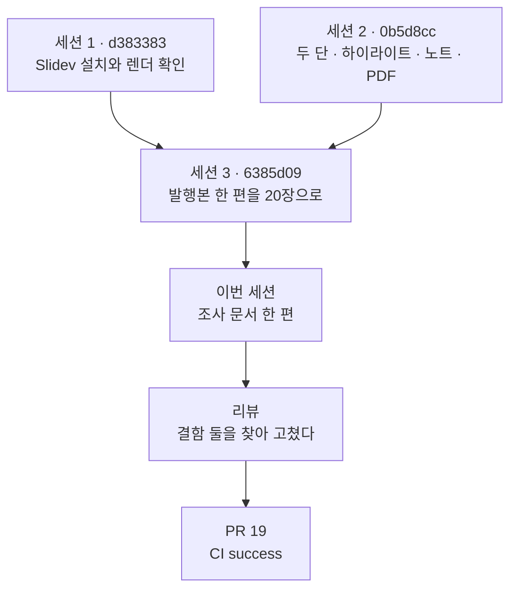
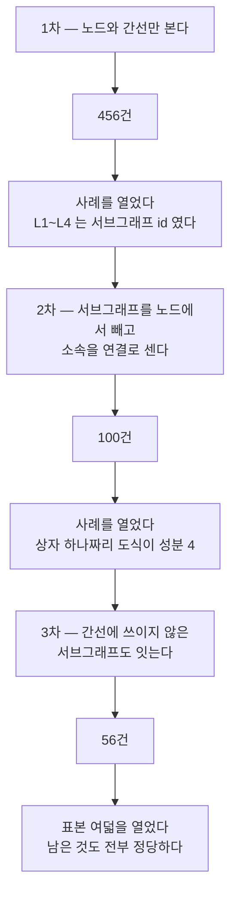
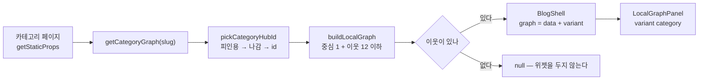
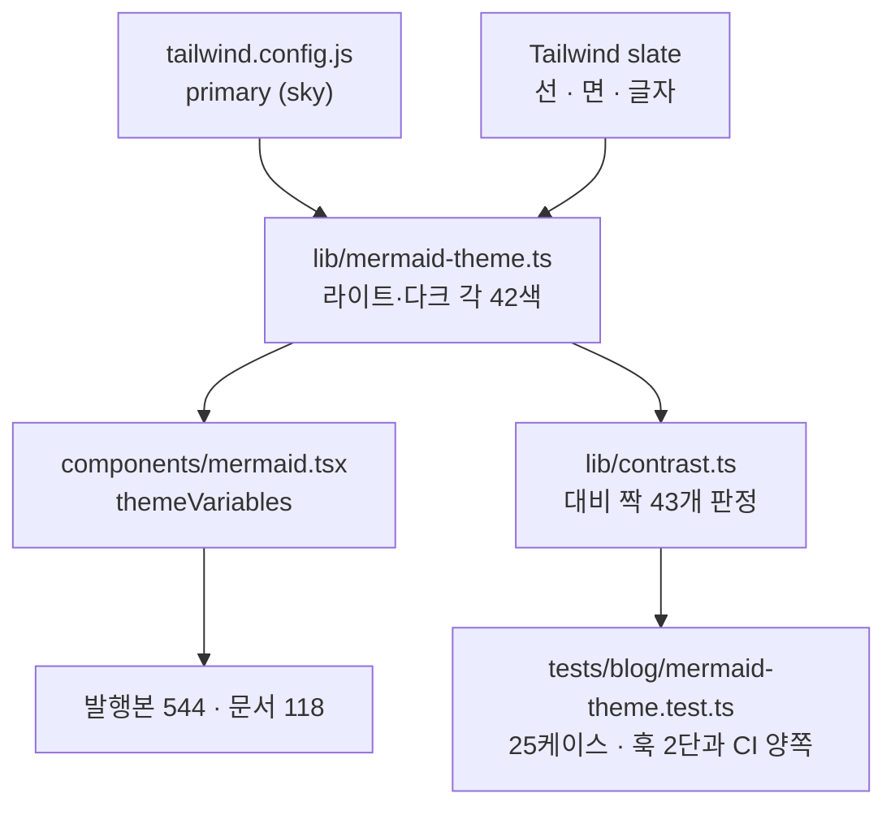
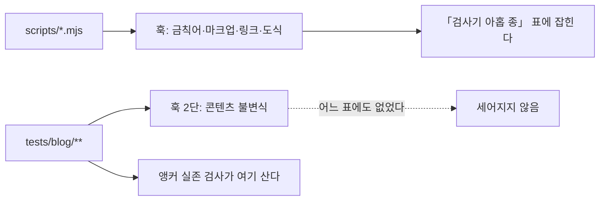

# HANDOFF

> 마지막 갱신 2026-09-09 · `pm-practice` 배치 **편8/8 발행 — 시리즈 완결** · 발행본 **192편** ·
> **대조군을 둘 놓아야 초과가 100% 갈린다.**
>
> **이번 세션 —** 편8 [`global-decision-and-communication`](content/blog/product-management/global-decision-and-communication.md)(**22,499 B** · 목표 21,546 · 밴드 20,273 ~ 22,820 · 역산 k **2.055**)를
> 발행하며 `product-management-practice` 시리즈를 닫았다. 원본 `10-글로벌-협업` 의 §5~§7 을
> 배정받아 주간 공유 · 의사결정의 구조 · 소통 원칙 셋 · 케이스 스터디 · 자리 잡기를 다룬다.
> 함께 `CHANGELOG.md` 본체를 규칙대로 세 절로 줄였다 — 편5 절을 월별 파일로 옮겼다.
> PR [#27](https://github.com/withwooyong/withwooyong.github.io/pull/27) 이며 PR 단계 CI run
> `34318644234` 이 **success** 였다.
>
> 🔴 **초고가 세 편 연속 규칙 16 을 발동했으나(+13.6%) 폭은 절반으로 줄었다.** 편6 · 편7 이
> +24% 대였던 것과 다르다. 원인을 가를 때 **대조군을 둘** 놓았다 — 편7 최종과 목표 자체다.
> **편7 최종만 쓰면 초과의 39%가 설명되지 않고 남는데, 그 몫은 편7 자신이 목표를 +5.1% 넘겨
> 착지한 값이다.** ⇒ **앞 편 최종만 대조군으로 삼으면 그 편의 초과분이 분해에 이월되어 보이지
> 않는다.** 목표를 함께 놓자 배율 **86.5%** · 고정 3절 **13.6%** 로 100%가 갈렸다.
>
> ✅ **§10-7-b 의 예고가 이번에는 최댓값을 짚었다.** 편7 이 「짧은 원본과 함께 도식 · 접합을
> 같이 넣는 절도 표시하라」고 남긴 대로 여덟 절을 미리 갈랐고, **두 위험이 겹쳐 유일하게 🔴 로
> 표시한 §5-1 이 초고 3.84 · 최종 3.076 으로 최고**였다. 편7 의 최고(2.861)보다 크다.
> ⇒ **접합 문단은 원본에 대응물이 없으므로 짧은 원본에 얹으면 배율이 3을 넘는다.**
>
> 🔴 **§6-1 의 형제편 outbound 세기 명령이 형제편만 세지 않는다.** 마지막 편이라 발행 직전에
> 돌렸더니 **8** 이 나왔는데 세어야 할 형제편은 일곱이고, 여덟째는 `product-management-map`
> 으로 **다른 시리즈의 지도편**이었다. 형제편이 여섯이고 기존 시리즈 링크가 둘이어도 같은 8 이
> 나온다. ⇒ **슬러그 일곱 개를 하나씩 `grep -c` 로 대조해** 전부 1 이상임을 확인했다.
> **「세는 명령」에는 세는 대상을 함께 적어야 한다.**
>
> 🔴 **`dup-scan` 이 잡은 30자는 「정형 문구」가 아니라 답습이었다.** 「이 편이 쓴 용어」 절의
> 도입 문장을 편7 에서 그대로 가져왔는데, 같은 자리를 여덟 편에서 `grep` 하니 **편7 만 그렇게
> 적고 편5 · 편6 은 다른 문구를 쓴다.** ⇒ **정형과 답습은 「다른 편이 몇 개 쓰는가」로 갈린다.**
> `dup-scan` 2건 · `source-overlap` ① 2건이 **넷 다 결함**이었고 전부 고쳐 썼다.
>
> ⚠️ **§6-2 의 접합부를 세 편 연속으로 새로 찾았다.** 도메인 8편에서 「커뮤니케이션」과
> 「소통」이 **0건**이지만 [`tactics-and-goal-setting`](content/blog/product-management/tactics-and-goal-setting.md) 의 **18 · 20 · 35행**이 같은 주제를
> 다른 낱말로 다룬다. **낱말이 0건이라는 사실이 접합면이 없다는 뜻은 아니다** — 편7 은 자리
> 자체가 없었고 편8 은 찾으니 있었다.
>
> ---
>
> **아래 문단들은 편7 세션(2026-09-09)의 기록이다.**
>
> **편7 세션 —** 편7 [`global-collaboration-process`](content/blog/product-management/global-collaboration-process.md)(**24,113 B** · 목표 22,953 · 밴드 21,578 ~ 24,328 · 역산 k **2.068**)를
> 발행했다. 원본 `10-글로벌-협업` 의 §1~§4 를 배정받아 사람을 들이는 과정, 두 매니저 자리의
> 분담, 관문으로 다루는 검토와 추진, 도구 위의 진행 관리를 다룬다. 함께 편3 의 조사 오타를
> 고치고 `CHANGELOG.md` 본체를 규칙대로 세 절로 줄였다 — 다섯 절을 월별 파일로 옮겼다.
> PR [#26](https://github.com/withwooyong/withwooyong.github.io/pull/26) 이며 PR 단계 CI run
> `34309951387` 이 **success** 였다. PR 은 merge 커밋 `eb92250` 으로 닫혔고 배포 run
> `34312159739` 도 **success** 다.
>
> 🔴 **초고가 두 편 연속 규칙 16 을 발동했고(+24.2%) 원인의 비중이 편6 과 달랐다.** 편6 최종을
> 대조군으로 놓고 갈랐더니 초과의 **80.9%가 배정 절의 배율**이고 **19.1%가 고정 3절**이었다.
> ⇒ **§10-6-b 의 절차는 유효하지만 결론은 편마다 다르다** — 편6 은 대조군이 고정 3절을 원인에서
> 뺐는데 편7 초고는 6,153 B 로 편5 · 편6 둘 다보다 커서 뺄 수 없었다. **대조군을 세우는 절차가
> 「고정 3절은 언제나 원인이 아니다」를 뜻하지 않는다.**
>
> 🔴 **§10-6-f 의 예고는 맞았으나 최댓값은 예고 밖에서 나왔다.** 원본이 가장 짧은 두 절이
> 2.38 대로 튄 것은 예고대로였지만 **최고는 §3-3 (2.861)** 이고 그 원본은 짧지 않다 — 도식
> 하나와 기존 편으로 건너가는 접합 문단이 함께 들어간 자리였다. ⇒ **편8 은 짧은 원본과 함께
> 「도식 + 접합을 같이 넣는 절」도 미리 표시하라.**
>
> 🔴 **§6-2 가 편7 에 남겨 둔 접합부는 낱말이 없는 자리였다.** 도메인 8편에서 「글로벌」이 두
> 편에 각 1회뿐이라 접합면이 성립하지 않아 [`planning-and-product-ops`](content/blog/product-management/planning-and-product-ops.md) 로 바꿨다.
> ⇒ **설계서의 칸이 편 이름이 아니면 채우는 일이 아니라 찾는 일이다.**
>
> ⚠️ **Bash 히어독이 긴 한글 스크립트에서 통째로 실패했다** (`unexpected EOF while looking for
> matching`). 파이썬 스크립트를 `Write` 로 파일에 쓴 뒤 실행하는 방식으로 바꿨다. 그리고
> `print` 문의 엠대시가 `cp949` 로 죽었지만 **임시 파일에 쓴 뒤 `os.replace` 하는 순서였으므로
> 설계서는 온전했다** — §10-6-e 의 대응이 실제 상황에서 작동했다.
>
> ---
>
> **아래 문단들은 편6 세션(2026-09-09)의 기록이다.**
>
> **편6 세션 —** 편6 [`roles-and-organizational-culture`](content/blog/product-management/roles-and-organizational-culture.md)(**20,909 B** · 목표 20,009 · 밴드 18,845 ~ 21,172 · 역산 k **2.059**)를
> 발행했다. 원본 `12-팀빌딩` 의 §4~§7 을 배정받아 직무 · 직급 · 직책의 구분, 팀 빌딩에서
> 제품 담당자가 하는 일, 국내 조직문화 세 유형의 비교를 다룬다. PR [#25](https://github.com/withwooyong/withwooyong.github.io/pull/25) 이며 PR 단계
> CI run `34304057103` 이 **success** 였다. PR 은 merge 커밋 `871bf73` 으로 닫혔고 배포 run
> `34304850034` 도 **success** 다.
>
> 🔴 **초고가 목표를 24.0% 넘겨 규칙 16 을 편3 이후 처음으로 다시 발동했다.** 절별 배율이
> 초과를 **배정 절(+1,887 B)** 과 **고정 3절(+2,087 B)** 두 갈래로 갈랐는데, **편5 를 대조군으로
> 세우자 뒤쪽이 원인 목록에서 빠졌다** — 편5 도 고정 3절이 상수를 1,577 B 넘긴 채로
> k = 2.076 을 냈기 때문이다. ⇒ **고정 비용 상수는 그 세 절의 실제 바이트가 아니라 배율에
> 흡수되는 몫이다.** 배율이 튄 절은 전부 **원본이 짧은 자리**였다(원본 372 B 에 배율 4.301).
>
> 🔴 **설계서를 편집하다 파일을 0 B 로 잘랐다.** `io.open(p, "w")` 가 여는 순간 비우고
> `write()` 가 인코딩 오류로 죽으면 빈 파일만 남는다. `git checkout HEAD --` 로 복구했다.
> ⇒ **읽고 쓰는 치환은 `Edit` 도구로 하라.**
>
> ---
>
> **아래 문단들은 편3 세션(2026-09-08)의 기록이다.** 편4 · 편5 세션이 이 머리말을 갱신하지
> 않아 두 세션 동안 낡아 있었다. 편4 이후의 실측은 「지금 상태」 절과 그 아래 세션 기록을 보라.
>
> 🔴 **초과의 출처가 편2와 정반대였다.** 초고가 20,459 B 로 목표를 19.2% 넘겼을 때 규칙 16
> 대로 절별 배율을 먼저 쟀더니, 편2 는 초과의 59.4%가 배율 **밖**이었는데 이번은 **67.1%가
> 배율 안**이었다. ⇒ **상수 3,746 을 다시 건드리지 않았다.** 편2 가 대조군 없이 세운 값에
> 첫 대조군이 붙은 것이며, 고정 비용은 여전히 1,144 B 초과이므로 **편4 가 두 번째 대조군이다.**
>
> 🔴 **배정에서 뺀 경력 메모가 절 구성으로 새어 들어와 있었다.** 배율이 가장 높은 절
> (§3 대응부 2.667)의 안에 「이름이 같아서 틀리는 두 쌍」이라는 절 하나가 통째로 있었는데,
> 그 내용은 원본 §3 의 **경력 메모 블록이 강조한 것**이고 배정 안에는 정의만 있다.
> ⇒ 절을 접었다. **새어 들어오는 경로가 인용이 아니라 「강조의 배분」이라는 것**이 이번에
> 드러났다 — 블록을 옮기지 않아도 그 블록이 무엇을 중요하다고 말했는지는 남는다.
>
> ⚠️ **설계서의 「복제를 지우면 분량이 는다」가 반증됐다.** 앞 배치 실측 +232 B 에 대해
> 이번은 **−11 B** 였다. ⇒ **그 규칙은 방향이 아니라 「다시 재라」로만 읽는다.**
>
> ⚠️ **출처 표기를 시리즈 관례로 맞췄다.** 초고가 「강의」를 5회 썼는데(`check-forbidden`
> SOFT), 편1·편2 를 실측하니 **한 번도 쓰지 않았다.** 5건을 전부 일반 명제로 다시 썼다.
> 반대로 편2 가 예고한 「면접」 SOFT 는 **0건**이다 — `IDI/FGI` 를 「면담」으로 적었기 때문이며,
> **금칙어 예고는 어느 낱말을 쓸지가 아직 정해지지 않았다는 것을 함께 적어야 한다.**
>
> 함께 실은 것은 PR [#20](https://github.com/withwooyong/withwooyong.github.io/pull/20) 의 merge 커밋과 배포 run 을 아래 「푸시 · 배포」 행에 채운 것이다.
> 이 세션의 산출은 PR [#22](https://github.com/withwooyong/withwooyong.github.io/pull/22) 이며 CI run `34181470670` 이 **success** 였다
> (전체 133초 · `deploy` 는 PR 이라 건너뛴다).
>
> 🆕 **그 뒤의 기록 갱신 —** PR #20 · #21 · #22 가 전부 `main` 에 닫혔고, 이 커밋이 세 PR 의
> **merge 커밋과 배포 run 을 상태 표에 채운 것**이다. `4d924ae`(run `34092570743`) ·
> `fb737d8`(run `34111770418`) · `0ae98c5`(run `34182320489`)이며 셋 다 배포까지 **success** 다.
> 🔴 **「뒤이은 세션이 채운다」로 남겨 둔 행이 네 개까지 쌓여 있었다** — 문서 갱신만을 위한
> PR 을 열지 않는 규칙 때문에 기록이 한 칸씩 뒤처지는데, 그것을 **다음 실질 작업의 PR 이
> 아니라 병합 직후에 바로 채우면** 밀리지 않는다.
>
> 🔴 **같은 함정을 두 세션이 각각 썼고, 이쪽 판을 버렸다.** 이 세션도 `CLAUDE.md` 가 비워 둔
> 자리에 백슬래시 함정을 50번으로 썼는데, 병렬로 진행된 PR [#21](https://github.com/withwooyong/withwooyong.github.io/pull/21) 이 같은 번호에 더 깊은
> 판을 이미 넣어 두었다 — 기전 분포를 리포 전량으로 실측했고 `check-table` 검사기까지 만들었다.
> ⇒ **워크트리를 갈라 놓아도 문서의 「다음 빈 번호」는 공유 자원이라 충돌한다.** 병렬 세션이
> 있을 때 번호를 새로 쓰려거든 **`origin` 을 먼저 fetch 해서 그 번호가 아직 비어 있는지 보라.**
>
> 🔴 **그 자리를 52번이 대신했고, 이번 실측은 아래 「뮤턴트를 `git checkout --` 로 복구하면」
> 절의 조건을 넓힌다.** 병합 뒤 검사를 다시 돌리니 `mutate` 가 105개 중 **7개를 「치환 실패」로**
> 보고했다. 지침대로 코드를 뒤졌으나 `origin/main` 과 검사기 넷의 차이가 **0줄**이었고,
> 원인은 그 절이 이미 적어 둔 **CRLF 체크아웃**이었다. 다만 그 절은 조건을 「`git checkout --`
> 로 원복했을 때」로 달아 **「손으로 끼어들 때만 이 자리가 열린다」로** 맺었는데,
> **워크트리 생성도 체크아웃이라 갓 만든 워크트리는 처음부터 열려 있다.** 원복은 한 파일만
> CRLF 로 만들어 3건이었고 워크트리 생성은 검사기 전부를 그렇게 만들어 **7건**이다 —
> 건수의 차이가 곧 조건이 넓다는 증거다. 정규화하고 다시 돌리니 **105개가 전부 잡혔다.**
>
> ⚠️ **곁가지를 인과로 착각할 뻔했다.** `scripts/mutate.mjs` 의 NUL 바이트 하나가 이 파일만
> binary 로 만든다는 것을 원인 사슬에 넣어 적었다가 실측으로 지웠다 — 러너를 CRLF 로 바꿔도
> `from` 은 **똑같이 LF** 라 매칭이 바뀌지 않는다. 그 NUL 이 하는 일은 `grep` 을 막는 것뿐이다.
>
> ---
>
> 🔴 **아래는 직전 세션의 기록이다.**
> **표 검사기 갈래 —** 이 아래는 PR [#21](https://github.com/withwooyong/withwooyong.github.io/pull/21) 로 닫힌 갈래의 기록이며 그 시점의 발행본은 **186편**이었다.
> **표의 열 수를 보는 검사기를 만들고 발표본을 넷 더했다.**
>
> 🔴 **직전 세션이 「표본이 한 문서뿐이라 검사기를 만들지 않는다」고 판정한 것을 이 세션이 반증했다.**
> 리포 전량을 세니 표 **3,778개** 중 어긋난 행이 **4곳**(발행본 2 · 문서 2)이었고 넷 다 진짜였다.
> 기전 분포도 예상과 달라 **넷 중 셋이 코드 스팬 안의 세로줄**이었고, 처음 지목했던 `sed` 백슬래시는
> **0건**이었다. ⇒ **표본이 적다는 판단은 전량을 세어 본 뒤에 하라.**
>
> 🔴 **발표본의 넘침을 처음 잰 값이 거짓 0 이었다.** 인쇄 화면은 첫 장 말고는 `display:none` 이라
> 높이가 전부 0으로 나오는데, 그 0을 「넘치지 않는다」로 읽으면 119장이 통째로 검사되지 않는다.
> **일부러 넘치게 만든 카나리를 먼저 세워** 측정이 살아 있는지 본 뒤에야 0을 결론으로 썼다.
>
> 🔴 **이 시점의 기록은 두 갈래가 병렬로 진행된 결과다.** 하나는 `content/pm-po-domains`
> (설계서 · 편1 · 편2 · 도식 잘림 교정)이고 다른 하나는 `research/presentation-format`
> (Slidev 형식 조사)이다. 뒤엣것이 PR [#19](https://github.com/withwooyong/withwooyong.github.io/pull/19) 로 먼저 `main` 에 들어갔고, 앞엣것이 PR
> [#20](https://github.com/withwooyong/withwooyong.github.io/pull/20) 이다. **문서 넷이 충돌했고 이 갱신이 그것을 합친 것이다** — 아래 두 요약은
> 어느 쪽이 「직전」인지가 아니라 **서로 다른 갈래**임을 뜻한다.
>
> ---
>
> **`pm-po-domains` 갈래 —** 편1·편2 를 발행하고 **도식 라벨 잘림**을 닫았다.
>
> 🔴 **원인은 폰트 이름이 아니라 「재는 자리」와 「그리는 자리」가 다르다는 것이었다.**
> mermaid 는 라벨 폭을 재려고 임시 컨테이너를 **`document.body` 바로 아래**에 붙이는데
> (`render` 에 `svgContainingElement` 를 주지 않는 경로이며, 그 경로에서는
> `initialize({ fontFamily })` 가 **인라인 스타일로도 걸리지 않는다**), 도식이 실제로 그려지는
> 자리는 `font-sans` 가 걸린 본문 안이다. `next/font` 의 `--font-inter` 변수가 `_app.tsx` 의
> `<div>` 에만 있어 `body` 는 브라우저 기본 글꼴로 떨어지고, 두 자리의 글꼴이 갈렸다.
> `foreignObject` 는 SVG 사양상 자기 폭 밖을 클리핑하므로 마지막 글자가 잘린다.
>
> ⚠️ **첫 가설을 브라우저가 기각했다.** `document.body.style.fontFamily` 를 본문과 같게 맞추고
> 재렌더시켰는데 폭이 **소수점까지 그대로**였다(재렌더 자체는 SVG 의 다크 `fill` 로 확인했다).
> 확정은 **같은 문자열을 두 컨텍스트에서 직접 잰 것**이 냈다 — 「순이익」이 body 기본 글꼴에서
> **38.65**, Inter 체인에서 **42** 였고 앞의 값이 `foreignObject.width` 와 **소수점까지 일치**했다.
> 도식만 body 글꼴로 강제하니 넘침이 **17 → 0**, 되돌리니 다시 **17** 이었다.
>
> **고친 방식 —** 상속에 맡기지 않고, 도식이 그려질 자리에서 `getComputedStyle` 로 **이미
> 해석된** 폰트 스택을 읽어 넘긴다(`resolveDiagramFontFamily`). 계산된 값은 `var()` 가 풀린
> 뒤이므로 body 아래의 측정 컨테이너에서도 똑같이 해석된다.
> **실측은 여섯 편 · 도식 29개 · 라벨 361개 · 라이트와 다크 모두 넘침 0** 이다
> (수정 전은 편2 34개 중 17 · `search-system-overview` 35개 중 17 · `pm-practice-map` 16개 중 5).
> 🔴 **포털이 함께 닫혔다** — 확대 뷰어는 `body` 아래에 그려지는데 폰트 스택이 SVG 자체에
> 박히므로 본문과 같은 글꼴이 된다(라벨 **18개 0**). [함정 47번](docs/TOOL-TRAPS.md)의 색 문제와 같은 자리다.
>
> ⚠️ **이 결함은 단위 테스트로 재현할 수 없다.** jsdom 에는 레이아웃이 없어 `scrollWidth` 가
> 언제나 0이다. 그래서 고정한 것은 잘림 자체가 아니라 **상속 키워드가 다시 들어오는 길**이다 —
> 케이스 **여섯**과 뮤턴트 **둘**(TH19 · TH20)이며 둘 다 잡혔다.
> ⚠️ **`scripts/mutate.mjs` 를 한 번 0바이트로 만들었다.** 서로게이트가 든 파일에 파이썬
> 텍스트 모드로 쓰면 **파일이 비워진 뒤 인코딩 오류로 쓰기가 실패한다.** 미커밋 변경이 없어
> `git checkout HEAD --` 로 복구했다. ⇒ **그런 파일은 `'rb'`/`'wb'` 로 다뤄라.**
>
> 그 앞에는 편2(`product-cycle-and-metric-hierarchy` · 24,596 B)를 발행하며 예산 공식을 고쳤다.
> 🔴 **k 는 옳았고 고정 비용 상수가 틀렸다** — 초고가 16.6% 넘쳤을 때 절 목록이 아니라 **절별
> 배율**을 먼저 쟀더니 초과의 **59.4%가 배율 밖**에서 나왔고, 상수 2,455 가 같은 카테고리 기존
> 본편 셋(3,429 · 3,278 · 4,530)의 어느 값에도 닿지 않았다. ⇒ **목표 B = 3,746 + 배정 원본 B ×
> 1.95 + 링크 몫** 으로 고쳤고 **편3~편8 이 일률적으로 +1,291 B 씩 올랐다.** 가설 H-1 은 분해
> 셋(2.104 · 1.933 · 1.972) 어느 것도 산문 축 아래로 가지 않아 **기각**했다.
> 그 앞에는 편1 지도편(21,803 B)을 발행하고 문서 셋을 반증했으며, 그 앞에서 사용자가
> **`pm-po` 선별 4개**를 골라 분할 설계서를 냈다.
>
> ---
> **`presentation-format` 갈래 —** 앞선 세 세션의 Slidev 검증을 조사 문서 한 편으로 모았다.
> 마크다운 발행본을 발표 슬라이드로 옮길 수 있는지가 물음이었고, 답은 **기능은 전부
> 동작하고 걸리는 것은 분량과 링크**다. 넘친 슬라이드 네 장은 **전부 표가 있는 장**이었고
> 도식 장은 하나도 넘치지 않았다 — 도식은 `scale` 로 통째로 줄지만 표에는 그 손잡이가 없다.
> 조사는 [`2026-09-06-presentation-format-survey.md`](docs/superpowers/reports/2026-09-06-presentation-format-survey.md) 에 있다.
> 콘텐츠와 코드는 한 줄도 바뀌지 않았고 검사기 종 수 · 뮤턴트 수 · `tests/blog` 도 그대로다.
>
> 🔴 **PR 을 열었더니 `no checks reported` 가 나왔다.** 트리거는 정상이었는데 PR 이
> `CONFLICTING` 이라 GitHub 이 병합 ref 를 만들지 못했고, 그래서 **워크플로 이벤트 자체가
> 발생하지 않았다.** 「검사가 초록이 아니다」가 아니라 **「검사가 없다」였다.** `main` 을
> 병합해 충돌을 풀자 그제서야 돌았다. ⇒ **PR 을 열었으면 run 이 실제로 생성됐는지를 따로 보라.**
>
> 🔴 **`git ls-files` 로 대상을 모으는 검사기는 추적되지 않은 파일을 보지 않는다.** 새 문서를
> 쓰고 문서 검사 셋을 돌려 **62개 파일 · 위반 0** 을 받았는데 그것이 거짓 0 이었다.
> `git add` 뒤 **63개 파일 · 마크업 위반 2회**가 드러났다.
>
> **직전까지의 상태 —** 직전 세션이 도식 663개의 의미를 조사하고 **검사기를 만들지 않기로
> 판정했다** (우선순위 5번). 그 세션의 PR [#18](https://github.com/withwooyong/withwooyong.github.io/pull/18) 은 merge 커밋 `0a0583d` 로 닫혔다.
> 🔴 그 세션은 **위반이 쏟아졌을 때도 그것이 참인지 같은 방법으로는 알 수 없다**는 것을
> 보였다 — 456건에서 시작해 56건이 남았고 그 56건도 전부 정당한 도식 관용구였다.
> 그 앞 두 세션에서는 **테스트도 빌드도 산출물 문자열도 통과한 뒤에 브라우저가 결함을 냈다**
> ([함정 47번](docs/TOOL-TRAPS.md)). 이번 세션의 두 결함은 **브라우저가 아니라 파서가** 냈다.

## 지금 상태

발행본 **192편**이다. 앞 배치가 편8로 끝난 뒤 열네 세션이 검사기의 사각지대를 닫았고, 그 뒤
설계서 · 편1 · 편2 · 편3 · 편4 · 편5 · 편6 · 편7 · **편8** 이 이어졌다.
✅ **`product-management-practice` 시리즈가 여덟 편으로 완결됐다.**

✅ **§3-2 의 예산표가 여섯 편 연속으로 지지되었다.** 역산 k 가 편3 2.050 · 편4 2.033 · 편5 2.076 ·
편6 2.059 · 편7 2.068 · 편8 **2.055** 로 **0.043 폭 안**에 모였고 여섯 다 밴드(1.81 ~ 2.09) 안이다.
⇒ **다음 `pm-po` 배치는 k 를 1.95 가 아니라 2.05 에서 출발시켜라** (§10-8-f).

🔴 **편7 의 초고도 목표를 24.2% 넘겨 규칙 16 이 두 편 연속 발동했다.** 편6 최종을 대조군으로
놓고 갈랐더니 초과의 **80.9%가 배정 절의 배율(+3,977 B)** 이고 **19.1%가 고정 3절(+940 B)** 이었다.
⇒ **편6 은 대조군이 고정 3절을 원인 목록에서 뺐지만 편7 은 뺄 수 없었다** — 편5 · 편6 이
5,213 ~ 5,323 B 를 쓰는데 편7 초고는 6,153 B 였고 용어 표가 한 행 늘어난 것으로는 설명되지
않는 크기였다. **절차가 같아도 결론은 편마다 다르다.**

🔴 **편6 의 초고가 목표를 24.0% 넘겨 규칙 16 을 편3 이후 처음으로 다시 발동했다.** 절 목록이
아니라 절별 배율을 먼저 쟀고, 초과가 **배정 절의 배율(+1,887 B)** 과 **고정 3절(+2,087 B)** 두
갈래로 갈렸다. **편5 를 대조군으로 세우자 뒤쪽이 원인 목록에서 빠졌다** — 편5 도 고정 3절이
상수를 1,577 B 넘긴 채로 k = 2.076 을 냈기 때문이다. ⇒ **고정 비용 상수는 그 세 절의 실제
바이트가 아니라 배율에 흡수되는 몫이다.** 대조군이 없었다면 손댈 필요 없는 도입과 정리를
깎고도 초과가 남았을 것이다.

⚠️ **배율이 튄 절은 전부 원본이 짧은 자리였다.** §4-2 는 원본 372 B 에 배율 **4.301**,
§5-3 은 639 B 에 **3.397** 이었다. 옮길 것이 적으면 그 자리를 설명으로 채우게 된다.

🔴 **편7 이 그 예고를 따랐고 예고의 한계도 함께 드러났다.** 짧은 원본을 먼저 표시했더니 원본
최단인 §3-1(725 B → 2.385) · §3-2(910 B → 2.375)가 예고대로 튀었으나 **최고는 §3-3 (2.861)** 이고
그 원본은 1,162 B 로 짧지 않다. 도식 하나와 기존 편으로 건너가는 접합 문단이 함께 들어간
자리였다. ⇒ **편8 은 짧은 원본과 함께 「도식 + 접합을 같이 넣는 절」도 미리 표시하라.** 배율만
보면 짧은 절이 튀지만 **절대 초과량은 이쪽이 더 크다.**

| 항목 | 값 |
| --- | --- |
| 발행 완료 | **A 편1~9 + B 편1~편8 + `pm-practice` 편1~편8 (192편)** · 새 시리즈 **8/8 완결** |
| 검사기 | ✅ `scripts/` **열한 종**(🆕 `check-table`) + `tests/blog/` **14파일 200케이스** · 뮤턴트 **105개** |
| 도식 팔레트 | ✅ `lib/mermaid-theme.ts` — 라이트·다크 각 **42색** · 대비 짝 **43개**(글자 21 · 비텍스트 22) · 위반 **0** · 브라우저 실측 **양쪽 모드 0** |
| 🆕 도식 라벨 폭 | ✅ **닫았다.** 그려질 자리에서 해석된 폰트 스택을 `mermaid.initialize` 에 넘긴다(`resolveDiagramFontFamily`). 브라우저 실측 **여섯 편 · 라벨 361개 · 라이트와 다크 모두 넘침 0** 이고 확대 뷰어도 **18개 0** 이다. 판정은 jsdom 으로 못 한다 — 케이스 여섯과 뮤턴트 둘이 지키는 것은 **상속 키워드가 다시 들어오는 길**이다 |
| 훅 | ✅ 발행본 **11단** · 문서 **8단** · 코드만이면 즉시 통과 (🆕 표 증명 · 표 스캔이 각각 끝에 붙었다) |
| CI | ✅ `build` **26스텝** + `deploy` 1스텝 · **`main` 푸시와 PR 양쪽에서 돈다** (PR 은 25스텝) |
| ⚠️ CI 스텝 수를 세는 법 | `gh run view --json jobs` 는 `build` 를 **30스텝**으로 보고한다. 러너가 `Set up job`·`Post Setup Node`·`Post Checkout`·`Complete job` **넷**을 붙이기 때문이다. 문서의 수(지금은 **26**)는 워크플로 정의의 것이며 둘 다 맞다 — **다른 수를 대조하고 「문서가 낡았다」고 판단하지 마라.** 🔴 **이번 세션이 정확히 그 실수를 했다** — 27 을 보고 「23 은 낡았다」고 사용자에게 보고했다가 이 행을 읽고 되돌렸다. 이 행이 없었다면 멀쩡한 문서를 고쳤을 것이다 |
| 강조 렌더 실패 | ✅ 발행본 **0회 · 187편** · 리포 문서 **0회 · 75개** |
| 깨진 링크 | ✅ 발행본 **0곳** · 리포 문서 **0곳** |
| 깨지는 도식 | ✅ 발행본 **0곳**(552개) · 리포 문서 **0곳**(176개) — **판정 도달 전량** · 합계 **728개** |
| 표의 열 수 | ✅ 🆕 **`check-table` 이 본다.** 리포 전량 실측에서 표 **3,778개** 중 어긋난 행 **4곳**(발행본 2 · 문서 2)을 찾아 넷 다 고쳤다 — 기전 넷 중 **셋이 코드 스팬 안의 세로줄**이었고 처음 지목한 `sed` 백슬래시는 **0건**이었다. 자기 검사 22건 · 뮤턴트 TB1~TB7 · 훅과 CI 양쪽에서 돈다. 편3 과 함정 52번을 얹고 다시 재니 표 **3,898개**(발행본 2,081 · 문서 1,817)에 어긋난 행 **0개**다 |
| 도식의 의미 | ✅ 조사를 마쳤고 검사기를 만들지 않기로 판정했다. 다시 꺼내려거든 아래 판정 절의 셋을 먼저 반박하라 |
| 발표 슬라이드 | ✅ 🆕 **발표본이 넷이다.** `slides-patterns` 29장 · `slides-team-ops` 30장 · `slides-governance` 25장 · `slides-search` 35장(`pages/` 로 6부 분할). 조사 문서가 「확인하지 않았다」고 남긴 `pages/` 분할이 **실제로 빌드된다.** 119장의 넘침을 카나리 대조군을 세워 실측해 **6장**을 찾았고 표 패딩을 줄여 전부 552px 안으로 넣었다 |
| 앵커 실존 | ✅ **28개 전부 헤딩에 닿는다** — 훅과 CI 양쪽에서 돈다 |
| 🆕 검색 인덱스 | ✅ `out/blog/search-index.json` · 🆕 **192편 · 헤딩 2,763개 · 325 KB** (2026-09-09 빌드 실측 · 편8 포함). 산출물 금칙어는 🆕 **553개 파일에서 HARD 0회**이고 sitemap 은 🆕 **280개 URL** 이다. 앞 세션(편7)의 값은 191편 · 헤딩 2,753개 · 323 KB · 551개 파일 · 279 URL 이었다 |
| 지역 그래프 위젯 | ✅ **본문과 카테고리 목록** 사이드바 하단 · 이웃 상한 **12** · 초과분은 `+N` · `tall`(높이 720px) 미만이면 감춘다 |
| 카테고리 그래프 | ✅ 피인용 최다 편을 허브로 삼는다(동점은 나가는 링크 → id 사전순) · **중심이 링크다** · 캡션은 `h-12`(3줄) · 카테고리 **여덟 전부**에서 그려진다 |
| 🆕 빌드 시간 | 🆕 **103초** (2026-09-09 · 편8 · **갓 만든 임시 워크트리의 첫 빌드**다. 같은 조건이던 편7 의 48.3초보다 두 배인데 부하가 다른 시각이라 **둘을 배율로 읽지 마라** — 워크트리·캐시 조건이 같아도 절대 시간은 흔들린다). 종전 **48.3초** (2026-09-09 · 편7 · 같은 조건). 종전 **30.3초** (2026-09-06 실측) — 편 목록 캐시 뒤의 값이다. **같은 세션 대조군은 38.4초**(캐시만 끔)였다. 종전 기준선 55.9초는 다른 날 다른 부하에서 잰 값이라 직접 비교하지 마라 |
| 분량 하한 SOFT | **3편** (세션 시작 5편) — 남은 셋은 **정당하다고 판정했다.** 아래 판정 표를 보라 |
| 🆕 커밋 | 🆕 이번 세션은 `content/pm-practice-part8` 에서 둘이다 — 편8 발행 `4931fce` · 빌드 실측과 PR 을 채운 이 커밋이다. 앞 세션은 `content/pm-practice-part7` 에서 둘이었다 — 편7 발행 `e4b9f4e` · 빌드 실측과 PR 을 채운 이 커밋이다. 앞 세션은 `content/pm-practice-part3` 에서 넷이었다 — 문서·함정 `ee9c68c`(그때 쓴 50번은 아래대로 버렸다) · 편3 발행 `2ef9e60` · 표 검사기 갈래 병합 `b904194` · 함정 52번과 수치 갱신이다. 그 앞은 두 갈래가 병렬로 진행됐다: `pm-po-domains` 가 설계서 `dce2b01` · 편1 `3b0530d` · 편2 `aa76d40` · 도식 배치 교정 `422c0a4` · **라벨 잘림 교정 `1573ae7`** 로 PR [#20](https://github.com/withwooyong/withwooyong.github.io/pull/20) → merge `4d924ae`, `presentation-format` 이 `08925ee` 외 넷으로 PR [#19](https://github.com/withwooyong/withwooyong.github.io/pull/19) → merge `20eb85e` 다 |
| 푸시 · 배포 | ✅ **PR [#20](https://github.com/withwooyong/withwooyong.github.io/pull/20) 이 merge 커밋 `4d924ae` 로 닫혔다.** 배포 run `34092570743` 이 **success** 였고 전체 **159초** · `build` **142초** · `deploy` **9초** 였다. ⚠️ 그에 앞서 PR #19 가 먼저 merge 되어 `main` 이 **9커밋** 전진했고 PR #20 이 `CLEAN` → **`DIRTY`** 가 되었다 — **충돌은 문서 넷뿐이었고 코드와 콘텐츠는 겹치지 않았다.** 그 병합이 커밋 `3dded94` 다. PR 단계의 CI 는 run `34037314763` **success**(전체 **133초** · `build` **130초** · `deploy` **skipped**)였다 |
| 🆕 편8 의 푸시 · CI | ✅ **PR [#27](https://github.com/withwooyong/withwooyong.github.io/pull/27) 을 열었고 PR 단계 CI run `34318644234` 이 success 였다** (`build` **success · 30스텝 · 2분 28초** — 워크플로 정의의 26 에 러너가 넷을 붙인 수이며 `success 29 · skipped 1` 이다. skipped 하나가 `Upload artifact` 이고 `deploy` job 도 통째로 skipped 인 것은 `github.event_name != 'pull_request'` 조건대로다). `mergeable` 은 `MERGEABLE` 이고 `gh run list --branch` 로 **run 이 실제로 생성된 것**(1개)을 따로 확인했다 — 충돌하는 PR 은 빨간 것이 아니라 run 이 0개다. ⚠️ **브랜치 기점이 `origin/main` 이 아니라 로컬 `main` 의 미푸시 커밋 `2b9a987` 이다** — 편6 · 편7 과 같은 지시로, 직전 세션의 문서 갱신을 이 PR 에 함께 실었다. ⏳ **merge 와 배포 run 은 아직 비어 있다 — 승인을 받아야 한다** |
| 🆕 편7 의 푸시 · CI | ✅ **PR [#26](https://github.com/withwooyong/withwooyong.github.io/pull/26) 을 열었고 PR 단계 CI run `34309951387` 이 success 였다** (전체 **155초** · `build` **success · 30스텝 · 150초** · `deploy` **skipped** — 워크플로 정의의 26 에 러너가 넷을 붙인 수이며, `Upload artifact` 스텝과 `deploy` job 이 빠진 것은 `github.event_name != 'pull_request'` 조건대로다). `mergeable` 은 `MERGEABLE` · `mergeStateStatus` 는 `CLEAN` 이고, `gh run list --branch` 로 **run 이 실제로 생성된 것**(1개)을 따로 확인했다. ⚠️ **브랜치의 기점이 `origin/main` 이 아니라 로컬 `main` 의 미푸시 커밋 `8d0b3c9` 다** — 편6 과 같은 지시로, 직전 세션의 문서 갱신을 이 PR 에 함께 실었다. 🆕 **PR 은 merge 커밋 `eb92250` 으로 `main` 에 닫혔고**(부모 둘: `871bf73` + `8910867`, 실린 커밋 셋: `8d0b3c9` + `e4b9f4e` + `8910867`) **배포 run `34312159739` 도 success 다** (전체 **187초** · `build` **success · 30스텝 · 170초** · `deploy` **success · 3스텝 · 9초** — push 이벤트라 `Upload artifact` 와 `deploy` 가 설계대로 돌았고 skipped 가 하나도 없다). 인수인계를 채운 두 번째 커밋 `8910867` 의 PR 단계 run `34310541797` 도 **success** 였다 (전체 **162초** · `build` **30스텝 · 158초**). 🆕 **배포된 실물을 직접 확인했다** — 편7 페이지가 `HTTP 200 · 190,548 B` 로 로컬 빌드와 같은 크기이고 배포된 `search-index.json` 이 **191편**이다 |
| 편6 의 푸시 · CI | ✅ **PR [#25](https://github.com/withwooyong/withwooyong.github.io/pull/25) 를 열었고 PR 단계 CI run `34304057103` 이 success 였다** (`build` **success · 30스텝 · 150초** — 워크플로 정의의 26 에 러너가 넷을 붙인 수다. `Upload artifact` 스텝과 `deploy` job 은 설계대로 skipped). `mergeable` 은 `MERGEABLE` 이고 `gh run list --branch` 로 **run 이 실제로 생성된 것**을 따로 확인했다. ⚠️ **브랜치의 기점이 `origin/main` 이 아니라 로컬 `main` 의 미푸시 커밋 `a5e5497` 이다** — 직전 세션의 문서 갱신을 이 PR 에 함께 실으라는 지시였다. 🆕 **PR 은 merge 커밋 `871bf73` 으로 `main` 에 닫혔고**(부모 둘: `b81986d` + `30d20ae`) **배포 run `34304850034` 도 success 다** (전체 **182초** · `build` **success · 30스텝 · 163초** · `deploy` **success · 3스텝 · 12초**). 인수인계를 채운 두 번째 커밋 `30d20ae` 의 PR 단계 run `34304560309` 도 success 였다 |
| 편5 의 푸시 · CI | ✅ **PR [#24](https://github.com/withwooyong/withwooyong.github.io/pull/24) 를 열었고 PR 단계 CI run `34294874618` 이 success 였다** (`build` **success · 30스텝** — 워크플로 정의의 26 에 러너가 넷을 붙인 수다. `Upload artifact` 와 `deploy` job 은 설계대로 skipped). `mergeable` 은 `MERGEABLE` 이고 `gh run list --branch` 로 **run 이 실제로 생성된 것**을 따로 확인했다. 🆕 **PR 은 merge 커밋 `b81986d` 로 `main` 에 닫혔고**(부모 둘: `ff6aba4` + `21274a4`) **배포 run `34300603982` 도 success 다** (`build` **success · 30스텝 · 148초** · `deploy` **success · 9초**). 인수인계를 채운 두 번째 커밋 `21274a4` 의 PR 단계 run `34295171853` 도 success 였다 |
| 🆕 이번 푸시 · CI | ✅ **PR [#22](https://github.com/withwooyong/withwooyong.github.io/pull/22) 를 열었고 CI run `34181470670` 이 success 였다** (전체 **133초** · `build` **성공** · `deploy` **skipped**). `MERGEABLE` 이고 `gh run list --branch` 로 **run 이 실제로 생성된 것**을 따로 확인했다 — 충돌하는 PR 은 빨간 것이 아니라 run 이 0개다. 🆕 **PR 은 merge 커밋 `0ae98c5` 로 `main` 에 닫혔고 배포 run `34182320489` 도 success 다** (`build` **success · 30스텝 · 133초** · `deploy` **success · 9초**) |
| 🔴 `out/` 잠금은 **한 워크트리의 문제가 아니다** | 빈 디렉터리인데 `rmdir`·`mv` 가 모두 `EBUSY` 다. 리포 루트에서 처음 관측했고 **2026-09-08 세션이 `…-pm-practice` 워크트리에서도 같은 것을 겪었다** — 거기서는 `out/` 이 없는 상태로 빌드를 시작했는데도 Next 가 산출 직전 `rmdir out` 에서 죽었고, 283페이지 생성까지는 정상이었다. 삭제를 시도하면 `being used by another process` 가 뜬다. 정적 서버를 종료해도, 잔여 빌드 프로세스가 없어도 풀리지 않는다. ⇒ **워크트리를 옮겨 다녀도 피할 수 없으므로 처음부터 임시 워크트리에서 빌드하라**: `git worktree add --detach <경로> <커밋>` → junction 연결 → 빌드 → `cmd /c rmdir` 로 **junction 만** 제거 → `worktree remove --force`. 이 절차는 2026-09-08 에 다시 통과했다 (junction 제거 뒤 원본 577패키지 보존 확인) |
| 🆕 커밋 (표 검사기 갈래) | `content/presentation-decks` 넷이다 — 검사기와 발표본 `f1d8c13` · main 병합 `9b13056` · 문서 수치 `a292caa` · 기준선 기록 `9be4c1d`. PR [#21](https://github.com/withwooyong/withwooyong.github.io/pull/21) 이 merge 커밋 `fb737d8` 로 `main` 에 닫혔다 (부모 둘: `4d924ae` + `a6a595f`) |
| 🆕 푸시 · CI (표 검사기 갈래) | ✅ **PR [#21](https://github.com/withwooyong/withwooyong.github.io/pull/21) 을 열었고 CI run `34107722092` 이 success 였다** (`build` **success · 120초 · 30스텝** — 워크플로 정의의 26 에 러너가 넷을 붙인 수다. `Upload artifact` 와 `deploy` job 은 설계대로 skipped). **새 표 검사 세 스텝이 PR 에서 실제로 돌았다** — 19 `Prove table checker` · 20 `Scan published tables` · 21 `Scan repo docs tables` 가 전부 success 다. `mergeable` 은 `MERGEABLE` 이었고 그대로 merge 됐다. 🆕 **merge 뒤의 배포 run `34111770418` 도 success 다** (`build` **success · 30스텝 · 120초** · `deploy` **success · 9초**) — PR 단계와 달리 `Upload artifact` 와 `deploy` 가 설계대로 돌았다 |
| 커밋 | **두 갈래가 병렬로 진행됐다.** `pm-po-domains` 는 설계서 `dce2b01` · 편1 `3b0530d` · 편2 `aa76d40` · 도식 배치 교정 `422c0a4` · **라벨 잘림 교정 `1573ae7`** 다섯이고, `presentation-format` 은 `08925ee` 외 넷이 PR [#19](https://github.com/withwooyong/withwooyong.github.io/pull/19) → merge `20eb85e` 로 닫혔다. 그 앞은 PR [#18](https://github.com/withwooyong/withwooyong.github.io/pull/18) → merge `0a0583d` 다 |
| 푸시 · 배포 | ✅ **PR [#20](https://github.com/withwooyong/withwooyong.github.io/pull/20) 을 열었고 CI run `34037314763` 이 success 였다** (전체 **133초** · `build` **130초** · `deploy` **skipped**). ⚠️ 그 직후 PR #19 가 먼저 merge 되어 `main` 이 **9커밋** 전진했고 PR #20 이 `CLEAN` → **`DIRTY`** 가 되었다 — **충돌은 문서 넷뿐이었고 코드와 콘텐츠는 겹치지 않았다.** 이 커밋이 그 병합이다. 🆕 **PR 은 merge 커밋 `4d924ae` 로 닫혔고 배포 run `34092570743` 이 success 였다** (전체 **159초** · `build` **142초** · `deploy` **9초**) — 같은 내용이 위 「푸시 · 배포」 행에도 있다 |
| 직전까지의 푸시 · 배포 | ✅ **PR [#18](https://github.com/withwooyong/withwooyong.github.io/pull/18) 이 merge 커밋 `0a0583d` 로 닫혔다** (부모 둘: `572a849` + `5dc1aeb`). 배포 run `34021838010` 이 **success** 였고 전체 **2분 38초** · `build` **2분 21초** · `deploy` **10초** 였다. PR 단계의 CI 는 run `34021022251` **success**(전체 **2분 35초**)이며 `Upload artifact` 스텝과 `deploy` job 이 설계대로 **skipped** 되었다. ⚠️ 그 앞 run `34020945588` 은 **실패가 아니라 취소**다 — 뒤이은 푸시가 같은 ref 의 run 을 대체했다. ⚠️ **그 배포로 화면이 달라지지는 않았다** — 변경이 문서뿐이라 `out/` 에 들어가지 않는다. 그 앞은 PR #17 의 run `34018339741`(123초), PR #16 의 run `34011795806`(130초), PR #15 의 run `34007702350`(150초), PR #14 의 run `34006877177`(150초)였다. 머지 방식은 **merge 커밋**이다: PR #11~#18 이 전부 부모가 둘이며, 이 리포는 squash 를 쓴 적이 없다 |
| 프로덕션 실측 | ✅ **카테고리 목록과 본문이 서로 다른 그래프를 그린다는 것을 화면에서 확인했다.** `/blog/ai-agent/` 는 앵커 **13개**(중심 1 + 이웃 12) · 중심이 **링크**(`/blog/ai-agent/langgraph-state-reducer/`) · 연결선 **36개** · 캡션 **두 줄 48px** 로 잘리지 않았고, 중심거리 표준편차 **15.72** · 이웃 간 최소 간격 **23.86** 이었다. 본문 페이지는 앵커 **7개** · 중심이 링크가 **아니고** 캡션 **32px** 여서 둘의 문맥이 섞이지 않았다. 그 앞 세션의 본문 실측은 이웃 **12** · 연결선 **18** · 표준편차 **19.15** · 최소 간격 **42.05** 였다 |
| 🆕 이번 푸시 · CI | ✅ **PR [#23](https://github.com/withwooyong/withwooyong.github.io/pull/23) 을 열었고 CI run `34223275846` 이 success 였다** (`build` **success · 30스텝 · 2분 53초** · `deploy` **skipped** — PR 이므로 설계대로다). `MERGEABLE / CLEAN` 이고 `gh run list --branch` 로 **run 이 실제로 생성된 것**을 따로 확인했다. ⚠️ **30스텝은 문서의 26 이 낡았다는 뜻이 아니다** — 러너가 `Set up job`·`Post Setup Node`·`Post Checkout`·`Complete job` 넷을 붙인다. ⏳ **merge 와 배포 run 은 아직 비어 있다** |
| 🆕 브랜치 | 🆕 `content/pm-practice-part8` 다 (기점 **`2b9a987`** — `origin/main` 이 아니라 **로컬 `main` 의 미푸시 커밋**이다. 편7 PR 의 merge 커밋과 배포 run 을 채운 문서 갱신이 그 커밋이며, 편8 PR 에 함께 실린다). 앞 세션은 `content/pm-practice-part7` 이었다 (기점 **`8d0b3c9`** — `origin/main` 이 아니라 **로컬 `main` 의 미푸시 커밋**이다. 편6 PR 의 merge 커밋과 배포 run 을 채운 문서 갱신이 그 커밋이며, 편7 PR 에 함께 실린다). 앞 세션은 `content/pm-practice-part6` 였다 (기점 **`a5e5497`** — `origin/main` 이 아니라 **로컬 `main` 의 미푸시 커밋**이다. 그래야 직전 세션의 문서 갱신이 이 PR 에 함께 실린다). ⚠️ **이 저장소는 워크트리를 셋 쓴다** — 리포 루트가 `main` 을, `…-pm-practice` 가 편6 갈래를, `…-ops` 가 `chore/baseline-and-slides` 를 잡고 있다. **브랜치를 만들기 전에 `git worktree list` 와 `git status` 를 먼저 읽고 기점을 명시하라.** 새 워크트리에는 `node_modules` 가 없으므로 루트의 것을 junction 으로 연결하고 끝나면 `cmd /c rmdir` 로 링크만 지운다 — `npm install` 은 금지다. 🔴 **junction 은 PowerShell 의 `New-Item -ItemType Junction` 으로 만들어라** — Bash 에서 `cmd /c mklink /J` 를 돌리면 **출력을 버렸을 때 실패가 성공으로 보고된다**(2026-09-08 실측: 「연결 성공」을 찍고 실제로는 만들어지지 않았다). 만든 뒤 **패키지 수를 원본과 대조하라** |
| 🆕 새 배치 | ✅ **`product-management-practice` 8편을 모두 냈다.** 발행 시점 합계 **172,120 B** · 평균 21,515 (§3-2 예측 166,206 대비 +3.6%). 🔴 지금 파일을 재면 **172,967 B** 로 커진다 — **뒤 편이 나올 때마다 앞 편이 링크를 받아 커지므로**(지도편 +489 B) §10 의 「최종 B」와 지금 잰 값을 비교하지 마라 (§10-8-f). 원본은 `pm-po` 07 · 10 · 11 · 12 이고 배정 원본 **67,741 B** · 배치 총량 **156,366 B** 다. 카테고리는 기존 `product-management` 를 쓰고 **새 카테고리도 새 태그도 만들지 않는다.** 설계서를 승인받은 뒤 편1(지도)부터 쓴다 |
| 다음 단계 | 아래 **「다음 세션의 작업」** — 우선순위 표를 먼저 보라 |

### 이번 세션이 한 일 — 편8 을 발행해 시리즈를 닫고, 대조군을 둘 놓는 절차를 만들었다

원본 `10-글로벌-협업` 의 §5~§7 을 배정받아 편8
[`global-decision-and-communication`](content/blog/product-management/global-decision-and-communication.md) 를 냈다.
주간 공유 · 의사결정의 구조 · 소통 원칙 셋 · 케이스 스터디 · 자리 잡기를 여덟 절로 다루며,
입사 과정은 설계서 §4-1 대로 편7 을 링크하고 다시 설명하지 않았다.

**초고가 24,486 B 로 목표 21,546 대비 +13.6%** 여서 규칙 16 이 세 편 연속 발동했다. 다만 편6 ·
편7 이 +24% 대였던 것에 견주면 폭이 절반이다.

| 대조군 | 고정 3절 | 배정 절 배율 | 설명되는 초과 |
| --- | ---: | ---: | ---: |
| 편7 최종 | 5,477 | 1.917 | 1,794 B (61.0%) |
| **목표 자체** (편5 · 편6 · 편7 평균) | **5,338** | **1.804** | **2,942 B (100.0%)** |

🔴 **앞 편 최종만 대조군으로 삼으면 그 편의 초과분이 분해에 이월되어 보이지 않는다.** 남은
39%는 편7 이 목표를 +5.1% 넘겨 착지한 값이었다. 편7 이 편6 을 대조군으로 쓸 때는 두 편의
초과가 비슷해(+4.5% 대 +5.1%) 이 이월이 드러나지 않았다. 목표를 함께 놓자 **배율 86.5% ·
고정 3절 13.6%** 로 100%가 갈렸다 — 편7 은 80.9% 대 19.1% 였다.

**고정 3절이 두 편 연속 원인 목록에 남았다.** §10-7-a 의 「대조군을 세웠다고 ②가 자동으로
빠지지 않는다」가 유지된다.

#### ✅ 절별 배율 예고가 최댓값을 짚었다

편7 이 남긴 §10-7-b(짧은 원본과 함께 「도식 · 접합을 같이 넣는 절」도 표시하라)를 그대로 따라
집필 전에 여덟 절을 갈랐다.

| 절 | 원본 B | 초고 B | 초고 배율 | 최종 배율 | 예고 |
| --- | ---: | ---: | ---: | ---: | --- |
| §5-1 (주간 공유) | 608 | 2,336 | **3.84** | **3.076** | ✅ 🔴 짧은 원본 **+ 접합** — 유일하게 겹쳐 표시했다 |
| §5-2 (한 명의 결정권자) | 803 | 2,146 | 2.67 | 2.524 | ✅ 짧은 원본 + 도식 |
| §6-2 (세 사례) | 1,274 | 2,586 | 2.03 | 1.820 | ❌ 아니다 |

⇒ **두 위험이 겹치는 절을 따로 표시한 것이 최댓값을 짚었다.** 편7 의 최고(2.861)보다 크며,
그 원본은 1,162 B 였고 이번 §5-1 은 608 B 다. **접합 문단은 원본에 대응물이 없으므로 짧은
원본에 얹으면 배율이 3을 넘는다.**

#### 🔴 outbound 세기 명령이 형제편만 세지 않는다

마지막 편이므로 §6-1 의 명령을 발행 직전에 돌렸고 **8** 이 나왔다. 세어야 할 형제편은 일곱인데
여덟째는 `product-management-map` 으로 **다른 시리즈의 지도편**이었다.

```bash
# 이 명령은 카테고리 안의 모든 슬러그를 센다 — 형제편만 세지 않는다
grep -o '/blog/product-management/[a-z-]*/' content/blog/product-management/pm-practice-map.md | sort -u | wc -l
```

⚠️ 형제편이 여섯이고 기존 시리즈 링크가 둘이어도 똑같이 8 이 나오므로 **수가 맞았다는 사실이
증거가 아니다.** 슬러그 일곱 개를 하나씩 `grep -c` 로 대조해 전부 1 이상임을 확인했다.
⇒ **「세는 명령」에는 세는 대상을 함께 적어라.**

#### 🔴 `dup-scan` 이 잡은 것은 정형 문구가 아니라 답습이었다

초고에서 `dup-scan` 2건 · `source-overlap` ① 2건이 나왔고 **넷 다 결함**이어서 전부 고쳐 썼다.
가장 위험했던 것은 「이 편이 쓴 용어」 절의 도입 문장(30자)이다 — 시리즈의 정형 문구처럼
보였는데 같은 자리를 여덟 편에서 `grep` 하니 **편7 만 그렇게 적고 편5 · 편6 은 다른 문구를 쓴다.**

⇒ **정형과 답습은 「다른 편이 몇 개 쓰는가」로 갈린다.** 두 편만 쓰면 앞 편을 베낀 것이다.

⚠️ `source-overlap` ③이 0건인데 **구조적 0이다** — 편8 배정 절에 원본 도식이 없어 대조 대상
자체가 없고, 검사기가 센 원본 라벨 10개는 전부 편7 배정 구역의 것이다. 복제를 고친 뒤 분량은
**32 B 줄었다**(편7 +44 · 편4 +158) — 「복제를 지우면 는다」가 네 표본 중 둘에서 반증됐다.

#### 접합부는 도메인 시리즈에서 새로 찾았다 — 세 편 연속이다

§6-2 가 편8 에 접합부를 남겨 두지 않아 규칙 10 대로 낱말 실재부터 확인했다. 도메인 8편에서
「커뮤니케이션」과 「소통」이 **0건**이었다. ⇒ [`tactics-and-goal-setting`](content/blog/product-management/tactics-and-goal-setting.md) 의 **18행**(발표를
걷어내면 논리만 남는다) · **20행**(서술형 문서를 먼저 읽고 회의를 시작한다) · **35행**(과업을
건네는 회의와 문제를 건네는 회의)으로 정했다.

**편6(낱말이 0건) · 편7(자리 자체가 없음) · 편8(찾으니 있음)로 세 편 연속 발동했다.**
편8 이 그 찾기가 성공한 첫 표본이며, **낱말이 0건이라는 사실이 접합면이 없다는 뜻은 아니다.**
§6-2 의 목표 「4건 이상」이 이 건으로 채워졌다.

#### 함께 처리한 것

- 지도편의 편 목록 표에서 편8 행을 링크로 바꾸고 편7 의 마지막 예고 문장에 편8 링크를 걸었다
  (§10-4-b 의 절차를 네 번째로 따랐고 고립 검사에 걸리지 않았다).
- `CHANGELOG.md` 본체를 세 절로 줄이며 편5 절을 `docs/changelog/2026-09.md` 로 옮기고 상대
  링크를 그 파일 기준으로 고쳤다.
- 설계서에 §10-8 을 더하고 **다음 배치에 물려줄 규칙 19 · 20 · 21** 을 적었다.

### 앞선 세션이 한 일 — 편7 을 발행하고 같은 절차에서 다른 결론을 얻었다

원본 `10-글로벌-협업` 의 §1~§4 를 배정받아 편7
[`global-collaboration-process`](content/blog/product-management/global-collaboration-process.md) 를 냈다.
사람을 들이는 과정 · 두 매니저 자리의 분담 · 관문으로 다루는 검토와 추진 · 도구 위의 진행
관리를 다루고, 의사결정과 커뮤니케이션은 설계서 §4-1 대로 편8 에 남겼다.

| 값 | 편6 | **편7** |
| --- | ---: | ---: |
| 목표 B | 20,009 | **22,953** |
| 초고 B | 24,813 | **28,507** |
| 목표 대비 | +24.0% | **+24.2%** |
| 최종 B | 20,909 | **24,113** |
| 역산 k | 2.059 | **2.068** |
| 밴드 상단 여유 | 263 B | **214 B** |

**검사에서 걸린 것과 닫은 것**

| 검사 | 초고 | 최종 | 무엇이었나 |
| --- | ---: | ---: | --- |
| `dup-scan` | **2건 (최장 60자)** | **0건** | 편6 의 「이 편이 쓴 용어」 도입 문장과 앞 편 되짚기 문장을 그대로 받았다. §10-6-d 가 예고한 자리에서 또 걸렸다 |
| `source-overlap` ① | 6건 | **0건** | 표 머리 행 하나와 서술 문장 다섯 |
| `source-overlap` ② | 1건 | **0건** | 검토 원칙 한 줄이 **완전한 문장의 축자 복사**였다 |
| `source-overlap` ③ | **0건** | **0건** | 원본 도식 하나를 옮기지 않고 새로 그렸다. 발행본 라벨 22개가 전부 새 것이다 |
| `check-forbidden` SOFT | **5건** | **4건** | 편7 이 「면접관」으로 1건을 늘렸다. 이 편은 나머지를 「대화」로 쓰므로 그 자리도 「평가자」로 맞췄다 |

🔴 **①의 여섯 건과 ②의 한 건이 전부 「바꿀 수 있는데 바꾸지 않은 것」이었다.** 편6 은 여섯 건을
남겼는데 그것들은 **항목 이름 · 용어 정의**여서 바꾸면 지도편 용어표와 어긋났다. ⇒ **건수를 앞
편과 비교하면 판정이 뒤집힌다** — 편6 의 6건은 정당하고 편7 의 6건은 전부 결함이었다.

⚠️ **복제를 고친 뒤 분량이 44 B 늘었다** (편6 −5 · 편5 +25 · 편4 +158 · `CLAUDE.md` +232). 고칠
때마다 `compose` 를 다시 돌려 밴드 상단 여유를 확인한 결과 214 B 로 착지했다.

**규칙 13 을 지킨 자리** — 설계서 §7-2 가 지목한 원본 §3 이다. 낱말 실재를 확인해 원본 **105행**
(절 제목) · **111 ~ 113행**(세 국면의 순서) · **127행**(관문) · **129행**(일곱 단계)에 있음을 확인했다.
준비하고 겨누고 쏘는 세 낱말의 순서가 **세울 때 · 굴릴 때 · 절차 자체**에서 각각 다른데, 한 줄로
합치면 「일단 만들고 본다」나 「계획을 다 세운 뒤 착수한다」 중 하나가 되어 원본이 뒤집으려던
태도로 되돌아간다. 본문에 **국면을 나눈 것 자체가 주장**이라고 적었다.

**§10-4-b 절차 — 세 번째로 따랐다.** 지도편의 편7 행을 링크로 바꾸고 편6 의 마지막 예고 문장에
편7 링크를 걸었다. 고립 검사에 걸리지 않았다.

**함께 처리한 두 건**

| 건 | 무엇이었나 |
| --- | --- |
| 편3 의 조사 오타 | 「[지도편](…)이 의 용어표가」에서 군더더기 「이」를 지웠다. 검사기 다섯이 모두 이 자리를 보지 못한다 — **문법은 기계가 판정하지 않는다** |
| `CHANGELOG.md` 본체의 절 수 | 규칙은 최신 3개인데 편7 을 더하면 8개가 된다. 편4 이하 **다섯 절**을 [`docs/changelog/2026-09.md`](docs/changelog/2026-09.md)(31 → **36절**) 로 옮기고 상대 링크를 그 파일 기준으로 고쳤다 |

⚠️ **도구에서 두 번 걸렸다.** ① **Bash 히어독이 긴 한글 스크립트에서 통째로 실패했다**
(`unexpected EOF while looking for matching`) — 파이썬 스크립트를 `Write` 로 파일에 쓴 뒤 실행하는
방식으로 바꿨다. ② `print` 문의 엠대시가 `cp949` 로 죽었으나 **임시 파일에 쓴 뒤 `os.replace`
하는 순서였으므로 설계서는 온전했다** — §10-6-e 의 대응이 실제 상황에서 작동한 것을 확인했다.

### 앞선 세션이 한 일 — 편6 을 발행하고 규칙 16 을 다시 발동했다

원본 `12-팀빌딩` 의 §4~§7 을 배정받아 편6
[`roles-and-organizational-culture`](content/blog/product-management/roles-and-organizational-culture.md) 를 냈다.
직무 · 직급 · 직책의 구분 · 팀 빌딩에서 제품 담당자가 하는 일 · 국내 조직문화 세 유형의
비교가 내용이고, 글로벌 조직은 설계서 §4-1 대로 편7 · 편8 에 남겼다.

| 항목 | 값 |
| --- | --- |
| 목표 B | 20,009 (밴드 18,845 ~ 21,172) |
| 초고 B | **24,813** — 목표 대비 **+24.0%** 로 규칙 16 의 10% 문턱을 **넘었다** |
| 최종 B | **20,909** — 복제 수정이 늘린 폭은 **−5 B** 다 (줄었다) |
| 역산 k | **2.059** — 편3 2.050 · 편4 2.033 · 편5 2.076 과 **0.043 폭 안**이고 넷 다 밴드 안이다 |
| 밴드 상단 여유 | **263 B** — 편5 의 121 B 보다 넓고 편4 의 436 B 보다 좁다 |
| 배정 원본 실측 | **8,304 B** — 설계서 §3-2 의 8,308 과 **4 B** 차(0.05%)라 목표를 그대로 썼다 |

⇒ **편7 · 편8 의 예산을 재환산하지 않는다.** 초과가 배율이 아니라 집필 습관에서 왔기 때문이며,
편7 의 목표는 **22,953**(밴드 21,578 ~ 24,328)이다.

#### 🔴 초과의 원인을 대조군이 갈랐다 — 배율 표만으로는 절반이 틀린다

규칙 16 대로 절별 배율을 재니 초과가 두 갈래였다.

| 갈래 | 크기 | 첫 판단 | 대조군 뒤 |
| --- | ---: | --- | --- |
| ① 배정 절의 배율 | +1,887 B | 원인이다 | **원인이다** |
| ② 고정 3절(도입 · 용어 · 정리) | +2,087 B | 원인이다 | **원인이 아니다** |

편5 를 같은 방식으로 재니 **그쪽도 고정 3절이 상수를 1,577 B 넘긴 채로** k = 2.076 을 냈다.
두 편의 차는 고정 3절이 **+237 B** 뿐이고 배정 절이 **+2,106 B** 다. ⇒ **고정 비용 상수 3,746 은
그 세 절의 실제 바이트가 아니라 배율에 흡수되는 몫이다.** 대조군이 없었다면 손댈 필요가 없던
도입과 정리를 깎고도 초과가 남았을 것이다.

🔴 **배율이 튄 절은 전부 원본이 짧았다.** §4-2 는 원본 **372 B** 에 배율 **4.301**, §5-3 은
639 B 에 **3.397** 이다. 밴드 안이던 셋(§5-1 · §5-2 · §5-4)은 원본이 900 B 를 넘는다.
§4-2 에 붙인 논의는 §6 에서 더 강한 형태로 다시 나와 **중복이었으므로 §6 에 남기고 지웠다.**
⇒ **원본이 짧은 절을 초고 전에 표시해 두어라.**

#### `source-overlap` ①은 6건을 남겼고 판정 기준은 편5 와 같았다

초고 **10건 · 최장 46자**에서 서술 문장 **다섯을 고쳐** 6건이 되었다. 남은 6건은 전부
**항목 이름 · 용어 정의 · 세 유형의 이름**이고 표의 세로줄이 끼어 길이가 부풀려진 것이다.
「밍글링」과 「프로덕트 팀 리드」의 풀이는 **지도편 용어표와 맞춰야 하므로 바꾸면 오히려
어긋난다.** ③(도식 라벨)은 원본에 도식이 없어 발행본 라벨 10개가 전부 새로 그린 것이라 0건이다.

`dup-scan` 은 **56자 1건**을 잡았다 — 편5 의 「앞 편들과의 관계를 한 줄로 두면…」을 그대로
받은 것이다. 이 문장을 쓰는 편이 **편5 · 편6 둘뿐**이라 관례가 아니라 복제였다(§10-4-c 와 같은
기전). 고쳐 쓴 뒤 양쪽 0건이다. ⇒ **앞 편에서 좋았던 문장은 그 편의 것이지 시리즈의 것이 아니다.**

#### 🔴 설계서를 편집하다 파일을 0 B 로 잘랐다

`io.open(p, "w")` 는 **여는 순간 파일을 비우고**, 이어지는 `write()` 가 인코딩 오류로 죽으면
빈 파일만 남는다. 이모지를 서로게이트 쌍으로 적은 것이 원인이었고 1,276행 설계서가 0 B 가
되었다. 커밋된 파일이라 `git checkout HEAD --` 로 복구했고 `git diff` 로 정본 일치를 확인했다.
⇒ **읽고 쓰는 치환은 `Edit` 도구로 하라.** 복구 뒤 워크트리 CR 이 **0 → 1,276** 으로 바뀌었지만
`git diff` 는 비어 있다 — **정본은 워크트리가 아니라 blob 이다.**

#### 산출과 검증

| 항목 | 값 |
| --- | --- |
| 커밋 | `d86226c` — 발행본 1편 + 지도편 · 편5 링크 + 개수 네 자리 + 설계서 §6-2 · §7-2 · §10-6 |
| PR | [#25](https://github.com/withwooyong/withwooyong.github.io/pull/25) · **MERGED** (merge 커밋 `871bf73` · 부모 `b81986d` + `30d20ae`) |
| PR 단계 CI | run `34304057103` **success** · `build` 30스텝 · **150초** · `Upload artifact` 와 `deploy` job 은 설계대로 skipped. 두 번째 커밋 `30d20ae` 의 run `34304560309` 도 **success** |
| 배포 | run `34304850034` **success** · 전체 **182초** · `build` **163초** · `deploy` **12초** |
| 로컬 빌드 | **32.7초** · sitemap **277 URL** · 검색 인덱스 **190편 · 헤딩 2,743개 · 321 KB** |
| 산출물 금칙어 | **547개 파일 · HARD 0회** |
| 발행 전 검사 | 여덟 전부 통과 · 훅 **11단 + 문서 8단** 통과 · `tests/blog` **14파일 200케이스** |

🔴 **이 워크트리의 `out/` 은 여전히 EBUSY 로 잠겨 있다.** 빌드는 `git worktree add --detach` 로
임시 워크트리를 띄워 했고, `node_modules` 는 PowerShell 의 `New-Item -ItemType Junction` 으로
연결했다. ⚠️ **패키지 수 대조에서 578 대 575 가 나와 잠시 어긋난 것처럼 보였다** — PowerShell 의
`Get-ChildItem` 과 bash 의 `ls` 가 **점 파일 셋을 다르게 세기 때문**이고, 같은 도구로 재니
575 = 575 였다. ⇒ **대조는 반드시 같은 도구로 하라.** 정리는 `cmd /c rmdir` 로 링크만 지운 뒤
`worktree remove --force` 이고, 원본 `node_modules` 가 575 로 보존된 것을 확인했다.

#### ✅ §10-4-b 절차 — 두 번째로 따랐고 고립 검사에 걸리지 않았다

지도편 편 목록 표의 편6 행을 링크로 바꾸고, 편5 의 마지막 예고 문장(「다음 편은 그 세 낱말을
갈라 놓고…」)에 편6 링크를 걸었다. 산출물에서 지도편 → 편6 **3회** · 편5 → 편6 **2회** 로
실제 렌더를 확인했다.

#### 🔴 §6-2 의 접합부가 「낱말이 0건인 자리」를 지목하고 있었다

설계서 초판이 편6 의 접합부로 `product-org-and-strategy` 를 적었고 **접합 근거는 맞았다.**
그런데 그 편에 「직책」 · 「직급」 · 「조직문화」가 **0건**이고 대신 「**직함**」을 쓴다.
155행짜리 파일에서 `grep` 이 0을 낸 것이 검사기의 고장이 아님을 절 제목 목록으로 대조한 뒤
판정했고, **20행 · 68행**을 설계서에 채웠다. ⇒ **접합 근거가 그럴듯한 것과 그 낱말이 실재하는
것은 별개다.** 근거가 옳아도 낱말이 없으면 독자가 건너간 곳에서 그 낱말을 찾지 못한다.

### `presentation-format` 갈래가 한 일 — 세 세션의 Slidev 검증을 조사 문서 한 편으로 모았다

앞선 세 세션(`d383383` · `0b5d8cc` · `6385d09`)이 `slidev-poc/` 에서 손으로 검증한 것을
이번 세션이 [`2026-09-06-presentation-format-survey.md`](docs/superpowers/reports/2026-09-06-presentation-format-survey.md)
**382줄 · 도식 3개 · 표 14개**로 모았다. 옮겨 적기만 한 것이 아니라 **주장마다 근거를
코드와 산출물에서 다시 찾았고**, 그 과정에서 본문의 오기 하나와 표 깨짐 둘이 나왔다.



#### 결론 — 기능은 통과하고 분량이 걸린다

| 물음 | 답 | 근거 |
| --- | --- | --- |
| 마크다운 원고가 슬라이드가 되는가 | 된다 | 발행본 한 편이 20장으로 옮겨졌다 |
| 도식을 다시 그려야 하는가 | 아니다 | Mermaid 블록이 코드 펜스 그대로 동작한다 |
| 원고를 그대로 붙이면 되는가 | 아니다 | 첫 시도에서 4장이 넘쳤다 |
| 무엇이 넘치는가 | **표만 넘친다** | 도식 장은 0장이며 139px 이상이 남았다 |
| 무엇을 잃는가 | 편간 링크와 되짚는 문장 | 링크 2개가 0개가 되었다 |
| 배포가 되는가 | `--base` 를 주면 된다 | 자산이 전부 루트 절대 경로다 |

**표만 넘치는 기전**은 크기를 줄이는 손잡이의 유무다. 도식은 `{theme: 'dark', scale: 0.5}`
처럼 배율 하나로 통째로 줄지만, 표는 행 수만큼 세로로 자라고 글자 크기 말고는 줄일 수단이
없다. 넘친 네 장의 여유는 **-91px · -45px · -18px · -10px** 이었고 전부 표가 있는 장이었다.

교정은 넷이며 앞의 둘은 원고를 건드리지 않는다.

| 방법 | 무엇을 하나 | 잃는 것 |
| --- | --- | --- |
| `class: text-sm` | 그 장의 글자 크기만 줄인다 | 없다. 가장 먼저 시도할 것 |
| `layout: two-cols` | 표를 왼쪽에, 해설을 오른쪽에 나눈다 | 없다. 세로가 가로로 바뀐다 |
| 되짚는 문장 삭제 | 앞 절을 다시 가리키는 문장을 뺀다 | 원고의 연결. **듣는 사람은 앞 장으로 돌아갈 수 없으므로 손실이 작다** |
| 문단 삭제 | 부연 설명 문단을 통째로 뺀다 | 내용. 마지막 수단이다 |

#### 주장마다 근거를 코드와 산출물에서 찾았다

문서를 「앞 세션이 그랬다더라」로 쓰지 않았다. 일곱 가지를 이번 세션이 다시 확인했다.

| 주장 | 근거 |
| --- | --- |
| `npm create slidev@latest` 의 자동 설치가 `TypeError` 로 깨진다 | 생성된 `slidev-poc/README.md` 에 `[object Object] install` 이 박혀 있다 — 패키지 매니저 값이 객체로 넘어간 흔적이다 |
| `dist/index.html` 은 1,707 B 껍데기다 | 본문 낱말 **0회** · 번들 `dist/assets` 는 약 **4,476 KB**. 그런데 `<title>` 에는 제목이 있다 |
| 하위 경로 배포에 `--base` 가 필요하다 | 자산이 전부 `/assets/…` 다. CLI 도움말은 `output base. Example: /demo/` |
| PDF 가 화면과 달리 밝게 나온다 | export 가 `colorScheme: dark ? "dark" : "light"` 로 브라우저 색 모드를 직접 지정한다 |
| PDF export 에 playwright 별도 설치가 필요하다 | 없으면 `The exporting for Slidev is powered by Playwright…` 로 죽는다 |
| 슬라이드 높이 552px | `canvasWidth` 기본 **980** · 화면비 기본 **16:9** 이므로 `980 ÷ (16/9) = 551.25` |
| PDF 페이지 수를 `grep` 으로 세면 거짓 0 | 두 파일 모두 `grep` 은 **0**, `zlib` 로 풀면 **7** 과 **18** |

`<title>` 행이 특히 볼 만하다. **산출물에서 문자열이 잡히는 것은 렌더의 증거가 아니다** —
제목은 껍데기에 있고 본문은 번들 안에 있다. 이 리포가 Next.js 정적 export 에서 이미 겪은
구조이며 사례가 하나 더 늘었다.

#### 리뷰에서 결함 둘이 나왔다

| 심각도 | 결함 | 어떻게 드러났나 |
| --- | --- | --- |
| 🔴 | 표 두 곳이 셀 3개짜리 행인데 **6개로 갈라졌다** | 파서로 판정 |
| 🟡 | 이식 절이 배율 `0.62` 를 이식본의 값으로 적었다 | 두 파일의 `scale` 을 실측 대조 |

배율 오기는 이렇다. `0.62` 는 형식 검증용 `slides.md` 의 값이고 이식본 `slides-es.md` 의
도식 네 장은 `0.5` 두 번과 `0.52` · `0.55` 다. **두 덱의 값이 한 목록에 섞였다.**

#### 수치 정정 — 도식 수가 이미 낡아 있었다

새 문서가 도식을 셋 더하면서 다시 셌다. PR #18 이 같은 줄을 고쳐 `CLAUDE.md` 에서
충돌했는데, **어느 쪽 수도 병합 뒤의 값이 아니므로 한쪽을 고르면 어느 쪽이든 틀린다.**

| 판 | 전체 | 발행본 | 문서 |
| --- | ---: | ---: | ---: |
| 이 브랜치 | 670 | 544 | 126 |
| main (PR #18) | 665 | 544 | 121 |
| **병합 뒤 실측** | **673** | **544** | **129** |
| **이 인수인계 커밋 뒤** | **674** | **544** | **130** |

118 은 이미 낡아 있었다 — 앞선 세 세션이 `slidev-poc/` 에 더한 도식 다섯을 아무도 세지
않았다. `CLAUDE.md` · `README.md` · `HANDOFF.md` 를 같은 커밋에서 맞췄고, `README.md` 는
파일 수도 낡아 있어(59개 → 실측 **64개**) 함께 고쳤다.

#### 검증하지 않은 것 — 다음 사람이 「해 봤겠지」로 넘기지 않도록

| 남은 물음 | 왜 남았나 |
| --- | --- |
| 발행본 여러 편을 한 발표로 묶을 수 있는가 | 한 편만 옮겼다. `pages/` 로 나눠 넣는 기능은 확인하지 않았다 |
| 넘침을 검사기로 자동 판정할 수 있는가 | 일회성 스크립트로 쟀고 리포에 남기지 않았다 |
| 사이트 팔레트를 슬라이드 테마에 옮길 수 있는가 | 기본 `seriph` 테마를 그대로 썼다 |
| GitHub Pages 에 실제로 배포되는가 | `--base` 가 필요하다는 것까지만 확인했다 |

**넘침 검사기를 지금 만들지 않는 이유는 표본이 20장뿐이기 때문이다.** 그 상태에서 만들면
0건이 나왔을 때 참인지 검사기가 헛도는지 가릴 수 없다. 이 리포가 `check-mermaid` 와 도식
의미 조사에서 이미 두 번 겪은 실패다.

### `pm-po-domains` 갈래가 한 일 — 리포 전체의 **도식 라벨 잘림**을 닫았다

콘텐츠는 만들지 않았다. 직전 세션이 실물에서 발견하고 「배치 작업의 범위를 넘는다」며 넘긴
항목 하나를 받아 근본 원인까지 내려갔고, 고친 뒤 브라우저로 확인했다.

#### ① 첫 가설을 브라우저가 기각했다 — 폰트를 바꿔 보는 것으로는 판정되지 않는다

인수인계에 「폭을 재는 시점의 폰트와 실제 렌더 폰트가 다르다」고 적혀 있었다. 그래서 가장
먼저 `document.body.style.fontFamily` 를 본문과 같게 맞추고 다크 토글로 재렌더를 시켰다.
**폭이 소수점까지 그대로였다.** 재렌더 자체는 SVG 의 `fill` 이 다크 팔레트(`#f1f5f9`)로 바뀐
것으로 확인했으므로, 「가설이 맞는데 실험이 안 닿았다」와 「가설이 틀렸다」가 구분되지 않았다.

확정은 **같은 문자열을 두 컨텍스트에서 직접 잰 것**이 냈다.

| 무엇을 쟀나 | 값 | 무엇과 일치하나 |
| --- | ---: | --- |
| 「순이익」 · body 기본 폰트(`"Noto Sans KR"`) | **38.65** | `foreignObject.width` 와 **소수점까지 일치** |
| 「순이익」 · `.mermaid-figure` 의 Inter 체인 | **42** | 실제 렌더 폭(`scrollWidth`)과 일치 |

⇒ **재기는 body 폰트로, 그리기는 Inter 체인으로 하고 있었다.** 이어서 도식만 body 폰트로
강제하니 넘침이 **17 → 0**, 되돌리니 다시 **17** 이었다 — 되돌림까지 확인한 뒤에 고치러 갔다.

#### ② 원인은 라이브러리가 컨테이너를 어디에 붙이는가였다

```js
// node_modules/mermaid/dist/mermaid.core.mjs
root = select("body");
appendDivSvgG(root, id39, enclosingDivID);   // ← divStyle 인자가 없다
```

`mermaid.render(id, chart)` 처럼 세 번째 인자를 주지 않으면 측정 컨테이너가 **`body` 바로
아래**에 붙고, 그 경로에서는 `initialize({ fontFamily })` 가 **인라인 스타일로도 걸리지
않는다.** 이 저장소는 `next/font` 를 쓰므로 `--font-inter` 변수가 `_app.tsx` 의 `<div>` 에만
있어, `body` 는 브라우저 기본 한국어 글꼴로 떨어진다. 두 자리의 글꼴이 갈리는 이유다.

#### ③ 고친 방식과 실측

상속에 맡기지 않고, 도식이 그려질 자리에서 `getComputedStyle` 로 **이미 해석된** 스택을 읽어
넘긴다. 계산된 값은 `var()` 가 풀린 뒤이므로 body 아래에서도 똑같이 해석된다.

| 편 | 라벨 | 수정 전 | 수정 후 (라이트/다크) |
| --- | ---: | ---: | ---: |
| `product-cycle-and-metric-hierarchy` | 34 | **17** (최대 9.61px) | **0 / 0** |
| `search-system-overview` | 35 | **17** | **0 / 0** |
| `pm-practice-map` | 16 | 5 | **0 / 0** |
| `agent-pattern-catalog` (도식 14개) | 214 | — | **0 / 0** |
| `langgraph-checkpointer-hitl` (상태 도식) | 41 | — | **0 / 0** |
| `autogen-conversation-agents` (시퀀스) | 21 | — | **0 / 0** |
| **합계** | **361** | — | **0 / 0** |

확대 뷰어(`Dialog`)는 포털이라 `body` 아래에 그려지는데, 폰트 스택이 SVG 자체에 박히므로
그쪽도 같은 글꼴이 된다 — 라벨 **18개 넘침 0** 이고 계산된 글꼴이 본문과 문자열까지 같다.

#### ④ 무엇으로 지키나 — 잘림이 아니라 **되살아나는 길**을 묶었다

jsdom 에는 레이아웃이 없어 `scrollWidth` 가 언제나 0이므로 잘림 자체는 단위 테스트로 재현할
수 없다. 그래서 판정을 `resolveDiagramFontFamily` 순수 함수로 뽑고 케이스 **여섯**을 붙였다.
뮤턴트 **둘**이 그 케이스가 실제로 지키는지를 확인한다.

| 뮤턴트 | 되살리는 결함 | 결과 |
| --- | --- | --- |
| TH19 | 상속 키워드 거부를 지운다 | **잡힘** |
| TH20 | 대체 스택을 상속 키워드로 되돌린다 | **잡힘** |

`npm run mutate` 는 **뮤턴트 98개 · 잡힘 98 · 생존 0 · 치환실패 0** 이다.

⚠️ **`scripts/mutate.mjs` 를 한 번 0바이트로 만들었다.** 서로게이트가 든 파일에 파이썬 텍스트
모드로 쓰면 **파일이 비워진 뒤 인코딩 오류로 쓰기가 실패한다.** 미커밋 변경이 없어
`git checkout HEAD --` 로 복구했고 이후로는 바이트 치환으로 넣었다.
⇒ **서로게이트가 있을 수 있는 파일은 `'rb'`/`'wb'` 로 다뤄라.**

### 앞선 세션이 한 일 (설계서) — 새 배치의 원본을 **밀도로 골랐고**, 8편 설계서를 확정했다

우선순위 **6번**이며 열세 세션 만에 콘텐츠로 돌아왔다. 한 편도 쓰지 않았고 **설계서까지**가
산출이다. 사용자 결정은 둘이었다 — 원본은 `pm-po` 선별 4개, 병합된 브랜치 둘은 삭제.

#### ① 원본을 고른 방법 — 「목표에 맞는가」보다 **「걸러지는가」를 먼저 물었다**

미소비 원본은 10개였다. 목표 적합도만 보면 `pm-po` 와 `pm-harness` 가 앞섰지만, 먼저
`check-forbidden` 자기 검사 **63/63** 을 통과시킨 뒤 열 후보 전량의 HARD 밀도를 쟀다.

| 밀도대 | 후보 | 무엇이 다른가 |
| --- | --- | --- |
| 4.4 ~ 7.9 건/100KB | `pm-harness` · `high-traffic` · `java-backend/09` · **`pm-po`** | 위반이 **한 블록에 몰려 있다** — 배정에서 빼면 사라진다 |
| 16.7 ~ 41.2 | `recommendation` · `llm-search-recommend` · `glossary` | 규모가 작아 편 수가 적다 |
| **47.1 ~ 70.3** | 🔴 `bigdata` · `pangyo-it` · `learning` | 사내 구성도와 국내 기업 실명이 **본문 전체에 퍼져 있다.** 조각을 빼는 방식이 통하지 않는다 |

**이 표가 말하는 것**: 밀도는 「고를 수 있는가」가 아니라 **「어떻게 걸러야 하는가」를 가른다.**
같은 6건이라도 한 블록에 몰려 있으면 배정에서 빼면 되고, 흩어져 있으면 문장마다 판단해야 한다.

#### ② 배정에서 뺀 뒤 **실제로 0건임을 증명했다**

고른 넷의 HARD 6건은 전부 `> 💼 **면접 활용**` 경력 메모 블록 안이었다 (`10:73` · `12:73` ·
`12:185`×2 · `12:273` · `12:275`). 블록 **18개 · 11,608 B**(원본의 **14.6%**)를 제거한 사본을
만들어 다시 스캔했고 **HARD 0 · SOFT 10** 이 나왔다.

🔴 **14.6% 는 앞 배치와 같은 비율이다** (앞 배치 10,065 B). 원본군이 같은 강의 시리즈이니
같은 편집 관행이 적용된 것으로 읽되, **상수로 믿지 말고 매번 세라** — 설계서 H-2 가 판정한다.

#### ③ 편 구성 — **07 을 쪼개지 않은 것이 이 설계의 판단이다**

성분이 앞 배치의 두 시리즈 사이에 있다 (표 **49.2%** · 산문 **8.6%** · 인용 **30.2%**).
표 축으로 보간해 **k = 1.95** 를 채택했고, 산문 축은 1.888 을 가리켜 **편2 초고에서 재환산한다.**

07 의 본편 배정은 10,382 B 뿐이라 절 경계로 반씩 나누면 두 편이 밴드 하단에서 **13,307 B ·
11,128 B** 가 된다. `MIN_BYTES` 가 13,300 이므로 앞 편은 여유가 **7 B**, 뒤 편은 **하한 미달**이다.
⇒ 07 을 한 편으로 두었고, 그 결과 **여덟 편 모두 밴드 하단에서도 하한을 넘는다**(최소 여유
편3 **+1,612 B**). 앞 배치는 B-3 이 **−113 B** 로 편 구성을 바꿔야 했다.

#### ④ 🔴 이 세션이 새로 만난 도구 함정 — **`--docs` 검사가 새 파일을 보지 않았다**

설계서를 쓴 직후 `npm run check-markup:docs` 가 종료 코드 0 과 **「스캔 59개 파일 · 위반 0」**
을 냈다. 그런데 **59는 설계서를 쓰기 전의 수**다. `collectDocs()` 가
`git -c core.quotePath=false ls-files -- '*.md'` 로 대상을 모으므로 **untracked 파일은 애초에
목록에 없다.**

⇒ **문서를 새로 만들었으면 `git add` 뒤에 검사하라.** 훅은 커밋 시점에 돌아 결국 잡지만,
커밋 전에 확인하려는 목적이면 스테이징이 먼저다. 이 함정은 「없는 것을 0으로 세는」 이 리포의
익숙한 형태이되 원인이 새롭다 — 로케일도 파서도 아니고 **버전 관리 상태**다.

### 앞선 세션이 한 일 (도식 의미 조사) — 도식 663개의 의미를 세고, **검사기를 만들지 않기로 판정했다**

우선순위 **5번**이다. 사용자가 선택지 셋 중 「먼저 실태만 조사한다」를 골랐고, 인수인계에
적혀 있던 착수 절차를 순서대로 따랐다. 1단계에서 결론이 났으므로 3단계 이후(검사기 신설 ·
뮤턴트 · 훅과 CI 배선)는 착수하지 않았다.

전문은 [`2026-09-06-diagram-semantics-survey.md`](docs/superpowers/reports/2026-09-06-diagram-semantics-survey.md) 에 있다. 아래는 요약이다.

#### 무엇을 세었나

판정은 정규식이 아니라 **화면을 그리는 mermaid 자신의 `flowDb`** 가 세운 노드·간선 목록이
한다. 발행본의 96%가 `flowchart` 한 종류이므로 그것만 보았다.

| 지표 | 정의 | 결함이라면 무엇인가 |
| --- | --- | --- |
| 유령 노드 | 라벨 없이 간선에서만 생겨난 노드 | 노드 id 의 오타. mermaid 는 오류 대신 **그 id 를 라벨로 쓴 상자**를 만든다 |
| 고립 노드 | 어느 간선에도 닿지 않는 노드 | 선언해 놓고 잇지 않았다 |
| 성분 분리 | 무향으로 보아 연결 성분이 둘 이상 | 흐름이 끊겼다 |

#### 🔴 판정을 세 번 고쳤고, 그때마다 위반의 대부분이 사라졌다



| 지표 | 1차 | 2차 | 3차 (최종) | 거짓 양성 |
| --- | ---: | ---: | ---: | ---: |
| 유령 노드 | 79 | 17 | **17** | 78% |
| 고립 노드 | 153 | 0 | **0** | **100%** |
| 성분 분리 | 224 | 83 | **39** | 83% |
| 합 | 456 | 100 | **56** | **88%** |

남은 56건도 결함이 아니었다. 유령 17건은 `retrieve`·`generate` 처럼 **LangGraph 코드에 실제로
있는 노드 이름**이고, 성분 분리 39건은 「폴링 · 롱폴링 · 스트리밍」처럼 **나란히 놓고 비교하는**
도식이다. 병렬 나열은 flowchart 의 정당한 관용구이며, 성분이 하나여야 한다는 전제가 틀렸다.

#### 🔴 자기 검사 케이스 둘이 결함 있는 판정에서도 통과했다

「서브그래프 안의 노드는 고립이 아니다」라는 케이스는 `isolated` 만 보고 `components` 를
보지 않았고, 「서브그래프끼리 이으면 한 성분이다」라는 케이스는 서브그래프가 **간선에 쓰인**
입력이어서 결함이 드러나지 않았다. 둘 다 PASS 인 채로 성분 44건이 거짓이었다.

⇒ 케이스를 하나 더 세운 뒤 **판정을 옛 판으로 되돌려 그것이 실제로 FAIL 하는지** 보았다
(10/11). `CLAUDE.md` 가 `source-overlap` 에 대해 적어 둔 절차를 그대로 따른 것이며,
**이번에도 통과만으로는 케이스가 헛도는지 알 수 없었다.**

#### 판정 도달 수를 대조하다 「실패 56개」가 거짓임을 알았다

처음에는 종류를 확인하기 전에 노드 목록을 부르는 바람에 `sequenceDiagram` 등 **56개가
파싱 실패로 집계되었다.** 전부 정상이었고 종류가 다를 뿐이다.
**「보지 못한 것」과 「볼 대상이 아닌 것」은 다른 수다.** 종류를 먼저 읽도록 순서를 바꾸어
판정 도달 663 = 대상 663 으로 맞췄고, 그래서 위의 0 이 결론이 된다.

#### 이 조사로 드러난 종류 분포 — 발행본 밖에 다섯 종류가 더 있다

| 종류 | 전체 | 발행본 | 리포 문서 |
| --- | ---: | ---: | ---: |
| `flowchart` | 607 | 522 | 85 |
| `sequence` | 23 | 14 | 9 |
| `stateDiagram` | 16 | 8 | 8 |
| `gantt` · `er` · `journey` · `quadrantChart` · `mindmap` | 17 | **0** | 17 |
| 합 | **663** | **544** | **119** |

발행본 기준의 기존 분포표는 정확했다. 다만 **리포 문서에만 있는 다섯 종류**는 어디에도
적혀 있지 않았다.

#### 무엇을 바꾸지 않았나

콘텐츠 · 코드 · 검사기 · 뮤턴트 · `tests/blog` 를 하나도 건드리지 않았다. 조사 스크립트는
절차대로 스크래치패드에 두었고 리포에 남기지 않았다. 이번 커밋은 **조사 보고서와 문서
갱신뿐**이다.

### 그 앞 세션이 한 일 — 지역 그래프를 카테고리 목록에도 띄웠다

우선순위 **8번**이다. 직전 세션이 남긴 조사(「지역 그래프가 본문에만 나오는 이유」)에서
**A 안**을 골라 착수했다: 그 카테고리에서 피인용이 가장 많은 편을 중심으로 삼아
기존 `buildLocalGraph` 를 그대로 재사용한다.



| 무엇 | 어디 | 왜 |
| --- | --- | --- |
| `pickCategoryHubId` 신설 | `lib/blog/graph.ts` | 카테고리에는 중심이 정해져 있지 않다. 세 기준으로 **전순서**를 만든다 |
| `getCategoryGraph` 신설 | `lib/blog/loader.ts` | 허브가 없거나 이웃이 0이면 `null`. 점 하나만 남은 그래프는 고장으로 읽힌다 |
| `variant` 도입 | `components/blog/local-graph.tsx` | 제목·`aria-label`·**중심의 링크 여부**·캡션 구조를 한 번에 정한다 |
| `graph` prop 을 객체로 | `components/blog/blog-shell.tsx` | `{ data, variant }` 로 묶어 문맥을 빠뜨리면 타입 오류가 나게 했다 |
| 페이지 배선 | `pages/blog/[category]/index.tsx` | `graph` 를 넘기는 페이지가 하나에서 **둘**이 되었다 |

#### 착수 전에 정한 것 둘 — 사용자가 요구한 판단이다

**① 피인용 최다 편을 어떻게 고르는가, 동점은 어떻게 푸는가.**

| 순위 | 기준 | 실측으로 갈리는 자리 |
| --- | --- | --- |
| 1 | 피인용 수 내림차순 | 카테고리 여덟 중 **다섯**이 여기서 결정된다 |
| 2 | 나가는 링크 수 내림차순 | 나머지 **셋**(`ai-transformation` 2편 · `rag` 3편 · `search-engineering` 2편이 동점)이 갈린다 |
| 3 | id 사전순 오름차순 | 지금은 쓰이지 않지만, 없으면 답이 입력 순서에 끌려간다 |

피인용은 **카테고리 밖에서 온 것도 센다.** 이웃이 카테고리 경계를 넘으므로, 안쪽만 세면
중심을 고른 기준과 그려지는 범위가 어긋난다.

**② 이웃 상한 12 가 카테고리 문맥에서도 맞는가. 맞다 — 그대로 둔다.**

인수인계의 경고(「편이 6개부터 51개까지다」)는 중심 없이 카테고리 전체를 그리는 **B·C 안**의
것이었다. A 안이 그리는 것은 여전히 한 편의 이웃이고 위젯 폭도 224픽셀 그대로다.

| 카테고리 | 편 | 허브 | 이웃 후보 | 감춘 수 |
| --- | ---: | --- | ---: | ---: |
| `ai-agent` | 51 | `langgraph-state-reducer` | **15** | **+3** |
| `backend-engineering` | 43 | `transactions-and-concurrency-control` | 11 | 0 |
| `agentic-coding` | 31 | `scaling-routing-collapse` | 12 | 0 |
| `rag` | 25 | `langgraph-parallel-multiagent` | 10 | 0 |
| `ai-transformation` | 11 | `sdlc-human-gates` | 13 | +1 |
| `ai-product-planning` | 9 | `planning-harness-map` | 11 | 0 |
| `product-management` | 8 | `product-management-map` | 10 | 0 |
| `search-engineering` | 6 | `korean-text-search` | 7 | 0 |

여덟 중 **여섯이 상한에 닿지도 않는다.** 편이 51개인 `ai-agent` 조차 후보가 15개이므로,
이웃 수를 정하는 것은 카테고리 크기가 아니라 **그 한 편의 연결도**다. 합이 184 로 발행본
수와 맞는지 확인했다.

#### 🔴 「문맥」은 문구만의 문제가 아니었다

처음에는 제목 문자열만 바꾸면 되는 줄 알았다. 그런데 본문 그래프의 중심은
`<span aria-hidden>` 이다 — 지금 보고 있는 편이라 갈 곳이 없기 때문이다. 카테고리에서
중심은 **허브로 뽑힌 남의 편**이므로, 그대로 두면 화면에서 가장 큰 점이 아무 데도 가지 않는다.

⇒ `variant` 하나가 **제목 · `aria-label` · 중심의 링크 여부 · 캡션 높이 · 캡션 내용**을
함께 결정하게 했다. 문구와 동작을 따로 받는 인자로 두면 「제목은 카테고리인데 중심은
죽은 점」 같은 조합이 조용히 생긴다.

#### 🔴 브라우저가 아니면 못 봤을 결함 하나 — 캡션이 잘렸다

캡션을 `허브 제목 외 N편` 한 줄로 이어 붙였다. 코드도 테스트도 빌드도 통과했고,
빌드 산출물에서 `외 12편<!-- --> (+3)` 문자열까지 확인했다. **그런데 화면에는 없었다.**
캡션은 사이드바 바닥이 흔들리지 않도록 `h-8`(2줄)로 고정돼 있는데, 허브 제목만으로
`leading-4` 두 줄을 채우는 편이 많아 뒤가 통째로 잘려 나갔다.

| 판 | 캡션 | 화면 |
| --- | --- | --- |
| 처음 | `허브 제목 외 12편 (+3)` 한 줄 | 「외 12편 (+3)」이 **보이지 않는다** |
| 고친 뒤 | 제목과 요약을 다른 줄로 · `h-12`(3줄) | 셋 다 보인다 |

**산출물에 문자열이 있다는 것은 화면에 보인다는 뜻이 아니다.** 이 리포가 이미 아는 함정
(「Next 정적 export 의 거짓 초록」)의 새로운 형태다 — 이번에는 렌더는 됐고 **잘렸다**.

#### 실물 확인

| 확인 | 값 |
| --- | --- |
| `/blog/ai-agent/` | 앵커 **13개**(중심 1 + 이웃 12) · 중심 `href` 가 허브 편을 가리킨다 |
| `/blog/search-engineering/` | 앵커 **8개**(중심 1 + 이웃 7) |
| 본문 `korean-text-search` | 앵커 **7개**(이웃만) · 중심은 링크가 아니다 · 캡션 높이 **32px** |
| 문맥 혼입 | 양쪽 페이지 모두 상대편 섹션이 **없다** |
| 라이트 · 다크 | 양쪽 모두 정상 |
| 빌드 산출물 | 카테고리 **여덟 페이지 전부**에 「이 카테고리의 허브」가 2회씩(`aria-label` · 제목) |

#### 🔴 문서에 적혀 있던 케이스 수가 틀렸다

`CLAUDE.md`·`README.md`·`HANDOFF.md` 가 나란히 **「14파일 175케이스」라고** 적고 있었다.
작업 전 기준선을 `git stash` 로 되돌려 실제로 재니 **180** 이었다. 파일 수만 맞고 케이스
수는 아무도 세지 않은 채 옮겨 적힌 값이다.

⇒ **케이스 수는 `it(` 를 grep 하지 말고 `npx vitest run` 의 요약 줄에서 읽어라.**
실측으로 grep 이 179, 러너가 180 이었다. 여러 줄에 걸친 선언 하나를 정규식이 보지 못한다.

### 그보다 앞선 세션이 한 일 — 도식 662개의 색을 팔레트로 바꾸고 대비를 검사기에 넣었다

인수인계에 「착수 가능」으로 남아 있던 **`diagram-design` 후보 B** 다. `themeVariables` 는
`{ fontSize: "14px" }` 하나뿐이었고 색은 mermaid 11.16.0 의 내장 `default`/`dark` 였다.
색만 덮으므로 **콘텐츠는 한 글자도 건드리지 않았다.**

#### 색의 진실원을 하나로 모았다



`styles/globals.css` 의 `--primary` 는 shadcn 기본값인 **무채색**이라 브랜드색이 아니다.
`mermaid.tsx` 자신이 이미 `slate` 테두리를 쓰고 있었으므로, 노드는 `primary` · 선과 면은
`slate` 로 나누어 도식과 그것을 감싼 카드가 같은 색 체계가 되게 했다.

#### 🔴 계산이 통과한 뒤에 브라우저가 결함 하나를 더 냈다

대비 짝 43개를 전수 계산해 위반 0 을 얻은 **다음에**, 실제 페이지에서 `getComputedStyle` 로
색을 전수 수집했다. 팔레트에 없는 색이 하나 나왔다.

| 무엇 | 값 |
| --- | --- |
| 요소 | 시퀀스의 `stickTopArrowHead`·`stickBottomArrowHead` 마커 안의 `path` |
| 획 | `rgb(0, 0, 0)` — 렌더러가 `.attr("stroke", "black")` 으로 **속성에 직접 건다** |
| 다크 캔버스 대비 | **1.18** |
| 팔레트 계산의 판정 | 위반 0 — **이 색은 팔레트에 없으므로 잴 대상이 아니었다** |

⚠️ **그 문법(`-)` 계열)을 쓰는 편이 지금 0건이라 화면에는 없다.** 그래도 덮은 이유는,
결함이 **문법 하나를 쓰는 순간** 나타나는데 그때는 아무도 팔레트를 다시 보지 않기 때문이다.
`repaintHardcodedStrokes` 로 렌더 결과에서 덮고, 뮤턴트 셋으로 고정했다.

⇒ **전량 열거는 팔레트 계산의 대체재가 아니라 짝이다.** 계산은 「내가 지정한 색」만 보고,
열거는 「화면에 그려진 색」을 본다. 판정 대상의 목록을 내가 쓰는 한, 그 목록의 누락은
그 목록으로 검사할 수 없다. 전문은 [함정 47번](docs/TOOL-TRAPS.md) 에 있다.

#### 브라우저 실측 — 두 페이지 · 도식 10개 · 세 종류 · 양쪽 모드

| 대상 | 도식 | 글자 | 도형 | 팔레트 밖 색 | 대비 위반 |
| --- | ---: | ---: | ---: | ---: | ---: |
| `transactions-and-concurrency-control` (state · flowchart · sequence) | 3 | 29 | 56 | 0 | 0 |
| `agent-harness-architecture` (flowchart · `subgraph` 포함) | 7 | 38 | 121 | 0 | 0 |
| 확대 뷰어 — **포털로 그려지는 표면** | 1 | 10 | — | 0 | 0 |

확대 뷰어를 따로 잰 이유는 **대비 1.06 결함이 났던 자리가 정확히 포털**이었기 때문이다.

⚠️ **측정 중에 두 번 헛짚었다.** 카드 배경이 `rgb(145,149,158)` 로 읽혔는데 흰색과
slate-900 사이의 **전환 애니메이션 보간값**이었고, `scrollIntoView` 도 듣지 않았다. 탭이
포그라운드가 아니면 전환이 `running` 인 채 시계가 멈춘다. `document.getAnimations()` 를
`finish()` 로 끝낸 뒤에야 `rgb(15,23,42)` 가 나왔다.

#### 검사가 실제로 도는 자리를 먼저 확인했다

| 자리 | 실행 명령 | 새 테스트가 도나 |
| --- | --- | :---: |
| pre-commit 2단 | `npx vitest run tests/blog` | ✅ |
| CI `Content invariants` | `npx vitest run --reporter=verbose` | ✅ |
| `npm run mutate` 의 `blog-unit` | 파일을 **이름으로 나열** | ⚠️ 나열에 넣어야 돈다 |

🔴 `blog-unit` 나열에 새 파일을 추가했다. 직전에 같은 실수로 새 뮤턴트 아홉 중 **여덟이
생존한** 적이 있다. 새 id(`TH1`~`TH18`)가 기존과 겹치지 않는지 `sort | uniq -d` 로 확인했다.

### 더 앞선 세션이 한 일 — 기록의 재귀를 한 칸 좁히고 브랜치를 정리했다

**코드는 한 줄도 바뀌지 않았다.** 검사기 종 수 · 뮤턴트 수 · 발행본 수는 직전 세션 그대로이며,
이 세션이 만든 것은 문서 커밋 하나와 브랜치 정리다.

| # | 무엇 | 결과 |
| ---: | --- | --- |
| 1 | PR #14 의 merge 커밋과 배포 결과를 두 문서에 채웠다 | 커밋 `45b2c12` · PR [#15](https://github.com/withwooyong/withwooyong.github.io/pull/15) → merge `827c3e2` |
| 2 | 병합이 끝난 브랜치 35개를 지웠다 | 원격 15 · 로컬 20 · 남은 것은 `main` 하나 |

#### 🔴 문서만 고치는 PR 은 자기 자신의 병합 기록을 남기지 못한다

직전 세션이 PR #13 의 결과를 적고 그 문서 PR #14 를 병합했는데, **PR #14 자신의 merge 커밋과
배포 결과는 어느 문서에도 남지 않았다.** 이번 세션이 그 칸을 채웠지만, 같은 구조가 한 칸 더
남는다 — 이 세션의 문서 PR 도 자기 병합 기록을 적을 수 없다.

⇒ **다음 세션은 문서 갱신을 실질 작업의 PR 에 함께 실어라.** 문서만을 위한 PR 을 또 열면 같은
일이 세 번째로 반복된다. 이월할 값은 아래 「지금 상태」 표에 적어 두었다.

#### 브랜치 정리 — 지우기 전에 도달 가능성을 증명했다

정리 대상 35개가 **전부 `main` 에 완전히 포함되어 있었다.** 병합되지 않은 채 남은 브랜치는
하나도 없었고, 닫히기만 하고 병합되지 않은 PR 도 없었다.

| 구분 | 정리 전 | 정리 후 | 판정 근거 |
| --- | ---: | ---: | --- |
| 원격 | 16 | **1** (`main`) | `git branch -r --merged origin/main` 이 15개 전부를 냈다 |
| 로컬 | 21 | **1** (`main`) | `git branch -d` 로 지웠다 — 병합되지 않았다면 그 자리에서 거부된다 |

삭제한 뒤 35개 끝 커밋의 SHA 를 하나씩 확인해 **객체 존재 35 · 소실 0 · `main` 에서 도달 불가 0**
임을 검증했다. `-d` 가 거부하지 않았다는 것만으로 끝내지 않은 이유는, 그것이 「지울 수 있다」를
말할 뿐 「지운 뒤에도 남아 있다」를 말하지는 않기 때문이다.

⚠️ **복구 SHA 목록은 세션 임시 디렉터리에만 있고 리포에는 없다.** 브랜치 이름과 SHA 의 대응이
필요해지면 `git log` 로 커밋은 찾을 수 있으나 어느 이름이었는지는 알 수 없다. 최근 넷은
`docs/handoff-pr14-deploy` `45b2c12` · `docs/handoff-pr13-merge` `3661a4f` ·
`fix/local-graph-low-findings` `89acd64` · `docs/es-architecture-gaps` `d79c0a6` 다.
### 그 앞의 세션이 한 일 — LOW 3건과 E2E 2건

직전 세션이 「리뷰가 LOW 로 판정해 고치지 않았다」며 남긴 셋과, 「E2E 에서 확인하지 않은 것 둘」을
닫았다. **셋 다 대조군을 세웠다** — 자세한 실측은 아래 「알려진 문제」의 표에 있다.

| # | 무엇 | 커밋 |
| ---: | --- | --- |
| 1 | 프로덕션 빌드에서 발행본을 한 번만 읽는다. 조건부 메모이제이션 `lib/blog/memo.ts` 를 새로 만들었다 | `2214afa` |
| 2 | 없는 중심 노드에 대한 `graph-layout.ts` 와 `graph.ts` 의 방침을 **던지는 쪽으로** 통일했다 | `37b4ce6` |
| 3 | StrictMode 애니메이션. 진행 규칙을 `lib/blog/graph-animation.ts` 로 뽑아 컴포넌트에 가드가 들어갈 자리를 없앴다 | `833ea4c` |
| 4 | 뮤턴트 9개 추가(65 → **74**)와 `blog-unit` 검사 범위 확장, 늘어난 수치의 문서 반영 | 아래 |

#### 닫은 뒤에 무엇이 남았나 — merge · 배포 · 프로덕션 실측

| 단계 | 값 |
| --- | --- |
| merge | PR [#13](https://github.com/withwooyong/withwooyong.github.io/pull/13) 이 **merge 커밋 `e77a9d1`** 로 닫혔다 (부모 둘) |
| 배포 | run `34004539240` **success** · 전체 **153초** · `build` 138초 · `deploy` **8초** |
| 프로덕션 실측 | 이웃 **12** · 연결선 **18** · 중심거리 표준편차 **19.15** · 이웃 간 최소 간격 **42.05** |
| 문서 반영 | 위 세 줄을 인수인계와 변경 기록에 적은 것이 커밋 `3661a4f` 이고, 문서 PR [#14](https://github.com/withwooyong/withwooyong.github.io/pull/14) 가 **merge 커밋 `16d51a3`** 으로 닫혀 배포까지 끝났다 (run `34006877177` **success** · 전체 **150초** · `build` 132초 · `deploy` **10초**) |

표준편차가 0 이 아니라는 것이 이 실측의 핵심이다. 초기 배치는 반지름이 같은 원형이라 표준편차가
정확히 0 이므로, 0 에서 벗어난 값은 **힘 계산이 배포된 화면에서 실제로 돌았다**는 뜻이다.
최소 간격 42.05 는 `DEFAULT_LAYOUT_OPTIONS.minGap` 인 26 을 웃돌아 노드가 겹치지 않았음을
함께 말해 준다.

#### 🔴 「검사 목록에 있다」는 것과 「그 검사가 내 케이스를 본다」는 다른 말이다

새 뮤턴트 아홉을 넣고 전량을 돌렸더니 **여덟이 생존했다.** `G8` 하나만 잡혔다.

원인은 `scripts/mutate.mjs` 의 `CHECKS` 에 있다. `blog-unit` 은 `tests/blog` 를 통째로 돌리지
않고 **파일 넷을 이름으로 나열**한다(`tree`·`search`·`graph`·`graph-layout`). 이번에 만든 테스트
파일 셋은 거기 없었으므로, 뮤턴트가 되살린 결함을 볼 케이스가 **아예 실행되지 않았다.** `G8` 만
잡힌 것은 그것이 `graph-layout.test.ts` 대상이었기 때문이다.

같은 실행에서 **뮤턴트 id 가 겹친 것**도 드러났다 — 새로 붙인 `C1`~`C4` 가 `check-forbidden`
계열에 이미 있어 로그에 같은 id 가 둘씩 찍혔다. `MC1`~`MC4` 로 바꿨다.

| 무엇을 했나 | 왜 |
| --- | --- |
| `blog-unit` 이 새 테스트 파일 셋도 나열하게 했다 | 나열식이므로 파일을 만들 때마다 손으로 더해야 한다. 이 사실 자체를 `CLAUDE.md` 에 적었다 |
| 새 뮤턴트만 **격리해서 먼저 확인**했다 | 전량이 15분이라 되돌림 확인의 순환이 너무 느리다. `MUTANTS` 배열을 `mutate.mjs` 에서 읽어 오는 프로브를 리포 루트에 두고 돌린 뒤 지웠다 — 손으로 옮겨 적으면 정본이 갈라진다 |
| id 중복을 `sort \| uniq -d` 로 검사했다 | 러너는 중복 id 를 오류로 다루지 않는다. 로그를 눈으로 읽어야 드러난다 |

🔴 **뮤턴트를 설계하다 케이스 둘이 헛돌고 있던 것을 찾았다.** 하나는 「꺼진 동안 계산한 값이
캐시를 덮어도」 통과했고, 다른 하나는 `totalTicks` 30 과 `ticksPerFrame` 6 이 나누어떨어져
**상한을 씌우지 않아도 마지막 값이 우연히 맞았다.** 둘 다 뮤턴트를 만들지 않았다면 드러나지
않았을 자리다. ⇒ **케이스를 쓴 다음 그것을 무너뜨릴 뮤턴트를 설계해 보라. 설계가 안 되면
그 케이스는 아직 아무것도 지키지 않는다.**

### 더 앞의 세션 — 지역 그래프 위젯

계획서 `docs/superpowers/plans/2026-09-05-local-graph-widget-plan.md` 의 태스크 9개를
5개 라운드로 묶어 실행했다. 의존이 사슬 형태라 병렬 폭은 최대 2였다.

| # | 무엇 | 커밋 |
| ---: | --- | --- |
| 1 | 링크 추출과 지역 그래프 조립. **「무엇이 편을 잇는 링크인가」의 정본**을 `lib/blog/graph.ts` 하나로 모았다 | `8f57400` |
| 2 | 난수를 쓰지 않는 힘 시뮬레이션으로 좌표를 계산한다. 같은 입력이 같은 좌표를 낸다 | `c6f4ba1` |
| 3 | `links.test.ts` 의 자체 정규식을 지우고 위 정본을 쓰게 했다. **전후 수치가 1,611·921·차집합 0 으로 같았다** | `ce4656b` |
| 4 | 발행본 184편 전량 불변식 5케이스. **판정 도달 수를 세어 184와 대조한다** | `ed087d8` |
| 5 | 로더·위젯·사이드바. 셋 중 하나만으로는 타입이 통과하지 않아 한 커밋으로 묶었다 | `f943d2b` |
| 6 | 뮤턴트 7개 추가(58 → **65**)와 늘어난 검사 수치의 문서 반영 | `69b7221` |
| 7 | 리뷰 MEDIUM 1건 — 개발 서버에서는 링크 지형을 캐시하지 않는다 | `4029095` |
| 8 | 🔴 **CI 만 잡은 것** — 링크 검사가 케이스마다 발행본을 다시 파싱하던 것을 고쳤다 | `3f37672` |

#### CI 만 잡은 것 — 로컬 초록 열 개가 숨긴 것

첫 PR 의 `build` job 이 55초에 죽었다. `tests/blog/content/links.test.ts` 의 「내부 링크의
대상이 전부 실재한다」가 **5,173 ms** 로 vitest 기본 타임아웃 5,000 ms 를 넘겼고, 같은 파일의
다른 두 케이스도 3,603 ms · 3,163 ms 로 경계에 붙어 있었다.

원인은 케이스마다 추출 함수를 불러 **184편을 다시 판** 것이다. 정규식일 때는 그래도 됐지만
파서로 옮긴 뒤로는 1회가 실측 1.5초다. **로컬은 통과했다** — 개발 머신이 러너보다 빠르기 때문이다.

| 무엇을 했나 | 왜 |
| --- | --- |
| 추출 결과를 **파일 수준에서 한 번만** 만들어 재사용 | vitest 의 타임아웃은 각 `it` 에만 걸리고 파일 수준 초기화에는 걸리지 않는다. 실측 `tests` 시간이 **17 ms** 가 됐다 |
| 타임아웃을 **늘리지 않았다** | 증상만 가리고 다음 케이스가 같은 벽에 부딪힌다 |
| `buildLinkIndex` 를 **재사용하지 않았다** | 그것은 실재하지 않는 대상을 이미 버린다. 죽은 링크를 찾는 케이스가 그것을 쓰면 언제나 통과한다 |
| 캐시를 함수 안에 **숨기지 않았다** | 자기검사 케이스가 키는 같고 본문만 다른 가짜 편을 넘긴다. 키로 조회하면 그 케이스가 헛돈다 |
| 캐시 경로에 죽은 링크를 **주입해 FAIL 을 확인했다** | 빨라진 것과 여전히 잡는 것은 다른 말이다 |

⇒ 🔴 **판정 방식을 바꾸는 리팩터링은 실행 시간도 바꾼다.** 리뷰도 검증도 이것을 놓친 이유는
분명하다 — 성능을 물을 때 **빌드 시간만 묻고 테스트 실행 시간은 아무도 세지 않았다.**
다음 검증 브리프에 「각 케이스의 실행 시간과 타임아웃 여유」를 항목으로 넣어라.

🔴 **G7 뮤턴트가 1차 실행에서 생존했다.** 기본 뷰박스가 가로 200 · 세로 180 이라 세로 한계가
언제나 먼저 걸려, 가로 축소식을 통째로 지워도 12케이스가 전부 통과했다. 뮤턴트를 지우지 않고
**가로가 좁은 뷰박스 두 종을 케이스에 더했다.** ⇒ 검사가 도는 것과 검사가 무언가를 지키는 것은
다른 말이고, 그 차이는 뮤테이션에서만 드러난다.

#### 기준선을 남기는 이유 — 빌드 55.9초

계획서는 「링크 지형을 빌드당 한 번만 만들지 않으면 빌드가 **약 262초 늘어난다**」고 적었는데,
정작 **평소 빌드 시간을 절대값으로 남긴 문서가 없었다.** 그래서 이번 검증은 「55.9초는 262초보다
훨씬 작다」는 정황으로만 판단할 수 있었고, 직전 커밋과의 직접 대조는 하지 못했다.
⇒ **증분만 적고 기준선을 안 적으면 다음 세션이 같은 판단을 다시 한다.**

⚠️ **그 55.9초는 이제 비교 대상이 아니다.** 다음 세션이 편 목록 캐시를 넣으면서 **같은 세션
안에서** 대조군을 세웠고(캐시만 끈 38.4초 대 켠 30.3초), 그때 드러난 것은 **다른 날 잰 절대값끼리
빼면 안 된다**는 것이다. 55.9 → 30.3 의 차이 25.6초 중 캐시가 설명하는 것은 8.1초뿐이며 나머지는
그날의 부하다. ⇒ **기준선은 절대값 하나가 아니라 「같은 세션에서 조건 하나만 바꾼 짝」으로 남겨라.**

### 그 밖의 앞선 세션들

| # | 무엇 | 어디에 남았나 |
| ---: | --- | --- |
| 1 | 🔴 **CI 를 PR 에서도 돌게 했다** — 직전까지 `gh pr checks` 가 `no checks reported` 였다 | PR [#6](https://github.com/withwooyong/withwooyong.github.io/pull/6) · `1f21183` · 아래 0번 |
| 2 | 낡은 수치 · 서술 **여섯 건**을 실측으로 고쳤다 | `HANDOFF.md` · `CLAUDE.md` · `README.md` |
| 3 | L4 의 완화책을 채워 분량 하한 SOFT 를 **5편 → 4편**으로 줄였다 | PR [#7](https://github.com/withwooyong/withwooyong.github.io/pull/7) · `08ead8a` |
| 4 | 직전 세션의 **미푸시 커밋**을 정리했다 — 로컬에만 있던 `4e973b9` | PR #6 |
| 5 | 열려 있던 네 항목의 **우선순위를 실측으로 정렬**했다 | 아래 우선순위 표 |
| 6 | 분량 하한 SOFT 를 **판정으로 닫았다** — 하나는 보강하고 셋은 정당하다고 기록했다 | 아래 판정 표 · `elasticsearch-architecture.md` |

⚠️ **2번의 여섯 건 중 둘은 「작업」이 아니라 「오탐의 승격」이었다.** README 의 `:verify` 6개는
없는 것이 아니라 서술 방식이 둘이었고, 그 상태로 두 세션 동안 미해결 목록에 실려 있었다.
⇒ **검사기의 신호를 판정 없이 목록으로 옮기면 오탐이 작업이 된다.**

---

## 🎯 다음 세션의 작업

### 우선순위 — 실측으로 정렬했다

정렬 기준은 「위험이 높고 비용이 낮은 것」이다.

⚠️ **상태 칸의 「이번 세션」은 그 행을 닫은 세션을 가리킨다.** 세션이 바뀌어도 이 칸은
갱신되지 않으므로 **지금 읽고 있는 세션이 아니다.** 어느 세션인지는 각 행이 가리키는
절 제목(「직전 세션이 한 일」 따위)으로 확인하라.

| 순위 | 항목 | 비용 | 위험 | 사용자 결정 | 상태 |
| :---: | --- | :---: | :---: | :---: | --- |
| ~~1~~ | ~~CI 가 PR 에서 돌지 않는다~~ | 낮음 | 높음 | 불필요 | ✅ PR #6 |
| ~~2~~ | ~~문서 정정 여섯 건~~ | 매우 낮음 | 중간 | 불필요 | ✅ PR #6 |
| ~~3~~ | ~~분량 하한 SOFT — 19 B 편~~ | 낮음 | 낮음 | 약간 | ✅ PR #7 |
| ~~4~~ | ~~분량 하한 SOFT 나머지 4편~~ | 높음 | 낮음 | 필요 | ✅ **판정 완료** — 아래를 보라 |
| ~~5~~ | ~~도식의 의미 검사 **663개**~~ | 매우 높음 | 중간 | 받았다 | ✅ **직전 세션이 조사를 마쳤다 — 검사기를 만들지 않는다.** 다시 꺼내려거든 아래 판정 절의 셋을 먼저 반박하라 |
| ~~9~~ | ~~마크다운 원고를 발표 슬라이드로 옮길 수 있는가~~ | 중간 | 낮음 | 받았다 | ✅ **이번 세션이 조사를 마쳤다.** 위 「이번 세션이 한 일」을 보라. **후속은 아래 두 행이다** |
| ~~10~~ | ~~발표본을 **몇 편 더** 만든다~~ | 중간 | 낮음 | 받았다 | ✅ **이번 세션이 넷을 만들었다** — `patterns` 29장 · `team-ops` 30장 · `governance` 25장 · `search` 35장. 표본이 20 → **119장**이 되었고 넘침을 카나리 대조군을 세워 실측해 **6장**을 찾아 전부 닫았다. 🔴 **넘침 검사기는 아직 만들지 않았다** — 판정에 브라우저 렌더가 필요해 `scripts/` 의 다른 검사기와 성격이 다르다. 아래 「넘침을 어떻게 쟀나」를 먼저 읽어라 |
| **11** | 발표본을 GitHub Pages 에 **실제로 배포한다** | 낮음 | 중간 | **필요** | ⬜ `slidev build --base /<리포>/` 까지는 확인했으나 배포는 하지 않았다. **어느 경로에 둘지**(`/slides/` 따위)와 본체 배포와 어떻게 나눌지가 결정 사항이다 |
| ~~6~~ | ~~시리즈 A·B 밖의 **새 배치**~~ | 매우 높음 | — | 받았다 | 🎯 **이번 세션이 설계까지 마쳤다.** 원본은 `pm-po` 07·10·11·12 이고 8편 구성이다. ⏳ **남은 것은 집필이며 설계서 승인이 먼저다** — [`2026-09-06-pm-practice-split-design.md`](docs/superpowers/plans/2026-09-06-pm-practice-split-design.md) 를 읽고 §3(예산) · §4(경계) · §7(위험)에 이견이 없는지 보라 |
| **6-b** | 위 배치의 **집필 8편** | 매우 높음 | — | **설계서 승인** | 🎯 **편7 발행 완료 (7/8).** 마지막은 **편8**(`global-decision-and-communication`)이며 원본 `10-글로벌-협업` 의 §5~§7 이다. **목표 21,546**(밴드 20,273 ~ 22,820) — 다섯 편이 상수를 지지했으므로 §3-2 의 값이 그대로 유효하다. 🔴 **발행할 때 자기 파일만 고치지 마라** — 지도편 편 목록 표의 자기 행을 링크로 바꾸고 **앞 편의 마지막 예고 문장**에 자기 링크를 걸어야 한다 (설계서 §10-4-b · 편5 · 편6 · 편7 이 따랐다). 🔴 **편8 은 시리즈의 마지막이므로 §6-1 의 형제편 outbound 세기를 발행 직전에 돌려라** — 지도편이 일곱 편을 모두 가리키는지 확인하는 명령이 그 절에 있다. 🔴 **짧은 원본만 표시하는 것으로는 부족하다** — 편7 의 최고 배율 절(2.861)은 원본이 짧지 않았고 **도식 하나와 접합 문단이 함께 들어간 자리**였다 (§10-7-b). 🔴 **§6-2 의 편2 접합부만 남았다** — 편7 에서 드러난 것은 더 강하다: 칸이 편 이름이 아니면 채우는 일이 아니라 **찾는 일**이다 (§10-7-d) |
| ~~12~~ | ~~도식 라벨의 **마지막 글자가 잘린다**~~ | 낮음 | **높음** | 불필요 | ✅ **이번 세션이 닫았다.** 리포 전체 549개 도식에 걸려 있었고 이미 배포된 상태였다. 실측 여섯 편 · 라벨 361개 · 라이트와 다크 모두 **0** |
| ~~—~~ | ~~`diagram-design` 후보 B~~ | 중간 | 낮음 | 약간 | ✅ **그보다 앞선 세션이 닫았다** — 위를 보라 |
| ~~7~~ | ~~`diagram-design` 후보 A · C~~ | 중간에서 높음 | 낮음 | 받았다 | ⬜ **사용자 판단으로 보류했다** (2026-09-06). 아래 **「후보 A 를 하지 않기로 한 근거」를** 읽고, 다시 꺼내려거든 그 여섯 줄을 먼저 반박하라 |
| ~~8~~ | ~~지역 그래프를 **카테고리 목록에도** 띄운다~~ | 낮음에서 중간 | 낮음 | 받았다 | ✅ **그 앞 세션이 A 안으로 닫았다.** 원인을 남긴 아래 조사 절을 보라 |

### 🆕 🔴 뮤턴트를 `git checkout --` 로 복구하면 **다음 실행이 치환 실패한다**

뮤테이션을 중간에 끊어 `scripts/check-forbidden.mjs` 에 뮤턴트가 남았고, `git checkout --` 로
되돌렸다. 파일은 정상으로 보였고 `git diff` 도 비어 있었다. 그런데 다음 뮤테이션 전량에서
**C1 · C2 · C4 세 뮤턴트가 치환 실패**로 나왔다.

```
작업트리 CR: 394        ← checkout 이 CRLF 로 풀었다
정본(blob) CR: 0        ← 저장소에는 LF 로 들어 있다
```

`core.autocrlf=true` 라 체크아웃이 LF 를 CRLF 로 바꾸는데, **그 셋의 `from` 문자열에만 개행이
들어 있어** 매칭되지 않았다. 개행이 없는 뮤턴트 102개는 멀쩡히 잡혔으므로 **거의 전부가 정상인
채로 셋만 조용히 빠진다.** `git diff` 는 autocrlf 가 비교 전에 정규화해 **빈 채로 나온다** —
이 리포가 이미 적어 둔 「autocrlf 가 줄바꿈 변경을 숨긴다」가 그대로 재현된 것이다.

⚠️ **「치환 실패」를 러너의 고장으로 읽으면 여기서 길을 잃는다.** `CLAUDE.md` 는 그것을
「그 자리를 다시 볼 때가 된 신호」로 다루라고 적어 두었는데, 이번 원인은 코드가 바뀐 것이
아니라 **파일의 개행이 바뀐 것**이었다. 두 가지를 가르는 방법은 하나다 — 대상 문자열이
파일에 있는지 **개행을 정규화한 뒤에도** 확인하라.

⇒ **뮤턴트 복구는 `git checkout` 이 아니라 바이트 사본으로 하라.** 러너 자신은 그렇게 하며
(`mutate:verify` 가 바이트까지 복구되는지 본다), 손으로 끼어들 때만 이 자리가 열린다.
복구한 뒤에는 CR 을 세어 정본과 대조하라 — `git cat-file blob HEAD:<경로>` 쪽이 정본이다.

🔴 **다음 세션의 정정 — 위 문단의 「손으로 끼어들 때만」이 좁았다.** 그 뒤 세션이 갓 만든
워크트리에서 첫 `mutate` 를 돌리자 **7건이 치환 실패**로 나왔다. 아무도 원복하지 않았고
아무도 편집하지 않았다. **워크트리 생성도 체크아웃이므로 처음부터 전 검사기가 CRLF 다.**
위 진단이 3건으로 관측된 것은 그 세션이 `check-forbidden.mjs` **한 파일만** 원복했기
때문이며, 건수의 차이가 곧 조건이 넓다는 증거다.

| 언제 | CRLF 가 되는 파일 | 치환 실패 |
| --- | --- | ---: |
| 한 파일을 `git checkout --` 로 원복 | **그 한 파일** | 3건 — 전부 `check-forbidden` |
| 새 워크트리를 만든다 | **검사기 전부** | **7건** — `compose`·`fix-markup` 이 더해진다 |

⇒ **실측의 우연을 조건으로 적지 마라.** 「원복했을 때」는 그 세션이 겪은 경로였을 뿐
필요조건이 아니었고, 그 한 마디 때문에 다음 세션이 같은 것을 새 문제로 보고 코드를 뒤졌다.
자세한 것은 [함정 52번](docs/TOOL-TRAPS.md)에 적었다.

### 🆕 넘침을 어떻게 쟀나 — 처음 잰 0 은 「넘치지 않는다」가 아니라 「재지 못했다」였다

발표본 넷 **119장**의 넘침(높이 552px 초과)을 재려고 Slidev 인쇄 화면(`/print`)을 열어
`.slidev-page` 29개의 `scrollHeight - clientHeight` 를 쟀다. 결과가 이렇게 나왔다.

```
{"total":29,"over":[]}
```

**이 0을 결론으로 쓸 뻔했다.** 개별 페이지를 열어 보니 값이 이랬다.

```
{"clientH":0,"scrollH":0,"offsetH":0,"position":"absolute","overflow":"visible"}
```

높이가 전부 0이다. 인쇄 화면은 **첫 장 말고는 `display: none`** 이라 레이아웃이 계산되지
않으며, 계산되지 않은 것의 `scrollHeight` 는 0이다. 0 − 0 = 0 이므로 **모든 장이 「넘치지
않음」으로 집계된다.** 첫 장만 정상이었으므로 제목 슬라이드를 눈으로 확인한 것도 소용없었다.

⇒ 🔴 **대조군을 먼저 세웠다.** 페이지 하나에 `height:400px` 짜리 요소를 일부러 넣고,
측정이 그것을 잡는지 본 뒤에야 0을 결론으로 썼다.

| 단계 | 무엇이 필요했나 | 왜 |
| --- | --- | --- |
| ① 레이아웃 깨우기 | 재기 전에 **스크린샷을 한 장 찍는다** | 백그라운드 탭은 레이아웃을 미룬다. 이것 없이는 `max` 가 전부 0으로 나온다 |
| ② 한 장씩 켜기 | 29장을 한꺼번에 `display:block` 하면 **폭이 왜곡된다** | 겹쳐 그려지며 980px 이 아닌 폭이 섞였다. 한 장씩 켜고 끄면 폭이 전부 980 으로 일정하다 |
| ③ 배율 정규화 | `.slidev-slide-content` 에 `matrix(2.36413, …)` 가 걸려 있다 | `getBoundingClientRect` 는 변환 뒤 좌표라 552 가 1305 로 보인다. 배율로 나눠야 552 와 비교된다 |
| ④ 카나리 | 페이지마다 400px 요소를 넣었다 빼 본다 | **이것이 없으면 위 셋 중 하나가 어긋나도 0이 나온다** |

측정은 페이지 안의 **모든 자손 요소의 아래끝 최댓값**을 페이지 위끝 기준으로 재는 방식이다.
`.slidev-layout` 자신은 552px 로 고정되어 있어 그것만 보면 언제나 0이 나온다.

**결과와 교정.**

| 덱 | 장수 | 교정 전 | 교정 후 | 넘친 장 |
| --- | ---: | ---: | ---: | --- |
| `slides-patterns` | 29 | 1 | **0** | 11장 표 `32px` |
| `slides-team-ops` | 30 | 3 | **0** | 6장 `15px` · 7장 `9px` · 21장 `2px` |
| `slides-governance` | 25 | 2 | **0** | 20장 `53px` · 23장 `111px` |
| `slides-search` | 35 | 0 | **0** | — |

여섯 장 **전부 표가 있는 장**이다. 조사 문서가 네 장으로 관찰한 것이 119장에서도 유지됐다.

🔴 **교정 수단은 글자 크기가 아니라 표의 패딩이었다.** `leading-tight` 를 먼저 시도했으나
거의 줄지 않았다 — 행 높이 **41px 중 24px 가 패딩**이고 줄간격은 16px 이기 때문이다.
슬라이드 스코프 `<style>` 로 `td`·`th` 의 위아래 패딩을 `12px` → `4px` 로 줄이니 행마다
16px 이 줄어 11행 표에서 **176px** 이 확보됐다.

**넘침 검사기를 만들지 않은 이유.** 판정에 브라우저 렌더가 필요하다. `scripts/` 의 검사기
열한 종은 전부 Node 에서 파서로 판정하는데, 넘침은 폰트 메트릭과 레이아웃이 있어야 나온다.
`check-mermaid` 가 겪은 것과 같은 자리이며(45번), 거기서는 mermaid 가 파싱만 하면 됐지만
여기는 **실제로 그려져야** 한다. 만든다면 Playwright 계열이 필요하고, 그것은 이 리포가
한 번 걷어낸 것이다. ⇒ **지금은 절차로 둔다** — 덱을 고쳤으면 위 네 단계로 다시 재라.

### ✅ 지역 그래프가 본문에만 나오던 이유 — 화면 높이가 아니라 **데이터가 없었다**

사용자가 「카테고리 목록에도 그래프가 보이게 하려면 어떻게 하는가」를 물어 조사했고
(2026-09-06), **뒤이은 세션이 A 안으로 닫았다.** 아래는 그 조사를 그대로 남긴 것이다 —
같은 오해(원인을 화면 높이 `tall` 로 보는 것)가 다시 나올 수 있기 때문이다.

프로덕션 `/blog/search-engineering/` 에서 잰 값이다.

| 확인 | 값 | 뜻 |
| --- | --- | --- |
| 창 높이 | **1231px** | `tall` 기준 720px 을 넘는다. 높이는 원인이 아니다 |
| 사이드바 | 있다 | 카테고리 트리는 정상으로 그려진다 |
| 그래프 패널 | **DOM 에 없다** | 숨겨진 것이 아니라 **애초에 렌더되지 않았다** |

`components/blog/blog-shell.tsx` 가 `graph` 를 받았을 때만 `LocalGraphPanel` 을 그리는데,
`BlogShell` 을 쓰는 다섯 페이지 중 **`graph` 를 넘기는 것은 본문 하나뿐이다.**

| 페이지 | 깊이 | `graph` 를 넘기나 |
| --- | :---: | :---: |
| `pages/blog/index.tsx` | 1 | ❌ |
| `pages/blog/[category]/index.tsx` | 2 | ❌ |
| `pages/blog/tags/index.tsx` · `[tag].tsx` | 2 | ❌ |
| `pages/blog/[category]/[slug].tsx` | 3 | ✅ `getLocalGraph(category, slug)` |

🔴 **그런데 데이터를 넘기기만 하면 되는 것이 아니다.** `lib/blog/graph.ts:110` 의
`buildLocalGraph` 는 **중심 편 하나를 반드시 요구하고**, 찾지 못하면 던진다 (`:119`).
반환 타입 `LocalGraph` 의 `center` 도 필수이며, `local-graph.tsx` 는 좌표 계산과 호버 판정에
`graph.center.id` 를 여섯 자리에서 쓴다. **카테고리에는 중심으로 삼을 편이 정해져 있지 않다.**

#### 방법 셋 — 무엇을 중심에 둘 것인가의 문제다

| 안 | 무엇 | 고칠 자리 | 값어치 |
| --- | --- | --- | --- |
| ✅ **A. 대표 편을 중심으로** | 그 카테고리에서 피인용이 가장 많은 편을 중심으로 삼아 기존 함수를 그대로 쓴다 | **채택했다.** 실제로는 페이지 한 곳이 아니라 넷을 고쳤다 — 허브 선정(`pickCategoryHubId`) · 조회(`getCategoryGraph`) · 위젯의 `variant` · 페이지 배선 | 가장 싸다. 「이 카테고리의 지도」가 아니라 **「그 한 편의 이웃」이라는 한계**는 그대로이며, 제목을 「이 카테고리의 허브」로 두어 그 뜻을 드러냈다 |
| **B. 카테고리 그래프를 새로 만든다** | 중심 없이 그 카테고리의 편 전부와 그 사이 링크를 그린다 | `buildCategoryGraph` 신설 · `LocalGraph` 타입에서 `center` 를 선택으로 · `local-graph.tsx` 의 여섯 자리 · `graph-layout` 의 중심 고정 해제 | 의미가 가장 맞다. **편 51개인 카테고리(AI 에이전트)를 어떻게 줄일지**를 먼저 정해야 한다 |
| **C. 카테고리를 가상 중심 노드로** | 카테고리 자체를 노드로 만들어 중심에 두고 소속 편을 이웃으로 건다 | 타입은 그대로 두고 노드 하나를 합성한다 | B 의 의미를 A 의 비용으로 얻는다. 다만 **간선이 실제 링크가 아니라 소속 관계**라서 본문 그래프와 뜻이 달라진다 |

✅ **A 안에서는 상한 12 를 그대로 두기로 판정했다** (아래 경고는 B·C 안에 대해서는 그대로
유효하다). A 안이 그리는 것은 여전히 한 편의 이웃이고, 실측으로 카테고리 여덟 중 **여섯이
상한에 닿지도 않는다** — 편이 51개인 `ai-agent` 조차 허브의 이웃 후보가 15개다.

⚠️ **어느 안이든 이웃 상한 12 를 다시 판단해야 한다.** 본문 그래프는 한 편의 이웃이라 12 로
충분했지만, 카테고리는 편이 **6개부터 51개까지** 있다. `+N` 표시만으로는 51편 중 39편이
감춰진다. 아래는 `content/blog/*/` 의 `.md` 를 직접 센 값이며 합이 **184** 로 발행본 수와 맞다.

| 카테고리 | 편 | 카테고리 | 편 |
| --- | ---: | --- | ---: |
| `ai-agent` | **51** | `rag` | 25 |
| `backend-engineering` | 43 | `ai-transformation` | 11 |
| `agentic-coding` | 31 | `ai-product-planning` | 9 |
| `product-management` | 8 | `search-engineering` | **6** |

🔴 **화면 사이드바의 숫자를 그대로 옮겨 적지 마라.** 거기에는 카테고리와 같은 층에 보이지만
카테고리가 아닌 항목이 섞여 있다. **「독립편」은 카테고리 안에서 시리즈에 속하지 않는 편을
모은 가짜 시리즈이며** (`lib/blog/tree.ts:88`), 소속 카테고리에 이미 포함된 편을 다시 센다.
그대로 더하면 합이 **190** 이 되어 발행본 184 와 어긋난다. **실제 카테고리는 여덟이다.**
이 어긋남은 합계 대조로 잡았다 — 카테고리별 수를 적을 때는 **합을 반드시 184 와 맞춰 보라.**

⚠️ **`tests/blog` 의 그래프 케이스 네 파일이 함께 걸린다** (`graph.test.ts` ·
`graph-layout.test.ts` · `graph-animation.test.ts` · `content/graph.test.ts`). 타입을 바꾸는
B 안은 이 넷을 모두 손봐야 하므로, 착수 전에 케이스 수를 세어 두라.

✅ **A 안은 타입을 바꾸지 않아 둘만 손댔다** — `graph.test.ts` 21 → **28** ·
`content/graph.test.ts` 5 → **12**. `graph-layout` 15 와 `graph-animation` 12 는 그대로다.

### ✅ 도식 의미 검사 — 조사를 마쳤고 **만들지 않기로 판정했다**

사용자가 선택지 셋 중 「먼저 실태만 조사한다」를 골랐고 (2026-09-06), **이번 세션이 착수
절차의 1단계에서 결론을 냈다.** 검사기를 먼저 만들지 않은 이유는 지켜졌다: 위반이 나올 것을
전제로 만들었다면, **첫 판정이 낸 456건을 참으로 믿고 검사기에 예외를 400개 넣었을 것이다.**

전문은 [`2026-09-06-diagram-semantics-survey.md`](docs/superpowers/reports/2026-09-06-diagram-semantics-survey.md) 에 있다.

#### 판정 — 세 지표 모두 검사기로 가지 않는다

| 지표 | 착수 전 예상 | 실측 뒤 | 근거 |
| --- | :---: | :---: | --- |
| 유령 노드 | ✅ 기계 | ❌ **사람** | 라벨 없는 노드를 **세는 것**까지가 기계다. 오타인지 의도인지는 세어서 갈리지 않는다 — 실측 17건이 전부 LangGraph 의 실제 노드 이름이었다 |
| 고립 노드 | ✅ 기계 | ✅ 기계 · **위반 0** | 서브그래프 소속을 연결로 세면 발행본 522 · 문서 85 전량에서 0 이다 |
| 도달 불가 · 성분 분리 | ✅ 기계 | ❌ **지표 아님** | 병렬 나열이 flowchart 의 정당한 관용구다. 실측 39건이 전부 「나란히 놓고 비교한다」였다 |

#### 다시 꺼내려거든 이 셋을 먼저 반박하라

| 반박할 것 | 실측 |
| --- | --- |
| 「고립 노드만이라도 검사기로 두자」 | 위반이 **0건**이다. 얻는 것은 「0 인 상태를 고정한다」뿐인데, 검사 한 종 · 뮤턴트 · 훅 단계가 늘고 **정당한 서브그래프 용법을 계속 예외 처리해야 한다** |
| 「예외 처리는 몇 개 안 될 것이다」 | 이번 조사에서 서브그래프 용법을 **두 번** 빠뜨렸고 그때마다 거짓 양성이 **100건 단위**로 나왔다 (153 → 0, 224 → 39) |
| 「자기 검사를 촘촘히 두면 된다」 | 케이스 둘이 **결함 있는 판정에서도 통과했다.** 되돌려 FAIL 을 확인하지 않았다면 44건이 거짓인 채로 결론이 되었을 것이다 |

#### 이 조사가 보지 않은 것

| 대상 | 수 | 왜 |
| --- | ---: | --- |
| `sequenceDiagram` | 23 | 참여자와 메시지 구조가 flowchart 와 달라 별도 판정이 필요하다 |
| `stateDiagram` | 16 | 같다 |
| `gantt` · `er` · `journey` · `quadrantChart` · `mindmap` | 17 | 전부 리포 문서에만 있다 |
| 라벨이 본문과 어긋나는가 | — | 사람 판단이다. `PUBLISHING-CHECKLIST.md` §5 에 그대로 남는다 |

이 넷을 다시 세려거든 **보고서의 「부록 — 재현 방법」** 여섯 단계를 그대로 따르라.
스크립트는 리포에 남기지 않았다.

### ✅ 분량 하한 SOFT — 판정을 마쳤다. **남은 셋은 정당하다**

🔴 **넷을 한 덩어리로 다루면 안 된다.** 절 수와 절 두께를 실측하니 짧은 이유가 편마다 달랐다.

| 편 | 절 수 | 평균 | 왜 짧은가 | 피인용 | 판정 |
| --- | ---: | ---: | --- | ---: | --- |
| `search-engineering/elasticsearch-architecture.md` | 11 | **1,040 B** | 주제는 넓은데 **각 절이 얇았다** (다섯 절이 700 B 미만) | 6회 | ✅ **보강했다** — 11,435 → **15,082 B** |
| `search-engineering/search-system-overview.md` | 7 | 1,343 B | 카테고리 **개괄**이라 넓고 얕다 | 0회 | ⬜ **정당** — 두껍게 만들면 개괄이 아니게 된다 |
| `search-engineering/search-engineering-in-practice.md` | 5 | 1,627 B | 절은 얇지 않고 **절 수가 적다.** 경력 서술이라 소재가 제한된다 | 2회 | ⬜ **정당** — 소재를 늘리면 **금칙어(회사명·직책)에 걸린다** |
| `rag/rag-knowledge-map.md` | 4 | **2,595 B** | **넷 중 절이 가장 두껍다.** 「지도」라 4절로 완결되며 발신 링크가 **22편**을 가리키는 허브다 | 0회 | ⬜ **정당** — 형식의 특성이다 |

**병합은 권하지 않는다.** 셋을 실측했고 합쳐서 좋아지는 조합이 없었다.

| 조합 | 합계 | 왜 안 되나 |
| --- | ---: | --- |
| `elasticsearch-architecture` + `elasticsearch-operations` | 27,920 B | 카테고리 최대가 되고 **피인용 6회를 전부 고쳐야 한다** |
| `search-system-overview` + `search-engineering-in-practice` | 17,538 B | 개괄과 경력 서술이라 **성격이 다르다** |
| `rag-knowledge-map` + 무엇이든 | — | 22편을 가리키는 허브라 다른 편에 넣으면 **지도가 사라진다** |

⇒ **이 세 편을 다시 작업 목록에 올리지 마라.** SOFT 는 「인접 편과 병합을 검토하라」는 신호이고,
셋 다 검토한 결과 병합이 답이 아니다. 하한 검사가 **허브·개괄 문서를 구분하지 못하는 것**이
남은 문제이며, 그것을 닫으려면 검사기에 예외 개념을 넣어야 한다 (별도 설계 필요).

### `diagram-design` 적용 검토

사용자의 제안이다.

> [`cathrynlavery/diagram-design`](https://github.com/cathrynlavery/diagram-design) 을 적용해서
> 도표 등을 다시 생성하면 사이트가 좀 더 깔끔하게 보이지 않을까 하는데, 작업을 검토해 보자.

**착수가 아니라 검토다.** 아래는 이번 세션이 미리 확인해 둔 사실이며, 다음 세션은 이것을
출발점으로 삼되 **다시 실측하라** — 이 표의 수치도 대조군 없이는 근거가 아니다.

### 그 저장소가 무엇인가 (README 실측)

| 항목 | 내용 |
| --- | --- |
| 형태 | **Agent Skill · 플러그인.** 🔴 **이미 설치되어 있다** — `diagram-design` **v2.6.12** 가 `~/.claude/plugins/cache/` 에 있고 스킬 여섯 종(`diagram-design`·`import-mermaid`·`import-drawio`·`export-diagram`·`profile`·`doctor`)이 스킬 목록에 뜬다. `/plugin marketplace add` 를 다시 할 필요가 없다 |
| 산출물 | **자체 완결 HTML + 인라인 SVG.** PNG 는 Playwright 로 래스터화한다 |
| 도식 종류 | 39종 · `import-mermaid` · `import-drawio` 커맨드가 있다 |
| 라이선스 | MIT |
| 외부 의존 | Google Fonts 셋 (Instrument Serif · Geist · Geist Mono) |
| 표방 | README 가 `No Mermaid slop` 이라고 적었다 — **Mermaid 를 대체하려는 도구다** |

### 🔴 이 리포에 그대로 적용할 수 없는 이유 넷

| # | 무엇이 막나 | 실측 |
| ---: | --- | --- |
| 1 | **마크다운이 raw HTML 을 렌더하지 않는다** | `components/markdown.tsx` 의 플러그인은 `remarkGfm` · `rehypeSlug` **둘뿐**이고 `rehype-raw` 가 `package.json` 에 없다. 인라인 SVG 를 `.md` 에 넣으면 **화면에 문자열로 찍힌다** |
| 2 | **분량 예산이 흔들린다** | 인라인 SVG 는 바이트가 크다. 발행본은 `tests/blog/content/schema.test.ts` 가 분량 밴드를 강제하고, 배치의 역산 배율이 그 바이트 위에 서 있다 |
| 3 | **다크 모드가 사라진다** | `components/mermaid.tsx` 는 `<html class="dark">` 를 `MutationObserver` 로 구독해 테마를 **다시 그린다**. 정적 SVG 는 색이 고정된다 — 이번 세션이 대비 1.06 으로 데인 자리가 바로 색이다 |
| 4 | **검사기가 무력해진다** | `check-mermaid` 가 발행본 **549개** · 문서 **132개**를 파서로 판정한다. HTML+SVG 로 바꾸면 그 681개가 **아무도 보지 않는 자리**가 된다. 대체 검사기부터 있어야 한다 |

### ✅ 그래도 값어치가 있는 쪽 — 좁게 적용할 세 후보

| 후보 | 대상 | 왜 여기는 되나 |
| --- | ---: | --- |
| **A. 포트폴리오 홈 「시스템 구성도」** | `components/system-diagram-card.tsx`(110줄) + `components/flow-diagram/`(8파일) · 도식 **10개** · 회사 그룹 **4개** | 이미 마크다운 밖의 React·SVG 다. 1·2번 제약을 받지 않고, 방문자가 가장 먼저 보는 화면이다 |
| ~~**B. Mermaid 테마 신설**~~ | ~~`components/mermaid.tsx` 의 `themeVariables`~~ | ✅ **이번 세션이 닫았다.** 예상대로 콘텐츠는 한 글자도 바뀌지 않았고 검사기도 그대로 살았다. 예상하지 못한 것이 하나 있었다 — **테마 변수가 닿지 않는 색이 있어** 계산이 위반 0 을 낸 뒤 브라우저 실측에서 대비 1.18 이 나왔다 |
| **C. 대표 도식 몇 개만 승격** | 편별 헤드라인 도식 | 1번 제약 때문에 `.md` 가 아니라 **컴포넌트**로 옮겨야 한다. 구조를 먼저 설계해야 하므로 A·B 뒤 |

#### 🔴 후보 A 의 대상 수를 다시 셌다: **5개가 아니라 10개다**

사용자가 「후보 A 가 어느 영역인지 보여 달라」고 해서 프로덕션을 열었고, 그 자리에서 종전
기재가 틀렸음이 드러났다. 비용 추정이 두 배로 달라지므로 착수 전에 반드시 반영해야 한다.

| 항목 | 종전 기재 | 실측 | 무엇으로 셌나 |
| --- | ---: | ---: | --- |
| 도식 수 | 5 | **10** | `data/portfolio.ts` 의 `diagramGroups` 안 `specId` · `data/diagrams/` 의 정의 파일 · 프로덕션의 「크게 보기」 버튼. 셋이 모두 10 이다 |
| 회사 그룹 | 기재 없음 | **4** | 야나두 3 · SK브로드밴드 4 · CJ헬로비전 1 · 쌍용정보통신 2 |
| 그리는 방식 | 「손그림 SVG」 | **좌표를 계산해 그리는 인라인 SVG** | `components/flow-diagram/` 8파일. `rough`·`sketch` 계열 라이브러리를 쓰지 않으므로 「손그림」은 지금 상태가 아니라 스킬이 만들 스타일을 가리킨 말이었다 |

⚠️ **`grep -c "specId:" data/portfolio.ts` 는 11 을 낸다.** 타입 정의의 `specId: string;` 이
함께 잡히기 때문이다. 배열 범위를 `awk` 로 자른 뒤 세야 10 이 나온다. `company:` 도 같은
이유로 5 가 되므로, **두 수 모두 화면 실측과 대조하라.**

#### ⬜ 후보 A 를 하지 않기로 한 근거 (2026-09-06 · 사용자 판단)

사용자가 「후보 A 가 어느 영역인지 보여 달라」고 해서 프로덕션을 열었고, 그 자리에서 나온
질문이 결정을 바꿨다: **「현재 UI/UX 에 만족하는데 왜 수정하려 하는가.」**

🔴 **근거를 되짚으니 B 와 A 는 종류가 달랐다.** B 는 색 체계가 실제로 어긋나 있었고 다크 대비
**1.18** 결함까지 나왔다. 반면 A 의 근거로 적혀 있던 두 줄은 「이미 마크다운 밖의 React·SVG
라 제약을 받지 않는다」와 「방문자가 가장 먼저 보는 화면이다」였다. 이것은 **「할 수 있다」와
「중요한 자리다」이지 「지금 잘못되어 있다」가 아니다.** A 에서 결함이 실측된 적은 없다.

그리고 현재 구현이 정적 산출물보다 **많은 일을 하고 있었다.** 프로덕션 실측이다.

| 지금 있는 것 | 실측값 | 정적 SVG 로 갈아타면 |
| --- | --- | --- |
| 간선이 흐른다 | `flow-dash` **1.4초** 루프 · `stroke-dashoffset` 이 변한다 | CSS 를 따로 얹으면 가능하다 |
| 패킷이 경로를 따라 이동한다 | `flow-move` **2.6초** · `offset-path` · 패킷 **142개** · 700ms 사이 87.1% → 39.0% | 경로마다 `offset-path` 를 다시 짜야 한다 |
| 뷰포트 밖 도식은 애니메이션을 끈다 | 도식 10개 중 **3개만** `data-flow-animate="on"` | 정적 산출물에는 이 제어가 없다 |
| 호버하면 연결되지 않은 요소를 흐린다 | `.flow-dim` opacity **0.15** · React 상태 `hovered` | 상태에 얹힌 동작이라 다시 만들어야 한다 |
| 다크 모드가 즉시 바뀐다 | CSS 변수 `--flow-*` | 색이 SVG 안에 고정되면 깨진다 (위 제약 3번) |
| 빌드 타임 교차 검증 | `data/diagrams/index.ts` 가 `specId` 실존을 본다 | 검증 대상이 사라진다 |

⇒ **얻는 것은 그림체 하나이고 잃는 것은 위 여섯 줄이다.** `prefers-reduced-motion: reduce`
대응까지 이미 들어 있다. 남은 C 는 A 보다 비용이 크고 근거는 같으므로 함께 보류한다.

⚠️ **이 판정은 「diagram-design 이 나쁘다」가 아니다.** B 는 실제로 값어치가 있었다. 판정의
범위는 하나다: **결함이 실측되지 않은 자리를 그림체 때문에 갈아엎지 않는다.** 홈 도식에서
대비 위반이나 테마 전환 결함이 나오면 그때 다시 꺼내라.

**권장 순서는 B → A → C 였고, B 만 닫았다.** A 와 C 는 위 근거로 보류했다.

✅ **물었고 답을 받았다 (2026-09-06).** 「깔끔함」은 B 만으로 충족되었고, 사용자가 현재
UI/UX 에 만족한다고 밝혔다. 남은 둘은 비용만 남으므로 보류했다. 근거는 위를 보라.

### 검토할 때 먼저 답할 질문 넷

1. 스킬이 만드는 HTML 이 **다크 모드에서도 읽히는가.** ✅ **후보 B 가 답을 하나 늘렸다** — 「모달 배경 대비 글자색」만으로는 부족하다. 화면에 실제로 쓰인 색을 **전수 열거해 팔레트 밖의 것을 찾아야** 한다. 계산이 위반 0 을 낸 뒤에 그 방법으로 결함이 하나 더 나왔다. 재사용할 스크립트는 `docs/TOOL-TRAPS.md` 47번에 적어 두었다
2. Google Fonts 를 **정적 export 에 들이는 것이 맞는가.** ⚠️ 「지금 사이트는 Inter 하나다」는 틀렸다 — 실측으로 `pages/_document.tsx` 가 **이미 Google Fonts 링크를 쓰고**(Nanum Pen Script) Inter 는 `next/font/google` 로 셀프 호스팅된다. 즉 폰트가 둘이고 적재 방식도 둘이다. 스킬이 요구하는 것은 다섯이다 — Instrument Serif · Geist · Geist Mono **+ 한글용 Noto Sans KR · Noto Serif KR**. **이 질문은 후보 B 에는 해당하지 않는다** (B 는 색 값만 빌린다)
3. 스킬의 산출물이 **재현 가능한가.** LLM 생성물이라면 도식 하나를 고칠 때마다 전체가 흔들린다. **이 질문도 후보 B 에는 해당하지 않는다** — B 는 색 값이 코드에 고정되므로 재생성이라는 개념이 없다. ⚠️ 스킬 자신이 「`assets/` 의 예제 HTML **155개는 이전 스킨**으로 만들어졌다」고 적어 두었으므로, 예제를 근거로 팔레트를 판단하지 마라
4. B(테마 교체)만으로 사용자가 말한 「깔끔함」이 충족되는가. ✅ **답을 받았다 (2026-09-06): 충족되었다.** 프로덕션 배포(run `34011795806`)를 확인한 사용자가 현재 UI/UX 에 만족한다고 밝혔고, A·C 는 보류로 닫혔다. **이 질문은 다시 열지 마라** — 다시 꺼내려면 홈 도식에서 결함을 먼저 실측해야 한다

---

## 🔴 다음 세션이 반드시 먼저 알아야 할 것

### 0-a. 🔴 **충돌하는 PR 은 검사가 빨간 것이 아니라 아예 돌지 않는다**

PR [#19](https://github.com/withwooyong/withwooyong.github.io/pull/19) 를 열자 `gh pr checks` 가
`no checks reported` 를 냈다. 워크플로 트리거는 `pull_request: branches: [main]` 으로 정상이고
`gh run list` 에도 실행이 하나도 없었다.

| 무엇 | 값 |
| --- | --- |
| PR 상태 | `CONFLICTING` |
| 생성된 run | **0개** |
| 원인 | GitHub 이 병합 ref 를 만들지 못하면 `pull_request` 이벤트가 발생하지 않는다 |
| 무엇이 충돌했나 | `CLAUDE.md` 의 도식 수 줄. PR #18 이 같은 줄을 고쳤다 |
| 푼 방법 | `git merge origin/main` 으로 브랜치에서 해소 (force push 아님) |

⇒ 🔴 **「검사가 초록이 아니다」가 아니라 「검사가 없다」였다.** PR 화면만 보고 「아직 도는
중이겠지」로 넘어가면 검사 없이 merge 로 간다. 이 리포는 프리뷰 환경이 없어 `main` 이 곧
프로덕션이므로 대가가 크다. **PR 을 열었으면 `gh run list --branch <브랜치>` 로 run 이
실제로 생성됐는지를 따로 보라.** `gh pr view --json mergeable` 이 `CONFLICTING` 이면
그것이 원인이다.

### 0-b. 🔴 **`git ls-files` 로 대상을 모으는 검사기는 추적되지 않은 파일을 보지 않는다**

새 문서를 쓰고 문서 검사 셋을 돌려 **위반 0** 을 받았다. 그것을 결론으로 쓸 뻔했다.

| 시점 | 스캔한 파일 | 마크업 위반 |
| --- | ---: | ---: |
| `git add` 전 | 62개 | 0 |
| `git add` 후 | **63개** | **2회** |

`scripts/check-links.mjs` 의 `collectDocs()` 를 비롯한 문서 검사기 셋이 전부
`git -c core.quotePath=false ls-files -- "*.md"` 로 대상을 모은다. **추적되지 않은 파일은
그 목록에 없다.**

⇒ **새로 만든 `.md` 는 `git add` 한 뒤에 검사기를 돌려라.** 훅은 커밋 시점에 돌므로 이
함정에 빠지지 않지만, **커밋 전에 미리 확인하려는 사람이 정확히 여기에 빠진다.**
`CLAUDE.md` 가 이미 적어 둔 「넘긴 수와 스캔한 수를 대조하라」의 다른 얼굴이다 —
이번에는 넘긴 수 자체가 모자랐다.

### 0-c. 🔴 **표의 열 수는 어느 검사기도 보지 않는다**

리뷰에서 표 두 곳이 셀 3개짜리 행인데 **6개로 갈라진 것**을 찾았다. 마크업 · 링크 · 도식
검사 셋이 전부 통과시켰다 — 강조와 링크와 도식을 볼 뿐 표의 구조를 보지 않기 때문이다.

원인은 셸이다. `{1|3-6|8-10|*}` 라는 Slidev 문법을 셀에 넣으면서 `sed` 로 `\|` 이스케이프를
넣었는데 **백슬래시가 한 겹 벗겨져 파일에는 맨 세로줄이 들어갔다.** `CLAUDE.md` 의
「히어독이 백슬래시 한 겹을 먹는다」와 같은 기전이며, 이번에는 히어독이 아니라 `sed` 치환이
그랬다. ⇒ **이스케이프가 들어가는 치환은 `Edit` 으로 하고, 넣은 뒤 파일을 다시 읽어 확인하라.**

⚠️ **더 볼 만한 것은 이것을 한 번 놓칠 뻔했다는 점이다.** 처음 돌린 정규식 검사가 두 줄을
잡았을 때 「GFM 은 코드 스팬 안의 `\|` 를 이스케이프로 읽으니 거짓 양성이겠지」라고 판단했다.
파서로 다시 돌리자 진짜였다 — **이스케이프가 애초에 파일에 없었기 때문이다.**
이 리포는 「위반이 나왔을 때도 검사기를 의심하라」를 지켜 왔는데, 이번에는 그 습관이
**검사기가 아니라 자기 추론을 믿는 쪽으로** 작동했다. ⇒ **규칙을 아는 것과 파일에 그 규칙이
적용됐는지는 다른 문제다. 의심했으면 파일을 열어라.**

판정에 쓴 방법은 `mdast-util-from-markdown` 으로 표를 파싱해 **행마다 셀 수를 머리와
대조**하는 것이다. 검사기로 만들지는 않았다 — 실측 위반이 이번 한 문서의 두 곳뿐이고,
표본이 그것뿐인 상태에서 만들면 0건이 참인지 알 수 없다.


### 0-d. ⚠️ **`CHANGELOG.md` 의 정본에 CR 이 섞여 있어 `^##` 정규식이 어긋난다**

`/handoff` 의 절 분해 스크립트가 세 절 중 **둘만 잡았다.** `grep -n "^## "` 은 셋을 잡는데
Node 의 `/^## 2026-/` 은 못 잡는 줄이 있었다.

| 무엇 | 값 |
| --- | ---: |
| `core.autocrlf` | `true` |
| **커밋된 blob 의 CR** | **18개** (2026-09-06 실측) — 작업 트리만의 문제가 아니다. 종전에 적어 둔 222개는 절이 회전하면서 옛값이 되었다 |
| CR 이 어디에 있나 | 본체는 **헤더 18줄만 CRLF** 이고 절 본문은 LF 다. `docs/changelog/2026-09.md` 는 **전량 CRLF** 다 |
| 어긋난 줄의 실제 모양 | `split("\n")` 하면 `"\r## 2026-09-04 — …"` 가 된다 — CRLF 줄의 CR 이 **다음 줄의 첫 글자**로 넘어가기 때문이다 |

`split("\n")` 하면 CR 이 다음 줄의 첫 글자가 되어 `^##` 이 매칭되지 않는다. **`grep` 과
Node 정규식이 다른 답을 내므로, 한쪽만 보고 「절이 셋이다」를 확신하면 안 된다.**

⇒ 대응은 **`/^\r?## /` 로 쓰고 `split("\n")`·`join("\n")` 을 유지하는 것**이다. `split(/\r?\n/)`
으로 나눠 `\n` 으로 다시 쓰면 CR 이 통째로 사라져 **그 절 전체가 diff 에 뜬다** — `CLAUDE.md`
가 「깨끗한 diff 는 증거가 아니다」라고 적은 자리와 반대 방향의 사고다. 줄바꿈 통일은 이 작업의
범위가 아니므로 **CR 을 보존하라.**

### 0. 🔴 **「CI 에 있다」와 「merge 전에 돈다」는 다른 말이었다**

`.github/workflows/deploy.yml` 의 트리거가 **`push: [main]` 하나뿐**이었다. 워크플로도 하나뿐이라
`gh pr checks` 가 `no checks reported` 를 냈고, **23스텝은 merge 된 뒤에야 돌았다.**

| 무엇 | 그 결과 |
| --- | --- |
| 프리뷰 환경이 없다 | `main` 이 곧 프로덕션이다 |
| 검사가 merge 뒤에 돈다 | PR 단계에서 걸러야 할 것이 **프로덕션에서 드러난다** |
| 실측 | 다크 모드 대비 1.06 결함이 그 경로로 배포됐고, 잡은 것은 검사기가 아니라 **사용자의 눈**이었다 |

세 세션이 「CI ✅ 22스텝」이라고만 적었을 뿐 **언제 도는지를 아무도 적지 않았다.** 검사의 목록은
계속 세면서 검사가 도는 시점은 세지 않은 것이다.

⇒ 지금은 `pull_request: branches: [main]` 이 함께 걸려 있고, `deploy` job 과 `Upload artifact`
스텝만 `github.event_name != 'pull_request'` 로 빠진다. `concurrency` 그룹도
`${{ github.workflow }}-${{ github.ref }}` 로 나눴다 — `"pages"` 하나로 두면 **PR 검사가 배포와
같은 큐에 끼어들기 때문이다.**

🔴 **워크플로를 하나로 유지한 이유는 검사 목록이 두 벌이 되는 것을 막기 위해서다.** `ci.yml` 을
따로 만들면 스텝을 더할 때 한쪽만 고쳐지고 다른 쪽이 낡는다 — 이 리포가 뮤턴트 수 · 훅 단수 ·
검사기 종 수에서 **세 세션 연속으로 겪은 실패가 정확히 그 유형이다.**

### 1. 🔴 **인수인계 문서에 적힌 수치는 검증된 적이 없었다**

이 리포는 「증명하기 전에는 0을 믿지 마라」를 아홉 검사기에 새겨 두었다. 그런데 그 규칙이
**문서 자신에게는 적용되지 않았다.** 아홉 검사기의 `--self-test` 를 전부 돌려 대조하니
다섯 자리가 낡아 있었다.

| 어디 | 적혀 있던 값 | 실측 |
| --- | ---: | ---: |
| `README.md` `check-forbidden:verify` | 15건 | **63** |
| `HANDOFF.md` 표 `check-forbidden` | 15건 | **63** |
| `HANDOFF.md` 표 `dup-scan` | 7건 | **12** |
| `HANDOFF.md` 표 `source-overlap` | 28건 | **42** |
| `CLAUDE.md` 검사기 개수 | 여덟 | **아홉** |

넷(`check-markup` 24 · `fix-markup` 19 · `check-links` 23 · `check-mermaid` 26)과 뮤턴트 수
50 은 일치했다. **넷이 맞았기 때문에 계수 방식이 아니라 값이 낡았다고 판정할 수 있었다** —
대조군이 없었다면 「내 계수법이 틀렸나」와 구분되지 않는다.

🔴 **직전 세션은 `check-forbidden` 하나만 낡았다고 기록했다.** 한 자리를 「자동 대조가 안 된다」는
이유로 남기면 **같은 이유로 낡은 옆자리는 아예 세어 보지 않게 된다.**

⚠️ 어긋난 셋은 전부 **검사기가 스스로 세지 않는 것**이었다.

| 검사기 | 건수를 어떻게 읽나 |
| --- | --- |
| `check-markup` · `check-links` · `check-mermaid` · `source-overlap` | `24/24` 형태로 **스스로 출력한다** |
| `check-forbidden` | 형식이 달라 `통과 63 / 실패 0` 으로 낸다 |
| 🔴 `dup-scan` · `fix-markup` | **요약 숫자를 내지 않는다.** `PASS` 줄을 세야 한다 |

```
node scripts/<검사기>.mjs --self-test 2>&1 | grep -cE '(PASS|✅)'
```

### 2. 🔴 **검사기는 `scripts/` 에만 살지 않는다 — 목록이 절반만 세고 있었다**

`HANDOFF.md` 는 **앵커 유효성**을 「남은 사각지대」 첫 줄에 두고 세 세션을 넘겨 왔다. 근거는
「`check-links` 는 앵커를 분리만 하고 판정하지 않는다」였고 **그 문장은 사실이다.** 그런데
판정은 다른 곳에서 이미 하고 있었다.

| 무엇 | 어디에 | 상태 |
| --- | --- | --- |
| 도착지 집합 | `lib/toc.ts:75` `headingIds` | 렌더러와 **같은** `github-slugger` |
| 앵커 추출 | `tests/blog/content/links.test.ts` `anchorLinks` | `%`-인코딩을 디코드한다 |
| 판정 | 같은 파일 `brokenAnchors` | 대상 편이 없는 경우는 **일부러 제외** — 한 결함이 두 번 보고되지 않게 |
| 자기검사 · 본 검사 | `describe` 「앵커 실존」 | ✅ 둘 다 통과 |
| 「0건 검사」 가드 | `expect(seen.length).toBeGreaterThan(0)` | 하나도 못 뽑으면 실패시킨다 |
| 게이트 | 훅 2단 · CI | ✅ **양쪽에서 돈다** |

원인은 훅 단계의 **이름**이다.



2단의 실체는 `npx vitest run tests/blog` 인데 이름이 「콘텐츠 불변식」이라 Vitest 를 가리키는지
드러나지 않는다. ⇒ **검사를 찾을 때 `scripts/` 만 훑지 마라.**

⚠️ `check-links.mjs` 가 앵커를 버리는 것은 결함이 아니라 역할 분담이다. 앵커 판정은 렌더러와
같은 슬러거를 불러야 하는데 그것은 TypeScript 부품이라 **구조적으로 `.mjs` 에서는 살 수 없다.**

### 3. 🔴 **브라우저용 라이브러리를 Node 에서 부르면 「보지 않은 것」이 「통과」가 된다**

직전 세션의 교훈이며 여전히 유효하다. `mermaid.parse()` 는 DOM 없이 부르면 파싱에 닿기도 전에
죽는데, 그 실패를 「위반 없음」으로 세면 **649개 중 621개**를 보지 않고 초록이 나온다.

⇒ 오류를 둘로 가르되 🔴 **환경 쪽을 열거하고 나머지를 위반으로 둔다.** 반대로 두면 라이브러리가
새 오류 형태를 도입한 날 진짜 위반이 「환경 문제」로 분류되어 사라진다. 스캔 앞에 **카나리**를 둔다.

⚠️ 전역을 세우는 일은 `import` 보다 먼저여야 한다 — `DOMPurify` 가 로드 시점에 `window` 를
잡는다. Node 24 는 `globalThis.navigator` 를 getter 로만 노출하므로 `Object.defineProperty` 로 덮는다.

### 4. 🔴 **필터를 통과한 집합으로 그 필터를 검사할 수 없다**

자기 검사 21/21 안에서 한 케이스가 아무것도 지키지 않고 있었고 뮤테이션이 잡았다. 감싸인 경로는
**있지도 않은 이름**이 되어 `existsSync` 에서 걸러지고, 남은 것은 정의상 조건을 만족한다.

⇒ 자기 검사를 쓸 때 **「이 케이스가 실패하는 세계가 실제로 있는가」를** 물어라. 대조군이 0개면
그 케이스는 영원히 통과한다. 고친 방법은 **대조할 비-ASCII 경로가 실제로 있는지 먼저 세는 것**이다.

### 5. 🔴 **가드를 `main` 안에 흩어 두면 자기 검사가 그것을 볼 수 없다**

`if (…) { process.exit(2); }` 형태로 `main` 에 있으면 통째로 지워도 케이스가 전부 통과한다.
`decideExit({canary, rejected, scanned, unreachable, violations})` 순수 함수로 뽑으니 뮤턴트가
각 가드를 하나씩 짚는다. ⇒ **「무엇을 하면 죽는가」는 순수 함수로.** 출력은 `main` 에 남겨도 된다.

### 6. ✅ **뮤턴트 하나만 격리해서 되돌려 보는 법**

`npm run mutate` 는 3~5분 걸린다. 한 자리만 확인하려면 사본을 만들어 치환하고 돌린다.

```
node -e 'const fs=require("fs");const s=fs.readFileSync("scripts/check-mermaid.mjs","utf8");
fs.writeFileSync("scripts/.tmp-x.mjs", s.replace(FROM, TO));'
node scripts/.tmp-x.mjs --self-test; rm -f scripts/.tmp-x.mjs
```

🔴 **고친 뒤에는 반드시 이것을 돌려라.** 확인할 것은 「FAIL 이 나온다」이지 「PASS 가 나온다」가 아니다.

### 7. 🔴 **규칙이 있는 것만 보는 검사는 없는 자리를 못 본다**

검색 팔레트가 다크 모드에서 **대비 1.06 : 1** 로 배포됐다. 배경 `rgb(10,10,10)` 에 글자가
`rgb(0,0,0)` 이어서 편 제목 20개와 **입력창 자신**이 보이지 않았다 — 자기가 친 글자도 안 보였다.

**자동 검사 전부와 리뷰 아홉과 뮤테이션 58개가 이것을 통과시켰다.** 잡은 것은
**사용자가 화면을 보고 한 지적**이었다 — 「화면이 너무 어두운데.」

| 단계 | 기준 | 왜 못 봤나 |
| --- | --- | --- |
| 태스크 리뷰 · 최종 리뷰 | 「모든 색 클래스에 `dark:` 짝이 있는가」 | 그 자리들은 **색 클래스가 아예 없어** 짝지을 대상이 없었다 |
| 뮤테이션 | 알려진 결함 58개 | 이 부류가 목록에 없었다 |
| 컨트롤러의 브라우저 확인 | 열림 · 이동 · 닫힘 과 같은 **동작** | 색을 재지 않았다 |

⇒ **규칙이 「있는 것을 검사」하면 「없는 것」은 구조적으로 보이지 않는다.** 포털로 그려지는 것은
`blog-shell` 의 `dark:text-slate-100` 밖에 놓여 `body` 색을 상속받는데, `body` 에 색이 없어
브라우저 기본값인 검정을 물려받았다. 지금은 `styles/globals.css` 의 `body` 가 색을 정한다.

**되돌려 실측한 값이다** (프로덕션 · 다크 모드 · 결과 44개가 뜬 상태):

| 상태 | 최저 대비 | 입력창 |
| --- | ---: | ---: |
| 옛 판 (`body` 색 없음 + `text-foreground` 없음) | **1.06** | **1.06** |
| `body` 규칙만 | **7.72** | **18.97** |
| 둘 다 (현재 배포 상태) | 7.72 | 18.97 |

⚠️ **계산된 스타일은 한 호출 늦게 온다.** 위 세 상태를 한 스크립트로 재었더니 값이
**한 칸씩 밀려** 「옛 판이 멀쩡하고 고친 판이 깨졌다」는 정반대 표가 나왔다.
`await setTimeout` 을 넣어도, 같은 실행 안에서 두 번 재도 마찬가지다.
**변경하는 호출과 재는 호출을 나눠라.**

### 7. ⚠️ 짧게 — 여전히 유효한 것들

| 무엇 | 요지 |
| --- | --- |
| **검사기는 「없는 위반」도 만든다** | 정규식 일회성 스크립트가 **31건을 전부 거짓 양성**으로 냈다. 0건일 때만 의심하는 습관은 절반이다 |
| **`npm install` 이 `engines` 를 강제하지 않는다** | `jsdom@30` 이 로컬 Node 24 에서 21/21 을 내고 CI 의 Node 20 에서 죽었다. 지금은 26.1.0 이고 자기 검사 ㉖ 이 워크플로의 `node-version` 과 대조한다 |
| **일부 누락 가드** | 「대상 없음」 가드는 하나도 못 받았을 때만 발동한다. 받은 것 중 일부를 버리면 숫자가 그럴듯하게 나온다 |
| **대상 수집은 검사기 안에서** | 호출부에서 `git ls-files` 로 뽑아 넘기지 마라. `core.quotePath` 를 끄는 자리를 한 곳으로 모았다 |
| **뮤턴트 ID 중복** | 추가 전에 `grep -ao 'id: "[A-Z]*[0-9]*"' scripts/mutate.mjs \| sed 's/id: //' \| tr -d '"' \| sort \| uniq -d` |
| **`scripts/mutate.mjs` 는 grep 이 바이너리로 본다** | NUL 이 한 개 있다. 의도된 것이므로 `grep -a` 를 붙여라 |
| **훅만 있는 검사는 지켜지지 않는다** | `--no-verify` 로 지나가고 웹 UI 편집은 훅을 안 탄다. 새 검사기는 **훅과 CI 양쪽에** |
| **검사는 전량을 본다** | 스테이징된 것만 보면 깨뜨린 쪽이 아니라 **깨진 쪽**이 통과한다. 문서 전량 스캔은 실측 약 8초 |
| **뮤테이션은 단독으로** | 러너가 파일을 심었다 되돌리는 동안이다. 다른 파일 작업과 병행하지 마라 |

---

## 검사기가 사는 두 자리

🔴 **한쪽만 세면 이미 있는 검사를 다시 만들게 된다.** 위 2번이 실제로 그 직전까지 갔다.

### ① `scripts/` 의 열 종 — 순서는 「증명한 뒤 스캔」이다

| 검사기 | 무엇을 | 자기 검사 |
| --- | --- | ---: |
| `check-forbidden` | 금칙어 (소스 · 빌드 산출물) | **63건** |
| `dup-scan` | 발행본 사이의 축자 복제 | **12건** |
| `source-overlap` | 리포 밖 **원본**과의 겹침 | **42건** |
| `compose` | 성분별 분해 (분량 예산) | — |
| `check-counts` | README·CHANGELOG 의 발행본 수 | — |
| `check-markup` | 렌더되지 않는 강조 | 24건 |
| `fix-markup` | 위 위반의 교정 | 19건 |
| `check-links` | 깨진 링크 (R1·R2·R3) | 23건 |
| `check-mermaid` | 그려지지 않는 도식 (R1) | 26건 |
| `build-search-index` | 검색 인덱스 (가드 다섯) | **16건** |

`npm run mutate` 로 뮤턴트 **65개**를 되살려 검사 **열 개**(위 검사기 열 종 중 `check-counts` 를
제외한 아홉 + `blog-unit` Vitest)의 자기 검사가 잡는지 본다. 검사기를 고쳤으면 반드시 돌린다.
약 11분 걸리므로 백그라운드로 돌리고 **다른 파일 작업과 병행하지 마라.**

### ② `tests/blog/` — 훅 2단 「콘텐츠 불변식」이 이것이다

**2026-09-06 실측이다.** 각 값은 `npx vitest run <파일>` 의 요약 줄에서 읽었다 —
`it(` 를 grep 하면 여러 줄에 걸친 선언을 놓쳐 **179 대 180** 으로 어긋난다.

| 파일 | 무엇을 보나 | 케이스 |
| --- | --- | ---: |
| `tests/blog/content/links.test.ts` | 링크 무결성 · 링크 고립 · 카테고리 고립 · 🔴 **앵커 실존** · 코드 블록 제외 | 9 |
| `tests/blog/content/schema.test.ts` | 발행본 전수 스키마 · 분량 (하한 미달은 SOFT) | 4 |
| `tests/blog/content/series.test.ts` | 🔴 시리즈 정의와 발행본 전량 대조 (0건 가드 포함) | 6 |
| `tests/blog/content/graph.test.ts` | 🔴 발행본 전량의 링크 지형 · 지역 그래프 조립 · 🆕 **카테고리 허브 전량** | **12** |
| `tests/blog/frontmatter.test.ts` | `validateFrontmatter` 단위 | 23 |
| `tests/blog/loader.test.ts` | `readPosts` · 카테고리 · 인접 편 | 19 |
| `tests/blog/toc.test.ts` | `buildToc` 단위 | 6 |
| `tests/blog/tree.test.ts` | `buildTree` 단위 | 7 |
| `tests/blog/memo.test.ts` | `memoizeWhen` 단위 | 8 |
| `tests/blog/search.test.ts` | 🔴 조사 매칭 · 다중 토큰 AND · 점수 · 1글자 토큰 보존 · 스키마 판 대조 | 20 |
| `tests/blog/mermaid-theme.test.ts` | 🔴 도식 팔레트의 대비 짝 · 획 교정 · 🆕 **도식 폰트의 판정** | **31** |
| `tests/blog/graph.test.ts` | 🔴 링크 추출(코드 블록·인라인 코드 제외) · 지역 그래프 조립 · 이웃 상한 · 🆕 **허브 선정** | **28** |
| `tests/blog/graph-layout.test.ts` | 🔴 결정론적 좌표 · 유한성 · 뷰박스 경계 · 최소 간격 | 15 |
| `tests/blog/graph-animation.test.ts` | 🔴 틱 진행 · 축소 모션 존중 · 정리 | 12 |
| | **합계 (14파일)** | **200** |

발행본 **전량**을 보는 것은 `tests/blog/content/` 의 네 파일(**31케이스**)이고 나머지는 단위
테스트다. 슬러거처럼 TypeScript 부품이 필요한 판정은 구조적으로 이쪽에만 살 수 있다.
전체 실행은 **14.13초**다 (2026-09-06 실측).

🔴 **`content/graph.test.ts` 의 무거운 준비는 `it` 밖에 있어야 한다.**
`getCategoryGraph` 는 자기 링크 지형을 다시 만드는데(개발·테스트에서는 캐시가 꺼져 있다)
184편 파싱에 1.4초가 든다. 케이스 안에서 부르자 **같은 코드가 한 번은 12/12 로 통과하고
다음 실행에서 2건이 5,000 ms 타임아웃으로 떨어졌다.** 준비를 모듈 평가로 옮겨 닫았다 —
**타임아웃을 늘려 덮지 마라.**

**증명하기 전에는 0을 믿지 마라.** 그리고 **위반이 나왔을 때도 검사기를 의심하라.**
자기 검사가 통과해도 그 케이스가 무언가를 지킨다는 뜻은 아니다. 🆕 **문서에 적힌 수치도
대조군 없이는 근거가 아니다.**

---

## 남은 사각지대 — 다음 후보

**2026-09-04 에 네 항목을 전부 실측으로 재검증했고, 2026-09-06 에 「도식의 의미」를 닫았다.**
2026-09-06 에 **표의 열 수**가 새 후보로 올라왔고 2026-09-07 에 **검사기로 닫혔다.**
남은 것은 둘이며, **기계만으로 닫을 수 있는 자리는 없다.**

| 후보 | 규모 (실측) | 비고 |
| --- | ---: | --- |
| ~~앵커 유효성~~ | ~~28개~~ | ✅ **이미 닫혀 있었다.** 위 2번을 보라 |
| ~~도식의 의미~~ | ~~도식 **663개**~~ | ✅ **조사를 마쳤고 검사기를 만들지 않기로 판정했다** (2026-09-06). flowchart **607개**를 세었더니 고립 노드가 **0건**이고 나머지 56건은 전부 정당한 관용구였다. 「라벨이 본문과 어긋나는가」는 그대로 사람의 판단이며 `docs/superpowers/PUBLISHING-CHECKLIST.md` 에 있다. 위 판정 절을 보라 |
| ~~분량 하한 SOFT~~ | **3편** | ✅ **판정을 마쳤다.** 넷 중 하나(`elasticsearch-architecture`)를 보강했고 남은 셋은 허브·개괄·소재 제약이라 **정당하다.** 위 판정 표를 보라 |
| ~~시리즈 A·B 밖의 새 배치~~ | 배정 원본 **67,741 B** | ✅ **원본을 정하고 설계를 마쳤다** (2026-09-06). 저장소 루트는 `C:/Users/aeby/vscode/yanadoo-exit/shared/knowledge/` 이고 미소비 원본 10개가 남아 있다 — 설계서 §1-2 에 폴더별 규모와 HARD 밀도를 표로 남겼다. ⏳ 집필은 승인 뒤다 |
| ~~표의 열 수~~ | 표 **3,778개** 중 위반 **4곳** (2026-09-07 리포 전량 실측) | ✅ **검사기를 만들어 닫았다.** 🔴 「표본이 한 문서뿐」이라는 직전 판단을 **전량 실측이 반증했다** — 발행본 2 · 문서 2 로 네 곳이었고 넷 다 진짜였다. 기전 분포도 뜻밖이어서 **넷 중 셋이 코드 스팬 안의 세로줄**이었고 처음 지목한 `sed` 백슬래시는 0건이었다. ⇒ **표본이 적다는 판단은 전량을 세어 본 뒤에 하라** |
| **도식의 색 — 실물 대조** | 도식 **681개** 중 브라우저로 잰 것은 **10개** | ⚠️ 팔레트 계산은 전량에 걸리지만, 「테마 변수가 닿지 않는 색」은 **렌더해 봐야** 드러난다. 이번 세션이 그렇게 하나를 찾았다. 남은 종류(`gantt`·`journey`·`erDiagram`·`quadrantChart`·`mindmap`)는 **문서에만 있어 발행되지 않으므로** 우선순위가 낮다 |

⚠️ **남은 둘은 사람의 판단이나 실물 확인을 먼저 요구한다.** 새 배치는 설계까지 왔으나 집필이
사람의 판단을 계속 요구하고(익명화 · 출처 · 도식 근거), 도식의 색은 브라우저로 재야 드러난다.

---

## 다음 배치를 시작하면 다시 읽을 것

배치 작업이 끝나 지금은 쓰이지 않지만, 새 배치에서 **그대로 되풀이될** 것들이다.

- 🔴 **`compose` 는 「본문을 마지막으로 만진 뒤」 돌린다.** 복제 제거뿐 아니라 **리뷰 반영**도
  분량을 늘린다 — 편8에서 상한을 세 번 넘겼고 원인이 매번 달랐다. **표 예산이 총량보다 먼저
  터진다**(표 여유가 편6 296 → 편7 65 → 편8 **13** 으로 좁아져 왔다).
- 🔴 **인수인계에 적힌 수치도 대조군 없이는 근거가 아니다.** 편8 착수 때 원본 B 9,682 가
  틀렸다(실측 9,430). **경계는 줄 수가 아니라 「인용 줄이 끊기는 지점」으로 찾아라.**
- 🔴 **금칙어 때문에 뺀 블록은 낱말만 빼면 되는 것이 아니다.** 배정 밖 블록의 **판단**이
  본문으로 새는 일이 편6·편7·편8 **세 편 연속**이었다. 집필 전에 「이 블록에서 온 판단은
  쓰지 않는다」를 **명제 단위로** 적어라.
- 🔴 **`dup-scan` 0건은 원본 대조의 0건이 아니다.** 편8은 `dup-scan` 7건을 고친 **뒤에**
  `source-overlap` 이 편7의 4.6배를 냈다. **표를 전치할 때 칸이 증발한다.**
- 🔴 **산식의 상수 2,455 는 상수 절의 예산이 아니다.** 회귀 절편이며, 상수 절의 초과분은
  배율 안에 이미 흡수돼 있다. **산식의 항을 문서의 부위에 대응시키지 마라.**
- **초고가 어느 쪽으로 벗어나는지는 원본의 표 비중이 정한다.** 편8은 이것을 예측에 썼고
  「약 +23% 넘친다」가 실측 +22.6% 로 맞았다.

---

## 알려진 문제

### 🆕 ⚠️ `check-baseline` 의 기준선이 **롤백 시점 그대로다** — 지금은 아무것도 막지 못한다

빌드 뒤 `npm run check-baseline` 을 돌리면 **14건 위반**이 나온다. 이 세션이 만든 것이
아니다 — 비블로그 페이지를 한 줄도 건드리지 않았고, 위반 목록은 이렇다.

```
변경  404.html · 404/index.html · en/index.html · index.html
변경  product-lead*/index.html (7개)
추가  tving-brief/index.html
```

`scripts/baseline.json` 의 마지막 갱신 커밋이 **`27ae83d`(2026-08-29 롤백)** 이고, 기준선에는
지금 없는 `notion/index.html` 이 남아 있다. 그 뒤 비블로그 페이지가 실제로 여러 번 바뀌었는데
기준선은 따라가지 않았다.

| 물음 | 답 |
| --- | --- |
| 배포가 막히나 | **아니다.** CI 는 2026-08-18 에 이 스텝을 주석 처리했다 — 기준선이 빌드 환경에 종속되기 때문이다 (`deploy.yml` 140~158행에 이유가 적혀 있다) |
| 그러면 이 검사는 무엇을 하나 | **로컬 전용이다.** 그리고 지금은 언제나 빨간불이라 **로컬에서도 신호가 되지 못한다** |
| 이 세션이 갱신했어야 하나 | **아니다.** 갱신은 「의도한 변경을 사람이 확인한 뒤에만」 하라고 검사기 자신이 적어 두었고, 이 14건은 이 세션이 만든 것이 아니라 **누가 언제 왜 바꿨는지를 먼저 봐야** 한다 |

⇒ **다음 세션의 판단거리다.** 셋 중 하나를 골라야 한다 — ① 위반 14건을 하나씩 확인하고
기준선을 갱신한다, ② 이 검사를 걷어낸다(로컬에서도 신호가 아니므로), ③ 기준선을 빌드
환경에 독립적인 형태로 다시 설계한다. 🔴 **아무것도 하지 않는 것이 가장 나쁘다** — 지금은
「빨간불이 정상」인 상태이고, 그러면 진짜 회귀가 섞여 들어와도 아무도 알아채지 못한다.

### ✅ 지역 그래프 위젯의 LOW 3건 — 전부 닫았다

리뷰가 LOW 로 판정해 남겨 두었던 셋을 실측 근거와 함께 고쳤다. **셋 다 대조군을 세웠다.**

| 자리 | 무엇이 문제였나 | 어떻게 닫았나 | 대조군 실측 |
| --- | --- | --- | --- |
| `components/blog/local-graph.tsx` | `started` ref 가드 때문에 StrictMode 2회차 마운트가 즉시 반환해 **초기 원형 배치**가 남았다 | 진행 규칙을 `lib/blog/graph-animation.ts` 로 뽑아 상태를 호출마다 새로 만든다. 컴포넌트에 가드가 들어갈 자리가 없어졌다 | `reactStrictMode` 를 켠 개발 서버에서 이웃 12개의 중심거리 표준편차가 **0**(전부 반지름 60 인 원형) → **18.00**(31.16~79.15) |
| `lib/blog/graph-layout.ts` | 없는 `centerId` 에 `?? 0` 으로 폴백해 0번 노드를 중심에 놓았다. `graph.ts` 는 같은 상황에서 던진다 | **던지는 쪽으로 통일했다.** 이 위젯은 정적 export 라 빌드 시점에도 렌더되므로, 이 오류가 나는 상황은 배포될 화면이 아니라 깨져야 할 빌드다 | 발행본 184편 빌드 통과 |
| `lib/blog/loader.ts` | `getStaticProps` 한 번이 `readPosts()` 를 여섯 번 불러 184편을 매번 다시 파싱했다 | 조건부 메모이제이션(`lib/blog/memo.ts`)으로 프로덕션 빌드에서만 첫 결과를 재사용한다. 개발 서버는 `getLinkIndex` 와 같은 방침으로 캐시하지 않는다 | 같은 세션 대조군에서 빌드 **38,441 ms → 30,310 ms** (−8,131 ms · −21.2%) |

🔴 **HANDOFF 에 없던 결함을 하나 더 찾았다.** `cancelAnimationFrame` 은 이미 실행에 들어간
콜백을 되돌리지 못하므로, 중단한 애니메이션의 남은 프레임이 **새로 시작한 것과 겹쳐 돌았다** —
한 프레임에 6 이 아니라 **18** 씩 뛰었다. 큐에서 지우는 것만으로 안전하다고 보면 이 경로가
검사되지 않는다. 중단 표시를 따로 두어 막았다.

⚠️ **`reactStrictMode` 는 켜지 않은 채로 두었다.** 켜서 위 대조군을 재고 되돌렸다. 켠 상태에서
콘솔 오류는 없었으나, 다른 컴포넌트의 이중 마운트까지 확인한 것은 아니다. **켤지는 별도 판단이다** —
회귀는 `graph-animation` 의 12케이스와 뮤턴트 `A1`~`A4` 가 막는다.

### ✅ E2E 미확인 2건 — 둘 다 확인했다

| 항목 | 결과 |
| --- | --- |
| Enter 키로 노드 이동 | ✅ 동작한다. 첫 이웃에 포커스를 주고 Enter 를 누르면 주소와 `h1` 이 모두 대상 편(`/blog/ai-agent/agent-evaluation-observability/`)으로 바뀐다 |
| 창 폭 1023px 에서 사이드바 | ✅ 경계가 정확히 **1024px** 이다. 1023 에서 `aside` 가 `display:none`, 1024 에서 `block` — `lg:block` 의 의도된 동작이다 |

⚠️ **`resize_window` 가 성공을 보고하면서 창 폭을 바꾸지 않았다.** 뷰포트가 창보다 크게 나오는
(1441 대 1691) 줌 상태였다. 폭이 걸린 미디어 쿼리는 **그 폭의 iframe 에 페이지를 실어** 쟀다 —
iframe 안의 미디어 쿼리는 iframe 폭으로 판정된다.

🔴 **백그라운드 탭에서는 `requestAnimationFrame` 이 돌지 않는다.** 첫 대조군 측정이 표준편차
13.75 라는 **무의미한 중간값**을 냈고, 스크린샷으로 탭을 깨운 뒤에야 0 이 나왔다. 애니메이션을
재려면 재기 직전에 탭을 깨우고 `document.visibilityState` 를 함께 찍어라.

**사이드바 라벨 대비 2.56(밝은 모드) · 4.24(어두운 모드)는 기존 코드의 문제다.** 12px bold 는
WCAG AA 기준 4.5 가 필요하다. 「이어진 글」·「카테고리」·「목차」 **세 라벨이 같은 클래스**를 써서
값이 정확히 같다 — 위젯이 관례를 따른 결과이므로 고치려면 셋을 함께 고쳐야 한다.

- 🔴 **`compose` 통과는 배정 타당성이 아니다.** 성분 실측 **바로 다음에** 배정 원본의 금칙어를
  직접 세라. `LC_ALL=C` 필수다.
- 🔴 **표 배율을 `원본 표 B × 배율` 로 예측하지 마라.** 표는 **절대값 예산**으로 관리한다.
- SOFT 2건이 `agentic-coding/thirty-agent-catalog.md:195` 에 상시 남아 있다 — 정당하다.
- 분량 하한 SOFT **3편**은 정당하다고 판정했다 — 허브 1(`rag-knowledge-map`) · 개괄 1(`search-system-overview`) · 소재 제약 1(`search-engineering-in-practice`). **다시 작업 목록에 올리지 마라.**
- 「강의」는 SOFT 금칙어다. 원본이 강의 노트라 **출처를 지칭하면 걸린다.**
- 배치 전체 `dup-scan` 20건은 전부 용어 정의 · 법률명이며 정당하다.
- ⬜ 강조 렌더 실패 **14회**가 `.superpowers/sdd/` 에 남아 있다. `*` 로 gitignore 된 도구
  부산물이라 커밋되지도 렌더되지도 않는다 — **검사 대상이 아니다.**
- ⚠️ `jsdom` 이 devDependency 로 들어와 `npm audit` 이 경고를 낸다. **검사기 전용**이며 빌드
  산출물에는 들어가지 않는다.

---

## README/문서 갱신 필요

**이번 세션도 README 를 자동 수정하지 않았다.** `/handoff` 수집기가 낸 drift 신호 셋 가운데
**HIGH 둘은 진실원을 열어 오탐임을 다시 확인했고**, LOW 하나는 종전 판정이 부정확해 고쳐 이월했다.

⚠️ **이번 세션이 아래 표의 값을 실측으로 다시 검산했고 둘 다 맞았다.** 환경변수 다섯이
`content/blog` 의 **7편**에서 나온다는 것과(`.ts`·`.tsx`·`.mjs`·`.js`·`.json` 에서는 **0건**),
`:verify` 여섯이 부모 행 안에 병기되어 **README 에 이미 있다**는 것이다.
⇒ **표의 판정을 믿어도 된다. 다시 검산하느라 시간을 쓰지 마라.**

| 신호 | 수집기가 센 것 | 판정 |
| --- | ---: | --- |
| `[HIGH] NPM_SCRIPTS_MISSING_IN_README` | `:verify` 6개 | ❌ 오탐 — 12개 전부 README 에 있다. 수집기는 **표의 독립 행만** 세고 본문 병기를 보지 못한다 |
| `[HIGH] ENV_KEYS_IN_CODE_BUT_NOT_IN_README` | `OPENAI_API_KEY` 등 5개 | ❌ 오탐 — **코드·설정에는 0건**이고 **블로그 본문 7편의 코드 예시**에서 왔다 (2026-09-06 실측 · 종전 「3편」은 옛값). 정적 export 라 런타임 환경변수를 쓸 자리가 없고 `.env` 파일도 없다 |
| `[LOW] SCRIPTS_DIR_MISSING_IN_README` | `.mjs` 파일 8개 | ⚠️ **판정을 고쳤다.** 종전에 「README 는 npm 이름으로만 문서화한다」고 적었으나 실측으로 **139행 디렉터리 트리는 파일명으로 6개를 나열한다.** 두 방식을 함께 쓰므로 오탐이 아니라 **판단이 필요한 항목**이다. 아래 이월 표를 보라 |

🔴 **셋 다 네 세션 연속으로 다시 올라온다.** 수집기는 판정을 기억하지 못하므로 매번 같은
신호를 낸다. ⇒ **이 표를 지우지 마라.** 지우면 다음 세션이 오탐을 다시 작업으로 승격시킨다 —
`:verify` 6개가 실제로 두 세션 동안 그렇게 실려 있었다.

아래는 판단을 남긴 항목이다.

| 무엇 | 왜 남겼나 | 확인할 진실원 |
| --- | --- | --- |
| `:verify` 스크립트의 **서술 방식이 두 가지**다 | 🔴 「README 에 없는 6개」로 적어 왔으나 **틀렸다.** 실측으로 `package.json` 의 `:verify` 는 **12개**이고 **12개 전부 README 에 있다** — 독립 행이 7개(`dup-scan`·`check-forbidden`·`check-markup`·`check-links`·`check-mermaid`·`fix-markup`·`search-index`), 본 명령 설명 안에 병기한 것이 5개(`check-counts` 98행 · `compose` 101행 · `map-terms` 102행 · `source-overlap` 103행 · `mutate` 104행)다. `check-counts:print` 도 98행에 있다. **미해결 작업이 아니라 표기 통일 여부의 판단**이며, 「일관된 의도로 보인다」는 종전 판단 자체는 실측과 맞는다 | `README.md` 81~104행 |
| ~~`TOOL-TRAPS.md` 에 **셸의 백슬래시 확장분**이 없다~~ | ✅ **닫혔다.** 50번이 그 확장분이며 「셸과 `sed` 가 백슬래시를 각각 한 겹씩 먹는다」로 재현 절차와 실측을 담았다. 51번은 같은 세션이 새로 겪은 것(Git Bash 의 `--base /` 경로 변환)이다 | `docs/TOOL-TRAPS.md` 50·51번 |
| `README.md` 139행의 `scripts/` 나열이 낡았다 | `scripts/` 의 `.mjs` 는 **15개**인데 트리에는 **6개**만 적혀 있다 (`generate-sitemap`·`dup-scan`·`check-forbidden`·`check-baseline`·`check-counts`·`compose`). 빠진 아홉은 `build-search-index`·`check-links`·`check-markup`·`check-mermaid`·`check-table`·`fix-markup`·`map-terms`·`mutate`·`source-overlap` 이다. **대표 예시를 드는 줄인지 전량 나열인지 판단이 필요**하고, 이 리포는 「검사기 종 수」가 세 세션 연속 낡았던 자리라 세션 끝의 얕은 컨텍스트에서 손대지 않았다 | `ls scripts/` · `README.md` 139행 |


### 문서가 낡던 자리 — 세 세션 연속으로 나왔다

| 세션 | 어디 | 적혀 있던 값 | 실제 |
| --- | --- | ---: | ---: |
| 2026-09-06 (도식 잘림 세션) | `CLAUDE.md` 게이트 절의 `tests/blog/content/` 케이스 수 | **24**케이스 | **31**케이스 — 카테고리 그래프 세션이 `README.md` 와 `HANDOFF.md` 만 고치고 이 자리를 빠뜨렸다 |
| 2026-09-06 (카테고리 그래프 세션) | `CLAUDE.md`·`README.md`·`HANDOFF.md` 뮤턴트 수 · `tests/blog` 케이스 수 · `content/` 케이스 수 | 92개 · 14파일 **175**케이스 · 24 | **96개 · 14파일 194케이스 · 31** (작업 전 기준선을 재니 175 가 아니라 **180** 이었다) |
| 2026-09-05 (CI 트리거 세션) | `HANDOFF.md` CI 스텝 수 | 22스텝 | **`build` 23 + `deploy` 1** |
| 2026-09-05 (CI 트리거 세션) | `HANDOFF.md` README 에 없는 `:verify` | 6개가 없다 | **12개가 전부 있다** |
| 2026-09-05 (지역 그래프 위젯 Task 8) | `CLAUDE.md`·`README.md`·`HANDOFF.md` 뮤턴트 수 · `tests/blog` 파일·케이스 수 · `content/` 케이스 수 | 58개 · 8파일 87케이스 · 12 | **65개 · 11파일 126케이스 · 24** |
| 2026-09-05 (지역 그래프 위젯 Task 8) | `CLAUDE.md`·`README.md`·`HANDOFF.md` 리포 문서 수 · 문서 도식 수 | 56개 · 113개 (한 곳은 112) | **58개 · 116개** |
| 2026-09-05 (이번) | `CLAUDE.md`·`README.md`·`HANDOFF.md` 리포 문서 도식 수 | 55파일 110개 | **56파일 112개** |
| 2026-09-06 (LOW 3건 세션) | `CLAUDE.md`·`README.md`·`HANDOFF.md` 뮤턴트 수 · `tests/blog` 파일·케이스 수 | 65개 · 11파일 126케이스 | **74개 · 13파일 155케이스** |
| 2026-09-04 (블로그 탐색 개편 Task 8) | `CLAUDE.md`·`README.md`·`HANDOFF.md` 검사기 종 수 · 뮤턴트 수 · `tests/blog` 파일·케이스 수 | 아홉 종 · 50개 · 5파일 54케이스 | **열 종 · 58개 · 8파일 87케이스** |
| 2026-09-04 (이번) | 자기 검사 건수 다섯 자리 | 15 · 15 · 7 · 28 · 여덟 | **63 · 63 · 12 · 42 · 아홉** |
| 2026-09-04 (직전) | `CLAUDE.md`·`README.md` 뮤턴트 수 | 16 · 38 | 48 |
| 2026-09-04 (직전) | `CLAUDE.md` 훅 단수 | 7단 | 9단 |

🔴 **세 번 모두 「수를 늘린 커밋이 문서를 함께 세지 않은」 경우다.** 검사기·뮤턴트·훅 단계를
추가하면 그 수가 적힌 자리를 같은 커밋에서 고쳐라.

✅ **2026-09-06(도식 팔레트 세션)은 이 표에 행을 더하지 않았다.** 수가 바뀐 자리를 먼저
`grep` 으로 찾아 다섯 곳(`CLAUDE.md` 둘 · `README.md` 둘 · `HANDOFF.md` 하나)을 같은 커밋에서
고쳤고, `docs/TOOL-TRAPS.md` 를 늘리면서 그것을 가리키는 두 곳의 건수와 줄 수도 함께 고쳤다.
**이어받지 않고 코드에서 다시 셌다** — 색 변수 42개와 짝 43개는 스크립트로 센 값이다.

---

## 도구 함정 — 전체 51건은 [`docs/TOOL-TRAPS.md`](docs/TOOL-TRAPS.md) 에 있다

🆕 **49번은 이번 세션이 겪었다** — 라이브러리가 **폭을 재는 자리와 그리는 자리가 다르면**
검사기 전부가 초록인 채로 글자가 잘린다. 브라우저를 열어야만 보이고, 그때도 폰트를 바꿔
보는 것으로는 판정되지 않는다 — 같은 문자열을 두 컨텍스트에서 직접 재야 한다.

**48번은 그 앞 세션이 겪었다** — `git ls-files` 로 대상을 모으는 `--docs` 세 검사가
**untracked 파일을 보지 않은 채** 「위반 0」을 낸다. `git add` 뒤에 검사하라.

되풀이해 겪은 것들:

- **`|` 뒤의 종료 코드는 마지막 명령의 것이다.** 종료 코드를 읽을 명령은 단독 실행.
- **스크래치패드에서는 리포의 `node_modules` 를 해석하지 못한다.** 프로브 스크립트는 리포
  루트에 두고 실행 직후 지운다.
- **`git add` 뒤 `LF will be replaced by CRLF` 경고가 뜬다.** 작업 트리 이야기이며 **커밋된
  blob 은 LF 다** — `git cat-file blob HEAD:<경로> | tr -cd '\r' | wc -c` 로 확인하라.
- **`git ls-files` 가 한글 경로를 따옴표로 감싼다.** `git -c core.quotePath=false ls-files`
  로 끄고, **넘긴 수와 스캔한 수를 대조하라.**
- **긴 문서는 heredoc 이 아니라 `Write` 로 쓴다.** 실패하면 전부 다시 써야 한다.
