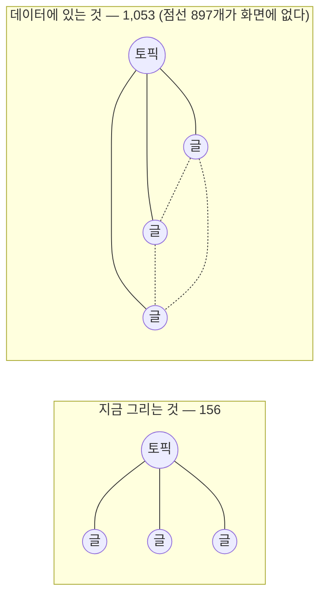

# 인수인계 (HANDOFF)

> 갱신: 2026-08-28 (T15 마감) · 브랜치 `feat/redesign-stage2` (미배포) · `main` 대비 위치는 `git log --oneline origin/main..HEAD` 가 답한다
>
> 🔴 **원계획이 끝났다. `T9`~`T15` 가 전부 마감이다(§2). 다음 세션에 정해진 임무가 없다.**
> 정본은 [`docs/superpowers/plans/2026-08-25-redesign-phase-1-2.md`](docs/superpowers/plans/2026-08-25-redesign-phase-1-2.md) 이고,
> **다음은 사용자의 판단이다** — *"만들려고 했던 작업을 끝까지 마무리 지어보고 내가 다시 판단할께."*
> **먼저 물어라. 남은 것을 골라 착수하지 마라.**
>
> 🔴 **PR [#2](https://github.com/withwooyong/withwooyong.github.io/pull/2) 가 열려 있다. merge 는 승인 대기다.**
> T15 워크플로는 거기서 처음 돌았고 **첫 실행에서 결함 1건**이 나왔다(§R65 — 리포트 15개를 쓰고 0개를 올렸다).
> 고쳤고 **재실행에서 받아서 셌다**(§R66) — 아티팩트 18.8MB · 62파일 · 5라우트 × 3회를 파일명으로 확인.
> ⚠️ 그러다 **같은 페이지인데 경고가 3 → 4 로 늘었다.** 러너 변동이 예산 폭보다 크다 —
> **이 워크플로를 회귀 탐지에 쓰면 안 된다.** 쓸 수 있는 것은 자릿수와 확실한 초과뿐이다.
>
> 🔴 **`deploy.yml` 은 PR 에서 돌지 않는다**(트리거가 `push: [main]` 뿐). lint · tsc · vitest ·
> 금칙어 · 발행본 수 · **T14 가 승격시킨 E2E 게이트**가 PR 단계에서 하나도 돌지 않는다는 뜻이다.
> 머지 후 `main` 에서 처음 돌고, 빨개지면 배포는 막히지만 **커밋은 이미 `main` 에 있다.**
> 「배포 전 차단」이 아니라 **「배포 실패 후 복구」**다 — §2-3 에 판단 대상으로 올렸다.
>
> 🔴 **사용자 판단 대기가 여전히 2건 있다.** §2-3 을 읽어라. T14 가 켠 게이트의 후속이고
> T15 와 독립이라 미뤄져 있었을 뿐, 지금은 미룰 이유가 없다.
>
> ~~🔴 T14 에 착수하기 전에 `§R49` 를 먼저 읽어라 — 삭제 목록이 살아 있는 파일을 포함한다.~~
> **해소됨(T14).** 실제로 지운 것은 4개이고 `data/product-lead-domains.ts` 는 보존됐다.
> 경고가 값을 했다는 기록으로 남긴다.
>
> ⚠️ **위 줄에서 커밋 해시를 뺐다(T14). 다시 적지 마라.** 그 자리는 T9 마감 이후 세 태스크 동안
> `9c28aca` 로 낡아 있었고, T13 이 고친 뒤에도 한 태스크 만에 또 낡았다. 두 번 낡은 값은 세 번 낡는다.
> 브랜치의 현재 위치는 `git log -1` 이 답한다. **문서에 적힌 순간부터 썩는 값이다.**
>
> 사용자의 말 그대로: *"만들려고 했던 작업을 끝까지 마무리 지어보고 내가 다시 판단할께."*
> **재설계가 아니다.** 만들려던 것을 다 만든 뒤에 판단을 받는다.
>
> ⚠️ **`/atlas` 재설계는 이 배치가 아니었다. 그 조건이 이제 닫혔다(T15).**
> 화면이 데이터를 배신하고 있다는 것은 사실이고 실측도 §3 에 있다 — **이제 실물을 보고 판단할 때다.**
> 그러나 **판단은 사용자의 것이다.** 자동으로 착수하지 마라.
> 이 문서의 이전 판이 그 실측을 「다음 임무 = 재설계」로 적어 놓아 한 세션이 통째로 헛짚었다.
>
> ⚠️ **「`git log --all` 로도 커밋 0건」을 「파일이 없다」로 읽지 마라.** 이 문서의 T9 행이 그렇게 적혀
> 있었는데, 실제로는 **작업 디렉터리에 미추적으로 9개가 다 있었다.** 미추적 파일은 `git log` 에도
> `git stash` 에도 `git checkout` 에도 잡히지 않는다 — **git 의 안전망 밖이다.**
> 다음에도 이어받기 전에 `git status --porcelain` 을 먼저 봐라. §3 의 「있다는 세 단계」와 같은 계열이다.

---

## 1. 이 문서가 한 번 사람을 잘못 보냈다 — 읽는 법

이전 판의 머리말은 「다음 임무는 `/atlas` 재설계」라고 단정했다. 그런데 같은 리포의 계획서는
정반대를 적고 있었다 — *「선행 계획서의 T9~T13 은 **삭제가 아니라 보류**다. 이 작업이 끝난 뒤 다시 꺼낸다」*
([`2026-08-26-atlas-and-search.md` §이월된 것](docs/superpowers/plans/2026-08-26-atlas-and-search.md)).

**두 문서가 모순인데 HANDOFF 만 읽은 세션은 그것을 알 수 없었다.**

| 잘못 읽은 방식 | 대신 |
| --- | --- |
| HANDOFF 한 파일을 읽고 「다음 작업」을 결론냄 | **최소 3소스 대조** — HANDOFF + 계획서의 이월표 + **파일 실재** |
| 「HANDOFF 에 없다」를 「존재하지 않는다」로 취급 | 이 리포가 반복해 데인 그 모양이다. **대조군을 먼저 재라** |

`CLAUDE.md` 의 「있다는 세 단계다」와 같은 계열이다 — **문서에 있다 ≠ 사실이다.**

---

## 2. ✅ 원계획 `T9`~`T15` — **전부 마감. 미착수 0개**

정본: [`docs/superpowers/plans/2026-08-25-redesign-phase-1-2.md`](docs/superpowers/plans/2026-08-25-redesign-phase-1-2.md)
아틀라스 계획서가 **GC-11**(「`pages/index.tsx` 를 건드리지 않는다」)로 스스로를 막아 놓은 탓에
단계 2 가 통째로 밀려 있었다. 그 약속은 아틀라스 배치가 끝나며 **만료됐다.**

| T | 작업 | 산출물 | 실측 (2026-08-28) |
| --- | --- | --- | --- |
| ~~**9**~~ | 히어로 B — 아틀라스 점등 | `components/hero.tsx` · `hero-atlas.tsx` · `lib/hero/*` · `lib/use-scroll-progress.ts` · `lib/design/accent-area.ts` | ✅ **완료** — 커밋 `9c28aca`. 리뷰 두 축 FAIL → 8건 수정 → PASS. 검증: vitest 382 · 차단 서드파티 스타일시트 0 · 뮤턴트 8/8 사멸. 경위는 [`reports/2026-08-28-t9-hero-b.md`](docs/superpowers/reports/2026-08-28-t9-hero-b.md) (R35·R36·R37) |
| ~~**10**~~ | 메인 5섹션 재작성 | `components/home/section-*.tsx` · `pages/index.tsx` · `data/{about,education,product-lead-teaser}.ts` | ✅ **완료** — `index.tsx` 537 → 82줄. 리뷰 두 축(품질 / 접근성·R34) HIGH 3 → 수정 1라운드 → 0. 검증: e2e **84/84**, `hero.spec.ts` **5/5 첫 초록**. 경위는 [`reports/2026-08-28-t10-main-sections.md`](docs/superpowers/reports/2026-08-28-t10-main-sections.md) (R38·R39·R40) |
| ~~**11**~~ | `/work` — `product-lead*` 4갈래 통합 | `pages/work/index.tsx` · `components/work/*` · `data/work.ts` | ✅ **완료.** 리뷰 **세 축**(품질/접근성/**검사 유효성**) → CRITICAL 1·HIGH 4 → 2라운드 → 0. 검증: vitest **406** · e2e **130/130 · skip 0** · 뮤턴트 2차 **9/9 사멸**. 경위는 [`reports/2026-08-28-t11-work.md`](docs/superpowers/reports/2026-08-28-t11-work.md) (R41·R42·R43·R44) |
| ~~**12**~~ | `/about` 신규 | `pages/about/index.tsx` · `e2e/about.spec.ts` | ✅ **완료.** ⚠️ **리뷰 축 0개** — T9·T10 은 2축, T11 은 3축이었다. 대조가 없다. 검증: vitest **406** · e2e **154/154 · skip 0** · 뮤턴트 **9/9 사멸**. 경위는 [`reports/2026-08-28-t12-about.md`](docs/superpowers/reports/2026-08-28-t12-about.md) (R45·R46·R47) |
| ~~**13**~~ | `product-lead*` 스텁 — 9 URL → **파일 5개**(4가 아니다) | `public/product-lead*/index.html` · `pages/product-lead-wiki/*` · `e2e/redirects.spec.ts` | ✅ **완료.** `/ted-run` 풀 파이프라인, 리뷰 **3축**. 계획서 오류 3건 발견(R48)·**T14 결함 봉인**(R49). 검증: vitest **406** · e2e **238/238 · skip 0** · 뮤턴트 **10/10 사멸**(1차 8/10) · Pagefind 407→**398, 스텁 0**. 경위는 [`reports/2026-08-28-t13-stubs.md`](docs/superpowers/reports/2026-08-28-t13-stubs.md) (R48~R54) |
| ~~**14**~~ | 고아 자산 삭제 + 기준선 1회 갱신 + **E2E 를 CI 게이트로** | 삭제 `lib/wiki.ts`·`wiki-shell`·`roadmap-domain`·`product-lead-roadmap` · `tests/ci/deploy-workflow.test.ts` 신규 · `scripts/baseline.json` · `.github/workflows/deploy.yml` | ✅ **완료.** 리뷰 **2축**(품질 → HIGH 1·MED 2·LOW 2 전부 반영 / 검사 유효성 → PASS). 검증: vitest **411** · e2e **238/238 · skip 0** · 뮤턴트 **7/7 사멸** · `check-baseline` **종료 0**(16개 불변). 경위는 [`reports/2026-08-28-t14-orphans.md`](docs/superpowers/reports/2026-08-28-t14-orphans.md) (R55~R61) |
| ~~**15**~~ | Lighthouse CI — 경고로만 | `lighthouserc.json` · `.github/workflows/lighthouse.yml` · `tests/ci/lighthouse-workflow.test.ts` 신규 · `.gitignore` | ✅ **완료.** `deploy.yml` 불변. 검증: tsc 0 · lint 0 · vitest **430** · e2e **238/238 · skip 0** · 뮤턴트 **15/15 사멸**(1차 10/11). 계획서와 **4곳 다르다**(공개 업로드 차단 · URL 5개 · 액션 v6 · 검사기 신설). ✅ **PR #2 에서 실제로 돌았다** — 5 URL × 3회 수집. 🔴 **첫 실행에서 결함 1건**(리포트 15개를 쓰고 0개를 올렸다 · §R65). 경위는 [`reports/2026-08-28-t15-lighthouse.md`](docs/superpowers/reports/2026-08-28-t15-lighthouse.md) (R62~R66) |

~~**순서를 바꾸지 마라.** 9 → 10 → 11 → 12 → 13 → 14 → 15.~~ **전부 끝났다.**

> ### ~~🔴 **T14 의 삭제 목록은 틀렸다 — 그대로 실행하면 `/work` 가 빌드 불가가 된다**~~ (**해소** — 2026-08-28 T14)
>
> **경고가 값을 했다.** T14 는 4개만 지웠고 `data/product-lead-domains.ts` 는 보존됐다.
> 지운 뒤 재계수한 결과 소비처는 `section-domains.tsx` · `e2e/work.spec.ts` 둘만 남았다.
> 아래는 기록으로 남긴다 — **삭제 목록이 작성 시점에 화석이 된다**는 것이 이 항목의 요점이었다.
>
> **`data/product-lead-domains.ts` 를 지우지 마라. 고아가 아니다.** T13 리뷰의 실측(R49):
>
> | 소비처 | 무엇 |
> | --- | --- |
> | `components/work/section-domains.tsx:1` | T11 이 만든 **`/work` 의 살아 있는 섹션** |
> | `e2e/work.spec.ts:5` | 그 섹션의 개수 대조 |
> | `components/roadmap-domain.tsx:3` | `type Domain` 만 — **이 파일은 지워도 된다** |
>
> 계획서 §T14 에 취소선과 수정된 `git rm` 을 넣어 봉인해 뒀다. 지울 것은 **5개가 아니라 4개**다.
>
> ⚠️ **더 위험한 것은 계획서 Step 1 의 가드 문구였다** — *"출력이 있으면 그 자리를 먼저 정리한다"* 는
> `/work` 의 살아 있는 섹션을 **지우라는 뜻으로 읽힌다.** 출력이 나오면 먼저 물을 것은
> **「이 파일이 정말 고아인가」**지 「호출부를 어떻게 없애나」가 아니다. 계획서도 함께 고쳐 뒀다.
>
> ⚠️ 이 문서의 이전 판은 같은 함정을 **`SystemDiagramCard`** 로 경고했다. 그 심볼은 안전했고
> **다른 심볼에서 터졌다.** 진짜 교훈은 「그 심볼을 조심하라」가 아니라 **「T11 이 옮긴 것 전부가 같은 함정」** 이고,
> 더 일반적으로는 **삭제 목록이 작성 시점에 화석이 된다**는 것이다 — 목록을 읽지 말고 **매번 다시 세라.**
> 근거: [`reports/2026-08-28-t13-stubs.md` §R49](docs/superpowers/reports/2026-08-28-t13-stubs.md) · [`t11-work.md` §R44](docs/superpowers/reports/2026-08-28-t11-work.md).

### 2-3. 🔴 사용자 판단 대기 2건 — 둘 다 T14 가 켠 게이트의 후속이다

T14 가 E2E 를 배포 게이트로 승격시키면서 **판단이 필요한 자리가 두 개 생겼다.**

⚠️ **「어느 쪽도 T15 를 막지 않는다」는 만료됐다(T15).** T15 가 끝났으므로 미룰 이유가 없다.
둘 다 한 줄~두 줄짜리 변경이고, 필요한 것은 작업량이 아니라 **켤지 말지의 판단**이다.

| # | 무엇 | 지금 상태 | 켜면 / 고치면 |
| --- | --- | --- | --- |
| 1 | **`e2e/global-setup.ts:27-41` 의 `SOURCES` 12개 경로에 `package-lock.json` 과 `tsconfig.json` 이 없다** | 둘 다 `next build` 산출물을 바꾸는데 `out/` 무효화를 유발하지 못한다. **T14 이전에도 그랬다** | 가드가 CI 게이트가 됐으므로 구멍의 값이 올라갔다. 두 경로를 `SOURCES` 에 더하는 것은 한 줄이다 |
| 2 | **`deploy.yml:113-114` 의 `check-baseline` 이 주석 처리돼 있다** | T9 이후 기준선이 빨갛다는 이유로 껐던 것인데 **T14 가 초록으로 되돌렸다.** 끈 이유가 만료됐다 | 켜면 페이지를 의도적으로 바꿀 때마다 **기준선 갱신이 배포 조건**이 된다. `--update` 가 습관이 되는 것과 트레이드오프다 |

⚠️ 2번은 `CHANGELOG.md` 의 2026-08-28 항목이 「README 가 하던 거짓 CI 보증」으로 지적했던
바로 그 자리다 — 「CI 가 산출물 불변 검사를 돌린다」가 사실이 아니었던 이유가 이 주석이다.
**지금은 켤 수 있는 상태가 됐다는 것만 사실이고, 켤지는 판단이다.**

### 2-2. ~~⚠️ **T11 전에 `main` 에 머지하지 마라**~~ (**해소** — 2026-08-28 T11)

T10 이 구 `pages/index.tsx` 를 걷어내면서 홈에서 `/product-lead-v2` 로 가는 유일한 진입점이 끊겨 있었다.
**T11 이 그 조건을 닫았다** — `/work` 가 신설되고 헤더 `NAV` 에 `Work` 가 올라가, 사이트 어느 페이지에서도
도달 가능하다(`e2e/work.spec.ts` 가 `aria-current="page"` 까지 검사한다).

다만 **해소된 것은 「도달 불가」 하나뿐이다.** 구 라우트 5개(`product-lead`·`-v2`·`-loadmap`·`-wiki`)는
그대로 살아 있고 T13 이 9 URL 을 파일 4개로 접는다. `main` 은 여전히 프리뷰 없는 프로덕션이므로
머지 시점은 T13 이후가 자연스럽다 — **금지 조건은 아니고 판단 사항이다.**

> 아래는 기록으로 남긴다. 「계획된 공백」과 「사고」가 같은 초록을 낸다는 것이 이 항목의 요점이었다 —
> 빌드도 링크 검사기도 E2E 도 전부 통과하는데 실사용자는 도달할 수 없었다.
> 빌드가 이 조건을 막지 못하므로 사람이 지켜야 했고, 실제로 지켜졌다.

### 2-1. ~~⚠️ T9 는 코드부터 쓰면 안 된다 — 선결 4건~~ (해소 — 아래는 기록으로 남긴다)

계획서가 명시한다. *「T9 를 구현하고 리뷰한 결과 **4건 모두 구현이 아니라 계획 자체의 결함**이었다」*
정본은 [`2026-08-26-atlas-and-search.md` §T9가 이월된 이유](docs/superpowers/plans/2026-08-26-atlas-and-search.md).

| # | 무엇 | 실측 |
| --- | --- | --- |
| 1 | **GC-9 위반** — 액센트가 화면의 **15.68%** (상한의 3.1배). `p≈0.20` 에서 이미 5% 초과 | 원-사각형 교집합 격자 적분. mobile 393×851 / desktop 1280×720 |
| 2 | **LCP 가 서드파티에 묶임** — Pretendard 가 jsdelivr 에서 **10건 / 216KB 렌더 블로킹.** 계획서 게이트는 three.js(600KB)를 막고 있어 **위험 축이 어긋나 있었다** | 네트워크 실측 |
| 3 | **reduce 에서 h1 이 선행사를 잃음** — `p=1` 고정이라 유일한 h1 이 「그 판단은 글 156편으로…」가 되고, 문구 ①② 는 `aria-hidden` 이라 접근성 트리에 없다 | ariaSnapshot |
| 4 | **스크롤의 33.3% 가 완전 정적.** 경계 `0.6667` 이 코드 어디에도 상수로 없다 — `stagger 0.6`·`NODES.length`·`LINES.length` 가 우연히 만든 값이라 노드를 하나 늘리면 조용히 바뀐다 | 계산 |

**1번이 나머지를 규정한다.** 히어로가 `sticky top-0 h-screen` 이라 `p=0`→`1` 동안 첫 화면을 떠나지 않는다.
`p=0` 만 재면 0%, 사용자가 보는 시간으로 재면 15.7% — **GC-9 의 「첫 화면」이 이 구조에서 정의되지 않는다.**
그것을 먼저 다시 정의하는 것이 T9 의 실제 1단계다.

부수 발견 2건도 T9 에서 그대로 쓴다.

- **Playwright 의 `getByRole(role, { name })` 은 기본이 부분 문자열 매칭이다.** `exact: true` 없이는
  `aria-hidden` 을 통째로 지워도 검사가 초록이다(대조군 실측).
- **`opacity-0` 은 텍스트 선택·`Ctrl+F` 에서 빠지지 않는다.** h1 을 드래그하면 84자 세 문장이 딸려 나온다.
  숨기려면 `visibility: hidden` 이 함께 필요하다.

### 2-3. 착수 전 읽을 것 — **`T14` (고아 자산 삭제 + 기준선 갱신) 기준**

| 순서 | 무엇 | 왜 |
| --- | --- | --- |
| 1 | [`reports/2026-08-28-t13-stubs.md`](docs/superpowers/reports/2026-08-28-t13-stubs.md) — **R49 를 먼저** | **T14 삭제 목록의 결함이 거기 있다.** 이걸 안 읽고 계획서대로 `git rm` 하면 `/work` 가 빌드 불가가 된다 |
| 2 | 계획서 `§Task 14` | 브리프 정본이되 **이미 T13 이 취소선으로 고쳐 놨다.** 그 표시를 지우지 마라. 그 밖의 「이미 있다」류 사실 주장도 **검증하고 써라** — T11 에서 계획서가 없는 검사를 있다고 했고(R38·R44), T12 에서는 코드 조각이 같은 절의 ⚠️ 경고를 어겼고(R45), **T13 에서는 참조하는 쪽 3곳을 통째로 놓쳤다**(R48) |
| 3 | `scripts/check-baseline.mjs` 의 `--update` 주석 | **기준선 갱신은 T14 에서 딱 한 번이다.** 지금 15건 빨간 것은 T10~T13 이 만든 **의도된 상태**다. `--update --force` 를 습관으로 만들면 지켜야 할 것이 같은 명령에 함께 덮인다 |
| 4 | [`reports/2026-08-28-t11-work.md`](docs/superpowers/reports/2026-08-28-t11-work.md) — R41~R44 | 리뷰 3축·검사 설계·접근성 계약의 정본 |
| 5 | `.github/workflows/deploy.yml` | T14 가 **e2e 를 CI 게이트로 승격**한다. 지금 238건이 로컬에서만 돈다 |

**되풀이하지 말 것** (T11·T12·T13 이 실제로 겪었다):

| 함정 | 대응 |
| --- | --- |
| **삭제 목록을 읽고 그대로 지운다** | **목록은 작성 시점에 화석이 된다.** T14 목록은 T11 **이전**에 쓰여 살아 있는 파일을 포함했다. 지우기 전에 **매번 다시 세라** (R49) |
| 「호출자 0건」 grep 이 0 을 냈다고 고아로 판정한다 | **엉뚱한 데를 봤을 수 있다.** 소비처는 다른 이름으로 불린다 — 지우는 이름이 아니라 **보고 있는 쪽**을 세라 (R44·R48) |
| **주석을 단언으로 착각한다** | 실측 수치가 붙은 주석이 가장 검증된 자리처럼 보인다. T13 에서 「바이트로 잰다」고 3/3 실측을 적어 놓고 **그 단언이 없었다** (R53) |
| 문자열이 산출물에 있으면 계약이 지켜졌다고 친다 | **자기가 쓴 설명 주석에 걸린다.** T13 의 `data-pagefind-ignore` 단언이 실제로 그랬다 — 태그의 **속성인지**까지 봐라 (R53) |
| 섹션 하나만 개수 대조를 빼먹는다 | **0개 렌더 뮤턴트가 생존한다.** 다섯 중 넷만 검사하면 초록이 커버리지를 증명하지 않는다 |
| `getByRole(role, {name})` 에 `exact` 를 안 붙인다 | 접근명이 길어져도 초록이다. 계약으로 삼는 검사에는 전부 붙인다 |
| 파일을 쓰는 에이전트(뮤테이션)를 리뷰어와 **병렬**로 띄운다 | 리뷰어가 뮤턴트를 진짜 결함으로 보고한다. **단독 실행** (R41) |
| 새 창 링크에 예고를 안 단다 | 지금 예고가 있는 곳은 `/work`·`/about` 둘뿐이다 |
| **목록을 도는 검사에서 마지막 항목을 빼낸다** | 빈 배열을 도는 `for` 는 **아무것도 단정하지 않고 초록**이다. 전수 대조를 함께 둔다 (R46) |
| **텍스트가 있으면 보인다고 친다** | `textContent` 는 CSS 와 무관하다. 배치·표시는 `toHaveCSS`·`toBeVisible` 로 따로 잰다 (R47) |

---

## 3. 확인된 사실 — `/atlas` 가 자기 데이터를 배신한다 (**이 배치 이후 판단 대상**)

`/atlas` 는 화면에 「글 156편 · 토픽 6개 · **연결 1053개**」라고 적어 놓는다.
브라우저에서 SVG 안을 실제로 센 결과는 이렇다.

| SVG 요소 | 실측 | 뜻 |
| --- | ---: | --- |
| `<circle>` | **162** | 노드는 전부 그린다 ✅ |
| `<line>` | **156** | **엣지를 156개만 그린다** ❌ |
| `<text>` | **0** | 라벨이 하나도 없다 ❌ |

**156 = 글 편수다.** 지금 그리는 선은 「글 → 소속 토픽」 156개뿐이고,
글끼리의 관계(본문 인용·시리즈·선행) **897개는 화면에 존재하지 않는다.**

**「민들레 6개」처럼 보이는 이유가 이것이다.** 클러스터를 잇는 선이 그려지지 않으니
6개의 독립된 방사형 덩어리만 남는다.

### 그런데 E2E 74건은 전부 통과한다

이 리포가 반복해서 데인 바로 그 모양이다 — **「없다」와 「읽을 수 없었다」가 같은 출력.**
이번엔 변종이 하나 더 늘었다: **「초록이다」와 「보인다」가 다르다.**
`CLAUDE.md` 의 「산출물 문자열로 렌더됐다를 증명하지 마라」와 같은 계열인데,
이번 것은 **DOM 이 실제로 있는데도 사람이 보기엔 비어 있는 경우**다.

---

### 3-A. 만들려던 방향 — 참조 사이트와 UI/UX 지적 (⚠️ **착수 대상 아님**)

> 아래는 사용자가 실물을 보고 말한 것을 그대로 남긴 기록이다. **아직 구현하지 마라.**
> ⚠️ **선행 조건 중 절반이 닫혔다(T15).** §2 의 T9~T15 는 전부 끝났다 —
> 남은 조건은 **사용자가 실물을 보고 다시 판단하는 것** 하나뿐이다. 그 판단 전에는 여전히 기록이다.

#### 3-A-1. 기준선: 사용자가 지정한 참조 사이트

**<https://www.careerhackeralex.com/memory>** — 사용자가 *"초안을 이걸로 잡고 이것보다 더 개선해서
만들어보려고 했다"* 고 말한 사이트다. 실제로 열어 보고 대조한 결과:

| 항목 | 알렉스 `/memory` | 현재 `/atlas` |
| --- | --- | --- |
| 규모 | 350 노드 / 1,698 링크 | 162 노드 / 1,053 엣지 |
| **그리는 엣지** | 사실상 전부 | **156 (15%)** |
| 레이아웃 | **힘 기반** — 얽힌 구조가 형태로 드러남 | 결정론적 방사형 |
| 노드 라벨 | 주요 노드에 표시 | **없음** |
| 노드 유형 | **7종 색상 범례**(의미·통찰·원자·서면·주장·주제·맥락) + 각 개수 | 2종(글/토픽), **단색** |
| 렌즈 | 5종 전환 (전체·주제별 등) | **없음** |
| 사이드바 | 주제·태그별 개수가 빽빽한 좌측 패널 | **없음** |
| 줌·팬 | 있음 | **없음** |
| 화면 점유 | **뷰포트 전체가 캔버스** | `max-w-7xl` 안의 `aspect-square` 박스 |

#### 3-A-2. 사용자가 지적한 UI/UX 문제 6건

> *"너가 만든 UI/UX 디자인은 너무 마음에 들지 않는데."*

| # | 무엇 |
| --- | --- |
| 1 | **`/atlas` 가 앱이 아니라 「블로그 페이지 안의 위젯」이다.** 정사각형 박스에 갇혀 화면 우측·하단이 텅 빈다 |
| 2 | **첫 화면에 정보가 없다.** 라벨 0 · 색상 구분 없음 · 범례 없음 |
| 3 | **조작할 게 없다.** 줌·팬·드래그 없음. 클릭하면 우측에 텍스트만 |
| 4 | **제목 아래 한 줄이 전부다.** 렌즈 전환도 필터도 없다 |
| 5 | **셸이 페이지마다 다르다.** `/atlas` 헤더에는 Atlas·Blog 내비와 검색 버튼이 있는데 **`/blog` 에는 둘 다 없다**(헤더가 「기술 노트」로 다름) |
| 6 | **클릭하면 레이아웃이 깨진다** (아래 §3) |

**1번이 나머지를 규정한다.** 지금은 `max-w-7xl` 문서 컨테이너 안에 `aspect-square` 박스를 넣은
**문서 레이아웃**이다. 그래프는 문서에 박힌 그림이 아니라 **화면을 점유하는 도구**여야 하는데,
그 전제가 다르니 줌도 렌즈도 사이드바도 놓을 자리가 없다. 5번(셸 불일치)도 같은 뿌리다.

#### 3-A-3. ⚠️ 사용자에게 아직 답을 못 받은 질문 셋

세션이 종료돼 물어보지 못했다. **작업 착수 전에 이것부터 확인하라.**

| # | 질문 | 왜 중요한가 |
| --- | --- | --- |
| 1 | 불만의 범위가 `/atlas` 화면만인가, **사이트 전체 디자인**인가 | 후자면 셸·블로그·포트폴리오까지 범위가 커진다 |
| 2 | 알렉스 사이트의 **레이아웃 골격**(풀스크린 + 좌측 패널)까지 가져올 것인가 | 「더 개선」의 출발점을 어디에 둘지가 갈린다 |
| 3 | **「더 개선」의 방향** — 밀도로 압도할 것인가, **읽히는 구조**(계층·필터·경로 찾기)로 차별화할 것인가 | 알렉스 화면은 인상적이지만 개별 노드를 찾아가기는 어렵다. 만들 것이 완전히 달라진다 |

#### 3-A-4. 손댈 파일

| 파일 | 지금 무엇인가 |
| --- | --- |
| `lib/atlas/layout.ts` | 결정론적 방사형 좌표 계산. **힘 기반으로 교체 대상** |
| `components/atlas/dot-renderer.tsx` | SVG 렌더러. **이름이 지금 상태를 정확히 말한다 — 점을 그리는 것이지 그래프를 그리는 게 아니다** |
| `components/atlas/node-panel.tsx` | 우측 상세 패널 |
| `components/atlas/list-view.tsx` | 목록 뷰. **접근성 경로라 유지해야 한다**(그래프는 포인터 전용) |
| `pages/atlas/index.tsx` | 페이지 레이아웃. §2-2 의 1번을 고치려면 여기부터 |
| `lib/atlas/links.ts` · `neighbors.ts` | 엣지 계산. **데이터는 이미 1,053개가 있다** — 여기는 문제가 아니다 |

**엣지 897개를 지금 레이아웃에 그대로 그려 넣으면 더 나빠진다.** 민들레들을 가로지르는 선이
화면을 덮는다. 레이아웃을 먼저 바꾸고 엣지를 살려야 한다 — **순서가 있다.**

---

## 4. 확인된 버그 1건 — 노드 클릭 시 가로 스크롤

| 단계 | 문서 폭 | 뷰포트 | 그래프 컨테이너 |
| --- | ---: | ---: | ---: |
| 클릭 전 | 3408 | 3408 | 864 |
| 노드 클릭 후 | **3710** | 3408 | **2262** |

**원인:** `pages/atlas/index.tsx` 의 그리드가 `lg:grid-cols-[1fr_20rem]` 인데,
`1fr` 칸에 든 그래프 박스가 `aspect-square w-full` 이라 **`min-width: auto`** 가 걸린다.
상세 패널이 열려 행 높이가 커지면 aspect-ratio 를 통해 **최소 폭이 역산돼 `1fr` 이 2261px 로 부푼다.**

**처방:** 그 박스에 **`min-w-0`** 한 클래스. 브라우저에서 `min-width: 0` 을 주입해
컬럼이 `2261.89px → 864px` 로 돌아오고 가로 스크롤이 사라지는 것을 **실측 확인**했다.

> 재설계로 이 컨테이너가 없어질 수도 있다. **그때는 이 항목도 함께 소멸한다** — 따로 고치지 말고 확인만 하라.

---

## 5. 잘 되는 것 — 건드리지 마라

| 층 | 상태 | 근거 |
| --- | --- | --- |
| 아틀라스 **데이터** | 탄탄함 | zod 스키마 · 무결성 게이트 · 엣지 1,053개가 실제로 계산돼 있다 |
| 노드 상세 **162장** | 동작 | `/atlas/<분류>/<slug>/` · 토픽은 `/atlas/topic/<분류>/` |
| **검색** | 잘 됨 | 「임베딩**의**」 입력 → 조사 처리 후 **57건**, 하이라이트·스니펫 정상 (브라우저 실측) |
| 배포 파이프라인 | 정상 | CI 8단계 → deploy. 이번 세션 2회 모두 success |

**검색은 이번 세션에 브라우저로 직접 확인했다.** 팔레트는 헤더의 검색 버튼으로 열린다
(`Ctrl+K` 는 Chrome 이 가로챌 수 있다).

---

## 6. 직전 세션에서 한 일 — 전부 문서

| 커밋 | 무엇 |
| --- | --- |
| `b62f49c` | `CLAUDE.md` — 산출물 문자열로 「렌더됐다」를 증명하지 말라는 규칙 (**122줄 유지**) |
| `cef8743` | `README` — 65커밋 동안 밀린 서술 drift 정정 + **거짓 CI 보증 제거** |
| `3c8e30c` | `main` 병합 |
| `e93dead` · `9d45df5` | HANDOFF · CHANGELOG |

### 값어치 있는 발견 둘

1. **README 가 거짓 보증을 하고 있었다** — 「CI 가 `check-baseline` 을 돌린다」고 적혀 있으나
   `deploy.yml:99-100` 에서 **주석 처리**돼 있다. 문서를 믿은 사람은 돌지 않는 게이트를 돌고 있다고 여긴다.
2. **README 의 수치는 검사기가 지킨다** — 트리의 「발행본 156편」을 지웠더니 `check-counts` 가 실패했다.
   그 스크립트는 README 의 **네 자리**를 정규식으로 감시하고 **자리가 사라지면 실패**시킨다.

> **README 의 숫자를 지우기 전에 `npm run check-counts` 를 돌려라.**

---

## 7. 도구 함정 — 직전 세션에 새로 겪은 것

| 무엇 | 대응 |
| --- | --- |
| **`git fetch` 없이 `origin/main` 을 읽으면 마지막 fetch 시점의 값이 나온다.** 이 세션은 그래서 「65커밋 미배포」로 오판한 채 시작했다(실제로는 PR #1 로 이미 배포됨) | **세션 시작 시 `git fetch` 부터** |
| **브라우저 자동화의 `ref` 클릭이 React 다이얼로그를 열지 못했다.** 클릭은 성공했다고 나오는데 `display:none` 이 유지되고 콘솔 에러도 없다 | **`element.click()` 을 JS 로 직접 호출해 대조군을 만들어라.** 그래야 「기능이 고장」과 「자동화가 못 누름」이 갈린다 |
| **뷰포트 폭이 측정할 때마다 달랐다**(2096 → 3408). 이 상태로는 레이아웃 결함을 판정할 수 없다 | **창 크기를 고정하고 클릭 전 상태를 먼저 재라** — 대조군이 없으면 오진한다 |

기존 함정 **#35~#37** 은 [`docs/TOOL-TRAPS.md`](docs/TOOL-TRAPS.md) 에 있다.

---

## 8. 상태

| 항목 | 값 |
| --- | --- |
| 브랜치 | **`feat/redesign-stage2`** — T9·T10·T11 이 여기 쌓여 있다. `main` 은 미변경 |
| 미커밋 변경 · stash | **없음 · 없음** |
| `feat/site-renewal` | `cef8743` — 병합 완료. 새 작업은 **새 브랜치**로 |
| `npm run lint` · `npx tsc --noEmit` | **0 · 0** |
| `npm test` | **406 passed** (19파일) ← T11 이 `tests/work/` 추가 |
| `check-forbidden` (소스) | 자기검사 15/15 → **HARD 0** (158파일) |
| `check-counts` | 자기검사 14/14 → **156편 / 6개 카테고리** |
| `check-pagefind` · `probe-search` | ko **405/405** · 기본형 **8/8** (T9 시점 측정 — T10 은 블로그를 건드리지 않았다) |
| `check-baseline` | **돌리지 마라 — 오라클이 아니다.** T3 에서 토큰이 바뀌며 CSS 파일명 해시가 HTML 에 박혀 기준선은 T1 이후로 이미 죽었다(계획서 157줄). 갱신(`--update`)은 **T14 에서만** |
| `npm run e2e` | **130 passed · 0 failed · 0 skipped** ← T11 이 `work.spec.ts` 를 더했고, `/work/` 에 셸이 붙으며 **게이트로 잠들어 있던 검사들이 함께 깨어났다**. 84 → 130 의 증가분이 전부 신규 spec 은 아니다 |
| CI (2회) | 모두 **success** (T9 시점) |

**`out/` 은 직전 세션 빌드다 — 신선도를 믿지 말고 `npm run build` 를 먼저 돌려라.** 단 `scripts/`·`components/` 를 건드리면 mtime 이 무효가 되니
`npm run e2e` 전에 **`npm run build` 가 먼저**다. 아니면 테스트를 하나도 안 돌리고 종료 코드 1 이 나온다.

**`main` 은 프리뷰 없는 프로덕션이다. 배치 마감마다 푸시 여부를 사용자에게 물어라.**

---

## 9. README / 문서 갱신 필요 — **이월(고치지 않았음)**

| 항목 | 왜 이월했나 | 확인할 진실원 |
| --- | --- | --- |
| `docs/site-renewal-roadmap.md` · `completion-report.md` | 2026-07 이후 미갱신. 셸·검색·아틀라스가 반영돼 있지 않다. 재설계 후에 한꺼번에 고치는 편이 낫다 | `pages/` 실제 라우트 · `docs/superpowers/specs/2026-08-25-redesign-and-atlas.md` |
| `.gitattributes` **부재** | 추적 파일 369개 중 **144개(39%)** 가 워킹트리 CRLF 인데 커밋본 일관성을 **강제하는 것이 없다**. 지금은 blob 이 CR 0 으로 일관하지만 우연이다 | `git config core.autocrlf` · 함정 [#14](docs/TOOL-TRAPS.md#t14)·[#16](docs/TOOL-TRAPS.md#t16) |

**오탐이라 넣지 않은 것:** 수집기가 `OPENAI_API_KEY`·`TAVILY_API_KEY`·`UPSTAGE_API_KEY`·
`LANGCHAIN_*` 를 「코드가 읽는데 README 에 없다」로 신고했으나 **전부 `content/blog/**` 의 예제 코드**다.
이 사이트는 그 변수를 읽지 않는다. `scripts/` 8개 파일도 README 표에 `npm run` 형태로 이미 있다.

---

## 10. `CLAUDE.md` 에 반영된 직전 세션의 학습 — **승인 후 적용 완료**

기존의 「산출물 문자열로 렌더됐다를 증명하지 마라」와 이번 발견이 **같은 축의 다른 지점**이라
따로 두지 않고 하나로 이었다. **122줄 유지**(`## 배포` 절의 CI 단계 나열 2줄과 교환 — 그 절 스스로
「정본은 워크플로 파일」이라고 적고 있었고, 같은 내용을 이번에 README 에도 넣었다).

> **「있다」는 세 단계다 — 산출물에 문자열이 있다 ≠ 렌더됐다 ≠ 보인다. 각각 따로 증명하라.**

세 번째 단계가 이번에 추가된 것이다. **화면은 열어서 그려진 요소를 세라** — 이 리포는
`/atlas` 가 엣지 1,053 중 156 만 그리는데 E2E 74건이 전부 통과하는 것을 겪었다.

---

## 11. 작업 원장 (gitignore)

`.superpowers/sdd/2026-08-26-atlas-and-search/progress.md` 에 아틀라스 배치의 **판단 22건**이
근거·비용과 함께 있다. 그중 **2건은 컨트롤러가 틀렸고 실측으로 뒤집힌 것**이다.
**재설계 전에 읽어라** — 지금의 방사형 레이아웃을 왜 골랐는지가 거기 있고,
그 판단을 뒤집으려면 근거를 알아야 한다.

**`.superpowers/` 는 gitignore 라 `git clean -fdx` 로 사라진다. 남길 것이 있으면 옮겨라.**
