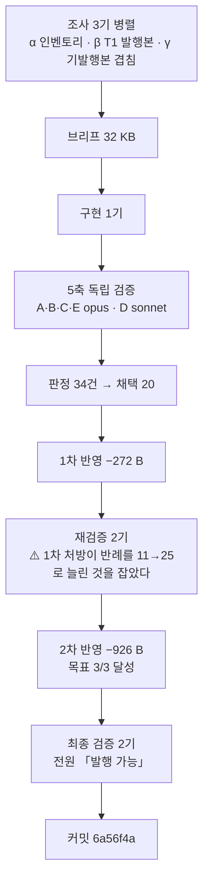

# 인수인계 (HANDOFF)

**갱신일**: 2026-08-16
**브랜치**: `main` · 최신 커밋 `6a56f4a` (**미푸시 — 누적 3커밋**: `9c0b9fd` · `f388592` · `6a56f4a`)
**작업트리**: 이 문서·CHANGELOG·README·설계서만 미커밋 / stash 없음
**발행본**: **117편** (`ai-agent` 51 · `rag` 25 · `agentic-coding` 31 · `search-engineering` 6 · **`ai-transformation` 4**) · sitemap **179 URL**

> **`ai-transformation` T2를 발행했다.** 11편 중 4편이 나갔고 **7편이 남았다.**

---

## 1. 이번 세션에서 한 일

**`aiagent/08 §4~§8·§10`(17,065 B)을 편9 한 편(42,630 B)으로 발행했다.**



| 항목 | 값 |
| --- | ---: |
| 원본 가용 | **17,065 B** (§4~§8 14,073 + §10 2,992) |
| 발행 | **42,630 B · 442줄** — **발행본 117편 중 최대** |
| 팽창률 | **2.50** |
| 구조 | H2 12 · H3 15 · 표 14 · mermaid 6 · 펜스 12 |

**§9 개발기술(L570~610)은 `agentic-coding/dev-org-transfer.md`로 이미 발행돼 제외했다.**

### 단계별 산출

| 단계 | 결과 |
| --- | --- |
| 조사 3기 | 설계서 값 2개 반증 (편9 가용 14,000→17,065 · 팽창률 1.20→2.50) |
| 5축 검증 | 지적 **34건** (A 6 · B 13 · C 13 · D 0 · E 2) · 높음 3 |
| 1차 반영 | 채택 20건 · **−272 B** · 442줄 유지 · 18헝크 합계 일치 |
| 재검증 2기 | **22건** (1기 13 · 2기 9) · ⚠️ **1차 처방이 만든 결함 포함** |
| 2차 반영 | **목표 3/3** — 바이트 **−926** · 새 문장 **0자리** · 구조 5종 불변 |
| 최종 검증 2기 | **전원 「발행 가능」 · 차단 0건** |

---

## 2. ⚠️ 이번 세션 최상위 — 「처방도 검증 대상이다」가 **한 배치에서 세 번** 값을 했다

금지선 20은 장식이 아니다. **T2에서 처방이 새 결함을 만들 뻔한 사례가 세 번 나왔고, 세 번 다 다음 단계의 다른 사람이 잡았다.**

| # | 누가 반증했나 | 무엇이 문제였나 |
| ---: | --- | --- |
| 1 | **구현자** → 브리프 §5-1 | 지시대로 `강의`에 귀속을 붙였더니 원문의 「~중 하나다」 **헤지가 유일성 주장으로 바뀌었고**, 같은 범위에 동종 지목이 3곳 더 있어 **자기 본문이 반증**했다 |
| 2 | **재검증 2기** → 1차 판정표 H-1 | 술어를 「언제 넘기는가」→「무엇을 언제 넘기는가」로 **「넓혔더니」 반례가 11 → 25로 늘었다** |
| 3 | **2차 반영자** → 2차 판정표 R-3 | 지웠다면 그 어구가 담당하던 **`:226`의 산술 「3 + 1 + 2 = 6」에서 「1」이 사라져** 없던 거짓 문장이 생겼을 것이다 |

### ⚠️ 2번의 교훈 — **술어에 항목을 더하는 것은 「넓히기」가 아니라 「조건 추가」다**

「무엇을 언제」는 **선언(A 또는 B)이 아니라 연언(A 그리고 B)으로 읽힌다.**

| 라벨 유형 | 예 | 개수 | 이전 처방 | 「넓힌」 처방 |
| --- | --- | ---: | :---: | :---: |
| 「무엇」만 | `거래 원장` · `PRD 전달` | 14~15 | ❌ | ❌ |
| 「언제」만 | `시스템 장애` · `불만 접수 시` | 10~12 | ✅ | ❌ **새로 반례가 됨** |
| 둘 다 | `1주 경과 후 인계` | **9~10** | ✅ | ✅ |

> **최종 처방은 명제를 「참인 것 하나」로 줄이는 것이었다** — 「인계 화살표 35개에 라벨 35개가 있다」.
> **라벨의 내용을 규정하지 않았고 분류표도 만들지 않았다.** 경계가 애매한 항목은 새 검증 표면을 만든다.

### 3번의 교훈 — **삭제 처방에도 역참조 검색이 필요하다**

지우려던 어구가 **다른 문장의 산술에 인용되고 있었다.** 판정표가 근거로 든 「`:226`이 이미 정확히 서술한다」는 **사실이 아니었다** — `:226`은 6 중 2만 서술한다.

> **컨트롤러 수칙 위반도 하나 있었다.** 2차 판정표에 「1차가 `:403`을 고쳤다」고 적었는데 **실물은 고쳐진 적이 없었다** — 1차 반영자의 **보고문**을 검증 없이 옮겼다. 수치(바이트·헝크 합계)는 재현했는데 **서술은 액면가로 받았다.** 다행히 2차 반영자가 실물을 열어 고쳤다.

---

## 3. 다음 세션이 이어받을 것

### ▶ **T3 착수** — 설계서 §9

| 배치 | 편 | 원본 | 상태 |
| :---: | --- | --- | :---: |
| ~~T1~~ | ~~편6·7·8~~ | ~~`aiagent/06`~~ | ✅ `9c0b9fd` |
| ~~T2~~ | ~~편9~~ | ~~`aiagent/08 §4~§8·§10`~~ | ✅ **`6a56f4a`** |
| **T3** | **편1 `builder-to-orchestrator-shift` · 편4 `enablement-infra-and-maturity`** | `aiteam/01·02·07` (21,385 B) · `aiteam/05·06` (13,724 B) | **▶ 다음** |
| T4 | 편2·편3 | `aiteam/04_영역별` | 대기 |
| T5 | 편5 | `09`·`09a`·`09b` | 대기 |
| T6 | 편10 Q&A | `aiteam/08 §3` 9문항 | 전 편 발행 후 |
| T7 | 편11 지도편 | 재작성 | 카테고리를 닫는다 |

### ⚠️⚠️ T3는 앞의 두 배치와 **성격이 다르다** — 규칙을 그대로 승계하지 마라

| | T1·T2 (`aiagent/`) | **T3 (`aiteam/`)** |
| --- | --- | --- |
| **mermaid** | 원본에 11개·6개 → **총계 대조 가능** | ⚠️ **18파일에 0개.** 검산이 **「새 도식의 노드·화살표에 본문 근거 줄이 있는가」**(금지선 28)로 바뀐다 |
| **민감정보** | **0건** | ⚠️ **실명 27자리 + 야나두 2자리.** 이번 카테고리 최대 작업량 |
| **1인칭** | 진짜 0건 (오탐만) | ⚠️ **절 구조 자체가 자기 PR.** 치환으로 끝나지 않는다 |
| **파일 크기** | 63 KB·68 KB 하나를 쪼갠다 | ⚠️ **2.7~13.9 KB로 전부 하한 미달 — 묶어야 한다** |
| **축 B 질문** | 「원문에 없는 것을 썼나」 | **+ 「제거한 자리를 메우려 새 주장을 만들지 않았나」**(설계서 §9-1) |

### T3 브리프에 반드시 넣을 것

| # | 항목 | 근거 |
| ---: | --- | --- |
| 1 | **금지선 1~28 전문** | 설계서 §11 + `agentic-coding` 설계서 L1998~L2021 |
| 2 | ⚠️ **가용 바이트를 `awk`로 재실측하라. 분할표 값을 믿지 마라** | **T2에서 편9 「14,000」이 §10 누락 오기로 드러났다** |
| 3 | ⚠️ **팽창률 1.20은 반증됐다. 실측 1.63~2.50** | 예상 KB 전체가 과소 추정 |
| 4 | **금칙어·민감정보 전수 목록을 첨부하라** | `inventory/forbidden.txt`. **`aiteam/` 실명 27자리가 여기 있다** |
| 5 | **1인칭 정제식 + 트랩 5종** | §5-1 |
| 6 | **「스캔 0건은 목표가 아니라 관찰값이다. 오탐 목록이 0건 달성보다 우선한다」** | T1 최상위 사고 |
| 7 | ⚠️ **「원본에도 발행본에도 없으면」으로 지시하라** | T1 최상위 결함 |
| 8 | ⚠️ **「처방도 검증 대상이다. 적용 전에 그 처방이 만드는 새 명제를 스스로 반증하라」** | **§2 — 3연 실증** |
| 9 | **「전수성 ≠ 배정 정확성」** | §5-3 |
| 10 | **`dup-scan`은 단일 파일 모드로 돌려라** | §5-2 |
| 11 | **`Bash` heredoc으로 산출물을 써라** | `reviewer`·`scout`에 `Write` 없음 |
| 12 | **구현 직후 `git add`** (커밋 없이) | baseline 확보 |
| 13 | **기업 사례 시점 표기 필수** | Klarna 재채용(2025) · Duolingo 철회(2026) |
| 14 | **0편 태그 30종 목록 첨부** | B9·T1·T2 모두 사용 0건이나 계속 첨부 |

### 확정된 결정 (다시 묻지 마라)

| 사안 | 결정 |
| --- | --- |
| **분량** | **상한 없다. 하한 13.3 KB만** (금지선 11·13) |
| **팽창률** | ⚠️ **1.20 폐기. 실측 1.63~2.50** |
| **시리즈 페이지** | 없다. `series`는 frontmatter 메타데이터일 뿐 |
| **frontmatter** | **11개 전부 필수가 아니다.** `series`·`seriesOrder`·`updated`·`source`는 선택. **빈 문자열은 빌드를 죽인다 — 키를 생략하라** |
| **`source` 값** | **`"AI 에이전트 실무 과정"`** (`aiagent/` 원본) |
| **태그 패싯** | 3~5개, **같은 패싯 최대 2개.** **패싯 C는 17종 · D도 상한 2** |
| ✅ **편9 시리즈** | **`department-agents`에 넣지 않았다.** 편6이 「이 시리즈가 다루는 세트 = C」로 발행했고 **편9는 세트 B**다 — 4번으로 넣으면 발행된 문장이 거짓이 된다 |

### 진행 방식 — 11배치로 검증된 절차

```
1단계  분할 설계 → 승인                         ✅ 완료
2단계  배치로 나눠 변환, 배치마다 커밋·보고       ◀ T3가 여기
3단계  구현 미참여 에이전트가 5축 독립 검증
4단계  판정 → 1차 반영 → 스냅샷 → 재검증 2기 → 2차 반영 → 최종 검증 2기 → 커밋
```

| 축 | 무엇을 보는가 | 티어 |
| :---: | --- | :---: |
| A | 쓰여 있는데 **틀린** 것 | opus |
| B | 쓰여 있는데 **근거가 없는** 것 | opus |
| C | **없는** 것 — ⚠️ **발행본을 열기 전에 원본 인벤토리를 먼저 만든다** | opus |
| D | **실행**하면 나오는 것 | sonnet |
| E | **기발행본과의 중복** | opus |

> ### ✅ 재검증 2기의 축 분할 — T1에서 확립, T2에서 재확인
> | 기 | 담당 |
> | :---: | --- |
> | 1 | **지금 글에 있는 근거 없는 주장** — 총평 · 전칭 · 개수 명시 · 부정 주장 · 귀속 · **표의 열 이름** |
> | 2 | **값과 그것을 가리키는 것 사이의 어긋남** — 지시어·역참조 · 개수↔실제 · 링크 문구 · 용어표↔본문 · 도식↔본문 |
>
> **T2 실적**: 1기 13건(높음 4) · 2기 9건. **네 자리가 교차 지목**됐고 그중 하나가 1차 처방의 오류였다.

> ### ✅ 최종 검증은 **이진 판정**을 요구하라
> **`발행 가능` 또는 `발행 불가 — <이유>`만 요구하고, 「억지로 찾아내지 마라, 여덟 명이 이미 봤다」를 명시한다.**
> 동시에 **「수정이 잦았던 자리」를 구체적으로 지목하라.** T2는 열 자리를 지목했고 **특히 「고쳤다가 되돌린 자리」의 되돌림이 완전한지**를 따로 확인시켰다.

> ### ⚠️ 검증자에게 브리프도 판정표도 반영 보고서도 주지 마라 — B5에서 확립, T2까지 재확인
> **대가는 오탐 2건 내외다. 설계된 대가다.**
> **축 C에는 「발행본을 먼저 읽지 마라」를 명시하라** — 발행본을 먼저 보면 **있는 것만 눈에 들어온다.**

---

## 4. ⚠️ T2가 검증한 절차

### 4-1. 「항목별 증감 합계 = 파일 실측 증감」이 두 반영 모두에서 작동했다

| 반영 | 헝크 | 바이트 | 줄 | 검산 |
| :---: | ---: | ---: | ---: | :---: |
| 1차 | 18 | 43,828 → 43,556 (**−272**) | 442 → **442** | ✅ 합계 일치 |
| 2차 | 24 | 43,556 → 42,630 (**−926**) | 442 → **442** | ✅ 합계 일치 |

**줄 수까지 같은 것이 강한 증거다** — 바이트만 같으면 어딘가 지우고 어딘가 썼을 수 있지만, **줄 수까지 같으면 삭제 또는 제자리 교체뿐이다.**

### 4-2. 2차 반영의 목표 3종을 명시하면 실제로 지켜진다

**「바이트 음수 · 새 문장 0자리 · 구조 불변」을 브리프에 표로 못박았고 3/3 달성됐다.**
바이트가 는 자리는 4곳뿐이었고 **전부 좁히기**였다(`:25` +20 · `:194` +10 · `:162` +4 · `:224` +3).

### 4-3. 「확신이 없으면 고치지 말고 보고하라」가 또 값을 했다

2차 반영자가 **자기가 만든 처방을 독립 리뷰어에게 반증시키고 폐기했다.**
C갈래 이름을 고쳤더니 **커버리지는 5/7→6/7로 올랐지만 갈래 밖 오탐이 1→12건**으로 늘어, E갈래 5항목 전부에 새 이름이 축자로 참이 됐다. 그의 자기 진단이 정확하다:

> **「반례 1건을 사고 변별력 11건을 팔았다. 1차 반영이 술어를 「넓혀」 반례를 11→25로 늘린 것과 구조가 같은 실수다.」**

---

## 5. ⚠️ T2에서 새로 실측된 함정

### 5-1. 1인칭 검사 트랩 — **5종**이 됐다

| 나이브 패턴 | 오탐 원인 | 출처 |
| --- | --- | :---: |
| `나의 ` | **`하나의 `** | T1 |
| `제가 ` | **`주제가 `** · **`전제가 `** | T1 |
| `지원자` | **`지원자 스크리너`** — 인사부 에이전트 이름 | T1 |
| **`제가 `** | ⚠️ **`공제가 `** — 「매입세액 **공제가** 인정되는」 | **T2 신규** |

```
# 정제식 — 앞 문자를 배제한다
grep -nE "(^|[^하])나의 |(^|[^주전])제가 |저는 |내가 |입사|본인은"
```

> **`공제가 `는 정규식에 넣지 않고 「알려진 오탐」 목록으로 처리했다.** 배제 문자를 계속 늘리면 언젠가 진짜를 놓친다.
> ⚠️ **편9는 히트가 2→3으로 늘어난 상태로 발행됐다.** 셋 다 오탐이고 검증자 셋이 확인했다.
> **T3~T5는 실명 27자리와 진짜 1인칭이 대량인 배치다. 나이브 패턴을 쓰면 오탐이 진짜를 가린다.**

### 5-2. ⚠️ `dup-scan`의 구조적 한계 2건 — **도구를 믿는 방식을 바꿔야 한다**

| # | 한계 | 실측 |
| ---: | --- | --- |
| 1 | **`--category`가 형제 편을 색인에서 제외한다** | [`scripts/dup-scan.mjs:207`](scripts/dup-scan.mjs)의 `basename` 필터가 targets 전체를 대조군에서 뺀다 → **같은 카테고리 편끼리의 중복은 원리상 검출 불가.** 축 E가 **단일 파일 모드로 재실행**해 보완했다 |
| 2 | **20자 임계값이 한국어 표 셀을 놓친다** | 이번에 발견된 **바이트 완전일치 3셀(정규화 15·17·18자)을 스캔이 전부 놓쳤다.** 손 대조로만 나왔다. **한국어 표 셀은 조사가 없어 짧다** |

> ⚠️ **`selfTest()`도 `DEFAULT_MIN`으로 고정돼 있고 40자 샘플을 주입하는 방식이다.**
> **「4/4 PASS」는 임계값의 타당성을 증명하지 않는다** — 20자 미만 중복은 설계상 검사 대상이 아니다.
> **이월 24번(「20자 임계값 미검증」)은 이제 「미검증」이 아니라 「반증」이다.**

### 5-3. ⚠️ 「전수성」과 「배정 정확성」은 다른 검사다

프롬프트 기법 39항목의 여섯 갈래 배정이 **다섯 차례 검증에서 「중복 0 · 누락 0」을 통과**했다.
**그것은 빠짐없이 한 번씩 들어갔다는 것만 증명한다.** 재검증 2기가 **C갈래에 표도 사전도 아닌 항목**이 있음을 찾았다.

> **「전수 배정했다」는 보고를 받으면 「각 항목이 제자리인가」를 따로 물어라.**

### 5-4. 조사 보고서의 수치는 **검색 범위**를 확인하고 읽어야 한다

T2에서 두 조사가 다른 수를 보고했다. **모순이 아니라 범위 차이였다.**

| 조사 | 범위 | 결과 | 뜻 |
| :---: | --- | ---: | --- |
| γ | 발행본 **116편 전체** | 26/26 히트 | 이름은 카탈로그에 **전부 이미 있다** |
| β | `ai-transformation` **3편만** | 8건 | T1과 실제로 부딪히는 자리는 8개뿐 |

**브리프에 두 수치를 분리해 적었다.** 뭉뚱그렸다면 구현자가 「다 겹치니 쓸 게 없다」로 오판했을 것이다.

### 5-5. 조사 보고서도 틀린다 — T2에서 1건

조사 γ가 「`dev-org-transfer.md`에 부서 도식 **6개**가 발행됨」이라 보고했으나 **실제 mermaid는 2개**다.
**원본 줄 번호를 발행본 줄 번호로 착각했다.** 컨트롤러가 미리 실측해 브리프에 축자를 넣어 둔 자리라 충돌 없이 판정됐고, 구현자도 독립적으로 잡았다.

> **믿었다면 이 글의 핵심 자산 두 줄을 통째로 걷어냈을 것이다.**

---

## 6. 미해결 과제

### 6-1. T2 이월 — 발행은 됐으나 손보지 않은 것

| # | 자리 | 요지 |
| ---: | --- | --- |
| T2-a | `:380`~`:392` | **C갈래 이름 「표·사전으로 조회 전환」**이 그 갈래 셀 전부를 서술하지 못한다. **고치려다 오탐이 1→12건으로 늘어 되돌렸다.** 두 항목 모두 이동처가 단일하게 정해지지 않는다 |
| T2-b | `:38` | 표 행의 `—` 표기. 참으로 만들려면 **추가(금지) 아니면 표 오기술** 둘뿐이라 남겼다. 같은 주장의 본체(`:41`·`:403`)는 고쳤다 |
| T2-c | 용어표 | **본문에 쓰이나 표에 없는 약어 5종** — `KPI`(4) · `JD`(4) · `VIP`(3) · `P0`(3) · `CTA`(2). 고치려면 5행 추가가 필요해 2차 목표와 충돌 |
| T2-d | `:57` | **SLA 범위가 시리즈 차원에서 갈린다** — 이 글은 원 자료 §0-1대로 「응답까지」인데 **편7 `:237`의 SLA 표에는 「해결 목표」 열이 실재**한다 |

### 6-2. T1 이월 (11건 — 전부 「낮음」, 사실 오류 아님)

| # | 편 | 요지 |
| ---: | ---: | --- |
| T1-a | 6 | L306 지수 백오프 「인사」 배정에 편7 각론 실물 0건 |
| T1-b | 6 | L280·L284 도식 `게이트 D 자동화 금지` → `사람 승인 후 실행` |
| T1-c | 6 | description 「열 개의 패턴」 ↔ 마무리 L347은 7개 열거 |
| T1-d | 6 | L190 「후보자 질문지」 ↔ 편7 「인터뷰 질문」 |
| T1-e | 6·8 | RED/YELLOW/GREEN ↔ 안전·주의·위험 · `100만원` ↔ 「일정 금액」 |
| T1-f | 6·8 | 용어표 「우아한 저하」 ↔ 편8 절 제목 「우아한 성능 저하」 |
| T1-g | 8 | L103 링크 문구 「고객지원부 **편**」 (다른 3곳은 「절」) |
| T1-h | 6·7 | **귀속 없는 새 판정 6건.** 편8은 8건 귀속인데 편6·7은 각 1건 |
| T1-i | 8 | 편6·7은 「실습」, **편8만 「예제」·「정의 폴더」** |
| T1-j | 7 | L228·L299 원 자료 키워드 「강의」를 「과정」으로 바꿔 실었으나 **문안에 표시가 없다** |
| T1-k | 7 | L276 절 제목 전칭 |

### 6-3. 기존 이월

| # | 항목 | 상태 |
| ---: | --- | --- |
| 1 | mermaid 노드 라벨 우측 1~9px 클리핑 | `foreignObject` 폭 문제. 전역 |
| 2 | FR-1.4 스크롤스파이 미구현 | 기존 위키에도 없음 |
| 3 | 메인 페이지 LCP 6.6초 | Lighthouse 77점 (블로그 도입 이전에도 77점) |
| 4 | 싱글톤 태그 재측정 | 2차 전체를 마친 뒤 |
| 5 | `cto_learning_roadmap` Q1·Q3 | 발행 가능 판정을 받았으나 미변환 |
| 6 | 어휘 81종 중 0편 태그 30종 | **B9·T1·T2 모두 사용 0건 — T3도 첨부하라** |
| 7 | **훅 차단 채널이 세 자료에서 갈린다** | **T5가 `09`를 맡으므로 그때 정면으로 만난다** |
| 8·9 | 원본 `04 §8-2` 「3대 구성 요소」인데 표 4행 · `05` L56↔L145 수치 불일치 | 원본 이월 |
| 10 | `05 §3-2` 제품 결함 3건의 현재 유효성 | 미확인 |
| 11 | 무귀속 판정 잔존 2건 | 편14 L232 · 편13 L235 |
| 12 | B1 편2~5의 `2026-04` 표기 | 「강의 시점」인지 「문서 기준일」인지 미구분 |
| 13·14 | 편7 `feedback` 예시 소재 겹침(의도적) · 편8 용어표 「멀티턴 대화」 본문 0회 | — |
| 15 | 기발행본 축약 용어표의 0회 행 미점검 | **사용자 결정 — 기발행본 수정은 새 검증 표면** |
| ~~16~~ | ~~최대 크기 글의 렌더링·ToC 체감 미확인~~ | ✅ **T2에서 해소** — 43,828 B 소스의 ToC 27개 = H2 12 + H3 15 정확히 일치, HTML은 오히려 기존 최대보다 작다 |
| 17 | ~~`08 §12` 임계값 3건이 미발행 절 근거~~ | ✅ **T2에서 해소** — 편9가 교차 링크로 처리 |
| 19~22 | 원본 모순 병기 · Supabase 탈브랜딩 미대조 · 앞 배치 표 수치 재확인 미실시 · `industry-claude-md-templates.md:131` | — |
| ~~24~~ | ~~20자 임계값의 타당성 미검증~~ | ⚠️ **「미검증」이 아니라 「반증」으로 갱신됨** — §5-2 |
| 26~29 | `10 §5` 수치 출처 표기 · `search-engineering` inbound 0 · 주제 10 깊이 판단 · 지도편 mermaid 노드 | — |
| 30 | `reviewer`·`scout`에 `Write` 없음 | **브리프에 heredoc 명시. T1·T2 전원 성공** |
| 31~33 | `09a` Skills 층위(T5) · `05 §3` MCP 4계층 · `07` 기업 사례 시점 | — |
| **35** | ⚠️ **`dup-scan` 한계 2건** | **신규 — §5-2.** 스크립트 수정 필요. **T3 착수 전 별건 처리를 권한다** |

---

## 7. 검증 명령

```powershell
cd C:\Users\aeby\vscode\withwooyong.github.io

npm test              # 36개 통과
npx tsc --noEmit      # 0
npm run build         # 0, [sitemap] 179개 URL

npm run dup-scan:verify                              # 본 스캔 전에 반드시
npm run dup-scan -- content/blog/<카테고리>/<slug>.md  # ⚠️ 단일 파일 모드를 써라 (§5-2)
```

> **2026-08-16 실측**: `npm test` **36/36** · `npx tsc --noEmit` **exit 0** · `npm run build` **성공, 179 URL** ·
> `dup-scan` 자체검사 **4/4 PASS**, 편9 단일 파일 스캔 **51건 전건 정당**.

### `ai-transformation` 발행 시 검사

```bash
F="content/blog/ai-transformation/<slug>.md"

# 금칙어 — 기대 0건
grep -nE "면접|커닝페이퍼|암기용|화이트보드|이력서|강의|수강|Part [0-9]|CH0[0-9]|예상 질문" "$F"

# 민감정보 — 기대 0건. ⚠️ T3부터 실명 27자리와 정면으로 만난다
grep -nE "히츠|야나두|TVING|티빙|BTV|허우용|teddylee|teddynote|argus|FASTCAMPUS|실장|커머스개발" "$F"

# ⚠️ 1인칭 — 정제식(트랩 5종 배제). 나이브 패턴은 오탐만 낸다
grep -nE "(^|[^하])나의 |(^|[^주전])제가 |저는 |내가 |입사|본인은" "$F"

# 내부 링크 실재
grep -ho '/blog/[a-z-]*/[a-z0-9-]*/' "$F" | sort -u | while read l; do
  cat=$(echo "$l" | cut -d/ -f3); slug=$(echo "$l" | cut -d/ -f4)
  [ -n "$slug" ] && [ ! -f "content/blog/$cat/$slug.md" ] && echo "MISSING: $l"
done
```

> **알려진 오탐 — 고치지 마라**: `채용`(=`recruiter`의 업무 도메인) · `지원자`(=`지원자 스크리너`) ·
> **`공제가 `**(=「매입세액 공제가」) · `하나의 ` · `주제가 ` · `전제가 ` · `입사 후 목표 설정`(mermaid 라벨)
>
> **판정 기준**: 문장의 주어가 **저자의 구직 활동**이면 금칙, **업무의 성질**이면 통과.

### 발행본 실측

```bash
LC_ALL=C awk '
  /^```/ { fence=!fence; fc++; next }
  !fence && /^## / { h2++ }
  !fence && /^### / { h3++ }
  !fence && /^[ ]*>?[ ]*\|[ ]*[-:][- :|]*\|[ ]*$/ { tb++ }
  END { printf "H2 %d · H3 %d · 표 %d · 펜스 %d\n", h2, h3, tb, fc }' "$F"
```

**⚠️ `^\|`만 보면 인용블록 안의 표를 놓친다. 코드펜스 총 개수가 짝수인지도 세라.**

### ⚠️ 렌더 검사 — `out/`에 mermaid SVG는 **없는 것이 정상**이다

정적 export + `useEffect` 클라이언트 렌더(`components/mermaid.tsx`).
**`__NEXT_DATA__` 안의 ```mermaid 펜스 수를 소스와 대조하라.**

### 도식 검산 — T3부터 축이 바뀐다

| 원본 | mermaid | 검산 |
| --- | ---: | --- |
| `aiagent/06` | 11 | ✅ T1 전건 승계 |
| `aiagent/08` §4~§8·§10 | 6 | ✅ **T2 전건 승계 — diff 무차이** |
| **`aiteam/` 18파일** | **0** | ❌ **총계 대조 불가.** **「새 도식의 노드·화살표에 본문 근거가 있는가」**(금지선 28)로 바뀐다 |

---

## 8. 소스 위치

| | 경로 |
| --- | --- |
| 원본 (읽기 전용, **수정 금지**) | `C:\Users\aeby\vscode\yanadoo-exit\shared\knowledge\` |
| 발행본 | [`content/blog/<카테고리>/<slug>.md`](content/blog/) — **117편** |
| 카테고리 정의 | [`content/blog/categories.ts`](content/blog/categories.ts) — 12개 등록, **5개 발행** |
| 태그 통제 어휘 | [`content/blog/tags.ts`](content/blog/tags.ts) — 81종. **패싯 A 15 · B 21 · C 17 · D 18 · E 9 · F 1** |
| frontmatter 검증 | [`lib/blog/frontmatter.ts`](lib/blog/) — L77 `series` 선택 필드 |
| 축자 복제 스캔 | [`scripts/dup-scan.mjs`](scripts/dup-scan.mjs) — ⚠️ **한계 2건, §5-2** |
| 요구사항 | [`docs/superpowers/specs/2026-08-07-tech-blog-requirements.md`](docs/superpowers/specs/2026-08-07-tech-blog-requirements.md) |
| ▶ **`ai-transformation` 설계서** | [`docs/superpowers/plans/2026-08-14-ai-transformation-category-split-design.md`](docs/superpowers/plans/2026-08-14-ai-transformation-category-split-design.md) — **T3는 §6·§9·§11을 먼저 읽어라** |
| `agentic-coding` 설계서 | [`docs/superpowers/plans/2026-08-08-agentic-coding-category-split-design.md`](docs/superpowers/plans/2026-08-08-agentic-coding-category-split-design.md) — **금지선 1~20은 L1998~L2021** |

### 조사 산출물 — `/clear` 후에도 이 경로로 읽어라

```
C:\Users\aeby\AppData\Local\Temp\claude\C--Users-aeby-vscode-withwooyong-github-io\
  898dce7e-a7a1-49f2-b313-330be3d2a99d\scratchpad\
    survey\      COMMON-BRIEF.md · survey-{A..G}.md
    inventory\   sections.tsv · forbidden.txt · filesizes.tsv
```

| 축 | 파일 | 크기 | T3에 필요한가 |
| :---: | --- | ---: | --- |
| **A** | `survey-A.md` | 25.2 KB | ▶ **`aiteam/01·02·07` 담당. T3가 반드시 읽어라** |
| **C** | `survey-C.md` | 7.0 KB | ▶ **`aiteam/05·06` 담당 (편4)** |
| **G** | `survey-G.md` | 71.0 KB | ▶ 교차 중복·태그 패싯. ⚠️ **요약행이 아니라 본문을 읽어라** |
| B·D | — | — | `04_영역별`·`09` — T4·T5 |
| E·F | — | — | `aiagent/` — T1·T2에서 소진 |

### T2 산출물 (이번 세션)

```
C:\Users\aeby\AppData\Local\Temp\claude\C--Users-aeby-vscode-withwooyong-github-io\
  877b3916-a03b-4568-8385-c600693148ec\scratchpad\
    T2-BRIEF.md              32 KB  ▶ T3 브리프의 골격으로 재사용하라
    T2-VERIFY-BRIEF.md              5축 검증 공통 브리프
    T2-REVERIFY-BRIEF.md            재검증 공통 브리프
    T2-JUDGMENT.md / -2ND.md        1·2차 판정표 (우선순위표 §0)
    T2-survey-{alpha,beta,gamma}.md 조사 3기
    T2-report-9.md                  변환 보고서
    T2-verify-{A,B,C,D,E}.md        5축 검증 보고서
    T2-recheck-{1,2}.md             재검증 보고서
    T2-fix-9.md / T2-fix2-9.md      1·2차 반영 보고서
    T2-final-{exec,review}.md       최종 검증 보고서
    CONTROLLER-ONLY-편9-1차반영전-스냅샷.md
```

---

## 9. README/문서 갱신 필요

### 이번 세션에서 고친 것

| 파일 | 무엇을 | 근거 |
| --- | --- | --- |
| `README.md` | 스크립트 표에 `dup-scan` · `dup-scan:verify` **2행 추가** | [`package.json`](package.json) L11~12 실재 확인 |
| 설계서 §1·§3·§9·§13 | 팽창률 반증 · 편9 가용 오기 정정 · T1·T2 완료 표기 · `dup-scan` 한계 2건 등재 | 본 세션 실측 |

### ⚠️ 이월 — 고치지 않았다

**README는 2026-08-07(`7f28866`) 이후 손대지 않았고 그 사이 39커밋이 쌓였다. 열다섯 번째 이월이다.**
**서술·구조 수정은 컨텍스트가 온전한 세션이 해야 한다** — 세션 끝에 손대면 「그럴듯하지만 틀린 README」가 커밋된다.

| 낡은 부분 | 왜 낡았나 | 확인할 진실원 |
| --- | --- | --- |
| 프로젝트 구조 트리 | `content/`·`scripts/`·`tests/`가 없다 | 실제 디렉터리 |
| 기술 스택 | Vitest·react-markdown·mermaid 없음 | [`package.json`](package.json) |
| 기능 설명 | **블로그 117편·5카테고리가 통째로 없다** | [`content/blog/`](content/blog/) |
| 문서 표 | `docs/superpowers/plans/` 설계서 3종 미등재 | `docs/superpowers/` |

### ⚠️ 환경변수 검사 신호는 **오탐이다. 고치지 마라**

`LANGCHAIN_PROJECT`·`LANGCHAIN_TRACING_V2`·`OPENAI_API_KEY`·`TAVILY_API_KEY`·`UPSTAGE_API_KEY` —
**전부 `content/blog/**/*.md`의 코드 예제 안**이다. 정적 export라 런타임 환경변수가 없다.
실제로 쓰는 것은 [`lib/site.ts`](lib/site.ts)의 `NEXT_PUBLIC_SITE_URL` **하나**이고 README에 이미 있다.
**`.env.example`도 만들지 마라** — 이 프로젝트에는 필요 없다.
