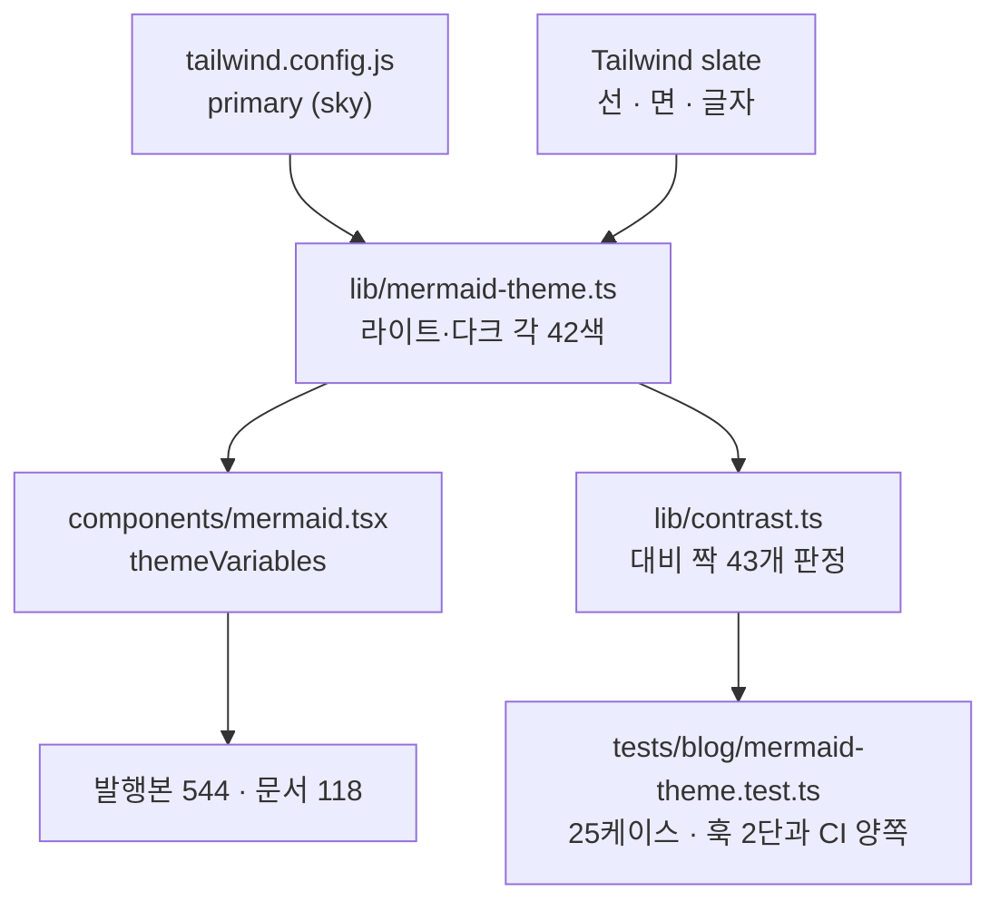
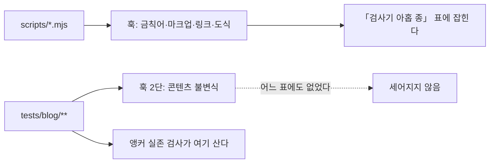

# HANDOFF

> 마지막 갱신 2026-09-06 · `pm` 배치 **시리즈 A 9/9 · 시리즈 B 8/8 완결** ·
> **이번 세션은 `diagram-design` 후보 B 를 착수해 mermaid 도식 662개의 색을 사이트 팔레트로
> 바꾸고, 대비 판정을 검사기에 넣었다.** 콘텐츠는 한 글자도 바뀌지 않았다 — 발행본 수는
> 직전 세션 그대로이고, `tests/blog` 가 **14파일 175케이스**로 · 뮤턴트가 **92개**로 늘었다.
> 🔴 **팔레트 계산이 위반 0 을 낸 뒤에 브라우저 실측이 결함 하나를 더 냈다** — mermaid 가
> 테마 변수를 우회해 속성으로 박는 색이 있어 다크 대비 **1.18** 이었다
> ([함정 47번](docs/TOOL-TRAPS.md)).
> ✅ **기록의 재귀가 닫혔다.** 직전 세션이 「문서 갱신을 실질 작업의 PR 에 함께 실어라」를
> `CLAUDE.md` 에 넣었고, 이번 세션이 그대로 했다 — 이 인수인계는 코드 커밋과 같은 PR 에 있다.
> 그 PR 이 남긴 마지막 한 칸, 곧 자기 자신의 merge 커밋과 배포 run 은 **뒤이은 세션이 채웠다**:
> merge 커밋 `16c1107` · 배포 run `34011795806` **success**(전체 130초). 같은 세션이 병합을
> 마친 `docs/session-handoff-branch-cleanup` 을 원격과 로컬에서 지워 **원격을 `main` 하나로**
> 되돌렸다. 아래 본문에서 「이번 세션」은 팔레트 작업을 한 그 세션을 가리킨다.

## 지금 상태

발행본 **184편**이다. 배치는 편8로 끝났고 그 뒤 열한 세션이 검사기의 사각지대를 닫아 왔다.
이번 세션은 **읽는 경험**을 손댄 첫 세션이다 — 지금까지의 작업이 「무엇이 틀렸는지 검사가
보는가」였다면, 이번 것은 「같은 내용이 어떻게 보이는가」다. 도식 662개의 색이 사이트와
어긋나 있었고, 콘텐츠를 건드리지 않고 그것만 바꿨다.

| 항목 | 값 |
| --- | --- |
| 발행 완료 | **A 편1~9 + B 편1~편8 (184편)** · 시리즈 B 완결 |
| 검사기 | ✅ `scripts/` **열 종** + `tests/blog/` **14파일 175케이스** · 뮤턴트 **92/92 잡힘 · 생존 0** |
| 도식 팔레트 | ✅ `lib/mermaid-theme.ts` — 라이트·다크 각 **42색** · 대비 짝 **43개**(글자 21 · 비텍스트 22) · 위반 **0** · 브라우저 실측 **양쪽 모드 0** |
| 훅 | ✅ 발행본 **9단** · 문서 **6단** · 코드만이면 즉시 통과 |
| CI | ✅ `build` **23스텝** + `deploy` 1스텝 · **`main` 푸시와 PR 양쪽에서 돈다** (PR 은 22스텝) |
| 강조 렌더 실패 | ✅ 발행본 **0회 · 184편** · 리포 문서 **0회 · 58개** |
| 깨진 링크 | ✅ 발행본 **0곳** · 리포 문서 **0곳** |
| 깨지는 도식 | ✅ 발행본 **0곳**(544개) · 리포 문서 **0곳**(118개) — **판정 도달 전량** |
| 앵커 실존 | ✅ **28개 전부 헤딩에 닿는다** — 훅과 CI 양쪽에서 돈다 |
| 검색 인덱스 | ✅ `out/blog/search-index.json` · **184편 · 헤딩 2,671개 · 311 KB** · 빌드 안에서 생성 |
| 지역 그래프 위젯 | ✅ 본문 사이드바 하단 · 이웃 상한 **12** · 초과분은 `+N` 으로 표시 · `tall`(높이 720px) 미만이면 감춘다 |
| 빌드 시간 | **30.3초** (2026-09-06 실측) — 편 목록 캐시 뒤의 값이다. **같은 세션 대조군은 38.4초**(캐시만 끔)였다. 종전 기준선 55.9초는 다른 날 다른 부하에서 잰 값이라 직접 비교하지 마라 |
| 분량 하한 SOFT | **3편** (세션 시작 5편) — 남은 셋은 **정당하다고 판정했다.** 아래 판정 표를 보라 |
| 커밋 | 이번 세션 `211fd55`(코드) + 이 인수인계 · **PR [#16](https://github.com/withwooyong/withwooyong.github.io/pull/16) 에 직전 세션의 문서 커밋 `35cbde7`·`30445ed` 를 함께 실었다** · 그 앞은 `45b2c12`(PR #15 → merge `827c3e2`) · `2214afa`·`37b4ce6`·`833ea4c`·`89acd64`·`3661a4f` (PR #13 → `e77a9d1` · PR #14 → `16d51a3`) |
| 푸시 · 배포 | ✅ **PR [#16](https://github.com/withwooyong/withwooyong.github.io/pull/16) 이 merge 커밋 `16c1107` 로 닫혔다** (부모 둘: `827c3e2` + `7631c1c`). 배포 run `34011795806` 이 **success** 였고 전체 **130초** · `build` **115초** · `deploy` **9초** 였다. PR 단계의 CI 는 run `34010490249` **success**(전체 99초 · `build` **95초**)이며, `Upload artifact` 스텝과 `deploy` job 이 설계대로 **skipped** 되었다. 그 앞은 PR #15 의 run `34007702350`(150초), PR #14 의 run `34006877177`(150초), PR #13 의 run `34004539240`(153초)였다. 머지 방식은 **merge 커밋**이다: PR #11·#12·#13·#14·#15 에 더해 #16 도 부모가 둘이며, 이 리포는 squash 를 쓴 적이 없다 |
| 프로덕션 실측 | ✅ `withwooyong.github.io` 에서 이웃 **12** · 연결선 **18** · 중심거리 표준편차 **19.15**(원형이면 0 이므로 힘 계산이 실제로 돌았다) · 이웃 간 최소 간격 **42.05** |
| 브랜치 | ✅ **원격은 `main` 하나뿐이다.** PR #16 이 병합된 뒤 `docs/session-handoff-branch-cleanup` 을 원격과 로컬 양쪽에서 지웠고, 끝 커밋 `7631c1c` 가 `main` 에서 도달 가능함을 삭제 전후로 확인했다. 그 앞에는 병합이 끝난 35개(원격 15 · 로컬 20)를 같은 방식으로 지웠다. 로컬에는 `main` 과 이번 세션의 작업 브랜치만 있다 |
| 다음 단계 | 아래 **「다음 세션의 작업」** — 우선순위 표를 먼저 보라 |

### 이번 세션이 한 일 — 도식 662개의 색을 팔레트로 바꾸고 대비를 검사기에 넣었다

인수인계에 「착수 가능」으로 남아 있던 **`diagram-design` 후보 B** 다. `themeVariables` 는
`{ fontSize: "14px" }` 하나뿐이었고 색은 mermaid 11.16.0 의 내장 `default`/`dark` 였다.
색만 덮으므로 **콘텐츠는 한 글자도 건드리지 않았다.**

#### 색의 진실원을 하나로 모았다



`styles/globals.css` 의 `--primary` 는 shadcn 기본값인 **무채색**이라 브랜드색이 아니다.
`mermaid.tsx` 자신이 이미 `slate` 테두리를 쓰고 있었으므로, 노드는 `primary` · 선과 면은
`slate` 로 나누어 도식과 그것을 감싼 카드가 같은 색 체계가 되게 했다.

#### 🔴 계산이 통과한 뒤에 브라우저가 결함 하나를 더 냈다

대비 짝 43개를 전수 계산해 위반 0 을 얻은 **다음에**, 실제 페이지에서 `getComputedStyle` 로
색을 전수 수집했다. 팔레트에 없는 색이 하나 나왔다.

| 무엇 | 값 |
| --- | --- |
| 요소 | 시퀀스의 `stickTopArrowHead`·`stickBottomArrowHead` 마커 안의 `path` |
| 획 | `rgb(0, 0, 0)` — 렌더러가 `.attr("stroke", "black")` 으로 **속성에 직접 건다** |
| 다크 캔버스 대비 | **1.18** |
| 팔레트 계산의 판정 | 위반 0 — **이 색은 팔레트에 없으므로 잴 대상이 아니었다** |

⚠️ **그 문법(`-)` 계열)을 쓰는 편이 지금 0건이라 화면에는 없다.** 그래도 덮은 이유는,
결함이 **문법 하나를 쓰는 순간** 나타나는데 그때는 아무도 팔레트를 다시 보지 않기 때문이다.
`repaintHardcodedStrokes` 로 렌더 결과에서 덮고, 뮤턴트 셋으로 고정했다.

⇒ **전량 열거는 팔레트 계산의 대체재가 아니라 짝이다.** 계산은 「내가 지정한 색」만 보고,
열거는 「화면에 그려진 색」을 본다. 판정 대상의 목록을 내가 쓰는 한, 그 목록의 누락은
그 목록으로 검사할 수 없다. 전문은 [함정 47번](docs/TOOL-TRAPS.md) 에 있다.

#### 브라우저 실측 — 두 페이지 · 도식 10개 · 세 종류 · 양쪽 모드

| 대상 | 도식 | 글자 | 도형 | 팔레트 밖 색 | 대비 위반 |
| --- | ---: | ---: | ---: | ---: | ---: |
| `transactions-and-concurrency-control` (state · flowchart · sequence) | 3 | 29 | 56 | 0 | 0 |
| `agent-harness-architecture` (flowchart · `subgraph` 포함) | 7 | 38 | 121 | 0 | 0 |
| 확대 뷰어 — **포털로 그려지는 표면** | 1 | 10 | — | 0 | 0 |

확대 뷰어를 따로 잰 이유는 **대비 1.06 결함이 났던 자리가 정확히 포털**이었기 때문이다.

⚠️ **측정 중에 두 번 헛짚었다.** 카드 배경이 `rgb(145,149,158)` 로 읽혔는데 흰색과
slate-900 사이의 **전환 애니메이션 보간값**이었고, `scrollIntoView` 도 듣지 않았다. 탭이
포그라운드가 아니면 전환이 `running` 인 채 시계가 멈춘다. `document.getAnimations()` 를
`finish()` 로 끝낸 뒤에야 `rgb(15,23,42)` 가 나왔다.

#### 검사가 실제로 도는 자리를 먼저 확인했다

| 자리 | 실행 명령 | 새 테스트가 도나 |
| --- | --- | :---: |
| pre-commit 2단 | `npx vitest run tests/blog` | ✅ |
| CI `Content invariants` | `npx vitest run --reporter=verbose` | ✅ |
| `npm run mutate` 의 `blog-unit` | 파일을 **이름으로 나열** | ⚠️ 나열에 넣어야 돈다 |

🔴 `blog-unit` 나열에 새 파일을 추가했다. 직전에 같은 실수로 새 뮤턴트 아홉 중 **여덟이
생존한** 적이 있다. 새 id(`TH1`~`TH18`)가 기존과 겹치지 않는지 `sort | uniq -d` 로 확인했다.

### 직전 세션이 한 일 — 기록의 재귀를 한 칸 좁히고 브랜치를 정리했다

**코드는 한 줄도 바뀌지 않았다.** 검사기 종 수 · 뮤턴트 수 · 발행본 수는 직전 세션 그대로이며,
이 세션이 만든 것은 문서 커밋 하나와 브랜치 정리다.

| # | 무엇 | 결과 |
| ---: | --- | --- |
| 1 | PR #14 의 merge 커밋과 배포 결과를 두 문서에 채웠다 | 커밋 `45b2c12` · PR [#15](https://github.com/withwooyong/withwooyong.github.io/pull/15) → merge `827c3e2` |
| 2 | 병합이 끝난 브랜치 35개를 지웠다 | 원격 15 · 로컬 20 · 남은 것은 `main` 하나 |

#### 🔴 문서만 고치는 PR 은 자기 자신의 병합 기록을 남기지 못한다

직전 세션이 PR #13 의 결과를 적고 그 문서 PR #14 를 병합했는데, **PR #14 자신의 merge 커밋과
배포 결과는 어느 문서에도 남지 않았다.** 이번 세션이 그 칸을 채웠지만, 같은 구조가 한 칸 더
남는다 — 이 세션의 문서 PR 도 자기 병합 기록을 적을 수 없다.

⇒ **다음 세션은 문서 갱신을 실질 작업의 PR 에 함께 실어라.** 문서만을 위한 PR 을 또 열면 같은
일이 세 번째로 반복된다. 이월할 값은 아래 「지금 상태」 표에 적어 두었다.

#### 브랜치 정리 — 지우기 전에 도달 가능성을 증명했다

정리 대상 35개가 **전부 `main` 에 완전히 포함되어 있었다.** 병합되지 않은 채 남은 브랜치는
하나도 없었고, 닫히기만 하고 병합되지 않은 PR 도 없었다.

| 구분 | 정리 전 | 정리 후 | 판정 근거 |
| --- | ---: | ---: | --- |
| 원격 | 16 | **1** (`main`) | `git branch -r --merged origin/main` 이 15개 전부를 냈다 |
| 로컬 | 21 | **1** (`main`) | `git branch -d` 로 지웠다 — 병합되지 않았다면 그 자리에서 거부된다 |

삭제한 뒤 35개 끝 커밋의 SHA 를 하나씩 확인해 **객체 존재 35 · 소실 0 · `main` 에서 도달 불가 0**
임을 검증했다. `-d` 가 거부하지 않았다는 것만으로 끝내지 않은 이유는, 그것이 「지울 수 있다」를
말할 뿐 「지운 뒤에도 남아 있다」를 말하지는 않기 때문이다.

⚠️ **복구 SHA 목록은 세션 임시 디렉터리에만 있고 리포에는 없다.** 브랜치 이름과 SHA 의 대응이
필요해지면 `git log` 로 커밋은 찾을 수 있으나 어느 이름이었는지는 알 수 없다. 최근 넷은
`docs/handoff-pr14-deploy` `45b2c12` · `docs/handoff-pr13-merge` `3661a4f` ·
`fix/local-graph-low-findings` `89acd64` · `docs/es-architecture-gaps` `d79c0a6` 다.
### 그 앞 세션이 한 일 — LOW 3건과 E2E 2건

직전 세션이 「리뷰가 LOW 로 판정해 고치지 않았다」며 남긴 셋과, 「E2E 에서 확인하지 않은 것 둘」을
닫았다. **셋 다 대조군을 세웠다** — 자세한 실측은 아래 「알려진 문제」의 표에 있다.

| # | 무엇 | 커밋 |
| ---: | --- | --- |
| 1 | 프로덕션 빌드에서 발행본을 한 번만 읽는다. 조건부 메모이제이션 `lib/blog/memo.ts` 를 새로 만들었다 | `2214afa` |
| 2 | 없는 중심 노드에 대한 `graph-layout.ts` 와 `graph.ts` 의 방침을 **던지는 쪽으로** 통일했다 | `37b4ce6` |
| 3 | StrictMode 애니메이션. 진행 규칙을 `lib/blog/graph-animation.ts` 로 뽑아 컴포넌트에 가드가 들어갈 자리를 없앴다 | `833ea4c` |
| 4 | 뮤턴트 9개 추가(65 → **74**)와 `blog-unit` 검사 범위 확장, 늘어난 수치의 문서 반영 | 아래 |

#### 닫은 뒤에 무엇이 남았나 — merge · 배포 · 프로덕션 실측

| 단계 | 값 |
| --- | --- |
| merge | PR [#13](https://github.com/withwooyong/withwooyong.github.io/pull/13) 이 **merge 커밋 `e77a9d1`** 로 닫혔다 (부모 둘) |
| 배포 | run `34004539240` **success** · 전체 **153초** · `build` 138초 · `deploy` **8초** |
| 프로덕션 실측 | 이웃 **12** · 연결선 **18** · 중심거리 표준편차 **19.15** · 이웃 간 최소 간격 **42.05** |
| 문서 반영 | 위 세 줄을 인수인계와 변경 기록에 적은 것이 커밋 `3661a4f` 이고, 문서 PR [#14](https://github.com/withwooyong/withwooyong.github.io/pull/14) 가 **merge 커밋 `16d51a3`** 으로 닫혀 배포까지 끝났다 (run `34006877177` **success** · 전체 **150초** · `build` 132초 · `deploy` **10초**) |

표준편차가 0 이 아니라는 것이 이 실측의 핵심이다. 초기 배치는 반지름이 같은 원형이라 표준편차가
정확히 0 이므로, 0 에서 벗어난 값은 **힘 계산이 배포된 화면에서 실제로 돌았다**는 뜻이다.
최소 간격 42.05 는 `DEFAULT_LAYOUT_OPTIONS.minGap` 인 26 을 웃돌아 노드가 겹치지 않았음을
함께 말해 준다.

#### 🔴 「검사 목록에 있다」는 것과 「그 검사가 내 케이스를 본다」는 다른 말이다

새 뮤턴트 아홉을 넣고 전량을 돌렸더니 **여덟이 생존했다.** `G8` 하나만 잡혔다.

원인은 `scripts/mutate.mjs` 의 `CHECKS` 에 있다. `blog-unit` 은 `tests/blog` 를 통째로 돌리지
않고 **파일 넷을 이름으로 나열**한다(`tree`·`search`·`graph`·`graph-layout`). 이번에 만든 테스트
파일 셋은 거기 없었으므로, 뮤턴트가 되살린 결함을 볼 케이스가 **아예 실행되지 않았다.** `G8` 만
잡힌 것은 그것이 `graph-layout.test.ts` 대상이었기 때문이다.

같은 실행에서 **뮤턴트 id 가 겹친 것**도 드러났다 — 새로 붙인 `C1`~`C4` 가 `check-forbidden`
계열에 이미 있어 로그에 같은 id 가 둘씩 찍혔다. `MC1`~`MC4` 로 바꿨다.

| 무엇을 했나 | 왜 |
| --- | --- |
| `blog-unit` 이 새 테스트 파일 셋도 나열하게 했다 | 나열식이므로 파일을 만들 때마다 손으로 더해야 한다. 이 사실 자체를 `CLAUDE.md` 에 적었다 |
| 새 뮤턴트만 **격리해서 먼저 확인**했다 | 전량이 15분이라 되돌림 확인의 순환이 너무 느리다. `MUTANTS` 배열을 `mutate.mjs` 에서 읽어 오는 프로브를 리포 루트에 두고 돌린 뒤 지웠다 — 손으로 옮겨 적으면 정본이 갈라진다 |
| id 중복을 `sort \| uniq -d` 로 검사했다 | 러너는 중복 id 를 오류로 다루지 않는다. 로그를 눈으로 읽어야 드러난다 |

🔴 **뮤턴트를 설계하다 케이스 둘이 헛돌고 있던 것을 찾았다.** 하나는 「꺼진 동안 계산한 값이
캐시를 덮어도」 통과했고, 다른 하나는 `totalTicks` 30 과 `ticksPerFrame` 6 이 나누어떨어져
**상한을 씌우지 않아도 마지막 값이 우연히 맞았다.** 둘 다 뮤턴트를 만들지 않았다면 드러나지
않았을 자리다. ⇒ **케이스를 쓴 다음 그것을 무너뜨릴 뮤턴트를 설계해 보라. 설계가 안 되면
그 케이스는 아직 아무것도 지키지 않는다.**

### 그보다 앞선 세션 — 지역 그래프 위젯

계획서 `docs/superpowers/plans/2026-09-05-local-graph-widget-plan.md` 의 태스크 9개를
5개 라운드로 묶어 실행했다. 의존이 사슬 형태라 병렬 폭은 최대 2였다.

| # | 무엇 | 커밋 |
| ---: | --- | --- |
| 1 | 링크 추출과 지역 그래프 조립. **「무엇이 편을 잇는 링크인가」의 정본**을 `lib/blog/graph.ts` 하나로 모았다 | `8f57400` |
| 2 | 난수를 쓰지 않는 힘 시뮬레이션으로 좌표를 계산한다. 같은 입력이 같은 좌표를 낸다 | `c6f4ba1` |
| 3 | `links.test.ts` 의 자체 정규식을 지우고 위 정본을 쓰게 했다. **전후 수치가 1,611·921·차집합 0 으로 같았다** | `ce4656b` |
| 4 | 발행본 184편 전량 불변식 5케이스. **판정 도달 수를 세어 184와 대조한다** | `ed087d8` |
| 5 | 로더·위젯·사이드바. 셋 중 하나만으로는 타입이 통과하지 않아 한 커밋으로 묶었다 | `f943d2b` |
| 6 | 뮤턴트 7개 추가(58 → **65**)와 늘어난 검사 수치의 문서 반영 | `69b7221` |
| 7 | 리뷰 MEDIUM 1건 — 개발 서버에서는 링크 지형을 캐시하지 않는다 | `4029095` |
| 8 | 🔴 **CI 만 잡은 것** — 링크 검사가 케이스마다 발행본을 다시 파싱하던 것을 고쳤다 | `3f37672` |

#### CI 만 잡은 것 — 로컬 초록 열 개가 숨긴 것

첫 PR 의 `build` job 이 55초에 죽었다. `tests/blog/content/links.test.ts` 의 「내부 링크의
대상이 전부 실재한다」가 **5,173 ms** 로 vitest 기본 타임아웃 5,000 ms 를 넘겼고, 같은 파일의
다른 두 케이스도 3,603 ms · 3,163 ms 로 경계에 붙어 있었다.

원인은 케이스마다 추출 함수를 불러 **184편을 다시 판** 것이다. 정규식일 때는 그래도 됐지만
파서로 옮긴 뒤로는 1회가 실측 1.5초다. **로컬은 통과했다** — 개발 머신이 러너보다 빠르기 때문이다.

| 무엇을 했나 | 왜 |
| --- | --- |
| 추출 결과를 **파일 수준에서 한 번만** 만들어 재사용 | vitest 의 타임아웃은 각 `it` 에만 걸리고 파일 수준 초기화에는 걸리지 않는다. 실측 `tests` 시간이 **17 ms** 가 됐다 |
| 타임아웃을 **늘리지 않았다** | 증상만 가리고 다음 케이스가 같은 벽에 부딪힌다 |
| `buildLinkIndex` 를 **재사용하지 않았다** | 그것은 실재하지 않는 대상을 이미 버린다. 죽은 링크를 찾는 케이스가 그것을 쓰면 언제나 통과한다 |
| 캐시를 함수 안에 **숨기지 않았다** | 자기검사 케이스가 키는 같고 본문만 다른 가짜 편을 넘긴다. 키로 조회하면 그 케이스가 헛돈다 |
| 캐시 경로에 죽은 링크를 **주입해 FAIL 을 확인했다** | 빨라진 것과 여전히 잡는 것은 다른 말이다 |

⇒ 🔴 **판정 방식을 바꾸는 리팩터링은 실행 시간도 바꾼다.** 리뷰도 검증도 이것을 놓친 이유는
분명하다 — 성능을 물을 때 **빌드 시간만 묻고 테스트 실행 시간은 아무도 세지 않았다.**
다음 검증 브리프에 「각 케이스의 실행 시간과 타임아웃 여유」를 항목으로 넣어라.

🔴 **G7 뮤턴트가 1차 실행에서 생존했다.** 기본 뷰박스가 가로 200 · 세로 180 이라 세로 한계가
언제나 먼저 걸려, 가로 축소식을 통째로 지워도 12케이스가 전부 통과했다. 뮤턴트를 지우지 않고
**가로가 좁은 뷰박스 두 종을 케이스에 더했다.** ⇒ 검사가 도는 것과 검사가 무언가를 지키는 것은
다른 말이고, 그 차이는 뮤테이션에서만 드러난다.

#### 기준선을 남기는 이유 — 빌드 55.9초

계획서는 「링크 지형을 빌드당 한 번만 만들지 않으면 빌드가 **약 262초 늘어난다**」고 적었는데,
정작 **평소 빌드 시간을 절대값으로 남긴 문서가 없었다.** 그래서 이번 검증은 「55.9초는 262초보다
훨씬 작다」는 정황으로만 판단할 수 있었고, 직전 커밋과의 직접 대조는 하지 못했다.
⇒ **증분만 적고 기준선을 안 적으면 다음 세션이 같은 판단을 다시 한다.**

⚠️ **그 55.9초는 이제 비교 대상이 아니다.** 다음 세션이 편 목록 캐시를 넣으면서 **같은 세션
안에서** 대조군을 세웠고(캐시만 끈 38.4초 대 켠 30.3초), 그때 드러난 것은 **다른 날 잰 절대값끼리
빼면 안 된다**는 것이다. 55.9 → 30.3 의 차이 25.6초 중 캐시가 설명하는 것은 8.1초뿐이며 나머지는
그날의 부하다. ⇒ **기준선은 절대값 하나가 아니라 「같은 세션에서 조건 하나만 바꾼 짝」으로 남겨라.**

### 더 앞선 세션들

| # | 무엇 | 어디에 남았나 |
| ---: | --- | --- |
| 1 | 🔴 **CI 를 PR 에서도 돌게 했다** — 직전까지 `gh pr checks` 가 `no checks reported` 였다 | PR [#6](https://github.com/withwooyong/withwooyong.github.io/pull/6) · `1f21183` · 아래 0번 |
| 2 | 낡은 수치 · 서술 **여섯 건**을 실측으로 고쳤다 | `HANDOFF.md` · `CLAUDE.md` · `README.md` |
| 3 | L4 의 완화책을 채워 분량 하한 SOFT 를 **5편 → 4편**으로 줄였다 | PR [#7](https://github.com/withwooyong/withwooyong.github.io/pull/7) · `08ead8a` |
| 4 | 직전 세션의 **미푸시 커밋**을 정리했다 — 로컬에만 있던 `4e973b9` | PR #6 |
| 5 | 열려 있던 네 항목의 **우선순위를 실측으로 정렬**했다 | 아래 우선순위 표 |
| 6 | 분량 하한 SOFT 를 **판정으로 닫았다** — 하나는 보강하고 셋은 정당하다고 기록했다 | 아래 판정 표 · `elasticsearch-architecture.md` |

⚠️ **2번의 여섯 건 중 둘은 「작업」이 아니라 「오탐의 승격」이었다.** README 의 `:verify` 6개는
없는 것이 아니라 서술 방식이 둘이었고, 그 상태로 두 세션 동안 미해결 목록에 실려 있었다.
⇒ **검사기의 신호를 판정 없이 목록으로 옮기면 오탐이 작업이 된다.**

---

## 🎯 다음 세션의 작업

### 우선순위 — 실측으로 정렬했다

정렬 기준은 「위험이 높고 비용이 낮은 것」이다. 위 둘은 이번 세션이 닫았다.

| 순위 | 항목 | 비용 | 위험 | 사용자 결정 | 상태 |
| :---: | --- | :---: | :---: | :---: | --- |
| ~~1~~ | ~~CI 가 PR 에서 돌지 않는다~~ | 낮음 | 높음 | 불필요 | ✅ PR #6 |
| ~~2~~ | ~~문서 정정 여섯 건~~ | 매우 낮음 | 중간 | 불필요 | ✅ PR #6 |
| ~~3~~ | ~~분량 하한 SOFT — 19 B 편~~ | 낮음 | 낮음 | 약간 | ✅ PR #7 |
| ~~4~~ | ~~분량 하한 SOFT 나머지 4편~~ | 높음 | 낮음 | 필요 | ✅ **판정 완료** — 아래를 보라 |
| **5** | 도식의 의미 검사 **662개** | 매우 높음 | 중간 | **필요** | 미착수 |
| **6** | 시리즈 A·B 밖의 **새 배치** | 매우 높음 | — | **필요** | 미착수 |
| ~~—~~ | ~~`diagram-design` 후보 B~~ | 중간 | 낮음 | 약간 | ✅ **이번 세션이 닫았다** — 위를 보라 |
| ~~7~~ | ~~`diagram-design` 후보 A · C~~ | 중간~높음 | 낮음 | 받았다 | ⬜ **사용자 판단으로 보류했다** (2026-09-06). 아래 **「후보 A 를 하지 않기로 한 근거」를** 읽고, 다시 꺼내려거든 그 여섯 줄을 먼저 반박하라 |

### ✅ 분량 하한 SOFT — 판정을 마쳤다. **남은 셋은 정당하다**

🔴 **넷을 한 덩어리로 다루면 안 된다.** 절 수와 절 두께를 실측하니 짧은 이유가 편마다 달랐다.

| 편 | 절 수 | 평균 | 왜 짧은가 | 피인용 | 판정 |
| --- | ---: | ---: | --- | ---: | --- |
| `search-engineering/elasticsearch-architecture.md` | 11 | **1,040 B** | 주제는 넓은데 **각 절이 얇았다** (다섯 절이 700 B 미만) | 6회 | ✅ **보강했다** — 11,435 → **15,082 B** |
| `search-engineering/search-system-overview.md` | 7 | 1,343 B | 카테고리 **개괄**이라 넓고 얕다 | 0회 | ⬜ **정당** — 두껍게 만들면 개괄이 아니게 된다 |
| `search-engineering/search-engineering-in-practice.md` | 5 | 1,627 B | 절은 얇지 않고 **절 수가 적다.** 경력 서술이라 소재가 제한된다 | 2회 | ⬜ **정당** — 소재를 늘리면 **금칙어(회사명·직책)에 걸린다** |
| `rag/rag-knowledge-map.md` | 4 | **2,595 B** | **넷 중 절이 가장 두껍다.** 「지도」라 4절로 완결되며 발신 링크가 **22편**을 가리키는 허브다 | 0회 | ⬜ **정당** — 형식의 특성이다 |

**병합은 권하지 않는다.** 셋을 실측했고 합쳐서 좋아지는 조합이 없었다.

| 조합 | 합계 | 왜 안 되나 |
| --- | ---: | --- |
| `elasticsearch-architecture` + `elasticsearch-operations` | 27,920 B | 카테고리 최대가 되고 **피인용 6회를 전부 고쳐야 한다** |
| `search-system-overview` + `search-engineering-in-practice` | 17,538 B | 개괄과 경력 서술이라 **성격이 다르다** |
| `rag-knowledge-map` + 무엇이든 | — | 22편을 가리키는 허브라 다른 편에 넣으면 **지도가 사라진다** |

⇒ **이 세 편을 다시 작업 목록에 올리지 마라.** SOFT 는 「인접 편과 병합을 검토하라」는 신호이고,
셋 다 검토한 결과 병합이 답이 아니다. 하한 검사가 **허브·개괄 문서를 구분하지 못하는 것**이
남은 문제이며, 그것을 닫으려면 검사기에 예외 개념을 넣어야 한다 (별도 설계 필요).

### `diagram-design` 적용 검토

사용자의 제안이다.

> [`cathrynlavery/diagram-design`](https://github.com/cathrynlavery/diagram-design) 을 적용해서
> 도표 등을 다시 생성하면 사이트가 좀 더 깔끔하게 보이지 않을까 하는데, 작업을 검토해 보자.

**착수가 아니라 검토다.** 아래는 이번 세션이 미리 확인해 둔 사실이며, 다음 세션은 이것을
출발점으로 삼되 **다시 실측하라** — 이 표의 수치도 대조군 없이는 근거가 아니다.

### 그 저장소가 무엇인가 (README 실측)

| 항목 | 내용 |
| --- | --- |
| 형태 | **Agent Skill · 플러그인.** 🔴 **이미 설치되어 있다** — `diagram-design` **v2.6.12** 가 `~/.claude/plugins/cache/` 에 있고 스킬 여섯 종(`diagram-design`·`import-mermaid`·`import-drawio`·`export-diagram`·`profile`·`doctor`)이 스킬 목록에 뜬다. `/plugin marketplace add` 를 다시 할 필요가 없다 |
| 산출물 | **자체 완결 HTML + 인라인 SVG.** PNG 는 Playwright 로 래스터화한다 |
| 도식 종류 | 39종 · `import-mermaid` · `import-drawio` 커맨드가 있다 |
| 라이선스 | MIT |
| 외부 의존 | Google Fonts 셋 (Instrument Serif · Geist · Geist Mono) |
| 표방 | README 가 `No Mermaid slop` 이라고 적었다 — **Mermaid 를 대체하려는 도구다** |

### 🔴 이 리포에 그대로 적용할 수 없는 이유 넷

| # | 무엇이 막나 | 실측 |
| ---: | --- | --- |
| 1 | **마크다운이 raw HTML 을 렌더하지 않는다** | `components/markdown.tsx` 의 플러그인은 `remarkGfm` · `rehypeSlug` **둘뿐**이고 `rehype-raw` 가 `package.json` 에 없다. 인라인 SVG 를 `.md` 에 넣으면 **화면에 문자열로 찍힌다** |
| 2 | **분량 예산이 흔들린다** | 인라인 SVG 는 바이트가 크다. 발행본은 `tests/blog/content/schema.test.ts` 가 분량 밴드를 강제하고, 배치의 역산 배율이 그 바이트 위에 서 있다 |
| 3 | **다크 모드가 사라진다** | `components/mermaid.tsx` 는 `<html class="dark">` 를 `MutationObserver` 로 구독해 테마를 **다시 그린다**. 정적 SVG 는 색이 고정된다 — 이번 세션이 대비 1.06 으로 데인 자리가 바로 색이다 |
| 4 | **검사기가 무력해진다** | `check-mermaid` 가 발행본 **544개** · 문서 **118개**를 파서로 판정한다. HTML+SVG 로 바꾸면 그 662개가 **아무도 보지 않는 자리**가 된다. 대체 검사기부터 있어야 한다 |

### ✅ 그래도 값어치가 있는 쪽 — 좁게 적용할 세 후보

| 후보 | 대상 | 왜 여기는 되나 |
| --- | ---: | --- |
| **A. 포트폴리오 홈 「시스템 구성도」** | `components/system-diagram-card.tsx`(110줄) + `components/flow-diagram/`(8파일) · 도식 **10개** · 회사 그룹 **4개** | 이미 마크다운 밖의 React·SVG 다. 1·2번 제약을 받지 않고, 방문자가 가장 먼저 보는 화면이다 |
| ~~**B. Mermaid 테마 신설**~~ | ~~`components/mermaid.tsx` 의 `themeVariables`~~ | ✅ **이번 세션이 닫았다.** 예상대로 콘텐츠는 한 글자도 바뀌지 않았고 검사기도 그대로 살았다. 예상하지 못한 것이 하나 있었다 — **테마 변수가 닿지 않는 색이 있어** 계산이 위반 0 을 낸 뒤 브라우저 실측에서 대비 1.18 이 나왔다 |
| **C. 대표 도식 몇 개만 승격** | 편별 헤드라인 도식 | 1번 제약 때문에 `.md` 가 아니라 **컴포넌트**로 옮겨야 한다. 구조를 먼저 설계해야 하므로 A·B 뒤 |

#### 🔴 후보 A 의 대상 수를 다시 셌다: **5개가 아니라 10개다**

사용자가 「후보 A 가 어느 영역인지 보여 달라」고 해서 프로덕션을 열었고, 그 자리에서 종전
기재가 틀렸음이 드러났다. 비용 추정이 두 배로 달라지므로 착수 전에 반드시 반영해야 한다.

| 항목 | 종전 기재 | 실측 | 무엇으로 셌나 |
| --- | ---: | ---: | --- |
| 도식 수 | 5 | **10** | `data/portfolio.ts` 의 `diagramGroups` 안 `specId` · `data/diagrams/` 의 정의 파일 · 프로덕션의 「크게 보기」 버튼. 셋이 모두 10 이다 |
| 회사 그룹 | 기재 없음 | **4** | 야나두 3 · SK브로드밴드 4 · CJ헬로비전 1 · 쌍용정보통신 2 |
| 그리는 방식 | 「손그림 SVG」 | **좌표를 계산해 그리는 인라인 SVG** | `components/flow-diagram/` 8파일. `rough`·`sketch` 계열 라이브러리를 쓰지 않으므로 「손그림」은 지금 상태가 아니라 스킬이 만들 스타일을 가리킨 말이었다 |

⚠️ **`grep -c "specId:" data/portfolio.ts` 는 11 을 낸다.** 타입 정의의 `specId: string;` 이
함께 잡히기 때문이다. 배열 범위를 `awk` 로 자른 뒤 세야 10 이 나온다. `company:` 도 같은
이유로 5 가 되므로, **두 수 모두 화면 실측과 대조하라.**

#### ⬜ 후보 A 를 하지 않기로 한 근거 (2026-09-06 · 사용자 판단)

사용자가 「후보 A 가 어느 영역인지 보여 달라」고 해서 프로덕션을 열었고, 그 자리에서 나온
질문이 결정을 바꿨다: **「현재 UI/UX 에 만족하는데 왜 수정하려 하는가.」**

🔴 **근거를 되짚으니 B 와 A 는 종류가 달랐다.** B 는 색 체계가 실제로 어긋나 있었고 다크 대비
**1.18** 결함까지 나왔다. 반면 A 의 근거로 적혀 있던 두 줄은 「이미 마크다운 밖의 React·SVG
라 제약을 받지 않는다」와 「방문자가 가장 먼저 보는 화면이다」였다. 이것은 **「할 수 있다」와
「중요한 자리다」이지 「지금 잘못되어 있다」가 아니다.** A 에서 결함이 실측된 적은 없다.

그리고 현재 구현이 정적 산출물보다 **많은 일을 하고 있었다.** 프로덕션 실측이다.

| 지금 있는 것 | 실측값 | 정적 SVG 로 갈아타면 |
| --- | --- | --- |
| 간선이 흐른다 | `flow-dash` **1.4초** 루프 · `stroke-dashoffset` 이 변한다 | CSS 를 따로 얹으면 가능하다 |
| 패킷이 경로를 따라 이동한다 | `flow-move` **2.6초** · `offset-path` · 패킷 **142개** · 700ms 사이 87.1% → 39.0% | 경로마다 `offset-path` 를 다시 짜야 한다 |
| 뷰포트 밖 도식은 애니메이션을 끈다 | 도식 10개 중 **3개만** `data-flow-animate="on"` | 정적 산출물에는 이 제어가 없다 |
| 호버하면 연결되지 않은 요소를 흐린다 | `.flow-dim` opacity **0.15** · React 상태 `hovered` | 상태에 얹힌 동작이라 다시 만들어야 한다 |
| 다크 모드가 즉시 바뀐다 | CSS 변수 `--flow-*` | 색이 SVG 안에 고정되면 깨진다 (위 제약 3번) |
| 빌드 타임 교차 검증 | `data/diagrams/index.ts` 가 `specId` 실존을 본다 | 검증 대상이 사라진다 |

⇒ **얻는 것은 그림체 하나이고 잃는 것은 위 여섯 줄이다.** `prefers-reduced-motion: reduce`
대응까지 이미 들어 있다. 남은 C 는 A 보다 비용이 크고 근거는 같으므로 함께 보류한다.

⚠️ **이 판정은 「diagram-design 이 나쁘다」가 아니다.** B 는 실제로 값어치가 있었다. 판정의
범위는 하나다: **결함이 실측되지 않은 자리를 그림체 때문에 갈아엎지 않는다.** 홈 도식에서
대비 위반이나 테마 전환 결함이 나오면 그때 다시 꺼내라.

**권장 순서는 B → A → C 였고, B 만 닫았다.** A 와 C 는 위 근거로 보류했다.

✅ **물었고 답을 받았다 (2026-09-06).** 「깔끔함」은 B 만으로 충족되었고, 사용자가 현재
UI/UX 에 만족한다고 밝혔다. 남은 둘은 비용만 남으므로 보류했다. 근거는 위를 보라.

### 검토할 때 먼저 답할 질문 넷

1. 스킬이 만드는 HTML 이 **다크 모드에서도 읽히는가.** ✅ **후보 B 가 답을 하나 늘렸다** — 「모달 배경 대비 글자색」만으로는 부족하다. 화면에 실제로 쓰인 색을 **전수 열거해 팔레트 밖의 것을 찾아야** 한다. 계산이 위반 0 을 낸 뒤에 그 방법으로 결함이 하나 더 나왔다. 재사용할 스크립트는 `docs/TOOL-TRAPS.md` 47번에 적어 두었다
2. Google Fonts 를 **정적 export 에 들이는 것이 맞는가.** ⚠️ 「지금 사이트는 Inter 하나다」는 틀렸다 — 실측으로 `pages/_document.tsx` 가 **이미 Google Fonts 링크를 쓰고**(Nanum Pen Script) Inter 는 `next/font/google` 로 셀프 호스팅된다. 즉 폰트가 둘이고 적재 방식도 둘이다. 스킬이 요구하는 것은 다섯이다 — Instrument Serif · Geist · Geist Mono **+ 한글용 Noto Sans KR · Noto Serif KR**. **이 질문은 후보 B 에는 해당하지 않는다** (B 는 색 값만 빌린다)
3. 스킬의 산출물이 **재현 가능한가.** LLM 생성물이라면 도식 하나를 고칠 때마다 전체가 흔들린다. **이 질문도 후보 B 에는 해당하지 않는다** — B 는 색 값이 코드에 고정되므로 재생성이라는 개념이 없다. ⚠️ 스킬 자신이 「`assets/` 의 예제 HTML **155개는 이전 스킨**으로 만들어졌다」고 적어 두었으므로, 예제를 근거로 팔레트를 판단하지 마라
4. B(테마 교체)만으로 사용자가 말한 「깔끔함」이 충족되는가. ✅ **답을 받았다 (2026-09-06): 충족되었다.** 프로덕션 배포(run `34011795806`)를 확인한 사용자가 현재 UI/UX 에 만족한다고 밝혔고, A·C 는 보류로 닫혔다. **이 질문은 다시 열지 마라** — 다시 꺼내려면 홈 도식에서 결함을 먼저 실측해야 한다

---

## 🔴 다음 세션이 반드시 먼저 알아야 할 것

### 0-b. ⚠️ **`CHANGELOG.md` 의 정본에 CR 이 섞여 있어 `^##` 정규식이 어긋난다**

`/handoff` 의 절 분해 스크립트가 세 절 중 **둘만 잡았다.** `grep -n "^## "` 은 셋을 잡는데
Node 의 `/^## 2026-/` 은 못 잡는 줄이 있었다.

| 무엇 | 값 |
| --- | ---: |
| `core.autocrlf` | `true` |
| **커밋된 blob 의 CR** | **18개** (2026-09-06 실측) — 작업 트리만의 문제가 아니다. 종전에 적어 둔 222개는 절이 회전하면서 옛값이 되었다 |
| CR 이 어디에 있나 | 본체는 **헤더 18줄만 CRLF** 이고 절 본문은 LF 다. `docs/changelog/2026-09.md` 는 **전량 CRLF** 다 |
| 어긋난 줄의 실제 모양 | `split("\n")` 하면 `"\r## 2026-09-04 — …"` 가 된다 — CRLF 줄의 CR 이 **다음 줄의 첫 글자**로 넘어가기 때문이다 |

`split("\n")` 하면 CR 이 다음 줄의 첫 글자가 되어 `^##` 이 매칭되지 않는다. **`grep` 과
Node 정규식이 다른 답을 내므로, 한쪽만 보고 「절이 셋이다」를 확신하면 안 된다.**

⇒ 대응은 **`/^\r?## /` 로 쓰고 `split("\n")`·`join("\n")` 을 유지하는 것**이다. `split(/\r?\n/)`
으로 나눠 `\n` 으로 다시 쓰면 CR 이 통째로 사라져 **그 절 전체가 diff 에 뜬다** — `CLAUDE.md`
가 「깨끗한 diff 는 증거가 아니다」라고 적은 자리와 반대 방향의 사고다. 줄바꿈 통일은 이 작업의
범위가 아니므로 **CR 을 보존하라.**

### 0. 🔴 **「CI 에 있다」와 「merge 전에 돈다」는 다른 말이었다**

`.github/workflows/deploy.yml` 의 트리거가 **`push: [main]` 하나뿐**이었다. 워크플로도 하나뿐이라
`gh pr checks` 가 `no checks reported` 를 냈고, **23스텝은 merge 된 뒤에야 돌았다.**

| 무엇 | 그 결과 |
| --- | --- |
| 프리뷰 환경이 없다 | `main` 이 곧 프로덕션이다 |
| 검사가 merge 뒤에 돈다 | PR 단계에서 걸러야 할 것이 **프로덕션에서 드러난다** |
| 실측 | 다크 모드 대비 1.06 결함이 그 경로로 배포됐고, 잡은 것은 검사기가 아니라 **사용자의 눈**이었다 |

세 세션이 「CI ✅ 22스텝」이라고만 적었을 뿐 **언제 도는지를 아무도 적지 않았다.** 검사의 목록은
계속 세면서 검사가 도는 시점은 세지 않은 것이다.

⇒ 지금은 `pull_request: branches: [main]` 이 함께 걸려 있고, `deploy` job 과 `Upload artifact`
스텝만 `github.event_name != 'pull_request'` 로 빠진다. `concurrency` 그룹도
`${{ github.workflow }}-${{ github.ref }}` 로 나눴다 — `"pages"` 하나로 두면 **PR 검사가 배포와
같은 큐에 끼어들기 때문이다.**

🔴 **워크플로를 하나로 유지한 이유는 검사 목록이 두 벌이 되는 것을 막기 위해서다.** `ci.yml` 을
따로 만들면 스텝을 더할 때 한쪽만 고쳐지고 다른 쪽이 낡는다 — 이 리포가 뮤턴트 수 · 훅 단수 ·
검사기 종 수에서 **세 세션 연속으로 겪은 실패가 정확히 그 유형이다.**

### 1. 🔴 **인수인계 문서에 적힌 수치는 검증된 적이 없었다**

이 리포는 「증명하기 전에는 0을 믿지 마라」를 아홉 검사기에 새겨 두었다. 그런데 그 규칙이
**문서 자신에게는 적용되지 않았다.** 아홉 검사기의 `--self-test` 를 전부 돌려 대조하니
다섯 자리가 낡아 있었다.

| 어디 | 적혀 있던 값 | 실측 |
| --- | ---: | ---: |
| `README.md` `check-forbidden:verify` | 15건 | **63** |
| `HANDOFF.md` 표 `check-forbidden` | 15건 | **63** |
| `HANDOFF.md` 표 `dup-scan` | 7건 | **12** |
| `HANDOFF.md` 표 `source-overlap` | 28건 | **42** |
| `CLAUDE.md` 검사기 개수 | 여덟 | **아홉** |

넷(`check-markup` 24 · `fix-markup` 19 · `check-links` 23 · `check-mermaid` 26)과 뮤턴트 수
50 은 일치했다. **넷이 맞았기 때문에 계수 방식이 아니라 값이 낡았다고 판정할 수 있었다** —
대조군이 없었다면 「내 계수법이 틀렸나」와 구분되지 않는다.

🔴 **직전 세션은 `check-forbidden` 하나만 낡았다고 기록했다.** 한 자리를 「자동 대조가 안 된다」는
이유로 남기면 **같은 이유로 낡은 옆자리는 아예 세어 보지 않게 된다.**

⚠️ 어긋난 셋은 전부 **검사기가 스스로 세지 않는 것**이었다.

| 검사기 | 건수를 어떻게 읽나 |
| --- | --- |
| `check-markup` · `check-links` · `check-mermaid` · `source-overlap` | `24/24` 형태로 **스스로 출력한다** |
| `check-forbidden` | 형식이 달라 `통과 63 / 실패 0` 으로 낸다 |
| 🔴 `dup-scan` · `fix-markup` | **요약 숫자를 내지 않는다.** `PASS` 줄을 세야 한다 |

```
node scripts/<검사기>.mjs --self-test 2>&1 | grep -cE '(PASS|✅)'
```

### 2. 🔴 **검사기는 `scripts/` 에만 살지 않는다 — 목록이 절반만 세고 있었다**

`HANDOFF.md` 는 **앵커 유효성**을 「남은 사각지대」 첫 줄에 두고 세 세션을 넘겨 왔다. 근거는
「`check-links` 는 앵커를 분리만 하고 판정하지 않는다」였고 **그 문장은 사실이다.** 그런데
판정은 다른 곳에서 이미 하고 있었다.

| 무엇 | 어디에 | 상태 |
| --- | --- | --- |
| 도착지 집합 | `lib/toc.ts:75` `headingIds` | 렌더러와 **같은** `github-slugger` |
| 앵커 추출 | `tests/blog/content/links.test.ts` `anchorLinks` | `%`-인코딩을 디코드한다 |
| 판정 | 같은 파일 `brokenAnchors` | 대상 편이 없는 경우는 **일부러 제외** — 한 결함이 두 번 보고되지 않게 |
| 자기검사 · 본 검사 | `describe` 「앵커 실존」 | ✅ 둘 다 통과 |
| 「0건 검사」 가드 | `expect(seen.length).toBeGreaterThan(0)` | 하나도 못 뽑으면 실패시킨다 |
| 게이트 | 훅 2단 · CI | ✅ **양쪽에서 돈다** |

원인은 훅 단계의 **이름**이다.



2단의 실체는 `npx vitest run tests/blog` 인데 이름이 「콘텐츠 불변식」이라 Vitest 를 가리키는지
드러나지 않는다. ⇒ **검사를 찾을 때 `scripts/` 만 훑지 마라.**

⚠️ `check-links.mjs` 가 앵커를 버리는 것은 결함이 아니라 역할 분담이다. 앵커 판정은 렌더러와
같은 슬러거를 불러야 하는데 그것은 TypeScript 부품이라 **구조적으로 `.mjs` 에서는 살 수 없다.**

### 3. 🔴 **브라우저용 라이브러리를 Node 에서 부르면 「보지 않은 것」이 「통과」가 된다**

직전 세션의 교훈이며 여전히 유효하다. `mermaid.parse()` 는 DOM 없이 부르면 파싱에 닿기도 전에
죽는데, 그 실패를 「위반 없음」으로 세면 **649개 중 621개**를 보지 않고 초록이 나온다.

⇒ 오류를 둘로 가르되 🔴 **환경 쪽을 열거하고 나머지를 위반으로 둔다.** 반대로 두면 라이브러리가
새 오류 형태를 도입한 날 진짜 위반이 「환경 문제」로 분류되어 사라진다. 스캔 앞에 **카나리**를 둔다.

⚠️ 전역을 세우는 일은 `import` 보다 먼저여야 한다 — `DOMPurify` 가 로드 시점에 `window` 를
잡는다. Node 24 는 `globalThis.navigator` 를 getter 로만 노출하므로 `Object.defineProperty` 로 덮는다.

### 4. 🔴 **필터를 통과한 집합으로 그 필터를 검사할 수 없다**

자기 검사 21/21 안에서 한 케이스가 아무것도 지키지 않고 있었고 뮤테이션이 잡았다. 감싸인 경로는
**있지도 않은 이름**이 되어 `existsSync` 에서 걸러지고, 남은 것은 정의상 조건을 만족한다.

⇒ 자기 검사를 쓸 때 **「이 케이스가 실패하는 세계가 실제로 있는가」를** 물어라. 대조군이 0개면
그 케이스는 영원히 통과한다. 고친 방법은 **대조할 비-ASCII 경로가 실제로 있는지 먼저 세는 것**이다.

### 5. 🔴 **가드를 `main` 안에 흩어 두면 자기 검사가 그것을 볼 수 없다**

`if (…) { process.exit(2); }` 형태로 `main` 에 있으면 통째로 지워도 케이스가 전부 통과한다.
`decideExit({canary, rejected, scanned, unreachable, violations})` 순수 함수로 뽑으니 뮤턴트가
각 가드를 하나씩 짚는다. ⇒ **「무엇을 하면 죽는가」는 순수 함수로.** 출력은 `main` 에 남겨도 된다.

### 6. ✅ **뮤턴트 하나만 격리해서 되돌려 보는 법**

`npm run mutate` 는 3~5분 걸린다. 한 자리만 확인하려면 사본을 만들어 치환하고 돌린다.

```
node -e 'const fs=require("fs");const s=fs.readFileSync("scripts/check-mermaid.mjs","utf8");
fs.writeFileSync("scripts/.tmp-x.mjs", s.replace(FROM, TO));'
node scripts/.tmp-x.mjs --self-test; rm -f scripts/.tmp-x.mjs
```

🔴 **고친 뒤에는 반드시 이것을 돌려라.** 확인할 것은 「FAIL 이 나온다」이지 「PASS 가 나온다」가 아니다.

### 7. 🔴 **규칙이 있는 것만 보는 검사는 없는 자리를 못 본다**

검색 팔레트가 다크 모드에서 **대비 1.06 : 1** 로 배포됐다. 배경 `rgb(10,10,10)` 에 글자가
`rgb(0,0,0)` 이어서 편 제목 20개와 **입력창 자신**이 보이지 않았다 — 자기가 친 글자도 안 보였다.

**자동 검사 전부와 리뷰 아홉과 뮤테이션 58개가 이것을 통과시켰다.** 잡은 것은
**사용자가 화면을 보고 한 지적**이었다 — 「화면이 너무 어두운데.」

| 단계 | 기준 | 왜 못 봤나 |
| --- | --- | --- |
| 태스크 리뷰 · 최종 리뷰 | 「모든 색 클래스에 `dark:` 짝이 있는가」 | 그 자리들은 **색 클래스가 아예 없어** 짝지을 대상이 없었다 |
| 뮤테이션 | 알려진 결함 58개 | 이 부류가 목록에 없었다 |
| 컨트롤러의 브라우저 확인 | 열림 · 이동 · 닫힘 과 같은 **동작** | 색을 재지 않았다 |

⇒ **규칙이 「있는 것을 검사」하면 「없는 것」은 구조적으로 보이지 않는다.** 포털로 그려지는 것은
`blog-shell` 의 `dark:text-slate-100` 밖에 놓여 `body` 색을 상속받는데, `body` 에 색이 없어
브라우저 기본값인 검정을 물려받았다. 지금은 `styles/globals.css` 의 `body` 가 색을 정한다.

**되돌려 실측한 값이다** (프로덕션 · 다크 모드 · 결과 44개가 뜬 상태):

| 상태 | 최저 대비 | 입력창 |
| --- | ---: | ---: |
| 옛 판 (`body` 색 없음 + `text-foreground` 없음) | **1.06** | **1.06** |
| `body` 규칙만 | **7.72** | **18.97** |
| 둘 다 (현재 배포 상태) | 7.72 | 18.97 |

⚠️ **계산된 스타일은 한 호출 늦게 온다.** 위 세 상태를 한 스크립트로 재었더니 값이
**한 칸씩 밀려** 「옛 판이 멀쩡하고 고친 판이 깨졌다」는 정반대 표가 나왔다.
`await setTimeout` 을 넣어도, 같은 실행 안에서 두 번 재도 마찬가지다.
**변경하는 호출과 재는 호출을 나눠라.**

### 7. ⚠️ 짧게 — 여전히 유효한 것들

| 무엇 | 요지 |
| --- | --- |
| **검사기는 「없는 위반」도 만든다** | 정규식 일회성 스크립트가 **31건을 전부 거짓 양성**으로 냈다. 0건일 때만 의심하는 습관은 절반이다 |
| **`npm install` 이 `engines` 를 강제하지 않는다** | `jsdom@30` 이 로컬 Node 24 에서 21/21 을 내고 CI 의 Node 20 에서 죽었다. 지금은 26.1.0 이고 자기 검사 ㉖ 이 워크플로의 `node-version` 과 대조한다 |
| **일부 누락 가드** | 「대상 없음」 가드는 하나도 못 받았을 때만 발동한다. 받은 것 중 일부를 버리면 숫자가 그럴듯하게 나온다 |
| **대상 수집은 검사기 안에서** | 호출부에서 `git ls-files` 로 뽑아 넘기지 마라. `core.quotePath` 를 끄는 자리를 한 곳으로 모았다 |
| **뮤턴트 ID 중복** | 추가 전에 `grep -ao 'id: "[A-Z]*[0-9]*"' scripts/mutate.mjs \| sed 's/id: //' \| tr -d '"' \| sort \| uniq -d` |
| **`scripts/mutate.mjs` 는 grep 이 바이너리로 본다** | NUL 이 한 개 있다. 의도된 것이므로 `grep -a` 를 붙여라 |
| **훅만 있는 검사는 지켜지지 않는다** | `--no-verify` 로 지나가고 웹 UI 편집은 훅을 안 탄다. 새 검사기는 **훅과 CI 양쪽에** |
| **검사는 전량을 본다** | 스테이징된 것만 보면 깨뜨린 쪽이 아니라 **깨진 쪽**이 통과한다. 문서 전량 스캔은 실측 약 8초 |
| **뮤테이션은 단독으로** | 러너가 파일을 심었다 되돌리는 동안이다. 다른 파일 작업과 병행하지 마라 |

---

## 검사기가 사는 두 자리

🔴 **한쪽만 세면 이미 있는 검사를 다시 만들게 된다.** 위 2번이 실제로 그 직전까지 갔다.

### ① `scripts/` 의 열 종 — 순서는 「증명한 뒤 스캔」이다

| 검사기 | 무엇을 | 자기 검사 |
| --- | --- | ---: |
| `check-forbidden` | 금칙어 (소스 · 빌드 산출물) | **63건** |
| `dup-scan` | 발행본 사이의 축자 복제 | **12건** |
| `source-overlap` | 리포 밖 **원본**과의 겹침 | **42건** |
| `compose` | 성분별 분해 (분량 예산) | — |
| `check-counts` | README·CHANGELOG 의 발행본 수 | — |
| `check-markup` | 렌더되지 않는 강조 | 24건 |
| `fix-markup` | 위 위반의 교정 | 19건 |
| `check-links` | 깨진 링크 (R1·R2·R3) | 23건 |
| `check-mermaid` | 그려지지 않는 도식 (R1) | 26건 |
| `build-search-index` | 검색 인덱스 (가드 다섯) | **16건** |

`npm run mutate` 로 뮤턴트 **65개**를 되살려 검사 **열 개**(위 검사기 열 종 중 `check-counts` 를
제외한 아홉 + `blog-unit` Vitest)의 자기 검사가 잡는지 본다. 검사기를 고쳤으면 반드시 돌린다.
약 11분 걸리므로 백그라운드로 돌리고 **다른 파일 작업과 병행하지 마라.**

### ② `tests/blog/` — 훅 2단 「콘텐츠 불변식」이 이것이다

| 파일 | 무엇을 보나 | 케이스 |
| --- | --- | ---: |
| `tests/blog/content/links.test.ts` | 링크 무결성 · 링크 고립 · 카테고리 고립 · 🔴 **앵커 실존** · 코드 블록 제외 | 9 |
| `tests/blog/content/schema.test.ts` | 발행본 전수 스키마 · 분량 (하한 미달은 SOFT) | 4 |
| `tests/blog/content/series.test.ts` | 🔴 시리즈 정의와 발행본 전량 대조 (0건 가드 포함) | 6 |
| `tests/blog/content/graph.test.ts` | 🔴 발행본 전량의 링크 지형 · 지역 그래프 조립 | 5 |
| `tests/blog/frontmatter.test.ts` | `validateFrontmatter` 단위 | 23 |
| `tests/blog/loader.test.ts` | `readPosts` · 카테고리 · 인접 편 | 13 |
| `tests/blog/toc.test.ts` | `buildToc` 단위 | 6 |
| `tests/blog/tree.test.ts` | `buildTree` 단위 | 7 |
| `tests/blog/search.test.ts` | 🔴 조사 매칭 · 다중 토큰 AND · 점수 · 1글자 토큰 보존 · 스키마 판 대조 | 20 |
| `tests/blog/graph.test.ts` | 🔴 링크 추출(코드 블록·인라인 코드 제외) · 지역 그래프 조립 · 이웃 상한 | 21 |
| `tests/blog/graph-layout.test.ts` | 🔴 결정론적 좌표 · 유한성 · 뷰박스 경계 · 최소 간격 | 12 |
| | **합계** | **126** |

발행본 **전량**을 보는 것은 `tests/blog/content/` 의 네 파일(24케이스)이고 나머지는 단위
테스트다. 슬러거처럼 TypeScript 부품이 필요한 판정은 구조적으로 이쪽에만 살 수 있다.

**증명하기 전에는 0을 믿지 마라.** 그리고 **위반이 나왔을 때도 검사기를 의심하라.**
자기 검사가 통과해도 그 케이스가 무언가를 지킨다는 뜻은 아니다. 🆕 **문서에 적힌 수치도
대조군 없이는 근거가 아니다.**

---

## 남은 사각지대 — 다음 후보

**2026-09-04 에 네 항목을 전부 실측으로 재검증했다.** 셋이 유효하고 하나는 이미 닫혀 있었다.

| 후보 | 규모 (실측) | 비고 |
| --- | ---: | --- |
| ~~앵커 유효성~~ | ~~28개~~ | ✅ **이미 닫혀 있었다.** 위 2번을 보라 |
| **도식의 의미** | 도식 **662개** (발행본 544 · 문서 118) | 문법은 지금 검사한다. 「화살표가 끊겼는가」·「라벨이 본문과 어긋나는가」는 사람의 판단이며 `docs/superpowers/PUBLISHING-CHECKLIST.md` 에 있다 |
| ~~분량 하한 SOFT~~ | **3편** | ✅ **판정을 마쳤다.** 넷 중 하나(`elasticsearch-architecture`)를 보강했고 남은 셋은 허브·개괄·소재 제약이라 **정당하다.** 위 판정 표를 보라 |
| 시리즈 A·B 밖의 새 배치 | — | 원본이 어디에 있는지부터 정해야 한다 |
| **도식의 색 — 실물 대조** | 도식 **662개** 중 브라우저로 잰 것은 **10개** | ⚠️ 팔레트 계산은 전량에 걸리지만, 「테마 변수가 닿지 않는 색」은 **렌더해 봐야** 드러난다. 이번 세션이 그렇게 하나를 찾았다. 남은 종류(`gantt`·`journey`·`erDiagram`·`quadrantChart`·`mindmap`)는 **문서에만 있어 발행되지 않으므로** 우선순위가 낮다 |

⚠️ **남은 넷은 전부 사람의 판단이나 실물 확인을 먼저 요구한다.** 기계만으로 닫을 수 있는
자리는 지금 없다.

---

## 다음 배치를 시작하면 다시 읽을 것

배치 작업이 끝나 지금은 쓰이지 않지만, 새 배치에서 **그대로 되풀이될** 것들이다.

- 🔴 **`compose` 는 「본문을 마지막으로 만진 뒤」 돌린다.** 복제 제거뿐 아니라 **리뷰 반영**도
  분량을 늘린다 — 편8에서 상한을 세 번 넘겼고 원인이 매번 달랐다. **표 예산이 총량보다 먼저
  터진다**(표 여유가 편6 296 → 편7 65 → 편8 **13** 으로 좁아져 왔다).
- 🔴 **인수인계에 적힌 수치도 대조군 없이는 근거가 아니다.** 편8 착수 때 원본 B 9,682 가
  틀렸다(실측 9,430). **경계는 줄 수가 아니라 「인용 줄이 끊기는 지점」으로 찾아라.**
- 🔴 **금칙어 때문에 뺀 블록은 낱말만 빼면 되는 것이 아니다.** 배정 밖 블록의 **판단**이
  본문으로 새는 일이 편6·편7·편8 **세 편 연속**이었다. 집필 전에 「이 블록에서 온 판단은
  쓰지 않는다」를 **명제 단위로** 적어라.
- 🔴 **`dup-scan` 0건은 원본 대조의 0건이 아니다.** 편8은 `dup-scan` 7건을 고친 **뒤에**
  `source-overlap` 이 편7의 4.6배를 냈다. **표를 전치할 때 칸이 증발한다.**
- 🔴 **산식의 상수 2,455 는 상수 절의 예산이 아니다.** 회귀 절편이며, 상수 절의 초과분은
  배율 안에 이미 흡수돼 있다. **산식의 항을 문서의 부위에 대응시키지 마라.**
- **초고가 어느 쪽으로 벗어나는지는 원본의 표 비중이 정한다.** 편8은 이것을 예측에 썼고
  「약 +23% 넘친다」가 실측 +22.6% 로 맞았다.

---

## 알려진 문제

### ✅ 지역 그래프 위젯의 LOW 3건 — 전부 닫았다

리뷰가 LOW 로 판정해 남겨 두었던 셋을 실측 근거와 함께 고쳤다. **셋 다 대조군을 세웠다.**

| 자리 | 무엇이 문제였나 | 어떻게 닫았나 | 대조군 실측 |
| --- | --- | --- | --- |
| `components/blog/local-graph.tsx` | `started` ref 가드 때문에 StrictMode 2회차 마운트가 즉시 반환해 **초기 원형 배치**가 남았다 | 진행 규칙을 `lib/blog/graph-animation.ts` 로 뽑아 상태를 호출마다 새로 만든다. 컴포넌트에 가드가 들어갈 자리가 없어졌다 | `reactStrictMode` 를 켠 개발 서버에서 이웃 12개의 중심거리 표준편차가 **0**(전부 반지름 60 인 원형) → **18.00**(31.16~79.15) |
| `lib/blog/graph-layout.ts` | 없는 `centerId` 에 `?? 0` 으로 폴백해 0번 노드를 중심에 놓았다. `graph.ts` 는 같은 상황에서 던진다 | **던지는 쪽으로 통일했다.** 이 위젯은 정적 export 라 빌드 시점에도 렌더되므로, 이 오류가 나는 상황은 배포될 화면이 아니라 깨져야 할 빌드다 | 발행본 184편 빌드 통과 |
| `lib/blog/loader.ts` | `getStaticProps` 한 번이 `readPosts()` 를 여섯 번 불러 184편을 매번 다시 파싱했다 | 조건부 메모이제이션(`lib/blog/memo.ts`)으로 프로덕션 빌드에서만 첫 결과를 재사용한다. 개발 서버는 `getLinkIndex` 와 같은 방침으로 캐시하지 않는다 | 같은 세션 대조군에서 빌드 **38,441 ms → 30,310 ms** (−8,131 ms · −21.2%) |

🔴 **HANDOFF 에 없던 결함을 하나 더 찾았다.** `cancelAnimationFrame` 은 이미 실행에 들어간
콜백을 되돌리지 못하므로, 중단한 애니메이션의 남은 프레임이 **새로 시작한 것과 겹쳐 돌았다** —
한 프레임에 6 이 아니라 **18** 씩 뛰었다. 큐에서 지우는 것만으로 안전하다고 보면 이 경로가
검사되지 않는다. 중단 표시를 따로 두어 막았다.

⚠️ **`reactStrictMode` 는 켜지 않은 채로 두었다.** 켜서 위 대조군을 재고 되돌렸다. 켠 상태에서
콘솔 오류는 없었으나, 다른 컴포넌트의 이중 마운트까지 확인한 것은 아니다. **켤지는 별도 판단이다** —
회귀는 `graph-animation` 의 12케이스와 뮤턴트 `A1`~`A4` 가 막는다.

### ✅ E2E 미확인 2건 — 둘 다 확인했다

| 항목 | 결과 |
| --- | --- |
| Enter 키로 노드 이동 | ✅ 동작한다. 첫 이웃에 포커스를 주고 Enter 를 누르면 주소와 `h1` 이 모두 대상 편(`/blog/ai-agent/agent-evaluation-observability/`)으로 바뀐다 |
| 창 폭 1023px 에서 사이드바 | ✅ 경계가 정확히 **1024px** 이다. 1023 에서 `aside` 가 `display:none`, 1024 에서 `block` — `lg:block` 의 의도된 동작이다 |

⚠️ **`resize_window` 가 성공을 보고하면서 창 폭을 바꾸지 않았다.** 뷰포트가 창보다 크게 나오는
(1441 대 1691) 줌 상태였다. 폭이 걸린 미디어 쿼리는 **그 폭의 iframe 에 페이지를 실어** 쟀다 —
iframe 안의 미디어 쿼리는 iframe 폭으로 판정된다.

🔴 **백그라운드 탭에서는 `requestAnimationFrame` 이 돌지 않는다.** 첫 대조군 측정이 표준편차
13.75 라는 **무의미한 중간값**을 냈고, 스크린샷으로 탭을 깨운 뒤에야 0 이 나왔다. 애니메이션을
재려면 재기 직전에 탭을 깨우고 `document.visibilityState` 를 함께 찍어라.

**사이드바 라벨 대비 2.56(밝은 모드) · 4.24(어두운 모드)는 기존 코드의 문제다.** 12px bold 는
WCAG AA 기준 4.5 가 필요하다. 「이어진 글」·「카테고리」·「목차」 **세 라벨이 같은 클래스**를 써서
값이 정확히 같다 — 위젯이 관례를 따른 결과이므로 고치려면 셋을 함께 고쳐야 한다.

- 🔴 **`compose` 통과는 배정 타당성이 아니다.** 성분 실측 **바로 다음에** 배정 원본의 금칙어를
  직접 세라. `LC_ALL=C` 필수다.
- 🔴 **표 배율을 `원본 표 B × 배율` 로 예측하지 마라.** 표는 **절대값 예산**으로 관리한다.
- SOFT 2건이 `agentic-coding/thirty-agent-catalog.md:195` 에 상시 남아 있다 — 정당하다.
- 분량 하한 SOFT **3편**은 정당하다고 판정했다 — 허브 1(`rag-knowledge-map`) · 개괄 1(`search-system-overview`) · 소재 제약 1(`search-engineering-in-practice`). **다시 작업 목록에 올리지 마라.**
- 「강의」는 SOFT 금칙어다. 원본이 강의 노트라 **출처를 지칭하면 걸린다.**
- 배치 전체 `dup-scan` 20건은 전부 용어 정의 · 법률명이며 정당하다.
- ⬜ 강조 렌더 실패 **14회**가 `.superpowers/sdd/` 에 남아 있다. `*` 로 gitignore 된 도구
  부산물이라 커밋되지도 렌더되지도 않는다 — **검사 대상이 아니다.**
- ⚠️ `jsdom` 이 devDependency 로 들어와 `npm audit` 이 경고를 낸다. **검사기 전용**이며 빌드
  산출물에는 들어가지 않는다.

---

## README/문서 갱신 필요

**이번 세션도 README 를 자동 수정하지 않았다.** `/handoff` 수집기가 낸 drift 신호 셋 가운데
**HIGH 둘은 진실원을 열어 오탐임을 다시 확인했고**, LOW 하나는 종전 판정이 부정확해 고쳐 이월했다.

| 신호 | 수집기가 센 것 | 판정 |
| --- | ---: | --- |
| `[HIGH] NPM_SCRIPTS_MISSING_IN_README` | `:verify` 6개 | ❌ 오탐 — 12개 전부 README 에 있다. 수집기는 **표의 독립 행만** 세고 본문 병기를 보지 못한다 |
| `[HIGH] ENV_KEYS_IN_CODE_BUT_NOT_IN_README` | `OPENAI_API_KEY` 등 5개 | ❌ 오탐 — **코드·설정에는 0건**이고 **블로그 본문 7편의 코드 예시**에서 왔다 (2026-09-06 실측 · 종전 「3편」은 옛값). 정적 export 라 런타임 환경변수를 쓸 자리가 없고 `.env` 파일도 없다 |
| `[LOW] SCRIPTS_DIR_MISSING_IN_README` | `.mjs` 파일 8개 | ⚠️ **판정을 고쳤다.** 종전에 「README 는 npm 이름으로만 문서화한다」고 적었으나 실측으로 **139행 디렉터리 트리는 파일명으로 6개를 나열한다.** 두 방식을 함께 쓰므로 오탐이 아니라 **판단이 필요한 항목**이다. 아래 이월 표를 보라 |

🔴 **셋 다 세 세션 연속으로 다시 올라온다.** 수집기는 판정을 기억하지 못하므로 매번 같은
신호를 낸다. ⇒ **이 표를 지우지 마라.** 지우면 다음 세션이 오탐을 다시 작업으로 승격시킨다 —
`:verify` 6개가 실제로 두 세션 동안 그렇게 실려 있었다.

아래는 판단을 남긴 항목이다.

| 무엇 | 왜 남겼나 | 확인할 진실원 |
| --- | --- | --- |
| `:verify` 스크립트의 **서술 방식이 두 가지**다 | 🔴 「README 에 없는 6개」로 적어 왔으나 **틀렸다.** 실측으로 `package.json` 의 `:verify` 는 **12개**이고 **12개 전부 README 에 있다** — 독립 행이 7개(`dup-scan`·`check-forbidden`·`check-markup`·`check-links`·`check-mermaid`·`fix-markup`·`search-index`), 본 명령 설명 안에 병기한 것이 5개(`check-counts` 98행 · `compose` 101행 · `map-terms` 102행 · `source-overlap` 103행 · `mutate` 104행)다. `check-counts:print` 도 98행에 있다. **미해결 작업이 아니라 표기 통일 여부의 판단**이며, 「일관된 의도로 보인다」는 종전 판단 자체는 실측과 맞는다 | `README.md` 81~104행 |
| `README.md` 139행의 `scripts/` 나열이 낡았다 | `scripts/` 의 `.mjs` 는 **14개**인데 트리에는 **6개**만 적혀 있다 (`generate-sitemap`·`dup-scan`·`check-forbidden`·`check-baseline`·`check-counts`·`compose`). 빠진 여덟은 `build-search-index`·`check-links`·`check-markup`·`check-mermaid`·`fix-markup`·`map-terms`·`mutate`·`source-overlap` 이다. **대표 예시를 드는 줄인지 전량 나열인지 판단이 필요**하고, 이 리포는 「검사기 종 수」가 세 세션 연속 낡았던 자리라 세션 끝의 얕은 컨텍스트에서 손대지 않았다 | `ls scripts/` · `README.md` 139행 |


### 문서가 낡던 자리 — 세 세션 연속으로 나왔다

| 세션 | 어디 | 적혀 있던 값 | 실제 |
| --- | --- | ---: | ---: |
| 2026-09-05 (CI 트리거 세션) | `HANDOFF.md` CI 스텝 수 | 22스텝 | **`build` 23 + `deploy` 1** |
| 2026-09-05 (CI 트리거 세션) | `HANDOFF.md` README 에 없는 `:verify` | 6개가 없다 | **12개가 전부 있다** |
| 2026-09-05 (지역 그래프 위젯 Task 8) | `CLAUDE.md`·`README.md`·`HANDOFF.md` 뮤턴트 수 · `tests/blog` 파일·케이스 수 · `content/` 케이스 수 | 58개 · 8파일 87케이스 · 12 | **65개 · 11파일 126케이스 · 24** |
| 2026-09-05 (지역 그래프 위젯 Task 8) | `CLAUDE.md`·`README.md`·`HANDOFF.md` 리포 문서 수 · 문서 도식 수 | 56개 · 113개 (한 곳은 112) | **58개 · 116개** |
| 2026-09-05 (이번) | `CLAUDE.md`·`README.md`·`HANDOFF.md` 리포 문서 도식 수 | 55파일 110개 | **56파일 112개** |
| 2026-09-06 (LOW 3건 세션) | `CLAUDE.md`·`README.md`·`HANDOFF.md` 뮤턴트 수 · `tests/blog` 파일·케이스 수 | 65개 · 11파일 126케이스 | **74개 · 13파일 155케이스** |
| 2026-09-04 (블로그 탐색 개편 Task 8) | `CLAUDE.md`·`README.md`·`HANDOFF.md` 검사기 종 수 · 뮤턴트 수 · `tests/blog` 파일·케이스 수 | 아홉 종 · 50개 · 5파일 54케이스 | **열 종 · 58개 · 8파일 87케이스** |
| 2026-09-04 (이번) | 자기 검사 건수 다섯 자리 | 15 · 15 · 7 · 28 · 여덟 | **63 · 63 · 12 · 42 · 아홉** |
| 2026-09-04 (직전) | `CLAUDE.md`·`README.md` 뮤턴트 수 | 16 · 38 | 48 |
| 2026-09-04 (직전) | `CLAUDE.md` 훅 단수 | 7단 | 9단 |

🔴 **세 번 모두 「수를 늘린 커밋이 문서를 함께 세지 않은」 경우다.** 검사기·뮤턴트·훅 단계를
추가하면 그 수가 적힌 자리를 같은 커밋에서 고쳐라.

✅ **2026-09-06(도식 팔레트 세션)은 이 표에 행을 더하지 않았다.** 수가 바뀐 자리를 먼저
`grep` 으로 찾아 다섯 곳(`CLAUDE.md` 둘 · `README.md` 둘 · `HANDOFF.md` 하나)을 같은 커밋에서
고쳤고, `docs/TOOL-TRAPS.md` 를 늘리면서 그것을 가리키는 두 곳의 건수와 줄 수도 함께 고쳤다.
**이어받지 않고 코드에서 다시 셌다** — 색 변수 42개와 짝 43개는 스크립트로 센 값이다.

---

## 도구 함정 — 전체 47건은 [`docs/TOOL-TRAPS.md`](docs/TOOL-TRAPS.md) 에 있다

되풀이해 겪은 것들:

- **`|` 뒤의 종료 코드는 마지막 명령의 것이다.** 종료 코드를 읽을 명령은 단독 실행.
- **스크래치패드에서는 리포의 `node_modules` 를 해석하지 못한다.** 프로브 스크립트는 리포
  루트에 두고 실행 직후 지운다.
- **`git add` 뒤 `LF will be replaced by CRLF` 경고가 뜬다.** 작업 트리 이야기이며 **커밋된
  blob 은 LF 다** — `git cat-file blob HEAD:<경로> | tr -cd '\r' | wc -c` 로 확인하라.
- **`git ls-files` 가 한글 경로를 따옴표로 감싼다.** `git -c core.quotePath=false ls-files`
  로 끄고, **넘긴 수와 스캔한 수를 대조하라.**
- **긴 문서는 heredoc 이 아니라 `Write` 로 쓴다.** 실패하면 전부 다시 써야 한다.
