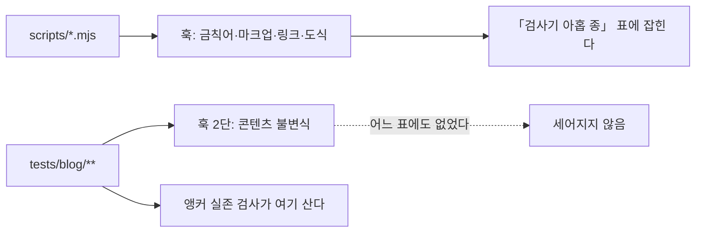

# HANDOFF

> 마지막 갱신 2026-09-05 · `pm` 배치 **시리즈 A 9/9 · 시리즈 B 8/8 완결** ·
> **이번 세션은 CI 를 PR 에도 걸었다** (PR #6·#7, 둘 다 merge·배포 성공).
> 직전까지 검사는 **merge 된 뒤에야** 돌았고, 프리뷰가 없어 `main` 이 곧 프로덕션이므로
> 걸러야 할 것이 프로덕션에서 드러나는 구조였다 — 직전 세션의 대비 1.06 결함이 그 경로였다

## 지금 상태

발행본 **184편**이다. 배치는 편8로 끝났고 그 뒤 아홉 세션이 검사기의 사각지대를 닫아 왔다.
직전 세션이 처음으로 기능을 만들었고(탐색 3종), 이번 세션은 **그 검사들이 언제 도는지**를 고쳤다 —
목록은 계속 세면서 **도는 시점**은 아무도 세지 않았던 자리다.

| 항목 | 값 |
| --- | --- |
| 발행 완료 | **A 편1~9 + B 편1~편8 (184편)** · 시리즈 B 완결 |
| 검사기 | ✅ `scripts/` **열 종** + `tests/blog/` **8파일 87케이스** · 뮤턴트 **58/58 잡힘 · 생존 0** |
| 훅 | ✅ 발행본 **9단** · 문서 **6단** · 코드만이면 즉시 통과 |
| CI | ✅ `build` **23스텝** + `deploy` 1스텝 · **`main` 푸시와 PR 양쪽에서 돈다** (PR 은 22스텝) |
| 강조 렌더 실패 | ✅ 발행본 **0회 · 184편** · 리포 문서 **0회 · 56개** |
| 깨진 링크 | ✅ 발행본 **0곳** · 리포 문서 **0곳** |
| 깨지는 도식 | ✅ 발행본 **0곳**(544개) · 리포 문서 **0곳**(113개) — **판정 도달 전량** |
| 앵커 실존 | ✅ **28개 전부 헤딩에 닿는다** — 훅과 CI 양쪽에서 돈다 |
| 검색 인덱스 | ✅ `out/blog/search-index.json` · **184편 · 헤딩 2,671개 · 311 KB** · 빌드 안에서 생성 |
| 분량 하한 SOFT | **4편** (직전 5편) — `rag` 1 · `search-engineering` 3 |
| 커밋 | `1054024`(PR #7 merge) · `3d7cb2c`(PR #6) · `2a7c365`(PR #5) |
| 푸시 · 배포 | ✅ **두 회차 모두 success** (run `33952978065` · `33954532774` 실측) |
| 다음 단계 | 아래 **「다음 세션의 작업」** — 우선순위 표를 먼저 보라 |

### 이번 세션이 한 일

| # | 무엇 | 어디에 남았나 |
| ---: | --- | --- |
| 1 | 🔴 **CI 를 PR 에서도 돌게 했다** — 직전까지 `gh pr checks` 가 `no checks reported` 였다 | PR [#6](https://github.com/withwooyong/withwooyong.github.io/pull/6) · `1f21183` · 아래 0번 |
| 2 | 낡은 수치 · 서술 **여섯 건**을 실측으로 고쳤다 | `HANDOFF.md` · `CLAUDE.md` · `README.md` |
| 3 | L4 의 완화책을 채워 분량 하한 SOFT 를 **5편 → 4편**으로 줄였다 | PR [#7](https://github.com/withwooyong/withwooyong.github.io/pull/7) · `08ead8a` |
| 4 | 직전 세션의 **미푸시 커밋**을 정리했다 — 로컬에만 있던 `4e973b9` | PR #6 |
| 5 | 열려 있던 네 항목의 **우선순위를 실측으로 정렬**했다 | 아래 우선순위 표 |

⚠️ **2번의 여섯 건 중 둘은 「작업」이 아니라 「오탐의 승격」이었다.** README 의 `:verify` 6개는
없는 것이 아니라 서술 방식이 둘이었고, 그 상태로 두 세션 동안 미해결 목록에 실려 있었다.
⇒ **검사기의 신호를 판정 없이 목록으로 옮기면 오탐이 작업이 된다.**

---

## 🎯 다음 세션의 작업

### 우선순위 — 실측으로 정렬했다

정렬 기준은 「위험이 높고 비용이 낮은 것」이다. 위 둘은 이번 세션이 닫았다.

| 순위 | 항목 | 비용 | 위험 | 사용자 결정 | 상태 |
| :---: | --- | :---: | :---: | :---: | --- |
| ~~1~~ | ~~CI 가 PR 에서 돌지 않는다~~ | 낮음 | 높음 | 불필요 | ✅ PR #6 |
| ~~2~~ | ~~문서 정정 여섯 건~~ | 매우 낮음 | 중간 | 불필요 | ✅ PR #6 |
| ~~3~~ | ~~분량 하한 SOFT — 19 B 편~~ | 낮음 | 낮음 | 약간 | ✅ PR #7 |
| **4** | 분량 하한 SOFT **나머지 4편** | 높음 | 낮음 | **필요** | 미착수 |
| **5** | 도식의 의미 검사 **657개** | 매우 높음 | 중간 | **필요** | 미착수 |
| **6** | 시리즈 A·B 밖의 **새 배치** | 매우 높음 | — | **필요** | 미착수 |
| — | `diagram-design` 후보 B | 중간 | 낮음 | 약간 | 전제 정정 완료 · 착수 가능 |

**4번을 3번에서 떼어낸 이유가 규칙이다.** 부족분이 19 B 와 5,164 B 인 편은 같은 작업이 아니다.

| 편 | 바이트 | 하한까지 |
| --- | ---: | ---: |
| `search-engineering/elasticsearch-architecture.md` | 11,435 B | 1,865 B |
| `rag/rag-knowledge-map.md` | 10,380 B | 2,920 B |
| `search-engineering/search-system-overview.md` | 9,402 B | 3,898 B |
| `search-engineering/search-engineering-in-practice.md` | 8,136 B | **5,164 B** |

마지막 편은 지금 분량의 **63%** 를 더 써야 한다. 하한 주석이 말하는 「인접 편과 병합을
검토한다」가 **이 넷에는 실제로 해당할 수 있다** — 넷 중 셋이 같은 카테고리다.

### `diagram-design` 적용 검토

사용자의 제안이다.

> [`cathrynlavery/diagram-design`](https://github.com/cathrynlavery/diagram-design) 을 적용해서
> 도표 등을 다시 생성하면 사이트가 좀 더 깔끔하게 보이지 않을까 하는데, 작업을 검토해 보자.

**착수가 아니라 검토다.** 아래는 이번 세션이 미리 확인해 둔 사실이며, 다음 세션은 이것을
출발점으로 삼되 **다시 실측하라** — 이 표의 수치도 대조군 없이는 근거가 아니다.

### 그 저장소가 무엇인가 (README 실측)

| 항목 | 내용 |
| --- | --- |
| 형태 | **Agent Skill · 플러그인.** 🔴 **이미 설치되어 있다** — `diagram-design` **v2.6.12** 가 `~/.claude/plugins/cache/` 에 있고 스킬 여섯 종(`diagram-design`·`import-mermaid`·`import-drawio`·`export-diagram`·`profile`·`doctor`)이 스킬 목록에 뜬다. `/plugin marketplace add` 를 다시 할 필요가 없다 |
| 산출물 | **자체 완결 HTML + 인라인 SVG.** PNG 는 Playwright 로 래스터화한다 |
| 도식 종류 | 39종 · `import-mermaid` · `import-drawio` 커맨드가 있다 |
| 라이선스 | MIT |
| 외부 의존 | Google Fonts 셋 (Instrument Serif · Geist · Geist Mono) |
| 표방 | README 가 `No Mermaid slop` 이라고 적었다 — **Mermaid 를 대체하려는 도구다** |

### 🔴 이 리포에 그대로 적용할 수 없는 이유 넷

| # | 무엇이 막나 | 실측 |
| ---: | --- | --- |
| 1 | **마크다운이 raw HTML 을 렌더하지 않는다** | `components/markdown.tsx` 의 플러그인은 `remarkGfm` · `rehypeSlug` **둘뿐**이고 `rehype-raw` 가 `package.json` 에 없다. 인라인 SVG 를 `.md` 에 넣으면 **화면에 문자열로 찍힌다** |
| 2 | **분량 예산이 흔들린다** | 인라인 SVG 는 바이트가 크다. 발행본은 `tests/blog/content/schema.test.ts` 가 분량 밴드를 강제하고, 배치의 역산 배율이 그 바이트 위에 서 있다 |
| 3 | **다크 모드가 사라진다** | `components/mermaid.tsx` 는 `<html class="dark">` 를 `MutationObserver` 로 구독해 테마를 **다시 그린다**. 정적 SVG 는 색이 고정된다 — 이번 세션이 대비 1.06 으로 데인 자리가 바로 색이다 |
| 4 | **검사기가 무력해진다** | `check-mermaid` 가 발행본 **544개** · 문서 **113개**를 파서로 판정한다. HTML+SVG 로 바꾸면 그 657개가 **아무도 보지 않는 자리**가 된다. 대체 검사기부터 있어야 한다 |

### ✅ 그래도 값어치가 있는 쪽 — 좁게 적용할 세 후보

| 후보 | 대상 | 왜 여기는 되나 |
| --- | ---: | --- |
| **A. 포트폴리오 홈의 손그림 SVG** | `components/system-diagram-card.tsx` (110줄) · 도식 **5개** | 이미 마크다운 밖의 React·SVG 다. 1·2번 제약을 받지 않고, 방문자가 가장 먼저 보는 화면이다 |
| **B. Mermaid 테마 신설** | `components/mermaid.tsx` 의 `themeVariables` | 콘텐츠를 **한 글자도 건드리지 않고** 544개가 전부 달라진다. 검사기도 그대로 산다. **비용 대비 효과가 가장 크다.** ⚠️ 「교체」가 아니다 — 실측으로 지금 `themeVariables` 는 `{ fontSize: "14px" }` **하나뿐**이고 테마는 mermaid 내장 `default`/`dark` 를 그대로 쓴다 (mermaid **11.16.0**) |
| **C. 대표 도식 몇 개만 승격** | 편별 헤드라인 도식 | 1번 제약 때문에 `.md` 가 아니라 **컴포넌트**로 옮겨야 한다. 구조를 먼저 설계해야 하므로 A·B 뒤 |

**권장 순서는 B → A → C 다.** B 는 되돌리기 쉽고 효과를 즉시 눈으로 잴 수 있으며, 실패해도
콘텐츠가 그대로다. C 는 마크다운 파이프라인을 바꾸는 결정을 포함하므로 **별도 설계서**가 필요하다.

### 검토할 때 먼저 답할 질문 넷

1. 스킬이 만드는 HTML 이 **다크 모드에서도 읽히는가.** 이번 세션의 실측 방법(모달 배경 대비 글자색의 WCAG 대비)을 그대로 쓸 수 있다
2. Google Fonts 를 **정적 export 에 들이는 것이 맞는가.** ⚠️ 「지금 사이트는 Inter 하나다」는 틀렸다 — 실측으로 `pages/_document.tsx` 가 **이미 Google Fonts 링크를 쓰고**(Nanum Pen Script) Inter 는 `next/font/google` 로 셀프 호스팅된다. 즉 폰트가 둘이고 적재 방식도 둘이다. 스킬이 요구하는 것은 다섯이다 — Instrument Serif · Geist · Geist Mono **+ 한글용 Noto Sans KR · Noto Serif KR**. **이 질문은 후보 B 에는 해당하지 않는다** (B 는 색 값만 빌린다)
3. 스킬의 산출물이 **재현 가능한가.** LLM 생성물이라면 도식 하나를 고칠 때마다 전체가 흔들린다. **이 질문도 후보 B 에는 해당하지 않는다** — B 는 색 값이 코드에 고정되므로 재생성이라는 개념이 없다. ⚠️ 스킬 자신이 「`assets/` 의 예제 HTML **155개는 이전 스킨**으로 만들어졌다」고 적어 두었으므로, 예제를 근거로 팔레트를 판단하지 마라
4. B(테마 교체)만으로 사용자가 말한 「깔끔함」이 충족되는가 — **A·C 를 하기 전에 B 를 배포해 보고 물어라**

---

## 🔴 다음 세션이 반드시 먼저 알아야 할 것

### 0. 🔴 **「CI 에 있다」와 「merge 전에 돈다」는 다른 말이었다**

`.github/workflows/deploy.yml` 의 트리거가 **`push: [main]` 하나뿐**이었다. 워크플로도 하나뿐이라
`gh pr checks` 가 `no checks reported` 를 냈고, **23스텝은 merge 된 뒤에야 돌았다.**

| 무엇 | 그 결과 |
| --- | --- |
| 프리뷰 환경이 없다 | `main` 이 곧 프로덕션이다 |
| 검사가 merge 뒤에 돈다 | PR 단계에서 걸러야 할 것이 **프로덕션에서 드러난다** |
| 실측 | 다크 모드 대비 1.06 결함이 그 경로로 배포됐고, 잡은 것은 검사기가 아니라 **사용자의 눈**이었다 |

세 세션이 「CI ✅ 22스텝」이라고만 적었을 뿐 **언제 도는지를 아무도 적지 않았다.** 검사의 목록은
계속 세면서 검사가 도는 시점은 세지 않은 것이다.

⇒ 지금은 `pull_request: branches: [main]` 이 함께 걸려 있고, `deploy` job 과 `Upload artifact`
스텝만 `github.event_name != 'pull_request'` 로 빠진다. `concurrency` 그룹도
`${{ github.workflow }}-${{ github.ref }}` 로 나눴다 — `"pages"` 하나로 두면 **PR 검사가 배포와
같은 큐에 끼어들기 때문이다.**

🔴 **워크플로를 하나로 유지한 이유는 검사 목록이 두 벌이 되는 것을 막기 위해서다.** `ci.yml` 을
따로 만들면 스텝을 더할 때 한쪽만 고쳐지고 다른 쪽이 낡는다 — 이 리포가 뮤턴트 수 · 훅 단수 ·
검사기 종 수에서 **세 세션 연속으로 겪은 실패가 정확히 그 유형이다.**

### 1. 🔴 **인수인계 문서에 적힌 수치는 검증된 적이 없었다**

이 리포는 「증명하기 전에는 0을 믿지 마라」를 아홉 검사기에 새겨 두었다. 그런데 그 규칙이
**문서 자신에게는 적용되지 않았다.** 아홉 검사기의 `--self-test` 를 전부 돌려 대조하니
다섯 자리가 낡아 있었다.

| 어디 | 적혀 있던 값 | 실측 |
| --- | ---: | ---: |
| `README.md` `check-forbidden:verify` | 15건 | **63** |
| `HANDOFF.md` 표 `check-forbidden` | 15건 | **63** |
| `HANDOFF.md` 표 `dup-scan` | 7건 | **12** |
| `HANDOFF.md` 표 `source-overlap` | 28건 | **42** |
| `CLAUDE.md` 검사기 개수 | 여덟 | **아홉** |

넷(`check-markup` 24 · `fix-markup` 19 · `check-links` 23 · `check-mermaid` 26)과 뮤턴트 수
50 은 일치했다. **넷이 맞았기 때문에 계수 방식이 아니라 값이 낡았다고 판정할 수 있었다** —
대조군이 없었다면 「내 계수법이 틀렸나」와 구분되지 않는다.

🔴 **직전 세션은 `check-forbidden` 하나만 낡았다고 기록했다.** 한 자리를 「자동 대조가 안 된다」는
이유로 남기면 **같은 이유로 낡은 옆자리는 아예 세어 보지 않게 된다.**

⚠️ 어긋난 셋은 전부 **검사기가 스스로 세지 않는 것**이었다.

| 검사기 | 건수를 어떻게 읽나 |
| --- | --- |
| `check-markup` · `check-links` · `check-mermaid` · `source-overlap` | `24/24` 형태로 **스스로 출력한다** |
| `check-forbidden` | 형식이 달라 `통과 63 / 실패 0` 으로 낸다 |
| 🔴 `dup-scan` · `fix-markup` | **요약 숫자를 내지 않는다.** `PASS` 줄을 세야 한다 |

```
node scripts/<검사기>.mjs --self-test 2>&1 | grep -cE '(PASS|✅)'
```

### 2. 🔴 **검사기는 `scripts/` 에만 살지 않는다 — 목록이 절반만 세고 있었다**

`HANDOFF.md` 는 **앵커 유효성**을 「남은 사각지대」 첫 줄에 두고 세 세션을 넘겨 왔다. 근거는
「`check-links` 는 앵커를 분리만 하고 판정하지 않는다」였고 **그 문장은 사실이다.** 그런데
판정은 다른 곳에서 이미 하고 있었다.

| 무엇 | 어디에 | 상태 |
| --- | --- | --- |
| 도착지 집합 | `lib/toc.ts:75` `headingIds` | 렌더러와 **같은** `github-slugger` |
| 앵커 추출 | `tests/blog/content/links.test.ts` `anchorLinks` | `%`-인코딩을 디코드한다 |
| 판정 | 같은 파일 `brokenAnchors` | 대상 편이 없는 경우는 **일부러 제외** — 한 결함이 두 번 보고되지 않게 |
| 자기검사 · 본 검사 | `describe` 「앵커 실존」 | ✅ 둘 다 통과 |
| 「0건 검사」 가드 | `expect(seen.length).toBeGreaterThan(0)` | 하나도 못 뽑으면 실패시킨다 |
| 게이트 | 훅 2단 · CI | ✅ **양쪽에서 돈다** |

원인은 훅 단계의 **이름**이다.



2단의 실체는 `npx vitest run tests/blog` 인데 이름이 「콘텐츠 불변식」이라 Vitest 를 가리키는지
드러나지 않는다. ⇒ **검사를 찾을 때 `scripts/` 만 훑지 마라.**

⚠️ `check-links.mjs` 가 앵커를 버리는 것은 결함이 아니라 역할 분담이다. 앵커 판정은 렌더러와
같은 슬러거를 불러야 하는데 그것은 TypeScript 부품이라 **구조적으로 `.mjs` 에서는 살 수 없다.**

### 3. 🔴 **브라우저용 라이브러리를 Node 에서 부르면 「보지 않은 것」이 「통과」가 된다**

직전 세션의 교훈이며 여전히 유효하다. `mermaid.parse()` 는 DOM 없이 부르면 파싱에 닿기도 전에
죽는데, 그 실패를 「위반 없음」으로 세면 **649개 중 621개**를 보지 않고 초록이 나온다.

⇒ 오류를 둘로 가르되 🔴 **환경 쪽을 열거하고 나머지를 위반으로 둔다.** 반대로 두면 라이브러리가
새 오류 형태를 도입한 날 진짜 위반이 「환경 문제」로 분류되어 사라진다. 스캔 앞에 **카나리**를 둔다.

⚠️ 전역을 세우는 일은 `import` 보다 먼저여야 한다 — `DOMPurify` 가 로드 시점에 `window` 를
잡는다. Node 24 는 `globalThis.navigator` 를 getter 로만 노출하므로 `Object.defineProperty` 로 덮는다.

### 4. 🔴 **필터를 통과한 집합으로 그 필터를 검사할 수 없다**

자기 검사 21/21 안에서 한 케이스가 아무것도 지키지 않고 있었고 뮤테이션이 잡았다. 감싸인 경로는
**있지도 않은 이름**이 되어 `existsSync` 에서 걸러지고, 남은 것은 정의상 조건을 만족한다.

⇒ 자기 검사를 쓸 때 **「이 케이스가 실패하는 세계가 실제로 있는가」를** 물어라. 대조군이 0개면
그 케이스는 영원히 통과한다. 고친 방법은 **대조할 비-ASCII 경로가 실제로 있는지 먼저 세는 것**이다.

### 5. 🔴 **가드를 `main` 안에 흩어 두면 자기 검사가 그것을 볼 수 없다**

`if (…) { process.exit(2); }` 형태로 `main` 에 있으면 통째로 지워도 케이스가 전부 통과한다.
`decideExit({canary, rejected, scanned, unreachable, violations})` 순수 함수로 뽑으니 뮤턴트가
각 가드를 하나씩 짚는다. ⇒ **「무엇을 하면 죽는가」는 순수 함수로.** 출력은 `main` 에 남겨도 된다.

### 6. ✅ **뮤턴트 하나만 격리해서 되돌려 보는 법**

`npm run mutate` 는 3~5분 걸린다. 한 자리만 확인하려면 사본을 만들어 치환하고 돌린다.

```
node -e 'const fs=require("fs");const s=fs.readFileSync("scripts/check-mermaid.mjs","utf8");
fs.writeFileSync("scripts/.tmp-x.mjs", s.replace(FROM, TO));'
node scripts/.tmp-x.mjs --self-test; rm -f scripts/.tmp-x.mjs
```

🔴 **고친 뒤에는 반드시 이것을 돌려라.** 확인할 것은 「FAIL 이 나온다」이지 「PASS 가 나온다」가 아니다.

### 7. 🔴 **규칙이 있는 것만 보는 검사는 없는 자리를 못 본다**

검색 팔레트가 다크 모드에서 **대비 1.06 : 1** 로 배포됐다. 배경 `rgb(10,10,10)` 에 글자가
`rgb(0,0,0)` 이어서 편 제목 20개와 **입력창 자신**이 보이지 않았다 — 자기가 친 글자도 안 보였다.

**자동 검사 전부와 리뷰 아홉과 뮤테이션 58개가 이것을 통과시켰다.** 잡은 것은
**사용자가 화면을 보고 한 지적**이었다 — 「화면이 너무 어두운데.」

| 단계 | 기준 | 왜 못 봤나 |
| --- | --- | --- |
| 태스크 리뷰 · 최종 리뷰 | 「모든 색 클래스에 `dark:` 짝이 있는가」 | 그 자리들은 **색 클래스가 아예 없어** 짝지을 대상이 없었다 |
| 뮤테이션 | 알려진 결함 58개 | 이 부류가 목록에 없었다 |
| 컨트롤러의 브라우저 확인 | 열림 · 이동 · 닫힘 과 같은 **동작** | 색을 재지 않았다 |

⇒ **규칙이 「있는 것을 검사」하면 「없는 것」은 구조적으로 보이지 않는다.** 포털로 그려지는 것은
`blog-shell` 의 `dark:text-slate-100` 밖에 놓여 `body` 색을 상속받는데, `body` 에 색이 없어
브라우저 기본값인 검정을 물려받았다. 지금은 `styles/globals.css` 의 `body` 가 색을 정한다.

**되돌려 실측한 값이다** (프로덕션 · 다크 모드 · 결과 44개가 뜬 상태):

| 상태 | 최저 대비 | 입력창 |
| --- | ---: | ---: |
| 옛 판 (`body` 색 없음 + `text-foreground` 없음) | **1.06** | **1.06** |
| `body` 규칙만 | **7.72** | **18.97** |
| 둘 다 (현재 배포 상태) | 7.72 | 18.97 |

⚠️ **계산된 스타일은 한 호출 늦게 온다.** 위 세 상태를 한 스크립트로 재었더니 값이
**한 칸씩 밀려** 「옛 판이 멀쩡하고 고친 판이 깨졌다」는 정반대 표가 나왔다.
`await setTimeout` 을 넣어도, 같은 실행 안에서 두 번 재도 마찬가지다.
**변경하는 호출과 재는 호출을 나눠라.**

### 7. ⚠️ 짧게 — 여전히 유효한 것들

| 무엇 | 요지 |
| --- | --- |
| **검사기는 「없는 위반」도 만든다** | 정규식 일회성 스크립트가 **31건을 전부 거짓 양성**으로 냈다. 0건일 때만 의심하는 습관은 절반이다 |
| **`npm install` 이 `engines` 를 강제하지 않는다** | `jsdom@30` 이 로컬 Node 24 에서 21/21 을 내고 CI 의 Node 20 에서 죽었다. 지금은 26.1.0 이고 자기 검사 ㉖ 이 워크플로의 `node-version` 과 대조한다 |
| **일부 누락 가드** | 「대상 없음」 가드는 하나도 못 받았을 때만 발동한다. 받은 것 중 일부를 버리면 숫자가 그럴듯하게 나온다 |
| **대상 수집은 검사기 안에서** | 호출부에서 `git ls-files` 로 뽑아 넘기지 마라. `core.quotePath` 를 끄는 자리를 한 곳으로 모았다 |
| **뮤턴트 ID 중복** | 추가 전에 `grep -ao 'id: "[A-Z]*[0-9]*"' scripts/mutate.mjs \| sed 's/id: //' \| tr -d '"' \| sort \| uniq -d` |
| **`scripts/mutate.mjs` 는 grep 이 바이너리로 본다** | NUL 이 한 개 있다. 의도된 것이므로 `grep -a` 를 붙여라 |
| **훅만 있는 검사는 지켜지지 않는다** | `--no-verify` 로 지나가고 웹 UI 편집은 훅을 안 탄다. 새 검사기는 **훅과 CI 양쪽에** |
| **검사는 전량을 본다** | 스테이징된 것만 보면 깨뜨린 쪽이 아니라 **깨진 쪽**이 통과한다. 문서 전량 스캔은 실측 약 8초 |
| **뮤테이션은 단독으로** | 러너가 파일을 심었다 되돌리는 동안이다. 다른 파일 작업과 병행하지 마라 |

---

## 검사기가 사는 두 자리

🔴 **한쪽만 세면 이미 있는 검사를 다시 만들게 된다.** 위 2번이 실제로 그 직전까지 갔다.

### ① `scripts/` 의 열 종 — 순서는 「증명한 뒤 스캔」이다

| 검사기 | 무엇을 | 자기 검사 |
| --- | --- | ---: |
| `check-forbidden` | 금칙어 (소스 · 빌드 산출물) | **63건** |
| `dup-scan` | 발행본 사이의 축자 복제 | **12건** |
| `source-overlap` | 리포 밖 **원본**과의 겹침 | **42건** |
| `compose` | 성분별 분해 (분량 예산) | — |
| `check-counts` | README·CHANGELOG 의 발행본 수 | — |
| `check-markup` | 렌더되지 않는 강조 | 24건 |
| `fix-markup` | 위 위반의 교정 | 19건 |
| `check-links` | 깨진 링크 (R1·R2·R3) | 23건 |
| `check-mermaid` | 그려지지 않는 도식 (R1) | 26건 |
| `build-search-index` | 검색 인덱스 (가드 다섯) | **16건** |

`npm run mutate` 로 뮤턴트 **58개**를 되살려 검사 **열 개**(위 검사기 열 종 중 `check-counts` 를
제외한 아홉 + `blog-unit` Vitest)의 자기 검사가 잡는지 본다. 검사기를 고쳤으면 반드시 돌린다.
약 11분 걸리므로 백그라운드로 돌리고 **다른 파일 작업과 병행하지 마라.**

### ② `tests/blog/` — 훅 2단 「콘텐츠 불변식」이 이것이다

| 파일 | 무엇을 보나 | 케이스 |
| --- | --- | ---: |
| `tests/blog/content/links.test.ts` | 링크 무결성 · 링크 고립 · 카테고리 고립 · 🔴 **앵커 실존** | 8 |
| `tests/blog/content/schema.test.ts` | 발행본 전수 스키마 · 분량 (하한 미달은 SOFT) | 4 |
| `tests/blog/content/series.test.ts` | 🔴 시리즈 정의와 발행본 전량 대조 (0건 가드 포함) | 6 |
| `tests/blog/frontmatter.test.ts` | `validateFrontmatter` 단위 | 23 |
| `tests/blog/loader.test.ts` | `readPosts` · 카테고리 · 인접 편 | 13 |
| `tests/blog/toc.test.ts` | `buildToc` 단위 | 6 |
| `tests/blog/tree.test.ts` | `buildTree` 단위 | 7 |
| `tests/blog/search.test.ts` | 🔴 조사 매칭 · 다중 토큰 AND · 점수 · 1글자 토큰 보존 · 스키마 판 대조 | 20 |
| | **합계** | **87** |

발행본 **전량**을 보는 것은 `tests/blog/content/` 의 세 파일(18케이스)이고 나머지는 단위
테스트다. 슬러거처럼 TypeScript 부품이 필요한 판정은 구조적으로 이쪽에만 살 수 있다.

**증명하기 전에는 0을 믿지 마라.** 그리고 **위반이 나왔을 때도 검사기를 의심하라.**
자기 검사가 통과해도 그 케이스가 무언가를 지킨다는 뜻은 아니다. 🆕 **문서에 적힌 수치도
대조군 없이는 근거가 아니다.**

---

## 남은 사각지대 — 다음 후보

**2026-09-04 에 네 항목을 전부 실측으로 재검증했다.** 셋이 유효하고 하나는 이미 닫혀 있었다.

| 후보 | 규모 (실측) | 비고 |
| --- | ---: | --- |
| ~~앵커 유효성~~ | ~~28개~~ | ✅ **이미 닫혀 있었다.** 위 2번을 보라 |
| **도식의 의미** | 도식 **657개** (발행본 544 · 문서 113) | 문법은 지금 검사한다. 「화살표가 끊겼는가」·「라벨이 본문과 어긋나는가」는 사람의 판단이며 `docs/superpowers/PUBLISHING-CHECKLIST.md` 에 있다 |
| 분량 하한 SOFT **4편** | `rag` 1 · `search-engineering` 3 | `ai-agent` 1편은 PR #7 이 닫았다. 남은 넷은 부족분이 1,865~5,164 B 라 성격이 다르다 — 위 우선순위 4번을 보라 |
| 시리즈 A·B 밖의 새 배치 | — | 원본이 어디에 있는지부터 정해야 한다 |

⚠️ **남은 셋은 전부 사람의 판단을 먼저 요구한다.** 기계로 닫을 수 있는 자리는 지금 없다.

---

## 다음 배치를 시작하면 다시 읽을 것

배치 작업이 끝나 지금은 쓰이지 않지만, 새 배치에서 **그대로 되풀이될** 것들이다.

- 🔴 **`compose` 는 「본문을 마지막으로 만진 뒤」 돌린다.** 복제 제거뿐 아니라 **리뷰 반영**도
  분량을 늘린다 — 편8에서 상한을 세 번 넘겼고 원인이 매번 달랐다. **표 예산이 총량보다 먼저
  터진다**(표 여유가 편6 296 → 편7 65 → 편8 **13** 으로 좁아져 왔다).
- 🔴 **인수인계에 적힌 수치도 대조군 없이는 근거가 아니다.** 편8 착수 때 원본 B 9,682 가
  틀렸다(실측 9,430). **경계는 줄 수가 아니라 「인용 줄이 끊기는 지점」으로 찾아라.**
- 🔴 **금칙어 때문에 뺀 블록은 낱말만 빼면 되는 것이 아니다.** 배정 밖 블록의 **판단**이
  본문으로 새는 일이 편6·편7·편8 **세 편 연속**이었다. 집필 전에 「이 블록에서 온 판단은
  쓰지 않는다」를 **명제 단위로** 적어라.
- 🔴 **`dup-scan` 0건은 원본 대조의 0건이 아니다.** 편8은 `dup-scan` 7건을 고친 **뒤에**
  `source-overlap` 이 편7의 4.6배를 냈다. **표를 전치할 때 칸이 증발한다.**
- 🔴 **산식의 상수 2,455 는 상수 절의 예산이 아니다.** 회귀 절편이며, 상수 절의 초과분은
  배율 안에 이미 흡수돼 있다. **산식의 항을 문서의 부위에 대응시키지 마라.**
- **초고가 어느 쪽으로 벗어나는지는 원본의 표 비중이 정한다.** 편8은 이것을 예측에 썼고
  「약 +23% 넘친다」가 실측 +22.6% 로 맞았다.

---

## 알려진 문제

- 🔴 **`compose` 통과는 배정 타당성이 아니다.** 성분 실측 **바로 다음에** 배정 원본의 금칙어를
  직접 세라. `LC_ALL=C` 필수다.
- 🔴 **표 배율을 `원본 표 B × 배율` 로 예측하지 마라.** 표는 **절대값 예산**으로 관리한다.
- SOFT 2건이 `agentic-coding/thirty-agent-catalog.md:195` 에 상시 남아 있다 — 정당하다.
- 분량 하한 SOFT 4편은 이 배치 밖의 옛 편들이다. 넷 중 셋이 `search-engineering` 이라 병합 검토가 실제 선택지다.
- 「강의」는 SOFT 금칙어다. 원본이 강의 노트라 **출처를 지칭하면 걸린다.**
- 배치 전체 `dup-scan` 20건은 전부 용어 정의 · 법률명이며 정당하다.
- ⬜ 강조 렌더 실패 **14회**가 `.superpowers/sdd/` 에 남아 있다. `*` 로 gitignore 된 도구
  부산물이라 커밋되지도 렌더되지도 않는다 — **검사 대상이 아니다.**
- ⚠️ `jsdom` 이 devDependency 로 들어와 `npm audit` 이 경고를 낸다. **검사기 전용**이며 빌드
  산출물에는 들어가지 않는다.

---

## README/문서 갱신 필요

**이번 세션은 README 를 자동 수정하지 않았다.** `/handoff` 수집기가 낸 drift 신호 셋이
**전부 이미 오탐으로 판정된 것**이었기 때문이다.

| 신호 | 수집기가 센 것 | 판정 |
| --- | ---: | --- |
| `[HIGH] NPM_SCRIPTS_MISSING_IN_README` | `:verify` 6개 | ❌ 오탐 — 12개 전부 README 에 있다. 수집기는 **표의 독립 행만** 세고 본문 병기를 보지 못한다 |
| `[HIGH] ENV_KEYS_IN_CODE_BUT_NOT_IN_README` | `OPENAI_API_KEY` 등 5개 | ❌ 오탐 — **블로그 본문 3편의 코드 예시**에서 왔다 |
| `[LOW] SCRIPTS_DIR_MISSING_IN_README` | `.mjs` 파일 8개 | ❌ 오탐 — README 는 파일명이 아니라 **npm 스크립트 이름**으로 문서화한다 |

🔴 **셋 다 세 세션 연속으로 다시 올라온다.** 수집기는 판정을 기억하지 못하므로 매번 같은
신호를 낸다. ⇒ **이 표를 지우지 마라.** 지우면 다음 세션이 오탐을 다시 작업으로 승격시킨다 —
`:verify` 6개가 실제로 두 세션 동안 그렇게 실려 있었다.

아래는 판단을 남긴 항목이다.

| 무엇 | 왜 남겼나 | 확인할 진실원 |
| --- | --- | --- |
| `:verify` 스크립트의 **서술 방식이 두 가지**다 | 🔴 「README 에 없는 6개」로 적어 왔으나 **틀렸다.** 실측으로 `package.json` 의 `:verify` 는 **12개**이고 **12개 전부 README 에 있다** — 독립 행이 7개(`dup-scan`·`check-forbidden`·`check-markup`·`check-links`·`check-mermaid`·`fix-markup`·`search-index`), 본 명령 설명 안에 병기한 것이 5개(`check-counts` 98행 · `compose` 101행 · `map-terms` 102행 · `source-overlap` 103행 · `mutate` 104행)다. `check-counts:print` 도 98행에 있다. **미해결 작업이 아니라 표기 통일 여부의 판단**이며, 「일관된 의도로 보인다」는 종전 판단 자체는 실측과 맞는다 | `README.md` 81~104행 |


### 문서가 낡던 자리 — 세 세션 연속으로 나왔다

| 세션 | 어디 | 적혀 있던 값 | 실제 |
| --- | --- | ---: | ---: |
| 2026-09-05 (CI 트리거 세션) | `HANDOFF.md` CI 스텝 수 | 22스텝 | **`build` 23 + `deploy` 1** |
| 2026-09-05 (CI 트리거 세션) | `HANDOFF.md` README 에 없는 `:verify` | 6개가 없다 | **12개가 전부 있다** |
| 2026-09-05 (이번) | `CLAUDE.md`·`README.md`·`HANDOFF.md` 리포 문서 도식 수 | 55파일 110개 | **56파일 112개** |
| 2026-09-04 (블로그 탐색 개편 Task 8) | `CLAUDE.md`·`README.md`·`HANDOFF.md` 검사기 종 수 · 뮤턴트 수 · `tests/blog` 파일·케이스 수 | 아홉 종 · 50개 · 5파일 54케이스 | **열 종 · 58개 · 8파일 87케이스** |
| 2026-09-04 (이번) | 자기 검사 건수 다섯 자리 | 15 · 15 · 7 · 28 · 여덟 | **63 · 63 · 12 · 42 · 아홉** |
| 2026-09-04 (직전) | `CLAUDE.md`·`README.md` 뮤턴트 수 | 16 · 38 | 48 |
| 2026-09-04 (직전) | `CLAUDE.md` 훅 단수 | 7단 | 9단 |

🔴 **세 번 모두 「수를 늘린 커밋이 문서를 함께 세지 않은」 경우다.** 검사기·뮤턴트·훅 단계를
추가하면 그 수가 적힌 자리를 같은 커밋에서 고쳐라.

---

## 도구 함정 — 전체 46건은 [`docs/TOOL-TRAPS.md`](docs/TOOL-TRAPS.md) 에 있다

되풀이해 겪은 것들:

- **`|` 뒤의 종료 코드는 마지막 명령의 것이다.** 종료 코드를 읽을 명령은 단독 실행.
- **스크래치패드에서는 리포의 `node_modules` 를 해석하지 못한다.** 프로브 스크립트는 리포
  루트에 두고 실행 직후 지운다.
- **`git add` 뒤 `LF will be replaced by CRLF` 경고가 뜬다.** 작업 트리 이야기이며 **커밋된
  blob 은 LF 다** — `git cat-file blob HEAD:<경로> | tr -cd '\r' | wc -c` 로 확인하라.
- **`git ls-files` 가 한글 경로를 따옴표로 감싼다.** `git -c core.quotePath=false ls-files`
  로 끄고, **넘긴 수와 스캔한 수를 대조하라.**
- **긴 문서는 heredoc 이 아니라 `Write` 로 쓴다.** 실패하면 전부 다시 써야 한다.
