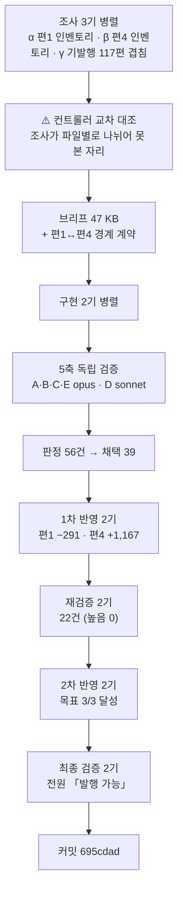

# 인수인계 (HANDOFF)

**갱신일**: 2026-08-16
**브랜치**: `main` · T3 발행 커밋 **`695cdad`**
**미푸시**: **2커밋** — T3 발행 + 이 문서 갱신 (`git log origin/main..HEAD` 실측)
⚠️ **앞 배치 커밋(`9c0b9fd`·`f388592`·`6a56f4a`·`df3b006`)은 이미 푸시돼 있다.** 직전 HANDOFF의 「미푸시 누적 3커밋」을 승계하지 마라 — **실측하라.**
**작업트리**: 깨끗 (커밋 후 `git status` 확인 완료)
**발행본**: **119편** (`ai-agent` 51 · `rag` 25 · `agentic-coding` 31 · `search-engineering` 6 · **`ai-transformation` 6**) · sitemap **181 URL**

> **`ai-transformation` T3를 발행했다.** 11편 중 **6편**이 나갔고 **5편이 남았다.**

---

## 1. 이번 세션에서 한 일

**`aiteam/01·02·07`(22,244 B)을 편1로, `05·06`(13,517 B)을 편4로 발행했다.**



| 편 | slug | 가용 | 발행 | 팽창률 | 구조 |
| :---: | --- | ---: | ---: | ---: | --- |
| **1** | `builder-to-orchestrator-shift` | 22,244 B | **38,217 B · 321줄** | **1.72** | H2 14 · H3 5 · 표 13 · **도식 4** |
| **4** | `enablement-infra-and-maturity` | 13,517 B | **36,688 B · 403줄** | **2.71** | H2 8 · H3 13 · 표 18 · **도식 4** |

**편4의 2.71은 이 프로젝트 최고 팽창률이다**(직전 최고는 T2 편9 2.50).

### 단계별 산출

| 단계 | 결과 |
| --- | --- |
| 조사 3기 | 설계서 값 **3건 반증** (첫 90일 7→8편 · MCP 4계층→5불릿 · 성숙도 자체정의 반증) |
| 구현 2기 | **브리프 오류 8건 지적** · 도식 8개 신규(노드 35 · 화살표 31) |
| 5축 검증 | 지적 **56건** (A 11 · B 23 · C 7 · E 15 · D 통과+넘김 2) · **13자리 교차 지목** |
| 1차 반영 | 채택 39건 · **판정표 오류 7건** · 편1 −291 B · 편4 +1,167 B · 합계 검산 일치 |
| 재검증 2기 | **22건** (1기 12 · 2기 10) · **높음 0** |
| 2차 반영 | **목표 3/3** — 편1 −2 B · 편4 −375 B · **새 문장 0자리** · 구조 불변 |
| 최종 검증 2기 | **전원 「발행 가능」 · 차단 0건** |

---

## 2. ⚠️⚠️ 이번 세션 최상위 — **「배정은 맞고 술어가 틀렸다」**

**재검증 1기의 한 문장이 이 배치 전체를 설명한다:**

> **「개수 주장 21건은 전부 맞았고, 틀린 것은 언제나 그 옆에 붙은 술어였다.」**

| 맞은 것 | 틀린 것 |
| --- | --- |
| 「어휘 **스물셋**」 | 「이 글이 **쓰는**」 (HITL 본문 0회) |
| 「**다섯** 원칙」 | 「**수치로** 받친다」 (5행에 숫자 0) |
| 「다섯 중 **넷**이 Slack」 | 뒤에 이어 붙인 한 문장 |
| 「**다섯** 기관」 | 「~의 **출처**는 편1이 다룬다」 (GitClear는 편1에도 없다) |

### ⚠️ 금지선 17의 근거가 드러났다 — **배정은 검산 가능하고 술어는 검산 가능하지 않다**

「스물셋」은 세면 끝나지만 「이 글이 쓰는」은 **스물셋 각각을 본문에서 찾아야** 하고, 그 검사는 아무도 하지 않는다.

**결함이 「표 아래 총평 한 줄」에 두 번 몰렸다 — 5축 8건 · 재검증 7건.**

> **처방도 이 원리를 따른다.** 2차 반영자가 판정표의 「GitClear를 빼라」를 거부했다 —
> **기관 다섯은 맞으므로 배정을 건드리면 안 되고, 틀린 것은 술어 「출처」 하나뿐이라 그것만 걷었다.**
> **판정표를 쓴 컨트롤러가 같은 함정에 빠져 배정을 고치라고 지시한 것이다.**

---

## 3. ⚠️ 컨트롤러가 **검증 없는 전칭**을 두 번 썼다

**두 번 다 지시받은 쪽이 반증했다.**

| # | 어디에 | 무엇을 썼나 | 실제 | 누가 잡았나 |
| ---: | --- | --- | --- | --- |
| 1 | 브리프 §11 | 「발행본 15편 **전부** 에이전트 소프트웨어 층위」 | ⚠️ **거짓** — `ai-agent/enterprise-ai-adoption-actions:147·290`이 Orchestrator를 **프로덕트 오너**에 매핑 | **편1 구현자** — 지시 문안을 쓰지 않고 두 편을 직접 읽었다 |
| 2 | 판정표 §1-3 | 「**둘 다** 상대 제목의 실제 조각이므로 어느 쪽도 거짓이 아니다」 | ⚠️ **편1→편4 방향에서 거짓** — 「팀 인프라와 성숙도」는 요약 호칭 | **1차 반영자** + 재검증 2기가 독립 재확인 |

> ### ⚠️ **금지선 16은 브리프·판정표를 쓰는 사람이 가장 자주 어긴다**
> 구현자 규칙으로 쓰였지만, **브리프는 빨리 써야 하고 확인은 느리다.**
> 조사 보고가 전칭으로 오면 **컨트롤러가 반례를 찾아야 한다** — 액면가로 옮기면 그것이 지시가 된다.

---

## 4. 다음 세션이 이어받을 것

### ▶ **T4 착수** — 설계서 §9

| 배치 | 편 | 원본 | 상태 |
| :---: | --- | --- | :---: |
| ~~T1~~ | ~~편6·7·8~~ | ~~`aiagent/06`~~ | ✅ `9c0b9fd` |
| ~~T2~~ | ~~편9~~ | ~~`aiagent/08 §4~§8·§10`~~ | ✅ `6a56f4a` |
| ~~T3~~ | ~~편1·편4~~ | ~~`aiteam/01·02·07` · `05·06`~~ | ✅ **`695cdad`** |
| **T4** | **편2 `sdlc-human-gates` · 편3 `discovery-to-growth-tooling`** | `03` + `04`(개발·QA검증·배포_운영) · `04`(기획_요구사항·디자인·퍼포먼스마케팅·경쟁사분석) | **▶ 다음** |
| T5 | 편5 | `09`·`09a`·`09b` | 대기 |
| T6 | 편10 Q&A | `aiteam/08 §3` 9문항 | 전 편 발행 후 |
| T7 | 편11 지도편 | 재작성 | 카테고리를 닫는다 |

### T4 원본 실측 — **분할표 값을 믿지 말고 재실측하라**

| 편 | 파일 | raw B |
| :---: | --- | ---: |
| **2** | `03_워크플로우_단계별_파이프라인.md` | 7,260 |
| 2 | `04_영역별_AI활용/개발.md` | 8,637 |
| 2 | `04_영역별_AI활용/QA검증.md` | 3,235 |
| 2 | `04_영역별_AI활용/배포_운영.md` | 2,780 |
| | **소계** | **21,912** (분할표 20,500) |
| **3** | `04_영역별_AI활용/기획_요구사항.md` | 2,930 |
| 3 | `04_영역별_AI활용/디자인.md` | 2,752 |
| 3 | `04_영역별_AI활용/퍼포먼스마케팅.md` | 6,364 |
| 3 | `04_영역별_AI활용/경쟁사분석.md` | 4,982 |
| | **소계** | **17,028** (분할표 16,078) |

**차이는 「입사 후 실천」 제거분이다. 절 단위로 `awk` 재실측하라.**

### ⚠️⚠️ T4가 T3와 다른 점

| | T3 (`01·02·07` · `05·06`) | **T4 (`03` · `04_영역별` 7파일)** |
| --- | --- | --- |
| **파일 수** | 5개 | ⚠️ **8개** — 편2가 4파일, 편3이 4파일 |
| **「입사 후 실천」 절** | 해당 없음 | ⚠️ **7파일 중 5개에만 있다**(금지선 22). **퍼포먼스마케팅·경쟁사분석에는 없다** |
| **파일 크기** | 5.2~13.9 KB | ⚠️ **2.7~8.6 KB — 더 작다.** 묶기 밀도가 T3보다 높다 |
| **중복 위험** | 두 편 사이 | ⚠️ **여덟 파일 사이 + 두 편 사이.** `03`이 SDLC 6단계를 총론으로 적고 `04` 각 파일이 각론을 적는다 — **T3의 `02 §1`↔`07 §2` 관계가 여덟 배로 늘어난다** |
| **동음이의** | — | ⚠️ **`사람 게이트` 8건이 발행본에 있으나 전부 「에이전트 루프 종료조건」이다.** 원본은 **SDLC 6단계 승인 지점** — 같은 말이 다른 것을 가리킨다(설계서 §5-3) |

### T4 브리프에 반드시 넣을 것

| # | 항목 | 근거 |
| ---: | --- | --- |
| 1 | **금지선 1~28 전문** | 설계서 §11 + `agentic-coding` 설계서 L1998~L2021 |
| 2 | ⚠️ **가용 바이트를 `awk`로 재실측하라** | T2·T3 모두 분할표와 어긋났다 |
| 3 | ⚠️ **팽창률 실측 1.63~2.71.** **묶는 편은 높다** | T3 편4 2.71이 최고 |
| 4 | ⚠️⚠️ **금지선 22 — 「입사 후 실천」은 5파일에만 있다. 7파일을 같은 규칙으로 처리하지 마라** | 조사 B 실측 |
| 5 | **1인칭 정제식 + 트랩 7종** | §6-1 |
| 6 | **「스캔 0건은 목표가 아니라 관찰값이다」** | T1 최상위 사고 |
| 7 | ⚠️ **「원본에도 발행본에도 없으면」으로 지시하라** | T1 최상위 결함 |
| 8 | ⚠️ **「처방도 검증 대상이다」** | T2 3연 실증 · T3에서 반영자 4건 거부 |
| 9 | ⚠️⚠️ **「배정은 맞고 술어가 틀렸다 — 표 아래 총평 한 줄을 붙이지 마라」** | **§2. 이번 배치 최상위** |
| 10 | ⚠️ **부분 일치 grep으로 사적 맥락을 찾아라** (`본 [가-힣]`·`우리 [가-힣]`) | **§5-2. `본 협상`이 패턴을 빠져나갔다** |
| 11 | **`dup-scan`은 단일 파일 모드로** | T2 §5-2 · **T3에서 형제 편 검출 실증** |
| 12 | **`Bash` heredoc으로 산출물을 써라. ⚠️ ~10KB에서 잘리니 5~6 KB 분할 append** | `reviewer`·`scout`에 `Write` 없음 · **T3 신규 실측** |
| 13 | ⚠️ **편2↔편3 경계 계약을 컨트롤러가 만들어라** | **§5-1. 조사자는 자기 파일만 본다** |
| 14 | **0편 태그 30종 목록 첨부** | B9·T1·T2·T3 모두 사용 0건이나 계속 첨부 |
| 15 | ⚠️ **새 도식의 노드·화살표에 본문 근거 줄** (금지선 28) | **T3에서 화살표 3건이 무근거로 잡혔다** |

### 확정된 결정 (다시 묻지 마라)

| 사안 | 결정 |
| --- | --- |
| **분량** | **상한 없다. 하한 13.3 KB만** (금지선 11·13) |
| **팽창률** | ⚠️ **실측 1.63~2.71.** 쪼개는 편은 낮고 **묶는 편은 높다** |
| **시리즈 페이지** | 없다. `series`는 frontmatter 메타데이터일 뿐 |
| **frontmatter** | **11개 전부 필수가 아니다.** `series`·`seriesOrder`·`updated`·`source`는 선택. **빈 문자열은 빌드를 죽인다 — 키를 생략하라** |
| ⚠️ **`source` 값** | **`aiteam/` 원본에는 `source` 키를 쓰지 마라.** 강의가 아니라 저자 자신의 문서다 — `"AI 에이전트 실무 과정"`을 붙이면 **거짓 귀속**이다. **`aiagent/` 원본(T1·T2)에만 쓴다** |
| ⚠️ **`series` 키** | **쓰지 마라.** 기발행 `department-agent-blueprint.md` L16~17이 「일곱 개 부서 서른 개 에이전트 한 벌을 **세 편**에 걸쳐」라고 선언했다. 넣으면 **발행된 문장이 거짓**이 된다 |
| **태그 패싯** | 3~5개, **같은 패싯 최대 2개.** **패싯 C는 17종 · D도 상한 2** |
| ⚠️ **「첫 90일에 할 일」** | **편 제목·H2로 쓰지 마라**(발행본 **8편** 서식). **표 안의 기간 값은 원본 데이터이므로 살려라** |

### 진행 방식 — 12배치로 검증된 절차

```
1단계  분할 설계 → 승인                         ✅ 완료
2단계  배치로 나눠 변환, 배치마다 커밋·보고       ◀ T4가 여기
3단계  구현 미참여 에이전트가 5축 독립 검증
4단계  판정 → 1차 반영 → 스냅샷 → 재검증 2기 → 2차 반영 → 최종 검증 2기 → 커밋
```

| 축 | 무엇을 보는가 | 티어 |
| :---: | --- | :---: |
| A | 쓰여 있는데 **틀린** 것 | opus |
| B | 쓰여 있는데 **근거가 없는** 것 — ⚠️ **+ 「제거한 자리를 메우려 새 주장을 만들지 않았나」** | opus |
| C | **없는** 것 — ⚠️ **발행본을 열기 전에 원본 인벤토리를 먼저 만든다** | opus |
| D | **실행**하면 나오는 것 | sonnet |
| E | **기발행본과의 중복** + ⚠️ **편끼리의 상호 모순** | opus |

> ### ✅ 재검증 2기의 축 분할 — T1에서 확립, T3까지 재확인
> | 기 | 담당 |
> | :---: | --- |
> | 1 | **지금 글에 있는 근거 없는 주장** — 총평 · 전칭 · 개수 명시 · 부정 주장 · 귀속 · **표의 열 이름** |
> | 2 | **값과 그것을 가리키는 것 사이의 어긋남** — 지시어·역참조 · 개수↔실제 · **링크 문구** · 도식↔본문 · **넘김 계약↔도착지** |
>
> **T3 실적**: 1기 12건 · 2기 10건 · **높음 0**. 네 자리 이상 교차 지목.

> ### ✅ 최종 검증은 **이진 판정**을 요구하라
> **`발행 가능` 또는 `발행 불가 — <이유>`만 요구하고, 「억지로 찾아내지 마라, 여덟 명이 이미 봤다」를 명시한다.**
> ⚠️ **「수정이 잦았던 자리」를 표로 지목하라** — T3는 편1 8자리 · 편4 7자리를 적었고 검증자가 전건을 열어 확인했다.
> **특히 「고쳤다가 되돌린 자리」의 되돌림이 완전한지**를 따로 물어라.

> ### ⚠️ 검증자에게 브리프도 판정표도 반영 보고서도 주지 마라 — B5에서 확립, T3까지 재확인
> **대가는 오탐 2건 내외다. 설계된 대가다.**
> **축 C에는 「발행본을 먼저 읽지 마라」를 명시하라** — 발행본을 먼저 보면 **있는 것만 눈에 들어온다.**

---

## 5. ⚠️ T3에서 새로 실측된 함정

### 5-1. ⚠️⚠️ **조사를 파일별로 나누면 경계를 넘는 사실은 아무도 담당하지 않는다**

**이 배치 최대의 위험을 컨트롤러만 볼 수 있었다.**

| 자리 | 축자 | 무엇이 문제였나 |
| --- | --- | --- |
| `06 L19` | `우리 프레임과 연결: 0=L1 개인기 가시화, 1=**L2 팀 시스템**(여기가 핵심 과제), N=L3 조직 역량` | **「핵심 과제」는 편1이 삭제할 `01 §2` 「나의 현재 위치」 열에서 온 판정**이다. 편4가 그대로 쓰면 **편1 발행본에 없는 것을 가리킨다** |
| `07 §4` L77 ↔ `06 §1` | 성숙도 표가 **두 파일에 있고 출처는 `07`에만** | 조사 β가 `06`만 보고 **「자체 정의, 외부 인용 0건」**이라 판정했다 — **`06` 안에서는 참이다** |
| `02 L70` ↔ `06 L49` | 「중단 기준」이 **띄어쓰기 하나 빼고 축자 동일**, 출처(waydev)는 `02`에만 | 두 구현자가 각각 자기 원본대로 실었다 — **지시 위반이 아니다** |

> **격리는 맹점을 깨지만 격리 자체가 새 맹점을 만든다.**
> **컨트롤러가 원본을 직접 대조해 경계 계약을 만들어야 한다.** T3는 브리프 §7에 소유권 13항목을 표로 못박았고,
> 5축·재검증이 전건 준수를 확인했다.

### 5-2. ⚠️ 실명·구직 맥락은 **grep 패턴이 잡지 못하는 형태로도 있다**

조사 α의 패턴(`나의 |내가 |저는 |제가 |본인|입사|이직|데려갈|본 팀|현 팀|우리 팀|나는 `)이 **`02 L41`을 놓쳤다:**

> `> 워크스페이스 연계: **본 협상/계약 워크스페이스**의 민감정보 격리 원칙(README 자격증명·**개인계약서 비공개**)과 동일 철학`

**`본 팀`은 패턴에 있으나 `본 협상`은 없다.** 구현자가 발견해 삭제했다.

| 대응 | |
| --- | --- |
| 1 | **부분 일치를 함께 돌려라** — `본 [가-힣]` · `우리 [가-힣]` · `현 [가-힣]` |
| 2 | **`> 🖊️ TODO(허우용):` 블록을 별도로 세라** — T3 범위에 2건, **전체 원본에 9건**. 실명·회사명·면접 맥락이 **한 덩어리**로 들어 있다 |

### 5-3. 1인칭 오탐 트랩 — **7종**이 됐다

| 나이브 패턴 | 오탐 원인 | 발견 |
| --- | --- | :---: |
| `나의 ` | `하나의 ` | T1 |
| `제가 ` | `주제가 ` · `전제가 ` | T1 |
| `지원자` | `지원자 스크리너` | T1 |
| `제가 ` | `공제가 ` | T2 |
| **`제가 `** | ⚠️ **`과제가 `** — 「리더의 **과제가** 된다」 | **T3** |
| **`제가 `** | ⚠️ **`문제가 `** — 「도구 선택 **문제가** 아니라」 | **T3** |

```bash
grep -nE "(^|[^하])나의 |(^|[^주전공과문])제가 |저는 |내가 |입사|본인은|데려갈|우리 팀|본 팀|현 팀" "$F"
```

> ⚠️ **`재채용`은 절대 지우지 마라** — Klarna 2025-05 재채용 선언의 축자이고 **U턴 반례가 이 카테고리의 차별점**이다.
> ⚠️⚠️ **배제 문자류가 `[^주전공과문]`까지 왔다. 다음 트랩은 정규식에 더하지 말고 「알려진 오탐」 목록으로 처리하라.**

### 5-4. ⚠️ 「약속한 것과 실제 배치의 어긋남」은 **스캔이 원리상 못 잡는다**

**편1이 「이 글이 다루지 않는다」고 선언한 것 중 3건이 거짓이었다:**

| 넘긴다고 한 것 | 실제 |
| --- | --- |
| **중단 기준** (2회 선언) | 같은 글에 **전용 절**이 있고 「요점」·「핵심」이라 부른다 |
| **ADR** (2회) | **편4에 0건.** ⚠️ **원본 `01 L38`도 `05`를 가리키는데 `05`에도 0건 — 끊긴 참조를 승계했다** |
| **KPI 측정** | 자기 글에 **19회, 전용 절** |

> ### ✅ 통일 처방 — **부정 전칭을 위치 진술로 바꾼다**
> **「A는 이 글이 다루지 않는다」 → 「A는 [편4]에 있다」**
> 「다루지 않는다」는 반례 하나로 무너지지만 「어디에 있다」는 확인 가능하다. **삭제로 처리되므로 새 명제도 생기지 않는다.**

**그리고 편1이 편4를 「다음 편」이라 부른 것이 사이트 내비게이션과 어긋났다** — `series` 키가 없으면 [`lib/blog/loader.ts:186`](lib/blog/loader.ts)이 카테고리 이웃으로 떨어지고, `ai-transformation` 6편의 `date`가 전부 같아 **제목 가나다순**이 된다. **축 E가 정렬 비교자를 재실행해 찾았다 — 마크다운만 읽어서는 나오지 않는다.**

### 5-5. 도식 검산 — **개체는 본문에서 오지만 관계는 그리는 사람이 만든다**

| | 개수 | 근거 있음 |
| --- | ---: | ---: |
| 노드 | 39 | **36** |
| 화살표 | 31 | **28** |

**무근거 3건이 전부 화살표였다.** 대표 사례: 본문이 「승인·책임·방향 결정」을 **한 묶음으로 사람에게** 주는데 도식이 **사람을 둘로 쪼개고 사이에 화살표를 놓았다.**

> ✅ **그리고 그 수정이 다른 결함을 함께 해소했다** — 근거 없는 화살표를 없애자 본문의 「이 **한** 화살표」가 **비로소 참이 됐다.**
> **증상은 둘이었지만 원인은 하나였다.**

### 5-6. ⚠️ `dup-scan` 단일 파일 모드가 **형제 편 검출에 실제로 작동한다**

**편1 `:198`·`:220`과 편4 `:350`·`:365`를 서로 대조군에 넣어 검출했다**(머리글 「대조 118편」 확인).
**`--category`였다면 [`scripts/dup-scan.mjs:207`](scripts/dup-scan.mjs)의 `basename` 필터 때문에 원리상 0건이다.**

> **이월 7번의 우회책이 실증됐다. 스크립트를 고치지 않아도 된다.**
> **단 20자 임계값 한계(이월 8번)는 그대로다 — 한국어 표 셀 손 대조가 여전히 필요하다.**

### 5-7. ⚠️⚠️ **baseline용 `git add` 후 커밋하면 baseline이 커밋된다**

**구현 직후 `git add`로 diff baseline을 잡은 뒤 1·2차 반영을 마치고 `git commit`했더니 staged 상태(최초 구현본)가 커밋됐다.**
**아홉 명이 검증한 것과 다른 파일이 나갈 뻔했다.**

| | |
| --- | --- |
| **어떻게 잡았나** | **커밋 직후 `git status`가 깨끗하지 않았다.** 이 한 줄이 전부다 |
| **확증** | 커밋본에서 1차에 제거한 문자열(「다음 편」)이 **5건 검출** |
| **복구** | 푸시 전이라 `git add` + `--amend`. 재검증으로 **724 insertions · 「다음 편」 0건 · 새 호칭 8건** 확인 |
| **절차 반영** | **커밋 전 재 `add`, 커밋 후 `status` 확인** |

> **검증 파이프라인이 아무리 촘촘해도 마지막 git 조작 하나가 전부를 무효화한다. 그리고 `git commit`은 성공을 보고한다.**

---

## 6. 미해결 과제

### 6-1. T3 이월 — 발행은 됐으나 손보지 않은 것

| # | 자리 | 요지 |
| ---: | --- | --- |
| T3-a | 편1 `:281` | **72%가 마무리에서 회수되지 않는다.** `:18`·절 제목은 {95, 72, 20}인데 마무리는 {88, 20, 95}. **회수하려면 새 문장이 필요해 2차 목표와 충돌** |
| T3-b | 편1 `:16`·`:317`~`:319` | **링크 호칭 3종이 대상 제목과 겹치지 않는다**(요약어). **편4는 같은 자리에서 실제 제목 앞머리를 쓴다** — 규약이 두 편에서 갈린다 |
| T3-c | `01 L24` ↔ `05 L4` | **3단 모델 L2 배정이 원본 두 파일에서 어긋난다.** 발행본은 각각 자기 원본 축자와 정확히 일치한다 — **발행본을 고쳐서는 해소되지 않는다** |
| T3-d | 편4 `:336` | 「이름 그대로」가 `:341`과 강도가 어긋난다. **판정표 밖이라 반영자가 남기고 보고했다** |
| T3-e | 편4 `:14` | R-13 반영으로 성숙도 예고가 빠졌다. **되살리면 `:16` 「그 둘」이 깨진다** |

### 6-2. T2 이월 (4건)

| # | 자리 | 요지 |
| ---: | --- | --- |
| T2-a | 편9 `:380`~`:392` | **C갈래 이름**이 그 갈래 셀 전부를 서술하지 못한다. 고치려다 오탐이 1→12건으로 늘어 되돌렸다 |
| T2-b | 편9 `:38` | 표 행의 `—` 표기 |
| T2-c | 편9 용어표 | **본문에 쓰이나 표에 없는 약어 5종** — `KPI`(4) · `JD`(4) · `VIP`(3) · `P0`(3) · `CTA`(2) |
| T2-d | 편9 `:57` | **SLA 범위가 시리즈 차원에서 갈린다** — 편7 `:237`에는 「해결 목표」 열이 실재 |

### 6-3. T1 이월 (11건 — 전부 「낮음」, 사실 오류 아님)

| # | 편 | 요지 |
| ---: | ---: | --- |
| T1-a~k | 6·7·8 | 지수 백오프 배정 · 도식 라벨 · description 개수 · 용어 표기 4종 · 링크 문구 · 무귀속 판정 6건 · 절 제목 전칭 |

### 6-4. 기존 이월

| # | 항목 | 상태 |
| ---: | --- | --- |
| 1 | mermaid 노드 라벨 우측 1~9px 클리핑 | `foreignObject` 폭 문제. 전역 |
| 2 | FR-1.4 스크롤스파이 미구현 | 기존 위키에도 없음 |
| 3 | 메인 페이지 LCP 6.6초 | Lighthouse 77점 |
| 4 | 싱글톤 태그 재측정 | 2차 전체를 마친 뒤 |
| 5 | `cto_learning_roadmap` Q1·Q3 | 발행 가능 판정을 받았으나 미변환 |
| 6 | 어휘 81종 중 0편 태그 30종 | **B9·T1·T2·T3 모두 사용 0건 — T4도 첨부하라** |
| 7 | **훅 차단 채널이 세 자료에서 갈린다** | **T5가 `09`를 맡으므로 그때 정면으로 만난다** |
| 8·9 | 원본 `04 §8-2` 「3대 구성 요소」인데 표 4행 · `05` L56↔L145 수치 불일치 | ⚠️ **8번은 T4 범위다** |
| 10 | `05 §3-2` 제품 결함 3건의 현재 유효성 | 미확인 |
| 11 | 무귀속 판정 잔존 2건 | 편14 L232 · 편13 L235 |
| 12 | B1 편2~5의 `2026-04` 표기 | 「강의 시점」인지 「문서 기준일」인지 미구분 |
| 13·14 | 편7 `feedback` 예시 소재 겹침(의도적) · 편8 용어표 「멀티턴 대화」 본문 0회 | — |
| 15 | 기발행본 축약 용어표의 0회 행 미점검 | **사용자 결정 — 기발행본 수정은 새 검증 표면** |
| 19~22 | 원본 모순 병기 · Supabase 탈브랜딩 미대조 · 앞 배치 표 수치 재확인 미실시 · `industry-claude-md-templates.md:131` | — |
| 24 | 20자 임계값 | ⚠️ **「반증」 상태 유지** — 한국어 표 셀 손 대조 필요 |
| 26~29 | `10 §5` 수치 출처 표기 · `search-engineering` inbound 0 · 주제 10 깊이 판단 · 지도편 mermaid 노드 | — |
| 30 | `reviewer`·`scout`에 `Write` 없음 | **브리프에 heredoc 명시. ⚠️ T3 신규: ~10KB에서 잘리니 5~6 KB 분할 append** |
| 31~33 | `09a` Skills 층위(T5) · `05 §3` MCP 4계층 → ✅ **T3에서 해소** · `07` 기업 사례 시점 → ✅ **T3에서 처리** |
| 35 | `dup-scan --category` 한계 | ✅ **우회책 실증(§5-6). 스크립트 수정 불필요** |
| **36** | ⚠️ **mermaid 렌더는 CI로 검증 불가** | **신규(T3).** Node 직접 `parse()`가 `DOMPurify.addHook is not a function`(DOM 부재). **대안은 「사용 문법이 기발행본에 실재하는가」 대조**이고, 렌더 실패는 노란 박스로 노출될 뿐 페이지를 깨뜨리지 않는다([`components/mermaid.tsx:131`](components/mermaid.tsx)) |

---

## 7. 검증 명령

```powershell
cd C:\Users\aeby\vscode\withwooyong.github.io

npm test              # 36개 통과
npx tsc --noEmit      # 0
npm run build         # 0, [sitemap] 181개 URL

npm run dup-scan:verify                              # 본 스캔 전에 반드시
npm run dup-scan -- content/blog/<카테고리>/<slug>.md  # ⚠️ 단일 파일 모드를 써라
```

> **2026-08-16 실측**: `npm test` **36/36** · `npx tsc --noEmit` **exit 0** · `npm run build` **성공, 190페이지, 181 URL** ·
> `dup-scan` 자체검사 **4/4 PASS**, 편1 8건·편4 5건 **전건 정당**(용어정의·자매편 상호인용).

### `ai-transformation` 발행 시 검사

```bash
F="content/blog/ai-transformation/<slug>.md"

# 금칙어 — 기대 0건
grep -nE "면접|커닝페이퍼|암기용|화이트보드|이력서|강의|수강|Part [0-9]|CH0[0-9]|예상 질문" "$F"

# 민감정보 — 기대 0건
grep -nE "히츠|야나두|TVING|티빙|BTV|허우용|teddylee|teddynote|argus|FASTCAMPUS|실장|커머스개발" "$F"

# ⚠️ 1인칭 — 정제식(트랩 7종 배제)
grep -nE "(^|[^하])나의 |(^|[^주전공과문])제가 |저는 |내가 |입사|본인은|데려갈|우리 팀|본 팀|현 팀" "$F"

# ⚠️ TODO 잔재 — 원본에 9건 있다
grep -nE "TODO|🖊️" "$F"

# 내부 링크 실재
grep -ho '/blog/[a-z-]*/[a-z0-9-]*/' "$F" | sort -u | while read l; do
  cat=$(echo "$l" | cut -d/ -f3); slug=$(echo "$l" | cut -d/ -f4)
  [ -n "$slug" ] && [ ! -f "content/blog/$cat/$slug.md" ] && echo "MISSING: $l"
done
```

> **알려진 오탐 — 고치지 마라**: **`재채용`**(Klarna 축자) · `채용` · `지원자 스크리너` ·
> **`과제가 `** · **`문제가 `** · `공제가 ` · `하나의 ` · `주제가 ` · `전제가 `
>
> **판정 기준**: 문장의 주어가 **저자의 구직 활동**이면 금칙, **업무·사례의 성질**이면 통과.

### 발행본 실측

```bash
LC_ALL=C awk '
  /^```/ { fence=!fence; fc++; next }
  !fence && /^## / { h2++ }
  !fence && /^### / { h3++ }
  !fence && /^[ ]*>?[ ]*\|[ ]*[-:][- :|]*\|[ ]*$/ { tb++ }
  END { printf "H2 %d · H3 %d · 표 %d · 펜스 %d\n", h2, h3, tb, fc }' "$F"
```

**⚠️ `^\|`만 보면 인용블록 안의 표를 놓친다. 코드펜스 총 개수가 짝수인지도 세라.**

### ⚠️ 커밋 절차 — T3 사고 재발 방지

```bash
git add <파일>          # baseline (구현 직후)
# ... 1차·2차 반영 ...
git add <파일>          # ⚠️ 커밋 전 재 add — 이것을 빠뜨리면 baseline이 커밋된다
git commit -F- <<'EOF'
...
EOF
git status --short      # ⚠️ 비어야 정상. 비지 않으면 구본이 커밋된 것이다
```

---

## 8. 소스 위치

| | 경로 |
| --- | --- |
| 원본 (읽기 전용, **수정 금지**) | `C:\Users\aeby\vscode\yanadoo-exit\shared\knowledge\` |
| 발행본 | [`content/blog/<카테고리>/<slug>.md`](content/blog/) — **119편** |
| 카테고리 정의 | [`content/blog/categories.ts`](content/blog/categories.ts) — 12개 등록, **5개 발행** |
| 태그 통제 어휘 | [`content/blog/tags.ts`](content/blog/tags.ts) — 81종. **패싯 A 15 · B 21 · C 17 · D 18 · E 9 · F 1** |
| frontmatter 검증 | [`lib/blog/frontmatter.ts`](lib/blog/) — L77 `series` 선택 필드 |
| **시리즈 내비게이션** | ⚠️ [`lib/blog/loader.ts:186`](lib/blog/loader.ts) — **`series` 없으면 카테고리 이웃 · date 동률이면 제목 가나다순** |
| 축자 복제 스캔 | [`scripts/dup-scan.mjs`](scripts/dup-scan.mjs) — ⚠️ **`--category` 한계, 단일 파일 모드를 써라** |
| 요구사항 | [`docs/superpowers/specs/2026-08-07-tech-blog-requirements.md`](docs/superpowers/specs/2026-08-07-tech-blog-requirements.md) |
| ▶ **`ai-transformation` 설계서** | [`docs/superpowers/plans/2026-08-14-ai-transformation-category-split-design.md`](docs/superpowers/plans/2026-08-14-ai-transformation-category-split-design.md) — **T4는 §5-3·§6-2·§9·§11을 먼저 읽어라** |
| `agentic-coding` 설계서 | [`docs/superpowers/plans/2026-08-08-agentic-coding-category-split-design.md`](docs/superpowers/plans/2026-08-08-agentic-coding-category-split-design.md) — **금지선 1~20은 L1998~L2021** |

### 조사 산출물 — `/clear` 후에도 이 경로로 읽어라

```
C:\Users\aeby\AppData\Local\Temp\claude\c--Users-aeby-vscode-withwooyong-github-io\
  898dce7e-a7a1-49f2-b313-330be3d2a99d\scratchpad\
    survey\      COMMON-BRIEF.md · survey-{A..G}.md
    inventory\   sections.tsv · forbidden.txt · filesizes.tsv
```

| 축 | 파일 | 크기 | T4에 필요한가 |
| :---: | --- | ---: | --- |
| **B** | `survey-B.md` | 23.2 KB | ▶ **`04_영역별` 7파일 담당. T4가 반드시 읽어라** |
| **A** | `survey-A.md` | 25.2 KB | ▶ **`aiteam/03` 담당 (편2)** |
| **G** | `survey-G.md` | 71.0 KB | ▶ 교차 중복·태그 패싯. ⚠️ **요약행이 아니라 본문을 읽어라** |
| C·D | — | — | T3·T5에서 소진 |
| E·F | — | — | T1·T2에서 소진 |

### T3 산출물 (이번 세션)

```
C:\Users\aeby\AppData\Local\Temp\claude\c--Users-aeby-vscode-withwooyong-github-io\
  17f64d1b-575f-44be-b7f3-244e45dbf2e3\scratchpad\
    T3-BRIEF.md                  47 KB  ▶ T4 브리프의 골격으로 재사용하라 (§7 경계 계약이 핵심)
    T3-VERIFY-BRIEF.md                  5축 검증 공통 브리프
    T3-REVERIFY-BRIEF.md                재검증 공통 브리프
    T3-FINAL-BRIEF.md                   최종 검증 — ⚠️ 「수정이 잦았던 자리」 표가 값이다
    T3-JUDGMENT.md / -2ND.md            1·2차 판정표
    T3-survey-{alpha,findings,gamma}.md 조사 3기
    T3-report-{1,4}.md                  변환 보고서
    T3-verify-{A,B,C,D,E}.md            5축 검증 보고서
    T3-verify-C-inventory.md            ⚠️ 발행본 열기 전 작성된 원본 인벤토리
    T3-recheck-{1,2}.md                 재검증 보고서
    T3-fix-{1,4}.md / T3-fix2-{1,4}.md  1·2차 반영 보고서
    T3-final-{exec,review}.md           최종 검증 보고서
    CONTROLLER-ONLY-편{1,4}-1차반영전-스냅샷.md
```

---

## 9. README/문서 갱신 필요

### ✅ 이번 세션에서 갱신한 것

| 파일 | 무엇을 |
| --- | --- |
| 설계서 §1 | 팽창률 1.63~**2.71** · **T1~T3 진행 표기** · 발행 119편/181 URL |
| 설계서 §2-1 | ⚠️ **「`06` 자체 정의」 반증** — 출처가 `07 §4` L77에 있음 · **「귀속이 아니라 출처」**로 규칙 교체 |
| 설계서 §3 | 편1·편4 발행 완료 표기 (가용 실측치 병기) |
| 설계서 §7-2 | 「첫 90일」 서식 **7→8편** · 금지선 26의 사정거리 명시 |
| 설계서 §9 | T3 완료 · **T4에 금지선 22 경고** |
| 설계서 §10-2 | 1인칭 정제식 갱신 · **오탐 트랩 7종 표** · `재채용` 보호 |
| 설계서 §12 | 정정 **5→11건** · **§12-2 신설**(grep이 못 잡는 사적 맥락) |
| 설계서 §13 | MCP 4계층 해소 · **신규 5건**(72% 미회수 · 링크 호칭 · 원본 모순 · mermaid CI 불가 · **git add 사고**) |
| CHANGELOG | T3 항목 신설 |

### README

**2026-08-16 전면 재작성 직후이고 이번 배치로 바뀐 것은 편수(117→119)와 sitemap(179→181)뿐이다.**
**README에 그 수치가 있는지 확인하고 있으면 갱신하라.**

### ⚠️ 환경변수 검사 신호는 **오탐이다. 고치지 마라**

`LANGCHAIN_PROJECT`·`LANGCHAIN_TRACING_V2`·`OPENAI_API_KEY`·`TAVILY_API_KEY`·`UPSTAGE_API_KEY` —
**전부 `content/blog/**/*.md`의 코드 예제 안**이다. 정적 export라 런타임 환경변수가 없다.
실제로 쓰는 것은 [`lib/site.ts`](lib/site.ts)의 `NEXT_PUBLIC_SITE_URL` **하나**이고 README에 이미 있다.
**`.env.example`도 만들지 마라.**
