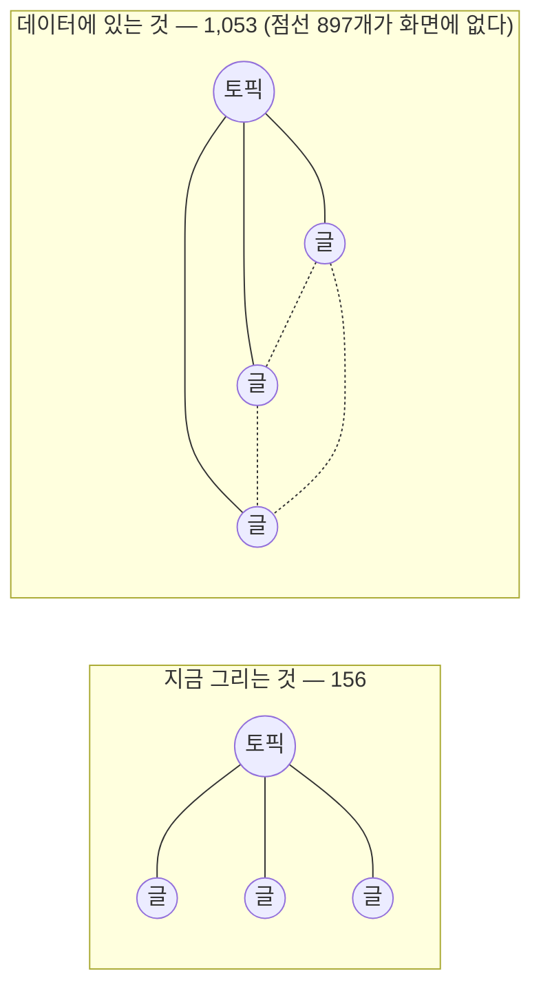

# 인수인계 (HANDOFF)

> 갱신: 2026-08-28 · 브랜치 `main` = `9d45df5` (배포 완료) · 이번 세션 커밋 **5개**(전부 문서)
>
> 🔴 **다음 세션의 임무는 하나다 — `/atlas` 그래프 화면을 다시 만든다.**
> 사용자가 실물을 보고 **「0점」**이라고 판정했다. 문서·데이터·검색은 멀쩡한데
> **보이는 화면이 가장 덜 된 부분**이고, 그 사실을 이번 세션에 실측으로 확인했다.
>
> 사용자의 말 그대로: *"만들려고 했던 작업을 끝까지 마무리 지어보고 내가 다시 판단할께."*
> 즉 **완성된 화면을 만들어 놓고 판단을 받는다.** 중간 보고로 끝내지 않는다.

---

## 1. 🔴 가장 먼저 읽을 것 — 아틀라스가 자기 데이터를 배신하고 있다

`/atlas` 는 화면에 「글 156편 · 토픽 6개 · **연결 1053개**」라고 적어 놓는다.
브라우저에서 SVG 안을 실제로 센 결과는 이렇다.

| SVG 요소 | 실측 | 뜻 |
| --- | ---: | --- |
| `<circle>` | **162** | 노드는 전부 그린다 ✅ |
| `<line>` | **156** | **엣지를 156개만 그린다** ❌ |
| `<text>` | **0** | 라벨이 하나도 없다 ❌ |

**156 = 글 편수다.** 지금 그리는 선은 「글 → 소속 토픽」 156개뿐이고,
글끼리의 관계(본문 인용·시리즈·선행) **897개는 화면에 존재하지 않는다.**



**「민들레 6개」처럼 보이는 이유가 이것이다.** 클러스터를 잇는 선이 그려지지 않으니
6개의 독립된 방사형 덩어리만 남는다.

### 그런데 E2E 74건은 전부 통과한다

이 리포가 반복해서 데인 바로 그 모양이다 — **「없다」와 「읽을 수 없었다」가 같은 출력.**
이번엔 변종이 하나 더 늘었다: **「초록이다」와 「보인다」가 다르다.**
`CLAUDE.md` 의 「산출물 문자열로 렌더됐다를 증명하지 마라」와 같은 계열인데,
이번 것은 **DOM 이 실제로 있는데도 사람이 보기엔 비어 있는 경우**다.

---

## 2. 다음 세션의 작업 — `/atlas` 그래프 재설계

### 2-1. 기준선: 사용자가 지정한 참조 사이트

**<https://www.careerhackeralex.com/memory>** — 사용자가 *"초안을 이걸로 잡고 이것보다 더 개선해서
만들어보려고 했다"* 고 말한 사이트다. 실제로 열어 보고 대조한 결과:

| 항목 | 알렉스 `/memory` | 현재 `/atlas` |
| --- | --- | --- |
| 규모 | 350 노드 / 1,698 링크 | 162 노드 / 1,053 엣지 |
| **그리는 엣지** | 사실상 전부 | **156 (15%)** |
| 레이아웃 | **힘 기반** — 얽힌 구조가 형태로 드러남 | 결정론적 방사형 |
| 노드 라벨 | 주요 노드에 표시 | **없음** |
| 노드 유형 | **7종 색상 범례**(의미·통찰·원자·서면·주장·주제·맥락) + 각 개수 | 2종(글/토픽), **단색** |
| 렌즈 | 5종 전환 (전체·주제별 등) | **없음** |
| 사이드바 | 주제·태그별 개수가 빽빽한 좌측 패널 | **없음** |
| 줌·팬 | 있음 | **없음** |
| 화면 점유 | **뷰포트 전체가 캔버스** | `max-w-7xl` 안의 `aspect-square` 박스 |

### 2-2. 사용자가 지적한 UI/UX 문제 6건

> *"너가 만든 UI/UX 디자인은 너무 마음에 들지 않는데."*

| # | 무엇 |
| --- | --- |
| 1 | **`/atlas` 가 앱이 아니라 「블로그 페이지 안의 위젯」이다.** 정사각형 박스에 갇혀 화면 우측·하단이 텅 빈다 |
| 2 | **첫 화면에 정보가 없다.** 라벨 0 · 색상 구분 없음 · 범례 없음 |
| 3 | **조작할 게 없다.** 줌·팬·드래그 없음. 클릭하면 우측에 텍스트만 |
| 4 | **제목 아래 한 줄이 전부다.** 렌즈 전환도 필터도 없다 |
| 5 | **셸이 페이지마다 다르다.** `/atlas` 헤더에는 Atlas·Blog 내비와 검색 버튼이 있는데 **`/blog` 에는 둘 다 없다**(헤더가 「기술 노트」로 다름) |
| 6 | **클릭하면 레이아웃이 깨진다** (아래 §3) |

**1번이 나머지를 규정한다.** 지금은 `max-w-7xl` 문서 컨테이너 안에 `aspect-square` 박스를 넣은
**문서 레이아웃**이다. 그래프는 문서에 박힌 그림이 아니라 **화면을 점유하는 도구**여야 하는데,
그 전제가 다르니 줌도 렌즈도 사이드바도 놓을 자리가 없다. 5번(셸 불일치)도 같은 뿌리다.

### 2-3. ⚠️ 사용자에게 아직 답을 못 받은 질문 셋

세션이 종료돼 물어보지 못했다. **작업 착수 전에 이것부터 확인하라.**

| # | 질문 | 왜 중요한가 |
| --- | --- | --- |
| 1 | 불만의 범위가 `/atlas` 화면만인가, **사이트 전체 디자인**인가 | 후자면 셸·블로그·포트폴리오까지 범위가 커진다 |
| 2 | 알렉스 사이트의 **레이아웃 골격**(풀스크린 + 좌측 패널)까지 가져올 것인가 | 「더 개선」의 출발점을 어디에 둘지가 갈린다 |
| 3 | **「더 개선」의 방향** — 밀도로 압도할 것인가, **읽히는 구조**(계층·필터·경로 찾기)로 차별화할 것인가 | 알렉스 화면은 인상적이지만 개별 노드를 찾아가기는 어렵다. 만들 것이 완전히 달라진다 |

### 2-4. 손댈 파일

| 파일 | 지금 무엇인가 |
| --- | --- |
| `lib/atlas/layout.ts` | 결정론적 방사형 좌표 계산. **힘 기반으로 교체 대상** |
| `components/atlas/dot-renderer.tsx` | SVG 렌더러. **이름이 지금 상태를 정확히 말한다 — 점을 그리는 것이지 그래프를 그리는 게 아니다** |
| `components/atlas/node-panel.tsx` | 우측 상세 패널 |
| `components/atlas/list-view.tsx` | 목록 뷰. **접근성 경로라 유지해야 한다**(그래프는 포인터 전용) |
| `pages/atlas/index.tsx` | 페이지 레이아웃. §2-2 의 1번을 고치려면 여기부터 |
| `lib/atlas/links.ts` · `neighbors.ts` | 엣지 계산. **데이터는 이미 1,053개가 있다** — 여기는 문제가 아니다 |

**엣지 897개를 지금 레이아웃에 그대로 그려 넣으면 더 나빠진다.** 민들레들을 가로지르는 선이
화면을 덮는다. 레이아웃을 먼저 바꾸고 엣지를 살려야 한다 — **순서가 있다.**

---

## 3. 확인된 버그 1건 — 노드 클릭 시 가로 스크롤

| 단계 | 문서 폭 | 뷰포트 | 그래프 컨테이너 |
| --- | ---: | ---: | ---: |
| 클릭 전 | 3408 | 3408 | 864 |
| 노드 클릭 후 | **3710** | 3408 | **2262** |

**원인:** `pages/atlas/index.tsx` 의 그리드가 `lg:grid-cols-[1fr_20rem]` 인데,
`1fr` 칸에 든 그래프 박스가 `aspect-square w-full` 이라 **`min-width: auto`** 가 걸린다.
상세 패널이 열려 행 높이가 커지면 aspect-ratio 를 통해 **최소 폭이 역산돼 `1fr` 이 2261px 로 부푼다.**

**처방:** 그 박스에 **`min-w-0`** 한 클래스. 브라우저에서 `min-width: 0` 을 주입해
컬럼이 `2261.89px → 864px` 로 돌아오고 가로 스크롤이 사라지는 것을 **실측 확인**했다.

> 재설계로 이 컨테이너가 없어질 수도 있다. **그때는 이 항목도 함께 소멸한다** — 따로 고치지 말고 확인만 하라.

---

## 4. 잘 되는 것 — 건드리지 마라

| 층 | 상태 | 근거 |
| --- | --- | --- |
| 아틀라스 **데이터** | 탄탄함 | zod 스키마 · 무결성 게이트 · 엣지 1,053개가 실제로 계산돼 있다 |
| 노드 상세 **162장** | 동작 | `/atlas/<분류>/<slug>/` · 토픽은 `/atlas/topic/<분류>/` |
| **검색** | 잘 됨 | 「임베딩**의**」 입력 → 조사 처리 후 **57건**, 하이라이트·스니펫 정상 (브라우저 실측) |
| 배포 파이프라인 | 정상 | CI 8단계 → deploy. 이번 세션 2회 모두 success |

**검색은 이번 세션에 브라우저로 직접 확인했다.** 팔레트는 헤더의 검색 버튼으로 열린다
(`Ctrl+K` 는 Chrome 이 가로챌 수 있다).

---

## 5. 이번 세션에서 한 일 — 전부 문서

| 커밋 | 무엇 |
| --- | --- |
| `b62f49c` | `CLAUDE.md` — 산출물 문자열로 「렌더됐다」를 증명하지 말라는 규칙 (**122줄 유지**) |
| `cef8743` | `README` — 65커밋 동안 밀린 서술 drift 정정 + **거짓 CI 보증 제거** |
| `3c8e30c` | `main` 병합 |
| `e93dead` · `9d45df5` | HANDOFF · CHANGELOG |

### 값어치 있는 발견 둘

1. **README 가 거짓 보증을 하고 있었다** — 「CI 가 `check-baseline` 을 돌린다」고 적혀 있으나
   `deploy.yml:99-100` 에서 **주석 처리**돼 있다. 문서를 믿은 사람은 돌지 않는 게이트를 돌고 있다고 여긴다.
2. **README 의 수치는 검사기가 지킨다** — 트리의 「발행본 156편」을 지웠더니 `check-counts` 가 실패했다.
   그 스크립트는 README 의 **네 자리**를 정규식으로 감시하고 **자리가 사라지면 실패**시킨다.

> **README 의 숫자를 지우기 전에 `npm run check-counts` 를 돌려라.**

---

## 6. 도구 함정 — 이번 세션에 새로 겪은 것

| 무엇 | 대응 |
| --- | --- |
| **`git fetch` 없이 `origin/main` 을 읽으면 마지막 fetch 시점의 값이 나온다.** 이 세션은 그래서 「65커밋 미배포」로 오판한 채 시작했다(실제로는 PR #1 로 이미 배포됨) | **세션 시작 시 `git fetch` 부터** |
| **브라우저 자동화의 `ref` 클릭이 React 다이얼로그를 열지 못했다.** 클릭은 성공했다고 나오는데 `display:none` 이 유지되고 콘솔 에러도 없다 | **`element.click()` 을 JS 로 직접 호출해 대조군을 만들어라.** 그래야 「기능이 고장」과 「자동화가 못 누름」이 갈린다 |
| **뷰포트 폭이 측정할 때마다 달랐다**(2096 → 3408). 이 상태로는 레이아웃 결함을 판정할 수 없다 | **창 크기를 고정하고 클릭 전 상태를 먼저 재라** — 대조군이 없으면 오진한다 |

기존 함정 **#35~#37** 은 [`docs/TOOL-TRAPS.md`](docs/TOOL-TRAPS.md) 에 있다.

---

## 7. 상태

| 항목 | 값 |
| --- | --- |
| 브랜치 | **`main` = `9d45df5`** (origin/main 과 동일) |
| 미커밋 변경 · stash | **없음 · 없음** |
| `feat/site-renewal` | `cef8743` — 병합 완료. 새 작업은 **새 브랜치**로 |
| `npm run lint` · `npx tsc --noEmit` | **0 · 0** |
| `npm test` | **354 passed** (15파일) |
| `check-forbidden` (소스 / 산출물) | **HARD 0** (158파일 / 456파일) |
| `check-counts` | **156편 / 6개 카테고리** (검사한 자리 4곳) |
| `check-pagefind` · `probe-search` | ko **405/405** · 기본형 **8/8** |
| `check-baseline` | 비블로그 산출물 **14개 불변** |
| `npm run e2e` | **74 passed · 0 failed · 0 skipped** ← **초록이지만 화면은 §1 상태다** |
| CI (2회) | 모두 **success** |

**`out/` 은 이번 세션 빌드로 신선하다.** 단 `scripts/`·`components/` 를 건드리면 mtime 이 무효가 되니
`npm run e2e` 전에 **`npm run build` 가 먼저**다. 아니면 테스트를 하나도 안 돌리고 종료 코드 1 이 나온다.

**`main` 은 프리뷰 없는 프로덕션이다. 배치 마감마다 푸시 여부를 사용자에게 물어라.**

---

## 8. README / 문서 갱신 필요 — **이월(고치지 않았음)**

| 항목 | 왜 이월했나 | 확인할 진실원 |
| --- | --- | --- |
| `docs/site-renewal-roadmap.md` · `completion-report.md` | 2026-07 이후 미갱신. 셸·검색·아틀라스가 반영돼 있지 않다. 재설계 후에 한꺼번에 고치는 편이 낫다 | `pages/` 실제 라우트 · `docs/superpowers/specs/2026-08-25-redesign-and-atlas.md` |
| `.gitattributes` **부재** | 추적 파일 369개 중 **144개(39%)** 가 워킹트리 CRLF 인데 커밋본 일관성을 **강제하는 것이 없다**. 지금은 blob 이 CR 0 으로 일관하지만 우연이다 | `git config core.autocrlf` · 함정 [#14](docs/TOOL-TRAPS.md#t14)·[#16](docs/TOOL-TRAPS.md#t16) |

**오탐이라 넣지 않은 것:** 수집기가 `OPENAI_API_KEY`·`TAVILY_API_KEY`·`UPSTAGE_API_KEY`·
`LANGCHAIN_*` 를 「코드가 읽는데 README 에 없다」로 신고했으나 **전부 `content/blog/**` 의 예제 코드**다.
이 사이트는 그 변수를 읽지 않는다. `scripts/` 8개 파일도 README 표에 `npm run` 형태로 이미 있다.

---

## 9. 미해결 — 사용자 승인 대기 **1건**

`CLAUDE.md` 에 올릴지 정해야 한다. **아직 쓰지 않았다.** 현재 **122줄**이고
「한 줄을 더하면 한 줄을 뺀다」 규칙이 있다.

```diff
 ## 검사 — 0 을 믿기 전에 계수기가 살아 있음을 먼저 증명한다
+
+**화면이 있는 기능은 화면을 보고 마감하라.** E2E 초록과 「보인다」는 다르다 —
+`/atlas` 는 엣지 1,053 중 **156 만** 그리는데 74건이 전부 통과했다.
```

**판단 근거:** 조건 3개를 만족한다 — ① 이번에 실제로 대가를 치렀다(사용자가 실물을 보고 0점 판정할
때까지 아무도 몰랐다) ② 코드나 테스트를 읽어서는 알 수 없다(둘 다 「정상」이라고 답한다)
③ 재발한다(이 리포는 시각화를 계속 늘릴 것이다).
**넣는다면 한 줄을 빼야 한다.**

---

## 10. 작업 원장 (gitignore)

`.superpowers/sdd/2026-08-26-atlas-and-search/progress.md` 에 아틀라스 배치의 **판단 22건**이
근거·비용과 함께 있다. 그중 **2건은 컨트롤러가 틀렸고 실측으로 뒤집힌 것**이다.
**재설계 전에 읽어라** — 지금의 방사형 레이아웃을 왜 골랐는지가 거기 있고,
그 판단을 뒤집으려면 근거를 알아야 한다.

**`.superpowers/` 는 gitignore 라 `git clean -fdx` 로 사라진다. 남길 것이 있으면 옮겨라.**
