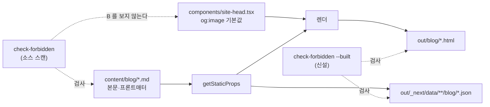

# 인수인계 (HANDOFF)

> 갱신: 2026-08-18 · 브랜치 `main` · 최신 커밋 `3cb386e`
> `fix(blog): OG 이미지를 중립화하고 금칙어 검사기에 산출물 모드를 세운다`
>
> **발행본 124편 · sitemap 187 URL**

---

## 1. 이번 세션에서 한 일

직전 세션이 **최우선 · 사용자 판정 필요**로 남긴 **§10-1(OG 이미지의 `yanadoo`)** 을 해소했다.
사용자 판정은 두 가지였다 — **적용 범위는 사이트 전체**, **옛 경로는 남기지 않는다**.

| # | 무엇 | 규모 |
| ---: | --- | --- |
| 1 | `Ted_yanadoo.png` → `Ted_profile.png` 개명 | 참조 **9곳** |
| 2 | 블로그 홈 제목에서 실명 제거 | 1곳 (패턴 불일치도 함께 해소) |
| 3 | 검사기 **산출물 모드 `--built`** 신설 | `out/blog` + `_next/data` **366파일** |
| 4 | 경계 규칙 수정 — `_`를 단어 문자에서 제외 | 거짓 음성의 진짜 원인 |
| 5 | 정당 문맥 면제 (JSON-LD `author`) | 문자열 고정 · 양방향 케이스 |
| 6 | self-test **8 → 15건** · 문서 4종 갱신 | 신규 7건 전부 RED 확인 |

**검증(전부 단독 실행)**: self-test **15/15** · 소스 HARD **0** · 산출물 366파일 HARD **0** ·
산출물 부재 시 종료 **2** · `npm test` **36** · `tsc` **0줄** · `build` 0 · sitemap **187 불변** ·
`out/`의 `Ted_yanadoo` **0회**

---

## 2. ⚠️⚠️ 최상위 — **원인을 하나로 지목한 진단은 나머지 원인을 가린다** (금지선 59)

직전 세션의 §10-1이 이렇게 적었다:

> **F3의 거울상** — 이번엔 한글(「야나두」)이 목록에 있었고 **라틴(`yanadoo`)이 없었다**

**틀렸다.** 실측하니 원인이 **세 겹**이었고, 문서가 지목한 첫째 층은 **아예 사실이 아니었다.**

| 층 | §10-1의 서술 | 실측 |
| --- | --- | --- |
| ① 낱말 목록 | 「라틴이 없었다」 | **둘 다 있었다.** `HARD` 목록 **첫 줄**이다 |
| ② 스캔 범위 | 언급 없음 | `content/blog`만 본다. 오염원은 `components/` |
| ③ 경계 규칙 | 언급 없음 | `_`를 단어 문자로 쳐서 **`Ted_yanadoo`를 놓쳤다** |

**③이 결정적이다.** ②만 고쳐 `out/`을 보게 해도 경계 규칙 때문에 **여전히 0건**이 나왔을 것이다.
문서를 믿고 ①만 고쳤다면 「목록에 이미 있는데요」에서 멈췄을 것이다.

⇒ **인수인계의 진단을 착수 근거로 쓰되 실측 없이 결론으로 쓰지 마라.**
직전 세션이 §2에서 「거짓 음성은 없음을 확인함으로 기록된다」를 배웠는데,
**같은 문서의 진단부가 그 형태를 반복했다.** 원인 서술도 실측물이다.

---

## 3. ⚠️⚠️ **소스가 깨끗한 것은 발행된 페이지가 깨끗하다는 증거가 아니다** (금지선 60)

| 자리 | `yanadoo` 출현 |
| --- | ---: |
| `content/blog/**` (소스 — 검사 대상이었다) | **0** |
| `out/blog/**` (산출물 — 검사 대상이 아니었다) | **366** |

글이 아니라 **글을 감싸는 템플릿**이 넣고 있었다 — `components/site-head.tsx`의
`ogImagePath` 기본값 **한 줄**. `ogImagePath`를 명시적으로 넘기는 곳은 **0곳**이라
그 한 줄이 `SiteHead`를 쓰는 **모든 페이지**를 결정한다.



⇒ **템플릿이 주입하는 것은 소스 스캔의 구조적 사각지대다.** `--built`를 세워 막았다.
발행 절차는 이제 **소스 스캔 + 빌드 + 산출물 스캔** 세 단계다.

---

## 4. ⚠️⚠️ **고치기 전에 검사기가 잡는 것을 먼저 봐야 한다** (금지선 59의 실행형)

작업 순서를 의도적으로 뒤집었다.

| 순서 | 한 일 | 왜 |
| ---: | --- | --- |
| 1 | `--built`를 **개명 전에** 완성 | — |
| 2 | 개명 전 산출물에서 **366회를 잡는 것 확인** | 검사기가 실제로 본다는 증명 |
| 3 | `grep -ro \| wc -l` 대조군과 **정확히 일치** 확인 | 수치가 맞다는 증명 |
| 4 | 그 뒤에 개명 | — |
| 5 | 재빌드 후 **0회** 확인 | 이 0은 「고쳐서 0」이다 |

**먼저 고쳤다면 이후의 0건이 「고쳐서 0」인지 「못 찾아서 0」인지 구분할 수 없다.**
직전 세션의 §2가 말한 실패가 정확히 그 형태다. 검사기 self-test도 같은 원리로 —
신규 케이스 7건은 **전부 도입 전 RED를 확인**하고 나서 구현했다.

---

## 5. ⚠️ **밑줄은 단어 문자가 아니라 구분자다** (금지선 61)

`isWordChar`가 `_`를 단어 문자로 판정해 라틴 낱말이 파일명 안에서 통째로 빠져나갔다.

| 문자열 | 기존 | 수정 후 |
| --- | :---: | :---: |
| `/images/Ted_yanadoo.png` | **놓침** | 잡음 |
| `yanadoo_app.png` | **놓침** | 잡음 |
| `https://www.yanadoo.co.kr/…` | 잡음 | 잡음 |
| `Cheatsheet` (오탐 회귀 검사) | 안 잡음 | 안 잡음 |

식별자·파일명에서 `_`는 낱말을 **잇는** 문자가 아니라 **나누는** 문자다.
발행본 스캔에 회귀는 없다(HARD 0건 유지). 양쪽 방향을 self-test로 고정했다.

⇒ **단어 경계 규칙은 「어느 문자가 낱말의 일부인가」라는 정책이다.** 기본값을 그대로 쓰지 마라.

---

## 6. ⚠️ **확정된 판정을 검사기가 반영하지 않으면 검사기가 무력해진다** (금지선 62)

`--built`를 켜자 「허우용」 **127회**가 함께 잡혔다. §10-1이 이미 **「JSON-LD `author` 표기이며
위반으로 보지 않는다」로 판정**한 건이다. 그대로 두면 개명을 해도 `--built`는 **영영 실패**하고,
그러면 아무도 돌리지 않는다 — §7이 경고한 **늑대소년**이다.

그런데 실측하니 **127회가 한 종류가 아니었다.**

| 형태 | 횟수 | 처리 |
| --- | ---: | --- |
| `"author":{"@type":"Person","name":"허우용"}` | **124** | 정당 문맥. **정확한 문자열**로 면제 |
| `<title>`·`og:title`·`twitter:title`의 「기술 노트 ǀ 허우용」 | **3** | **판정된 적 없던 것.** 제목에서 제거 |

후자는 `pages/blog/index.tsx` **한 곳만의 예외**이기도 했다 — 다른 블로그 페이지는 전부
`X | 기술 노트` 패턴이다. 즉 **금칙어 문제이자 일관성 결함**이었다.

⚠️ **면제를 「기술 블로그니까 이름은 괜찮다」로 넓히지 않았다.** 정확한 문자열 **안쪽**에서만
적용하고, 「그 문맥 밖으로 새지 않는다」·「소스 스캔에는 적용되지 않는다」를 각각 케이스로 박았다.
넓은 면제는 검사기가 그 낱말을 **아예 못 보게** 만든다.

---

## 7. ⚠️ **지금 비어 있는 것과 검사 대상인 것은 다르다** (금지선 63)

`--built`가 처음엔 `out/blog/**.html` 183개만 봤다. 그런데 같은 props가
`out/_next/data/<buildId>/blog/**.json`으로 **한 벌 더** 나간다(클라이언트 네비게이션용).

실측하니 그 183개 json에 금칙어는 **0회**였다. 「HTML의 `__NEXT_DATA__`에 다 들어 있으니
중복이다」로 넘길 수 있었지만 넣었다 — **검사한다고 말하면서 일부를 안 보면 안 된다.**

넣고 나서 개수를 대조하자 **365개**가 나왔다(기대 366). 블로그 홈만 `<buildId>/blog.json`이라
`/blog/`를 지나지 않아 필터에서 빠졌던 것이다. **하필 이번에 제목을 고친 그 페이지다.**

⇒ **범위를 넓혔으면 개수를 독립적으로 세어 대조하라.** 「넓혔다」는 느낌은 증거가 아니다.
`buildId`는 빌드마다 바뀌므로 경로를 박지 않고 훑어서 거른다.

---

## 8. 다음 세션이 이어받을 것

### ▶ **다음 배치는 미정이다. 사용자가 정한다.**

| 카테고리 | 편수 | 설계서 | 지도편 | 상태 |
| --- | ---: | --- | :---: | --- |
| `ai-agent` | 51 | 있음 | ✅ | 완료 |
| `agentic-coding` | 31 | 있음 | ✅ | 완료 |
| `rag` | 25 | **없음** | ✅ | — |
| `ai-transformation` | 11 | 있음 | ✅ | 완료 |
| `search-engineering` | 6 | **없음** | ❌ | 익명화·고립 해소 완료 |

**합계 124편 · sitemap 187 URL.**

### S3(지도편) — **보류 판정. 재검토하려면 이 판정부터 반증하라**

조사 α가 「지도편 필요」를 권했으나 채택하지 않았다. 근거:

1. **6편이면 카테고리 인덱스로 충분하다.** 지도편이 정당했던 곳은 `ai-transformation`(11편)·`rag`(25편)다
2. 당시 이 카테고리는 **양방향 고립**이었다 — 지도편을 얹어도 **7번째 섬**이 될 뿐이었다
3. `ai-transformation` 지도편이 통한 것은 그 카테고리가 **이미 밖과 이어져 있었기** 때문이다

⇒ **S2로 고립이 해소돼 근거 2가 약해졌다.** 다시 판정하려면 위 3개를 각각 다뤄라.

### 원본에 남은 미사용 소스

`C:\Users\aeby\vscode\yanadoo-exit\shared\knowledge\` (**읽기 전용 · 수정 금지**)

| 디렉터리 | 문서 | 분량 | 비고 |
| --- | ---: | ---: | --- |
| `java-backend` | 11 | 638 KB | |
| `langgraph` | 12 | 510 KB | `rag`에 이미 3편 반영됨 |
| `high-traffic` | 11 | 508 KB | |
| `pm-harness` | 8 | 402 KB | |
| `pangyo-it` | 6 | 346 KB | |
| `pm-po` | 17 | 327 KB | |
| `bigdata` | 8 | 293 KB | |
| `learning` | 10 | 198 KB | |
| `recommendation` | 7 | 84 KB | 검색과 일부 교차 |
| `llm-search-recommend` | 1 | 37 KB | ⚠️ `rag`와 주제 충돌 — §10-2 |

⚠️ **`search/` 6개는 발행본 6편으로 1:1 소진됐다.** 미사용 소재 없음.

새 카테고리를 열면 **설계서부터 쓴다**(분할표 · 배치 계획 · 축 B 정의 · 금지선 승계).

### 확정된 결정 (다시 묻지 마라)

| 항목 | 결정 |
| --- | --- |
| 원본 | **읽기 전용.** 수정 금지 |
| 푸시 | **사용자가 명시적으로 요청할 때만** |
| 커밋 메시지 | **한글** |
| 커밋 구성 | 작업 커밋 = 코드 + CHANGELOG + README + 설계서 / 인수인계 커밋 = HANDOFF **별도** |
| ~~`source` 프론트매터~~ | **2026-08-18 폐지.** 필드 자체를 제거했다. 되살리지 마라 |
| **사명 표기** | **익명화한다** — 「OTT 서비스」·「IPTV 서비스」. 단 **제품명은 유지**(코난테크놀러지·IDOL·Elasticsearch) |
| **금칙어 목록** | **`scripts/check-forbidden.mjs`가 정본.** 문서에 복사하지 마라 |
| **프로필 이미지** | **`Ted_profile.png`.** 옛 경로 `Ted_yanadoo.png`는 **되살리지 마라**(2026-08-18) |
| **JSON-LD `author`의 실명** | **위반이 아니다.** 검사기가 그 문자열만 면제한다 |
| 태그 | 기존 통제 어휘 안에서만. `MAX_TAGS=6` |

---

## 9. ⚠️ 도구 함정 — 이 세션에서 실제로 걸린 것

| # | 함정 | 대응 |
| ---: | --- | --- |
| **57** | **`git diff`는 깨끗한데 작업트리 줄바꿈이 바뀐다.** `sed -i`가 CRLF 파일을 **LF로 다시 쓴다**(CR 393 → 0). 직전 세션의 함정 56을 더 정확히 고치면 — **`diff`가 숨기는 게 아니라 `core.autocrlf`가 blob을 정규화하는 것이고, 그래서 저장소는 안전하다** | 봐야 할 것은 `git diff`가 아니라 **`git diff --numstat`** 이다. 의도한 줄 수(1~2)가 나오면 저장소 관점은 무사하다. 작업트리 LF화는 다음 체크아웃에서 복구된다 |
| **58** | **`grep -rn`을 리포 루트에 돌려 2분 타임아웃.** `.next/`의 번들 한 줄이 수백 KB다 | 제외 목록에 `out`·`node_modules`뿐 아니라 **`.next`도 반드시 넣어라.** 아니면 `pages/ components/ lib/ data/ scripts/` 처럼 경로를 명시하라 |
| **59** | **GNU sed 치환문의 `\|`는 백슬래시를 잃는다**(BRE의 alternation과 얽힌다). 마크다운 표 셀 안 파이프를 이스케이프하려다 조용히 실패했다 | **파이프를 안 쓰는 문구로 바꾸는 쪽이 싸다.** 굳이 넣어야 하면 `Write`/`Edit` 도구로 쓴다 |
| **60** | **`awk -F'\|'`로 표 셀 수를 세면 `\|`를 구분자로 센다.** 마크다운은 이스케이프로 렌더하는데 awk는 모른다 | 셀 개수 검산에서 **1개 많게 나오면 이스케이프를 의심**하라. 렌더 결함이 아니다 |
| **61** | `npm run dup-scan`은 **인자 없이 돌리면 종료 코드 1**이다(「대상이 없다」) | `--category <slug>` 또는 파일을 줘라. `CLAUDE.md`·`README`가 인자 없는 호출을 적어 뒀던 것을 이번에 고쳤다 |
| **53** | **히어독으로 코드를 쓰면 이중 백슬래시가 한 겹 벗겨진다** | 단일 이스케이프는 무사하다. **이중 백슬래시만** 벗겨진다. `String.fromCharCode(92)`로 우회하거나 `Edit`/`Write` 도구로 써라 |
| **54** | **서브에이전트가 유휴가 돼도 보고서가 오지 않는다** | `SendMessage`로 명시적으로 회수하라. 그래도 안 오면 직접 실행하고 **「제3자 검증이 아님」을 결과에 명시**하라 |
| **55** | **grep으로 CRLF를 검사하면 거짓 음성이 난다** | `tr -cd` 로 **바이트를 세라** |
| **49** | 파이프 뒤의 종료 코드는 마지막 명령의 것이다 | 종료 코드를 볼 명령은 **단독 실행**하라 |
| **51** | 한국어 1인칭은 grep으로 분리되지 않는다 | 매칭 줄을 열어 읽어라. **검사기에 넣지 마라** |
| — | 한글·이모지 grep이 로케일 때문에 거짓 0건 | `LC_ALL=C` 고정 |

---

## 10. 미해결 과제

> **직전 세션의 10-1(OG 이미지)은 이번에 해소됐다.** 아래는 번호를 당겨 다시 매겼다.

### 10-1. `llm-search-recommend` 37 KB — 발행 제안이 **충돌 미확인 상태**

조사 β가 「벡터 검색 — Sparse·Dense·Hybrid」로 발행을 권했으나 **β는 `rag`를 보지 않았다.**
γ 실측으로 `rag/rag-pipeline-retrieval.md`가 이미 그 범위를 다룬다.
⇒ **발행하려면 겹침을 먼저 실측하라.**

### 10-2. F1 — 익명화 전제가 사이트 구조상 무효 (수치가 확정됐다)

`--all` 실측 기준 `pages/index.tsx` 37 · `data/portfolio.ts` 23 · `pages/product-lead*` 32.

> **이 작업이 실제로 한 일은 신원 은폐가 아니라 「기술글이 이력서처럼 읽히는 것」을 막은 것이다.**
> 사용자가 이를 알고 익명화를 택했다(2026-08-18). **효과의 이름을 바꿔 부르되 작업은 유효하다.**
> 진짜로 은폐하려면 사이트 구조를 바꿔야 하는데 그건 별건이다.

⚠️ **이번에 「야나두」 87회가 산출물에 남아 있음을 재확인했다** — 전부 포트폴리오
(`index.html` · `product-lead*` · `product-lead-wiki`)이고 `out/blog/`에는 **0회**다.
`data/diagrams/yanadoo-*` 28건(도식 id·파일명)도 같은 선상이라 건드리지 않았다.

### 10-3. `search-engineering` inbound 0인 두 편

`search-engineering-qna`(inbound 0 / outbound 3) · `search-system-overview`(0 / 10).
조사·리뷰 **모두 「억지 아닌 자리가 없다」로 판정**했고 개수를 채우지 않았다.
후자는 카테고리의 **입구 편**이라 inbound 0이 자연스럽다는 견해도 있다.

### 10-4. SOFT 2건 — **판정 완료. 고치지 마라**

`content/blog/agentic-coding/thirty-agent-catalog.md:195`의 「면접 질문」·「이력서」는
`recruiter` 에이전트의 **기능 설명**이다. 검사기가 SOFT로 보고하지만 **정당한 문맥으로 판정했다.**

### 10-5. 이전 이월 (T7·T6·T5 계열)

`git show 6186437:HANDOFF.md`의 §9를 승계한다. 주요한 것:

| # | 자리 | 요지 |
| ---: | --- | --- |
| **T7-d** | 편11 전반 | 자기 감사 분량 — 「빼도 될 30줄」 |
| **T7-h** | 편11 주제 1~13 **1차** 칸 | ⚠️ **아무도 안 쟀다** |
| **T6-a** | 편10 `:143`↔`:145` | ⚠️ **게이트를 세면 5 vs 6** |
| I-13 | 편10 `:230` | 「아홉 편」 — **수정 불요** 판정. 재검토하려면 그 판정부터 반증하라 |
| 1 | mermaid 노드 라벨 우측 클리핑 | `foreignObject` 폭 |
| 3 | 메인 페이지 LCP 6.6초 | Lighthouse 77점 |
| 5 | `cto_learning_roadmap` Q1·Q3 | 발행 가능 판정을 받았으나 미변환 |

---

## 11. 검증 명령

### ⚠️ 순서가 규칙이다 — **증명 먼저, 스캔 나중. 그리고 산출물까지.**

```bash
cd C:/Users/aeby/vscode/withwooyong.github.io

# 1) 검사기가 실제로 잡는지 먼저 증명한다 (15/15 여야 한다)
npm run check-forbidden:verify

# 2) 소스 스캔 — HARD 0건
npm run check-forbidden

# 3) 빌드 — 여기서 템플릿이 주입한다
npm run build

# 4) 산출물 스캔 — HARD 0회. ⚠️ 2·4는 다른 것을 본다. 3번을 건너뛰면 4가 종료 2로 막는다
npm run check-forbidden:built

# 5) 축자 복제 — 대상을 반드시 준다
npm run dup-scan:verify && npm run dup-scan --category <slug>
```

**2번이 0건이어도 4번이 0회라는 보장은 없다.** 소스에 없는 것을 템플릿이 넣기 때문이다(§3).
**1번을 건너뛴 2번의 「0건」은 신뢰할 수 없다.**

### 빌드·테스트 — 종료 코드를 볼 명령은 **단독 실행**

```bash
npm test                 # 36건 통과
npx tsc --noEmit         # 출력 0줄
npm run build            # sitemap 187 URL
```

### 산출물 잔존 검사 — ⚠️ 매칭 줄 수가 아니라 **출현 횟수**를 세라

```bash
# grep -c 는 매칭 '줄 수'다. HTML은 한 줄이라 366회 나와도 183이 나온다
for w in 테디노트 패스트캠퍼스 야나두 yanadoo Ted_yanadoo; do
  echo "$w: $(LC_ALL=C grep -ro "$w" out/ | wc -l)회"
done
```

`--built`가 이 검사를 대신하되 **범위가 `out/blog` + `_next/data`로 한정**된다.
포트폴리오(`out/index.html` 등)는 정책 대상이 아니라 보지 않는다 — 그쪽을 보려면 위 루프를 쓴다.

### 카테고리 간 링크 지형

(A) 링크 출현 횟수와 (B) 고유 파일 수는 **다른 값이다.** 두 정의를 반드시 구분하라.
검산: 내부 링크만 존재하면 inbound 총합과 outbound 총합이 같아야 한다.

---

## 12. 소스 위치

| 무엇 | 경로 |
| --- | --- |
| 원본 (**읽기 전용**) | `C:\Users\aeby\vscode\yanadoo-exit\shared\knowledge\` |
| 리포 | `C:\Users\aeby\vscode\withwooyong.github.io` |
| **금칙어 목록 (정본)** | **`scripts/check-forbidden.mjs`** |
| 설계서 | `docs/superpowers/plans/2026-08-{08,14}-*-category-split-design.md` |
| 규칙 GC-* | `docs/superpowers/plans/2026-08-07-tech-blog-phase1.md` |
| 규칙 CR-* | `docs/superpowers/specs/2026-08-07-tech-blog-requirements.md` |
| 금지선 1~20 | `2026-08-08-agentic-coding-…-design.md` L1994-2022 |
| 금지선 21~34 | `2026-08-14-ai-transformation-…-design.md` §11 |
| 금지선 35~43 | `git show 6186437:HANDOFF.md` §2~§5·§8 |
| 금지선 44~52 | `git show 964c8f3:HANDOFF.md` §2~§6·§8 |
| 금지선 53~58 | `git show a785c61:HANDOFF.md` §2~§7 |
| **금지선 59~63** | **이 문서 §2~§7** |

---

## 13. README/문서 갱신

### ✅ 이번 세션 — 문서 **4종 수정**

| 파일 | 무엇 | 근거 |
| --- | --- | --- |
| `CLAUDE.md` | `check-forbidden:built` 행 추가 · self-test 8 → **15건** | 신설 검사기를 절차에 넣지 않으면 아무도 돌리지 않는다 |
| `CLAUDE.md` · `README.md` | `dup-scan`에 **`--category <slug>` 필수**임을 명시 | 인자 없이 돌리면 종료 코드 1인데 문서가 인자 없는 호출을 적어 뒀다 |
| `README.md` | npm 스크립트 표 · 발행 절차 표에 **산출물 검사 행** | 발행 절차가 소스에서 끝나고 있었다 |
| `package.json` | `check-forbidden:built` 등재 | — |

### ⚠️ 환경변수 검사 신호는 **오탐이다. 고치지 마라**

수집 스크립트가 `[HIGH] ENV_KEYS_IN_CODE_BUT_NOT_IN_README` 5건을 낸다:
`LANGCHAIN_PROJECT` · `LANGCHAIN_TRACING_V2` · `OPENAI_API_KEY` · `TAVILY_API_KEY` · `UPSTAGE_API_KEY`

**소스코드(`.ts`/`.tsx`/`.js`)에 0건**이고 **블로그 글 본문의 코드 예시**에만 있다.
정적 export라 런타임 환경변수가 없다. **README에 「OPENAI_API_KEY 필요」라고 적으면 거짓이 된다.**

> 이 신호는 매 세션 반복해서 뜬다. **매번 다시 조사하지 말고 이 항목을 근거로 넘겨라.**

### ⚠️ 이번 세션은 **제3자 검증 없이 진행했다**

세션 설정이 서브에이전트 호출을 막고 있어 `verifier`·`reviewer`를 띄우지 못했다.
위 수치는 **전부 컨트롤러가 직접 실행한 것**이며 실행 기록은 남아 있으나
**구현자와 검증자가 같다.** 함정 54의 폴백 규정에 따라 이를 명시한다.
다음 세션에서 서브에이전트를 쓸 수 있다면 **`--built`의 면제 로직**을 우선 리뷰 대상으로 삼아라 —
면제는 「검사기가 못 보게 만드는」 방향의 변경이라 위험이 비대칭이다.
