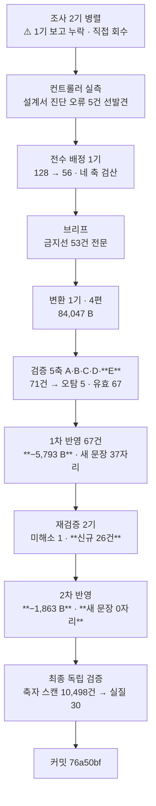

# 인수인계 (HANDOFF)

**갱신일**: 2026-08-13
**브랜치**: `main` · 최신 커밋 `76a50bf`
**작업트리**: 이 문서 · `CHANGELOG.md` · 설계서만 미커밋 / stash 없음
**발행본**: **112편** (`ai-agent` 51 · `rag` 25 · **`agentic-coding` 30** · 기타 6) · sitemap **173 URL**

---

## 1. 이번 세션에서 한 일

**`agentic-coding` B8을 발행했다(Q1~Q4, `agentic-coding-qna` 시리즈 신설).**
**그리고 B7이 경고한 「자기 중복」 위험이 실제로 40건으로 터졌다 — 검증 축을 신설해서 잡았다.**



**축 E 하나가 40건을 냈다** — 나머지 4축을 합친 것보다 많다.

| 단계 | 산출 |
| --- | ---: |
| 변환 4편 | 84,047 B · 문항 56 · 표 34 |
| 검증 5축 | 지적 **71건** (오탐 5 · 유효 66 + 컨트롤러 신규 1) |
| 1차 반영 | 반영 59 · 부분반영 6 · 판단변경 2 · **반박 0** · 새 문장 37자리 · **−5,793 B** · 표 34→18 |
| 재검증 2기 | 미해소 **1** · 부분해소 6 · **신규 26건**(1기 8 + 2기 18) |
| 2차 반영 | 순수 삭제 17 · 좁히기 치환 17 · **새 문장 0자리** · **−1,863 B** · **구조 완전 불변** |
| 최종 | **76,391 B · 문항 56 · 표 18** |

**편별 최종**: Q1 `setup` 23,709 · Q2 `extensions` 14,365 · Q3 `agent-design` 16,307 · Q4 `governance` 22,010.

### ⚠️ 검증 축 E를 신설했다 — B7의 경고가 실현됐다

B7이 *"이 설계가 만든 편들끼리의 중복은 검사하는 축 자체가 없었다"*를 발견했고,
**B8은 앞 7개 배치 내용을 Q&A로 다시 다루므로 그 위험이 최대**였다. 그래서 5번째 축을 세웠다.

| 축 | 무엇을 보는가 | 지적 | 티어 |
| :---: | --- | ---: | --- |
| A | 쓰여 있는데 **틀린** 것 | 12 | opus |
| B | 쓰여 있는데 **원문에 없는** 것 | 10 | opus |
| C | **없는** 것 | 8 (오탐 4) | opus |
| D | **실행**하면 나오는 것 | 0 | sonnet |
| **E** | **기발행 26편과의 중복** ← **신설** | **40** | opus |

> **축 E를 신설하지 않았으면 40건이 통째로 발행됐다.**
> **중복-완전 23 · 중복-부분 17.** Q&A가 진입점이 아니라 **사본**이 될 뻔했다.

#### 축 E가 뽑은 반복 실패 형태 3종

| 형태 | 건수 | 설명 |
| --- | ---: | --- |
| **표 전치·병합 복제** | 7 | 행과 열을 바꾸거나 열을 합쳐 옮긴다. **겉보기 표가 달라 자체 정리처럼 보이지만 셀이 같다** |
| **열화 복제** | 4 | 기발행본이 표 아래 달아 둔 **오독 방지 단서를 떼고** 값만 옮긴다. **원본이 막아 둔 오독을 다시 연다 — 중복이 아니라 정확성 문제다** |
| **링크하고도 복제** | 다수 | 링크를 걸어 놓고 표를 통째로 옮겼다 |

### 오류 유형 추이

| 유형 | B4 | B5 | B6 | B7 | **B8** |
| --- | ---: | ---: | ---: | ---: | ---: |
| **설계서 진단 오류** | 6 | 7 | 0 | 0 | **29** ← 최다 |
| 컨트롤러 브리프 오류 | — | 2 | 2 | 2 | **3** |
| 조사 에이전트 오류 | — | — | 5+ | 1 | **1** (L번호 20건 −1) |
| 원본 내부 모순 신규 | 1 | 2 | 3 | 1 | **1** |
| **재검증 신규 결함** | 7 | 7 | 8 | 13 | **26** ← 최다 |
| 검증 지적 (오탐 제외) | — | — | — | 30 | **67** ← 최다 |

> **설계서 진단 오류 29건은 설계서가 나빠져서가 아니다.**
> B1~B7은 §4-1(**편별 분할표**)을 받았고 **B8은 §7(문항 수급 표 하나)만** 받았다.
> **설계 밀도가 낮은 배치였고 오류는 그 빈 자리에서 나왔다.** 클러스터 구성 14건 · 편 배정 5건이 그 대가다.
> **B9도 같은 위험을 갖는다 — §4-1 같은 상세가 없다.**

### ⚠️ 이번 배치 최상위 결함 — **검증자의 처방 문안이 결함을 만들었다**

`governance:56`에 들어간 문장이 축 E가 *"이렇게 고쳐라"*고 준 처방 문안이었는데,
그것이 **기발행 `scaling-routing-collapse:137`의 연속 30자 축자**였다. 원본 `07`에 grep **0건**이다.
전제절(「L1~L3는 넓어지지만」)이 떨어져 **같은 파일 용어표와 정면 모순**까지 됐다.

> **판정자·검증자·반영자 셋이 같은 맹점을 공유했다.**
> 서브에이전트를 나누는 목적이 맹점을 깨는 것인데 **처방 단계에서는 축이 나뉘지 않는다.**
>
> **원인**: 중복을 찾으려 기발행본을 정독한 검증자가 「이 자리를 어떻게 채울까」를 생각하는 순간
> **다시 기발행을 참조한다.** 2차 반영자의 진단이다.
>
> ### 처방 채택 전 3검사 — 상설 절차로 삼는다
>
> ① 그 문자열을 **기발행 전편에 grep** ② **원본에 근거가 있는지** ③ **전제절·단서가 떨어지지 않았는지**
> **2차 반영이 이 검사로 검증자 처방 9건 중 8건을 버렸다.**

---

## 2. 다음 세션이 이어받을 것

### 최우선: B9 착수 (지식 지도 1편 — 마지막 배치)

**읽을 것**: [`docs/superpowers/plans/2026-08-08-agentic-coding-category-split-design.md`](docs/superpowers/plans/2026-08-08-agentic-coding-category-split-design.md)
— **§5-1·§5-4·§7-1·§7-3·§7-4·§9·§11·§12-3에 B8 정정 블록이 있다. 그것부터 읽어라.**

| 배치 | 대상 | 편 | 편수 | 상태 |
| ---: | --- | --- | ---: | --- |
| ~~B1~~ | ~~`01`(축약) + `02`~~ | ~~1~5~~ | ~~5~~ | ✅ (`388519e`) |
| ~~B2~~ | ~~`04`~~ | ~~9~11~~ | ~~3~~ | ✅ (`f4b9c30`) |
| ~~B3~~ | ~~`05`~~ | ~~12~14~~ | ~~3~~ | ✅ (`cf948a1`) |
| ~~B4~~ | ~~`03` + `team-productivity`~~ | ~~6~8, 26~~ | ~~4~~ | ✅ (`a568c2e`) |
| ~~B5~~ | ~~`07`~~ | ~~15~18~~ | ~~4~~ | ✅ (`2fc5c9f`) |
| ~~B6~~ | ~~`08`(개발축)~~ | ~~19~21~~ | ~~3~~ | ✅ (`06166e9`) |
| ~~B7~~ | ~~`09`~~ | ~~22~25~~ | ~~4~~ | ✅ (`909c476`) |
| ~~B8~~ | ~~Q&A~~ | ~~Q1~Q4~~ | ~~4~~ | ✅ **완료** (`76a50bf`) |
| **B9** | **지식 지도** | — | **1** | **다음 — 마지막** |

### B8 실제 산출 — 설계서 원안과 달라진 것

| 편 | slug | seriesOrder | 문항 | 최종 B |
| :---: | --- | ---: | ---: | ---: |
| Q1 | `agentic-coding-qna-setup` | 1 | 17 | 23,709 |
| Q2 | `agentic-coding-qna-extensions` | 2 | 12 | 14,365 |
| Q3 | `agentic-coding-qna-agent-design` | 3 | **10** | 16,307 |
| Q4 | `agentic-coding-qna-governance` | 4 | 17 | 22,010 |

**설계서 예상은 편당 ~18~22문항이었고 실측은 10~17이다.** 중복이 예상보다 훨씬 컸다.
**Q3가 10문항으로 최소인데 사용자 승인으로 병합하지 않았다** — 주제 정합성이 우선이고, KB는 16,307로 하한을 넉넉히 넘는다.

### ⚠️ B9 고유 사항

| # | 사항 | 근거 |
| ---: | --- | --- |
| 1 | **설계서에 B9의 상세 설계가 없다** | §9는 「참조 52곳이 전부 앞 배치를 가리킨다」 한 줄뿐이다. **B8이 같은 조건에서 진단 오류 29건을 냈다. 착수 전 원본 `00`을 전수 실측하라** |
| 2 | **대조 대상이 30편으로 늘었다** | 지식 지도는 **전 편을 가리키는 글**이라 축 E(기발행본 중복)의 위험이 B8보다 크다 |
| 3 | **`00 §4` 교차참조표의 3차 열을 믿지 마라** | 설계서 §5-5. 기준표로는 쓰되 3차 열은 별도 검증 |
| 4 | **`00 §5`·`§6`은 발행하지 않는다** | 설계서 §7-5. §5는 금칙어 덩어리(PDF 158·PPTX 19·MD 241), §6은 화행 그 자체 |
| 5 | **`06` 차단선이 B9에도 걸린다** | 지식 지도는 12편 전체를 가리키므로 **`06`을 가리키는 노드를 반드시 제외**하라. B8에서 `10 §3` 라우팅 표의 `06` 행을 뺐다 |
| 6 | **링크 허브 글이라 죽은 링크 위험이 최대다** | 최종 검증에서 링크 실재를 **전건** 확인하라 |

### 확정된 결정 (다시 묻지 마라)

| 사안 | 결정 |
| --- | --- |
| **분량 상한** | **없다. 목표만 준다.** §7-3의 「상한 25KB」는 금지선 13과 충돌한다. **B8은 상한을 주지 않았고 13.3KB 미만도 나오지 않았다** |
| **시리즈 페이지** | 없다. `series`는 frontmatter 메타데이터일 뿐 라우트를 만들지 않는다 |
| **frontmatter 필드** | `title`→`description`→`category`→`tags`→`date`→`updated`→`series`→`seriesOrder`→`featured`→`draft`→`source` — **11개.** 없으면 빌드 실패 |
| **`source` 값** | `"AI 에이전트 실무 과정"` (편26만 예외로 비움) |
| **`ai-agent` 태그** | **8편.** 「주제가 에이전트 자체인 편」에만 단다 — **편수 상한이 아니다.** B8에서 Q3에 달아 8편이 됐다 |
| **`06`·`08 §4~§8·§10`** | **범위 밖. 손대지 마라** (금지선 8) |

### B9 브리프에 반드시 넣을 것

**B1~B7이 준 50건 + B8이 준 아래 6건.**

| # | 추가할 지시 | 근거 |
| ---: | --- | --- |
| **51** | **문항·항목 표의 「근거」 열은 그 원본 파일 안에서 실재를 확인하라** | `05 §10-1` L1004의 근거 열 「자동화 등급 구분」이 `05` 안에 없다. **합계 검산도 행간 대조도 못 잡는다** |
| **52** | **원본이 자기 출처를 밝힌 문장을 검증 없이 믿지 마라** | `10` L5의 「`01`~`09` 9종 취합」이 거짓이었다. **`06`도 흡수돼 있었고 설계서가 그 자기 서술을 그대로 채택했다** |
| **53** | **답을 쓰기 전에 그 주제의 기발행본을 먼저 읽고, 겹치는 부분은 링크로 넘겨라** | 축 E 40건의 원인 |
| **54** | **검증자·재검증자의 처방 문안을 그대로 붙여넣지 마라. 처방도 검증 대상이다** | §1의 최상위 결함. **3검사**: 기발행 grep · 원본 근거 · 전제절 소실 |
| **55** | **본문을 지웠으면 그 편의 「용어 정리」·「핵심 판정 기준 정리」 표를 다시 훑어라** | 1차 반영이 본문 표 16개를 지우면서 이 표들을 **한 번도 열지 않았다.** 축자 복제가 거기서 살아남았고 **두 재검증이 독립적으로 같은 곳에 도달**했다 |
| **56** | **표·수치를 지울 때도, 끼워 넣을 때도 그것을 가리키는 지시어를 함께 찾아라** | 지울 때 6자리 · **삽입이 선행사를 빼앗은 것 1자리.** `grep`으로 안 잡힌다 — 지운 문자열이 아니라 **그것을 가리키는 지시어**이기 때문 |

### 진행 방식 — 검증된 절차

```
1단계  분할 설계 → 승인                                    ← 완료
2단계  배치로 나눠 변환, 배치마다 커밋·보고                  ← B1~B8 완료, B9만 남음
3단계  구현 미참여 에이전트가 5축 독립 검증
4단계  지적 반영 → 재검증 2기 → 2차 반영 → 최종 독립 검증 → 커밋
```

**검증은 이제 5축이다.** 나누는 기준은 주제가 아니라 **결함이 드러나는 방식**이다.

| 축 | 무엇을 보는가 | 왜 별도 축인가 | 티어 |
| :---: | --- | --- | --- |
| A | 쓰여 있는데 **틀린** 것 | grep으로 안 잡힌다. 세면 0건이라 자동 검증을 통과한다 | opus |
| B | 쓰여 있는데 **원문에 없는** 것 | 원문과 나란히 놓아야만 보인다 | opus |
| C | **없는** 것 | **원본 인벤토리를 먼저 만들고** 그 목록을 들고 발행본을 검색한다 | opus |
| D | **실행**하면 나오는 것 | 종료코드는 객관적이다 | sonnet |
| **E** | **기발행본과의 중복** | **셀을 열어야만 보인다.** 개수 일치도 이름 차이도 증거가 못 된다 | opus |

> ### ⚠️ 검증자에게 브리프도 배정표도 변환 보고서도 주지 마라 — B5에서 확립, B6·B7·B8에서 재확인
>
> **B8에서 5축이 서로 모른 채 71건을 냈다.** 대가는 **오탐 5건**이고 전부 축 C에서 나왔다 —
> 브리프를 못 받아 `06` 배제와 의도적 폐기를 몰랐기 때문이다. **이건 설계된 대가다.**
>
> **다만 오탐으로 판정할 때도 지적이 건드린 자리를 한 번 더 열어라.**
> B8에서 C-1·C-2를 오탐 판정하며 연 자리에서 **진짜 결함 1건(ADJ-1)**이 나왔다. **B7에 이어 2배치 연속이다.**
>
> **축 C는 반드시 원본을 먼저 읽게 하고, 부정 명제는 검색어를 바꿔 두 번 돌리게 하라.**

**재검증은 2기로 나눈다.** 1기는 **「사라졌는가」**, 2기는 **「새로 생겼는가」**.
**역할을 명확히 갈라라** — B8에서 1기는 해소 판정과 링크 전건 검증, 2기는 전칭·배타 표현 전수 추출을 했다.

| 배치 | B3 | B4 | B5 | B6 | B7 | **B8** |
| --- | ---: | ---: | ---: | ---: | ---: | ---: |
| 재검증 신규 결함 | 5 | 7 | 7 | 8 | 13 | **26** |

**6배치 연속 증가다.**

> **2기의 방법이 효과적이다** — 반영자가 기록한 **새 문장 전량**에서 전칭·배타 표현을 전수 추출해 대조한다.
> B8에서 손댄 60자리에서 **47개를 추출해 17개가 결함(36%)**이었다.
> **반영자에게 「새로 쓴 문장 전량과 각각의 검증 가능한 주장」을 기록시켜라. 목록이 없으면 표적이 없다.**

> ### ✅ **「지우는 것이 기본 처방이다」를 1차 브리프에 미리 주면 방향이 뒤집힌다**
>
> | | B7 1차 | B7 2차 | **B8 1차** | **B8 2차** |
> | --- | ---: | ---: | ---: | ---: |
> | 바이트 | **+7,943** | −1,235 | **−5,793** | **−1,863** |
> | 새 문장 | 30자리 | **0자리** | 37자리 | **0자리** |
> | 신규 결함 | **13건** | 0건 | 18건 | 최종 검증 0건 |
>
> **유일한 차이는 그 처방을 1차에 줬느냐다.** B7은 2차에만 줬다.
> **2차 반영은 두 배치 연속으로 「구조 불변 + 새 문장 0자리」를 달성했다** — H2·표·펜스 수치가 1차와 전부 동일하다.

**최종 독립 검증을 한 번 더 돌려라.** 2차 반영자의 자기 검증은 검증이 아니다.
B6에서 컨트롤러 실측 오류 1건, B7에서 브리프의 「frontmatter 12필드」 오기를 잡았다.
**B8에서는 축자 복제 자동 스캔을 새로 넣었다 — 아래 §7 참조.**

---

## 3. ⚠️ 설계서 정정 — B9 이후에 영향

**B8에서 29건을 정정했다. 전부 설계서 본문에 ⚠️ 블록으로 삽입돼 있다.**

| 절 | 정정 | 뒤 배치 영향 |
| --- | --- | --- |
| **§7-1** | ⚠️ **클러스터 12개는 본문 질문 축으로만 만들어졌다.** 지뢰·역질문·답변카드·**파일 내 교차** 축 미계상. 실측 **24개**, 최종 문항 **80 → 56**. **설계서 12개 중 정확히 맞은 것은 셋뿐**이고 **`03-10`이 C6·C10 양쪽에 이중 계상**돼 「63출현」은 실제 **62 distinct** | **집계 표는 축이 빠졌는지 먼저 물어라** |
| **§7-1** | ⚠️ **`10`은 `06`도 흡수한다.** 「`01`~`09` 취합」은 원본의 자기 서술이며 검증되지 않았다 | **B9.** 원본 자기 서술을 채택하기 전에 실측하라 |
| **§7-4** | ⚠️ **`10`의 §1·§3·§4·§8·§9가 미언급이었다.** §1에 민감정보 3행 · §3 라우팅 표 10행 · **§4 대비표 4종 중 3종이 기발행 전용 편으로 실재** | **절을 다룰 때 그 파일의 전체 H2를 먼저 세라** |
| **§7-4** | ⚠️ **역질문 4행을 별도 문항으로 실으면 4건 통째 중복.** 전부 기존 문항으로 닫힌다. 1행의 원 출처는 `08 §13-2` | — |
| **§7-3** | ⚠️ **「상한 25KB」는 금지선 13과 충돌한다.** 상한을 주지 마라 | **B9** |
| **§5-4** | ⚠️ **원본 내부 모순 신규 1건** — `05 §10-1` L1004의 **근거 열이 파일 밖을 가리킨다** | **새 형태다.** 합계 검산·행간 대조 둘 다 못 잡는다 |
| **§5-1** | ✅ **B7의 경고가 실현됐다.** 축 E 신설 → **40건** | **B9는 대조 대상이 30편이라 위험이 더 크다** |
| **§12-3** | ✅ **해소** — `01 §11` 근거 생존 3·부분 2·소멸 5. **소멸 5건 전부 다른 발행본에서 근거 확보, 문항 손실 0** | — |
| **§11** | **금지선 3건 추가** (51·52·54) | 전 배치 |

### 앞 배치 정정도 유효하다

| 배치 | 정정 위치 | 요지 |
| --- | --- | --- |
| B1 | §6-1 · §10 | 「`강의가 ~한다` 130여 개」 → **실측 32** / 팽창률 1.20 → 1.76 |
| B2 | §5-3 ①②③ | 발행본 열거 기준 · MCP 인과 · 발행본 시점 |
| B3 | §6-5 8번 | `05 §11`은 출처 대장이 아니라 **면접 화법 가이드** |
| B4 | §6-3·§6-4·§6-5·§9-1 | 편26 항목 3건 · 시점 기준일 `2026-07-26` · `Plan Mode` 링크 불가 |
| B5 | §4-1·§4-4·§5-4·§5-5·§6-6·§10·§11 | `seriesOrder` · 용어표 개념 기준 · 금지선 17 |
| B6 | §4-1·§5-4·§8-2·§8-3·§9-1·§10·§11·§12-3·§12-4 | `08` 내부 모순 3건 · 목록 전문 첨부 · §12-3 해소 |
| B7 | §4-1·§4-3·§5-1·§5-4·§6-5·§9-1·§10 | **§5-1 모집단 한계** · 도식 85→84 · `09` 절간 참조 |

---

## 4. 미해결 과제

| # | 항목 | 상태 |
| ---: | --- | --- |
| 1 | **mermaid 노드 라벨 우측 1~9px 클리핑** | `foreignObject` 폭 문제. **전역 렌더링 이슈로 별건 처리 필요** |
| 2 | **FR-1.4 스크롤스파이 미구현** | 기존 위키에도 없어 신규 후퇴는 아니다 |
| 3 | **메인 페이지 LCP 6.6초** | Lighthouse 77점. 블로그 도입 이전에도 77점이었다 |
| 4 | **싱글톤 태그 재측정** | §13-3 목표는 「2차 신규 싱글톤 0」. **B8은 신규 태그 0개**(12종 전부 기존 편에 실재). 2차 전체를 마친 뒤 재측정 |
| 5 | **`cto_learning_roadmap` Q1·Q3** | 발행 가능 판정을 받았으나 미변환 |
| 6 | **어휘 81종 중 0편 태그 30종** | 목록은 설계서 §8-3. **B8 브리프에 전문을 첨부해 사용 0건** — B9도 첨부하라 |
| 7 | **훅 차단 채널이 세 자료에서 갈린다** | 편4(**표준 에러**) · 편11(**stdout JSON `reason`**) · `09 §2-4`(원본 자체 충돌). **B8은 네 번째로 합류하지 않았다** — Q2가 채널 이름 없이 「차단 사유를 함께 돌려준다」로만 적어 회피했다. **편11 L283의 「두 자료」는 여전히 낡았다** |
| 8 | **원본 `04 §8-2` 「3대 구성 요소」인데 표는 4행** | 원본에서 이월된 불일치 |
| 9 | **원본 `05` 내부 수치 불일치** | L56 도식 `frontmatter 5+4 필드` ↔ L145 표 `핵심 5 + 확장 5` |
| 10 | **`05 §3-2` 제품 결함 3건의 현재 유효성** | 세 동작이 지금도 그런지 미확인 |
| 11 | **무귀속 판정 잔존 2건** | 편14 L232 · 편13 L235 |
| 12 | **B1 발행본 편2~5의 `2026-04` 표기 재확인** | 「강의 시점」인지 「문서 기준일」인지 구분되지 않았다 |
| 13 | **편7 `feedback` 예시가 원본 MEMORY.md 예시와 소재 겹침** | 의도적으로 두었다 |
| 14 | **편8 용어표 「멀티턴 대화」 본문 0회** | 개념 기준 확정으로 재판정 대상 |
| 15 | **기발행본의 축약 용어표 문자열 0회 행 미점검** | **B8에서 `reversibility-before-permission` L33 `SSH 키` 행이 본문 §6-4 부재 상태로 확인됐으나 고치지 않았다**(지시 46 — 기발행본 수정은 새 검증 표면) |
| 16 | **편25가 발행본 최대 (39,676 B)** | **렌더링·ToC·로딩 체감 미확인.** B8 최대는 23,709 B로 부담이 없다 |
| 17 | **`08 §12` 임계값 3건이 미발행 절 근거** | CTR 1.5%/1%(§5) · OCR 80%·「병렬 절대 금지」(§8). **`ai-transformation`에서 §5·§8 발행 시 교차 링크로 해소** |
| 19 | **`08 §12-1` 원본 모순을 발행본이 병기로만 처리** | 원본이 읽기 전용이라 해소 불가 |
| 20 | **`Supabase` 탈브랜딩 일관성 미대조** | B7 신규. 시리즈 안에서는 일관되나 다른 카테고리와 대조하지 않았다 |
| 21 | **앞 배치들의 발행본 표 수치가 인용블록 표 결함의 영향을 받았을 수 있다** | B7 신규. **재확인 미실시** |
| 22 | **`industry-claude-md-templates.md:131` 「앞 절반」이 짝 없이 남았다** | B7 신규. 문법 오류도 지시어 붕괴도 아니어서 비차단 |
| **23** | **축자 복제 자동 스캔이 상설화되지 않았다** | **B8 신규.** 최종 검증에서 1회성 스크립트로 돌렸다(`lcs_scan.py`, 스크래치패드). **`scripts/`에 넣고 `npm run` 훅으로 걸면 매 배치 자동 검사가 된다** |
| **24** | **20~32자 축자 30건을 「허용」으로 판정했다** | **B8 신규.** 용어 정의문 6 · 원 자료 인용 2 · 고유명사 나열 3 · 짧은 서술 조각 19. **판정 근거는 §6-4에 있으나 임계값(20자)의 타당성은 검증하지 않았다** |
| **25** | **재검증 1기가 diff baseline 없이 판정했다** | **B8 신규.** 4편이 미커밋 신규 파일이라 `git diff`로 반영 전후를 비교할 수 없었다. **다음 배치는 변환 직후 커밋하고 반영을 별도 커밋으로 하면 재검증이 diff를 쓸 수 있다** |
| **26** | **`10 §5` 수치 6종의 출처 표기가 편마다 갈릴 수 있다** | **B8 신규.** 축 A가 「Google/MIT 2025 연구」 뭉갬 1건, 축 C가 「~4배」 출처 누락 1건을 각각 잡았다. **두 축이 독립적으로 같은 유형에 도달했다는 것은 더 있을 수 있다는 뜻이다** |

### `ai-transformation`으로 이월된 위험 5건

| # | 위험 |
| ---: | --- |
| 1 | `06 §4-6`·`§8-7` **정량 개선 수치 9행.** 원본이 세 겹으로 방어하는데 발행 제외 절 + `강의` 제거로 셋 다 사라진다 |
| 2 | **`06`은 발행본과 서사 방향이 반대다.** 연결 문장이 없으면 모순으로 읽힌다 |
| 3 | `06 §2-8` ↔ `loop-antipatterns-and-checklist` 셀 단위 대조 **미실시** |
| 4 | **`08 §12` 임계값 3건** (위 17번) |
| **5** | **`06 §11` L1008이 자기 본문을 「§2-7 HITL 3등급」이라 부르면서 답변 앵글은 「4등급」이라 적는다.** B8 신규 발견 — 원본 내부 모순 |

---

## 5. README/문서 갱신 필요 (이번 세션에서 고치지 않음)

**열한 번째 이월이다.** README는 2026-08-07(`7f28866`) 이후 손대지 않았고 그 사이 **29커밋**이 쌓였다.

| 낡은 부분 | 왜 낡았나 | 확인할 진실원 |
| --- | --- | --- |
| 프로젝트 구조 트리 | `content/`·`scripts/`·`tests/` 없음 | 실제 디렉터리 |
| 기술 스택 | Vitest·react-markdown·mermaid 없음 | [`package.json`](package.json) |
| 기능 설명 | 블로그 **112편·4카테고리**가 통째로 없음 | [`content/blog/`](content/blog/) |

**고치지 않은 이유**: 기능 설명·아키텍처 서술은 여러 소스를 교차 대조해야 정확한데, 핸드오프는 세션 끝이라 컨텍스트가 가장 얕다.

### ⚠️ 환경변수 검사 신호는 **오탐이다. 고치지 마라**

`LANGCHAIN_PROJECT`·`LANGCHAIN_TRACING_V2`·`OPENAI_API_KEY`·`TAVILY_API_KEY`·`UPSTAGE_API_KEY`
— **전부 `content/blog/**/*.md`의 코드 예제 안**이다. 정적 export 사이트라 런타임 환경변수가 없다.
실제로 쓰는 것은 [`lib/site.ts`](lib/site.ts)의 `NEXT_PUBLIC_SITE_URL` **하나**다.

---

## 6. 알아둘 함정 — 이번 세션에서 새로 배운 것

직전까지의 함정은 [요구사항 §14·§15](docs/superpowers/specs/2026-08-07-tech-blog-requirements.md)와 설계서 §13, `CHANGELOG.md`의 B1~B7 항목에 있다. **아래는 B8에서 새로 나온 것이다.**

### 6-1. ⚠️ 검증자의 처방 문안이 결함을 만든다 — 이번 배치 최상위

**중복을 찾으려 기발행본을 정독한 검증자가 「이 자리를 어떻게 채울까」를 생각하는 순간 다시 기발행을 참조한다.**

| | |
| --- | --- |
| 무엇이 일어났나 | 축 E 처방 문안이 기발행본 **연속 30자 축자**. 원본에 grep 0건 |
| 왜 통과했나 | **판정자·반영자가 처방을 검증 대상으로 놓지 않았다** |
| 처방 | **3검사** — ①기발행 전편 grep ②원본 근거 ③전제절 소실 |
| 실효 | **2차 반영이 검증자 처방 9건 중 8건을 버렸다** |

> **서브에이전트를 나누는 목적은 맹점을 깨는 것인데, 처방 단계에서는 축이 나뉘지 않는다.**

### 6-2. 「용어 정리」·「핵심 판정 기준 정리」 표는 두 번 사각지대가 됐다

1차 반영이 본문 표 16개를 지우면서 **이 표들을 한 번도 열지 않았다.** 삭제·치환 60자리 중 조치 **0건**이다.
**두 재검증이 독립적으로 같은 곳에 도달했고**, 2차 반영이 거기서 ≥20자 축자를 **5건 더** 찾았다.

> **본문을 지웠으면 그 편의 모든 표를 다시 훑어라.**
> 구조적 요소(용어표·요약표)는 「본문」이라는 말에 포함되지 않는다고 읽힌다.

### 6-3. 지시어는 지울 때도 끼워 넣을 때도 끊긴다

| 방향 | 건수 | 예 |
| --- | ---: | --- |
| **지울 때** | 6 | 「마지막 칸이」·「세 행의 구분은」·「왼쪽은」·「앞 문항의 "7일간"」 |
| **끼워 넣을 때** | 1 | 삽입 문장이 뒤 문장의 「**원칙**」이 가리키던 선행사를 빼앗아 링크가 거짓이 됐다 |

> **`grep`으로 안 잡힌다.** 지운 문자열이 아니라 **그것을 가리키는 지시어**이기 때문이다. 삭제 diff에도 안 보인다 — 남아 있는 쪽에 있다.
> 가장 뚜렷한 예: `agent-design:17` 도입부가 「답 하나마다 **표가 붙는다**」였는데 그 표 넷을 지우자 **도입부가 거짓**이 됐다.

### 6-4. 축자 스캔은 「무엇이 겹치나」는 알려주지만 「왜 겹치나」는 못 알려준다

최종 검증의 최장 공통 부분문자열 스캔이 원시 **10,498건**을 냈다. 그중:

| 분류 | 건수 |
| --- | ---: |
| 상호 링크 제목 (`[제목](/blog/...)`) | **10,458** |
| 제목 길이가 정확히 20자라 필터를 비껴간 것 | 10 |
| **실질** | **30** |

**실질 30건도 전건 허용으로 판정했다** — 원 자료 인용 2(출처 명시) · 용어 정의문 6 · 고유명사 나열 3 · 20~32자 서술 조각 19.

> **최장 47자 항목이 이 검사의 성격을 보여준다.** 원본 `09:643`의 문장인데
> **기발행본의 제목이 바로 그 문장**이라 걸릴 수밖에 없다. 양쪽 다 원 자료를 인용했고 출처를 밝혔다.
> **같은 원전을 양쪽이 인용한 것과 한쪽이 다른 쪽을 베낀 것은 문자열만 봐서는 구분되지 않는다.**

### 6-5. 설계 밀도가 낮은 배치는 진단 오류가 폭증한다

| | B1~B7 | **B8** |
| --- | --- | --- |
| 받은 설계 | **§4-1 편별 분할표** (편마다 바이트·도식·절 배정) | **§7 문항 수급 표 하나** |
| 설계서 진단 오류 | 0~7건 | **29건** |

> **설계서가 나빠진 것이 아니라 그 자리에 설계가 없었던 것이다.**
> **B9도 같은 조건이다** — §9에 「참조 52곳이 앞 배치를 가리킨다」 한 줄뿐이다. **착수 전 원본 `00`을 전수 실측하라.**

### 6-6. 서브에이전트가 보고 없이 유휴가 된다 — 이번 세션 다수

| 배치 | 형태 | 어떻게 드러났나 |
| --- | --- | --- |
| B6 | `Write` 도구 비활성화 | 파일 부재 |
| B7 | 보고를 쓰는 응답이 API 오류로 끊김 | 파일 크기 880 B |
| **B8** | **파일은 썼으나 최종 보고 없이 유휴. 재요청도 무응답** | **파일 mtime 미갱신** |

> **컨트롤러가 파일을 직접 확인하지 않았다면 세 번 다 「완료」로 처리됐다.**
> **유휴 알림만 오고 보고가 없으면 재요청 전에 산출물의 크기와 mtime을 먼저 보라.**
> B8에서는 재요청이 무응답이었고 **남은 항목이 명령 두 줄이라 직접 하는 것이 빨랐다.**
> **재요청은 산출물이 크고 재현이 비쌀 때만 한다.**

---

## 7. 검증 명령

```powershell
cd C:\Users\aeby\vscode\withwooyong.github.io

npm test              # 36개 통과 (tests/blog/ 3파일)
npx tsc --noEmit      # 0
npm run build         # 0, [sitemap] 173개 URL, 정적 페이지 182, 발행 112편

# 금칙어 — 기대 3건 (전부 thirty-agent-catalog.md)
Select-String -Path "content\blog\agentic-coding\*.md" `
  -Pattern "면접|커닝페이퍼|암기용|화이트보드|이력서|강의|수강|Part [0-9]|CH0[0-9]|예상 질문"

# 민감정보 — 회사명·핸들은 0건 기대. 「채용」은 아래 오탐
Select-String -Path "content\blog\agentic-coding\*.md" `
  -Pattern "히츠|야나두|TVING|티빙|BTV|허우용|채용|teddylee|teddynote|argus|FASTCAMPUS|실장"

# 범위 밖 자료(`06`) 유입 — 0건이어야 한다
Select-String -Path "content\blog\agentic-coding\*.md" `
  -Pattern "완전 자동|사후 검토|사전 승인|자동화 금지|재개 조건"

# 화행 잔재(SC-12) — 오탐 많음, 문맥 판정 필수. B8에서 두 패턴 추가
Select-String -Path "content\blog\agentic-coding\*.md" `
  -Pattern "인용할 때|라고 말|수준으로 말|것이 안전|실적이 아니|반박당|의심받|감점|말해야 |말하면 안|인용 시|말하기 전에|숫자를 말"
```

> **알려진 오탐**
> - `허우용` — `out/` 기준으로 스캔하면 nav·푸터·SEO 메타가 잡힌다. **원고(`content/`) 기준으로 스캔할 것**
> - `테디노트`·`패스트캠퍼스` — `source:` 출처 표기다. **정규식은 영문만 잡는다**
> - **`채용`** — `subagent-definition-fields` · `agent-team-operations` · `agent-jd-triggers` · `scaling-routing-collapse` · `thirty-agent-catalog` · **`agentic-coding-qna-agent-design`(B8 신규)**. 전부 **에이전트가 담당하는 업무 도메인의 이름**이거나 **원 자료의 JD 비유**이며 저자의 구직 활동이 아니다
> - `이력서`·`면접` — `thirty-agent-catalog.md`의 `recruiter` 에이전트 정의
> - `실적이 아니` — 6편. 주어가 **대상의 성질**이라 서술문이며 **오히려 귀속을 명시한 좋은 문장**이다
> - `인용할 때` — `agent-team-operations.md`. 원 자료 수치 인용 지침이지 면접 화법이 아니다
>
> **판정 기준**: 문장의 주어가 **독자의 발화**면 화법, **대상의 성질**이면 서술이다.

### 태그 패싯 분포 검사 (빌드가 못 잡는다)

```powershell
Select-String -Path "content\blog\agentic-coding\*.md" -Pattern "^tags:"
```

**패싯 C가 3개 이상이면 위반.** `claude-code`·`ai-agent`·`multi-agent`·`ai-governance`·`ai-automation`·`context-engineering`·`prompt-engineering`이 전부 C다.
**`ai-agent`는 「주제가 에이전트 자체인 편」에만 단다 — 편수 상한이 아니다. 현재 8편이다.**

```bash
# ⚠️ grep '"ai-agent"'를 그냥 쓰면 category: 행에 오염된다
for f in content/blog/*/*.md; do grep -m1 '^tags:' "$f" | grep -q '"ai-agent"'; done
```

**0편 태그 30종은 설계서 §8-3에 목록이 있다. 어휘에 있어도 쓰면 안 된다 — 빌드는 막지 않는다.**
**B8은 신규 태그 0개**였다(12종 전부 기존 편에 실재) — 그래서 sitemap이 정확히 +4였다.

### 발행본 실측 — 펜스 스킵 + 인용블록 표 포함

```bash
LC_ALL=C awk '
  /^```/ { fence=!fence; fc++; next }                 # 펜스 안은 통째로 스킵
  !fence && /^## Q\. / { q++ }
  !fence && /^## / { h2++ }
  !fence && /^[ ]*>?[ ]*\|[ ]*[-:][- :|]*\|[ ]*$/ { tb++ }   # ← `> |---|---|` 도 잡는다
  END { printf "H2 %d · Q %d · 표 %d · 펜스 %d\n", h2, q, tb, fc }' <파일>
```

**⚠️ `^\|`만 보면 인용블록 안의 표를 놓친다.** **코드펜스 총 개수가 짝수인지도 세라.**
**B8 값**: Q1 H2 20·Q 17·표 8 · Q2 14·12·2 · Q3 12·10·3 · Q4 19·17·5. **펜스 전부 0.**

### ⚠️ 축자 복제 자동 스캔 — B8에서 신설. **상설화하라**

**사람이 읽어서 잡는 축자는 「낯익은 문장」뿐이다. 표준 정의처럼 보이는 42자 축자는 눈으로 안 걸린다** —
두 번의 독립 재검증과 한 번의 반영을 통과했고 2차 반영자가 스크립트를 짜서야 잡았다.

```
① 신규 편의 각 문장·표 셀을 기발행 전편과 대조
② 공백·마크다운 기호 정규화 후 연속 20자 이상 일치를 전건 추출
③ 마크다운 링크(`[제목](/blog/...)`)는 제목 문자열이 겹치므로 별도 분류
④ 판정하지 말고 양쪽 문자열과 위치를 그대로 보고 — 판정은 컨트롤러가 한다
```

**본문만 스캔하지 말고 「용어 정리」·「핵심 판정 기준 정리」 표 셀을 반드시 포함하라.**
n-gram 해싱을 써라 — 코퍼스가 660KB라 순수 DP는 비현실적이다.
스크립트는 스크래치패드에만 있다(`lcs_scan.py`). **`scripts/`로 옮기는 것이 미해결 과제 23번이다.**

### 링크·SC-10 검사 (bash)

```bash
# 내부 링크 전건 실재 확인
grep -ho '/blog/[a-z-]*/[a-z0-9-]*/' content/blog/*/*.md | sort -u | while read l; do
  cat=$(echo "$l" | cut -d/ -f3); slug=$(echo "$l" | cut -d/ -f4)
  [ -n "$slug" ] && [ ! -f "content/blog/$cat/$slug.md" ] && echo "MISSING: $l"
done

# SC-10 들어오는 링크가 0인 글
for f in content/blog/*/*.md; do
  s=$(basename "$f" .md)
  n=$(grep -rl "/$s/" content/blog/ --include=*.md | grep -v "/$s.md" | wc -l)
  [ "$n" -eq 0 ] && echo "들어오는 링크 0: $s"
done
```

---

## 8. 소스 위치

| | 경로 |
| --- | --- |
| 원본 (읽기 전용, **수정 금지**) | `C:\Users\aeby\vscode\yanadoo-exit\shared\knowledge\` |
| 발행본 | [`content/blog/<카테고리>/<slug>.md`](content/blog/) — **112편** (`agentic-coding` **30편**) |
| 카테고리 정의 | [`content/blog/categories.ts`](content/blog/categories.ts) — 12개 등록, **4개 발행** |
| 태그 통제 어휘 | [`content/blog/tags.ts`](content/blog/tags.ts) — 81종. **목록 밖이면 빌드 실패** |
| frontmatter 검증 | [`lib/blog/frontmatter.ts`](lib/blog/) — 형식 오류 먼저, 어휘 오류 나중. tags 최대 6개 |
| 요구사항 | [`docs/superpowers/specs/2026-08-07-tech-blog-requirements.md`](docs/superpowers/specs/2026-08-07-tech-blog-requirements.md) — §13·§14·§15 |
| **`agentic-coding` 설계서** | [`docs/superpowers/plans/2026-08-08-agentic-coding-category-split-design.md`](docs/superpowers/plans/2026-08-08-agentic-coding-category-split-design.md) — **§5-1·§5-4·§7-1·§7-3·§7-4·§9·§11·§12-3에 B8 정정 블록** |
| `ai-agent` 설계서 (템플릿) | [`docs/superpowers/plans/2026-08-08-ai-agent-category-split-design.md`](docs/superpowers/plans/2026-08-08-ai-agent-category-split-design.md) |
| **B1 보고서 5건** | [`docs/superpowers/reports/`](docs/superpowers/reports/) — 변환·실행검증·리뷰2·반영 |

> **B2 7건 · B3 13건 · B4 11건 · B5 10건 · B6 12건 · B7 10건 · B8 14건은 스크래치패드에만 있고 커밋하지 않았다.** 세션이 끝나면 사라진다.
> 핵심은 이 문서 §3·§6과 `CHANGELOG.md`, 그리고 **설계서 정정 블록**에 옮겨 적었다.
>
> **B8 보고서 구성** — `B8-question-inventory.md` · `B8-published-inventory.md` · `B8-controller-findings.md` ·
> `B8-assignment.md` · **`B8-assignment-final.md`(62KB, 배정 진실원)** · `B8-brief.md` · `B8-conversion-report.md` ·
> `B8-verify-{A,B,C,D,E}.md` · **`B8-adjudication.md`(판정표)** · `B8-fix1-report.md` · `B8-recheck-{1,2}.md` ·
> `B8-fix2-report.md` · `B8-final-verify.md` + **`lcs_scan.py`(축자 스캔 스크립트)**.
>
> **가장 값이 큰 것은 `B8-assignment-final.md`(전수 배정 방법론)와 `lcs_scan.py`(축자 스캔)다.**
> **후자는 `scripts/`로 옮겨 상설화할 것 — 미해결 과제 23번.**
