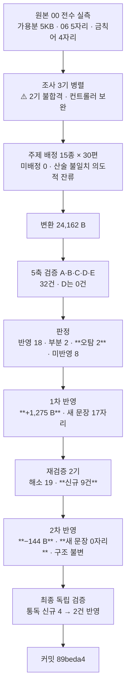

# 인수인계 (HANDOFF)

**갱신일**: 2026-08-13
**브랜치**: `main` · 최신 커밋 `89beda4`
**작업트리**: 이 문서 · `CHANGELOG.md` · 설계서만 미커밋 / stash 없음
**발행본**: **113편** (`ai-agent` 51 · `rag` 25 · **`agentic-coding` 31** · `search-engineering` 6) · sitemap **174 URL**

---

## 1. 이번 세션에서 한 일

**`agentic-coding` B9(지식 지도편)를 발행해 카테고리를 닫았다. 31편으로 설계서 §10 검산값과 일치한다.**
**그리고 이 배치는 앞 8개와 성격이 달랐다 — 번역이 아니라 재작성이었다.**



| 단계 | 산출 |
| --- | --- |
| 변환 | 24,162 B · H2 6 · 표 14 |
| 5축 검증 | **32건** (A 8 · B 6 · C 8 · **D 0** · E 7 · 컨트롤러 3) |
| 판정 | 반영 18 · 부분 2 · **오탐 2** · 미반영 8 · 흡수 1 |
| 1차 반영 | **+1,275 B** · 새 문장 **17자리** · **반박 0** · 표 14→13 |
| 재검증 | 1기 **해소 19 · 미해소 0** / 2기 **신규 9건** (전칭 71 추출 → 결함 6, **8.5%**) |
| 2차 반영 | **−144 B** · **새 문장 0자리** · **구조 완전 불변** · 「추가」 처방 0건 |
| 최종 검증 | 통독 신규 4건 → **반영 2 · 미반영 2** · 축자 복제 산문·표 셀 **0건** |
| **최종** | **25,311 B · H2 6 · 표 13 · 펜스 4** |

### ⚠️ B9는 번역이 아니라 재작성이었다 — 이것이 이 배치의 전제다

원본 `00-개요-지식맵`은 **129줄·6.7KB**이고 §5·§6이 발행 제외라 **가용분이 약 5KB**다.
그런데 남은 §0~§4에서도 **그대로 옮길 수 있는 셀이 사실상 없었다.**

| 원본 자리 | 왜 못 쓰나 |
| --- | --- |
| §2 「원본 범위 `Part N`」 열 | 금칙어 `Part [0-9]` |
| §2 「분량 570줄」 열 | **원본 파일의 줄 수.** 발행본은 30편으로 재편돼 대응하지 않는다 |
| §2 「면접 우선순위」 열 · §3 「면접 직전」 행 · §1 노드 `10` | 금칙어 **4자리** |
| §1 노드 · §2 행 · §3 행 · §4 **2칸** | **`06` 참조 5자리** — 그중 하나가 **1차 열** |
| §0 용어표 | 사용자 결정 — 기발행 30편이 이미 각자 용어표를 갖는다 |

**원본에서는 골격만 빌리고 내용은 발행본 30편에서 다시 만들었다.**

> **뒤 카테고리 함의**: `rag`·`search-engineering`에도 같은 성격의 「지도편」이 있다.
> **원본 개요 파일을 맡을 때는 착수 전에 「발행 가용분이 몇 KB인가」를 먼저 재라.** 배율 지표는 이런 배치에 적용되지 않는다.

### ✅ 세 축이 서로 모른 채 같은 자리에 도달했다

| 축 | 무엇을 봤나 |
| :---: | --- |
| **B** | 주제 10 실사가 `qna-governance`·`thirty-agent-catalog`를 빠뜨렸다 |
| **A** | 주제 10의 3차 배정이 미배정 편들보다 얕다 |
| **E** | `qna-agent-design`의 비중을 축소 서술했다 |

**셋 다 브리프를 받지 않았고 서로의 산출물을 읽지 않았다.** 축을 나눈 설계가 작동한 가장 강한 신호다.

### ⚠️ 최상위 결함 — **귀속이 반대로 뒤집혔다**

원본 `00 §4`가 **이미** *"깊이 순으로 정리한다"* + `1차(가장 깊음)/2차/3차` **3열 표**를 갖고 있는데,
이 글이 그것을 **자기 창작이라 선언**했다. 기발행 `agentic-coding-qna-setup:39`는 같은 축에 대해
*"원 자료가 같은 형태의 안내표를 갖고 있어"* 라고 밝혀 두었으므로 **정반대 귀속**이었다.

> **1차 반영이 이 자리를 두 번 썼다.** 첫 문안이 「깊이 순서는 이 글의 판정이다」였는데
> **원본을 직접 열어 보고** 같은 종류의 오귀속을 반복할 뻔한 것을 발견해 재작성했다.
>
> **최종**: 「주제 열다섯 중 **열하나와 깊이 3단은 원 자료의 교차 참조표에서 받았고**, 나머지 넷을 세우고 서른 편을 배정한 것이 이 글의 판정이다」
>
> ### 금지선 19의 역방향이다
> 「원본이 자기 출처를 밝힌 문장을 검증 없이 믿지 마라」의 반대 —
> **이 글이 자기 창작이라 주장한 것이 실은 원본에 있었다.** 검증자도 컨트롤러도 못 잡고 **반영자가 원본을 다시 열어서** 잡았다.

### 오류 유형 추이

| 유형 | B5 | B6 | B7 | B8 | **B9** |
| --- | ---: | ---: | ---: | ---: | ---: |
| 설계서 진단 오류 | 7 | 0 | 0 | 29 | **4** |
| **컨트롤러 브리프 오류** | 2 | 2 | 2 | 3 | **1** (frontmatter 규격) |
| 조사 에이전트 오류 | — | 5+ | 1 | 1 | **2** (인벤토리·포인터 매핑 불합격) |
| 검증 지적 (오탐 제외) | — | — | 30 | 67 | **30** |
| **재검증 신규 결함** | 7 | 8 | 13 | 26 | **9** ← 6배치 연속 증가가 **끊겼다** |
| 최종 검증 신규 | — | 1 | 1 | 0 | **4** |

> **재검증 신규 결함이 26 → 9로 꺾였고 전칭 결함률은 36% → 8.5%다.**
> **유일하게 달라진 것은 「지우는 것이 기본 처방이다」를 1차 브리프에 명시적 우선순위표로 준 것이다.**

---

## 2. 다음 세션이 이어받을 것

### `agentic-coding`은 끝났다. 다음은 새 카테고리다

| 카테고리 | 상태 |
| --- | --- |
| `agentic-coding` | ✅ **완료 31편** (B1~B9) |
| `ai-agent` | 51편 발행 (별도 설계서 존재) |
| `rag` | 25편 발행 |
| `search-engineering` | 6편 발행 |
| **`ai-transformation`** | **미착수.** `06` 전량 + `08 §4~§8·§10`이 여기로 이월됐다 (설계서 §2-1) |

**착수 전에 읽을 것**: 아래 §4의 「`ai-transformation`으로 이월된 위험 6건」과 설계서 §12-4.

### 확정된 결정 (다시 묻지 마라)

| 사안 | 결정 |
| --- | --- |
| **분량 상한** | **없다. 목표만 준다.** 하한 13.3KB만 지킨다(금지선 11·13) |
| **시리즈 페이지** | 없다. `series`는 frontmatter 메타데이터일 뿐 라우트를 만들지 않는다 |
| ⚠️ **frontmatter 필드** | **11개가 전부 필수인 것이 아니다.** `lib/blog/frontmatter.ts:77` 실측 — **`series`·`seriesOrder`·`updated`·`source`는 선택 필드**다. 값이 있으면 `str()`이 **빈 문자열을 거부**하므로 **`series: ""`는 반드시 빌드를 죽인다. 독립편은 필드 자체를 생략한다** |
| **`source` 값** | `"AI 에이전트 실무 과정"` (편26만 예외로 비움) |
| **`ai-agent` 태그** | **8편.** 「주제가 에이전트 자체인 편」에만 단다 — **편수 상한이 아니다.** B9는 달지 않았다 |
| **태그 패싯** | 3~5개, **같은 패싯 최대 2개.** 패싯 C(AI/LLM)가 3개 이상이면 위반 |

### 진행 방식 — 9배치로 검증된 절차

```
1단계  분할 설계 → 승인
2단계  배치로 나눠 변환, 배치마다 커밋·보고
3단계  구현 미참여 에이전트가 5축 독립 검증
4단계  판정 → 1차 반영 → 재검증 2기 → 2차 반영 → 최종 독립 검증 → 커밋
```

**검증은 5축이다.** 나누는 기준은 주제가 아니라 **결함이 드러나는 방식**이다.

| 축 | 무엇을 보는가 | 티어 |
| :---: | --- | --- |
| A | 쓰여 있는데 **틀린** 것 | opus |
| B | 쓰여 있는데 **근거가 없는** 것 | opus |
| C | **없는** 것 — **원본 인벤토리를 먼저 만들고** 그 목록을 들고 검색한다 | opus |
| D | **실행**하면 나오는 것 | sonnet |
| E | **기발행본과의 중복** — 셀을 열어야만 보인다 | opus |

> ### ⚠️ **축 B의 정의는 배치 성격을 따라간다** — B9에서 확인
>
> B1~B8에서 축 B는 **「원문에 없는 것을 썼다」**를 잡는 축이었다.
> **B9는 원본 가용분이 5KB뿐이라 글의 대부분이 정당하게 신규**였고, 그래서 축 B의 질문을
> **「발행본 30편에 있나」**로 바꿔 브리프에 명시했다. **그 재정의가 높음 1건을 잡았다.**
>
> **원본 의존도가 낮은 배치를 맡으면 축 B를 먼저 재정의하라.**

> ### ⚠️ 검증자에게 브리프도 배정표도 변환 보고서도 주지 마라 — B5에서 확립, B6~B9에서 재확인
>
> **B9에서 5축이 서로 모른 채 32건을 냈다.** 대가는 **오탐 2건**이다 —
> 축 C가 「inbound 0」을 지적했는데 **`rag-knowledge-map`이 선례**임을 몰랐고,
> 축 E가 「이 글의 정리다」를 지적했는데 **카테고리 공통 관용구**임을 몰랐다. **이건 설계된 대가다.**
>
> **다만 오탐으로 판정할 때도 그 지적이 건드린 자리를 한 번 더 열어라.**
> B9에서 오탐 판정하며 돌린 SC-10 전수 검사가 **`search-engineering-qna`·`search-system-overview`의 inbound 0**을 새로 드러냈다.
> **B7·B8에 이어 3배치 연속이다.**

> ### ✅ 「지우는 것이 기본 처방이다」를 **우선순위표로** 주면 효과가 커진다
>
> | | B7 1차 | B8 1차 | **B9 1차** | B9 2차 |
> | --- | ---: | ---: | ---: | ---: |
> | 바이트 | **+7,943** | −5,793 | +1,275 | **−144** |
> | 새 문장 | 30자리 | 37자리 | 17자리 | **0자리** |
> | 재검증 신규 결함 | **13건** | 26건 | **9건** | 최종 4건 |
>
> B8은 지시를 문장으로 줬고 **B9는 4단 우선순위표(삭제 → 좁히기 → 교체 → ❌추가)로 줬다.**
> **「추가」를 최후 수단으로 명시하고 「추가한 자리를 전부 기록하라」를 붙인 것이 차이다.**

> ### ✅ 2차 반영 목표를 **수치로** 주면 달성된다
>
> 브리프에 「바이트 음수 · 새 문장 0자리 · 구조 불변」을 **측정 목표로** 넣었고 **3개 전건 달성**했다.
> **B7·B8·B9 3배치 연속으로 2차 반영이 「구조 완전 불변 + 새 문장 0자리」를 냈다.**

### ⚠️ 판정 단계에서 반드시 물을 것 — B9 신규

**「이 지적이 서술 문제인가 구조 문제인가」를 먼저 물어라.**

B9에서 컨트롤러가 H3(주제 10 실사 누락)을 **「서술 문제」로 좁게 판정**하고 깊이 열은 고치지 말라고 했다.
반영자가 실사를 성실히 채우자 **그 실사가 깊이 배정 자체를 반증**했다 —
「함께 볼 것」(깊이 순서 **밖**)에 놓인 편이 2차보다 깊다는 것이 드러났다.

> **정확하게 고칠수록 좁은 판정이 스스로 무너진다.**
> 판정표가 「무엇을 고칠까」만 정하고 **「그것을 고치면 무엇이 드러날까」**를 묻지 않았다.

---

## 3. ⚠️ 설계서 정정 — B9에서 4건

**전부 설계서 본문에 ⚠️ 블록으로 삽입돼 있다.** (`docs/superpowers/plans/2026-08-08-agentic-coding-category-split-design.md`)

| 절 | 정정 | 뒤 배치 영향 |
| --- | --- | --- |
| **§3 · §9** | ⚠️ **「본문 참조 52곳」은 검산되지 않는다.** 절별 실측 **최소 69곳**(§1 도식 10 · §2 표 10 · §3 18~20 · §4 31 · §6 1). **52는 §1 도식과 §2 표를 세지 않은 값**으로 보이고, 그 누락이 지도편의 범위를 「§3·§4 옮기기」로 좁혔다 | **집계 값이 무엇을 세지 않았는지 먼저 물어라** |
| **§9** | ⚠️ **B9는 재작성이다.** §4-0의 「~15KB」는 원본 기준으로 불가능하다 — 가용분 5KB | **개요 파일은 착수 전에 발행 가용분을 재라** |
| **§9 (§5-5 관련)** | ⚠️ **`00 §4`는 깊이 3단 표를 이미 갖고 있다.** §5-5가 「3차 열을 믿지 마라」까지만 적고 **구조 자체가 원본 것**임은 적지 않았다 | **원본의 「구조」와 「값」을 나눠서 승계 여부를 판정하라** |
| **§9** | ⚠️ **frontmatter 「11필드 전부 필수」는 사실이 아니다** | **전 배치** |

### 앞 배치 정정도 유효하다

| 배치 | 정정 위치 | 요지 |
| --- | --- | --- |
| B1 | §6-1 · §10 | 「`강의가 ~한다` 130여 개」 → **실측 32** / 팽창률 1.20 → 1.76 |
| B2 | §5-3 ①②③ | 발행본 열거 기준 · MCP 인과 · 발행본 시점 |
| B3 | §6-5 8번 | `05 §11`은 출처 대장이 아니라 **면접 화법 가이드** |
| B4 | §6-3·§6-4·§6-5·§9-1 | 편26 항목 3건 · 시점 기준일 `2026-07-26` · `Plan Mode` 링크 불가 |
| B5 | §4-1·§4-4·§5-4·§5-5·§6-6·§10·§11 | `seriesOrder` · 용어표 개념 기준 · 금지선 17 |
| B6 | §4-1·§5-4·§8-2·§8-3·§9-1·§10·§11·§12-3·§12-4 | `08` 내부 모순 3건 · 목록 전문 첨부 |
| B7 | §4-1·§4-3·§5-1·§5-4·§6-5·§9-1·§10 | **§5-1 모집단 한계** · 도식 85→84 |
| B8 | §5-1·§5-4·§7-1·§7-3·§7-4·§9·§11·§12-3 | **진단 오류 29건** · 축 E 신설 · 금지선 3건 추가 |

---

## 4. 미해결 과제

| # | 항목 | 상태 |
| ---: | --- | --- |
| 1 | **mermaid 노드 라벨 우측 1~9px 클리핑** | `foreignObject` 폭 문제. **전역 렌더링 이슈로 별건 처리 필요** |
| 2 | **FR-1.4 스크롤스파이 미구현** | 기존 위키에도 없어 신규 후퇴는 아니다 |
| 3 | **메인 페이지 LCP 6.6초** | Lighthouse 77점. 블로그 도입 이전에도 77점이었다 |
| 4 | **싱글톤 태그 재측정** | **B9는 신규 태그 0개**(3종 전부 기존 편에 실재) — sitemap이 정확히 +1이었다. 2차 전체를 마친 뒤 재측정 |
| 5 | **`cto_learning_roadmap` Q1·Q3** | 발행 가능 판정을 받았으나 미변환 |
| 6 | **어휘 81종 중 0편 태그 30종** | 목록은 설계서 §8-3. **B9 브리프에 전문 첨부해 사용 0건** — 다음 배치도 첨부하라 |
| 7 | **훅 차단 채널이 세 자료에서 갈린다** | 편4(**표준 에러**) · 편11(**stdout JSON `reason`**) · `09 §2-4`(원본 자체 충돌). **B8·B9 모두 합류하지 않았다** — B9는 「무엇을 막을 수 있는지」로만 적어 회피했다 |
| 8 | **원본 `04 §8-2` 「3대 구성 요소」인데 표는 4행** | 원본에서 이월된 불일치 |
| 9 | **원본 `05` 내부 수치 불일치** | L56 도식 `frontmatter 5+4 필드` ↔ L145 표 `핵심 5 + 확장 5` |
| 10 | **`05 §3-2` 제품 결함 3건의 현재 유효성** | 세 동작이 지금도 그런지 미확인 |
| 11 | **무귀속 판정 잔존 2건** | 편14 L232 · 편13 L235 |
| 12 | **B1 발행본 편2~5의 `2026-04` 표기 재확인** | 「강의 시점」인지 「문서 기준일」인지 구분되지 않았다 |
| 13 | **편7 `feedback` 예시가 원본 MEMORY.md 예시와 소재 겹침** | 의도적으로 두었다 |
| 14 | **편8 용어표 「멀티턴 대화」 본문 0회** | 개념 기준 확정으로 재판정 대상 |
| 15 | **기발행본의 축약 용어표 문자열 0회 행 미점검** | `reversibility-before-permission` L33 `SSH 키` 행이 본문 §6-4 부재 상태다. **B8에 이어 B9도 손대지 않았다**(사용자 결정 — 기발행본 수정은 새 검증 표면) |
| 16 | **편25가 발행본 최대 (39,676 B)** | 렌더링·ToC·로딩 체감 미확인 |
| 17 | **`08 §12` 임계값 3건이 미발행 절 근거** | CTR 1.5%/1%(§5) · OCR 80%·「병렬 절대 금지」(§8). **`ai-transformation`에서 §5·§8 발행 시 교차 링크로 해소** |
| 19 | **`08 §12-1` 원본 모순을 발행본이 병기로만 처리** | 원본이 읽기 전용이라 해소 불가 |
| 20 | **`Supabase` 탈브랜딩 일관성 미대조** | 시리즈 안에서는 일관되나 다른 카테고리와 대조하지 않았다 |
| 21 | **앞 배치들의 발행본 표 수치가 인용블록 표 결함의 영향을 받았을 수 있다** | **재확인 미실시** |
| 22 | **`industry-claude-md-templates.md:131` 「앞 절반」이 짝 없이 남았다** | 문법 오류도 지시어 붕괴도 아니어서 비차단 |
| 23 | **축자 복제 자동 스캔이 상설화되지 않았다** | **B9에서 축 E·최종 검증이 각각 스크립트를 다시 짰다**(`dup.py`·`dup2.py`·`poscontrol.py`). **`scripts/`에 넣고 `npm run` 훅으로 걸면 매 배치 자동 검사가 된다** |
| 24 | **20~32자 축자 「허용」 판정의 임계값(20자) 타당성 미검증** | 판정 근거는 설계서 §6-4 |
| ~~25~~ | ~~재검증 1기가 diff baseline 없이 판정했다~~ | ✅ **B9에서 해소** — 커밋 대신 **스크래치패드 스냅샷**(`SNAPSHOT-after-fix1.md`)으로 baseline을 만들었다. git 히스토리를 더럽히지 않고 2차 반영이 `diff`를 썼다. **다음 배치도 이 방식을 쓰라** |
| 26 | **`10 §5` 수치 6종의 출처 표기가 편마다 갈릴 수 있다** | 축 A·C가 독립적으로 같은 유형에 도달했다 |
| **27** | **`search-engineering` 2편이 inbound 0이다** | **B9 신규.** `search-engineering-qna` · `search-system-overview`. **오탐 판정 중에 연 자리에서 나왔다**(3배치 연속). `rag-knowledge-map`·`topic-map-reading-paths`도 inbound 0이나 **지도편은 구조적 성격이라 결함이 아니다** |
| **28** | **주제 10의 2차·3차 깊이 판단이 갈린다** | **B9 신규 · 미반영 판정.** 2차 `thirty-agent-catalog`(전용 절 1·H3·15줄) ↔ 3차 `qna-agent-design`(절 2·H2·20줄). **Q&A 편의 `## Q.`는 구조상 최소 단위**라 비-Q&A 편의 전용 H3과 등가가 아니라고 판정했다. 분량 차 1.3배로, 반영된 주제 6 역전(**4.9배**)과 성격이 다르다 |
| **29** | **지도편 mermaid 「기반 — 도구와 규약」이 자식 셋 중 `claude-code-extensions`를 안 가리킨다** | **B9 신규 · 미반영 판정.** 고치려면 「확장」을 넣어야 하는데 **다른 노드(「운영 — 통제·배포·확장」)에서 스케일링 뜻으로 이미 쓴다.** 심각도 낮음인 지적을 고치려다 중간급 혼동을 만드는 거래라 두었다 |
| **30** | **`reviewer` 에이전트에 `Write` 도구가 없다** | **B9 신규.** 정의가 `Read, Grep, Glob, Bash, PowerShell`이다. **재검증 2기가 둘 다 분석을 끝내고 보고서 파일만 못 써서 유휴가 됐다.** 도구를 추가하는 것은 「수정 금지」를 도구 수준에서 강제하는 설계를 깨므로, **브리프에 「Bash heredoc으로 산출물을 써라」를 명시하는 쪽이 맞다**(§6-4 참조) |

### `ai-transformation`으로 이월된 위험 6건

| # | 위험 |
| ---: | --- |
| 1 | `06 §4-6`·`§8-7` **정량 개선 수치 9행.** 원본이 세 겹으로 방어하는데 발행 제외 절 + `강의` 제거로 셋 다 사라진다 |
| 2 | **`06`은 발행본과 서사 방향이 반대다.** 연결 문장이 없으면 모순으로 읽힌다 |
| 3 | `06 §2-8` ↔ `loop-antipatterns-and-checklist` 셀 단위 대조 **미실시** |
| 4 | **`08 §12` 임계값 3건** (위 17번) |
| 5 | **`06 §11` L1008이 자기 본문을 「§2-7 HITL 3등급」이라 부르면서 답변 앵글은 「4등급」이라 적는다** |
| 6 | **`10`이 `06`을 흡수하고 있다** — B8이 3자리를 배제했다. `06`을 발행하면 되살아날 자리이므로 **그때 `10`이 아니라 `06`을 원본으로 삼아라** |

---

## 5. README/문서 갱신 필요 (이번 세션에서 고치지 않음)

**열두 번째 이월이다.** README는 2026-08-07(`7f28866`) 이후 손대지 않았고 그 사이 **32커밋**이 쌓였다.

| 낡은 부분 | 왜 낡았나 | 확인할 진실원 |
| --- | --- | --- |
| 프로젝트 구조 트리 | `content/`·`scripts/`·`tests/` 없음 | 실제 디렉터리 |
| 기술 스택 | Vitest·react-markdown·mermaid 없음 | [`package.json`](package.json) |
| 기능 설명 | 블로그 **113편·4카테고리**가 통째로 없음 | [`content/blog/`](content/blog/) |

**고치지 않은 이유**: 기능 설명·아키텍처 서술은 여러 소스를 교차 대조해야 정확한데, 핸드오프는 세션 끝이라 컨텍스트가 가장 얕다.

### ⚠️ 환경변수 검사 신호는 **오탐이다. 고치지 마라**

`LANGCHAIN_PROJECT`·`LANGCHAIN_TRACING_V2`·`OPENAI_API_KEY`·`TAVILY_API_KEY`·`UPSTAGE_API_KEY`
— **전부 `content/blog/**/*.md`의 코드 예제 안**이다. 정적 export 사이트라 런타임 환경변수가 없다.
실제로 쓰는 것은 [`lib/site.ts`](lib/site.ts)의 `NEXT_PUBLIC_SITE_URL` **하나**다.

`[LOW] SCRIPTS_DIR_MISSING_IN_README`의 `generate-sitemap.mjs`도 **빌드가 내부적으로 부르는 스크립트**라 문서화 대상이 아니다.

---

## 6. 알아둘 함정 — 이번 세션에서 새로 배운 것

직전까지의 함정은 [요구사항 §14·§15](docs/superpowers/specs/2026-08-07-tech-blog-requirements.md)와 설계서 §13, `CHANGELOG.md`의 B1~B8 항목에 있다. **아래는 B9에서 새로 나온 것이다.**

### 6-1. ⚠️ 판정을 좁게 내리면 정확한 반영이 그 판정을 무너뜨린다 — 이번 배치 최상위

| | |
| --- | --- |
| 무엇이 일어났나 | 컨트롤러가 H3을 **「실사가 불완전하다」는 서술 문제**로 판정하고 깊이 열은 고치지 말라고 했다 |
| 무슨 일이 생겼나 | 반영자가 실사를 채우자 **그 실사가 깊이 배정을 반증**했다 — 「함께 볼 것」(깊이 밖)에 놓인 편이 2차보다 깊었다 |
| 처방 | **판정 단계에서 「이 지적이 서술 문제인가 구조 문제인가」를 먼저 물어라** |

> **판정표가 「무엇을 고칠까」만 정하고 「그것을 고치면 무엇이 드러날까」를 묻지 않았다.**

### 6-2. 같은 사실이 축에 따라 정반대로 읽힌다

`agentic-coding-qna-setup`의 「질문이 향하는 곳 → 내려갈 글」 8행 안내표에 대해:

| 축 | 어떻게 읽었나 |
| :---: | --- |
| **C** (없는 것) | 「8행이 전부 대응한다」 = **완전성의 증거** → 발견 0건 항목에 넣음 |
| **E** (중복) | 「9/9행 대응, 6행은 글 순서까지 동일」 = **복제의 증거** → 높음 지적 |

> **어느 쪽도 틀리지 않았다.** 한 명에게 「잘 봐 달라」고 맡겼으면 **먼저 떠오른 관점만** 보고됐을 것이다.

### 6-3. 「검사기가 작동한다」를 먼저 증명해야 「0건」이 의미를 갖는다

축 E와 최종 검증이 **양성·음성 대조를 선행**했다:

```
① 19자 미검출 / 20자 검출 → 바이트가 아니라 「자」를 센다는 증명
② 기발행본 실재 문자열 주입 → 검출 확인 (셀 경계를 넘는 것 포함)
③ 비실재 문자열 → 미검출 확인
④ 그다음에야 본 스캔
```

> **HANDOFF가 리뷰 티어를 opus로 못박은 근거가 「발견 0건이 참인지 못 찾은 것인지 구분 불가」였다.**
> **이 절차가 그 구분을 만든다. 상설화하라.**
> 최종 검증은 한 걸음 더 가서 **「발견 0건인 검사 15개」를 방법과 함께 나열**했다 — 0건도 결론이다.

### 6-4. 서브에이전트가 보고 없이 유휴가 된다 — **4배치 연속**

| 배치 | 형태 | 어떻게 드러났나 |
| --- | --- | --- |
| B6 | `Write` 도구 비활성화 | 파일 부재 |
| B7 | 보고를 쓰는 응답이 API 오류로 끊김 | 파일 크기 880 B |
| B8 | 파일은 썼으나 최종 보고 없이 유휴 | 파일 mtime 미갱신 |
| **B9** | **분석은 끝냈으나 최종 보고서만 없음** | **중간 산출물 13개는 존재** |

> **원인이 특정됐다** — `reviewer` 정의에 **`Write`가 없다**(미해결 30번).
> 검증 5축은 **Bash heredoc으로 우회**했는데 재검증 2기는 그 우회를 하지 않았다.
> **운에 기대는 절차는 4배치 중 4번 실패했다. 브리프에 heredoc 사용법을 명시하라** — B9 최종 검증에 명시하자 한 번에 성공했다.
>
> **재요청 판단 기준도 갱신한다.** 기존 규칙은 「산출물이 크고 재현이 비쌀 때만」이었는데,
> **더 나은 기준은 「이미 한 일이 남아 있는가」다.** 중간 산출물이 있으면 재요청은
> 「다시 하라」가 아니라 **「낸 결과를 파일로 옮겨라」**가 되고, B9에서 두 에이전트가 **1분 안에** 돌아왔다.

### 6-5. 지적이 옳아도 해법이 새 결함을 만들면 두는 편이 낫다

최종 검증 ⑤-4(mermaid 부제가 자식 셋 중 하나를 안 가리킴)는 **실측으로 뒷받침된 지적**이나,
고치려면 「확장」을 넣어야 하는데 **다른 노드에서 이미 스케일링 뜻으로 쓴다.**
**심각도 낮음인 지적을 고치려다 중간급 혼동을 만드는 거래**라 미반영으로 판정했다.

> **처방을 채택하기 전에 그 처방이 무엇을 깨는지 먼저 보라.** 금지선 20의 3검사 중 ③의 확장판이다.

### 6-6. 검증자에게 「처방을 쓰지 마라」고 하면 판정이 정확해진다

최종 검증 ⑤-1은 **지적과 함께 반대 근거를 스스로 실었다** — 「Q&A 편의 `## Q.`는 구조상 최소 단위라 절을 갖는 것이 싸다」.
**그 반대 근거가 컨트롤러의 미반영 판정의 근거가 됐다.**

> **처방까지 썼다면 「맞교환하라」로 왔을 것이고 반대 근거는 묻혔을 것이다.**
> B8의 최상위 결함이 검증자 처방 문안이었던 것과 짝을 이룬다.

### 6-7. 매 배치 검산되는 값만 살아남는다

설계서가 2026-08-08에 세운 **「31편」이 아홉 배치를 거쳐 정확히 맞았다.**
같은 설계서의 **「참조 52곳」·「지도편 ~15KB」·「팽창률 1.20」은 전부 빗나갔다.**

> **차이는 하나다 — 편수는 매 배치 검산 대상이었고 나머지는 한 번 적고 다시 세지 않았다.**

---

## 7. 검증 명령

```powershell
cd C:\Users\aeby\vscode\withwooyong.github.io

npm test              # 36개 통과 (tests/blog/ 3파일)
npx tsc --noEmit      # 0
npm run build         # 0, [sitemap] 174개 URL, 정적 페이지 183, 발행 113편

# 금칙어 — 기대 3건 (전부 thirty-agent-catalog.md)
Select-String -Path "content\blog\agentic-coding\*.md" `
  -Pattern "면접|커닝페이퍼|암기용|화이트보드|이력서|강의|수강|Part [0-9]|CH0[0-9]|예상 질문"

# 민감정보 — 회사명·핸들은 0건 기대. 「채용」은 아래 오탐
Select-String -Path "content\blog\agentic-coding\*.md" `
  -Pattern "히츠|야나두|TVING|티빙|BTV|허우용|채용|teddylee|teddynote|argus|FASTCAMPUS|실장"

# 범위 밖 자료(`06`) 유입 — 0건이어야 한다
Select-String -Path "content\blog\agentic-coding\*.md" `
  -Pattern "완전 자동|사후 검토|사전 승인|자동화 금지|재개 조건"
```

> **알려진 오탐**
> - `허우용` — `out/` 기준으로 스캔하면 nav·푸터·SEO 메타가 잡힌다. **원고(`content/`) 기준으로 스캔할 것**
> - `테디노트`·`패스트캠퍼스` — `source:` 출처 표기다. **정규식은 영문만 잡는다**
> - **`채용`** — `subagent-definition-fields` · `agent-team-operations` · `agent-jd-triggers` · `scaling-routing-collapse` · `thirty-agent-catalog` · `agentic-coding-qna-agent-design`. 전부 **에이전트가 담당하는 업무 도메인의 이름**이며 저자의 구직 활동이 아니다
> - `이력서`·`면접` — `thirty-agent-catalog.md`의 `recruiter` 에이전트 정의
>
> **판정 기준**: 문장의 주어가 **독자의 발화**면 화법, **대상의 성질**이면 서술이다.

### 태그 패싯 분포 검사 (빌드가 못 잡는다)

```powershell
Select-String -Path "content\blog\agentic-coding\*.md" -Pattern "^tags:"
```

**패싯 C가 3개 이상이면 위반.** `claude-code`·`ai-agent`·`multi-agent`·`ai-governance`·`ai-automation`·`context-engineering`·`prompt-engineering`이 전부 C다.
**`ai-agent`는 「주제가 에이전트 자체인 편」에만 단다 — 현재 8편이다.**

**0편 태그 30종은 설계서 §8-3에 목록이 있다. 어휘에 있어도 쓰면 안 된다 — 빌드는 막지 않는다.**

### 발행본 실측 — 펜스 스킵 + 인용블록 표 포함

```bash
LC_ALL=C awk '
  /^```/ { fence=!fence; fc++; next }
  !fence && /^## / { h2++ }
  !fence && /^[ ]*>?[ ]*\|[ ]*[-:][- :|]*\|[ ]*$/ { tb++ }
  END { printf "H2 %d · 표 %d · 펜스 %d\n", h2, tb, fc }' <파일>
```

**⚠️ `^\|`만 보면 인용블록 안의 표를 놓친다. 코드펜스 총 개수가 짝수인지도 세라.**
**B9 값**: `topic-map-reading-paths` H2 **6** · 표 **13** · 펜스 **4**(mermaid 2개).

### ⚠️ 축자 복제 자동 스캔 — **상설화하라** (미해결 23번)

```
① 신규 편의 각 문장·표 셀을 기발행 전편과 대조
② 공백·마크다운 기호 정규화 후 연속 20자 이상 일치를 전건 추출
   — 파이프를 제거하면 셀 경계를 넘는 일치까지 잡힌다
③ 마크다운 링크(`[제목](/blog/...)`)는 제목이 겹치므로 별도 분류
④ ⚠️ 본 스캔 전에 양성·음성 대조로 검사기 작동을 먼저 증명하라 (§6-3)
⑤ 판정하지 말고 양쪽 문자열과 위치를 그대로 보고 — 판정은 컨트롤러가 한다
```

**B9는 축 E와 최종 검증이 각각 스크립트를 다시 짰다.** 스크래치패드에만 있고 세션이 끝나면 사라진다.

### 링크·SC-10 검사 (bash)

```bash
# 내부 링크 전건 실재 확인
grep -ho '/blog/[a-z-]*/[a-z0-9-]*/' content/blog/*/*.md | sort -u | while read l; do
  cat=$(echo "$l" | cut -d/ -f3); slug=$(echo "$l" | cut -d/ -f4)
  [ -n "$slug" ] && [ ! -f "content/blog/$cat/$slug.md" ] && echo "MISSING: $l"
done

# SC-10 들어오는 링크가 0인 글 — 현재 4편
for f in content/blog/*/*.md; do
  s=$(basename "$f" .md)
  n=$(grep -rl "/$s/" content/blog/ --include=*.md | grep -v "/$s.md" | wc -l)
  [ "$n" -eq 0 ] && echo "들어오는 링크 0: $s"
done
```

> **현재 inbound 0은 4편이다** — `topic-map-reading-paths` · `rag-knowledge-map`(둘 다 **지도편, 구조적 성격**) · `search-engineering-qna` · `search-system-overview`(**미해결 27번**).

---

## 8. 소스 위치

| | 경로 |
| --- | --- |
| 원본 (읽기 전용, **수정 금지**) | `C:\Users\aeby\vscode\yanadoo-exit\shared\knowledge\` |
| 발행본 | [`content/blog/<카테고리>/<slug>.md`](content/blog/) — **113편** (`agentic-coding` **31편**) |
| 카테고리 정의 | [`content/blog/categories.ts`](content/blog/categories.ts) — 12개 등록, **4개 발행** |
| 태그 통제 어휘 | [`content/blog/tags.ts`](content/blog/tags.ts) — 81종. **목록 밖이면 빌드 실패** |
| **frontmatter 검증** | [`lib/blog/frontmatter.ts`](lib/blog/) — ⚠️ **L77 `series` 선택 필드 처리를 반드시 읽어라** |
| 요구사항 | [`docs/superpowers/specs/2026-08-07-tech-blog-requirements.md`](docs/superpowers/specs/2026-08-07-tech-blog-requirements.md) — §13·§14·§15 |
| **`agentic-coding` 설계서** | [`docs/superpowers/plans/2026-08-08-agentic-coding-category-split-design.md`](docs/superpowers/plans/2026-08-08-agentic-coding-category-split-design.md) — **§3·§9에 B9 정정 블록** |
| `ai-agent` 설계서 (템플릿) | [`docs/superpowers/plans/2026-08-08-ai-agent-category-split-design.md`](docs/superpowers/plans/2026-08-08-ai-agent-category-split-design.md) |
| **B1 보고서 5건** | [`docs/superpowers/reports/`](docs/superpowers/reports/) |

> **B2~B9 보고서는 스크래치패드에만 있고 커밋하지 않았다.** 세션이 끝나면 사라진다.
> 핵심은 이 문서 §3·§6과 `CHANGELOG.md`, 그리고 **설계서 정정 블록**에 옮겨 적었다.
>
> **B9 산출물 구성** — `B9-topic-assignment.md`(주제 배정 진실원) · `B9-brief.md` · `B9-conversion-report.md` ·
> `B9-verify-{A,B,C,D,E}.md` · **`B9-adjudication.md`(판정표)** · `B9-fix1-report.md` · `B9-recheck-{1,2}.md` ·
> `B9-fix2-report.md` · `B9-final-verify.md` · **`SNAPSHOT-after-fix1.md`(diff baseline)** ·
> 축자 스캔 스크립트(`dup.py`·`dup2.py`·`poscontrol.py`).
>
> **가장 값이 큰 것은 `B9-adjudication.md`(32건 판정 방법론)와 축자 스캔 스크립트다.**
> **후자는 `scripts/`로 옮겨 상설화할 것 — 미해결 과제 23번.**
