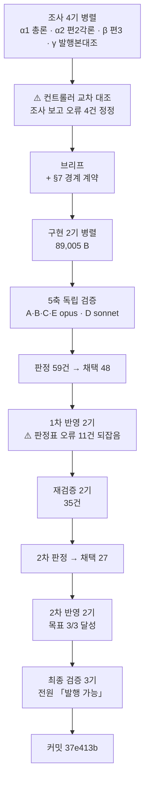

# 인수인계 (HANDOFF)

**갱신일**: 2026-08-17
**브랜치**: `main` · T4 발행 커밋 **`37e413b`**
**미푸시**: **`git log origin/main..HEAD`로 실측하라.** T4 발행 1커밋 + 문서 갱신분.
⚠️ **앞 배치 커밋(`9c0b9fd`·`f388592`·`6a56f4a`·`df3b006`·`695cdad`)은 이미 푸시돼 있다. 직전 HANDOFF의 미푸시 수를 승계하지 마라.**
**작업트리**: 커밋 직후 `git status --short` **비어 있음 확인 완료** (T3 사고 재발 없음)
**발행본**: **121편** (`ai-agent` 51 · `rag` 25 · `agentic-coding` 31 · `search-engineering` 6 · **`ai-transformation` 8**) · sitemap **184 URL**

> **`ai-transformation` T4를 발행했다.** 11편 중 **8편**이 나갔고 **3편이 남았다.**

---

## 1. 이번 세션에서 한 일

**`aiteam/03` + `04_영역별` 7파일(38,940 B)을 편2·편3으로 발행했다.**



| 편 | slug | 가용 | 발행 | 팽창률 | 구조 |
| :---: | --- | ---: | ---: | ---: | --- |
| **2** | `sdlc-human-gates` | 21,912 B | **45,540 B · 464줄** | **2.078** | H2 12 · H3 21 · 표 18 · 도식 3 |
| **3** | `discovery-to-growth-tooling` | 17,028 B | **41,624 B · 427줄** | **2.444** | H2 8 · H3 20 · 표 20 · 도식 4 |

**합계 87,164 B — 이 프로젝트 단일 배치 최대**(직전 최대는 T3의 74,905 B).

### 단계별 산출

| 단계 | 결과 |
| --- | --- |
| 조사 4기 | ⚠️ **보고 오류 4건** — γ의 「3편 series 세트」(실제 `series` 키 0건) · γ의 「편1·2·3 상호 참조 완전」(편2·3 미존재) · α2의 ○/× 뒤집힘 · β의 「입사 후 실천 보존 필수」(설계서 위반) |
| 컨트롤러 교차 대조 | **경계 계약 확정** — 원본이 스스로 적은 총론↔각론 대응 발견 |
| 구현 2기 | **구현자가 브리프 오류 9건 지적** |
| 5축 검증 | 지적 **59건** (A 27 · B 15 · C 6 · E 11 · D 실행통과) · **교차 지목 11건** |
| 1차 반영 | 채택 40 · 거부 1 · ⚠️ **판정표 오류 11건 되잡음** · 편2 +126 B · 편3 +238 B |
| 재검증 2기 | **35건** (1기 22 · 2기 13) |
| 2차 반영 | **목표 3/3** — 편2 −1,408 B · 편3 −797 B · 새 문장 1자리 · 구조 불변 · ⚠️ **판정표 오류 3건 더** |
| 최종 검증 3기 | **전원 「발행 가능」 · 차단 0건** |

---

## 2. ⚠️⚠️ 이번 세션 최상위 — **「고치면 새 개수가 생긴다」**

**T3의 「배정은 맞고 술어가 틀렸다」의 다음 단계다. 한 자리에서 실증됐다:**

| 단계 | 편2 `:450` |
| --- | --- |
| 구현 | 「넘기지 말라는 **금지**가 명시된 것은 **둘**」 |
| 5축 | 인용된 ③ 셀에 금지 문구가 없다(A-7) · ⑥도 집계에서 빠졌다(B-2) |
| **1차 반영** | 술어를 **정확히** 고쳤다 → 「AI를 어디까지만 쓰라고 **한계**를 못 박은 것은 **셋**」 |
| **재검증 1기·2기 독립 지목** | ⚠️ **「⑤가 넷째다」** |

> **개수를 고치면 술어가 안 맞고, 술어를 고치면 개수가 안 맞는다. 이 왕복은 수렴하지 않는다.**

### ⇒ 처방 — **개수+술어 총평은 고치지 말고 삭제한다** (금지선 29)

**근거**: 재검증 2기가 전건 재계수해 **표·도식·목록 자체는 편2 18자리·편3 16자리 전건 정확**함을 확인했다.
**총평은 표가 이미 말한 것을 요약할 뿐이다.**

| 목표 | 삭제가 주는 것 |
| --- | --- |
| 바이트 음수 | ✅ 삭제만 하면 반드시 준다 |
| 새 문장 0자리 | ✅ 갈아 끼우지 않으므로 원리상 0 |
| 구조 불변 | ✅ H2·H3·표·도식이 그대로 |

**⚠️ 단 기계적으로 지우지 마라**: 표를 **요약**하는 총평은 지우고, 표를 **소개**하는 리드는 남긴다.

---

## 3. ⚠️⚠️ 컨트롤러 브리프 오류 **8건** — 전부 지시받은 쪽이 반증했다

**T3 HANDOFF가 「금지선 16은 브리프·판정표를 쓰는 사람이 가장 자주 어긴다」고 경고했고, T4에서 정량화됐다.**

| # | 컨트롤러가 쓴 것 | 실측 | 누가 |
| ---: | --- | --- | --- |
| 1 | 「`classDef`는 기발행본 실재 문법」 | **121편 중 0건** | 편2 구현자 |
| 2 | 「`](#앵커)`로 이어라」 | **발행본 관례 0건** | 편2 구현자 |
| 3 | 「`경쟁사분석 L65`는 다른 곳에 없는 정보」 | **성분 5 중 4가 이미 존재** | 편3 구현자 |
| 4 | 「§5-3의 **7자리 중 6자리**」 | **11자리 중 8자리** | 편2 구현자 |
| 5 | §7-3 도구 대조표 「기획 5/5 일치」 | ⚠️ **`Atlassian Intelligence` 누락 — 원본을 요약하며 항목을 잃었다** | 축 B·C |
| 6 | §5-1이 `03 L85~86`의 기술 명제를 적음 | ⚠️ **앞절반만.** 「Klarna식 U턴을 피하는 구조」가 빠졌다 | 축 C |
| 7 | §7-4 소유권 표 | ⚠️⚠️ **모순된 두 규칙** — 「각론 전량은 편3」 + 「게이트는 편2」 | 축 E |
| 8 | §5-7 「09 링크를 걷어라, 예고도 하지 마라」 | **편4 선례는 「후속 편에서 다룬다」** | 축 C |

> ### ⚠️ **다섯 건은 「세지 않고 쓴 개수」이고 세 건은 「요약하며 잃은 정보」다**
>
> **7번이 가장 나빴다** — 편3 구현자를 **「게이트는 이 글에 없다」고 선언하면서 게이트 표를 싣는** 상태로 몰았다.
> **원인은 §7-2에 「각론 §1에도 게이트 표가 있다」고 적어 놓고 §7-4 소유권 표에서 처리하지 않은 것이다.**
> **컨트롤러가 자기가 쓴 앞 절을 뒤 절에 반영하지 않았다.**

### ⇒ T5 컨트롤러가 지킬 것

| # | |
| ---: | --- |
| 1 | **브리프에 개수를 쓰기 전에 세라.** 「N종」·「N자리」·「전부」·「없다」 |
| 2 | **원본을 요약해 브리프에 옮길 때 항목 수를 대조하라** — `Jira+Atlassian Intelligence/Rovo`를 `Jira+Rovo`로 줄이면 도구가 하나 사라진다 |
| 3 | **소유권 표를 쓴 뒤 앞 절과 모순되는지 읽어라** |
| 4 | **발행본 관례를 주장하려면 grep하라** (`classDef`·앵커 링크가 그래서 틀렸다) |

---

## 4. 다음 세션이 이어받을 것

### ▶ **T5 착수** — 설계서 §9

| 배치 | 편 | 원본 | 상태 |
| :---: | --- | --- | :---: |
| ~~T1~~ | ~~편6·7·8~~ | ~~`aiagent/06`~~ | ✅ `9c0b9fd` |
| ~~T2~~ | ~~편9~~ | ~~`aiagent/08 §4~§8·§10`~~ | ✅ `6a56f4a` |
| ~~T3~~ | ~~편1·편4~~ | ~~`aiteam/01·02·07` · `05·06`~~ | ✅ `695cdad` |
| ~~T4~~ | ~~편2·편3~~ | ~~`aiteam/03` · `04_영역별` 7파일~~ | ✅ **`37e413b`** |
| **T5** | **편5 `lean-three-layer-harness`** | `09` + `09a` + `09b` | **▶ 다음** |
| T6 | 편10 Q&A | `aiteam/08 §3` 9문항 | 전 편 발행 후 |
| T7 | 편11 지도편 | 재작성 | 카테고리를 닫는다 |

### T5 원본 실측 — **분할표 값을 믿지 말고 재실측하라**

| 파일 | raw B |
| --- | ---: |
| `09_린_레퍼런스아키텍처.md` | 7,739 |
| `09a_Skills_설계.md` | 7,264 |
| `09b_LLM_wiki_템플릿.md` | 6,154 |
| **합계** | **21,157** (분할표 20,481) |

**차이는 `09 §4`(「허우용 스택에 실제 셋업」 676 B) 제외분이다. 절 단위로 `awk` 재실측하라.**
**예상 발행: 21,157 × 1.7~2.5 = 36~53 KB** (T4 실측 2.08·2.44)

### ⚠️⚠️ T5가 T4와 다른 점

| | T4 (`03` + `04` 7파일) | **T5 (`09`·`09a`·`09b`)** |
| --- | --- | --- |
| 파일 수 | 8개 | **3개** |
| 구조 | 총론 1 + 각론 7 | ⚠️ **아키텍처 1 + 설계 2.** 총론↔각론이 아니라 **층위가 다른 세 문서** |
| 편 수 | **2편으로 분할** | **1편으로 통합** — 경계 계약이 필요 없다 |
| ⚠️ **미해결 정면 충돌** | — | ⚠️⚠️ **「훅 차단 채널이 세 자료에서 갈린다」**(이월 7번). **T5가 `09`를 맡으므로 여기서 만난다** |
| ⚠️ **층위 판정 미확정** | — | ⚠️ **`09a` Skills가 발행본과 다른 층위인가**(설계서 §13-1). **T1~T4 발행본 8편과 다시 대조하라** |

### ⚠️ T5가 반드시 확인할 것 — **편2가 `09` 링크를 걷었다**

원본 `03 L27`이 「전체 그림은 [09 린 레퍼런스 아키텍처]」로 `09`를 가리켰는데,
**브리프가 「미발행 편이니 링크를 걷어라, 예고도 하지 마라」고 지시해 편2가 통째로 생략했다.**

⚠️ **그런데 편4는 같은 상황을 「후속 편에서 다룬다」로 처리했다**(축 C-4 지적, 이월).

**⇒ T5 발행 시 결정하라: ① 편2에 편5 링크를 추가할 것인가 ② 편5가 편2를 링크하는 것으로 충분한가.**
**T4에서 편1 2자리를 같은 이유로 수정한 선례가 있다(§5-1).**

### T5 브리프에 반드시 넣을 것

| # | 항목 | 근거 |
| ---: | --- | --- |
| 1 | **금지선 1~30 전문** | 설계서 §11 + `agentic-coding` 설계서 L1998~L2021 |
| 2 | ⚠️ **가용 바이트를 `awk`로 재실측하라** | T2·T3·T4 모두 분할표와 어긋났다 |
| 3 | ⚠️ **팽창률 실측 1.63~2.71** | T4는 2.08·2.44 |
| 4 | ⚠️⚠️ **금지선 29 — 개수+술어 총평은 고치지 말고 삭제하라** | **§2. 이번 배치 최상위** |
| 5 | ⚠️⚠️ **금지선 30 — 도식 노드 라벨도 본문 근거가 필요하다** | **§5-3.** T3은 화살표였고 T4는 노드였다 |
| 6 | ⚠️⚠️ **`LC_ALL=C` 없이는 이모지 grep이 거짓 음성을 낸다** | **§5-2** |
| 7 | **1인칭 정제식 + 오탐 8종 + 어절 경계 오탐군** | §5-4 |
| 8 | **「스캔 0건은 목표가 아니라 관찰값이다」** | T1 최상위 · **T4에서 🖊️로 실증** |
| 9 | ⚠️ **「원본에도 발행본에도 없으면」으로 지시하라** | T1 최상위 결함 |
| 10 | ⚠️ **「처방도 검증 대상이다」** | T2 3연 · T3 4건 · **T4 14건** |
| 11 | ⚠️ **부분 일치 grep** (`본 [가-힣]`·`우리 [가-힣]`) | T3 §5-2 |
| 12 | **`dup-scan`은 단일 파일 모드로** | T2 §5-2 · T3·T4 재확인 |
| 13 | **`Bash` heredoc으로 산출물을 써라. ~10KB에서 잘리니 5~6 KB 분할 append** | `reviewer`·`scout`에 `Write` 없음 |
| 14 | ⚠️ **컨트롤러가 브리프의 개수를 세고 원본 요약 시 항목 수를 대조하라** | **§3. 이번 배치 최상위 컨트롤러 결함** |
| 15 | **0편 태그 30종 목록 첨부** | B9·T1~T4 모두 사용 0건이나 계속 첨부 |

### 확정된 결정 (다시 묻지 마라)

| 사안 | 결정 |
| --- | --- |
| **분량** | **상한 없다. 하한 13.3 KB만** (금지선 11·13) |
| **팽창률** | ⚠️ **실측 1.63~2.71.** 쪼개는 편은 낮고 **묶는 편은 높다** |
| **시리즈 페이지** | 없다. `series`는 frontmatter 메타데이터일 뿐 |
| **frontmatter** | `series`·`seriesOrder`·`source`는 **쓰지 마라**. **빈 문자열은 빌드를 죽인다 — 키를 생략하라** |
| ⚠️ **`date`** | **실제 발행일을 적어라.** T4에서 자정을 넘겨 `2026-08-17`이 됐고, **그것만으로 편2·편3이 카테고리에서 이웃이 되어 내비게이션 비대칭이 해소됐다**(§5-5) |
| ⚠️ **순서 호칭** | **「다음 편」·「앞 편」을 쓰지 마라.** 사이트 정렬은 `date` 내림차순 + 제목 가나다순이다 |
| ⚠️ **링크 호칭** | **대상 제목의 대시(—) 뒤 부제를 축자 그대로 쓴다.** T4에서 편2→편3만 절단돼 1차 반영에서 교정했다 |
| **태그 패싯** | 3~5개, **같은 패싯 최대 2개.** 패싯 C는 17종 · D도 상한 2 |
| ⚠️ **「첫 90일에 할 일」** | **편 제목·H2로 쓰지 마라**(발행본 8편 서식). **표 안의 기간 값은 살려라** |

### 진행 방식 — 13배치로 검증된 절차

```
1단계  분할 설계 → 승인                         ✅ 완료
2단계  배치로 나눠 변환, 배치마다 커밋·보고       ◀ T5가 여기
3단계  구현 미참여 에이전트가 5축 독립 검증
4단계  판정 → 1차 반영 → 스냅샷 → 재검증 2기 → 2차 판정 → 2차 반영 → 최종 검증 → 커밋
```

| 축 | 무엇을 보는가 | 티어 |
| :---: | --- | :---: |
| A | 쓰여 있는데 **틀린** 것 — ⚠️ **개수에 붙은 술어를 함께 보라** | opus |
| B | 쓰여 있는데 **근거가 없는** 것 — ⚠️ **+ 「제거한 자리를 메우려 새 주장을 만들지 않았나」** | opus |
| C | **없는** 것 — ⚠️ **발행본을 열기 전에 원본 인벤토리를 먼저 만든다** | opus |
| D | **실행**하면 나오는 것 | sonnet |
| E | **기발행본과의 중복** + ⚠️ **편끼리의 상호 모순** | opus |

> ### ✅ 재검증 2기의 축 분할 — T1에서 확립, T4까지 재확인
> | 기 | 담당 |
> | :---: | --- |
> | 1 | **지금 글에 있는 근거 없는 주장** — 총평 · 전칭 · 개수 명시 · 부정 주장 · 귀속 · 표의 열 이름 |
> | 2 | **값과 그것을 가리키는 것 사이의 어긋남** — 지시어·역참조 · 개수↔실제 · 링크 문구 · 도식↔본문 · 넘김 계약↔도착지 · **서식 일관성** |
>
> **T4 실적**: 1기 22건 · 2기 13건. **교차 지목 6자리.**
> ⚠️ **2기에 「기발행본과 글 구조를 대조하라」를 넣어 편3의 마무리 문단 부재를 잡았다 — 새 검사 축이다.**

> ### ✅ 최종 검증은 **이진 판정**을 요구하라
> **`발행 가능` 또는 `발행 불가 — <이유>`만 요구하고, 「억지로 찾아내지 마라, 아홉 명이 이미 봤다」를 명시한다.**
> ⚠️ **「수정이 잦았던 자리」를 표로 지목하라** — T4는 편2 6곳·편3 6곳·삭제만 15자리를 적었고 검증자가 전건 열었다.
> ⚠️⚠️ **「고쳤다가 되돌린 자리」의 되돌림이 완전한지 따로 물어라** — T4에서 3자리가 전부 완전함이 확인됐다.

> ### ⚠️ 검증자에게 브리프도 판정표도 반영 보고서도 주지 마라 — B5에서 확립, T4까지 재확인
> **대가는 오탐 2건 내외다. 설계된 대가다.**
> **축 C에는 「발행본을 먼저 읽지 마라」를 명시하라.**
> ⚠️ **T4에서 축 A가 「6/6 성립」이라 오판한 자리를 축 B·C가 잡았다 — 축을 여럿 두는 이유가 여기 있다.**

---

## 5. ⚠️ T4에서 새로 실측된 함정

### 5-1. ⚠️⚠️ **원본이 스스로 총론↔각론 대응을 적어 둔다 — 컨트롤러만 볼 수 있다**

**각 `04` 파일 L4 `> **목적**:` 줄에 대응이 축자로 있다:**

| 각론 | 원본 자기 선언 | `03` 대응 | 배정된 편 |
| --- | --- | :---: | :---: |
| `04-A 기획_요구사항` | 「03 파이프라인 **1~2단계**의 심화」 | §3-1·3-2 | **3** |
| `04-B 디자인` | 「03 파이프라인 **3단계** 심화」 | §3-3 | **3** |
| `04-D 개발` | 「03 파이프라인 **4단계** 심화」 | §3-4 | 2 |
| `04-E QA검증` | 「03 파이프라인 **5단계** 심화」 | §3-5 | 2 |
| `04-G 배포_운영` | 「03 파이프라인 **6단계** 심화」 | §3-6 | 2 |
| `04-C 경쟁사분석` | ⚠️ **`03` 참조 없음.** 상위가 `05`(=편4) | — | 3 |
| `04-F 퍼포먼스마케팅` | 「03 파이프라인의 **마케팅 분기**」. 상위가 `07`(=편1) | 없음 | 3 |

**`03` 총론이 편2에 배정됐는데 ①②③단계의 각론은 편3에 있다.**
**조사 α1은 `03`만, β는 편3 4파일만 봤으므로 어느 쪽도 이 관계를 볼 수 없었다.**

> **T5는 3파일이 층위가 다른 문서(아키텍처·Skills·wiki 템플릿)이므로 같은 구조는 아니다.**
> **그러나 「원본 머리 메타(L3~L6)를 먼저 읽어라」는 그대로 유효하다 — 원본이 자기 관계를 적어 둔다.**

### 5-2. ⚠️⚠️ **`🖊️` grep은 `LC_ALL=C` 없이 거짓 음성을 낸다**

```bash
grep -cE "🖊️" 디자인.md           # → 0   ❌
LC_ALL=C grep -cE "🖊️" 디자인.md   # → 1   ✅
```

**원본 8파일 전부에 「한 줄 메시지」 블록이 있는데 기존 명령은 `TODO` 문자열이 우연히 있는 1건만 잡았다.**

> **앞 세 배치가 이 명령으로 검사했다. 발행본 실제 잔재는 0건이었으나 — 검사가 그것을 증명한 것이 아니다.**
> **「스캔 0건은 목표가 아니라 관찰값이다」의 정확한 실증이다.**

⚠️ **대안 검사도 함께 돌려라**: `grep -nE "한 줄 메시지|TODO"` · `grep -nE "^> .{0,4}\*\*"`

### 5-3. ⚠️ **금지선 28은 화살표만이 아니다 — 노드 라벨도 본문 근거가 필요하다**

| | T3 | **T4** |
| --- | --- | --- |
| 무근거 유형 | **화살표 3건** (관계를 그리는 사람이 만들었다) | ⚠️ **노드 라벨** (`Claude Code (+Skills)`·`CodeCommit approval rules · 파이프라인 승인`) |
| 원인 | 본문에 없는 인과를 그렸다 | **본문이 원본 고유명을 걷어낸 요약본인데 도식은 원본 축자를 실었다** |

**`Skills`는 편2 전체 1건이 그 도식 안이고 용어 정리에도 없었다** — 글이 스스로 세운 「본문에서 실제로 쓰이는 것만 모았다」와 어긋났다.
**2차 반영에서 `approval rules` 하나만 남기고 넷을 걷었다**(본문 `:87`이 그 용어의 정의를 축자로 서술하므로).

### 5-4. 1인칭 오탐 트랩 — **8종**이 됐다 + 어절 경계 오탐군

| 나이브 패턴 | 오탐 원인 | 발견 |
| --- | --- | :---: |
| `나의 ` | `하나의 ` | T1 |
| `제가 ` | `주제가 ` · `전제가 ` | T1 |
| `지원자` | `지원자 스크리너` | T1 |
| `제가 ` | `공제가 ` | T2 |
| `제가 ` | `과제가 ` · `문제가 ` | T3 |
| **`제가 `** | ⚠️ **`명제가 `** — 「명제가 그대로 들어 있고」 | **T4** |

```bash
grep -nE "(^|[^하])나의 |(^|[^주전공과문])제가 |저는 |내가 |입사|본인은|데려갈|우리 팀|본 팀|현 팀" "$F"
grep -nE "본인|본 [가-힣]|우리 [가-힣]|현 [가-힣]|내 [가-힣]" "$F"   # 부분 일치
```

> ⚠️⚠️ **배제 문자류에 `명`을 더하지 마라. 「알려진 오탐」 목록으로 처리하라**(T3에서 확립).
> ⚠️ **어절 경계 오탐군** — `본 [가-힣]`·`내 [가-힣]`이 어절 경계를 안 봐서 걸린다:
> `사내 데이터` · `본 기재` · `2주 내 폐기` · `요약본 사이` · `구현 세부` · `IDE 내 채팅`
> ⚠️ **`재채용`·`채용`은 절대 지우지 마라** — Klarna 축자 · `경쟁사분석 §5` 업무 도메인 용어(7건 전부)

### 5-5. ✅ **`date`를 사실대로 적는 것이 구조 문제를 푼다**

`series` 키가 없으면 [`lib/blog/loader.ts:64`](lib/blog/loader.ts)가 **`date` 내림차순 · 동률이면 제목 가나다순**으로 떨어뜨린다.

| | T4 이전 (8편 전부 `2026-08-16`) | **T4 이후 (편2·편3만 `2026-08-17`)** |
| --- | --- | --- |
| 편2↔편3 | **이웃 아님** (사이에 편4가 낌) | ✅ **서로 이웃** |
| prev/next | **양방향 비대칭 6건** | ✅ **두 편 사이 대칭** |
| 잔존 비대칭 | — | 4건 — **series/non-series 간 기존 설계 특성**(T4가 만든 것 아님) |

**검증자가 `loader.ts`의 비교자와 `getAdjacentPosts`를 Node로 이식해 8편 실제 frontmatter로 계산했다.**
**⇒ T5도 실제 발행일을 적어라. 그것만으로 정렬이 개선된다.**

### 5-6. ⚠️ 「전량 삭제」류 처방은 대개 틀리다 — **두 번 실증됐다**

| 자리 | 컨트롤러가 지목한 것 | 실제 |
| --- | --- | --- |
| 「한 줄 메시지」 블록 8건 | 「블록 표지·1인칭·금칙어를 걷고 **기술 명제는 살려라**」 | ⚠️ **편2 4블록은 전부 「이미 본문에 축자로 있음」.** 컨트롤러가 「살릴 명제가 있다」고 지목한 두 건 중 **하나도 반증**(`경쟁사분석 L65`의 성분 4/5가 이미 존재) |
| 편3 `:81` 「게이트는 이 글에 없다」 | 축 E: 「**두 번** 선언하고 6/6 실었다」 | ⚠️ **1차 반영자 실측: `:83`·`:427`은 이미 층위가 갈려 있었다.** 진짜 문제는 **H3 제목 한 줄** |

> **지목은 맞고 범위가 틀렸다. 「전부」·「전량」이 처방에 들어가면 세어 보라.**

### 5-7. ✅ **1차는 늘고 2차는 준다 — 절차가 설계대로 작동한 증거**

| | 구현 | 1차 반영 | 2차 반영 | 순증감 |
| --- | ---: | ---: | ---: | ---: |
| 편2 | 46,822 | 46,948 **(+126)** | **45,540 (−1,408)** | −1,282 |
| 편3 | 42,183 | 42,421 **(+238)** | **41,624 (−797)** | −559 |

**1차가 느는 이유는 원리적이다** — 1차 반영자의 관찰이 정확하다:
> **「전칭을 실수로 낮추면 예외를 적어야 해 원리상 는다.」**

**2차가 주는 이유도 원리적이다** — 「고치지 말고 삭제」이므로.

---

## 6. 미해결 과제

### 6-1. T4 이월

| # | 자리 | 요지 |
| ---: | --- | --- |
| T4-a | 편3 글 끝 | ⚠️ **마무리 문단이 없다.** 편1·편4·편2와 기발행 3편은 전부 「이 글이 다루지 않은 것」 표 뒤에 있다. 1차 반영에서 무귀속 전칭을 삭제한 결과이고 **삭제는 옳았다.** **사용자가 「그대로 발행」 결정** |
| T4-b | 편3 디자인 절 | 「KPI와 함정」이 **불릿만 남아** 기획 쪽(리드+불릿)과 비대칭. 2차 반영 R3-5 문단 삭제의 결과 |
| T4-c | 편2 전역 | **「이 글의 정리」 25건** — 기발행 최다 12건의 2.08배. **2차 반영에서 줄지 않았다** (귀속이 별도 문장이라 삭제 대상이 아니었고, 지우면 무귀속 판정이 늘어난다) |
| T4-d | 편2 `:83` | 「원 자료가 각 항목에 붙인 위험」 — 실제로 문면에 있는 것은 2·4번뿐. **다만 같은 문장이 「이 글의 정리다」로 귀속해 결론은 참**(최종 검증 비차단 판정) |
| T4-e | 편2 `:93~94` | `approval rules`가 도식에만 산다 — **원본 축자의 부분집합이라 거짓은 아니고** 용어 정리 `:35`의 지시 대상이 존재한다(최종 검증 비차단) |
| T4-f | 편2·편3 | **MCP 용어 정의가 갈린다** — 편2는 편1을, 편3은 편4를 상속했다. **통일하려면 기발행 2편도 손대야 한다** |

### 6-2. T3 이월 (5건)

| # | 자리 | 요지 |
| ---: | --- | --- |
| T3-a | 편1 `:281` | 72%가 마무리에서 회수되지 않는다 |
| T3-b | 편1 `:16`·`:317`~`:319` | **링크 호칭 3종이 대상 제목과 겹치지 않는다.** ⚠️ **T4는 부제 축자 규약을 지켰다** — 편3→편2 3자리 전건 축자 |
| T3-c | `01 L24` ↔ `05 L4` | **3단 모델 L2 배정이 원본 두 파일에서 어긋난다.** 발행본을 고쳐서는 해소되지 않는다 |
| T3-d | 편4 `:336` | 「이름 그대로」가 `:341`과 강도가 어긋난다 |
| T3-e | 편4 `:14` | 성숙도 예고가 빠졌다. 되살리면 `:16` 「그 둘」이 깨진다 |

### 6-3. T2·T1 이월

| # | 자리 | 요지 |
| ---: | --- | --- |
| T2-a~d | 편9 | C갈래 이름 · `—` 표기 · **본문에 쓰이나 표에 없는 약어 5종** · SLA 범위 시리즈 차원 갈림 |
| T1-a~k | 편6·7·8 | 11건 전부 「낮음」, 사실 오류 아님 |

### 6-4. 기존 이월

| # | 항목 | 상태 |
| ---: | --- | --- |
| 1 | mermaid 노드 라벨 우측 1~9px 클리핑 | `foreignObject` 폭 문제. 전역 |
| 2 | FR-1.4 스크롤스파이 미구현 | 기존 위키에도 없음 |
| 3 | 메인 페이지 LCP 6.6초 | Lighthouse 77점 |
| 4 | 싱글톤 태그 재측정 | 2차 전체를 마친 뒤 |
| 5 | `cto_learning_roadmap` Q1·Q3 | 발행 가능 판정을 받았으나 미변환 |
| 6 | 어휘 81종 중 0편 태그 30종 | **B9·T1~T4 모두 사용 0건.** ⚠️ **단 T4에서 `ci-cd`가 처음 열렸다** |
| **7** | ⚠️⚠️ **훅 차단 채널이 세 자료에서 갈린다** | **T5가 `09`를 맡으므로 정면으로 만난다** |
| 8 | 원본 `04 §8-2` 「3대 구성 요소」인데 표 4행 | ⚠️ **T4 범위였으나 해당 절이 제외 범위(입사 후 실천)와 겹쳐 미처리** |
| 10~15 | `05 §3-2` 제품 결함 · 무귀속 판정 2건 · `2026-04` 표기 · 편7·편8 · **기발행본 축약 용어표 0회 행** | **사용자 결정 — 기발행본 수정은 새 검증 표면** |
| 19~22 | 원본 모순 병기 · Supabase 탈브랜딩 · 앞 배치 표 수치 재확인 · `industry-claude-md-templates.md:131` | — |
| 24 | **20자 임계값** | ⚠️ **「반증」 유지** — 한국어 표 셀 손 대조 필요 |
| 26~29 | `10 §5` 수치 출처 · `search-engineering` inbound 0 · 주제 10 깊이 · 지도편 mermaid | — |
| 30 | `reviewer`·`scout`에 `Write` 없음 | **브리프에 heredoc 명시. ~10KB에서 잘리니 5~6 KB 분할** |
| 31 | `09a` Skills 층위 | ⚠️ **T5가 확정한다** |
| 35 | `dup-scan --category` 한계 | ✅ **우회책 실증(T3·T4). 스크립트 수정 불필요** |
| 36 | mermaid 렌더는 CI로 검증 불가 | **대안: 「사용 문법이 기발행본에 실재하는가」 대조.** T4에서 novel 문법 0건 확인 |
| **37** | ⚠️ **`ci-cd` 태그가 처음 열려 sitemap 예측이 깨졌다** | **신규(T4).** 설계서 §10의 「신규 태그가 하나도 열리지 않았다」가 반증됐다. **남은 3편의 최종 URL 예측을 다시 계산하라** |
| **38** | ⚠️ **편2가 `09`(=편5) 링크를 걷었다** | **신규(T4).** 브리프 지시였으나 **편4 선례는 「후속 편에서 다룬다」**다. **T5가 결정하라 — §4 참조** |

---

## 7. 검증 명령

```powershell
cd C:\Users\aeby\vscode\withwooyong.github.io

npm test              # 36개 통과
npx tsc --noEmit      # 0
npm run build         # 0, [sitemap] 184개 URL

npm run dup-scan:verify                              # 본 스캔 전에 반드시
npm run dup-scan -- content/blog/<카테고리>/<slug>.md  # ⚠️ 단일 파일 모드를 써라
```

> **2026-08-17 실측**: `npm test` **36/36** · `npx tsc --noEmit` **exit 0** · `npm run build` **성공, 184 URL** ·
> `dup-scan` 자체검사 **4/4 PASS**, **대조 120편**(형제 편 포함 확인), 편2 24건·편3 8건 **전건 정당**.

### `ai-transformation` 발행 시 검사

```bash
F="content/blog/ai-transformation/<slug>.md"

# 금칙어 — 기대 0건
grep -nE "면접|커닝페이퍼|암기용|화이트보드|이력서|강의|수강|Part [0-9]|CH0[0-9]|예상 질문" "$F"

# 민감정보 — 기대 0건
grep -nE "히츠|야나두|TVING|티빙|BTV|허우용|teddylee|teddynote|argus|FASTCAMPUS|실장|커머스개발" "$F"

# 1인칭 — 정제식 (오탐 8종 배제)
grep -nE "(^|[^하])나의 |(^|[^주전공과문])제가 |저는 |내가 |입사|본인은|데려갈|우리 팀|본 팀|현 팀" "$F"

# 부분 일치 — 어휘 목록이 못 잡는 자리
grep -nE "본인|본 [가-힣]|우리 [가-힣]|현 [가-힣]|내 [가-힣]" "$F"

# ⚠️⚠️ 저자 메시지 — LC_ALL=C 필수. 없으면 거짓 음성이다
LC_ALL=C grep -nE "🖊️" "$F"
grep -nE "한 줄 메시지|TODO" "$F"

# 순서 호칭 — 기대 0건
grep -nE "다음 편|앞 편|이어지는 글|이전 편" "$F"

# 내부 링크 실재
grep -ho '/blog/[a-z-]*/[a-z0-9-]*/' "$F" | sort -u | while read l; do
  cat=$(echo "$l" | cut -d/ -f3); slug=$(echo "$l" | cut -d/ -f4)
  [ -n "$slug" ] && [ ! -f "content/blog/$cat/$slug.md" ] && echo "MISSING: $l"
done
```

> ⚠️⚠️ **히트가 0건이면 검사 유효성을 먼저 확인하라 — 같은 명령을 원본에 돌려 히트가 나오는지 보라.**
> **T4 최종 검증자가 그렇게 했고, 그것이 「0건」을 관찰값으로 만드는 유일한 방법이다.**
>
> **알려진 오탐 — 고치지 마라**: `재채용`(Klarna 축자) · `채용` · `지원자 스크리너` ·
> `과제가 ` · `문제가 ` · **`명제가 `** · `공제가 ` · `하나의 ` · `주제가 ` · `전제가 ` ·
> **어절 경계**: `사내 데이터` · `본 기재` · `2주 내 폐기` · `요약본 사이` · `구현 세부` · `IDE 내 채팅`

### 발행본 구조 실측

```bash
LC_ALL=C awk '
  /^```/ { fence=!fence; fc++; next }
  !fence && /^## / { h2++ }
  !fence && /^### / { h3++ }
  !fence && /^[ ]*>?[ ]*\|[ ]*[-:][- :|]*\|[ ]*$/ { tb++ }
  END { printf "H2 %d · H3 %d · 표 %d · 펜스 %d\n", h2, h3, tb, fc }' "$F"
```

**⚠️ `^\|`만 보면 인용블록 안의 표를 놓친다. 코드펜스 총 개수가 짝수인지도 세라.**

### ⚠️ 커밋 절차 — T3 사고 재발 방지 (T4에서 재발 없음 확인)

```bash
# ⚠️ baseline은 git add가 아니라 파일 복사로 잡아라
cp <파일> <스크래치패드>/CONTROLLER-ONLY-<편>-스냅샷.md

# ... 1차·2차 반영 ...

git add <파일>          # 커밋 직전에만 add
git commit -F- <<'EOF'
...
EOF
git status --short      # ⚠️ 비어야 정상. 비지 않으면 구본이 커밋된 것이다
```

**⚠️ `Bash`는 `<<'EOF'`, `PowerShell`은 `@'...'@`다. 섞으면 리터럴이 커밋 제목에 들어간다.**

---

## 8. 소스 위치

| | 경로 |
| --- | --- |
| 원본 (읽기 전용, **수정 금지**) | `C:\Users\aeby\vscode\yanadoo-exit\shared\knowledge\` |
| 발행본 | [`content/blog/<카테고리>/<slug>.md`](content/blog/) — **121편** |
| 카테고리 정의 | [`content/blog/categories.ts`](content/blog/categories.ts) — 12개 등록, **5개 발행** |
| 태그 통제 어휘 | [`content/blog/tags.ts`](content/blog/tags.ts) — 81종. **패싯 A 15 · B 21 · C 17 · D 18 · E 9 · F 1** |
| frontmatter 검증 | [`lib/blog/frontmatter.ts`](lib/blog/) |
| **시리즈 내비게이션** | ⚠️ [`lib/blog/loader.ts:64`](lib/blog/loader.ts) 정렬 비교자 · `:160~:179` `getAdjacentPosts` |
| 축자 복제 스캔 | [`scripts/dup-scan.mjs`](scripts/dup-scan.mjs) — ⚠️ **단일 파일 모드를 써라** |
| 요구사항 | [`docs/superpowers/specs/2026-08-07-tech-blog-requirements.md`](docs/superpowers/specs/2026-08-07-tech-blog-requirements.md) |
| ▶ **`ai-transformation` 설계서** | [`docs/superpowers/plans/2026-08-14-ai-transformation-category-split-design.md`](docs/superpowers/plans/2026-08-14-ai-transformation-category-split-design.md) — **T5는 §4·§9·§11·§13을 먼저 읽어라** |
| `agentic-coding` 설계서 | [`docs/superpowers/plans/2026-08-08-agentic-coding-category-split-design.md`](docs/superpowers/plans/2026-08-08-agentic-coding-category-split-design.md) — **금지선 1~20은 L1998~L2021** |

### T4 산출물 — `/clear` 후에도 이 경로로 읽어라

```
C:\Users\aeby\AppData\Local\Temp\claude\C--Users-aeby-vscode-withwooyong-github-io\
  77481cd1-9077-4fa9-a5e7-a207d8d50275\scratchpad\
    T4-SURVEY-COMMON.md          조사 공통 브리프 (⚠️ 「판정하지 마라, 실측만 하라」가 핵심)
    T4-CONTROLLER-NOTES.md       ▶ 컨트롤러 교차 대조 노트 — 조사자가 볼 수 없는 자리
    T4-BRIEF.md                  ▶ 변환 브리프. **§7 경계 계약이 T5 브리프의 골격**
    T4-VERIFY-BRIEF.md           5축 공통 브리프
    T4-FINAL-BRIEF.md            최종 검증 — ⚠️ 「수정이 잦았던 자리」 표가 값이다
    T4-JUDGMENT.md / -2ND.md     1·2차 판정표 (⚠️ **§0의 「고치지 말고 삭제」가 최상위**)
    T4-survey-{a1,a2,beta,gamma}.md  조사 4기
    T4-report-{2,3}.md           변환 보고서
    T4-verify-{A,B,C,D,E}.md     5축 검증 보고서
    T4-verify-C-inventory.md     ⚠️ 발행본 열기 전 작성된 원본 인벤토리 165항목
    T4-recheck-{1,2}.md          재검증 보고서
    T4-fix-{2,3}.md / T4-fix2-{2,3}.md   1·2차 반영 보고서 (⚠️ **판정표 오류 14건이 여기 있다**)
    T4-final-{exec,review,controller-verify}.md   최종 검증 3기
    CONTROLLER-ONLY-편{2,3}-{1,2}차반영전-스냅샷.md
```

### 앞 배치 조사 산출물 (T5에 필요)

```
C:\Users\aeby\AppData\Local\Temp\claude\C--Users-aeby-vscode-withwooyong-github-io\
  898dce7e-a7a1-49f2-b313-330be3d2a99d\scratchpad\survey\
```

| 축 | 파일 | T5에 필요한가 |
| :---: | --- | --- |
| **D** | `survey-D.md` | ▶ **`09`·`09a`·`09b` 담당. T5가 반드시 읽어라** |
| **G** | `survey-G.md` (71 KB) | ▶ 교차 중복·태그 패싯. ⚠️ **요약행이 아니라 본문을 읽어라** |
| A·B·C·E·F | — | T1~T4에서 소진 |

---

## 9. README/문서 갱신

### ✅ 이번 세션에서 갱신한 것

| 파일 | 무엇을 |
| --- | --- |
| 설계서 | §1·§3·§5·§9·§10·§10-2·§11(금지선 **29·30 신설**)·§12·§13 |
| CHANGELOG | **T4 항목 신설** |
| README | 119→**121편** · 181→**184 URL** |
| 편1 발행본 | `:98` ① 행 편2 링크 · `:103` 「넷 가운데 셋」→「네 도착지가 모두」 · `updated` |

### ⚠️ 환경변수 검사 신호는 **오탐이다. 고치지 마라**

`LANGCHAIN_PROJECT`·`OPENAI_API_KEY` 등은 **전부 `content/blog/**/*.md`의 코드 예제 안**이다.
실제로 쓰는 것은 [`lib/site.ts`](lib/site.ts)의 `NEXT_PUBLIC_SITE_URL` **하나**이고 README에 이미 있다.
**`.env.example`도 만들지 마라.**
