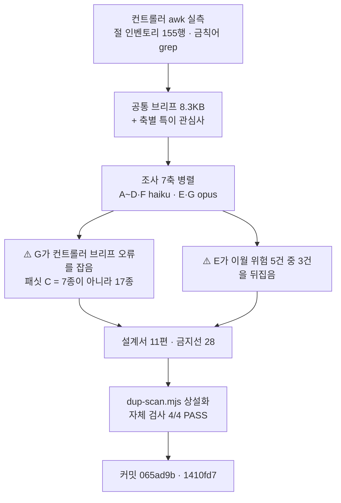

# 인수인계 (HANDOFF)

**갱신일**: 2026-08-16
**브랜치**: `main` · 최신 커밋 `1410fd7`
**작업트리**: 이 문서 · 설계서 §13만 미커밋 / stash 없음
**발행본**: **113편** (`ai-agent` 51 · `rag` 25 · `agentic-coding` 31 · `search-engineering` 6) · sitemap **174 URL**

> **이번 세션은 발행본을 만들지 않았다.** `ai-transformation` 분할 설계와 도구 상설화만 했다.
> 따라서 발행본 수·sitemap은 앞 세션과 같고, 그 동일성 자체가 빌드 검산의 기대값이다.

---

## 1. 이번 세션에서 한 일

**`ai-transformation` 분할 설계를 11편으로 확정하고 승인받았다. 그리고 축자 복제 스캔을 `scripts/`에 상설화해 미해결 23번을 닫았다.**



| 산출 | 값 |
| --- | --- |
| 설계서 | **32,363 B** · 13절 + 부록 A |
| 분할 | **11편** (본편 9 · Q&A 1 · 지도편 1) · 예상 약 **221 KB** |
| 조사 | **7축 병렬** · 산출 합계 약 **226 KB** |
| 금지선 | **28개** (앞 설계서 승계 20 + 카테고리 고유 **8**) |
| 도구 | [`scripts/dup-scan.mjs`](scripts/dup-scan.mjs) · `npm run dup-scan` / `dup-scan:verify` |

### ⚠️ 조사가 컨트롤러를 두 번 고쳤다 — 이번 세션 최상위

| 누가 | 무엇을 잡았나 | 안 잡았으면 |
| --- | --- | --- |
| **축 G** | 컨트롤러 브리프의 **「패싯 C는 7종」**이 틀렸다. `content/blog/tags.ts` L77 주석이 **`(17)`** 이고 `rag`·`llm`·`agentic-rag`·`embedding`·`vector-database`·`evaluation`·`human-in-the-loop`·`model-serving`·`knowledge-graph`·`machine-learning` 10종이 더 있다 | **11편 전부가 패싯 규칙 위반이었을 것이다.** 빌드는 막지 않는다 |
| **축 G** | **패싯 D도 상한 2**이고, G 자신이 제안한 11조합 중 2건이 D3이었다 | 자기 산출물을 스스로 반증한 유일한 축 |
| **축 E** | 이월 위험 5건 중 **3건이 뒤집혔다** (§3) | 기록대로 실행하면 **위험 4번은 상태를 악화**시킨다 |

> **브리프를 쓴 사람이 브리프의 오류를 못 잡는다.** 축 G는 브리프를 검증하라는 지시를 받지 않았고,
> 태그를 배정하려면 원본 어휘를 열어야 했기 때문에 잡았다. **실물을 열게 하는 과업이 검증을 부수적으로 만든다.**

### ⚠️ 컨트롤러가 조사 산술을 고쳤다 — 방향이 반대인 사례

축 B가 **「옵션 C: 3편 병합(권장)」**을 냈는데 그 3편 중 둘이 하한 13.3 KB 미달이었다(8~9 KB · 11~12 KB).
컨트롤러가 다시 계산해 **7파일 → 최대 2편**으로 확정했다.

| 묶음 | 원본 B | ×1.20 | 판정 |
| --- | ---: | ---: | :---: |
| 개발+QA+배포 | 14,652 | **17.6 KB** | ✅ |
| 기획+디자인 | 5,682 | 6.8 KB | ❌ |
| 마케팅+경쟁사 | 11,346 | 13.6 KB | △ |

> **축 B는 원본을 정확히 읽었다. 틀린 것은 산술뿐이다.**
> **에이전트 보고에서 「읽기」와 「계산」은 신뢰도가 다르다 — 수치가 판정을 낳는 자리는 컨트롤러가 다시 계산하라.**

### ✅ 축자 복제 스캔 상설화 — 자체 검사가 먼저다

```
자체 검사 — 발행본 113편 · 임계값 20자 · 색인 442,497개 윈도우
  PASS  ① 19자는 미검출        PASS  ② 20자는 검출
  PASS  ③ 실재 40자 주입 → 검출  PASS  ④ 비실재 문자열 → 미검출

agentic-coding\topic-map-reading-paths.md  —  0건  (링크 제목 11건은 별도 분류)
```

**자체 검사 4/4는 처음부터 통과했다. 결함을 잡은 것은 회귀 기준선이다** —
B9에서 사람이 0건으로 판정한 파일에 돌렸더니 **11건**이 나왔고, 전부 마크다운 링크 제목이었다.
HANDOFF가 「링크는 별도 분류」를 명시했는데 구현이 빠뜨린 것이다. `linkTitles()`를 넣고 0건을 재현했다.

> **검사기가 「작동한다」는 것과 「사람 판정을 재현한다」는 것은 다른 명제다.**
> **자체 검사는 전자만 증명한다. 후자는 사람이 판정을 끝낸 실물을 기준선으로 돌려야 나온다.**

---

## 2. 다음 세션이 이어받을 것

### ▶ **T1 착수** — 설계서 §9 배치 계획

| 배치 | 편 | 원본 | 상태 |
| :---: | --- | --- | :---: |
| **T1** | 편6·편7·편8 | `aiagent/06` | **▶ 승인됨. 미착수** |
| T2 | 편9 | `aiagent/08 §4~§8·§10` | 대기 |
| T3 | 편1·편4 | `aiteam` 조직·인프라 | 대기 |
| T4 | 편2·편3 | `aiteam/04_영역별` | 대기 |
| T5 | 편5 | `09`·`09a`·`09b` | 대기 |
| T6 | 편10 Q&A | `aiteam/08 §3` 9문항 | 전 편 발행 후 |
| T7 | 편11 지도편 | 재작성 | 카테고리를 닫는다 |

**T1을 먼저 치는 이유**: 가장 큰 원본(63,181 B)이고 **이월 위험이 여기에 집중**돼 있다.

### ⚠️ T1 브리프에 반드시 넣을 것 — 빠뜨리면 재작업이다

| # | 항목 | 근거 |
| ---: | --- | --- |
| 1 | **금지선 1~28 전문** (승계 20 + 고유 8) | 설계서 §11 |
| 2 | **금지선 25** — `06 §2-7` H3 제목(L225)·리드(L227)의 「3등급」은 **틀렸다. 4등급이 옳다.** 4방향 검산(제목·리드·mermaid 노드 수·표 행 수) | 설계서 §12-1 |
| 3 | **금지선 23** — 30에이전트 **세트가 셋**이다. 세트 C를 낼 때 A·B와 다름을 명시. 선례는 `thirty-agent-catalog.md` L150~166 | 설계서 §5-2 |
| 4 | **금지선 24** — 30종 명부를 다시 싣지 마라. **링크로 건다** | 설계서 §5-1 |
| 5 | **§7-1 출처 치환 서식** — `강의` 오염된 방어 7자리를 다시 쓰는 문안. 선례 `automation-scope-criteria.md:191` | 설계서 §7-1 |
| 6 | **태그 배정** — 편6·7·8 전부 **C2·D1·B1**로 패싯 검산 완료. **패싯 C는 17종, D도 상한 2** | 설계서 §8-1·§8-2·§8-3 |
| 7 | **0편 태그 30종 목록 전문** | 설계서 §8-3. **B9 브리프 첨부 시 사용 0건** |
| 8 | **`Bash` heredoc으로 산출물을 써라** | 미해결 30번. **조사 7기 전원 성공** |

### 확정된 결정 (다시 묻지 마라)

| 사안 | 결정 |
| --- | --- |
| **분량** | **상한 없다. 하한 13.3 KB만 지킨다**(금지선 11·13) |
| **시리즈 페이지** | 없다. `series`는 frontmatter 메타데이터일 뿐 라우트를 만들지 않는다 |
| ⚠️ **frontmatter 필드** | **11개가 전부 필수가 아니다.** `lib/blog/frontmatter.ts:77` — **`series`·`seriesOrder`·`updated`·`source`는 선택**. `str()`이 빈 문자열을 거부하므로 **`series: ""`는 빌드를 죽인다. 독립편은 필드를 생략한다** |
| **`ai-agent` 태그** | 「주제가 에이전트 자체인 편」에만 단다 — **편수 상한이 아니다** |
| **태그 패싯** | 3~5개, **같은 패싯 최대 2개.** ⚠️ **패싯 C는 17종 · 패싯 D도 상한 2** |
| **Q&A 편수** | `agentic-coding`은 4편을 냈으나 **이 카테고리는 1편이 상한**일 수 있다(문항 9개가 유일 소스) |
| **30종 명부** | 다시 싣지 않는다. **링크로 건다** |

### 진행 방식 — 9배치로 검증된 절차

```
1단계  분할 설계 → 승인                        ✅ 완료 (065ad9b)
2단계  배치로 나눠 변환, 배치마다 커밋·보고      ◀ T1이 여기
3단계  구현 미참여 에이전트가 5축 독립 검증
4단계  판정 → 1차 반영 → 스냅샷 → 재검증 2기 → 2차 반영 → 최종 독립 검증 → 커밋
```

**검증은 5축이다.** 나누는 기준은 주제가 아니라 **결함이 드러나는 방식**이다.

| 축 | 무엇을 보는가 | 티어 |
| :---: | --- | :---: |
| A | 쓰여 있는데 **틀린** 것 | opus |
| B | 쓰여 있는데 **근거가 없는** 것 | opus |
| C | **없는** 것 — **원본 인벤토리를 먼저 만들고** 그 목록을 들고 검색한다 | opus |
| D | **실행**하면 나오는 것 | sonnet |
| E | **기발행본과의 중복** — **이제 `npm run dup-scan`이 있다** | opus |

> ### ⚠️ **축 B의 정의는 배치 성격을 따라간다**
> B1~B8에서 축 B는 「원문에 없는 것을 썼다」였다. B9는 원본 가용분이 5 KB뿐이라
> **「발행본 30편에 있나」**로 바꿨고 그 재정의가 높음 1건을 잡았다.
> **`ai-transformation`은 T3~T5가 1인칭 제거로 대량 재서술이 일어나므로 그 배치들에서 다시 재정의하라.**

> ### ⚠️ 검증자에게 브리프도 배정표도 변환 보고서도 주지 마라 — B5에서 확립, B6~B9 재확인
> **대가는 오탐 2건 내외다. 이건 설계된 대가다.**
> **다만 오탐으로 판정할 때도 그 지적이 건드린 자리를 한 번 더 열어라** — B7·B8·B9 **3배치 연속**으로 그 자리에서 신규 결함이 나왔다.

> ### ✅ 「지우는 것이 기본 처방이다」를 **우선순위표로** 줘라 (삭제 → 좁히기 → 교체 → ❌추가)
> B8은 문장으로 줬고 B9는 4단 표로 줬다. **재검증 신규 결함 26 → 9.**
> 2차 반영 목표는 **수치로** 준다 — 「바이트 음수 · 새 문장 0자리 · 구조 불변」. **B7·B8·B9 3배치 연속 달성.**

### ⚠️ 판정 단계에서 반드시 물을 것

**「이 지적이 서술 문제인가 구조 문제인가」를 먼저 물어라.**
B9에서 컨트롤러가 좁게 판정했는데 **반영자가 정확히 고치자 그 정확함이 판정 자체를 반증**했다.

> **판정표가 「무엇을 고칠까」만 정하고 「그것을 고치면 무엇이 드러날까」를 묻지 않았다.**

---

## 3. ⚠️ 이월 위험 실측 — 6건 중 3건이 뒤집혔다

**설계서 §12 전문. 앞 설계서 §12-4가 이월한 위험을 축 E가 전건 실측한 결과다.**

| # | 앞 배치 기록 | 이번 실측 | 조치 |
| ---: | --- | --- | --- |
| **1** | 「정량 수치 방어 3자리가 제외 절과 함께 사라진다」 | **부분 정정** — 방어는 **7자리**이고 **4자리가 본문에 남는다**(L419·L421·L821·L823). 「출처 없는 성과표」 상태는 **일어나지 않는다.** 다만 7자리 전부 금칙어 `강의` 오염 | §7-1 치환 서식 |
| **2** | 「`06`이 `delegation-gap` 3조건을 격자로 만들었다」 | **2/3만 참** — `비가역`·`위험`은 §10-2에 대응하나 **`모호`는 §5-5(신뢰도 임계치)에 있다** | 3조건 대응을 주장하려면 **모호 축 출처를 §5-5로 밝혀라** |
| **3** | 「§2-8 4종 ↔ 안티패턴 10종 대조 미실시」 | **실시 완료** — 40셀 중 6셀 겹침(완전 2·부분 4). **10종 중 3종은 `06`에 대응물 없음** | 교차 링크만. **대조표는 싣지 않는다** |
| **4** | 「§11 L1008이 3등급이라 쓰고 답변은 4등급」 | ⚠️ **판정 반전** — **L1008의 「4」가 옳다.** 틀린 곳은 §2-7 **H3 제목(L225)·리드(L227)이고 둘 다 본문**이다. **§11을 걷으면 정정 단서만 사라져 상태가 나빠진다** | **금지선 25** |
| **5** | 「`10`이 §11-1을 흡수, 3자리 배제됨」 | **§11-1 카드 3개 전부가 본문에 축자 수준으로 존재 → §11 제외 시 손실 0** | **위험 해제** |
| **6** | *(앞 배치 미지목)* | **신규** — 에이전트 ID **8종**이 `06`·`08`·발행본 3편에 동시 존재: `lead-scorer` `proposal-writer` `ad-optimizer` `cs-responder` `faq-builder` `escalation-router` `budget-analyst` `kpi-analyst` | §5-1·§5-2 |

> ### 왜 3건이나 뒤집혔나
> **앞 배치들은 「이 자리를 나중에 봐야 한다」를 적었을 뿐 열어 보지 않았다.**
> 6-7절(매 배치 검산되는 값만 살아남는다)의 다른 얼굴이다 — **이월 목록도 검산 대상이어야 한다.**
> **T1 착수 전에 위험 1·2·4를 브리프에 「정정된 형태로」 넣어라. 원문 그대로 넣으면 잘못된 지시가 된다.**

### 앞 배치 설계서 정정도 유효하다

| 배치 | 요지 |
| --- | --- |
| B1~B8 | `agentic-coding` 설계서 §3·§9의 ⚠️ 블록 참조 (팽창률 1.20→1.76 · `05 §11` 성격 · 진단 오류 29건 · 축 E 신설) |
| B9 | 「본문 참조 52곳」 검산 불가(실측 최소 69) · 개요 파일은 **가용분을 먼저 재라** · **frontmatter 11필드 전부 필수는 거짓** |

---

## 4. 미해결 과제

| # | 항목 | 상태 |
| ---: | --- | --- |
| 1 | **mermaid 노드 라벨 우측 1~9px 클리핑** | `foreignObject` 폭 문제. 전역 렌더링 이슈로 별건 처리 |
| 2 | **FR-1.4 스크롤스파이 미구현** | 기존 위키에도 없어 신규 후퇴는 아니다 |
| 3 | **메인 페이지 LCP 6.6초** | Lighthouse 77점. 블로그 도입 이전에도 77점 |
| 4 | **싱글톤 태그 재측정** | 2차 전체를 마친 뒤 |
| 5 | **`cto_learning_roadmap` Q1·Q3** | 발행 가능 판정을 받았으나 미변환 |
| 6 | **어휘 81종 중 0편 태그 30종** | 설계서 §8-3. **B9 브리프 첨부 시 사용 0건 — T1도 첨부하라** |
| 7 | **훅 차단 채널이 세 자료에서 갈린다** | 편4(표준 에러) · 편11(stdout JSON `reason`) · `09 §2-4`(원본 충돌). **B8·B9 모두 미합류.** `ai-transformation` T5가 `09`를 맡으므로 **그때 정면으로 만난다** |
| 8 | **원본 `04 §8-2` 「3대 구성 요소」인데 표는 4행** | 원본 이월 불일치 |
| 9 | **원본 `05` 내부 수치 불일치** | L56 도식 `5+4 필드` ↔ L145 표 `핵심 5 + 확장 5` |
| 10 | **`05 §3-2` 제품 결함 3건의 현재 유효성** | 미확인 |
| 11 | **무귀속 판정 잔존 2건** | 편14 L232 · 편13 L235 |
| 12 | **B1 편2~5의 `2026-04` 표기 재확인** | 「강의 시점」인지 「문서 기준일」인지 미구분 |
| 13 | **편7 `feedback` 예시가 원본 MEMORY.md와 소재 겹침** | 의도적 |
| 14 | **편8 용어표 「멀티턴 대화」 본문 0회** | 개념 기준 확정으로 재판정 대상 |
| 15 | **기발행본 축약 용어표의 0회 행 미점검** | `reversibility-before-permission` L33 `SSH 키`. **사용자 결정 — 기발행본 수정은 새 검증 표면** |
| 16 | **편25가 발행본 최대 (39,676 B)** | 렌더링·ToC 체감 미확인 |
| 17 | **`08 §12` 임계값 3건이 미발행 절 근거** | CTR 1.5%/1%(§5) · OCR 80%·「병렬 절대 금지」(§8). **T2에서 §5·§8 발행 시 교차 링크로 해소** |
| 19 | **`08 §12-1` 원본 모순을 발행본이 병기로만 처리** | 원본이 읽기 전용이라 해소 불가 |
| 20 | **`Supabase` 탈브랜딩 일관성 미대조** | 다른 카테고리와 미대조 |
| 21 | **앞 배치 발행본 표 수치가 인용블록 표 결함의 영향을 받았을 수 있다** | **재확인 미실시** |
| 22 | **`industry-claude-md-templates.md:131` 「앞 절반」이 짝 없이 남았다** | 비차단 |
| ~~23~~ | ~~축자 복제 자동 스캔 미상설화~~ | ✅ **이번 세션 해소** — [`scripts/dup-scan.mjs`](scripts/dup-scan.mjs) |
| 24 | **20자 임계값의 타당성 미검증** | 근거는 `agentic-coding` 설계서 §6-4. **스크립트는 `--min N`으로 바꿀 수 있다** |
| 26 | **`10 §5` 수치 6종의 출처 표기가 편마다 갈릴 수 있다** | 축 A·C가 독립적으로 같은 유형에 도달 |
| 27 | **`search-engineering` 2편이 inbound 0** | `search-engineering-qna` · `search-system-overview`. 지도편(`topic-map-reading-paths`·`rag-knowledge-map`)은 **구조적 성격이라 결함 아님** |
| 28 | **주제 10의 2차·3차 깊이 판단이 갈린다** | B9 미반영 판정 |
| 29 | **지도편 mermaid 「기반」 노드가 자식 셋 중 하나를 안 가리킴** | B9 미반영 — **고치면 다른 노드와 어휘가 충돌한다** |
| 30 | **`reviewer` 에이전트에 `Write` 도구가 없다** | 정의가 `Read, Grep, Glob, Bash, PowerShell`. **도구 추가는 「수정 금지」를 도구 수준에서 강제하는 설계를 깬다 → 브리프에 heredoc을 명시하는 쪽이 맞다.** 이번 조사 7기 전원 성공 |
| **31** | **`09a` Skills 층위 최종 판정** | **신규.** 조사 D·G 모두 「팀 절차 외부화 층위」로 판정했으나 **T5 착수 시 T1~T4 발행본과 재대조** |
| **32** | **`05 §3` MCP 4계층 중 어디까지 실을지** | **신규.** 프로토콜·도구통합·**팀 공유**·거버넌스. 발행본 `mcp-selection-practice`와 층위 대조 필요 |
| **33** | **`07` 기업 사례의 시점 유효성** | **신규.** Klarna 재채용(2025) · Duolingo 철회(2026). **시점 표기를 반드시 남긴다** |

---

## 5. README/문서 갱신 필요 (이번 세션에서 고치지 않음)

**열세 번째 이월이다.** README는 2026-08-07(`7f28866`) 이후 손대지 않았고 그 사이 **34커밋**이 쌓였다.

| 낡은 부분 | 왜 낡았나 | 확인할 진실원 |
| --- | --- | --- |
| 프로젝트 구조 트리 | `content/`·`scripts/`·`tests/` 없음 | 실제 디렉터리 |
| 기술 스택 | Vitest·react-markdown·mermaid 없음 | [`package.json`](package.json) |
| 기능 설명 | 블로그 **113편·4카테고리**가 통째로 없음 | [`content/blog/`](content/blog/) |
| `npm run` 스크립트 | **`dup-scan`·`dup-scan:verify`가 이번에 추가됐다** | [`package.json`](package.json) |

**고치지 않은 이유**: 기능 설명·아키텍처 서술은 여러 소스를 교차 대조해야 정확한데, 핸드오프는 세션 끝이라 컨텍스트가 가장 얕다.

### ⚠️ 환경변수 검사 신호는 **오탐이다. 고치지 마라**

`LANGCHAIN_PROJECT`·`OPENAI_API_KEY`·`TAVILY_API_KEY`·`UPSTAGE_API_KEY` — **전부 `content/blog/**/*.md`의 코드 예제 안**이다.
정적 export라 런타임 환경변수가 없다. 실제로 쓰는 것은 [`lib/site.ts`](lib/site.ts)의 `NEXT_PUBLIC_SITE_URL` **하나**다.

---

## 6. 알아둘 함정 — 이번 세션에서 새로 배운 것

### 6-1. ⚠️ 이월 목록은 검산되지 않으면 썩는다 — 이번 세션 최상위

| | |
| --- | --- |
| 무엇이 일어났나 | 앞 설계서가 이월한 위험 6건을 실측하자 **3건이 뒤집혔다.** 그중 **1건은 방향이 정반대**였다 |
| 왜 | 「나중에 봐야 한다」를 적었을 뿐 **한 번도 열어 보지 않았다.** 위험 4는 두 배치를 건너오며 그대로 복사됐다 |
| 처방 | **이월 항목을 브리프에 넣기 전에 실측하라.** 원문 그대로 넣으면 **잘못된 지시**가 된다 |

> **위험 4를 기록대로 실행하면 「§11을 걷어라」가 되는데, §11이 유일하게 옳은 값을 담고 있다.**
> **이월 기록을 믿고 실행했으면 상태를 악화시켰을 것이다.**

### 6-2. 브리프를 쓴 사람은 브리프의 오류를 못 잡는다

축 G가 컨트롤러 브리프의 **「패싯 C는 7종」**(실제 17종)을 잡았다. **검증 지시를 받지 않았다.**
태그를 배정하려면 `tags.ts`를 열어야 했고, 열었기 때문에 봤다.

> **처방: 브리프에 적은 수치라도 「그 실물을 열어야만 수행할 수 있는 과업」을 하나 배정하면 검증이 부수적으로 따라온다.**
> 「이 브리프를 검증하라」는 별도 축보다 싸고 정확하다 — **자기 과업을 하다가 걸리는 것은 동기 부여가 필요 없다.**

### 6-3. 에이전트 보고에서 「읽기」와 「계산」은 신뢰도가 다르다

축 B는 7파일을 정확히 읽고 바이트도 맞게 인용했다. **틀린 것은 곱셈과 합산뿐**이었고,
그 결과 **하한 미달 2편을 「권장」으로 냈다.**

> **수치가 판정을 낳는 자리는 컨트롤러가 다시 계산하라.** 읽기는 위임하고 산술은 회수한다.
> 이번엔 컨트롤러 자신의 설계서에서도 같은 유형이 나왔다 — 편3을 14,500 B로 적었는데 실제 16,078 B였다.
> **그래서 §3에 「합이 가용분과 정확히 일치하는가」 검산 줄을 넣었다**(163,515 = 편1~9 합, 잔차로 정의된 항 없음).

### 6-4. 자체 검사는 「작동한다」만 증명한다 — 「사람 판정을 재현한다」는 별개다

`dup-scan.mjs`의 자체 검사 4/4는 **처음부터 통과**했다. 결함(링크 제목 미분류)을 잡은 것은
**B9에서 사람이 0건으로 판정한 파일을 기준선으로 돌린 것**이다. 11건 → 원인 규명 → 0건 재현.

> **검사기를 만들면 반드시 「사람이 이미 판정을 끝낸 실물」을 하나 통과시켜라.**
> 합성 테스트는 자기가 상상한 실패만 잡는다.

### 6-5. 도구가 없어서 유휴가 되는 문제는 브리프로 해결된다 — 7/7 성공

`reviewer`·`scout`에 `Write`가 없어 **4배치 연속으로 보고서 유실**이 있었다.
이번 공통 브리프 §6에 **heredoc 사용법 + 「빈 파일을 먼저 만들고 절마다 `>>`로 이어 붙여라」**를 넣었고
**조사 7기 전원이 파일을 남겼다.**

> **도구를 추가하는 것은 「원본 수정 금지」를 도구 수준에서 강제하는 설계를 깬다.**
> **제약을 유지한 채 우회로를 문서화하는 쪽이 옳다.**

### 6-6. PowerShell 문법을 Bash 도구에 쓰면 커밋 메시지가 오염된다

`git commit -m @'...'@`를 **Bash** 도구에서 실행해 `@'`가 리터럴로 들어가 제목이 `@ feat(docs): ...`가 됐다.
미푸시 상태라 `git commit --amend -F - <<'EOF'`로 고쳤다.

> **이 환경은 셸이 둘이다. 도구를 고를 때 히어독 문법도 같이 골라라** — Bash는 `<<'EOF'`, PowerShell은 `@'...'@`.

---

## 7. 검증 명령

```powershell
cd C:\Users\aeby\vscode\withwooyong.github.io

npm test              # 36개 통과 (tests/blog/ 3파일)
npx tsc --noEmit      # 0
npm run build         # 0, [sitemap] 174개 URL   ← 발행 전이므로 앞 세션과 동일해야 한다

npm run dup-scan:verify                        # 검사기 작동 증명 — 본 스캔 전에 반드시
npm run dup-scan -- --category ai-transformation   # 신규 편 전체를 기발행본과 대조
npm run dup-scan -- content/blog/ai-transformation/<slug>.md
```

> **2026-08-16 실측**: `npm test` **36/36 통과** · `npx tsc --noEmit` **exit 0** · `npm run build` **성공, sitemap 174 URL**.
> **`package.json`을 고친 세션이므로 푸시 전에 셋 다 돌렸다.**

### `ai-transformation` 발행 시 검사 — 원본 성격이 달라 항목이 늘었다

```powershell
# 금칙어 — 기대 0건
Select-String -Path "content\blog\ai-transformation\*.md" `
  -Pattern "면접|커닝페이퍼|암기용|화이트보드|이력서|강의|수강|Part [0-9]|CH0[0-9]|예상 질문"

# 민감정보 — 기대 0건. ⚠️ 원본에 허우용 27자리·야나두 2자리가 있다
Select-String -Path "content\blog\ai-transformation\*.md" `
  -Pattern "히츠|야나두|TVING|티빙|BTV|허우용|teddylee|teddynote|argus|FASTCAMPUS|실장|커머스개발"

# ⚠️ 1인칭 잔재 — 이 카테고리 고유. 앞 카테고리에는 없던 검사다
Select-String -Path "content\blog\ai-transformation\*.md" `
  -Pattern "제가 |저는 |나의 |내가 |입사|지원자|본인은"

# 태그 패싯 — 빌드가 못 잡는다
Select-String -Path "content\blog\ai-transformation\*.md" -Pattern "^tags:"
```

> **알려진 오탐**
> - `허우용` — `out/` 기준 스캔은 nav·푸터·SEO 메타를 잡는다. **원고(`content/`) 기준으로 스캔할 것**
> - `테디노트`·`패스트캠퍼스` — `source:` 출처 표기. **정규식은 영문만 잡는다**
> - **`채용`** — 에이전트가 담당하는 **업무 도메인 이름**이며 저자의 구직 활동이 아니다. `recruiter` 에이전트 정의 포함
>
> **판정 기준**: 문장의 주어가 **독자의 발화**면 화법, **대상의 성질**이면 서술이다.

### 발행본 실측 — 펜스 스킵 + 인용블록 표 포함

```bash
LC_ALL=C awk '
  /^```/ { fence=!fence; fc++; next }
  !fence && /^## / { h2++ }
  !fence && /^[ ]*>?[ ]*\|[ ]*[-:][- :|]*\|[ ]*$/ { tb++ }
  END { printf "H2 %d · 표 %d · 펜스 %d\n", h2, tb, fc }' <파일>
```

**⚠️ `^\|`만 보면 인용블록 안의 표를 놓친다. 코드펜스 총 개수가 짝수인지도 세라.**

### ⚠️ 도식 검산 — `ai-transformation`은 축이 바뀐다

**`aiteam/` 18파일에 mermaid가 0개다.** 앞 배치의 「원본 도식 총계 일치」 검산이 **성립하지 않는다.**

> **바뀐 질문: 「새로 그린 도식의 모든 노드·화살표에 본문 근거 줄이 있는가」**(금지선 28).
> `aiagent/06`(11개)·`08`(10개)에만 총계 검산이 적용된다.

### 링크·SC-10 검사 (bash)

```bash
# 내부 링크 전건 실재 확인
grep -ho '/blog/[a-z-]*/[a-z0-9-]*/' content/blog/*/*.md | sort -u | while read l; do
  cat=$(echo "$l" | cut -d/ -f3); slug=$(echo "$l" | cut -d/ -f4)
  [ -n "$slug" ] && [ ! -f "content/blog/$cat/$slug.md" ] && echo "MISSING: $l"
done

# SC-10 들어오는 링크가 0인 글 — 현재 4편
for f in content/blog/*/*.md; do
  s=$(basename "$f" .md)
  n=$(grep -rl "/$s/" content/blog/ --include=*.md | grep -v "/$s.md" | wc -l)
  [ "$n" -eq 0 ] && echo "들어오는 링크 0: $s"
done
```

---

## 8. 소스 위치

| | 경로 |
| --- | --- |
| 원본 (읽기 전용, **수정 금지**) | `C:\Users\aeby\vscode\yanadoo-exit\shared\knowledge\` |
| 발행본 | [`content/blog/<카테고리>/<slug>.md`](content/blog/) — **113편** |
| 카테고리 정의 | [`content/blog/categories.ts`](content/blog/categories.ts) — 12개 등록, **4개 발행** |
| 태그 통제 어휘 | [`content/blog/tags.ts`](content/blog/tags.ts) — 81종. ⚠️ **L77 패싯 C 주석 `(17)`을 직접 확인하라** |
| **frontmatter 검증** | [`lib/blog/frontmatter.ts`](lib/blog/) — ⚠️ **L77 `series` 선택 필드 처리** |
| **축자 복제 스캔** | [`scripts/dup-scan.mjs`](scripts/dup-scan.mjs) — `npm run dup-scan` / `dup-scan:verify` |
| 요구사항 | [`docs/superpowers/specs/2026-08-07-tech-blog-requirements.md`](docs/superpowers/specs/2026-08-07-tech-blog-requirements.md) — §13·§14·§15 |
| ▶ **`ai-transformation` 설계서** | [`docs/superpowers/plans/2026-08-14-ai-transformation-category-split-design.md`](docs/superpowers/plans/2026-08-14-ai-transformation-category-split-design.md) — **T1은 §9·§11·§12를 먼저 읽어라** |
| `agentic-coding` 설계서 | [`docs/superpowers/plans/2026-08-08-agentic-coding-category-split-design.md`](docs/superpowers/plans/2026-08-08-agentic-coding-category-split-design.md) — 금지선 1~20의 원본 |
| `ai-agent` 설계서 (템플릿) | [`docs/superpowers/plans/2026-08-08-ai-agent-category-split-design.md`](docs/superpowers/plans/2026-08-08-ai-agent-category-split-design.md) |

### ⚠️ 조사 산출물은 스크래치패드에 있다 — `/clear` 후에도 이 경로로 읽어라

```
C:\Users\aeby\AppData\Local\Temp\claude\C--Users-aeby-vscode-withwooyong-github-io\
  898dce7e-a7a1-49f2-b313-330be3d2a99d\scratchpad\
    survey\      COMMON-BRIEF.md · survey-{A..G}.md
    inventory\   sections.tsv · forbidden.txt · filesizes.tsv
```

| 축 | 파일 | 크기 | 무엇이 들었나 |
| :---: | --- | ---: | --- |
| 공통 | `COMMON-BRIEF.md` | 8.3 KB | **T1 브리프의 골격으로 재사용하라** |
| A | `survey-A.md` | 25.2 KB | `aiteam/00~03` |
| B | `survey-B.md` | 23.2 KB | `04_영역별` 7파일 ⚠️ **산술 오류 있음 — 설계서 §3이 정정본** |
| C | `survey-C.md` | 7.0 KB | `05~07` 기업 사례 11개 출처 |
| D | `survey-D.md` | 10.0 KB | `08·09·09a·09b` |
| **E** | `survey-E.md` | **80.1 KB** | **`aiagent/06` 전수 · 이월 위험 5건 전건 판정** |
| F | `survey-F.md` | 9.5 KB | `08 §4~§10` |
| **G** | `survey-G.md` | **71.0 KB** | **발행본 113편 대조 · 태그 패싯 실측** |

> **가장 값이 큰 것은 `survey-E.md`와 `survey-G.md`다. T1은 E를 반드시 읽어라.**
> **핵심 판정은 설계서 본문에 옮겨 적었으므로 설계서만으로도 T1을 시작할 수 있다.**
