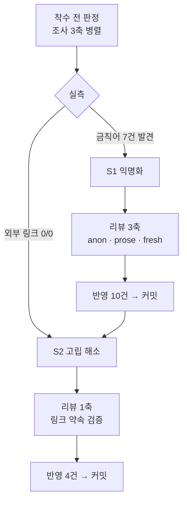

# 인수인계 (HANDOFF)

> **작성 시점** 2026-08-18 · S2 커밋 직후
> **상태** `search-engineering` 6편 **익명화 완료 + 양방향 고립 해소**. 발행본은 **124편 그대로**(새 글 없음).
> **커밋 2건** — `0ef044f`(S1 익명화) · `0acf509`(S2 링크) · 이 문서 커밋까지 **3건**. 세션 끝에 **푸시함**.

---

## 1. 이번 세션에서 한 일

`ai-transformation`이 T7로 닫힌 뒤 **다음 배치가 미정**이었고, 사용자가 `search-engineering` 마무리를 택했다.
그런데 착수 전 실측에서 **예상과 다른 것**이 나와 계획이 바뀌었다.

| 단계 | 무엇 | 커밋 |
| --- | --- | --- |
| **S1** | 사례편 익명화 + 한영검색 **사실오류** 정정 | `0ef044f` |
| **S2** | `rag` ↔ `search-engineering` 양방향 링크 4건 | `0acf509` |
| S3 | 지도편 | **보류 판정** (§7) |

| 지표 | 값 |
| --- | ---: |
| 에이전트 | **11기** (조사 4 · 리뷰 5 · 검증 2) |
| 리뷰가 잡은 「반드시」 | **14건** |
| └ 작업이 **새로 만든** 것 | **11건** |
| └ 원래 있던 **사실오류** | 1건 |
| └ **계획의 전제를 반박**한 것 | 2건 (F1 · F3) |
| 빌드 | 5회 전부 exit 0 · sitemap **187 불변** |



---

## 2. ⚠️⚠️ 이번 세션 최상위 — **지우는 조작은 안전하고, 빈자리를 메우는 조작이 결함을 만든다** (금지선 44)

익명화든 링크 추가든 **새로 쓴 문장은 예외 없이 지적을 받았다.** 타율 100%다.

| 조작 | 무엇이 무너졌나 |
| --- | --- |
| 표에 「규격의 출처」 행 **신설** | 2기를 한 값으로 뭉갰는데 같은 화면 mermaid는 두 국면으로 그린다 — **논지를 지탱하는 칸이 모순** |
| 리드 문장 **재작성** | 「회사·규모」를 빼자 남은 축이 서두와 같아져 **재진술** |
| 벤더명 「3SoftPlus를 통해」 **삭제** | 관형절을 받치던 부사구가 사라져 「도입**해** 사용했다」로 **주술 파괴**. 고친 뒤에도 「도입**한** … 사용했다」로 **동어반복** |
| 회사·서비스 열 **삭제** | 1기 「N-Screen 통합 API」와 2기 「IPTV N-Screen」의 **구분자가 함께 사라졌다** |
| 한 칸을 두 행으로 **분할** | 「다룬 범위」와 「대표 산출물」이 **가로로 어긋났다.** 한 칸일 때는 불일치가 생길 수 없었다 |

반면 **지우기 자체는 안전했다** — 정보 소실은 「시기」 2칸뿐이고 논리를 끊지 않았다(리뷰 대조표 결함 0건).

### 다음 배치가 할 것

**리뷰 대안 중 「삭제」와 「최소 치환」을 우선 채택하라.** 실제로 후반부에 이 원칙을 적용하자 새 지적이 나오지 않았다.
T7의 §4(「고치기보다 덜어내기」)와 같은 결론이 **다른 경로로** 재확인됐다.

---

## 3. ⚠️⚠️ **링크는 참조가 아니라 약속이다** (금지선 45)

「거기서 무엇을 다룬다」는 **대상 편이 실제로 그것을 줄 때만 참**이다.

초안: 「형태소 분석기가 BM25 **점수에** 어떻게 개입하는지는 [한글 검색 구현]에서 다룬다」

리뷰가 **세 층으로** 반박했다:

| 층 | 근거 |
| --- | --- |
| 대상 편 실측 | `korean-text-search.md` 251줄에서 **분석기와 점수를 잇는 서술 0건.** 두 주제가 다른 구획에 격리(분석기 30–88 / BM25·스코어 184–208) |
| **출발 편이 세운 축** | `rag-pipeline-retrieval.md:15`가 「**아예 들어오지 않았거나**, 들어왔는데 **순위가 낮았거나**」로 갈라 뒀다. 대상 편의 분석기 내용은 전부 **recall 축**인데 삽입 문장은 **순위 축**에 붙였다 |
| **리포 자신의 라우팅** | `search-system-overview.md:116`이 BM25 점수 질문의 행선지를 **다른 편**(`elasticsearch-architecture`)으로 안내한다 |

> **「내가 보기에 과장이다」가 아니라 「글이 스스로 세운 규칙을 어겼다」는 논증이라 반박할 수 없다.**
> 리뷰 브리프에 **「링크가 약속한 것을 대상 편이 실제로 주는가 — 대상 파일을 열어 파일:줄로 판정하라」**를 반드시 넣어라.

---

## 4. ⚠️⚠️ **개별 대안이 각각 옳아도 동시 적용하면 충돌한다** (금지선 46)

리뷰 1판이 헤딩(`:32`)과 리드(`:34`)를 **서로 다른 항목으로** 지적했고 각 대안을 그대로 채택했더니,
두 줄이 **두 칸 거리**라 「두 번의 구축」·「나란히」를 공유하게 됐다.

리뷰어가 2판에서 **자기 제시 방식에 책임이 있다**고 적었다.

> **항목별 리뷰라는 형식 자체의 사각지대다.** 리뷰는 항목별로 쪼개 제시하지만 **반영은 한 파일에서 동시에** 일어난다.
> ⇒ 대안을 채택할 때 **두 대안의 물리적 거리**를 확인하라.

---

## 5. ⚠️⚠️ **낱말이 같아도 물건이 다를 수 있다** (금지선 47)

조사 단계에서 이 함정을 **걸러냈는데 컨트롤러 문장에서 재발했다.**

| 낱말 | 한쪽 | 다른 쪽 | 판정 |
| --- | --- | --- | --- |
| 토크나이저 | LLM BPE (`llm-token-cost`) | Nori·edge_ngram (`korean-text-search`) | 조사가 **후보 제외** ✅ |
| 색인 | 벡터스토어 색인 (`rag-pipeline-ingestion`) | 역인덱스 색인 | 조사가 **후보 제외** ✅ |
| **리랭커** | **LTR**(클릭 로그 학습, `search-system-overview:141`) | **Cross-Encoder**(질문·문서 동시 인코딩, `rag-pipeline-retrieval:291`) | ⚠️ **컨트롤러가 이어 놓음 → 리뷰가 잡음** |

⇒ 「이 파이프라인의 **LTR 자리에** Cross-Encoder 리랭커를 놓으면」으로 용어를 명시해 구분했다.

> **grep으로는 완벽한 후보가 링크하면 안 되는 자리인 경우가 있다.** 낱말이 아니라 **그 자리의 서술**을 읽어라.

---

## 6. ⚠️ 리뷰 설계 — **지적 목록을 주지 않은 새 눈이 가장 많이 잡았다** (금지선 48)

| 리뷰어 | 받은 것 | 낸 「반드시」 |
| --- | --- | ---: |
| `S1-review-anon` | 브리프만 | F1~F3 (**전제 반박**) |
| `S1-review-prose` 1판 | 브리프만 | 4건 |
| `S1-review-prose` 2판 | **자기 1판 지적 + 반영 내역** | 1건 |
| **`S1-review-fresh`** | 브리프만 · **앞선 지적 목록 없음** | **6건** |

`fresh`가 독립적으로 `:34`를 지적했는데 **prose 2판과 이유가 달랐다.** 두 리뷰어가 같은 줄을 다른 이유로 짚어
그 자리가 진짜 문제임이 드러났다.

> **목록을 주면 목록에 있는 것만 확인하고 「전부 해소됨, 통과」로 닫는다.**
> 반영 확인은 grep 세 줄이면 끝난다. 리뷰어에게 물을 것은 **「이번 반영이 무엇을 새로 만들었나」**다.
> 그리고 **「하지 않아도 되는 것」**(이미 통과한 검사)을 브리프에 명시하라 — 안 그러면 쉬운 검사부터 하다가 어려운 축이 빈다.

### 부수 수확 — `fresh`가 **원래 있던 사실오류**를 잡았다

「표를 가로로 읽어라」(금지선 37) 한 줄 때문에 용어표의 정의 칸과 예시 칸이 나란히 놓였고, 어긋남이 보였다.
그 다음 **두벌식 매핑 스크립트를 직접 짜서 왕복 검증**했다.

| 검증 | 결과 |
| --- | --- |
| 설 = ㅅㅓㄹ | `tjf` — 예1 정확 |
| 샬 = ㅅㅑㄹ | **`tif`** — 글의 `shal`이 아니다 |
| `shal` → 한글자판 | **「노미」** — 반대 방향도 아니다 |

**검색 엔지니어링 글에서 자기 전문 영역의 예시가 틀려 있었다.** 익명화와 무관한 원래 결함이라 이번 작업이 아니었으면 계속 공개됐을 것이다.

---

## 7. 다음 세션이 이어받을 것

### ▶ **다음 배치는 미정이다. 사용자가 정한다.**

| 카테고리 | 편수 | 설계서 | 지도편 | 상태 |
| --- | ---: | --- | :---: | --- |
| `ai-agent` | 51 | 있음 | ✅ | 완료 |
| `agentic-coding` | 31 | 있음 | ✅ | 완료 |
| `ai-transformation` | 11 | 있음 | ✅ | 완료 |
| `rag` | 25 | **없음** | ✅ | — |
| `search-engineering` | 6 | **없음** | ❌ | **익명화·고립 해소 완료** |

**합계 124편 · sitemap 187 URL.**

### S3(지도편) — **보류 판정. 재검토하려면 이 판정부터 반증하라**

조사 α가 「지도편 필요」를 권했으나 채택하지 않았다. 근거:

1. **6편이면 카테고리 인덱스로 충분하다.** 지도편이 정당했던 곳은 `ai-transformation`(11편)·`rag`(25편)다
2. 당시 이 카테고리는 **양방향 고립**이었다 — 지도편을 얹어도 **7번째 섬**이 될 뿐이었다
3. `ai-transformation` 지도편이 통한 것은 그 카테고리가 **이미 밖과 이어져 있었기** 때문이다(→`agentic-coding` 43 · →`ai-agent` 14 · →`rag` 5)

⇒ **S2로 고립이 해소된 지금은 근거 2가 약해졌다.** 다시 판정하려면 위 3개 근거를 각각 다뤄라.

### 원본에 남은 미사용 소스

`C:\Users\aeby\vscode\yanadoo-exit\shared\knowledge\` (**읽기 전용 · 수정 금지**)

| 디렉터리 | 문서 | 분량 | 비고 |
| --- | ---: | ---: | --- |
| `java-backend` | 11 | 638 KB | |
| `langgraph` | 12 | 510 KB | `rag`에 이미 3편 반영됨 |
| `high-traffic` | 11 | 508 KB | |
| `pm-harness` | 8 | 402 KB | |
| `pangyo-it` | 6 | 346 KB | |
| `pm-po` | 17 | 327 KB | |
| `bigdata` | 8 | 293 KB | |
| `learning` | 10 | 198 KB | |
| `recommendation` | 7 | 84 KB | 검색과 일부 교차 |
| `llm-search-recommend` | 1 | 37 KB | ⚠️ **`rag`와 주제 충돌** — §9 참조 |

⚠️ **`search/` 6개는 발행본 6편으로 1:1 소진됐다.** 미사용 소재 없음(조사 β 실측).

새 카테고리를 열면 **설계서부터 쓴다**(분할표 · 배치 계획 · 축 B 정의 · 금지선 승계).

### 확정된 결정 (다시 묻지 마라)

| 항목 | 결정 |
| --- | --- |
| 원본 | **읽기 전용.** 수정 금지 |
| 푸시 | **사용자가 명시적으로 요청할 때만.** 커밋과 푸시를 한 명령에 묶지 않는다 |
| 커밋 메시지 | **한글** |
| 커밋 구성 | 발행 커밋 = 글 + CHANGELOG + README + 설계서 / 인수인계 커밋 = HANDOFF **별도** |
| `source` 프론트매터 | 원본이 강의에서 온 편만 |
| **사명 표기** | **익명화한다** — 2026-08-18 사용자 판정. 「OTT 서비스」·「IPTV 서비스」. 단 **제품명은 유지**(코난테크놀러지·IDOL·Elasticsearch) |
| 금칙어 | 면접·커닝페이퍼·암기용·화이트보드·이력서·강의·수강·예상 질문 · 히츠·야나두·TVING·티빙·BTV·허우용·teddylee·teddynote·argus·FASTCAMPUS·실장·커머스개발 · **1인칭** |
| 태그 | 기존 통제 어휘 안에서만. `MAX_TAGS=6` |

---

## 8. ⚠️ 도구 함정 — 이 세션에서 실제로 걸린 것

| # | 함정 | 대응 |
| ---: | --- | --- |
| **49** | **파이프 뒤의 `$?`는 마지막 명령의 종료 코드다.** `grep … \| sort \| uniq -c` 뒤의 `$?`는 `uniq`의 것이라 **언제나 0** | grep을 **단독 실행**해 종료 코드를 확인하라. 검증자가 스스로 발견해 재확증했다 |
| **50** | **마크다운 강조가 낱말과 조사 사이에 끼면 grep이 못 잡는다.** `**IDOL**을`은 `IDOL을`로 검색되지 않는다 | 한국어는 조사가 붙어 **구조적으로** 발생한다(영어는 공백이 있어 안 생김). 강조를 벗긴 패턴으로도 재라 |
| **51** | **한국어 1인칭은 grep으로 분리되지 않는다 — 양방향으로 실패한다** | 거짓 양성: 「동시성 문**제가**」·「메이**저는**」 / 거짓 음성: 「**내** 검색 커리어」. 확장 패턴 `내 [가-힣]{2,6}`은 「인덱스 **내** 문서」를 대량 오탐한다. ⇒ **매칭 줄을 열어 읽어라** |
| **52** | **금칙어 목록이 라틴 표기만 담으면 한글 표기형이 통째로 빠진다** | `FASTCAMPUS`↔「패스트캠퍼스」 · `teddynote`↔「테디노트」. **`grep -i` 고정 + 한글 표기형 추가** |
| — | `grep -r`이 `out/`·`node_modules`를 훑어 **120초 타임아웃** | `Grep` 도구를 쓰거나 `--include`로 제한하라 |
| — | 환경변수 검사 HIGH 신호 5건 | **오탐 확정** — 소스코드 0건, 블로그 글 **코드 예시**에만 있다(`autogen-conversation-agents`·`crewai-agent-task-crew`·`document-parsing-bottleneck`). §12 참조 |

### ⚠️ 리뷰어 보고서 — 이번에도 어긋났다

`reviewer`·`scout`에 `Write`가 없어 heredoc을 명시해야 한다. 이번 세션 실태:

| 에이전트 | 파일명 | 재요청 처리 |
| --- | --- | --- |
| `S-survey-beta` | ⚠️ 지정 경로 아닌 `survey-report.txt` | — |
| `S-survey-gamma` | 정상 | ✅ 2판 작성 |
| `S1-review-prose` | 정상 | ⚠️ **1차 재요청 무시**, 2차에 처리 |

> **판정 기준은 메시지가 아니라 파일이다.** 유휴 알림이 오면 **무조건 `ls -la <스크래치패드>`부터** 돌려라.
> 재요청이 무시되면 **같은 리뷰어를 조르지 말고 새 눈을 띄워라** — 실제로 그게 더 많이 잡았다(§6).

---

## 9. 미해결 과제

### 9-1. ⚠️⚠️ **F3 — 금칙어 규칙이 한글 표기형을 놓친다** (최우선)

| 항목 | 실측 |
| --- | --- |
| 원인 | 규칙 목록이 `FASTCAMPUS`·`teddynote` **라틴 표기로만** 돼 있다 |
| 범위 | `source:` 프론트매터 **109편** |
| └ 「패스트캠퍼스 LangGraph 멀티에이전트 시스템」 | 31편 |
| └ 「테디노트 RAG 비법노트」 계열 | 44편 |
| └ 「AI 에이전트 실무 과정」 | 34편 (낱말로는 안 걸리나 **「강의·수강」 취지**엔 걸린다) |
| **공개 렌더** | `pages/blog/[category]/[slug].tsx:69-73`이 **「학습 출처: …」**로 본문 하단에 출력. 리뷰어가 라이브 URL로 확인 |

> ⚠️ **「ai-agent·rag 0건」이라는 기존 측정치가 거짓 음성이었다.**
> 처리하려면 ① 규칙에 한글 표기형 추가 ② `grep -i` 고정 ③ `source:` 를 검사 대상에 포함 ④ **109편의 `source:` 값을 어떻게 할지 사용자 판정**이 필요하다.

### 9-2. F1 — 익명화 전제가 사이트 구조상 무효

| 좌표 | 내용 |
| --- | --- |
| `pages/index.tsx:71` | meta description에 실명 + 회사 3곳 |
| `pages/index.tsx:291`·`:297` | `2017.04 - 2021.06` 배지 + 「BTV 백엔드 개발 매니저(PM)로 **검색** … CMS」 |
| `pages/index.tsx:324`·`:327`·`:333` | `2012.06 - 2017.04` + 「CJ Hellovision (TVING 서비스개발팀)」 + 「CMS, **검색**, 이미지 … **N-Screen**」 |
| `components/blog/blog-shell.tsx:94-101` | 모든 블로그 페이지 → `/` 링크. 주석에 「이 링크가 포트폴리오로 가는 유일한 경로다 (요구사항 FR-4.3)」 |

블로그의 「1기 OTT / CMS·랭킹추천 / N-Screen」이 홈페이지 `:333`과 **1:1로 매핑**된다.

> **이 수정이 실제로 한 일은 신원 은폐가 아니라 「기술글이 이력서처럼 읽히는 것」을 막은 것이다.**
> 사용자가 이를 알고 익명화를 택했다(2026-08-18). **효과의 이름을 바꿔 부르되 작업은 유효하다.**
> 진짜로 은폐하려면 사이트 구조를 바꿔야 하는데 그건 별건이다.

### 9-3. `search-engineering` inbound 0인 두 편

| 편 | inbound | outbound |
| --- | ---: | ---: |
| `search-engineering-qna` | **0** | 3 |
| `search-system-overview` | **0** | 10 (S2로 +1) |

조사·리뷰 **모두 「억지 아닌 자리가 없다」로 판정**했고 개수를 채우지 않았다.
`search-system-overview`는 카테고리의 **입구 편**이라 inbound 0이 자연스럽다는 견해도 있다(리뷰 §5).

### 9-4. `llm-search-recommend` 37 KB — ⚠️ 발행 제안이 **충돌 미확인 상태**

조사 β가 「벡터 검색 — Sparse·Dense·Hybrid」로 발행을 권했으나, **β는 `rag` 카테고리를 보지 않았다.**
γ 실측으로 `rag/rag-pipeline-retrieval.md`가 이미 「임베딩·벡터스토어·dense/sparse/하이브리드·리랭커」를 다룬다.

⇒ **발행하려면 겹침을 먼저 실측하라.** β의 권고를 액면가로 받지 마라.

### 9-5. 이전 이월 (T7·T6·T5 계열)

`git show 6186437:HANDOFF.md`의 §9-1~9-5를 승계한다. 주요한 것:

| # | 자리 | 요지 |
| ---: | --- | --- |
| **T7-d** | 편11 전반 | ⚠️ 자기 감사 분량 — 독자 축 2기가 독립 지적. 「빼도 될 30줄」 |
| **T7-h** | 편11 주제 1~13 **1차** 칸 | ⚠️ **아무도 안 쟀다** |
| **T6-a** | 편10 `:143`↔`:145` | ⚠️ **게이트를 세면 5 vs 6** |
| I-13 | 편10 `:230` | 「아홉 편」 — 컨트롤러 판정 **수정 불요**. 재검토하려면 그 판정부터 반증하라 |
| 1 | mermaid 노드 라벨 우측 클리핑 | `foreignObject` 폭 |
| 3 | 메인 페이지 LCP 6.6초 | Lighthouse 77점 |
| 5 | `cto_learning_roadmap` Q1·Q3 | 발행 가능 판정을 받았으나 미변환 |

---

## 10. 검증 명령

### 발행본 검사 — ⚠️ 이번 세션에서 갱신된 판

```bash
cd C:/Users/aeby/vscode/withwooyong.github.io
F=content/blog/<카테고리>/<slug>.md

# 금칙어 — ⚠️ -i 를 반드시 붙이고 한글 표기형을 포함하라 (금지선 52)
grep -qniE "면접|커닝페이퍼|암기용|화이트보드|이력서|강의|수강|예상 질문|히츠|야나두|yanadoo|TVING|티빙|BTV|허우용|teddylee|teddynote|테디노트|argus|FASTCAMPUS|패스트캠퍼스|실장|커머스개발" "$F"; echo "종료코드 $?"

# 사명·재직 연월
grep -qnE "CJ|헬로비전|SK브로드밴드|SKB|3SoftPlus|20[0-2][0-9]\.[0-9]{2}" "$F"; echo "종료코드 $?"

# 1인칭 — ⚠️ grep으로 분리되지 않는다. 매칭 줄을 열어 읽어라 (금지선 51)
grep -nE "저는|제가|저의|우리는|우리가|필자|내 [가-힣]{2,6}|나의 [가-힣]{2,6}" "$F"

# 구조 — ⚠️ 코드펜스 안 가짜 헤딩을 배제하라
awk '/^```/{f=!f;next} !f && /^## /' "$F" | wc -l
awk '/^```/{f=!f;next} !f && /^### /' "$F" | wc -l
grep -cE '^\|[-: |]+\|$' "$F"; grep -c '^```mermaid' "$F"

# 링크 후행 슬래시 — 출력이 있으면 결함
grep -o '](/blog/[a-z0-9/-]*)' "$F" | grep -v '/)'

npm run build   # exit 0 · sitemap 187
```

⚠️ **`|| echo "0건"`을 붙이지 마라** — 실행 실패와 0건 발견이 같은 문자열로 보인다.
⚠️ **파이프 뒤의 `$?`를 쓰지 마라** — `uniq`·`head`의 종료 코드가 잡힌다 (금지선 49).

### 카테고리 간 링크 지형

```bash
cd content/blog
# (A) 링크 출현 횟수 / (B) 고유 파일 수 — ⚠️ 두 정의를 반드시 구분하라
grep -rho '/blog/<카테고리>/[a-z0-9-]*/' --include='*.md' . | wc -l      # A
grep -rl  '/blog/<카테고리>/<slug>/'      --include='*.md' . | wc -l      # B

# 검산: 내부 링크만 있으면 inbound 총합 = outbound 총합이어야 한다
```

### mermaid 실렌더 (T7 확립)

정적 HTML에는 **SVG가 없다** — `components/mermaid.tsx`가 `useEffect`에서 렌더한다. 스켈레톤만 보고 판정하지 마라.
dev 서버 + Edge 헤드리스 CDP로 `document.querySelectorAll('svg[id^=mermaid-]').length`를 확인한다.

---

## 11. 소스 위치

| 무엇 | 경로 |
| --- | --- |
| 원본 (**읽기 전용**) | `C:\Users\aeby\vscode\yanadoo-exit\shared\knowledge\` |
| 리포 | `C:\Users\aeby\vscode\withwooyong.github.io` |
| 설계서 | `docs/superpowers/plans/2026-08-{08,14}-*-category-split-design.md` |
| 금지선 1~20 | `2026-08-08-agentic-coding-…-design.md` L1994-2022 |
| 금지선 21~34 | `2026-08-14-ai-transformation-…-design.md` §11 |
| 금지선 35~43 | `git show 6186437:HANDOFF.md` §2~§5·§8 |
| **금지선 44~52** | **이 문서 §2~§6·§8** |

### 이번 세션 산출물 — `/clear` 후에도 이 경로로 읽어라

`C:\Users\aeby\AppData\Local\Temp\claude\C--Users-aeby-vscode-withwooyong-github-io\8f181866-dfa9-4d56-849b-32b07e3732b7\scratchpad\`

| 파일 | 무엇 |
| --- | --- |
| `S-survey-alpha.md` | 발행본 6편 구조 (⚠️ 표 개수 열에 줄 수를 넣은 오류 있음) |
| `survey-report.txt` | 원본 대조 (⚠️ 파일명이 지정과 다름. 「익명화됨」 판정이 **실측으로 반증됨**) |
| `S-survey-gamma.md` | 링크 지형 **2판** — 검산 통과 |
| `S1-review-anon.md` | 익명화 완결성 (21 KB · **F1~F8**) |
| `S1-review-prose.md` | 글 완결성 **2판** (22 KB) |
| `S1-review-fresh.md` | 최종본 신규 검토 (21 KB · **반드시 6건**) |
| `S1-verify-build.md` · `S1-verify-final.md` | 빌드 검증 |
| `S2-survey-links.md` | 링크 자리 조사 (⚠️ 「역방향 후보 없음」이 **실측으로 반증됨**) |
| `S2-review-links.md` | 링크 약속 검증 (19 KB) |

⚠️ **스크래치패드는 세션별이다.** 다른 세션에서 열려면 이 절대 경로를 그대로 써라.

---

## 12. README/문서 갱신

### ✅ 이번 세션 — **README 수정 없음이 정답이다**

| 항목 | 실측 | 판정 |
| --- | --- | --- |
| 「124편 / 5개 카테고리」(L9) | 발행본 **124편** — 새 글 없음 | **정확** |
| 「187 URL」(L10) | 빌드 5회 전부 **187** | **정확** |
| `docs/*.md` | `search-engineering`은 **설계서가 없는** 카테고리 | 갱신 대상 없음 |

### ⚠️ 환경변수 검사 신호는 **오탐이다. 고치지 마라**

핸드오프 수집 스크립트가 `[HIGH] ENV_KEYS_IN_CODE_BUT_NOT_IN_README` 5건을 낸다:
`LANGCHAIN_PROJECT` · `LANGCHAIN_TRACING_V2` · `OPENAI_API_KEY` · `TAVILY_API_KEY` · `UPSTAGE_API_KEY`

**실측 결과 소스코드(`.ts`/`.tsx`/`.js`)에 0건**이고 **블로그 글 본문의 코드 예시**에만 있다:
`ai-agent/autogen-conversation-agents.md` · `ai-agent/crewai-agent-task-crew.md` · `rag/document-parsing-bottleneck.md`

> 정적 export라 런타임 환경변수가 없다. **README에 「OPENAI_API_KEY 필요」라고 적으면 거짓이 된다.**
> 이 신호는 매 세션 반복해서 뜬다. **매번 다시 조사하지 말고 이 항목을 근거로 넘겨라.**
