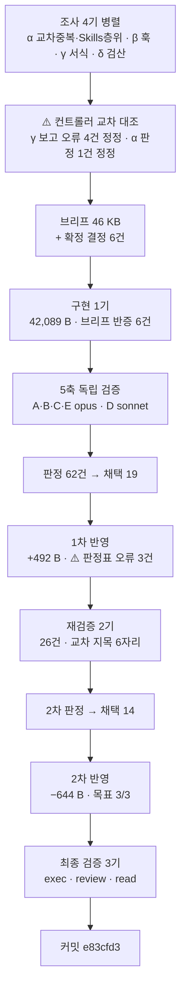

# 인수인계 (HANDOFF)

**갱신일**: 2026-08-17
**브랜치**: `main` · T5 발행 커밋 **`e83cfd3`**
**미푸시**: **`git log origin/main..HEAD`로 실측하라.** T5 발행 1커밋 + 문서 갱신분.
⚠️ **앞 배치 커밋(`9c0b9fd`·`6a56f4a`·`695cdad`·`37e413b`·`34cb459`)은 이미 푸시돼 있다. 직전 HANDOFF의 미푸시 수를 승계하지 마라.**
**작업트리**: 커밋 직후 `git status --short` **비어 있음 확인 완료** (T3 사고 재발 없음 · 2배치 연속)
**발행본**: **122편** (`ai-agent` 51 · `rag` 25 · `agentic-coding` 31 · `search-engineering` 6 · **`ai-transformation` 9**) · sitemap **185 URL**

> **`ai-transformation` T5를 발행했다.** 11편 중 **9편**이 나갔고 **2편이 남았다.**

---

## 1. 이번 세션에서 한 일

**`aiteam/09` + `09a` + `09b` 3파일(21,157 B)을 편5 하나로 통합 발행했다.**



| | slug | 가용 | 발행 | 팽창률 | 구조 |
| :---: | --- | ---: | ---: | ---: | --- |
| **편5** | `lean-three-layer-harness` | 20,481 B | **41,937 B · 469줄** | **2.048** | H2 10 · H3 11 · 표 14 · 펜스 9블록 · 도식 3 |

**제목**: 「레포에 커밋할 수 없는 것만 남는다 — 하네스·위키·게이트 세 레이어와 Skill 카탈로그 열하나」

### 단계별 산출

| 단계 | 결과 |
| --- | --- |
| 조사 4기 | ⚠️ **γ 보고 오류 4건**(순서 호칭 전칭 2건 자기모순 · 마지막 H2 오보 · 펜스 개수) · **α 판정 1건 컨트롤러 정정** |
| 컨트롤러 교차 대조 | 원본 전문 정독으로 **조사자가 볼 수 없는 자리 4건** 발견 |
| 구현 1기 | **구현자가 브리프 오류 6건 반증** |
| 5축 검증 | **62건** (A 17 · B 17 · C 12 · D 3 · E 13) · **교차 지목 5자리** |
| 1차 반영 | 채택 19 · **+492 B** · ⚠️ **판정표 오류 3건 되잡음** |
| 재검증 2기 | **26건** (1기 14 · 2기 12) · **교차 지목 6자리** |
| 2차 반영 | **목표 3/3** — **−644 B** · 새 문장 **0자리** · 구조 불변 · ⚠️ 판정표 오류 3건 더 |
| 최종 검증 3기 | **전원 「발행 가능」 · 차단 0건** |

**순증감 42,089 → 42,581 → 41,937 = −152 B.** 「1차는 늘고 2차는 준다」가 T4에 이어 재현됐다.

---

## 2. ⚠️⚠️ 이번 세션 최상위 — **삭제는 두 가지를 남긴다** (금지선 31)

**1차 반영에서 고친 두 자리가 재검증에서 「고쳤는데 또 나왔다」로 되돌아왔고, 원인이 서로 달랐다.**

| 실패 | 무엇이 남았나 | 좌표 |
| --- | --- | --- |
| **① 같은 주장의 다른 사본** | 판정표가 `:90` **한 좌표만** 지목해 고쳤는데, 같은 전칭이 `:76`·`:82`에 남아 **열 줄 간격으로 부딪혔다** | 「다섯 가지 모두 공유 방식이 같다」 ↔ 「대체로 … 자격증명만 레포 밖」 |
| **② 떠받치던 근거** | 앞부분을 지웠더니 남은 문장이 「**이 층을 여는 제목이 …라고 범위를 정하고 있다**」로 **발행본에 없는 제목**(원본 `09:20`의 H3)을 가리키게 됐다 | 범위 판정의 **유일한 근거**가 독자가 확인할 수 없는 문자열이 됐다 |

> ### ⇒ **T4가 확립한 「지운 뒤 지시대상을 확인하라」는 ②만 막는다**
>
> **①은 핵심어로 같은 주장을 다시 전수 grep해야 잡힌다.**
> **⇒ 삭제할 때마다 두 확인을 하라. T6 브리프에 절차로 넣어라:**
>
> ```bash
> grep -nE "<지우려는 주장의 핵심어>" "$F"   # ① 사본
> sed -n '<n-5>,<n+5>p' "$F"                 # ② 기대는 근거
> ```

---

## 3. ⚠️⚠️ 컨트롤러 오류 **9건** — 세 배치 연속 재현되고 **건수가 늘고 있다**

**T3 2건 → T4 8건 → T5 9건.**

| # | 어디서 | 컨트롤러가 쓴 것 | 실측 | 누가 잡았나 |
| ---: | --- | --- | --- | --- |
| 1 | 조사 브리프 | awk에 `NR` | **다중 파일이면 `FNR`이다.** 조사 γ의 좌표가 **전부 무효**가 됐다 | 컨트롤러 자신 |
| 2 | 실측 | 「mermaid **0개**」 | ⚠️ **3개.** `/^```/ { …; next }`가 먼저 걸려 `/^```mermaid/`에 도달하지 못했다 | 구현 보고서 |
| 3 | 변환 브리프 §4 | 고유값표에 「**LLM Wiki**」 이름 누락 | ⚠️ **`agent-equals-model-plus-harness:37`·`:119`·`:168`에 이미 발행. Karpathy 귀속(2026.04)까지** | 구현자 |
| 4 | 변환 브리프 §3-4 | 제거 목록 | ⚠️ **2건 누락** (`09a:34` 「우리 PRD」 · `09a:15` 「본인만」) | 구현자 |
| 5 | 변환 브리프 §3-6 | 「`09a:44`는 오탐이니 **고치지 마라**」 | ⚠️ **원본 자신이 같은 행에서 「신규 합류자」를 쓴다.** 손실 없이 치환 가능했다 | 구현자 |
| 6 | 변환 브리프 §8-4 | 「대시 앞이 고유명이면 **제목 전체**를 쓰라」 | ⚠️ **선례 1건짜리 소수 패턴.** 발행본은 `[Agent = Model + Harness]`처럼 고유명만 쓴다(5건) | 축 D |
| 7 | 변환 브리프 §5-2 | 「Layer 1의 Hooks 범위를 한 문장으로 한정하라」 | ⚠️ **한정이 105줄 뒤 `:197` pre-push·`:403` 「훅/스케줄」과 충돌** | 축 A·B (교차) |
| 8 | 1차 판정표 P-15 | 「비교표 오른쪽 열에 **귀속을 붙여라**」 | ⚠️ **규모 행은 원본 `09:41` 축자.** 원본을 이 글의 창작으로 **강등**할 뻔했다 | 1차 반영자 |
| 9 | 2차 판정표 Q-8 | 「**이 절의** 예시로 범위를 넓혀라」 | ⚠️ **판정표 자신이 「공시보다 **앞**의 펜스」라 적어 놓고 처방은 「이 절」이었다.** 다른 H3 절이라 결함이 남는다 | 2차 반영자 |

> ### ⇒ T6 컨트롤러가 지킬 것
>
> | # | |
> | ---: | --- |
> | 1 | **명령을 브리프에 넣기 전에 직접 돌려 보라.** 1·2번은 명령 자체의 결함이고, 조사자는 그것을 성실히 실행해 **무효한 결과를 정확히 보고했다** |
> | 2 | **「기발행본에 있다/없다」를 쓰기 전에 어휘를 3계열로 grep하라**(금지선 33). 3번이 그래서 났다 |
> | 3 | **「고치지 마라」를 쓰기 전에 「고칠 수 있는가」를 확인하라**(금지선 34) |
> | 4 | **처방을 쓴 뒤 그 처방이 자기 근거와 맞는지 다시 읽어라.** 9번은 판정표가 **자기가 쓴 근거와 어긋나는 처방**을 냈다 |

---

## 4. 다음 세션이 이어받을 것

### ▶ **T6 착수** — 설계서 §9

| 배치 | 편 | 원본 | 상태 |
| :---: | --- | --- | :---: |
| ~~T1~~ | ~~편6·7·8~~ | ~~`aiagent/06`~~ | ✅ `9c0b9fd` |
| ~~T2~~ | ~~편9~~ | ~~`aiagent/08 §4~§8·§10`~~ | ✅ `6a56f4a` |
| ~~T3~~ | ~~편1·편4~~ | ~~`aiteam/01·02·07` · `05·06`~~ | ✅ `695cdad` |
| ~~T4~~ | ~~편2·편3~~ | ~~`aiteam/03` · `04_영역별` 7파일~~ | ✅ `37e413b` |
| ~~T5~~ | ~~편5~~ | ~~`aiteam/09`·`09a`·`09b`~~ | ✅ **`e83cfd3`** |
| **T6** | **편10 Q&A** | `aiteam/08 §3` 9문항 **+ 각 편** | **▶ 다음** |
| T7 | 편11 지도편 | `00 §1` 골격 + 재작성 | 카테고리를 닫는다 |

### ⚠️⚠️⚠️ **T6는 착수 전에 「1편이 성립하는가」부터 판정하라** — 컨트롤러 실측

**`aiteam/08_면접_스토리텔링.md`는 전량 11,004 B이고 설계서가 「§3의 9문항만」을 소스로 지정했다.**
**컨트롤러가 절 단위로 실측했다:**

| 문항 | 줄 | B |
| --- | ---: | ---: |
| §3 리드 | L33 | 120 |
| Q1 조직을 어떻게 이끌 것인가 | L37 | 483 |
| Q2 생산성 측정 | L40 | 580 |
| Q3 주니어 성장 | L43 | 603 |
| Q4 환각·보안 | L46 | 516 |
| Q5 도구만 깔면 되나 | L49 | 468 |
| Q6 직접 해본 것 | L52 | 943 |
| Q7 강제하나 | L56 | 490 |
| **Q8 첫 90일** | L59 | ⚠️⚠️ **40** |
| Q9 도구가 너무 많다 | L62 | 811 |
| **합계** | | **5,054 B** |

#### ⚠️ 함정 1 — **하한 미달 위험이 크다**

**5,054 B × 팽창률 1.63~2.71 = 8.2~13.7 KB.** **하한 13.3 KB를 간신히 넘거나 밑돈다.**
**금지선 11: 「13.3 KB를 밑돌면 인접 편과 병합하고 보고하라. 억지로 늘리지 마라.」**

**⇒ 설계서 §3이 편10 소스를 「`08_면접` §3 9문항 **+ 각 편**」으로 적었다. 「각 편」이 무엇인지가 T6의 첫 결정이다.**
**⇒ 대안: ① 발행본 9편에서 문항을 수급한다 ② 편11 지도편에 흡수한다 ③ 1편으로 내되 하한 미달을 보고한다**

#### ⚠️⚠️ 함정 2 — **Q8은 답변이 없다**

**Q8 「입사 첫 90일에 무엇을 하겠습니까?」가 40 B다. 본문이 없고 `08 §4`를 가리킨다.**
**그런데 `08 §4`(「입사 후 90일 실천 계획」 832 B)는 설계서 §4에서 「`aiteam/08` 전량 제외」로 확정됐다.**

**⇒ Q8은 소스가 제외 범위 안에 있다. 답변을 만들 수 없다.**
⚠️ **그리고 금지선 26이 「첫 90일에 할 일」을 편 제목·H2로 쓰는 것을 막는다.**
**⇒ Q8을 빼면 8문항이고 가용은 5,014 B다. 빼는 근거를 브리프에 명시하라.**

#### ⚠️ 함정 3 — **원본 전체가 금칙어 덩어리다**

파일명이 `08_면접_스토리텔링.md`이고 §3 제목이 「자주 묻는 질문 × 모범 답변」, Q6가 「**당신이 직접 해본 것**은 무엇입니까」다.
**질문 자체가 면접 질문 형식이라 「~입니까?」 어투를 그대로 옮기면 구직 맥락이 남는다.**
⚠️ **`agentic-coding` Q&A 4편의 서식을 먼저 실측하라** — 질문을 어떤 형태로 세웠는지가 T6 서식의 출발점이다.

```bash
ls content/blog/agentic-coding/*qna*
grep -n "^## \|^### " content/blog/agentic-coding/agentic-coding-qna-extensions.md | head -20
```

### T6 브리프에 반드시 넣을 것

| # | 항목 | 근거 |
| ---: | --- | --- |
| 1 | **금지선 1~34 전문** | 설계서 §11 + `agentic-coding` 설계서 L1998~L2021 |
| 2 | ⚠️⚠️ **하한 미달 판정을 먼저 하라** | **§4 함정 1** |
| 3 | ⚠️⚠️ **Q8은 소스가 제외 범위에 있다** | **§4 함정 2** |
| 4 | ⚠️⚠️ **금지선 31 — 삭제는 두 가지를 남긴다** | **§2. 이번 배치 최상위** |
| 5 | ⚠️ **금지선 33 — 유효성 대조를 통과한 0건도 거짓 음성일 수 있다. 어휘 3계열** | §5-2 |
| 6 | ⚠️ **금지선 32 — 귀속 오류에 반대 방향이 있다** | §5-3 |
| 7 | **금지선 34 — 오탐 판정과 「손대지 마라」는 동치가 아니다** | §5-4 |
| 8 | ⚠️ **`LC_ALL=C` 없이는 이모지 grep이 거짓 음성을 낸다** | T4 확립 · T5 재확인(원본 5건) |
| 9 | ⚠️ **다중 파일 awk는 `FNR`.** mermaid는 `next` 때문에 따로 세라 | **§3 오류 1·2** |
| 10 | **1인칭 정제식 + 오탐 목록** | §5-5 |
| 11 | ⚠️ **「처방도 검증 대상이다」** | T2 3연 · T3 4건 · T4 14건 · **T5 6건** |
| 12 | **`dup-scan`은 단일 파일 모드로** | T2 §5-2 · T3·T4·T5 재확인 |
| 13 | **`Bash` heredoc으로 산출물을 써라. ~10KB에서 잘리니 5~6 KB 분할 append** | `reviewer`·`scout`에 `Write` 없음 |
| 14 | ⚠️ **컨트롤러는 명령을 브리프에 넣기 전에 직접 돌려 보라** | **§3. 이번 배치 최상위 컨트롤러 결함** |
| 15 | **0편 태그 목록 첨부** | B9·T1~T5 모두 사용 0건이나 계속 첨부 |

### 확정된 결정 (다시 묻지 마라)

| 사안 | 결정 |
| --- | --- |
| **분량** | **상한 없다. 하한 13.3 KB만** (금지선 11·13) |
| **팽창률** | ⚠️ **실측 1.63~2.71.** T5는 **2.048**. ⚠️ **코드펜스가 많으면 산문과 갈라 계산하라** — 펜스는 팽창하지 않는다 |
| **시리즈 페이지** | 없다. `series`는 frontmatter 메타데이터일 뿐 |
| **frontmatter** | `series`·`seriesOrder`·`source`는 **쓰지 마라**. **빈 문자열은 빌드를 죽인다 — 키를 생략하라**(`lib/blog/frontmatter.ts:29`) |
| **`date`** | **실제 발행일을 적어라.** `series`가 없으면 `loader.ts:64`가 **`date` 내림차순 · 동률이면 제목 가나다순**으로 떨어뜨린다 |
| ⚠️ **순서 호칭** | **「다음 편」·「앞 편」을 쓰지 마라.** ⚠️ **단 「발행본에 없다」는 거짓이다** — T1·T2 발행본 4편(`department-*` 3편 · `agent-definition-by-department`)이 「첫 편」·「2편」·`## 다음 편으로`를 쓴다. **T3 이후 규칙이다** |
| ⚠️ **링크 호칭** | **대상 제목의 대시(—) 뒤 부제를 축자로.** ⚠️ **단 대시 앞이 고유명인 편**(`Agent Harness`·`Agent = Model + Harness`)**은 고유명만 쓰는 것이 지배 패턴이다**(제목 전체는 선례 1건뿐) |
| **태그 패싯** | 3~5개, **같은 패싯 최대 2개.** 패싯 C는 17종 · D도 상한 2 |
| ⚠️ **「첫 90일에 할 일」** | **편 제목·H2로 쓰지 마라**(금지선 26). **표 안의 기간 값은 살려라** |

### 진행 방식 — 14배치로 검증된 절차

```
1단계  분할 설계 → 승인                         ✅ 완료
2단계  배치로 나눠 변환, 배치마다 커밋·보고       ◀ T6가 여기
3단계  구현 미참여 에이전트가 5축 독립 검증
4단계  판정 → 1차 반영 → 스냅샷 → 재검증 2기 → 2차 판정 → 2차 반영 → 최종 검증 3기 → 커밋
```

| 축 | 무엇을 보는가 | 티어 |
| :---: | --- | :---: |
| A | 쓰여 있는데 **틀린** 것 — ⚠️ **개수에 붙은 술어를 함께 보라** | opus |
| B | 쓰여 있는데 **근거가 없는** 것 — ⚠️ **+ 「제거한 자리를 메우려 새 주장을 만들지 않았나」** | opus |
| C | **없는** 것 — ⚠️ **발행본을 열기 전에 원본 인벤토리를 먼저 만든다** | opus |
| D | **실행**하면 나오는 것 | sonnet |
| E | **기발행본과의 중복** + ⚠️ **편끼리의 상호 모순** | opus |

> ### ✅ 재검증 2기의 축 분할 — T1에서 확립, T5까지 재확인
> | 기 | 담당 |
> | :---: | --- |
> | 1 | **지금 글에 있는 근거 없는 주장** — 총평 · 전칭 · 개수+술어 · 부정 주장 · **귀속(양방향)** · 표의 열 이름 |
> | 2 | **값과 그것을 가리키는 것 사이의 어긋남** — 지시어·역참조 · 개수↔실제 · 링크 문구 · 도식↔본문 · 넘김 계약↔도착지 · 서식 일관성 · **기발행본과 글 구조 대조** |
>
> **T5 실적**: 1기 14건 · 2기 12건. **교차 지목 6자리.**
> ⚠️ **1기에 「귀속을 양방향으로 보라」를 넣어라** — 금지선 32.

> ### ✅ 최종 검증은 **3역할로 나눠라** — T5에서 개선
> | 역할 | 티어 | 무엇 |
> | --- | :---: | --- |
> | **exec** | sonnet | 명령을 돌려 수치를 낸다 |
> | **review** | opus | ⚠️ **「수정이 잦았던 자리」를 표로 지목해 전건 열게 한다** + **되돌린 자리의 되돌림 완전성** |
> | **read** | opus | ⚠️⚠️ **좌표 없이 통독한다** — 앞의 열 명이 전부 좌표 단위로 봐서 **아무도 「글로서 성립하는가」를 보지 않는다** |
>
> **T5 실적**: read가 낸 12건 중 **10건이 다른 축과 겹치지 않는 독립 발견**이었다.
> **이진 판정(`발행 가능` / `발행 불가 — <이유>`)만 요구하고 「억지로 찾아내지 마라, 아홉 명이 이미 봤다」를 명시하라.**
>
> ⚠️⚠️ **단 「브리프의 일부를 보지 마라」는 지시는 실행 불가능하다** — T5에서 read가 파일을 열자마자 좌표 표가 눈에 들어왔고 **스스로 오염을 고지했다.** **별도 파일로 나눠라.**

> ### ⚠️ 검증자에게 브리프도 판정표도 반영 보고서도 주지 마라 — B5에서 확립, T5까지 재확인
> **대가는 오탐 2건 내외다. 설계된 대가다.**
> ⚠️ **T5에서 축 D가 「컨트롤러 브리프가 만든 링크 규약 오류」를 잡았다** — 브리프를 봤다면 「지시대로 됐다」로 통과시켰을 것이다.

---

## 5. ⚠️ T5에서 새로 실측된 함정

### 5-1. ⚠️⚠️ **코드펜스는 팽창하지 않는다 — 산문과 갈라 계산하라**

| 파일 | raw B | 코드펜스 B | 비율 |
| --- | ---: | ---: | ---: |
| `09` | 7,739 | 0 | 0% |
| `09a` | 7,264 | 1,325 | 18.2% |
| `09b` | 6,154 | **3,436** | **55.8%** |
| 합계 | 21,157 | **4,761** | **22.5%** |

**전체에 팽창률을 곱하면 과대 추정이 된다. 갈라 계산한 예측이 적중했다:**
`산문 15,720 × 1.7~2.5 + 펜스 4,761 × 1.0 = 31~44 KB` → **실측 41,937 B** ✅

### 5-2. ⚠️⚠️ **유효성 대조를 통과한 0건도 거짓 음성일 수 있다** (금지선 33)

**조사 α가 「`rag` 25편에 RAG 반대 논의 0건」을 보고했고 유효성 대조까지 마쳤다.**
**그런데 `ai-agent/agent-harness-architecture`가 이미 같은 주장을 발행하고 있었다:**

| 좌표 | 축자 |
| --- | --- |
| `:17` | 「RAG를 "반드시 해야 하는 것"에서 "규모에 따라 고르는 것"으로 **격하**시킨다」 |
| `:325` | 「모든 지식을 벡터화할 필요가 없다. **규모로 분기**한다 … 소규모·고빈도는 **`.md` + 인덱스**로 즉시 전환」 |

**α의 패턴** `RAG가 필요 없|RAG를 쓰지|RAG 말고|…` **가 「격하」·「위상이 바뀐다」를 덮지 못했다.**

> **유효성 대조는 「패턴이 작동하는가」를 증명할 뿐 「패턴이 개념을 덮는가」는 증명하지 않는다.**
> ⇒ **개념 검색은 직설어·완곡어·반의어 3계열로 나눠 돌려라.**

### 5-3. ⚠️ **귀속 오류에 반대 방향이 있다** (금지선 32)

**지금까지 이 프로젝트의 귀속 규칙은 전부 「창작에 「이 글의 정리다」를 붙여라」 한 방향이었다.**
**T5에서 판정표가 비교표 오른쪽 열 전체에 귀속을 처방했고, 1차 반영자가 되잡았다** — 규모 행 「그 이상」은 **원본 `09:41` 축자**다.

> **반영자의 정리: 「귀속 오류는 창작을 원본으로 미는 방향만 위험한 것이 아니다.」**
> **원본에 있는 것을 「이 글의 정리」로 강등하면 원 자료가 밝힌 것을 저자 추론으로 낮추게 된다.**

### 5-4. **오탐 판정과 「손대지 마라」는 동치가 아니다** (금지선 34)

**컨트롤러가 `09a:44` 「신규 입사자를 온보딩할 때」를 새 오탐으로 올리고 「고치지 마라」로 분류했는데,**
**구현자가 원본 자신이 같은 행에서 「신규 합류자」를 쓴다는 것을 찾아 축자 손실 없이 치환했다.**

> **의미 손실 없이 치환 가능한 오탐은 치환하는 쪽이 낫다 — 검증 노이즈는 다음 배치가 계속 지불하는 비용이다.**
> **손대면 안 되는 것은 *고치면 뜻이 바뀌는* 오탐이다.**

### 5-5. 1인칭 오탐 트랩 — **9종**이 됐다

| 나이브 패턴 | 오탐 원인 | 발견 |
| --- | --- | :---: |
| `나의 ` | `하나의 ` | T1 |
| `제가 ` | `주제가 ` · `전제가 ` | T1 |
| `지원자` | `지원자 스크리너` | T1 |
| `제가 ` | `공제가 ` | T2 |
| `제가 ` | `과제가 ` · `문제가 ` | T3 |
| `제가 ` | `명제가 ` | T4 |
| **`입사`** | ⚠️ **`신규 입사자를 온보딩할 때`** — Skill 트리거 문구 | **T5** — ⚠️ **단 치환 가능했다(금지선 34)** |

```bash
grep -nE "(^|[^하])나의 |(^|[^주전공과문])제가 |저는 |내가 |입사|본인은|데려갈|우리 팀|본 팀|현 팀" "$F"
grep -nE "본인|본 [가-힣]|우리 [가-힣]|현 [가-힣]|내 [가-힣]" "$F"   # 부분 일치
```

> ⚠️ **배제 문자류에 `명`을 더하지 마라**(T3 확립).
> ⚠️ **어절 경계 오탐군** — `사내 데이터` · `사내 문서` · `사내 지식` · **`원본 보관`**(T5) · **`꺼내 놓는`**(T5) · `본 기재` · `2주 내 폐기` · `요약본 사이` · `구현 세부` · `IDE 내 채팅`

### 5-6. ⚠️⚠️ **민감정보 패턴이 원리적으로 못 잡는 형태가 있다**

**`09b` 코드펜스 안에 예시로 위장한 사내 데이터가 8자리 있었고 전건 미검출이었다:**

| 좌표 | 원문 | 왜 안 잡히나 |
| --- | --- | --- |
| `09b:85` | `[[서비스-영어회화]] — OpenAI API+Google STT 발음평가 기능` | 패턴은 `야나두`를 찾는데 **회사명 없이 제품만** 쓴다 |
| `09b:86` | `[[팀-커머스]] — 커머스 스쿼드 구성·오너십` | 패턴은 `커머스개발`인데 원문은 `팀-커머스`·`커머스 스쿼드` |
| `09b:102` | `sources/2026-06-15-커머스기획.md` | 〃 |

**⇒ 처방: 걷어내지 말고 일반 예시로 치환한다.** 폴더 구조 예시는 구조를 보이는 것이 목적이라 예시가 비면 뜻이 사라진다.
**⇒ 선례**: `agentic-coding/claude-md-scope-layers.md:249~` 대괄호 플레이스홀더 · `:269` 중첩 코드블록 `~~~` 공시.
⚠️ **그리고 치환 공시의 범위가 실제 치환 범위를 덮는지 확인하라** — T5에서 재검증 두 기가 이 자리를 교차 지목했다.

### 5-7. ✅ **최종 검증에 「통독」 역할을 세워라**

**앞의 열 명이 전부 좌표 단위로 본다. 그래서 아무도 「글로서 성립하는가」를 보지 않는다.**
**T5에서 `read` 역할을 세웠고 12건 중 10건이 독립 발견이었다.** 특히:

| 발견 | 왜 좌표 검증이 못 잡나 |
| --- | --- |
| `:54`가 「넷」을 세우고 `:475`가 **둘만 회수** | 두 자리가 400줄 떨어져 있고 각각은 참이다 |
| **Layer 3만 밀도가 1/8** | 어느 절도 틀리지 않았다. 비율은 전체를 봐야 보인다 |

⚠️⚠️ **`:54`→`:475` 미회수는 T3 이월 「편1 `:281`의 72%가 마무리에서 회수되지 않는다」와 같은 유형이다. 두 배치 연속이므로 패턴이다.**
**⇒ T6 브리프에 「도입에서 센 것을 마무리가 전건 회수하는가」를 검사 항목으로 넣어라.**

---

## 6. 미해결 과제

### 6-1. T5 이월

| # | 자리 | 요지 |
| ---: | --- | --- |
| T5-a | 편5 `:54`→`:475` | ⚠️ **「도구 하나당 넷이 는다」를 세우고 마무리가 「계약과 통합」 둘만 회수한다.** 학습·보안검토 미회수. **T3-a와 같은 유형 — 두 배치 연속** |
| T5-b | 편5 Layer 3 절 | ⚠️ **제목의 머리 문장이 Layer 3의 것인데 본문 분량이 앞 두 층의 1/8이다.** `:423`이 깊이를 편2로 넘긴다고 밝히므로 정직하나 리듬이 급하게 닫힌다 |
| T5-c | 편5 `:229` | 「누가 쓰나」 열 ③ 「사람이 정한다」 — 원본 `09:39`가 정의 주체를 적지 않는다. **2차에서 「삭제도 낮추기도 목표 위반」이라 거부됨** |
| T5-d | 편5 `:318~339` | 뼈대 파일 넷 중 **`index.md`만 해설 문단이 없다.** 채우려면 새 문단이 필요해 2차 목표와 충돌. **T4-a와 같은 「수용된 비대칭」** |
| T5-e | 편5 `:189` | 「앞 절 원칙 4」가 실제 앞 절이 아니다 — 같은 글이 「앞 절」을 두 뜻으로 쓴다 |
| T5-f | 편5 도식 3 | `PG --> IDX`가 무라벨이라 「ingest가 index.md를 갱신한다」 경로가 라벨에서 끊긴다 |

### 6-2. T4 이월 (6건)

| # | 자리 | 요지 |
| ---: | --- | --- |
| T4-a | 편3 글 끝 | 마무리 문단 없음. **사용자가 「그대로 발행」 결정** |
| T4-b | 편3 디자인 절 | 「KPI와 함정」이 불릿만 남아 비대칭 |
| T4-c | 편2 전역 | **「이 글의 정리」 25건** — ⚠️ **T5는 8건 이하 목표를 세웠고 달성했다** |
| T4-d | 편2 `:83` | 「원 자료가 각 항목에 붙인 위험」 — 실제 문면은 2·4번뿐 |
| T4-e | 편2 `:93~94` | `approval rules`가 도식에만 산다 |
| T4-f | 편2·편3 | **MCP 용어 정의가 갈린다** |

### 6-3. T3·T2·T1 이월

| # | 자리 | 요지 |
| ---: | --- | --- |
| T3-a | 편1 `:280` | ⚠️ **72%가 마무리에서 회수되지 않는다. T5-a와 같은 유형** |
| T3-b | 편1 `:16`·`:317`~`:319` | 링크 호칭 3종이 대상 제목과 겹치지 않는다 |
| T3-c | `01 L24` ↔ `05 L4` | 3단 모델 L2 배정이 원본 두 파일에서 어긋난다 |
| T3-d·e | 편4 `:336`·`:14` | 「이름 그대로」 강도 · 성숙도 예고 |
| T2-a~d | 편9 | C갈래 이름 · `—` 표기 · 약어 5종 · SLA 범위 |
| T1-a~k | 편6·7·8 | 11건 전부 「낮음」 |

### 6-4. 기존 이월

| # | 항목 | 상태 |
| ---: | --- | --- |
| 1 | mermaid 노드 라벨 우측 클리핑 | `foreignObject` 폭 문제. 전역 |
| 2 | FR-1.4 스크롤스파이 미구현 | 기존 위키에도 없음 |
| 3 | 메인 페이지 LCP 6.6초 | Lighthouse 77점 |
| 4 | 싱글톤 태그 재측정 | 2차 전체를 마친 뒤 |
| 5 | `cto_learning_roadmap` Q1·Q3 | 발행 가능 판정을 받았으나 미변환 |
| 6 | 0편 태그 | **T5는 신규 0** — 태그 4종 전부 기존이라 sitemap 예측 「184+1=185」가 적중 |
| ~~7~~ | ~~훅 차단 채널이 세 자료에서 갈린다~~ | ✅ **T5에서 해소.** 결함이 셋이었다 — 발행본 4갈래 · 원본 낱말 미구분 · 「강제」 충돌. **§1 참조** |
| 8 | 원본 `04 §8-2` 「3대 구성 요소」인데 표 4행 | T4 범위였으나 제외 범위와 겹쳐 미처리 |
| 10~15 | 기발행본 수정 계열 | ⚠️ **T5에서 편2·편4에 링크를 추가했다** — 사용자 승인. **작은 링크 추가는 허용 선례가 둘(T4 편1 · T5 편2·편4)** |
| 19~22 | 원본 모순 병기 · Supabase 탈브랜딩 · 앞 배치 표 수치 · `industry-claude-md-templates.md:131` | — |
| 24 | **20자 임계값** | 「반증」 유지 — 한국어 표 셀 손 대조 필요 |
| 26~29 | `10 §5` 수치 출처 · `search-engineering` inbound 0 · 주제 10 깊이 · 지도편 mermaid | — |
| 30 | `reviewer`·`scout`에 `Write` 없음 | **브리프에 heredoc 명시** |
| ~~31~~ | ~~`09a` Skills 층위~~ | ✅ **T5에서 「부분 겹침」으로 확정.** 설계서 §13-1 갱신 완료 |
| 35 | `dup-scan --category` 한계 | ✅ **우회책 실증(T3·T4·T5)** |
| 36 | mermaid 렌더는 CI로 검증 불가 | **대안: 문법 실재 대조.** T5에서 novel 문법 0건 |
| 37 | `ci-cd` 태그가 처음 열려 sitemap 예측이 깨졌다 | ✅ **T5에서 예측이 다시 맞았다**(184+1=185) |
| ~~38~~ | ~~편2가 `09`(=편5) 링크를 걷었다~~ | ✅ **T5에서 복원.** 편2 `:101` · 편4 `:59`·`:398` |
| **39** | ⚠️ **T6 하한 미달 위험** | **신규(T5 실측).** `08 §3` 9문항 = **5,054 B**. **§4 함정 1·2 참조** |

---

## 7. 검증 명령

```powershell
cd C:\Users\aeby\vscode\withwooyong.github.io

npm test              # 36개 통과
npx tsc --noEmit      # 0
npm run build         # 0, [sitemap] 185개 URL

npm run dup-scan:verify                              # 본 스캔 전에 반드시
npm run dup-scan -- content/blog/<카테고리>/<slug>.md  # ⚠️ 단일 파일 모드를 써라
```

> **2026-08-17 실측**: `npm test` **36/36** · `npx tsc --noEmit` **exit 0** · `npm run build` **성공, 185 URL** ·
> `dup-scan` 자체검사 **4/4 PASS**, 편5 16건 **전건 정당**.

### `ai-transformation` 발행 시 검사

```bash
F="content/blog/ai-transformation/<slug>.md"

grep -nE "면접|커닝페이퍼|암기용|화이트보드|이력서|강의|수강|Part [0-9]|CH0[0-9]|예상 질문" "$F"
grep -nE "히츠|야나두|TVING|티빙|BTV|허우용|teddylee|teddynote|argus|FASTCAMPUS|실장|커머스개발" "$F"
grep -nE "(^|[^하])나의 |(^|[^주전공과문])제가 |저는 |내가 |입사|본인은|데려갈|우리 팀|본 팀|현 팀" "$F"
grep -nE "본인|본 [가-힣]|우리 [가-힣]|현 [가-힣]|내 [가-힣]" "$F"
LC_ALL=C grep -nE "🖊️" "$F"            # ⚠️⚠️ LC_ALL=C 필수
grep -nE "한 줄 메시지|TODO" "$F"
grep -nE "다음 편|앞 편|이어지는 글|이전 편|첫 편" "$F"
grep -nE "exit 2|stderr|stdout|permissionDecision" "$F"   # ⚠️ 훅 채널 단언 금지
grep -c "classDef" "$F"                  # 기대 0

# 내부 링크 실재
grep -ho '/blog/[a-z-]*/[a-z0-9-]*/' "$F" | sort -u | while read l; do
  cat=$(echo "$l" | cut -d/ -f3); slug=$(echo "$l" | cut -d/ -f4)
  [ -n "$slug" ] && [ ! -f "content/blog/$cat/$slug.md" ] && echo "MISSING: $l"
done
```

> ⚠️⚠️ **히트가 0건이면 검사 유효성을 먼저 확인하라 — 같은 명령을 원본에 돌려 히트가 나오는지 보라.**
> ⚠️⚠️ **그리고 유효성 대조를 통과한 0건도 거짓 음성일 수 있다**(금지선 33). **개념 검색은 어휘 3계열로.**

### 발행본 구조 실측

```bash
LC_ALL=C awk '
  /^```/ { fence=!fence; fc++; next }
  !fence && /^## / { h2++ }
  !fence && /^### / { h3++ }
  !fence && /^[ ]*>?[ ]*\|[ ]*[-:][- :|]*\|[ ]*$/ { tb++ }
  END { printf "H2 %d · H3 %d · 표 %d · 펜스 %d\n", h2, h3, tb, fc }' "$F"

LC_ALL=C grep -c '^```mermaid' "$F"    # ⚠️ 위 awk에 넣지 마라 — next에 걸려 0이 나온다
```

**⚠️ 다중 파일이면 `NR`이 아니라 `FNR`이다.** T5에서 이 실수로 조사 좌표가 전부 무효가 됐다.
**⚠️ 펜스 마커가 짝수인지 확인하라.** 홀수면 렌더가 깨진다.

### ⚠️ 커밋 절차 — T3 사고 재발 방지 (T4·T5에서 재발 없음)

```bash
cp <파일> <스크래치패드>/CONTROLLER-ONLY-<편>-스냅샷.md   # ⚠️ git add가 아니라 파일 복사

# ... 1차·2차 반영 ...

git add <파일>          # 커밋 직전에만 add
git commit -F- <<'EOF'
...
EOF
git status --short      # ⚠️ 비어야 정상
```

**⚠️ `Bash`는 `<<'EOF'`, `PowerShell`은 `@'...'@`다.**

---

## 8. 소스 위치

| | 경로 |
| --- | --- |
| 원본 (읽기 전용, **수정 금지**) | `C:\Users\aeby\vscode\yanadoo-exit\shared\knowledge\` |
| 발행본 | [`content/blog/<카테고리>/<slug>.md`](content/blog/) — **122편** |
| 카테고리 정의 | [`content/blog/categories.ts`](content/blog/categories.ts) — 12개 등록, **5개 발행** |
| 태그 통제 어휘 | [`content/blog/tags.ts`](content/blog/tags.ts) — 81종. **A 15 · B 21 · C 17 · D 18 · E 9 · F 1** |
| frontmatter 검증 | [`lib/blog/frontmatter.ts`](lib/blog/) — ⚠️ **빈 문자열 거부는 `:29`** |
| 시리즈 내비게이션 | [`lib/blog/loader.ts:64`](lib/blog/loader.ts) 정렬 비교자 · `:160~:179` `getAdjacentPosts` |
| 축자 복제 스캔 | [`scripts/dup-scan.mjs`](scripts/dup-scan.mjs) — ⚠️ **단일 파일 모드를 써라** |
| 요구사항 | [`docs/superpowers/specs/2026-08-07-tech-blog-requirements.md`](docs/superpowers/specs/2026-08-07-tech-blog-requirements.md) |
| ▶ **`ai-transformation` 설계서** | [`docs/superpowers/plans/2026-08-14-ai-transformation-category-split-design.md`](docs/superpowers/plans/2026-08-14-ai-transformation-category-split-design.md) — **T6는 §3·§4·§9·§11(금지선 31~34 신설)·§13을 먼저 읽어라** |
| `agentic-coding` 설계서 | [`docs/superpowers/plans/2026-08-08-agentic-coding-category-split-design.md`](docs/superpowers/plans/2026-08-08-agentic-coding-category-split-design.md) — **금지선 1~20은 L1998~L2021** |

### T5 산출물 — `/clear` 후에도 이 경로로 읽어라

```
C:\Users\aeby\AppData\Local\Temp\claude\C--Users-aeby-vscode-withwooyong-github-io\
  1fd1ec48-29cb-4efa-a424-90ab5531186e\scratchpad\
    T5-SURVEY-COMMON.md          조사 공통 브리프 (⚠️ 「판정하지 마라, 실측만 하라」)
    T5-CONTROLLER-NOTES.md       ▶ 컨트롤러 교차 대조 노트 — 조사자가 볼 수 없는 자리
    T5-BRIEF.md                  ▶ 변환 브리프 46 KB. **§4 확정 결정 6건이 T6 브리프의 골격**
    T5-VERIFY-BRIEF.md           5축 공통 브리프
    T5-FINAL-BRIEF.md            최종 검증 — ⚠️ **「수정이 잦았던 자리」 표가 값이다**
    T5-JUDGMENT.md / -2ND.md     1·2차 판정표
    T5-survey-{alpha,beta,gamma,delta}.md   조사 4기 (β 42 KB가 훅 3결함 분해)
    T5-report.md                 변환 보고서 (⚠️ **브리프 반증 6건**)
    T5-verify-{A,B,C,D,E}.md     5축 검증 보고서
    T5-verify-C-inventory.md     ⚠️ 발행본 열기 전 작성된 원본 인벤토리
    T5-recheck-{1,2}.md          재검증 보고서
    T5-fix.md / T5-fix2.md       1·2차 반영 보고서 (⚠️ **판정표 오류 6건이 여기 있다**)
    T5-final-{exec,review,read}.md   최종 검증 3기
    CONTROLLER-ONLY-편5-{1,2}차반영전-스냅샷.md
```

### 앞 배치 조사 산출물 (T6에 필요)

```
C:\Users\aeby\AppData\Local\Temp\claude\C--Users-aeby-vscode-withwooyong-github-io\
  898dce7e-a7a1-49f2-b313-330be3d2a99d\scratchpad\survey\
```

| 축 | 파일 | T6에 필요한가 |
| :---: | --- | --- |
| **D** | `survey-D.md` | ▶ **`aiteam/08` 담당. T6가 반드시 읽어라** |
| **G** | `survey-G.md` (71 KB) | ▶ 교차 중복·태그 패싯. ⚠️ **요약행이 아니라 본문을 읽어라** |
| A·B·C·E·F | — | T1~T5에서 소진 |

---

## 9. README/문서 갱신

### ✅ 이번 세션에서 갱신한 것

| 파일 | 무엇을 |
| --- | --- |
| 설계서 | L5 진행 · §3 분할표 편5 · §9 T5 · §10 검산 · **§11 금지선 31~34 신설** · §13-1 해소 |
| CHANGELOG | **T5 항목 신설** |
| README | 121→**122편** · 184→**185 URL** |
| 편4 발행본 | `:59`·`:398` 편5 링크 · `updated` |
| 편2 발행본 | `:101` 편5 링크 |

### ⚠️ 환경변수 검사 신호는 **오탐이다. 고치지 마라**

`LANGCHAIN_PROJECT`·`OPENAI_API_KEY` 등은 **전부 `content/blog/**/*.md`의 코드 예제 안**이다.
실제로 쓰는 것은 [`lib/site.ts`](lib/site.ts)의 `NEXT_PUBLIC_SITE_URL` **하나**이고 README에 이미 있다.
**`.env.example`도 만들지 마라.**
