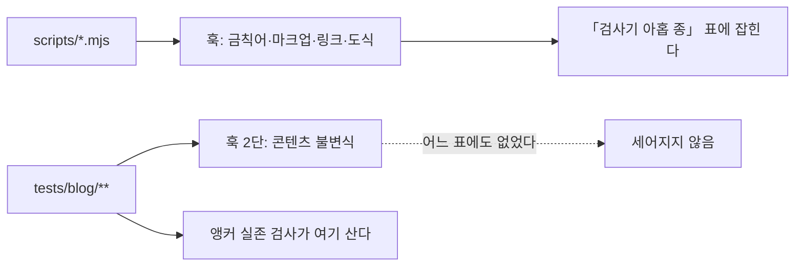

# HANDOFF

> 마지막 갱신 2026-09-04 · `pm` 배치 **시리즈 A 9/9 · 시리즈 B 8/8 완결** ·
> **이번 세션은 코드를 고치지 않았다.** 문서에 적힌 수치를 실측과 대조했더니 다섯 자리가
> 낡아 있었고, 「남은 사각지대」의 첫 후보는 **이미 닫혀 있었다**

## 지금 상태

발행본 **184편**이다. 배치는 편8로 끝났고 그 뒤 일곱 세션이 검사기의 사각지대를 닫아 왔다.
직전 세션이 「마지막 사각지대」로 도식 검사를 닫았고, 이번 세션은 **문서 자체를 검증했다.**

| 항목 | 값 |
| --- | --- |
| 발행 완료 | **A 편1~9 + B 편1~편8 (184편)** · 시리즈 B 완결 |
| 검사기 | ✅ `scripts/` **열 종** + `tests/blog/` **8파일 82케이스** · 뮤턴트 **58/58 잡힘 · 생존 0** |
| 훅 | ✅ 발행본 **9단** · 문서 **6단** · 코드만이면 즉시 통과 |
| CI | ✅ **22스텝** |
| 강조 렌더 실패 | ✅ 발행본 **0회 · 184편** · 리포 문서 **0회 · 55개** |
| 깨진 링크 | ✅ 발행본 **0곳** · 리포 문서 **0곳** |
| 깨지는 도식 | ✅ 발행본 **0곳**(544개) · 리포 문서 **0곳**(110개) — **판정 도달 654/654** |
| 앵커 실존 | ✅ **28개 전부 헤딩에 닿는다** — 훅과 CI 양쪽에서 돈다 |
| 커밋 | `d9328e4`(건수 정정) · `b56fa57`(검사기의 자리를 문서에 남김) |
| 푸시 · 배포 | ✅ **두 회차 모두 `build` · `deploy` success** (run `33850634589` · `33851828206` 실측) |
| 다음 단계 | 아래 **「남은 사각지대」** — 셋이 남았고 **전부 사람의 판단을 먼저 요구한다** |

### 이번 세션이 한 일

| # | 무엇 | 어디에 남았나 |
| ---: | --- | --- |
| 1 | 자기 검사 건수 **다섯 자리**를 실측으로 정정 | `d9328e4` · 아래 1번 |
| 2 | 🔴 **「남은 사각지대」 첫 후보가 이미 닫혀 있었다** | `b56fa57` · 아래 2번 |
| 3 | `HANDOFF.md` 에 「Vitest 가 보는 것」 절을 신설 | 아래 「검사기가 사는 두 자리」 |
| 4 | `CLAUDE.md` 게이트 절에 2단 「불변식」의 정체를 명시 | `CLAUDE.md` |
| 5 | 남은 사각지대 **네 항목 전수 재검증** | 아래 「남은 사각지대」 |
| 6 | `CHANGELOG.md` 아카이브 — 본체를 최신 3절로 | `docs/changelog/2026-09.md` (17절) |

---

## 🔴 다음 세션이 반드시 먼저 알아야 할 것

### 1. 🔴 **인수인계 문서에 적힌 수치는 검증된 적이 없었다**

이 리포는 「증명하기 전에는 0을 믿지 마라」를 아홉 검사기에 새겨 두었다. 그런데 그 규칙이
**문서 자신에게는 적용되지 않았다.** 아홉 검사기의 `--self-test` 를 전부 돌려 대조하니
다섯 자리가 낡아 있었다.

| 어디 | 적혀 있던 값 | 실측 |
| --- | ---: | ---: |
| `README.md` `check-forbidden:verify` | 15건 | **63** |
| `HANDOFF.md` 표 `check-forbidden` | 15건 | **63** |
| `HANDOFF.md` 표 `dup-scan` | 7건 | **12** |
| `HANDOFF.md` 표 `source-overlap` | 28건 | **42** |
| `CLAUDE.md` 검사기 개수 | 여덟 | **아홉** |

넷(`check-markup` 24 · `fix-markup` 19 · `check-links` 23 · `check-mermaid` 26)과 뮤턴트 수
50 은 일치했다. **넷이 맞았기 때문에 계수 방식이 아니라 값이 낡았다고 판정할 수 있었다** —
대조군이 없었다면 「내 계수법이 틀렸나」와 구분되지 않는다.

🔴 **직전 세션은 `check-forbidden` 하나만 낡았다고 기록했다.** 한 자리를 「자동 대조가 안 된다」는
이유로 남기면 **같은 이유로 낡은 옆자리는 아예 세어 보지 않게 된다.**

⚠️ 어긋난 셋은 전부 **검사기가 스스로 세지 않는 것**이었다.

| 검사기 | 건수를 어떻게 읽나 |
| --- | --- |
| `check-markup` · `check-links` · `check-mermaid` · `source-overlap` | `24/24` 형태로 **스스로 출력한다** |
| `check-forbidden` | 형식이 달라 `통과 63 / 실패 0` 으로 낸다 |
| 🔴 `dup-scan` · `fix-markup` | **요약 숫자를 내지 않는다.** `PASS` 줄을 세야 한다 |

```
node scripts/<검사기>.mjs --self-test 2>&1 | grep -cE '(PASS|✅)'
```

### 2. 🔴 **검사기는 `scripts/` 에만 살지 않는다 — 목록이 절반만 세고 있었다**

`HANDOFF.md` 는 **앵커 유효성**을 「남은 사각지대」 첫 줄에 두고 세 세션을 넘겨 왔다. 근거는
「`check-links` 는 앵커를 분리만 하고 판정하지 않는다」였고 **그 문장은 사실이다.** 그런데
판정은 다른 곳에서 이미 하고 있었다.

| 무엇 | 어디에 | 상태 |
| --- | --- | --- |
| 도착지 집합 | `lib/toc.ts:75` `headingIds` | 렌더러와 **같은** `github-slugger` |
| 앵커 추출 | `tests/blog/content/links.test.ts` `anchorLinks` | `%`-인코딩을 디코드한다 |
| 판정 | 같은 파일 `brokenAnchors` | 대상 편이 없는 경우는 **일부러 제외** — 한 결함이 두 번 보고되지 않게 |
| 자기검사 · 본 검사 | `describe` 「앵커 실존」 | ✅ 둘 다 통과 |
| 「0건 검사」 가드 | `expect(seen.length).toBeGreaterThan(0)` | 하나도 못 뽑으면 실패시킨다 |
| 게이트 | 훅 2단 · CI | ✅ **양쪽에서 돈다** |

원인은 훅 단계의 **이름**이다.



2단의 실체는 `npx vitest run tests/blog` 인데 이름이 「콘텐츠 불변식」이라 Vitest 를 가리키는지
드러나지 않는다. ⇒ **검사를 찾을 때 `scripts/` 만 훑지 마라.**

⚠️ `check-links.mjs` 가 앵커를 버리는 것은 결함이 아니라 역할 분담이다. 앵커 판정은 렌더러와
같은 슬러거를 불러야 하는데 그것은 TypeScript 부품이라 **구조적으로 `.mjs` 에서는 살 수 없다.**

### 3. 🔴 **브라우저용 라이브러리를 Node 에서 부르면 「보지 않은 것」이 「통과」가 된다**

직전 세션의 교훈이며 여전히 유효하다. `mermaid.parse()` 는 DOM 없이 부르면 파싱에 닿기도 전에
죽는데, 그 실패를 「위반 없음」으로 세면 **649개 중 621개**를 보지 않고 초록이 나온다.

⇒ 오류를 둘로 가르되 🔴 **환경 쪽을 열거하고 나머지를 위반으로 둔다.** 반대로 두면 라이브러리가
새 오류 형태를 도입한 날 진짜 위반이 「환경 문제」로 분류되어 사라진다. 스캔 앞에 **카나리**를 둔다.

⚠️ 전역을 세우는 일은 `import` 보다 먼저여야 한다 — `DOMPurify` 가 로드 시점에 `window` 를
잡는다. Node 24 는 `globalThis.navigator` 를 getter 로만 노출하므로 `Object.defineProperty` 로 덮는다.

### 4. 🔴 **필터를 통과한 집합으로 그 필터를 검사할 수 없다**

자기 검사 21/21 안에서 한 케이스가 아무것도 지키지 않고 있었고 뮤테이션이 잡았다. 감싸인 경로는
**있지도 않은 이름**이 되어 `existsSync` 에서 걸러지고, 남은 것은 정의상 조건을 만족한다.

⇒ 자기 검사를 쓸 때 **「이 케이스가 실패하는 세계가 실제로 있는가」를** 물어라. 대조군이 0개면
그 케이스는 영원히 통과한다. 고친 방법은 **대조할 비-ASCII 경로가 실제로 있는지 먼저 세는 것**이다.

### 5. 🔴 **가드를 `main` 안에 흩어 두면 자기 검사가 그것을 볼 수 없다**

`if (…) { process.exit(2); }` 형태로 `main` 에 있으면 통째로 지워도 케이스가 전부 통과한다.
`decideExit({canary, rejected, scanned, unreachable, violations})` 순수 함수로 뽑으니 뮤턴트가
각 가드를 하나씩 짚는다. ⇒ **「무엇을 하면 죽는가」는 순수 함수로.** 출력은 `main` 에 남겨도 된다.

### 6. ✅ **뮤턴트 하나만 격리해서 되돌려 보는 법**

`npm run mutate` 는 3~5분 걸린다. 한 자리만 확인하려면 사본을 만들어 치환하고 돌린다.

```
node -e 'const fs=require("fs");const s=fs.readFileSync("scripts/check-mermaid.mjs","utf8");
fs.writeFileSync("scripts/.tmp-x.mjs", s.replace(FROM, TO));'
node scripts/.tmp-x.mjs --self-test; rm -f scripts/.tmp-x.mjs
```

🔴 **고친 뒤에는 반드시 이것을 돌려라.** 확인할 것은 「FAIL 이 나온다」이지 「PASS 가 나온다」가 아니다.

### 7. ⚠️ 짧게 — 여전히 유효한 것들

| 무엇 | 요지 |
| --- | --- |
| **검사기는 「없는 위반」도 만든다** | 정규식 일회성 스크립트가 **31건을 전부 거짓 양성**으로 냈다. 0건일 때만 의심하는 습관은 절반이다 |
| **`npm install` 이 `engines` 를 강제하지 않는다** | `jsdom@30` 이 로컬 Node 24 에서 21/21 을 내고 CI 의 Node 20 에서 죽었다. 지금은 26.1.0 이고 자기 검사 ㉖ 이 워크플로의 `node-version` 과 대조한다 |
| **일부 누락 가드** | 「대상 없음」 가드는 하나도 못 받았을 때만 발동한다. 받은 것 중 일부를 버리면 숫자가 그럴듯하게 나온다 |
| **대상 수집은 검사기 안에서** | 호출부에서 `git ls-files` 로 뽑아 넘기지 마라. `core.quotePath` 를 끄는 자리를 한 곳으로 모았다 |
| **뮤턴트 ID 중복** | 추가 전에 `grep -ao 'id: "[A-Z]*[0-9]*"' scripts/mutate.mjs \| sed 's/id: //' \| tr -d '"' \| sort \| uniq -d` |
| **`scripts/mutate.mjs` 는 grep 이 바이너리로 본다** | NUL 이 한 개 있다. 의도된 것이므로 `grep -a` 를 붙여라 |
| **훅만 있는 검사는 지켜지지 않는다** | `--no-verify` 로 지나가고 웹 UI 편집은 훅을 안 탄다. 새 검사기는 **훅과 CI 양쪽에** |
| **검사는 전량을 본다** | 스테이징된 것만 보면 깨뜨린 쪽이 아니라 **깨진 쪽**이 통과한다. 문서 전량 스캔은 실측 약 8초 |
| **뮤테이션은 단독으로** | 러너가 파일을 심었다 되돌리는 동안이다. 다른 파일 작업과 병행하지 마라 |

---

## 검사기가 사는 두 자리

🔴 **한쪽만 세면 이미 있는 검사를 다시 만들게 된다.** 위 2번이 실제로 그 직전까지 갔다.

### ① `scripts/` 의 열 종 — 순서는 「증명한 뒤 스캔」이다

| 검사기 | 무엇을 | 자기 검사 |
| --- | --- | ---: |
| `check-forbidden` | 금칙어 (소스 · 빌드 산출물) | **63건** |
| `dup-scan` | 발행본 사이의 축자 복제 | **12건** |
| `source-overlap` | 리포 밖 **원본**과의 겹침 | **42건** |
| `compose` | 성분별 분해 (분량 예산) | — |
| `check-counts` | README·CHANGELOG 의 발행본 수 | — |
| `check-markup` | 렌더되지 않는 강조 | 24건 |
| `fix-markup` | 위 위반의 교정 | 19건 |
| `check-links` | 깨진 링크 (R1·R2·R3) | 23건 |
| `check-mermaid` | 그려지지 않는 도식 (R1) | 26건 |
| `build-search-index` | 검색 인덱스 (가드 넷) | **15건** |

`npm run mutate` 로 뮤턴트 **58개**를 되살려 검사 **열 개**(위 검사기 열 종 중 `check-counts` 를
제외한 아홉 + `blog-unit` Vitest)의 자기 검사가 잡는지 본다. 검사기를 고쳤으면 반드시 돌린다.
약 11분 걸리므로 백그라운드로 돌리고 **다른 파일 작업과 병행하지 마라.**

### ② `tests/blog/` — 훅 2단 「콘텐츠 불변식」이 이것이다

| 파일 | 무엇을 보나 | 케이스 |
| --- | --- | ---: |
| `tests/blog/content/links.test.ts` | 링크 무결성 · 링크 고립 · 카테고리 고립 · 🔴 **앵커 실존** | 8 |
| `tests/blog/content/schema.test.ts` | 발행본 전수 스키마 · 분량 (하한 미달은 SOFT) | 4 |
| `tests/blog/content/series.test.ts` | 🔴 시리즈 정의와 발행본 전량 대조 (0건 가드 포함) | 6 |
| `tests/blog/frontmatter.test.ts` | `validateFrontmatter` 단위 | 23 |
| `tests/blog/loader.test.ts` | `readPosts` · 카테고리 · 인접 편 | 13 |
| `tests/blog/toc.test.ts` | `buildToc` 단위 | 6 |
| `tests/blog/tree.test.ts` | `buildTree` 단위 | 7 |
| `tests/blog/search.test.ts` | 🔴 조사 매칭 · 다중 토큰 AND · 점수 | 15 |
| | **합계** | **82** |

발행본 **전량**을 보는 것은 `tests/blog/content/` 의 세 파일(18케이스)이고 나머지는 단위
테스트다. 슬러거처럼 TypeScript 부품이 필요한 판정은 구조적으로 이쪽에만 살 수 있다.

**증명하기 전에는 0을 믿지 마라.** 그리고 **위반이 나왔을 때도 검사기를 의심하라.**
자기 검사가 통과해도 그 케이스가 무언가를 지킨다는 뜻은 아니다. 🆕 **문서에 적힌 수치도
대조군 없이는 근거가 아니다.**

---

## 남은 사각지대 — 다음 후보

**2026-09-04 에 네 항목을 전부 실측으로 재검증했다.** 셋이 유효하고 하나는 이미 닫혀 있었다.

| 후보 | 규모 (실측) | 비고 |
| --- | ---: | --- |
| ~~앵커 유효성~~ | ~~28개~~ | ✅ **이미 닫혀 있었다.** 위 2번을 보라 |
| **도식의 의미** | 도식 **654개** (발행본 544 · 문서 110) | 문법은 지금 검사한다. 「화살표가 끊겼는가」·「라벨이 본문과 어긋나는가」는 사람의 판단이며 `docs/superpowers/PUBLISHING-CHECKLIST.md` 에 있다 |
| 분량 하한 SOFT **5편** | `ai-agent` 1 · `rag` 1 · `search-engineering` 3 | 실측이 기재와 일치한다. 가장 짧은 편은 `search-engineering/search-engineering-in-practice.md` 의 **8,136 B** |
| 시리즈 A·B 밖의 새 배치 | — | 원본이 어디에 있는지부터 정해야 한다 |

⚠️ **남은 셋은 전부 사람의 판단을 먼저 요구한다.** 기계로 닫을 수 있는 자리는 지금 없다.

---

## 다음 배치를 시작하면 다시 읽을 것

배치 작업이 끝나 지금은 쓰이지 않지만, 새 배치에서 **그대로 되풀이될** 것들이다.

- 🔴 **`compose` 는 「본문을 마지막으로 만진 뒤」 돌린다.** 복제 제거뿐 아니라 **리뷰 반영**도
  분량을 늘린다 — 편8에서 상한을 세 번 넘겼고 원인이 매번 달랐다. **표 예산이 총량보다 먼저
  터진다**(표 여유가 편6 296 → 편7 65 → 편8 **13** 으로 좁아져 왔다).
- 🔴 **인수인계에 적힌 수치도 대조군 없이는 근거가 아니다.** 편8 착수 때 원본 B 9,682 가
  틀렸다(실측 9,430). **경계는 줄 수가 아니라 「인용 줄이 끊기는 지점」으로 찾아라.**
- 🔴 **금칙어 때문에 뺀 블록은 낱말만 빼면 되는 것이 아니다.** 배정 밖 블록의 **판단**이
  본문으로 새는 일이 편6·편7·편8 **세 편 연속**이었다. 집필 전에 「이 블록에서 온 판단은
  쓰지 않는다」를 **명제 단위로** 적어라.
- 🔴 **`dup-scan` 0건은 원본 대조의 0건이 아니다.** 편8은 `dup-scan` 7건을 고친 **뒤에**
  `source-overlap` 이 편7의 4.6배를 냈다. **표를 전치할 때 칸이 증발한다.**
- 🔴 **산식의 상수 2,455 는 상수 절의 예산이 아니다.** 회귀 절편이며, 상수 절의 초과분은
  배율 안에 이미 흡수돼 있다. **산식의 항을 문서의 부위에 대응시키지 마라.**
- **초고가 어느 쪽으로 벗어나는지는 원본의 표 비중이 정한다.** 편8은 이것을 예측에 썼고
  「약 +23% 넘친다」가 실측 +22.6% 로 맞았다.

---

## 알려진 문제

- 🔴 **`compose` 통과는 배정 타당성이 아니다.** 성분 실측 **바로 다음에** 배정 원본의 금칙어를
  직접 세라. `LC_ALL=C` 필수다.
- 🔴 **표 배율을 `원본 표 B × 배율` 로 예측하지 마라.** 표는 **절대값 예산**으로 관리한다.
- SOFT 2건이 `agentic-coding/thirty-agent-catalog.md:195` 에 상시 남아 있다 — 정당하다.
- 분량 하한 SOFT 5편은 이 배치 밖의 옛 편들이다.
- 「강의」는 SOFT 금칙어다. 원본이 강의 노트라 **출처를 지칭하면 걸린다.**
- 배치 전체 `dup-scan` 20건은 전부 용어 정의 · 법률명이며 정당하다.
- ⬜ 강조 렌더 실패 **14회**가 `.superpowers/sdd/` 에 남아 있다. `*` 로 gitignore 된 도구
  부산물이라 커밋되지도 렌더되지도 않는다 — **검사 대상이 아니다.**
- ⚠️ `jsdom` 이 devDependency 로 들어와 `npm audit` 이 경고를 낸다. **검사기 전용**이며 빌드
  산출물에는 들어가지 않는다.

---

## README/문서 갱신 필요

이번 세션이 **고치지 않고 남긴** 것이다.

| 무엇 | 왜 남겼나 | 확인할 진실원 |
| --- | --- | --- |
| README 에 없는 npm 스크립트 `check-counts:verify` · `check-counts:print` · `map-terms:verify` · `compose:verify` · `source-overlap:verify` · `mutate:verify` | 전부 `:verify` 계열이고, README 는 본 명령 줄에 「`:verify` 는 자체 검사」로 함께 적는 방식을 쓴다. **일관된 의도로 보이므로** 판단을 남겼다. 실측 **6개 그대로**이며 두 세션째 같은 상태다 | `README.md` 의 서술 방식 |

⚠️ 수집 스크립트의 `ENV_KEYS_IN_CODE_BUT_NOT_IN_README`(`OPENAI_API_KEY` 등 5개)는 **오탐이다.**
코드에는 없고 **블로그 본문 3편의 코드 예시**에서 왔다. 이 프로젝트는 정적 포트폴리오라 그런
환경변수를 쓰지 않는다 — README 에 넣지 마라.

⚠️ `[LOW] SCRIPTS_DIR_MISSING_IN_README`(`check-mermaid.mjs` 등)도 **오탐이다.** README 는
파일명이 아니라 **npm 스크립트 이름**으로 문서화한다.

### 문서가 낡던 자리 — 세 세션 연속으로 나왔다

| 세션 | 어디 | 적혀 있던 값 | 실제 |
| --- | --- | ---: | ---: |
| 2026-09-04 (블로그 탐색 개편 Task 8) | `CLAUDE.md`·`README.md`·`HANDOFF.md` 검사기 종 수 · 뮤턴트 수 · `tests/blog` 파일·케이스 수 | 아홉 종 · 50개 · 5파일 54케이스 | **열 종 · 58개 · 8파일 82케이스** |
| 2026-09-04 (이번) | 자기 검사 건수 다섯 자리 | 15 · 15 · 7 · 28 · 여덟 | **63 · 63 · 12 · 42 · 아홉** |
| 2026-09-04 (직전) | `CLAUDE.md`·`README.md` 뮤턴트 수 | 16 · 38 | 48 |
| 2026-09-04 (직전) | `CLAUDE.md` 훅 단수 | 7단 | 9단 |

🔴 **세 번 모두 「수를 늘린 커밋이 문서를 함께 세지 않은」 경우다.** 검사기·뮤턴트·훅 단계를
추가하면 그 수가 적힌 자리를 같은 커밋에서 고쳐라.

---

## 도구 함정 — 전체 46건은 [`docs/TOOL-TRAPS.md`](docs/TOOL-TRAPS.md) 에 있다

되풀이해 겪은 것들:

- **`|` 뒤의 종료 코드는 마지막 명령의 것이다.** 종료 코드를 읽을 명령은 단독 실행.
- **스크래치패드에서는 리포의 `node_modules` 를 해석하지 못한다.** 프로브 스크립트는 리포
  루트에 두고 실행 직후 지운다.
- **`git add` 뒤 `LF will be replaced by CRLF` 경고가 뜬다.** 작업 트리 이야기이며 **커밋된
  blob 은 LF 다** — `git cat-file blob HEAD:<경로> | tr -cd '\r' | wc -c` 로 확인하라.
- **`git ls-files` 가 한글 경로를 따옴표로 감싼다.** `git -c core.quotePath=false ls-files`
  로 끄고, **넘긴 수와 스캔한 수를 대조하라.**
- **긴 문서는 heredoc 이 아니라 `Write` 로 쓴다.** 실패하면 전부 다시 써야 한다.
