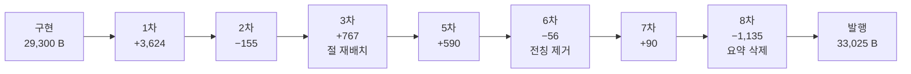

# 인수인계 (HANDOFF)

> **작성 시점** 2026-08-17 · T7 발행 직후
> **상태** `ai-transformation` **11/11 완료**. 설계서가 있는 세 카테고리가 전부 닫혔다.
> **미푸시 커밋 3건** — `4b5edaa` · `7efd4d4` · `9197bd1`. **푸시는 사용자가 명시적으로 요청할 때만.**

---

## 1. 이번 세션에서 한 일

**T7 — `ai-transformation` 편11 지도편 `ai-transformation-knowledge-map` 발행.** 카테고리를 닫았다.

| 지표 | 값 |
| --- | --- |
| 커밋 | `9197bd1` (글 + CHANGELOG + README + 설계서) |
| 분량 | **33,025 B · 197줄** |
| 구조 | H2 7 · H3 7 · 표 10 · mermaid 2 |
| 내부 링크 | **107** (편당 10.7 — 편10 실측 3.3의 **3.2배**) |
| 전편 커버 | **10/10**, 편10이 **15회로 최다** |
| sitemap | 186 → **187** · 태그 페이지 52 → **52**(불변) |
| 에이전트 | **33기** (조사 6 · 구현 1 · 검증 19 · 반영 7) |
| 보고서 | 약 **420 KB** |

### 반영 이력 — 7차례



**4차는 검증만 했다**(반영 없음). 커밋 직전까지 `git add`를 미뤘고 커밋 후 `git status`가 비었다.

---

## 2. ⚠️⚠️ 이번 세션 최상위 — **같은 대상을 두 자리에서 재면 술어의 넓이를 맞춰라** (금지선 36)

**하나의 형태가 여섯 번 반복됐다. 값은 매번 정확했다.**

| # | 전칭 | 실제 | 잡은 시점 |
| ---: | --- | --- | --- |
| 1 | 「**두 편에서** 작업 틀 일반을 뜻하고」 | 세 편 | 재검증 1기 |
| 2 | 「비용을 주어로 삼는 절이 **없다**」 | 두 곳 | 5축 E |
| 3 | 「**한 주제의 2차만** 편을 단위로」 | 두 주제 | 5차 |
| 4 | 「**다른 열세 주제는** 절이 서 있는데」 | 열두 주제 | 5차 |
| 5 | 「**안에서는 갈리지 않고** 밖과 갈리며」 | 세 층위로 갈린다 | 최종 2 |
| 6 | 「**셋째는**(=셋째만) 밖과도 갈린다」 | 오케스트레이터도 밖과 갈린다 | 최종 3 |

### 대표 사례 — 좁은 술어로 잰 값을 넓은 술어에 옮긴다

| 대상 | **좁은** 술어 | **넓은** 술어 |
| --- | --- | --- |
| 비용 | 「얼마나 쓰고 어디서 통제하는가를 주어로 삼은」 → **0곳** | 「비용을 주어로 삼는」 → **2곳** |
| 하네스 | 「글자까지 똑같이 쓴다」 → **2편** | 「작업 틀로 정의한다」 → **3편** |

### ⇒ 값을 고치면 다음 전칭이 나왔다. **끝낸 것은 「세는 것을 그만두기」다.**

6차 반영이 「한 주제의 2차만」을 **「그런 자리도 있고」**라는 **존재 주장**으로 바꾸자 계열이 닫혔다.
존재 주장은 반례로 깨지지 않는다 — 같은 구조가 더 나와도 계속 참이다.

> **어법의 선례가 발행본 안에 있었다.**
> `discovery-to-growth-tooling.md:88` — 「**쓰인 층위가 자리마다 다르다**」. 개수를 안 센다.
> **「내가 정한 규칙」보다 「이 코퍼스가 이미 쓰는 어법」이 반영자에게 잘 전달된다.**

### 다음 배치가 할 것

**수를 옮길 때 그 수를 재는 술어도 함께 옮겼는지 물어라.** 「더 꼼꼼히 세라」는 처방이 통하지 않는다 — 계산은 매번 맞았다.

---

## 3. ⚠️⚠️ **표를 가로로 읽어라** (금지선 37)

**같은 행의 칸끼리 서로를 반박할 수 있다.** 표를 세로(열 단위)로 읽으면 절대 안 보인다.

실제 발화 — 층위표 사람 게이트 행:

| 칸 | 문면 |
| --- | --- |
| 3열 | 「이 카테고리는 **이쪽으로만 쓴다**」 |
| **4열** | 「네 영역 도구 지형 편은 자기 것이 그 둘과 **또 다른 층위**라고 적는다」 |

**외부 자료를 대 볼 필요도 없었다.** 한 행을 가로로 읽으면 즉시 드러난다.

⇒ **검증 브리프에 「네 행 전부를 가로로 읽어라」를 넣어라.**

---

## 4. ⚠️⚠️ **비교 요약은 배타 전칭을 자동 생성한다** (금지선 38)

### 결함이 표가 아니라 **표를 요약한 문단**에서 났다

| 구조 | 성질 | 결과 |
| --- | --- | --- |
| 표 4행 | 각 항목을 **독립적으로** 서술 | 안전 |
| 가로 요약 2문단 | 네 항목을 **서로 비교** | 「첫째는 A이고 **셋째만** B다」 → 반례 하나면 무너진다 |

그 구역에서 **다섯 번 연속** 결함이 났고, 매번 고칠 때마다 다음 배타가 생겼다.

### ⇒ 마지막 처방은 **요약 두 문단(1,302 B)을 걷어내는 것**이었다

- 표는 그대로 · 링크 107 유지 · 구조 불변
- **`:177` 삭제가 다른 지적의 파급까지 함께 해소했다** — 그 안의 「넷째는 셋째 판본을 대 봐야 갈린다」도 좁은 술어였는데 문단이 사라지자 고칠 필요가 없어졌다

> **고치기보다 덜어내기가 나은 경우가 있다.** 결함이 같은 자리에서 세 번 이상 나면 **그 자리의 존재를 의심하라.**

---

## 5. ⚠️⚠️ **정확한 글이 안 읽힐 수 있다** (금지선 43)

### 검증 19기 중 **좌표를 하나도 주지 않은 독자 축 둘**만 이것을 봤다

좌표 대조 축들은 「이 서술이 참인가」에 전부 **참**을 냈다. 실제로 참이었다.
독자 축이 보고한 것은 다른 종류다:

| 항목 | 1차 read | 4차 reader (재배치 후) |
| --- | ---: | ---: |
| 「무엇을 먼저 열지」 답이 나오기까지 | **91줄** | **20줄** |
| 판정 | 쓸모가 살아남는다 | 쓸모가 있다 |

**3차 반영에서 「목적별 읽는 순서」 절을 세 번째에서 맨 앞으로 옮겼다. 내용은 한 줄도 안 버렸다.**

### ⇒ 원인이 절차 자체에 있다

> 검증 축은 **「이 문장이 참인가」**를 묻지 **「독자가 이 문장을 필요로 하나」**를 묻지 않는다.
> 좌표 대조를 다섯 번 돌리면 그때마다 반영자가 **근거를 본문에 적어 방어**한다.
> **정확성 검증이 강할수록 글에 자기 감사가 쌓인다.**

독자 축 둘이 **독립적으로 같은 진단**을 냈다 — 「이 글은 자기가 정확하다는 걸 증명하느라 자기가 안내하려던 사람을 지치게 한다」(계수 확인 4번 · 출처 해명 5번 · 빈칸 변호 3겹 · 「이 글」 19회).

### 다음 배치가 할 것

**독자 축을 반드시 넣고, 좌표를 주지 마라.** 좌표를 줄 수 있으면 반드시 확인하게 되고, 그러면 **N+1번째 좌표 대조**가 된다. 브리프에 「다른 파일을 열어 사실 확인을 하지 마라」를 명시하라.

---

## 6. ⚠️ 컨트롤러 오류 — **3건이 하위 에이전트에게 반증됐다**

| # | 컨트롤러가 적은 것 | 실제 | 반증한 쪽 |
| ---: | --- | --- | --- |
| 1 | 하네스 갈림 = 편1 ↔ 편5 **1:1** | 편1·편2가 **글자까지 동일** → **2:1** (그리고 실제로는 **3편**) | 구현자 |
| 2 | 「편6·9는 오케스트레이터를 소프트웨어로 쓴다」 | **편9는 0회** | 구현자 |
| 3 | 「비용 편당 1~**18**회」로 결함 판정 | **17이 맞다** — 「**대비용**(對比用)」 오탐 | 반영자 |

**1·2의 원인이 같다 — 낱말이 있는 편을 찾아 놓고 그 자리의 서술을 안 읽었다.** 조사자가 무너진 것과 같은 방법 오류다.

**3이 더 뼈아프다** — 검증자가 이미 「raw grep은 18, **오탐 1건 배제 필요**」로 정확히 적어 뒀는데 컨트롤러가 자기 실측값으로 되돌렸다.

### 그리고 컨트롤러가 유도한 결함 하나

4차 검증이 「사람 게이트의 루프 종료 조건 뜻은 카테고리에 없다」고 했고, 컨트롤러가 **「종료조건이 아니라」만 grep**해 확인한 뒤 브리프에 그대로 옮겼다.
**「사람 게이트」 전체를 grep했으면** `discovery:88`·`agent-definition:115`가 나왔을 것이다.
⇒ 그 결과 「이쪽으로만 쓴다」라는 거짓 전칭이 들어갔다.

> **검증자 진단을 좁은 확인으로 통과시키지 마라.** 진단이 「A가 없다」면 **A 전체**를 재야 한다.

---

## 7. 다음 세션이 이어받을 것

### ▶ **설계서가 있는 세 카테고리가 전부 닫혔다. 다음 배치는 미정이다.**

| 카테고리 | 편수 | 설계서 | 상태 |
| --- | ---: | --- | --- |
| `ai-agent` | 51 | `2026-08-08-ai-agent-category-split-design.md` | 완료 |
| `agentic-coding` | 31 | `2026-08-08-agentic-coding-category-split-design.md` | 완료 (B9 지식 지도 `89beda4`) |
| **`ai-transformation`** | **11** | `2026-08-14-ai-transformation-category-split-design.md` | ✅ **T7로 완료** |
| `rag` | 25 | **없음** | — |
| `search-engineering` | 6 | **없음** | — |

**합계 124편 · sitemap 187 URL.**

### 원본에 남은 미사용 소스

`C:\Users\aeby\vscode\yanadoo-exit\shared\knowledge\` (**읽기 전용 · 수정 금지**)

```
bigdata · glossary · high-traffic · java-backend · langgraph · learning
llm-search-recommend · pangyo-it · pm-harness · pm-po · recommendation · search
claude-code-team-productivity.md · cto_learning_roadmap.{md,html} · diagram-convention.md
```

⇒ **어느 것을 다음으로 할지는 사용자가 정한다.** 새 카테고리를 열면 **설계서부터 쓴다**(분할표 · 배치 계획 · 축 B 정의 · 금지선 승계).

### 확정된 결정 (다시 묻지 마라)

| 항목 | 결정 |
| --- | --- |
| 원본 | **읽기 전용.** 수정 금지 |
| 푸시 | **사용자가 명시적으로 요청할 때만.** 커밋과 푸시를 한 명령에 묶지 않는다 |
| 커밋 메시지 | **한글** |
| 커밋 구성 | 발행 커밋 = 글 + CHANGELOG + README + 설계서 / 인수인계 커밋 = HANDOFF **별도** |
| `source` 프론트매터 | **원본이 강의에서 온 편만.** `ai-transformation`의 `aiteam/*`은 개인 문서라 안 쓴다 |
| 금칙어 | 면접·커닝페이퍼·암기용·화이트보드·이력서·강의·수강·예상 질문 · 히츠·야나두·TVING·티빙·BTV·허우용·teddylee·teddynote·argus·FASTCAMPUS·실장·커머스개발 · **1인칭** |
| 태그 | 기존 통제 어휘(80종) 안에서만. `MAX_TAGS=6` |

### 진행 방식 — 16배치로 검증된 절차

```
착수 전 판정 → 조사 N기 병렬 → 컨트롤러 교차 대조 → 변환 브리프
→ 구현 1기 → 5축 독립 검증 → 판정 → 1차 반영 → 스냅샷 → 재검증 2기
→ 2차 판정 → 2차 반영 → 최종 검증 3기 → 커밋
```

⚠️ **T7에서 이 절차가 8차까지 늘어났다.** 최종 검증이 발행 불가를 세 번 냈기 때문이다.
**결함이 같은 자리에서 세 번 이상 나면 「고치기」를 멈추고 「덜어내기」를 검토하라**(§4).

⚠️ **검증자에게 브리프도 판정표도 반영 보고서도 주지 마라.**
⚠️ **재요청 메시지에 다른 축의 판정을 적지 마라** — T7에서 축 C에게 「축 E가 높음으로 올렸다」를 알려 독립성을 깼다. C의 상향이 자체 재검토인지 동조인지 가릴 수 없게 됐다.

---

## 8. ⚠️ 도구 함정 — 이 배치에서 실제로 걸린 것

| # | 함정 | 대응 |
| ---: | --- | --- |
| 39 | `LC_ALL=C grep -P '[\x{1F300}-\x{1FAFF}]'`는 **「범위 초과」 에러로 죽는다.** 무출력이 0건으로 보인다 | UTF-8 바이트 패턴 `'\xf0\x9f\|\xe2\x9c\|\xe2\x9d\|\xef\xb8\x8f'` |
| 39 | `grep … \|\| echo "0건"` — **파일이 없어 실패한 것**과 0건 발견이 같은 문자열 | 붙이지 마라. 종료 코드를 그대로 확인 |
| 40 | `grep -o '비용'`이 **「대비용(對比用)」**도 센다 | **히트 줄을 열어** 그 낱말이 맞는지 확인 |
| 41 | **축자 복제 스캔은 「같은 뜻 다른 글자」를 못 잡는다** — 편10의 하네스 정의를 구현자·컨트롤러가 함께 놓쳤다 | 정의 대조는 **뜻**으로도 돌려라 |
| — | 1인칭 grep에 「주**제가**」·「통**제가**」가 걸린다 | `grep -o`로 매칭 문자열을 확인해 오탐 배제 |
| — | 코드펜스 안 **가짜 헤딩 19개**(세 레이어 편) · **H4 11개** | `awk '/^```/{f=!f;next} !f && /^#{2,4} /'` |
| — | `rev` 명령이 이 환경에 **없다** | `cut`·`awk`로 대체 |
| 42 | 브리프의 **「미확정」 자체가 실측이 필요한 주장** — 편1이 이미 해소한 갈림을 열어 뒀다(금지선 32 ③ 발화 직전이었다) | 판정을 넘기기 전에 **「정말 아직 아무도 안 내렸나」**를 확인 |

### ⚠️ 리뷰어 보고서 미작성 — **3회 발생**

`reviewer`·`scout`에 `Write` 도구가 없다. 브리프에 heredoc을 명시해도 **재발한다**(T7에서 6기 중 1기가 안 씀, 이후 2회 더).

| 에이전트 | 요약 메시지 | 보고서 파일 |
| --- | :---: | :---: |
| D | 보냄 | 씀 |
| B1 | **안 보냄** | 씀 |
| A | 안 보냄 | **안 씀** |

> **판정 기준은 메시지가 아니라 파일이다.**
> 유휴 알림이 오면 **무조건 `ls -la <스크래치패드>`부터** 돌려라.
> 재요청 시 **원래 물음을 그대로 다시 실어라** — 「아까 시킨 대로」로 끝내면 불편한 항목부터 빠진다.

---

## 9. 미해결 과제

### 9-1. T7 이월 — 최종 검증 비차단 관찰

> ⚠️ **최종 검증의 비차단 관찰은 반영하지 않는 것이 절차다** — 손대면 다시 검증해야 하고 그 재검증은 아무도 하지 않는다. **그러나 이월에는 반드시 적는다.**

| # | 자리 | 요지 | 낸 역할 |
| ---: | --- | --- | :---: |
| **T7-a** | 편11 `:168` | 「하나만 예외다」의 **술어가 하네스로 한정되지 않는다.** 값은 참으로 실측됐으나 문장이 넓다 | final4 |
| T7-b | 편11 `:175` | 원 자료는 갈리는 자리를 **세 곳**(표기·열 구성·구성) 드는데 2열이 압축한다 | final4 |
| T7-c | 편11 `:166` | 편 호칭이 다른 자리와 다르다 | final4 |
| **T7-d** | 편11 전반 | ⚠️⚠️ **자기 감사 분량** — 계수 확인 4번 · 출처 해명 5번 · 빈칸 변호 3겹 · 「이 글」 19회. **독자 축 2기가 독립적으로 지적**. 「빼도 될 30줄, 잃는 정보 없음」 | read · reader |
| T7-e | 편11 `:20~28` | 「세 번 갠다」 도식이 **첫 축 절 안에 갇혔다** — 절 재배치의 잔여 | v4-struct |
| T7-f | 편11 `:129`·`:93` | 「KPI 절 **뒤의** 중단 기준」은 실제로 그 절 **안** · 「기준별로 모은 표」에서 기준은 열이지 묶는 축이 아니다 | v4-struct |
| T7-g | 편11 `:152`·`:154` | 「아홉」이 서로 다른 계수인데 값이 같아 이어 읽힌다 | v4-struct |
| T7-h | 편11 주제 1~13 **1차** 칸 | ⚠️ **아무도 안 쟀다.** 2차만 검증했고 거기서 두 자리가 나왔다. 1차에도 같은 구조가 있을 수 있다 | v5 |
| T7-i | 편11 mermaid | 노드 ID가 `A-->C`, `A-->B`, `A-->D` 순 — **렌더는 정상**(dagre가 선언 순서를 따름). B·C 줄을 맞바꾼 흔적일 뿐 | v4-struct |

### 9-2. ✅ T7이 해소한 이월

| # | 항목 | 결과 |
| ---: | --- | --- |
| **40** | `ai-transformation` inbound 불균형 | ✅ **해소.** 최저 3 → **4**(편3·편5). **편10은 0 → 1** — 지도편이 유일한 진입로 |
| **29** | 지도편 mermaid | ✅ **2개 · 실브라우저 SVG 치환 확인** |
| 10~15 | 기발행본이 서로를 못 가리킴 | ✅ **지도편이 107 링크로 그 일을 했다.** T7도 기발행본을 한 자리도 안 고쳤다 |
| 37 | sitemap 예측 | ✅ **T5·T6·T7 3연속 적중**(186 → 187) |
| 6 | 0편 태그 | ✅ **T7도 신규 0** — 태그 페이지 52 → 52 |

### 9-3. ✅ **해소 — `결함율` 5자리** (커밋 `d561ed3`)

**T6-h 종결.** 맞춤법상 ㅁ 받침 뒤는 「**률**」이다. 실측 **5자리**였다(T6 인수인계의 「6자리」는 오류).

| 파일 | 줄 |
| --- | ---: |
| `ai-transformation-qna-org-operations.md` | 45 |
| `builder-to-orchestrator-shift.md` | 100 · 294 |
| `enablement-infra-and-maturity.md` | 309 · 356 |

**다섯 자리 전부 코드펜스 밖 · 인용문 아님**을 확인하고 치환했다. `diff`는 **+5/−5**로 낱말 하나만 바뀌었고, 빌드 exit 0 · sitemap **187 불변**이다. `ai-agent`가 이미 「결함률」을 쓰고 있어 **표기가 통일됐다**.

> ⚠️ **오표기가 문면으로도 드러나 있었다** — 셋은 같은 목록 안에서 「재작업**률**」과 어미가 갈렸다.
> 「리드타임·재작업**률**·결함**율**·리뷰 부담」. **한 줄 안에서 어미가 갈리면 그 자체가 신호다.**

### 9-4. T6 이월 (13건) · T5 (10건) · T4·T3·T2·T1

이전 HANDOFF 판(`git show 4b5edaa:HANDOFF.md`)의 §8-1~8-4를 그대로 승계한다. 주요한 것만:

| # | 자리 | 요지 |
| ---: | --- | --- |
| **T6-a** | 편10 `:143` ↔ `:145` | ⚠️⚠️ **게이트를 세면 5 vs 6.** 열 명이 이 절을 고치면서 두 줄 위를 아무도 세지 않았다 |
| **I-13** | 편10 `:230` | ⚠️ 「이 카테고리의 **아홉 편**」 — **T7로 11편이 됐다.** 컨트롤러 판정: **수정 불요**(「표·수치·각론이 펼쳐져 있는 곳」을 세는 것이고 편1~9=각론 · 편10=색인 · 편11=지도이므로 여전히 참). **재검토하려면 이 판정부터 반증하라** |
| T5-a · T3-a | 편5 `:54` · 편1 `:280` | 세운 수치가 마무리에서 회수되지 않는다 |
| 24 | 20자 임계값 | 「반증」 유지 — T7 최종 dup-scan 3건은 **용어 정의의 의도적 인용**으로 정당 판정 |

### 9-5. 기존 이월 (전역)

| # | 항목 | 상태 |
| ---: | --- | --- |
| 1 | mermaid 노드 라벨 우측 클리핑 | `foreignObject` 폭 문제 |
| 2 | FR-1.4 스크롤스파이 미구현 | 기존 위키에도 없음 |
| 3 | 메인 페이지 LCP 6.6초 | Lighthouse 77점 |
| 5 | `cto_learning_roadmap` Q1·Q3 | 발행 가능 판정을 받았으나 미변환 |
| 27 | `search-engineering` inbound 0 | 6편뿐이고 설계서 없음 |
| 30 | `reviewer`·`scout`에 `Write` 없음 | §8 참조 — **3회 재발** |
| 36 | mermaid 렌더는 CI로 검증 불가 | ⚠️ **T7이 방법을 찾았다** — §10 참조 |

---

## 10. 검증 명령

### ⚠️ mermaid 실렌더 — **T7이 확립한 방법**

정적 HTML에는 **SVG가 없다.** `components/mermaid.tsx`가 `useEffect`에서 렌더하므로 Next.js 정적 export의 Node 패스에서 실행되지 않는다. **스켈레톤만 보고 판정하면 안 된다.**

```bash
# 1) dev 서버 (포트 3000이 타 프로젝트에 점유돼 있을 수 있다 — 확인 후 빈 포트)
npm run dev -- -p 3001

# 2) Windows Edge 헤드리스 + CDP
#    ⚠️ --virtual-time-budget 은 실패한다 — 가상 시계가 동적 import를 못 따라간다
#    ⚠️ 같은 프로필 재사용도 실패한다 — 새 프로필을 쓸 것
#    ⇒ --remote-debugging-port 로 붙어 실제 wall-clock 대기가 유일하게 성공했다
```

`document.querySelectorAll('svg[id^=mermaid-]').length`가 블록 수와 일치해야 한다.

### `ai-transformation` 발행 시 검사

```bash
cd C:/Users/aeby/vscode/withwooyong.github.io
F=content/blog/<카테고리>/<slug>.md

# 금칙어
grep -nE "면접|커닝페이퍼|암기용|화이트보드|이력서|강의|수강|예상 질문|히츠|야나두|TVING|티빙|BTV|허우용|teddylee|teddynote|argus|FASTCAMPUS|실장|커머스개발" "$F"

# 1인칭 — grep -o 로 매칭 문자열을 확인해 「주제가」·「통제가」 오탐을 배제하라
grep -nE "저는|제가|저의|우리는|우리가|필자|봤다|보았다|면 된다" "$F"

# 이모지 — ⚠️ '[\x{1F300}-\x{1FAFF}]' 는 에러로 죽는다
LC_ALL=C grep -nP '\xf0\x9f|\xe2\x9c|\xe2\x9d|\xef\xb8\x8f' "$F"

# 구조
grep -c '^## ' "$F"; grep -c '^### ' "$F"; grep -cE '^\|[-: |]+\|$' "$F"; grep -c '^```mermaid' "$F"

# 링크 실재 + 후행 슬래시
grep -o '/blog/[a-z-]*/[a-z-]*/' "$F" | wc -l
grep -o '](/blog/[a-z0-9/-]*)' "$F" | grep -v '/)'

# 전칭 자가 검사 — ⚠️ 한글 수사를 반드시 포함하라
grep -nE '전부|모두|어느 것도|뿐이|만 |않는다|없다|하나만|유일|[한두세네다섯]{1,3} ?(편|곳|자리|층위|판본|갈래|주제)' "$F"

npm run build   # exit 0 · sitemap 수 확인
```

⚠️ **`|| echo "0건"`을 붙이지 마라.** 실행 실패와 0건 발견이 같은 문자열로 보인다.

### ⚠️ 커밋 절차 — T3 사고 재발 방지 (T4~T7 재발 없음)

1. 반영·검증이 **전부 끝난 뒤** `cp`로 스냅샷
2. **`git add`는 커밋 직전에만.** 에이전트가 도는 동안 스테이징하면 그 사이 수정이 섞인다
3. 커밋 후 `git status --short`가 **비어 있어야** 한다
4. ⚠️ **미커밋 신규 파일을 다른 곳으로 옮기지 마라** — git에 없어서 잃으면 복구 불가. T7에서 exec가 빌드 전후 비교를 위해 옮겼다가 복구했다(무사했으나 위험했고, **그 요구를 한 것이 컨트롤러 브리프였다**)

### 발행본 구조 실측

```bash
cd content/blog/<카테고리>
for f in *.md; do
  printf "%-45s %6s B %4s줄 H2:%-3s 표:%-3s mmd:%s\n" "$f" \
    "$(wc -c < $f)" "$(wc -l < $f)" \
    "$(grep -c '^## ' $f)" "$(grep -cE '^\|[-: |]+\|$' $f)" "$(grep -c '^```mermaid' $f)"
done
```

---

## 11. 소스 위치

| 무엇 | 경로 |
| --- | --- |
| 원본 (**읽기 전용**) | `C:\Users\aeby\vscode\yanadoo-exit\shared\knowledge\` |
| 리포 | `C:\Users\aeby\vscode\withwooyong.github.io` |
| 설계서 | `docs/superpowers/plans/2026-08-{08,14}-*-category-split-design.md` |
| 금지선 1~20 | `2026-08-08-agentic-coding-…-design.md` L1994-2022 |
| 금지선 21~34 | `2026-08-14-ai-transformation-…-design.md` §11 (L509-568) |
| **금지선 35~43** | **이 문서 §2~§5·§8** (35는 T6, 36~43은 T7 신설) |

### T7 산출물 — `/clear` 후에도 이 경로로 읽어라

`C:\Users\aeby\AppData\Local\Temp\claude\C--Users-aeby-vscode-withwooyong-github-io\3a58c44b-9956-42c5-921e-69bbfe92e002\scratchpad\`

| 파일 | 무엇 |
| --- | --- |
| `T7-BRIEF.md` · `T7-BRIEF-MATERIALS.md` | 변환 브리프와 좌표 재료 |
| `T7-CONTROLLER-NOTES.md` | 컨트롤러 독립 실측 (38 KB) |
| `T7-VERDICT.md` | 1차 판정표 |
| `T7-survey-{alpha,beta,beta2,beta3,gamma,delta}.md` | 조사 6기 |
| `T7-verify-{A,B1,B2,C,D,E}.md` | 5축 검증 (총 176 KB) |
| `T7-recheck{1,2}.md` | 재검증 |
| `T7-final-{exec,review,read}.md` · `T7-v4-*.md` · `T7-v5.md` · `T7-final{2,3,4}*.md` | 최종·4차·5차 검증 |
| `T7-fix{1,2,3,5,6,7,8}-report.md` | 반영 7차례 |

⚠️ **스크래치패드는 세션별이다.** 다른 세션에서 열려면 이 절대 경로를 그대로 써라.

---

## 12. README/문서 갱신

### ✅ 이번 세션에서 갱신한 것 (커밋 `9197bd1`)

| 파일 | 변경 |
| --- | --- |
| `README.md` | 123편 → **124편** (L9·L104) · 186 URL → **187 URL** (L10) |
| `CHANGELOG.md` | T7 항목 추가 (상단) |
| 설계서 | T7 행을 완료로 · 배치표 전건 취소선 |

### ⚠️ 환경변수 검사 신호는 **오탐이다. 고치지 마라**

정적 export라 런타임 환경변수가 없다. 이전 세션에서 확인된 사항이다.
