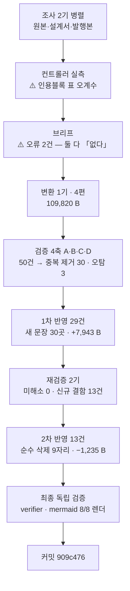
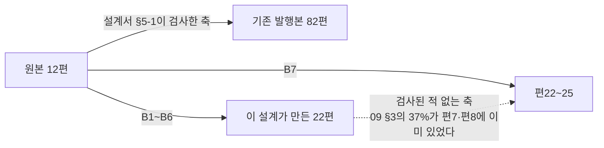

# 인수인계 (HANDOFF)

**갱신일**: 2026-08-12
**브랜치**: `main` · 최신 커밋 `909c476`
**작업트리**: 이 문서 · `CHANGELOG.md`만 미커밋 / stash 없음
**발행본**: **108편** (`ai-agent` 51 · `rag` 25 · `agentic-coding` 26 · 기타 6) · sitemap **169 URL**

---

## 1. 이번 세션에서 한 일

**`agentic-coding` B7을 발행했다(편22~25, `rules-hooks-skills` 시리즈 신설).**
**그리고 분할 설계가 스스로 만드는 중복이 한 번도 검사된 적이 없었다는 것이 드러났다.**



**1차가 쓰고 2차가 지웠다** — 이 배치의 형태가 저 두 상자에 다 들어 있다.

| 단계 | 산출 |
| --- | ---: |
| 변환 4편 | 109,820 B · 도식 8 · 표 70 |
| 검증 4축 | 지적 **50건** (중복 제거 후 30 · 오탐 3) |
| 1차 반영 | 반영 29 · **반박 1 · 부분반박 1 · 판단변경 1** · 새 문장 30곳 · **+7,943 B** |
| 재검증 2기 | 미해소 **0** · 과잉수정 **0** · **신규 결함 13건** |
| 2차 반영 | 13건 전량 · **순수 삭제 9자리 · 새 주장 0건 · −1,235 B** |
| 최종 | **116,528 B · 배율 1.78** |

**편별 최종**: 편22 32,667 · 편23 21,017 · 편24 23,168 · **편25 39,676 B(발행본 최대 경신 — 직전 편18 36,238).**

### ⚠️ 분할 설계가 스스로 만드는 중복은 검사된 적이 없다 — 이번 배치의 최대 발견

설계서 §5-1의 「중복-완전 0건」은 **기존 발행본 82편(`ai-agent`·`rag` 등) ↔ 원본** 대조 결과다.
**B1~B6가 새로 만든 22편은 그 대조 대상이 아니었다.**



`09 §3`의 **37%(≈3,850 B)**가 편7·편8에 이미 발행돼 있었다 — 편7 `dot-claude-directory`의
「패턴 1~4」가 `09 §3-2` 프롬프트 4요소와 **이름까지 같고 3,254 B로 더 상세**하다.

> **원본끼리 겹치면 발행본끼리도 겹친다.** 원본은 같은 강의에서 나온 12편이므로 겹칠 수밖에 없다.
> **뒤 배치일수록 이 위험이 커진다 — B8은 전 배치 내용을 다시 다루므로 최대다.**

### 오류 유형 추이

| 유형 | B1 | B2 | B3 | B4 | B5 | B6 | **B7** |
| --- | ---: | ---: | ---: | ---: | ---: | ---: | ---: |
| **설계서 진단 오류** | 2 | 1 | 1 | 6 | 7 | 0 | **0** ← 2배치 연속 |
| **컨트롤러 브리프 오류** | — | — | — | — | 2 | 2 | **2** |
| **조사 에이전트 오류** | — | — | — | — | — | 5+ | **1** |
| 원본 내부 모순 신규 발견 | — | — | — | 1 | 2 | 3 | **1** |
| 재검증 신규 결함 | — | — | 5 | 7 | 7 | 8 | **13** ← 최다 |
| 팽창률 | 1.76× | 1.42× | 1.31× | 1.77× | 1.97× | 1.77× | **1.78×** |

**설계서 진단 오류 0건은 §4-1(바이트·도식) 기준이다** — 편22 19,067(설계 19,118) · 편24 12,907(12,900) ·
편25 22,983(22,988)으로 **오차 0.3% 이내**다. 편23 재조준의 원인은 바이트 진단이 아니라 **§5-1 모집단 한계**였다.

> **설계서는 자기 오류를 소진하지만 브리프·조사는 매 배치 새로 만들어진다.** B6의 결론이 재확인됐다.
> **B7에서 새로 는 것은 재검증 신규 결함이다 — 13건으로 5배치 최다이며, 높음 4건이 전부 「고치는 행위 자체」가 만들었다.**

### 오류가 난 자리 5건 — 상세는 §6

| 자리 | 무엇 | §6 |
| --- | --- | --- |
| **조사 에이전트 1건** | `RLS`·`Prompt Injection`을 「기발행본에 없다」고 보고 — **두 발행본에 같은 문장으로 실재** | 6-2 |
| **컨트롤러 브리프 2건** | ① 「XML 템플릿은 편7에 없다」 → **`dot-claude-directory.md:356~373`에 실재** ② 「「작성 공식」 열은 편7에 없다」 → **편7 L299 「구조」 행이 축자 동일** | 6-2 · 6-3 |
| **검증 축 C 1건** | `가장 자주 빠지`로 검색해 편7의 *"가장 **많이** 빠지는 요소"*를 놓치고 「어느 발행본에도 없다」고 보고 | 6-2 |
| **컨트롤러 실측 도구 1건** | `awk`가 `^\|`만 봐서 인용블록 표 `> \|---\|---\|`를 못 셈. 편22·편25 표 15·28 → 실제 **16·29** | 6-6 |

> **셋이 「없다」 형태다.** 조사·브리프·검증이 각각 독립적으로 같은 형태로 틀렸다 —
> **부정 명제는 검색어 하나에 걸려 있고, 한 글자만 달라도 거짓이 된다.**
> 실측 도구 결함은 **B6(펜스 미추적)에 이어 2배치 연속**으로 컨트롤러가 자기 도구를 검증하지 않은 것이다.

---

## 2. 다음 세션이 이어받을 것

### 최우선: B8 착수 (Q&A 4편 — Q1~Q4)

**읽을 것**: [`docs/superpowers/plans/2026-08-08-agentic-coding-category-split-design.md`](docs/superpowers/plans/2026-08-08-agentic-coding-category-split-design.md)
— **§4-1·§4-3·§4-4·§5-1·§5-4·§5-5·§6-1·§6-3·§6-4·§6-5·§6-6·§7-4·§8-2·§8-3·§9-1·§10·§11·§12-3·§12-4에 정정 블록이 있다. 그것부터 읽어라.**

| 배치 | 대상 | 편 | 편수 | 상태 |
| ---: | --- | --- | ---: | --- |
| ~~B1~~ | ~~`01`(축약) + `02`~~ | ~~1~5~~ | ~~5~~ | ✅ 완료 (`388519e`) |
| ~~B2~~ | ~~`04`~~ | ~~9~11~~ | ~~3~~ | ✅ 완료 (`f4b9c30`) |
| ~~B3~~ | ~~`05`~~ | ~~12~14~~ | ~~3~~ | ✅ 완료 (`cf948a1`) |
| ~~B4~~ | ~~`03` + `team-productivity`~~ | ~~6~8, 26~~ | ~~4~~ | ✅ 완료 (`a568c2e`) |
| ~~B5~~ | ~~`07`~~ | ~~15~18~~ | ~~4~~ | ✅ 완료 (`2fc5c9f`) |
| ~~B6~~ | ~~`08`(개발축)~~ | ~~19~21~~ | ~~3~~ | ✅ 완료 (`06166e9`) |
| ~~B7~~ | ~~`09`~~ | ~~22~25~~ | ~~4~~ | ✅ **완료** (`909c476`) |
| **B8** | **Q&A 4편** | **Q1~Q4** | **4** | **다음** — `05 §10-1` 10문항 이월 · **Q3에 `ai-agent` 부착 확정** |
| B9 | 지식 지도 | — | 1 | **맨 마지막** |

### B7 실제 산출 — 설계 원안과 달라진 것

| 편 | series / seriesOrder | slug | 원본 절 | 최종 B |
| ---: | --- | --- | --- | ---: |
| **22** | `rules-hooks-skills` 1 | `rules-hooks-skills-layers` | `09` §0 전량 · §1-1 · §1-2 · §2 | 32,667 |
| **23** | `rules-hooks-skills` 2 | **`industry-claude-md-templates`** ← 원안 `prompt-four-elements` | `09` **§8 전량 + §3 고유분** | 21,017 |
| **24** | `rules-hooks-skills` 3 | `empty-folder-to-deploy` | `09` §4 · §7 | 23,168 |
| **25** | `rules-hooks-skills` 4 | `deploy-checklist-debugging` | `09` §5 · §6 · §1-3 | **39,676** |

**편23 재조준은 사용자 승인을 받았다.** 4요소·슬래시 커맨드·@파일 참조·파이프는 편7로, 70% 룰은 편8로 링크 처리했다.

### ⚠️ B8 고유 사항

| # | 사항 | 근거 |
| --- | --- | --- |
| 1 | **Q3에 `ai-agent` 태그를 단다 (결정 완료)** | 아래 「결정 완료」 절. **7은 상한이 아니라 규칙 적용 결과였고, 8편이 되면 집중도가 76.2 → 74.4%로 개선된다** |
| 2 | **`05 §10-1` 10문항이 이월돼 있다** | 설계서 §4-4. B3에서 확정 |
| 3 | **`10-면접-커닝페이퍼.md`는 문항 목록으로만 쓴다** | 설계서 §7-4. 본문 화법은 통째로 금칙어다 |
| 4 | **⚠️ 담당 원본을 기발행본 26편과 반드시 대조하라** | **B8은 전 배치 내용을 다시 다루므로 §5-1 모집단 한계 위험이 최대다.** B7에서 `09 §3`의 37%가 이미 발행돼 있었다 |
| 5 | **가짜 H2를 먼저 세라** | `08`은 7개, `09`는 0개였다. 펜스 추적 없이 `grep -c '^## '`를 돌리면 절 경계가 어긋난다 |
| 6 | **원본 내부 모순을 미리 찾아라** | B4 1 · B5 2 · B6 3 · **B7 1**. **B7의 것은 개수 모순이 아니라 같은 표 안 두 행의 서술 충돌**이라 합계 검산으로 안 잡힌다 |

### 확정된 결정 (다시 묻지 마라)

| 사안 | 결정 | 근거 |
| --- | --- | --- |
| **분량 상한** | **29.4KB는 합격선이 아니다. 넘어도 된다** | §4-0 원문. 발행본 최대는 **편25 39,676 B**(B7에서 편18 36,238을 경신) |
| **시리즈 페이지** | 없다 | `series`는 frontmatter 메타데이터일 뿐 라우트를 만들지 않는다 |
| **frontmatter 필드** | `title` → **`description`** → `category` → `tags`(인라인 배열) → `date` → `updated` → `series` → **`seriesOrder`** → `featured` → `draft` → `source` — **11개다** | 없으면 **빌드 실패.** B6에서 조사가 `description`을 누락 보고했고 **B7 브리프는 「12필드」로 잘못 셌다**(최종 검증이 잡음). **실물을 열어 확인하라** |
| **`source` 값** | `"AI 에이전트 실무 과정"` | 편26만 예외(비움) |
| **축약 용어표 판정** | **개념 기준.** 본문이 한글로 써도 영문 용어 행은 남긴다 | 설계서 §4-4 정정 |
| **`05 §10-1`·`§10-3`** | 각각 **B8 이월** · **드롭** | 설계서 §4-4 |

### ✅ `ai-agent` 태그 — 결정 완료 (2026-08-12). 다시 묻지 마라

**「한도 소진」이 아니었다. 7은 상한이 아니라 규칙 적용 결과였다.**

설계서 §8-2의 진짜 규칙은 배정표 아래 문장에 있다 — *"편1~11·15~18·22~26에는 달지 않는다 — **주제가 에이전트가 아니라 하네스·운영**이다."*
**「주제가 에이전트 자체인 편에만 단다」가 규칙이고 7편은 그것을 센 값이다.** 제목(`7편에만 단다`)이 결과를 제약처럼 읽히게 했다.

| 사안 | 결정 |
| --- | --- |
| **Q3 `agentic-coding-qna-agent-design`** | **`ai-agent` 태그를 단다** |
| **편16 `agent-jd-triggers`** | **그대로 둔다** — JD·팀 구성·라우팅이 주제라 **규칙에 부합한다. 떼는 것이 오히려 위반**이다 |
| 최종 | **8편** — 편12·13·14 + 편16 + 편19·20·21 + Q3 |

`[실측 2026-08-12]` **집중도는 틀어지지 않는다. 개선된다.**

| | `ai-agent` 태그 | 최다 카테고리 집중도 | 전체 비율 |
| --- | ---: | ---: | ---: |
| 설계서 예측 (7편) | 42 | 76% | 37% |
| **실측 (B7 후, 7편)** | **42** | **76.2%** (32/42) | 38.9% |
| **Q3 추가 (8편)** | 43 | **74.4%** ↓ | 38.1% |

**설계서 예측이 정확히 맞았고**(42 / 76%) **Q3를 더하면 집중도가 1.8%p 좋아진다.**
§8-2가 「무제한 부여」(집중도 49%)를 버린 이유는 **전체 비율 58%**였는데, Q3 추가는 비율을 오히려 **0.8%p 낮춘다.**

> **Q3를 빼면 일관성이 깨진다** — Q3의 원본은 `05`·`08`이고 그 원본에서 나온 편12·13·14·19·20·21은 **전부** 달았다.

> ### ⚠️ 세는 방법 — `grep '"ai-agent"'`를 그대로 쓰지 마라
>
> `category: "ai-agent"` 행에 오염돼 51편으로 나온다. **설계서 §11 사례표에 이미 기록된 함정인데 2026-08-12에 또 밟았다.**
> ```bash
> for f in content/blog/*/*.md; do grep -m1 '^tags:' "$f" | grep -q '"ai-agent"'; done
> ```

> **뒤 배치 함의: 설계서가 「N편에만」이라고 쓴 곳은 N이 상한인지 결과인지 확인하라.**
> **결과를 제약으로 읽으면 규칙에 맞는 부착이 「위반」으로 오인되고 규칙에 맞는 글이 태그를 잃는다.**

### B8 브리프에 반드시 넣을 것

**B1~B6가 준 39건 + B7이 준 아래 6건.**

| # | 추가할 지시 | 근거 |
| --- | --- | --- |
| **40** | **표 하나 안에서도 행끼리 대조하라.** 요약표 ↔ 상세표만이 아니다 | `09 §2-4` 훅 응답 규약 4행이 서로 충돌한다(L188 ↔ L190). **개수가 아니라 서술이 충돌해 합계 검산을 통과한다** |
| **41** | **기발행본이 「두 자료가 갈린다」고 고지한 자리에 세 번째로 합류하면 그 고지의 수사(數詞)를 확인하고 보고하라. 고치지는 마라** | 편11 L283 「두 자료」에 `09 §2-4`가 세 번째로 붙었다. **기발행본 수정은 새 검증 표면이다 — 판단은 사용자가 한다** |
| **42** | **담당 원본을 기발행본 26편과도 대조하라** | 설계서 §5-1의 「중복-완전 0건」은 **기존 82편 대조 결과**이고 이 설계가 만든 편들은 대상 밖이다. **`09 §3`의 37%가 편7·편8에 이미 있었다** |
| **43** | **부정 명제는 표현을 바꿔 재검색하라** | 「없다」가 B7에서 **세 번** 틀렸다(조사·브리프·검증 축 C). `가장 자주` ↔ `가장 많이` **한 단어 차이**로 갈렸다 |
| **44** | **이름이 다르면 셀을 열어라.** 열 이름이 다르다고 내용이 다른 것이 아니다 | 「구조」 ↔ 「작성 공식」이 축자 동일이었다. **B6의 「개수 일치는 동일성의 증거가 못 된다」의 역방향** |
| **45** | **2차 반영의 기본 처방은 「지우기」다.** 값을 고쳐 참으로 만들기 전에 **그 주장이 필요한지** 되물어라 | B7 2차가 **−1,235 B를 지우며 13건 전부 해소·신규 0건.** 1차는 **+7,943 B를 쓰고 13건을 낳았다** |

**B1~B6가 준 기존 39건**(요약문 수치 대조 / 원문 강도 상승 금지 / 수정 후 스캔 재실행 / 착수 전 표 밀도 측정 / `[실측]`·`[설계서]`·`[추론]` 표기 / 설계서 진단은 옮기기 전에 실측 / `tags.ts` 패싯 규칙 명시 / 재검증에 「사라졌는가」 / 상한은 합격선이 아님 명시 / 「이 글의 정리다」 귀속 / 분산 지시는 편별 체크리스트 / 신규 도식은 화살표마다 원문 근거 / 부정 주장은 검색 후 근거를 문안에 / 전칭은 전수 배정 / 담당 원본 L1~L3으로 기준일 확인 / 전방 참조는 발행 대상 절 안인지 확인 / 추정에는 「이건 추정이다」 명시 / 전수 배정 뒤 총평 금지 / 전칭에는 개수 명시 / 금칙어 회피 시 귀속 문장도 갱신 / 값 대조는 절 단위 / 부정 명제는 정규식을 넓혀 재확인 / 목록은 전문을 첨부 / 요약표 ↔ 상세표 대조 / 모집단을 바꾸면 처음부터 다시 세라 / 미발행 절 근거 금지 / 자기지시 주장 금지)는 그대로 가져간다.

### ⚠️ 검증자·반영자 브리프에 반드시 넣을 것 — 2배치 연속 산출물 유실

> **「절 단위로 파일에 쓰고 나서 다음 절로 넘어가라.」**
>
> **「중간에도 append 하라」는 지시로는 부족했다.** B7 재검증 1기가 판정을 끝내고 **보고서를 쓰는 응답에서
> API 오류로 끊겨 헤더 880 B만 남았다** — 에이전트가 컨텍스트에 쌓아 두고 마지막에 한 번에 쓰려 했기 때문이다.
>
> **재요청 시 지시할 것 3가지**: ① 「다시 검증하지 말고 이미 내린 판정을 옮겨 적어라」
> ② 「나눠서 여러 번 append 하라」 ③ 「기억나지 않으면 **미확인**이라고 적어라」
> — 이렇게 해서 30,482 B를 회수했다(해소 28 / 부분해소 1 / 미해소 0 / **미확인 0**).

### 진행 방식 — 검증된 절차

```
1단계  분할 설계 → 승인                                    ← 완료
2단계  배치로 나눠 변환, 배치마다 커밋·보고                  ← B1~B7 완료, B8부터
3단계  구현 미참여 에이전트가 4축 독립 검증
4단계  지적 반영 → 재검증 2기 → 2차 반영 → 최종 독립 검증 → 커밋
```

**검증 4축은 그대로 쓴다.** 나누는 기준은 주제가 아니라 **결함이 드러나는 방식**이다.

| 축 | 무엇을 보는가 | 왜 별도 축이어야 하나 | 티어 |
| --- | --- | --- | --- |
| A | 쓰여 있는데 **틀린** 것 | grep으로 안 잡힌다. 세면 0건이라 자동 검증을 통과한다 | opus |
| B | 쓰여 있는데 **원문에 없는** 것 | 원문과 나란히 놓아야만 보인다 | opus |
| C | **없는** 것 | **원본 인벤토리를 먼저 만들고** 그 목록을 들고 발행본을 검색한다 | opus |
| D | **실행하면 나오는** 것 | 종료코드는 객관적이다 | sonnet |

> ### ⚠️ 검증자에게 브리프도 변환 보고서도 주지 마라 — B5에서 확립, B6·B7에서 재확인
>
> **B7에서 4축이 서로 모른 채 50건을 냈고 중복 제거 후 30건이 남았다** — 3축 도달 5건 · 2축 도달 6건.
> 같은 문장이라도 축 A는 「세어 보니 8칸 중 6」으로, 축 B는 「원문에 그런 서술이 없다」로 도달한다.
>
> **대가는 오탐 3건이다**(설계서 §6-2가 정한 표준 주체 치환을 축 B가 금지선 위반으로 지적). **판정은 컨트롤러가 한다.**
> **다만 그 오탐 안에 진짜 지적이 하나 섞여 있었다** — 원본 `09`에는 「강의 자료」와 「`09` 자신」 **두 층**이 있어
> 일괄 치환하면 두 층이 한 층으로 접힌다. **원문이 두 층을 대비시킨 문장에서만 모순이 드러난다(L83·L652).**
> **오탐으로 판정할 때도 지적이 건드린 자리를 한 번 더 열어라.**
>
> **축 C는 반드시 원본을 먼저 읽게 하라.** 다만 **B7에서 축 C가 부정 명제 하나를 놓쳤다** —
> `가장 자주 빠지` 로 검색해 편7의 *"가장 **많이** 빠지는 요소"*를 못 찾고 「어느 발행본에도 없다」고 보고했다.
> **축 C의 산출은 전부 부정 명제이므로 검색어를 바꿔 두 번 돌리게 하라.**

**재검증은 2기로 나눈다.** B3 5건 · B4 7건 · B5 7건 · B6 8건 · **B7 13건.** 5배치 연속이고 **늘고 있다.**

> **반영자에게 「새로 쓴 문장 전량과 각각의 검증 가능한 주장」을 기록하게 하라.**
> B7에서 반영자가 **30자리(본문 45줄)**를 기록했고 재검증 2기가 그 45줄에서 **전칭·배타 표현 64회**를 뽑아
> **13건을 찾았다. 목록이 없으면 116KB에서 무엇이 새 문장인지 구분할 방법이 없다.**
>
> **그리고 2차 반영에는 「지우는 것이 기본」을 사전에 지시하라.** B7에서 처방으로 미리 준 결과
> **1차 +7,943 B / 신규 결함 13건 → 2차 −1,235 B / 신규 결함 0건**이 나왔다.

**최종 독립 검증을 한 번 더 돌려라.** 2차 반영자의 자기 검증은 검증이 아니다.
B6에서 최종 검증(verifier)이 **컨트롤러 실측 오류 1건**을 잡았고,
B7에서는 **브리프의 「frontmatter 12필드」 오기(실제 11)**를 잡았다. **2배치 연속으로 컨트롤러 산출물을 교정했다.**

---

## 3. ⚠️ 설계서 정정 — B8 이후에 영향

**B7에서 9건을 정정했다. 전부 설계서 본문에 ⚠️ 블록으로 삽입돼 있다.**

| 절 | 정정 | 뒤 배치 영향 |
| --- | --- | --- |
| **§5-1** | ⚠️ **「중복-완전 0건」의 모집단에 이 설계가 만든 22편이 없다.** 대조는 기존 82편 ↔ 원본으로만 돌았다 | **B8이 최대 위험.** 담당 원본을 **기발행본 26편과도** 대조하라 |
| **§8-2** | ⚠️ **「7편 한도 소진」이 아니었다 — 7은 상한이 아니라 「주제가 에이전트 자체인 편」을 센 결과다.** 편16 부착은 규칙에 부합하고, Q3를 더하면 집중도가 **76.2 → 74.4%로 개선**된다 | **B8.** Q3에 단다(확정). **「N편에만」은 N이 상한인지 결과인지 확인하라** |
| **§4-1** | ✅ **기록** — 편22·24·25 설계값 오차 **0.3% 이내**. **2배치 연속 진단 오류 0건**. 단 편23은 §5-1 때문에 재조준 | 바이트 진단은 신뢰해도 된다 |
| **§4-3** | 도식 총계 **85 → 84**. `09 §3`의 유일한 도식이 패턴 5와 함께 편8로 링크되며 드롭 | **절을 링크로 넘기면 딸린 자산도 넘어간다** |
| **§5-4** | `09` 내부 모순 **1건 추가** — §2-4 표 L188 ↔ L190. **같은 표 안 두 행의 서술 충돌** | **B8.** 표 하나 안에서도 행끼리 대조하라 |
| **§5-4 1번** | `09` 200줄은 2곳이 아니라 **3곳**(L340·**L962**·L967), **셋 다 편23** | L962는 **mermaid 노드 안**이라 grep에서 빠진다 |
| **§6-5 10번** | 「원문이 세 번 반복」 → **2회**(L652·L1008). L1023은 §10 「금지」 열 셀 | **위험은 실재했다** — L652는 금칙어 `강의`를 포함해 처리 중 변형됐다 |
| **§9-1** | `09` L753 절간 참조 추가 (편25 → 편22). **B6의 `08` L682에 이어 2배치 연속** | **전방 참조 표는 원본 파일 사이만 담아 한 원본 안의 절간 참조를 놓친다** |
| **§10** | 팽창률 **1.78**. 7배치 실측 1.76·1.42·1.31·1.77·1.97·1.77·1.78 | **`09` 원본 실측은 §10-1과 5개 항목 전부 일치** |

### 앞 배치 정정도 유효하다

| 배치 | 정정 위치 | 요지 |
| --- | --- | --- |
| B1 | §6-1 · §10 | 「`강의가 ~한다` 130여 개」 → **실측 32** / 팽창률 1.20 → 1.76 |
| B2 | §5-3 ①②③ | 발행본 열거 기준 · MCP 인과 · 발행본 시점 |
| B3 | §6-5 8번 | `05 §11`은 출처 대장이 아니라 **면접 화법 가이드** |
| B4 | §6-3·§6-4·§6-5·§9-1 | 편26 항목 3건 · 시점 기준일 `2026-07-26` · 인용 절 4건 · `Plan Mode` 링크 불가 |
| B5 | §4-1·§4-4·§5-4·§5-5·§6-6·§10·§11 | `seriesOrder` · 용어표 개념 기준 · 100줄 · 절대 수치 · 금지선 17 |
| B6 | §4-1·§5-4·§8-2·§8-3·§9-1·§10·§11·§12-3·§12-4 | `08` 내부 모순 3건 · **`ai-agent` 한도 7/7 소진** · 목록 전문 첨부 · 행 수 가설 반증 · §12-3 해소 |

---

## 4. 미해결 과제

| # | 항목 | 상태 |
| --- | --- | --- |
| 1 | **mermaid 노드 라벨 우측 1~9px 클리핑** | `foreignObject` 폭이 텍스트보다 좁다. **전역 렌더링 이슈로 별건 처리 필요** |
| 2 | **FR-1.4 스크롤스파이 미구현** | 기존 위키(`wiki-shell.tsx`)에도 없어 신규 후퇴는 아니다 |
| 3 | **메인 페이지 LCP 6.6초** | Lighthouse 77점. **블로그 도입 이전에도 77점**이었다 |
| 4 | **싱글톤 태그 재측정** | §13-3 목표는 "2차 신규 싱글톤 0". **B6에서 `ci-cd` 싱글톤이 생겼다가 해소됐다.** 2차 전체를 마친 뒤 재측정 |
| 5 | **`cto_learning_roadmap` Q1·Q3** | 발행 가능 판정을 받았으나 미변환 |
| 6 | **어휘 81종 중 0편 태그** | **목록은 설계서 §8-3에 있다. B8 브리프에 전문을 첨부하라** |
| 7 | **훅 차단 채널이 이제 세 자료에서 갈린다** | **B7에서 두 번째 갱신.** 편4 `settings-permissions-deny`(**표준 에러**) · 편11(**stdout JSON `reason`**) · **`09 §2-4`**(원본 자신도 표 안에서 L188 ↔ L190 충돌). 편22가 셋을 병기하고 판정하지 않았다. **편11 L283의 「두 자료」는 수정하지 않았다**(사용자 결정) — 이제 셋이므로 **수사(數詞)가 낡았다** |
| 8 | **원본 `04 §8-2` 「3대 구성 요소」인데 표는 4행** | 원본에서 이월된 불일치. 편11에 해명만 달았다 |
| 9 | **원본 `05` 내부 수치 불일치** | L56 도식 `frontmatter 5+4 필드` ↔ L145 표 `핵심 5 + 확장 5` |
| 10 | **`05 §3-2` 제품 결함 3건의 현재 유효성** | 「버전 표기가 없다」는 명기했으나 **세 동작이 지금도 그런지는 미확인** |
| 11 | **무귀속 판정 잔존 2건** | 편14 L232 · 편13 L235. B3~B6에서 손대지 않았다 |
| 12 | **B1 발행본 편2~5의 `2026-04` 표기 재확인** | 「강의 시점」인지 「문서 기준일」인지 구분되지 않았다 |
| 13 | **편7 `feedback` 예시가 원본 MEMORY.md 예시와 소재 겹침** | **B4 재검증 `[추론]`.** 의도적으로 두었다 |
| 14 | **편8 용어표 「멀티턴 대화」 본문 0회** | **개념 기준 확정으로 재판정 대상** |
| 15 | **기발행본의 축약 용어표 문자열 0회 행 미점검** | **개념 기준 확정으로 대부분 해소되나 기발행 18편은 재점검하지 않았다** |
| 16 | **편25가 발행본 최대 (39,676 B)** | **B7에서 편18 36,238을 경신.** **렌더링·ToC·로딩 체감은 여전히 확인하지 않았다** — 40KB 근처는 처음이다 |
| 17 | **`08 §12` 임계값 3건이 미발행 절 근거** | **B6 신규.** CTR 1.5%/1%(§5) · OCR 80%·「병렬 절대 금지」(§8). 편20에 축자 이식돼 있고 **문장은 끊기지 않는다.** `ai-transformation`에서 §5·§8 발행 시 교차 링크로 해소 (설계서 §12-4 4번) |
| ~~18~~ | ~~**`ai-agent` 태그 한도 소진**~~ | ✅ **해소 (2026-08-12).** 「한도 소진」이 아니라 **7이 상한이 아니라 결과**였다. Q3 부착 확정 · 편16 유지 · 8편. 집중도 76.2 → **74.4% 개선**. 위 §2 참조 |
| 19 | **`08 §12-1` 원본 모순을 발행본이 병기로만 처리** | **B6 신규.** 위임 링크가 8인지 13인지 원 자료 안에서 판정되지 않는다. **원본이 읽기 전용이라 해소 불가** |
| **20** | **`Supabase` 탈브랜딩 일관성 미대조** | **B7 신규.** 편22 용어표(`auth.uid()` 행)는 원문대로 `Supabase`를 실었고 편25 MCP 표도 그렇다. **시리즈 안에서는 일관되나 다른 카테고리와 대조하지 않았다.** 1차 반영이 「용어표는 원 자료 전량」 선언을 참으로 만들려고 되살린 것이다 |
| **21** | **컨트롤러 실측 도구가 인용블록 표를 못 셌다** | **B7 신규.** `awk`가 `^\|`만 봐서 `> \|---\|---\|`를 놓쳤다(편22·편25 각 1개). **앞 배치들의 발행본 표 수치도 같은 결함의 영향을 받았을 수 있다 — 재확인 미실시.** §7 명령은 고쳐 두었다 |
| **22** | **`industry-claude-md-templates.md:131` 「앞 절반」이 짝 없이 남았다** | **B7 신규.** 2차 반영이 「뒤 절반 …」 문장을 삭제하며 생겼다. **문법 오류도 지시어 붕괴도 아니어서 최종 검증이 비차단으로 기록**했다. 다음 손댈 때 표현 자체를 손볼지 판단 |

### `ai-transformation`으로 이월된 위험 4건

`06` 전량 + `08 §4~§8·§10`을 이관하면 위험도 함께 간다. **설계서 §12-4에 상세가 있다.**

| # | 위험 |
| --- | --- |
| 1 | `06 §4-6`·`§8-7` **정량 개선 수치 9행.** 원본이 세 겹으로 방어하는데 발행 제외 절 + `강의` 제거로 셋 다 사라진다 → **출처 없는 성과표** |
| 2 | **`06`은 발행본과 서사 방향이 반대다.** **연결 문장이 없으면 모순으로 읽힌다** |
| 3 | `06 §2-8` ↔ `loop-antipatterns-and-checklist` 셀 단위 대조 **미실시** |
| **4** | **`08 §12` 임계값 3건** (위 미해결 17번) |

---

## 5. README/문서 갱신 필요 (이번 세션에서 고치지 않음)

**열 번째 이월이다.** README는 2026-08-07(`7f28866`) 이후 손대지 않았고 그 사이 **27커밋**이 쌓였다.

| 낡은 부분 | 왜 낡았나 | 확인할 진실원 |
| --- | --- | --- |
| 프로젝트 구조 트리 | `content/`·`scripts/`·`tests/` 없음 | 실제 디렉터리 |
| 기술 스택 | Vitest·react-markdown·mermaid 없음 | [`package.json`](package.json) |
| 기능 설명 | 블로그 **108편·4카테고리**가 통째로 없음 | [`pages/blog/`](pages/blog/), [`content/blog/`](content/blog/) |

**고치지 않은 이유**: 기능 설명·아키텍처 서술은 여러 소스를 교차 대조해야 정확한데, 핸드오프는 세션 끝이라 컨텍스트가 가장 얕다.

### ⚠️ 환경변수 검사 신호는 **오탐이다. 고치지 마라**

```
[HIGH] ENV_KEYS_IN_CODE_BUT_NOT_IN_README
  LANGCHAIN_PROJECT · LANGCHAIN_TRACING_V2 · OPENAI_API_KEY
  TAVILY_API_KEY · UPSTAGE_API_KEY
```

**전부 `content/blog/**/*.md`의 코드 예제 안**이다. 정적 export 사이트라 런타임 환경변수가 없다.
실제로 쓰는 것은 [`lib/site.ts`](lib/site.ts)의 `NEXT_PUBLIC_SITE_URL` **하나**이며 README에 이미 문서화돼 있다.
`[LOW] SCRIPTS_DIR_MISSING_IN_README: generate-sitemap.mjs`도 **오탐** — `next build` 후 자동 실행되는 훅이다.

---

## 6. 알아둘 함정 — 이번 세션에서 새로 배운 것

직전까지의 함정은 [요구사항 §14·§15](docs/superpowers/specs/2026-08-07-tech-blog-requirements.md)와 설계서 §13, `CHANGELOG.md`의 B1~B6 항목에 있다. **아래는 B7에서 새로 나온 것이다.**

### 6-1. ⚠️ 분할 설계가 스스로 만드는 중복은 아무도 검사하지 않는다

중복 검사의 모집단이 **「원본 ↔ 기존 발행본 82편」**으로 고정돼 있었고,
**이 설계가 만든 편들끼리의 중복은 축 자체가 없었다.**

| 대조 축 | 설계서 §5-1이 검사했나 |
| --- | --- |
| 원본 ↔ 기존 발행본 82편 | ✅ 「중복-완전 0건」 |
| 원본 ↔ 원본 | — (같은 강의에서 나왔으니 겹친다) |
| **이 설계가 만든 편 ↔ 이 설계가 만든 편** | ❌ **검사된 적 없음** |

> **`09 §3`의 37%(≈3,850 B)가 편7·편8에 이미 있었다.** 편7의 「패턴 1~4」가 `09 §3-2` 4요소와
> **이름까지 같고 3,254 B로 더 상세**했다. **B8은 전 배치 내용을 다시 다루므로 이 위험이 최대다.**

### 6-2. 「없다」는 검색어 하나에 걸려 있다 — B7에서 세 번 틀렸다

조사·브리프·검증 축 C가 **각각 독립적으로** 부정 명제를 틀렸다.
가장 뼈아픈 것은 축 C다 — `가장 자주 빠지`로 검색해 편7의 *"가장 **많이** 빠지는 요소"*를 놓쳤다.

> **한 글자 차이로 「없다」가 「있다」가 된다.**
> **축 C의 산출은 전부 부정 명제이므로 검색어를 바꿔 두 번 돌리게 하라.**
> B5의 금지선 15는 변환자용으로 만들어졌으나 **조사·브리프·검증 세 단계 모두에 걸린다.**

### 6-3. 이름이 다르다고 내용이 다른 것도 아니다 — B6 교훈의 역방향

| 배치 | 교훈 | 무엇을 안 열었나 |
| --- | --- | --- |
| B6 | 개수가 같다고 같은 것이 아니다 | 7·5·4·30이 맞는데 **셀을 안 열었다** |
| **B7** | **이름이 다르다고 다른 것이 아니다** | 「구조」 ↔ 「작성 공식」 — **열 이름만 보고 셀을 안 열었다** |

> **양방향 모두 셀을 열어야 한다.** 브리프가 「그 열은 편7에 없으니 인용해도 된다」고 잘못 허가했고
> **변환자가 그 근거 위에 「이 원 자료가 덧붙인 것」이라는 주장을 세웠다.** 지적 12번이 전면 재작성으로 갔다.

### 6-4. 1차 반영은 쓰고 2차 반영은 지운다 — 처방을 사전에 주면 작동한다

| 반영 | 바이트 | 새 문장 | 낳은 결함 |
| --- | ---: | ---: | ---: |
| 1차 (29건 처리) | **+7,943 B** | 30자리 · 45줄 | **13건** |
| 2차 (13건 처리) | **−1,235 B** | **0자리** | **0건** |

2차의 조치는 **순수 삭제 9자리 · 좁히기 치환 6자리**이고, **H2·표·도식·펜스 수치가 1차와 전부 동일**하다 —
구조는 손대지 않고 산문만 줄였다.

> **B6의 「판정을 지우는 수정은 분량을 줄인다」가 처방으로 승격됐다.**
> **2차 반영 브리프에 「지우는 것이 기본」을 미리 적어라.**

### 6-5. 개수를 세지 못하면 개수를 쓰지 않는 것이 옳은 처방이다

「되돌아오는 자리가 **하나** 있다」를 「넷」으로 고치는 대신 **개수를 뺐다.**
「되돌아오는 자리」의 **조작적 정의가 글에 없어** 판정자마다 갈리기 때문이다.

> **금지선 19(전칭에는 개수를 명시하라)는 셀 수 있을 때만 유효하다.**
> 셀 수 없으면 **존재 주장만 남기는 것**이 정답이다 — 「자리가 있다」는 한 자리로 충족된다.
> 형제 글 대비가 자기모순이 된 자리도 값을 고치는 대신 **대비 문장 2개를 통째로 삭제**했다.
> **두 글이 같으면 대비할 것이 없다.**

### 6-6. 컨트롤러가 자기 실측 도구를 검증하지 않았다 — 2배치 연속

| 배치 | 도구 결함 | 결과 | 누가 잡았나 |
| --- | --- | --- | --- |
| B6 | 펜스를 추적하지 않는 `grep` | 편20 표 11 (실제 10) | 최종 독립 검증 |
| **B7** | **`^\|`만 보는 `awk`** — `> \|---\|---\|` 인용블록 표를 못 셈 | 편22·편25 표 15·28 (실제 16·29) | **변환자** |

> **원본 `09`에는 인용블록 표가 0건이라 원본 실측은 영향받지 않았다.**
> **그러나 앞 배치들의 발행본 표 수치는 같은 결함의 영향을 받았을 수 있다 — 재확인하지 않았다.**
> §7의 실측 명령을 고쳐 두었다.

### 6-7. 오탐 판정 안에 진짜 지적이 섞여 있었다

축 B가 「`강의 자료는`→`원 자료는` 주체 치환」을 금지선 4 위반으로 지적했다.
**설계서 §6-2가 정한 표준 처리라 오탐이다.** 그런데 **그 지적이 건드린 자리에 진짜 문제가 있었다.**

> **원본 `09`에는 두 층이 있다** — 상위 「강의 자료」와, 그것을 정리한 `09` 문서 자신.
> 발행본은 `09`를 「원 자료」라 부르므로 **일괄 치환하면 두 층이 한 층으로 접힌다.**
> 대부분 무해하지만 **원문이 두 층을 대비시킨 문장(L83·L652)에서만 자기모순이 드러난다.**
> **오탐으로 판정할 때도 지적이 가리킨 자리를 한 번 더 열어라.**

### 6-8. 서브에이전트 산출물 유실 — 2배치 연속, 원인이 달랐다

B6는 `Write` 도구 비활성화였다. **B7은 다르다** — 재검증 1기가 판정을 끝내고
**보고서를 쓰는 응답 자체가 API 오류로 끊겨 헤더 880 B만 남았다.**

> **브리프에 「중간에도 append 하라」를 적었으나 지켜지지 않았다** —
> 에이전트가 **컨텍스트에 쌓아 두고 마지막에 한 번에 쓰려** 했기 때문이다.
> **지시를 「절 단위로 파일에 쓰고 나서 다음 절로 넘어가라」로 바꿔야 한다.**
>
> 재요청 시 ① 「다시 검증하지 말고 이미 내린 판정을 옮겨 적어라」 ② 「나눠서 여러 번 append 하라」
> ③ 「기억나지 않으면 **미확인**이라고 적어라」를 지시해 30,482 B를 회수했다
> (해소 28 / 부분해소 1 / 미해소 0 / **미확인 0**). **유실된 판정을 추측으로 메우는 것이 유실보다 위험하다.**

---

## 7. 검증 명령

```powershell
cd C:\Users\aeby\vscode\withwooyong.github.io

npm test              # 36개 통과 (tests/blog/ 3파일)
npx tsc --noEmit      # 0
npm run build         # 0, [sitemap] 169개 URL, 정적 페이지 178

# 금칙어 — 기대 3건 (전부 thirty-agent-catalog.md, 아래 오탐 목록 참조)
Select-String -Path "content\blog\agentic-coding\*.md" `
  -Pattern "면접|커닝페이퍼|암기용|화이트보드|이력서|강의|수강|Part [0-9]|CH0[0-9]|예상 질문"

# 민감정보 — 회사명·핸들은 0건 기대. 「채용」은 아래 오탐
Select-String -Path "content\blog\agentic-coding\*.md" `
  -Pattern "히츠|야나두|TVING|티빙|BTV|허우용|채용|teddylee|teddynote|argus|FASTCAMPUS|실장"

# 화행 잔재(SC-12) — 요구사항 §14가 진실원. 오탐 많음, 문맥 판정 필수
Select-String -Path "content\blog\agentic-coding\*.md" `
  -Pattern "인용할 때|라고 말|수준으로 말|것이 안전|실적이 아니|반박당|의심받|감점|말해야 |말하면 안|인용 시"
```

> **알려진 오탐**
> - `허우용` — `out/` 기준으로 스캔하면 nav·푸터·SEO 메타가 잡힌다. **원고(`content/`) 기준으로 스캔할 것**
> - `테디노트`·`패스트캠퍼스` — `source:` 출처 표기다. **정규식은 영문만 잡는다**
> - **`채용`** — `subagent-definition-fields.md` · `agent-team-operations.md` · `agent-jd-triggers.md` · `scaling-routing-collapse.md` · **`thirty-agent-catalog.md`(B6 신규 2자리)**. 전부 **에이전트가 담당하는 업무 도메인의 이름**이며 저자의 구직 활동이 아니다. **인사 부서의 업무를 달리 부를 이름이 없어 구조적으로 제거 불가**
> - **`이력서`·`면접` — `thirty-agent-catalog.md`(B6 신규)** — `recruiter` 에이전트의 「주요 입력: 포지션 정의, 요구 역량, **이력서**」와 「스크리닝·**면접** 질문」이다. **위와 같은 성격**
> - `실적이 아니` — `scaling-routing-collapse.md` · `thirty-agent-catalog.md` · **B7 4편 전부(`rules-hooks-skills-layers`·`industry-claude-md-templates`·`empty-folder-to-deploy`·`deploy-checklist-debugging`)**. 주어가 **대상의 성질**(「사람 검수 등급은 …이 글이 운영해 얻은 실적이 아니다」)이라 서술문이며, **오히려 귀속을 명시한 좋은 문장**이다. **이제 6편으로 늘었다 — 귀속 표기 관행이 정착한 결과다**
> - `인용할 때` — `agent-team-operations.md`. 원 자료 수치 인용 지침이지 면접 화법이 아니다
>
> **판정 기준**: 문장의 주어가 **독자의 발화**면 화법, **대상의 성질**이면 서술이다.

### 태그 패싯 분포 검사 (빌드가 못 잡는다)

```powershell
Select-String -Path "content\blog\agentic-coding\*.md" -Pattern "^tags:"
```

**패싯 C가 3개 이상이면 위반.** `claude-code`·`ai-agent`·`multi-agent`·`ai-governance`·`ai-automation`·`context-engineering`·`prompt-engineering`이 전부 C다.
**`ai-agent`는 「주제가 에이전트 자체인 편」에만 단다 — 편수 상한이 아니다.** 현재 7편이고 **Q3가 8번째로 확정**됐다(§2 참조).
**세는 방법에 주의하라** — `grep '"ai-agent"'`는 `category:` 행에 오염돼 51편으로 나온다. `^tags:` 행에서만 세라.
**0편 태그 30종은 설계서 §8-3에 목록이 있다. 어휘에 있어도 쓰면 안 된다 — 빌드는 막지 않는다.**

### mermaid 검사 — **문법이 아니라 렌더링을 확인하라 (B7에서 승격)**

```bash
# ① 블록 추출 → ② 실제 렌더링. 앞 배치는 ①만 했다.
npx @mermaid-js/mermaid-cli -i block.mmd -o out.svg   # 종료코드 0 + SVG 비어 있지 않은지
```

**B7에서 8블록 전부 SVG 생성(13~27KB)·종료코드 0을 확인했다.** `mermaid-cli` v11.16.0.
`npm run build`는 **클라이언트 렌더링이라 mermaid 오류를 절대 잡지 못한다**(종료코드 0으로 통과).

`awk '/^```mermaid/,/^```$/'` 문법 검사도 병행한다 — 노드 ID 미정의·중복, 점선 라벨 `-.->|"..."|` 짝,
특수문자(`·` `—`) 든 라벨의 따옴표, 블록 개폐 수를 본다.
**코드펜스(```) 총 개수가 짝수인지도 세라.** 현재 값: 편22 **8** · 편23 2 · 편24 6 · 편25 4.

> **⚠️ 발행본의 표·H2를 셀 때는 펜스 추적 + 인용블록 표를 둘 다 처리하라.** 두 함정이 각각 한 배치씩 걸렸다.
>
> | 함정 | 어디서 | 오차 |
> | --- | --- | --- |
> | 4틱 펜스 안의 표처럼 보이는 텍스트 | B6 편20 | 11 → **10** (과대) |
> | 인용블록 표 `> \|---\|---\|` | B7 편22·편25 | 15·28 → **16·29** (과소) |

### 발행본 실측 — 펜스 스킵 + 인용블록 표 포함

```bash
LC_ALL=C awk '
  /^```/ { fence=!fence; next }                       # 펜스 안은 통째로 스킵
  !fence && /^## / { h2++ }
  !fence && /^[ ]*>?[ ]*\|[ ]*[-:][- :|]*\|[ ]*$/ { tb++ }   # ← `> |---|---|` 도 잡는다
  END { printf "H2 %d · 표 %d\n", h2, tb }' content/blog/agentic-coding/<파일>.md
```

**⚠️ `^\|`만 보면 인용블록 안의 표를 놓친다 — B7에서 컨트롤러가 실제로 놓쳤다.**
현재 값: 편22 H2 10·표 16 · 편23 6·8 · 편24 11·17 · 편25 13·29.

### 원본 실측 재현 (펜스 추적 필수)

```bash
cd "C:/Users/aeby/vscode/yanadoo-exit/shared/knowledge/aiagent"
LC_ALL=C awk '
  BEGIN { sec="머리말" }
  /^```/ { if (!fence && $0 ~ /^```mermaid/) mm[sec]++; fence=!fence; b[sec]+=length($0)+1; next }
  !fence && /^## / { sec=$0; order[++n]=sec; start[sec]=NR }
  !fence && /^[ ]*>?[ ]*\|[ ]*[-:][- :|]*\|[ ]*$/ { tb[sec]++ }
  { b[sec]+=length($0)+1 }
  END { t=0; for(i=1;i<=n;i++){s=order[i]; t+=b[s];
        printf "%s | L%d | %d B | 표 %d | 도식 %d\n",s,start[s],b[s],tb[s],mm[s]}
        printf "합계 %d B\n", t+b["머리말"] }' <파일>
```

**⚠️ `length($0)+1`의 `+1`이 개행이다. 빼먹으면 절마다 줄 수만큼 미달한다.**
**펜스를 추적하지 않으면 H2가 과대계수된다** — `07`·`09`는 가짜 H2가 0이지만 **`08`은 7개**였다.
**절별 합계를 `wc -c`와 대조하라.** B7에서 `09` 72,865 B가 정확히 맞았다(설계서 §10-1 5개 항목 전부 일치).
**표 데이터행은 별도로 세라** — 조사 에이전트가 B6에서 4건을 틀렸다.

### 링크·SC-10 검사 (bash)

```bash
# 내부 링크 전건 실재 확인
grep -ho '/blog/[a-z-]*/[a-z0-9-]*/' content/blog/*/*.md | sort -u | while read l; do
  cat=$(echo "$l" | cut -d/ -f3); slug=$(echo "$l" | cut -d/ -f4)
  [ -n "$slug" ] && [ ! -f "content/blog/$cat/$slug.md" ] && echo "MISSING: $l"
done

# SC-10 들어오는 링크가 0인 글 — 독립편은 구조적으로 여기 걸린다
for f in content/blog/*/*.md; do
  s=$(basename "$f" .md)
  n=$(grep -rl "/$s/" content/blog/ --include=*.md | grep -v "/$s.md" | wc -l)
  [ "$n" -eq 0 ] && echo "들어오는 링크 0: $s"
done
```

---

## 8. 소스 위치

| | 경로 |
| --- | --- |
| 원본 (읽기 전용, **수정 금지**) | `C:\Users\aeby\vscode\yanadoo-exit\shared\knowledge\` |
| 발행본 | [`content/blog/<카테고리>/<slug>.md`](content/blog/) — **108편** (`agentic-coding` **26편**) |
| 카테고리 정의 | [`content/blog/categories.ts`](content/blog/categories.ts) — 12개 등록, **4개 발행** |
| 태그 통제 어휘 | [`content/blog/tags.ts`](content/blog/tags.ts) — 81종. **목록 밖이면 빌드 실패. 상단 주석에 패싯 규칙이 있다** |
| frontmatter 검증 | [`lib/blog/frontmatter.ts`](lib/blog/) — 형식 오류 먼저, 어휘 오류 나중. tags 최대 6개 |
| 요구사항 | [`docs/superpowers/specs/2026-08-07-tech-blog-requirements.md`](docs/superpowers/specs/2026-08-07-tech-blog-requirements.md) — §13·§14·§15 |
| **`agentic-coding` 설계서** | [`docs/superpowers/plans/2026-08-08-agentic-coding-category-split-design.md`](docs/superpowers/plans/2026-08-08-agentic-coding-category-split-design.md) — **§4-1·§4-3·§5-1·§5-4·§6-5·§9-1·§10에 B7 정정 블록.** B1~B6 정정은 §4-4·§5-3·§5-5·§6-1·§6-3·§6-4·§6-6·§8-2·§8-3·§11·§12-3·§12-4 |
| `ai-agent` 설계서 (템플릿) | [`docs/superpowers/plans/2026-08-08-ai-agent-category-split-design.md`](docs/superpowers/plans/2026-08-08-ai-agent-category-split-design.md) |
| **B1 보고서 5건** | [`docs/superpowers/reports/`](docs/superpowers/reports/) — 변환·실행검증·리뷰2·반영 |

**B1 보고서 5건이 저장소에 남아 있다.** 뒤 배치는 이것을 템플릿으로 쓸 수 있다 — 다만 **변환 보고서 §4-2 분류표는 상쇄 오류가 있었으므로 그대로 복제하지 마라.**

> **B2 보고서 7건 · B3 13건 · B4 11건 · B5 10건 · B6 12건 · B7 10건은 스크래치패드에만 있고 커밋하지 않았다.** 세션이 끝나면 사라진다.
> 핵심은 이 문서 §3·§6과 `CHANGELOG.md`, 그리고 **설계서 정정 블록**에 옮겨 적었다.
>
> **B7 보고서 구성** — `B7-brief.md` · `B7-conversion-report.md` · `B7-adjudication.md` · `B7-verify-A~D.md` ·
> `B7-fix1-report.md` · `B7-recheck-1.md` · `B7-recheck-2.md` · `B7-fix2-report.md` · `B7-final-verify.md`.
> **판정표(`B7-adjudication.md`)와 반영 보고서(`B7-fix*-report.md`)가 재검증의 표적 목록이므로 가장 값이 크다.**
