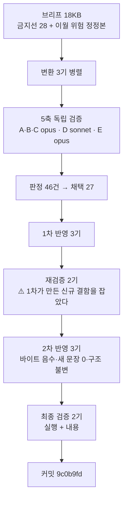

# 인수인계 (HANDOFF)

**갱신일**: 2026-08-16
**브랜치**: `main` · 최신 커밋 `9c0b9fd` (**미푸시**)
**작업트리**: 이 문서만 미커밋 / stash 없음
**발행본**: **116편** (`ai-agent` 51 · `rag` 25 · `agentic-coding` 31 · `search-engineering` 6 · **`ai-transformation` 3**) · sitemap **178 URL**

> **`ai-transformation` T1을 발행했다.** 11편 중 3편이 나갔고 8편이 남았다.

---

## 1. 이번 세션에서 한 일

**`aiagent/06`(63,181 B)을 편6·편7·편8로 분할 발행했다. 9배치 절차를 그대로 돌렸고 전 단계가 통과했다.**



| 편 | slug | 원본 절 | 원본 B | 발행 B | 팽창 |
| ---: | --- | --- | ---: | ---: | ---: |
| 6 | `department-agent-blueprint` | §0·§1·§2 | 17,324 | **28,286** | 1.63 |
| 7 | `department-automation-frontline` | §3~§6 | 20,879 | **37,679** | 1.80 |
| 8 | `department-automation-backoffice` | §7~§10 | 19,284 | **37,245** | 1.93 |

**검산**: `17,324 + 20,879 + 19,284 + 457(머리말) = 57,944 = 63,181 − 3,841(§11) − 1,396(§12)`. 잔차 없음.
**도식**: 원본 11개 전건 승계 + 편8 신규 1개(근거표 제출) = **12**.

### 단계별 산출

| 단계 | 결과 |
| --- | --- |
| 5축 검증 | 지적 **46건** (A 9 · B 18 · C 5 · D 2 · E 11) · 높음 10 |
| 1차 반영 | 채택 27건 · 편6 −663 · 편7 +3,214 · 편8 +163 |
| 재검증 2기 | **26건** (재검증1 15 · 재검증2 11) · **1차가 만든 신규 결함 2건 포함** |
| 2차 반영 | **세 편 전부 목표 3/3** — 바이트 음수 · 새 문장 0자리 · 구조 불변 |
| 최종 검증 2기 | **발행 가능 · 차단 0건** |

---

## 2. ⚠️ 이번 세션 최상위 — 지표를 목표로 주면 내용을 훼손한다

**편7 구현자가 자기 오류를 이렇게 분석했다:**

> **「스캔 숫자를 0으로 만드는 것을 목표로 삼으면 이미 오탐으로 분류한 것까지 고치게 된다.」**

그는 `지원자 스크리너`를 최초 보고서에서 **「업무 도메인이므로 통과」로 옳게 판정**했다.
그런데 편간 용어 조율에서 **「1인칭 스캔 0건 달성」을 이득으로 계산하며 자기 판정을 뒤집었다.**

### ⚠️ 이것은 B3의 재현이다 — 같은 구조가 다른 검사에서 나왔다

| 배치 | 지표 | 훼손된 것 |
| --- | --- | --- |
| **B3** | 「29.4 KB를 넘으면 보고하라」 | 상한을 맞추려 **축약 용어표 행을 삭제**했고 그 정의문을 본문이 쓰고 있었다 |
| **T1** | 「1인칭 스캔 0건」 | 0을 맞추려 **오탐으로 판정된 에이전트 이름을 개명**했다 |

> **처방은 B3와 같은 형태여야 한다.** B3의 해법이 「상한은 합격선이 아니다」를 브리프에 명시한 것이었듯,
> **T2 브리프에 「스캔 0건은 목표가 아니라 관찰값이다. 오탐 목록이 0건 달성보다 우선한다」를 넣어라.**

---

## 3. 다음 세션이 이어받을 것

### ▶ **T2 착수** — 설계서 §9

| 배치 | 편 | 원본 | 상태 |
| :---: | --- | --- | :---: |
| ~~T1~~ | ~~편6·7·8~~ | ~~`aiagent/06`~~ | ✅ **발행 `9c0b9fd`** |
| **T2** | 편9 `agent-definition-by-department` | `aiagent/08 §4~§8·§10` (16,975 B) | **▶ 다음** |
| T3 | 편1·편4 | `aiteam` 조직·인프라 | 대기 |
| T4 | 편2·편3 | `aiteam/04_영역별` | 대기 |
| T5 | 편5 | `09`·`09a`·`09b` | 대기 |
| T6 | 편10 Q&A | `aiteam/08 §3` 9문항 | 전 편 발행 후 |
| T7 | 편11 지도편 | 재작성 | 카테고리를 닫는다 |

**T2를 먼저 치는 이유**(설계서 §9): T1의 부서 이해가 선행돼야 **세트 C↔B 구분**을 쓸 수 있다.

### ⚠️ T2 브리프에 반드시 넣을 것 — T1에서 실측된 것

| # | 항목 | 근거 |
| ---: | --- | --- |
| 1 | **금지선 1~28 전문** | 설계서 §11 + `agentic-coding` 설계서 §11 (L1998~L2021) |
| 2 | **금칙어 전수 목록을 첨부하라** | ⚠️ T1에서 컨트롤러가 「2자리」로 지목했으나 **실측 13줄**이었다. `inventory/forbidden.txt`(8.6 KB)를 갖고 있으면서 첨부하지 않은 것이 원인 |
| 3 | **「원본에 없으면」이 아니라 「원본에도 발행본에도 없으면」으로 지시하라** | ⚠️ T1 최상위 결함. 편7이 「원본에 `L4` 정의가 없다」를 **정확히 실측**하고 「네 층」으로 바꿨는데 **발행본 `scaling-routing-collapse.md:130~135`에 등급표가 있었다** |
| 4 | **「스캔 0건은 목표가 아니라 관찰값이다」** | §2 |
| 5 | **1인칭 정제 검사식** — 트랩 4종 | §5 |
| 6 | **금지선 24** — 30종 명부를 다시 싣지 마라. `thirty-agent-catalog.md`로 링크 | 설계서 §5-1 |
| 7 | **금지선 23** — 30에이전트 **세트가 셋**이다. **T1 편6이 세트 C를 이미 발행했다** — 편9는 그 편을 링크하라 | 설계서 §5-2 |
| 8 | **편9의 고유값은 N-1 위임 흐름 도식과 N-3 프롬프트 기법**이다 | 설계서 §5-1 |
| 9 | **태그** `multi-agent` `ai-agent` `org-design` `engineering-leadership` (C2·D2) | 설계서 §8-3 |
| 10 | **`Bash` heredoc으로 산출물을 써라** | reviewer·scout에 `Write` 없음 |
| 11 | **구현 직후 `git add`** (커밋 없이) | §5 — baseline 확보 |
| 12 | **편간 항목은 등급과 무관하게 담당을 지정하라** | §5 |

### 확정된 결정 (다시 묻지 마라)

| 사안 | 결정 |
| --- | --- |
| **분량** | **상한 없다. 하한 13.3 KB만**(금지선 11·13) |
| ⚠️ **팽창률** | 설계서 채택값 **1.20은 틀렸다. T1 실측 1.63~1.93** (`agentic-coding`도 1.76이었다). **분할표의 예상 KB는 전부 과소 추정이다** |
| **시리즈 페이지** | 없다. `series`는 frontmatter 메타데이터일 뿐 |
| ⚠️ **frontmatter** | **11개 전부 필수가 아니다.** `series`·`seriesOrder`·`updated`·`source`는 선택. **빈 문자열은 빌드를 죽인다** — 키를 생략하라 |
| **`source` 값** | **`"AI 에이전트 실무 과정"`** — 원본 축자(`AI 에이전트 실무 강의 Part 6`)에는 금칙어 2개가 있다 |
| **작성 기준일** | **`2026-07-26`** — `aiagent/` 전 파일 공통. 출처 치환 서식에 쓴다 |
| **태그 패싯** | 3~5개, **같은 패싯 최대 2개.** **패싯 C는 17종 · D도 상한 2** |
| **T1 시리즈명** | `department-agents` (seriesOrder 1·2·3). **편9를 4로 넣을지는 T2에서 판단** |

### 진행 방식 — 10배치로 검증된 절차

```
1단계  분할 설계 → 승인                         ✅ 완료
2단계  배치로 나눠 변환, 배치마다 커밋·보고       ◀ T2가 여기
3단계  구현 미참여 에이전트가 5축 독립 검증
4단계  판정 → 1차 반영 → 스냅샷 → 재검증 2기 → 2차 반영 → 최종 검증 2기 → 커밋
```

| 축 | 무엇을 보는가 | 티어 |
| :---: | --- | :---: |
| A | 쓰여 있는데 **틀린** 것 | opus |
| B | 쓰여 있는데 **근거가 없는** 것 | opus |
| C | **없는** 것 — **원본 인벤토리를 먼저 만들고** 그 목록을 들고 검색 | opus |
| D | **실행**하면 나오는 것 | sonnet |
| E | **기발행본과의 중복** — `npm run dup-scan` | opus |

> ### ✅ 재검증 2기의 축 분할 — T1에서 확립
> | 기 | 담당 |
> | :---: | --- |
> | 1 | **지금 글에 있는 근거 없는 주장** — 표 직후 총평 · 전칭 · 개수 명시 · 부정 주장 · 귀속 · 수치 출처 |
> | 2 | **값과 그것을 가리키는 것 사이의 어긋남** — 지시어·역참조 · 개수↔실제 항목 · 편간 정합 · 링크 문구 · 용어표↔본문 · 도식↔본문 |
>
> **1차 반영이 값을 여러 자리 바꾸므로 2기의 관심사가 이 단계의 고유 위험이다.**

> ### ✅ 최종 검증은 **이진 판정**을 요구하라 — T1에서 확립
> 8번째 검증자에게 「잘 봐 달라」고 하면 반드시 무언가를 찾아내고 커밋이 무한히 미뤄진다.
> **`발행 가능` 또는 `발행 불가 — <이유>`만 요구하고, 「억지로 찾아내지 마라, 7명이 이미 봤다」를 명시하라.**
> 동시에 **「수정이 잦았던 자리」를 구체적으로 지목하라** — 편집이 반복된 곳에 흔적이 남는다.

> ### ⚠️ 검증자에게 브리프도 배정표도 변환 보고서도 주지 마라 — B5에서 확립, T1까지 재확인
> **대가는 오탐 2건 내외다. 설계된 대가다.**
> **오탐으로 판정할 때도 그 지적이 건드린 자리를 한 번 더 열어라** — B7·B8·B9·**T1** 4배치 연속으로 신규 결함이 나왔다.

---

## 4. ⚠️ T1이 검증한 절차 — 값이 확인된 것들

### 4-1. 재검증은 「1차 반영이 만든 결함」을 실제로 잡는다

**T1에서 두 자리를 일부러 고치지 않고 재검증에 넘겼고, 둘 다 독립적으로 지적됐다.**
그리고 **아무도 예상하지 않은 신규 결함**을 하나 더 잡았다:

| 결함 | 무엇이 일어났나 |
| --- | --- |
| **편6 L37** | 판정표가 「`품질 루프` 행에 이 글이 더한 항목임을 표기하라」고 지시했고, 반영자가 **표기하면서 부연을 덧붙였다** — `원 자료는 이 장치를 복구 패턴 표에서만 쓴다`. **반례가 2곳**(원본 L328·L1010)이고 **편7 L69가 그 반례를 그대로 싣는다** |
| **편6 L48** | 1차에서 「어느 편에서 쓰이나」 **열은 지웠는데 H3 제목이 같은 주장을 계속했다**(16개 중 12개 거짓). **금지선 2 미이행** |

> **「고치면서 총평을 덧붙였다」가 이 프로젝트에서 가장 반복되는 실패다.**
> 정확한 귀속에 근거 없는 부연이 붙는다. **반영 브리프에 「고치는 김에 요컨대…를 붙이지 마라」를 반드시 넣어라.**

### 4-2. 「항목별 증감 합계 = 파일 실측 증감」이 범위 밖 수정 0건의 증거다

**편8이 1차에서 처음 제출한 형식이고 T1의 5개 반영이 전부 따랐다.**
「판정표 밖은 안 고쳤습니다」라는 주장보다 훨씬 강하다 — **산술로 증명된다.**

**2차에서는 줄 수까지 같이 보고하게 하라** — 351→351 · 455→455 · 472→472.
바이트만 같으면 어딘가 지우고 어딘가 썼을 수 있지만 **줄 수까지 같으면 삭제 또는 제자리 교체뿐이다.**

### 4-3. 「확신이 없으면 고치지 말고 보고하라」가 2차 반영에서 값을 한다

편8 반영자가 **R-13을 고치지 않고 근거 3중으로 보고했다:**

| # | 근거 |
| ---: | --- |
| 1 | **자기 판정표가 증거다** — B 등급이 「대외로 나가면서 정정 가능한」 칸이라 두 축이 독립적으로 변한다 |
| 2 | **두 문구가 다른 것을 가리킨다** — 원문은 **행위 예시**, 이 글은 **질문 축** |
| 3 | **고쳐도 결론이 안 바뀌는데 mermaid 간선을 건드려야 한다** — 1:5:0이든 2:4:0이든 **모호 = 0** |

> **「지적이 옳아도 해법은 틀릴 수 있다」의 실례다.**
> **2차 반영 뒤에는 되돌릴 단계가 없으므로 이 시점의 오판은 그대로 발행된다.**

---

## 5. ⚠️ T1에서 새로 실측된 함정

### 5-1. 1인칭 검사 정규식 — 트랩 **4종**. 나이브 패턴은 오탐만 낸다

**T1에서 나이브 패턴 히트 12건이 전부 오탐이었다.**

| 나이브 패턴 | 오탐 원인 | T1 히트 |
| --- | --- | ---: |
| `나의 ` | **`하나의 `** | 7 |
| `제가 ` | **`주제가 `** | 1 |
| `제가 ` | **`전제가 `** | 1 |
| `지원자` | **`지원자 스크리너`** — 인사부 에이전트 이름 | 2 |

```
# 정제식 — 앞 문자를 배제한다
grep -nE "(^|[^하])나의 |(^|[^주전])제가 |저는 |내가 |입사|본인은"
```

> ⚠️ **T3~T5는 실명 27자리와 실제 1인칭이 대량인 배치다. 나이브 패턴을 쓰면 오탐이 진짜를 가린다.**
> `채용`도 금칙어가 아니다 — `recruiter` 에이전트의 업무 도메인 이름이다.

### 5-2. 신규 파일을 병렬 수정하는 배치에는 baseline이 없다

`content/blog/<신규카테고리>/`는 **untracked**라 `git diff`가 작동하지 않는다.
그래서 **파일 크기 비교가 유일한 개입 탐지 수단**이 되는데, 병렬 반영 중 크기는 매 순간 바뀌므로 **반드시 오판한다.**

**T1에서 실제로 일어난 일**: 편7 구현자가 「편6도 외부에서 바뀌었다」고 보고했으나,
편6 반영자가 **산술로 반증**했다 — `28,463 − (134 − 68 − 3 + 183) = 28,217`이 정확히 그 중간값이었다.

> **처방: 구현 직후 `git add`만 해 두면(커밋 없이) `git diff`가 살아난다.**
> 스크래치패드 스냅샷은 그다음 수단이다.

### 5-3. 편간 항목은 등급과 무관하게 담당을 지정하라

T1은 `delegation-gap` 3조건에서 **「대응 주장은 편8 하나만 한다」**를 못박아 성공했다.
그런데 **낮음 항목인 용어 통일에는 같은 규율을 적용하지 않았고**, 두 반영자가 협의하다
**협의 상대를 잘못 골라 동시 수정이 일어났다.**

> **편간 항목은 「누가 결정하는가」를 반드시 지정하라. 등급은 관계없다.**

### 5-4. 조사 보고서의 **본문**과 **요약행**은 신뢰도가 다르다

T1에서 3단계 오류 전파가 있었다:

| 층 | 서술 | 판정 |
| --- | --- | --- |
| 조사 G **본문** | `collaboration-patterns-isolation.md`의 파이프라인 노드가 **마케팅부 5인**의 **한글 역할명**과 겹친다 | ✅ 정확 |
| 조사 G **요약행** | 「**영업부** 에이전트 **4종 이름**이 축자로 존재」 | ❌ 부서·층위 둘 다 틀림 |
| 설계서 §5-9 → T1 브리프 §5-6 | 요약행을 그대로 승계 | ❌ 전파 |

**실측: 그 파일에 영문 ID는 0건이다.** 겹침은 한글 역할명 층위였다.

> **「읽기와 계산은 신뢰도가 다르다」(6-3)의 새 변종이다 — 같은 문서 안에서 본문과 요약행의 신뢰도가 다르다.**
> **요약행을 인용할 때는 그 절의 본문을 열어라.**

### 5-5. 브리프를 쓴 사람은 브리프의 오류를 못 잡는다 — T1에서 **4회** 재확인

| 누가 | 무엇을 잡았나 |
| --- | --- |
| 조사 G (앞 세션) | 패싯 C가 7종이 아니라 **17종** |
| 편7 구현자 | 금칙어가 「2자리」가 아니라 **13줄** |
| 편7 구현자 | ID 겹침 파일 오지목 (§5-4) |
| 편7 반영자 | 「기존 표에 행을 더하라」 — **키가 영문 ID라 한글 역할명은 행으로 안 들어간다** |
| 최종 실행 검증자 | 「`out/`에 mermaid가 살아 있는가」 — **클라이언트 렌더라 원래 없다**(`components/mermaid.tsx`). `__NEXT_DATA__` 펜스 카운트로 대조 |

> **전부 「실물을 열어야만 수행할 수 있는 과업」을 하다가 걸렸다.**
> **「이 브리프를 검증하라」는 별도 축보다 싸고 정확하다.**

---

## 6. 미해결 과제

### 6-1. T1 이월 — 발행은 됐으나 손보지 않은 것

**전부 「낮음」이고 사실 오류가 아니다. T2 이후 배치에서 함께 처리하거나 별건으로 정리한다.**

| # | 편 | 자리 | 요지 |
| ---: | ---: | --- | --- |
| T1-a | 6 | L306 | 지수 백오프 「인사」 배정에 편7 각론 실물 0건. 다른 행에는 「실물은 …(N편)」 포인터가 있다 |
| T1-b | 6 | L280·L284 | 도식 `게이트 D 자동화 금지` → `사람 승인 후 실행`(C와 같은 종착점). 원 자료 축자 잔존 |
| T1-c | 6 | description | 「열 개의 패턴」 — 절 단위로 10이나 마무리 L347은 7개만 열거 |
| T1-d | 6 | L190 | 「후보자 질문지」 ↔ 편7 「인터뷰 질문」 |
| T1-e | 6·8 | — | RED/YELLOW/GREEN ↔ 안전·주의·위험 · `100만원` ↔ 「일정 금액」 |
| T1-f | 6·8 | — | 용어표 「우아한 저하」 ↔ 편8 절 제목 「우아한 성능 저하」 |
| T1-g | 8 | L103 | 링크 문구 「고객지원부 **편**」 (같은 글 다른 3곳은 「절」) |
| T1-h | 6·7 | — | **귀속 없는 새 판정 6건.** 편8은 8건 귀속인데 편6·7은 각 1건 |
| T1-i | 8 | 전반 | 편6·7은 「실습」, **편8만 「예제」·「정의 폴더」** |
| T1-j | 7 | L228·L299 | 원 자료 분류 **키워드** 「강의」를 「과정」으로 바꿔 실었다. 금칙어 규칙이 강제한 것이나 **문안에 표시가 없다** |
| T1-k | 7 | L276 | 절 제목 전칭 |

### 6-2. 기존 이월

| # | 항목 | 상태 |
| ---: | --- | --- |
| 1 | **mermaid 노드 라벨 우측 1~9px 클리핑** | `foreignObject` 폭 문제. 전역 렌더링 이슈 |
| 2 | **FR-1.4 스크롤스파이 미구현** | 기존 위키에도 없어 신규 후퇴 아님 |
| 3 | **메인 페이지 LCP 6.6초** | Lighthouse 77점. 블로그 도입 이전에도 77점 |
| 4 | **싱글톤 태그 재측정** | 2차 전체를 마친 뒤 |
| 5 | **`cto_learning_roadmap` Q1·Q3** | 발행 가능 판정을 받았으나 미변환 |
| 6 | **어휘 81종 중 0편 태그 30종** | 설계서 §8-3. **B9·T1 모두 브리프 첨부 시 사용 0건 — T2도 첨부하라** |
| 7 | **훅 차단 채널이 세 자료에서 갈린다** | 편4(표준 에러) · 편11(stdout JSON `reason`) · `09 §2-4`. **T5가 `09`를 맡으므로 그때 정면으로 만난다** |
| 8 | **원본 `04 §8-2` 「3대 구성 요소」인데 표는 4행** | 원본 이월 불일치 |
| 9 | **원본 `05` 내부 수치 불일치** | L56 도식 `5+4 필드` ↔ L145 표 `핵심 5 + 확장 5` |
| 10 | **`05 §3-2` 제품 결함 3건의 현재 유효성** | 미확인 |
| 11 | **무귀속 판정 잔존 2건** | 편14 L232 · 편13 L235 |
| 12 | **B1 편2~5의 `2026-04` 표기 재확인** | 「강의 시점」인지 「문서 기준일」인지 미구분 |
| 13 | **편7 `feedback` 예시가 원본 MEMORY.md와 소재 겹침** | 의도적 |
| 14 | **편8 용어표 「멀티턴 대화」 본문 0회** | 개념 기준 확정으로 재판정 대상 |
| 15 | **기발행본 축약 용어표의 0회 행 미점검** | `reversibility-before-permission` L33 `SSH 키`. **사용자 결정 — 기발행본 수정은 새 검증 표면** |
| 16 | **편25가 발행본 최대 (39,676 B)** | 렌더링·ToC 체감 미확인. **T1 편7·편8이 37 KB대로 2·3위** |
| 17 | **`08 §12` 임계값 3건이 미발행 절 근거** | CTR 1.5%/1%(§5) · OCR 80%·「병렬 절대 금지」(§8). **T2에서 §5·§8 발행 시 교차 링크로 해소** |
| 19 | **`08 §12-1` 원본 모순을 발행본이 병기로만 처리** | 원본이 읽기 전용이라 해소 불가 |
| 20 | **`Supabase` 탈브랜딩 일관성 미대조** | 다른 카테고리와 미대조 |
| 21 | **앞 배치 발행본 표 수치가 인용블록 표 결함의 영향을 받았을 수 있다** | **재확인 미실시** |
| 22 | **`industry-claude-md-templates.md:131` 「앞 절반」이 짝 없이 남았다** | 비차단 |
| 24 | **20자 임계값의 타당성 미검증** | 스크립트는 `--min N`으로 바꿀 수 있다 |
| 26 | **`10 §5` 수치 6종의 출처 표기가 편마다 갈릴 수 있다** | 축 A·C가 독립적으로 같은 유형에 도달 |
| 27 | **`search-engineering` 2편이 inbound 0** | 지도편은 구조적 성격이라 결함 아님 |
| 28 | **주제 10의 2차·3차 깊이 판단이 갈린다** | B9 미반영 판정 |
| 29 | **지도편 mermaid 「기반」 노드가 자식 셋 중 하나를 안 가리킴** | B9 미반영 — **고치면 다른 노드와 어휘가 충돌한다** |
| 30 | **`reviewer`·`scout`에 `Write` 도구가 없다** | **브리프에 heredoc을 명시하는 쪽이 맞다.** T1 전원 성공 |
| 31 | **`09a` Skills 층위 최종 판정** | **T5 착수 시 T1~T4 발행본과 재대조** |
| 32 | **`05 §3` MCP 4계층 중 어디까지 실을지** | 발행본 `mcp-selection-practice`와 층위 대조 필요 |
| 33 | **`07` 기업 사례의 시점 유효성** | Klarna 재채용(2025) · Duolingo 철회(2026). **시점 표기를 반드시 남긴다** |
| **34** | **팽창률 1.20이 설계서에 남아 있다** | **신규.** T1 실측 1.63~1.93. **분할표 §3의 예상 KB 전체가 과소 추정** — T2~T7 편 배정 근거에 영향 |

---

## 7. 검증 명령

```powershell
cd C:\Users\aeby\vscode\withwooyong.github.io

npm test              # 36개 통과
npx tsc --noEmit      # 0
npm run build         # 0, [sitemap] 178개 URL

npm run dup-scan:verify                              # 본 스캔 전에 반드시
npm run dup-scan -- --category ai-transformation
```

> **2026-08-16 실측**: `npm test` **36/36** · `npx tsc --noEmit` **exit 0** · `npm run build` **성공, 178 URL** ·
> `dup-scan` 자체검사 **4/4 PASS**, 본 스캔 **25건 전건 정당**.

### `ai-transformation` 발행 시 검사

```bash
F="content/blog/ai-transformation/<slug>.md"

# 금칙어 — 기대 0건
grep -nE "면접|커닝페이퍼|암기용|화이트보드|이력서|강의|수강|Part [0-9]|CH0[0-9]|예상 질문" "$F"

# 민감정보 — 기대 0건
grep -nE "히츠|야나두|TVING|티빙|BTV|허우용|teddylee|teddynote|argus|FASTCAMPUS|실장|커머스개발" "$F"

# ⚠️ 1인칭 — 정제식(트랩 4종 배제). 나이브 패턴은 오탐만 낸다
grep -nE "(^|[^하])나의 |(^|[^주전])제가 |저는 |내가 |입사|본인은" "$F"

# 내부 링크 실재
grep -ho '/blog/[a-z-]*/[a-z0-9-]*/' "$F" | sort -u | while read l; do
  cat=$(echo "$l" | cut -d/ -f3); slug=$(echo "$l" | cut -d/ -f4)
  [ -n "$slug" ] && [ ! -f "content/blog/$cat/$slug.md" ] && echo "MISSING: $l"
done
```

> **알려진 오탐**
> - **`채용`** — `recruiter` 에이전트의 **업무 도메인 이름**이다
> - **`지원자`** — `지원자 스크리너`는 인사부 에이전트 이름이다
> - `테디노트`·`패스트캠퍼스` — `source:` 출처 표기. 정규식은 영문만 잡는다
>
> **판정 기준**: 문장의 주어가 **독자의 발화**면 화법, **대상의 성질**이면 서술이다.

### 발행본 실측

```bash
LC_ALL=C awk '
  /^```/ { fence=!fence; fc++; next }
  !fence && /^## / { h2++ }
  !fence && /^### / { h3++ }
  !fence && /^[ ]*>?[ ]*\|[ ]*[-:][- :|]*\|[ ]*$/ { tb++ }
  END { printf "H2 %d · H3 %d · 표 %d · 펜스 %d\n", h2, h3, tb, fc }' "$F"
```

**⚠️ `^\|`만 보면 인용블록 안의 표를 놓친다. 코드펜스 총 개수가 짝수인지도 세라.**

### ⚠️ 렌더 검사 — `out/`에 mermaid SVG는 **없는 것이 정상**이다

이 사이트는 **정적 export + `useEffect` 클라이언트 렌더**다(`components/mermaid.tsx`).
`out/`에서 SVG를 찾으면 실패로 오판한다. **`__NEXT_DATA__` 안의 ```mermaid 펜스 수를 소스와 대조하라.**

### ⚠️ 도식 검산 — T2까지만 총계 대조가 가능하다

| 원본 | mermaid | 검산 |
| --- | ---: | --- |
| `aiagent/06` | 11 | ✅ **T1에서 전건 승계 확인**(+ 편8 신규 1) |
| `aiagent/08` §4~§8·§10 | **6** | **T2에서 총계 대조 가능** |
| `aiteam/` 18파일 | **0** | ❌ **총계 대조 불가.** T3~T5는 **「새 도식의 노드·화살표에 본문 근거가 있는가」**(금지선 28)로 바뀐다 |

---

## 8. 소스 위치

| | 경로 |
| --- | --- |
| 원본 (읽기 전용, **수정 금지**) | `C:\Users\aeby\vscode\yanadoo-exit\shared\knowledge\` |
| 발행본 | [`content/blog/<카테고리>/<slug>.md`](content/blog/) — **116편** |
| 카테고리 정의 | [`content/blog/categories.ts`](content/blog/categories.ts) — 12개 등록, **5개 발행** |
| 태그 통제 어휘 | [`content/blog/tags.ts`](content/blog/tags.ts) — 81종. **패싯 A 15 · B 21 · C 17 · D 18 · E 9 · F 1** |
| **frontmatter 검증** | [`lib/blog/frontmatter.ts`](lib/blog/) — **L77 `series` 선택 필드 처리** |
| **축자 복제 스캔** | [`scripts/dup-scan.mjs`](scripts/dup-scan.mjs) — `npm run dup-scan` / `dup-scan:verify` |
| 요구사항 | [`docs/superpowers/specs/2026-08-07-tech-blog-requirements.md`](docs/superpowers/specs/2026-08-07-tech-blog-requirements.md) |
| ▶ **`ai-transformation` 설계서** | [`docs/superpowers/plans/2026-08-14-ai-transformation-category-split-design.md`](docs/superpowers/plans/2026-08-14-ai-transformation-category-split-design.md) — **T2는 §5-1·§9·§11을 먼저 읽어라** |
| `agentic-coding` 설계서 | [`docs/superpowers/plans/2026-08-08-agentic-coding-category-split-design.md`](docs/superpowers/plans/2026-08-08-agentic-coding-category-split-design.md) — **금지선 1~20은 L1998~L2021** |

### 조사 산출물 — `/clear` 후에도 이 경로로 읽어라

```
C:\Users\aeby\AppData\Local\Temp\claude\C--Users-aeby-vscode-withwooyong-github-io\
  898dce7e-a7a1-49f2-b313-330be3d2a99d\scratchpad\
    survey\      COMMON-BRIEF.md · survey-{A..G}.md
    inventory\   sections.tsv · forbidden.txt · filesizes.tsv
```

| 축 | 파일 | 크기 | T2에 필요한가 |
| :---: | --- | ---: | --- |
| **F** | `survey-F.md` | 9.5 KB | ▶ **`08 §4~§10` 담당. T2가 반드시 읽어라** |
| **G** | `survey-G.md` | **71.0 KB** | ▶ **§5-1 중복-완전 판정의 출처. ⚠️ 요약행이 아니라 본문을 읽어라**(§5-4) |
| E | `survey-E.md` | 80.1 KB | `aiagent/06` — T1에서 소진 |
| A~D | — | — | `aiteam/` — T3 이후 |

### T1 산출물 (이번 세션)

```
C:\Users\aeby\AppData\Local\Temp\claude\C--Users-aeby-vscode-withwooyong-github-io\
  ffedc10f-fb0e-47c0-a347-071fffaf94c1\scratchpad\
    T1-BRIEF.md              18 KB  ▶ T2 브리프의 골격으로 재사용하라
    T1-VERIFY-BRIEF.md              5축 검증 공통 브리프
    T1-REVERIFY-BRIEF.md            재검증 공통 브리프
    T1-JUDGMENT.md                  1차 판정표 (우선순위표 §0)
    T1-JUDGMENT-2ND.md              2차 판정표
    T1-report-{6,7,8}.md            변환 보고서
    T1-verify-{A,B,C,D,E}.md        5축 검증 보고서
    T1-recheck-{1,2}.md             재검증 보고서
    T1-fix-{6,7,8}.md               1차 반영 보고서
    T1-fix2-{6,7,8}.md              2차 반영 보고서
    T1-final-{exec,review}.md       최종 검증 보고서
    restore6.mjs                    ⚠️ 스냅샷 복원 스크립트 — 치환 쌍만 갈아끼우면 재사용된다
```

---

## 9. README/문서 갱신 필요 (이번 세션에서 고치지 않음)

**열네 번째 이월이다.** README는 2026-08-07(`7f28866`) 이후 손대지 않았고 그 사이 **35커밋**이 쌓였다.

| 낡은 부분 | 왜 낡았나 | 확인할 진실원 |
| --- | --- | --- |
| 프로젝트 구조 트리 | `content/`·`scripts/`·`tests/` 없음 | 실제 디렉터리 |
| 기술 스택 | Vitest·react-markdown·mermaid 없음 | [`package.json`](package.json) |
| 기능 설명 | 블로그 **116편·5카테고리**가 통째로 없음 | [`content/blog/`](content/blog/) |
| `npm run` 스크립트 | `dup-scan`·`dup-scan:verify` 누락 | [`package.json`](package.json) |

### ⚠️ 환경변수 검사 신호는 **오탐이다. 고치지 마라**

`LANGCHAIN_PROJECT`·`OPENAI_API_KEY`·`TAVILY_API_KEY`·`UPSTAGE_API_KEY` — **전부 `content/blog/**/*.md`의 코드 예제 안**이다.
정적 export라 런타임 환경변수가 없다. 실제로 쓰는 것은 [`lib/site.ts`](lib/site.ts)의 `NEXT_PUBLIC_SITE_URL` **하나**다.
