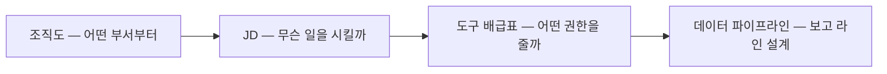
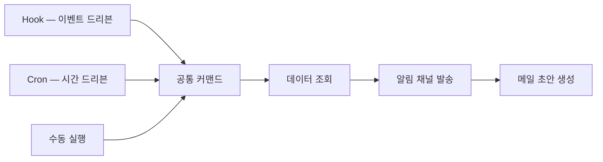
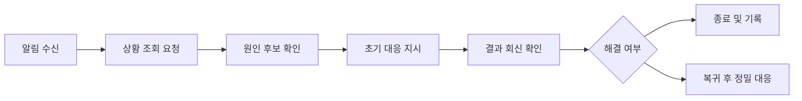

[첫 편](/blog/agentic-coding/automation-scope-criteria/)이 착수 이전을 정했다. 무엇을 자동화 대상으로 고를지, 무엇을 만들면 끝난 것인지, 조직 규칙을 어디에 얼마나 적을지까지다.

이 글은 그 대상을 실제로 굴러가는 것으로 옮긴다. 순서는 조직을 세우는 순서와 같다 — 어떤 부서부터 만들지 정하고, 사람 하나의 할 일을 명세로 적고, 쓸 수 있는 권한을 배급하고, 보고 라인을 잇는다. 그리고 그렇게 만든 것이 **사람이 손대지 않아도 하루가 돌아가는 상태**까지 가야 한다.

이 글의 마지막 세 절이 그 「하루」다. 아침에 할 일을 확인하고 저녁에 한 일을 정리하는 사이클, 로컬에서 잘 돌던 것을 운영에 올릴 때 추가로 붙여야 하는 것, 그리고 자리에 없을 때 지시를 보내는 경로다.

> 이 글이 옮긴 원 자료의 작성 기준일은 **2026-07-26**이다. 파일 경로·명령 이름·임계값·기능 제약은 그 시점의 것이며 버전에 따라 바뀐다.
>
> 이 글의 예시 시각(09:00 체크인 등)·timeout·재시도 횟수는 **원 자료의 실습 예제이자 제시 기준선**이며 특정 조직의 실제 운영 사례가 아니다.
>
> 그리고 아래 표들에서 **이 글이 어휘를 바꿔 실은 자리는 둘**이다 — JD 표의 에이전트명 예시 한 칸(「고객CS담당」)과, 라우팅 표 여섯 행 중 둘째 행 하나(「인사 심사 에이전트」로 보내는 행의 키워드와 대상 이름)다. 원 자료의 것을 같은 업무 도메인의 다른 표현으로 옮긴 것이며, **그 두 자리를 뺀 나머지 칸은 원 자료의 표기 그대로다.** 이 절들의 요점은 이름이나 단어 선택이 아니라 **JD의 필드 구성과 분기 구조**이므로 어휘를 바꿔도 논지가 달라지지 않는다.

## 용어 정리

[첫 편](/blog/agentic-coding/automation-scope-criteria/)의 용어표에서 이 글이 쓰는 행만 추렸다.

| 용어 | 풀이 |
|---|---|
| **라우팅(Routing)** | 들어온 요청을 어떤 에이전트가 처리할지 결정하는 분배 로직. 수동 → 키워드 매칭 → LLM 분류기 순으로 진화한다 |
| **오케스트레이터(Orchestrator)** | 직접 산출물을 만들지 않고 분기·호출·결과 종합만 담당하는 상위 에이전트. 허브-앤-스포크의 허브 |
| **허브-앤-스포크** | 중앙 조율자(허브)가 전문 실행자(스포크)에게 작업을 분배하는 멀티에이전트 구조 |
| **파이프라인(Pipeline)** | 여러 에이전트·도구를 순서대로 연결해 하나의 업무 흐름을 완성한 것 |
| **트리거 3종** | 파이프라인을 기동하는 세 경로 — Hook(이벤트 드리븐) / Cron(시간 드리븐) / Command(수동) |
| **Hook** | 특정 이벤트 시점에 자동 실행되는 스크립트. SessionStart, PostToolUse, Stop 등 |
| **Cron / crontab** | 시간 기반 정기 실행 스케줄러. macOS에서는 launchd(plist)를 권장 |
| **Dispatch(원격 지시)** | 터미널 앞이 아닌 곳에서 에이전트에 명령을 보내는 것. Telegram 봇·Discord+SSH·iOS 단축어 |
| **관측성(Observability)** | 시스템 내부 상태를 외부에서 파악할 수 있는 정도. 여기서는 감사 로그·trace ID·비용 대시보드 |
| **감사 로그(Audit Log)** | 누가·언제·무슨 도구로·무엇을 했는지 남기는 기록. JSON Lines 형식 권장 |
| **PII** | 개인식별정보. 이름·이메일·전화번호 등. 로그·캐시에 남기지 않는 것이 원칙 |
| **Exponential Backoff** | 재시도 간격을 지수적으로 늘리는 방식. 호출 한도(429) 방어의 기본 |
| **MCP** | 외부 도구·데이터 소스를 에이전트에 연결하는 서버 규격. JD의 「도구」 필드에 선언된다 |

## 조직도 → JD → 도구 배급 → 보고 라인

설계 사고 구조는 CEO가 회사를 세우는 4단계에 대응된다.

네 단계의 순서가 뒤집히면 안 되는 이유는 각 단계가 앞 단계의 산출물을 입력으로 받기 때문이다. 무슨 일을 시킬지 모르면 어떤 권한이 필요한지 정할 수 없고, 권한이 정해지지 않으면 어디까지 연결할지도 정할 수 없다.

### 에이전트 하나를 5필드로 정의한다

에이전트 하나는 5필드 JD로 정의한다. 이 5줄이면 구현 가능한 최소 단위라는 것이 원 자료의 주장이다.

| 필드 | 내용 | 예시 |
|---|---|---|
| 에이전트명 | 역할을 한마디로 | 고객CS담당 |
| 역할(Role) | 무슨 일을 하는지 한 줄 | 문의를 자동 분류하고 응답 초안 3종 생성 |
| 입력(Input) | 받는 데이터 | 메일 수신함, 티켓 DB 이력 |
| 출력(Output) | 내보내는 결과 | 분류된 티켓 + 초안 3종 |
| 도구(MCP) | 사용할 외부 연동 | 메일 MCP, DB MCP |

다섯 필드 중 가운데 셋(역할·입력·출력)이 **경계를 정하는 필드**다. 입력에 없는 것을 보지 않고 출력에 없는 것을 만들지 않는다는 계약이며, 이 계약이 흐려지면 뒤에 나오는 라우팅이 그대로 무너진다.

### 어느 부서부터 — 3단계 절차

부서 선택은 **통증 확인 → ROI 추정 → 연동 난이도 확인** 순이며, 외부 연동(PG사·ERP·전자세금계산서)이 복잡하면 두 번째 타자로 미룬다. 일반 원칙은 **수익 엔진 부서(마케팅·영업)부터**인데, 첫 성공 사례가 나머지 예산을 열어주기 때문이다.

세 단계의 순서가 곧 탈락 필터의 순서다. 통증이 없으면 ROI를 따질 것도 없고, ROI가 나와도 연동이 막히면 착수 자체가 안 된다.

### 외부 API를 붙이기 전 세 가지 점검

| 점검 항목 | 요구사항 | 위반 시 위험 |
|---|---|---|
| 키 관리 | 환경변수·시크릿 매니저에 저장, 하드코딩 금지 | 공개 저장소 노출 시 수 분 내 탈취 |
| Rate Limit | 플랜별 한도 확인 + 재시도·지연 로직 | 429 폭주로 서비스 중단, 계정 차단 |
| PII 마스킹 | 로그·캐시에 원본 개인정보 금지, 익명 ID로 치환 | 개인정보보호법 위반 |

원 자료는 이 세 가지가 **필수로 제시된다**고만 적었다. 왜 필수인지는 「위반 시 위험」 열에서 읽어낼 수 있다 — 세 결과가 전부 **사후에 되돌리기 어려운 것**이다. 노출된 키는 회수해도 이미 쓰인 뒤이고, 차단된 계정은 코드를 고쳐도 바로 풀리지 않으며, 로그에 남은 개인정보는 지워도 그때까지 성립한 「개인정보보호법 위반」이 없던 일이 되지는 않는다. **이렇게 이유를 붙여 읽는 것은 이 글의 정리다.**

재시도는 **최대 5회 + 지연 2배 증가(exponential backoff)**가 기준선으로 제시된다. 무한 재시도는 계정 차단으로 직결된다.

**이 「5회」는 외부 API 호출의 백오프 상한**이다. 원 자료가 이 값을 놓은 자리는 외부 API 연동 절이고, [첫 편](/blog/agentic-coding/automation-scope-criteria/)이 든 **「최대 3회」**는 완성 합격선의 안정성 축 자리다. **두 값이 서로 다른 대상을 잰다고 읽는 것은 이 글의 정리다** — 원 자료에서 두 값은 각각 자기 절에 한 번씩 나올 뿐이고, 한 문장 안에서 서로를 언급하며 견주는 대목은 찾지 못했다. 그 유추대로면 이쪽은 호출 한도(429)를 건드리지 않고 버티는 횟수이고, 저쪽은 재시도 정책이 존재하는지를 등급 요건으로 볼 때의 상한이다. 두 값을 같은 선으로 읽으면 모순처럼 보이지만, 하나는 외부 서비스와의 관계에서, 하나는 산출물 판정 기준에서 나온다.

> **`최대 5회`·`지연 2배`는 원 자료가 제시한 기준선**이며 이 글이 측정한 값이 아니다. 실제 상한은 연동하는 서비스의 플랜별 한도에 따라 달라진다. 원 자료 작성 기준일은 2026-07-26이다.

### 데이터는 세 곳으로 나눈다

| 데이터 성격 | 저장 위치 | 이유 |
|---|---|---|
| 코드·에이전트 정의·규칙 | 버전관리 저장소 | 변경 이력과 리뷰가 필요 |
| 정형 데이터 | 데이터베이스 | 조회·집계·행 단위 접근 제어 |
| 파일·문서 | 파일 저장소 | 용량과 공유 권한 관리 |

이 분할이 뒤섞이면 권한 설계와 백업 정책이 동시에 무너진다. 세 행의 「이유」 열이 서로 다른 축을 든다는 점이 그 이유다 — 하나는 이력, 하나는 접근 제어, 하나는 용량이다. 한 곳에 몰아넣으면 세 축 중 둘은 반드시 포기하게 된다.

### 외부 연동은 필요할 때만

| 연동 유형 | 필요한 순간 | 붙이는 순서 |
|---|---|---|
| 데이터베이스 | 읽기/쓰기가 필요할 때 | 대부분 1순위 |
| 이메일 | 송수신이 필요할 때 | 발송은 한도 검증 후 |
| 문서·노트 | 산출물을 문서로 남길 때 | 보고서 계열에 필요 |
| 팀 메신저 | 팀 내 알림이 필요할 때 | 운영 안정화 후 |
| 코드 저장소 | 코드·파일 관리가 필요할 때 | 개발 영역 한정 |
| 로컬 파일 | 파일 변환·생성이 필요할 때 | 산출물 포맷 필요 시 |

판단 기준은 "언제 체크하는가"로 정리된다. 여섯 행 중 선행 조건이 붙은 것은 둘이다 — 이메일은 「발송은 한도 검증 후」, 팀 메신저는 「운영 안정화 후」다. 둘 다 **잘못 붙였을 때 밖으로 새어 나가는** 연동이라는 공통점이 있다. 아직 조용히 실패하는 자동화를 알림으로 팀 채널에 뿌리면 신뢰를 먼저 잃는다.

### 네 가지 연결 패턴

에이전트를 어떻게 엮을지는 네 가지 패턴 중에서 고른다. 이건 분산 시스템 통신 패턴과 그대로 대응된다.

| 패턴 | 구조 | 적합한 경우 | 약점 |
|---|---|---|---|
| 순차 체인 | 앞 결과가 뒤 입력 | 단계가 명확한 처리 흐름 | 중간 실패 시 전체 중단 |
| 병렬 팬아웃 | 동시에 여러 에이전트 호출 후 통합 | 독립 작업의 처리 시간 단축 | 동시 호출로 비용 급증 |
| 허브 앤 스포크 | 중앙 조율자가 분배·종합 | 에이전트가 늘어난 조직 | 허브가 단일 병목 |
| 이벤트 드리븐 | 발생 이벤트가 처리를 기동 | 외부 입력에 반응하는 업무 | 흐름 추적이 어려움 |

네 패턴의 「약점」 열이 전부 다른 종류라는 점이 선택을 가능하게 만든다. 가용성·비용·병목·관측성 중 무엇을 먼저 포기할 수 있는지가 곧 답이다.

에이전트 수가 늘면 결국 허브 앤 스포크로 수렴한다. **오케스트레이터만 전체 컨텍스트를 갖고 하위에는 필요한 것만 전달**하는 구조가 비용과 라우팅을 동시에 잡기 때문이다.

## 팀 구성과 라우팅 — 키워드 교집합을 비운다

여러 에이전트를 묶는 순간 문제는 "누가 처리할 것인가"로 옮겨간다. 원 자료의 라우팅 규칙은 오케스트레이터가 키워드 표를 보고 분기하는 구조다.

| 입력 키워드 유형 | 라우팅 대상 |
|---|---|
| 제안서·견적·영업·고객 니즈 | 영업 문서 작성 에이전트 |
| 채용·지원서·전형·스크리닝 | 인사 심사 에이전트 |
| 영수증·경비·비용 분류·증빙 | 비용 분류 에이전트 |
| 보고서·주간 정리·통계 요약 | 보고서 종합 에이전트 |
| 2개 이상 키워드 동시 | 병렬 호출 후 결과 통합 |
| 분류 불명확 | 사용자에게 선택지 제시 후 재분기 |

위 표에서 **이 글이 바꿔 실은 것은 둘째 행 하나**다 — 키워드 「채용·지원서·전형·스크리닝」과 대상 「인사 심사 에이전트」를 원 자료의 것에서 같은 업무 도메인의 다른 표현으로 옮겼다. **나머지 다섯 행은 원 자료의 표기 그대로다.** 분기가 어떤 구조로 이뤄지는지가 요점이고 단어 자체는 아니다.

여섯 행을 하나씩 배정하면 이렇다. 위의 **네 행**은 키워드 하나가 에이전트 하나로 배정되는 규칙이고, **다섯째 행**은 배정 후보가 둘 이상일 때(「2개 이상 키워드 동시」 → 병렬 호출 후 결과 통합), **여섯째 행**은 배정이 정해지지 않을 때(「분류 불명확」 → 사용자에게 선택지 제시 후 재분기)의 규칙이다 — 넷 + 하나 + 하나로 여섯 행이 전부 배정된다. 뒤의 두 행이 없으면 **키워드에 두 번 걸린 요청**과 **어디에도 걸리지 않은 요청**이 갈 곳을 잃고, 오케스트레이터가 아무 데나 보낸다. 이렇게 갈라 읽는 것은 이 글의 정리다.

라우팅 설계의 황금 규칙은 두 개다.

- 구체적 키워드를 명시적으로 나열한다. "학교 업무", "뭐든 잘 합니다" 같은 모호한 설명이 최악의 반패턴이다.
- **에이전트 간 키워드 교집합은 공집합이어야 한다.** 등록 담당이 채점·출석 단어를 쓰지 않는 식으로 어휘를 분리한다.

둘째 규칙이 위 표의 실제 설계 조건이다. 네 개의 키워드 묶음 사이에 겹치는 단어가 하나라도 있으면 그 단어가 들어온 순간 분기가 결정되지 않는다.

오케스트레이터는 **직접 산출물을 만들지 않는다.** 분기 → 호출 → 결과 종합이 전부이고, 상위 도구(하위 에이전트 호출 권한)는 오케스트레이터 한 명만 갖는다. 공유 상태는 단일 파일을 source of truth로 두고, 동시 쓰기 충돌을 피하기 위해 **에이전트별로 자기 키만 쓴다.**

### 팀의 구성요소 넷

| 구성요소 | 역할 | 설계 시 주의 |
|---|---|---|
| 팀 리드 | 요청 접수, 분기, 결과 종합 | 산출물 생성 금지. 조율만 담당 |
| 팀원 에이전트 | 실제 작업 수행 | 서로 키워드가 겹치지 않게 정의 |
| 태스크 목록 | 무엇을 처리 중인지 상태 관리 | 단일 파일로 통합, 상태 전이 명시 |
| 메일박스 | 에이전트 간 메시지 전달 | 비동기. 즉시 응답을 가정하면 안 됨 |

위의 둘이 **일하는 주체**이고 아래 둘이 **주체들이 공유하는 상태**다. 아래 둘을 빼면 팀은 그냥 여러 개의 에이전트이지 팀이 아니다.

### 운영 제약 셋

원 자료가 남긴 운영 제약 세 가지도 기록해 둔다. 프리뷰 단계 기능을 실무에 얹을 때의 전형적인 리스크다.

- 메시지 전달은 **비동기**다. 응답이 즉시 오지 않으므로 공유 상태 파일을 폴링하거나 메일박스를 확인해야 한다.
- 세션 복구가 지원되지 않을 수 있다. 따라서 **모든 상태는 파일로 영속화**하는 것을 전제로 설계한다.
- 실험 기능은 환경 플래그로 켜진다. 플래그를 프로젝트 설정에 박아두면 팀원마다 다르게 동작하는 사고를 막을 수 있다.

세 항목이 같은 결론으로 모인다. **메모리에 있는 것은 없다고 가정한다.** 응답도 세션도 플래그도 휘발할 수 있으므로 파일에 적힌 것만 상태로 친다.

## 한 커맨드, 세 트리거

파이프라인 설계의 핵심 패턴은 **하나의 커맨드를 세 경로에서 동일하게 호출**하는 것이다.

유지보수 원칙은 명확하다. **로직이 바뀌면 커맨드 파일 한 개만 고치면 세 방향이 동시에 갱신된다.** 트리거별로 로직을 복제하면 곧 세 벌이 서로 달라진다.

| 트리거 | 기동 조건 | 적합한 용도 | 주의점 |
|---|---|---|---|
| Hook | 세션 시작·도구 사용 후 등 이벤트 | 가드레일, 상태 안내, 자동 검사 | 세션을 막지 않도록 항상 정상 종료 처리 |
| Cron | 지정 시각 | 일일 체크인/아웃, 주간 리포트 | 최소 환경에서 실행됨. 절대 경로 필수 |
| 수동 커맨드 | 사람이 호출 | 임시 실행, 시연, 예외 처리 | dry-run 옵션을 먼저 지원할 것 |

세 행의 「주의점」이 전부 **기동 경로 때문에 생기는 제약**이라는 점이 요점이다. 로직은 같은데 Hook은 세션 안에서 돌아 세션을 막을 수 있고, Cron은 세션 밖 최소 환경에서 돌아 경로가 깨지며, 수동은 사람이 실수로 실제 발송을 걸 수 있다.

원 자료가 강조한 세부 규칙 몇 가지를 표로 남긴다.

| 항목 | 규칙 |
|---|---|
| Hook 종료 코드 | 차단이 필요하면 exit 2, 경고는 exit 1. `set -e` 사용 금지 |
| Hook timeout | 가드용 5초, 분석용 15~30초 |
| 스케줄러 선택 | macOS는 crontab보다 launchd 권장(로그·환경변수·재시도 명시적) |
| 실행 파일 경로 | CLI는 풀 패스로 지정해 PATH 의존성 제거 |
| 설정 변경 반영 | plist 수정 후 unload → load 순서로 재적용 |
| 신규 회차 첫 실행 | 반드시 dry-run으로 대상자 확인 후 실제 발송 |

여섯 행 중 넷(Hook 종료 코드 · Hook timeout · 실행 파일 경로 · dry-run)은 **값 하나가 틀려도 에러 없이 지나가는 항목**이다. 종료 코드를 잘못 쓰면 세션이 막히고, 경로가 축약형이면 스케줄러에서만 안 찾히며, dry-run을 건너뛰면 실제 발송이 나간 뒤에 안다.

> **`5초`·`15~30초` 같은 timeout 값은 원 자료가 제시한 기준선**이며 이 글이 측정한 값이 아니다. 원 자료 작성 기준일은 2026-07-26이고, 종료 코드 규약과 설정 반영 절차는 그 시점 도구 사양이다.

## 하루의 형태 — 체크인 / 업무 / 체크아웃

운영 비유는 "좋은 직원의 하루"다. 출근하면 할 일을 확인하고, 퇴근하면 한 일을 정리하며, 금요일엔 주간 보고서를 낸다. 이 세 가지를 스케줄러 세 줄로 자동화한다.

| 시점 | 작업 | 산출물 | 목적 |
|---|---|---|---|
| 평일 09:00 | 체크인 | 오늘 미완료 태스크 요약 | 하루 시작 시 상황 파악 |
| 일과 중 | 이벤트 기반 처리 | 티켓·초안·리포트 | 실제 업무 수행 |
| 평일 18:00 | 체크아웃 | 세션 요약, 완료 기록 | 이력 축적, 내일 준비 |
| 금요일 17:00 | 주간 KPI 리포트 | 지표 집계 문서 | 추세 파악, 이상 감지 |
| 매주 월요일 | 운영 점검 15분 | 권한·비용·훅 점검 결과 | 사고 예방 |
| 매월 1일 | 월간 점검 30분 | 예산·토큰 만료·문서 감사 | 중장기 부채 관리 |

여섯 행 중 위의 넷이 **업무를 돌리는 사이클**이고 아래 둘이 **시스템 자체를 점검하는 사이클**이다. 아래 둘의 목적 열이 산출물이 아니라 「예방」·「부채 관리」인 것이 그 차이를 드러낸다. 이 두 행의 점검 항목은 [세 번째 편](/blog/agentic-coding/troubleshooting-three-layers/)이 주기별 체크리스트로 펼친다.

스케줄 등록 시 반드시 지켜야 할 것 두 가지가 반복 강조된다. **절대 경로**와 **로그 리다이렉션**이다. 스케줄러는 사용자 셸 설정을 읽지 않는 최소 환경에서 돌기 때문에, 개발 환경에서 잘 되던 것이 여기서만 조용히 실패한다.

> **위 시각(09:00·18:00·금 17:00)과 점검 소요 시간(15분·30분)은 원 자료가 제시한 예시 스케줄**이며 관측된 값이 아니다. 원 자료 작성 기준일은 2026-07-26이다.

## 로컬에서 운영으로 — 전환 시 붙여야 할 것

로컬에서 돌던 것을 운영에 올릴 때 추가로 필요한 것은 기능이 아니라 **관측과 통제 수단**이다.

| 항목 | 로컬 | 운영 | 빠뜨리면 |
|---|---|---|---|
| 실행 방식 | 사람이 직접 | 스케줄러 정기 실행 | 자동화가 아니라 수동 도구에 머문다 |
| 경로 | 상대·홈 축약 경로도 동작 | 절대 경로 필수 | 조용히 실패한다 |
| 로그 | 화면 출력 | 파일 리다이렉션 + 보존 정책 | 무슨 일이 있었는지 알 수 없다 |
| 알림 | 없음 | 성공/실패 채널 통보 | 실패를 며칠 뒤에 발견한다 |
| 비용 | 신경 안 씀 | 하드 리밋 + 경고 임계값 | 청구서로 처음 알게 된다 |
| 권한 | 넓게 열어둠 | 기본 거부 + 최소 허용 | 되돌릴 수 없는 조작이 발생한다 |
| 실패 처리 | 다시 실행 | 재시도 + 폴백 + 큐 보류 | 한 번 실패가 그날 전체 중단 |

일곱 행의 「빠뜨리면」 열을 성격별로 배정하면 이렇다. **넷은 알아차리는 시점이 늦어지는 것**을 말하고(경로 — 조용히 실패한다 / 로그 — 알 수 없다 / 알림 — 며칠 뒤에 발견한다 / 비용 — 청구서로 처음 알게 된다), **둘은 피해의 크기**를 말하며(권한 — 되돌릴 수 없는 조작 / 실패 처리 — 그날 전체 중단), 나머지 하나(실행 방식)만 성격이 다르다 — 자동화가 아예 성립하지 않는다는 뜻이다. 운영 전환의 본질이 기능 추가가 아니라 관측 추가라는 것이 첫 묶음에서 드러난다.

비용 행이 특히 그렇다. **"자동화 코드를 짜기 전에 비용 모니터링부터 설정한다"**는 원칙이 여기서 나온다. 자동화가 열심히 돌수록 비용도 자동으로 늘어나기 때문이다.

이 글이 비용에 대해 담은 것은 위 표의 한 행과 이 원칙 한 줄이 전부다. **비용 구조를 축별로 분해하는 본체는 [마지막 편](/blog/agentic-coding/scaling-routing-collapse/)에 있다** — 모델을 난이도별로 3분할하는 방법, 프롬프트 캐싱의 히트율별 비용 시나리오, 에이전트 개수가 늘 때 비용이 개수보다 빨리 오르는 이유가 거기 있다.

## Dispatch — 자리에 없을 때 지시하는 세 경로

정기 사이클 밖에서 즉시 대응이 필요한 상황을 위해 원격 지시 경로를 만든다. 카페에서 문의를 받았을 때, 이동 중 에러 알림을 받았을 때가 상정된 시나리오다.

| 방식 | 구조 | 장점 | 제약 |
|---|---|---|---|
| 메신저 봇 | 봇이 메시지를 받아 CLI를 서브프로세스로 실행하고 결과를 회신 | 실시간 양방향, 결과 즉시 수신, 화이트리스트 보안 | 봇 서버 상시 가동 필요 |
| 웹훅 + SSH | 알림은 웹훅으로, 명령은 SSH로 터미널 세션에 주입 | 팀 채널과 통합, 기존 서버 그대로 사용 | 키 관리·접근 통제 부담 |
| 모바일 단축어 | 자주 쓰는 루틴을 단축키로 등록해 SSH 실행 | 탭 한 번, 정형 작업에 최적 | 자유 형식 명령에는 부적합 |

세 방식의 제약이 각각 **운영 부담·보안 부담·표현력 제한**으로 갈린다. 셋 중 무엇을 감당할 수 있는지가 선택 기준이다.

핵심 구조는 30줄 수준으로 단순하다. **메시지 수신 → 발신자 화이트리스트 검증 → CLI 서브프로세스 실행(타임아웃 지정) → 결과 문자열 회신.** 복잡한 건 인프라가 아니라 보안이다.

| 원칙 | 내용 |
|---|---|
| 화이트리스트 | 허용된 사용자 ID만 명령 실행 가능 |
| 토큰 분리 | 봇 토큰·API 키는 환경변수로 관리, 저장소 커밋 금지 |
| 로그 기록 | 누가 언제 무슨 명령을 보냈는지 전량 기록 |
| 2단계 인증 | 서버 접근 계정에 다중 인증 적용 |
| 명령 필터 | 위험 명령(삭제·배포·강제 푸시)은 원격 경로에서 차단 |

다섯 원칙은 **누가 들어오는가(1·4) / 무엇으로 들어오는가(2) / 무엇을 했는가(3) / 무엇까지 할 수 있는가(5)** 네 층을 덮는다. 원격 경로는 방화벽 안쪽에 난 구멍이라 층마다 막지 않으면 한 겹만 뚫려도 끝까지 열린다.

### 긴급 대응 워크플로우

| 단계 | 목표 시간 | 원격에서 하는 일 | 원격에서 하지 않는 일 |
|---|---|---|---|
| 상황 파악 | 1분 | 로그·상태 조회 요청 | — |
| 원인 추정 | 2분 | 최근 변경·사용량 확인 | 코드 수정 |
| 초기 대응 | 1분 | 중단·재시도·큐 보류 지시 | 배포·강제 푸시·삭제 |
| 결과 확인 | 1분 | 회신 내용 확인 후 기록 | 최종 판단 확정 |

네 단계를 합쳐 알림 수신부터 초기 대응까지를 5분 안에 끝내는 것이 목표다. 하지만 중요한 것은 속도 자체가 아니라 **원격에서 할 수 있는 일의 범위를 미리 정해두는 것**이다. 맨 오른쪽 열이 그 목록이며, 위험 명령을 원격 경로에서 차단해 두면 급한 순간에 되돌릴 수 없는 조작을 하는 사고를 구조적으로 막을 수 있다.

> **위 목표 시간(1·2·1·1분, 합계 5분)은 원 자료가 제시한 목표치**이며 관측된 대응 시간이 아니다. 「30줄 수준」이라는 구현 규모도 원 자료의 서술이다. 원 자료 작성 기준일은 2026-07-26이다.

## 다음 편으로

이 글은 만들고 굴리는 데까지를 다뤘다. 한 명을 5필드 JD로 정의하고(경계), 여럿을 키워드 교집합이 공집합이 되게 묶고(라우팅), 세 트리거가 커맨드 하나를 부르게 하고(파이프라인), 그 위에 하루 사이클과 운영 전환 항목, 원격 지시 경로를 얹었다.

이 절들을 관통하는 것은 하나다. **경로를 늘리되 로직은 늘리지 않는다.** 트리거가 셋이어도 커맨드는 하나이고, 에이전트가 넷이어도 상위 도구를 가진 것은 오케스트레이터 하나이며, 원격 경로가 셋이어도 통과할 수 있는 명령의 범위는 한 벌로 정의된다. 늘어난 경로마다 로직을 복제하는 순간 서로 달라지기 시작한다.

그런데 이렇게 잘 짜 두어도 장애는 난다. 이어지는 [다음 편](/blog/agentic-coding/troubleshooting-three-layers/)은 장애가 났을 때 어디부터 보는가를 다룬다 — 모든 장애를 증상·원인·해결·예방 4단으로 분해하고, 깨진 곳을 3계층으로 좁히고, 가장 자주 나오는 문제 10선과 실제 장애 5건을 같은 틀에 넣는다.
