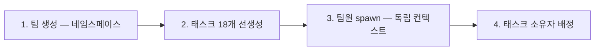
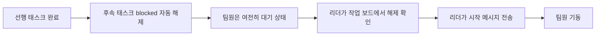
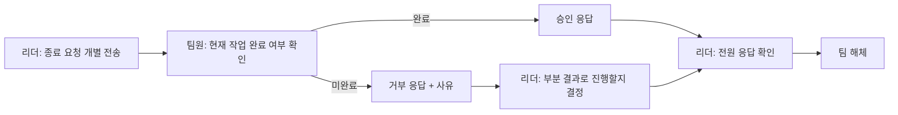
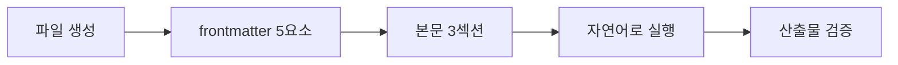
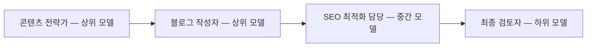
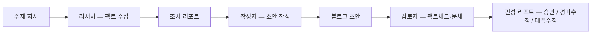
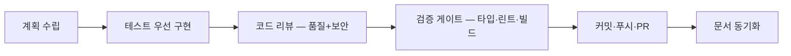

[첫 편](/blog/agentic-coding/subagent-definition-fields/)이 한 명을 정의했고, [앞 편](/blog/agentic-coding/collaboration-patterns-isolation/)이 여럿을 묶는 패턴과 격리 수단을 골랐다. 구조는 다 섰는데, 팀을 실제로 띄우면 첫날 부딪히는 것은 패턴 선택이 아니다.

> 이론이 "무엇이 존재하는가"라면, 운용은 "어떻게 돌리는가"다.
>
> 주방 배치도(구조)를 완성한 요리사가 첫 영업(운용)에서 부딪히는 문제는 다르다. 주방장이 셰프에게 지시를 어떻게 전달하는가, 주문 대기열이 막히면 어떻게 푸는가, 두 셰프가 같은 칼을 동시에 쥐려 할 때 어떻게 막는가.
>
> 구조 지식은 필요조건이지 충분조건이 아니다.

이 글은 그 운용을 다룬 뒤 실습 두 건과 오픈소스 환경 사례를 본다.

> 이 글이 옮긴 원 자료의 작성 기준일은 **2026-07-26**이다. 도구 이름·기능·제약은 그 시점의 것이다.
>
> 아래의 실습 두 건은 원 자료의 예제이며 실제 운영 사례가 아니다. 마지막에 나오는 Claude Forge는 실재하는 MIT 오픈소스이고, 이 글이 적는 구성 수치는 원 자료가 옮긴 것이다.

## 용어 정리

[첫 편](/blog/agentic-coding/subagent-definition-fields/)의 용어표에서 이 글이 쓰는 행만 추렸다.

| 용어 | 정의 | 대응되는 사람 조직 개념 |
|---|---|---|
| **서브에이전트(Subagent)** | 메인 세션이 1:1로 위임하는 에이전트. 독립 컨텍스트에서 일하고 최종 보고만 돌려준다 | 위임받은 팀원 |
| **오케스트레이터(Orchestrator)** | 여러 에이전트에 작업을 배분·조율·통합하는 상위 에이전트 | 팀장 / PM |
| **frontmatter** | 에이전트 정의 파일 상단의 YAML 메타데이터 영역(`---`로 감싼 구간) | JD의 헤더(직함·요건) |
| **Hub-and-Spoke** | 모든 보고·의사결정이 리더(허브)를 경유하는 통신 구조 | 팀장 중심 보고체계 |
| **P2P(Peer-to-Peer)** | 팀원끼리 리더를 거치지 않고 직접 의사결정하는 구조 | 수평 자율 협업 |
| **Agent Teams** | 여러 Claude Code 인스턴스가 리더-팀원으로 묶여 양방향 통신하는 실험적 기능 | 실제 팀 회의 |
| **Mailbox** | Agent Teams의 비동기 메시지 큐. 보낸 즉시 깨우지 않고 inbox에 적재된다 | 사내 메신저 |
| **TaskList(작업 보드)** | 팀원이 공유하는 작업 보드. 상태·소유자·의존성을 기록 | 칸반 보드 / Jira |
| **blockedBy / blocks** | 태스크 간 선후 의존 관계. 선행이 끝나면 자동 해제된다 | 선행 작업 대기 |
| **Worktree** | 같은 git 저장소를 공유하되 다른 경로에 다른 브랜치를 동시 체크아웃하는 기능 | 각자 다른 책상 |
| **격리(Isolation)** | 에이전트 간 간섭을 막는 분리. 논리적·세션·물리적 3계층이 있다 | 업무 분장 / 좌석 분리 |
| **Reasoning Sandwich** | 계획=고성능 모델, 구현=중간 모델, 검증=고성능 모델로 단계별 모델을 달리 배정하는 패턴 | 시니어-주니어-시니어 배치 |
| **모델 계층화** | 리더는 상위 모델, 반복 실행 팀원은 하위 모델로 구성하는 비용 전략 | 직급별 인건비 배분 |
| **컨텍스트 외부화** | 중요한 결정을 파일로 빼내 컨텍스트 압축 시 유실을 막는 기법 | 회의록 / ADR |
| **오류 증폭(Error amplification)** | 한 에이전트의 오류가 체인을 타고 커지는 현상 | 잘못된 정보의 조직 전파 |
| **MCP** | 외부 도구·데이터 소스를 에이전트에 연결하는 서버 규격 | 외부 시스템 연동 |

## 팀 가동 4단계 — 만들고, 일 쌓고, 사람 부른다



| 단계 | 하는 일 | 순서를 지켜야 하는 이유 |
|---|---|---|
| 1 | 팀 이름(네임스페이스) 생성 | 이후 모든 메시지 라우팅과 작업 보드 경로의 기준이 된다. 첫 호출이 가장 중요 |
| 2 | 전체 작업 구조를 먼저 생성 | **팀원이 spawn 시점에 빈 작업 목록을 보면 idle 상태로 돌아간다** |
| 3 | 팀원 spawn | 각자 독립 컨텍스트. 첫 턴에 바로 자기 작업을 확인 |
| 4 | 소유자 배정 | 팀원이 자기 태스크를 즉시 식별 |

**팀원 유형(권한 프로파일)**

| 유형 | 도구 범위 | 용도 |
|---|---|---|
| 범용(general-purpose) | 읽기·쓰기·편집·셸 전체 | 파일 생성·수정이 필요한 구현 작업 |
| 탐색(Explore) | 읽기 전용 | 코드베이스 탐색, 분석, 조사 |
| 계획(Plan) | 읽기 전용 | 설계·계획 수립 (구현 불가) |
| 터미널(Bash) | 명령 실행 전용 | CI/CD, 명령 실행 |

팀 이름은 소문자-하이픈 컨벤션을 쓰고, 같은 팀을 여러 번 돌릴 때는 날짜를 붙여 로그를 분리한다.

## 메시지는 비동기다 — Phase 전환의 핵심

메시지를 보내도 수신자가 즉시 깨어나지 않는다. 메시지는 수신자의 inbox에 적재되고, **수신자가 다음 턴을 시작할 때** 읽힌다.

| 잘못된 방식 | 올바른 방식 |
|---|---|
| 팀원이 공유 파일 존재 여부를 계속 폴링 | 팀원은 리더의 메시지를 기다린다 |
| 파일이 생겼으니 다음 단계 시작 | 리더가 완료를 확인하고 시작 신호를 보낸다 |

**파일 폴링을 금지하는 4가지 이유**

| # | 이유 |
|---|---|
| 1 | 리더가 완료 타이밍 제어권을 갖는다 — 파일 생성이 곧 완료는 아니다 |
| 2 | 파일 쓰기 중간 상태를 읽는 사고를 막는다 |
| 3 | 메시지 자체가 실행 컨텍스트를 담는다 — 단순 깨우기가 아니라 지시 전달이다 |
| 4 | 대기 중인 팀원은 비용이 들지 않는다 — 기다리는 것은 자원 낭비가 아니다 |

> **넷째 행이 나머지 셋과 성격이 다르다.** 앞의 셋은 폴링이 **틀린** 이유이고, 넷째는 폴링을 하고 싶어지는 **동기**를 제거한다.

**의존성 해제 ≠ 깨우기**



의존성 필드는 **상태 표시**이고, 실제 실행 트리거는 **메시지**다. 이 둘을 혼동하면 다음 Phase가 영원히 시작되지 않는다.

## Hub-and-Spoke를 쓰는 진짜 이유 — 오류 억제

| 구조 | 오류 증폭 배율 |
|---|---|
| Hub-and-Spoke (모든 의사결정이 리더 경유) | 4.4배 |
| Peer-to-Peer (팀원 자율 의사결정) | 17.2배 |

원 자료는 이 수치를 Google/MIT 2025 연구에서 인용했다. 함의는 분명하다.

> Hub-and-Spoke는 성능을 희생하는 보수적 선택이 **아니라**, 오류 억제 메커니즘이다.
>
> 팀원끼리 검증 없이 판단을 주고받으면 오류가 체인을 타고 증폭된다.

**허용/금지 경계**

| 구분 | 내용 |
|---|---|
| 반드시 리더 경유 | 보고, 의사결정 요청 |
| P2P 허용 | 같은 모듈 작업 시 기술적 조율, 파일 충돌 방지 협의 (끝나면 리더에게 결과만 요약 보고) |
| 절대 금지 | 팀원끼리 의사결정을 자체 종결하는 것 |

가운데 행이 이 표의 실질이다. P2P를 통째로 막는 것이 아니라 **조율은 허용하고 종결만 막는다** — [앞 편](/blog/agentic-coding/collaboration-patterns-isolation/)의 "팀원은 리더에게만 보고한다"를 한 칸 더 나눈 것이다.

## 리더의 3책임과 금지 사항

| 책임 | 내용 |
|---|---|
| 조율 | 태스크 배정, Phase 전환 신호, 블로커 중재 |
| 승인 | 팀원 보고서 검토, 자기검증 질문 실행, 최종 종합 판단 |
| 종료 | 종료 요청 전송 → 모든 응답 확인 → 팀 해체 |

| 리더 금지 사항 |
|---|
| 직접 구현(코딩) 금지 |
| 직접 리서치 금지 |
| 직접 코드베이스 탐색 금지 |
| **팀원에게 시킬 수 있는 일을 리더가 직접 하는 것 금지** |

넷째 행이 앞의 셋을 포함하고, 앞의 셋은 그 원칙이 깨지는 세 지점에 이름을 붙인 것이다. 완전 위임까지 못 가는 간극을 능력이 아니라 신뢰·구조의 문제로 본 정리는 [위임 격차](/blog/ai-agent/delegation-gap/)에 있다.

## 컨텍스트 외부화 — 결정 기록 파일

리더의 컨텍스트는 팀 전체 작전을 기억하는 **유일한 장소**다. 컨텍스트가 가득 차면 압축이 일어나고, 이때 핵심 결정이 유실된다(원 자료는 관련 버그 이슈를 근거로 든다).

| 항목 | 내용 |
|---|---|
| 해결책 | 중요한 결정을 별도 파일에 외부화 |
| 기록 형식 | 날짜 · 결정 내용 · 이유 · **거부한 대안** |
| 근거 | 구조화 노트 작성(Structured Note-Taking)은 공식 컨텍스트 엔지니어링 가이드의 권장 패턴 |
| 인용된 실험 | 32K 컨텍스트가 구조화 노트를 통해 327K를 능가한 사례 |

> 이건 사실상 **ADR(Architecture Decision Record)과 회의록 문화**다. "왜 그렇게 정했고 무엇을 버렸는지"를 남기지 않으면, 사람 팀에서도 몇 달 뒤 같은 논쟁을 반복한다.

## 교착 방지 4대 증상과 처방

| 증상 | 원인 | 처방 |
|---|---|---|
| 두 팀원이 같은 파일을 동시 편집 | 파일 소유권 테이블 미정의 → 경쟁 조건 | 설계 단계에서 팀원별 출력 파일을 명시 분리 |
| 팀원이 공유 파일을 계속 폴링하며 안 멈춤 | 메시지 대기 대신 폴링 패턴 사용 | "파일 존재를 폴링하지 말고 리더 메시지를 기다려라"를 규칙화 |
| 팀 해체 호출 실패 | 모든 팀원의 종료 응답 확인 전에 해체 시도 | 종료 요청 → 전원 응답 확인 → 해체 순서 준수 |
| 팀원이 타임아웃 없이 무한 대기 | 시간 제한 미설정 | 전체 목표 시간·팀원별 상한 설정, 초과 시 현재까지 결과로 종합 |

> **처방 넷 중 둘이 순수한 사전 정의다.**
>
> 파일을 미리 갈라 두고, 규칙을 미리 적어 둔다. 셋째는 미리 정한 순서를 **종료 시점에 지키는 것**이고, 넷째는 사전 정의(시간 상한)에 **초과 시 대응**(현재까지 결과로 종합)을 함께 적는다. 그래도 넷 다 미리 정해 두는 것에서 출발하므로, 이 표는 장애 대응표보다 **가동 전 점검표**에 가깝다 — 그렇게 가르는 것은 이 글의 정리다.

**파일 소유권 테이블 예시**

| 파일 경로 | 소유자 | 용도 |
|---|---|---|
| `reports/researcher.md` | 리서처 | 조사 결과 보고 |
| `reports/writer.md` | 작성자 | 초안 문서 |
| `reports/reviewer.md` | 검토자 | 검토 의견 |
| `result-{timestamp}.md` | 리더 | 최종 종합 보고 |

**종료 프로토콜**



## 비용 관리 3원칙

| 원칙 | 내용 | 효과 |
|---|---|---|
| Phase 분리 | 메인 세션에서 처리 가능한 일은 팀을 띄우지 않는다. 팀 가동은 정말 필요한 구간만 | 원 자료의 운영 사례 기준 전체 비용 85% 절감 |
| 모델 계층화 | 리더는 상위 모델, 반복 실행 팀원은 중간·하위 모델 | 단독 상위 모델 대비 성능 +90.2%, 비용 약 50% 절감 |
| 병렬화 의존성 확인 | 독립 작업만 병렬화한다 | 독립 병렬 +81% vs 순차 의존 무리한 병렬 -70% |

에이전트 팀의 비용은 메인 세션 대비 대략 **7~15배**다. 그래서 "이 작업에 정말 팀이 필요한가"가 첫 질문이 된다.

> **수치 출처**: 세 행의 출처가 다르다. 모델 계층화의 +90.2%·-50%는 Anthropic 멀티에이전트 리서치 시스템, 병렬화의 +81%·-70%는 Google/MIT 2025 연구에서 원 자료가 인용한 값이다. **Phase 분리 85% 절감만 원 자료 자체의 운영 사례**라 성격이 다르다 — 앞의 둘은 외부에서 확인되고 셋째는 원 자료 안에서만 확인된다. 이 시리즈의 성능·비용 수치는 직접 측정한 것이 아니다. 대부분 원 자료가 인용한 외부 연구·벤치마크 값이고, 하나(Phase 분리 85%)는 원 자료 자체의 운영 사례이며, 출처를 밝히지 않은 값도 섞여 있다.

## 운용 7 체크리스트

| # | 점검 항목 |
|---|---|
| 1 | 파일 소유권 — 팀원별로 겹치지 않는 출력 파일이 지정되어 있는가 |
| 2 | Phase 분리 — 순차 의존 작업이 병렬로 실행되고 있지 않은가 |
| 3 | 메시지 통신 — 팀원이 파일 폴링 대신 리더의 메시지를 기다리는가 |
| 4 | 모델 계층화 — 반복 실행 팀원에게 하위 모델을 쓰고 있는가 |
| 5 | 종료 프로토콜 — 종료 요청 → 전원 승인 확인 → 해체 순서를 지키는가 |
| 6 | 비용 판단 — 이 작업에 정말 팀이 필요한가. 메인 세션으로 가능하지 않은가 |
| 7 | 외부 입력 방어 — 신뢰할 수 없는 외부 데이터를 처리한다면 전 팀원에 인젝션 방어 블록이 있는가 |

## 태스크 분할 원칙 — 팀원당 5~6개

| 분할 수준 | 결과 |
|---|---|
| 너무 잘게(팀원당 5~6개) | 1개 실패해도 나머지가 계속 진행 — **실패 고립** |
| 너무 많이(10개 이상) | 팀원이 작업 목록 파싱에 컨텍스트를 소비 — **인지 오버헤드** |

5~6개가 두 문제 사이의 실용적 균형점이다. 또한 팀 일부가 실패해도 전체가 멈추지 않도록 **부분 실패 시 대체 경로**를 미리 정의해 둔다.

> **왼쪽 열은 둘 다 「너무」로 시작하는데 오른쪽 열의 부호가 반대다.** 위 행의 결과(실패 고립)는 이득이고 아래 행의 결과(인지 오버헤드)는 손해이며, 균형점으로 지목된 5~6개는 위 행 괄호 안의 숫자와 같다. 형식은 두 극단의 대조지만 실제로 읽히는 내용은 **5~6개가 10개 이상보다 낫다**에 가깝다.

## 실습 1 — 마케팅 전문가 에이전트 만들기

단일 에이전트를 처음부터 만들어 실행한다. 결과물은 블로그 작성 에이전트 한 명이다.



| 단계 | 내용 | 확인 포인트 |
|---|---|---|
| 1 | 에이전트 디렉터리에 `.md` 파일 생성 | 폴더명은 반드시 복수형 `agents`. 프로젝트 전용과 전역 위치를 구분 |
| 2 | frontmatter 5요소 작성 | 파일명과 `name` 일치 |
| 3 | 본문 3섹션 작성 | 절차에 **저장 경로**까지 명시해야 결과 파일이 생성됨 |
| 4 | 자연어로 요청 | 에이전트명을 부르지 않아도 라우팅되는지 확인 |
| 5 | 산출물 검증 | 분량·키워드·톤을 정량 기준으로 확인 |

### 완성본

```markdown
---
name: blog-writer
description: When to use when user asks for blog draft
model: opus
tools: Read, Write, Edit, WebSearch
color: blue
---

# Blog Writer Agent

## 역할 (Role)
1인 사업자의 블로그를 대신 작성하는 전문 블로그 작성자.
타깃: 1인 사업자, 소규모 창업자, 프리랜서.

## 절차 (Process)
1. 트렌드 리서치 — 웹 검색으로 관련 키워드 + 최신 트렌드 조사
2. 제목 5개 생성 — 클릭율 높은 후보 5가지 제안
3. 초안 작성 — 선택된 제목으로 본문 초안 생성 (300단어 이상)
4. 퇴고 — SEO 키워드 3개 삽입 + 가독성 최적화

## 제약 (Constraints)
- 최소 300단어 이상
- SEO 키워드 3개 반드시 포함
- 셸 실행·하위 에이전트 호출 금지
```

### 도구 선정 근거 — 왜 넣고 왜 뺐나

| 포함 | 근거 | 제외 | 근거 |
|---|---|---|---|
| Read | 기존 파일 참조. 읽기 전용이라 안전 | Bash | 코드 실행 불필요 + 위험 명령 방지 |
| Write | 결과 파일 신규 생성 | Task | 혼자 완결되는 작업. 하위 에이전트 호출은 비용 폭발 위험 |
| Edit | 퇴고·수정 | 질의 도구 | 자율 실행 원칙 — 중단 없이 완결 |
| WebSearch | 절차 1번(트렌드 리서치)의 필수 도구 | 미지정 | 상위 컨텍스트의 모든 도구를 상속해 보안 취약 |

> **제외 열의 마지막 행만 도구가 아니다.** Bash·Task·질의 도구는 실제 도구인데 「미지정」은 필드를 비우는 선택이다. [첫 편](/blog/agentic-coding/subagent-definition-fields/)에서 원 자료가 미지정 결과를 적어 둔 유일한 필드로 짚었던 `tools`가, 여기서는 제외 목록의 한 행으로 다시 나온다.

### 컨텍스트 격리 — 가장 흔한 오해

| 오해 | 사실 |
|---|---|
| 오케스트레이터가 알면 서브에이전트도 안다 | 틀리다. 대화 이력은 자동 전달되지 않는다 |
| 상위 도구를 물려받는다 | 지정한 도구만 쓸 수 있다 |

- 서브에이전트는 **별도 독립 컨텍스트**에서 실행되고, **위임 프롬프트에 명시한 내용만** 안다.
- 대응책은 하나다. 필요한 맥락을 위임 프롬프트에 **명시적으로** 실어 보낸다.
- 대신 격리 덕분에 병렬 실행이 가능하고 민감정보가 새지 않는다.

### 정량 제약이 에이전트를 통제한다

| 나쁜 지시 | 좋은 지시 |
|---|---|
| "최선을 다해 써줘" | "300단어 이상" |
| "SEO도 신경 써줘" | "SEO 키워드 3개 반드시 포함" |
| "잘 정리해줘" | "제목 후보 5개 제시" |

### 트러블슈팅

| 증상 | 원인 | 해결 |
|---|---|---|
| 에이전트가 호출되지 않음 | 폴더명 오타(복수형 `s` 누락), `description` 트리거 키워드 부족 | 파일 위치 확인 + 키워드 보강, 또는 에이전트명을 직접 지정해 호출 |
| frontmatter 파싱 실패 | YAML 들여쓰기 오류, 따옴표 미닫힘, `name`에 공백 | YAML 린터로 검증 |
| 결과 파일이 생성 안 됨 | 절차에 저장 경로 미명시, 쓰기 도구 미허용 | 절차에 "쓰기 도구로 특정 경로에 저장" 명시 + `tools` 점검 |

### 확장 경로 — 1인에서 팀으로



| 역할 | 모델 등급 | 근거 |
|---|---|---|
| 콘텐츠 전략가 | 상위 | 주제·각도 전략은 깊은 추론 |
| 블로그 작성자 | 상위 | 계획+구현+검증이 한 사람에게 통합됨 |
| SEO 최적화 담당 | 중간 | 기계적 최적화 |
| 최종 검토자 | 하위 | 빠른 체크 |

이 팀 구조가 곧 **Reasoning Sandwich의 팀 버전**이다. 단일 에이전트를 완전히 이해한 뒤 팀으로 확장하는 순서를 권장한다.

## 실습 2 — 3인 팀 구축 (리서처 + 작성자 + 검토자)

### 비유 — 신문사 편집부 3인조

| 역할 | 신문사 비유 | 한 줄 원칙 |
|---|---|---|
| 리서처 | 기자 | 발품 팔아 팩트만 수집한다. 글은 쓰지 않는다 |
| 작성자 | 에디터 | 기자 노트를 받아 독자가 읽고 싶은 글로 변환한다 |
| 검토자 | 데스크 | 마감 전 팩트체크 + 문체 교정. 완전히 새로운 눈으로 본다 |



### 역할별 정의 — 도구 제한이 프롬프트보다 먼저다

| 역할 | 허용 도구 | 박탈한 도구 | 박탈 이유 |
|---|---|---|---|
| 리서처 | 웹 검색, 읽기 | **쓰기** | 쓰기 권한이 있으면 글을 쓴다. 물리적으로 못 하게 만든다 |
| 작성자 | 읽기, 쓰기 | **웹 검색** | 직접 조사하면 리서처의 출처 검증 체계가 무너진다 |
| 검토자 | 읽기, 웹 검색 | **쓰기** | 직접 고치면 작성자 문체와 섞이고 감사 추적이 어려워진다 |

> 이 챕터의 핵심 문장: **"프롬프트보다 도구 제한이 먼저다. 쓰기 권한이 있으면 쓴다."**
>
> 사람 조직으로 옮기면 "하지 말라고 말하는 것"과 "할 수 없게 권한을 조정하는 것"의 차이다. 후자가 훨씬 강하게 작동한다.

### 역할별 출력 계약

| 역할 | 모델 등급 | 턴 상한 | 출력 계약 |
|---|---|---|---|
| 리서처 | 중간 | 10 | 항목별로 `사실 / 출처 URL + 신뢰도 / 미확인 항목`. 기능 하나당 최대 500토큰 |
| 작성자 | 중간 | 8 | 후킹 첫 문단 → 기능별 소제목+코드 → 트레이드오프 → 다음 단계. 코드 블록 3개 이상, 1,500~2,000단어 |
| 검토자 | 상위 | 6 | JSON 계약 — `verdict`(승인/경미수정/대폭수정) + 팩트 오류 목록 + 문체 제안 목록 |

리서처 정의의 핵심 규칙 두 가지가 특히 중요하다. 공식 출처를 우선하고, 불확실한 정보에는 **"미확인:"** 접두어를 붙인다 → 작성자의 할루시네이션을 예방한다.

검토자의 검토 순서는 3단계 우선순위로 고정한다.

| Tier | 검토 대상 |
|---|---|
| Tier 1 | 팩트 정확성 — 버전, 날짜, API 파라미터 |
| Tier 2 | 구조 문제 — 헤딩 구성, 코드 가독성 |
| Tier 3 | 문체 개선 — 능동태, 후킹 |

검토자에 상위 모델을 배정하는 이유도 Reasoning Sandwich다. **검증 단계에 깊은 추론 모델을 쓴다.**

### 실행 흐름과 비용 감각

| 단계 | 소요 | 산출물 |
|---|---|---|
| 리서처 | 3~5분 | 조사 리포트 파일 |
| 작성자 | 5~8분 | 블로그 초안 파일 |
| 검토자 | 2~3분 | 판정 JSON 파일 |
| 합계 | 12~20분 | 한자리에서 실시간으로 돌려 볼 수 있는 규모 |

비용은 3인 팀 기준 약 7,500토큰으로, 단일 에이전트 대비 **2~3배** 수준이다.

### 프로덕션 에이전트가 갖추는 5가지

원 자료는 실습용과 실제 운영용의 차이를 이렇게 정리한다.

| # | 요소 |
|---|---|
| 1 | 역할 정의 |
| 2 | 제약 |
| 3 | 출력 계약 |
| 4 | **폴백 전략** (도구 실패 시 대체 경로) |
| 5 | **완료 기준** |

앞의 셋은 [첫 편](/blog/agentic-coding/subagent-definition-fields/)에서 이미 채운 것이라, 실습과 운영을 가르는 것은 뒤의 둘이다. 예컨대 리서처는 검색 도구가 실패할 때를 대비해 도구 에스컬레이션 체인(1차 → 2차 → 3차 도구)을 갖는다.

## 올인원 개발 환경 — Claude Forge 사례

에이전트·명령어·훅·MCP를 한 번에 세팅해 주는 오픈소스 환경 사례다. 챕터 제목은 "11에이전트 + 40커맨드"인데, **원 자료가 본문에서 v3.0.1 기준 명령어 33개·스킬 24개로 정정한다.** 정정한 주체는 원 자료이고, 인용할 때는 정정된 수치를 쓴다.

| 항목 | 내용 |
|---|---|
| 한 줄 정의 | 기본 셸에 확장 프레임워크를 얹듯, 기본 Claude Code에 에이전트·훅·규칙을 얹는 환경 |
| 구성 | 에이전트 11개, 명령어 33개, 스킬 24개, 훅 15+9개, 규칙 9개, MCP 서버 4개 |
| 라이선스 | MIT 오픈소스 |

### 11 에이전트 카탈로그

| 그룹 | 에이전트 | 역할 |
|---|---|---|
| 계획·아키텍처 | planner | 구현 계획 수립. 승인 전 코드 수정 없음 |
| 계획·아키텍처 | architect | C4 다이어그램, ADR, 적합도 함수 측정 |
| 구현·품질 | tdd-guide | RED → GREEN → IMPROVE 사이클 |
| 구현·품질 | code-reviewer | 코드 품질 + 보안 통합 리뷰 |
| 구현·품질 | refactor-cleaner | 리팩토링 실행 |
| 검증·에러 | verify-agent | 타입체크 + 린트 + 빌드 일괄 게이트 |
| 검증·에러 | build-error-resolver | 빌드·컴파일 에러 자동 해결 |
| 검증·에러 | e2e-runner | E2E 테스트 실행·디버깅 |
| 전문 리뷰 | security-reviewer | OWASP 기반 취약점 분석 |
| 전문 리뷰 | database-reviewer | DB 스키마·쿼리 최적화·행 수준 보안 검토 |
| 전문 리뷰 | doc-updater | 코드 변경에 따른 문서 자동 동기화 |

### E2E 파이프라인 6단계



이 파이프라인은 [앞 편](/blog/agentic-coding/collaboration-patterns-isolation/)의 **파이프라인 패턴이 실제 개발 공정에 적용된 형태**다. 각 단계가 하나의 전문 에이전트에 대응하고, 검증 게이트가 통과해야 다음으로 넘어간다.

### 6단계 보안 방어 레이어

| 레이어 | 방어 대상 |
|---|---|
| 1 | 출력에서 API 키·비밀번호·토큰 자동 차단 |
| 2 | 원격 스크립트 즉시 실행(파이프 실행) 차단 |
| 3 | 파괴적 DB 명령(테이블 삭제·전체 삭제) 차단 |
| 4 | 인증·암호·환경파일 변경 시 보안 리뷰 자동 호출 |
| 5 | 과도한 API 호출 제어 |
| 6 | 품질 기준 위반 사전 경고 |

> 이 6층 구조가 곧 **"AI가 안전하게 일할 수 있는 틀"의 구체적 형태**다. 정책 문서가 아니라 실행 시점에 강제되는 게이트로 구현되어 있다는 점이 핵심이다.

### 훅과 MCP

| 항목 | 내용 |
|---|---|
| 생명주기 이벤트 | 21종 — 도구 실행 전/후, 세션 시작/종료, 서브에이전트 시작/종료, 워크트리 생성/제거, 컨텍스트 압축 전후 등 |
| 차단 지점 | 도구 실행 전 훅에서 종료 코드로 **실질 차단** 가능 |
| 선택 활성화 | 견본 훅 9종을 필요할 때만 활성화 |
| MCP 서버 4종 | 브라우저 자동화 / 실시간 라이브러리 문서 / 토큰 효율 웹 변환 / 성능·접근성 감사 |

실시간 문서 조회 MCP는 **코드 작성 전에 항상 먼저 실행**하는 것이 권장 패턴이다. 학습 데이터 대신 최신 공식 문서를 참조해 할루시네이션을 줄인다.

### 배포·설치에서 배울 점

원 자료는 설치 과정의 함정 2가지(인증 방식 기본값 문제, 여러 줄 붙여넣기 시 개행 손실)를 다루며, **가장 안전한 기본 경로를 문서에 명시하는 것**을 해법으로 제시한다. 도구를 만드는 쪽이 못 고치는 문제는 **문서의 기본값으로 우회시킨다**는 접근이다.

또한 기본 MCP 세트를 6개에서 4개로 줄인 결정을 ADR로 남긴 사례가 등장한다. **왜 이 결정을 내렸는지 기록하는 문화**의 예다.

## 사람 조직에서 하던 일과의 대응 — 핵심 6개

| # | 사람 조직에서 해온 일 | 에이전트 조직에서 대응되는 일 |
|---|---|---|
| 1 | **채용과 JD 작성** — 직무 경계와 요건을 정의해 사람을 뽑는다 | 에이전트 정의서 작성 — `description`으로 "언제 이 역할을 부르는가"를, 3-section으로 담당/비담당을 정의 |
| 2 | **조직 구조 선택** — 라인 조직으로 갈지, 병렬 스쿼드로 갈지, 팀장 중심으로 갈지 | 파이프라인 / 분업 / 팀장-팀원 패턴 선택 |
| 3 | **보고 체계 설계** — 팀원끼리 임의로 결정하게 두지 않고 의사결정은 리더를 경유시킨다 | Hub-and-Spoke — 오류 증폭 4.4배 대 17.2배 |
| 4 | **직급별 인력 배치** — 설계와 검수는 시니어, 반복 구현은 미들에 맡겨 인건비를 최적화 | Reasoning Sandwich · 모델 계층화 — 리더는 상위 모델, 반복 팀원은 하위 모델 |
| 5 | **업무 분장과 산출물 소유권** — 같은 문서를 두 사람이 동시에 고치지 않게 오너를 지정 | 파일 소유권 테이블 + Worktree 물리 격리 |
| 6 | **회의록·ADR 문화** — 왜 그렇게 정했고 무엇을 버렸는지 남긴다 | 결정 기록 파일로 컨텍스트 외부화 |

> **여섯 행이 이 시리즈의 순서를 따라간다.** 1번이 [첫 편](/blog/agentic-coding/subagent-definition-fields/), 2번이 [앞 편](/blog/agentic-coding/collaboration-patterns-isolation/), 3·6번이 이 글이고, **4번(Reasoning Sandwich)은 첫 편과, 5번(Worktree 물리 격리)은 앞 편과 걸친다.** 여섯 행 오른쪽 열이 전부 앞에서 이미 나온 개념이라는 것이 요점이다. 원 자료도 이 여섯을 **핵심 6개**라 적었다 — 전수 목록이 아니라 선별이다.

팀을 계층으로 쌓고 상태를 격리하는 구조를 그래프 관점에서 본 정리는 [Hierarchical 계층화](/blog/ai-agent/hierarchical-team-subgraph/)에 따로 있다.

## 시리즈를 닫으며

[첫 편](/blog/agentic-coding/subagent-definition-fields/)이 "누구"를 한 장의 정의서로 만들었고, [앞 편](/blog/agentic-coding/collaboration-patterns-isolation/)이 여럿을 어떤 모양으로 묶고 무엇으로 갈라 둘지 정했고, 이 글이 묶인 팀을 켜고 끄는 규칙을 봤다.

세 편에서 반복된 원칙 하나만 남긴다면 이것이다. **말로 금지하는 것보다 할 수 없게 만드는 것이 강하다.** 정의서에서는 `tools`에서 도구를 빼는 것, 팀 운용에서는 파일 소유권을 미리 갈라 두는 것, 완제품 환경에서는 실행 시점에 걸리는 게이트였다. 셋 다 같은 문장의 다른 구현이다.
