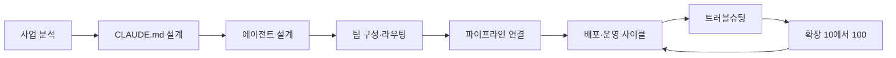
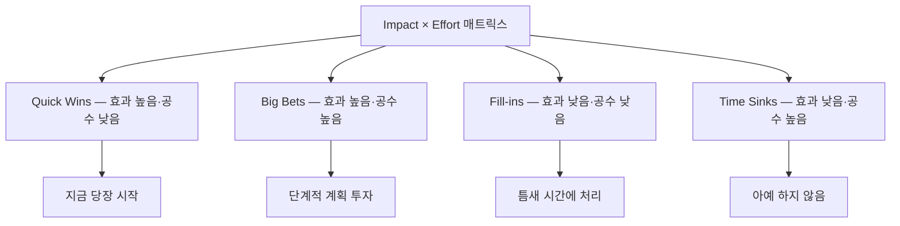

에이전트를 만드는 법을 다룬 글은 많다. 만든 다음이 문제다. 하루를 어떻게 굴리고, 조용히 실패하는 것을 어떻게 잡아내고, 개수가 늘어날 때 무엇이 먼저 깨지는가.

이 시리즈는 그 뒤쪽을 네 편에 걸쳐 다룬다. **「에이전트를 만드는 법」이 아니라 「만든 다음 어떻게 굴리고 키우느냐」가** 주제다. 첫 편인 이 글은 그중에서도 착수 이전을 본다 — 무엇을 자동화 대상으로 고를 것인가, 무엇을 만들면 끝난 것인가, 조직의 규칙을 어떤 문서에 얼마나 적을 것인가. 이어지는 편들은 에이전트 정의와 하루의 운영 사이클, 장애 대응, 그리고 10개에서 100개로 늘릴 때의 확장 전략을 다룬다.

먼저 짚어 둘 것이 있다. 자동화 대상 선정이 곧 회수율을 결정하기 때문에, 이 순서를 뒤집으면 뒤의 세 편이 다루는 운영 기법을 아무리 잘 써도 효과가 나오지 않는다. 원 자료가 내건 첫 원칙이 그것이다 — **"CLAUDE.md부터 쓰면 막힌다. 사업 분석이 먼저다."**

> 이 글이 옮긴 원 자료의 작성 기준일은 **2026-07-26**이다. 파일 경로·명령 이름·임계값은 그 시점의 것이며 버전에 따라 바뀐다.
>
> 이 글의 예시 업무·서비스 사업 규칙(모집·학사·결제·CS의 SOP 예시, 환불 규정 수치 등)과 등급 기준 수치는 **원 자료의 실습 예제이자 제시 기준선**이며 특정 조직의 실제 운영 사례가 아니다. 개념·판단 프레임 층위에서 읽어야 한다.

## 용어 정리

| 용어 | 풀이 |
|---|---|
| **라우팅(Routing)** | 들어온 요청을 어떤 에이전트가 처리할지 결정하는 분배 로직. 수동 → 키워드 매칭 → LLM 분류기 순으로 진화한다 |
| **오케스트레이터(Orchestrator)** | 직접 산출물을 만들지 않고 분기·호출·결과 종합만 담당하는 상위 에이전트. 허브-앤-스포크의 허브 |
| **허브-앤-스포크** | 중앙 조율자(허브)가 전문 실행자(스포크)에게 작업을 분배하는 멀티에이전트 구조 |
| **파이프라인(Pipeline)** | 여러 에이전트·도구를 순서대로 연결해 하나의 업무 흐름을 완성한 것 |
| **트리거 3종** | 파이프라인을 기동하는 세 경로 — Hook(이벤트 드리븐) / Cron(시간 드리븐) / Command(수동) |
| **Hook** | 특정 이벤트 시점에 자동 실행되는 스크립트. SessionStart, PostToolUse, Stop 등 |
| **Cron / crontab** | 시간 기반 정기 실행 스케줄러. macOS에서는 launchd(plist)를 권장 |
| **Dispatch(원격 지시)** | 터미널 앞이 아닌 곳에서 에이전트에 명령을 보내는 것. Telegram 봇·Discord+SSH·iOS 단축어 |
| **롤백(Rollback)** | 잘못 반영된 변경을 되돌리는 것. `git revert`, `git reset --soft`, `git reflog` |
| **관측성(Observability)** | 시스템 내부 상태를 외부에서 파악할 수 있는 정도. 여기서는 감사 로그·trace ID·비용 대시보드 |
| **감사 로그(Audit Log)** | 누가·언제·무슨 도구로·무엇을 했는지 남기는 기록. JSON Lines 형식 권장 |
| **trace_id** | 오케스트레이터에서 하위 에이전트까지 하나의 요청 체인을 추적하는 식별자 |
| **MTTR** | Mean Time To Repair. 장애 발생부터 복구까지 걸린 평균 시간 |
| **컨텍스트 윈도우** | 모델이 한 번에 볼 수 있는 토큰 한도. 초과 이전에 이미 응답 품질이 떨어진다 |
| **프롬프트 캐싱** | 반복되는 입력 컨텍스트를 서버가 캐시해 재사용하는 기능. 입력 토큰 비용 절감 |
| **cost_tier** | 에이전트 정의(frontmatter)에 선언하는 비용 등급. 모델 교체 시 코드 수정을 피하기 위한 간접층 |
| **Bounded Context** | 에이전트가 책임지는 업무 경계. 경계가 겹치면 라우팅 충돌이 발생한다 |
| **RLS (Row Level Security)** | DB에서 행 단위 접근 제어. 활성화만으로는 안전하지 않고 조건식이 핵심 |
| **PII** | 개인식별정보. 이름·이메일·전화번호 등. 로그·캐시에 남기지 않는 것이 원칙 |
| **Idiot Index** | 완제품 비용 ÷ 원자재 비용. 여기서는 인건비 ÷ 자동화 운영비로 자동화 우선순위를 산정 |
| **Impact × Effort** | 효과와 투입 공수의 2×2 매트릭스. Quick Wins / Big Bets / Fill-ins / Time Sinks |
| **Circuit Breaker** | 동일 에러가 정해진 횟수 반복되면 자동 중단하는 방어 패턴 |
| **Exponential Backoff** | 재시도 간격을 지수적으로 늘리는 방식. 호출 한도(429) 방어의 기본 |
| **SLA** | 응답·처리 수준에 대한 약속 |
| **PMF** | Product-Market Fit. 제품이 실제 수요와 맞아떨어진 상태 |
| **MCP** ★ | 외부 도구·데이터 소스를 에이전트에 연결하는 서버 규격. JD의 「도구」 필드에 선언된다 |

이 표가 시리즈 네 편이 공유하는 어휘다. **★를 붙인 마지막 행(MCP)은 이 글이 더한 것**이고, 나머지는 원 자료의 용어표를 그대로 옮겼다 — 원 자료에서 이 약어는 JD 표의 「도구(MCP)」 칸에 쓰이고 별도 풀이 행 없이 지나간다. 이어지는 세 편은 여기서 자기 글이 쓰는 행만 추려 다시 싣는다.

## 다섯 단계가 운영으로 되돌아온다

전체 흐름은 아래와 같다.

마지막 화살표가 운영으로 되돌아오는 것이 핵심이다. 확장은 일회성 프로젝트가 아니라 **운영 사이클의 반복 결과**로 일어난다.

각 단계의 산출물과, 그 단계를 건너뛰었을 때 나타나는 증상은 다음과 같다.

| 단계 | 산출물 | 이 단계를 건너뛰면 |
|---|---|---|
| 사업 분석 | 반복업무 목록 + 우선순위 매트릭스 | 효과 없는 업무를 자동화하고 ROI가 안 나온다 |
| CLAUDE.md 설계 | 조직 규칙·금기·톤 문서 | 매 세션 같은 설명을 반복하고 품질이 흔들린다 |
| 에이전트 설계 | 에이전트별 JD(역할·입출력·도구) | 책임 경계가 겹쳐 라우팅이 무너진다 |
| 팀 구성·라우팅 | 오케스트레이터 + 분기 규칙 | 요청이 엉뚱한 에이전트로 간다 |
| 파이프라인 연결 | Hook·Cron·Command 3종 트리거 | 사람이 매번 손으로 기동해야 한다 |
| 배포·운영 | 일일/주간 자동 사이클 + 점검 루틴 | 조용히 실패하는 자동화를 며칠 뒤에 발견한다 |
| 트러블슈팅 | 증상→원인→해결→예방 4단 대응 | 장애마다 처음부터 헤맨다 |
| 확장 | 재사용 라이브러리 + 거버넌스 + 비용 최적화 | 12개를 넘는 순간 라우팅·비용·디버깅이 동시에 터진다 |

여덟 행이 이 시리즈의 목차이기도 하다. 이 글이 위의 두 행(사업 분석 · CLAUDE.md 설계)을, 다음 편이 그다음 네 행(에이전트 설계 · 팀 구성 · 파이프라인 · 배포·운영)을, 세 번째 편이 트러블슈팅을, 마지막 편이 확장을 맡는다.

## 4주 마일스톤 — 산출물이 다음 주의 입력이 된다

원 자료는 전체 도입을 4주 마일스톤으로 끊는다. 기간 자체보다 **각 주차의 산출물이 다음 주차의 입력이 된다**는 순서가 핵심이다.

| 주차 | 단계 | 해야 할 일 | 다음 단계로 넘어가는 조건 |
|---|---|---|---|
| 1주차 | 사업 분석 | 자동화 대상 확정, 프로세스 해부, 우선순위 산정 | "우리는 ○○ 업무를 자동화한다"는 문장이 나옴 |
| 2주차 | 설계 | 에이전트 역할 분할, 데이터 3분할, 파이프라인 패턴 선택, 연동 확정 | 에이전트별 입출력·에러 처리 명세가 존재 |
| 3주차 | 구현 | 핵심 1개 완성 → 실제 데이터 검증 → 두 번째 추가 → 파이프라인 연결 | 샘플 1건이 끝까지 자동 처리됨 |
| 4주차 | 배포·검증 | 운영 환경 배포, 모니터링·알림·정기 실행 연결, 시연 | 사람이 손대지 않아도 하루가 돌아감 |

오른쪽 열이 기간이 아니라 **판정 가능한 문장**으로 적혀 있다는 점이 이 표의 요점이다. "2주차가 끝났다"가 아니라 "명세가 존재한다"가 통과 조건이다.

3주차 구현의 원칙 하나가 특히 중요하다. **한 번에 다 만들지 않는다.** 가장 효과가 큰 업무를 맡을 에이전트 1개를 먼저 완성해 실제 데이터로 검증하고, 검증된 것 위에 다음을 쌓는다. 이 순서를 어기면 어디가 잘못됐는지 특정할 수 없는 시스템이 나온다.

> **위 표의 기간(1~4주차)은 원 자료가 제시한 마일스톤이며 관측된 소요 시간이 아니다.** 원 자료 작성 기준일은 2026-07-26이다.

## 착수 전에 합격선을 숫자로 못박는다

단계별 작업에 들어가기 전에 **"무엇을 만들면 끝난 것인가"를** 먼저 정량으로 정의한다. 이것이 없으면 자동화는 "어느 정도 되는 것 같다"에서 멈춘다.

### 최종 산출물의 필수 요건 다섯

| # | 요건 | 판정 방법 |
|---|---|---|
| 1 | 실제 작동 | 입력 1건이 들어가면 분류 → 초안 → 시스템 갱신까지 자동 완료 |
| 2 | 자동화율 80% 이상 | 나머지는 사람이 처리하되, 분류만이라도 에이전트가 수행 |
| 3 | 안정성 95% 이상 | 재시도 정책 · 폴백 핸들러 · 에러 로깅이 모두 구현된 상태 |
| 4 | 운영비 상한 준수 | 모델·DB·부가 서비스 비용 합계가 사전에 정한 한도 이내 |
| 5 | 문서만 보고 실행 가능 | 만들지 않은 사람이 README만 읽고 실행에 성공 |

오른쪽 열이 「좋은가」가 아니라 **「무엇을 확인하면 되는가」로** 쓰여 있다는 점이 이 표의 성격이다. 1번은 입력 1건을 넣어 보면 되고, 3번은 세 가지 구현물이 있는지 보면 되며, 5번은 만들지 않은 사람을 앉혀 보면 된다.

### 5축 정량 루브릭

위 다섯 요건을 등급 기준까지 갖춘 루브릭으로 확장한 것이 아래 표다. **"AI 도입 효과를 무엇으로 측정하는가"에** 그대로 대응되는 프레임이다.

| 축 | 측정 방법 | 등급 기준 | 목표 |
|---|---|---|---|
| 자동화율 | 샘플 100건 중 사람 개입 없이 완료된 건수 | A 90%+ / B 80~89% / C 70~79% / D 70% 미만 | B 이상 |
| 안정성 | 자동 회귀 테스트 100회 실행 성공률 | A 98%+ / B 95~97% / C 90~94% / D 90% 미만 | B 이상 |
| 확장성 | 에이전트 1개 추가에 걸리는 시간 | A 1시간 / B 2시간 / C 반나절 / D 전면 재설계 | B 이상 |
| 비용 | 월간 운영비 합계 + 대체 인건비 대비 배수 | 배수 기준 10배 이상이면 양호 | 사전 상한 이내 |
| 문서화 | 체크리스트 10항목(README 4 + 에이전트 명세 3 + 런북 3) | A 등급 = 비개발자가 README만으로 실행 성공 | 10/10 |

다섯 축의 「측정 방법」 열이 전부 **무엇을 세거나 재는지를 지정**한다는 점이 이 표를 실제로 돌릴 수 있게 만든다 — 샘플 100건 중 완료 건수, 100회 중 성공 횟수, 1개 추가에 걸리는 시간, 운영비 합계와 인건비 대비 배수, 10항목 체크리스트다. "안정적인가"가 아니라 "100회 돌려 몇 번 성공했는가"다.

> **위 등급 경계값(90%·95%·98%·10배 등)은 원 자료가 제시한 기준선이며 이 글이 측정한 값이 아니다.** 조직마다 감당 가능한 실패율이 다르므로, 원 자료도 마지막 열을 절대 등급이 아니라 "목표"로 적어 두었다. 원 자료 작성 기준일은 2026-07-26이다.

### 세 축이 특히 실무적이다

- **안정성 축의 필수 3요소**: 재시도(최대 3회) + 폴백 핸들러 + 에러 로깅. 이 셋이 없으면 등급 자체가 매겨지지 않는다.
- **확장성 축의 정의**: "몇 개까지 되느냐"가 아니라 **"하나 더 붙이는 데 얼마나 걸리느냐"로** 측정한다. 전면 재설계가 필요하면 D등급이다.
- **문서화 축의 합격선**: 만든 사람이 아닌 제3자가 실행에 성공해야 통과다. 자기 검증이 아니다.

첫 항목의 **「최대 3회」는 완성 합격선의 안정성 축에 걸리는 기준**이다. 산출물이 안정성 등급을 받으려면 재시도 정책이 존재해야 한다는 뜻이고, 그 정책의 상한을 3회로 잡은 것이다. 같은 원 자료가 **외부 API 호출의 백오프 상한으로는 다른 값을 제시**하는데, 그쪽은 계정 차단을 피하는 것이 목적이다 — [다음 편](/blog/agentic-coding/agent-jd-triggers/)에서 그 값과 적용 범위를 따로 다룬다. **두 값이 서로 다른 대상을 잰다고 읽는 것은 이 글의 정리다.** 각 값이 놓인 절(이쪽은 완성 합격선, 저쪽은 외부 API 연동)에서 유추한 것이며, 원 자료가 두 값을 견줘 설명한 대목을 옮긴 것이 아니다. 그 유추를 따르면 두 숫자를 같은 선으로 읽을 때만 모순처럼 보인다.

확장성 축의 정의가 이 시리즈 전체의 복선이기도 하다. 「하나 더 붙이는 데 얼마나 걸리느냐」가 D등급으로 떨어지는 지점이 어디이고 그때 무엇이 깨지는지는 [마지막 편](/blog/agentic-coding/scaling-routing-collapse/)의 주제다.

## 무엇을 자동화할지 먼저 정한다

원 자료가 내건 첫 원칙은 **"CLAUDE.md부터 쓰면 막힌다. 사업 분석이 먼저다"이다**. 자동화 대상 선정이 곧 회수율을 결정하기 때문이다.

### 5열 워크시트 — 반복 업무를 나열한다

| 열 | 기록 방법 | 예시 |
|---|---|---|
| 업무명 | 동사+명사, 작은 단위로 분해 | 인스타그램 캡션 작성 (콘텐츠 제작 X) |
| 주 횟수 | 숫자로 | 10회 |
| 소요 시간 | 분 단위로 | 12분 |
| 담당 | 나 혼자 / 직원 함께 | 나 혼자 |
| 자동화 후보 | O / X | O |

다섯 열 중 앞의 셋이 곧 환산식의 입력이다. `주 10회 × 12분 × 52주 = 연간 104시간`처럼 환산하면 우선순위가 자연스럽게 정렬된다. 반대로 연 1회 작업은 자동화해도 회수가 안 된다.

첫 행의 「동사+명사, 작은 단위로 분해」가 나머지를 좌우한다. "콘텐츠 제작"으로 적으면 횟수도 시간도 셀 수 없고, "인스타그램 캡션 작성"으로 좁혀야 비로소 두 번째·세 번째 열에 숫자가 들어간다.

### 우선순위 두 도구

| 도구 | 계산식 / 기준 | 판정 |
|---|---|---|
| Idiot Index | 대체 인건비 ÷ 에이전트 운영비 | 10 이상이면 즉시 자동화 대상 |
| Impact × Effort | 효과와 구현 공수의 2×2 배치 | 분면별로 대응 전략이 다름 |

두 도구는 서로 다른 질문에 답한다. 앞은 "이 업무 하나가 값을 하는가"를 배수로 재고, 뒤는 "여러 후보 중 무엇부터 하는가"를 자리로 정한다.

임계점 기준은 **"2주 안에 본전이 뽑히면 Quick Win"이다**. 원 자료가 든 대비 사례는 고객 문의 초안(구현 2시간에 매일 2시간 절약, Quick Win)과 영수증 정리(구현 3일에 월 30분 절약, 실패 사례) 두 건이다.

> **위 두 사례의 시간 수치는 원 자료가 대비용으로 제시한 예시**이며 이 글이 측정한 값이 아니다. `Idiot Index 10 이상`과 `2주 회수`도 원 자료가 제시한 판정 기준선이다. 원 자료 작성 기준일은 2026-07-26이다.

두 사례의 차이는 구현 공수가 아니라 **절약분의 주기**에 있다. 매일 2시간은 2주면 회수되지만, 월 30분은 구현에 든 3일을 몇 년 걸려도 못 갚는다.

## 규칙 문서 — 60줄 원칙

CLAUDE.md는 **효율 도구가 아니라 품질 도구**로 규정된다. 비유는 "매뉴얼 없는 신입사원"이다. 규칙 파일 자체의 계층 구조와 작성 순서는 이 카테고리의 [200줄은 상한이 아니라 임계다](/blog/agentic-coding/claude-md-scope-layers/) 편이 따로 다뤘고, 이 절은 **조직 규칙을 담는 문서로서 무엇을 얼마나 적을 것인가**만 본다.

### 10항목 체크리스트

10항목 체크리스트가 뼈대이고, **항목당 평균 6줄로 60줄을 맞춘다.**

| # | 항목 | 없으면 생기는 실수 |
|---|---|---|
| 1 | 회사명·브랜드 표기 | 잘못된 이름 사용으로 신뢰 손상 |
| 2 | 미션·슬로건 | 콘텐츠 방향성이 매번 달라짐 |
| 3 | 제품·서비스 | 잘못된 소개로 CS 문의 폭증 |
| 4 | 고객 페르소나 | 아무에게도 닿지 않는 글 |
| 5 | 가격 정책 | 임의 할인·가격 오류로 분쟁 |
| 6 | 채널별 역할 | 채널 성격에 안 맞는 톤 |
| 7 | 팀원·역할 | 엉뚱한 담당자 배정 |
| 8 | 허용 도구 | 스택 밖 도구를 추천 |
| 9 | 금기 사항 | 가장 중요한 항목. 명시적 금지어 필수 |
| 10 | 말투·톤 | 목소리가 문서마다 달라짐 |

열 행 중 아홉 개의 오른쪽 열이 **실수의 이름**으로 적혀 있다. 9번만 예외로 사고 대신 「가장 중요한 항목. 명시적 금지어 필수」라는 강조가 들어가 있는데, 금기 사항은 빠졌을 때 생기는 실수를 하나로 특정할 수 없어서일 것이다 — 이렇게 읽는 것은 이 글의 정리다. 증설 여부를 판단하는 질문도 같은 형태다 — **"이 정보가 없으면 어떤 실수가 발생하는가?"** 답할 수 없으면 넣지 않는다.

### 크기 기준 세 단계

| 단계 | 줄 수 | 상태 |
|---|---|---|
| 시작기 | 5~10줄 | 이름·회사·말투만 있어도 큰 차이 |
| 성숙기 | 30~60줄 | 충분한 정보 + 컨텍스트 여유 |
| 위험 | 100줄 이상 | 컨텍스트 잠식, 관리 포기 |

세 행 중 마지막 행만 이름이 상태가 아니라 **경고**다. 100줄이 넘는 규칙 문서가 오히려 품질을 떨어뜨리는 이유는 네 가지로 정리된다.

- 컨텍스트 윈도우를 잠식해 중요한 지시가 잘려 나간다.
- **규칙이 100개면 모델이 그중 일부를 무작위로 무시한다.**
- 관리가 포기되어 낡은 가격·퇴사자 이름이 그대로 남는다.
- 규칙 과다 자체가 불신의 증거이며, 역설적으로 결과를 더 나쁘게 만든다.

네 항목을 하나씩 배정하면 이렇다 — 첫째와 둘째는 **모델이 규칙을 덜 지키게 되는 경로**를 말하고, 셋째는 **문서가 낡는 것**을, 넷째는 **규칙을 많이 쓰는 행위 자체**를 문제로 본다. 넷째가 특히 반직관적이다 — 규칙을 더 적었는데 결과가 더 나빠진다.

### 60 · 100 · 200 — 세 값은 서로 다른 문장에서 나온다

지금까지 이 절에 세 개의 줄 수가 등장했다. 그런데 같은 원 자료의 뒷부분에도, 이 카테고리의 다른 글에도 **같은 파일에 대한 또 다른 값**이 있다. 아래 표는 그중 **이 글이 다루는 여섯 자리**다. 원 자료에서 줄 수가 언급되는 자리는 이보다 많다 — 바로 위 크기 기준 표의 「시작기 5~10줄」이 그렇고, 「60줄 원칙」처럼 같은 값이 절 제목이나 서술문에서 되풀이되는 자리도 있다. 이 표는 그 전부를 세려는 목록이 아니라 **60 · 100 · 200이 각각 다른 목적으로 붙는 자리**를 모은 것이다.

| 값 | 어디서 나오는가 | 원문 그대로 |
|---|---|---|
| **60줄** | 이 절 — 10항목 체크리스트의 산식 | 「항목당 평균 6줄로 60줄을 맞춘다」 |
| 30~60줄 | 이 절 — 크기 기준 표의 「성숙기」 행 | 「충분한 정보 + 컨텍스트 여유」 |
| **100줄 이상** | 이 절 — 크기 기준 표의 「위험」 행 | 「컨텍스트 잠식, 관리 포기」 |
| 60줄 | 이 절 — 완성 체크리스트 항목 | 「60줄 이하인가 (초과 시 각 섹션 핵심만 남기고 삭제)」 |
| **200줄** | **같은 원 자료의 트러블슈팅 절** ([세 번째 편](/blog/agentic-coding/troubleshooting-three-layers/)이 다룬다) | 「규칙 문서 크기 / 200줄 이하 유지, 초과 시 정리 / 문서 자체가 컨텍스트를 잠식한다」 |
| 200줄 | [다른 글](/blog/agentic-coding/claude-md-scope-layers/)이 옮긴 별개 자료 | 「하드 리밋이 아니라 준수율(adherence) 임계」 |

표의 여섯 행 중 **다섯 행이 이 글의 원 자료에서, 한 행(마지막)이 다른 글이 옮긴 별개 자료에서** 왔다. 원 자료에서 온 다섯 중 다섯째는 이 절이 아니라 **한참 뒤 트러블슈팅 절**에서 나온다.

> **위 여섯 행을 이렇게 갈라 읽는 것은 이 글의 정리다.** 60줄은 **산식으로 나온 값**이다 — 10항목에 항목당 6줄을 곱한 결과이지, 61줄부터 무슨 일이 일어난다는 관찰이 아니다. 100줄은 원 자료가 표에서 **「위험」이라고 직접 이름 붙인 선**이다.
>
> **주목할 것은 다섯째 행이다.** 같은 원 자료가 같은 파일에 대해 **60줄과 200줄을 둘 다 쓴다.** 두 값이 나오는 절이 다르고 재는 목적이 다르다 — 여기(설계 절)에서는 *무엇을 얼마나 적을 것인가*를 정하느라 항목 수에서 역산한 값을 쓰고, 트러블슈팅 절에서는 *컨텍스트 한도 초과 장애의 예방책*을 적느라 문서가 컨텍스트를 잠식하지 않는 한도를 쓴다. **두 값을 이어 붙이는 것은 이 글이 하는 일이다** — 원 자료에서 줄 수가 나오는 문장들을 찾아 보면 60(과 그 산식·성숙기 구간)이 나오는 문장과 200이 나오는 문장이 서로 다른 절에 따로 있고, 한 문장 안에서 두 값이 함께 나오는 자리는 찾지 못했다.
>
> **그리고 이 셋이 서로 무관한 지표를 재고 있다고 단정할 수는 없다.** 100줄 초과의 폐해 넷 중 둘째가 준수율 저하와 겹쳐 읽히기 때문이다. 두 문장을 그대로 옮기면 이렇다.
>
> - 이 글의 원 자료 — **「규칙이 100개면 모델이 그중 일부를 무작위로 무시한다」**
> - [다른 글](/blog/agentic-coding/claude-md-scope-layers/)이 옮긴 별개 자료 — **「AI가 앞쪽 규칙만 우선시하고 뒤쪽 규칙을 흘리기 시작한다」**
>
> 두 문장이 같은 동작을 말하는지는 **두 자료 안에서 판정되지 않는다.** 겹치는 것은 결과(일부 규칙이 지켜지지 않는다)이지만, 앞은 **무작위** 누락이라고 적었고 뒤는 **앞뒤 위치에 따른** 누락이라고 적었다 — 무작위라면 위치와 무관하고, 위치 의존이라면 무작위가 아니다. 두 자료는 각자 자기 문장을 단정형으로 적었고, 이 글은 어느 쪽이 맞는지 가리지 않는다 — 위 대조는 이 글이 두 문장을 나란히 놓아 본 결과이지 자료가 내린 판정이 아니다. 확실한 것은 **세는 단위가 다르다**는 것뿐이다. 앞은 규칙 개수(100개)로, 뒤는 파일 줄 수(200줄)로 센다. 이 대조는 이 글의 정리다.
>
> 메커니즘은 갈려도 실무에서 쓸 때의 결론은 하나로 모인다 — 이렇게 잇는 것도 이 글의 정리다. **두 자료가 든 선은 둘 다 파일이 거부되는 지점이 아니라 규칙 일부가 조용히 흘려지기 시작하는 지점**이므로, 넘겼다는 사실 자체를 알아차리지 못한 채 지나간다. 그래서 아래 완성 체크리스트에 줄 수 확인 항목이 들어가 있고, 트러블슈팅 절의 점검 루틴에도 「규칙 문서 줄 수 감사」가 월간 항목으로 다시 들어간다.

### 7개 섹션 구성

실제 문서는 7개 섹션 구성으로 예시된다. 사내 규칙 문서를 만들 때의 목차로 그대로 쓸 수 있다.

| 섹션 | 담는 내용 | 이 섹션이 막는 사고 |
|---|---|---|
| 회사 기본 정보 | 정식 표기, 금지 약칭, 미션 | 잘못된 사명 표기 |
| 제품 라인업 | 상품·가격·할인 정책 | 임의 할인, 가격 오안내 |
| 핵심 고객 | 주 고객군의 구성과 특성 | 대상에 안 맞는 메시지 |
| 채널과 도구 | 채널별 역할, 허용 스택 | 스택 밖 도구 추천 |
| 팀 | 이름·직책·의사결정 권한 | 엉뚱한 담당자 배정 |
| 금기 사항 | 명시적 금지어와 금지 행위 | 경쟁사 비하, 미확인 통계 |
| 말투와 톤 | 결론 우선, 능동태, 수치 구체화 | 문서마다 다른 목소리 |

앞의 세 섹션만 있어도 실수의 상당 부분을 막을 수 있다는 것이 원 자료의 주장이다.

일곱 섹션과 앞의 10항목을 붙여 보면 **1:1이 아니라 10을 7로 묶은 형태**다 — 회사 기본 정보가 1·2번(회사명·미션)을, 제품 라인업이 3·5번(제품·가격)을, 채널과 도구가 6·8번(채널별 역할·허용 도구)을 각각 한 섹션에 담고, 나머지 넷(핵심 고객·팀·금기 사항·말투와 톤)이 4·7·9·10번과 하나씩 대응한다. 체크리스트는 **빠뜨리면 안 되는 정보의 목록**이고, 이 표는 **그 정보를 담는 그릇의 배치**다 — 두 표를 이렇게 대응시켜 읽는 것은 이 글의 정리다.

### SOP 4축

서비스 사업의 운영 규칙은 4개 축으로 분해된다. 어떤 서비스든 이 네 가지에서 규칙 문서를 시작할 수 있다.

| SOP 축 | 담는 규칙 | 예시 |
|---|---|---|
| 모집 | 채널별 안내 문구, 마감·정원 처리 | 얼리버드/정가 구분, 마감 안내 톤 |
| 학사·운영 | 진행 중 발생하는 반복 처리 | 출결·과제·공지 기준 |
| 결제 | 가격표, 환불 규정, 금지 행위 | 2주차 100% / 4주차 50% / 이후 불가, 현금 직접 수령 금지 |
| CS | 1차 응대 시한, 에스컬레이션 조건, 응대 톤 | 4시간 내 1차 응대, 환불·법적 이슈는 즉시 상위 보고, 공감 → 해결책 → 다음 단계 |

네 축은 고객 접점의 흐름을 따라 배열돼 있다 — 들어오고(모집), 서비스를 받고(학사·운영), 돈이 오가고(결제), 문제를 제기한다(CS). 이렇게 읽는 것은 이 글의 정리다. 오른쪽 열의 수치(환불 비율, 응대 시한)는 원 자료가 교육 서비스를 예시로 든 값이라 업종마다 달라지지만, **어느 축에 숫자가 들어가야 하는지**는 업종과 무관하다.

**에스컬레이션 조건을 문서에 명시하는 것**이 핵심이다. 에이전트가 스스로 판단하면 안 되는 영역을 미리 정해두지 않으면, 판단하면 안 될 것을 판단한다.

> **위 예시 열의 환불 규정(2주차 100% / 4주차 50%)과 CS 응대 시한(4시간)은 원 자료의 실습 예제**이며 특정 조직의 실제 규정이 아니다. 원 자료 작성 기준일은 2026-07-26이다.

### 완성 체크리스트 네 개

문서 완성 후 확인할 체크리스트는 네 개다.

- 10항목이 모두 채워졌는가 (회사명부터 말투까지)
- **60줄 이하인가 (초과 시 각 섹션 핵심만 남기고 삭제)**
- 가격과 금기 사항이 명확한가 (숫자 + 명시적 금지어)
- 분기 1회 리뷰 계획이 있는가 (가격 변동·조직 변화 시 갱신)

마지막 항목이 실무에서 가장 자주 빠진다. 규칙 문서는 한 번에 완성되지 않고 **쓰면서 진화**하는 문서이며, 갱신 주기가 없으면 낡은 가격과 퇴사자 이름이 남는다. 셋째 항목의 「숫자 + 명시적 금지어」도 같은 이유로 들어가 있다 — 가격과 금기는 바뀌는 속도가 가장 빠른데, 문서에 숫자로 적혀 있지 않으면 바뀐 것을 알아차릴 방법이 없다.

## 다음 편으로

이 글은 착수 이전을 다뤘다. 무엇을 자동화 대상으로 고르는가(워크시트 + 두 도구), 무엇을 만들면 끝난 것인가(필수 요건 다섯 + 5축 루브릭), 조직 규칙을 어디에 얼마나 적는가(10항목 · 7섹션 · SOP 4축 · 60줄)까지다.

세 주제를 관통하는 것은 하나다. **판정 기준을 사후가 아니라 사전에 고정한다.** 자동화 대상은 일을 시작하기 전에 배수로 걸러야 회수가 되고, 합격선은 만들기 전에 숫자로 못박아야 "어느 정도 된 것 같다"에서 멈추지 않으며, 규칙 문서의 분량은 다 쓰고 나서 재면 이미 규칙 일부가 흘려지고 있다.

이어지는 [다음 편](/blog/agentic-coding/agent-jd-triggers/)은 정해진 대상을 실제 에이전트로 옮긴다 — 한 명을 5필드 JD로 정의하고, 여럿을 키워드가 겹치지 않게 묶고, 세 가지 트리거로 기동해 하루가 사람 손 없이 돌아가게 만드는 데까지다.
