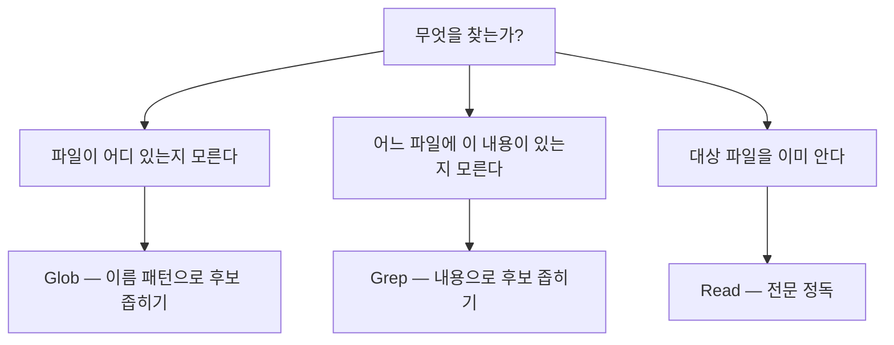
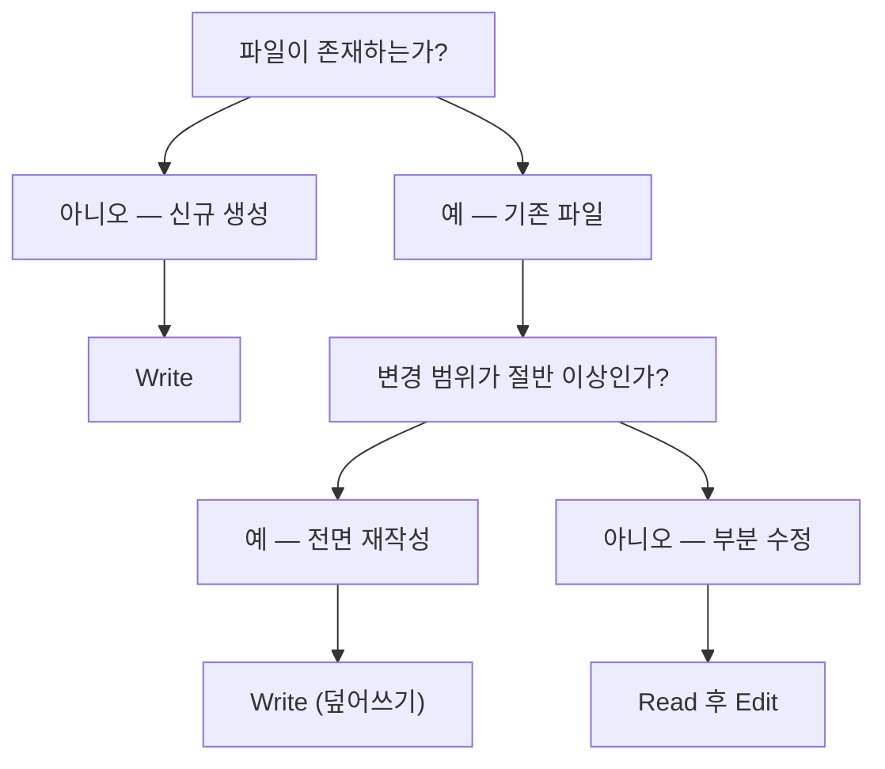
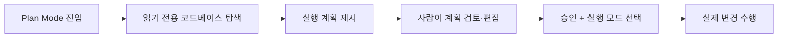
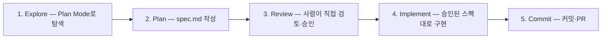

권한 설계를 어렵게 만드는 것은 대개 범위 문제다. 무엇을 허용하고 무엇을 막을지 목록을 짜다 보면 끝이 없어 보이고, 결국 "일단 다 열고 문제 생기면 막자"로 흐른다.

그런데 이 문제에는 자연적인 경계가 있다. **에이전트가 실제로 시스템에 영향을 주는 통로는 도구뿐이다.** 도구 목록이 유한하면 공격 표면도 유한하다. 목록이 일곱 개면 검토할 것도 일곱 개다. 이 글은 그 일곱 개를 열어 보고, 각 도구가 어떤 위험을 지며, 즉시 실행이라는 이 도구의 기본 성질을 어떤 장치로 제어하는지까지 본다.

> 이 글의 제품 사양은 **원 자료 기준(2026-04)** 이다. 도구 이름·파라미터·단축키는 버전에 따라 바뀐다.

## 용어 정리

[앞 편](/blog/agentic-coding/claude-code-autonomy-tiers/)의 용어표에서 이 글이 쓰는 행만 추렸다.

| 용어 | 풀이 |
|---|---|
| 에이전틱 코딩 (Agentic Coding) | AI가 매 단계 지시를 기다리지 않고 스스로 계획·실행·검증하는 코딩 방식 |
| 토큰 (Token) | 모델이 텍스트를 처리하는 최소 단위. 대략 한글 1자 ≈ 1토큰 안팎, 영어 1단어 ≈ 1.3토큰 수준으로 환산된다 |
| 컨텍스트 윈도우 | 모델이 한 세션에서 동시에 기억·처리할 수 있는 토큰의 최대량. 초과하면 앞부분이 밀려나며 품질이 떨어진다 |
| 컨텍스트 조기 소진 | 불필요한 파일을 과다 로드해 세션 후반부에 쓸 토큰이 남지 않는 상태. 에이전트 운영의 대표적 실패 모드 |
| 퍼미션 모드 (Permission Mode) | 에이전트가 파일시스템·명령어를 어느 범위까지 쓸 수 있는지 정하는 실행 모드 |
| Plan Mode | 파일을 수정하지 않고 읽기 전용으로만 동작하며 실행 계획을 먼저 제시하도록 강제하는 퍼미션 모드 |
| SDD (Spec-Driven Development) | 코드 작성 전에 스펙 문서(`spec.md`)를 먼저 쓰고 검토한 뒤 구현하는 개발 패턴 |
| allowlist / denylist | 허용 목록 / 차단 목록. 화이트리스트·블랙리스트와 같은 뜻 |
| MCP (Model Context Protocol) | AI와 외부 도구·서비스 간 통신 표준 프로토콜 |

## 내장 도구 일곱 가지 — 무엇을 시킬 수 있는가

에이전트가 실제로 시스템에 영향을 주는 통로는 도구뿐이다. **도구 목록 = 공격 표면 목록**이라고 보면 권한 설계가 쉬워진다.

| 도구 | 하는 일 | 언제 쓰는가 | 리스크 |
|---|---|---|---|
| Read | 파일 내용을 줄번호와 함께 읽음 (원본 불변) | 수정 전 현황 파악, 로그·문서 분석 | 민감 파일(`.env`, 키 파일) 내용이 컨텍스트에 유입 |
| Write | 파일 신규 생성 또는 전체 덮어쓰기 | 새 문서·보고서 생성, 전면 재작성 | 기존 내용이 통째로 소실. 되돌리기 어려움 |
| Edit | 특정 문자열만 정밀 교체 | 일부 수정, 기존 내용 보존이 중요할 때 | 매칭 실패로 인한 오수정, 중복 문자열 오인 |
| Bash | 셸 명령 실행 | 빌드·테스트·스크립트 실행, 환경 조작 | **가장 위험.** 삭제·권한상승·네트워크 유출이 모두 여기서 발생 |
| Glob | 파일명 패턴으로 파일 목록 검색 | "어떤 파일이 있는지" 파악 | 낮음 (읽기 전용). 과다 매칭 시 컨텍스트 낭비 |
| Grep | 파일 내용에서 텍스트 검색 | "어느 파일에 이 내용이 있는지" 파악 | 낮음. 대규모 저장소에서 결과 폭주 가능 |
| WebSearch / WebFetch | 외부 웹 검색·조회 | 최신 규정·문서 확인 | 내부 정보가 검색어로 유출될 수 있음. 내부 도메인 접근 차단 필요 |

> **오른쪽 열만 따로 읽으면 그것이 보안 검토서 초안이다.**
>
> 일곱 행의 리스크를 성격으로 나누면 정보가 **들어오는** 위험(Read), 정보가 **나가는** 위험(WebSearch/WebFetch), 상태가 **바뀌는** 위험(Write·Edit·Bash) 셋이 나온다. 남는 두 행(Glob·Grep)은 성격이 다르다 — 리스크 열이 「낮음. 과다 매칭 시 컨텍스트 낭비」라 보안 위험이 아니라 **컨텍스트 비용**이다.
>
> 이 세 갈래는 원 자료에 없다. 도구표의 리스크 열을 읽어 이 글에서 묶은 것이다.

### 리스크 등급으로 다시 묶기

| 등급 | 도구 | 기본 정책 권장 |
|---|---|---|
| 저위험 (읽기 전용) | Read · Glob · Grep | 승인 없이 즉시 실행 허용 |
| 중위험 (파일 변경) | Edit · Write | 승인 요청 또는 경로 제한 |
| 고위험 (시스템·외부) | Bash · WebFetch · MCP 쓰기 도구 | 명시적 allowlist + deny 패턴 병행 |

> 이 3등급 분류는 **원 자료에 그대로 나오지는 않는다.** 도구별 특성을 조직 정책으로 환원하기 위해 이 글에서 재구성한 것이다.

등급이 셋인 것에 실용적 이유가 있다. 도구마다 정책을 따로 붙이면 도구가 늘 때마다 판단을 새로 해야 하지만, 등급으로 묶으면 새 도구가 추가돼도 "어느 등급인가"만 판정하면 되고 판정 결과가 곧 기본 정책이 된다. 다만 등급이 설정 파일을 대체하지는 않는다 — 고위험 행의 권장 자체가 「명시적 allowlist + deny 패턴 병행」이라 실제 `settings.json`은 여전히 도구·패턴 단위로 쓰인다. 등급은 그 패턴을 정할 때의 판단 기준이지 그 자리에 들어가는 값이 아니다.

### 도구 조합 파이프라인

에이전트의 실제 작업은 단일 도구가 아니라 조합으로 이뤄진다.


| 패턴 | 조합 | 대표 상황 |
|---|---|---|
| 패턴 1 | Glob → Read → Write | 여러 파일을 분석해 요약 보고서 생성 |
| 패턴 2 | Grep → Read → Write | 특정 키워드 포함 파일만 수집해 목록화 |
| 패턴 3 | Glob → Read → Edit | 조건에 맞는 파일들을 찾아 일괄 수정 |
| 패턴 4 | Bash → Write | 스크립트 실행 후 결과 로그 저장 |

사용자는 도구를 직접 고르지 않는다. 목표를 자연어로 말하면 에이전트가 조합을 결정한다. 다만 **어떤 조합이 선택될지 예측할 수 있어야** 권한 정책을 제대로 설계할 수 있다.

네 패턴 모두 마지막 단계가 쓰기라는 점이 권한 설계에 직접 걸린다. 앞쪽 탐색 도구를 아무리 열어 둬도 마지막 한 칸을 막으면 파이프라인은 산출물을 남기지 못하고, 반대로 마지막 칸만 열어 두고 탐색을 막으면 에이전트는 무엇을 쓸지 모른 채 쓰게 된다. **파이프라인의 어느 지점에 게이트를 둘 것인가**가 도구별 허용/차단보다 먼저 오는 질문이다.

## 파일 탐색 3무기 — Glob · Grep · Read

| 도구 | 검색 대상 | 반환 | 비유 |
|---|---|---|---|
| Glob | 파일 **이름**(경로 패턴) | 파일 경로 목록 | 서류 캐비닛 라벨 검색 |
| Grep | 파일 **내용**(텍스트) | 매칭 파일 + 줄 번호 | 문서 더미 키워드 검색 |
| Read | 지정한 **한 파일** | 줄번호 붙은 전문 | 서류함에서 꺼내 정독 |

선택 기준은 "무엇을 모르는가"로 갈린다.



### Read의 동작 특성

| 특성 | 내용 |
|---|---|
| 출력 형식 | `cat -n` 형식으로 줄번호가 붙는다. 이후 Edit 지시의 좌표가 된다 |
| 기본 한도 | 약 2,000줄 (약 25,000토큰) |
| 부분 읽기 | `offset`·`limit` 파라미터로 대용량 파일의 일부만 읽을 수 있다 |
| 부작용 | 없음. 몇 번을 읽어도 원본은 변하지 않는다 |
| 승인 | 별도 승인 없이 즉시 실행 (Edit·Write는 승인 요청) |

첫 행과 마지막 행이 짝을 이룬다. Read가 승인 없이 즉시 실행되는 이유는 부작용이 없어서이고, 줄번호가 붙는 이유는 그 출력이 **다음 도구의 입력 좌표**이기 때문이다. 즉 Read는 단독 조회 도구가 아니라 Edit의 전제 조건이고, 이것이 뒤에 나오는 "Edit 전에 반드시 Read" 규칙의 기술적 근거다.

### 실무 원칙 — "덜 참조하고 더 정확하게"

- 탐색은 **좁혀가는 순서**로. Glob·Grep으로 후보를 줄인 뒤 Read로 정독한다. 처음부터 전체를 Read하면 컨텍스트가 조기 소진된다.
- 대규모 저장소에서 Grep 결과가 수백 건 나오면 그 자체가 신호다. 검색어를 좁히거나 경로를 한정해야 한다.
- Bash로 `cat`·`grep`을 직접 부르는 것보다 전용 도구를 쓰는 편이 낫다. 권한 정책상 Bash는 고위험 등급이고, 전용 도구는 읽기 전용이라 통제가 쉽다.

세 번째 항목이 특히 중요하다. 기능만 보면 `Bash(grep ...)`과 Grep 도구는 같은 일을 하지만, **권한 등급이 다르다.** 같은 결과를 얻는 두 경로 중 하나가 고위험 등급을 통과해야 한다면 정책이 열려 있어도 낮은 등급 경로를 쓰는 편이 낫다. 도구 선택이 취향이 아니라 권한 설계의 일부가 되는 지점이다.

## 코드 쓰기와 수정 — Read → Edit / Write



한 줄로 요약하면 **"신규이거나 전면 교체면 Write, 일부만 바꾸면 Read → Edit"** 이다.

### Edit의 필수 규칙

| 규칙 | 이유 |
|---|---|
| Edit 전에 반드시 Read | 파일의 실제 내용을 모르면 교체 대상 문자열을 특정할 수 없다 |
| `old_string`은 공백·들여쓰기·대소문자까지 100% 일치 | 부분 일치로는 동작하지 않는다 |
| 교체 대상은 파일 내에서 유일해야 함 | 중복되면 어느 것을 바꿀지 결정할 수 없어 실패한다 |
| 여러 곳을 동시에 바꾸려면 `replace_all` 사용 | 반복 호출보다 안전하고 빠르다 |
| 나머지 내용은 절대 건드리지 않음 | Write와 결정적으로 다른 점. 주변 맥락이 보존된다 |

### Write의 위험성

- 기존 파일에 Write를 하면 **이전 내용이 완전히 사라진다.** 되돌리기가 어렵다.
- 수백 줄 파일은 Edit이 Write보다 빠르고 안전하다. 토큰 소모도 훨씬 적다.
- 실무 정책으로는 "읽지 않은 파일에 Write 금지"를 규칙화할 만하다. 내용을 확인하지 않은 파일을 덮어쓰는 것은 사실상 삭제와 같다.

> **개발철학과의 접점**
>
> Edit이 성립하려면 코드가 "고유하게 식별 가능한 문자열 단위"로 구조화돼 있어야 한다.
>
> 같은 패턴이 복붙으로 반복되는 코드베이스에서는 Edit이 계속 실패하고, 에이전트는 Write로 전면 재작성을 시도하게 된다.
>
> 즉 **중복 제거·명확한 네이밍은 가독성 문제가 아니라 AI가 안전하게 수정할 수 있는지의 문제**다. 이것이 "좋은 코드 = AI가 정확히 읽고 안전하게 고칠 수 있는 구조"의 구체적 근거가 된다.

이 인용문이 말하는 인과가 한 방향 더 있다. 중복이 많은 코드베이스에서 Edit이 실패하면 에이전트는 Write로 넘어가고, Write는 중위험 등급이며 되돌리기 어렵다. 즉 **코드 품질이 나쁘면 에이전트가 더 위험한 도구를 쓰게 된다.** 리팩터링이 권한 리스크를 낮추는 작업이 되는 셈이고, 이는 [앞 편](/blog/agentic-coding/reversibility-before-permission/)의 "되돌릴 수 있어야 권한을 넓힌다"와 같은 논리의 코드 층위 버전이다.

## 4대 지시 패턴 — 즉시 실행의 부작용을 제어하는 장치

Claude Code는 기본적으로 지시를 받으면 **즉시** 파일을 수정한다. 이 실행력이 장점이지만, 방향이 틀렸거나 범위가 불명확하면 그대로 손실이 된다. 아래 4가지는 각각 그 부작용을 막는 제어 메커니즘이다.

| 기능 | 통제하는 것 | 한 줄 정의 |
|---|---|---|
| Plan Mode | 실행 시점 | 파일 수정 없이 계획만 먼저 받는다 |
| SDD | 방향 | 구현 전에 스펙 문서로 방향을 확정한다 |
| @파일 참조 | 컨텍스트 | 에이전트가 놓칠 수 있는 핵심 파일을 직접 건넨다 |
| 이미지 입력 | 전달 매체 | 언어로 설명하기 어려운 요구사항을 그림으로 전달한다 |

가운데 열이 이 표의 뼈대다. 넷은 기능 목록이 아니라 **서로 다른 실패 유형에 대응하는 네 장치**다 — 너무 일찍 실행하는 실패, 엉뚱한 방향으로 가는 실패, 맥락을 놓치는 실패, 요구사항이 전달되지 않는 실패. 그래서 넷은 대체재가 아니라 병용 대상이고, 뒤의 선택 루브릭이 조합표로 끝나는 이유가 여기 있다.

### Plan Mode

읽기 전용으로만 동작하며 실행 계획을 먼저 제시하도록 강제하는 퍼미션 모드다. 공식 표현으로는 "research and propose changes without making them".



진입 방법은 세 가지다.

```bash
# 1) 세션 중 단축키
Shift+Tab (한 번) → acceptEdits 모드
Shift+Tab (두 번) → Plan Mode  ("⏸ plan mode on" 표시)

# 2) CLI 플래그로 세션 시작
claude --permission-mode plan
claude --permission-mode plan -p "인증 시스템 분석해줘"

# 3) 특정 요청만 플래닝
/plan 이 기능 어떻게 구현할지 분석해줘
```

```json
// 4) settings.json 기본값으로 고정 — 보수적 환경에 적합
{
  "permissions": {
    "defaultMode": "plan"
  }
}
```

| 판단 기준 | 내용 |
|---|---|
| 써야 할 때 | 변경 예상 파일 5개 이상, 레거시 탐색, 대규모 리팩토링, "어디까지 건드릴지 모르겠다"는 느낌이 들 때 |
| 쓰지 말아야 할 때 | 1~2줄 단순 수정, 타이포 교정, 방향이 이미 확정된 작업 |
| 장점 | 예상치 못한 파일 수정 방지, 사이드이펙트 사전 파악, 승인 후 실행 |
| 단점 | 단순 작업에서 오버헤드, 빠른 실험에 부적합 |

계획이 제시되면 `Ctrl+G`로 기본 에디터를 열어 계획 자체를 직접 편집할 수 있다. **에이전트의 계획을 사람이 수정한 뒤 실행시킨다**는 점이 중요하다 — 승인/거부의 이진 선택이 아니라 협업 지점이 된다.

마지막 JSON 블록이 앞의 세 가지와 성격이 다르다는 점을 짚어 둘 만하다. 진입 방법이 셋인 것은 셋 다 **그때그때 사람이 켜는** 조작이기 때문이고, `settings.json`의 `defaultMode`는 진입을 조작이 아니라 **켜지 않으면 안 되는 기본 상태로 고정**하는 설정이다. 개인 습관과 조직 정책이 갈리는 자리이며, 후자를 다루는 것이 [다음 편](/blog/agentic-coding/settings-permissions-deny/)이다.

### SDD (Spec-Driven Development)

핵심 철학은 단순하다. **스펙 수정(5분) < 잘못된 코드 수정(수시간).** 방향 수정 비용이 코드 수정 비용보다 훨씬 낮은 지점에서 결정을 내린다.



`spec.md` 필수 섹션은 다음과 같다.

```markdown
# Feature Spec: 실시간 알림 시스템

## 목적
사용자에게 이벤트(주문 상태 변경, 메시지 수신)를 실시간으로 전달

## 범위
- 포함: WebSocket 서버, 알림 구독/발행 API, 클라이언트 SDK
- 제외: 이메일/SMS 알림, 알림 이력 저장, 읽음 처리 (다음 스프린트)

## 변경 대상 파일
- src/notifications/ws-server.ts (신규)
- src/notifications/publisher.ts (신규)
- src/api/notifications.ts (신규)

## 성공 기준
- [ ] WebSocket 연결 시 인증 확인
- [ ] 이벤트 발행 후 1초 내 클라이언트 수신
- [ ] 기존 테스트 전체 통과
```

| 섹션 | 왜 필요한가 |
|---|---|
| 목적 | 구현 도중 판단이 갈릴 때의 기준점 |
| 범위 — 포함 | 작업 경계의 상한 |
| **범위 — 제외** | **가장 중요.** 명시하지 않으면 에이전트가 범위를 넘어 자동 처리한다 |
| 변경 대상 파일 | 예상 밖의 파일이 목록에 나오면 그 자체가 위험 신호 |
| 성공 기준 | 에이전트가 스스로 완료 여부를 판정하는 체크리스트 |

3단계 Review가 SDD의 심장이다. 이 단계를 건너뛰면 SDD는 그냥 문서 작업이 된다. **사람이 실제로 읽고 방향을 확인하는 지점**이 있어야 의미가 있다.

> **다섯 섹션 중 「제외」가 가장 중요하다는 것은 사람 대상 스펙 문서와 갈리는 지점이다.**
>
> 사람에게 주는 요구사항 문서에서 제외 항목은 대개 생략된다 — 적지 않아도 알아서 안 하기 때문이다. 자율적으로 다음 단계를 정하는 상대에게는 반대다. 적지 않은 것은 금지된 것이 아니라 **판단에 맡겨진 것**이 되고, 판단은 대체로 "하는 쪽"으로 기운다. 「변경 대상 파일」 행에 달린 위험 신호 해석도 같은 원리다.

### @파일 참조

에이전트의 자동 탐색을 기다리지 않고 특정 파일·디렉터리를 컨텍스트에 즉시 주입한다.

```bash
# 단일 파일
Explain the logic in @src/utils/auth.js

# 디렉토리
Review the tests in @tests/unit/

# 복수 파일 — 2~3개 권장
Fix the bug in @src/auth/token.ts, considering how @src/auth/session.ts uses it

# 패턴 참조로 신규 구현
Add a new endpoint following the pattern in @src/api/users.ts

# 프로젝트 규칙 반영
Following the patterns in @CLAUDE.md, refactor @src/api/users.ts
```

| 판단 기준 | 내용 |
|---|---|
| 써야 할 때 | 특정 파일 수정, 기존 패턴 참조, 프로젝트 규칙 명시 반영 |
| 쓰지 말아야 할 때 | 10개 이상 과다 참조, 이미 읽은 파일 중복, 프로젝트 전체 참조 |
| 장점 | 탐색 대기 없음, 정확한 컨텍스트, 패턴 참조로 일관성 유지 |
| 단점 | 과다 참조 시 토큰 낭비, 컨텍스트 윈도우 조기 소진 |

**2~3개 제한 원칙**의 근거는 컨텍스트 경제다. 파일을 많이 넣을수록 초기 정확도는 오르지만 세션 후반부 품질이 급락한다. "덜 참조하고 더 정확하게"가 원칙이다.

이 원칙이 앞의 탐색 3무기 절과 같은 결론에 도착한다는 점이 눈에 띈다. 한쪽은 에이전트가 스스로 탐색할 때의 규칙이고 다른 쪽은 사람이 직접 주입할 때의 규칙인데, 둘 다 "좁혀서 넣어라"로 끝난다. 컨텍스트가 제한 자원인 이상 **누가 넣든 비용은 같기 때문**이다.

### 이미지 입력

| 방법 | 조작 | 적합한 상황 |
|---|---|---|
| 드래그 앤 드롭 | 이미지 파일을 터미널 창에 끌어놓기 | 로컬 파일 |
| 클립보드 붙여넣기 | `Ctrl+V` — **macOS에서도 `Cmd+V`가 아니라 `Ctrl+V`** | 스크린샷 즉시 전달 |
| 파일 경로 | `Analyze this image: /path/to/image.png` | 스크립트·자동화 |

| 활용 유형 | 예시 요청 |
|---|---|
| 에러 화면 | 에러 스크린샷 후 "이 에러 원인 찾아서 수정해줘" |
| 디자인 목업 | 디자인 캡처 후 "이 디자인대로 컴포넌트 만들어줘" |
| ERD 다이어그램 | ERD 캡처 후 "이 ERD 보고 스키마 작성해줘" |

- **쓰지 말아야 할 때**: 텍스트로 충분한 경우, 그리고 **코드를 스크린샷으로 캡처한 경우**. 코드는 텍스트로 붙여넣는 편이 정확도가 훨씬 높다.
- 저화질 이미지는 오분석 위험이 있다. 이미지는 "언어의 한계를 넘는 용도"이지 텍스트의 대체재가 아니다.

### 상황별 선택 루브릭

| 상황 | 권장 조합 |
|---|---|
| 버그 수정 (소규모) | @파일 참조(에러 파일 + 연관 파일) → 직접 수정. Plan Mode 불필요 |
| 버그 수정 (5파일 이상) | Plan Mode → 원인 파악 → @파일 참조 → 수정 |
| 신규 기능 (단순) | @유사 파일 참조 → 패턴대로 구현. SDD 불필요 |
| 신규 기능 (복잡) | Plan Mode → SDD spec.md → @유사 파일 참조 → (목업 있으면 이미지) → 구현 |
| 대규모 리팩토링 | Plan Mode(영향 범위) → SDD(계획) → @구버전+@신버전 비교 → 단계별 실행 |
| UI 구현 | 이미지 입력 → @기존 컴포넌트 참조 → 구현 |

여섯 행에서 갈리는 축은 규모와 방향 확실성 둘뿐이다. 규모가 커지면 Plan Mode가 붙고, 방향이 불확실하면 SDD가 붙는다. @파일 참조는 여섯 행 전부에 등장한다 — 나머지 셋이 상황에 따라 켜고 끄는 장치라면 이것은 **기본기**에 가깝다.

## 흔한 실수 — 지시 패턴 관련 셋

| # | 증상 | 원인 | 해결 |
|---|---|---|---|
| 1 | Plan Mode 없이 대규모 변경 → 예상 밖 파일이 수정됨 | 5개 이상 파일이 걸리는 작업을 즉시 실행 | 변경 파일이 많을 것 같으면 Plan Mode 먼저 |
| 2 | 한 줄 지시로 복잡한 기능 요청 → 방향 오류 후 전면 재작성 | 모호한 요청에 에이전트가 방향을 임의 결정 | 복잡한 요청 전 `spec.md`로 방향 확정. 특히 '제외' 섹션 |
| 3 | @파일 과다 참조 → 세션 후반 품질 저하 | 수십 개 파일을 한 번에 컨텍스트에 로드 | 관련 파일 2~3개만 정확히 참조 |

1번과 2번은 함께 일어나는 경우가 많다. **Plan Mode + SDD를 세트로** 대응하는 것이 맞다.

세 실수가 앞서 본 네 장치 중 셋에 정확히 대응한다는 점을 보면, 이 표는 별도의 목록이 아니라 **장치를 쓰지 않았을 때 나타나는 증상표**로 읽힌다. 원 자료가 이 절에 TOP 3만 실었으므로 네 번째 장치(이미지 입력)에 대응하는 행은 여기 없다.

---

여기까지가 에이전트가 무엇을 할 수 있고, 그 실행력을 사람이 어떤 지시 습관으로 눌러 두는가였다. 문제는 습관은 지켜지지 않을 수 있다는 것이다. Plan Mode를 켜야 할 때 켜지 않아도 아무도 막지 않고, `spec.md`를 건너뛰어도 실행은 된다.

그래서 다음 층이 필요하다. [다음 편](/blog/agentic-coding/settings-permissions-deny/)에서 같은 통제를 선언형 설정과 훅으로 옮겨, 지키기로 한 것을 **지킬 수밖에 없게** 만드는 방법을 본다.

---

**인용 조건**

- 이 글의 제품 사양(도구 이름·파라미터·단축키·설정 키)은 **원 자료 기준 2026-04**이며 버전에 따라 바뀐다.
- **리스크 3등급 분류는 원 자료에 그대로 있는 것이 아니라 이 글에서 재구성한 것**이다. 원 자료의 서술로 인용할 수 없다.
- 본문의 `spec.md`·코드 예시는 원 자료의 교육용 예제이며 특정 조직의 실제 산출물이 아니다.
