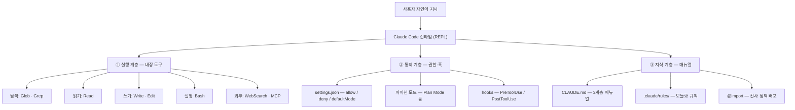
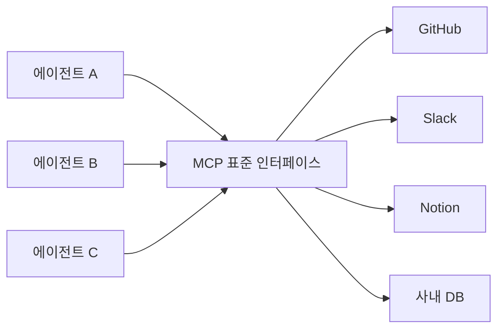
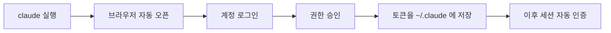

AI 코딩 도구를 비교할 때 흔히 쓰는 축은 성능이다. 어느 모델이 더 정확한가, 어느 제품이 더 빠른가. 그런데 이 축으로는 도구를 바꿀 때 조직에서 실제로 벌어지는 일이 설명되지 않는다 — 정확도가 올랐다고 해서 권한 정책을 새로 써야 할 이유는 없기 때문이다.

설명력이 있는 축은 하나 더 있다. **자율성**이다. 사람이 매 단계를 지시하느냐, 목표만 주고 중간 단계를 도구가 결정하느냐. 이 축이 바뀌는 순간 도구는 편집기에서 행위자가 되고, 행위자에게는 권한 경계가 필요해진다. 이 글은 그 축으로 세대를 가르고, 설치 단계에서 이미 조직 비용 사고가 잠복해 있다는 것까지 본다.

> 이 시리즈는 **원 자료 기준(2026-04)** 정리다. 제품 사양·수치·화면은 그 시점의 것이며, 아래 각주에 어떤 값이 시점에 묶여 있는지 항목별로 적었다.

## 용어 정리

이 시리즈 전체에서 반복되는 용어를 먼저 정리한다.

### 기본 개념

| 용어 | 풀이 |
|---|---|
| CLI (Command Line Interface) | 명령줄 인터페이스. GUI(마우스) 대신 텍스트 명령으로 프로그램을 조작하는 방식 |
| 터미널 네이티브 | 특정 IDE에 의존하지 않고 터미널을 기본 실행 환경으로 삼는 방식. OS·에디터 종속성이 없다 |
| REPL (Read-Eval-Print Loop) | 입력을 읽고(Read) 즉시 실행해(Eval) 결과를 출력하는(Print) 반복 환경. `claude` 실행 후 나타나는 `>` 프롬프트 화면 |
| 에이전틱 코딩 (Agentic Coding) | AI가 매 단계 지시를 기다리지 않고 스스로 계획·실행·검증하는 코딩 방식 |
| While True 루프 | 목표 달성까지 계획→실행→평가→수정을 자동 반복하는 에이전트의 동작 원리 |
| 멀티에이전트 (Multi-Agent) | 리드 에이전트가 작업을 분배하고 전문 에이전트들이 각 영역을 담당하는 분업 구조 |

### 컨텍스트·모델

| 용어 | 풀이 |
|---|---|
| 토큰 (Token) | 모델이 텍스트를 처리하는 최소 단위. 대략 한글 1자 ≈ 1토큰 안팎, 영어 1단어 ≈ 1.3토큰 수준으로 환산된다 |
| 컨텍스트 윈도우 | 모델이 한 세션에서 동시에 기억·처리할 수 있는 토큰의 최대량. 초과하면 앞부분이 밀려나며 품질이 떨어진다 |
| 컨텍스트 조기 소진 | 불필요한 파일을 과다 로드해 세션 후반부에 쓸 토큰이 남지 않는 상태. 에이전트 운영의 대표적 실패 모드 |
| 800줄 한계 | 규칙 문서 1개 파일의 권장 상한. 초과 시 모듈 분리를 권고하는 운영 기준 |

### 권한·거버넌스

| 용어 | 풀이 |
|---|---|
| 퍼미션 모드 (Permission Mode) | 에이전트가 파일시스템·명령어를 어느 범위까지 쓸 수 있는지 정하는 실행 모드 |
| Plan Mode | 파일을 수정하지 않고 읽기 전용으로만 동작하며 실행 계획을 먼저 제시하도록 강제하는 모드 |
| allowlist / denylist | 허용 목록 / 차단 목록. 화이트리스트·블랙리스트와 같은 뜻 |
| defaultMode | allow·deny 어디에도 걸리지 않은 도구를 어떻게 처리할지 정하는 기본 정책 |
| enforcement | 규칙을 문서로 "쓰는" 데 그치지 않고 시스템이 물리적으로 강제하는 것 |
| 최소 권한 원칙 (Least Privilege) | 업무에 필요한 최소한의 권한만 부여하는 보안 원칙 |
| hooks | 특정 이벤트(도구 실행 전·후, 세션 시작 등)에 자동 실행되는 스크립트. 검증·감사 게이트로 쓴다 |
| SDD (Spec-Driven Development) | 코드 작성 전에 스펙 문서(`spec.md`)를 먼저 쓰고 검토한 뒤 구현하는 개발 패턴 |

### 연동·설치

| 용어 | 풀이 |
|---|---|
| MCP (Model Context Protocol) | AI와 외부 도구·서비스 간 통신 표준 프로토콜. 커넥터 하나로 여러 에이전트가 같은 시스템에 붙는다 |
| OAuth (Open Authorization) | 비밀번호를 직접 넘기지 않고 "특정 서비스에 접근 권한을 부여"하는 표준 인증 방식 |
| 환경 변수 | OS에 저장된 설정 값. `ANTHROPIC_API_KEY`처럼 프로그램이 시작할 때 읽어가는 값 |
| PATH | OS가 실행 파일을 찾는 폴더 목록. 설치 후 터미널 재시작이 필요한 이유 |
| npm / nvm | Node 패키지 관리자 / Node 버전 관리자. 글로벌 설치 권한 오류를 피할 때 nvm을 쓴다 |
| WSL2 (Windows Subsystem for Linux 2) | Windows 안에서 Linux 환경을 실행하는 기능 |
| SWE-bench | 실제 오픈소스 버그를 자동 수정하는 능력을 재는 벤치마크 |

## 세 축으로 갈라져 있다는 것이 설계의 핵심

Claude Code는 크게 **① 실행 계층(도구) · ② 통제 계층(권한·훅) · ③ 지식 계층(매뉴얼)** 세 축으로 구성된다. 이 세 축이 분리돼 있다는 점이 이 도구의 설계 핵심이다.



분리가 왜 핵심인지는 관리 주체를 대입해 보면 드러난다. 세 축은 서로 다른 사람이 만지는 자산이다 — 실행 계층은 제품이 주는 것이고, 통제 계층은 보안·플랫폼 조직이 정하며, 지식 계층은 팀 리드가 쓴다. 축이 섞여 있었다면 권한 정책을 바꾸려고 매뉴얼을 고쳐야 하는 상황이 생긴다.

실행 흐름은 아래와 같다. 도구 호출 하나하나가 **권한 게이트를 통과해야만** 실제 시스템에 도달한다.


이 그림에서 리더가 봐야 할 지점은 두 곳이다.

- **C~E 구간**: 선언형 정책. JSON 한 파일로 조직 전체에 동일 규칙을 배포할 수 있다.
- **F·H 구간**: 절차형 검증. 시간·조건 등 패턴 문법으로 못 쓰는 규칙을 스크립트로 구현한다.

두 구간의 차이가 나중에 통제 설계 전체를 가른다. 선언형은 싸고 일괄 배포되지만 표현력이 낮고, 절차형은 무엇이든 쓸 수 있지만 스크립트를 유지보수해야 한다. [settings.json과 훅 편](/blog/agentic-coding/settings-permissions-deny/)이 이 두 구간을 각각 1차·2차 방어선으로 나눠 다룬다.

## 세대를 가르는 변수는 자율성 하나다

| 세대 | 시기 | 비유 | 동작 방식 | 사람의 역할 |
|---|---|---|---|---|
| 1세대 | 2021 | 받아쓰기 인턴 | 타이핑 중 다음 줄 자동완성 | 코드 작성자 |
| 2세대 | 2023 | 상담사 | 물어보면 답하는 대화형 편집 | 질문자·검토자 |
| 3세대 | 2025~ | 신입사원 | 목표만 주면 계획·실행·검증을 자율 수행 | 목표 설정자·감독자 |

핵심 변수는 **자율성**이다. 1·2세대는 사람이 매 단계 지시했지만, 3세대는 최종 목표를 향한 중간 단계를 에이전트가 스스로 결정한다.

> **오른쪽 끝 열이 이 표의 결론이다.**
>
> 세대가 바뀔 때 실제로 바뀌는 것은 도구의 성능이 아니라 **사람의 직무**다. 코드 작성자에서 검토자로, 검토자에서 목표 설정자로 옮겨간다. 도구 도입을 성능 개선 과제로 기안하면 이 열이 논의에서 빠지고, 그러면 "잘 쓰는 사람과 못 쓰는 사람"의 편차가 왜 벌어지는지 설명할 수 없게 된다. 편차는 숙련도가 아니라 **직무 전환을 했는가**에서 나온다.

### 에이전틱 코딩의 네 가지 특성

| 특성 | 의미 | 조직 운영상의 함의 |
|---|---|---|
| 자율성 | 프롬프트를 기다리지 않고 다음 단계를 스스로 진행 | 지시 단위가 "코드"가 아니라 "목표"로 올라간다 |
| 도구 사용 | 파일 읽기·명령 실행·웹 검색 등 외부 행동 수행 | 권한 경계를 반드시 설계해야 한다 |
| 맥락 이해 | 프로젝트 전체 구조·규칙을 읽고 반영 | 규칙 문서(CLAUDE.md)가 산출물 품질을 좌우한다 |
| 멀티스텝 | 계획→실행→평가→수정을 반복 | 중간 산출물 검증 지점을 어디에 둘지가 설계 과제 |

오른쪽 열 네 줄 중 아래 셋이 이 시리즈의 남은 세 편으로 그대로 이어진다. 권한 경계는 [settings.json 편](/blog/agentic-coding/settings-permissions-deny/), 규칙 문서는 [CLAUDE.md enforcement 편](/blog/agentic-coding/claude-md-enforcement/), 검증 지점 설계는 [내장 도구와 지시 패턴 편](/blog/agentic-coding/builtin-tools-attack-surface/)이다. 첫 행(자율성)만 별도 편이 없는데, 지시 단위가 목표로 올라간다는 것은 나머지 셋의 전제이지 따로 푸는 숙제가 아니기 때문이다. 특성 하나하나가 숙제를 남긴다는 것이 3세대 도구 도입이 설치 가이드로 끝나지 않는 이유다.

### 도구 비교 — Copilot vs Cursor vs Claude Code

> 아래 비교는 **원 자료 기준(2026-04)** 서술이다. 제품은 빠르게 바뀌므로 각 항목은 그 시점의 스냅숏으로 읽어야 한다.

| 항목 | GitHub Copilot | Cursor | Claude Code |
|---|---|---|---|
| 세대 | 1세대 (자동완성) | 2세대 (대화형 IDE) | 3세대 (에이전틱) |
| 실행 환경 | IDE 플러그인 | 전용 IDE (VS Code 포크) | 터미널 네이티브 |
| 주 사용 방식 | 인라인 제안 수락 | 채팅·인라인 편집 | 목표 지시 후 자율 실행 |
| 자율 실행 | 없음 | 제한적 | 다단계 계획·실행 |
| 명령 실행 권한 | 없음 | 제한적 | 있음 (권한 통제 필수) |
| 외부 시스템 연동 | 제한적 | 제한적 | MCP 표준 커넥터 |
| 감사 가능성 | 낮음 | 중간 | 높음 (모든 도구 호출이 터미널에 노출) |

일곱 행 중 마지막 두 행이 조직 도입 심사에서 실제로 쟁점이 되는 자리다. 앞 다섯 행은 개인 생산성 이야기지만 연동과 감사 가능성은 보안 심사 항목이라서다.

### 터미널 네이티브가 단점이 아니라 강점인 이유

| 관점 | 설명 |
|---|---|
| 환경 독립성 | IDE·OS에 종속되지 않는다. 서버·컨테이너·CI 환경에서도 동일하게 동작 |
| 투명성 | 모든 도구 호출과 명령이 화면에 그대로 표시돼 감사·재현이 쉽다 |
| 자동화 친화 | 스크립트·파이프라인에 그대로 끼워 넣을 수 있다 |
| 진입장벽 | 터미널 명령을 외울 필요는 없다. 자연어로 지시하면 에이전트가 명령을 구성한다 |

네 관점 중 앞의 셋은 같은 성질의 다른 얼굴이다. **UI를 갖지 않았다는 것**이 환경 독립성·투명성·자동화 친화성을 동시에 만든다. 마지막 행은 앞의 셋과 성격이 다르다 — 이점이 아니라 예상되는 반론에 대한 답이고, 실제로 터미널 도구 도입 논의에서 가장 먼저 나오는 우려가 여기다.

### MCP — 공통 사원증

MCP는 에이전트가 외부 서비스에 붙는 방식을 표준화한 프로토콜이다. 커넥터를 서비스별·에이전트별로 중복 구현하지 않아도 된다는 것이 실무상 이점이다.



조직 운영 관점에서 중요한 것은 연동 자체가 아니라 **MCP 서버 단위로 접근을 켜고 끌 수 있다**는 점이다. 원 자료가 표준화의 이점을 둘로 든다는 데 주목할 만하다 — 앞 문단의 중복 구현 회피는 **만드는 쪽**의 이점이고, 이쪽은 **통제 지점이 하나로 모인다**는 **운영 쪽**의 이점이다. 서비스별로 커넥터를 따로 짰다면 차단 스위치도 커넥터 수만큼 흩어지지만, 표준 인터페이스를 통과하면 서버 목록 한 곳에서 켜고 끌 수 있다. 이것이 [settings.json 편](/blog/agentic-coding/settings-permissions-deny/)의 이중 잠금 원칙으로 이어진다.

### 시장 지표 (원 자료 인용 수치)

> 아래는 **원 자료가 인용한 수치**다. 출처와 기준일이 원 자료 시점(2026-04)이며 값마다 검증 주체가 제각각이라, 개별 숫자를 확정값으로 쓰기보다 "이런 지표로 비교된다"는 프레임으로 읽는 편이 맞다.

| 지표 | 원 자료 인용값 | 비고 |
|---|---|---|
| SWE-bench 스코어 | 80.8% | 실제 버그 수정 능력 벤치마크 |
| 컨텍스트 윈도우 | 1M 토큰 | 원 자료 표현으로 약 75만 단어 규모 |
| MCP 커넥터 수 | 75개 이상 | 프로토콜 생태계 규모 |
| ARR | $2.5B | Anthropic 기준 (2026년 초) |

네 값의 성격이 서로 다르다는 점을 구분해 두는 편이 좋다. 첫 행은 벤치마크 점수, 둘째는 제품 사양, 셋째는 생태계 규모, 넷째는 기업 재무 지표다. 넷을 한 표에 모으면 "이 도구가 앞선다"는 하나의 주장처럼 읽히지만, 실제로는 서로 다른 네 가지를 재고 있고 검증 경로도 각각 다르다.

## 도입 3단계 — 설치·인증과 자격증명 경계

설치 자체는 명령 한 줄이지만, **인증 우선순위**는 조직 비용 통제와 직결되므로 리더가 알아야 한다.


### 환경 요건

| 항목 | 요건 | 비고 |
|---|---|---|
| macOS | 13.0 (Ventura) 이상 | 기본 터미널 사용 |
| Linux | Ubuntu 20.04 이상 | — |
| Windows | WSL2 필수 | PowerShell·cmd 직접 실행은 지원되지 않음 (원 자료 기준 2026-04) |
| Node.js | 네이티브 인스톨러 사용 시 불필요 | npm 방식만 Node 18+ 필요 |
| 하드웨어 | RAM 4GB·디스크 500MB 이상 | — |
| 네트워크 | 상시 연결 필요 | 사내 방화벽이 인증 도메인을 막는 사례 있음 |

마지막 행이 조직 배포에서 실제로 발목을 잡는 자리다. 앞의 다섯은 개인이 확인하고 끝나지만 방화벽 정책은 개인이 못 고친다.

### 설치 방식 두 가지

```bash
# 방식 A — 네이티브 인스톨러 (원 자료 기준 2026-04 권장)
curl -fsSL https://claude.ai/install.sh | bash

# 방식 B — npm 글로벌 설치
npm install -g @anthropic-ai/claude-code
```

| 비교 항목 | 네이티브 인스톨러 | npm 설치 |
|---|---|---|
| Node.js 의존 | 불필요 | 18+ 필요 |
| 자동 업데이트 | 지원 | 수동 |
| 권한 오류 | 거의 없음 | EACCES 빈발 |
| 권장 상황 | 일반 사용자 전반 | 이미 Node 생태계를 쓰는 개발자 |

- **`sudo npm install -g` 금지.** 보안 위험이 있고, 이후 업데이트마다 권한이 꼬인다. 권한 오류 시에는 네이티브 인스톨러로 전환하거나 nvm으로 Node를 재설치한다.
- 설치 후에는 **터미널을 닫고 새로 연다.** PATH 변경이 반영되지 않아 `command not found`가 나는 사례가 가장 흔하다.

### 인증 — 우선순위가 곧 비용 통제



인증 소스에는 우선순위가 있고, 이 순서를 모르면 **구독을 결제해놓고 API 크레딧이 소진되는** 사고가 난다.

| 순위 | 인증 소스 | 특징 |
|---|---|---|
| 1 | `ANTHROPIC_API_KEY` 환경 변수 | 설정돼 있으면 무조건 우선 사용. 사용량이 API 과금으로 청구됨 |
| 2 | OAuth 구독 토큰 | 브라우저 로그인으로 발급. 구독 한도 내에서 사용 |
| 3 | 기타 인증 토큰 | — |

```bash
# 구독 사용자인데 인증 실패·잔액 부족 에러가 날 때 먼저 확인할 것
echo $ANTHROPIC_API_KEY     # 값이 있으면 API 키가 우선 사용되고 있다
unset ANTHROPIC_API_KEY     # 제거하면 구독 토큰이 동작한다
```

> **조직 관점 시사점**
>
> 팀에 도구를 배포할 때 "설치 가이드"만 주면 안 된다.
>
> 개인 API 키가 환경 변수에 남아 있는 구성원이 있으면 조직 구독과 무관하게 개별 과금이 발생한다.
>
> 온보딩 체크리스트에 `echo $ANTHROPIC_API_KEY` 확인 절차를 넣는 것이 실질적인 비용 통제다.

이 사고가 조용히 일어난다는 점이 고약하다. 도구는 정상 동작하고 에러도 나지 않는다. 구성원 입장에서는 아무 이상이 없고, 청구서가 도착해야 드러난다. **환경 변수의 우선순위가 곧 과금 경로**라는 사실이 설치 문서가 아니라 재무 문서에 적혀 있어야 할 내용인 이유다.

### 트러블슈팅 5종

| 증상 | 원인 | 대응 |
|---|---|---|
| `command not found: claude` | PATH 미반영 | 터미널 재시작. 그래도 안 되면 `which claude`로 설치 여부 확인 |
| `EACCES: permission denied` | npm 글로벌 설치 권한 | 네이티브 인스톨러로 전환하거나 nvm 사용. sudo 금지 |
| Node.js 버전 부족 | npm 방식의 Node 18 미만 | 네이티브 인스톨러 전환 또는 nvm으로 Node 20 설치 |
| OAuth 인증 실패 | 사내 방화벽·VPN이 인증 도메인 차단 | 네트워크 전환 후 재시도, VPN 일시 해제 |
| Windows에서 미동작 | PowerShell·cmd에서 실행 | WSL2 Ubuntu 환경에서 실행 |

다섯 중 둘(2·3행)만 npm 설치 방식에서 나오고 나머지 셋은 설치 방식과 무관하다. [앞 편](/blog/agentic-coding/reversibility-before-permission/)의 실패 모드 3분류에 얹으면 1행이 **PATH 미등록**, 2·4행이 **권한·인증**에 해당한다 — 도구가 바뀌어도 분류가 재사용된다는 것이 여기서 확인된다. 3·5행은 그 셋에 들어가지 않는데, 런타임 버전과 실행 환경은 진단할 대상이 아니라 앞의 환경 요건 표로 돌아가야 하는 항목이기 때문이다.

---

여기까지가 "이 도구가 무엇이고 어떻게 켜는가"다. 자율성이 세대를 가르고, 자율성이 있으면 도구를 쓰며, 도구를 쓰면 권한이 필요하다.

그러면 그 도구가 정확히 무엇인지 봐야 한다. [다음 편](/blog/agentic-coding/builtin-tools-attack-surface/)에서 내장 도구 일곱 개를 하나씩 열고, 그 목록이 왜 그대로 공격 표면 목록이 되는지, 그리고 즉시 실행의 부작용을 막는 네 가지 지시 패턴을 본다.

---

**인용 조건**

- 이 시리즈의 제품 사양·수치는 **원 자료 기준 2026-04**이다. 단축키·설정 키·경로를 포함한 세부 사양은 버전에 따라 바뀐다.
- 본문의 **SWE-bench 80.8% · MCP 커넥터 75+ · ARR $2.5B · 컨텍스트 1M 토큰**은 원 자료가 2026년 4월 기준으로 인용한 값이다. 기준일과 함께 읽어야 하며, 기준일을 뗀 단정값으로 쓸 수 없다.
- **Windows에서 WSL2 필수**는 **원 자료 기준(2026-04)** 서술이며 제품 버전에 따라 달라질 수 있다.
- 본문에 등장하는 정책·설정 예시는 원 자료의 교육용 예시이며 특정 조직의 실제 운영 사례가 아니다.
