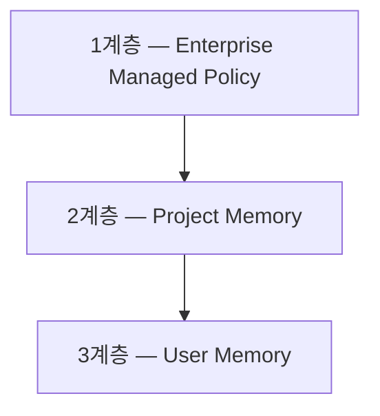
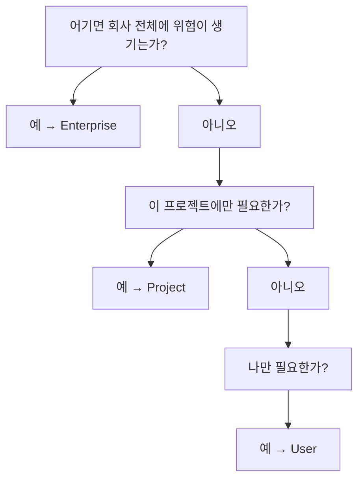
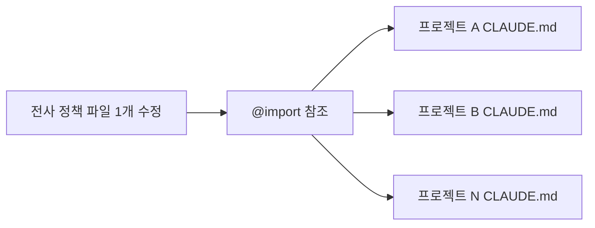

조직에서 규칙 문서가 실패하는 방식은 대체로 같다. 문서는 잘 쓰였고 공유도 됐는데 지켜지지 않는다. 그러면 문서를 더 잘 쓰려는 시도가 이어지고, 더 잘 쓴 문서도 같은 이유로 지켜지지 않는다.

에이전트 규약에서는 이 문제가 더 선명하게 드러난다. 규약 파일은 모델이 읽고 따르는 문서이므로 **모델이 어길 수 있고**, 개인이 자기 설정으로 무력화할 수도 있다. 이 글은 그 두 구멍을 막는 구조 — 규칙을 개인이 고칠 수 없는 곳에 두는 3계층, 그리고 사용자의 권한 추가를 차단하는 한 줄 — 를 본다.

> 이 글의 제품 사양(설정 키·시스템 경로·권장 상한·동작 한계)은 **원 자료 기준(2026-04)** 이다. 키 이름·경로는 물론 800줄 권장 상한과 `@import` 재귀 깊이 같은 값도 버전·OS에 따라 바뀐다.

## 용어 정리

[앞 편들](/blog/agentic-coding/claude-code-autonomy-tiers/)의 용어표에서 이 글이 쓰는 행만 추렸다.

| 용어 | 풀이 |
|---|---|
| CLAUDE.md | 프로젝트·개인·조직 단위로 에이전트에 지속 지시를 주는 규약 파일. 구성 요소와 작성 원칙은 [규약 편](/blog/agentic-coding/reversibility-before-permission/) |
| enforcement | 규칙을 문서로 "쓰는" 데 그치지 않고 시스템이 물리적으로 강제하는 것 |
| defaultMode | allow·deny 어디에도 걸리지 않은 도구를 어떻게 처리할지 정하는 기본 정책 |
| 800줄 한계 | 규칙 문서 1개 파일의 권장 상한. 초과 시 모듈 분리를 권고하는 운영 기준 |
| 컨텍스트 윈도우 | 모델이 한 세션에서 동시에 기억·처리할 수 있는 토큰의 최대량 |
| MCP (Model Context Protocol) | AI와 외부 도구·서비스 간 통신 표준 프로토콜. 서버 단위로 접근을 켜고 끌 수 있다 |
| 최소 권한 원칙 (Least Privilege) | 업무에 필요한 최소한의 권한만 부여하는 보안 원칙 |

## 3계층 거버넌스 — 개인 메모에서 조직 헌법으로



| 계층 | 경로 | 관리 주체 | 공유 범위 | 담는 내용 |
|---|---|---|---|---|
| Enterprise | OS 시스템 경로 (아래 표) | IT·보안팀 | 전사 | 전사 보안 정책, 법무·컴플라이언스, 절대 금지 명령, 브랜드 가이드 |
| Project | `./CLAUDE.md` 또는 `./.claude/CLAUDE.md` | 팀 리드 | 팀 (Git 커밋) | 기술 스택, 코딩 컨벤션, 배포 절차, 아키텍처 결정 |
| User | `~/.claude/CLAUDE.md` | 개인 | 본인만 | 개인 언어 설정, 선호 출력 형식, 개인 워크플로 |

Enterprise 계층의 OS별 배포 경로는 아래와 같다.

| OS | 경로 |
|---|---|
| macOS | `/Library/Application Support/ClaudeCode/CLAUDE.md` |
| Linux | `/etc/claude-code/CLAUDE.md` |
| Windows | `C:\ProgramData\ClaudeCode\CLAUDE.md` |

세 경로의 공통점은 **모두 시스템 관리자 권한이 필요한 위치**라는 것이다. 일반 사용자가 파일을 만들거나 고칠 수 없다. 이것이 기술적 enforcement의 기반이다.

- macOS는 `~/Library`(개인)가 아니라 `/Library`(시스템 전체).
- Windows는 `C:\Users\...\AppData`(사용자별)가 아니라 `C:\ProgramData`(전체 사용자 공통).

> **경로 선택이 정책 선언보다 강하다.**
>
> 두 항목이 말하는 것은 디렉터리 관습이 아니라 **누가 이 파일을 고칠 수 있는가**다. 개인 영역에 둔 전사 정책은 개인이 지울 수 있으므로 아무리 강한 문장을 써도 권고에 머무르고, 시스템 영역에 둔 정책은 문장이 평범해도 강제된다. 규칙의 강제력은 규칙의 내용이 아니라 **파일이 놓인 위치**에서 나온다.

### 자동 머지와 우선순위

Claude Code는 시작 시 세 파일을 모두 읽고 자동 병합한다. 개발자가 별도로 설정할 필요가 없다. 충돌하면 **Enterprise가 항상 이긴다.**

| 상황 | 결과 |
|---|---|
| Enterprise "프로덕션 DB 직접 접근 금지" + Project "긴급 시 허용" | Enterprise 규칙 적용. Project 규칙 무시 |
| Project "함수형 컴포넌트만" + User "클래스형 선호" | Project 규칙 적용 |

100명 조직에서 한 명이 실수로 프로젝트 파일에 위험한 설정을 넣어도 전사 정책이 차단한다. **매뉴얼이 아니라 시스템이 보호한다**는 것이 이 구조의 요점이다.

첫 행이 특히 중요한 사례다. Project 쪽 문장("긴급 시 허용")은 악의가 아니라 **현장의 정당한 요구**이고, 대개 이런 예외가 사고 경로가 된다. 계층 우선순위가 없으면 이 예외는 협상으로 결정되고, 협상은 긴급한 쪽이 이긴다. 우선순위를 시스템에 박아 두는 것은 그 협상 자체를 없애는 조치다.

### 계층 배치 결정 기준



| 계층 | 예시 |
|---|---|
| Enterprise | 내부 API 키 하드코딩 금지 / 개인정보 외부 API 전송 금지 / `rm -rf /` 등 절대 금지 명령 / 브랜드 가이드라인 |
| Project | 사용 프레임워크·버전 / 팀 코딩 컨벤션 / 배포 절차(스테이징 후 24시간) / 아키텍처 결정 |
| User | 응답 언어 설정 / 선호 출력 형식 / 개인 단축 워크플로 |

세 질문의 순서가 뒤집히면 안 된다는 점이 이 도식의 요점이다. "나만 필요한가"부터 물으면 대부분의 규칙이 개인 계층으로 내려가고, 위험도부터 물으면 올라간다. **기본값이 어느 방향인가**가 계층 설계의 실질이고, 위험 질문을 맨 앞에 두는 것은 애매한 규칙을 위쪽으로 미는 선택이다.

## enforcement 플래그 — 한 줄이 규칙과 강제된 규칙을 가른다

전사 정책의 실효성을 결정하는 단 하나의 키가 있다.

```json
{
  "allowManagedPermissionRulesOnly": true,
  "permissions": {
    "deny": [
      "Bash(rm -rf *)",
      "WebFetch(.*internal.*)",
      "Edit(.env*)"
    ],
    "allow": [
      "Bash(npm *)",
      "Read(*.md)"
    ]
  }
}
```

| 값 | 동작 |
|---|---|
| `false` (기본) | 개발자가 자기 settings.json에 `allow`를 추가할 수 있다. 관리자가 막지 않은 것을 스스로 허용 가능 |
| `true` | 사용자의 `allow` 규칙 추가·변경이 완전히 차단된다. 관리자가 정의한 목록만 유효 |

이 한 줄의 유무가 "규칙"과 "강제된 규칙"을 가른다. 비유하면 **허용 목록은 관리자만 열 수 있는 잠긴 서랍**이다.

| 사용자 수정 가능 | 사용자 수정 불가 (Enterprise Lock) |
|---|---|
| `~/.claude/settings.json` (개인 기본값) | `managed-settings.json`에 정의된 모든 항목 |
| `.claude/settings.local.json` (gitignored) | `allowManagedPermissionRulesOnly: true` 상태의 `allow` 규칙 |
| CLI 플래그 (세션 중에만) | `permissions.deny` 목록 항목 |
| `.claude/settings.json` (팀 합의 필요) | Enterprise CLAUDE.md 전체 내용 |

기본값이 `false`라는 사실이 실무에서 가장 중요한 정보다. 전사 정책 파일을 시스템 경로에 배포하고 deny 목록까지 채워도, 이 키를 켜지 않으면 개발자가 자기 설정에 allow 한 줄을 더해 우회할 수 있다. [앞 편](/blog/agentic-coding/settings-permissions-deny/)에서 본 "deny가 항상 이긴다"는 명시적으로 막은 것에만 적용되며, **막지 않은 것을 스스로 허용하는 경로**는 별도로 닫아야 한다.

## `.claude/rules/` — 800줄 한계와 모듈화

에이전트를 하나 추가할 때마다 규칙이 수십 줄씩 늘어난다. 30개 에이전트면 1,500줄이 된다. 파일 하나가 그 크기가 되면 컨텍스트 윈도우를 잡아먹고 시스템이 무너진다. 권장 상한은 **파일당 800줄**이다.

```
프로젝트/
├── CLAUDE.md                    # 핵심 + @import
└── .claude/
    ├── settings.json            # 팀 공유 설정
    ├── settings.local.json      # 로컬 전용 (gitignored)
    └── rules/
        ├── coding-standards.md  # 코딩 컨벤션
        ├── deployment.md        # 배포 절차
        ├── security.md          # 보안 규칙
        └── never-do-xxx.md      # 자동 생성 Never-Do 패턴
```

규칙 파일 분류의 3축은 다음과 같다.

| 축 | 내용 | 예시 |
|---|---|---|
| 도메인별 | 특정 도구·서비스 사용법 | 이메일 발송 규칙, 브라우저 자동화 라우팅 |
| 에이전트별 | 각 에이전트의 호출 조건·연계 방식 | 아키텍처 에이전트 트리거, 컴플라이언스 체커 트리거 |
| Never-Do 패턴 | 반복된 실수를 금지 규칙으로 고정 | `never-do-*.md` — 훅이 자동 생성 |

**Never-Do 패턴의 자동 생성**이 특히 주목할 만하다. 에이전트가 같은 실수를 2회 이상 반복하면 훅이 규칙 파일을 자동으로 만들어 "다시는 이 패턴으로 작성하지 마라"를 명시한다. 사람의 코드리뷰 결과가 자동으로 규칙 자산이 되는 구조다.

> **세 축 중 마지막 하나만 사후에 자란다.**
>
> 도메인별·에이전트별 규칙은 사람이 앞서서 설계하는 것이고, Never-Do는 **실패가 발생한 뒤에 생긴다.** 사람이 총량을 정하지 않는 축이 이것 하나라는 뜻이다.
>
> 다만 800줄 상한을 직접 밀어올리는 것으로 원 자료가 지목한 것은 **에이전트별 축**이다 — 에이전트 하나에 수십 줄, 30개면 1,500줄이 된다. 설계로 늘어나는 축과 사후에 자동으로 늘어나는 축이 따로 있으니, 모듈 분리는 어느 쪽에서 보든 필수가 된다.

### FRONTMATTER — 선택적 로드

```yaml
---
paths:
  - "**/*.ts"
  - "**/*.tsx"
---
# TypeScript 코딩 규칙
- 모든 컴포넌트는 함수형으로 작성한다
- 타입 단언(as) 사용을 금지한다
```

`paths` 필드를 지정하면 해당 파일 패턴을 다룰 때만 규칙이 로드된다. 30개 에이전트 규칙을 전부 올리지 않고 현재 작업과 관련된 것만 선택적으로 올린다 — **컨텍스트 효율성 설계**다.

`.claude/rules/*.md`는 별도 import 선언 없이도 자동 발견·로드된다.

이 설계가 [내장 도구 편](/blog/agentic-coding/builtin-tools-attack-surface/)의 "덜 참조하고 더 정확하게" 원칙과 같은 문제를 반대편에서 푼다. 그쪽은 사람이 세션마다 무엇을 넣을지 고르는 방식이고, 이쪽은 **조건을 미리 걸어 두고 자동으로 골라지게** 하는 방식이다. 규칙처럼 재사용되는 자산에는 후자가 맞는다 — 매번 사람이 고르게 하면 결국 안 고른다.

### `@import` — 선언형 거버넌스

```markdown
# 이 프로젝트의 CLAUDE.md
@~/company-docs/security-policy.md
@~/company-docs/brand-guidelines.md
@~/company-docs/legal-compliance.md

## 이 프로젝트 고유 설정
- 이 프로젝트는 Next.js 15를 사용합니다.
- API는 RESTful 원칙을 따릅니다.
```

| 특성 | 동작 |
|---|---|
| 재귀 깊이 | 최대 5단계 (A→B→C→D→E). 무한 루프 방지 |
| 순환 참조 | 자동 감지 후 중단 (A→B→A 방지) |
| 비존재 파일 | 오류 없이 무시하고 건너뜀 |
| 배포 효과 | 공통 정책 파일 1개를 고치면 이를 import한 모든 프로젝트에 자동 반영 |



세 번째 행이 조용한 함정이다. 존재하지 않는 파일을 참조해도 오류가 나지 않으므로, 경로 오타 하나로 전사 보안 정책이 **아무 경고 없이 빠진 채** 동작한다. 배포 효과가 큰 만큼 실패도 조용히 전파되고, 그래서 `@import` 경로는 배포 후 실제 로드 여부를 확인하는 절차가 따로 있어야 한다.

### 개인 관점 vs 조직 관점

| 영역 | 개인 관점 | 조직 관점 |
|---|---|---|
| CLAUDE.md 활용 | 내 선호도 기록 | 조직 공통 업무 매뉴얼 |
| 계층 | 1개 (개인 설정만) | 3개 (Enterprise / Project / User) |
| rules/ | 미사용 | 모듈화된 규칙 다수 |
| 권한 | 기본값 | `managed-settings.json` 강제 적용 |
| 확장 | 1인 1프로젝트 | 다수 에이전트가 동시 참조 |
| 거버넌스 | 위시리스트 | enforcement (사용자 override 차단) |

조직 거버넌스가 성립하려면 아래 네 가지가 **모두** 있어야 한다.

1. Enterprise Managed Policy를 시스템 경로에 배포 (관리자만 수정 가능)
2. `allowManagedPermissionRulesOnly: true`로 사용자 권한 추가 차단
3. `.claude/rules/` 모듈화로 규칙을 유지보수 가능한 형태로 관리
4. `@import`로 전사 정책을 모든 프로젝트에 자동 배포

네 조건이 "모두"인 이유는 각각이 다른 구멍을 막기 때문이다. 1번이 없으면 정책을 개인이 지우고, 2번이 없으면 스스로 허용하고, 3번이 없으면 규칙이 컨텍스트를 잡아먹어 무시되고, 4번이 없으면 프로젝트마다 정책 버전이 갈린다. 마지막 표의 마지막 행 두 칸이 정확히 이 차이다 — **위시리스트와 enforcement 사이에 있는 것은 의지가 아니라 이 네 가지 설정**이다.

## 조직 적용 — 부서별 권한 정책 설계

리스크가 높은 조직일수록 더 제한적인 `defaultMode`와 더 많은 deny 규칙을 적용한다. 같은 도구를 쓰되 정책은 달라야 한다.

| 팀 | defaultMode | 주요 allow | 주요 deny | 설계 논리 |
|---|---|---|---|---|
| 마케팅 | `denyAll` | 협업 도구 MCP만 | 코드 저장소·클라우드·프로덕션 DB MCP 전체 | 코드 접근 자체가 업무 범위 밖. 화이트리스트가 자연스럽다 |
| 개발 | `allowAll` | 일반 개발 도구 | `rm -rf`, `sudo`, 강제 푸시, 프로덕션 DB | 생산성이 우선. 파괴적 명령만 정밀 차단 |
| 재무 | `ask` | 최소한의 읽기 | 환경 변수 노출, `.env` 읽기, 외부 전송 | 데이터 민감도가 최고. 매 행동을 확인 |

```json
// 마케팅팀 예시 — 이중 잠금 적용
{
  "permissions": {
    "allow": ["mcp__slack__*", "mcp__notion__*"],
    "deny": ["mcp__github__*", "mcp__aws__*", "Bash(rm -rf:*)", "Bash(sudo:*)"],
    "defaultMode": "denyAll"
  },
  "enabledMcpjsonServers": ["slack", "notion"]
}
```

세 팀의 `defaultMode`가 스펙트럼의 세 지점에 각각 놓인다는 점이 이 표의 설계다. 마케팅이 가장 엄격한 값을 받는 것이 직관과 어긋나 보이지만, 오른쪽 열을 보면 이유가 분명하다 — **업무 범위가 좁을수록 화이트리스트가 싸다.** 엄격함의 근거가 위험도만이 아니라 **필요 도구 목록의 길이**이기도 하다는 뜻이고, 그래서 개발팀에는 같은 방식을 적용할 수 없다.

### 도입 로드맵


| 단계 | 내용 | 얻는 것 |
|---|---|---|
| 1 | 새 프로젝트 템플릿에 기본 `settings.json` 포함 (`rm -rf`·`sudo` deny) | 최소 비용으로 가장 큰 사고 방지 |
| 2 | 팀별 `defaultMode`·MCP 접근 분화, 팀 저장소로 공유·PR 리뷰 | 정책이 코드처럼 리뷰·이력 관리됨 |
| 3 | PostToolUse 감사 로그, PreToolUse 조건부 차단 | 사후 추적성 + 사전 전수 검사 |
| 4 | Enterprise 경로 배포 + `allowManagedPermissionRulesOnly: true` | 개인 설정으로 무력화되지 않는 강제력 |

1단계만 해도 실효가 크다. 4단계는 조직 규모와 규제 요구가 있을 때 간다. **전 단계 완수를 전제로 삼을 필요는 없다.**

> 이 도입 로드맵은 **원 자료에 그대로 있는 것이 아니라** 조직 적용을 위해 재구성한 것이다. 단계별 항목의 근거는 본문 각 절에 있으나, 4단계 순서 자체는 원 자료의 서술이 아니다.

## 규칙 문서에서 반복되는 안티패턴 다섯

| 안티패턴 | 왜 문제인가 |
|---|---|
| CLAUDE.md 하나에 모든 규칙을 몰아넣기 | 800줄 초과 시 컨텍스트를 잡아먹고 규칙 자체가 무시된다 |
| 같은 내용을 여러 규칙 파일에 복사 | 수정 시 전부 바꿔야 한다. `@import`로 참조할 것 |
| 분류 체계 없이 규칙 파일 양산 | 파일이 수십 개가 되면 관리 불가 |
| Never-Do 파일 수동 작성 | 훅 기반 자동 생성이 원칙. 수동은 누락된다 |
| enforcement 없이 문서로만 규칙 선언 | 개인이 자기 설정으로 무력화할 수 있다 = 위시리스트 |

앞의 넷은 파일 구조 문제이고 마지막 하나만 층위가 다르다. 앞의 넷을 전부 고쳐 잘 분류되고 잘 참조되는 규칙 체계를 만들어도, 마지막 하나가 남아 있으면 그 체계 전체가 권고다. **순서상 마지막이지만 우선순위로는 첫 번째**다.

같은 안티패턴 목록에 있던 `settings.local.json` 커밋 건은 규칙 문서가 아니라 설정 파일 쪽 문제라 [앞 편](/blog/agentic-coding/settings-permissions-deny/)에서 다뤘다.

## AI 직원을 다루는 마음가짐

| DO | DON'T |
|---|---|
| "어떻게"가 아니라 "무엇을 달성해야 하는가"를 말한다 | 결과 확인 없이 그대로 사용한다 |
| 결과는 항상 검토한다 | 처음부터 크고 복잡한 작업을 통째로 맡긴다 |
| 작은 작업부터 맡기고 신뢰가 쌓이면 위임을 넓힌다 | 무엇을 하는지 모른 채 권한을 승인한다 |
| 반복되는 실수는 규칙 문서로 교정한다 | — |
| 무엇을 허용하는지 이해하고 승인한다 | — |

관점의 전환이 요점이다. **"이 도구 어떻게 써?"(사용법)** 에서 **"어떻게 하면 이 AI가 더 잘 일할까?"(조직 운영)** 로 질문이 바뀐다.

DO 다섯 줄 중 셋(2·3·5행)이 위임 범위를 넓히는 절차를 말한다 — 검토하고, 작게 시작해 넓히고, 이해한 뒤 승인한다. [첫 편](/blog/agentic-coding/reversibility-before-permission/)과 겹쳐 읽을 만한 자리인데, **절차는 같고 판정 기준이 다르다.** 원 자료의 3행은 위임을 넓히는 근거를 「신뢰가 쌓이면」으로 두고, 첫 편은 권한 설계를 신뢰가 아니라 **복구 비용의 함수**로 봤다. 같은 행동을 두 기준 중 무엇으로 정당화하느냐가 갈리는 지점이고, 이 시리즈의 설정과 훅은 그 정당화를 사람의 판단이 아니라 시스템의 판정으로 옮긴 장치였다.

---

여기까지가 도구와 통제다. 무엇을 시킬 수 있고(도구), 어디까지 할 수 있으며(권한·훅), 그 경계를 누가 정하는가(3계층·enforcement)까지 왔다.

남은 축은 확장이다. 내장 도구 일곱 개로 안 되는 일을 붙이는 방법 — MCP로 외부 시스템을 연결하고, 커맨드·스킬·훅으로 절차를 자산화하는 층위가 다음 주제다. 규칙 문서가 세션 시작 비용의 어느 부분을 차지하는지는 [하네스 다섯 구성물](/blog/ai-agent/harness-five-primitives/)에 토큰 단위로 나와 있다.

---

**인용 조건**

- 이 글의 **제품 사양은 원 자료 기준 2026-04**이며 버전·OS에 따라 바뀐다. 설정 키·시스템 경로뿐 아니라 **`800줄` 권장 상한 · `@import` 재귀 깊이 5단계 · 순환 참조와 비존재 파일 처리** 같은 동작 값이 전부 여기 해당한다.
- **마케팅·개발·재무 3팀 정책 예시는 교육용 가상 시나리오**다. 실제 운영 사례가 아니라 설계 예시로 읽어야 한다.
- **도입 로드맵 4단계는 원 자료에 그대로 있는 것이 아니라 재구성한 것**이다. 원 자료의 서술로 인용할 수 없다.
