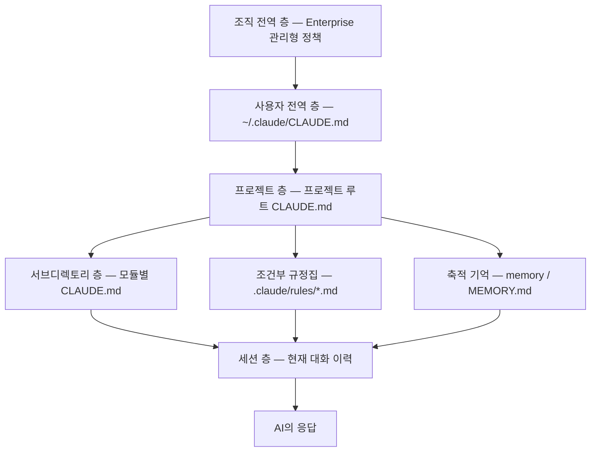
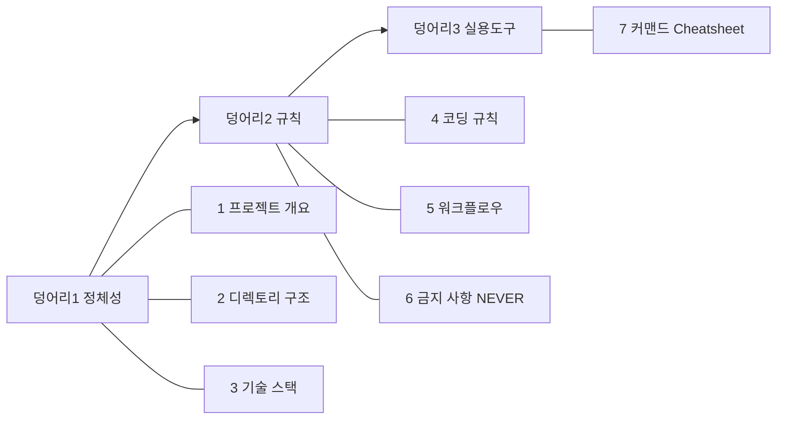

AI에게 팀의 일하는 방식을 알려주는 방법은 두 가지다. 매 대화마다 다시 설명하거나, 한 번 파일에 적어 두고 매 세션이 그것을 읽게 하거나. 앞은 사람마다 다른 결과가 나오고 뒤는 저장소에 커밋되어 리뷰 대상이 된다.

이 시리즈는 뒤쪽을 다룬다. 첫 편인 이 글은 **규칙 파일 자체** — 어디에 두면 어디까지 적용되는지, 얼마나 길게 쓸 수 있는지, 무엇을 어떤 순서로 적는지 — 를 본다. 이어지는 편은 그 파일 주변에 붙는 `.claude/` 구성물과, 세션이 길어질 때 컨텍스트를 관리하는 법을 다룬다.

> 이 글이 옮긴 원 자료의 작성 기준일은 **2026-07-26**이다. 파일 경로·명령 이름·임계값은 그 시점의 것이며 버전에 따라 바뀐다.
>
> 이 글의 예시 프로젝트·수치(고객사 수, 스택 조합, 금지 항목 목록 등)와 빈 템플릿의 내용은 **원 자료의 실습 예제**이며 특정 조직의 실제 운영 사례가 아니다. 개념·용어·판단 프레임 층위에서 읽어야 한다.

## 용어 정리

| 용어 | 정의 |
|---|---|
| **컨텍스트 엔지니어링** | AI가 매 요청에서 참조할 정보를 의도적으로 설계·배치하는 작업. 프롬프트 한 줄이 아니라 파일·계층·세션 전략 전체를 다룬다 |
| **컨텍스트 윈도우** | AI가 한 번에 볼 수 있는 대화의 총량. 토큰 단위로 측정. 비유는 "AI의 업무 책상" |
| **토큰(Token)** | AI가 텍스트를 처리하는 기본 단위. 영어 1토큰 ≈ 4글자, 한국어 1토큰 ≈ 1~2글자 |
| **CLAUDE.md** | 세션 시작 시 자동 로드되는 마크다운 규칙 파일. 조직이 작성해 AI에게 주는 업무 매뉴얼 |
| **Scope(범위)** | CLAUDE.md가 적용되는 계층. Enterprise → Project → User → Local 순 |
| **@import 문법** | CLAUDE.md에서 다른 파일을 참조하는 구문(`@.claude/rules/security.md`). 최대 5단계 재귀 |
| **Rules** | `.claude/rules/*.md`. 상세 규정집. 필요할 때만 참조되어 상시 토큰을 덜 먹는다 |
| **Memory** | `memory/` 또는 `MEMORY.md`. AI가 세션을 넘어 학습한 결정사항·실수 패턴을 축적하는 저장소 |
| **컴팩션(Compaction)** | `/compact`. 대화 이력을 요약 압축해 토큰을 회수하는 동작. 비유는 "업무 인수인계 문서" |
| **`/clear`** | 대화 이력 전체 삭제. CLAUDE.md·memory는 유지. 비유는 "책상 치우기" |
| **`/context`** | 현재 컨텍스트 사용량 분해 표시. 비유는 "책상 위 서류량 체크" |
| **멀티턴 대화** | 여러 번 주고받는 대화. 매 턴마다 이전 이력 전체가 재전송되는 것이 토큰 급증의 원인 |
| **프롬프트 4요소** | 목적(Goal)·맥락(Context)·제약(Constraints)·형식(Format). 지시 품질 체크리스트 |
| **슬래시 커맨드** | `/`로 시작하는 명령. `.claude/commands/*.md`로 커스텀 생성 가능 |
| **`-p` 플래그** | 비대화형(headless) 모드. 한 번 답하고 종료. 스크립트·CI/CD·크론잡의 기본 |
| **`$ARGUMENTS`** | 커스텀 커맨드에서 호출 시 입력값이 주입되는 자리표시자 |
| **Subagent** | 메인 세션이 스폰한 하위 에이전트. 독립 컨텍스트를 갖고 결과 요약만 반환 |
| **MCP** | Model Context Protocol. 외부 도구 연결 규약. 서버가 많을수록 도구 정의만으로 토큰 소모 |
| **session-summary** | 세션 종료 시 생성되는 JSON 인수인계 파일. `next_steps`가 다음 세션의 시작점 |
| **SOP** | Standard Operating Procedure(표준 운영 절차). 구조화 프롬프트 1개 = SOP 1개라는 비유의 근거 |
| **Miller's Law** | 인간은 한 번에 7±2개 정보만 처리한다는 인지 법칙. 7단계를 3덩어리로 묶은 근거 |

이 표는 시리즈 세 편이 공유하는 어휘 전량이다. 이어지는 두 편은 여기서 자기 글이 쓰는 행만 추려 다시 싣는다.

## 정보는 세 층에서 온다

AI가 한 번의 응답을 만들 때 참조하는 정보는 아래 세 층에서 온다. 위로 갈수록 **오래 살아남고 넓게 적용**되며, 아래로 갈수록 **휘발성이 크고 상황에 특화**된다.



핵심은 **"항상 로드되는 것"과 "필요할 때만 로드되는 것"의 분리**다.

| 층 | 로드 시점 | 토큰 비용 | 권장 성격 |
|---|---|---|---|
| CLAUDE.md | 매 세션 시작 시 자동 | 상시 소비 | 짧고 밀도 있게(100~200줄) |
| `.claude/rules/*.md` | 필요 시 명시적 참조 | 참조할 때만 | 길고 상세하게 |
| `memory/` | 새 세션 시작 시 AI가 참조 | 소량 | 결정사항·실수 패턴만 |
| 대화 이력 | 매 턴 전량 재전송 | **가장 큰 소비처** | 관리 대상 1순위 |

네 행 중 위의 셋은 사람이 관리 주기를 정할 수 있고, 맨 아래 대화 이력만 가만히 둬도 저절로 자란다. 그래서 소비량이 가장 큰 항목이 곧 관리 우선순위 1순위가 된다.

## CLAUDE.md가 중요한 이유 — 반복 설명을 끝내는 장치

### 정의와 비유

CLAUDE.md는 세션 시작 시 자동으로 읽히는 마크다운 메모리 파일이다. 내용이 시스템 프롬프트에 주입되어 그 세션의 모든 대화에 영향을 준다.

성격으로 보면 **신입 사원 첫날 받는 팀 위키**에 해당한다. 팀장이 "우리 팀은 이렇게 일해요"라고 정의한 규칙을, AI 직원이 매번 자동으로 읽는다.

효과는 즉각적이고 관찰 가능하다.

| 상황 | AI의 실제 동작 |
|---|---|
| CLAUDE.md 없음 | JWT 토큰으로 인증 구현 — 팀이 세션 기반을 쓰는 걸 모름 |
| CLAUDE.md 있음 | "세션 기반 인증, Redis 스토어" 확인 후 팀 방식대로 구현 |

두 행의 차이는 AI의 능력이 아니라 **AI가 아는 사실의 양**이다. 위 행에서도 코드는 나오고, 다만 팀이 쓰지 않는 방식으로 나온다.

### 4가지 Scope와 우선순위

| Scope | 경로 | 공유 범위 | 우선순위 |
|---|---|---|---|
| Enterprise(관리형) | macOS 기준 `/Library/Application Support/ClaudeCode/CLAUDE.md` | 조직 전체, 사용자 변경 불가 | 최상위 |
| Project | `./CLAUDE.md` 또는 `./.claude/CLAUDE.md` | Git으로 팀 공유 | 중간 |
| User | `~/.claude/CLAUDE.md` | 해당 사용자의 모든 프로젝트 | 낮음 |
| Local | `./CLAUDE.local.md` | 본인의 현재 프로젝트만(gitignore) | 최하위 |

네 줄의 공유 범위가 조직 전체 → 팀 → 개인 → 개인의 한 프로젝트로 좁아지고, 우선순위 열도 최상위 → 중간 → 낮음 → 최하위로 **같은 방향으로** 내려간다. 넓게 공유되는 Scope일수록 등급이 높다.

동작 규칙 세 가지를 구분해야 한다.

- 모든 Scope의 CLAUDE.md는 **override가 아니라 누적(accumulate)** 방식으로 로드된다.
- 지시가 충돌하면 **더 구체적인 Scope가 우선**한다(서브디렉토리 > 프로젝트 > 전역).
- Enterprise Scope만 예외로, 항상 최우선이며 사용자가 무력화할 수 없다.

첫째와 둘째를 한 문장으로 붙이면 이렇게 된다 — 전역 규칙은 사라지지 않고 남아 있으며, 같은 항목을 두고 부딪힐 때만 구체적인 쪽이 이긴다.

> **위 표의 「우선순위」 열과 둘째 규칙의 「더 구체적인 Scope가 우선」은 서로 다른 층위를 말한다 — 이렇게 갈라 읽는 것은 이 글의 정리다.** 표의 열은 Scope 자체의 등급이라 넓게 공유될수록 높고, 둘째 규칙은 지시가 실제로 부딪혔을 때의 적용 순서라 좁을수록 이긴다. 원 자료는 두 서술을 같은 절에 나란히 두되 하나로 묶지 않았다. 둘이 같은 방향을 가리키는 유일한 자리가 Enterprise다 — 등급도 최상위이고, 셋째 규칙에 따라 충돌에서도 항상 이기며 사용자가 무력화할 수 없다.

### 두 메모리 시스템의 분업

| 구분 | CLAUDE.md | MEMORY.md / 자동 메모리 |
|---|---|---|
| 작성 주체 | 사람(팀) | AI가 대화 중 자동 축적 |
| 성격 | 정적 규칙 — "이렇게 해라" | 학습 기록 — "이건 이렇게 됐었다" |
| 예시 | 코딩 컨벤션, 금지 사항, 빌드 명령 | 빌드 실패 원인, 반복된 실수 패턴 |
| 관계 | 상호 보완. 규칙은 CLAUDE.md, 경험은 메모리 |

작성 주체가 다르다는 첫 행이 나머지를 결정한다. 사람이 쓰는 쪽은 미래형 명령이 되고, AI가 쌓는 쪽은 과거형 기록이 된다.

## 200줄 — 하드 리밋이 아니라 준수율 임계

200줄은 하드 리밋이 아니라 **준수율(adherence) 임계**다. 넘어가면 파일이 거부되는 게 아니라, AI가 앞쪽 규칙만 우선시하고 뒤쪽 규칙을 흘리기 시작한다.

| 임계값 | 동작 | 권고 |
|---|---|---|
| 200줄 이하 | 최적 준수율 | 목표치(실무 권장은 80~120줄) |
| 200~500줄 | 준수율 저하 시작 | 모듈화 착수 |
| 40KB 초과 | 도구가 경고 표시 | 즉시 분리 |

이 표가 답하는 질문은 "몇 줄까지 되는가"가 아니라 **"몇 줄부터 규칙이 새기 시작하는가"**다. Anthropic 계열 가이드에서 언급되는 실용 상한은 **"150~200 instruction budget"** 이며, 규칙이 많아질수록 AI가 앞쪽만 본다는 경향이 근거다.

> **수치의 유효 조건.** `200줄`은 규칙 준수율의 임계이며 **하드 리밋이 아니다** — 초과해도 파일은 정상 로드된다. `80~120줄`은 **실무 권장치**이지 규격이 아니다. 원 자료가 이 둘을 인용 가능한 수치로 따로 묶으면서 각각에 붙여 둔 단서다.

### 같은 200줄을 이 카테고리의 다른 글은 「상한」이라 불렀다

이 카테고리의 [되돌릴 수 있어야 권한을 넓힌다](/blog/agentic-coding/reversibility-before-permission/) 편은 규약 파일의 분량 제한을 **「200줄 안팎을 상한으로」** 라고 적었다. 같은 숫자인데 부르는 이름이 다르다.

| 글 | 표현 | 무엇을 말하는가 |
|---|---|---|
| [되돌릴 수 있어야 권한을 넓힌다](/blog/agentic-coding/reversibility-before-permission/) | 200줄 안팎을 **상한**으로 | 파일을 쓸 때 지킬 목표선 |
| 이 글 | 하드 리밋이 아니라 **준수율 임계** | 그 선을 넘으면 실제로 무슨 일이 일어나는가 |

> **두 표현은 서로 다른 층위를 말한다 — 이렇게 가르는 것은 이 글의 정리다.** 「상한」은 작성 원칙(실무 규범)이고 「준수율 임계」는 동작 성격(왜 그 값인가)이다. 앞의 글은 *어떻게 쓸 것인가*에서 그 숫자를 꺼냈고 이 글은 *넘으면 무엇이 달라지는가*에서 꺼냈다. 앞의 글도 원칙 표의 「이유」 칸에 **「길수록 지시가 희석됨」** 한 줄로 동작의 방향을 적어 뒀으니 두 글이 어긋나는 것은 아니다. 이 글의 원 자료는 그 희석을 절 하나에 임계값 표로 풀었고, 둘을 나란히 놓고 층위로 가른 것은 이 글이다.
>
> 실무에서 초점이 갈리는 지점은 하나다. **넘어도 에러는 나지 않고 뒤쪽 규칙이 조용히 흘려질 뿐이라서, 초과했다는 사실 자체를 모른 채 지나간다.** 「상한」이라는 표현은 어디까지 쓸지를 정해 주고, 「준수율 임계」는 그 선을 넘었을 때 무엇이 조용히 달라지는지를 가리킨다.

## `/init`은 초안이지 완성본이 아니다

`claude /init`은 기존 코드베이스를 분석해 CLAUDE.md 초안을 자동 생성한다. 그 초안에는 단서가 셋 붙는다.

- **팀 검토 필수** — 자동 생성물은 출발점이다.
- **개인 선호 표현을 조직 표준 표현으로 교체**한다.
- **자동 감지가 놓친 팀 규칙**(PR 프로세스, 브랜치 전략)을 수동으로 추가한다.

셋의 공통점은 도구가 읽을 수 있는 것이 코드뿐이라는 데 있다. 코드에 남지 않는 합의 — 누가 리뷰하는가, 어떤 브랜치 전략을 쓰는가 — 는 자동 생성물에 들어올 수 없다.

이렇게 코드에 남지 않는 합의를 파일로 옮기는 일을 팀 전체로 확장했을 때 무엇을 어떤 순서로 하고, 개인이 빨라진 것이 조직 지표로 전환되었는지를 무엇으로 증명하는지는 [개인은 빨라졌는데 조직 지표는 안 움직인다](/blog/agentic-coding/team-adoption-roi/) 편에서 따로 다뤘다.

## CLAUDE.md 작성법 — 3덩어리 × 7단계

### 구조 개관

7단계를 3개 의미 덩어리로 묶는다. Miller's Law(7±2)를 적용해 인지 부담을 절반으로 줄이는 구성이다.



| 덩어리 | 단계 | 역할 비유 |
|---|---|---|
| 1. 정체성 | 1 개요 · 2 구조 · 3 스택 | AI에게 프로젝트를 소개하는 명함 |
| 2. 규칙 | 4 코딩규칙 · 5 워크플로우 · 6 NEVER | AI의 뇌를 프로그래밍하는 섹션 |
| 3. 실용도구 | 7 Cheatsheet | AI의 커맨드 서랍 |

세 덩어리가 각각 "여기가 어디인가 / 어떻게 일하는가 / 무엇으로 일하는가"에 대응한다. 원 자료가 이 구성에 붙인 근거는 **"Miller's Law(7±2)를 적용해 인지 부담을 절반으로 줄이는 구성이다"** 한 줄이고, 3-3-1이라는 배분 자체에 따로 이유를 달지는 않았다. 마지막 덩어리만 단계가 하나인 것을 성격 차이로 읽는 것은 이 글의 정리다.

### 작성 순서 — 왜 NEVER부터인가

추천 순서는 **NEVER → 개요 → Cheatsheet**다. 이 3개만으로 30분 안에 초안이 나오고, 다음 날 AI의 동작이 눈에 띄게 달라진다.

| 순서 | 항목 | 이 순서인 이유 |
|---|---|---|
| 1 | NEVER 목록 | 팀 합의를 얻기 가장 쉽고, 효과가 가장 빠름 |
| 2 | 프로젝트 개요 | AI가 "무엇을 만드는지" 알아야 모든 답변의 맥락이 잡힘 |
| 3 | Cheatsheet | 커맨드를 모아두면 AI가 잘못된 명령을 추측하지 않음 |

작성 순서가 번호 순서와 다르다는 것이 요점이다. 문서의 목차는 1→7이지만 손대는 순서는 6→1→7이며, 기준은 **합의 비용이 낮고 효과가 빠른 것**이다.

### 단계별 목적과 체크포인트

| 단계 | 목적 | 체크포인트 |
|---|---|---|
| 1 개요 | 프로젝트를 1문단으로 설명 | 대상(누가)·목적(왜)·동작(무엇을) 포함, 기술 1줄, 운영 규모 1줄 |
| 2 구조 | 어디에 뭐가 있는지 안내 | 5~7줄 트리, 각 폴더에 한 줄 주석, 자주 건드리는 폴더 우선 |
| 3 스택 | 올바른 API를 쓰게 함 | 메이저 버전 명시, 패키지 관리 도구 명시, 배포 환경 간략히 |
| 4 코딩 규칙 | 팀 스타일로 코딩하게 함 | 명명 규칙, 들여쓰기·줄 길이, 필수 패턴(에러 처리·응답 구조) |
| 5 워크플로우 | 올바른 명령어를 쓰게 함 | dev·test·build·deploy·migration 커맨드를 실제 bash로 |
| 6 NEVER | 나쁜 코드를 원천 차단 | 5~7개 적정, "절대 금지:" 접두사, AI가 자주 실수하는 것 위주 |
| 7 Cheatsheet | 즉시 복붙 가능한 커맨드 | 개발/DB/배포/트러블슈팅 4분류, 틀리면 피해 큰 커맨드 우선 |

일곱 행 중 넷의 체크포인트에 **세는 단위**가 들어 있다 — 1 개요의 `1줄`, 2 구조의 `5~7줄`, 6 NEVER의 `5~7개`, 7 Cheatsheet의 `4분류`다. 나머지 셋(스택·코딩 규칙·워크플로우)은 수량 대신 **빠뜨리면 안 되는 항목의 이름**을 나열한다(메이저 버전·패키지 관리 도구·배포 환경 / 명명 규칙·들여쓰기·필수 패턴 / dev·test·build·deploy·migration). 어느 쪽이든 다 썼는지를 읽어서 판단하지 않고 **대조해서** 판단하게 만든다는 점은 같다 — 이렇게 갈라 보는 것은 이 글의 정리이며, 원 자료는 이 표 다음 문장을 곧바로 "작성 공식 두 가지를 기억하면 된다"로 이어갈 뿐 표 자체를 요약하지 않는다.

> **`5~7개`의 유효 조건.** NEVER 항목의 적정 수가 5~7개인 이유는 **많으면 핵심이 묻히기** 때문이다. 지킬 수 있는 최대치가 아니라 읽히는 최대치라는 뜻이다.

작성 공식 두 가지를 기억하면 된다.

- **단계 1 공식**: "이 프로젝트는 [대상]이 [목적]을 위해 [동작]한다. [주요 기술]. [운영 규모/맥락]."
- **단계 4 공식**: 팀에서 가장 자주 나오는 코드리뷰 코멘트 3~5개를 그대로 규칙으로 옮긴다.

단계 4 공식이 특히 실용적이다. 새로 규칙을 발명하지 않고, 이미 사람이 사람에게 반복하고 있는 지적을 파일로 승격시키는 것이기 때문이다.

### 나쁜 예 vs 좋은 예 — 차이는 항상 "구체성"

| 단계 | 나쁜 예 | 좋은 예 |
|---|---|---|
| 1 개요 | "이 프로젝트는 웹앱입니다" | "사용자 인증·권한관리·주문처리를 담당하는 Next.js 14 SaaS 백오피스. B2B 고객사 어드민이 상품/주문/회원을 관리. PostgreSQL + Prisma ORM, Vercel 배포, 현재 월 50개 고객사 운영 중" |
| 2 구조 | "`src/` — 소스코드", "`tests/` — 테스트" | "`app/` — Next.js App Router 페이지, `components/` — 재사용 UI(shadcn/ui 기반), `lib/` — 공통 유틸리티" |
| 3 스택 | "Python, FastAPI 사용" | "Python 3.12, FastAPI 0.115, PostgreSQL 16 + SQLAlchemy 2.0 async, 패키지 관리: Poetry(pip 사용 금지)" |
| 4 코딩 규칙 | "클린 코드를 작성하라", "주석을 잘 달아라" | "함수: snake_case / 들여쓰기 2칸(탭 금지) / 모든 async 함수는 try-catch 포함 / API 응답은 data-error-status 구조" |
| 5 워크플로우 | "npm으로 실행" | "`pnpm install`, `pnpm dev` (http://localhost:3000), `pnpm test:e2e`, `pnpm db:migrate`" |
| 6 NEVER | "잘 테스트하고 배포하기" | "절대 금지: git push --force / 절대 금지: .env에 시크릿 직접 작성 / 절대 금지: console.log 프로덕션 잔존 / 절대 금지: any 타입 / 절대 금지: npm 사용(pnpm만)" |
| 7 Cheatsheet | 섹션 자체가 없음 | 개발/DB/배포/트러블슈팅 4분류 + `./scripts/deploy.sh staging`, `docker compose down -v` 등 정확한 커맨드 |

일곱 행의 나쁜 예는 세 갈래로 갈린다. 첫째는 **판정할 수 없는 말**이다. 단계 4의 "클린 코드를 작성하라"는 틀린 말이 아니라 판정할 수 없는 말이다 — 반박할 수 없고, 동시에 지켰는지 확인할 수도 없다. 원 자료가 "측정 불가"라고 못 박은 것도 이 항목이다. 단계 6의 "잘 테스트하고 배포하기"도 같은 자리에 선다. "잘"이 어디까지 가야 충족되는지가 문장 안에 없기 때문이다. 둘째는 **판정은 되는데 내용이 비어 있는 말**이다. 단계 1의 "이 프로젝트는 웹앱입니다"는 참이지만 읽고 나서 아는 것이 늘지 않고, 단계 2의 "`src/` — 소스코드"는 폴더 이름을 다시 한 번 풀어 쓴 것에 가깝다. 단계 3의 "Python, FastAPI 사용"과 단계 5의 "npm으로 실행"에는 **버전과 정확한 커맨드가** 빠져 있다. 셋째는 단계 7처럼 아예 **섹션이 없는** 경우다. 셋을 같은 결로 묶어 읽는 것은 이 글의 정리이며, 묶는 근거는 결과가 하나로 모인다는 데 있다 — 무엇을 지켜야 하는지를 AI가 스스로 정하게 된다.

"절대 금지"가 효과적인 이유는 명확하다. AI는 **"주의하세요"를 선택 사항으로 해석**하지만, **"절대 금지"는 불가능한 행동으로 처리**한다.

### 빈 템플릿 — 덩어리 1(정체성)

```markdown
# [프로젝트명]

[한 문단: 이 프로젝트는 [대상]이 [목적]을 위해 [동작]한다.
[주요 기술 1줄]. [운영 규모/맥락 (있으면)].]

## 폴더 구조
[폴더명]/    # [설명]
[폴더명]/    # [설명]
[폴더명]/    # [설명]
[폴더명]/    # [설명]
[폴더명]/    # [설명]

## 기술 스택
- **언어**: [언어 + 버전]
- **프레임워크**: [프레임워크 + 버전]
- **DB**: [DB명]
- **패키지 관리**: [pip/poetry/pnpm/yarn/npm]
```

### 빈 템플릿 — 덩어리 2(규칙)

아래 템플릿 안의 중첩 코드블록은 표기 충돌을 피하려고 `~~~`로 적었다. 실제 파일에서는 백틱 3개를 쓴다.

```markdown
## 코딩 규칙
- 명명: [snake_case/camelCase/PascalCase 등]
- 들여쓰기: [2칸/4칸/탭]
- [기타 팀 규칙 — 구체적으로]

## 워크플로우
~~~bash
# 개발
[dev 커맨드]
# 테스트
[test 커맨드]
# 빌드
[build 커맨드]
~~~

## 금지 사항 (NEVER)
- 절대 금지: [하지 말아야 할 것 1]
- 절대 금지: [하지 말아야 할 것 2]
- 절대 금지: [하지 말아야 할 것 3]
- 절대 금지: [하지 말아야 할 것 4]
- 절대 금지: [하지 말아야 할 것 5]
```

### 빈 템플릿 — 덩어리 3(실용 도구)

```markdown
## 자주 쓰는 명령어

### 개발
~~~bash
[자주 쓰는 커맨드 1]
[자주 쓰는 커맨드 2]
~~~

### DB
~~~bash
[DB 관련 커맨드]
~~~

### 배포
~~~bash
[배포 스크립트 경로]
~~~

### 트러블슈팅
~~~bash
[초기화/재설치 커맨드]
~~~
```

## 모듈화 — @import로 200줄을 지키는 법

본문이 길어지면 상세를 별도 파일로 빼고 참조만 남긴다.

```markdown
## 상세 규칙 참조
@.claude/rules/api-design.md
@.claude/rules/security-policy.md
@.claude/rules/database-conventions.md
```

| 특성 | 내용 |
|---|---|
| 재귀 한계 | 최대 5단계 중첩. 6단계째 파일은 로드되지 않음 |
| 순환 참조 | 자동 감지되어 무한 루프 방지 |
| 파일 부재 | 오류 없이 조용히 건너뜀 — 오탈자 시 규칙이 통째로 사라지므로 주의 |
| 경로 형식 | 상대 경로(`./`)와 홈 디렉토리(`~/`) 모두 지원 |

**앞의 세 행 중 셋째만 성격이 다르다.** 재귀 한계와 순환 참조는 도구가 알아서 막아 주는 안전장치이고, 파일 부재는 안전장치처럼 보이지만 실제로는 위험 요인이다. 경로에 오타가 나도 에러가 나지 않으므로 규칙 파일 하나가 통째로 빠진 채 세션이 정상적으로 굴러간다. 넷째 행(경로 형식)은 이 대비의 바깥에 있다 — 막아 주는 것도 위험한 것도 아니라 어떤 표기가 통하는지를 알려 주는 지원 범위다.

`.claude/rules/` 하위 `.md`는 자동 발견되어 본문 뒤에 붙는다. 순서 제어가 안 되므로, **중요도가 높은 규칙은 `@import`로 위치를 명시**하는 편이 낫다.

## 다음 편으로

이 글은 규칙 파일 한 장을 다뤘다. 어디에 두면 어디까지 적용되는지(4 Scope), 얼마나 길게 쓸 수 있는지(200줄 준수율 임계), 무엇을 어떤 순서로 적는지(3덩어리 7단계)까지다.

세 주제를 관통하는 것은 하나다. **분량 제한은 저장 공간의 문제가 아니라 주의력 배분의 문제다.** 파일이 길어져서 문제가 되는 게 아니라, 길어지면 뒤쪽이 읽히지 않아서 문제가 된다. `@import` 모듈화도 총량을 줄이는 기법이 아니라 **상시 로드되는 양만 줄이는** 기법이다.

이어지는 [다음 편](/blog/agentic-coding/dot-claude-directory/)은 이 파일 옆에 서는 `.claude/` 디렉터리의 여덟 구성물과, 지시 한 줄을 제대로 쓰는 프롬프트 7패턴을 본다.
