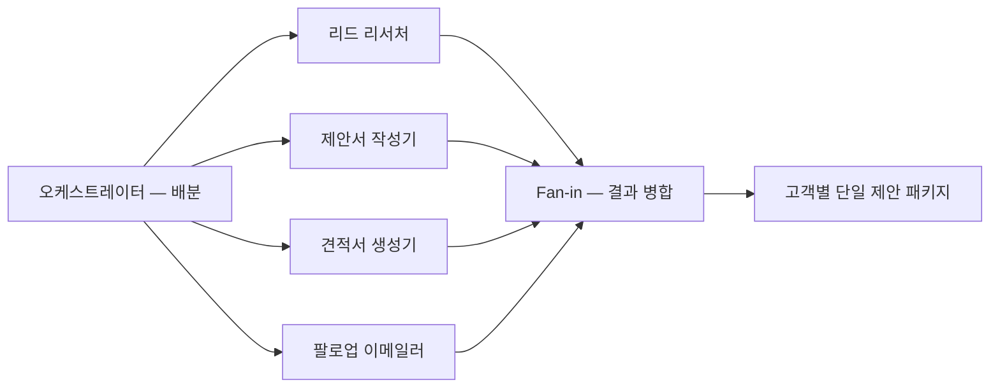
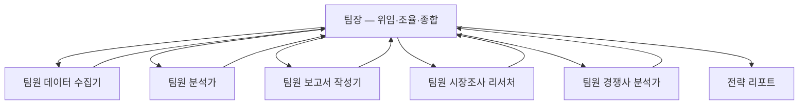
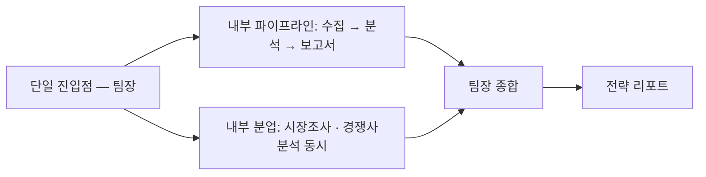
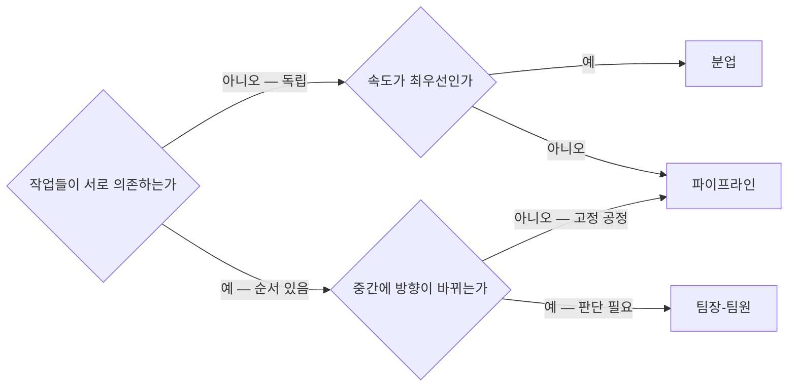
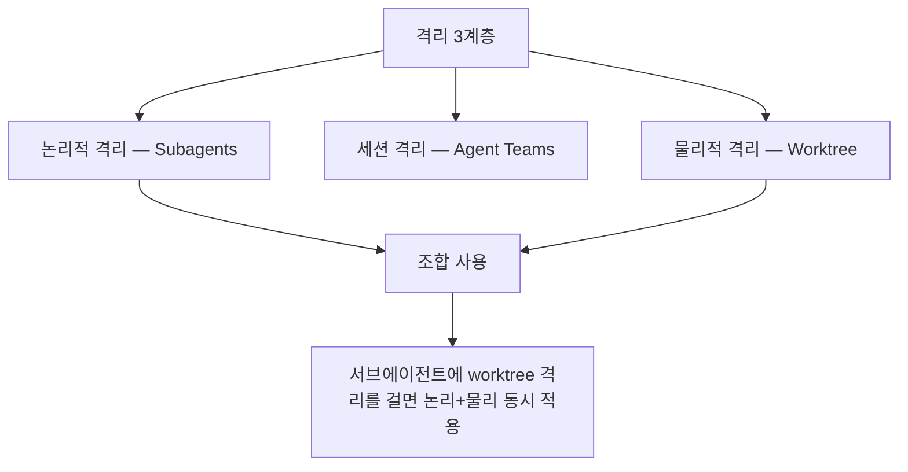
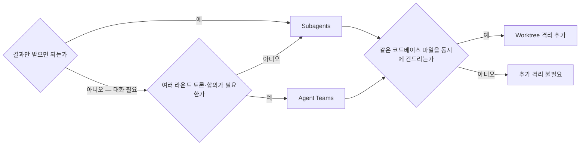

[첫 편](/blog/agentic-coding/subagent-definition-fields/)이 한 명을 정의했다. 정의서 한 장에 필드를 채우고 담당·비담당 경계를 긋는 일이었다. 이 글은 그 한 명을 여럿으로 늘린다.

늘리는 방법은 셋뿐이다. 줄로 세우거나(파이프라인), 옆으로 펼치거나(분업), 위에 한 명을 두거나(팀장-팀원). 셋은 비용도 속도도 무너지는 방식도 다르고, **셋 다 실패 모드를 넷씩 가지고 있다.**

그리고 패턴을 골랐다고 끝이 아니다. 패턴은 **무엇을 그릴 것인가**이고, 그것을 실제로 돌리려면 **무엇으로 구현할 것인가**를 또 골라야 한다. 후반부의 Subagents·Agent Teams·Worktree가 그것이다. 셋은 상하 관계가 아니라 서로 다른 축의 격리 수단이라, 겹쳐 쓸 수 있다.

> 이 글이 옮긴 원 자료의 작성 기준일은 **2026-07-26**이다. 기능 이름·제약·한계 목록은 그 시점의 것이다.
>
> 아래 세 패턴의 「실전 예」 행은 원 자료가 든 패턴 예시이며 실제 운영 사례가 아니다.

## 용어 정리

[첫 편](/blog/agentic-coding/subagent-definition-fields/)의 용어표에서 이 글이 쓰는 행만 추렸다.

| 용어 | 정의 | 대응되는 사람 조직 개념 |
|---|---|---|
| **서브에이전트(Subagent)** | 메인 세션이 1:1로 위임하는 에이전트. 독립 컨텍스트에서 일하고 최종 보고만 돌려준다 | 위임받은 팀원 |
| **오케스트레이터(Orchestrator)** | 여러 에이전트에 작업을 배분·조율·통합하는 상위 에이전트 | 팀장 / PM |
| **워커(Worker)** | 오케스트레이터의 지시를 받아 전문 작업만 수행하는 에이전트 | 팀원 |
| **핸드오프(Handoff)** | 앞 단계 에이전트의 산출물을 다음 에이전트 입력으로 넘기는 것 | 업무 인계 |
| **Fan-out / Fan-in** | 여러 에이전트에 동시 배포(out) → 결과를 한 곳으로 수집·병합(in) | 병렬 배정 후 취합 |
| **Hub-and-Spoke** | 모든 보고·의사결정이 리더(허브)를 경유하는 통신 구조 | 팀장 중심 보고체계 |
| **Agent Teams** | 여러 Claude Code 인스턴스가 리더-팀원으로 묶여 양방향 통신하는 실험적 기능 | 실제 팀 회의 |
| **TaskList** | 팀원이 공유하는 작업 보드. 상태·소유자·의존성을 기록 | 칸반 보드 / Jira |
| **Worktree** | 같은 git 저장소를 공유하되 다른 경로에 다른 브랜치를 동시 체크아웃하는 기능 | 각자 다른 책상 |
| **격리(Isolation)** | 에이전트 간 간섭을 막는 분리. 논리적·세션·물리적 3계층이 있다 | 업무 분장 / 좌석 분리 |

## 왜 팀으로 나누는가

| 단일 에이전트의 한계 | 팀 구성으로 얻는 것 |
|---|---|
| 토큰 한계에 빨리 도달 → 뒤쪽 작업 품질 저하 | 역할 분리 → 각자 한 가지 일에만 집중 |
| 병렬 처리 불가 → 느림 | 병렬 실행 → 독립 작업 동시 처리 |
| 만능 범용의 함정 → 전문성 부재 | 독립 검증 → 다른 에이전트가 검수 |
| 역할 분리 없이 복잡도만 증가 | 확장성 → 에이전트 추가 = 처리량 증가 |

3인 팀 실습 챕터의 표현을 그대로 옮기면 이렇다.

> 컨텍스트 희석: 검색 결과 수천 줄이 컨텍스트를 채우면 핵심 사실이 흐려진다.
>
> 자기 편향: 자기가 쓴 글을 자기가 검토하면 오류를 못 찾는다. 사람도 마찬가지다.
>
> 역할 충돌: 조사·작성·검토를 동시에 하면 어떤 것에도 집중하지 못한다.
>
> 이건 프롬프트 문제가 아니다. **구조의 문제는 구조로 해결해야 한다.**

가운데 항목이 나머지 둘과 성격이 다르다. 컨텍스트 희석과 역할 충돌은 나누면 완화되지만, **자기 편향은 나누지 않으면 원리적으로 해결되지 않는다.** 같은 컨텍스트를 가진 주체가 자기 산출물을 검토하기 때문이다. 이 셋을 이렇게 가르는 것은 이 글의 정리다.

단일 에이전트를 언제까지 유지하고 어디서 쪼개는지, 그리고 쪼갠 뒤의 토폴로지 세 가지를 중앙 통제와 종료 판정 주체로 가른 정리는 [언제 에이전트를 쪼개는가](/blog/ai-agent/when-to-split-agents/)에 따로 있다.

## 패턴 1 — 파이프라인 (Assembly Line, 라인 생산)

앞 단계 산출물이 다음 단계 입력이 되는 **단방향 순차 처리**다. 각 단계가 데이터를 변환한다.

| 항목 | 내용 |
|---|---|
| 적합 업무 | 순서 의존이 강한 작업, 표준화가 필요한 반복 업무, 단계별 품질 게이트가 있는 공정 |
| 실전 예 | 키워드 리서치 → 초안 작성 → 편집 → 채널 배포 → 이미지 생성 5단 라인 |
| 장점 | 단계별 재사용 가능, 오류 단계 추적 명확, 누적 검증으로 품질 체인 형성 |
| 실패 모드 ① | **총 소요 = 모든 단계의 합** — 근본적으로 느리다 |
| 실패 모드 ② | **병목 취약** — 한 단계가 지연되면 전체가 멈춘다 |
| 실패 모드 ③ | **역방향 피드백 없음** — 뒤 단계가 앞 단계 오류를 되돌릴 수 없다 |
| 실패 모드 ④ | **유연성 부족** — 중간 변경이 생기면 라인 전체를 재설계해야 한다 |
| 상대 비용 | 약 1배 (기준선) |

## 패턴 2 — 분업 (Parallel Workstation)

오케스트레이터가 N개 에이전트에 동시 배포(Fan-out)하고, 결과를 다시 모아 통합(Fan-in)한다. 에이전트끼리는 서로를 기다리지 않는다.

| 항목 | 내용 |
|---|---|
| 적합 업무 | 서로 의존하지 않는 독립 작업, 속도가 최우선인 작업, 같은 대상에 대한 다각도 산출물 |
| 실전 예 | 리드 스코어링 + 맞춤 제안서 + 3단계 견적 + 팔로업 이메일을 4명이 동시 생산 |
| 장점 | 총 소요 = **가장 느린 한 명의 시간**. 에이전트 추가가 곧 처리량 증가 |
| 실패 모드 ① | **결과 통합 비용** — Fan-in에서 중복·충돌을 사람이 정리해야 하는 상황 발생 |
| 실패 모드 ② | **상호 의존 작업에 쓰면 실패** — 순차 의존 작업을 무리하게 병렬화하면 오히려 악화 |
| 실패 모드 ③ | **일관성 붕괴** — 산출물 포맷·톤이 제각각이 된다 |
| 실패 모드 ④ | 코디네이션 복잡도 증가 |
| 상대 비용 | 약 N배 (병렬 수만큼) |

> 원 자료가 **Google/MIT 2025 연구**에서 인용한 수치: 독립 작업을 병렬화하면 +81% 향상, **순차 의존 작업을 무리하게 병렬화하면 -70% 악화**.
>
> 즉 분업은 "동시에 할 수 있는 일인지"를 먼저 판정한 다음에 쓰는 패턴이다.

## 패턴 3 — 팀장-팀원 (Orchestrator-Worker, Hub-and-Spoke)

리더가 위임·조율·종합·의사결정을 맡고, 팀원은 전문 작업만 하고 **리더에게만** 보고한다. 리더는 중간 결과를 보고 다음 단계를 동적으로 정한다.

| 항목 | 내용 |
|---|---|
| 적합 업무 | 복잡한 의사결정, 중간 결과에 따라 다음 단계가 달라지는 작업, 외부에 단일 창구가 필요한 업무 |
| 실전 예 | 경영지원 오케스트레이터 1명 + 팀원 5명. 외부에서는 진입점 하나만 호출 |
| 장점 | 동적 작업 분배, 외부 인터페이스 단순화, 논의·협업 가능 |
| 실패 모드 ① | **높은 비용** — 리더 오버헤드로 토큰 사용량이 단일 에이전트 대비 약 4배, 일반 채팅 대비 약 15배 |
| 실패 모드 ② | **리더 병목** — 리더가 느리면 전체가 멈춘다 |
| 실패 모드 ③ | **리더 편향** — 리더의 오판이 전체 방향을 잘못 끌고 간다 |
| 실패 모드 ④ | 복잡한 컨텍스트 관리 부담이 리더 한 명에게 집중된다 |
| 상대 비용 | 약 4배 (단일 대비) |

> **세 패턴 표의 행 구조가 완전히 같다.**
>
> 적합 업무 · 실전 예 · 장점 · 실패 모드 ①~④ · 상대 비용. 그래서 세 표는 나란히 놓고 같은 행끼리 읽도록 만들어져 있다. 특히 「실패 모드」가 셋 다 정확히 네 개라는 점이 눈에 띈다 — 어느 패턴도 실패 모드가 하나뿐인 것은 없다. **패턴 선택은 무결점을 고르는 일이 아니라 어느 네 가지를 감당할지 고르는 일이다.**
>
> 앞의 「4배·15배」는 원 자료가 인용한 Anthropic 공식 수치다. 이 시리즈의 성능·비용 수치는 직접 측정한 것이 아니다. 대부분 원 자료가 인용한 외부 연구·벤치마크 값이고, 하나(Phase 분리 85%)는 원 자료 자체의 운영 사례이며, 출처를 밝히지 않은 값도 섞여 있다.

에이전트를 **다른 축으로** 열한 개로 가르고 각각의 자율성 수준과 무너지는 지점을 세운 카탈로그는 [에이전트 패턴 카탈로그 11종](/blog/ai-agent/agent-pattern-catalog/)에 있다. 위의 세 패턴을 세분한 목록이 아니다.

## 트레이드오프 매트릭스

| 축 | 파이프라인 | 분업 | 팀장-팀원 |
|---|---|---|---|
| 비용 | ~1배 (기준선) | ~N배 (병렬 수) | ~4배 (단일 대비) |
| 속도 | 느림 — 모든 단계 합산 | 가장 빠름 — max(N) | 중간 |
| 의사결정 | 예측 가능(고정) | 통합 품질 관리 필요 | 동적 조정 — 최고 |
| 쓰는 상황 | 순서 의존, 표준화 | 독립 작업, 속도 우선 | 복잡 판단, 유연 분배 |
| 대표 실패 | 병목 하나가 전체 정지 | Fan-in 충돌·일관성 붕괴 | 리더 병목·리더 편향 |

> **첫 행의 세 값은 서로 같은 단위가 아니다.**
>
> `~1배`와 `~4배`는 상수인데 `~N배`만 변수다. N은 붙이는 에이전트 수라서, 분업이 팀장-팀원보다 싼지 비싼지를 이 표는 명시하지 않는다 — 표기를 그대로 따르면 넷을 붙였을 때 비슷해지고 다섯이면 넘어선다. 첫 행을 "분업이 중간"으로 읽으면 안 된다는 뜻이다. 단위가 섞여 있다는 지적은 이 글의 것이고, 원 자료는 세 값을 한 행에 나란히 적는다.

## 하이브리드 — 실전은 항상 조합

| 조합 | 구조 |
|---|---|
| 팀장-팀원 안의 파이프라인 | 팀장이 팀원들을 순차로 연결해 3단 라인을 돌린다 |
| 분업 결과를 파이프라인에 투입 | A+B 동시 실행 → 팀장이 병합 → C로 전달 |
| 실전 사례 | 외부에서 보면 단일 진입점, 내부는 3단 파이프라인 + 2인 분업의 혼합 |

## 패턴 선택 판단 흐름

질문 두 개면 셋 중 하나가 나온다. 첫 질문이 의존성이라는 점이 중요하다 — 비용도 속도도 아니고, **동시에 할 수 있는 일인가**가 먼저다.

## Subagents vs Agent Teams vs Worktree

패턴이 **무엇을 그릴 것인가**라면, 여기서부터는 **무엇으로 구현할 것인가**다. 셋은 상하 관계가 아니라 **서로 다른 축의 격리 수단**이다.

### 세 기법의 정체

| 기법 | 한 줄 비유 | 핵심 성질 |
|---|---|---|
| Subagents | 팀장이 팀원에게 1:1로 일을 맡김 | 단방향 위임. 팀장은 완성된 보고서만 받고 과정은 팀장 메모에 남지 않는다 |
| Agent Teams | 팀장이 주재하는 팀 회의 | 팀원끼리 메신저로 직접 대화하고 팀장에게 역질문도 가능 |
| Git Worktree | 여러 직원이 같은 서류 보관함을 쓰되 각자 다른 책상에서 작업 | 같은 저장소, 다른 경로, 다른 브랜치 동시 체크아웃 |

### 한 장 비교표

| 항목 | Subagents | Agent Teams | Git Worktree |
|---|---|---|---|
| 격리 수준 | 논리적 — 컨텍스트 윈도우 | 세션 — Claude Code 인스턴스 | 물리적 — 파일시스템 경로 |
| 통신 방향 | 단방향 (메인 → 서브) | 양방향 (리더 ↔ 팀원, 팀원 ↔ 팀원) | 없음 — 파일로만 공유 |
| 역질문 | 불가 | 가능 | 해당 없음 |
| 결과 반환 | 최종 메시지만 메인으로 반환 | 메시지·공유 TaskList로 상시 교환 | 해당 없음 |
| 충돌 방지 방식 | 컨텍스트 분리 | 작업 claim 방식 | 브랜치 + 경로 분리 |
| 비용 | 낮음 | 높음 (인스턴스 배수) | 무관 (git 기능) |
| 병렬 실행 | 단일 메시지에 여러 호출 → 자동 병렬 | 멀티 인스턴스 동시 실행 | 빌드·테스트 간섭 없음 |
| 알려진 한계 | 역질문 불가 | 세션 재개 불가, 팀원이 팀원을 다시 만들 수 없음 | 경로를 버전관리 제외 목록에 넣어야 함 |
| 결정 기준 | 결과만 받으면 되는가 | 에이전트 간 대화가 꼭 필요한가 | 파일 충돌을 막아야 하는가 |

> **셋째 열에 「해당 없음」이 두 번 나온다는 것이 이 표의 핵심이다.**
>
> Worktree는 역질문도 결과 반환도 없다. 통신 수단이 아니기 때문이다. 즉 이 표는 세 후보를 같은 잣대로 줄 세우는 표가 아니라, **왼쪽 둘과 오른쪽 하나가 애초에 다른 것을 한다**는 것을 보여주는 표다. 마지막 행의 결정 기준 세 개가 서로 배타적이지 않은 것도 그래서다 — 셋 다 "예"일 수 있다.

워커가 서로를 부르지 않게 만들고 결정 로그로 감사 가능성을 확보하는 아키텍처는 [워커는 서로를 부르지 않는다](/blog/ai-agent/single-dispatcher-worker-isolation/)에서 따로 다뤘다.

### 세 계층은 겹쳐 쓸 수 있다

Worktree가 실제로 제거하는 충돌은 세 가지다.

| 충돌 유형 | 증상 | Worktree 해결 |
|---|---|---|
| 브랜치 충돌 | 같은 폴더에서 브랜치를 바꾸면 다른 에이전트의 작업 파일이 바뀐다 | 경로별로 다른 브랜치 체크아웃 |
| 빌드 충돌 | 동시 빌드·테스트가 서로의 산출물을 덮어쓴다 | 산출물 디렉터리 자체가 분리 |
| 파일 lock 충돌 | 의존성 캐시·빌드 캐시 등에 병렬 쓰기 잠금 경합 | 경로 분리로 경합 소멸 |

세 행 모두 **논리적 격리로는 막히지 않는 충돌**이다. 컨텍스트를 아무리 갈라 놓아도 두 에이전트가 같은 경로에 쓰면 부딪힌다. 격리 계층을 겹쳐 쓰는 이유가 여기 있다.

### 선택 판단 흐름도

흐름도가 두 단으로 나뉘어 있다는 점을 보자. 위쪽에서 Subagents냐 Agent Teams냐를 정한 다음, **어느 쪽으로 갔든** 아래쪽에서 Worktree를 얹을지 다시 묻는다. 앞 표의 「해당 없음」 두 칸이 흐름도에서는 이 구조로 나타난다.

### Agent Teams가 정당화되는 4가지 상황

| # | 상황 | 이유 |
|---|---|---|
| 1 | 여러 라운드 토론이 필요 | 팀원이 이의를 제기하고 재논의하는 구조가 필요 |
| 2 | 진짜 멀티 세션 병렬 작업 | 여러 인스턴스가 실제로 동시에 돌아야 함 |
| 3 | 서로 다른 전문성의 합의 형성 | 아키텍처 설계처럼 관점 충돌 조정이 필요 |
| 4 | 결과 재질문 허용 | 팀원이 완성 전에 팀장에게 되물을 수 있어야 함 |

### 흔한 착각 3가지

| 착각 | 사실 |
|---|---|
| Agent Teams는 Subagents의 상위 버전이다 | 아니다. 축이 다른 별개 도구다 |
| Worktree는 에이전트와 무관한 git 기능이다 | 아니다. `isolation: worktree` 필드로 통합되어 있다 |
| 병렬 실행이 필요하면 Agent Teams다 | 아니다. 단순 병렬은 Subagents가 더 간단하고 저렴하다 |

가운데 행이 [첫 편](/blog/agentic-coding/subagent-definition-fields/)의 frontmatter 확장 필드표로 되돌아간다. `isolation`은 거기서 확장 필드 다섯 중 하나로 한 줄만 차지하고 있었는데, 그 한 줄이 여기서 물리적 격리 계층 전체에 해당한다.

## 다음

세 패턴을 고르고 격리 수단까지 정했다면 구조는 선 것이다. 그런데 구조를 안다고 팀이 굴러가지는 않는다.

팀을 실제로 띄우면 첫날 부딪히는 것은 패턴 선택이 아니라 운용이다. 팀원이 spawn 되자마자 idle로 돌아가고, 메시지를 보냈는데 상대가 깨어나지 않고, 두 팀원이 같은 파일을 동시에 연다.

- [마지막 편 — 팀을 굴리면 첫날 무엇이 멈추는가](/blog/agentic-coding/agent-team-operations/): 팀 가동 4단계, 비동기 메시지와 Phase 전환, Hub-and-Spoke의 오류 억제 근거, 교착 방지 4대 증상, 비용 관리 3원칙, 그리고 완제품 환경 사례
