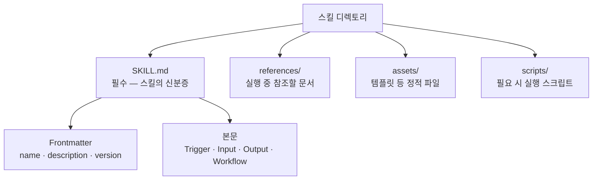
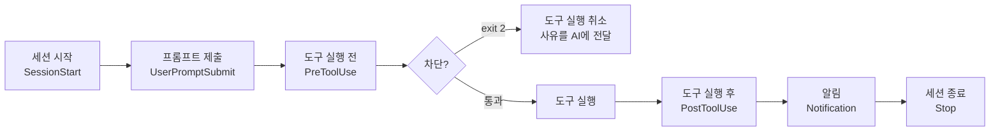
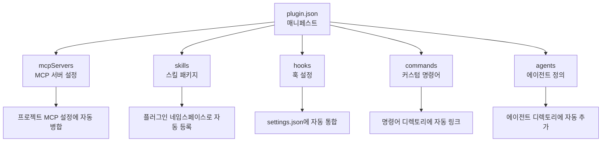

[첫 편](/blog/agentic-coding/extension-trigger-axis/)이 넷을 트리거 주체로 갈랐고, [앞 편](/blog/agentic-coding/mcp-selection-practice/)이 그중 연결 층을 떼어 봤다. 이 글은 나머지 셋을 파일 단위까지 내려간다. 커맨드는 `.md` 한 장, 스킬은 디렉터리, 훅은 설정 등록과 셸 스크립트다.

형태가 다른 만큼 실패하는 방식도 다르다. 커맨드는 사람이 잊으면 실행되지 않고, 스킬은 AI가 상황을 다르게 해석하면 실행되지 않으며, 훅은 둘 다 해당하지 않는다. 마지막은 이 셋에 MCP와 에이전트 정의를 더해 한 번에 배포하는 플러그인이다.

> 이 글이 옮긴 원 자료의 작성 기준일은 **2026-07-26**이다. 설정 키·파일 경로·명령 이름은 그 시점의 것이다. 원 자료 안에서 별도 기준일(2026년 4월)이 붙은 것은 생태계 규모 수치뿐이고, 그 수치는 [앞 편](/blog/agentic-coding/mcp-selection-practice/)에 있다.

## 용어 정리

[첫 편](/blog/agentic-coding/extension-trigger-axis/)의 용어표에서 이 글이 쓰는 행만 추렸다.

| 용어 | 풀이 |
|---|---|
| **Command** | 사용자가 `/명령어`로 직접 호출하는 수동 자동화 단위 |
| **Skill** | AI가 상황을 감지해 자율 호출하는 절차 문서. 사실상 SOP |
| **SOP** | Standard Operating Procedure. 표준운영절차 |
| **SKILL.md** | 스킬을 인식·실행하게 하는 핵심 파일. 없으면 스킬은 존재하지 않는 것과 같음 |
| **Frontmatter** | 마크다운 최상단 `---`로 감싼 YAML 메타데이터 블록 |
| **Hook(훅)** | 특정 이벤트 발생 시 자동 실행되는 셸 스크립트. AI 판단을 거치지 않음 |
| **matcher** | 훅이 어떤 도구에 반응할지 지정하는 정규식 패턴 |
| **PreToolUse** | 도구 실행 *전* 이벤트. 유일하게 실행을 차단할 수 있는 이벤트 |
| **PostToolUse** | 도구 실행 *후* 이벤트. 후처리·로깅만 가능 |
| **MCP** | Model Context Protocol. AI 모델이 외부 도구·데이터에 접근하기 위한 표준 프로토콜 |
| **MCP 서버** | 외부 서비스를 MCP 규격으로 감싸는 경량 어댑터. "도구 공급업체" 역할 |
| **플러그인** | MCP+Skills+Hooks+Commands+Agents를 한 번에 묶어 배포하는 번들 |
| **plugin.json** | 플러그인 매니페스트. 각 컴포넌트의 설치 위치를 선언 |
| **마켓플레이스** | MCP 서버·플러그인을 검색·설치하는 디렉토리 플랫폼 |
| **managed 스코프** | 관리자가 배포하고 일반 사용자가 제거할 수 없는 플러그인 배포 모드 |

## Commands — 사람이 누르는 수동 버튼

### 정의와 특성

| 항목 | 내용 |
|---|---|
| 호출 주체 | 사람 |
| 트리거 | `/명령어` 직접 입력 |
| 실행 시점 | 사용자가 원하는 순간 |
| 파일 위치 | `.claude/commands/*.md` |
| 재사용 단위 | 워크플로우(시나리오) |
| 비유 | 사무실 비상벨 — 사람이 눌러야 울린다 |

### 언제 Command로 만드는가

| 조건 | 이유 |
|---|---|
| 실행 시점을 사람이 통제해야 함 | 보고서 제출·배포처럼 타이밍이 의미를 가짐 |
| 부작용이 큰 작업 | 파일 삭제·DB 수정·외부 API 호출 |
| 사용자 입력 파라미터가 필요 | 인자를 받아야 동작이 결정됨 |
| 워크플로우가 복잡하고 직접 관리하고 싶음 | 예측 가능성이 자율성보다 중요 |

핵심 장점은 **예측 가능성과 디버깅 용이성**이다. 언제 왜 실행됐는지 명확하다.

## Skills — AI가 읽는 자율 SOP

### 정의와 특성

| 항목 | 내용 |
|---|---|
| 호출 주체 | AI |
| 트리거 | 키워드·컨텍스트 감지 |
| 실행 시점 | AI가 적합하다고 판단할 때 |
| 파일 위치 | `.claude/skills/<이름>/SKILL.md` (프로젝트) 또는 `~/.claude/skills/` (전역) |
| 재사용 단위 | 도메인 지식·절차 |
| 비유 | 자동 스프링클러 — 연기를 감지하면 스스로 작동 |

> **바로 앞 표와 왼쪽 열 여섯 항목이 그대로 같다.**
>
> 값은 여섯 행이 모두 다르다. 그중 첫 행이 호출 주체이고, 트리거와 실행 시점도 그 주체를 따라 갈린다. 커맨드와 스킬은 같은 여섯 칸을 다르게 채운 두 설정이고, 그래서 "무엇으로 만들까"는 기능 비교가 아니라 첫 행을 고르는 문제가 된다. 두 표를 첫 행 중심으로 읽는 것은 이 글의 정리이며, 원 자료는 두 표를 나란히 둘 뿐이다.

Skill의 본질은 **절차적 지식(Procedural Memory)을 문서로 외부화한 것**이다. 사람에게 SOP를 문서로 주는 것과 정확히 같은 행위를 AI에게 한다.

### 3대 구성 요소



| 요소 | 필수 | 담는 것 |
|---|---|---|
| `SKILL.md` | **필수** | 트리거·입출력·워크플로우. 없으면 스킬이 존재하지 않는 것과 같음 |
| `references/` | 선택 | 가이드라인, 포맷 명세, 용어 정의 |
| `assets/` | 선택 | 템플릿, 설정 JSON, 브랜드 파일 |
| `scripts/` | 선택 | 실행 스크립트 |

제목은 셋인데 표는 네 행이다. `SKILL.md`는 스킬 자체를 성립시키는 파일이고 나머지 셋이 선택 디렉터리라는 뜻으로 읽히지만, 원 자료가 그렇게 나누어 적지는 않았다.

에이전트는 사용자 입력이 들어오면 스킬 디렉토리를 탐색해 각 `description`을 읽고 가장 적합한 스킬을 고른다. 즉 **description이 곧 라우팅 키**다.

### description — 트리거 성패의 90%

| 나쁜 예 | 좋은 예 |
|---|---|
| 두 단어짜리 한 줄 | 3~4줄, 용도·트리거 문구·입력·출력 명시 |
| 트리거 조건 없음 | `Triggers on:` 으로 실제 발화 예시 나열 |
| 입출력 미명시 | `Input:` / `Output:` 타입 명시 |
| 결과: 스킬이 선택되지 않음 | 결과: 안정적으로 트리거됨 |

```yaml
---
name: weekly-report
description: |
  Use when creating weekly reports or summaries from data.
  Triggers on: "주간 리포트 만들어", "이번 주 보고서", "weekly report 작성"
  Input: CSV data or pasted table data
  Output: Structured markdown weekly report with KPI table and action items
version: 1.0.0
---
```

작성 요령 세 가지.

- 첫 줄을 `Use when ...` 패턴으로 시작한다. 용도가 먼저 오면 매칭 정확도가 올라간다.
- 트리거 문구는 **한국어와 영어를 모두** 넣는다. 실제 사용자 발화가 어느 쪽일지 모른다.
- 멀티라인 작성 시 파이프 기호 `|`를 빠뜨리면 YAML 파싱 오류가 난다.

### 본문 구조 — Trigger / Input / Output / Workflow

본문은 네 블록이 사실상 표준이다. 특히 Workflow는 **판정 기준까지 수치로 못 박아야** 매번 같은 품질이 나온다.

| 블록 | 쓰는 내용 |
|---|---|
| Trigger | 이 스킬이 발동해야 하는 발화 목록 |
| Input | 받을 데이터의 형태와 제공 방법 |
| Output | 산출물의 포맷과 필수 구성 요소 |
| Workflow | Step 1..N. 각 단계의 처리와 판정 기준 |

예컨대 주간 보고 스킬의 Workflow는 KPI 달성률을 `70% 미만 / 70~90% / 90% 초과` 세 구간으로 분류하도록 명시한다. 기준을 문서에 박아 두면 실행자가 바뀌어도 결과가 흔들리지 않는다. 사람 SOP와 완전히 같은 원리다.

### 복잡도 점진 원칙

| 단계 | 구성 | 언제 |
|---|---|---|
| 1단계 (간단) | `SKILL.md` 하나 | 우선 트리거부터 동작시킨다 |
| 2단계 (중간) | + `references/` | 참조 문서가 실제로 필요해질 때 |
| 3단계 (복잡) | + `assets/`, `scripts/` | 정적 파일·스크립트가 필요해질 때 |

흔한 실패는 처음부터 세 요소를 전부 설계하다 중간에 막히는 것이다. 원 자료의 비교 사례에 따르면 103줄짜리 `SKILL.md` 하나로 완벽히 동작하는 스킬과, 모든 요소를 갖춘 스킬이 **둘 다 잘 동작한다**. 차이는 필요 여부일 뿐이다. MVP 후 확장이라는 소프트웨어 원칙과 동일하다.

### 예시 스킬 3종의 설계 축

원 자료가 예시로 든 스킬 셋을 같은 축으로 늘어놓으면 다음과 같다.

| 스킬 | 트리거 | 입력 | 출력 | 복잡도 |
|---|---|---|---|---|
| 주간 보고서 | "주간 리포트 만들어" | CSV·표 데이터 | KPI 표 + 달성/미달 분석 + 액션 3건 | 간단 |
| 코드 리뷰 체크리스트 | "PR 리뷰해줘" | git diff 또는 코드 블록 | 보안·성능·가독성 3축 체크리스트 | 중간 |
| 고객 CSV 정리 | "고객 CSV 정리해줘" | 비정형 raw CSV | 정규화 CSV + 업로드 가이드 | 복잡 |

세 스킬이 공통으로 보여주는 것은 **"입력 형태가 정해져 있고, 출력 포맷이 정해져 있고, 판단 규칙이 반복되는 업무"가 스킬화 대상**이라는 점이다.

### 트리거가 안 될 때

| 점검 순서 | 확인 사항 |
|---|---|
| 1 | description이 너무 짧은가 → 3~4줄로 교체 |
| 2 | 파이프 기호 `\|` 누락 → YAML 파싱 실패 |
| 3 | 파일 경로가 틀렸는가 → `<스킬폴더>/SKILL.md` 확인 |
| 4 | 트리거 문구가 실제 발화와 다른가 → 실제 표현으로 교체 |

> **description 표·본문 블록 표·위의 점검 표, 이 셋은 같은 문제를 다른 각도에서 본 것이다.**
>
> 셋 다 "왜 안 불리는가"를 다룬다. 스킬의 실패는 실행 오류가 아니라 **선택되지 않음**으로 나타나기 때문에, 디버깅 지점이 로직이 아니라 문서 앞머리에 몰려 있다.

## Hooks — AI가 안전하게 일하게 하는 자동 게이트

이 시리즈에서 거버넌스와 가장 직접 닿는 대목이다.

### 무엇이 다른가

Commands는 사람이 잊으면 실행되지 않는다. Skills는 AI가 상황을 다르게 해석하면 실행되지 않는다. **Hooks는 둘 다 해당하지 않는다.**

> Hooks는 사람의 개입 없이, AI의 판단 없이, 이벤트만 발생하면 100% 실행된다.
>
> 비유하면 공장 생산라인의 품질 검사 게이트다. 부품이 특정 단계를 지날 때마다 검사·차단·로깅이 자동으로 작동한다.
>
> 검사원이 자리를 비워도 게이트는 항상 작동한다.

### 이벤트 타입



| 이벤트 | 시점 | 차단 가능 | 대표 용도 | 비유 |
|---|---|---|---|---|
| **PreToolUse** | 도구 실행 직전 | **가능** | 보안 게이트, 위험 명령 차단, 사전 검증 | 출근 체크리스트 |
| **PostToolUse** | 도구 실행 직후 | 불가 | 자동 포맷팅, 테스트 실행, 변경 로깅 | 퇴근 정리 |
| **Notification** | 알림 발생 시 | 불가 | 시스템 알림, 메신저 연동 | 팀장 자동 보고 |
| **Stop** | 세션 종료 시 | 불가 | 세션 요약 저장, 정리 작업 | 회의 정리 |

보조 이벤트 4종: `SessionStart`(환경 점검·이전 작업 로드), `UserPromptSubmit`(입력 전처리·프롬프트 보강), `SubagentStop`(서브에이전트 결과 수집), `PreCompact`(컨텍스트 압축 전 중요 정보 보존).

**차단할 수 있는 이벤트는 PreToolUse 하나뿐**이다. PostToolUse로는 이미 실행된 도구를 되돌릴 수 없다. 되돌리기가 필요하면 설계를 PreToolUse로 옮겨야 한다.

### 설정 문법

```json
{
  "hooks": {
    "PreToolUse": [
      {
        "matcher": "Edit|Write",
        "hooks": [{
          "type": "command",
          "command": "~/.claude/hooks/protect-env.sh",
          "timeout": 10
        }]
      }
    ]
  }
}
```

| 필드 | 의미 | 값 |
|---|---|---|
| `matcher` | 어떤 도구에 반응할지 (정규식) | `"Bash"` / `"Edit\|Write"` / `""`(전체) |
| `type` | 훅 종류 | 현재 `command` 하나 |
| `command` | 실행할 스크립트 경로 | 실행 권한 필요 |
| `timeout` | 타임아웃(초) | 기본 60, 권장 10~30 |

적용 범위는 두 단계다.

| 위치 | 범위 | 우선순위 |
|---|---|---|
| `~/.claude/settings.json` | 모든 프로젝트 | 낮음 |
| `.claude/settings.json` | 해당 프로젝트 | **높음 (전역보다 우선)** |

### 차단 메커니즘 — stdin/stdout 계약

훅은 이벤트 JSON을 stdin으로 받고, 결과를 stdout으로 돌려주는 **양방향 통신 계약**을 갖는다.

```bash
#!/bin/bash
input=$(cat)
file_path=$(echo "$input" | jq -r '.tool_input.file_path // empty')

if [[ "$file_path" == *.env ]]; then
  echo '{"decision":"block","reason":".env 파일 수정 금지: 보안 정책 위반. 환경변수 변경은 팀 리드에게 문의."}'
  exit 2
fi
exit 0
```

| 요소 | 역할 |
|---|---|
| `exit 2` | 도구 실행을 차단하는 신호 |
| `decision: block` | 차단 결정 |
| `reason` | **AI에게 전달되는 차단 사유**. 화면에도 표시됨 |
| `exit 0` | 통과 |

`reason`이 설계상 중요하다. 단순히 막는 게 아니라 **AI에게 왜 막혔고 무엇을 해야 하는지 알려주는 채널**이다. 여기에 "팀 리드에게 문의"처럼 다음 행동을 명시하면 에이전트가 우회를 시도하는 대신 사람에게 에스컬레이션한다.

이 `exit 2` 계약이 선언형 권한 정책과 어떻게 층을 이루는지는 [settings.json과 훅의 2차 방어선](/blog/agentic-coding/settings-permissions-deny/)에서 별도로 다뤘다. 다만 그 글은 차단 사유를 **표준 에러**로 넘기는 형태로 적었고, 위 예시는 stdout으로 돌려주는 JSON의 `reason` 필드를 쓴다. 두 자료가 서로 다른 채널을 들고 있으며 어느 쪽이 현재 사양인지는 두 자료 안에서 판정되지 않는다. 실제로 훅을 걸 때는 `exit 2` 직후의 출력 채널을 직접 확인한다.

### 안전 설계 원칙

| 원칙 | 내용 |
|---|---|
| 타임아웃은 통과 처리 | 시간 초과 시 차단이 아니라 통과 — 훅 장애가 업무를 멈추지 않도록 |
| 오류 시 graceful exit | 스크립트 오류가 전체를 막지 않게 처리 |
| 실행 권한 필수 | 권한 없으면 실행 실패 |
| 검사는 가볍게 | 10초 안에 끝나는 판정만 훅에 둔다 |
| 예외는 조건으로 명시 | 예: `.env`는 막되 `.env.example`은 허용 |

타임아웃이 "통과" 방향으로 설계된 점은 트레이드오프를 드러낸다. **가용성을 보안보다 우선**한 결정이다. 따라서 훅만으로 규정 준수를 100% 보증할 수는 없고, 서버 측 권한 통제와 병행해야 한다.

### 실무 자동화 패턴 5종

| 패턴 | 이벤트 + matcher | 효과 |
|---|---|---|
| 비밀 파일 보호 | PreToolUse + `Edit\|Write` | 환경설정 파일 수정 자동 차단 |
| 위험 명령 차단 | PreToolUse + `Bash` | 파괴적 명령 패턴 감지·차단 |
| 자동 포맷팅 | PostToolUse + `Edit\|Write` | 저장 후 포맷터 자동 실행 |
| 완료 알림 | Notification 또는 Stop | 장시간 작업 완료 시 알림 |
| 세션 요약 | Stop | 변경 파일·다음 할 일 자동 기록 |

### 거버넌스 관점 정리

이벤트 기반 자동화가 주는 조직적 이점은 셋이다.

| 이점 | 의미 |
|---|---|
| **일관성** | 같은 이벤트에 항상 같은 반응. 사람·시점에 따른 편차가 없다 |
| **망각 방지** | 바쁘든 급하든 훅은 항상 실행된다 |
| **확장성** | 팀원이 늘어도 새 멤버가 규칙을 외울 필요가 없다 |

세 번째가 리더 관점에서 결정적이다. **규칙을 사람의 기억에서 시스템으로 옮기는 것**이 훅의 본질이다. 온보딩 문서에 "이건 하지 마세요"라고 적는 대신, 시도 자체가 차단되고 사유가 안내된다.

정책 배치의 원칙은 다음과 같이 정리된다.

| 성격 | 어디에 둘 것인가 | 이유 |
|---|---|---|
| 권장 사항·스타일 | Skills / 프로젝트 지침 | 상황에 따른 유연성이 필요 |
| 반복 절차 | Commands / Skills | 실행 편의가 목적 |
| 보안·규정·불변 규칙 | **Hooks** | AI 해석에 맡기면 안 되는 영역 |

> **이 세 행이 [첫 편](/blog/agentic-coding/extension-trigger-axis/)의 성질 비교표를 정책 문장으로 옮긴 것이다.**
>
> 거기서 훅만 「차단 능력: 있음」을 가졌다. 여기서는 그 한 칸이 "불변 규칙은 훅에"라는 배치 규칙이 된다. 세 행 중 위 두 행은 모두 Skills를 후보에 넣어 두고, 셋째 행만 갈 곳이 하나로 지정돼 있다.

## 플러그인 — 다섯 컴포넌트를 한 번에 배포하는 번들

### 해결하려는 문제

플러그인 이전에는 하나의 업무 환경을 갖추려면 설정이 다섯 군데로 흩어졌다.

| 흩어진 설정 | 담는 것 |
|---|---|
| `.mcp.json` | MCP 서버 연결 |
| `commands/` | 커스텀 명령어 |
| `skills/` | SKILL.md 파일들 |
| `hooks.json` + `settings.json` | 훅 자동화 |
| `agents/` | 에이전트 정의 |

신규 입사자가 이 다섯을 각각 맞추게 하는 것은 온보딩 비용이자 편차의 원인이다. 플러그인은 이를 **하나의 설치 단위**로 묶는다.

### 구조



```json
{
  "name": "my-plugin",
  "version": "1.2.0",
  "description": "플러그인 설명",
  "commands": ["./commands/"],
  "agents": "./agents/",
  "skills": "./skills/",
  "hooks": "./hooks.json",
  "mcpServers": "./mcp-config.json"
}
```

**필수 필드는 `name` 하나**다. 나머지는 모두 선택이며, 선언한 것만 설치 시 매핑된다.

### 마켓플레이스 3종

| 유형 | 운영 주체 | 강점 | 약점 | 용도 |
|---|---|---|---|---|
| **공식** | 벤더 직접 검토·보안 스캔 | 안전 | 수가 적음 | 기본 도구 |
| **커뮤니티** | GitHub 저장소 기반 | 다양·빠른 성장 | 출처 확인 필수 | 틈새 요구 |
| **사내** | 조직이 `marketplace.json` 구성 | **전사 표준 강제 가능** | 직접 운영 비용 | 조직 표준 배포 |

사내 마켓이 조직 관점의 핵심이다. `managed` 스코프로 배포하면 일반 사용자가 제거할 수 없어, **보안 훅과 필수 도구를 강제 적용**할 수 있다.

### 설치·운영 명령

```bash
# 1) 마켓플레이스 등록
npx skills add <마켓플레이스 저장소>

# 2) 검색
/plugin search <키워드>
/plugin discover

# 3) 설치
/plugin install <플러그인>@<마켓플레이스>

# 4) 확인
/plugin list
/plugin status <플러그인>
```

| 생명주기 | 명령 | 결과 |
|---|---|---|
| 업데이트 | `/plugin update <이름>` | 개별 갱신 |
| 전체 업데이트 | `/plugin update --all` | 일괄 갱신 |
| 비활성화 | `/plugin disable <이름>` | **설정 보존**, 기능만 정지 |
| 재활성화 | `/plugin enable <이름>` | 보존된 설정으로 복귀 |
| 제거 | `/plugin uninstall <이름>` | **완전 삭제** |

운영 요령: 팀 프로젝트에서 문제가 의심되면 곧바로 제거하지 말고 **`disable`로 격리 후 충분히 테스트한 뒤 제거**한다. 설정이 보존되므로 롤백이 쉽다.

### 플러그인 vs MCP — 자주 혼동되는 지점

| 질문 | 답 |
|---|---|
| 플러그인과 MCP 직접 설치의 차이는? | 플러그인이 MCP를 *포함*한다. 플러그인=번들, MCP=컴포넌트 하나 |
| 사내 플러그인을 만들려면? | `plugin.json` + 컴포넌트 폴더 구성 → `marketplace.json` 등록 → managed 배포 |
| 플러그인 설치의 보안 위험은? | 공식 마켓은 벤더 검토를 거침. 커뮤니티는 출처 확인이 필수 |

## 시리즈를 닫으며

세 편이 다룬 것은 결국 하나의 질문이었다 — 이 일을 무엇으로 만들 것인가. [첫 편](/blog/agentic-coding/extension-trigger-axis/)이 트리거 주체라는 축을 세웠고, [앞 편](/blog/agentic-coding/mcp-selection-practice/)이 연결 층의 선별과 예산을 봤고, 이 글이 나머지 셋의 파일 구조와 배포를 봤다.

셋을 관통하는 것은 첫 편의 도입 순서에 이미 들어 있다. 무엇에 연결할지 정하고, 잘못 쓰이는 경로를 먼저 막고, 그다음에 편의를 쌓고, 마지막에 그것을 한 단위로 배포한다.
