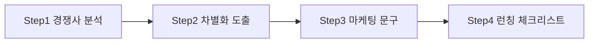
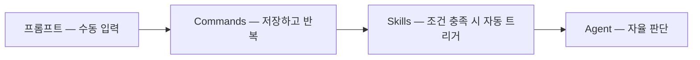
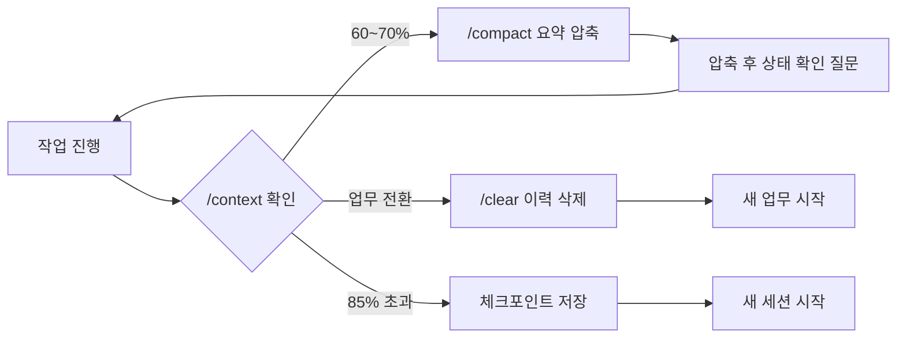
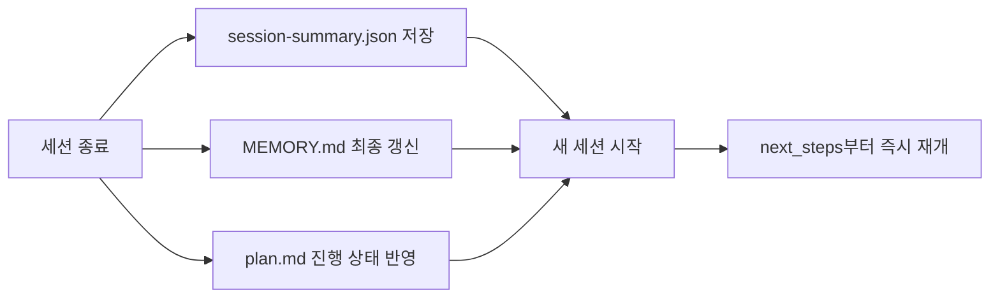

[앞 편](/blog/agentic-coding/dot-claude-directory/)의 프롬프트 7패턴이 **"한 번의 지시를 잘 쓰는 법"** — 목적·맥락·제약·형식 네 요소를 채우고, 반복되는 지시는 커맨드로 저장하고, 이미 파일로 있는 맥락은 `@`나 파이프로 연결하는 것 — 이었다면, 이 글의 3패턴은 **"복잡한 업무를 어떻게 나눠 시킬 것인가"** 다.

그리고 나눠 시키기 시작하면 곧바로 다음 문제가 온다. 대화가 길어지고, 길어진 대화는 매 턴 전량이 다시 전송되며, 어느 지점부터 AI가 앞의 결정과 모순된 답을 내놓기 시작한다. 뒤의 절반은 그 지점을 어떻게 감지하고 무엇을 남긴 채 끊을 것인가를 다룬다.

> 이 글이 옮긴 원 자료의 작성 기준일은 **2026-07-26**이다. 명령 이름·임계값·옵션은 그 시점의 것이다.
>
> 이 글의 예시 업무·메모리 항목·하루 시나리오는 **원 자료의 실습 예제**이며 특정 조직의 실제 운영 사례가 아니다. 개념·용어·판단 프레임 층위에서 읽어야 한다.

## 용어 정리

[첫 편](/blog/agentic-coding/claude-md-scope-layers/)의 용어표에서 이 글이 쓰는 행만 추렸다.

| 용어 | 정의 |
|---|---|
| **컨텍스트 윈도우** | AI가 한 번에 볼 수 있는 대화의 총량. 토큰 단위로 측정. 비유는 "AI의 업무 책상" |
| **토큰(Token)** | AI가 텍스트를 처리하는 기본 단위. 영어 1토큰 ≈ 4글자, 한국어 1토큰 ≈ 1~2글자 |
| **멀티턴 대화** | 여러 번 주고받는 대화. 매 턴마다 이전 이력 전체가 재전송되는 것이 토큰 급증의 원인 |
| **컴팩션(Compaction)** | `/compact`. 대화 이력을 요약 압축해 토큰을 회수하는 동작. 비유는 "업무 인수인계 문서" |
| **`/clear`** | 대화 이력 전체 삭제. CLAUDE.md·memory는 유지. 비유는 "책상 치우기" |
| **`/context`** | 현재 컨텍스트 사용량 분해 표시. 비유는 "책상 위 서류량 체크" |
| **CLAUDE.md** | 세션 시작 시 자동 로드되는 마크다운 규칙 파일. 조직이 작성해 AI에게 주는 업무 매뉴얼 |
| **@import 문법** | CLAUDE.md에서 다른 파일을 참조하는 구문(`@.claude/rules/security.md`). 최대 5단계 재귀 |
| **Memory** | `memory/` 또는 `MEMORY.md`. AI가 세션을 넘어 학습한 결정사항·실수 패턴을 축적하는 저장소 |
| **session-summary** | 세션 종료 시 생성되는 JSON 인수인계 파일. `next_steps`가 다음 세션의 시작점 |
| **Subagent** | 메인 세션이 스폰한 하위 에이전트. 독립 컨텍스트를 갖고 결과 요약만 반환 |
| **MCP** | Model Context Protocol. 외부 도구 연결 규약. 서버가 많을수록 도구 정의만으로 토큰 소모 |
| **`-p` 플래그** | 비대화형(headless) 모드. 한 번 답하고 종료. 스크립트·CI/CD·크론잡의 기본 |
| **SOP** | Standard Operating Procedure(표준 운영 절차). 구조화 프롬프트 1개 = SOP 1개라는 비유의 근거 |

## 업무지시 패턴 3가지

### 패턴 A — 단계별 업무 분해

큰 업무를 3~5개 단계로 쪼개 순차 지시한다. 각 단계의 결과가 다음 단계의 입력이 된다.



| 이점 | 설명 |
|---|---|
| 정확도 | 한 번에 5가지를 시키면 각각 70점, 하나씩 시키면 각각 95점 |
| 방향 수정 | 2단계에서 틀어지면 2단계만 재작업. 한꺼번에 시켰으면 전부 다시 |
| 검증 가능 | 각 단계를 사람이 확인하고 넘어가므로 "10분 달려갔다 다 버리는" 사태를 막는다 |

세 이점 중 뒤의 둘은 사실상 같은 것의 앞뒤다. 사람이 중간에 확인하니까(검증 가능) 틀어진 지점에서 멈출 수 있고(방향 수정), 그래서 되돌리는 비용이 한 단계분으로 제한된다.

```text
# Step 1 — 경쟁사 분석
우리 시장의 상위 경쟁사 3곳을 분석해줘.
각 경쟁사의 가격 체계, 핵심 기능, 타겟 고객을 비교 표로 정리해.

# Step 2 — 차별화 도출 (같은 대화에서 이어서)
이 분석 결과를 바탕으로 우리 제품의 차별화 포인트 3가지를 도출해줘.
경쟁사가 약한 영역이나 미충족 니즈 중심으로 찾아줘.

# Step 3 — 마케팅 문구
이 차별화 포인트를 기반으로 랜딩 페이지 문구를 작성해줘.
히어로 헤드라인, 3개 피처 설명, CTA 버튼 문구를 포함해.

# Step 4 — 종합
위 내용을 종합해서 런칭 체크리스트를 작성해줘.
카테고리별로 나누고 담당자 칸과 마감일 칸을 넣어 마크다운 표로.
```

단계 간 **연결어**("이 분석 결과를 바탕으로", "위 내용을 종합해서")가 이전 컨텍스트를 명시적으로 지목하는 장치다.

### 패턴 B — 파일 기반 지시

구두 질문과 데이터 첨부의 차이다. 팀장이 "올해 매출 어때?"라고만 물으면 직원은 기억에 의존해 대충 답하고, 파일을 넘기면 숫자 기반 분석이 나온다. 메커니즘은 [앞 편](/blog/agentic-coding/dot-claude-directory/)에서 본 **@참조(대화형)** 와 **파이프(비대화형)** 두 가지다.

### 패턴 C — 반복 업무 자동화

프롬프트 **구조는 고정**, **입력만 교체**한다. SOP를 AI에 적용하는 방식이다.

```text
# 고정 구조
다음 고객 정보를 보고 맞춤 온보딩 이메일을 작성해줘.
- 업종: [업종]
- 회사 규모: [규모]
- 주요 관심사: [관심사]

작성 규칙:
- 톤: 친근하되 전문적
- 분량: 200단어 이내
- 구조: 환영 인사 → 업종별 가치 제안 → 시작 가이드 CTA
- 업종별 성공 사례 1개 포함

# 입력만 교체
고객 A — IT 서비스 / 50명 / 반복 업무 자동화
고객 B — 제조업 / 200명 / 품질 관리 프로세스 개선
고객 C — 교육 기관 / 10명 / 콘텐츠 제작 자동화
```

배치 처리로 확장하면 파일 개수만큼 산출물이 자동 생성된다.

```bash
for file in customer_*.json; do
  claude -p "$(cat .claude/commands/onboarding-email.md)" < "$file" \
    > "email_$(basename $file .json).md"
done
```

### 3패턴 비교와 진화 경로

| 기준 | 패턴 A 단계 분해 | 패턴 B 파일 기반 | 패턴 C 반복 자동화 |
|---|---|---|---|
| 비유 | 업무 분장표 | 첨부 파일 업무 지시 | SOP 매뉴얼 |
| 핵심 | 쪼개서 집중 | 데이터를 직접 전달 | 구조 고정, 입력 교체 |
| 대화 모드 | 대화형 연속 | 대화형 또는 비대화형 | 양쪽 모두 |
| 적합 업무 | 보고서, 기획, 리팩토링 | 데이터 분석, 코드 리뷰 | 주간 보고, 온보딩, 정기 리뷰 |
| 한계 | 일회성 | 일회성 | 수동 복붙 |

마지막 행이 다음 그림의 출발점이다. 세 패턴 모두 사람이 매번 손을 대야 한다는 한계를 공유하고, 그 한계를 한 칸씩 밀어내면 아래 경로가 된다.



## 컨텍스트 윈도우와 세션 전략

### 왜 관리해야 하는가

컨텍스트 윈도우는 AI의 업무 책상이다. 크기가 정해져 있으므로 서류가 쌓이면 넘친다. 결정적으로 **매 턴마다 이전 대화 전체가 다시 전송**된다.

```
Turn 1: [시스템 프롬프트] + [사용자 메시지 1]
Turn 2: [시스템] + [사용자 1] + [AI 응답 1] + [사용자 2]
Turn 10: 10턴 전체 이력이 매번 재전송
```

### 토큰 감각

| 언어/유형 | 토큰 환산 |
|---|---|
| 영어 | 1토큰 ≈ 4글자, 0.75단어 |
| 한국어 | 1토큰 ≈ 1~2글자 — **영어의 약 2배 소비** |
| 코드 | 한국어보다 더 많이 소비 |

1M 토큰은 영어 기준 소설 10~15권, A4 약 2,000장 분량이다. 넓지만 무한하지 않다.

> **`한국어 약 2배`의 용도.** 이 값은 영어 대비 토큰 소비 비율이며, **한국어 문서 작업의 비용을 산정하는 근거**로 쓰인다. 같은 분량의 문서라도 한국어로 작업하면 예산이 대략 두 배로 잡힌다는 뜻이다.
>
> 여기서 "같은 대화 분량이면 한국어 쪽이 아래의 임계에 먼저 닿는다"까지 이어 읽을 수 있지만, **그 연결은 이 글의 정리다.** 원 자료가 이 값에 붙인 칸은 "영어 대비 토큰 소비"와 "한국어 문서 작업 비용 산정 근거" 둘뿐이고, 뒤에 나오는 70%·85% 임계와 잇지는 않았다.

### 무엇이 컨텍스트를 먹는가

| 소비 원인 | 설명 | 대략적 소비량 |
|---|---|---|
| 시스템 프롬프트 | 내부 지침 | 매 턴 고정 |
| CLAUDE.md | 프로젝트 매뉴얼 | 200줄 ≈ 4,000 토큰 |
| MCP 도구 정의 | 연결된 서버 스키마 | 서버당 최대 18,000 토큰 |
| 파일 읽기 결과 | Read로 읽은 코드/문서 | 500줄 ≈ 2,000 토큰 |
| 검색 결과 | Grep·Glob 결과 | 결과 크기에 비례 |
| **대화 이력** | 이전 대화 전체 누적 | **가장 큰 소비처** |
| 코드 생성 | AI의 출력 | 생성 길이에 비례 |

일곱 행 중 한 번의 조치로 가장 크게 줄어드는 것이 셋째 행이다. 대화 이력이 가장 크지만 그건 일을 하면 쌓이는 것이고, MCP 서버 정의는 **쓰지도 않는데 자리를 차지한다.** 둘째 행도 줄일 수 있다 — [첫 편](/blog/agentic-coding/claude-md-scope-layers/)의 80~120줄 권장과 `@import` 모듈화가 그 방법이다. 다만 그쪽은 파일을 다시 쓰는 일이라, 서버 몇 개를 끄는 것만큼 즉각적이지는 않다.

> **`서버당 최대 18,000 토큰`의 용도.** 이 값은 MCP 도구 정의가 차지하는 소비량이며, **서버를 정리했을 때의 효과를 가늠하는 근거**로 쓰인다. 연결만 해 두고 안 쓰는 서버 몇 개를 끄는 것만으로 수만 토큰이 회수되는 계산이 여기서 나온다.

`/context`로 분해를 확인한다.

```text
> /context
Context Usage Breakdown:
System overhead:     12,000 tokens (1.2%)
MCP tools:           45,000 tokens (4.5%)
Memory files:         8,000 tokens (0.8%)
Conversation:       235,000 tokens (23.5%)
Free:               700,000 tokens (70.0%)
```

MCP tools 비중이 크면 `/mcp`에서 불필요한 서버를 비활성화한다. 이것만으로 수만 토큰이 회수된다.

### 컨텍스트 소모의 5가지 징후

| 징후 | 관찰되는 현상 |
|---|---|
| 맥락 망각 | "아까 말한 그 함수가 뭐였죠?" |
| 반복 질문 | 이미 답한 것을 다시 물어봄 |
| 코드 품질 저하 | 합의한 패턴을 무시하고 다른 스타일로 작성 |
| 엉뚱한 파일 접근 | 작업과 무관한 파일을 읽기 시작 |
| 응답 속도 저하 | 처리량 증가로 점점 느려짐 |

다섯 징후는 드러나는 자리가 서로 다르다. 앞의 둘은 대화에서 바로 들리고, "응답 속도 저하"는 기다리는 동안 체감되며, "엉뚱한 파일 접근"은 도구 호출을 지켜보면 그 자리에서 보인다. 반면 "코드 품질 저하"는 **결과물을 봐야 드러나서**, 눈치챘을 때는 이미 그 상태로 만들어 둔 코드가 쌓여 있다. 이렇게 나누는 것은 이 글의 정리이며, 원 자료는 다섯을 "관찰되는 현상"이라는 한 열에 나란히 두었을 뿐이다.

중요한 건 이것이 **단순한 망각이 아니라 판단력 저하**라는 점이다. 70%를 넘으면 이전 결정과 모순된 답변이 나오기 시작한다.

### 임계치 기준 — 70%와 85%

| 상태 | 임계값 | 행동 |
|---|---|---|
| 계획 문서 없음 | 70% | 체크포인트 저장 후 새 세션 |
| 계획 문서 APPROVED 상태 | 85% | 15% 여유 추가 허용 |
| 어느 경우든 85% 초과 | — | 즉시 정리. 이 구간에서 재작업 비용이 급증 |

계획 문서(`plan.md`)가 승인 상태이면 세션 간 컨텍스트 브릿지가 확보되므로 임계값을 올려도 된다는 논리다.

> **`70% / 85%`의 유효 조건.** 두 값은 각각 세션 분리 신호와 계획 승인 시 허용 상한이며, 원 자료가 **도구 버전에 따라 달라질 수 있다**고 단서를 붙인 수치다. 숫자 자체보다 **"계획이 파일로 남아 있으면 임계를 올려도 된다"** 는 규칙이 재사용되는 부분이다.

### 세 가지 관리 도구



| 명령 | 사용 시점 | 비유 | 유지되는 것 |
|---|---|---|---|
| `/context` | 작업 중 주기적으로 | 책상 위 서류량 체크 | — |
| `/compact` | 60% 도달 시, 작업 단계 전환 시 | 인수인계 문서 | 핵심 결정·진행 상황 |
| `/clear` | 완전히 다른 업무로 전환할 때 | 책상 치우기 | CLAUDE.md·memory |
| `--continue` (`-c`) | 어제 퇴근 → 오늘 출근 | 어제 메모 보고 이어서 | 최근 세션 전체 |
| `--resume <id>` (`-r`) | 여러 세션 중 특정 하나로 복귀 | 특정 회의실로 돌아가기 | 지정 세션 |
| `/mcp` | 도구 정의가 무거울 때 | 불필요한 도구 정리 | — |

마지막 열이 이 표를 읽는 기준이다. **지금 컨텍스트를 비워도 무엇이 남는가** — `/compact`는 흐름을 남기고, `/clear`는 규칙과 기억만 남기며, `--continue`는 아예 이전 세션을 통째로 되살린다.

`/compact` 실전 4단계는 다음과 같다.

```text
# 1. 현재 사용량 확인
> /context

# 2. 60% 이상이면 압축
> /compact

# 3. 보존할 내용 지정 (focus 옵션)
> /compact focus on the API changes and database schema

# 4. 압축 후 상태 확인 (필수)
> 현재 작업 상태를 요약해줘. 어떤 파일을 수정 중이고, 다음에 뭘 해야 해?
```

4단계를 건너뛰면 안 된다. 압축이 무엇을 버렸는지 확인하지 않으면, 사라진 맥락 위에서 작업이 계속된다.

### 실무 3단계 패턴

| 패턴 | 구성 | 적용 상황 |
|---|---|---|
| 1. 작업 단위 세션 | 리서치 → `/compact` → 구현 → 커밋 → `/clear` → 리뷰 | 가장 기본. 개인 작업 |
| 2. 인수인계 세션 | 장시간 리서치 → 70% 도달 → `/compact focus` → 결과를 파일로 저장 → `/clear` → 새 세션에서 파일 참조 | 조직 운영. 산출물이 다음 작업의 입력일 때 |
| 3. Subagent 위임 | 메인이 하위 에이전트에 분석 위임 → 결과만 수신 → 종합 | 고급. 메인 컨텍스트를 최소로 유지 |

세 패턴이 컨텍스트를 비우는 시점이 각각 다르다. 1번은 작업이 끝난 뒤에, 2번은 임계에 닿았을 때, 3번은 **애초에 채우지 않는다.**

### Subagent — 컨텍스트 격리

| 특성 | 내용 |
|---|---|
| 컨텍스트 | 각 Subagent가 자신만의 독립 컨텍스트를 보유 |
| 반환 | 작업 완료 후 텍스트 요약만 메인에 반환 |
| 효율 | 내부에서 10만 토큰을 써도 메인에는 수백~수천 토큰만 돌아옴 |
| 비유 | 파견 직원이 출장 가서 일하고 보고서 1장만 본사에 보냄 |
| 적합 | "결과만 중요한 집중 작업" |

Agent Teams는 여러 에이전트가 메시지로 협업하는 구조로, 전체 컨텍스트가 아니라 **메시지만 오간다**. "논의·협업이 필요한 복잡한 작업"에 적합하다. 팀을 실제로 띄웠을 때의 운용 규칙 — 스폰 순서, 비동기 메시지, 파일 소유권, 종료 프로토콜 — 은 [팀을 굴리면 첫날 무엇이 멈추는가](/blog/agentic-coding/agent-team-operations/) 편에서 따로 다뤘다.

## 긴 대화에서 망각을 막는 법

### 세션 연속성의 세 축



| 축 | 파일 | 담는 것 | 수명 |
|---|---|---|---|
| 규칙 | CLAUDE.md | 변하지 않는 표준 | 영구 |
| 기억 | MEMORY.md | 결정사항·실수 패턴 | 프로젝트 수명 |
| 인계 | session-summary.json | 이번 세션의 상태와 다음 할 일 | 세션 1회분 |

수명 열이 영구 → 프로젝트 → 1회분으로 짧아진다. 이 시리즈가 [첫 편](/blog/agentic-coding/claude-md-scope-layers/)부터 다뤄 온 것이 맨 위 행이고, 이 절은 아래 두 행을 채운다.

### MEMORY.md 작성 가이드

| 해야 할 것 | 하지 말 것 |
|---|---|
| 결정 당시 **즉시** 기록 — 신선할 때 디테일이 살아있다 | 나중에 정리하겠다고 미루기 |
| 핵심 결정사항과 반복 실수 패턴 위주 | 모든 것을 다 기록하려는 욕심 |
| 새 세션에서 **5초 안에 훑을 수 있는 길이** 유지 | 5,000자 초과 — 핵심이 묻힌다 |
| 아키텍처 결정에 **"왜"** 를 함께 기록 | 이미 모두가 아는 기본 사항 기록 |

오른쪽 열의 네 항목 중 셋이 **너무 많이 적는 실패**다. 안 쓰는 것보다 다 쓰는 것이 흔한 실패라는 뜻이고, 그래서 기준이 분량("5초 안에 훑을 수 있는")으로 잡혀 있다.

실제 형태는 이렇다.

```markdown
# {프로젝트} Memory

## 핵심 패턴
### 빌더 섹션 핸들러 구조
- 두 개의 빌더가 동일한 섹션 타입을 처리해야 함
- 새 섹션 타입 추가 시 양쪽 빌더 모두 핸들러 + 딕셔너리 등록 필요
- 미등록 타입은 폴백 핸들러로 빠져 콘텐츠 대부분 누락 (조용한 실패)

## 주의사항
- DOCX는 바이너리 → 직접 읽기 불가, 파서 경유 필요
- HTML escape로 raw 문자열 매칭이 실패할 수 있음
```

> **위 MEMORY.md는 원 자료가 가상 실습 소재로 명시한 예시다.** 빌더 구조나 DOCX 처리 같은 내용은 어떤 프로젝트의 실제 기록이 아니라 **항목이 어떤 입자도로 적히는가**를 보여 주는 예시다. 옮겨 쓸 것은 내용이 아니라 형태다.

"조용한 실패(silent failure)" 같은 항목이 메모리의 진짜 가치다. **에러를 내지 않고 잘못되는 패턴**은 문서에 남기지 않으면 반드시 재발한다.

### session-summary — 인수인계 JSON

```json
{
  "status": "success | failure | partial",
  "summary": "무엇을 했는지 1-2문장",
  "changes": ["변경된 파일 경로 목록"],
  "test_results": "테스트 실행 결과 요약",
  "next_steps": ["다음에 해야 할 작업 목록"],
  "blockers": ["해결 못한 이슈 목록"]
}
```

**`next_steps`가 가장 중요하다.** 다음 세션의 시작점이기 때문이다. 잘 쓴 것과 못 쓴 것의 차이는 명확하다.

| 잘못 쓴 next_steps | 잘 쓴 next_steps |
|---|---|
| "계속 개발" — 어디서 시작할지 모름 | "결제 모듈 환불 함수의 예외 케이스 3가지 테스트 작성(타임아웃·잔액 부족·중복 요청)" |
| "코드 수정" — 어떤 코드인지 불명확 | "설계 문서의 체크리스트 항목을 산출물 섹션에도 적용" |
| "테스트" — 무엇을 테스트할지 없음 | "MEMORY.md에 새로 발견한 빌더 섹션 타입 누락 패턴 추가" |

왼쪽 셋의 문제는 목적어의 유무가 아니라 **구체성**이다. "계속 개발"과 "테스트"에는 대상이 아예 없고, "코드 수정"에는 대상이 있지만 원 자료가 옆에 적어 둔 대로 "어떤 코드인지 불명확"하다. 오른쪽 셋은 저마다 **손댈 자리를 하나로 좁혀** 둔다. 첫 행은 함수와 케이스 수(예외 3가지)까지, 셋째 행은 파일 이름(`MEMORY.md`)까지 내려가고, 둘째 행은 수를 세지 않는 대신 **어느 문서의 무엇을 어디에 적용할지**(설계 문서의 체크리스트 항목을 산출물 섹션에)를 지정한다. 셋 다 다음 세션이 읽는 즉시 착수할 수 있다.

재시작 후 자동 행동 순서를 규칙 파일에 박아두면 복구가 기계적으로 이뤄진다.

1. `git status` — 현재 파일 상태 확인
2. 계획 문서의 STATUS 확인 — APPROVED면 구현 계속
3. 진행 중 TODO 목록 상태 확인
4. 미완료 태스크 확인
5. 다음 단계 재개

### 체크포인트 주기

| 시점 | 행동 | 트리거 |
|---|---|---|
| 중요 결정 발생 즉시 | MEMORY.md 갱신 | 아키텍처 결정, 기술 선택, 비즈니스 룰 확정 |
| 30분마다 | 계획 문서 완료 항목 체크 | 타이머 알림 |
| `/context` ≥ 70% | 체크포인트 저장 준비 | 사용량 확인 결과 |
| 세션 종료 전 | session-summary 전체 작성 | 종료 훅 자동 또는 수동 |

트리거 열의 성격이 네 가지로 갈린다. 사건 기반(결정 발생) · 시간 기반(30분) · 수치 기반(70%) · 상태 기반(세션 종료)이며, 하나만 쓰면 그 축에서 벗어난 상황을 놓친다.

### 하루 시나리오

| 시각 | 상황 | 대응 |
|---|---|---|
| 09:00 | 새 세션 시작 | 계획 문서 작성 + APPROVED 처리, MEMORY.md에서 이전 결정 확인 |
| 11:00 | `/context` 65% | APPROVED이므로 85%까지 허용. 기술 선택 결정을 MEMORY.md에 즉시 기록 |
| 13:00 | `/context` 80% | 완료 항목을 계획 문서에 반영 후 계속 |
| 14:00 | `/context` 88% | 한계 초과. MEMORY.md 최종 갱신 → session-summary 작성 → 새 세션 |
| 14:10 | 새 세션(`--continue`) | session-summary 로드 → next_steps부터 즉시 재개 |

09:00에 한 일(계획 문서 승인) 덕분에 11:00의 65%가 문제가 되지 않았다는 것이 이 표의 구조다. **임계를 올린 것은 오전에 파일을 하나 만들어 둔 행위**다.

### 증상별 처방

| 증상 | 원인 | 처방 |
|---|---|---|
| "그때 왜 이걸 선택했지?" 기억 안 남 | 결정을 기록하지 않음 | 결정 당시 즉시 메모. "방금 결정한 X를 MEMORY.md에 추가해줘" — 30초면 충분 |
| MEMORY.md가 커져 찾는 데 더 오래 걸림 | 모든 것을 기록 | 핵심 결정과 반복 실수만. 5초 안에 훑을 길이 유지 |
| 85% 이상에서 이상한 코드가 나오기 시작 | "조금만 더" 반복 | 70% 신호에서 10분 내 체크포인트 후 새 세션. **세션 분리가 오히려 더 빠르다** |

위의 두 행이 서로 반대 방향의 실패라는 점을 같이 봐야 한다. 안 적어서 잃고, 다 적어서 못 찾는다. 처방이 둘 다 "핵심만"으로 수렴하는 이유다.

### 긴 작업 전 5가지 체크리스트

| 항목 | 이유 |
|---|---|
| 계획 문서 작성 + 승인 처리 | 85% 임계값 확보 + 세션 간 컨텍스트 브릿지 |
| MEMORY.md에서 이전 관련 결정 확인 | 중복 결정, 이미 해결된 문제의 재발 방지 |
| 작업 범위를 한 세션 단위로 분리 | "JWT 발급 함수"처럼 구체적으로. "로그인 기능 전체"는 너무 큼 |
| `/context` 모니터링 주기 설정(20~30분) | 연료 게이지처럼 미리 확인해 빠르게 대응 |
| 자동 재개 스크립트 준비 | 예상치 못한 세션 종료에 자동 대응(야간·자동화 작업) |

다섯 항목이 전부 **작업을 시작하기 전에** 하는 일이다. 컨텍스트가 터진 다음에 할 수 있는 것은 복구뿐이고, 복구 비용을 낮추는 조치는 전부 앞쪽에 있다.

## 시리즈를 닫으며

[첫 편](/blog/agentic-coding/claude-md-scope-layers/)이 규칙 파일 한 장을 어디에 두고 얼마나 길게 쓸지 정했고, [앞 편](/blog/agentic-coding/dot-claude-directory/)이 그 옆에 서는 여덟 구성물과 지시 한 줄을 쓰는 법을 봤으며, 이 글이 그 지시를 나눠 시키고 대화를 끊는 규칙을 봤다.

세 편에서 반복된 원칙 하나만 남긴다면 이것이다. **상시로 지고 가는 것은 최소로 유지하고, 나머지는 필요할 때 불러오거나 파일로 밀어낸다.** 규칙 파일에서는 `@import`로 상세를 밀어냈고, `.claude/`에서는 `rules/`·`skills/`가 조건부로 불려 왔으며, 세션에서는 `/compact`가 대화 이력을 요약으로 압축하고, 그 요약과 `session-summary`를 파일로 저장해 다음 세션에 넘기는 일은 압축 다음에 오는 별도 단계다. 셋 다 같은 문장의 다른 구현이다.

그래서 마지막 문장은 임계값이 아니라 저장 위치에 관한 것이 된다. **지금 컨텍스트를 날려도 상태가 어딘가에 남아 있는가.** 남아 있으면 70%든 85%든 끊는 것이 더 빠르고, 남아 있지 않으면 그 숫자를 아무리 정확히 지켜도 언젠가 잃는다.
