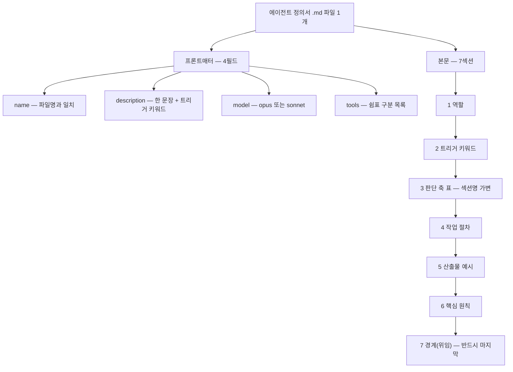

[앞 편](/blog/agentic-coding/thirty-agent-catalog/)은 서른 개가 각각 무엇을 하는지를 펼쳤다. 이 글은 그 서른 개가 **어떻게 쓰여 있는지**로 들어간다.

한 벌로 만들어진 에이전트 세트의 값어치는 개별 정의서의 완성도가 아니라 **스키마가 같다는 사실** 자체에서 나온다. 같은 자리에 같은 것이 적혀 있으면 새 에이전트를 만들 때 빈칸을 채우면 되고, 리뷰할 때 볼 곳이 정해지며, 자동으로 검사할 수도 있다. 그래서 이 글의 전반부는 스키마이고 후반부는 그 스키마가 실제로 얼마나 지켜졌는지다.

미리 말하면 결과는 깔끔하게 갈린다. **형식 항목은 30/30으로 완전히 균질한데, 안전장치 항목은 5/30 · 3/30 · 1/30으로 떨어진다.** 형식은 템플릿이 복제해 주지만 위험 인식은 복제되지 않기 때문이다.

> 이 글이 옮긴 원 자료의 작성 기준일은 **2026-07-26**이다. 필드 이름·모델 등급·도구 이름은 그 시점의 것이며 버전에 따라 바뀐다.
>
> 아래의 준수 건수(`30 / 30`, `22 / 30`, `5 / 30` 등)와 품질 대조 판정은 **원 자료가 정의서 30종을 관찰해 적은 값**이며 이 글이 측정한 것이 아니다. 이 글이 직접 센 자리에는 그렇다고 따로 표시했다.

## 용어 정리

[첫 편](/blog/agentic-coding/thirty-agent-catalog/)의 용어표에서 이 글이 쓰는 행만 추렸다.

| 용어 | 풀이 |
|---|---|
| **에이전트(Agent)** | 특정 도메인 업무만 전담하도록 시스템 프롬프트·도구·모델을 고정한 서브 실행 단위. 여기서는 `.md` 파일 1개 = 에이전트 1개 |
| **프론트매터(frontmatter)** | `.md` 최상단 `---` 사이의 YAML 블록. 에이전트의 이름·설명·모델·도구를 선언 |
| **트리거 키워드** | 사용자 발화에 이 단어가 나오면 해당 에이전트로 자동 라우팅되도록 심어 두는 어휘 목록 |
| **경계(위임)** | "이 요청은 내 일이 아니다"를 선언하고 다른 에이전트 이름을 지목하는 섹션. 역할 침범 방지 장치 |
| **OKR / KR** | Objective and Key Results. 정성 목표 1개 + 정량 지표 3~5개 |
| **PRD** | Product Requirements Document. 제품 요구사항 문서 |
| **CTR / CPC / CVR / CPA** | 클릭률 / 클릭당 비용 / 전환율 / 구매당 비용 |
| **few-shot** ★ | 지시만 주는 대신 완성된 예시를 함께 넣어 출력 형태를 고정하는 방식 |

**★를 붙인 마지막 행(few-shot)은 이 글이 더한 것**이고 나머지 일곱은 첫 편의 용어표에서 가져왔다 — 원 자료에는 이 말의 풀이 행이 없다. 아래 본문 섹션 표의 「목적」 칸과 [마지막 편](/blog/agentic-coding/dev-org-transfer/)이 옮긴 프롬프트 설계 기법에 그대로 쓰이기만 한다.

## 정의서 하나의 구조

### 프론트매터 4필드

원 자료의 관찰은 **30개 전부가 아래 4필드를 같은 순서로 갖고 있었고 선택 필드나 누락은 없었다**는 것이다.

| 필드 | 필수 | 형식 | 관찰된 실제 규칙 |
|---|---|---|---|
| `name` | 필수 | 소문자 하이픈 케이스 | 파일명과 항상 일치. `역할-명사` 또는 `대상-동작자` 형태(`lead-scorer`, `doc-updater`) |
| `description` | 필수 | 한 문장 + 트리거 키워드 | "무엇을 한다" 뒤에 반드시 `"키워드", "키워드" 자동 라우팅`을 덧붙임 |
| `model` | 필수 | `opus` 또는 `sonnet` | 판단·창작·진단은 opus, 분류·기록·정형 리포트는 sonnet |
| `tools` | 필수 | 쉼표 구분 목록 | 기본 `Read, Write, Edit, Bash, Grep`. 필요할 때만 `WebSearch` 추가, 불필요하면 `Grep` 제거 |

네 필드가 두 종류로 갈린다는 점을 봐야 한다. `name`과 `description`은 **누가 이 요청을 받을지**를 정하고, `model`과 `tools`는 **받은 뒤 무엇으로 처리할지**를 정한다. 앞의 둘이 라우팅 계층이고 뒤의 둘이 실행 계층이다 — 이렇게 갈라 읽는 것은 이 글의 정리다.

### 본문 7섹션

| # | 섹션 | 목적 | 관찰된 작성 규칙 |
|---|---|---|---|
| 1 | `## 역할` | 정체성 각인 | **인용 블록 비유 1개**로 시작 → 한 줄 정의 → 산출물 형태 한 문장. 30개 예외 없음 |
| 2 | `## 트리거 키워드` | 라우팅 | 4~5개 불릿. 한국어 구어체·영어 원어·업계 은어를 섞음 |
| 3 | 도메인 프레임 표 | 판단 결정론화 | 점수 가중치·등급 임계·분류 축·단계 정의를 **표로** 못박음 (섹션명은 에이전트마다 다름) |
| 4 | `## 작업 절차` | 실행 순서 | 번호 1~7단계. "입력 수집 → 처리 → 검증 → 산출 → 기록" 골격 |
| 5 | `## 산출물 예시` | few-shot | 조각이 아니라 **완성된 산출물 1건**을 통째로 제시. 일부는 2건(정상/이상 케이스) |
| 6 | `## 핵심 원칙` | 규범 | 3~7개. 대부분 "○○ 룰" 형태의 금지·필수 규칙 |
| 7 | `## 경계 (위임)` | 역할 종료 | "이런 요청이면 → 다른 에이전트 이름" 매핑. 반드시 마지막 |

> 3번 섹션은 이름이 고정돼 있지 않다. `6차원 스코어링 모델`, `8종 문의 분류`, `4종 에스컬레이션 트리거`, `6대 점검 영역`처럼 **"숫자 + 축 이름"으로 명명하는 것이 공통 습관**이다.
>
> 숫자를 제목에 박아 두면 모델이 산출물 개수를 임의로 줄이거나 늘리기 어려워진다. 형식 강제 장치로 기능한다.

**원 자료에서 이 절의 제목은 「본문 6섹션」인데, 표에는 1번부터 7번까지 일곱 행이 있다.** 바로 아래 빈 템플릿의 `##` 섹션을 세어도 일곱이다. 이 글은 표와 템플릿이 일치하는 쪽인 **7**을 따랐다 — 이 대조와 선택은 이 글이 한 것이다.

### 빈 템플릿

원 자료가 제시한 빈 템플릿은 이렇다. 위 두 표가 실제 파일에서 어떻게 배치되는지가 여기서 한 번에 보인다.

````markdown
---
name: agent-name
description: 무엇을 하는 에이전트인지 한 문장. "키워드1", "키워드2", "키워드3" 자동 라우팅.
model: opus
tools: Read, Write, Edit, Bash, Grep
---

# Agent Name — 한글 역할명

## 역할

> 비유: (익숙한 직업/상황에 빗댄 1~2문장. 무엇을 하고 무엇을 하지 않는지가 드러나야 한다.)

(한 줄 정의: 무엇을 입력받아 무엇을 산출하는가.)

## 트리거 키워드

- "구어체 표현", "정식 용어"
- "영어 원어", "업계 약어"
- "사용자가 실제로 던질 법한 문장"

## (N)대 (판단 축 이름)

| 축 | 가중치 / 임계 | 측정 항목 |
|---|---|---|
| 축 1 | 00점 / > 0.0% | 무엇을 보고 판단하는가 |
| 축 2 | 00점 / < 0.0% | 무엇을 보고 판단하는가 |

## 작업 절차

1. **입력 수집**: 어떤 데이터를 어디서 가져오는가
2. **처리**: 위 판단 축을 적용
3. **검증**: 신뢰도·이상치 점검, 임계 미달 시 사람 확인
4. **산출**: 정해진 형식으로 출력
5. **기록**: 어디에 남기는가
6. **승인 게이트**: 외부로 나가는 산출물은 사용자 승인 후 실행

## 산출물 예시

```markdown
(실제로 나와야 할 완성 산출물 1건을 통째로 붙인다. 요약이나 골격만 두지 않는다.)
```

## 핵심 원칙

- **○○ 룰**: 위반하면 안 되는 규칙을 이름 붙여 제시
- **판단 기준**: 애매할 때 무엇을 우선하는가
- **금지 사항**: 절대 하지 말아야 할 행동

## 경계 (위임)

- "이런 요청" → `other-agent`
- "저런 요청" → `another-agent`
- **외부 확장**: 우리 세트에 없는 영역은 부재를 명시하고 대체 경로를 적는다
````

템플릿의 `## 작업 절차`가 6단계인데 위 섹션 표는 그 자리에 「번호 1~7단계」라고 적어 두었다. 템플릿은 골격이고 표는 30종에서 관찰된 범위라고 읽으면 어긋나지 않는다 — 이렇게 읽는 것은 이 글의 정리다.

### 한 장으로 겹치면

위의 두 표와 빈 템플릿을 한 장으로 겹치면 정의서 파일 하나의 구조가 나온다.



**이 도식은 이 글이 그린 것**이므로 화살표마다 어디서 왔는지를 적어 둔다.

| 화살표 | 원문 근거 |
|---|---|
| 정의서 파일 → 프론트매터 / 본문 | 빈 템플릿이 한 파일 안에 `---` 블록과 그 아래 본문 섹션들을 함께 보인다 |
| 프론트매터 → `name`·`description`·`model`·`tools` | 프론트매터 표의 4행 |
| 본문 → 「1 역할」 | 본문 섹션 표의 1번 행 |
| 1 → 2 → … → 7 | 섹션 표가 1부터 7까지 번호를 매기고, 빈 템플릿이 같은 순서로 섹션을 배치한다 |
| 「7 경계(위임)」가 마지막 | 섹션 표 7번 행의 작성 규칙 — **"반드시 마지막"** |

프론트매터 쪽 네 화살표에는 순서가 없고 본문 쪽은 사슬로 이어진 이유가 여기 있다. 필드 네 개에 대해 원 자료가 적은 것은 「같은 순서로 갖고 있었다」는 관찰이지 어느 필드가 어느 필드를 요구한다는 서술이 아니어서, 이 글은 그 넷을 나란히 두었다.

## 모델·도구 배분 전량 대조

원 자료는 30개의 `model`·`tools` 선택이 자의적이지 않다고 보고 전량을 대조했다. 도구 변형은 세 가지뿐이다.

| 도구 변형 | 개수 | 해당 에이전트 |
|---|---|---|
| `Read, Write, Edit, Bash, Grep` (기본 5종) | 25 | 아래 두 행에 이름이 없는 나머지 25종 전부 |
| 기본 5종 + `WebSearch` | 2 | `seo-strategist`, `competitor-monitor` |
| `Read, Write, Edit, Bash` (Grep 제외) | 3 | `escalation-router`, `attendance-tracker`, `deploy-manager` |

세 행의 개수를 더하면 25 + 2 + 3 = 30이다. **아래 상세표에는 `tools` 열을 두지 않았다** — 변형 5종의 정체를 위 요약표가 에이전트 이름으로 이미 지목했고, 나머지 25종은 기본 5종이라 열을 채우면 같은 글자가 25번 반복될 뿐이다. 원 자료의 상세표에는 그 열이 있다.

| 에이전트 | model | 선택 근거(정의서 성격에서 추론) |
|---|---|---|
| `lead-scorer` | sonnet | 가중치 표 적용 = 정형 계산 |
| `crm-manager` | sonnet | 기록·단계 갱신 |
| `proposal-writer` | **opus** | 고객 이해 서술·설득 문서 작성 |
| `meeting-prep` | sonnet | 기존 이력의 요약·압축 |
| `sales-followup` | sonnet | 짧은 정형 메일 |
| `copywriter` | **opus** | 창작·프레임워크 선택 판단 |
| `seo-strategist` | sonnet | SERP 분석에 실검색 필요 |
| `content-creator` | **opus** | 스크립트 창작 |
| `ad-optimizer` | sonnet | 임계값 대조 = 조회형 판정 |
| `social-media-manager` | sonnet | 캘린더 배치 = 규칙 적용 |
| `cs-responder` | **opus** | 감정 판단 + 톤 조절 + 다축 분류 |
| `faq-builder` | sonnet | 클러스터링·정형 문서화 |
| `escalation-router` | sonnet | 룰 매칭 알림. 코드 탐색 불필요 |
| `onboarding-guide` | sonnet | 날짜 기반 시퀀스 실행 |
| `recruiter` | **opus** | JD 설계·질문 설계 = 창작 판단 |
| `payroll-manager` | sonnet | 요율 적용 계산 |
| `attendance-tracker` | sonnet | 기록 집계. 코드 탐색 불필요 |
| `performance-reviewer` | sonnet | OKR 점수 갱신·어젠다 생성 |
| `bookkeeper` | sonnet | 분개 룰 적용 |
| `expense-processor` | **opus** | OCR 결과 해석 + 계정 판단 |
| `budget-analyst` | **opus** | 예측·인과 해석 |
| `financial-reporter` | sonnet | 집계·정형 리포트 |
| `code-reviewer` | **opus** | 코드 의미 이해·심각도 판단 |
| `debug-assistant` | **opus** | 근본 원인 추론 |
| `deploy-manager` | sonnet | CLI 실행·체크리스트. 코드 탐색 불필요 |
| `doc-updater` | sonnet | diff 반영 = 기계적 갱신 |
| `product-strategist` | **opus** | 전략 판단·PRD 작성 |
| `roadmap-planner` | sonnet | 점수 기반 배치 |
| `kpi-analyst` | sonnet | 집계·추세 서술 |
| `competitor-monitor` | sonnet | 외부 정보 수집 필요 |

「선택 근거」 열이 도구 변형과 모델 선택 **양쪽**을 설명한다는 점을 봐야 한다. `escalation-router`·`attendance-tracker`·`deploy-manager` 세 행에 붙은 「코드 탐색 불필요」가 `Grep`을 뺀 이유이고, `seo-strategist`·`competitor-monitor` 두 행의 「실검색 필요」·「외부 정보 수집 필요」가 `WebSearch`를 더한 이유다. 다섯 행이 요약표의 변형 5종과 그대로 맞는다 — 이 대조는 이 글이 두 표를 맞춰 본 것이다.

> 읽어 낼 수 있는 규칙은 하나다. **"쓰는(write) 일이면 상위 모델, 세는(count) 일이면 경량 모델."**
>
> 창작·해석·추론이 들어가면 `opus`, 규칙 적용·집계·기록이면 `sonnet`이다. 30개 중 10개만 상위 모델을 쓴 배분을 원 자료는 비용 통제 관점의 실무적 선택으로 적었다.

## 잘 쓰인 정의서와 그렇지 않은 것

여기부터는 같은 스키마로 쓰인 30개를 비교해 나온 품질 편차다. 아래 대조표는 **원 자료가 실제 정의서에서 관찰한 것만 담은 것**이며 일반론으로 세운 기준이 아니다.

| 항목 | 나쁜 예 (관찰된 문제) | 좋은 예 (관찰된 처리) |
|---|---|---|
| 역할 정의 | "마케팅을 도와준다" 같은 범용 서술 | 비유 1개 + 한 줄 정의 + 산출 형태. 비유가 권한 제약까지 표현("판독의는 치료하지 않는다") |
| `description` | 기능 설명만 있어 라우팅 근거가 없음 | 설명 뒤에 트리거 키워드를 문장으로 심어 자동 호출 근거를 명시 |
| 출력 형식 | "적절한 분량으로 정리" | "8섹션", "6차원 100점", "5문장 이내"처럼 숫자로 고정 |
| 판정 기준 | "상황에 맞게 판단" | CTR 1.5%/1%, 에러율 5%, OCR 80% 같은 임계값 표 |
| 예시 | 없거나 조각만 제시 | 완성 산출물 1건을 통째로. 이상 케이스가 있으면 2건(정상/롤백, 정상/이탈위험) |
| 실패 모드 | 언급 없음 | 사고 경험을 규칙으로("병렬 절대 금지"), 흔한 오류를 미리 부정형으로 차단 |
| 권한 | 편의상 전체 도구 부여 | 필요 없는 `Grep` 제거, 검색이 필요한 2개만 `WebSearch` 부여 |
| 모델 선택 | 전부 상위 모델 | 판단·창작·진단 10종만 `opus`, 나머지 20종은 `sonnet` |
| 사람 게이트 | 자동 발송까지 직행 | "사용자 승인 후 발송", "신뢰도 80% 미만 자동 처리 금지" |
| 시효성 | 요율·법 기준을 그냥 하드코딩 | 기준일 명시 + 확인처 URL + "1월/7월 갱신 점검" 지시 |
| 책임 범위 | 면책 없음 | `## 면책 / 확장 가이드` 섹션을 별도 신설하고 전문가 검증 권장 |
| 경계 섹션 | **존재하지 않는 에이전트 이름을 지목**. 30종에 없는 이름 12개가 그대로 남음(아래 절의 목록) | "(본 30개 내)" 표기, 또는 "**외부 확장**: … 또는 본인 담당자"로 부재를 명시 |

열두 행의 「나쁜 예」 열을 훑으면 두 종류가 섞여 있다. 앞의 다섯(역할 정의 · `description` · 출력 형식 · 판정 기준 · 예시)은 **모호해서** 나쁜 것이고 — "적절한 분량으로", "상황에 맞게 판단" — 뒤의 일곱(실패 모드 · 권한 · 모델 선택 · 사람 게이트 · 시효성 · 책임 범위 · 경계 섹션)은 **빠져 있거나 검증되지 않아서** 나쁜 것이다. 5 + 7 = 12로 열두 행이 남김없이 갈린다. **이렇게 갈라 읽는 것은 이 글의 정리다** — 원 자료는 이 표를 항목별 대조로만 두고 따로 묶지 않는다.

## 가장 큰 결함 — 끊어진 위임 링크

원 자료가 30종에서 가장 큰 결함으로 지목한 것은 경계 섹션이다. 통합 가이드는 "(외부 위임)" 표기 규약을 만들어 30개에 없는 에이전트를 구분했지만, **개별 정의서 다수가 이 규약을 따르지 않았다**는 것이 관찰이다. 원 자료가 이름을 든 것은 `recruiter`·`code-reviewer`·`debug-assistant`·`bookkeeper`·`product-strategist`·`kpi-analyst`·`meeting-prep`·`attendance-tracker` **여덟 종**이다.

실재하지 않는데 지목된 이름은 다음 12개다.

| 지목된 이름 | 지목한 에이전트 |
|---|---|
| `meeting-secretary` | `meeting-prep` |
| `build-error-resolver` | `code-reviewer`·`debug-assistant` |
| `security-reviewer` | `code-reviewer`·`debug-assistant` |
| `architect` | `code-reviewer`·`doc-updater` |
| `refactor-cleaner` | `code-reviewer`·`doc-updater` |
| `hr-manager` | `recruiter` |
| `musk-hiring-evaluator` | `recruiter` |
| `labor-consultant` | `recruiter`·`attendance-tracker`·`performance-reviewer` |
| `financial-accountant` | `bookkeeper`·`expense-processor`·`budget-analyst` |
| `revenue-processor` | `expense-processor`·`kpi-analyst` |
| `feedback-analyst` | `product-strategist`·`kpi-analyst` |
| `ci-bi-strategist` | `product-strategist`·`competitor-monitor` |

이 상태에서 사용자가 "노무 분쟁 상담해 줘"라고 하면 에이전트는 존재하지 않는 `labor-consultant`로 넘기려다 실패하거나, 스스로 처리해 버린다. 두 결과 모두 나쁘다.

### 여덟인가 열셋인가

위 표의 오른쪽 열에 나오는 이름을 중복 없이 모으면 **13종**이다. 원 자료가 산문에서 든 여덟 종에, 표에만 등장하는 다섯 종이 더 붙는다.

| | 에이전트 |
|---|---|
| 산문과 표에 모두 (8) | `recruiter` · `code-reviewer` · `debug-assistant` · `bookkeeper` · `product-strategist` · `kpi-analyst` · `meeting-prep` · `attendance-tracker` |
| 표에만 (5) | `doc-updater` · `performance-reviewer` · `expense-processor` · `budget-analyst` · `competitor-monitor` |

8 + 5 = 13이다. 뒤에 나오는 준수 현황표는 「위임 대상이 실재 **22 / 30**」으로 적는데, 30에서 22를 빼면 8이라 그 값은 산문 쪽과 맞고 표 쪽과는 맞지 않는다. **이 대조는 이 글이 표의 오른쪽 열을 중복 없이 세어 본 결과다.** 어느 쪽이 의도된 분모인지는 이 글이 가리지 않는다.

### 교훈은 린트다

원 자료가 이 결함에서 끌어낸 결론은 정의서를 더 잘 쓰자는 쪽이 아니다.

> **위임 대상은 레지스트리와 대조 검증이 필요하다.** 설치된 에이전트 목록과 정의서의 경계 섹션을 자동으로 대조하는 린트를 두는 것이, 정의서를 잘 쓰는 것보다 현실적인 해법이다.

바로 위 「여덟인가 열셋인가」가 그 주장이 겨냥하는 자리이기도 하다. 같은 문서 안의 산문과 표가 여덟과 열셋으로 갈리는데, 그 어긋남은 둘을 나란히 놓고 세어 보기 전까지 드러나지 않는다.

## 좋은 정의서 체크리스트

```markdown
[ ] name이 파일명과 일치하고, 역할이 이름만으로 짐작되는가
[ ] description에 트리거 키워드가 실제 사용자 어휘로 들어갔는가
[ ] model 선택에 근거가 있는가 (판단형 opus / 정형 sonnet)
[ ] tools에서 쓰지 않는 도구를 제거했는가
[ ] 판단 기준이 임계값 표로 존재하는가 ("적절히"가 없는가)
[ ] 산출물 예시가 완성본 1건 이상인가
[ ] 외부로 나가는 산출물 앞에 사람 승인 게이트가 있는가
[ ] 시효성 있는 수치에 기준일과 확인처가 붙었는가
[ ] 경계 섹션의 위임 대상이 실제로 존재하는가
[ ] 하지 말아야 할 행동이 부정형으로 명시됐는가
```

열 항목 중 아홉 번째만 **정의서 바깥을 봐야** 판정된다. 나머지 아홉은 파일 하나를 열어 놓고 확인할 수 있지만, 「위임 대상이 실제로 존재하는가」는 설치된 에이전트 목록과 대조해야 답이 나온다. 앞 절의 린트 제안이 이 한 항목을 겨냥한다 — 이렇게 잇는 것은 이 글의 정리다.

## 30종 준수 현황

체크리스트 항목별로 30개를 대조한 결과다. 편차가 어디서 생기는지가 드러난다.

| 점검 항목 | 준수 | 비고 |
|---|---|---|
| 프론트매터 4필드 완비 | 30 / 30 | 순서까지 동일. 가장 잘 지켜진 항목 |
| 비유로 시작하는 역할 정의 | 30 / 30 | 예외 없음 |
| 트리거 키워드 섹션 존재 | 30 / 30 | — |
| 숫자로 고정된 판단 축 표 | 30 / 30 | 섹션명은 다르나 형태는 동일 |
| 완성 산출물 예시 1건 이상 | 30 / 30 | 2건 제시가 7종(정상/이상 대조) |
| 경계(위임) 섹션 존재 | 30 / 30 | — |
| **위임 대상이 실재** | **22 / 30** | 8종에 끊어진 링크(위 「끊어진 위임 링크」 절) |
| 도구 권한 축소 적용 | 5 / 30 | 나머지 25종은 기본 5종을 그대로 사용 |
| 외부 발송 앞 승인 게이트 | 3 / 30 | `sales-followup`·`cs-responder`·`expense-processor` |
| 시효성 수치에 기준일·출처 | 1 / 30 | `payroll-manager`만 |
| 면책 섹션 | 1 / 30 | `payroll-manager`만 |

열한 행 중 **여섯 행이 30 / 30**이고 **다섯 행이 그 아래**다. 30 / 30인 여섯은 전부 「그 섹션·필드가 있는가」를 묻는 형식 항목이다. 아래로 떨어진 다섯은 다시 둘로 갈린다 — **넷**(도구 권한 축소 · 승인 게이트 · 기준일·출처 · 면책)은 작성자가 도메인 위험을 인식해야 들어가는 항목이고, **하나**(위임 대상이 실재)는 앞 절에서 본 대로 파일 바깥의 목록과 대조해야 판정되는 항목이다. 6 + 4 + 1 = 11로 열한 행이 남김없이 갈린다 — 이 집계와 구분은 이 글이 표를 세어 한 것이다.

원 자료가 붙인 해석은 이렇다.

> 형식(스키마·비유·예시)은 100% 균질한데, **안전장치(권한·승인·면책)는 개별 작성자의 재량에 맡겨져 편차가 크다.**

형식은 템플릿으로 복제되지만 안전장치는 도메인 위험을 인식한 사람만 넣기 때문이라는 것이 원 자료의 진단이다. 급여처럼 법적 리스크가 명백한 곳에만 면책이 붙었고, 고객에게 메일이 나가는 다른 에이전트들에는 게이트가 없다.

> 조직에 적용할 때의 교훈은 명확하다. **안전장치는 정의서 작성자의 성실성이 아니라 리뷰 게이트로 강제해야 한다.**
>
> 형식 준수는 템플릿이 해결하지만, 위험 인식은 템플릿이 대신해 주지 않는다. 정의서 리뷰 체크리스트(위 「좋은 정의서 체크리스트」 절)가 필요한 이유다.

「도구 권한 축소 적용 5 / 30」은 [첫 편](/blog/agentic-coding/thirty-agent-catalog/)의 관찰과 이어진다. **그 5종이 이 글 앞부분 요약표의 변형 5종(`Grep` 제외 3 + `WebSearch` 추가 2)과 같은 집합이라는 것은 이 글이 두 표를 대 본 결과다.** 나머지 25종은 기본 5종을 그대로 받았다. **권한에 손을 댄 것은 서른 종 중 다섯**이며, 그 다섯조차 첫 편이 본 대로 `Bash`는 그대로 갖고 있다.

## 다음 편으로

이 글은 스키마와 그 준수 상태를 봤다. 정의서 하나가 프론트매터 4필드와 본문 7섹션으로 이뤄진다는 것, 그 형식은 30/30으로 복제됐다는 것, 그리고 권한·승인·면책·시효성은 복제되지 않았다는 것이다.

여기서 실무로 가져갈 것은 두 가지로 좁혀진다. **정의서에 무엇을 적을지는 템플릿이 해결하고, 무엇이 빠졌는지는 린트와 리뷰 게이트가 해결한다.** 경계 섹션의 위임 대상을 레지스트리와 대조하는 것도, 외부 발송 앞 승인 게이트를 요구하는 것도 사람의 성실성이 아니라 자동 검사에 걸어야 하는 항목이다.

[마지막 편](/blog/agentic-coding/dev-org-transfer/)은 이 세트에서 개발조직으로 실제로 옮길 것과 옮기지 않을 것을 가른다. 30종 중 개발 부서 4종을 자세히 보고, 재사용 후보와 참고만 할 것을 나누고, 그리고 이 세트에 **비어 있는 여섯 자리**를 짚는다.
