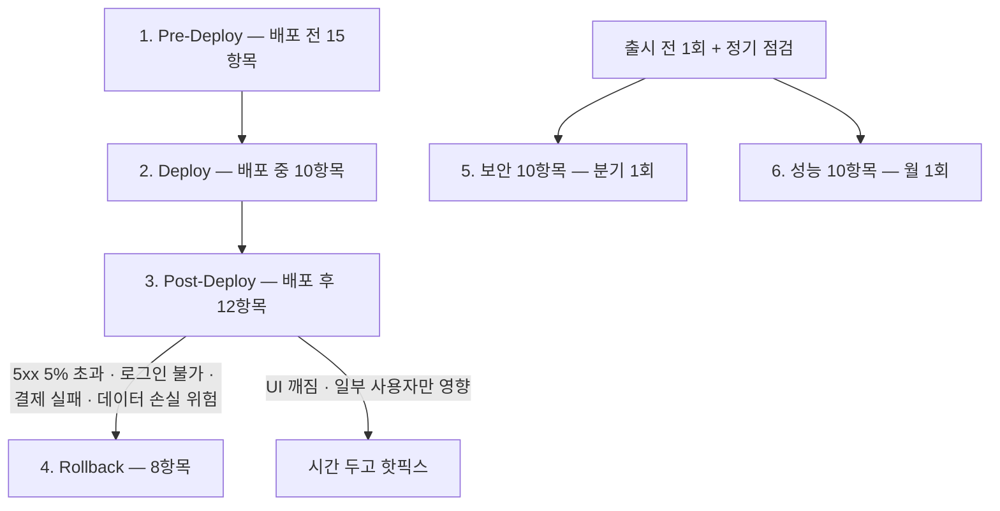
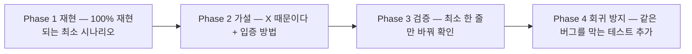

체크리스트가 65개라는 사실보다 중요한 것은 그 65개를 **매번 다 하지 않는다**는 것이다. 여섯 섹션의 점검 주기가 각각 다르고, 그 주기를 모르면 체크리스트는 첫 배포에 한 번 쓰이고 버려진다.

이 글은 [3계층 통제](/blog/agentic-coding/rules-hooks-skills-layers/)로 시작한 시리즈의 마지막 편이다. [앞 편](/blog/agentic-coding/empty-folder-to-deploy/)이 하나를 만들어 한 번 내보내는 데까지였다면, 이 글은 그 뒤 — **매번 내보낼 때 무엇을 확인하고, 터졌을 때 무엇부터 하는가**다.

이 글에서 가장 오래 남는 규율은 원 자료가 "The Iron Law"라 이름 붙인 한 줄이다. **재현 없이 가설 없다. 가설 없이 수정 없다. 수정 후 회귀 테스트 없이 완료 없다.**

> 이 글이 옮긴 원 자료의 작성 기준일은 **2026-07-26**이다. 성능 지표 이름과 기준값, 플랜별 타임아웃은 그 시점의 것이다.
>
> 아래의 65항목·13행 함정 카탈로그·10패턴·MCP 6종은 **원 자료가 제시한 예제**이며, 이 글이 운영해 얻은 실적이 아니다. **특히 디버깅 절의 시간·성공률 비교는 예시 값이다** — 해당 표 아래에 원 자료의 고지를 옮겨 두었다.

## 용어 정리

시리즈 [첫 편](/blog/agentic-coding/rules-hooks-skills-layers/)의 용어표 31행 중 이 글이 쓰는 행만 추렸다.

| 용어 | 풀이 |
|---|---|
| **Rules** | 에이전트가 매 세션 자동으로 읽는 정적 지침서(`.md`). 강제력 없음, 규범 역할 |
| **Hooks** | 특정 이벤트 발생 시 자동 실행되는 스크립트. 도구 호출 자체를 차단할 수 있음 |
| **MRE** | Minimum Reproducible Example. 버그를 재현하는 가장 작은 코드 |
| **5-Why** | "왜?"를 5번 물어 표면 증상이 아닌 근본 원인에 도달하는 분석 기법 |
| **git bisect** | 이진 탐색으로 회귀 버그를 만든 커밋을 찾는 Git 명령 |
| **회귀 테스트** | 고친 버그가 다시 나오지 않는지 자동으로 검사하는 테스트 |
| **RLS** | Row Level Security. DB 행 단위 접근 제어. 애플리케이션이 아니라 DB가 막는다 |
| **auth.uid()** | 현재 요청의 JWT에서 추출된 사용자 UUID를 반환하는 Supabase 함수 |
| **service_role 키** | RLS를 우회하는 관리자 키. 서버 사이드 전용, 클라이언트 노출 시 전체 데이터 유출 |
| **anon 키** | 클라이언트에 노출해도 되는 공개 키. RLS의 통제를 받는다 |
| **Smoke Test** | 배포 직후 핵심 경로가 살아 있는지 5분 내로 확인하는 최소 검증 |
| **Core Web Vitals** | LCP·FID(INP)·CLS. 사용자 체감 성능을 측정하는 표준 지표 |
| **MCP** | Model Context Protocol. 외부 도구·데이터 소스를 에이전트에 연결하는 규약 |
| **Seed 데이터** | 개발·테스트용으로 미리 넣어두는 샘플 데이터 |

`git bisect`·`auth.uid()`·`service_role`·`anon` 은 아래 본문이 영문 이름 대신 「이진 탐색」·「인증 함수」·「관리자 키」·「공개 키」라는 한국어로만 쓴다. 그래도 행을 남겼다 — 다른 자료에서는 영문 이름으로 나오기 때문이다.

## 배포 체크리스트 6섹션 65항목

| 섹션 | 시점 | 항목 수 | 점검 빈도 |
|---|---|---|---|
| 1. Pre-Deploy | 배포 전 | 15 | 매 배포 |
| 2. Deploy | 배포 중 | 10 | 매 배포 |
| 3. Post-Deploy | 배포 후 | 12 | 매 배포 |
| 4. Rollback | 비상 상황 | 8 | 사고 발생 시 |
| 5. 보안 | 출시 전 + 정기 | 10 | 출시 전 1회 + 분기 1회 |
| 6. 성능 | 출시 전 + 정기 | 10 | 출시 전 1회 + 월 1회 |

15 + 10 + 12 + 8 + 10 + 10 = **65.** 여섯 행의 항목 수를 더하면 제목의 숫자와 맞는다.

> **체크리스트를 대하는 태도**: "모든 항목을 매 배포마다 한다"는 뜻이 아니다.
>
> 1~3섹션은 매 배포, 4섹션은 사고 시, 5~6섹션은 정기 점검이다.
>
> 자료의 조언은 "외우려 하지 말고 첫 배포 때 출력해 옆에 두고 따라가라. 두세 번 반복하면 몸이 외운다"이다.

「점검 빈도」 열을 흐름으로 옮기면 이렇게 된다.

**이 흐름도는 이 글이 새로 그린 것이다.** 세 갈래의 근거는 전부 위 표와 아래 롤백 판단 기준 표에 있다 — 1~3섹션의 순서는 「시점」 열의 배포 전·중·후이고, 3에서 4로 가는 조건과 옆으로 빠지는 조건은 롤백 판단 기준 표의 「즉시」 네 행과 「시간 두고 핫픽스」 두 행이며, 5·6섹션이 별도 줄기인 것은 원 자료가 *"1~3섹션은 매 배포, 4섹션은 사고 시, 5~6섹션은 정기 점검"* 이라고 직접 적은 문장이다.

### Pre-Deploy 15항목

| # | 항목 | 확인 방법 | 통과 기준 |
|---|---|---|---|
| 1.1 | 타입 체크 통과 | 타입체크 스크립트 실행 | 에러 0건 |
| 1.2 | 린트 통과 | 린트 스크립트 실행 | 경고·에러 0건 |
| 1.3 | 단위 테스트 통과 | 테스트 스위트 실행 | 전부 통과, 커버리지 80% 이상 권장 |
| 1.4 | 로컬 프로덕션 빌드 성공 | 빌드 명령 실행 | 산출물 생성, 에러 없음 |
| 1.5 | 환경변수 키 누락 없음 | 예제 파일과 실제 파일의 키 목록 비교 | 차이 없음 |
| 1.6 | 운영 환경변수 등록 확인 | 호스팅 콘솔의 production 스코프 조회 | 로컬의 모든 키가 존재 |
| 1.7 | 시크릿 노출 검사 | 저장소 전체에 키 패턴 정규식 검색 | 결과 없음 |
| 1.8 | 마이그레이션 파일 순서 확인 | 마이그레이션 디렉터리 정렬 확인 | 타임스탬프 순서가 올바름 |
| 1.9 | 마이그레이션 로컬 적용 성공 | 로컬 DB 리셋 후 재적용 | 에러 없이 완료 |
| 1.10 | RLS 활성화 확인 | RLS 미적용 테이블 조회 쿼리 | 결과 없음 |
| 1.11 | 작업 디렉터리 깨끗함 | 상태 조회 | 미커밋 변경 없음 |
| 1.12 | 기본 브랜치 최신화 | 원격 fetch 후 상태 비교 | 원격과 동기화됨 |
| 1.13 | 잠금 파일 커밋됨 | 마지막 커밋의 잠금 파일 변경 이력 | 누락 없음 |
| 1.14 | 변경 이력 갱신 | 변경 이력 문서 확인 | 이번 배포 내용이 기록됨 |
| 1.15 | 자동 검증 스크립트 통과 | 통합 사전 점검 스크립트 실행 | 종료코드 0 |

열다섯 항목 중 **열넷**은 「통과 기준」이 온전히 판정 가능한 값이다 — 0건 · 차이 없음 · 결과 없음 · 종료코드 0. "확인했다"로 끝나는 칸이 없다는 것이 이 표가 체크리스트로 기능하는 이유다. 예외는 1.3 하나다 — *"전부 통과, 커버리지 80% 이상 권장"* 에서 앞은 판정 가능하지만 뒤의 「권장」은 통과·실패를 가르지 않는다. 한 칸에 기준과 권고가 함께 들어간 자리는 열다섯 중 이것뿐이다.

### Deploy 10항목

| # | 항목 | 통과 기준 |
|---|---|---|
| 2.1 | 기본 브랜치에 push | CI 파이프라인이 자동 트리거됨 |
| 2.2 | 빌드 시작 확인 | 최신 배포가 빌드 상태로 표시 |
| 2.3 | 빌드 로그 실시간 모니터링 | 에러 로그 없음 |
| 2.4 | 빌드 시간 확인 | 5분 미만. 평소의 2배 이상이면 캐시 문제 의심 |
| 2.5 | 빌드 성공 | 배포가 준비 완료 상태 |
| 2.6 | 운영 DB 마이그레이션 적용 | 적용 성공 |
| 2.7 | 마이그레이션 후 스키마 검증 | 새 테이블·컬럼이 운영에 반영됨 |
| 2.8 | 운영 도메인 연결 | 도메인의 최신 배포가 방금 배포한 버전 |
| 2.9 | HTTPS 인증서 활성 | HSTS 헤더 응답 확인 |
| 2.10 | CDN 캐시 무효화 | 필요 시에만. 외부 CDN 사용 시 수동 처리 |

2.4가 유일하게 **상대 기준**을 든다 — "평소의 2배 이상이면 캐시 문제 의심". 절대값(5분)과 추세 비교를 한 칸에 함께 둔 항목은 이 열 개 중 이것뿐이다.

### Post-Deploy 12항목

| # | 분류 | 항목 | 통과 기준 |
|---|---|---|---|
| 3.1 | Smoke | 홈페이지 응답 | 200 |
| 3.2 | Smoke | 헬스체크 API 응답 | 정상 상태 반환 |
| 3.3 | Smoke | 로그인 플로우 동작 | 로그인 → 대시보드 진입 성공 |
| 3.4 | Smoke | DB 조회 성공 | 로그인 후 본인 데이터 표시 (RLS 정상) |
| 3.5 | Smoke | 자동 smoke test 통과 | 종료코드 0 |
| 3.6 | 모니터링 | 트래픽·에러율 | 첫 1시간 5xx 에러율 1% 미만 |
| 3.7 | 모니터링 | 에러 트래킹 | 배포 직후 신규 에러 알림 없음 |
| 3.8 | 모니터링 | DB 로그 | 401/403/500 비율이 평소 수준 |
| 3.9 | 공지 | 팀 알림 발송 | 버전·URL·커밋 수·빌드 시간·변경 이력 링크 포함 |
| 3.10 | 공지 | 릴리스 태그 생성 | 태그 push + 릴리스 노트 작성 |
| 3.11 | 24h | 핵심 KPI 비교 | 전일 대비 20% 이상 하락 시 롤백 검토 |
| 3.12 | 24h | 고객 문의 모니터링 | "안 된다" 류 문의가 평소보다 많으면 핫픽스 또는 롤백 |

**3.11이 이 체크리스트에서 가장 중요한 항목이다.** 기술 지표(에러율·응답시간)가 정상인데 전환율만 떨어지는 배포가 존재한다. 원 자료는 여기에 *"에러 없이 실패하는 배포를 잡는 유일한 항목이 KPI 비교다"* 라고 적는데, **같은 표의 3.12(고객 문의 모니터링)도 에러 없이 걸린다** — "안 된다" 류 문의가 늘었다는 신호에 에러 로그가 필요하지 않기 때문이다. 에러 없이 실패하는 배포를 잡는 항목은 둘이고, 3.11이 그중 **자동으로 재는 쪽**이다.

열두 항목이 「분류」 열에서 Smoke 5 · 모니터링 3 · 공지 2 · 24h 2로 갈린다. 앞의 여덟은 배포 직후에 끝나고, 뒤의 넷 중 둘(3.11·3.12)만 다음 날까지 열려 있다.

### Rollback — 판단 기준과 절차

| 상황 | 즉시 롤백? |
|---|---|
| 5xx 에러율 5% 초과 | 즉시 |
| 로그인 불가 | 즉시 |
| 결제 실패 | 즉시 |
| 데이터 손실 위험 | 즉시 |
| UI 깨짐 (기능은 정상) | 시간 두고 핫픽스 |
| 일부 사용자만 영향 | 시간 두고 핫픽스 |

> **원칙**: 고치는 것보다 되돌리는 게 빠르다. 목표는 5분 내 롤백이다.
>
> 장애 중에 원인을 찾겠다는 판단이 장애 시간을 몇 배로 늘린다.

| # | 절차 | 내용 |
|---|---|---|
| 4.1 | 이전 배포 식별 | 직전 정상 배포 URL 확인 |
| 4.2 | 프로덕션 승격 | 이전 배포를 프로덕션으로 승격 (수초 내) |
| 4.3 | 도메인 복원 확인 | 버전 엔드포인트가 이전 버전을 응답 |
| 4.4 | 문제 커밋 revert | 되돌리는 새 커밋 생성. **강제 푸시 금지** |
| 4.5 | 롤백 헬퍼 실행 | 호스팅·Git 동시 롤백 가이드 |
| 4.6 | 마이그레이션 호환성 점검 | 컬럼 추가는 안전 / 삭제·이름 변경은 위험 |
| 4.7 | 다운 마이그레이션 | 반드시 백업 후 진행. 데이터 손실 가능 |
| 4.8 | 인시던트 리포트 작성 | 발생·영향·근본원인·해결·재발방지 5블록 |

> ### ⚠️ 이 섹션은 표가 둘인데 항목 수는 여덟이다
>
> 롤백 섹션에는 표가 두 개 있다 — **판단 기준 6행**과 **절차 8행**. 6 + 8 = 14로 세면 안 된다.
>
> 위 6섹션 표가 Rollback의 항목 수를 **8**로 적었고, 번호도 절차 표에만 `4.1`~`4.8`로 붙어 있다. 판단 기준 표의 여섯 행에는 번호가 없다 — 그것은 체크할 항목이 아니라 **절차에 들어갈지 말지를 가르는 문**이다.
>
> 검산이 가능하다. 14로 세면 15 + 10 + 12 + **14** + 10 + 10 = **71**이 되어 65와 맞지 않는다. **이 검산은 이 글의 정리이며, 원 자료는 6섹션 표에 8을 적어 둘 뿐 두 표의 관계를 따로 설명하지 않는다.**

4.4의 「강제 푸시 금지」는 이 시리즈 [첫 편](/blog/agentic-coding/rules-hooks-skills-layers/)의 차단 규칙 7종 중 5번(`git push --force` + `main|master`)과 같은 것을 막는다. 한쪽은 사람이 지킬 절차로, 다른 쪽은 훅이 강제하는 규칙으로 적혀 있다.

### 보안 10항목

| # | 분류 | 항목 | 통과 기준 |
|---|---|---|---|
| 5.1 | 시크릿 | 클라이언트 번들에 시크릿 미노출 | 공개 접두사 변수에 SECRET·PRIVATE·SERVICE 키워드 없음 |
| 5.2 | 시크릿 | 로컬 환경파일이 무시 목록에 포함 | 무시 확인 명령이 해당 파일을 출력 |
| 5.3 | 시크릿 | CI 시크릿 저장소에 운영 키 저장 | 배포 토큰·관리자 키가 등록됨 |
| 5.4 | RLS | 모든 사용자 대상 테이블 RLS 활성 | 미적용 테이블 조회 결과 없음 |
| 5.5 | RLS | 작업별 정책 분리 | 테이블마다 SELECT/INSERT/UPDATE/DELETE 정책 확인 |
| 5.6 | RLS | 관리자 키는 서버에서만 사용 | 클라이언트는 공개 키만 사용 |
| 5.7 | 전송 | HTTPS 강제 (HSTS) | HSTS 헤더 설정 |
| 5.8 | 전송 | CORS 허용 도메인 제한 | 와일드카드 금지, 실제 도메인만 허용 |
| 5.9 | 전송 | CSP 헤더 설정 | 스크립트·이미지 소스 제한 |
| 5.10 | 인가 | 관리자 라우트 보호 | 미인증 접근 시 리다이렉트 또는 401 |

시크릿 3 · RLS 3 · 전송 3 · 인가 1로 갈린다. 「인가」 분류에만 항목이 하나인 것은 나머지 인가 판정이 RLS 세 항목으로 DB 쪽에 내려가 있기 때문이다 — 5.4~5.6이 「누가 무엇을 읽을 수 있는가」를 이미 맡고 있고, 5.10은 그것으로 덮이지 않는 **화면 단위 접근**을 맡는다. **이렇게 갈라 읽는 것은 이 글의 정리이며, 원 자료는 「분류」 열에 네 이름을 붙일 뿐 항목 수가 왜 3·3·3·1인지 적지 않는다.**

### 성능 10항목

| # | 분류 | 항목 | 기준 |
|---|---|---|---|
| 6.1 | Vitals | 성능 점수 | 90 이상 |
| 6.2 | Vitals | LCP | 2.5초 미만 |
| 6.3 | Vitals | FID | 100ms 미만 |
| 6.4 | Vitals | CLS | 0.1 미만 |
| 6.5 | 이미지 | 최적화 컴포넌트 사용 | 원시 이미지 태그 잔존 없음 |
| 6.6 | 이미지 | 이미지 용량 | 200KB 미만 (대형 히어로 제외) |
| 6.7 | 캐시 | 정적 자산 캐시 헤더 | 장기 캐시 적용 |
| 6.8 | 번들 | 번들 크기 분석 | 500KB 초과 라이브러리는 동적 임포트로 분할 |
| 6.9 | DB | 자주 조회되는 컬럼 인덱스 | 조건절에 쓰는 컬럼에 인덱스 존재 |
| 6.10 | DB | N+1 쿼리 점검 | 평균 100ms 초과 쿼리는 인덱스 추가 또는 컬럼 제한 |

> ### ⚠️ 6.3의 지표 이름이 이 글 안의 다른 자리와 다르다
>
> 이 글 맨 앞의 용어 정리는 Core Web Vitals를 **`LCP·FID(INP)·CLS`** 로 적어 INP를 괄호로 병기한다. 위 6.3행은 **`FID`** 만 적는다. **같은 원 자료 안의 두 자리다.**
>
> Core Web Vitals는 원 자료가 만든 것이 아니라 공개된 웹 표준 지표이므로 지표 이름을 그대로 옮긴다 — 병기된 쪽의 이름이 **INP**다.
>
> 이 글이 확인할 수 있는 것은 **원 자료가 용어 풀이에서는 `FID(INP)`로 병기하고 체크리스트에서는 `FID`만 적는다**는 사실과, 그것이 **2026-07-26 기준**이라는 것까지다. 어느 이름이 현재 표준의 것인지는 표준 문서를 직접 확인해야 한다.

6.9와 6.10만 분류가 「DB」다. 나머지 여덟이 브라우저에 도착한 뒤의 문제인 반면 이 둘은 응답을 만들기 전의 문제다.

### 자주 만나는 배포 실패

| 증상 | 원인 | 해결 |
|---|---|---|
| 빌드 실패: 모듈을 찾을 수 없음 | 의존성 설치 누락 | 의존성·빌드 캐시 삭제 후 재설치·재빌드 |
| 환경변수 누락 경고 | 호스팅 콘솔에 미등록 | 콘솔에서 변수 추가 후 재배포 |
| RLS 정책 위반 | 정책이 사용자 ID를 매칭하지 못함 | 정책의 사용자 비교 조건 확인 |
| 배포 후 502 | 서버리스 함수 타임아웃 | 긴 작업을 백그라운드 잡으로 분리 |
| 콜드 스타트 5초 이상 | 큰 SDK를 통째로 임포트 | 필요한 모듈만 개별 임포트 |

같은 증상이 클러스터 위에서 나면 원인이 하나 더 붙는다 — [생존 프로브와 준비 프로브를 혼동하면](/blog/backend-engineering/kubernetes-deployment-and-rollout/) 무한 재시작이나 5xx가 된다.

## 디버깅 — 절대 원칙과 4 Phase

> **The Iron Law**
>
> 재현 없이 가설 없다. 가설 없이 수정 없다. 수정 후 회귀 테스트 없이 완료 없다.

원 자료는 감에 의존한 디버깅과 체계적 디버깅을 다음과 같이 대조한다.

| 항목 | 감으로 디버깅 | 체계적 디버깅 |
|---|---|---|
| 평균 해결 시간 | 2~3시간 | 15~30분 |
| 첫 시도 성공률 | 40% | 95% |
| 새 버그 유발 빈도 | 흔함 | 거의 없음 |
| 토큰 비용 | 5만~15만 | 8천~2만 |

> **위 표에 대한 원 자료의 고지** — 원 자료는 이 표를 소개하는 문장에 이어 **이 수치가 예시 값이며 실측 벤치마크가 아니라고** 못 박는다.
>
> 이 표는 4행 × 2열 = 여덟 칸이고, 그중 여섯이 그 수치다. 나머지 둘(「흔함」·「거의 없음」)은 수치가 아니라 빈도 서술이다. 여섯 수치 어느 것도 어느 팀이 측정한 결과가 아니라 두 방식을 대조하기 위해 제시된 예시이며, **이 글도 이 수치를 측정한 적이 없다.**

## Phase 1 — 재현

**"재현하지 못하면 고치지 못한다."** 가장 흔한 함정은 "가끔 나오는 거라서"라며 추측으로 수정하는 것이다. 결과는 항상 같다 — 수정 후에도 가끔 나온다.

| 재현이 어려울 때의 4가지 무기 | 확인 대상 |
|---|---|
| 로그 빈도·깊이 늘리기 | 단순 출력 대신 스택까지 남기는 추적 출력 |
| 시간·순서 의존성 검사 | 타이머, 이펙트 실행 순서, 경쟁 상태 |
| 환경 차이 확인 | 로컬은 되고 배포만 안 되면 운영 환경변수부터 |
| 데이터 상태 차이 | 특정 레코드가 있어야 재현되는가. Seed로 고정 |

### 에러 메시지 읽는 법

에러 메시지의 90%는 답을 들고 있는데, 대부분 마지막 줄만 본다. **첫 4줄**에서 얻을 수 있는 정보는 다음과 같다.

| 첫 4줄의 구성요소 | 알 수 있는 것 |
|---|---|
| 에러 타입 | 런타임 오류인가 컴파일 오류인가 |
| 에러 문구 | 무엇에 무엇을 했다가 실패했는가 |
| 접근하려던 속성·메서드 | 기대한 타입이 무엇이었는가 |
| 파일:라인:컬럼 | 정확한 발생 위치 |

스택 트레이스는 위에서 아래로 읽되, **본인 코드가 처음 나오는 지점에서 멈춘다.** 프레임워크·라이브러리 내부 스택은 건너뛴다. 원인은 거의 항상 그 첫 지점에 있다.

## 증상·원인·해결·예방 카탈로그

네 개의 스택 구간으로 나뉜 13행이다.

### TypeScript

| 증상 | 원인 | 해결 | 예방 |
|---|---|---|---|
| 컴파일은 통과하는데 런타임에 속성 접근 실패 | `any` 로 타입을 무력화 | 실제 타입을 선언해 오타를 컴파일 단계에서 잡는다 | `any` 사용 시 사유를 주석으로 강제하는 린트 규칙 |
| 값이 null인데 타입은 객체라고 주장 | `as` 강제 캐스팅으로 컴파일러를 속임 | 타입 가드로 좁힌 뒤 사용 | 캐스팅 대신 런타임 검증 라이브러리를 경계에 배치 |
| 사용자가 0을 입력했는데 기본값이 적용됨 | `\|\|` 는 0·빈 문자열도 falsy로 처리 | `??` 로 교체 (null·undefined만 대체) | 0·빈 문자열이 유효값인 필드 목록을 리뷰 체크리스트에 |

### React

| 증상 | 원인 | 해결 | 예방 |
|---|---|---|---|
| 무한 리렌더 / 최대 업데이트 깊이 초과 | 이펙트에 의존성 배열 누락 | 의존성 배열 명시 | 의존성 검사 린트 규칙 활성화 |
| 상태를 바꿨는데 화면이 안 바뀜 | 원본 배열·객체를 직접 변형 | 새 배열·객체를 만들어 교체 | 불변성 규칙을 코딩 표준에 명문화 |
| 타이머 안의 값이 초기값에 고정됨 | 오래된 클로저가 캡처한 값을 계속 사용 | 함수형 업데이트로 최신 값을 받아 계산 | 타이머·구독 안에서 상태를 직접 읽지 않는 관례 |

### 프레임워크 (SSR)

| 증상 | 원인 | 해결 | 예방 |
|---|---|---|---|
| Hydration 불일치 경고 | 서버와 클라이언트의 렌더 결과가 다름 (시각·랜덤 등) | 클라이언트 전용 값은 마운트 후 설정 | 서버 렌더 대상에 비결정적 값 금지 |
| 서버 컴포넌트에서 상태 훅 사용 실패 | 기본이 서버 컴포넌트임 | 클라이언트 지시자를 파일 최상단에 명시 | 컴포넌트 구분 규칙을 파일 배치로 강제 |
| 비동기 API를 동기로 호출해 실패 | 버전 업 후 API가 비동기로 변경 | 대기 처리 추가 | 메이저 업그레이드 시 변경 목록을 먼저 훑는다 |

### DB / 인증

| 증상 | 원인 | 해결 | 예방 |
|---|---|---|---|
| 에러는 없는데 빈 배열이 반환됨 | RLS 정책이 없어 전부 차단 | 해당 작업에 대한 정책 추가 | 테이블 생성 시 정책 생성을 같은 마이그레이션에 포함 |
| 모든 사용자의 데이터가 다 보임 | 관리자 키가 클라이언트에 노출 | 공개 키로 교체하고 노출 키 즉시 폐기 | 공개 접두사 변수 스캔을 배포 전 점검에 포함 |
| 일정 시간 후 모든 요청 실패 | 세션 토큰 만료, 갱신이 안 됨 | 미들웨어에서 세션 갱신 호출 | 세션 갱신 누락을 회귀 테스트로 고정 |
| 대량 행에서 정책 평가가 느림 | 행마다 인증 함수가 재호출됨 | 함수 호출을 서브쿼리로 감싸 1회 평가 | 정책 작성 규칙에 래핑 패턴을 명문화 |

3 + 3 + 3 + 4 = **13행**이다. DB / 인증만 네 행이고 나머지 셋은 세 행씩이다.

마지막 행(정책 평가가 느림)이 [앞 편](/blog/agentic-coding/empty-folder-to-deploy/)의 「정책 작성에서 놓치기 쉬운 4가지」 마지막 행과 같은 문제다. 거기서는 정책을 **처음 쓸 때** 피하는 방법으로, 여기서는 **이미 느려진 뒤** 찾는 증상으로 적혀 있다.

> ### ⚠️ 이 카테고리의 다른 글이 같은 이름의 4단을 쓴다 — 행을 하나씩 대조했다
>
> [3계층으로 좁히고 4단으로 분해한다](/blog/agentic-coding/troubleshooting-three-layers/) 편은 *"모든 장애를 **증상 → 원인 → 해결 → 예방** 4단으로 분해한다"* 고 쓴다. **네 축의 이름이 위 네 표의 열 이름과 정확히 같다.** 이름이 같으니 카탈로그도 겹치는지 세어 봐야 한다.
>
> 그 글에는 같은 네 열을 가진 표가 둘 있다 — **공통 문제 10선(10행)**과 **현장 장애 5건(5행)**, 합 15행이다. 위 13행과 대조한 결과를 적는다.
>
> | | 값 |
> |---|---|
> | 그 글의 4단 표 행 수 | 10 + 5 = **15** |
> | 이 글의 카탈로그 행 수 | 3 + 3 + 3 + 4 = **13** |
> | **양쪽에서 같은 증상을 다루는 행** | **0** |
>
> 겹치지 않는 이유는 **다루는 대상이 다르기 때문**이다. 그 글의 15행은 **에이전트를 운영할 때 나는 장애**다 — 도구 연동 실패, 컨텍스트 한도 초과, 훅 무한 루프, 권한 거부, 인증 충돌, 경로 확장 오류, 비용 폭주, 검토 없는 자동 커밋, 응답 품질 저하 같은 것들이다. 위 13행은 **애플리케이션 코드의 버그**다 — 타입 무력화, 리렌더, 하이드레이션 불일치, 정책 오설정.
>
> 가장 가까이 붙는 한 쌍이 RLS다. 그런데 그 한 쌍조차 **증상이 정반대**다. 그 글의 사례는 *"행 단위 보안을 켰는데 모든 인증 사용자가 전체 행 접근 가능, 30분간 노출"* 이고 원인은 조건식을 `USING (true)`로 쓴 것이다. 위 표의 첫 DB 행은 *"에러는 없는데 빈 배열이 반환됨"* 이고 원인은 정책이 아예 없어 전부 차단된 것이다. 전부 열린 것과 전부 막힌 것이라 해결도 반대 방향으로 간다.
>
> **따라서 두 자료가 공유하는 것은 「증상→원인→해결→예방」이라는 분해 틀이고, 그 틀에 넣은 목록은 서로 다른 집합이다. 이 대조는 이 글의 정리이며, 두 카탈로그를 행 단위로 맞춰 보고 센 결과다.**

## MRE — 최소 재현 케이스

| 단계 | 내용 |
|---|---|
| 1 | 현재 코드를 별도 브랜치·복사본으로 분리 |
| 2 | 버그와 무관해 보이는 코드를 절반씩 삭제 |
| 3 | 삭제 후에도 재현되면 → 더 삭제 |
| 4 | 삭제했더니 사라지면 → 그 부분이 원인 영역 |
| 5 | 50줄 이하가 될 때까지 반복 |

MRE의 부가 효과가 본래 효과보다 크다.

- **만드는 도중에 원인을 찾는 경우가 약 60%.** 절반씩 지우는 과정 자체가 이진 탐색이다.
- 외부에 질문할 때 그대로 재사용 가능하다.
- **Phase 4의 회귀 테스트 기반 코드로 그대로 전환된다.**

세 효과 중 마지막 하나 때문에 MRE는 만든 구간에서 끝나지 않고 Phase 4의 입력이 된다. 다만 **MRE가 어느 Phase의 것인지는 원 자료가 한 곳에만 적어 두었다** — 뒤에 싣는 디버깅 체크리스트가 「MRE를 50줄 이하로 만들었다」를 **Phase 3(검증)** 에 배정하고, 위의 4 Phase 흐름도에는 MRE 노드가 아예 없다. 앞뒤를 잇는 산출물도 MRE 하나가 아니다 — Phase 1의 재현 시나리오 역시 Phase 4에서 *"재현 시나리오를 테스트로 고정한 뒤 종료"* 로 다시 쓰인다. **MRE를 Phase 3 → Phase 4의 다리로 읽는 것은 이 글의 정리다.**

## 5-Why — 근본 원인까지

3-Why까지만 가면 표면 수정, 5-Why까지 가야 재발 방지다. 자료의 예시를 구조만 남기면 다음과 같다.

| 단계 | 질문 | 답변 성격 |
|---|---|---|
| Q1 | 왜 화면이 비었나 | 변수가 undefined여서 메서드 호출 실패 (증상) |
| Q2 | 왜 undefined인가 | 함수가 반환값 없이 끝남 (코드) |
| Q3 | 왜 반환값이 없나 | 쿼리가 정책에 막혀 에러를 반환했는데 에러를 무시함 (로직) |
| Q4 | 왜 에러를 무시했나 | 에러 핸들링 코드 자체가 없음 (관행) |
| Q5 | 왜 핸들링이 없나 | 팀 컨벤션에 규칙이 없고 린트 규칙도 미설정 (시스템) |

| 조치 유형 | 내용 |
|---|---|
| 즉시 조치 | 해당 파일에 에러 핸들링 추가 |
| 근본 조치 | 린트 규칙 추가 + 팀 컨벤션 명문화 + 회귀 테스트 |

「답변 성격」 열이 증상 → 코드 → 로직 → 관행 → 시스템으로 올라간다. 다섯 단계 중 앞의 셋은 그 파일 안에서 답이 나오고, Q4부터 답이 파일 밖으로 나간다.

**Q5에 도달하면 답이 코드가 아니라 규칙·게이트로 바뀐다.** 이 전환이 5-Why의 목적이며, 이 시리즈 [첫 편](/blog/agentic-coding/rules-hooks-skills-layers/)의 Rules·Hooks 계층이 존재하는 이유이기도 하다.

## 회귀 버그 — 이진 탐색

"어제까지 됐는데 오늘 안 된다"에는 이진 탐색이 정답이다. 100개 커밋을 하나씩 확인하면 100회, 절반씩 좁히면 7회다.

| 방식 | 절차 |
|---|---|
| 수동 | 탐색 시작 → 현재를 bad로, 정상이던 커밋을 good으로 표시 → 이동한 커밋에서 테스트 → good/bad 응답 반복 |
| 자동 | 판정 스크립트를 지정하면 종료코드로 good/bad를 자동 판정하며 끝까지 진행 |

범인 커밋을 찾은 뒤에는 **"이 커밋의 어느 변경이 원인인가 / 최소 수정은 무엇인가 / 같은 패턴이 다른 곳에도 잠복해 있는가"** 세 가지를 함께 확인한다. 세 번째 질문이 재발을 막는다.

## 디버거 사용 — console.log를 대체하는 3가지

| 기법 | 언제 | 이점 |
|---|---|---|
| 브레이크포인트 | 변수 변화·호출 순서 추적 | 모든 스코프 변수를 한 번에 확인. 코드 수정 불필요 |
| 조건부 브레이크포인트 | 루프 안 특정 조건에서만 멈추고 싶을 때 | 조건 판정용 임시 코드를 코드베이스에 넣지 않아도 됨 |
| 로그 포인트 | 특정 줄 통과 시 값만 찍고 싶을 때 | 코드 수정·재빌드 없이 로그 추가. 가장 저평가된 기능 |

세 기법의 「이점」 열이 공통으로 말하는 것은 **코드를 건드리지 않는다**는 것이다. 출력문을 박아넣는 방식은 디버깅 흔적이 코드에 남고, 그 흔적을 지우다가 다른 것이 지워진다.

| DevTools 패널 | 디버깅에서의 용도 |
|---|---|
| Elements | DOM·CSS 실시간 검사, 가상 상태 강제 활성화 |
| Console | 선택 요소 참조, 직전 결과 참조, 객체 복사, 표 형식 출력 |
| Sources | 브레이크포인트·전체 검색·로컬 폴더 연결 |
| Network | 실패 요청 식별, 요청을 그대로 재현 가능한 형태로 복사, 속도 제한 시뮬레이션 |
| Performance | 프레임 드랍 구간과 원인 함수 식별 |
| Memory | 스냅샷 비교로 메모리 누수 추적 (정리 누락·리스너 미해제) |
| Application | 스토리지·쿠키·서비스 워커 확인. 인증 쿠키 디버깅 |
| Lighthouse | 성능·접근성·SEO 자동 진단 |
| Recorder | 사용자 동작 녹화 → 자동화 테스트 스크립트로 내보내기 |

## 디버깅 프롬프트 10패턴

| # | 패턴 | 쓰는 상황 | 요청에 반드시 넣을 것 |
|---|---|---|---|
| 1 | 재현 시나리오 요청 | 가끔만 재현될 때 | 환경·증상·시도한 단계·현재 재현율 |
| 2 | 가설 수립 요청 | 재현은 되는데 원인을 모를 때 | 가설마다 검증 방법 + "가능성 70%, 근거는 Y" 형태 요구 |
| 3 | MRE 만들기 | 코드가 길어 어디가 문제인지 모를 때 | 50줄 이하, 외부 의존성 대체, 재현 검증 단계 |
| 4 | 5-Why 분석 | 같은 버그가 반복될 때 | 각 단계 답변에 코드 근거 요구, 즉시조치·근본조치 분리 |
| 5 | 타입 에러 해결 | 타입 오류의 의미를 모를 때 | 우회 캐스팅 금지, 불가피하면 사유 명시, 동일 패턴 검색 |
| 6 | 빌드 에러 해결 | 빌드가 실패할 때 | 최근 커밋 목록 첨부, 임시방편 플래그 사용 금지 명시 |
| 7 | 런타임 에러 해결 | 브라우저 에러 | 발생 시점·사용자 상태·관련 컴포넌트 + 회귀 테스트 요구 |
| 8 | 네트워크 실패 | 요청이 실패할 때 | 상태코드·헤더·페이로드 + 클라이언트/서버/인프라 레이어 분류 요구 |
| 9 | DB 쿼리 실패 | 빈 결과 또는 에러 | 정책 내용·인증 상태 + 권한/문법/데이터부재 중 분류 요구 |
| 10 | 배포 실패 | 로컬은 되는데 배포만 실패 | 로컬·배포 환경 차이 표 + 환경변수는 개수만 (값 노출 금지) |

**공통 설계**: 10패턴 중 **셋**이 "무엇을 하지 말 것"을 함께 지시한다 — 5번(우회 캐스팅 금지) · 6번(임시방편 플래그 사용 금지 명시) · 10번(환경변수 값 노출 금지)이다. 급할 때 가장 손이 가는 선택지를 프롬프트 단계에서 미리 봉쇄하는 자리이며, 나머지 일곱 칸은 금지가 아니라 **무엇을 함께 넣을 것인가**를 요구한다.

그 마지막 금지(환경변수 값 노출)는 이 시리즈 [첫 편](/blog/agentic-coding/rules-hooks-skills-layers/)의 차단 규칙 7번(`echo/cat/printf` + 시크릿 환경변수명)이 훅으로 강제하는 것과 같은 사고를 막는다. 한쪽은 프롬프트에 적는 지시이고 다른 쪽은 프로세스가 거부하는 게이트다.

## 디버깅 체크리스트

| Phase | 소요 | 체크 항목 |
|---|---|---|
| 1. 재현 | 5분 | 에러 메시지 첫 4줄을 읽었다 / 스택에서 내 코드 첫 줄을 찾았다 / 100% 재현 단계를 적었다 / 환경 버전을 기록했다 / "어제까지 됐다면" 최근 커밋을 확인했다 |
| 2. 가설 | 10분 | 가설 3개를 가능성 순으로 적었다 / 가설마다 검증 방법이 있다 / 한 번에 한 변수만 바꾸기로 했다 / 프롬프트 4요소를 채웠다 |
| 3. 검증 | 15분 | MRE를 50줄 이하로 만들었다 / 1번 가설부터 검증했다 / 결과를 기록했다 / 수정 시도 횟수를 세고 있다 |
| 4. 회귀 방지 | 10분 | 원래 재현 단계가 더 이상 재현되지 않는다 / 회귀 테스트를 작성했다 / 전체 테스트를 돌렸다 / 5-Why로 근본 원인까지 갔다 / 같은 패턴을 다른 곳에서 검색했다 |

네 Phase의 소요가 5 + 10 + 15 + 10 = 40분이다. **가장 긴 구간이 Phase 3(검증)이고, Phase 1(재현)이 가장 짧다.** 2단계의 「프롬프트 4요소를 채웠다」는 목적·맥락·제약·형식을 말하며, 그 정의는 [`.claude` 디렉터리와 프롬프트 7패턴](/blog/agentic-coding/dot-claude-directory/) 편에 있다.

**절대 금지 6가지**

| 금지 | 대안 |
|---|---|
| 출력문 10개 박아넣기 | 디버거 브레이크포인트 또는 로그 포인트 |
| 타입을 무력화해 회피 | 타입 가드 또는 경계 검증 |
| 에러를 빈 catch로 삼키기 | 로깅 후 재throw 또는 명시적 fallback |
| 가설 없는 "일단 해보자" 수정 | 가설을 문장으로 적고 검증 방법을 정한 뒤 착수 |
| 회귀 테스트 없이 "끝났다" 선언 | 재현 시나리오를 테스트로 고정한 뒤 종료 |
| 3번 실패한 방향으로 4번째 시도 | 설계 문제로 재정의하고 구조를 검토 |

> **"수정 3번 실패 = 아키텍처 문제"**
>
> 같은 가설로 세 번 고쳤는데 다른 곳에서 계속 터진다면, 그것은 버그가 아니라 설계 문제다.
>
> 징후는 셋이다. 한 곳을 고치면 다른 곳이 깨진다 / 매번 범위가 커진다 / "대대적인 리팩토링이 필요하겠는데" 생각이 든다.

여섯 금지 중 「에러를 빈 catch로 삼키기」는 이 시리즈 [첫 편](/blog/agentic-coding/rules-hooks-skills-layers/)의 Rules 5종에도 같은 조항으로 있다 — `logging.md`의 *"에러를 잡고 삼키지 말 것. 로깅 후 재throw 또는 명시적 fallback"* 이 그것이다. 첫 편의 Rules 두 표에는 타입 무력화를 금하는 조항도, 디버그 출력문을 금하는 조항도 없다.

## 도구 확장 계층 — MCP 6종

에이전트가 다룰 수 있는 범위를 넓히는 것이 MCP다. 원 자료는 6종을 한 번에 등록하는 설치 스크립트를 두고 있으나 그 코드를 본문에 싣지 않고, **어떤 축으로 6종을 골랐는가**만 남긴다. 이 글이 옮기는 것도 그 선정 축이다.

아래 6종과 선정 이유는 **원 자료가 제시한 구성**이며, 이 글이 6종을 연동해 운영한 기록이 아니다.

| MCP | 연결 대상 | 인증 방식 | 선정 이유 |
|---|---|---|---|
| Notion | 문서·위키 | OAuth 브라우저 인증 (토큰 입력 불가) | 페이지 단위 권한 부여가 가능해 최소 권한 원칙에 맞음 |
| Supabase | 운영 DB | Personal Access Token | 스키마·데이터를 직접 조회. 기본 `--read-only`로 등록 |
| Context7 | 라이브러리 공식 문서 | 익명 사용 가능, 키는 rate limit 상향용 | 모델이 최신 API를 환각하는 문제를 문서 실시간 조회로 차단 |
| Playwright | 브라우저 자동화 | 불필요 | UI 검증·스크린샷을 사람 없이 수행 |
| YouTube Transcript | 영상 자막 | 불필요 | 영상 자료를 텍스트 컨텍스트로 전환 |
| Google Workspace | 메일·드라이브·시트 | CLI OAuth (스코프 지정) | 업무 데이터 접근. 스코프를 명시적으로 좁혀 발급 |

**운영 관점의 관전 포인트 3가지**

- **읽기 전용 기본값**: DB MCP를 `--read-only`로 등록하고, 쓰기가 필요할 때만 옵션을 푼다. 기본값이 안전한 쪽이어야 한다.
- **권한 스코프 최소화**: OAuth 스코프를 필요한 것만 나열해 발급한다. 나중에 필요해지면 재인증으로 늘린다.
- **설정 변경 전 자동 백업**: 설치 스크립트가 설정 파일을 타임스탬프 백업(권한 600)한 뒤에만 수정한다. 롤백 경로를 먼저 만든다.

여섯 종의 「인증 방식」 열이 OAuth 2 · 토큰 1 · 불필요 2 · 선택적 키 1로 갈린다. 인증 없이 붙는 셋(Context7·Playwright·YouTube Transcript)은 연결 대상이 우리 데이터가 아니라는 공통점이 있고, 그중 Context7만 키가 선택 사항으로 붙는다 — 원 자료가 *"익명 사용 가능, 키는 rate limit 상향용"* 이라 적었기 때문이다.

MCP를 도구 하나가 점유하는 토큰 예산의 문제로 보는 관점은 이 카테고리의 [MCP 도입은 기능 추가가 아니라 예산 배분이다](/blog/agentic-coding/mcp-selection-practice/) 편이 따로 다뤘다. 그 글은 같은 6종을 다루면서 스코프 계층과 마켓플레이스 선별 기준까지 내려간다.

## 시리즈를 닫으며

네 편이 다룬 것을 한 줄씩 적으면 이렇게 된다.

| 편 | 다룬 것 |
|---|---|
| [Rules·Hooks·Skills 3계층](/blog/agentic-coding/rules-hooks-skills-layers/) | 규범·강제·절차. 강제력이 있는 계층은 하나뿐이다 |
| [업종별 CLAUDE.md 템플릿](/blog/agentic-coding/industry-claude-md-templates/) | 업종이 바뀌어도 7원칙·데이터 분류·권한 모델의 자리는 남는다 |
| [빈 폴더에서 배포까지](/blog/agentic-coding/empty-folder-to-deploy/) | 자물쇠를 먼저 달고 출입증을 발급한다 |
| 이 글 | 재현 없이 가설 없다. 그리고 5-Why의 끝은 다시 첫 편이다 |

마지막 행이 시리즈를 닫는 자리다. 5-Why를 Q5까지 밀면 답이 코드가 아니라 **규칙과 게이트**로 바뀌고, 그 규칙과 게이트가 [첫 편](/blog/agentic-coding/rules-hooks-skills-layers/)의 Rules와 Hooks다. 디버깅에서 시작한 질문이 통제 계층으로 돌아온다.
