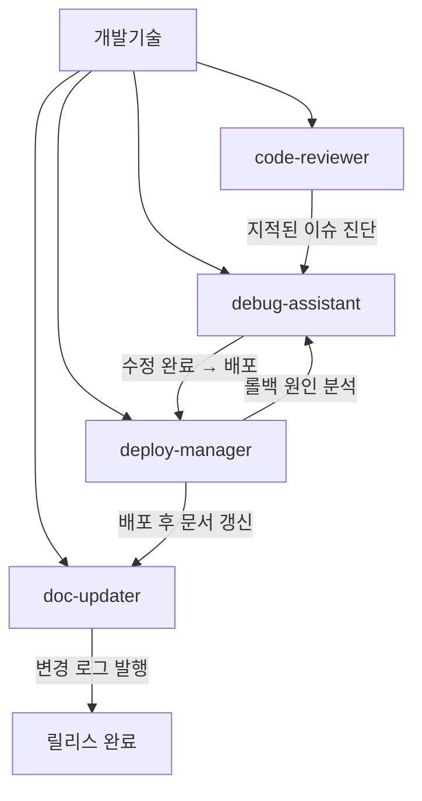
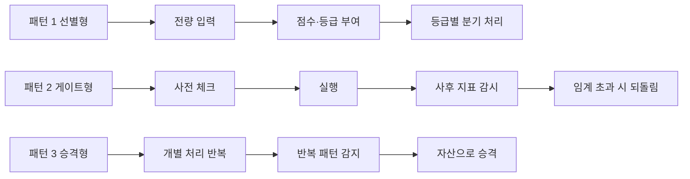

[첫 편](/blog/agentic-coding/thirty-agent-catalog/)이 서른 개를 펼쳤고 [두 번째 편](/blog/agentic-coding/definition-writing-quality/)이 그 서른 개가 어떻게 쓰였는지를 봤다. 남은 질문은 하나다. **이 중 무엇을 실제로 가져다 쓰는가.**

이 글은 그 답을 세 갈래로 나눠 낸다. 개발기술 부서 4종을 자세히 보고, 나머지 부서의 에이전트 중 개발조직 실무로 옮길 수 있는 것과 참고만 할 것을 가르고, 마지막으로 **이 세트에 아예 자리가 없는 영역 여섯 개**를 짚는다. 원 자료는 무엇이 없는지를 아는 것이 있는 것을 아는 것만큼 값이 있다고 적는다.

이 시리즈가 30종 중 개발기술 4종만 자세히 보는 이유는 단순하다. 이 카테고리가 다루는 것이 **Claude Code로 짓는 개발 워크플로**이고, 일곱 부서 중 거기 해당하는 것이 개발기술 하나다. 나머지 여섯 부서(영업·마케팅·고객지원·인사노무·재무회계·기획전략)의 부서별 상세는 이 시리즈에서 다루지 않는다 — 첫 편의 카탈로그가 30종 전부를 한 줄씩 담고 있으니 전체 지형은 거기서 보면 된다.

> 이 글이 옮긴 원 자료의 작성 기준일은 **2026-07-26**이다. 임계값·기준 수치는 그 시점의 것이며 조직과 스택에 따라 달라진다.
>
> 아래의 정량 기준(에러율 `5%`, OKR `0.7`, 캐파 `80%`, 도입 순서의 `5개`·`+10개`, 회고 `2주`)은 **원 자료가 제시한 기준선**이며 이 글이 측정하거나 특정 조직에서 관측한 값이 아니다.

## 용어 정리

[첫 편](/blog/agentic-coding/thirty-agent-catalog/)의 용어표에서 이 글이 쓰는 행만 추렸다. 본문이 한글로 풀어 쓰더라도 원 자료의 표에 영문 약어로 등장하는 것은 남겼다. ★를 붙인 마지막 행(few-shot)은 첫 편의 용어표에 없고 [두 번째 편](/blog/agentic-coding/definition-writing-quality/)이 더한 행이다.

| 용어 | 풀이 |
|---|---|
| **에이전트(Agent)** | 특정 도메인 업무만 전담하도록 시스템 프롬프트·도구·모델을 고정한 서브 실행 단위. 여기서는 `.md` 파일 1개 = 에이전트 1개 |
| **트리거 키워드** | 사용자 발화에 이 단어가 나오면 해당 에이전트로 자동 라우팅되도록 심어 두는 어휘 목록 |
| **경계(위임)** | "이 요청은 내 일이 아니다"를 선언하고 다른 에이전트 이름을 지목하는 섹션. 역할 침범 방지 장치 |
| **오케스트레이션** | 여러 에이전트를 순서대로 물려 하나의 업무 흐름을 완성하는 것(원 자료에서는 "파이프라인") |
| **5 Whys** | "왜?"를 5번 반복해 증상에서 근본 원인까지 내려가는 기법 |
| **ADR** | Architecture Decision Record. 아키텍처 결정과 그 이유를 남기는 문서 |
| **STAR** | Situation·Task·Action·Result. 행동 기반 질문 구조 |
| **JTBD** | Jobs To Be Done. "고객이 해결하려는 일" 관점으로 요구를 서술하는 방식 |
| **OKR / KR** | Objective and Key Results. 정성 목표 1개 + 정량 지표 3~5개 |
| **PRD** | Product Requirements Document. 제품 요구사항 문서 |
| **few-shot** ★ | 지시만 주는 대신 완성된 예시를 함께 넣어 출력 형태를 고정하는 방식 |

## 개발기술 4종

부서 안의 위임 흐름은 이렇다.

네 에이전트를 잇는 화살표는 넷이고, 그중 하나(`deploy-manager` → `debug-assistant`)만 **거꾸로 간다.** 롤백이 일어났을 때 원인 분석으로 되돌아가는 경로다. 첫 편이 부서 횡단 파이프라인에서 「순환 구조가 있어야 개선 루프가 생긴다」고 본 것과 같은 형태가 부서 안에도 들어가 있다.

### 에이전트 요약

| 에이전트 | 판단 축 | 고정된 산출 형식 | 명시된 안전장치 |
|---|---|---|---|
| `code-reviewer` | 6대 영역 × 4단계 심각도(BLOCKER·CRITICAL·SUGGESTION·NIT) | 등급별 코멘트 + 카운트 요약 + 머지 가능 여부 | 직접 수정 금지(제안만), 칭찬 1개 이상 포함 |
| `debug-assistant` | 5 Whys + 에러 5분류 | 증상·환경·재현·원인 체인 + 3층 해결책 | 재현 불가 시 데이터 수집부터, fix 전 실패 테스트 작성 |
| `deploy-manager` | 6단계 체크리스트 + 배포 전략 4종 | 배포 리포트 + 5분 사후 지표표 | 에러율 5% 초과 시 자동 롤백, 금요일 오후 배포 금지 |
| `doc-updater` | Keep a Changelog 5분류 | 문서 diff + 변경 로그 섹션 + 검토용 PR | 코드와 문서는 같은 PR, 링크 무결성 주간 스캔 |

네 행 모두 「명시된 안전장치」 칸이 비어 있지 않다는 점이 눈에 띈다. [앞 편](/blog/agentic-coding/definition-writing-quality/)이 본 30종 준수 현황에서 외부 발송 앞 승인 게이트는 3 / 30이었고 그 셋은 `sales-followup`·`cs-responder`·`expense-processor`였다 — 개발 4종은 거기 들어 있지 않다. 대신 이 넷의 안전장치는 사람 승인이 아니라 **임계값과 순서**로 걸려 있다. 에러율 5% 초과 시 자동 롤백, fix 전에 실패 테스트 먼저, 코드와 문서는 같은 PR. 두 표를 이렇게 대 보는 것은 이 글의 정리다.

### 특징적인 프롬프트 설계 기법

- **심각도 등급이 곧 게이트다.** BLOCKER/CRITICAL은 의무, SUGGESTION/NIT는 선택으로 명시하고, 리뷰 말미에 "머지 가능?" 결론을 강제한다. 리뷰 결과가 애매하게 끝나는 것을 막는다.
- **행동 경계를 역할 정의에 새긴다.** "의료 영상 판독의 — 직접 치료하지 않는다"라는 비유로 "고치지 말고 짚어라"를 각인했다. 비유가 권한 제약으로 기능하는 사례다.
- **추론 과정을 예시로 완주해서 보여 준다.** 5 Whys를 실제 결제 버그에 적용해 Why 1부터 5까지 답까지 써 두었다. 결과가 아니라 사고 경로를 few-shot으로 준 것이다.
- **해결책을 3층으로 분리한다.** 즉시 패치(5분) / 근본 수정(1시간) / 재발 방지(테스트·체크리스트·메트릭). 장애 대응의 시간 축을 산출물 구조에 반영했다.
- **자동 판정 임계를 배포에 건다.** "에러율 5% 초과 또는 응답 시간 2배 → 자동 롤백". 사람이 지켜보지 않아도 되게 만드는 조건을 숫자로 못박았다.
- **부정 규칙을 명시한다.** "금요일 오후 배포 금지", "DB 마이그레이션은 별도 PR", "되돌릴 수 없는 배포 금지". 조직 운영 규범을 에이전트에 이식한 형태다.
- **문서 부채를 구조로 막는다.** "코드만 머지하고 문서는 나중 → 영원히 안 함"이라는 진단과 함께 "같은 PR에 포함"을 규칙화했다.

두 번째 항목이 이 일곱 중 가장 옮기기 쉬운 기법이다. **비유 한 줄이 권한 제약으로 기능한다**는 것은 정의서에 `## 권한` 절을 따로 만들지 않고도 행동 범위를 좁힐 수 있다는 뜻이고, 앞 편이 본 대로 30종 전부가 역할 정의를 비유로 시작하므로 자리도 이미 있다.

## 개발조직으로 옮길 것

30종 전부가 개발조직에 그대로 유효하지는 않다. 1인 기업 전제가 강한 것(급여·기장·SNS 운영)은 조직 규모가 커지면 전용 시스템이 대체한다. 아래는 원 자료가 **개발조직 리더의 실무에 그대로 옮길 수 있는 것**만 고른 목록이다.

| 에이전트 | 응용 아이디어 | 왜 유효한가 |
|---|---|---|
| `code-reviewer` | 4단계 심각도 + "머지 가능 여부" 결론을 팀 리뷰 규약으로 도입. AI 1차 리뷰가 BLOCKER/CRITICAL만 걸러 사람 리뷰 부하를 낮춤 | 리뷰 코멘트가 "취향 논쟁"으로 흐르는 문제를 등급으로 해결. 의무와 선택이 분리되면 리뷰 시간이 예측 가능해진다 |
| `debug-assistant` | 장애 리포트 양식을 증상·환경·재현·5 Whys·3층 해결책·재발 방지로 고정. 포스트모템 템플릿으로 전환 | 근본 원인 없이 증상만 덮는 대응을 구조가 막는다. 재발 방지 항목이 필수라 학습이 조직에 남는다 |
| `deploy-manager` | 6단계 사전 체크 + 5분 사후 지표 + 자동 롤백 임계를 배포 파이프라인 규약으로 성문화 | "누가 지켜보고 있는가"에 의존하던 배포를 조건식으로 바꾼다. 임계값이 있으면 롤백 결정에 눈치가 개입하지 않는다 |
| `doc-updater` | "코드와 문서는 같은 PR" 규칙 + Keep a Changelog 5분류를 팀 컨벤션으로 채택 | 문서 부채는 의지가 아니라 워크플로우로 막힌다. 리뷰 게이트에 문서 항목을 넣으면 강제력이 생긴다 |
| `escalation-router` | 장애·보안 인시던트의 알림 트리거 사전과 "이중 발송 금지" 규칙을 온콜 정책에 적용 | 알림 피로와 누락은 상충한다. 트리거 사전 + 수신자 단일화가 둘을 동시에 다루는 최소 설계다 |
| `performance-reviewer` | OKR 0.7 기준·1on1 어젠다 5블록·칭찬 5 : 개선 1을 팀 운영 루틴으로 | 평가 대화가 즉흥적이면 매번 품질이 다르다. 어젠다 고정은 리더 교체에도 살아남는 자산이다 |
| `recruiter` | JTBD형 JD(6개월 후 달성 목표 명시) + STAR 질문 세트 + 평가 시트 | 조직 빌딩에 직결된다. "요구 스펙 나열형 JD"를 "6개월 후 성과 정의형"으로 바꾸는 전환이다 |
| `kpi-analyst` | 북극성 1개 + 핵심 5개 제약, 선행 지표 우선 원칙을 팀 대시보드 설계에 적용 | 지표 과잉은 집중을 무너뜨린다. "5개 한계"라는 제약 자체가 의사결정 도구다 |
| `product-strategist` | PRD의 "비목표" 섹션을 기술 기획 문서에 필수 항목으로 추가 | 개발 조직에서 범위 확대(scope creep)를 막는 가장 저렴한 장치. 문서 한 섹션으로 합의를 남긴다 |
| `roadmap-planner` | Now/Next/Later + 캐파 80% + 의존성 그래프를 분기 계획 포맷으로 | 분기 약속을 확률로 표현하면 이해관계자와의 신뢰가 유지된다. 캐파 여유는 장애 대응 예산이다 |

열 행의 「응용 아이디어」 열은 하나같이 **사람 팀이 미리 정해 두고 반복해서 따르는 틀**을 목적지로 지목한다 — 옮기는 것이 에이전트가 아니라 그 에이전트가 강제하던 틀이라는 뜻이고, 이렇게 읽는 것은 이 글의 정리다. 목적지를 그대로 옮기면 이렇다: 팀 리뷰 규약(`code-reviewer`) · 포스트모템 템플릿(`debug-assistant`) · 배포 파이프라인 규약(`deploy-manager`) · 팀 컨벤션(`doc-updater`) · 온콜 정책(`escalation-router`) · 팀 운영 루틴(`performance-reviewer`) · JD와 질문 세트(`recruiter`) · 팀 대시보드 설계(`kpi-analyst`) · 기술 기획 문서의 필수 항목(`product-strategist`) · 분기 계획 포맷(`roadmap-planner`). 열 중 열이다.

## 참고만 하고 그대로 쓰지 않을 것

| 에이전트 | 이유 |
|---|---|
| `payroll-manager` · `bookkeeper` · `expense-processor` | 법·요율 의존도가 높고 정의서 자체가 전문가 검증을 전제한다. 기업 규모에서는 전용 시스템이 담당 |
| `social-media-manager` · `ad-optimizer` | 1인 기업 운영 전제가 강함. 다만 임계값 테이블 설계 방식은 다른 도메인에 이식 가능 |
| `crm-manager` · `lead-scorer` | 실제 조직에서는 CRM 제품이 담당. 6차원 가중 스코어링 구조만 다른 판정 업무에 재사용 |

표의 「이유」 열은 첫 행에 **틀렸을 때의 책임**(법·요율)과 함께 기업 규모에서는 전용 시스템이 담당한다는 것을, 둘째 행에 **1인 기업 운영 전제**를, 셋째 행에 **이미 그 일을 하는 제품**(CRM)이 있다는 것을 적는다. 사유가 행마다 하나씩 갈리지는 않는다 — 「대신 하는 시스템·제품이 있다」는 첫 행(전용 시스템)과 셋째 행(CRM 제품)에 함께 나온다. 앞 절 서두는 급여·기장·SNS 운영을 묶어 「1인 기업 전제가 강한 것」이라 불렀는데, 급여·기장은 첫 행이고 SNS 운영은 둘째 행이다. 표가 「1인 기업」이라고 적어 둔 것은 둘째 행이다 — 산문과 표의 배정이 갈리는 자리다. 그런데 뒤의 두 행에는 재사용 가능한 부분이 단서로 남는다 — 둘째 행은 「다만 임계값 테이블 설계 방식은 다른 도메인에 이식 가능」이고, 셋째 행은 「6차원 가중 스코어링 구조만 다른 판정 업무에 재사용」이다. 버리는 것은 도메인이고 남기는 것은 판정 구조다. 세 행을 이렇게 갈라 읽는 것은 이 글의 정리다.

## 스키마 자체의 재사용

원 자료가 개별 에이전트보다 값이 크다고 본 것은 스키마 쪽이다 — **개별 에이전트보다 [정의서 공통 스키마](/blog/agentic-coding/definition-writing-quality/)를 사내 표준으로 삼는 것이 가치가 크다**는 것이다. 원문은 이 자리에서 앞 편이 다룬 스키마 절을 절 번호로 가리키는데, 이 글에서는 그 편으로 가는 링크로 바꿔 두었다.

팀원이 각자 에이전트를 만들 때 다음 3가지만 강제해도 품질이 크게 균질해진다는 것이 원 자료의 주장이다.

- `tools`는 필요한 것만 — 기본값으로 전체 권한을 주지 않는다
- `## 산출물 예시`에 완성본 1건 — 골격만 두면 출력이 매번 달라진다
- `## 경계 (위임)` 필수 — 없으면 에이전트가 무한히 영역을 넓힌다

세 항목이 [앞 편](/blog/agentic-coding/definition-writing-quality/)의 준수 현황표에서 받은 성적이 갈린다는 점을 붙여 읽어야 한다. 둘째(완성 산출물 예시)와 셋째(경계 섹션 존재)는 둘 다 30 / 30이었고, 첫째(도구 권한 축소)만 5 / 30이었다. **세 가지를 강제하자는 제안에서 실제로 강제가 필요했던 것은 첫 번째 하나였다는 뜻이다** — 이 대조는 이 글의 정리다. 나머지 둘은 강제하지 않아도 템플릿이 복제해 줬다.

## 파이프라인 조합 패턴

원 자료는 단독 호출보다 **조합**을 강조한다. 여기서 뽑아낼 수 있는 재사용 가능한 패턴은 세 가지다.

| 패턴 | 구조 | 원본 사례 | 개발조직 응용 |
|---|---|---|---|
| **선별형** | 전량 → 점수화 → 등급별 분기 | 리드 30건을 스코어링해 Hot/Warm/Cold로 나눠 응대 강도 차등 | 이슈·알럿·PR을 심각도로 나눠 사람 리뷰 대상만 남기기 |
| **게이트형** | 사전 체크 → 실행 → 사후 감시 → 자동 되돌림 | 배포 6단계 체크 → 배포 → 5분 헬스 체크 → 자동 롤백 | 마이그레이션·설정 변경 등 되돌리기 어려운 작업 전반 |
| **승격형** | 개별 대응 반복 → 패턴 감지 → 재사용 자산화 | 동일 문의 3회 → FAQ 승격 → 이후 답변에 링크 첨부 | 반복 장애를 런북으로, 반복 리뷰 지적을 린트 규칙으로 승격 |

세 패턴 중 앞의 둘은 **한 건을 처리하는 방법**이고 셋째만 **다음 건이 덜 들어오게 하는 방법**이다. 선별형과 게이트형은 입력이 100건이면 100번 돌고, 승격형만 100번째에 유입 자체를 줄인다.

**승격형이 가장 과소평가된 패턴이다.** 개별 처리를 아무리 자동화해도 총량은 줄지 않는다. 반복을 감지해 자산으로 올려야 유입 자체가 줄어든다.

## 단계적 도입 순서

원 자료가 제시한 도입 순서는 "핵심 5개 → 10개 추가 → 나머지"다. 이 순서 자체보다 **왜 한 번에 다 깔지 않는가**가 요점이다.

| 단계 | 시점 | 개수 | 판단 기준 |
|---|---|---|---|
| 1단계 | 1주차 | 5개 | 매일 발생하고 산출물이 정형화된 업무만 |
| 2단계 | 2~3주차 | +10개 | 1단계에서 업무 패턴이 관찰된 뒤 인접 영역으로 확장 |
| 3단계 | 1개월 후 | 나머지 | 조직이 커져 실제로 필요해진 것만 |
| 회고 | 2주 사용 후 | — | 자주 쓰는 것 / 안 쓰는 것 / 빠진 것을 분류해 정리 |

네 행 중 마지막 행만 「개수」 칸이 비어 있다. 앞의 셋이 **무엇을 얼마나 설치하는가**를 정하는 행이라면 회고 행은 **설치한 것을 도로 줄이는** 행이라 개수를 적을 자리가 없다.

> 한 번에 전부 설치하면 트리거 키워드가 겹쳐 호출 정확도가 떨어진다. **에이전트 개수는 자산이 아니라 부채로 시작한다**는 관점이 이 순서의 근거다.

근거가 조직론이 아니라 **기술적 이유**라는 점이 이 표에서 볼 것이다. 에이전트를 한꺼번에 늘리지 말라는 이유가 "팀이 감당 못 한다"가 아니라 "트리거 키워드가 겹쳐 라우팅이 틀린다"다. 이 카테고리의 [잠재 경로는 개수의 제곱으로 는다](/blog/agentic-coding/scaling-routing-collapse/) 편이 같은 현상을 개수 구간별로 훨씬 자세히 다룬다.

같은 「한 번에 다 하지 않는다」를 조직 층위에서 다룬 글로는 [AI 전환 실행 항목](/blog/ai-agent/enterprise-ai-adoption-actions/)이 있다. **같은 이야기가 아니라 층위가 다른 이야기다** — 이쪽은 파일 몇 개를 설치할지를 개수로 끊고 근거가 트리거 키워드 충돌이며, 저쪽은 조직 프로그램의 실행 순서를 일수로 끊고 근거가 기준선 없는 파일럿은 성과를 증명하지 못한다는 것이다. 겹치는 것은 점진성 하나뿐이다 — 두 글을 이렇게 대 보는 것은 이 글의 정리다.

## 비어 있는 여섯 자리

30종은 1인 기업~10인 스타트업 기준으로 설계됐다. 개발조직 관점에서 보면 **비어 있는 자리가 뚜렷하다.**

| 빠진 영역 | 왜 필요한가 | 만든다면 판단 축 |
|---|---|---|
| 보안 리뷰 | `code-reviewer`가 보안을 6영역 중 하나로만 다룸. 의존성 취약점·시크릿 스캔·권한 검토는 전담이 필요 | 취약점 심각도 등급, 시크릿 패턴 사전, 의존성 CVE 임계 |
| 테스트 설계 | 30종 중 테스트를 만드는 에이전트가 없다. `debug-assistant`가 "fix 전 실패 테스트"를 요구하지만 작성 주체가 없음 | 커버리지 목표, 경계값·예외 케이스 체크리스트 |
| 아키텍처 결정 | `doc-updater`가 ADR을 언급하지만 결정을 내리는 에이전트는 없음 | 트레이드오프 축(성능·비용·복잡도), 되돌림 비용 |
| 인프라 비용 | 재무 4종은 회계 관점이고 클라우드 비용 최적화는 다루지 않음 | 리소스별 단가, 유휴율 임계, 증설·축소 조건 |
| 데이터 품질 | `kpi-analyst`가 지표를 읽지만 원천 데이터의 정합성은 아무도 검증하지 않음 | 누락률·중복률 임계, 스키마 변경 감지 |
| 온콜·인시던트 지휘 | `escalation-router`가 알림까지만 담당. 대응 지휘·타임라인 기록은 공백 | 심각도 등급, 커뮤니케이션 주기, 종료 조건 |

여섯 행의 「왜 필요한가」 열이 전부 같은 형태로 적혀 있다는 점이 이 표에서 가장 눈에 띈다 — **30종 안의 다른 에이전트나 부서를 지목하고 「거기까지 하고 멈춘다」고 적는다.** 여섯을 하나씩 배정하면 `code-reviewer`(보안 리뷰) · `debug-assistant`(테스트 설계) · `doc-updater`(아키텍처 결정) · 재무 4종(인프라 비용) · `kpi-analyst`(데이터 품질) · `escalation-router`(온콜·인시던트 지휘)로, 여섯 중 여섯이다. 이 배정과 그 관찰은 이 글이 표를 읽어 한 것이다.

그 바로 아래에서 원 자료는 이 여섯을 다른 축으로 묶는다.

> 이 공백들은 우연이 아니다. **모두 "혼자서는 감당할 수 없어 조직이 커진 뒤에야 필요해지는" 영역이다.**
>
> 즉 이 세트는 조직 규모에 대한 가정이 설계에 박혀 있다. 템플릿을 그대로 쓰지 않고 조직 단계에 맞춰 재구성해야 하는 이유가 여기 있다.

**여섯을 조직 규모로 묶는 이 판정은 원 자료의 것이고, 이 글은 그것을 승계하지도 반박하지도 않는다.** 위 표에서 확인되는 것은 여섯 행이 전부 30종 내부의 다른 에이전트나 부서를 기준으로 서술됐다는 사실까지다.

두 번째 행은 [첫 편](/blog/agentic-coding/thirty-agent-catalog/)에서 이미 한 번 쓰였다. 이 카테고리의 다른 글에 실린 7부서 30에이전트 표와 이 시리즈의 카탈로그가 **같은 세트가 아니라는 근거**가 정확히 이 문장이다 — 그쪽 표에는 개발 부서 넷 중 하나가 「테스트」인데, 이쪽 원 자료는 30종 중 테스트를 만드는 에이전트가 없다고 적는다.

## 시리즈를 닫으며

세 편을 관통하는 것은 하나다. **에이전트 세트의 값어치는 개수가 아니라 형식에 있다.**

[첫 편](/blog/agentic-coding/thirty-agent-catalog/)은 서른 개를 한 장의 표로 펼쳤고, 거기서 나온 것은 개수가 아니라 **권한을 좁힌 자리와 좁히지 못한 자리**(`Bash` 한 구멍)였다. [두 번째 편](/blog/agentic-coding/definition-writing-quality/)은 그 서른 개가 공유하는 스키마를 봤고, 형식은 30 / 30으로 복제되는데 안전장치는 복제되지 않는다는 것을 확인했다. 그리고 이 글에서 개발조직으로 옮기기로 한 열 가지는 전부 에이전트가 아니라 **그 에이전트가 강제하던 틀**이었다.

마지막 표는 그 서른 개의 바깥을 적는다. 비어 있는 여섯 자리는 무엇을 더 만들지의 목록이기 이전에, **가진 세트의 경계가 어디까지인지를 적어 둔 문서**다. 앞 편이 본 대로 경계 섹션이 실재하지 않는 이름을 지목했을 때 에이전트는 실패하거나 스스로 처리해 버린다. 세트 전체에도 같은 것이 필요하다 — 없는 것을 없다고 적어 두면, 그 요청이 들어왔을 때 사람에게 온다.
