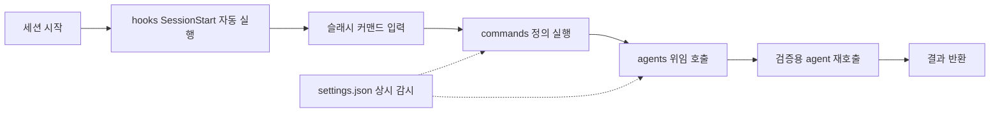
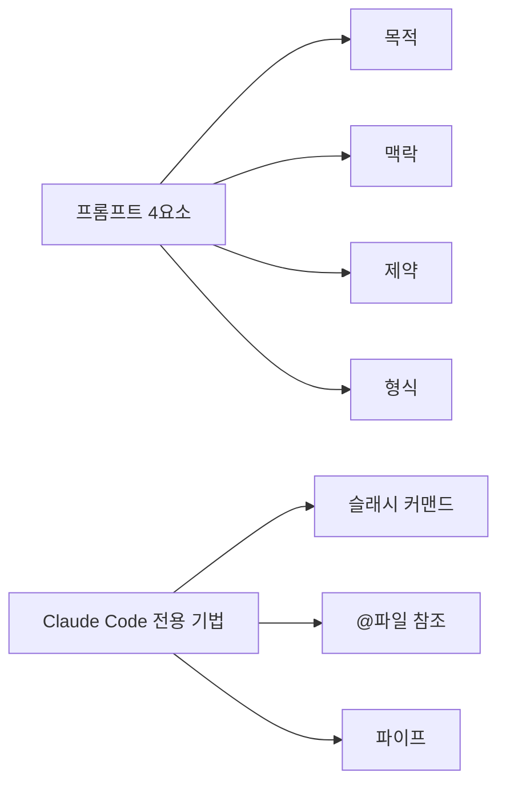

[첫 편](/blog/agentic-coding/claude-md-scope-layers/)이 규칙 파일 한 장을 다뤘다. 어디에 두면 어디까지 적용되는지, 얼마나 길게 쓸 수 있는지, 무엇을 어떤 순서로 적는지까지다.

그런데 그 파일 하나로는 안 되는 일이 있다. 상세 규정을 다 넣으면 200줄을 넘고, 세션을 넘겨 기억해야 할 것은 사람이 쓸 수 없으며, 무엇보다 **문서에 적은 금지는 어겨도 아무 일이 일어나지 않는다.** 이 글은 그 세 구멍을 메우는 `.claude/` 디렉터리의 여덟 구성물을 보고, 회사 단위로 확장한 5단계 프레임워크를 지나, 지시 한 줄을 제대로 쓰는 프롬프트 7패턴까지 간다.

> 이 글이 옮긴 원 자료의 작성 기준일은 **2026-07-26**이다. 디렉터리 경로·설정 키·명령 이름은 그 시점의 것이다.
>
> 이 글의 부서별 규칙 예시, 메모리 항목 예시, 업종별 규칙 예시는 **원 자료의 실습 예제**이며 특정 조직의 실제 운영 사례가 아니다. 개념·용어·판단 프레임 층위에서 읽어야 한다.

## 용어 정리

[첫 편](/blog/agentic-coding/claude-md-scope-layers/)의 용어표에서 이 글이 쓰는 행만 추렸다.

| 용어 | 정의 |
|---|---|
| **CLAUDE.md** | 세션 시작 시 자동 로드되는 마크다운 규칙 파일. 조직이 작성해 AI에게 주는 업무 매뉴얼 |
| **Rules** | `.claude/rules/*.md`. 상세 규정집. 필요할 때만 참조되어 상시 토큰을 덜 먹는다 |
| **Memory** | `memory/` 또는 `MEMORY.md`. AI가 세션을 넘어 학습한 결정사항·실수 패턴을 축적하는 저장소 |
| **토큰(Token)** | AI가 텍스트를 처리하는 기본 단위. 영어 1토큰 ≈ 4글자, 한국어 1토큰 ≈ 1~2글자 |
| **프롬프트 4요소** | 목적(Goal)·맥락(Context)·제약(Constraints)·형식(Format). 지시 품질 체크리스트 |
| **슬래시 커맨드** | `/`로 시작하는 명령. `.claude/commands/*.md`로 커스텀 생성 가능 |
| **`$ARGUMENTS`** | 커스텀 커맨드에서 호출 시 입력값이 주입되는 자리표시자 |
| **`-p` 플래그** | 비대화형(headless) 모드. 한 번 답하고 종료. 스크립트·CI/CD·크론잡의 기본 |
| **`/clear`** | 대화 이력 전체 삭제. CLAUDE.md·memory는 유지 |
| **`/compact`** | 컴팩션. 대화 이력을 요약 압축해 토큰을 회수하는 동작 |
| **`/context`** | 현재 컨텍스트 사용량 분해 표시 |
| **MCP** | Model Context Protocol. 외부 도구 연결 규약. 서버가 많을수록 도구 정의만으로 토큰 소모 |
| **SOP** | Standard Operating Procedure(표준 운영 절차). 구조화 프롬프트 1개 = SOP 1개라는 비유의 근거 |

## `.claude/` 배치도 — 여덟 구성물

```
프로젝트/
├── CLAUDE.md                  # 핵심 요약 (80~120줄, 항상 자동 로드)
└── .claude/
    ├── settings.json          # 팀 공유 정책 (권한·훅·MCP 제어)
    ├── settings.local.json    # 개인 설정 (.gitignore 대상)
    ├── agents/                # 전문가 — 위임 호출 시 실행
    ├── commands/              # 메뉴판 — 슬래시 입력 시 실행
    ├── hooks/                 # 경비실 — 이벤트 발생 시 자동 실행
    ├── rules/                 # 규정집 — 필요할 때 참조
    │   ├── code-style.md
    │   ├── database.md
    │   ├── payments.md
    │   └── security.md
    ├── memory/                # 업무일지 — 세션 간 영속 저장
    └── skills/                # 도구함 — 조건 충족 시 자동 트리거
```

> **배치도 첫 줄의 `80~120줄`은 실무 권장치다.** [첫 편](/blog/agentic-coding/claude-md-scope-layers/)에서 본 200줄 준수율 임계와 다른 값이며, 규격이 아니라 권장이다. 이 글 뒤쪽의 5단계 프레임워크에서 같은 값이 다시 나온다.

### 구성 요소별 역할·범위·갱신 주기

| 파일/폴더 | 역할(비유) | 적용 범위 | 실행/로드 타이밍 | 갱신 주기 |
|---|---|---|---|---|
| `CLAUDE.md` | 신입 오리엔테이션 가이드 | 세션 전체 | 매 세션 시작 시 자동 | 규칙 변경 시(분기~반기) |
| `rules/*.md` | 규정집 | 해당 주제 작업 시 | 필요할 때 명시적 참조 | 상세 정책 변경 시 |
| `memory/` | 업무일지 | 세션 간 누적 | 새 세션 시작 시 참조 | 중요 결정 발생 즉시 |
| `agents/` | 전문가 | 위임된 작업 | 호출(Task)될 때 | 역할 신설 시 |
| `commands/` | 메뉴판 | 반복 업무 | 슬래시 입력 시 | 반복 업무 발견 시 |
| `hooks/` | 경비실 | 도구 사용 전후 | 이벤트 발생 시 자동 | 게이트 정책 변경 시 |
| `skills/` | 도구함 | 조건 매칭 작업 | 트리거 조건 충족 시 | 역량 추가 시 |
| `settings.json` | 배전반 | 전 세션 | 항상 감시 | 보안 정책 변경 시 |

> **「여덟」이 가리키는 집합이 배치도와 이 표에서 서로 다르다.** 배치도의 여덟은 `.claude/` **안쪽**의 항목(`settings.json`·`settings.local.json`·`agents`·`commands`·`hooks`·`rules`·`memory`·`skills`)이고, 이 표의 여덟은 `settings.local.json` 자리에 **`CLAUDE.md`** 가 들어온 목록이다. 그런데 `CLAUDE.md`는 배치도가 그린 대로 `.claude/` 바깥, 프로젝트 루트에 있다. 개수만 같고 구성이 다르다는 뜻이다. 원 자료의 배치도와 역할 표가 그대로 이런 구성이라 이 글도 두 표기를 함께 옮겼고, 이 글에서 「여덟 구성물」이라 부를 때는 **위 역할 표의 여덟 행** — 규칙 파일 `CLAUDE.md` 한 장과 그 옆에 서는 `.claude/` 항목 일곱 — 을 가리킨다.

여덟 행을 가르는 실질적 기준은 네 번째 열(로드 타이밍)이다 — **무엇이 트리거를 당기는가.** 사람의 입력 없이 도구 쪽이 알아서 당기는 것(`CLAUDE.md`는 "매 세션 시작 시 자동", `hooks`는 "이벤트 발생 시 자동", `settings.json`은 "항상 감시"), 사람이 슬래시 입력으로 당기는 것(`commands`), 작업이 트리거 조건을 충족할 때 당겨지는 것(`skills`), 다른 작업에 위임될 때 호출되는 것(`agents`), 필요할 때 명시적으로 참조되는 것(`rules`), 새 세션이 시작될 때 참조되는 것(`memory/`)까지 여섯 갈래다. 이렇게 여섯으로 묶는 것은 이 글의 정리이며, 원 자료의 표에는 타이밍 문구만 있고 이 묶음은 없다.

갱신 주기 열은 이 순서와 나란히 가지 않는다. 가장 짧은 값인 `memory/`의 "중요 결정 발생 즉시"가 셋째 행에 있고, 그 아래 다섯 행은 "역할 신설 시"·"반복 업무 발견 시"처럼 **주기가 아니라 사건**으로 적혀 있어 애초에 길고 짧음을 비교할 대상이 아니다.

### CLAUDE.md vs rules/ — 컨텍스트 효율의 핵심

| 기준 | CLAUDE.md | `.claude/rules/*.md` |
|---|---|---|
| 로드 | 항상 자동 | 필요할 때만 |
| 토큰 | 상시 소비 | 참조 시에만 소비 |
| 분량 | 100~200줄 권장 | 제한 완화 |
| 담을 것 | 프로젝트 개요, MUST/NEVER 절대 규칙, 핵심 명령, 에이전트 목록 요약 | 코딩 스타일 상세, DB 규칙, 결제 처리 규칙, 보안 체크리스트 |

앞의 세 행이 전부 마지막 행의 근거다. 상시 로드되고 토큰을 계속 먹으니 짧아야 하고, 짧아야 하니 모든 작업에 필요한 것만 남는다.

판단 기준 한 줄: **"모든 작업에 필요한가"** 면 CLAUDE.md, **"특정 작업에만 필요한가"** 면 rules/다.

### memory/ — 에피소드와 스킬의 물리적 분리

메모리는 두 종류로 나뉜다.

| 구분 | 형식 | 담는 것 | 성격 |
|---|---|---|---|
| 에피소드 | JSONL 로그 | "언제 무엇을 했다"는 사건 기록 | 시간순 누적, 기계 판독 |
| 스킬 | 마크다운 | "이럴 땐 이렇게 한다"는 노하우 | 재사용 지식, 사람 판독 |

형식이 갈리는 이유가 마지막 열에 있다. 사건 기록은 기계가 훑어야 하니 구조화된 로그가 되고, 노하우는 사람이 읽고 고쳐야 하니 마크다운이 된다.

자동 메모리는 4타입으로 분류된다.

| 타입 | 담는 것 | 예시 |
|---|---|---|
| `user` | 사용자 선호도·작업 스타일 | TypeScript 엄격 모드 선호, 함수형 스타일 우선 |
| `project` | 핵심 결정사항·아키텍처·규칙 | 결제 모듈은 Stripe API v3 / 환불은 72시간 이내 정책 |
| `feedback` | 과거 피드백에서 학습한 것 | 섹션 핸들러를 양쪽 빌더에 모두 등록하지 않으면 조용한 실패 |
| `reference` | 반복 참조하는 설정·스펙·문서 위치 | Supabase REST 엔드포인트 URL |

> **오른쪽 「예시」 열은 원 자료의 실습 예제다.** Stripe API 버전이나 환불 정책 일수 같은 값은 어떤 조직의 실제 규칙이 아니라 타입별로 어떤 문장이 들어가는지를 보여 주는 예시다. 원 자료가 **「가상 실습 소재」** 라고 이름을 붙여 따로 열거한 목록에 이 표는 들어 있지 않고, 문서 전체를 실습 예제로 규정한 총론에만 걸린다. 타입 구분과 "무엇을 담는가"만 옮겨 쓰면 된다.

네 타입 중 `feedback`만 성격이 다르다. 나머지 셋은 지금 무엇이 참인지를 적는 칸이고 `feedback`은 **과거 피드백에서 학습한 것**을 적는 칸이라, 시점이 한 칸 뒤로 물러나 있다.

### 전역 vs 프로젝트 — 2층 건물 구조

| 구분 | `~/.claude/` 전역 | 프로젝트 `.claude/` |
|---|---|---|
| 적용 | 모든 프로젝트 공통 | 해당 프로젝트만 |
| 내용 | 한국어 응답, 결론 우선 등 개인·조직 공통 규칙 | 프로젝트 특화 커맨드·에이전트 |
| 공유 | 팀원 각자 독립 관리 | Git에 올려 팀 전체 공유 |

세 번째 행이 실무에서 문제가 되는 자리다. 전역 설정은 저장소에 올라가지 않으므로 **내 화면에서 되는 것이 동료 화면에서 안 될 수 있다** — 이렇게 짚는 것은 이 글의 정리이며, 원 자료가 이 행에 적은 것은 "팀원 각자 독립 관리"와 "Git에 올려 팀 전체 공유"라는 공유 방식뿐이다.

충돌 시 우선순위 규칙은 항목마다 다르다. 이 차이를 헷갈리면 설정이 왜 안 먹는지 못 찾는다.

| 항목 | 충돌 처리 |
|---|---|
| `CLAUDE.md` | **append(누적)** — 전역과 프로젝트 둘 다 유효 |
| `settings.json` | **오버라이드** — 프로젝트가 전역을 덮음 |
| `agents/`, `commands/` | **이름 충돌 시 프로젝트 버전 우선** |

세 항목이 한 벌로 묶여 로드되면서도 서로 다른 병합 규칙을 쓴다는 것이 요점이다. 문서는 쌓이고 설정은 덮이며 파일은 이름 단위로 교체된다.

한 줄 요약: **전역은 기반, 프로젝트는 특화.** 전역이 사라지는 게 아니라 기반 위에 특화가 얹힌다.

### 실행 흐름 예시



`settings.json`만 점선으로 붙는다. 흐름의 한 단계가 아니라 흐름 전체에 걸쳐 상시로 감시하는 층이기 때문이다.

## 회사 단위로 확장하기 — 5단계 프레임워크

3덩어리 7단계가 개발 프로젝트용 골격이라면, 회사 단위로 확장한 것이 **5단계 프레임워크**다. 순서는 "새 팀원이 첫날 알아야 하는 것"과 일치한다.

| 단계 | 이름 | 핵심 질문 | 권장 분량 |
|---|---|---|---|
| 1 | 회사/프로젝트 개요 | 나는 어떤 회사에서 일하는가 | 10~15줄 |
| 2 | 기술 스택 & 환경 | 어떤 도구로 어떻게 일하는가 | 15~25줄 |
| 3 | 업무 규칙(MUST/NEVER) | 우리 팀만의 규칙은 무엇인가 | 20~30줄 |
| 4 | 워크플로우 | 어떤 순서로 일을 처리하는가 | 15~20줄 |
| 5 | 참조 경로 | 자세한 내용은 어디서 찾는가 | 10~15줄 |

핵심 질문 열이 전부 신입의 1인칭 질문으로 적혀 있다는 점이 이 표의 설계다. 조직도가 아니라 **처음 온 사람이 순서대로 궁금해하는 것**이 목차가 된다.

전체 목표 분량은 **80~120줄**. 5단계를 그대로 따르면 이 분량이 자연스럽게 나온다.

> **`80~120줄`은 실무 권장치다.** 위 다섯 행의 권장 분량을 더하면 70~105줄이고, 여기에 제목·구분선이 붙으면 그 구간에 들어온다. 목표를 먼저 정하고 맞추는 값이 아니라 **5단계를 채우면 따라 나오는 값**이라는 뜻이다.

### MUST와 NEVER를 나누는 이유

원 자료는 AI가 **긍정 지시(MUST)와 부정 지시(NEVER)를 분리해 처리할 때 준수율이 높다**고 설명한다. "~하지 마세요"만 있으면 무엇을 해야 하는지 모른다.

작성 원칙은 **검증 가능성**이다.

- "깔끔하게 작성하세요" — 검증 불가. AI가 범위를 스스로 해석하고, 사고는 그 해석 차이에서 난다.
- "함수 50줄 이하", "Stripe 금액은 센트 단위 정수" — 검증 가능.

### 규칙 섹션 템플릿

```markdown
## 업무 규칙

### MUST (반드시 준수)
- TypeScript strict mode 준수 (any 사용 시 주석으로 사유 명시)
- 모든 DB 쿼리에 행 수준 보안 정책 확인 필수
- 결제 금액은 항상 최소 화폐 단위 정수로 처리 (소수점 금지)
- 환경 변수는 .env.example에 키 이름만 등록 (값 제외)
- 커밋 메시지: Conventional Commits (feat/fix/refactor/docs/chore)
- PR에 테스트 결과 또는 테스트 코드 포함

### NEVER (절대 금지)
- .env* 파일 Git 커밋 금지 (커밋 전 자동 감지 훅 동작 중)
- 결제 시크릿 키 소스 코드 하드코딩 금지
- 프로덕션 DB 직접 마이그레이션 금지 (CI/CD 경유 필수)
- 고객 개인정보(이름/이메일/전화/주소) 로그 출력 금지
- 재고 차감 로직 클라이언트 사이드 처리 금지 (서버 필수)
- console.log 프로덕션 코드 잔존 금지
```

### 부서별 특화 규칙 — 조직 단위 확장

같은 CLAUDE.md 안에서 부서별 규칙을 분리하면, 한 조직 안의 여러 역할이 각자의 기준으로 일한다.

| 부서 | 특화 규칙 예시 |
|---|---|
| 마케팅 | 상품 메타 디스크립션 150자 이내, 프로모션 종료일은 타임존까지 명시, 절대적 표현("최저가") 사용 전 법무 확인 |
| CS | 고객 응대 초안에 개인정보 포함 금지(주문번호만 허용), 환불 답변에 정책 URL 필수, 에스컬레이션 기준 금액 명시 |
| 개발 | DB 스키마 변경은 마이그레이션 파일로 버전 관리, 결제 코드에 웹훅 서명 검증 항상 포함, 배포 전 로컬 검증 필수 |

> **이 부서별 배치 사례는 원 자료가 가상 실습 소재로 명시한 것이다.** 세 부서의 규칙 문장은 실제로 운영된 정책이 아니라 "부서마다 규칙의 종류가 어떻게 달라지는가"를 보여 주는 예시다. 옮겨 쓸 것은 문장이 아니라 **분리 방식**이다.

세 행의 규칙이 전부 그 부서가 사고를 낼 수 있는 지점에 붙어 있다. 마케팅은 표현, CS는 개인정보, 개발은 배포다.

### 규모별·업종별 전략

| 조직 규모 | 전략 | 핵심 포인트 |
|---|---|---|
| 1~5명 | 단일 CLAUDE.md(80줄 이하) | 복잡성 불필요, 핵심만 |
| 5~30명 | CLAUDE.md + rules/ 3~5파일 | 모듈화 시작 지점 |
| 30~100명 | 3계층 + 부서별 CLAUDE.md | 거버넌스 구조 도입 |
| 100명 이상 | Enterprise 관리형 + 팀별 격리 | 사용자 변경 불가 정책 필요 |

규모가 커질 때 늘어나는 것이 규칙의 양이 아니라 **계층의 수**라는 점이 이 표의 요지다. 마지막 행에서만 성격이 바뀐다 — 앞의 셋은 팀이 스스로 지키는 구조이고, 마지막은 개인이 무력화할 수 없게 만드는 구조다.

| 업종 | 핵심 NEVER 규칙 |
|---|---|
| 이커머스 | 결제 키 하드코딩, 프로덕션 DB 직접 마이그레이션 |
| 의료/헬스케어 | 환자 데이터 로그 출력, 외부 API로 건강 데이터 전송 |
| 핀테크 | 금융 거래 클라이언트 처리, 계좌번호 로컬 저장 |
| SaaS B2B | 고객 테넌트 데이터 교차 접근, API 키 이메일 전송 |
| 교육 | 미성년자 개인정보 외부 전송, 성적 데이터 무단 공유 |

다섯 업종의 NEVER가 전부 **그 업종에서 사고가 나면 규제나 신뢰가 걸리는 자리**를 가리킨다. 업종이 다르면 금지할 항목이 다른 게 아니라, 금지해야 할 만큼 비싼 항목이 다르다.

### 문서만으로 부족한 지점 — 물리적 차단

CLAUDE.md는 **지시**이고, `settings.json`은 **차단**이다. 규칙을 어기면 실행 자체가 불가능해지는 층이 따로 필요하다.

```json
{
  "permissions": {
    "allow": ["Bash(pnpm:*)", "Bash(git:*)"],
    "deny": [
      "Bash(rm -rf:*)",
      "Bash(sudo:*)",
      "Bash(DROP TABLE:*)",
      "Bash(cat .env*:*)",
      "Read(.env)",
      "Read(.env.production)"
    ]
  }
}
```

| 옵션 | 효과 |
|---|---|
| `deny` | 지정 패턴의 도구 실행을 원천 차단 |
| `allow` | 개발 필수 도구를 화이트리스트로 선제 허용 |
| `allowManagedPermissionRulesOnly: true` | 팀원이 개인 `allow`를 추가해 `deny`를 우회하지 못하게 잠금 |

앞의 두 행은 무엇을 막고 무엇을 열지를 정하고, 셋째 행은 **그 결정을 개인이 되돌리지 못하게** 만든다. 이 층의 평가 순서와 5단계 설정 계층은 [deny가 항상 이긴다](/blog/agentic-coding/settings-permissions-deny/) 편에서 따로 다뤘다.

훅을 결합하면 **감지·경고·기록**까지 자동화된다. 예를 들어 `PreToolUse(Read)`에 민감 파일 접근 감지, `PostToolUse(Write)`에 시크릿 누출 검사, `SessionStart`에 현재 브랜치·환경 출력을 건다. 훅이 파일 단위로 어떻게 생겼고 무엇으로 차단하는지는 [예외 없이 걸리는 것은 훅뿐이다](/blog/agentic-coding/commands-skills-hooks-plugins/) 편에 있다.

"deny가 많으면 불편하지 않나"라는 반론이 따라온다. 필수 도구를 `allow`에 명시하면 실제 업무는 막히지 않으며, **막힌다면 그 명령이 정말 필요한지 한 번 더 확인하라는 신호**다.

## 프롬프트 패턴 7가지

7가지는 두 묶음이다. **① 어떤 도구를 쓰든 통하는 4요소**, **② Claude Code에서만 되는 기법 3가지**.



출발점이 되는 문제 인식은 이것이다. **"알아서 해줘"는 AI가 모호함을 무작위로 해석하게 만든다.** 100명에게 보내면 100가지 결과가 나온다. 좋은 프롬프트의 기준은 하나의 질문으로 압축된다 — *"이 지시를 100명의 AI에게 동시에 보내도 100개 모두 같은 품질이 나올까?"*

구조화된 프롬프트 1개 = 표준 업무 절차서(SOP) 1개다.

### 패턴 1 — 목적(Goal)

| 항목 | 내용 |
|---|---|
| 무엇 | 무엇을 만들어달라는 것인지 |
| 구조 | 동사 + 무엇을 + 구체적 수식어 |
| 빠지면 | AI가 엉뚱한 방향의 결과를 만든다. 범위를 크게 잡으면 AI가 범위를 임의로 정한다 |
| 언제 강조 | 항상. 4요소 중 유일하게 생략 불가 |
| 요령 | 결과물의 형태가 보이는 동사를 쓴다 — "분석해줘" → "비교표로 만들어줘" |

```text
(나쁨) 경쟁사 좀 분석해줘
(좋음) 국내 OTT 3사의 요금제·오리지널 편성·이탈률을 비교표 1장으로 정리해줘
```

### 패턴 2 — 맥락(Context)

| 항목 | 내용 |
|---|---|
| 무엇 | 왜 필요하고 누가 보는가 |
| 구조 | 독자 + 사용 시점/상황 + 현재 우리 상황 |
| 빠지면 | 독자에게 안 맞는 톤이 나온다. **가장 많이 빠지는 요소** |
| 언제 강조 | 산출물의 수신자가 정해져 있을 때(임원 보고, 외부 제안) |
| 요령 | 핵심만 3~5줄로 압축. 너무 길면 오히려 역효과 |

```text
(맥락 예시)
- 독자: 경영진 주간 회의 참석자 6명
- 시점: 내주 화요일 예산 재배분 논의 직전
- 상황: 우리는 신규 구독 유입이 2분기 연속 감소 중
```

### 패턴 3 — 제약(Constraints)

| 항목 | 내용 |
|---|---|
| 무엇 | AI가 넘지 말아야 할 선 |
| 구조 | 금지 항목의 열거. 부정형으로 명시 |
| 빠지면 | 원치 않는 내용이 섞여 들어온다 |
| 언제 강조 | 대외 공개물, 법무·규제 리스크가 있는 산출물 |
| 요령 | CLAUDE.md의 NEVER와 같은 원리 — "주의"가 아니라 "금지"로 |

```text
- 확인되지 않은 수치는 [추정] 표시
- 경쟁사 비방 표현 금지
- "죄송합니다" 반복 사용 금지
- 출처 없는 시장 규모 인용 금지
```

### 패턴 4 — 형식(Format)

| 항목 | 내용 |
|---|---|
| 무엇 | 결과물의 모양 |
| 구조 | 매체 + 구조 + 분량 |
| 빠지면 | AI가 편한 형태로 내놓아 그대로 쓸 수 없는 결과가 된다 |
| 언제 강조 | 산출물을 다른 시스템/문서에 바로 넣어야 할 때 |
| 요령 | "표 형식, A4 1장, 불릿 포인트" / "JSON 출력, 마크다운 구조"처럼 못 박는다 |

네 표의 「빠지면」 행을 나란히 읽으면 요소별 실패 모양이 다르다는 것이 보인다. 목적이 빠지면 **엉뚱한 것**이 나오고, 맥락이 빠지면 맞는 내용이 **안 맞는 톤**으로 나오며, 제약이 빠지면 **섞이면 안 될 것**이 섞이고, 형식이 빠지면 내용은 맞는데 **그대로 못 쓴다.**

4요소를 함께 쓸 때 **XML 태그 구조**가 권장된다. Anthropic 공식 가이드가 강력 추천하는 방식이며, 프롬프트가 복잡할수록 효과가 커진다.

```xml
<goal>
(무엇을 만들어달라는가?)
</goal>

<context>
(왜 필요하고 누가 보는가?)
</context>

<constraints>
(하지 말아야 할 것은?)
</constraints>

<output_format>
(어떤 형식으로?)
</output_format>
```

4요소는 암기할 공식이 아니라 **"지시할 때 빠진 게 없나" 체크리스트**다. RTF·RISE·CRAFT·R-T-C-O 등 이름은 여러 가지지만 핵심은 동일하다.

### 패턴 5 — 슬래시 커맨드

| 항목 | 내용 |
|---|---|
| 무엇 | 자주 쓰는 프롬프트를 한 줄 단축키로 저장 |
| 구조 | `.claude/commands/{이름}.md` 파일 → `/{이름}`으로 실행. 파일명이 곧 커맨드명 |
| 언제 | 같은 구조의 업무가 주 1회 이상 반복될 때 |
| 효과 | Git에 올리면 팀 전체가 같은 품질의 결과를 얻는다 — 프롬프트가 자산이 된다 |
| 주의 | 하나의 커맨드 = 하나의 명확한 업무. 단순하게 유지 |

```bash
# .claude/commands/competitor-brief.md 저장 후
/competitor-brief          # 전체 4요소 프롬프트 실행

# 파일명 = 커맨드명
# weekly-report.md → /weekly-report
```

`$ARGUMENTS` 자리표시자를 쓰면 매번 달라지는 입력을 받는다.

```markdown
<!-- .claude/commands/onboarding-email.md -->
다음 고객 정보를 보고 맞춤 온보딩 이메일을 작성해줘.
$ARGUMENTS

작성 규칙:
- 톤: 친근하되 전문적
- 분량: 200단어 이내
- 구조: 환영 인사 → 가치 제안 → CTA
- 업종별 성공 사례 1개 포함
```

```bash
/onboarding-email 업종: IT 서비스, 규모: 50인, 관심사: 업무 자동화
```

기본 제공 커맨드 중 실무 빈도가 높은 것은 `/clear`, `/compact`, `/context`, `/model`, `/plan`, `/permissions`, `/cost`, `/mcp` 여덟 개다.

> **이 여덟 개의 이름은 시점에 묶인 값이다.** 원 자료는 이 목록 자체에 버전 단서를 붙이지 않았다. 다만 문서 말미에서 **"도구의 세부 스펙(명령어 이름, 임계값, 옵션)은 버전에 따라 바뀐다"** 고 일반론으로 적어 두었고, 이 글은 그 **일반 서술**을 근거로 위 목록을 원 자료 작성 기준일(**2026-07-26**)의 스냅숏으로 읽는다. 원 자료가 이 여덟 개를 짚어 버전 결속을 말한 것은 아니다.

### 패턴 6 — @파일 참조

| 항목 | 내용 |
|---|---|
| 무엇 | 프로젝트 파일 내용을 통째로 컨텍스트에 주입 |
| 구조 | `@경로`. `@`를 입력하면 파일 목록이 자동완성된다 |
| 범위 | 단일 파일 / 다중 파일 / 폴더 단위(`@src/components/`) 모두 지원 |
| 언제 | 분석 의뢰·코드 리뷰·탐색적 분석 — **결과를 보고 후속 질문이 필요할 때** |
| 주의 | 너무 많이 참조하면 속도 저하·비용 증가. 정말 필요한 파일만 고르는 습관 |

```text
# 단일 파일
@sales_q1.csv 이 매출 데이터를 분석해서 다음을 정리해줘:
1. 월별 매출 트렌드 (증감률 포함)
2. 실적 상위 제품 TOP 3
3. 이상치 확인
4. 표와 요약 코멘트로 정리

# 다중 파일 비교
@sales_q1.csv @sales_q2.csv 1분기와 2분기를 비교 분석해줘.

# 폴더 단위
@src/components/ 이 폴더의 컴포넌트 구조를 분석하고 리팩토링 포인트를 찾아줘.
```

맥락을 손으로 옮겨 적을 필요가 없다는 점이 본질이다. **이미 파일로 존재하는 맥락은 `@`로 연결한다.** MCP 리소스도 `@github:issues/42` 형식으로 참조된다.

### 패턴 7 — 파이프(Pipe)

| 항목 | 내용 |
|---|---|
| 무엇 | 다른 명령의 출력을 AI 입력으로 연결 |
| 구조 | `{명령} \| claude -p "{지시}"`. `-p`는 비대화형 모드 |
| 언제 | 데이터 처리·정기 배치·스크립트 자동화 — **사람 개입 없이 돌려야 할 때** |
| 확장 | `--output-format json`으로 다른 스크립트에 연결, 크론 스케줄러와 결합 시 완전 자동화 |

```bash
# CSV 분석
cat sales_q1.csv | claude -p "전월 대비 10% 이상 변동 항목만 추출하고 원인 가설을 세워줘"

# 결과를 파일로
cat sales_q1.csv | claude -p "월별 매출 요약 리포트 작성해줘" > sales_report.md

# Git 커밋 히스토리 분석
git log --oneline -20 | claude -p "최근 커밋 20개를 카테고리별로 정리해줘"

# 에러 로그 분석
tail -100 error.log | claude -p "가장 빈번한 에러 패턴을 찾고 원인을 추정해줘"

# 파일에서 프롬프트 직접 읽기
claude -p < prompt.txt
```

### @참조 vs 파이프 — 선택 기준

| 기준 | @참조 | 파이프 |
|---|---|---|
| 모드 | 대화형 | 비대화형(`-p`) |
| 후속 질문 | 가능 | 불가(한 번 답하고 종료) |
| 자동화 | 어려움 | 셸 스크립트·크론에 결합 가능 |
| 적합 업무 | 분석 의뢰, 코드 리뷰, 탐색 | 정기 배치, 로그 감시, 리포트 생성 |

네 행이 전부 첫 행에서 파생된다. 대화형이라 후속 질문이 되고, 후속 질문이 된다는 것은 사람이 붙어 있어야 한다는 뜻이라 자동화가 어렵다. 반대쪽은 그 반대다.

## 다음 편으로

이 글은 규칙 파일 옆에 서는 여덟 구성물을 보고, 그것을 회사 단위로 늘리는 5단계 프레임워크를 지나, 지시 한 줄을 쓰는 7패턴까지 왔다.

관통하는 원칙은 [첫 편](/blog/agentic-coding/claude-md-scope-layers/)에서 이어진다. **상시 로드되는 것은 짧게 유지하고 나머지는 조건부로 밀어낸다.** `rules/`도 `skills/`도 `commands/`도 전부 "필요할 때만 불러온다"는 같은 설계의 다른 구현이다. 그리고 그 위에 한 층이 더 있다 — 문서가 지시할 수 없는 것은 `settings.json`이 차단한다.

이어지는 [다음 편](/blog/agentic-coding/context-budget-session/)은 지시를 잘 쓰는 문제에서 한 칸 옮겨, **복잡한 업무를 어떻게 나눠 시킬 것인가**와 대화가 길어질 때 컨텍스트를 어떻게 관리할 것인가를 본다.
