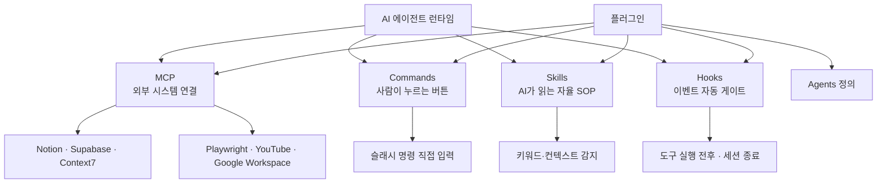
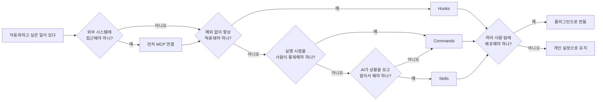
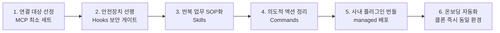

에이전트에 기능을 붙이는 방법은 하나가 아니다. 같은 일을 슬래시 명령으로 만들 수도 있고, AI가 알아서 읽는 문서로 둘 수도 있고, 이벤트에 걸리는 스크립트로 박아 둘 수도 있다. 셋 다 "자동화"라고 불리는데 동작 시점과 실행 보장은 서로 다르다.

여기에 외부 시스템을 붙이는 MCP까지 더하면 넷이 된다. 이 글은 그 넷 — MCP·커맨드·스킬·훅 — 을 하나의 축으로 가른다. **누가 트리거하는가.** 축이 하나면 선택이 판단 흐름도로 정리되고, 그러면 "무엇이 더 좋은가"라는 질문이 "이 일은 어느 칸인가"로 바뀐다. 마지막으로 그 넷을 한 단위로 묶어 배포하는 플러그인과, 조직이 이것들을 세우는 순서를 본다.

> 이 시리즈는 **원 자료 작성 기준일(2026-07-26)** 정리다. 제품 사양·명령·화면은 그 시점의 것이다. 원 자료 안에서 생태계 규모 수치만 **2026년 4월 기준**으로 따로 표기돼 있고, 그 수치는 [MCP 편](/blog/agentic-coding/mcp-selection-practice/)에서 각주와 함께 다룬다.

## 용어 정리

이 시리즈 전체에서 반복되는 용어를 먼저 정리한다. 뒤의 두 편은 여기서 각자 쓰는 행만 다시 추린다.

| 용어 | 풀이 |
|---|---|
| **MCP** | Model Context Protocol. AI 모델이 외부 도구·데이터에 접근하기 위한 표준 프로토콜 |
| **MCP 서버** | 외부 서비스를 MCP 규격으로 감싸는 경량 어댑터. "도구 공급업체" 역할 |
| **MCP 클라이언트** | 서버의 도구를 실제로 호출하는 주체. 에이전트 런타임에 내장 |
| **Host** | 여러 클라이언트를 관리하는 상위 애플리케이션. 브라우저에 비유하면 브라우저 본체 |
| **Protocol** | 통신 규약. MCP는 JSON-RPC 2.0 기반 |
| **JSON-RPC 2.0** | JSON 형식의 원격 프로시저 호출 규격. MCP의 기반 통신 계층 |
| **Primitives** | MCP가 정의하는 3가지 기능 단위 — Tools·Resources·Prompts |
| **Tools** | AI가 외부 기능을 *실행*하는 것 (쓰기·행위) |
| **Resources** | AI가 외부 데이터를 *읽는* 것 (읽기 전용) |
| **Prompts** | 사전 정의된 프롬프트 템플릿 |
| **stdio** | Standard Input/Output. 로컬 프로세스와 stdin/stdout으로 통신하는 연결 방식 |
| **Streamable HTTP** | 원격 서버와 HTTP로 통신하는 최신 연결 방식. 레거시 SSE를 대체 |
| **SSE** | Server-Sent Events. 구 원격 전송 방식 (레거시) |
| **OAuth 2.0** | 비밀번호를 넘기지 않고 제3자 앱에 제한된 권한을 위임하는 인증 표준 |
| **PAT** | Personal Access Token. 사람 개입 없이 인증하는 토큰. CI/CD용 |
| **스코프(Scope)** | 설정의 적용 범위. local(현재 프로젝트) / project(팀 공유) / user(전역) |
| **Command** | 사용자가 `/명령어`로 직접 호출하는 수동 자동화 단위 |
| **Skill** | AI가 상황을 감지해 자율 호출하는 절차 문서. 사실상 SOP |
| **SOP** | Standard Operating Procedure. 표준운영절차 |
| **SKILL.md** | 스킬을 인식·실행하게 하는 핵심 파일. 없으면 스킬은 존재하지 않는 것과 같음 |
| **Frontmatter** | 마크다운 최상단 `---`로 감싼 YAML 메타데이터 블록 |
| **Hook(훅)** | 특정 이벤트 발생 시 자동 실행되는 셸 스크립트. AI 판단을 거치지 않음 |
| **matcher** | 훅이 어떤 도구에 반응할지 지정하는 정규식 패턴 |
| **PreToolUse** | 도구 실행 *전* 이벤트. 유일하게 실행을 차단할 수 있는 이벤트 |
| **PostToolUse** | 도구 실행 *후* 이벤트. 후처리·로깅만 가능 |
| **플러그인** | MCP+Skills+Hooks+Commands+Agents를 한 번에 묶어 배포하는 번들 |
| **plugin.json** | 플러그인 매니페스트. 각 컴포넌트의 설치 위치를 선언 |
| **마켓플레이스** | MCP 서버·플러그인을 검색·설치하는 디렉토리 플랫폼 |
| **managed 스코프** | 관리자가 배포하고 일반 사용자가 제거할 수 없는 플러그인 배포 모드 |
| **N×M 문제** | N개 AI 앱 × M개 서비스를 각각 연결하면 N×M개 커넥터가 필요해지는 문제 |
| **Tool Poisoning** | 정상처럼 보이지만 숨겨진 악성 명령을 포함한 MCP 도구 |
| **공급망 공격** | 정상 패키지와 유사한 이름의 악성 패키지를 배포해 속이는 공격 |
| **gws** | Google Workspace CLI. Google 전체 REST API를 단일 CLI 패턴으로 호출 |
| **AAIF** | Agentic AI Foundation. MCP를 관리하는 Linux Foundation 산하 재단 |

## 한눈에 보기 — 확장 메커니즘 4종 지도

AI 에이전트를 실무에 투입할 때 손대는 지점은 결국 네 곳이다. **무엇에 연결할 것인가(MCP)**, **사람이 언제 부를 것인가(Commands)**, **AI가 언제 알아서 할 것인가(Skills)**, **무조건 걸리게 할 것인가(Hooks)**.

핵심은 **플러그인이 나머지 넷을 감싸는 배포 단위**라는 점이다. 개별 설정을 [다섯 군데에 흩어 두는 대신](/blog/agentic-coding/commands-skills-hooks-plugins/), 하나의 매니페스트로 묶어 조직에 배포한다.

### 층위 정리

| 층위 | 메커니즘 | 성격 |
|---|---|---|
| 연결 층 | MCP | AI가 *무엇을* 만질 수 있는지 결정 |
| 실행 층 | Commands / Skills | AI가 *어떻게* 일하는지 결정 |
| 통제 층 | Hooks | AI가 *무엇을 못 하는지* 결정 |
| 배포 층 | 플러그인 | 위 셋을 *어떻게 배포*할지 결정 |

## 4자 비교 — 판별 축은 "누가 트리거하는가"

Commands·Skills·Hooks·MCP는 이름만으로는 경계가 흐릿하다. **판별 축은 "누가 트리거하는가" 하나**다. 정확히는 이 축이 가르는 것은 셋이고, MCP는 축 위가 아니라 그 아래 연결 층에 있다 — 아래 표의 MCP 행에 트리거 대신 「연결 계층」이 적힌 이유다.

| 구분 | 무엇인가 | 트리거 | 정의 위치 | 대표 용도 | 언제 선택 |
|---|---|---|---|---|---|
| **MCP** | 외부 시스템 연결 규격 | 트리거 아님 (연결 계층) | `.mcp.json` / settings의 `mcpServers` | 사내 DB·문서·브라우저 연동 | AI가 접근할 *대상*을 늘려야 할 때 |
| **Commands** | 수동 실행 워크플로우 | 사람이 `/명령어` 입력 | `.claude/commands/*.md` | 리포트 생성·배포·체크인 | 실행 시점을 사람이 통제해야 할 때 |
| **Skills** | 자율 실행 SOP 문서 | AI의 상황 감지 | `.claude/skills/<이름>/SKILL.md` | 도메인 라우팅·정형 산출물 | AI가 알아서 판단해 주길 바랄 때 |
| **Hooks** | 이벤트 기반 셸 스크립트 | 런타임 이벤트 발생 | `settings.json`의 `hooks` | 보안 차단·자동 포맷·알림 | 예외 없이 100% 걸려야 할 때 |

### 성질 비교

| 성질 | MCP | Commands | Skills | Hooks |
|---|---|---|---|---|
| 호출 주체 | 에이전트(도구 호출) | 사람 | AI | 런타임 |
| 실행 보장 | 승인 필요 | 사람이 부르면 확실 | AI 해석에 의존 | **100% 보장** |
| 차단 능력 | 없음 | 없음 | 없음 | **있음 (PreToolUse)** |
| 예측 가능성 | 중 | 상 | 하 | 상 |
| 디버깅 난이도 | 중 (연결·인증) | 하 (호출 시점 명확) | 상 (왜 호출됐나 추론) | 하 (이벤트 명확) |
| 팀 공유 방식 | `.mcp.json` 커밋 | 저장소 커밋 | 저장소 커밋 | settings 커밋 |

> **굵게 표시된 두 칸이 모두 훅 열에 있다.**
>
> 「실행 보장」과 「차단 능력」이 그 두 행이다. 나머지 셋은 차단 능력이 모두 「없음」으로 적혀 있고, 이 차이가 정책을 어디에 둘 것인가를 가른다. 같은 일을 세 가지로 만들 수 있어도, 반드시 걸려야 하는 일은 갈 곳이 하나뿐이라는 뜻이다.

### 선택 판단 흐름도

### 한 문장 요약

> 반복 업무를 원클릭으로 → **Commands**.
>
> AI가 상황 보고 전문 기술을 써 주길 → **Skills**.
>
> 보안·품질 정책을 항상 자동으로 → **Hooks**.
>
> AI가 만질 수 있는 시스템 자체를 늘리려면 → **MCP**.

## 다섯으로 세는 목록과 넷으로 세는 목록

같은 대상을 다른 수로 세는 자료가 이 블로그 안에 이미 있다. [하네스를 만드는 다섯 가지](/blog/ai-agent/harness-five-primitives/)는 메모리·스킬·에이전트·커맨드·훅 **다섯**을 든다. 이 글의 원 자료는 MCP·Commands·Skills·Hooks **넷**을 놓고, 그 위에 배포 층으로 플러그인을 더한다. 두 목록이 겹치는 것은 셋이다.

| 구성물 | 하네스 다섯 | 이 글의 확장 메커니즘 넷 + 배포 층 |
|---|---|---|
| 스킬 | ○ | ○ |
| 커맨드 | ○ | ○ |
| 훅 | ○ | ○ |
| 메모리 | ○ | — |
| 에이전트 | ○ | — |
| MCP | — | ○ (연결 층) |
| 플러그인 | — | ○ (배포 층) |

**두 목록이 어긋나는 이유는 열거 기준이 다르기 때문이다.** 하네스 쪽은 **컨텍스트 관리를 상위 목적으로 공유하는 수단**을 묶는다 — 그 글의 도식은 다섯 위에 `Context Management (WHY)` 한 노드를 두고, "최상위 노드가 다섯 중 하나가 아니라 다섯의 이유라는 점이 이 도식의 전부"라고 적는다. 이 글은 **무엇을 확장 가능한가**로 센다. 기준이 다르면 같은 도구를 놓고도 목록에 들고 나는 것이 달라진다. 메모리와 에이전트는 컨텍스트 관리 수단이지만 확장 지점은 아니고, MCP와 플러그인은 확장 지점이지만 그 글이 다섯으로 센 목록에는 오르지 않았다.

그 글의 컨텍스트 분해표는 아홉 행에 토큰 값을 붙이는데, **MCP 도구 행만 값이 `—`이고 옆 칸에 `필요 시 로드`라고 적혀 있다.** 다만 이 표가 다섯의 선정 기준을 그대로 보여주는 것은 아니다 — 커맨드와 훅은 이 표에 행 자체가 없는데도 다섯에 들어 있다. **그 글은 MCP를 다섯에서 뺀 이유를 따로 밝히지 않는다.** 확인되는 것은 값이 `—`라는 사실까지다. 이 값이 이 시리즈의 원 자료와 어떻게 갈리는지는 [MCP 편](/blog/agentic-coding/mcp-selection-practice/)에서 따로 본다.

그 글이 다섯에 붙인 정의는 다음과 같다.

| 구성물 | 그 글의 정의 |
|---|---|
| 메모리 | 인덱스와 본문을 나눔. 프로젝트별 `MEMORY.md`에 자동 기록 (200줄 제한) |
| 스킬 | `SKILL.md`로 패키징돼 메인 컨텍스트에 자동 주입되는 전문성 |
| 에이전트 | 자체 컨텍스트 창을 가진 독립 작업자 |
| 커맨드 | 서브에이전트 호출 순서·절차를 고정한 버전 관리 가능한 프롬프트 파일 |
| 훅 | 도구 호출 전후에 개입. 설정 파일에 등록 |

> **두 목록을 하나로 합치지 않는다.**
>
> 같은 이름의 구성물이라도 어느 기준으로 세었는지에 따라 이웃이 달라진다. 어느 쪽이 맞는 목록인지 정하는 대신, 기준이 다르다는 사실만 남긴다.
>
> 이 대조는 원 자료에 없다. 두 자료를 나란히 놓고 이 글에서 만든 것이다.

## 조직 도입 관점 — 확장 메커니즘을 표준으로 굳히기

지금까지의 내용을 조직 도입 순서로 재배열하면 다음과 같다.

| 단계 | 결정 사항 | 실패 시 증상 |
|---|---|---|
| 1 | 무엇에 연결할지, 몇 개까지 | 토큰 비용 폭증, 응답 지연 |
| 2 | 무엇을 절대 못 하게 할지 | 비밀 유출·파괴적 명령 사고 |
| 3 | 어떤 업무를 문서화된 절차로 굳힐지 | 사람마다 결과 품질 편차 |
| 4 | 어떤 작업은 사람이 눌러야 하는지 | 의도치 않은 자동 실행 |
| 5 | 어떻게 배포·회수할지 | 팀원마다 다른 환경 |
| 6 | 신규 인원 투입 리드타임 | 온보딩 장기화 |

**순서에서 눈여겨볼 점은 안전장치(2번)가 자동화(3·4번)보다 앞선다는 것**이다. 도구를 붙여 능력을 키운 직후, 능력이 잘못 쓰이는 경로부터 막는다. 자동화의 편의는 그다음이다.

> **앞의 층위표와 배열이 다르다.**
>
> 층위표는 연결 → 실행 → 통제 → 배포로 놓았지만, 도입 순서에서는 통제가 실행보다 앞이다. 층위는 무엇이 무엇 위에 얹히는가를 그린 것이고 도입 순서는 무엇을 먼저 세워야 사고 경로가 먼저 막히는가를 그린 것이라, 같은 네 층을 놓고도 배열이 갈린다.

## 다음 편

넷을 가르는 축은 여기까지다. 다음 편은 그중 연결 층 하나만 떼어, [무엇을 붙일지 고르고 몇 개까지 붙일지 정하는 문제](/blog/agentic-coding/mcp-selection-practice/)를 본다. 그다음이 나머지 셋과 [플러그인의 실제 구성](/blog/agentic-coding/commands-skills-hooks-plugins/)이다.
