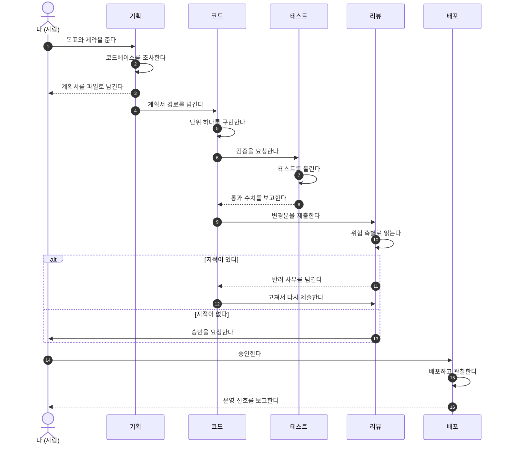
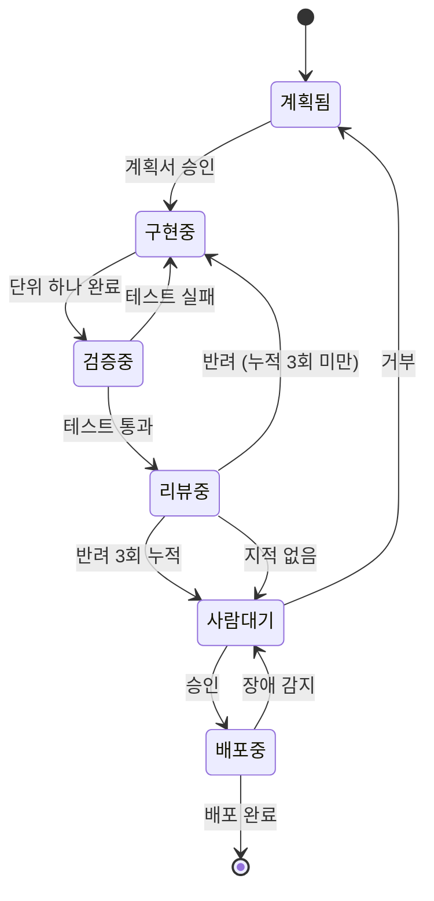

[에이전트 한 명을 정의하는 법](/blog/agentic-coding/subagent-definition-fields/)과 [여럿을 묶는 패턴](/blog/agentic-coding/collaboration-patterns-isolation/), [팀을 굴리는 운용 규칙](/blog/agentic-coding/agent-team-operations/)까지 정리하고 나면 구조는 선다. 그런데 실제로 띄워 보면 남는 질문이 둘이다.

**사람은 어디에 서 있는가.** 그리고 **각 자리에 어떤 모델을 얼마나 깊이 생각하게 두고 앉힐 것인가.**

이 글은 그 둘을 다룬다. 앞의 세 편이 「누가 · 어떻게 묶고 · 어떻게 굴리는가」를 봤다면, 이 글은 **「사람이 어디서 멈춰 세우고, 각 자리의 단가를 어떻게 정하는가」를** 본다.

> 이 글이 적는 모델 ID·단가·파라미터 제약은 **2026-09-16** 기준이다. 모델은 계속 바뀌므로, 배정의 **기준**은 가져가되 표의 **값**은 쓰는 시점에 다시 확인해야 한다.

## 용어 정리

앞의 세 편에서 쓴 용어 가운데 이 글이 쓰는 것만 추리고, 이 글에서 새로 나오는 것을 더했다.

| 용어 | 정의 | 대응되는 사람 조직 개념 |
|---|---|---|
| **통제 계약** | 사람이 에이전트 전체에 거는 조건. 계획·과업 분배·결과 검토·승인 거부의 넷을 사람이 쥔다 | 결재선 |
| **되먹임 경로** | 실패나 반려가 되돌아가는 방향. 누구에게 돌아가는지가 설계의 핵심이다 | 반려 프로세스 |
| **승인 지점** | 사람이 멈춰 세우고 판단하는 자리. 많을수록 안전한 것이 아니다 | 결재 단계 |
| **`effort`** | 모델이 한 요청에 얼마나 깊이 생각할지를 정하는 파라미터. `low`부터 `max`까지 다섯 단계다 | 한 업무에 들이는 공수 |
| **적응형 사고(adaptive thinking)** | 고정 토큰 예산 대신 모델이 스스로 사고 깊이를 정하는 방식 | 재량 판단 |
| **복구 비용** | 그 단계가 틀렸을 때 되돌리는 데 드는 비용. 모델 배정의 기준이다 | 리스크 가중치 |

## 한눈에 보기 — 사람 하나와 에이전트 다섯


도식에서 읽어야 할 것은 실선이 아니라 **점선**이다. 실선은 일이 앞으로 나아가는 경로이고, 점선은 되돌아오는 경로다. 그리고 **점선 셋의 도착지가 각각 다르다.**

### 역할 분담

| 에이전트 | 입력 | 산출물 | 판정 권한 | 쓰기 권한 |
|---|---|---|---|---|
| 나 (사람) | 모든 보고 | 목표 · 제약 · 승인 | 최종 | 없음. 직접 고치지 않는다 |
| 기획 | 목표 · 제약 · 실패 보고 | 계획서 `.md` | 없음 | 계획서만 |
| 코드 | 계획서 · 반려 사유 | 변경분(diff) | 없음 | 소스 전체 |
| 리뷰 | 변경분 | 지적 목록 | 반려 가능 | 없음. 읽기 전용 |
| 테스트 | 변경분 | 실행 결과 수치 | 실패 판정 | 테스트 파일만 |
| 배포 | 승인된 변경분 | 배포 기록 · 운영 지표 | 없음 | 배포 설정만 |

여섯 행이 말하는 것은 하나다. **판정하는 자와 고치는 자를 분리한다.**

리뷰 에이전트에게 쓰기 권한을 주면 자기가 지적한 것을 자기가 고치고 통과시킨다. 그것은 리뷰가 아니라 두 번째 구현이다. 사람으로 치면 작성자가 자기 문서를 자기가 결재하는 것과 같다.

사람의 칸에 **쓰기 권한 없음**이라고 적은 것도 같은 이유다. 사람이 중간에 직접 코드를 고치기 시작하면, 그 변경은 계획서에도 리뷰에도 잡히지 않은 채 들어간다. 사람의 역할은 방향을 정하고 멈춰 세우는 것이지 손을 대는 것이 아니다.

## 1. 되먹임이 어디로 가는가가 설계다

에이전트를 나열하는 것은 어렵지 않다. 어려운 것은 실패가 되돌아갈 곳을 정하는 일이다.

| 되먹임 | 잘못된 대상 | 올바른 대상 | 그렇게 정하는 이유 |
|---|---|---|---|
| 테스트 실패 | 사람 | 코드 | 구현 실수는 구현자가 고친다. 사람을 거치면 병목이 된다 |
| 테스트가 계획의 모순을 드러냄 | 코드 | 기획 | 코드가 계획을 고치면 계획서와 코드가 갈라진다 |
| 리뷰 지적 | 사람 | 코드 | 사람이 중계하면 지적마다 사람이 깨어 있어야 한다 |
| 리뷰가 3회 반복 | 코드 | 사람 | 반복 자체가 설계 문제의 신호다 |
| 배포 후 장애 | 배포 | 사람 | 되돌릴지 고칠지는 사람의 결정이다 |

다섯 행 가운데 둘째와 넷째가 특히 자주 잘못 배선된다.

**둘째 행**은 이런 상황이다. 테스트를 돌렸더니 계획서가 전제한 인터페이스가 실제로는 존재하지 않는다. 이때 코드 에이전트가 계획을 무시하고 자기 판단으로 다른 인터페이스를 쓰면 당장은 돌아간다. 그런데 계획서에는 여전히 없는 인터페이스가 적혀 있고, 다음 단위 작업이 그 계획서를 읽는다. **계획서와 코드가 갈라지는 지점이 바로 여기다.**

**넷째 행**은 상한의 문제다. 코드와 리뷰가 서로를 물고 도는 구조에는 자연스러운 종료 조건이 없다. 리뷰는 볼 때마다 새로운 지적을 만들 수 있고, 코드는 지적을 받을 때마다 고칠 수 있다. 그동안 토큰은 계속 쓰이는데 사람은 그 사실을 모른다. **3회에서 사람에게 올린다**는 상한이 필요한 이유다. 세 번을 고쳐도 통과하지 못했다면 그것은 구현의 문제가 아니라 계획이나 요구사항의 문제일 가능성이 높다.

> 되돌릴 수 있는 결정과 되돌릴 수 없는 결정을 먼저 가르는 관점은 [되돌릴 수 있는가를 먼저 묻는다](/blog/agentic-coding/reversibility-before-permission/)에서 따로 다뤘다. 되먹임 경로를 정하는 일도 같은 질문의 연장이다.

## 2. 단계별 계약 아홉

화살표마다 무엇이 실려 가는지를 고정해야 에이전트를 갈아 끼울 수 있다. 계약이 없으면 에이전트를 바꿀 때마다 앞뒤가 함께 깨진다.



각 화살표를 표로 풀면 이렇다.

| 단계 | 보내는 쪽 | 받는 쪽 | 실어 나르는 것 | 형식 | 실패했을 때 |
|---|---|---|---|---|---|
| 1 | 사람 | 기획 | 목표 · 제약 · 건드리면 안 되는 것 | 산문 | 되묻는다 |
| 2 | 기획 | 코드 | 계획서 경로 · 단위 작업 번호 | 파일 경로 | 사람에게 올린다 |
| 3 | 코드 | 테스트 | 변경한 파일 목록 | 파일 경로 | 코드가 다시 고친다 |
| 4 | 테스트 | 코드 | 통과·실패 수치와 실패 로그 | 수치 + 로그 | 3단계로 되돌린다 |
| 5 | 테스트 | 기획 | 계획 자체가 틀렸다는 신호 | 산문 | 계획서를 고친다 |
| 6 | 코드 | 리뷰 | 변경분과 계획서 경로 | diff + 경로 | 리뷰가 반려한다 |
| 7 | 리뷰 | 코드 | 지적 목록(위치 · 근거 · 심각도) | 구조화 목록 | 3회 반복하면 사람에게 올린다 |
| 8 | 리뷰 | 사람 | 승인 요청과 남은 위험 | 요약 | 사람이 거부한다 |
| 9 | 배포 | 사람 | 배포 기록과 운영 지표 | 수치 | 롤백한다 |

「형식」 열이 이 표의 값어치다. 같은 정보라도 **산문으로 넘기느냐 수치로 넘기느냐에 따라 받는 쪽의 동작이 갈린다.**

4단계를 예로 들면, 테스트 에이전트가 「대체로 잘 돌아갑니다」라고 보고하면 코드 에이전트는 무엇을 고쳐야 할지 모른다. 「194개 중 3개 실패, 실패 케이스는 아래 로그」라고 보고해야 다음 동작이 정해진다. 계약에 **형식을 못 박는 것이 곧 다음 단계의 동작을 정하는 일이다.**

### 파일 경로로 넘기는 이유

2단계와 3단계, 6단계가 내용이 아니라 **경로**를 넘긴다는 점을 눈여겨볼 만하다.

| 넘기는 방식 | 무슨 일이 일어나나 |
|---|---|
| 내용을 통째로 넘긴다 | 계획서 전문이 호출하는 쪽 컨텍스트에 들어왔다가 받는 쪽으로 다시 들어간다. 같은 내용이 두 번 실린다 |
| 경로를 넘긴다 | 받는 쪽만 읽는다. 호출하는 쪽 컨텍스트는 경로 한 줄만 먹는다 |

[컨텍스트 예산을 세션 단위로 보는 관점](/blog/agentic-coding/context-budget-session/)에서 다룬 것과 같은 원리다. 에이전트 사이의 전달에서도 **원문 대신 주소를 넘기는 것이 기본**이어야 한다.

## 3. 역할은 산문이 아니라 도구 목록으로 가른다

에이전트 정의서 본문에 「고치지 마라」라고 적어 두어도, `Edit` 도구가 손에 있으면 고친다. **역할 분리는 문장이 아니라 권한으로 강제하는 것이다.**

| 에이전트 | 허용 도구 | 막는 것 |
|---|---|---|
| 기획 | `Read` `Grep` `Glob` `Write` | 소스 수정. 계획서 외 쓰기는 본문 규칙으로 좁힌다 |
| 코드 | `Read` `Edit` `Write` `Bash` | 없음. 가장 넓은 권한을 가진다 |
| 리뷰 | `Read` `Grep` `Glob` `Bash` | 수정. 판정만 한다 |
| 테스트 | `Read` `Write` `Bash` | 소스 수정. 테스트 파일만 쓴다 |
| 배포 | `Read` `Bash` | 소스 수정. 절차만 실행한다 |

[권한 선언에서 deny 가 항상 이긴다](/blog/agentic-coding/settings-permissions-deny/)는 규칙이 여기에도 그대로 적용된다. 넓게 열어 두고 문장으로 좁히는 것보다, 처음부터 좁게 주고 필요할 때 여는 쪽이 지켜진다.

### 읽기 전용 에이전트에는 함정이 따라온다

도구를 줄이면 새로운 문제가 생긴다. **보고서를 쓸 방법이 사라진다.**

리뷰 에이전트에 `Write`가 없으면 지적 목록을 파일로 남기지 못한다. 그러면 에이전트는 할 일을 마치고도 산출물 없이 멈추는데, 호출한 쪽에서는 그것이 「아직 작업 중」인지 「끝났는데 보고를 못 한 것」인지 구분되지 않는다. **조용한 유휴**다.

대응은 둘 중 하나다.

| 방법 | 내용 | 대가 |
|---|---|---|
| 셸로 쓰게 한다 | `Bash`로 히어독을 써서 보고서 파일을 만들게 한다 | 작업 디렉터리에 부산물이 남는다. 커밋 전에 추적되지 않는 파일을 확인해야 한다 |
| 반환값으로 받는다 | 도구를 쓰지 않고 최종 메시지로만 보고하게 한다 | 리뷰 전문이 호출한 쪽 컨텍스트에 그대로 들어온다 |

리뷰처럼 산출물이 긴 경우에는 첫째가 낫고, 조사처럼 결론이 짧은 경우에는 둘째가 낫다. 기준은 **산출물의 길이**다.

### 브리프의 마지막 줄은 언제나 멈추는 조건이다

에이전트를 띄울 때 넘기는 지시문에 「무엇을 하라」만 적고 「어디서 멈춰라」를 빠뜨리면, 에이전트가 스스로 범위를 넓히거나 다른 에이전트를 부르려다 권한에 막혀 아무것도 못 하고 끝난다.

```text
[임무]     위험 축 「정확성」으로 변경분을 리뷰한다
[대상]     현재 브랜치와 기준 브랜치의 차이
[산출물]   scratchpad/review-correctness.md
[한계]     파일을 고치지 않는다. 다른 에이전트를 호출하지 않는다.
           산출물을 쓴 뒤 즉시 끝낸다. 후속 작업을 제안하지 않는다.
```

네 칸 가운데 마지막이 빠지면 나머지 셋이 아무리 정확해도 에이전트가 끝나지 못한다. **「끝낸다」를 명시적으로 허가하는 문장이 필요하다.**

## 4. 승인 지점을 하나로 모은다



상태 전이 열두 개 가운데 **사람이 개입하는 자리는 `사람대기` 하나뿐이다.** 나머지는 전부 에이전트 사이에서 돈다.

단계마다 사람에게 묻는 설계가 더 안전해 보이지만 실제로는 반대다. 잘게 잘린 질문은 맥락을 잃는다. 「이 함수를 A 방식으로 짤까요 B 방식으로 짤까요」를 스무 번 물으면, 사람은 열 번째쯤부터 무엇을 승인하는지 모른 채 승인하게 된다. **승인 횟수가 늘어날수록 승인 하나의 무게가 가벼워진다.**

| 물어야 하는 것 | 물으면 안 되는 것 |
|---|---|
| 되돌릴 수 없는 것 — 배포, 원격 삭제, 외부 발행 | 접근 방식이 둘 이상일 때 어느 쪽을 고를지 |
| 만들 물건 자체가 갈리는 결정 | 어떻게 만들지의 세부 |
| 기록 어디에도 없어 사람만 아는 사실 | 이미 계획서에 적힌 것 |

오른쪽 열은 전부 **추천안을 정해 진행하고 무엇을 왜 골랐는지 마지막에 적는 것**으로 대체된다. 선택지를 낼 수 있다는 것은 곧 추천안을 고를 수 있다는 뜻이기 때문이다.

### 상태를 컨텍스트가 아니라 파일에 둔다

승인 지점을 하나로 모으면 한 번의 실행이 길어진다. 그러면 컨텍스트가 차오르는데, 여기서 갈린다.

| 상태를 두는 곳 | 결과 |
|---|---|
| 세션의 컨텍스트 | 컨텍스트를 비우는 순간 진행 상황이 사라진다. 그래서 비우지 못하고, 비우지 못해서 비용이 쌓인다 |
| 계획서 파일 | 컨텍스트를 비워도 계획서와 버전 관리 이력으로 복원된다 |

컨텍스트를 비우지 못하는 이유가 「비우면 잃어버려서」라면, 그것은 **컨텍스트가 유일한 상태 저장소라는 뜻이고 그 자체가 문제다.**

다만 계획서를 상태 저장소로 쓸 때 한 가지 주의할 점이 있다. **계획서의 체크박스는 갱신되지 않는다.** 구현이 끝나도 에이전트가 계획서로 돌아가 체크를 채우는 일은 거의 없다. 진행률은 체크박스가 아니라 버전 관리 이력과 실제 파일로 판단해야 한다.

## 5. 모델과 effort 배정

여기부터가 이 글의 본론이다. 구조를 다 그려도 각 자리에 무엇을 앉힐지가 남는다.

### 파라미터부터 맞춘다

배정을 이야기하기 전에 파라미터의 현재 모양을 확인해야 한다. 이 부분이 최근에 크게 바뀌었기 때문이다.

```typescript
import Anthropic from "@anthropic-ai/sdk";

const client = new Anthropic();

const response = await client.messages.create({
  model: "claude-opus-5",
  max_tokens: 16000,
  thinking: { type: "adaptive" },        // 고정 토큰 예산이 아니라 적응형이다
  output_config: { effort: "xhigh" },    // low | medium | high | xhigh | max
  messages: [{ role: "user", content: brief }],
});
```

세 가지를 짚어 둔다.

| 항목 | 내용 |
|---|---|
| `effort` 의 자리 | 최상위가 아니라 `output_config` 안이다. 최상위에 적으면 무시되거나 거부된다 |
| 기본값 | `high` 다. 생략하는 것과 `high`를 적는 것은 같다 |
| 사고 방식 | 고정 토큰 예산(`budget_tokens`)이 아니라 적응형(`adaptive`)이다. 최신 모델에서는 예산을 보내면 오류가 난다 |

세 번째가 특히 중요하다. **「사고 예산을 몇 토큰으로 줄까」라는 질문 자체가 바뀌었다.** 예산을 손으로 정하는 대신 `effort` 로 깊이를 고르고, 그 안에서 모델이 스스로 조절한다.

### 단가와 제약

| 모델 | 모델 ID | 컨텍스트 | 입력 $/1M | 출력 $/1M | `effort` |
|---|---|---|---|---|---|
| Opus 5 | `claude-opus-5` | 1M | 5.00 | 25.00 | `low`부터 `max`까지 전부 |
| Sonnet 5 | `claude-sonnet-5` | 1M | 2.00 | 10.00 | `low`부터 `max`까지 전부 |
| Haiku 4.5 | `claude-haiku-4-5` | 200K | 1.00 | 5.00 | **받지 않는다. 보내면 오류가 난다** |

마지막 열의 마지막 칸이 실무에서 자주 걸린다. **하위 모델로 내리는 결정이 파라미터까지 함께 바꾸는 일이 된다.** Haiku 4.5 는 `effort` 를 받지 않고, 사고 방식도 적응형이 아니라 예전의 고정 예산 방식이다. 「비용을 줄이려고 하위 모델로 바꿨더니 요청이 400으로 튕긴다」는 상황이 여기서 나온다.

컨텍스트 창이 200K 로 좁다는 점도 함께 봐야 한다. 대량 읽기를 맡기려고 하위 모델을 골랐는데 정작 읽을 양이 창을 넘으면 배정 자체가 성립하지 않는다.

### 에이전트와 작업별 배정

| 에이전트 | 작업 | 모델 | `effort` | 배정 근거 |
|---|---|---|---|---|
| 기획 | 요구 분석 · 계획 수립 | Opus 5 | `xhigh` | 계획의 오류는 뒤의 모든 단계를 오염시킨다. 복구 비용이 가장 크다 |
| 기획 | 계획서 문구 다듬기 | Sonnet 5 | `medium` | 구조가 이미 정해진 뒤의 문장 작업이다 |
| 코드 | 새 기능 구현 | Opus 5 | `xhigh` | 코딩과 장기 작업에서 effort 가 가장 크게 작동한다 |
| 코드 | 기계적 리팩터링 · 이름 변경 | Sonnet 5 | `medium` | 판단이 아니라 적용이다. 정답이 이미 정해져 있다 |
| 코드 | 원인을 모르는 버그 추적 | Opus 5 | `max` | 가설을 세우고 반증하는 일이다. 틀린 수정이 더 비싸다 |
| 리뷰 | 위험 축별 리뷰 | Opus 5 | `high` | 구현자와 다른 관점이 필요하다. 놓친 결함 하나가 그대로 나간다 |
| 리뷰 | 보안 · 데이터 손실 축 | Opus 5 | `max` | 되돌릴 수 없는 결함의 축이다 |
| 리뷰 | 문체 · 포매팅 확인 | Haiku 4.5 | 없음 | 규칙이 명시되어 있고 판단이 들어가지 않는다 |
| 테스트 | 테스트 설계 | Opus 5 | `high` | 어떤 케이스가 결함을 실제로 잡는지가 판단이다 |
| 테스트 | 실행과 수치 보고 | Haiku 4.5 | 없음 | 돌리고 읽는 일이다. 추론이 필요 없다 |
| 배포 | 배포 준비 · 산출물 대조 | Sonnet 5 | `medium` | 절차가 정해져 있고 대조 대상이 명확하다 |
| 배포 | 장애 원인 추적 | Opus 5 | `xhigh` | 디버깅은 판단이다 |
| 조사 | 파일 · 심볼 위치 찾기 | Haiku 4.5 | 없음 | 대량 읽기이고 판정이 없다 |

열세 행을 관통하는 기준은 **난이도가 아니라 틀렸을 때의 복구 비용**이다.

같은 코드 에이전트인데 작업에 따라 배정이 셋으로 갈린 것이 그 결과다. 리팩터링이 틀리면 되돌리면 되지만, 계획이 틀리면 그 위에 쌓은 것을 전부 버려야 한다. 「어려운 일에 좋은 모델」이 아니라 **「되돌리기 비싼 일에 좋은 모델」이다.**

> [에이전트 정의서를 다룬 첫 편](/blog/agentic-coding/subagent-definition-fields/)이 상위·중간·하위의 세 계층과 Reasoning Sandwich 패턴을 정리했다. 이 표는 그 계층을 실제 모델 ID 와 파라미터 값까지 내린 것이다. 계층이 「무엇을 쓸까」를 정한다면, `effort` 는 **「같은 것을 얼마나 깊이 쓸까」를** 정한다.

### effort 를 고르는 순서

배정표를 그대로 베끼는 것보다 순서를 아는 편이 오래 간다. 모델도 단가도 바뀌지만 순서는 남기 때문이다.

| 순서 | 할 것 | 이유 |
|---|---|---|
| 1 | 캐싱부터 확인한다 | 품질을 깎지 않는 유일한 절감 수단이다 |
| 2 | 기본값 `high` 로 실측한다 | 대조군 없이 올리거나 내리면 근거가 없다 |
| 3 | 품질이 남으면 `medium` 으로 내린다 | 남는 품질은 낭비다 |
| 4 | 품질이 모자라면 `xhigh` 로 올린다 | 코딩과 에이전트 작업의 권장값이다 |
| 5 | `max` 는 측정으로 부족이 확인될 때만 | 가장 비싸고 가장 느리다 |

여기서 가장 자주 건너뛰는 것이 **2번**이다. 대조군 없이 「어려운 일이니까 `max`」로 시작하면, 나중에 내려도 되는지 알 방법이 없다. 내려서 품질이 떨어지는지 재려면 올리기 전의 값이 있어야 한다.

### 모델을 내리기 전에 effort 를 먼저 내려라

비용이 문제일 때 가장 먼저 떠오르는 수는 모델을 한 단계 내리는 것이다. 그런데 그 전에 재야 할 것이 있다.

**같은 모델의 낮은 `effort` 다.** 최신 모델의 낮은 effort 가 이전 세대의 높은 effort 를 웃도는 경우가 흔하다.

그리고 모델을 섞으면 대가가 하나 더 붙는다.

| 구성 | 캐시 |
|---|---|
| 한 모델로 통일 | 캐시 하나를 계속 재사용한다 |
| 모델을 섞은 계단 구성 | 캐시가 모델 단위로 갈린다. 모델을 바꾸는 순간 그 요청은 캐시를 못 쓴다 |

캐시는 모델별로 따로 잡힌다. 그래서 「싼 모델로 1차, 비싼 모델로 2차」 구성은 **단가는 내려가도 캐시 재사용을 통째로 잃는다.** 앞의 표에서 조사와 실행 보고만 하위 모델로 내리고 나머지를 한 모델로 묶은 이유가 여기에 있다. 조사와 실행 보고는 애초에 긴 공통 접두사를 공유하지 않는 일회성 작업이다.

### 비용 감각

| 배정 | 한 사이클의 상대 비용 | 언제 쓰나 |
|---|---:|---|
| 전부 Opus 5 · `max` | 100 | 되돌릴 수 없는 변경을 다룰 때 |
| 위 배정표의 혼합 구성 | 약 35 | 기본값 |
| 전부 Sonnet 5 · `medium` | 약 12 | 실험용 브랜치 |

세 행의 수치는 단가와 일반적인 토큰 비율로 추정한 **상대값**이며 절대 비용이 아니다. 실제 값은 응답에 실려 오는 사용량을 누적해서 재야 한다.

판단할 때 **요청당 비용이 아니라 완료된 작업당 비용**으로 봐야 한다는 점도 함께 짚어 둔다. 싸게 부른 요청이 세 번 더 돌아야 끝난다면 그것은 싼 것이 아니다.

## 6. 실패 여섯

구조와 배정이 맞아도 실제로 돌리면 걸리는 것들이다.

| 실패 | 겉으로 보이는 모습 | 진짜 원인 | 대응 |
|---|---|---|---|
| 조용한 유휴 | 에이전트가 응답 없이 멈춘다 | 보고를 쓸 도구가 없다 | 산출물 파일의 존재로 판단한다. 메시지를 기다리지 않는다 |
| 커밋 오염 | 남의 변경이 내 커밋에 들어온다 | 경로를 명시해도 커밋 단계에서 합쳐진다 | 커밋은 사람이나 상위 세션만 한다 |
| 변형 오보 | 리뷰가 없는 결함을 보고한다 | 옆에서 소스를 일부러 바꾸는 작업이 돌고 있다 | 소스를 변형하는 작업은 단독으로 돌린다 |
| 거짓 초록 | 검사가 0건을 보고하는데 실제로는 위반이 있다 | 검사기가 대상에 닿지 못했다 | 판정에 **도달한 수**를 대상 수와 대조한다 |
| 재질문 손실 | 다시 물으면 답이 얕아진다 | 「아까 물어본 대로」가 맥락을 잃는다 | 원래 질문을 그대로 다시 보낸다 |
| 무한 반려 | 토큰만 쓰이고 끝나지 않는다 | 반복 상한이 없다 | 3회에서 사람에게 올린다 |

넷째 행이 가장 위험하다. **증명되지 않은 「0건」은 거짓 음성과 구분되지 않는다.** 검사가 초록이면 사람은 그것을 확인된 사실로 기록한다. 그런데 검사기가 대상 파일을 하나도 읽지 못했어도 결과는 똑같이 0건이다.

대응은 간단하다. 검사기가 **판정에 도달한 수를 함께 세게 하고, 그것을 대상 수와 맞춰 본다.** 둘이 어긋나면 0건은 결론이 아니다. [문제를 세 층으로 갈라 짚는 방법](/blog/agentic-coding/troubleshooting-three-layers/)도 같은 발상 위에 있다.

셋째 행의 「변형 오보」는 병렬 실행에서만 나타난다. 같은 작업 트리를 공유하는 에이전트들은 서로를 밟는다.

| 충돌 | 무슨 일이 일어나나 | 규칙 |
|---|---|---|
| 커밋 | 각자 경로를 명시해도 커밋이 남의 변경을 함께 담는다 | 커밋은 한 곳에서만 한다 |
| 의존성 설치 | 한쪽의 설치가 다른 쪽의 실행을 깨뜨리고, 피해자는 엉뚱한 원인을 보고한다 | 의존성을 건드리는 작업은 단독으로 돌린다 |
| 소스 변형 | 일부러 심은 결함을 옆의 리뷰가 진짜 결함으로 보고한다 | 소스를 변형하는 작업은 단독으로 돌린다 |

세 행의 공통점은 **피해자가 원인을 모른다**는 것이다. 그래서 병렬 실행의 규칙은 「무엇을 동시에 돌릴 수 있는가」가 아니라 **「무엇을 절대 동시에 돌리지 않는가」로** 적는 편이 지켜진다.

## 7. 도입 순서

다섯을 한 번에 만들면 어디가 깨졌는지 알 수 없다. 하나씩 붙이고 매번 값어치를 확인한다.

| 순서 | 붙이는 것 | 이 단계에서 확인할 것 |
|---|---|---|
| 1 | 조사 에이전트 | 호출한 쪽의 컨텍스트가 실제로 줄었는가 |
| 2 | 리뷰 에이전트 | 구현자가 놓친 것을 잡는가. 못 잡으면 위험 축이 잘못 나뉜 것이다 |
| 3 | 테스트 에이전트 | 수치를 보고하는가. 산문으로 보고하면 계약이 안 선 것이다 |
| 4 | 기획 에이전트 | 계획서가 구현을 실제로 이끄는가. 안 읽히면 형식만 남은 것이다 |
| 5 | 배포 에이전트 | 사람이 승인 한 번으로 끝낼 수 있는가 |

2번을 1번보다 먼저 붙이지 않는 이유가 있다. 리뷰 에이전트가 조사 없이는 리뷰할 대상을 스스로 찾아야 하고, **그 탐색이 다시 호출한 쪽으로 흘러 들어오기 때문이다.** 조사를 먼저 떼어 놓아야 리뷰가 결론만 돌려준다.

각 행의 오른쪽 열이 전부 **확인할 수 있는 질문**이라는 점도 의도한 것이다. 「잘 돌아가는가」는 확인이 아니다. 「컨텍스트가 줄었는가」는 세어 볼 수 있다.

## 정리

세 문장으로 줄이면 이렇다.

**첫째, 되먹임이 어디로 가는지가 구조다.** 에이전트를 나열하는 것은 설계가 아니다. 테스트 실패는 코드로, 계획의 모순은 기획으로, 3회 반복은 사람에게 간다. 이 배선이 정해져야 나머지가 따라온다.

**둘째, 역할은 도구 목록으로 가른다.** 「고치지 마라」는 문장은 `Edit` 앞에서 무력하다. 판정하는 자에게서 쓰기 권한을 빼는 것이 판정을 판정으로 만든다.

**셋째, 모델은 난이도가 아니라 복구 비용으로 배정한다.** 그리고 모델을 내리기 전에 같은 모델의 낮은 `effort` 를 먼저 재야 한다. 캐시는 모델 단위로 갈리므로, 계단을 만드는 순간 단가와 함께 재사용을 잃는다.

앞의 세 편이 누구를 어떻게 묶어 굴릴지를 봤다면, 이 글은 그 위에 **사람이 서는 자리와 각 자리의 단가**를 올렸다. 구조가 서고 배정이 정해지면 남는 일은 하나다. 하나씩 붙여 보고 매번 값어치를 세는 것이다.
