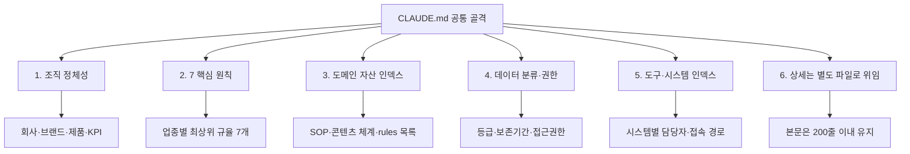

조직 규칙 문서를 한 벌만 보면 그 조직의 사정처럼 보인다. 세 벌을 나란히 놓아야 무엇이 그 조직의 사정이고 무엇이 문서라는 형식 자체의 요구인지 갈린다.

이 글은 [3계층 통제](/blog/agentic-coding/rules-hooks-skills-layers/)에 이어지는 두 번째 편이다. 앞 편이 통제 수단 세 가지를 다뤘다면 이 글은 그중 규범 계층이 실제 조직에서 어떤 모양이 되는지를 본다 — 원 자료가 업종이 전혀 다른 셋(1인 SaaS · 제조·유통 · 서비스·콘텐츠)에 대해 만든 CLAUDE.md 골격을 열 개 축으로 대조한다.

이 글에서 가장 오래 남는 관찰은 원 자료가 직접 적은 것이다. **"7개 원칙"의 자리는 그대로고 내용만 업종을 탄다.** 자리가 고정되고 내용이 갈린다는 것은, 문서를 새로 만들 때 채워야 할 칸이 이미 정해져 있다는 뜻이다.

> 이 글이 옮긴 원 자료의 작성 기준일은 **2026-07-26**이다.
>
> 아래 세 템플릿과 프롬프트 안티패턴은 **원 자료가 제공한 예제**이며, 이 글이 조직에 적용해 얻은 실적이 아니다.

## 용어 정리

시리즈 [첫 편](/blog/agentic-coding/rules-hooks-skills-layers/)의 용어표 31행 중 이 글이 쓰는 행만 추렸다.

| 용어 | 풀이 |
|---|---|
| **Rules** | 에이전트가 매 세션 자동으로 읽는 정적 지침서(`.md`). 강제력 없음, 규범 역할 |
| **SSOT** | Single Source of Truth. 같은 데이터는 한 곳에서만 관리한다는 원칙 |
| **BLUF** | Bottom Line Up Front. 결론을 첫 줄에 쓰는 보고 방식 |
| **SDD** | Spec-Driven Development. 사양 → 계획 → 구현 순서로 진행하는 방식 |
| **Plan Mode** | 코드를 바꾸기 전에 계획서를 먼저 제출하고 승인받는 실행 모드 |
| **RLS** | Row Level Security. DB 행 단위 접근 제어. 애플리케이션이 아니라 DB가 막는다 |

`SSOT`와 `BLUF`는 아래 본문이 영문 약어로 쓰지 않고 각각 「같은 규칙이 두 파일에 있으면 한 곳으로 통합」·「결론 먼저」라는 한국어로만 등장한다. 그래도 행을 남겼다 — 같은 개념이 다른 자료에서는 약어로 나오기 때문이다.

## 업종 셋을 열 개 축으로 나란히 놓으면

| 구분 | 1인 SaaS | 제조·유통 | 서비스·콘텐츠 |
|---|---|---|---|
| 비유 | 작은 사무실 안내판 | 공장 입구 게시물 | 콘텐츠 스튜디오 작업판 |
| 최상단 블록 | 7 핵심 원칙 | 회사 개요 → 7 핵심 원칙 | 브랜드 정체성 → 7 핵심 원칙 |
| 원칙의 성격 | 개발·운영 규율 (결론 먼저·수술적 변경·시크릿·RLS·자동화·Git) | 현장 안전·품질 규율 (안전·품질·SOP·추적성·NDA·결재·보고) | 발행 규율 (톤·팩트체크·출처·동의·셀프리뷰·모니터링·회고) |
| 중심 자산 | KPI 표 (MRR·ARR·이탈률·CAC·LTV) | SOP 카탈로그 11종 | 콘텐츠 분류 체계 + 승인 프로세스 |
| 데이터 정책 | 3분할 저장 (코드/정형/미디어) | 4등급 분류 (영업비밀·제한·내부·공개) + 법정 보존 | 유형별 저장·보관 기한 (후기·녹음·이미지·개인정보) |
| 권한 모델 | 테이블별 RLS 정책 | 협력사 등급 매트릭스 (1차·2차·일반) | 승인 단계 (드래프트→셀프→동료→대표) |
| 컴플라이언스 | 개인정보·전자상거래 | 산업안전·식품위생·환경·공정거래·화학물질 | 개인정보 + 표현 규제 (과장·비교광고 금지) |
| 도구 인덱스 | 결제·메일·CS·CRM·분석·호스팅 | ERP·MES·WMS·SCM·CRM·그룹웨어·QMS | CMS·디자인·비디오·분석·자동화·AI |
| 자동화 판단 기준 | "같은 작업 2회 → 3회째는 자동화" | "수작업 4시간 이상 + 주 1회 이상 반복" | 발행 주기 기반 (주 2회·일 1회 등) |
| 하단 블록 | rules 인덱스 10개 | 면책 + 부서별 분리 안내 | 데이터 정책 + 원칙 |

「최상단 블록」과 「하단 블록」 두 행은 1인 SaaS 칸이 한 항목이고 나머지 두 칸은 두 항목씩이다. 최상단은 7 핵심 원칙 앞에 회사 개요·브랜드 정체성이 하나 더 붙고, 하단은 「면책 + 부서별 분리 안내」·「데이터 정책 + 원칙」으로 둘이 붙는다 — **이렇게 짚어 읽는 것은 이 글의 정리이며, 원 자료는 열 축을 한 표에 나란히 둘 뿐 어느 행이 다른지 표시하지 않았다.**

「자동화 판단 기준」 행은 축 자체보다 채워진 값이 눈에 띈다. 그 행의 세 칸이 전부 숫자를 들고 있다. 자동화 대상을 고르는 기준을 숫자로 두는 문제는 이 카테고리의 [규칙 문서부터 쓰면 막힌다](/blog/agentic-coding/automation-scope-criteria/) 편이 별도로 다뤘다.

## 셋이 공유하는 골격

업종이 달라도 문서의 뼈대는 동일하다. 이 골격이 재사용 가능한 부분이다.

| 공통 규약 | 내용 |
|---|---|
| 분량 제한 | 200줄 이내. 상세는 별도 디렉터리로 분리 |
| 원칙 개수 | 7개로 고정. 더 늘리지 않는다 |
| 표 중심 | 회사 정보·KPI·데이터 정책·도구를 모두 표로 |
| 인덱스 역할 | 본문은 목차이고, 실행 상세는 참조 파일에 둔다 |
| 중복 금지 | 같은 규칙이 두 파일에 있으면 한 곳으로 통합 |

도식의 여섯 노드와 앞 표의 열 축은 1:1로 대응하지 않는다. 골격 노드 1(조직 정체성)은 「최상단 블록」·「중심 자산」의 KPI 부분을 함께 받고, 노드 4(데이터 분류·권한)는 「데이터 정책」과 「권한 모델」 두 축을 한 노드로 묶는다. **골격은 축보다 굵게 그려져 있으며, 이 대응 관계는 이 글의 정리다.**

### 이 원 자료가 쓰는 「200줄」은 무엇을 재는 값인가

위 도식의 마지막 노드(`본문은 200줄 이내 유지`)와 공통 규약 표의 첫 행이 같은 값을 말한다. 이 글이 뒤에서 싣는 프롬프트 7패턴 표의 1번 항목에도 *"규칙이 늘면 컨텍스트를 잡아먹는다. 200줄 내로 유지"* 가 있다. **원 자료 안에서 세 자리다.**

세 자리가 재는 것은 같다. 공통 규약 표의 「인덱스 역할」 행이 그 정의를 대신한다 — *"본문은 목차이고, 실행 상세는 참조 파일에 둔다."* 200줄은 **본문이 목차 노릇을 유지할 수 있는 분량**이다. 세 자리 중 둘은 그 분량 옆에 상세를 밖으로 빼라는 말을 나란히 달고 있다 — 공통 규약 표의 「분량 제한」 행이 *"200줄 이내. 상세는 별도 디렉터리로 분리"* 이고, 도식의 노드 6은 이름 자체가 「상세는 별도 파일로 위임」이며 그 아래에만 200줄이 붙는다. 다만 **원 자료가 「200줄을 넘기면 이렇게 하라」는 처방을 문장으로 적은 자리는 없다.** 분량 제한과 분리 방침이 나란히 놓여 있을 뿐이고, 이 둘을 처방 관계로 읽는 것은 이 글의 정리다.

같은 200이라는 숫자가 이 카테고리에 이미 여러 번 나왔다. 두 글이 각각 다른 것을 재고 있다.

- [200줄은 상한이 아니라 임계다](/blog/agentic-coding/claude-md-scope-layers/) — *"200줄은 하드 리밋이 아니라 **준수율(adherence) 임계**다. 넘어가면 파일이 거부되는 게 아니라, AI가 앞쪽 규칙만 우선시하고 뒤쪽 규칙을 흘리기 시작한다."* 넘겼을 때 **모델에게 일어나는 일**을 잰다.
- [규칙 문서부터 쓰면 막힌다](/blog/agentic-coding/automation-scope-criteria/) — 그 글에는 같은 파일의 줄 수가 나오는 자리를 여섯 개 모은 표가 있다(60줄 산식 · 30~60줄 성숙기 · 100줄 이상 위험 · 60줄 체크리스트 · 200줄 · 200줄 준수율). **그 표를 여기서 다시 그리지 않는다.**

**그 여섯 행의 출처는 두 자료다** — 그 글의 원 자료가 다섯, `claude-md-scope-layers`가 옮긴 별개 자료가 하나. **이 글의 원 자료는 그 출처 목록에 없다.** 그러므로 위의 세 자리는 그 표에 실린 값을 되풀이한 것이 아니라 별개의 자료가 별개의 목적으로 붙인 값이다. **세 자료가 같은 것을 말한다고 단정하지 않는다** — 재는 대상이 각각 「본문의 목차 기능」·「모델의 규칙 준수율」·「문서가 잠식하는 컨텍스트」로 갈리기 때문이며, 이렇게 갈라 읽는 것은 이 글의 정리다.

## 시사점 — 업종이 바뀌어도 변하지 않는 것

세 템플릿을 나란히 놓으면 **AI에게 조직 컨텍스트를 주입한다는 것이 무엇인지** 분명해진다.

- **"7개 원칙"의 자리는 그대로고 내용만 업종을 탄다.** 1인 SaaS는 개발 규율, 제조업은 안전·품질, 콘텐츠는 발행 규율. 조직의 최상위 판단 기준을 7줄로 압축하라는 요구가 공통이다.
- **데이터 분류가 항상 있다.** SaaS는 저장소 3분할, 제조업은 기밀 4등급, 콘텐츠는 유형별 보관 기한. 어떤 조직이든 "무엇을 어디에 두고 얼마나 보관하는가"를 정의해야 AI가 판단할 수 있다.
- **권한 모델이 항상 있다.** 행 단위 정책 / 협력사 등급 / 승인 단계. 형태는 다르지만 "누가 무엇에 접근하는가"가 반드시 명시된다.
- **자동화 도입 기준이 숫자로 있다.** "2회 반복" 또는 "4시간 + 주 1회". 자동화 여부를 감으로 정하지 않는다.

네 항목 중 뒤의 셋은 앞의 10축 표에서 각각 「데이터 정책」·「권한 모델」·「자동화 판단 기준」 행에 대응한다. 첫 항목만 두 행(「최상단 블록」·「원칙의 성격」)에 걸쳐 있다.

## 프롬프트 쪽에서 남은 것

원 자료는 위 템플릿과 별개로 프롬프트 패턴 가이드를 함께 담고 있다. 그중 4요소 프레임(목적·맥락·제약·형식)과 XML 태그 구조, 슬래시 커맨드·`@` 파일 참조·파이프라인은 이 카테고리의 [`.claude` 디렉터리와 프롬프트 7패턴](/blog/agentic-coding/dot-claude-directory/) 편이, 멀티턴 관리의 70% 룰과 컨텍스트 압축 흐름은 [70%에서 끊는 것이 더 빠르다](/blog/agentic-coding/context-budget-session/) 편이 이미 다뤘다. **여기서 다시 설명하지 않는다.**

두 자료가 겹치는 자리를 셀 단위로 맞춰 보면, **덧붙은 것으로 보이던 자리 하나가 실은 같은 것이다.** 이 원 자료는 4요소 표에 **「작성 공식」** 열을 달고 있고 앞 글은 요소마다 **「구조」** 행을 두는데, 열 이름이 달라서 다른 내용처럼 보일 뿐 네 칸 중 셋은 같은 것을 적는다.

| 요소 | 이 원 자료의 「작성 공식」 | 앞 글의 「구조」 | 판정 |
|---|---|---|---|
| 목적 | `동사 + 무엇을 + 구체적 수식어` | `동사 + 무엇을 + 구체적 수식어` | 문자열까지 같다 |
| 맥락 | `독자 / 상황 / 우리 처지 3줄` | `독자 + 사용 시점/상황 + 현재 우리 상황` | 구성요소가 같다. 「3줄」이라는 개수만 이쪽에 붙는다 |
| 제약 | `금지 사항을 부정형으로 명시` | `금지 항목의 열거. 부정형으로 명시` | 같다 |
| 형식 | `분량·구조·톤을 숫자로` | `매체 + 구조 + 분량` | **다르다.** 이쪽은 「톤」을 넣고 「숫자로」를 못 박고, 앞 글은 「매체」를 넣는다 |

**네 칸 중 실제로 갈리는 것은 형식 한 칸이다.** 그러므로 「작성 공식」 열 자체를 이 원 자료가 덧붙인 것이라고 말할 수 없다 — **셀을 열어 보기 전까지는 열 이름이 다른 것이 내용이 다른 근거처럼 보인다.**

셀 대조와 별개로, 이 원 자료가 4요소에 붙인 것으로 아래 둘이 있다.

- **XML 태그에 값을 채운 예시.** 앞 글은 같은 네 태그(`<goal>`·`<context>`·`<constraints>`·`<output_format>`)에 `(무엇을 만들어달라는가?)` 같은 플레이스홀더만 넣어 빈 골격을 준다. 이 자료는 같은 네 태그에 실제 문장을 채운 형태를 보여 준다.
- **4요소 사이에 우선순위를 매긴 판정 한 문단.** 원 자료는 *"가장 자주 빠지는 요소는 **맥락**이다. 한 줄만 추가해도 결과 깊이가 달라진다. 반대로 사고를 막는 것은 **제약**이다"* 라고 적고, 제약을 안 적어서 나오는 사고로 **영업 제안서의 경쟁사 비방**과 **CS 답변의 지킬 수 없는 환불 약속**을 든다. 이 판정의 앞 절반은 앞 글도 맥락 표의 「빠지면」 행에 *"**가장 많이 빠지는 요소**"* 로 적어 두었다.

아래는 그 두 글에 없는 것들이다.

### 나쁜 프롬프트와 좋은 프롬프트

| 구분 | 나쁜 프롬프트 | 좋은 프롬프트 |
|---|---|---|
| 길이 | "경쟁사 분석해줘" (한 줄) | 5~15줄 구조화 |
| 결과 | 일반론, 실행할 때마다 다름 | 바로 쓸 수 있는 초안 |
| 재사용 | 매번 다시 입력 | 파일로 저장 → 커맨드 한 줄로 호출 |
| 팀 공유 | 사람마다 결과가 다름 | 누가 써도 같은 품질 |

원 자료의 전제는 명확하다 — **"AI 성능이 아니라 지시 품질이 결과를 가른다."**

> **핵심 전환**: "AI에게 말 거는 채팅"이 아니라 "신입 직원에게 주는 업무 지시서"로 본다.
>
> 신입에게 "보고서 써줘"라고만 지시하지 않는다면, AI에게도 그렇게 지시하지 않는다.

네 축 중 아래 둘(재사용·팀 공유)은 프롬프트의 품질이 아니라 **프롬프트를 어디에 두는가**를 말한다. 좋은 프롬프트 열의 두 칸이 각각 "파일로 저장"과 "누가 써도"로 끝나는 것이 그 근거다.

### Plan Mode를 강제 절차로 바꾸는 한 줄

원 자료의 7패턴 표 중 위 두 글이 다루지 않은 세 행이다.

| # | 패턴 | 정의 | 언제 쓰나 | 주의점 |
|---|---|---|---|---|
| 1 | CLAUDE.md 컨텍스트 주입 | 반복 설명할 회사·팀 정보를 파일에 한 번만 적어두고 자동 로드 | 매 세션 같은 배경 설명을 반복할 때 | 규칙이 늘면 컨텍스트를 잡아먹는다. 200줄 내로 유지 |
| 4 | Plan Mode + SDD | 계획서를 먼저 만들고 승인 후에만 실행 | 3파일 이상 / DB 스키마 변경 / 외부 API 연동 | 승인 게이트를 형식적으로 통과시키면 의미가 없다 |
| 6 | 이미지 입력 | 스크린샷을 첨부해 시각 정보를 직접 분석시킴 | 에러 화면·UI 피드백·차트 해석 | 텍스트로 옮길 수 있는 정보는 텍스트가 더 정확하다 |

1번의 「200줄 내로 유지」가 앞에서 센 세 자리 중 하나다. 4번에 붙는 것이 이 원 자료에서 가장 옮길 만한 한 줄이다.

> **"3파일 이상 또는 100줄 이상 변경이면, 계획 승인 없이 구현 금지."**

이 규칙 한 줄이 Plan Mode를 선택 사항에서 강제 절차로 바꾼다. 임계값을 숫자로 정해두지 않으면 "이 정도는 그냥 하자"가 매번 이긴다.

> ### ⚠️ 여기의 「100줄」은 이 카테고리의 다른 100줄과 다른 것을 센다
>
> [규칙 문서부터 쓰면 막힌다](/blog/agentic-coding/automation-scope-criteria/) 편에도 「100줄」이 있다 — *"위험 \| 100줄 이상 \| 컨텍스트 잠식, 관리 포기"*. **그것은 CLAUDE.md라는 파일의 크기**다.
>
> 위 하드 게이트의 100줄은 **한 번에 변경하는 코드의 줄 수**다. 재는 대상이 문서와 코드로 갈리고, 넘겼을 때의 조치도 「정리한다」와 「계획 승인을 받는다」로 갈린다. **숫자가 같다는 것만으로 같은 규칙이 아니며, 이렇게 갈라 읽는 것은 이 글의 정리다.**

패턴 6의 주의점도 그 자체로 규칙 한 줄이 된다 — *"텍스트로 옮길 수 있는 정보는 텍스트가 더 정확하다."* 스크린샷을 붙일 수 있다는 것과 붙이는 편이 낫다는 것이 같지 않다는 뜻이다.

### 안티패턴 5가지

여기 다섯은 **프롬프트를 대상으로 한 안티패턴**이다. 규칙 문서나 권한 설정이 아니라 지시문 한 통의 문제다.

| 안티패턴 | 전형적 표현 | 왜 실패하나 | 교정 |
|---|---|---|---|
| 모호한 지시 | "좋게 써줘", "알아서 해" | "좋게"의 기준이 사람마다 다르므로 평균값이 나온다 | 형식·분량·톤을 숫자로 명시 |
| 너무 큰 작업 | "홈페이지 전체를 처음부터 만들어줘" | 컨텍스트 폭증으로 중요한 부분을 놓친다 | 단계 분할. 정보구조 → 메인 → 결제 순 |
| 컨텍스트 없는 요청 | "이거 검토해줘" | 대상과 관점이 불명이라 일반론이 나온다 | 파일 참조 + 검토 기준 명시 |
| 검증 없는 신뢰 | "그렇다고 했으니 맞겠지" | 자신감 있는 오답이 특히 수치·법규·인용에서 잦다 | 수치는 출처 확인, 코드는 실행, 법규는 전문가 검토 |
| 같은 실수 반복 | 매번 같은 지적을 다시 함 | 세션마다 처음부터 시작해 학습이 누적되지 않는다 | 교정 내용을 규칙 파일에 누적 |

다섯 중 둘은 교정이 프롬프트 한 통 밖으로 나간다. 「같은 실수 반복」의 교정이 *"교정 내용을 규칙 파일에 누적"* 이라 **프롬프트가 아니라 이 글 앞부분의 CLAUDE.md 쪽으로 나가고**, 「검증 없는 신뢰」의 교정도 *"수치는 출처 확인, 코드는 실행, 법규는 전문가 검토"* 라 마지막 조치가 세션 밖 사람에게 간다. 나가는 곳이 한쪽은 **파일**이고 다른 쪽은 **사람**이다. 이렇게 세는 것은 이 글의 정리다.

### 30초 응급처치 카드

결과가 마음에 안 들 때, 순서대로 점검한다.

1. 목적이 결과물의 모양이 보이는 동사로 시작하는가? ("써줘" → "A4 1장으로 요약해줘")
2. 독자가 누구인지 한 줄 추가했는가? ("팀장 보고용")
3. 금지 사항을 하나라도 적었는가? ("추측 금지")
4. 출력 형식이 보이는가? ("표 형식, 마크다운")
5. 그래도 안 되면 → 세션을 비우고 처음부터.

앞의 네 항목이 목적·맥락·제약·형식 순서로 4요소를 한 번씩 되짚고, 다섯째만 요소가 아니라 세션 자체를 버린다. 4요소의 정의와 각 요소가 빠졌을 때의 실패 모양은 [`.claude` 디렉터리와 프롬프트 7패턴](/blog/agentic-coding/dot-claude-directory/) 편에 있다.

## 다음 편

여기까지가 규범 계층이 문서와 지시문에서 갖는 모양이다. 이어지는 두 편은 그 규범 위에서 실제로 무언가를 만들고 내보내는 쪽이다.

| 편 | 다루는 것 |
|---|---|
| [빈 폴더에서 배포까지](/blog/agentic-coding/empty-folder-to-deploy/) | SaaS 하나를 완주하는 빌드 8단계, DB에서 인증까지 6단계, AI 기능의 비용·주입 방어 |
| [배포 65항목과 디버깅](/blog/agentic-coding/deploy-checklist-debugging/) | 배포 전·중·후·롤백·보안·성능 6섹션 65항목, 재현→가설→검증→회귀방지 4 Phase, MCP 6종 |

빌드 8단계의 2단계가 RLS이고 3단계가 인증이다. 위 10축 표에서 1인 SaaS의 권한 모델이 「테이블별 RLS 정책」이었던 자리가 거기서 실제 순서로 펼쳐진다.
