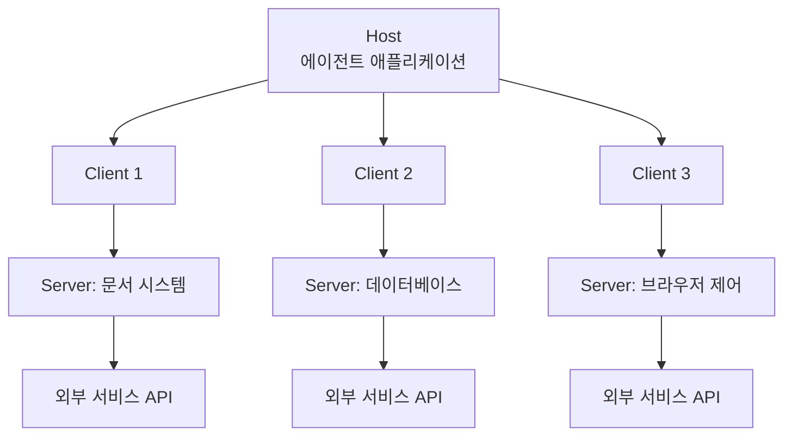
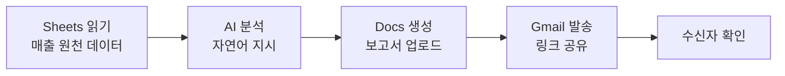
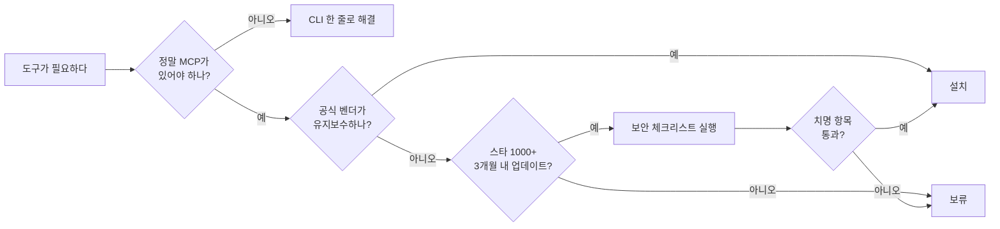

연결 층은 넷 중에서 성격이 다르다. 커맨드·스킬·훅은 에이전트가 이미 가진 능력을 언제 어떻게 쓸지 정하지만, MCP는 **에이전트가 만질 수 있는 대상 자체**를 늘린다. [앞 편](/blog/agentic-coding/extension-trigger-axis/)의 4자 비교표가 MCP 행에만 트리거를 적지 않고 "연결 계층"이라고 쓴 이유가 그것이다.

그래서 판단하는 질문도 다르다. 나머지 셋은 "이 일을 자동화할 것인가"를 묻지만, MCP는 붙일 수 있느냐가 아니라 **붙일 자리가 컨텍스트에 있느냐**를 묻는다. 이 글은 그 판단을 네 구간으로 나눠 본다 — 왜 표준이 필요했는가, 실무에서 무엇을 붙이는가, 셸 명령이 더 나은 경우는 언제인가, 붙인 도구가 무엇을 잠식하는가.

> 이 글이 옮긴 원 자료의 작성 기준일은 **2026-07-26**이고, 그 안의 생태계 규모 수치만 **2026년 4월 기준**으로 따로 표기돼 있다. 제품 사양·명령·화면은 그 시점의 것이다.

## 용어 정리

[앞 편](/blog/agentic-coding/extension-trigger-axis/)의 용어표에서 이 글이 쓰는 행만 추렸다.

| 용어 | 풀이 |
|---|---|
| **MCP** | Model Context Protocol. AI 모델이 외부 도구·데이터에 접근하기 위한 표준 프로토콜 |
| **MCP 서버** | 외부 서비스를 MCP 규격으로 감싸는 경량 어댑터. "도구 공급업체" 역할 |
| **MCP 클라이언트** | 서버의 도구를 실제로 호출하는 주체. 에이전트 런타임에 내장 |
| **Host** | 여러 클라이언트를 관리하는 상위 애플리케이션. 브라우저에 비유하면 브라우저 본체 |
| **Protocol** | 통신 규약. MCP는 JSON-RPC 2.0 기반 |
| **JSON-RPC 2.0** | JSON 형식의 원격 프로시저 호출 규격. MCP의 기반 통신 계층 |
| **Primitives** | MCP가 정의하는 3가지 기능 단위 — Tools·Resources·Prompts |
| **Tools** | AI가 외부 기능을 *실행*하는 것 (쓰기·행위) |
| **Resources** | AI가 외부 데이터를 *읽는* 것 (읽기 전용) |
| **Prompts** | 사전 정의된 프롬프트 템플릿 |
| **stdio** | Standard Input/Output. 로컬 프로세스와 stdin/stdout으로 통신하는 연결 방식 |
| **Streamable HTTP** | 원격 서버와 HTTP로 통신하는 최신 연결 방식. 레거시 SSE를 대체 |
| **SSE** | Server-Sent Events. 구 원격 전송 방식 (레거시) |
| **OAuth 2.0** | 비밀번호를 넘기지 않고 제3자 앱에 제한된 권한을 위임하는 인증 표준 |
| **PAT** | Personal Access Token. 사람 개입 없이 인증하는 토큰. CI/CD용 |
| **스코프(Scope)** | 설정의 적용 범위. local(현재 프로젝트) / project(팀 공유) / user(전역) |
| **N×M 문제** | N개 AI 앱 × M개 서비스를 각각 연결하면 N×M개 커넥터가 필요해지는 문제 |
| **Hook(훅)** | 특정 이벤트 발생 시 자동 실행되는 셸 스크립트. AI 판단을 거치지 않음 |
| **플러그인** | MCP+Skills+Hooks+Commands+Agents를 한 번에 묶어 배포하는 번들 |
| **마켓플레이스** | MCP 서버·플러그인을 검색·설치하는 디렉토리 플랫폼 |
| **Tool Poisoning** | 정상처럼 보이지만 숨겨진 악성 명령을 포함한 MCP 도구 |
| **공급망 공격** | 정상 패키지와 유사한 이름의 악성 패키지를 배포해 속이는 공격 |
| **gws** | Google Workspace CLI. Google 전체 REST API를 단일 CLI 패턴으로 호출 |
| **AAIF** | Agentic AI Foundation. MCP를 관리하는 Linux Foundation 산하 재단 |

## MCP — 외부 시스템 연결의 표준

### 왜 필요한가 — N×M 문제

MCP 이전에는 AI 앱과 외부 서비스를 잇는 커넥터를 조합마다 따로 만들어야 했다. AI 앱이 N개, 서비스가 M개면 N×M개의 통합이 필요했다.

| 상태 | 필요한 통합 수 | 비유 |
|---|---|---|
| MCP 이전 | N × M | 브랜드마다 다른 충전 단자 |
| MCP 이후 | M (서비스당 서버 1개) | USB-C 단일 표준 |

각 서비스가 MCP 서버 하나만 만들면 모든 AI 클라이언트가 그대로 쓸 수 있다. 이것이 MCP가 "경쟁 제품"이 아니라 **HTTP 같은 공통 규격**으로 자리 잡은 이유다.

### 표준화 궤적

| 시점 | 사건 |
|---|---|
| 2024.11 | Anthropic이 MCP 발표 |
| 2025.03 | OpenAI 공식 채택 |
| 2025.04 | Google DeepMind가 Gemini 지원 발표 |
| 2025.12 | Linux Foundation 산하 AAIF에 기부 — Anthropic·OpenAI·Block 공동 관리 |

**네 행 중 마지막이 성격이 다르다.** 앞 셋은 개별 벤더가 규격을 발표하고 채택하고 지원한 사건이고, 마지막은 관리 주체가 특정 벤더에서 중립 재단으로 넘어간 사건이다. 뒤에 나올 선별 5기준에서 「유지보수 주체」가 한 항목을 차지하는 것도 같은 축을 본다. 이 연결은 원 자료에 없다. 두 표를 나란히 놓고 이 글에서 묶은 것이다.

원 자료가 인용한 생태계 규모(2026년 4월 기준): 활성 서버 12,000개 이상, 월간 SDK 다운로드 9,700만 건.

> 이 두 수치는 원 자료가 인용한 값이며, 원 자료 스스로 직접 측정치가 아니라고 밝히고 있다.

### 아키텍처 3요소



| 요소 | 역할 | 비유 | 사용자가 신경 쓸 것 |
|---|---|---|---|
| **Server** | 서비스를 MCP 규격으로 노출 | 도구 공급업체 / 웹사이트 | 어떤 서버를 등록할지 |
| **Client** | 서버의 도구를 실제 호출 | AI 직원의 손 / 브라우저 탭 | 없음 (자동 생성) |
| **Protocol** | JSON-RPC 2.0 통신 규약 | 사내 업무 규정 | 없음 |

Client ↔ Server는 1:1이지만 Host가 여러 Client를 관리하므로 여러 서버를 동시에 쓸 수 있다. 오른쪽 열이 셋 중 하나에만 값이 있다는 점이 실무의 요약이다 — 사용자가 실제로 결정하는 것은 서버 목록뿐이다.

### 3가지 Primitives

| Primitive | 방향 | 하는 일 | 비유 | 실무 빈도 |
|---|---|---|---|---|
| **Tools** | 쓰기·실행 | 이슈 생성, 이메일 발송, SQL 실행 | 펜·계산기·프린터 | 최다 |
| **Resources** | 읽기 | 파일 내용, DB 레코드, API 응답 조회 | 서류함 | 중간 |
| **Prompts** | 템플릿 | 사전 정의된 요청 양식 제공 | 업무 매뉴얼 | 고급 단계 |

원 자료의 정리는 이렇다 — **Tools만 알아도 MCP 활용의 90%는 가능**하다.

### 전송 방식 — stdio vs HTTP

| 항목 | 로컬 (stdio) | 원격 (Streamable HTTP) |
|---|---|---|
| 실행 위치 | 내 컴퓨터의 로컬 프로세스 | 서비스 제공자 서버 |
| 필요 조건 | npm·pip 등 런타임 | URL과 인터넷 연결 |
| 파일 시스템 접근 | 가능 | 불가 |
| 오프라인 | 동작 | 불가 |
| 업데이트 | 사용자가 갱신 | 서버 측 자동 |
| 팀 공유 | 각자 설치 | URL만 공유 |
| 비유 | PC에 프로그램 설치 | 클라우드 서비스 구독 |

2026년 기준 흐름은 원격 방식으로 이동 중이다. Azure·Google Cloud·AWS의 공식 MCP가 모두 원격 방식으로 출시됐다.

### 스코프

| 스코프 | 적용 범위 | 용도 |
|---|---|---|
| `local` | 현재 프로젝트, 나만 | 개인 실험 |
| `project` | `.mcp.json`을 저장소에 커밋 | **팀 전체 동일 환경 강제** |
| `user` | 내 모든 프로젝트 | 개인 상시 도구 |

조직 관점에서 의미 있는 건 `project`다. `.mcp.json`을 커밋하면 신규 입사자가 클론만 해도 동일한 도구 환경을 갖게 된다.

## 필수 MCP 6종 — 무엇을 왜 붙이는가

### 6종 요약표

| MCP | 연결 대상 | 대표 기능 | 실무 활용 | 인증 방식 |
|---|---|---|---|---|
| **Notion** | 사내 문서·데이터베이스 | 검색, 페이지 생성·수정, DB 쿼리 | 회의록 정리, 문서 허브 자동화 | OAuth 2.0 (페이지 단위 권한) |
| **Supabase** | PostgreSQL 데이터베이스 | SQL 실행, 테이블 조회, 마이그레이션, 로그 | 데이터 분석, 스키마 점검 | OAuth 2.0 또는 PAT |
| **Context7** | 라이브러리 공식 문서 | 라이브러리 ID 해석 → 최신 문서 조회 | 개발팀의 최신 API 확인 | 불필요 (키는 선택) |
| **Playwright** | 실제 브라우저 | 페이지 이동, 스냅샷, 클릭, 입력, 캡처 | E2E 테스트, 화면 검증 | 불필요 (로컬 실행) |
| **YouTube Transcript** | 유튜브 공개 자막 | 자막 추출, 언어 목록 조회 | 영상 요약, 경쟁사 콘텐츠 분석 | 불필요 |
| **Google Workspace** | Gmail·Drive·Calendar·Sheets·Docs | 메일 검색·발송, 파일 관리, 시트 읽기·쓰기 | 전사 공통 인프라 | OAuth 2.0 |

> **맨 오른쪽 열이 설치 순서와 이어진다.**
>
> 여섯 행 중 인증이 불필요한 것이 셋(Context7·Playwright·YouTube Transcript), 브라우저 로그인이 필요한 것이 셋이다. 뒤의 인증 절에서 이 3:3이 그대로 순서가 된다.

### 설치 명령 패턴

```bash
# 원격 HTTP 방식 — URL만 등록
claude mcp add --transport http notion https://mcp.notion.com/mcp
claude mcp add --transport http supabase https://mcp.supabase.com

# 로컬 stdio 방식 — 실행 명령을 등록
claude mcp add context7 -- npx -y @upstash/context7-mcp@latest
claude mcp add playwright -- npx @playwright/mcp@0.0.41
claude mcp add youtube-transcript -- npx @fabriqa.ai/youtube-transcript-mcp@latest
```

설정 파일로 직접 관리할 수도 있다. 팀 공유용은 프로젝트 루트의 `.mcp.json`에 둔다.

```json
{
  "mcpServers": {
    "notion":   { "type": "http", "url": "https://mcp.notion.com/mcp" },
    "supabase": { "type": "http", "url": "https://mcp.supabase.com" },
    "context7": { "command": "npx", "args": ["-y", "@upstash/context7-mcp"] },
    "playwright": { "command": "npx", "args": ["@playwright/mcp@0.0.41"] }
  }
}
```

> **주의**: API 키·토큰은 설정 파일에 직접 쓰지 않는다.
>
> 반드시 `${ENV_VAR}` 형태로 환경변수를 참조하고, 비밀값은 커밋 대상이 아닌 로컬 설정 파일로 분리한다.

### 인증 방식 3종

| 방식 | 대상 | 특징 | 리스크 |
|---|---|---|---|
| **무인증** | Context7, Playwright, YouTube Transcript | 즉시 사용. 설치 확인이 빠름 | 없음 (외부 쓰기 권한도 없음) |
| **OAuth 2.0** | Notion, Supabase, Google Workspace | 브라우저 로그인. 권한 범위를 사용자가 선택 | 토큰 만료 시 재인증 필요 |
| **PAT** | Supabase(CI/CD 등) | 사람 개입 없이 자동화 가능 | 토큰 유출 시 즉시 침해 |

설치 순서는 **무인증 3종 먼저 → OAuth 3종 나중**이 효율적이다. 무인증은 바로 동작 확인이 되므로 환경 문제를 먼저 걸러낼 수 있다.

### 권한 설계에서 주목할 점

| 항목 | 내용 | 조직 관점 시사점 |
|---|---|---|
| 페이지 단위 권한 | 문서 시스템 연동 시 접근 가능한 페이지를 개별 선택 | 최소 권한 원칙을 UI 차원에서 강제 |
| 읽기 전용 파라미터 | DB 연결 URL에 `?read_only=true`를 붙여 쓰기 차단 | 분석 목적 연결은 기본 읽기 전용으로 |
| 프로덕션 직결 금지 | 운영 DB 직접 연결은 비권장 | 스테이징·복제본 연결이 원칙 |
| 승인 모델 | 모든 도구 호출에 사용자 승인 필요 | 자동 승인 남발이 곧 사고 경로 |

### 부서별 배급 관점

원 자료는 7개 부서 × 6종 MCP 매트릭스로 "필요한 것만 배급"을 강조한다. 요지는 다음과 같다.

| 도구 | 배급 범위 |
|---|---|
| Google Workspace | 전사 공통 (7개 부서 중 6개 필수) |
| Notion | 비개발 조직의 문서 허브 |
| Context7 | 개발팀 전용 |
| Supabase | 데이터 취급 조직 |
| Playwright | 개발·QA·CS |
| YouTube Transcript | 마케팅·경영 |

**전원에게 전부 주지 않는다**는 원칙이 핵심이다. 이유는 보안뿐 아니라 뒤에 나올 토큰 비용 때문이다.

### 트러블슈팅 3대 문제

| 증상 | 원인 | 해결 |
|---|---|---|
| 인증 실패 | 토큰 만료·권한 부족 | 재인증 → 안 되면 서버 삭제 후 재등록 |
| 연결 실패 | Node.js 버전(18 미만), npx 캐시, 패키지명 오타 | 버전 확인 → 캐시 삭제 → 패키지명 재확인 |
| 브라우저 안 열림 | 팝업 차단 | 차단 해제 → 서버 재등록 |

진단은 다음 순서로 좁힌다.

```bash
claude mcp list                       # 등록 목록·상태
node --version                        # 런타임 버전 (18+ 필요)
rm -rf ~/.npm/_npx                    # 캐시 초기화
npx -y @upstash/context7-mcp --help   # 패키지 단독 실행 확인
```

## gws — Google Workspace를 CLI로 붙이기

### MCP 커넥터 vs gws CLI

| 항목 | 내장 MCP 커넥터 | gws CLI |
|---|---|---|
| 커버 범위 | Gmail·Calendar·Drive | 12개 서비스 전체 (Sheets·Docs 포함) |
| 설치 | 활성화만 하면 끝 | npm 전역 설치 필요 |
| 호출 방식 | 에이전트가 도구로 호출 | 셸 명령 |
| 스크립트·CI/CD | 부적합 | **적합** |
| 훅에서 사용 | 어려움 | 가능 |
| 비유 | 사무실 내부 전화 | 건물 어디서나 쓰는 마스터 키 |

판단 기준은 간단하다. **대화 중 편의는 커넥터, 자동화 파이프라인은 CLI**다. 훅이나 배치에서 쓰려면 CLI여야 한다.

### 단일 호출 패턴

gws는 Google의 REST API 전체를 하나의 문법으로 감싼다.

```bash
gws <서비스> <리소스> <메서드> --params '<JSON>'
```

| 단계 | 명령 |
|---|---|
| 설치 | `npm install -g @googleworkspace/cli` |
| 인증 | `gws auth login -s drive,sheets,docs,gmail,calendar,chat` |
| 상태 확인 | `gws auth status` |

인증 시 **스코프를 지정**한다는 점이 중요하다. 나중에 필요한 서비스가 추가되면 스코프 누락 오류가 나므로 통합 재인증이 필요하다.

### 대표 명령

```bash
# Drive 검색
gws drive files list \
  --params '{"q": "name contains '\''보고서'\''", "pageSize": 10}'

# Sheets 데이터 추가
gws sheets spreadsheets values append \
  --params '{"spreadsheetId":"ID","range":"Sheet1!A1","valueInputOption":"USER_ENTERED"}' \
  --json '{"values":[["이름","점수"],["홍길동",95]]}'

# Gmail 읽음 처리
gws gmail users messages modify \
  --params '{"userId":"me","id":"MSG_ID"}' \
  --json '{"removeLabelIds":["UNREAD"]}'
```

### End-to-End 파이프라인 구조

원 자료의 통합 예제는 네 단계를 컨베이어 벨트처럼 잇는다. 각 단계의 출력이 다음 단계의 입력이 된다.



| 단계 | 명령 계열 | 산출물 |
|---|---|---|
| 1 | `gws sheets spreadsheets read` | 원천 데이터 |
| 2 | 에이전트에 자연어 분석 지시 | 마크다운 보고서 |
| 3 | `gws docs documents create` | 공유 문서 URL |
| 4 | `gws gmail messages send` | 발송 완료 |

이 구조가 시사하는 바는 **AI가 분석 엔진이 아니라 파이프라인의 한 스테이지**라는 점이다. 앞뒤는 결정론적 CLI가 맡고, 판단이 필요한 중간만 AI가 맡는다. 재현성과 디버깅 관점에서 중요한 설계다.

### 실무 함정

| 증상 | 원인 | 해결 |
|---|---|---|
| `insufficient_scope` | 인증 시 스코프 누락 | 필요한 스코프를 모두 넣어 재인증 |
| `Unable to parse range` | 범위 표기 오류 | `시트명!A1:E20` 형식 준수 |
| 한글 시트명 오류 | 따옴표 누락 | `'월간매출'!A1:E20` 형태로 인용 |
| 권한 오류 | 대상 문서 공유 설정 | 계정에 공유 권한 부여 |
| 한글 제목 메일 깨짐 | 인코딩 미처리 | MIME 인코딩 후 발송 |

> **앞의 트러블슈팅 표와 형태는 같은데 걸리는 층이 다르다.**
>
> MCP 쪽 세 증상은 연결 자체가 서지 않는 문제(인증·런타임·팝업)이고, CLI 쪽 다섯 증상은 연결이 선 다음에 나는 문제다 — 인증 스코프, 대상 문서의 공유 설정, 데이터 형식 셋으로 갈린다. 두 표를 이렇게 층으로 나눈 것은 이 글의 정리이며, 원 자료는 두 표를 나란히 둘 뿐이다.

## 마켓플레이스와 선별 기준 — 거버넌스가 시작되는 곳

### 마켓플레이스 3곳

| 마켓 | 성격 | 규모(원 자료 기준) | 강점 | 용도 |
|---|---|---|---|---|
| **mcp.so** | 도서관 카탈로그 | 19,596개+ | 최대 탐색 범위 | 무엇이 있는지 *발견* |
| **Smithery.ai** | 앱 스토어 | 7,300개+ | 검증 + 호스팅 + CLI 제공 | 안전하게 *즉시 설치* |
| **GitHub 공식 저장소** | 공식 샘플 매장 | 스타 83,000+ | 레퍼런스 구현체 | *코드 직접 검증* |

용도가 갈린다. 탐색은 mcp.so, 설치는 Smithery, 검증은 GitHub 공식 저장소.

### 품질 평가 5기준

| 기준 | A등급 | B등급 | C등급 | 왜 보는가 |
|---|---|---|---|---|
| GitHub 스타 | 1,000+ | 100~999 | 100 미만 | 커뮤니티 검증량 |
| 최근 업데이트 | 3개월 이내 | 3~6개월 | 6개월 초과 | 생태계 변화가 빨라 호환성 붕괴 |
| 유지보수 주체 | 공식 벤더 | 검증된 커뮤니티 | 개인·출처 불명 | 지속성과 책임 소재 |
| 도구 수 | 10~30개 | — | 과소 또는 과다 | 너무 많으면 토큰 폭발 |
| 문서 품질 | README+설치+API | 일부 | 없음 | 막혔을 때 복구 가능성 |

원칙은 **C등급 항목이 하나라도 있으면 보안 체크리스트를 반드시 실행**한다는 것이다. 공식 벤더 제공물은 체크리스트를 건너뛸 수 있다.

### 보안 실태 — 66%

원 자료가 인용한 2026년 초 스캔 결과: **1,808개 MCP 서버 중 66%에서 보안 취약점 발견**.

| 취약 유형 | 비율 |
|---|---|
| 파일 시스템 접근 범위 무경계 | 82% |
| API 키 소스코드 하드코딩 | 53% |
| 쉘 인젝션 | 43% |

> 이 스캔 결과는 원 자료가 인용한 값이며, 원 자료 스스로 직접 측정치가 아니라고 밝히고 있다.

관련 위협 용어로 **Tool Poisoning**(정상처럼 보이나 숨은 악성 명령 포함)과 **공급망 공격**(유사 패키지명 배포)이 함께 제시된다.

원칙은 하나다.

> **공식 벤더 우선. 비공식은 체크리스트 통과 후 설치.**
>
> 최소 확인 3항목: 소스가 공개되어 있는가, API 키가 환경변수로 처리되는가, 최소 권한 원칙이 적용되어 있는가.

### 도입 의사결정 흐름



첫 분기가 가장 중요하다. **CLI 한 줄로 되는 일에 MCP를 붙이는 것이 가장 흔한 낭비**다. 앞 절의 gws가 그 분기의 실물이다 — 같은 서비스를 커넥터로도 CLI로도 붙일 수 있고, 훅과 배치에서 쓸 것이라면 답이 이미 정해져 있다.

### 흔한 실수와 토큰 예산

| 실수 | 왜 문제인가 | 올바른 접근 |
|---|---|---|
| 스타 수만 보고 설치 | 스타 많아도 방치 중이면 무의미 | 업데이트 날짜를 함께 확인 |
| 설정 파일에 API 키 직접 기입 | 저장소에 올라가는 순간 유출 | `${ENV_VAR}` 참조 |
| MCP 10개 이상 설치 | 컨텍스트 공간을 잠식 | **시작 3개, 최대 5개** |
| 프로덕션 DB 직결 | 사고 시 되돌릴 수 없음 | 읽기 전용·복제본 |
| 도구 수 많은 서버 무분별 채택 | 도구 정의만으로 토큰 대량 소모 | 도구 10~30개 범위 선호 |

원 자료가 인용한 벤치마크: **MCP는 CLI 대비 최대 35배 토큰을 더 소비**하며, 도구가 많은 대형 서버 하나가 55,000 토큰을 소모한 사례가 있다.

> 이 벤치마크 수치 둘도 원 자료가 인용한 값이며, 원 자료 스스로 직접 측정치가 아니라고 밝히고 있다.

이어지는 원 자료의 판단은 다음과 같다.

> 이 지점이 리더 입장에서 중요하다. MCP 도입은 기능 추가가 아니라 **컨텍스트 예산 배분 결정**이다.
>
> 도구를 늘릴수록 에이전트가 실제 업무 맥락에 쓸 수 있는 공간이 줄고, 호출당 비용과 지연이 함께 올라간다.
>
> 따라서 "붙일 수 있으니 붙인다"가 아니라 "이 도구가 몇 토큰을 상시 점유하고, 그만한 값을 하는가"로 판단해야 한다.

### 같은 단어 「상시」가 두 자료에서 반대로 쓰인다

이 블로그의 [하네스를 만드는 다섯 가지](/blog/ai-agent/harness-five-primitives/)는 세션 시작 비용을 아홉 행으로 분해하는데, **MCP 도구 행만 값이 `—`이고 옆 칸이 `필요 시 로드`**다. 그리고 그 표 아래에 이렇게 적혀 있다 — "MCP 도구만 필요 시 로드라 도구를 많이 붙여도 상시 비용이 되지 않는다." 그 글은 **2026년 3월 자료 기준임을 스스로 밝히고 있다.**

이 글이 옮긴 원 자료는 바로 위 인용에서 반대 방향으로 쓴다 — "이 도구가 몇 토큰을 **상시 점유**하고, 그만한 값을 하는가"로 판단하라는 것이다. **원 자료 전체는 2026-07-26 작성 기준이나, 해당 절에는 시점 표기가 없다.**

| | 주장 | 그 자료가 밝힌 시점 |
|---|---|---|
| 하네스 편 | MCP 도구는 필요 시 로드라 많이 붙여도 상시 비용이 되지 않는다 | 2026년 3월 자료 기준 (그 글이 명시) |
| 이 글의 원 자료 | 도구 정의만으로 토큰이 대량 소모된다. 상시 점유량으로 판단하라 | 파일 작성 기준일 2026-07-26. 해당 절에는 표기 없음 |

> **두 서술을 합치지 않고 그대로 둔다.**
>
> 어느 쪽이 맞는지, 혹은 무엇이 달라져서 갈렸는지를 판정할 근거가 두 자료 안에 없다. 병기해 두는 것은 이 글의 처리이며, 원 자료에는 이 대조가 없다.
>
> 실무에서 쓸 수 있는 것은 판정이 아니라 확인 방법 쪽이다. 붙인 뒤 컨텍스트 분해를 직접 재 보면 적어도 내 환경에서 MCP 도구가 얼마를 차지하는지는 수치로 나온다.

## 다음 편

연결 층은 여기까지다. 다음 편은 나머지 셋 — [커맨드·스킬·훅과 이들을 묶는 플러그인](/blog/agentic-coding/commands-skills-hooks-plugins/) — 을 파일 단위까지 내려가 본다.
