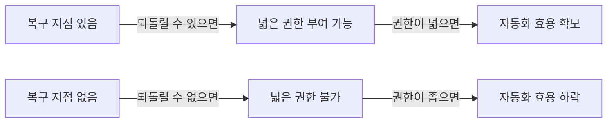
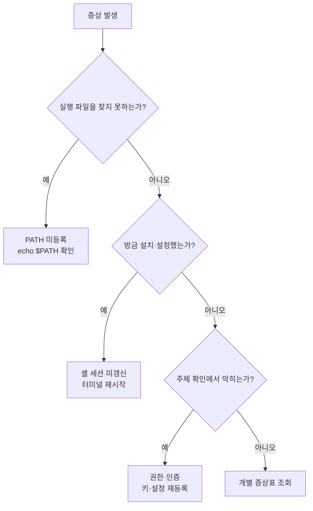

에이전트에게 어디까지 맡길 것인가를 정할 때 대부분 신뢰를 기준으로 삼는다. 잘하면 더 주고 실수하면 줄인다. 그런데 이 기준은 실무에서 잘 작동하지 않는다 — 실수를 확인하는 시점이 이미 파일이 덮어써진 뒤이기 때문이다.

기준을 하나 바꾸면 판단이 단순해진다. **되돌릴 수 있는가.** 복구 지점이 있는 환경에서는 넓은 권한이 위험하지 않고, 복구 지점이 없는 환경에서는 좁은 권한도 위험하다. 이 글은 그 전제를 만드는 세 가지 — 롤백 안전망, 규약 파일, 실패 모드 분류 — 를 순서대로 본다.

> 아래 내용은 **원 자료 기준(2026-04)** 정리다. 언급되는 런타임·도구의 버전 숫자는 그 시점의 것이며, 버전 자체보다 그 버전을 고르는 판단 규칙이 재사용되는 부분이다.

## 용어 정리

원 자료 용어표에서 이 글이 쓰는 행만 추렸다.

| 용어 | 원어 / 표기 | 뜻 |
|---|---|---|
| 셸 | Shell | 입력한 명령을 해석해 OS에 전달하는 프로그램. 명령어 해석기 |
| PATH | — | 셸이 실행 파일을 찾는 디렉터리 목록. 설치 후 터미널 재시작이 필요한 이유 |
| Git | — | 파일 변경 이력을 추적하는 분산 버전관리 시스템 |
| Repository | 저장소 | 프로젝트 폴더 + `.git` 숨김 폴더의 조합 |
| Commit | 커밋 | 현재 상태를 공식 기록으로 확정하는 행위 |
| Branch | 브랜치 | main에서 분리된 독립 작업 공간 |
| diff | — | 두 상태의 차이. 추가(초록)·삭제(빨강)로 표시 |
| Co-Authored-By | — | 커밋에 공동 작성자를 표기하는 트레일러. 에이전트 기여 표시에 사용 |
| SSH 키 | — | 개인키·공개키 쌍으로 비밀번호 없이 인증하는 방식 |
| CLAUDE.md | — | 프로젝트·개인·조직 단위로 에이전트에 지속 지시를 주는 규약 파일 |

## Git은 버전 관리 도구가 아니다 — 적어도 여기서는

일반적으로 Git은 "버전 관리 도구"다. 에이전트 맥락에서는 역할이 셋 더 붙는다.

| 역할 | 내용 |
|---|---|
| 컨텍스트 공급 | 에이전트가 세션 시작 시 `git status`·`git diff`·`git log`로 현재 상태를 파악 |
| 롤백 안전망 | 대규모 자동 수정 전 체크포인트 커밋으로 복구 지점 확보 |
| 기여 추적 | 커밋 트레일러(`Co-Authored-By`)로 에이전트 기여분을 이력에 명시 |

세 역할은 병렬 목록이 아니라 하나의 논증이다.

> Git이 없으면 에이전트는 "직전 상태"를 알 수 없다.
>
> 무엇이 원래 있던 코드이고 무엇이 이번 세션에서 바뀐 것인지 구분할 근거가 사라지기 때문이다.
>
> 안전망 관점도 같다. 되돌릴 수 없는 환경에서는 에이전트에게 넓은 권한을 줄 수 없고, 권한이 좁으면 자동화 효용도 같이 줄어든다. **되돌릴 수 있다는 것이 권한을 넓힐 수 있는 전제**다.

첫 번째 역할과 두 번째 역할이 같은 재료에서 나온다는 점이 요점이다. 커밋 이력은 사람에게는 기록이지만 에이전트에게는 **입력**이다 — 표 첫 행의 `git status`·`git diff`·`git log`가 전부 커밋이 남긴 것이고, 둘째 행의 체크포인트도 같은 커밋이다. 안전망을 두는 행동과 에이전트에게 현황을 넘기는 행동이 따로 있지 않다.

그래서 권한 설계는 신뢰의 함수가 아니라 복구 비용의 함수가 된다.



두 줄은 같은 사슬을 양방향으로 읽은 것이고, 원 자료가 명시한 것은 아랫줄이다 — 되돌릴 수 없으면 권한을 넓힐 수 없고, 권한이 좁으면 자동화 효용도 함께 줄어든다. 사슬의 맨 왼쪽 칸이 사람이 직접 손댈 수 있는 유일한 자리라는 점이 실무적 함의다. 권한을 넓히고 싶으면 권한 설정을 만지는 것이 아니라 **복구 지점을 먼저 만드는 것**이 선행 작업이 된다.

## 규약층 — CLAUDE.md

프로젝트·개인·조직 단위로 에이전트에게 **지속되는 지시**를 주는 파일이다. 매 세션 같은 설명을 반복하지 않게 만드는 장치다.

### 구성 요소 다섯

| 구성 요소 | 담는 내용 | 없을 때 |
|---|---|---|
| 프로젝트 개요 | 무엇을 하는 시스템인가, 담당 조직, 핵심 지표 | 에이전트가 도메인 맥락 없이 코드만 봄 |
| 기술 스택 | 언어·프레임워크·DB·포매터·타입체커 버전 | 관습이 다른 코드가 섞여 들어옴 |
| 코딩 규칙 | 타입힌트 강제, 커버리지 하한, 함수 길이 상한, 금지 패턴 | 규칙 위반을 리뷰에서 매번 지적 |
| 워크플로우 | 브랜치 명명, PR 승인 요건, 배포 절차 | 프로세스를 벗어난 산출물 발생 |
| 명령어 | 실행·테스트·포맷·타입체크 커맨드 | 에이전트가 검증 방법을 모름 |

오른쪽 열이 이 표의 쓸모다. 다섯 항목은 "있으면 좋은 것"의 목록이 아니라 **없을 때 나타나는 증상의 목록**이고, 증상에서 거꾸로 읽으면 지금 우리 규약 파일에서 무엇이 빠졌는지 진단할 수 있다. 리뷰에서 같은 지적이 반복되면 코딩 규칙 항목이 비어 있는 것이고, 예상 밖의 산출물이 나오면 워크플로우 항목이 비어 있는 것이다.

### 작성 원칙 넷

| 원칙 | 내용 | 이유 |
|---|---|---|
| 분량 제한 | 200줄 안팎을 상한으로 | 길수록 지시가 희석됨 |
| 모듈화 | 세부 규칙은 별도 파일로 분리해 참조 | 본문은 색인, 상세는 링크 |
| 압축 서술 | 산문 대신 항목·값 형태 | 파싱 가능한 형태가 지시로 더 잘 작동 |
| 검증 가능한 규칙 | "깔끔하게" 대신 "커버리지 80% 이상" | 판정 기준이 있어야 자동 검증 가능 |

골격은 이런 모양이 된다.

```markdown
# 예시 골격
## 기술 스택
Python 3.13 / FastAPI / PostgreSQL 16 / SQLAlchemy 2.0

## 코딩 규칙
- type hint 필수(strict 통과)
- 커버리지 80% 이상, 함수 50줄 상한
- SQL 파라미터화 필수, print 금지(logging 사용)
- 하드코딩 시크릿 금지

## 워크플로우
- 브랜치: feature/<티켓ID>-설명
- PR: 2인 승인 + CI 통과

## 명령어
- 테스트: pytest tests/ -v --cov=app
- 실행: uvicorn app.main:app --reload

@.claude/rules/code-style.md
@.claude/rules/security.md
```

> 좋은 규약 파일과 나쁜 규약 파일의 차이는 길이가 아니라 **검증 가능성**이다.
>
> "읽기 좋은 코드를 쓸 것"은 에이전트가 통과 여부를 판정할 수 없다. "함수 50줄 상한, 커버리지 80% 이상"은 판정할 수 있다.
>
> 이 구분은 사람 대상 코딩 컨벤션 문서와 에이전트 대상 규약 문서가 갈리는 지점이기도 하다. 전자는 설득이 필요하고, 후자는 판정이 필요하다.

네 원칙 중 앞의 셋은 분량과 형식에 관한 것이고 마지막 하나만 내용에 관한 것이다. 그래서 200줄을 지키고 모듈화까지 했는데도 규칙이 지켜지지 않는 상황이 성립한다 — 앞의 세 원칙은 규칙이 읽히게 만들 뿐, 판정 가능하게 만들지는 않기 때문이다.

여기서 파일 하나로 끝나지 않는다는 점이 다음 문제로 이어진다. 규약을 조직 단위로 올리면 개인·프로젝트·전사 세 계층이 생기고, 계층이 생기면 "누가 어긴 것을 누가 막는가"가 설계 대상이 된다 — [CLAUDE.md 3계층과 enforcement](/blog/agentic-coding/claude-md-enforcement/)에서 이어서 다룬다.

## 실패 모드는 세 가지로 수렴한다

원 자료 전체에 흩어진 트러블슈팅 20여 건은 원인이 사실상 세 가지로 수렴한다. 개별 증상보다 이 분류가 재사용된다.

| 원인 분류 | 대표 증상 | 진단 | 조치 |
|---|---|---|---|
| **PATH 미등록** | `command not found`(git·node·tree·cursor·code) | `echo $PATH`에 설치 경로 포함 여부 | PATH 추가 후 셸 설정 재적용 |
| **셸 세션 미갱신** | 방금 설치했는데 인식 안 됨 | 기존 터미널에서만 실패 | 터미널 완전 종료 후 새로 열기 |
| **권한·인증** | `Permission denied (publickey)` | 키 존재·에이전트 로드 여부 | 키 권한 수정, `ssh-add`로 재등록 |
| 설정 누락 | `Author identity unknown` | `git config --list` 확인 | user.name·user.email 설정 |
| 브랜치명 불일치 | `src refspec main does not match any` | 로컬 브랜치명 확인 | `git branch -M main` |
| 셸 문법 오류 | 공백 포함 이상한 폴더 생성 | 중괄호 안 공백 여부 | 쉼표 뒤 공백 제거 |
| 리다이렉션 오용 | 파일 내용이 사라짐 | `>` 사용 여부 | 추가는 `>>` 사용 |
| 재부팅 후 인증 실패 | 키가 에이전트에서 제거됨 | 세션 종료 시 소실 | 키체인 연동 옵션 사용 |

여덟 행이지만 굵게 표시된 앞 세 줄이 나머지를 덮는다.



> 이 표의 실질적 가치는 첫 세 줄이다.
>
> 환경 문제의 대부분은 "실행 파일을 찾지 못함", "셸이 새 설정을 아직 모름", "인증 주체가 확인되지 않음" 중 하나다.
>
> 신규 입사자 온보딩 문서를 쓸 때도 증상 20개를 나열하는 것보다 이 세 분류를 먼저 주는 편이 자가 해결률이 높다.

분류가 증상 목록보다 나은 이유는 **처음 보는 증상에도 적용된다**는 점이다. 증상표는 표에 있는 여덟 개만 해결하지만 세 질문은 목록에 없는 아홉 번째 증상도 분기시킨다. 원 자료가 "증상 20개를 나열하는 것보다 세 분류를 먼저 주는 편이 자가 해결률이 높다"고 말한 근거가 이것이다 — 스물한 번째 증상에서 갈린다.

Windows 환경에 대해서는 원 자료가 macOS 중심이며 세 가지만 언급한다.

| 항목 | 내용 |
|---|---|
| 터미널 | Windows Terminal 권장, PowerShell 기본 셸. CMD는 구형으로 비권장 |
| 설치 옵션 | Git·VS Code 설치 시 "Add to PATH" 체크 유지가 사후 오류의 대부분을 예방 |
| WSL | 리눅스 환경 실행 기능. 에이전트 도구 본격 사용 시 권장으로만 언급되고 상세는 다루지 않음 |

가운데 행이 앞의 3분류와 정확히 이어진다. 설치 시 "Add to PATH" 체크를 유지하면 **사후 오류의 대부분이 예방된다**는 것이 원 자료의 서술이고, 그 사후 오류의 1번 원인이 바로 위 표 첫 행의 PATH 미등록이다. 설치 마법사의 체크박스 하나가 진단 절차 전체보다 앞에 오는 자리다.

## 조직에 옮기면 무엇이 되는가

| 주장 | 조직에 미치는 함의 | 첫 90일에 할 일 |
|---|---|---|
| 되돌릴 수 있어야 권한을 넓힌다 | 권한 정책 심사 기준이 "신뢰"에서 **"복구 비용"**으로 바뀜 | 30일: 에이전트 작업 전 체크포인트 커밋을 팀 규약으로 명문화 |
| Git이 컨텍스트 공급원이자 안전망 | 커밋 위생이 개발 문화가 아니라 **에이전트 입력 품질** 문제가 됨 | 30일: 커밋 단위·주기 가이드를 에이전트 운영 문서에 편입 |
| `Co-Authored-By` 기여 추적 | 에이전트 산출물 비중을 측정 가능한 값으로 만듦 | 60일: 트레일러 표기 규칙 확정, 이력 집계 스크립트 작성 |
| 규약 파일 5요소 | 규약 미비를 **증상에서 역추적**할 수 있게 됨 | 30일: 기존 CLAUDE.md를 5요소 체크리스트로 자가 진단 |
| 200줄 상한 + 모듈 분리 | 규칙 총량과 파일 하나의 크기를 분리해 관리 | 60일: 비대한 규약 파일을 `.claude/rules/`로 분해 |
| 검증 가능한 규칙만 쓴다 | 지켜지지 않는 규칙의 원인을 **문장 형식**에서 찾음 | 30일: 판정 불가능한 규칙 문장을 수치 기준으로 재작성 |
| 실패 모드 3분류 | 온보딩 문서가 증상 목록에서 **진단 절차**로 바뀜 | 30일: 환경 트러블슈팅 가이드를 3분류 구조로 재편 |
| "Add to PATH" 한 줄이 최대 예방 | 초기 설정 체크리스트의 우선순위가 바뀜 | 30일: OS별 설치 체크리스트에 PATH 항목을 최상단으로 |

여덟 행 중 30일 항목이 여섯, 60일이 둘이다. 30일 여섯 중 다섯은 **문서를 쓰거나 규약을 정하는 일**이고 나머지 하나도 기존 규약 파일을 점검하는 일이다. 도구를 새로 설치하는 작업은 여덟 행 어디에도 없다 — 권한을 넓힐 준비는 설치가 아니라 합의에서 시작한다.

---

여기까지가 권한을 주기 전에 갖춰야 할 바닥이다. 복구 지점이 있고, 규약이 판정 가능하고, 환경 문제가 세 갈래로 분류돼 있으면 이제 실제로 권한을 설계할 수 있다.

다음 질문은 "무엇을 얼마나 줄 것인가"다. 그러려면 먼저 이 도구가 무엇을 할 수 있는지 — 어떤 도구를 갖고 있고, 그 도구들이 어떤 자율성 수준에서 움직이는지 — 를 알아야 한다. [자율성이 3세대를 가른다](/blog/agentic-coding/claude-code-autonomy-tiers/)에서 이어진다. 규약 파일이 세션 시작 비용의 어느 부분을 차지하는지는 [하네스 다섯 구성물](/blog/ai-agent/harness-five-primitives/)에 토큰 단위로 나와 있다.

---

**인용 조건**

- 본문의 실습 소재(예제 폴더·예제 시스템·목표치)는 **원 자료의 실습 예제**이며 특정 조직의 실제 운영 사례가 아니다. 개념·용어·판단 프레임 층위에서 읽어야 한다.
- 원 자료가 제시하는 런타임·Git·에디터의 **버전 숫자는 작성 시점(2026-04) 기준**이다. 이 글은 버전 숫자를 싣지 않았으며, 원 자료의 해당 서술에는 기준일이 항상 따라붙어야 한다.
- 도구별 **가격·플랜 정보는 변동이 잦다.** 이 글은 가격을 다루지 않으며, 필요하면 "무료 플랜이 있다" 수준을 넘는 단정은 공식 자료로 확인해야 한다.
- 원 자료는 macOS 기준 서술이 대부분이다. Windows·WSL 관련은 개념 수준의 언급이며 상세 절차는 원 자료 범위 밖이다.
