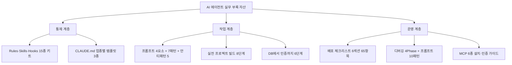
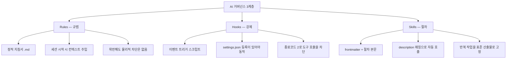
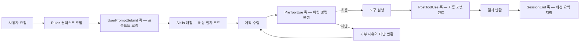

"AI가 안전하게 일하는 틀을 만들었다"는 문장은 그 자체로는 아무것도 말하지 않는다. 무엇이 그 틀을 강제하는지, 강제가 실패했을 때 무엇이 남는지가 빠져 있기 때문이다.

이 시리즈는 그 추상적 표현을 **읽는 규범 / 막는 강제 / 반복되는 절차** 세 계층의 실제 파일로 환원한 원 자료 한 벌을 네 편에 걸쳐 옮긴다. 첫 편인 이 글이 통제 계층 전체를 다루고, 나머지 세 편이 그 위에서 돌아가는 작업과 운영을 맡는다.

이 글에서 가장 오래 남는 관찰을 먼저 적어 둔다. **세 계층을 나란히 놓은 비교표에서 「강제력」 열이 「있음」이 되는 칸은 하나뿐이다.** 나머지 둘은 모델이 지키기로 선택해야 작동한다. 그리고 그 하나뿐인 강제 계층조차 **차단만 하고 대안을 돌려주지 않으면 같은 시도가 반복된다** — 원 자료가 훅 예제의 설계 요점으로 든 것이 바로 그 지점이다.

> 이 글이 옮긴 원 자료의 작성 기준일은 **2026-07-26**이다. 훅 이벤트 이름·종료코드 규약·설정 파일 위치는 그 시점의 것이며 버전에 따라 바뀐다.
>
> 아래의 Rules 5종·Hooks 5종·Skills 5종과 차단 규칙 7종은 **원 자료가 제공한 예제 구현체**이며, 이 글이 운영해 얻은 실적이 아니다. 가져갈 것은 계층을 어떻게 가르는가라는 판단 프레임이지 파일 목록 자체가 아니다.

## 용어 정리

시리즈 네 편이 공유하는 어휘다. 원 자료의 용어·약어 풀이 전량이며, 순서도 원 자료를 따랐다. 이어지는 세 편은 여기서 자기 글이 쓰는 행만 추려 다시 싣는다.

| 용어 | 풀이 |
|---|---|
| **Rules** | 에이전트가 매 세션 자동으로 읽는 정적 지침서(`.md`). 강제력 없음, 규범 역할 |
| **Skills** | 특정 작업의 표준 절차서. frontmatter의 `description`이 자동 호출 트리거 키 |
| **Hooks** | 특정 이벤트 발생 시 자동 실행되는 스크립트. 도구 호출 자체를 차단할 수 있음 |
| **SKILL.md** | 스킬 정의 파일. `name` / `description` / `allowed-tools` 를 frontmatter에 둔다 |
| **settings.json** | 훅 등록·권한·환경변수를 담는 설정 파일. 훅은 여기 등록해야 동작 |
| **PreToolUse / PostToolUse** | 도구 실행 직전 / 직후에 발동하는 훅 이벤트 |
| **SessionEnd / SubagentStop** | 세션 종료 시 / 서브에이전트 종료 시 발동하는 훅 이벤트 |
| **matcher** | 훅이 반응할 도구를 좁히는 필터. 빈 문자열이면 전체 매칭 |
| **additionalContext** | 훅이 stdout으로 출력한 내용이 모델 컨텍스트에 주입되는 경로 |
| **kill switch** | 훅을 임시로 끄는 환경변수 스위치(`export XXX_DISABLED=1`) |
| **SSOT** | Single Source of Truth. 같은 데이터는 한 곳에서만 관리한다는 원칙 |
| **BLUF** | Bottom Line Up Front. 결론을 첫 줄에 쓰는 보고 방식 |
| **SDD** | Spec-Driven Development. 사양 → 계획 → 구현 순서로 진행하는 방식 |
| **Plan Mode** | 코드를 바꾸기 전에 계획서를 먼저 제출하고 승인받는 실행 모드 |
| **MRE** | Minimum Reproducible Example. 버그를 재현하는 가장 작은 코드 |
| **5-Why** | "왜?"를 5번 물어 표면 증상이 아닌 근본 원인에 도달하는 분석 기법 |
| **git bisect** | 이진 탐색으로 회귀 버그를 만든 커밋을 찾는 Git 명령 |
| **회귀 테스트** | 고친 버그가 다시 나오지 않는지 자동으로 검사하는 테스트 |
| **RLS** | Row Level Security. DB 행 단위 접근 제어. 애플리케이션이 아니라 DB가 막는다 |
| **auth.uid()** | 현재 요청의 JWT에서 추출된 사용자 UUID를 반환하는 Supabase 함수 |
| **service_role 키** | RLS를 우회하는 관리자 키. 서버 사이드 전용, 클라이언트 노출 시 전체 데이터 유출 |
| **anon 키** | 클라이언트에 노출해도 되는 공개 키. RLS의 통제를 받는다 |
| **PII** | Personally Identifiable Information. 이메일·전화·카드번호 등 개인식별정보 |
| **redact** | 로그·기록에서 민감정보를 마스킹하거나 해시로 치환하는 처리 |
| **Prompt Injection** | 사용자 입력에 지시문을 숨겨 모델의 원래 지시를 덮어쓰려는 공격 |
| **Smoke Test** | 배포 직후 핵심 경로가 살아 있는지 5분 내로 확인하는 최소 검증 |
| **Core Web Vitals** | LCP·FID(INP)·CLS. 사용자 체감 성능을 측정하는 표준 지표 |
| **MCP** | Model Context Protocol. 외부 도구·데이터 소스를 에이전트에 연결하는 규약 |
| **Seed 데이터** | 개발·테스트용으로 미리 넣어두는 샘플 데이터 |
| **KPT** | Keep / Problem / Try. 회고를 세 칸으로 나누는 형식 |
| **SPICED** | Situation·Pain·Impact·Critical event·Decision. 영업 디스커버리 프레임 |

31개 행이고, 통제(Rules·Hooks·Skills·settings.json)·프롬프트(BLUF·SDD·Plan Mode)·디버깅(MRE·5-Why·git bisect)·DB와 인증(RLS·anon 키·PII)·성능과 배포(Smoke Test·Core Web Vitals)·회고(KPT·SPICED)까지 걸쳐 있다. 한 편이 다 쓰는 어휘가 아니라 시리즈 네 편의 합집합이라 이렇게 넓다.

## 이 시리즈가 다루는 자산

원 자료는 자기가 담고 있는 것을 세 계층으로 먼저 그려 둔다.



「15종」은 이 글이 아래에서 펼치는 Rules 5 + Hooks 5 + Skills 5의 합이다. 세어 보면 맞는다.

여덟 자산이 시리즈 어느 편으로 갔는지를 함께 적으면 이 표가 그대로 목차가 된다.

| 자산 | 한 줄 정의 | 이 시리즈에서의 위치 |
|---|---|---|
| Rules·Skills·Hooks 키트 | 에이전트를 통제하는 세 가지 수단의 실제 구현체 15종 | **이 글에서 아래에 전부 펼친다** |
| 프롬프트 패턴 가이드 | 4요소 프레임 + Claude Code 고유 7패턴 + 안티패턴 5 | 한 편으로 떨어지지 않는다 — 아래 별도 설명 |
| 실전 프로젝트 빌드 가이드 | 빈 폴더에서 배포까지 8단계로 SaaS 1개를 완주하는 절차 | [빈 폴더에서 배포까지](/blog/agentic-coding/empty-folder-to-deploy/) |
| 배포 체크리스트 | 배포 전·중·후·롤백·보안·성능 6섹션 체크리스트 | [배포 65항목과 디버깅](/blog/agentic-coding/deploy-checklist-debugging/) |
| 디버깅 노하우 | 재현→가설→검증→회귀방지 사이클과 흔한 함정 카탈로그 | 〃 |
| DB에서 인증까지 6단계 | 스키마→마이그레이션→RLS→인증→API→테스트/배포 순서 | [빈 폴더에서 배포까지](/blog/agentic-coding/empty-folder-to-deploy/) |
| CLAUDE.md 템플릿 3종 | 1인 SaaS / 제조·유통 / 서비스·콘텐츠 업종별 헌법 골격 | [업종별 CLAUDE.md 템플릿](/blog/agentic-coding/industry-claude-md-templates/) |
| MCP 6종 설치 패키지 | 외부 도구 연결을 스크립트 한 번으로 끝내는 부트스트랩 | [배포 65항목과 디버깅](/blog/agentic-coding/deploy-checklist-debugging/) |

여덟 행 중 일곱은 한 편으로 떨어지고, **「프롬프트 패턴 가이드」 한 행만 세 곳으로 갈린다.** 이 카테고리에 이미 발행된 글들이 그 내용의 상당 부분을 먼저 다뤘기 때문이다 — 4요소 프레임과 슬래시 커맨드·`@` 파일 참조·파이프라인은 [`.claude` 디렉터리](/blog/agentic-coding/dot-claude-directory/)가, 멀티턴 관리의 70% 룰과 컨텍스트 압축 흐름은 [컨텍스트 예산](/blog/agentic-coding/context-budget-session/)이 다뤘다. 원 자료의 7패턴 중 남는 세 행(CLAUDE.md 컨텍스트 주입 · Plan Mode + SDD · 이미지 입력)과 안티패턴 5가지, 30초 응급처치 카드를 [업종별 CLAUDE.md 템플릿](/blog/agentic-coding/industry-claude-md-templates/) 편이 잇는다. **한 칸에 링크 하나를 억지로 넣지 않고 이렇게 갈라 적는 것은 이 글의 정리다.**

## 세 계층 — 규범·강제·절차



| 구분 | Rules | Skills | Hooks |
|---|---|---|---|
| 본질 | 정적 지침서 (`.md`) | 동적 절차서 (frontmatter + `.md`) | 자동 트리거 스크립트 (`.sh`) |
| 로드 시점 | 세션 시작 시 컨텍스트 주입 | 명시적 호출 또는 description 매칭 | 이벤트 발생 시 자동 실행 |
| 표현 언어 | 자연어 + 마크다운 | 자연어 + 코드 블록 (`allowed-tools` 명시) | Bash / Python / Node |
| 위치 | `rules/` (글로벌·프로젝트) | `skills/<name>/SKILL.md` | `hooks/*.sh` + settings.json 등록 |
| 강제력 | 없음 (모델의 준수에 의존) | 없음 (호출 여부는 모델 판단) | 있음 (프로세스가 도구 호출을 거부) |
| 선택 기준 | "매 세션 적용할 원칙" | "특정 작업의 표준 절차" | "이벤트에 반응하는 자동화" |

여섯 행 중 판단을 가르는 것은 **「강제력」 한 행**이다. 세 칸 중 「있음」은 Hooks 하나이고, 나머지 둘은 괄호 안에 각각 "모델의 준수에 의존" · "호출 여부는 모델 판단"이라고 적혀 있다.

> **한 문장 요약**: Rules는 사규, Skills는 업무 매뉴얼, Hooks는 출입 게이트다.
>
> 사규는 어기면 지적당하지만 몸이 막히지 않는다. 게이트는 카드가 없으면 문이 열리지 않는다.
>
> 그래서 정말 사고를 막아야 하는 항목은 Rules가 아니라 Hooks에 둔다.

## 우선순위 — 좁은 범위가 이긴다

| 순위 | 위치 | 성격 |
|---|---|---|
| 1 (최우선) | 프로젝트 `./.claude/` | 해당 저장소 전용 규칙. 팀에 공유됨 |
| 2 | 프로젝트 루트 `./CLAUDE.md` | 저장소 헌법 |
| 3 | 사용자 글로벌 `~/.claude/CLAUDE.md` | 모든 프로젝트 공통 기본값 |
| 별도 | `settings.local.json` | 개인 재정의. gitignore 대상 |

같은 규칙이 충돌하면 **좁은 범위가 이긴다.** 법령 → 시행령 → 사규 구조와 같다. 이 구조가 있어야 "전사 표준은 유지하되 팀별 예외는 허용"이 가능해진다.

이 카테고리의 [CLAUDE.md의 4계층 Scope](/blog/agentic-coding/claude-md-scope-layers/) 편이 같은 원리를 네 계층으로 적었다 — 그 글은 *"지시가 충돌하면 **더 구체적인 Scope가 우선**한다(서브디렉토리 > 프로젝트 > 전역)"* 고 쓰고, 로드 자체는 override가 아니라 누적이라는 점을 함께 짚는다. 위 표의 3행과 그 글의 네 계층은 계층 수가 다르므로(여기는 3+1, 그쪽은 4) 같은 목록이 아니다. **겹치는 것은 충돌 시 좁은 쪽이 이긴다는 규칙 하나이며, 이렇게 한정해 읽는 것은 이 글의 정리다.**

## Rules 5종 — 규범 계층

| 규칙 파일 | 통제 대상 | 대표 조항 | 위반 시 리스크 |
|---|---|---|---|
| `coding-style.md` | 코드의 형태와 변경 범위 | 파일 800줄·함수 50줄·중첩 4단계·인자 5개 한도 / 요청받은 줄만 바꾸는 수술적 변경 | 요청 범위 밖 코드까지 손대 회귀 발생. 리뷰 diff가 커져 검토 실효성 상실 |
| `data-policy.md` | 데이터의 저장 위치 | GitHub(문서·코드) / DB(정형) / Cloud Storage(미디어) 3분할, 한 곳만 SSOT | 같은 데이터를 두 곳에서 관리해 불일치 발생. 대용량 바이너리가 저장소로 유입 |
| `interaction.md` | 응답 방식과 판단 절차 | 한국어 / 결론 먼저 / 가정을 명시하고 확인 / 해석이 갈리면 옵션 제시 | 조용한 가정으로 잘못된 방향을 끝까지 구현. 재작업 비용이 통째로 발생 |
| `logging.md` | 운영 관측성 | 구조화 JSON 로그, 필수 필드 5종, PII 자동 redact, 에러는 로깅 후 재throw | 사고 후 원인 추적 불가. 로그에 PII가 평문 축적되어 2차 유출 |
| `security.md` | 보안 경계 | 시크릿 단일 원천, RLS 필수, 파라미터화 쿼리, 위험 명령 차단 | 시크릿 커밋·RLS 미적용으로 전체 데이터 노출 |

다섯 파일의 통제 대상이 코드 형태 · 데이터 위치 · 응답 방식 · 관측성 · 보안 경계로 갈린다. 다만 축이 완전히 배타적이지는 않다 — `logging.md`의 「PII 자동 redact」와 그 위반 리스크(「로그에 PII가 평문 축적되어 2차 유출」)는 `security.md`가 맡은 데이터 노출과 같은 곳에서 만난다.

**각 규칙의 대표 조항 상세**

| 규칙 | 기억할 만한 조항 | 왜 그렇게 정했나 |
|---|---|---|
| coding-style | "변경된 모든 줄은 사용자 요청 또는 KPI 목표로 추적 가능해야 한다" | 이유를 못 대는 줄은 삭제 후보. 변경의 정당성을 줄 단위로 요구 |
| coding-style | 발생할 수 없는 시나리오에 fallback 추가 금지 | 방어 코드가 늘수록 진짜 에러가 묻힌다 |
| data-policy | "같은 데이터를 두 곳에 동기화하지 않는다" | 동기화는 영구 비용. 한 곳을 SSOT로 정하고 나머지는 경로만 참조 |
| data-policy | 보관 기간을 데이터 유형별로 명시 (결제 5년 / 로그 3개월 등) | 삭제 기준이 없으면 데이터는 영원히 쌓인다 |
| interaction | 사용자 제안보다 단순한 길이 보이면 push back | 무조건 동의하는 보조자는 복잡도를 막지 못한다 |
| interaction | 불확실하면 추측 대신 확인 방법을 제시 | 자신감 있는 오답이 가장 비싸다 |
| logging | 에러를 잡고 삼키지 말 것. 로깅 후 재throw 또는 명시적 fallback | `catch {}` 는 장애를 조용한 오작동으로 바꾼다 |
| security | 노출된 키는 1시간 내 폐기를 목표로 | 유출 대응은 완벽함보다 속도가 중요 |

## Hooks 5종 — 강제 계층

| 훅 | 트리거 시점 | 하는 일 | 차단·예방하는 사고 |
|---|---|---|---|
| `bash-pre-guard.sh` | PreToolUse (matcher `Bash`) | 실행 직전 명령 문자열을 7개 정규식으로 검사, 위반 시 종료코드 2로 거부 | 시스템 파괴·권한 상승·미검증 원격 코드 실행·메인 강제 푸시·시크릿 평문 출력 |
| `post-edit-lint.sh` | PostToolUse (matcher `Edit\|Write`) | 확장자별 포매터·린터 자동 실행. `node_modules`·`dist`·`build` 등은 제외 | 포맷 불일치로 diff가 부풀어 리뷰가 무력화되는 상황 |
| `prompt-logger.sh` | UserPromptSubmit | 프롬프트를 PII redact 후 일별 jsonl로 적재, 1000자로 절단, 30일 경과분 정리 | 요청 이력 소실 / 로그에 이메일·전화·카드번호가 평문 축적 |
| `session-summary.sh` | SessionEnd | 브랜치·최근 커밋·변경 파일·툴 호출 수를 JSON으로 저장, 일일 마스터 로그에 append | 수동 기록 누락으로 생기는 인수인계 공백 |
| `subagent-cleanup.sh` | SubagentStop | 7일 경과 아티팩트 삭제, 빈 디렉터리 정리, 종료 감사 로그 기록 | 아티팩트 무한 증식 / 동일 에이전트 남용을 아무도 모르는 상태 |

다섯 훅이 붙는 이벤트가 PreToolUse · PostToolUse · UserPromptSubmit · SessionEnd · SubagentStop으로 전부 다르다. 같은 이벤트에 둘이 붙는 자리가 없다.

### 훅 응답 규약

| 종료코드 / 채널 | 의미 |
|---|---|
| `exit 0` | 허용. 도구 호출이 그대로 진행된다 |
| `exit 2` | 차단. stderr 메시지가 모델에게 전달되어 이유를 알 수 있다 |
| `stdout` | additionalContext로 주입. 경고용으로만 쓰고 짧게 유지 |
| `stderr` | 사람·로그용. 모델 컨텍스트에 주입되지 않는다 |

> ### ⚠️ 이 네 행 중 두 행이 stderr를 서로 다르게 말한다
>
> 표를 행 단위로 대조하면 `stderr`가 두 번 등장하고 서술이 갈린다.
>
> - `exit 2` 행 — *"차단. **stderr 메시지가 모델에게 전달되어** 이유를 알 수 있다"*
> - `stderr` 행 — *"사람·로그용. **모델 컨텍스트에 주입되지 않는다**"*
>
> 조건부로 읽으면 양립한다. `exit 2`일 때에 한해 stderr가 전달되고 그 외에는 사람·로그용이라면 두 행이 부딪히지 않는다. **그러나 표가 그 조건을 어디에도 적지 않았다** — 위 네 행이 이 규약의 전부이고, 어느 셀에도 「`exit 2`인 경우」라는 한정어가 없다.
>
> **어느 쪽이 맞는지는 이 표의 네 행만으로는 판정되지 않는다.** 다만 원 자료가 표 밖 본문에서 조건부 독해 쪽에 근거를 남겨 두었다 — 아래 「bash-pre-guard 핵심 로직」의 세 줄 요약이 *"종료코드 2와 함께 대안을 stderr로 돌려준다"* 고 적고, 곧이어 *"차단만 하고 대안을 안 주면 모델은 같은 시도를 반복한다"* 고 잇는다. 모델이 그 stderr를 읽는다는 전제가 없으면 뒤 문장이 성립하지 않는다. **표 안에서는 갈리고 표 밖에서는 조건부 독해 쪽에 근거가 있다** — 이렇게 갈라 읽는 것은 이 글의 정리다.

> ### ⚠️ 같은 카테고리의 다른 두 글도 이 채널을 서로 다르게 적었다
>
> | 자료 | 차단 사유가 나가는 채널 |
> |---|---|
> | [settings.json과 훅의 2차 방어선](/blog/agentic-coding/settings-permissions-deny/) | *"**`exit 2`가 차단의 핵심**이다. 표준 에러로 출력한 메시지가 차단 사유로 전달된다."* |
> | [커맨드·스킬·훅과 플러그인 번들](/blog/agentic-coding/commands-skills-hooks-plugins/) | *"훅은 이벤트 JSON을 stdin으로 받고, 결과를 stdout으로 돌려주는 **양방향 통신 계약**을 갖는다."* — 차단 사유는 stdout JSON의 `reason` 필드로 나간다 |
> | 이 글이 옮긴 원 자료 | 위 4행 표. `exit 2` 행은 stderr가 전달된다고 하고, `stderr` 행은 주입되지 않는다고 한다 |
>
> 두 번째 글은 이 불일치를 이미 자기 본문에 적어 두었다 — *"두 자료가 서로 다른 채널을 들고 있으며 어느 쪽이 현재 사양인지는 두 자료 안에서 판정되지 않는다. 실제로 훅을 걸 때는 `exit 2` 직후의 출력 채널을 직접 확인한다."*
>
> **이 글은 그 판정을 뒤집지 않는다.** 세 자료를 나란히 놓으면 갈리는 자리가 하나 더 늘어날 뿐이고, 실무의 결론은 그 글이 적은 것과 같다 — **`exit 2` 직후의 출력 채널을 자기 환경에서 직접 확인한다.** 세 자료를 이렇게 나란히 놓는 것은 이 글의 정리다.

### bash-pre-guard 핵심 로직 (발췌)

```bash
INPUT=$(cat)
COMMAND=$(echo "$INPUT" | jq -r '.tool_input.command // ""')

if echo "$COMMAND" | grep -qE '\brm\s+-rf?\s+(/|/\*|\$HOME|~|--no-preserve-root)'; then
  echo "차단: 시스템 루트 또는 홈 디렉터리 전체 삭제 시도" >&2
  echo "대안: 명시적 경로를 지정하세요. 예: rm -rf ./build" >&2
  exit 2
fi
```

세 줄로 요약하면 — **(1) 훅 입력 JSON에서 실제 명령을 꺼내고, (2) 정규식으로 위험 패턴을 판정하고, (3) 종료코드 2와 함께 대안을 stderr로 돌려준다.** 차단만 하고 대안을 안 주면 모델은 같은 시도를 반복한다. "왜 막혔는지 + 무엇으로 대체하는지"를 함께 돌려주는 것이 이 훅의 설계 요점이다.

### 차단 규칙 7종

| # | 탐지 패턴 | 막는 사고 | 허용되는 대안 |
|---|---|---|---|
| 1 | `rm -rf /`, `rm -rf $HOME`, `--no-preserve-root` | 시스템·홈 디렉터리 전체 삭제 | 명시적 상대 경로 지정 (`rm -rf ./build`) |
| 2 | 문장 첫머리의 `sudo` | 의도치 않은 권한 상승 | 사용자 권한으로 가능한 경로·도구 사용 |
| 3 | `curl ... \| bash` | 검증되지 않은 원격 코드 실행 | 다운로드 후 내용 확인, 그다음 실행 |
| 4 | `chmod -R 777 /` | 전역 권한 파괴 | 대상 디렉터리 한정, 최소 권한 부여 |
| 5 | `git push --force` + `main\|master` | 메인 브랜치 이력 파괴 | `--force-with-lease` 또는 새 브랜치 |
| 6 | `> /dev/sda`, `/dev/nvme` | 디스크 직접 쓰기 | 해당 없음 (의도 재확인 대상) |
| 7 | `echo/cat/printf` + 시크릿 환경변수명 | 터미널 스크롤백·CI 로그에 시크릿 평문 노출 | 앞 8자만 확인 (`echo "${API_KEY:0:8}..."`) |

7번 항목이 특히 실무적이다. 파괴적 명령만 막는 훅은 흔하지만, **"확인해보려고 키를 출력하는 습관"**이 CI 로그에 영구 기록으로 남는 사고를 막는 규칙은 드물다. 게다가 완전 차단이 아니라 "앞 8자만 보라"는 대안을 제시해 디버깅 실무를 죽이지 않는다.

#### ⚠️ 훅 표가 요약한 사고는 다섯인데 규칙은 일곱이다 — 하나씩 배정해 본다

앞의 Hooks 5종 표에서 `bash-pre-guard.sh` 행의 「차단·예방하는 사고」 칸은 다섯 항목을 나열한다 — *"시스템 파괴·권한 상승·미검증 원격 코드 실행·메인 강제 푸시·시크릿 평문 출력"*. 바로 아래 차단 규칙 표는 일곱 행이다. 일곱을 다섯에 하나씩 배정하면 이렇게 된다.

| 차단 규칙 | 그 규칙의 「막는 사고」 | 요약 5항목 중 대응하는 것 |
|---|---|---|
| 1 `rm -rf /` 계열 | 시스템·홈 디렉터리 전체 삭제 | 시스템 파괴 |
| 2 문장 첫머리 `sudo` | 의도치 않은 권한 상승 | 권한 상승 |
| 3 `curl ... \| bash` | 검증되지 않은 원격 코드 실행 | 미검증 원격 코드 실행 |
| 4 `chmod -R 777 /` | 전역 권한 파괴 | **대응하는 항목이 없다** |
| 5 `git push --force` + main | 메인 브랜치 이력 파괴 | 메인 강제 푸시 |
| 6 `> /dev/sda`, `/dev/nvme` | 디스크 직접 쓰기 | **대응하는 항목이 없다** |
| 7 `echo/cat/printf` + 시크릿 | 시크릿 평문 노출 | 시크릿 평문 출력 |

**일곱 행을 전수 배정한 결과 다섯이 대응하고 둘이 남았다.** 4번과 6번을 남긴 근거는 문구 대조다.

- 4번의 사고는 「전역 권한 파괴」다. 2번의 「권한 상승」과 방향이 반대다 — 하나는 자기 권한을 올리는 것이고 다른 하나는 모두에게 여는 것이다. 같은 항목으로 묶을 근거가 두 셀 어디에도 없다.
- 6번의 사고는 「디스크 직접 쓰기」다. 1번의 「시스템·홈 디렉터리 전체 삭제」와 별개 행으로 적혀 있고, 요약 5항목의 「시스템 파괴」는 1번의 문구를 그대로 줄인 형태다.

차단 규칙 표 앞뒤에 붙은 산문 — 앞의 「bash-pre-guard 핵심 로직」 세 줄 요약과 뒤의 7번 항목 해설 — 은 어느 쪽도 다섯 항목과 일곱 규칙을 짝지어 적지 않는다. **이 배정은 이 글의 정리이며, 원 자료가 대응표를 제시한 것이 아니다.**

### 훅 운영 규약

| 항목 | 규약 | 지키지 않으면 |
|---|---|---|
| 실행 권한 | `chmod +x` 필수 | 훅이 조용히 무시된다. 실패 사실조차 모른다 |
| 첫 줄 | `set -euo pipefail` | 중간 실패 후에도 계속 진행해 부분 실행 상태가 남는다 |
| matcher | 필요한 도구로 좁힌다 (`"Bash"`, `"Edit\|Write"`) | 모든 도구 호출마다 발동해 지연이 누적된다 |
| 출력량 | stdout은 50자 이내, 상세는 stderr | additionalContext가 폭주해 컨텍스트를 잡아먹는다 |
| kill switch | `export XXX_DISABLED=1` 지원 | 훅이 오작동할 때 작업 자체가 멈춘다 |
| 로그 회수 | 주 1회 특정 시각에만 정리 작업 수행 | 매 호출마다 `find` 를 돌려 훅이 느려진다 |

마지막 항목은 예제 훅들이 공통으로 쓰는 기법이다. 정리 작업을 매번 하지 않고 `요일 == 일요일 && 시각 == 01시` 같은 조건에서만 수행한다. **부수 작업이 주 경로를 느리게 만들지 않게 하는 설계**로, 훅 도입 후 체감 지연이 생기는 가장 흔한 원인을 미리 제거한다.

## Skills 5종 — 절차 계층

| 스킬 | 자동 발동 조건 | 산출물 |
|---|---|---|
| `daily-report` | "오늘 뭐 했지" / "퇴근 리포트" / 17시 이후 "이만·끝내자" | 작업시간·커밋·변경파일·내일계획·인사이트가 담긴 1페이지 일일 리포트 |
| `retrospective` | "주간 회고" / "이번 주 어땠지" / "KPT 회고" | 일일 리포트 7개를 집계한 Keep·Problem·Try 회고 + 다음 주 목표 표 |
| `quote-builder` | "견적서 만들어" / "프로젝트 견적" / "용역 견적" | 부가세 자동 계산된 견적서 DOCX/PDF + 견적번호 체계 |
| `design-review` | "디자인 리뷰" / "접근성 점검" / "출시 전 검수" | 접근성 10 + 반응형 10 + 일관성 10 = 30항목 점검 리포트 (위반·경고 분류) |
| `meeting-prep` | "미팅 준비" / "고객 미팅 브리핑" / "discovery call" | 고객 이력·SPICED 목표·시간 배분 안건·핵심 질문 5·예상 반론 대응 브리핑 |

### Skill 설계에서 배울 점 3가지

| 설계 요소 | 예제에서의 구현 | 왜 중요한가 |
|---|---|---|
| description은 라우팅 키다 | 트리거 어구를 5개 이상 나열 ("퇴근 리포트", "wrap up the day" 등 표현 변형 포함) | 모호한 description은 호출 자체가 안 된다. 스킬을 안 쓰는 가장 흔한 원인 |
| 네거티브 트리거를 명시한다 | daily-report에 "주간·월간 리포트는 호출 금지" / meeting-prep에 "회의록 작성은 별도 스킬" | 경계를 안 그으면 인접 스킬끼리 서로 잡아먹는다 |
| allowed-tools로 권한을 좁힌다 | `Bash, Read, Write` 만 허용. design-review만 브라우저 도구 추가 | 스킬 단위 최소 권한. 문서 작성 스킬이 DB에 접근할 이유가 없다 |

첫 행은 이 카테고리의 [커맨드·스킬·훅과 플러그인 번들](/blog/agentic-coding/commands-skills-hooks-plugins/) 편이 같은 주장을 더 앞에서 적었다 — *"에이전트는 사용자 입력이 들어오면 스킬 디렉토리를 탐색해 각 `description`을 읽고 가장 적합한 스킬을 고른다. 즉 **description이 곧 라우팅 키**다."* 두 자료가 같은 결론에 도달했고, 이 글의 원 자료는 거기에 "트리거 어구 5개 이상"이라는 **개수 기준**을 덧붙였다.

각 스킬 파일은 공통적으로 **When to invoke 표 → Step 1~4 절차 → 출력 형식 예시 → 응용 → 주의사항** 순서를 따른다. 이 골격 자체가 "반복 업무를 절차로 고정하는 서식"으로 재사용 가능하다.

## 세 계층이 언제 개입하는가



이 흐름도가 말하는 것은 하나다. **모델의 선의에 의존하는 지점(Rules, Skills)과 프로세스가 강제하는 지점(Hooks)이 분리되어 있다.** 검증 파이프라인을 설계한다는 것은 이 두 지점을 어디에 배치할지 정하는 일이다.

차단 경로(`H → E`)가 흐름의 시작이 아니라 **계획 수립 단계로 되돌아간다**는 점이 앞의 "대안을 함께 돌려준다"와 이어진다. 사유와 대안을 받은 모델이 계획을 고쳐 다시 내려오는 구조다.

## 자주 발생하는 실수 7가지

| 실수 | 증상 | 해결 |
|---|---|---|
| Rules가 20개 이상으로 늘어남 | 컨텍스트 폭주, 응답 지연 | 10개 이하 유지. 사용 빈도 낮은 항목은 월 1회 점검해 제거 |
| Skill description이 모호 | 모델이 스킬을 호출하지 않음 | description에 정확한 트리거 어구를 5개 이상 나열 |
| 훅 실행 권한 누락 | 훅이 조용히 실패 (에러도 안 남음) | `chmod +x` 를 설치 절차에 포함 |
| `set -e` 누락 | 부분 실행 후 무시되어 상태가 어긋남 | 훅 첫 줄에 `set -euo pipefail` |
| 같은 규칙이 Rules와 CLAUDE.md에 중복 | 컨텍스트 낭비 + 충돌 시 판정 불가 | 한 곳으로 통합 (보통 rules 쪽) |
| matcher를 빈 문자열로 방치 | PreToolUse가 모든 도구에 발동 | 필요한 도구로 좁힌다 |
| 훅이 stdout으로 긴 출력 | additionalContext 폭주 | 50자 이내 또는 stderr로 우회 |

일곱 항목 중 **넷**(실행 권한 누락 · `set -e` 누락 · matcher를 빈 문자열로 방치 · stdout 긴 출력)은 앞의 「훅 운영 규약」 여섯 항목과 같은 것을 반대편에서 적은 것이다. matcher 쌍이 가장 뚜렷하다 — 규약의 「필요한 도구로 좁힌다」가 이 표의 「해결」 칸에 같은 문구로 다시 나온다. 짝이 닫히는지 양쪽에서 세면, 규약 여섯 중 짝이 없는 것은 kill switch·로그 회수 **둘**이고(4 + 2 = 6), 실수 일곱 중 짝이 없는 것은 Rules 20개 초과·Skill description 모호·Rules와 CLAUDE.md 중복 **셋**이다(4 + 3 = 7). 규약 표는 "이렇게 하라"이고 이 표는 "안 하면 이렇게 된다"이다. **두 표를 이렇게 짝지어 읽는 것은 이 글의 정리다.**

## 이 시리즈의 나머지

통제 계층은 여기까지다. 남은 세 편은 이 계층 위에서 실제로 돌아가는 것들이다.

| 편 | 다루는 것 |
|---|---|
| [업종별 CLAUDE.md 템플릿](/blog/agentic-coding/industry-claude-md-templates/) | 1인 SaaS·제조유통·서비스콘텐츠 3종 문서 골격 10축 비교, 7패턴 중 남은 세 행과 프롬프트 안티패턴 5가지, 30초 응급처치 카드 |
| [빈 폴더에서 배포까지](/blog/agentic-coding/empty-folder-to-deploy/) | SaaS 하나를 완주하는 빌드 8단계와 DB에서 인증까지 6단계, AI 기능의 비용·주입 방어 |
| [배포 65항목과 디버깅](/blog/agentic-coding/deploy-checklist-debugging/) | 배포 전·중·후·롤백·보안·성능 6섹션 65항목, 재현→가설→검증→회귀방지 4 Phase, MCP 6종 |

남은 세 편 중 마지막 편이 이 글로 되돌아오는 자리가 있다. **5-Why를 끝까지 밀면 답이 코드가 아니라 규칙·게이트로 바뀐다** — 원 자료가 디버깅 절에서 이 글의 Rules·Hooks 계층을 명시적으로 되짚는 이유다.
