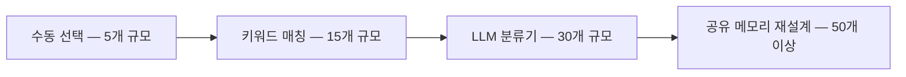
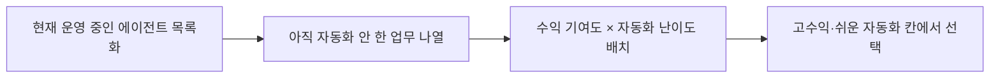
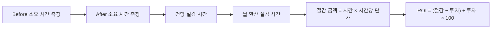

[앞 편](/blog/agentic-coding/troubleshooting-three-layers/)까지는 에이전트가 몇 개 안 될 때의 이야기였다. 개수가 늘면 성격이 다른 문제가 나온다. 하나하나는 멀쩡한데 **묶음이 안 돌아가는** 종류다.

이 시리즈의 마지막 편은 그 지점을 다룬다. 무엇이 먼저 깨지는지(라우팅), 왜 비용이 개수보다 빨리 오르는지(컨텍스트 전파), 왜 장애 하나를 잡는 데 걸리는 시간이 몇 배가 되는지(체인 추적). 그리고 그 셋을 넘긴 다음에 반드시 오는 질문 — **"그래서 효과가 얼마였나"** — 에 답하는 방법까지다.

[첫 편](/blog/agentic-coding/automation-scope-criteria/)이 합격선 5축에서 확장성을 「하나 더 붙이는 데 얼마나 걸리느냐」로 정의했다. 이 글은 그 시간이 왜 늘어나는지, 그리고 늘어나기 전에 무엇을 갈아타야 하는지를 구간별로 본다.

> 이 글이 옮긴 원 자료의 작성 기준일은 **2026-07-26**이다. 임계값·비용 배율·모델 등급 구분은 그 시점의 것이며 버전과 요금제에 따라 바뀐다.
>
> 아래의 정량 수치(비용 배수, 오류율, MTTR, 캐시 히트율별 금액 등)는 **원 자료가 제시하거나 옮긴 값**이며 이 글이 측정한 값이 아니다. 수치가 나오는 자리마다 출처와 기준일을 따로 붙였다.

## 용어 정리

[첫 편](/blog/agentic-coding/automation-scope-criteria/)의 용어표에서 이 글이 쓰는 행만 추렸다.

| 용어 | 풀이 |
|---|---|
| **라우팅(Routing)** | 들어온 요청을 어떤 에이전트가 처리할지 결정하는 분배 로직. 수동 → 키워드 매칭 → LLM 분류기 순으로 진화한다 |
| **오케스트레이터(Orchestrator)** | 직접 산출물을 만들지 않고 분기·호출·결과 종합만 담당하는 상위 에이전트. 허브-앤-스포크의 허브 |
| **허브-앤-스포크** | 중앙 조율자(허브)가 전문 실행자(스포크)에게 작업을 분배하는 멀티에이전트 구조 |
| **관측성(Observability)** | 시스템 내부 상태를 외부에서 파악할 수 있는 정도. 여기서는 감사 로그·trace ID·비용 대시보드 |
| **감사 로그(Audit Log)** | 누가·언제·무슨 도구로·무엇을 했는지 남기는 기록. JSON Lines 형식 권장 |
| **trace_id** | 오케스트레이터에서 하위 에이전트까지 하나의 요청 체인을 추적하는 식별자 |
| **MTTR** | Mean Time To Repair. 장애 발생부터 복구까지 걸린 평균 시간 |
| **컨텍스트 윈도우** | 모델이 한 번에 볼 수 있는 토큰 한도. 초과 이전에 이미 응답 품질이 떨어진다 |
| **프롬프트 캐싱** | 반복되는 입력 컨텍스트를 서버가 캐시해 재사용하는 기능. 입력 토큰 비용 절감 |
| **cost_tier** | 에이전트 정의(frontmatter)에 선언하는 비용 등급. 모델 교체 시 코드 수정을 피하기 위한 간접층 |

## 12개를 넘으면 반드시 나타나는 세 증상

| 증상 | 메커니즘 | 수치 | 대응 |
|---|---|---|---|
| 라우팅 충돌 | 잠재 경로가 N(N-1)/2로 증가 | 10개 → 45경로, 30개 → 435경로. 오류율 5% → 45% | 업무 경계를 정의 파일에 명시화 |
| 컨텍스트 비용 폭증 | 에이전트 간 결과 전달이 전부 토큰 비용 | 5개 월 $12 → 15개 월 $89 (3배 증가에 7.4배 비용) | 허브-앤-스포크 + 프롬프트 캐싱 |
| 디버깅 난이도 폭증 | 체인이 길어질수록 원인 추적이 지수적으로 어려움 | MTTR 15분(10개) → 4시간(30개, 로그 없음) | 도구 호출 전량을 감사 로그로 기록 |

세 행의 「메커니즘」 열이 왜 **개수에 비례하지 않는가**를 각각 설명한다. 경로는 조합이라 제곱에 가깝게 늘고, 비용은 에이전트끼리 주고받는 양이 붙어서 늘며, 디버깅은 체인 길이가 곱해진다. 에이전트를 3배 늘렸을 때 셋 다 3배로 끝나지 않는 이유다.

「대응」 열도 한 방향이다. 셋 다 **정보를 한곳에 모으는** 조치다 — 경계를 정의 파일 한 곳에, 컨텍스트를 허브 한 곳에, 호출 기록을 감사 로그 한 곳에.

> **위 수치는 원 자료가 제시하거나 옮긴 값**이며 이 글이 측정한 값이 아니다 — 경로 공식 `N(N-1)/2`와 그 계산값(`45`·`435`), 오류율 `5% → 45%`, 비용 `5개 월 $12 → 15개 월 $89`(`7.4배`), MTTR `15분 → 4시간`. 금액은 사용하는 모델·요금제·작업량에 따라 달라진다. 원 자료 작성 기준일은 **2026-07-26**이다.

두 개의 반패턴이 지목된다. **"에이전트 설명을 모호하게 쓰는 것"**과 **"나중에 로그 달아야지"**다. 후자에 대한 원 자료의 답은 간명하다. 나중은 없다.

두 반패턴이 각각 첫 행과 셋째 행의 원인이라는 점을 붙여 읽으면 순서가 보인다. 설명을 모호하게 쓰면 경로가 겹치고, 로그를 미루면 그 겹침이 만든 오라우팅을 추적할 수단이 없다.

## 규모 구간별 운영 모델

아래 표는 **원 자료가 실제 확장 운영 데이터를 에이전트 개수 구간으로 재구성한 것**이다. 일반론으로 세운 모델이 아니라 특정 운영 이력에서 뽑아 구간별로 다시 묶은 값이라는 뜻이다.

| 규모 | 조직 구조 | 관리 방식 | 병목 | 대응 |
|---|---|---|---|---|
| 5개 내외 | 단일 팀, 범용 에이전트 | 사람이 직접 에이전트 선택(완전 수동) | 없음 — 패턴이 유사해 헷갈릴 일 없음 | 그대로 두고 검증에 집중 |
| 10~15개 | 도메인별 분화 시작 | 정의 파일의 키워드 매칭 라우팅 | 의미 유사성 미포착 오라우팅 | 라우터 스킬 도입, 키워드 교집합 제거 |
| 15~30개 | 부서 단위 편성 | 경량 모델 분류기가 의미 분석 후 배정 | 키워드 관리 부담(30개 × 5개 = 150개 충돌) | LLM 분류기로 전환, 라우팅 정확도 95%+ |
| 30~50개 | 부서 + 오케스트레이터 계층 | 권한 등급 + 감사 로그 + 체크포인트 | 비용 구조, 장애 추적 | 모델 3분할 + 캐싱, trace ID 전면 적용 |
| 50~100개 | 다계층 조직 | 거버넌스 상시 운영 | 에이전트 간 정보 동기화·메모리 공유 | 공유 메모리·컨텍스트 아키텍처 재설계 |

「병목」 열이 구간마다 **다른 층으로 옮겨간다**는 것이 이 표의 핵심이다. 처음엔 병목이 없고, 다음엔 분배 정확도가, 그다음엔 규칙 관리 부담이, 그다음엔 돈과 추적이, 마지막엔 상태 일관성이 병목이 된다. 앞 구간의 대응책이 다음 구간의 병목을 만든다는 점도 눈에 띈다 — 키워드 매칭으로 오라우팅을 잡으면 그 키워드 자체가 다음 구간의 관리 부담이 된다.

[앞 편](/blog/agentic-coding/agent-jd-triggers/)이 다룬 「키워드 교집합은 공집합이어야 한다」는 규칙이 유효한 구간이 두 번째 행까지라는 뜻이기도 하다. 세 번째 행부터는 사람이 관리할 키워드 수가 먼저 무너진다.

라우팅 방식의 진화만 따로 떼면 흐름이 선명하다.

각 전환의 교훈은 다음과 같다.

- 수동 라우팅은 에이전트 10개 초과에서 붕괴한다. 예외가 없다.
- 키워드는 문자열 매칭일 뿐이다. 의미 기반 분류는 모델만 할 수 있다.
- 키워드 라우팅 도입 시 평균 라우팅 시간이 8초에서 1초로, 수동 선택은 70% 감소했다.
- 분류기 전환 시 정확도가 15%p 올라 오라우팅이 3분의 1로 줄었다.

네 항목 중 앞의 둘은 **한계를 말하고**, 뒤의 둘은 **갈아탄 뒤의 변화를 말한다.** 갈아타는 판단을 「지금 불편한가」가 아니라 「개수가 몇인가」로 하라는 것이 앞 두 항목의 요지다 — 수동 라우팅은 10개에서 붕괴하고, 키워드 매칭은 아무리 잘 써도 의미를 못 본다.

> **위 네 항목의 수치는 원 자료가 옮긴 값**이며 이 글이 측정한 값이 아니다 — `8초 → 1초`, 수동 선택 `70% 감소`, 정확도 `15%p` 상승, 오라우팅 `3분의 1`. 위 표의 `라우팅 정확도 95%+`, `30개 × 5개 = 150개`도 같다. 원 자료 작성 기준일은 **2026-07-26**이다.

## 부서 증설 순서 — 돈 버는 곳부터

| 순서 | 영역 | 수익 기여 | 자동화 난이도 | 근거 |
|---|---|---|---|---|
| 1 | 마케팅 | 높음 | 낮음 | 콘텐츠·SEO·카피. 즉각 매출 기여 |
| 2 | 영업 | 최고 | 중간 | 리드 스코어링·CRM·제안서. ROI가 가장 명확 |
| 3 | 고객지원 | 보호 | 낮음 | 이탈 방지 = 수익 보호 |
| 4 | 경영지원 | 중간 | 낮음 | 보고서·일정·회의록 |
| 5 | 인사 | 중간 | 중간 | 채용공고·평가·온보딩 |
| 6 | 재무 | 중간 | 높음 | 경비·예산 리포트 |
| 7 | 법무 | 낮음 | 최고 | 초안만 자동, 감수는 반드시 사람 |

일곱 행의 순서가 수익 기여 열만으로 결정되지 않는다는 점을 봐야 한다. 영업이 「최고」인데 2번인 것은 난이도가 마케팅보다 높기 때문이고, 고객지원이 「보호」로 3번인 것은 매출을 만들지는 않아도 지키기 때문이다. 마지막 행은 두 열이 최악의 조합이라 순서가 아니라 **범위**로 답이 나온다 — 초안까지만이다.

원칙은 **"CFO보다 영업팀을 먼저 뽑는 이유와 같다. 돈이 들어와야 관리할 것이 생긴다"**로 요약된다. 다음에 만들 에이전트를 정할 때는 매트릭스 어느 칸인지부터 확인한다.

## 재사용과 거버넌스

에이전트를 매번 새로 만들면 6개월 뒤 같은 역할이 12가지 버전으로 흩어진다. 대응은 중앙 공유 라이브러리다.

| 항목 | 방식 | 효과 |
|---|---|---|
| 중앙화 | 에이전트·스킬·규칙을 단일 저장소로 | 한 번 수정하면 전 프로젝트 반영 |
| 연결 | 서브모듈 또는 심볼릭 링크 | 프로젝트별 복제 방지 |
| 예외 | 프로젝트 로컬 디렉터리에서만 오버라이드 허용 | 분산을 통제된 범위로 제한 |
| 계약 | 정의 파일에 이름·버전·설명·트리거·권한·비용등급 선언 | 라우팅과 모델 선택을 코드 밖으로 분리 |
| 단일 책임 | 에이전트 이름을 한 문장으로 설명 못 하면 분리 | 경계 중첩 방지 |

다섯 행 중 셋째가 특히 실용적이다. 앞의 둘이 분산을 **금지**한다면 셋째는 분산을 **허용하되 자리를 정한다.** 오버라이드를 아예 막으면 사람들이 저장소 밖에서 복제하기 시작하므로, 새는 곳을 없애는 대신 새는 곳을 한 군데로 지정하는 설계다.

넷째 행의 「비용등급 선언」이 [앞 편들](/blog/agentic-coding/agent-jd-triggers/)에서 본 JD 필드의 확장이다. 모델 이름을 코드에 박지 않고 등급만 선언해 두면, 모델을 갈아탈 때 정의 파일만 고치면 된다.

거버넌스는 **권한 매트릭스 + 감사 로그 + 체크포인트** 3종 세트다.

| 등급 | 성격 | 예시 역할 | 권한 |
|---|---|---|---|
| L1 | 읽기 전용 | 리서처, 리뷰어 | 읽기·검색만 |
| L2 | 읽기 + 쓰기 | 문서 작성자, 자료 제작자 | 파일 생성·수정 |
| L3 | 시스템 접근 | CS 응답 에이전트 | 삭제·외부 요청은 거부 |
| L4 | 민감 데이터 | 인사(급여), 회계 | 읽기 전용 + 별도 승인 + 감사 필수 |

네 등급이 단조 증가하지 않는다는 점이 중요하다. L1에서 L3까지는 권한이 넓어지지만 **L4에서 다시 읽기 전용으로 좁아진다.** 등급은 「할 수 있는 일의 양」이 아니라 「다루는 데이터의 민감도」로 매겨져 있고, 민감도가 최고인 자리에서는 쓰기를 아예 빼는 것이 답이기 때문이다.

감사 로그는 JSON Lines로 `시각 / 세션 / trace / 에이전트 / 도구 / 동작 / 결과` 7개 필드를 남긴다. trace ID가 있어야 오케스트레이터에서 하위 에이전트까지 체인 전체를 되짚을 수 있다. 보존 정책은 일반 90일, 민감 데이터 365일이 제시된다.

체크포인트는 **3개 이상 파일 동시 변경 / 민감 등급 작업 완료 / 단계 전환** 시점에 건다. 체크포인트 없이 긴 파이프라인을 돌리면 실패 시 처음부터 다시 해야 한다.

> **`90일`·`365일` 보존 정책과 체크포인트 발동 기준(`3개 이상 파일`), 감사 로그 `7개 필드`는 원 자료가 제시한 기준선**이며 이 글이 측정하거나 규정에서 확인한 값이 아니다. 실제 보존 기간은 적용받는 법규와 내부 정책에 따라 달라진다. 원 자료 작성 기준일은 **2026-07-26**이다.

## 비용 최적화

| 축 | 방법 | 효과 |
|---|---|---|
| 모델 3분할 | 분류·라우팅·1차 응답은 소형, 코드 생성·구조화는 중형, 전략 분석·아키텍처 판단은 대형 | 난이도별 배치로 70% 이상 절감 |
| 프롬프트 캐싱 | 시스템 프롬프트·공통 규칙·지식베이스·예시를 캐시 대상으로 | 반복 입력 비용 대폭 절감 |
| 컨텍스트 분배 | 오케스트레이터만 전체 맥락 보유, 하위에는 필요한 것만 전달 | 체인 전파 비용 억제 |
| 배치 묶기 | 캐시 TTL(5분) 안에 관련 실행을 몰아서 | 재캐시 발생 방지 |

네 축이 **비용이 발생하는 서로 다른 자리**를 하나씩 맡는다. 첫째는 단가(어떤 모델을 쓰는가), 둘째와 넷째는 같은 입력을 다시 보내지 않는 것, 셋째는 애초에 보내는 양을 줄이는 것이다. 셋째가 앞 절 「12개를 넘으면」 표의 둘째 행에 대한 직접 대응이기도 하다.

소형 : 중형 : 대형 모델의 대략적 비용 배율은 1 : 3 : 5로 제시된다. 반패턴은 **판단이 필요한 작업을 소형 모델에 맡기는 것**이다. 틀린 답을 빠르게 내놓기 때문에 결과적으로 더 비싸다.

캐시 히트율에 따른 비용 시나리오(동일 작업량 기준 예시)는 0% $1,500 / 60% $780 / 90% $385로, 캐싱 설계가 곧 비용 설계임을 보여준다.

> **위 수치는 원 자료가 제시하거나 옮긴 값**이며 이 글이 측정한 값이 아니다 — 절감률 `70% 이상`, 비용 배율 `1 : 3 : 5`, 캐시 TTL `5분`, 히트율별 금액 `0% $1,500 / 60% $780 / 90% $385`. 모델 등급별 단가와 캐시 정책은 벤더와 요금제에 따라 다르고 시간이 지나면 바뀐다. 원 자료 작성 기준일은 **2026-07-26**이다.

[앞 편](/blog/agentic-coding/agent-jd-triggers/)이 운영 전환 목록의 한 행으로 남겨 두었던 **"자동화 코드를 짜기 전에 비용 모니터링부터 설정한다"**가 이 절의 전제다. 위 네 축은 전부 **쓰고 있는 양이 보일 때** 손댈 수 있는 것들이다. 어느 에이전트가 얼마를 쓰는지 모르면 모델을 3분할할 기준 자체가 없다.

## 다음 에이전트를 정하는 절차

확장은 감이 아니라 절차로 결정한다. 네 단계면 끝난다.

| 단계 | 산출물 | 판단 기준 |
|---|---|---|
| 1 | 운영 중 에이전트 목록 | 각 에이전트를 한 문장으로 설명 가능한가 |
| 2 | 미자동화 업무 5개 이상 | 반복 빈도와 소요 시간이 기록되어 있는가 |
| 3 | 매트릭스 배치 | 이 업무가 수익에 얼마나 기여하는가 |
| 4 | 다음 대상 1개 확정 | 우상단(고수익·쉬운 자동화)에 있는가 |

1단계의 판단 기준이 재사용 절의 「단일 책임」과 같은 문장이라는 점을 봐야 한다. 새 에이전트를 정하기 전에 **기존 에이전트의 경계부터 점검**하게 되어 있고, 여기서 설명이 안 되는 것이 나오면 그것부터 분리하는 것이 다음 작업이 된다.

2단계는 [첫 편](/blog/agentic-coding/automation-scope-criteria/)의 5열 워크시트를 다시 꺼내는 자리다. 확장 단계에서도 후보 선정 기준은 처음과 같다.

배치 전에 반드시 던져야 할 질문은 하나다. **"이것이 수익에 얼마나 기여하는가?"** 이 질문을 건너뛰면 만들기 쉬운 것부터 만들게 되고, 그 결과 자동화 개수는 늘지만 효과는 정체된다.

한 가지 예고도 남아 있다. 50개를 넘어서면 새 병목은 라우팅이 아니라 **에이전트 간 정보 동기화**가 된다. 각자 다른 시점의 상태를 보고 판단하는 상황이 생기기 때문에, 공유 메모리와 컨텍스트 아키텍처를 다시 설계해야 한다. **라우팅을 해결했다고 확장이 끝나지 않는다.**

## 성과 측정과 증명

확장까지 마쳐도 "그래서 효과가 얼마였나"에 답하지 못하면 조직 안에서 예산을 얻지 못한다.

### 증명의 3종 세트

| 요소 | 역할 | 없으면 |
|---|---|---|
| 문서(README) | 명함. 처음 보는 사람이 30초 안에 이해 | "이론"으로만 남는다 |
| 시연(데모) | 실제로 동작한다는 증거 | 문서만으로는 믿기 어렵다 |
| 지표(숫자) | 효과의 크기 | "인상"만 주고 "신뢰"는 못 준다 |

셋 중 하나만 있으면 각각 이론 · 마술 · 자랑에 그치고, **세 개가 합쳐질 때 설득력이 최대**가 된다는 것이 원 자료의 정리다. 셋이 서로를 보완하는 방향도 다르다 — 문서는 *무엇인지*, 시연은 *진짜인지*, 지표는 *얼마나인지*에 답한다.

### 문서 8섹션 구조

산출물 문서의 표준 구조는 다음과 같다. 그대로 사내 자동화 프로젝트 문서 템플릿으로 쓸 수 있다.

| # | 섹션 | 작성 요령 |
|---|---|---|
| 1 | 제목 + 결과 포함 1줄 설명 | "무엇을 만들었고 결과가 무엇인지"를 한 문장에. 숫자 포함 |
| 2 | 데모 이미지 또는 스크린샷 | 이미지 하나가 100줄 설명보다 강하다 |
| 3 | 문제 정의 | 왜 만들었는가. 독자가 공감할 구체적 상황 |
| 4 | 핵심 기능 3~5개 | 기능 나열이 아니라 사용자가 얻는 가치 중심 |
| 5 | 설치·실행 방법 | 복사-붙여넣기만으로 동작해야 함. 반드시 사전 테스트 |
| 6 | 기술 스택 | 사용 모델·언어 버전·연동 목록 |
| 7 | 결과 지표 | Before / After / 개선율 표 |
| 8 | 라이선스 | 공개 시 필수 |

여덟 섹션의 순서가 **읽는 사람이 판단하는 순서**를 따른다 — 이렇게 읽는 것은 이 글의 정리다. 1·2번에서 계속 읽을지를 정하고, 3·4번에서 나에게 필요한지를 정하며, 5번에서 실제로 돌려 보고, 6·7번에서 믿을지를 정하며, 8번이 쓸 수 있는지를 정한다. 1번에 숫자를 넣으라는 요령이 여기서 나온다 — 7번까지 읽어야 숫자가 나오면 대부분 그 전에 닫는다.

5번의 「반드시 사전 테스트」는 [첫 편](/blog/agentic-coding/automation-scope-criteria/)의 문서화 축 합격선과 같은 조건이다. 만든 사람이 아닌 제3자가 실행에 성공해야 통과다.

> **위 두 표의 수치(3종 세트의 `30초`, 8섹션의 `100줄`·`3~5개`)는 원 자료가 제시한 작성 기준선**이며 이 글이 측정한 값이 아니다. 원 자료 작성 기준일은 **2026-07-26**이다.

### 시연 원칙 — 첫 10초의 법칙

동작을 보여주는 자리에서는 **첫 10초 안에 핵심 결과나 자동화가 도는 장면**을 보여준다. 보는 사람은 그 안에 계속 볼지를 결정한다.

| DO | DON'T |
|---|---|
| 첫 화면부터 자동화 작동 장면 또는 결과물 | 인사말·자기소개로 시작 |
| 길이는 1~3분으로 제한 | 배경 설명과 개발 히스토리를 앞에 배치 |
| 불필요한 창·알림을 미리 정리 | 알림 설정 없이 바로 녹화 |
| 설명이 부담되면 자막으로 대체 | 3분을 넘기는 시연 |

이 표는 DO와 DON'T가 행 단위로 짝지어져 있지 않다 — 예컨대 둘째 행은 DO가 길이를, DON'T가 순서를 말한다. 여덟 항목을 하나씩 배정하면 **순서 3 · 길이 2 · 덜어내기 3**으로 갈린다.

| 무엇에 관한 것인가 | 해당 항목 |
|---|---|
| 순서 (3) | DO 「첫 화면부터 자동화 작동 장면 또는 결과물」 / DON'T 「인사말·자기소개로 시작」 · 「배경 설명과 개발 히스토리를 앞에 배치」 |
| 길이 (2) | DO 「길이는 1~3분으로 제한」 / DON'T 「3분을 넘기는 시연」 |
| 덜어내기 (3) | DO 「불필요한 창·알림을 미리 정리」 · 「설명이 부담되면 자막으로 대체」 / DON'T 「알림 설정 없이 바로 녹화」 |

셋을 더하면 3 + 2 + 3 = 8로 표의 여덟 항목이 남김없이 배정된다. **이렇게 갈라 읽고 이름 붙이는 것은 이 글의 정리다** — 원 자료는 이 표를 DO / DON'T 두 열로만 두고 항목을 따로 분류하지 않는다. 이 원칙은 사내 데모나 경영진 보고에도 그대로 적용된다. **결과를 먼저, 과정은 뒤에** 두는 순서다.

> **`10초`·`1~3분`·`3분`은 원 자료가 제시한 시연 기준선**이며 이 글이 측정한 값이 아니다. 원 자료 작성 기준일은 **2026-07-26**이다.

### ROI 계산 — 추정이라도 숫자로 쓴다

계산 절차는 단순하다. 시간 절감을 금액으로 환산하고 투자 비용과 비교한다.

지표 표의 형태는 다음과 같이 잡는다.

| 항목 | Before | After | 개선율 |
|---|---|---|---|
| 처리 시간 | 20분/일 | 3분/일 | -85% |
| 누락 건수 | 수동, 주 2~3건 누락 | 자동 감지 12건/주 | 측정 방식 변경 |
| 월 절감 시간 | — | 약 6.2시간 | — |

세 행 중 가운데 행의 「개선율」 칸이 숫자가 아니라 **「측정 방식 변경」**이라는 점이 이 표에서 가장 실용적인 부분이다. 수동일 때는 놓친 것을 셀 방법이 없었고 자동화 후에야 세어졌으므로, 두 값은 애초에 비교 가능한 쌍이 아니다. 그 칸에 무리하게 개선율을 적는 대신 비교 불가라고 적어 두는 것이 정직한 처리다.

> **위 표의 값(`20분/일 → 3분/일`, `-85%`, `주 2~3건`, `12건/주`, `약 6.2시간`)은 원 자료가 지표 표의 형태를 보이려고 든 예시**이며 관측된 실적이 아니다. 원 자료 작성 기준일은 **2026-07-26**이다.

주의할 점은 **시간 절감만이 지표가 아니라는 것**이다. 자동 처리 건수("주간 리포트 245건 자동화"), 감지 건수("오류 알림 12건/주")도 유효한 지표다. 또한 정확한 숫자보다 **측정된 추정**이 낫다는 원칙이 반복된다.

> "아마 30% 줄었을 것 같다"보다 "이전 2시간, 현재 1시간 20분, 약 33% 단축"이 설득력에서 비교가 되지 않는다.
>
> 숫자가 없으면 지금 바로 한 번만 측정하면 된다. 1회 측정으로도 충분하다.

두 문장이 붙어 있는 것이 요점이다. 앞 문장만 읽으면 정밀한 측정 체계가 필요해 보이지만, 뒤 문장이 **1회 측정으로 충분하다**고 선을 낮춘다. 측정이 없는 상태와 1회 측정한 상태의 차이가, 1회와 100회의 차이보다 크다.

### 피드백을 받는 방법

성과를 공유했을 때 유용한 피드백을 얻으려면 질문의 형태가 중요하다. 이 대비표는 코드리뷰 요청·설계 리뷰에도 그대로 적용된다.

| 나쁜 질문 | 왜 나쁜가 | 좋은 질문 |
|---|---|---|
| 뭐가 별로예요? | 범위가 없어 답변이 산만해진다 | 이 부분에서 A와 B 중 어떤 방향이 나을까요? |
| 괜찮나요? | 예/아니오만 유도해 개선점이 안 나온다 | 제가 A를 택한 이유는 이것인데, 놓친 부분이 있을까요? |
| 전체적으로 어떤가요? | 개선 행동으로 이어지지 않는다 | 조건 분기 방식과 테이블 기반 방식 중 어느 쪽이 유지보수에 유리할까요? |

세 행의 오른쪽 열이 전부 **선택지를 좁히거나 자기 판단을 먼저 밝힌다.** 비유가 명확하다. 의사에게 "몸이 아파요"라고 하는 것과 "오른쪽 무릎이 3주째 아픕니다"라고 하는 것의 차이다. **범위를 좁히고 본인의 판단 근거를 먼저 밝히는 질문**이 좋은 피드백을 만든다.

## 전체를 되짚으면

원 자료는 전 과정을 여덟 구간으로 되짚으며 끝난다. 여덟 구간이 하나의 방향으로 이어진다.

| 구간 | 주제 | 패러다임 전환 |
|---|---|---|
| 0 | 터미널 기초 | 터미널은 개발자만의 도구가 아니다 |
| 1 | 도구 입문 | 응답이 아니라 행동하는 에이전틱 방식 |
| 2 | 규칙 문서 | 컨텍스트 엔지니어링이 품질을 좌우 |
| 3 | 도구 연동 | 외부 능력을 붙여 생태계 확장 |
| 4 | 서브에이전트·스킬 | 실행자에서 디렉터로 |
| 5 | 멀티에이전트 | 협업 구조·비용 제어·교착 회피 |
| 6 | 부서 단위 조직 | 7부서 30에이전트 역할 정의 |
| 7 | 캡스톤 | 자기 문제로 시스템 1개 완성 |

**「주제」 열**을 위에서 아래로 읽으면 다루는 대상이 계속 한 층씩 올라간다 — 도구(0 터미널 기초 · 1 도구 입문)에서 시작해 규칙(2 규칙 문서), 연동(3 도구 연동), 위임(4 서브에이전트·스킬), 협업(5 멀티에이전트), 조직(6 부서 단위 조직)을 거쳐 마지막에 자기 문제(7 캡스톤)로 돌아온다. 이렇게 읽는 것은 이 글의 정리다. 그 전환의 가운데 지점을 「패러다임 전환」 열이 한마디로 적어 두었다 — 4번 행의 **「실행자에서 디렉터로」**다.

### 조직 규모별 편성 모델

도입 주체의 규모에 따라 출발 지점이 다르다. 이 세 유형은 "우리 조직이라면 몇 명부터 시작하는가"를 판단하는 기준이 된다.

| 주체 유형 | 초기 편성 | 구성 | 노리는 효과 |
|---|---|---|---|
| 1인 사업자 | 7 에이전트 스쿼드 | 고객관리·마케팅·CS·재무·운영·리서치·데이터 | 주간 반복업무를 검토 시간으로 축소 |
| 중간관리자 | 12 에이전트 부서 | 팀원 보조 + 본인 생산성 + 상위 보고 + 지표 관리 | 취합·보고 업무의 상당 부분 자동화 |
| 스타트업 경영진 | 20 에이전트 전사 | 제품·영업·운영·인텔리전스 4개 그룹 | 전사 보고·채용·투자자 대응 자동화 |

다만 실제 성공 사례의 공통점은 **5개 이하로 시작했다**는 것이다. 위 표는 목표 편성이지 착수 편성이 아니다. 이 단서가 붙지 않으면 표의 7·12·20이 첫날 만들 개수로 읽히는데, **셋 중 둘(12·20)은 앞 절에서 본 라우팅 붕괴선(「수동 라우팅은 에이전트 10개 초과에서 붕괴한다」)을 처음부터 넘는 수**다. 7만 그 선 아래이고, 그마저 「5개 이하로 시작」과는 어긋난다. 표의 편성 규모를 붕괴선에 대 보는 것은 이 글의 정리다 — 원 자료는 이 표에 「목표 편성이지 착수 편성이 아니다」라는 단서까지만 달았다.

부서 단위로 확장했을 때의 7부서 30에이전트 매핑은 다음과 같다. 조직도를 그대로 옮긴 형태다.

| 부서 | 에이전트 수 | 구성 |
|---|---|---|
| 마케팅 | 5 | 카피라이팅, 발행 일정, 성과 분석, 이미지 프롬프트, 보고서 |
| 영업 | 5 | 고객관리, 제안서, 고객 리서치, 리드 스코어링, 후속 대응 |
| CS | 4 | 자동 응답, 에스컬레이션, FAQ, 만족도 조사 |
| 재무 | 4 | 인보이스, 경비 처리, 보고서, 현금흐름 |
| 인사 | 4 | 채용 공고, 일정 관리, 온보딩, 평가 |
| 기획 | 4 | 시장 조사, 경쟁사 모니터링, 전략, 회의록 |
| 개발 | 4 | 코드 리뷰, 버그 추적, 문서화, 테스트 |

일곱 부서 중 마케팅·영업만 5개이고 나머지 다섯은 각 4개다(5+5+4×5=30). 더 배정된 두 부서가 앞의 「부서 증설 순서」 표에서 1·2번을 차지한 두 부서와 정확히 일치한다. **두 표를 이렇게 겹쳐 읽는 것은 이 글의 정리다** — 원 자료가 이 표에 붙인 말은 **「조직도를 그대로 옮긴 형태다」** 한 줄이고, 왜 두 부서만 5개인지는 이 표 안에서 설명되지 않는다. 「증설 순서」 표가 그 두 부서의 근거 열에 적어 둔 말은 「즉각 매출 기여」(마케팅)·「ROI가 가장 명확」(영업)이다.

> **위 두 표의 개수(`7`·`12`·`20`, 부서별 `5`·`4`)는 원 자료가 제시한 편성 예시**이며 관측된 운영 규모가 아니다. 30개라는 총계도 7부서 배분의 결과이지 권장 목표치가 아니다 — 원 자료 스스로 바로 위에 「5개 이하로 시작했다」는 단서를 붙였다. 원 자료 작성 기준일은 **2026-07-26**이다.

### 성공 사례의 공통 패턴 다섯

| # | 패턴 | 내용 |
|---|---|---|
| 1 | 범위를 좁혔다 | 전체가 아니라 반복되는 핵심 병목 1~2개부터 |
| 2 | 5개 이하로 시작했다 | 처음부터 30개를 만들려 하지 않고 검증 후 확장 |
| 3 | 설계에 시간을 썼다 | 정의 파일과 규칙 문서를 정교하게 다듬음 |
| 4 | 사람의 역할을 재정의했다 | 기계적 반복은 에이전트, 사람은 전략·창의 |
| 5 | 커뮤니티를 활용했다 | 막힌 부분을 외부에서 빠르게 해소 |

다섯 중 앞의 셋이 **시작 시점에 하는 것**이고 뒤의 둘이 **하는 동안 계속하는 것**이다. 1·2번이 같은 말을 대상과 개수로 나눠 한 것이라는 점도 눈에 띈다 — 무엇을 자동화할지를 좁히고(범위), 몇 개를 만들지를 좁힌다(개수).

### 반복 실패 패턴 넷

반복 실패 패턴 네 가지는 조직에 무엇이든 도입할 때 공통으로 적용된다.

| 실패 패턴 | 증상 | 예방 |
|---|---|---|
| 병목 미인식 | 수동 처리를 "조금 귀찮은 일"로 방치 | 주간 단위 시간 측정을 의무화해 수치로 확인 |
| 비용 부주의 | "나중에 모니터링 붙이지" 하다 예산 초과 | 자동화 코드를 쓰기 전에 비용 알림 임계값부터 설정 |
| 기술-채널 불균형 | 기술 완성만 기다리다 유입 채널이 없음 | 기술 개발 30% 시점부터 채널 실험 시작 |
| 확장 준비 부족 | 분기 로직을 조건문 체인으로 계속 확장 | 3개 초과 시점에 레지스트리(테이블 기반) 패턴으로 전환 |

네 패턴은 **대부분의 조직이 이 순서대로 같은 벽에 부딪힌다**는 것이 원 자료의 서술이다. 「예방」 열도 순서를 따라간다 — 앞의 둘은 **재는 장치를 먼저 붙이는 것**(시간 측정, 비용 알림)이고, 뒤의 둘은 **완성을 기다리지 않고 미리 갈아타는 것**(30% 시점, 3개 초과 시점)이다.

넷째 행의 「3개 초과」가 이 글의 첫 절과 이어진다. 조건문 체인이 실제로 못 견디는 지점은 훨씬 뒤지만, 갈아타는 작업 자체가 개수에 비례해 비싸지므로 **아직 싼 시점에 갈아타라**는 것이 3이라는 낮은 값의 의미다.

> **`30% 시점`과 `3개 초과`는 원 자료가 제시한 설계 임계**이며 이 글이 측정한 값이 아니다. 둘 다 특정 조직의 이력이 아니라 **갈아타는 시점을 정하는 기준**으로 쓰인다. 원 자료 작성 기준일은 **2026-07-26**이다.

### 두 갈래 — 적용과 공개

원 자료는 학습 이후의 경로를 두 가지로 제시하면서, 조직에 적용할 때도 같은 구분이 유효하다고 적었다.

| 경로 | 내용 | 적합 대상 |
|---|---|---|
| 실무 적용 | 매주 30분 이상 쓰는 반복 업무 1개를 골라 규칙 문서를 쓰고 실행 → 수정 → 재실행을 일주일에 3회 이상 반복 | 모두. 가장 빠른 내재화 경로 |
| 공개 기여 | 만든 에이전트·스킬·규칙 템플릿을 공개하고 타인 것을 활용·개선 | 이미 실력을 쌓아 외부 검증을 받고 싶은 경우 |

두 경로는 앞에서 본 재사용 절의 확장이다. 실무 적용이 **자기 조직 안에서 도는 반복**이라면, 공개 기여는 그 중앙 라이브러리의 경계를 조직 밖으로 한 칸 넓힌 것이다.

실무 적용 경로의 핵심은 반복 횟수다. **일주일에 3회 이상 돌려봐야 설계 감각이 생긴다.** 자료로 읽은 것과 자기 업무에서 돌려본 것은 전혀 다른 경험이며, 첫 에이전트가 실패하는 것은 설계가 덜 된 것이지 도구의 문제가 아니다.

첫 행의 조건 두 개(**매주 30분 이상 쓰는 업무**, **일주일에 3회 이상 실행**)가 [첫 편](/blog/agentic-coding/automation-scope-criteria/)의 대상 선정 기준과 같은 형태라는 점을 봐야 한다. 그쪽은 회수 가능성을 재려고 반복 빈도를 셌고, 이쪽은 설계 감각이 붙는 속도를 재려고 같은 것을 센다.

> **`30분`·`3회`는 원 자료가 제시한 기준선**이며 이 글이 측정한 값이 아니다. 원 자료 작성 기준일은 **2026-07-26**이다.

## 시리즈를 닫으며

네 편을 관통하는 것은 하나다. **경계를 문서에 적어 두는 것이 확장의 전제다.**

[첫 편](/blog/agentic-coding/automation-scope-criteria/)은 무엇을 자동화 대상으로 삼을지의 경계를 워크시트와 두 도구로 그었고, 합격선을 5축 루브릭으로 못박았다. [두 번째 편](/blog/agentic-coding/agent-jd-triggers/)은 에이전트 하나의 경계를 5필드 JD로, 에이전트 사이의 경계를 키워드 교집합 공집합으로 그었다. [세 번째 편](/blog/agentic-coding/troubleshooting-three-layers/)은 장애의 경계를 3계층으로 좁히고 예방 칸을 반드시 문서에 반영하게 했다. 그리고 이 글은 그 모든 경계가 개수에 밀려 무너지는 지점과, 무너지기 전에 갈아타는 순서를 봤다.

세 증상이 12개 근처에서 한꺼번에 나오는 이유도 같다. 잠재 경로가 제곱으로 늘고 컨텍스트가 체인을 타고 전파되는 것은 **경계가 명시되지 않았을 때** 벌어지는 일이다. 경계가 정의 파일에 적혀 있으면 경로는 조합이 아니라 매핑이 되고, 컨텍스트는 전파되는 대신 허브에 머문다.

마지막으로 남는 것은 증명이다. 여기까지 해도 「그래서 효과가 얼마였나」에 답하지 못하면 다음 예산이 나오지 않는다. 그 답은 정밀한 측정 체계가 아니라 **한 번의 측정**에서 시작한다.
