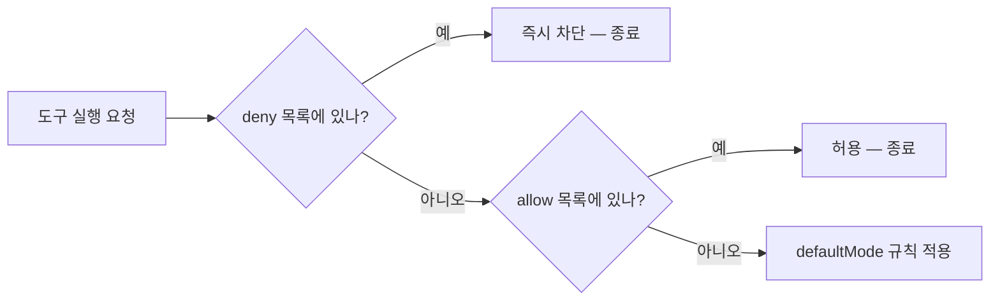
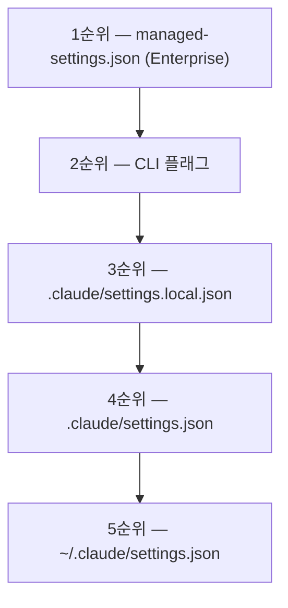
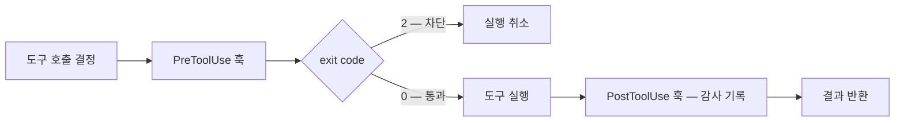

지시 습관으로 통제하는 방식에는 한계가 있다. Plan Mode를 켜야 할 때 켜지 않아도 아무것도 막지 않고, 규약 파일에 "위험한 명령을 쓰지 말 것"이라고 써 둬도 모델이 어길 수 있다. 규칙과 강제된 규칙은 다르다.

이 글은 그 경계를 만드는 두 층을 본다. **선언형 정책**은 JSON 한 파일로 조직 전체에 같은 규칙을 배포하고, **훅**은 패턴 문법으로 쓸 수 없는 조건을 스크립트로 판정한다. 둘은 대체재가 아니라 1차·2차 방어선이며, 하나만 쓰면 구멍이 남는다.

> 이 글의 설정 키·경로는 **원 자료 기준(2026-04)** 이다. 키 이름은 버전에 따라 바뀐다.

## 용어 정리

[앞 편들](/blog/agentic-coding/claude-code-autonomy-tiers/)의 용어표에서 이 글이 쓰는 행만 추렸다.

| 용어 | 풀이 |
|---|---|
| 퍼미션 모드 (Permission Mode) | 에이전트가 파일시스템·명령어를 어느 범위까지 쓸 수 있는지 정하는 실행 모드 |
| Plan Mode | 파일을 수정하지 않고 읽기 전용으로만 동작하며 실행 계획을 먼저 제시하도록 강제하는 퍼미션 모드 |
| allowlist / denylist | 허용 목록 / 차단 목록. 화이트리스트·블랙리스트와 같은 뜻 |
| defaultMode | allow·deny 어디에도 걸리지 않은 도구를 어떻게 처리할지 정하는 기본 정책 |
| enforcement | 규칙을 문서로 "쓰는" 데 그치지 않고 시스템이 물리적으로 강제하는 것 |
| 최소 권한 원칙 (Least Privilege) | 업무에 필요한 최소한의 권한만 부여하는 보안 원칙 |
| hooks | 특정 이벤트(도구 실행 전·후, 세션 시작 등)에 자동 실행되는 스크립트. 검증·감사 게이트로 쓴다 |
| MCP (Model Context Protocol) | AI와 외부 도구·서비스 간 통신 표준 프로토콜. 커넥터 하나로 여러 에이전트가 같은 시스템에 붙으며, **서버 단위로 접근을 켜고 끌 수 있다** |

## settings.json — 권한을 선언형으로 통제한다

CLAUDE.md가 "무엇을 하라"를 정의한다면, settings.json은 **"어디까지 할 수 있는가"** 를 제어한다. 이 구분이 조직 거버넌스의 출발점이다.

| 항목 | CLAUDE.md | settings.json |
|---|---|---|
| 성격 | 업무 매뉴얼 (가이드) | 보안 정책서 (강제) |
| 작동 방식 | 모델이 읽고 따른다 | 시스템이 물리적으로 차단한다 |
| 위반 시 | 모델이 어길 수 있다 | 실행 자체가 불가능하다 |
| 관리 주체 | 팀 리드·개발자 | IT·보안팀 (Enterprise 계층) |
| 내용 | 컨벤션, 아키텍처, 절차 | 도구 허용·차단, 모드, 훅 |

이 차이가 다음 편의 핵심 명제로 이어진다 — **[enforcement 없는 규칙은 위시리스트](/blog/agentic-coding/claude-md-enforcement/)다.**

> **다섯 행 중 세 번째가 나머지를 규정한다.**
>
> "모델이 어길 수 있다"와 "실행 자체가 불가능하다"의 차이는 정도가 아니라 종류다. 그래서 네 번째 행(관리 주체)이 갈리는 것이 자연스럽다 — 어겨질 수 있는 문서는 팀이 관리해도 되지만, 어겨질 수 없어야 하는 규칙은 어길 사람이 고칠 수 없는 곳에 있어야 한다. 두 파일을 같은 사람이 관리하면 두 번째 파일이 첫 번째 파일과 같은 성질로 내려앉는다.

### 최상위 필드 구조

```json
{
  "version": "1",
  "permissions": { },
  "hooks": { },
  "enabledMcpjsonServers": [],
  "disabledMcpjsonServers": [],
  "includeCoAuthoredBy": false,
  "env": { "NODE_ENV": "development" },
  "enterpriseManaged": { }
}
```

| 키 | 역할 |
|---|---|
| `version` | 설정 스키마 버전 |
| `permissions` | 도구 허용·차단·기본 모드. 이 파일의 핵심 |
| `hooks` | 이벤트 기반 자동 실행 스크립트 등록 |
| `enabledMcpjsonServers` | 사용을 허용할 MCP 서버 목록 |
| `disabledMcpjsonServers` | 사용을 차단할 MCP 서버 목록 |
| `includeCoAuthoredBy` | 커밋 메시지에 공동 작성자 표기를 넣을지 여부 |
| `env` | 세션에 주입할 환경 변수 |
| `enterpriseManaged` | 전사 관리 정책 블록. `enforced: true`면 하위 변경 불가 |

### permissions — 구조와 평가 순서

```json
{
  "permissions": {
    "allow": [
      "Read",
      "Edit",
      "Bash(git:*)",
      "mcp__slack__send_message"
    ],
    "deny": [
      "Bash(rm:*)",
      "Bash(sudo:*)",
      "Bash(*--force*)",
      "mcp__github__*",
      "Read(/etc/*)",
      "Write(~/.ssh/*)"
    ],
    "defaultMode": "allowAll"
  }
}
```

평가 순서는 고정이다. **deny → allow → defaultMode**, 그리고 **deny가 항상 이긴다.**



순서가 고정이라는 것이 정책 설계에 주는 실용적 함의는 **allow를 아무리 넓게 써도 안전 상한이 유지된다**는 점이다. 허용 목록을 관대하게 운영하면서도 파괴적 명령은 확실히 막을 수 있고, 그래서 도입 초기에 "일단 열고 위험한 것만 막는" 전략이 성립한다.

### defaultMode 선택

> **원 자료 안에서 표기가 엇갈린다.** 한 챕터는 퍼미션 모드를 `default / acceptEdits / plan` 3가지로, 다른 챕터는 `allowAll / denyAll / ask / allowEdits / plan` 5가지로 쓴다.
>
> 실제 제품 키 이름은 버전에 따라 다르므로, 개수나 키 이름을 확정값으로 다루기보다 **정책 스펙트럼(전면 허용 ↔ 전면 차단)** 위의 어디인지로 읽는 편이 안전하다.

| 모드 (원 자료 표기) | 정책 성격 | 적합한 환경 |
|---|---|---|
| `allowAll` | 블랙리스트 방식 — 위험한 것만 막는다 | 개발·실험 환경 |
| `denyAll` | 화이트리스트 방식 — 허용한 것만 쓴다 | 프로덕션·금융·규제 산업 |
| `ask` | 매번 사용자 확인 | 중간 수준 통제, 신규 도입 초기 |
| `allowEdits` | 파일 편집만 허용 | 코드 리뷰·문서 작업 환경 |
| `plan` | 실행 없이 계획만 | 탐색·설계 단계 |

운영 조언은 두 갈래다.

- **도입 초기**: `allowAll` + deny 몇 개로 시작한다. 마찰이 적어 정착이 빠르다.
- **성숙 단계**: `denyAll` + 필요한 도구만 allow로 전환한다. 장기적으로 관리가 더 쉽고, 새 위험 도구가 추가돼도 자동으로 차단된다.

두 갈래의 차이는 엄격함이 아니라 **새 도구가 추가될 때의 기본값**이다. 블랙리스트에서는 새 도구가 자동으로 허용되고 화이트리스트에서는 자동으로 차단된다. 도구 생태계가 빠르게 늘어나는 환경일수록 이 기본값의 방향이 시간이 갈수록 큰 차이를 만든다.

### 도구 패턴 문법

```json
// 1. 도구 전체
"allow": ["Read", "Edit", "Write"]

// 2. Bash 명령어 패턴
"deny": [
  "Bash(rm:*)",          // rm으로 시작하는 모든 명령
  "Bash(sudo:*)",        // sudo 전체 차단
  "Bash(*--force*)",     // --force 포함한 모든 Bash
  "Bash(curl:*)"
]

// 3. MCP 도구
"allow": [
  "mcp__github__*",              // GitHub MCP 전체
  "mcp__slack__send_message"     // Slack 특정 기능만
]

// 4. 파일 경로
"deny": [
  "Read(/etc/*)",
  "Write(~/.ssh/*)",
  "Edit(/prod/*)"
]
```

### 실전 차단 패턴 10선

| # | 목적 | 패턴 |
|---|---|---|
| 1 | 파괴적 명령 차단 (필수) | `Bash(rm:*)`, `Bash(rmdir:*)`, `Bash(shred:*)`, `Bash(dd:*)` |
| 2 | 네트워크 유출 차단 | `Bash(curl:*)`, `Bash(wget:*)` |
| 3 | Git 쓰기 차단 (읽기만) | `Bash(git push:*)`, `Bash(git reset --hard:*)` |
| 4 | 권한 상승 차단 (필수) | `Bash(sudo:*)`, `Bash(su:*)` |
| 5 | 환경 변수 노출 차단 | `Bash(env:*)`, `Bash(printenv:*)`, `Read(.env*)` |
| 6 | 프로덕션 DB 접근 차단 | `mcp__prod-db__*` |
| 7 | 원격 저장소 쓰기 차단 | `mcp__github__create_or_update_file`, `mcp__github__push_files` |
| 8 | 시스템 파일 읽기 차단 | `Read(/etc/*)`, `Read(/var/*)` |
| 9 | SSH 키 보호 | `Write(~/.ssh/*)`, `Read(~/.ssh/*)` |
| 10 | 내부 도메인 접근 차단 | `WebFetch(.*internal.*)` |

> **비용 대비 효과**
>
> 위 10개를 다 넣을 필요는 없다. 원 자료의 표현대로 **deny 두 줄(`rm -rf`, `sudo`)만으로도 위험한 실수의 상당수를 막는다.**
>
> 정책은 완결성이 아니라 정착률로 평가해야 한다. 처음부터 촘촘하게 짜면 팀이 우회하기 시작한다.

열 항목 중 「필수」가 붙은 것은 1번과 4번 둘뿐이라는 점이 이 표의 사용법을 알려준다. 나머지 여덟은 조직의 위험 프로파일에 따라 고르는 항목이고, 그래서 이 표는 체크리스트가 아니라 **선택지 목록**이다. 전부 적용한 정책과 두 줄짜리 정책 사이의 차이는 안전도가 아니라 마찰이다.

### MCP 서버 관리 — 이중 잠금 원칙

```json
{
  "enabledMcpjsonServers": ["slack", "notion"],
  "disabledMcpjsonServers": ["aws", "github", "prod-db"],
  "permissions": {
    "deny": [
      "mcp__aws__*",
      "mcp__github__*",
      "mcp__prod-db__*"
    ],
    "defaultMode": "denyAll"
  }
}
```

- **MCP 서버 수준** 차단(`disabledMcpjsonServers`)과 **도구 수준** 차단(`permissions.deny`)을 함께 건다.
- 한쪽 설정이 실수로 풀려도 다른 쪽이 남는다. 심층 방어(defense in depth)의 가장 단순한 형태다.

[앞 편](/blog/agentic-coding/claude-code-autonomy-tiers/)에서 MCP 표준화의 효과가 통제 지점을 한곳으로 모으는 것이라고 했는데, 그 통제 지점이 실제로는 **둘**이라는 것이 여기서 드러난다. 서버 목록과 도구 패턴은 서로 다른 키이고 서로 다른 실수를 한다. 하나로 모였기 때문에 둘로 걸 수 있다.

### 설정 계층 5단계



| 순위 | 위치 | 관리 주체 | Git | 특징 |
|---|---|---|---|---|
| 1 | `managed-settings.json` | IT·보안팀 | — | 사용자가 절대 override 불가 |
| 2 | CLI 플래그 | 실행자 | — | 런타임에만 유효. 재시작 시 초기화 |
| 3 | `.claude/settings.local.json` | 개인 | gitignore | 개인 API 키·로컬 MCP 설정 |
| 4 | `.claude/settings.json` | 팀 | 커밋 | 팀 공유 정책. PR 리뷰로 변경 이력 관리 |
| 5 | `~/.claude/settings.json` | 개인 | — | 사용자 글로벌 기본값 |

병합 규칙 3가지가 핵심이다.

| 규칙 | 설명 |
|---|---|
| deny 누적 | 모든 레벨의 deny가 전부 적용된다. 어느 레벨에서든 deny면 차단 |
| allow 무력화 불가 | 상위 레벨 allow가 하위 레벨 deny를 무효화하지 못한다 |
| Enterprise 최우선 | `enterpriseManaged.enforced: true`면 하위 변경 자체가 불가능 |

디버깅 팁 하나: **"내 settings.json에서 허용했는데 왜 안 되지?"의 답은 거의 항상 상위 레벨 deny**다.

앞 절의 "deny가 항상 이긴다"가 파일 하나 안의 규칙이었다면, 여기서는 **계층 전체를 관통하는 규칙**으로 다시 나타난다. 같은 원리가 두 층위에서 반복되기 때문에 조직 정책이 개인 설정으로 뚫리지 않고, 동시에 개인이 자기 환경을 더 조이는 것은 언제나 가능하다. 권한 계층 설계에서 원하는 성질이 정확히 이것이다 — **아래로는 잠글 수 있고 위로는 열 수 없다.**

### 흔한 실수

| 실수 | 결과 | 대응 |
|---|---|---|
| trailing comma (마지막 항목 뒤 쉼표) | JSON 파싱 실패 | 저장 전 문법 검증. 에디터의 오류 표시 확인 |
| 패턴 문법 오류 | 실행 자체가 실패할 수 있음 | 배포 전 반드시 검증 |
| 파일 경로 오류 | 규칙이 아예 적용되지 않음 | 프로젝트 루트의 `.claude/settings.json`인지 확인 |
| `settings.local.json`을 커밋 | 개인 키 유출 | `.gitignore`에 반드시 추가 |

앞의 셋과 마지막 하나는 실패 방향이 반대다. 문법·경로 오류는 **정책이 작동하지 않는** 실패라 대체로 시끄럽게 드러나지만, 마지막 행은 정책이 정상 작동한 채로 **자격증명이 새는** 실패라 조용하다. 거버넌스 관점에서 이 한 행만 성격이 다르며, 그래서 안티패턴 목록에도 따로 올라간다.

> **권한·거버넌스 안티패턴 — `settings.local.json`을 Git에 커밋**
>
> 개인 자격증명 유출로 직결된다. 3순위 계층이 `gitignore` 대상인 것은 관례가 아니라 **그 파일이 개인 API 키와 로컬 MCP 설정을 담기 때문**이고, 커밋되는 순간 5단계 계층에서 개인 영역이 사라진다.
>
> 같은 안티패턴 목록의 나머지 다섯 항목은 규칙 문서 쪽 문제라 [CLAUDE.md enforcement 편](/blog/agentic-coding/claude-md-enforcement/)에서 다룬다.

## hooks — 검증·감사 파이프라인

permissions는 **선언형 패턴 매칭**이다. "근무 시간 외 DB 접근 금지" 같은 **조건부 규칙**은 패턴 문법으로 표현할 수 없다. 그 자리를 훅이 메운다.

### 이벤트와 역할

| 이벤트 | 발동 시점 | 주 용도 | 차단 가능 |
|---|---|---|---|
| `PreToolUse` | 도구 실행 **직전** | 추가 안전 검사, 조건부 차단 | 가능 (exit code 2) |
| `PostToolUse` | 도구 실행 **직후** | 감사 로그 기록, 후처리 | 불가 (이미 실행됨) |
| `SessionStart` | 세션 시작 시 | 환경 준비, 컨텍스트 주입 | — |
| `SessionEnd` | 세션 종료 시 | 정리, 리포트 생성 | — |



오른쪽 끝 열이 두 이벤트의 용도를 갈라놓는다. 차단이 가능한 것은 `PreToolUse` 하나뿐이므로 **막는 일과 기록하는 일은 같은 자리에서 할 수 없다.** 감사 로그를 근거로 차단하고 싶다면 기록은 사후에 남기되 판정은 사전에 해야 한다는 뜻이고, 이것이 두 훅을 짝으로 거는 이유다.

### 등록 형식

```json
{
  "hooks": {
    "PreToolUse": [
      {
        "matcher": "Bash",
        "hooks": [
          { "type": "command", "command": "~/.claude/hooks/bash-safety-check.sh" }
        ]
      }
    ],
    "PostToolUse": [
      {
        "matcher": "Bash",
        "hooks": [
          { "type": "command", "command": "~/.claude/hooks/audit-log.sh" }
        ]
      }
    ],
    "SessionStart": [
      {
        "matcher": "*",
        "hooks": [
          { "type": "command", "command": "~/.claude/hooks/session-start.sh" }
        ]
      }
    ]
  }
}
```

`matcher`가 훅이 반응할 도구를 지정한다. `"*"`는 모든 도구, `"Bash"`는 Bash 호출에만 반응한다.

### PostToolUse — 감사 로그

```bash
#!/bin/bash
# audit-log.sh — 모든 Bash 명령 실행 이력을 JSONL로 기록
TIMESTAMP=$(date -Iseconds)
TOOL_NAME="$CLAUDE_TOOL_NAME"
TOOL_INPUT="$CLAUDE_TOOL_INPUT"
USER=$(whoami)
PROJECT_DIR=$(pwd)

mkdir -p ~/logs
echo "{\"timestamp\":\"$TIMESTAMP\",\"user\":\"$USER\",\"tool\":\"$TOOL_NAME\",\"project\":\"$PROJECT_DIR\",\"input\":$TOOL_INPUT}" \
  >> ~/logs/claude-audit.jsonl
```

`CLAUDE_TOOL_NAME`·`CLAUDE_TOOL_INPUT`은 훅 실행 시 자동 주입되는 환경 변수다. JSONL로 누적하면 로그 수집기에 그대로 태울 수 있다.

### PreToolUse — 조건부 차단

```bash
#!/bin/bash
# bash-safety-check.sh — exit 2를 반환하면 해당 도구 실행이 차단된다
TOOL_INPUT="$CLAUDE_TOOL_INPUT"

# 근무 시간 외 DB 접근 차단 (패턴 문법으로는 불가능한 시간 기반 규칙)
HOUR=$(date +%H)
if echo "$TOOL_INPUT" | grep -q 'psql\|mysql' && [ "$HOUR" -lt 9 -o "$HOUR" -gt 18 ]; then
  echo "[BLOCKED] 근무 시간(09:00-18:00) 외 DB 접근 차단" >&2
  exit 2
fi

# 프로덕션 강제 작업 감지
if echo "$TOOL_INPUT" | grep -q 'prod\|production' && echo "$TOOL_INPUT" | grep -q 'force\|--hard'; then
  echo "[BLOCKED] 프로덕션 강제 작업 차단" >&2
  exit 2
fi

exit 0
```

**`exit 2`가 차단의 핵심**이다. 표준 에러로 출력한 메시지가 차단 사유로 전달된다.

두 조건이 왜 패턴 문법으로 안 되는지가 각각 다르다. 첫째는 **시각**이라는 외부 상태에 의존하고, 둘째는 두 조건의 **논리곱**이다 — `prod`를 포함하면서 동시에 `force`를 포함할 때만 막아야 하는데, 어느 한쪽만으로 막으면 정상 작업까지 걸린다. 선언형 정책이 못 하는 일이 "복잡한 것"이 아니라 **상태 의존과 조건 결합** 둘이라는 점이 훅을 언제 꺼내야 할지 판단하는 기준이 된다.

### 훅과 권한의 역할 분담

| 구분 | permissions | hooks |
|---|---|---|
| 표현력 | 정적 패턴 매칭 | 임의의 로직 (시간·상태·외부 조회) |
| 성능 | 오버헤드 없음 | 매 호출마다 프로세스 실행 |
| 관리 난이도 | 낮음 (선언형 JSON) | 높음 (스크립트 유지보수 필요) |
| 감사 | 차단 여부만 | 전체 실행 이력 기록 가능 |
| 권장 용도 | 1차 방어선 — 명백한 금지 | 2차 방어선 — 조건부 규칙·감사 |

> **검증 파이프라인 관점의 정리**
>
> 훅은 "AI가 만든 결과물을 사람이 다 볼 수 없다"는 문제의 구조적 해법이다.
>
> 코드리뷰가 사후 샘플링이라면, PreToolUse 훅은 사전 전수 검사다.
>
> 실무에서는 린트·타입체크·테스트를 훅에 걸어 **에이전트가 규칙을 어긴 산출물을 애초에 커밋하지 못하게** 만드는 방식이 쓰인다.

다섯 행 중 가운데 둘(성능·관리 난이도)이 훅을 남발하지 말아야 할 이유를 담고 있다. 표현력이 무제한이라는 것은 곧 **스크립트를 유지보수해야 한다**는 뜻이고, 매 호출마다 프로세스가 뜬다. 그래서 순서가 정해진다 — 패턴으로 쓸 수 있는 것은 전부 permissions에 두고, 패턴으로 쓸 수 없는 것만 훅으로 내린다.

---

여기까지가 "어디까지 할 수 있는가"를 시스템이 강제하는 방법이다. 선언형 정책이 명백한 금지를 싸게 막고, 훅이 조건부 규칙과 감사를 맡는다.

그런데 이 통제 전체에 전제가 하나 있다. **설정 파일을 개인이 고칠 수 없어야 한다는 것.** 개발자가 자기 `settings.json`에 allow 한 줄을 더할 수 있다면 조직 정책은 권고가 된다. [다음 편](/blog/agentic-coding/claude-md-enforcement/)에서 그 한 줄을 막는 키와, 규칙 문서를 개인 메모에서 조직 헌법으로 올리는 3계층 구조를 본다.

---

**인용 조건**

- 이 글의 설정 키·경로·모드 이름은 **원 자료 기준 2026-04**이며 버전에 따라 바뀐다.
- **퍼미션 모드의 개수와 키 이름은 원 자료 내부에서도 표기가 엇갈린다**(3가지 표기 / 5가지 표기). 본문 표는 5가지 표기를 따랐으며, 개수를 확정값으로 인용할 수 없다.
- 본문의 정책 JSON·훅 스크립트는 원 자료의 교육용 예시이며 특정 조직의 실제 운영 설정이 아니다.
