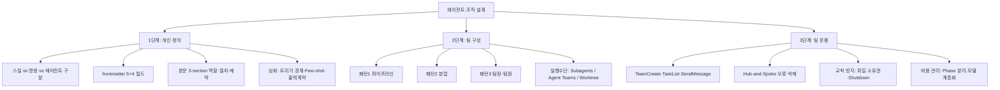
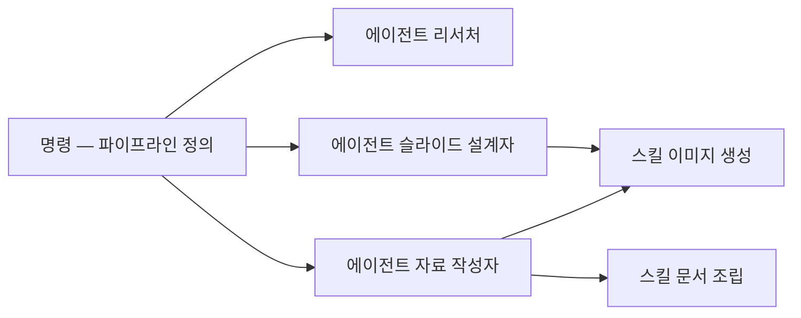
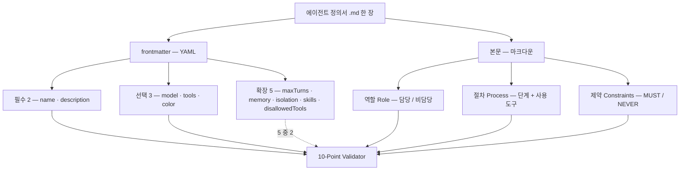

에이전트를 여러 명 굴리는 이야기는 대개 구조에서 시작한다. 파이프라인이냐 분업이냐, 팀장을 둘 것이냐. 그런데 구조를 고르기 전에 정해야 하는 것이 하나 있다. **한 명이 무엇인지**다.

이 시리즈는 세 단으로 간다. 한 명을 어떻게 정의하는가 → 여러 명을 어떻게 묶는가 → 묶은 팀을 어떻게 굴리는가. 이 글은 첫 단이다. 정의서 한 장에 무엇을 적고, 각 칸이 비면 무엇이 깨지고, 다 적었는지를 어떻게 검사하는가.

정의서는 결국 JD(직무기술서)다. 조직에서 사람을 뽑을 때 쓰던 문서와 항목이 1:1로 대응한다. 그래서 이 글의 표들은 왼쪽에 에이전트 필드를, 오른쪽에 조직 개념을 나란히 둔다. 비유가 예쁘라고 붙은 것이 아니라, **경계가 흐린 JD가 만드는 문제와 경계가 흐린 `description`이 만드는 문제가 같은 문제**이기 때문이다.

> 이 글이 옮긴 원 자료의 작성 기준일은 **2026-07-26**이다. 필드 이름·기본값·동작 설명은 그 시점의 것이다.
>
> 원 자료가 드는 사례는 실습 예제이며 실제 운영 사례가 아니다. 이 시리즈도 그 성격을 그대로 물려받는다.

## 용어 정리

이 시리즈 전체에서 반복되는 용어다. 대부분 **사람 조직의 개념을 그대로 옮긴 것**이라, 조직 용어와 나란히 두고 읽으면 이해가 빠르다. 뒤의 두 편은 여기서 각자 쓰는 행만 다시 추린다.

| 용어 | 정의 | 대응되는 사람 조직 개념 |
|---|---|---|
| **스킬(Skill)** | 단일 기능을 수행하는 무상태 도구. 부르면 실행되고 끝나면 사라진다 | 자격증 / 사내 툴 |
| **명령(Command)** | 정해진 작업 순서(워크플로우)를 트리거하는 단위 | 업무 지시서 / SOP |
| **에이전트(Agent)** | 역할과 판단권을 가진 실행 주체. 도메인 전체를 책임진다 | 담당자 / 직원 |
| **서브에이전트(Subagent)** | 메인 세션이 1:1로 위임하는 에이전트. 독립 컨텍스트에서 일하고 최종 보고만 돌려준다 | 위임받은 팀원 |
| **오케스트레이터(Orchestrator)** | 여러 에이전트에 작업을 배분·조율·통합하는 상위 에이전트 | 팀장 / PM |
| **워커(Worker)** | 오케스트레이터의 지시를 받아 전문 작업만 수행하는 에이전트 | 팀원 |
| **frontmatter** | 에이전트 정의 파일 상단의 YAML 메타데이터 영역(`---`로 감싼 구간) | JD의 헤더(직함·요건) |
| **라우팅(Routing)** | 사용자 요청을 읽고 어떤 에이전트를 호출할지 자동 선택하는 동작 | 업무 배정 |
| **자동 라우팅 트리거** | `description` 필드에 적힌 호출 조건 키워드 | 채용 공고의 "이런 분을 찾습니다" |
| **핸드오프(Handoff)** | 앞 단계 에이전트의 산출물을 다음 에이전트 입력으로 넘기는 것 | 업무 인계 |
| **Fan-out / Fan-in** | 여러 에이전트에 동시 배포(out) → 결과를 한 곳으로 수집·병합(in) | 병렬 배정 후 취합 |
| **Hub-and-Spoke** | 모든 보고·의사결정이 리더(허브)를 경유하는 통신 구조 | 팀장 중심 보고체계 |
| **P2P(Peer-to-Peer)** | 팀원끼리 리더를 거치지 않고 직접 의사결정하는 구조 | 수평 자율 협업 |
| **Agent Teams** | 여러 Claude Code 인스턴스가 리더-팀원으로 묶여 양방향 통신하는 실험적 기능 | 실제 팀 회의 |
| **Mailbox** | Agent Teams의 비동기 메시지 큐. 보낸 즉시 깨우지 않고 inbox에 적재된다 | 사내 메신저 |
| **TaskList** | 팀원이 공유하는 작업 보드. 상태·소유자·의존성을 기록 | 칸반 보드 / Jira |
| **blockedBy / blocks** | 태스크 간 선후 의존 관계. 선행이 끝나면 자동 해제된다 | 선행 작업 대기 |
| **Worktree** | 같은 git 저장소를 공유하되 다른 경로에 다른 브랜치를 동시 체크아웃하는 기능 | 각자 다른 책상 |
| **격리(Isolation)** | 에이전트 간 간섭을 막는 분리. 논리적·세션·물리적 3계층이 있다 | 업무 분장 / 좌석 분리 |
| **최소 권한 원칙** | 임무에 꼭 필요한 도구만 부여한다는 보안 원칙(Principle of Least Privilege) | 접근권한 최소 부여 |
| **Reasoning Sandwich** | 계획=고성능 모델, 구현=중간 모델, 검증=고성능 모델로 단계별 모델을 달리 배정하는 패턴 | 시니어-주니어-시니어 배치 |
| **모델 계층화** | 리더는 상위 모델, 반복 실행 팀원은 하위 모델로 구성하는 비용 전략 | 직급별 인건비 배분 |
| **컨텍스트 외부화** | 중요한 결정을 파일로 빼내 컨텍스트 압축 시 유실을 막는 기법 | 회의록 / ADR |
| **오류 증폭(Error amplification)** | 한 에이전트의 오류가 체인을 타고 커지는 현상 | 잘못된 정보의 조직 전파 |
| **MCP** | 외부 도구·데이터 소스를 에이전트에 연결하는 서버 규격 | 외부 시스템 연동 |

## 한눈에 보기 — 에이전트 조직 구성 지도

세 단 구조는 이렇게 갈라진다.



조직 관점의 대응은 이렇게 읽는다.

| 단계 | 사람 조직에서의 같은 일 |
|---|---|
| 개인 정의 | JD 작성, 직무 경계 설정, 권한 부여 |
| 팀 구성 | 조직 구조 선택(라인/스쿼드/위계), 보고 체계 설계 |
| 팀 운용 | 업무 배분, 회의·보고 규칙, 산출물 소유권, 인건비 배분 |

이 글은 왼쪽 열의 첫 행만 다룬다. 둘째 행은 [다음 편](/blog/agentic-coding/collaboration-patterns-isolation/), 셋째 행은 [마지막 편](/blog/agentic-coding/agent-team-operations/)이다.

## 에이전트란 — 스킬은 기능, 에이전트는 역할

### 핵심 비유

> 스킬은 **자격증**이고, 에이전트는 **사람**이다.
>
> 자격증은 스스로 일을 찾아 시작하지 않는다. 디자이너는 자격증 + 지시서 + 판단력을 종합해 작업을 완수한다.
>
> 즉 비교의 본질은 **자율성**이다. 스킬은 불러야 오고 끝나면 사라지지만, 에이전트는 상황을 판단하고 다음 단계를 스스로 결정한다.

### 스킬 vs 명령 vs 에이전트 3자 비교

| 비교축 | 스킬(Skill) | 명령(Command) | 에이전트(Agent) |
|---|---|---|---|
| 단위 | 기능(function) — 단일 능력 | 워크플로우 — 작업 순서 정의 | 역할(role) — 도메인 전체 담당자 |
| 책임 범위 | 한 가지 작업 | 정의된 시퀀스 실행 | 도메인 전체 |
| 호출 방식 | 명시 호출 — 자율성 없음 | 트리거 실행 | 명시 호출 + `description` 자동 라우팅 |
| 상태·지속성 | 무상태 — 1회 실행 후 종료 | 무상태 — 시퀀스 완료 후 종료 | `memory` 필드로 세션 간 지속 가능 |
| 판단 여부 | 판단하지 않음 | 판단하지 않음 | 어떻게 할지 스스로 판단 |
| 저장 위치 | `.claude/skills/` | `.claude/commands/` | `.claude/agents/` 또는 `~/.claude/agents/` |
| 한 줄 요약 | 무엇을 할 수 있다 | 무엇을 해라 | 이 일을 맡아서 알아서 해라 |

> **이 표에서 종이 갈리는 곳은 「호출 방식」과 「판단 여부」 두 행이다.**
>
> 일곱 행 중 단위, 책임 범위, 「상태·지속성」, 저장 위치 네 행은 규모나 위치의 차이라, 셋이 같은 종류의 큰 것·작은 것처럼 보인다. 「한 줄 요약」 행은 이름 그대로 나머지를 한 문장으로 줄인 것이다. 남는 두 행이 갈림길이다 — 에이전트만 부르지 않아도 불려 오고, 에이전트만 다음 단계를 스스로 정한다 — 앞의 자격증 비유가 가리키는 것이 이 두 행이다. 일곱 행을 이 둘 기준으로 읽는 것은 이 글의 정리이며, 원 자료는 일곱 행을 같은 무게로 늘어놓는다.

스킬·에이전트·커맨드·훅을 하네스의 부품으로 놓고 각각이 무엇을 떠받치는지는 [하네스를 만드는 다섯 가지](/blog/ai-agent/harness-five-primitives/)에서 별도로 다뤘다.

### 혼용의 위험

| 잘못된 사용 | 결과 |
|---|---|
| 스킬을 에이전트처럼 사용 | 자율 판단이 없어 매번 사람이 다음 단계를 지시해야 함 |
| 에이전트를 스킬처럼 사용 | 단순 작업에 역할 프롬프트 전체가 로드되어 토큰 폭증 |

두 행이 치르는 대가가 다르다. 위쪽은 사람의 시간을 쓰고, 아래쪽은 토큰을 쓴다.

### 관계 구조

같은 스킬을 여러 에이전트가 공유할 수 있고, 명령 하나가 여러 에이전트를 지휘할 수 있다.



- 같은 스킬(이미지 생성)을 슬라이드 설계자와 자료 작성자가 **모두 호출**한다.
- 누가 쓰느냐에 따라 결과가 달라진다 — 도구는 같아도 **판단이 다르기 때문**이다.
- 이 구조가 곧 "공용 툴은 공유하되, 판단은 담당자에게 맡긴다"는 조직 운영과 같다.

모델이 좋아져도 제품이 그만큼 좋아지지 않는 이유를 하네스 쪽에서 진단한 글은 [Agent = Model + Harness](/blog/ai-agent/agent-equals-model-plus-harness/)에 있다.

## 에이전트 정의서 작성법

### 정의서 = JD 한 장

에이전트 파일은 마크다운 한 장이며, 구조가 JD와 1:1로 대응한다.

| JD 항목 | 에이전트 파일 항목 | 설계 포인트 |
|---|---|---|
| Job Title | `name` | kebab-case, 파일명과 반드시 일치 |
| 이 사람을 언제 쓰나요 | `description` | 자동 라우팅의 **유일한** 기준 |
| 사용 도구·시스템 | `tools` | 최소 권한 원칙 |
| 요구 경력 수준 | `model` | 추론 깊이와 비용의 트레이드오프 |
| 사원증 색 / 소속 표시 | `color` | 동시 실행 시 시각 구분 |
| 업무 매뉴얼 | 본문 3-section | 역할 / 절차 / 제약 |

파일 한 장의 해부도로 그리면 이렇게 된다. 위쪽 절반이 frontmatter, 아래쪽 절반이 본문이고, 아래에서 볼 10-Point Validator가 그중 **필드 7개와 본문 3섹션**을 훑는다.



점선은 부분 포함이다. 검증 10항목이 이름을 대는 필드는 `name`·`description`·`model`·`tools`·`color`·`memory`·`maxTurns` **일곱 개**이고, 확장 필드 다섯 중 `isolation`·`skills`·`disallowedTools`는 **한 항목에도 나오지 않는다.** 원 자료는 필드 표와 검증 목록을 나란히 둘 뿐 둘의 대응 여부를 적지 않으며, **이 공백을 짚는 것은 이 글의 관찰이다.**

### frontmatter 필드 표 — 핵심 5 + 확장 5

| 필드 | 구분 | 타입 | 역할 | 실무 기준 |
|---|---|---|---|---|
| `name` | 필수 | string | 에이전트 식별자 | 소문자+하이픈만. 대문자·공백·언더스코어 금지. 파일명과 일치 |
| `description` | 필수 | string | 자동 라우팅의 유일한 기준 | 트리거 키워드 5~10개 + 사용 예시 2~3개. 운영 에이전트는 200~500단어 수준 |
| `model` | 선택 | enum | 어느 등급의 추론을 쓸지 | 깊은 판단=상위, 일반 생성=중간, 단순 분류=하위 |
| `tools` | 선택 | string[] | 사용 가능 도구 allowlist | 최소 권한. 미지정 시 상위 컨텍스트 도구를 상속(보안 취약) |
| `color` | 선택 | enum | 터미널 UI 식별 색상 | 팀 컨벤션으로 의미 부여 권장(분석·검증·비즈니스·보안·크리에이티브) |
| `maxTurns` | 확장 | number | 최대 턴 수 — 무한 루프 방지 | 운영 기준 25~30, 단순 작업은 5~10 |
| `memory` | 확장 | enum | 전용 메모리 사용 여부 | 고객·이력 맥락이 세션을 넘어야 하면 필수 |
| `isolation` | 확장 | enum | git worktree 격리 실행 | git 저장소 필수. 병렬 파일 충돌 방지용 |
| `skills` | 확장 | string[] | 프리로드할 스킬 목록 | 자주 쓰는 기능을 미리 물려준다 |
| `disallowedTools` | 확장 | string[] | 금지 도구 목록 | 말단 실행자는 하위 에이전트 재호출 금지에 사용 |

앞의 지도 도식은 이 묶음을 「frontmatter 5+4 필드」로 적어 두었는데, 표는 확장 필드를 **다섯 개** 싣는다. 원 자료 안에서 두 수가 어긋나 있고 어느 쪽이 맞는지는 원 자료 안에서 판정되지 않는다. 이 글은 도식과 표를 둘 다 원문대로 옮기되, **수를 셀 때는 표의 10개를 기준으로 삼는다.**

> **원 자료가 미지정 결과를 적어 둔 필드는 `tools` 하나다.**
>
> 적지 않으면 상위 컨텍스트의 도구를 **전부 물려받는다**. 이 칸에서는 **비워 두는 것이 곧 전권 부여**다. 아래 안티패턴 1번과 최소 권한 매트릭스가 이 한 칸을 두고 나온 것이다.

### 알려진 결함 — 세 건 모두 버전 표기가 없다

원 자료는 필드 표 바로 뒤에 「실전 함정 3가지」를 붙여 두었다. 셋 다 **적어 둔 대로 동작하지 않는다**는 주장이다.

| 함정 | 보고된 내용 | 원 자료가 제시한 대응 |
|---|---|---|
| allowlist로 쓰기 권한을 못 막는 경우 | `tools`에서 쓰기 도구를 빼도 실제로는 포함되는 제약이 보고됨 | 본문 제약 섹션에 "쓰기·편집 도구 사용 금지"를 명시 |
| 권한 모드 미작동 | 권한 모드는 frontmatter에서 동작하지 않음 | 호출 시 파라미터로 전달 |
| 메모리 경로 분리 미구현 | project/user 구분이 실제로는 같은 디렉터리로 저장 | 경로 분리를 전제로 설계하지 않는다 |

**세 건 모두 보고 주체·제품 버전·관측 시점이 적혀 있지 않다.** 원 자료는 "제약이 보고됨", "동작하지 않음", "실제로는 같은 디렉터리로 저장"이라고만 적었고, 누가 어느 버전에서 언제 관측했는지는 어디에도 없다. 이 글은 그 공백을 메우지 않는다. 없는 버전 번호나 관측 날짜를 여기서 만들어 붙이면 원 자료가 하지 않은 주장이 생긴다.

이 글 첫머리에 적은 작성 기준일(2026-07-26)이 이 세 주장의 관측 시점이라는 뜻도 아니다. **문서가 언제 쓰였는가와 그 안의 개별 주장이 언제 관측됐는가는 다른 사실이다.** 원 자료는 전자만 밝혔다.

버전이 붙지 않은 결함 주장은 시간이 갈수록 위험해진다. 해당 동작이 고쳐진 뒤에도 표는 그대로 남아 있고, 읽는 쪽은 그것이 지금도 참인지 판정할 수단이 없다. **그래서 이 세 행을 현재 사양의 기술이 아니라 점검 목록으로 읽자는 것은 이 글의 제안이다.**

세 행의 대응 열이 공통으로 말하는 것은 **frontmatter 선언을 최종 보증으로 삼지 말라**는 것이다. 앞의 둘은 같은 규칙을 다른 층(본문 제약 · 호출 파라미터)에서 다시 강제하라고 하고, 셋째는 아예 그 분리를 전제로 설계하지 말라고 한다.

### 본문 3-section 구조

| 섹션 | 담는 내용 | 빠지면 생기는 문제 |
|---|---|---|
| 역할(Role) | **담당**과 **비담당** 경계. 비담당은 "어느 에이전트가 맡는지"까지 명시 | 범위를 벗어난 과잉 개입 |
| 절차(Process) | 단계별 워크플로우. 각 단계에서 쓰는 도구 명시 | 턴마다 다른 방식으로 동작 |
| 제약(Constraints) | MUST / NEVER + 출력 형식 규칙 | 예측 불가능한 산출물, 파이프라인 파싱 실패 |

오른쪽 열이 셋 다 다르다는 점이 중요하다. 역할이 빠지면 **범위**가 무너지고, 절차가 빠지면 **일관성**이 무너지고, 제약이 빠지면 **산출물 형식**이 무너진다. 세 섹션은 같은 것을 세 번 적는 중복이 아니라 서로 다른 실패를 하나씩 막는다.

### 템플릿 — 복사용 스캐폴드

```markdown
---
name: <에이전트 이름, 소문자-하이픈, 예: content-creator>
description: "<'Use when [트리거 상황 + 키워드 나열]' 형식.
  최소 3개 이상 구체적 트리거 키워드 포함.>"
model: <opus | sonnet | haiku — 역할에 맞게>
tools: [<Read, Write, Bash 등 최소 권한만>]
# 선택 필드 (완전체를 위해 권장)
memory: <user | project | 삭제>
maxTurns: <숫자 또는 삭제>
color: <red | blue | green | yellow | cyan | 삭제>
---

# <에이전트 이름> 에이전트

## 역할 (Role)
**담당**: <이 에이전트가 처리하는 구체적 작업 목록>
**비담당**: <범위 밖 작업 — 어느 에이전트가 담당하는지도 명시>

## 절차 (Process)
### 1단계: <단계명>
<설명 + 사용 도구>
### 2단계: <단계명>
<설명 + 사용 도구>
### 3단계: <단계명>
<설명 + 사용 도구>

## 제약 (Constraints)
### MUST
- <반드시 해야 하는 것>
### NEVER
- <절대 하지 말아야 하는 것>
- <출력 형식 규칙, 언어 규칙>
```

### `description` 설계 — 라우팅의 전부

`description`은 설명문이 아니라 **라우팅 알고리즘의 입력값**이다. 요청이 들어오면 등록된 모든 에이전트의 `description`을 훑어 가장 잘 맞는 하나를 고른다.

| 수준 | 패턴 | 효과 |
|---|---|---|
| 기본 | `Use when [상황]` | 이름을 직접 부르지 않아도 호출 가능 |
| 최적화 | `Use proactively when [키워드 나열]` | 사용자가 에이전트명을 언급하지 않아도 자동 호출 |
| 경계 명시 | `DO NOT use for [경계] → [다른 에이전트]` | 유사 도메인 에이전트 간 요청 가로채기 방지 |
| 고급 | `<example>` 블록 삽입 | 원 자료 기준 라우팅 성공률 30~50% 향상 |

> **네 행 중 셋째만 방향이 반대다.**
>
> 기본·최적화·고급은 이 에이전트가 **불리게 하는** 장치이고, 경계 명시만 **안 불리게 하는** 장치다. 에이전트가 하나일 때는 셋째 행이 필요 없다가, 둘째 에이전트가 생기는 순간 필요해진다. 원 자료는 넷을 하나의 수준 사다리로 늘어놓았고, 방향이 갈린다는 것은 이 글의 정리다.

`<example>` 블록의 4구성요소는 **Context + User + Assistant + Commentary**다. 예시 수는 1개면 형식이 잡히고, 2~3개면 톤까지 완성되며, 4개 이상은 과적합 위험이 있다.

```yaml
description: |
  Use proactively when user asks for blog post, blog draft,
  article writing, content creation, or marketing copy.
  <example>
  <context>User needs a blog about a business topic</context>
  <user>1인 사업자 재택근무 생산성 팁 블로그 써줘</user>
  <assistant>blog-writer 에이전트를 활성화하여 처리합니다.</assistant>
  <commentary>
    트리거 키워드: '블로그', '재택근무', '생산성', '팁'
    이 에이전트의 영역: 블로그, 아티클, 롱폼 콘텐츠
    다른 에이전트 영역: SNS 캡션(copywriting), 보도자료(pr-writer)
  </commentary>
  </example>
```

### `model` 선택 매트릭스 — Reasoning Sandwich

| 등급 | 언제 쓰나 | 실제 배치 예 |
|---|---|---|
| 상위(opus) | 깊은 다중 턴 추론, 최종 판정, 트레이드오프 분석, 아키텍처 결정 | 평가 불일치 시 최종 판정자, 팀 리더 |
| 중간(sonnet) | 일반 생성·구현 작업(대부분의 에이전트) | 리서처, 스크립트 작성, 슬라이드 설계 |
| 하위(haiku) | 빠른 분류, 요약, 점수 산정 루프 | 최종 품질 점수 산정 |

**Reasoning Sandwich**는 Planning(상위) → Implementation(중간) → Verification(상위)로 단계별 모델을 달리 배정하는 패턴이다. 원 자료가 인용한 벤치마크 수치는 아래와 같다.

| 구성 | 점수 |
|---|---|
| 상위 모델 단독 | 53.9% (타임아웃 문제) |
| 중간 모델 단독 | 63.6% |
| Reasoning Sandwich | 66.5% |

세 행이 뒤집는 것은 "가장 좋은 모델을 쓰면 가장 좋은 결과가 나온다"는 기본 가정이다. 상위 모델 단독이 중간 모델 단독보다 **낮다**. 원 자료는 그 원인으로 타임아웃을 든다.

> 조직으로 옮기면 이렇다. **설계와 검수는 시니어가, 반복 구현은 미들이 맡는다.**
>
> 전원을 시니어로 채우면 비용만 오르고 오히려 느려지며, 전원을 주니어로 채우면 판단 품질이 떨어진다.

> **수치 출처**: 위 표의 66.5%는 원 자료가 LangChain Terminal Bench 2.0에서 인용한 값이다.
>
> 이 시리즈의 성능·비용 수치는 직접 측정한 것이 아니다. 대부분 원 자료가 인용한 외부 연구·벤치마크 값이고, 하나(Phase 분리 85%)는 원 자료 자체의 운영 사례이며, 출처를 밝히지 않은 값도 섞여 있다.

### `tools` 최소 권한 매트릭스

| 에이전트 유형 | 허용 도구 | 근거 |
|---|---|---|
| 리뷰어·검증(읽기 전용) | Read | 읽고 점수만 낸다. 쓰기 권한이 있으면 판정 중 원본 수정 사고 |
| 리서처(검색+저장) | Read, Grep, Glob, WebSearch, Write | 조사 후 결과 저장까지 |
| 설계자·작성자 | Read, Write, Edit | 읽고 쓰기만. 셸 실행 불필요 |
| 카피라이터(편집+실행) | Read, Grep, Glob, Write, Edit, Bash | 자료 검색 + 작성 + 편집 + 스크립트 |
| 오케스트레이터(전체 조율) | Task, Read, Write, Bash, Skill, 질의 도구 | 서브에이전트 생성과 전체 제어 |

- 셸 실행 권한은 가장 강력하고 위험하므로 **오케스트레이터와 실행 에이전트에만** 준다.
- 도구는 **나중에 추가하는 편이 처음부터 다 주는 것보다 안전**하다.

### 좋은 예 / 나쁜 예 — 안티패턴 5종

| # | 안티패턴 | 나쁜 예 | 좋은 예 | 왜 문제인가 |
|---|---|---|---|---|
| 1 | tools 과잉 권한 | 리뷰어에게 Read + Write + Bash 부여 | 리뷰어는 Read 하나 | 판정 중 산출물 덮어쓰기, 셸 명령 사고 위험 |
| 2 | model 오버스펙 | 단순 요약 에이전트를 상위 모델로 | 요약·분류는 하위 모델 | 비용 3~10배. 하루 100회 호출이면 격차가 그대로 청구 |
| 3 | description 모호 | `"유용한 마케팅 에이전트입니다"` | `"Use when creating marketing materials: landing pages, email campaigns, ad creatives..."` | 트리거 키워드가 없어 자동 라우팅 실패 |
| 4 | 본문 미분리 | 역할·절차·제약이 뒤섞인 자연어 덩어리 | 3-section 분리 + 비담당 경계 명시 | 턴마다 해석이 달라져 행동 불일관, 범위 이탈 |
| 5 | 선택 필드 누락 | color·memory·maxTurns 생략 | 반복 사용 에이전트는 3개 모두 채움 | 터미널 구분 불가, 매번 맥락 재입력, 장문 작업 강제 종료 |

> **다섯 행이 모두 앞의 어느 표에 대응한다.**
>
> 1번은 최소 권한 매트릭스, 2번은 model 선택 매트릭스, 3번은 `description` 4수준표, 4번은 본문 3-section표, 5번은 frontmatter 선택·확장 필드다. 새 규칙이 하나도 없다는 뜻이고, 그래서 이 표는 **앞의 규칙을 어겼을 때의 증상 목록**으로 읽힌다. 다섯 행을 앞 표에 대응시킨 것은 이 글의 정리다.

### 10-Point Validator — 설계 완료 체크리스트

| # | 점검 항목 |
|---|---|
| 1 | `name`이 소문자+하이픈이고 파일명과 일치하는가 |
| 2 | `description`이 'Use when [상황]' 공식을 따르는가 |
| 3 | `description`에 구체적 트리거 키워드가 3개 이상 있는가 |
| 4 | `model`이 작업 복잡도에 맞는가 (과하거나 부족하지 않은가) |
| 5 | `tools`가 최소 권한으로 제한되어 있는가 |
| 6 | 본문에 역할(Role) 섹션이 있고 담당/비담당 경계가 명시되었는가 |
| 7 | 본문에 절차(Process) 섹션이 단계별로 있는가 |
| 8 | 본문에 제약(Constraints) 섹션이 MUST/NEVER로 있는가 |
| 9 | `color`가 지정되어 터미널에서 구분되는가 |
| 10 | 장기 기억이 필요하면 `memory` + `maxTurns`가 설정되었는가 |

### 심화 5기법 — 프로덕션 급으로 올리기

| 기법 | 요지 | 실패 시 증상 |
|---|---|---|
| frontmatter 전략 설계 | `name`은 도메인-역할 패턴, `model`은 Reasoning Sandwich, `tools`는 화이트리스트, `color`는 8색 관례 | 디버깅 시 어느 에이전트가 무슨 일을 했는지 추적 불가 |
| 트리거 경계 설계 | `use PROACTIVELY when` + `DO NOT use when`을 한 세트로 작성 | 유사 도메인 에이전트끼리 같은 요청을 가로채 충돌 |
| 시스템 프롬프트 5단계 | 역할 정의 → 핵심 원칙 → 프레임워크 → 절차 → 출력 형식 | 우선순위 혼란. "좋은 리뷰를 해주세요" 식 모호 지시 |
| Few-shot 예시 | Context+User+Assistant+Commentary. 진짜 예시(실제 코드·에러·출력)만 효과 있음 | 추상적 틀만 보여주는 가짜 예시는 효과 없음 |
| 출력 포맷 강제 | JSON 스키마 / 마크다운 섹션 템플릿 / 검증 전담 에이전트 중 하나 이상 | 후속 파이프라인 파싱 불가. 재현성 0 |

오른쪽 열이 전부 **디버깅 불가·충돌·불일관·무효과·파싱 실패**다. 다만 실패 증상이 걸리는 범위는 갈린다 — 1·2번(frontmatter 전략·트리거 경계)의 증상은 에이전트가 둘 이상일 때 생기는 추적 불가와 가로채기 충돌이고, 3·4·5번(시스템 프롬프트·Few-shot·출력 포맷)의 증상은 한 명일 때도 그대로 난다. **다섯을 이렇게 가르는 것은 이 글의 정리이며, 원 자료는 다섯을 한 묶음으로 둔다.**

**출력 포맷 강제의 실무 규칙**

- 스키마에는 필드명·타입·허용값·예시값을 **모두** 적는다. "JSON으로 출력해주세요"는 지시가 아니다.
- 검증자(Verifier)는 생성자(Generator)와 **분리된 별도 에이전트**로 만든다.
- 재시도 상한을 3회로 두고, 초과하면 사람에게 에스컬레이션한다. 상한 없는 재시도는 비용 폭발이다.

가운데 규칙이 다음 편으로 이어진다. 생성자와 검증자를 나누는 순간 에이전트는 한 명이 아니게 되고, 그때부터는 정의서가 아니라 **둘을 어떻게 잇느냐**가 문제가 된다.

## 다음

정의서 한 장으로 할 수 있는 일은 여기까지다. 한 명이 감당할 수 있는 범위를 넘으면 나눠야 하고, 나누는 방식은 셋뿐이다 — 줄로 세우거나, 옆으로 펼치거나, 위에 한 명을 두거나.

- [다음 편 — 셋으로 묶는 법과 셋으로 가르는 법](/blog/agentic-coding/collaboration-patterns-isolation/): 파이프라인·분업·팀장-팀원 세 패턴과 각각의 실패 모드, 그리고 그것을 구현하는 격리 수단 셋(Subagents · Agent Teams · Worktree)
- [마지막 편 — 팀을 굴리면 첫날 무엇이 멈추는가](/blog/agentic-coding/agent-team-operations/): 팀 가동 4단계, 비동기 메시지, 교착 방지, 비용 관리, 그리고 완제품 환경 사례
