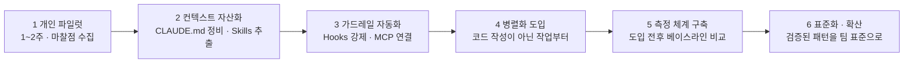
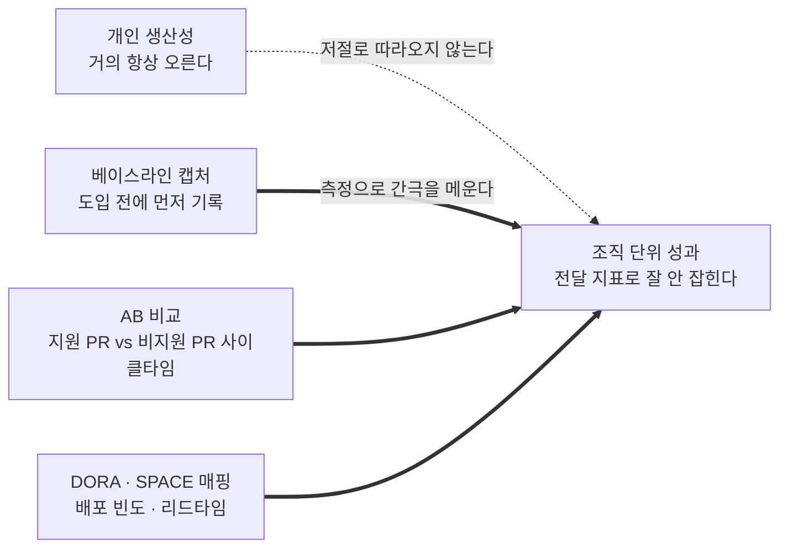

도구를 들이면 개인은 빨라진다. 이건 거의 항상 관찰된다. 문제는 그 다음이다 — **팀의 배포 빈도나 리드타임 같은 조직 지표는 좀처럼 따라 움직이지 않는다.**

이 글은 그 간극을 다룬다. 무엇을 어떤 순서로 도입하고, 개인 향상이 조직 성과로 전환되었는지를 무엇으로 증명하며, 그 과정에서 흔히 밟는 안티패턴은 무엇인가. 결론을 먼저 적으면 이렇다. **혼자 빠른 도구가 아니라 "팀의 일하는 방식"을 바꾸는 인프라로 접근해야 효과가 난다.**

> 이 글이 옮긴 원 자료는 웹 조사를 종합한 정리이며 **조사일은 2026-06**이다. 제품 기능·명칭은 그 시점의 것이다.
>
> 본문의 성과 수치는 원 자료가 **「보고 사례」** 로 소개한 값이며 직접 측정한 것이 아니다. 아래 측정 절의 각주에 원 자료가 밝힌 참고 자료군을 함께 적었다.

## 용어 정리

원 자료가 본문에서 정의하거나 용법으로 밝힌 항목만 추렸다.

| 용어 | 정의 |
|---|---|
| **CLAUDE.md** | 상시 컨텍스트. 프로젝트 구조·네이밍 규칙·"절대 건드리면 안 되는 것"을 한 번 적어 전원이 공유하는 파일 |
| **Skills** | 온디맨드 지식·워크플로. 특정 작업에서만 필요한 절차를 재사용 가능한 형태로 자산화한 것 |
| **MCP** | 외부 서비스 연결. 이슈트래커·DB·모니터링·디자인 도구를 에이전트가 직접 읽고 작업하게 하는 규격 |
| **Subagents** | 격리된 워커. 메인 에이전트에게 **결과만 보고**한다. 토큰이 저렴하다 |
| **Hooks** | 셸 명령 자동 실행. **모델의 판단과 무관하게** 실행을 보장하는 강제 장치 |
| **Agent Teams** | 팀원끼리 직접 메시지·공유 태스크리스트로 자율 협업하는 구조. 토큰을 많이 쓴다 (원 자료 조사 시점 기준 실험적 기능, 기본 비활성) |
| **lessons.md** | 에이전트가 실수하고 교정될 때마다 그 규칙을 적어 두는 파일. 같은 실수의 반복을 막는다 |
| **Plan-first** | 구현하지 말고 계획만 먼저 작성하게 하고, 결정이 확정될 때까지 반복한 뒤 구현에 들어가는 방식 |
| **Git worktree** | 세션마다 워크트리를 분리해 변경 충돌을 원천 차단하는 기능 |
| **베이스라인** | 도입 **전** 배포 빈도·리드타임·PR 수·코드 품질 지표를 먼저 기록해 둔 기준값 |
| **사이클타임** | AB 비교의 대상 지표. 지원 PR과 비지원 PR 사이의 일관된 격차가 가장 강력한 근거가 된다 |
| **DORA / SPACE** | 원 자료가 「기존 프레임워크」로 지목한 두 이름. 배포 빈도(deployment frequency)·리드타임(lead time)을 매핑 대상으로 든다 |

## 한눈에 보기

- **혼자 빠른 도구가 아니라 "팀의 일하는 방식"을 바꾸는 인프라로 접근**해야 효과가 난다.
- 5대 확장 요소를 역할에 맞게 조합한다 — **CLAUDE.md(상시 컨텍스트) · Skills(온디맨드 지식) · MCP(외부 연결) · Subagents(격리·병렬) · Hooks(자동 강제)**, 그리고 그 위에 **Agent Teams(에이전트 간 협업)**.
- 개인 생산성은 거의 항상 오른다. **하지만 조직 단위 성과는 저절로 따라오지 않는다.** 표준화·측정·문화가 있어야 조직 ROI로 전환된다.
- 리더의 역할은 넷이다 — ① 컨텍스트/규칙을 자산화(CLAUDE.md·Skills) ② 가드레일 자동화(Hooks) ③ 측정 체계 구축 ④ 안티패턴 차단(맹신·검증 생략·토큰 낭비).

세 번째 항목이 이 글 전체의 문제의식이고, 네 번째가 그에 대한 처방이다.

## 구성 요소 — 언제 무엇을 쓰나

| 요소 | 역할 | 언제 쓰나 | 팀 생산성 관점 |
|---|---|---|---|
| **CLAUDE.md** | 상시 컨텍스트 | 거의 모든 작업에 적용되는 규칙 | 프로젝트 구조·네이밍·"건드리지 말 것"을 한 번 적어 전원이 공유 |
| **Skills** | 온디맨드 지식·워크플로 | 특정 작업에서만 필요한 절차 | 반복 작업(배포·리뷰·테스트)을 재사용 가능한 스킬로 자산화 |
| **MCP** | 외부 서비스 연결 | 이슈트래커·DB·모니터링·디자인 도구 연동 | Jira·GitHub·Sentry·DB를 에이전트가 직접 읽고 작업 |
| **Subagents** | 격리된 워커(결과만 반환) | 병렬 처리·컨텍스트 오염 방지 | 탐색/검증을 분리해 메인 대화를 깨끗하게 유지 |
| **Hooks** | 셸 명령 자동 실행(강제) | 규칙을 "모델 판단과 무관하게" 보장 | 커밋 전 린트·테스트, 생성파일 수정 차단 등 가드레일 |
| **Agent Teams** | 에이전트끼리 대화·협업 | 병렬 탐색이 가치 있는 복합 작업 | 리뷰·디버깅·신규 모듈을 역할 분담해 동시 진행 |

여섯 행이 "언제 쓰나" 열에서 갈린다. 위의 둘은 **지식을 어디에 둘 것인가**, 셋째는 **에이전트를 무엇에 연결할 것인가**, 넷째는 **일을 어디서 시킬 것인가**, 아래 둘은 **무엇을 강제하고 무엇을 병렬화할 것인가**의 문제다 — 이렇게 넷으로 가르는 것은 이 글의 정리다.

> 멘탈 모델: **Skills + MCP로 80% 워크플로 커버 → Hooks로 잡일 자동화 → 컨텍스트가 무거워지면 Subagents로 위임 → 에이전트 간 협업이 필요하면 Agent Teams로 병렬화.**

### Subagents vs Agent Teams

| 구분 | Subagents | Agent Teams |
|---|---|---|
| 통신 | 메인 에이전트에게 **결과만 보고** | 팀원끼리 **직접 메시지·공유 태스크리스트로 자율 협업** |
| 토큰 | 저렴 | 많이 씀 |
| 적합 | "결과만 중요한 집중 작업" | "서로 발견을 공유하고 반박하며 조율해야 하는 복합 작업" |

토큰 행이 이 글 뒤쪽 안티패턴 절과 직접 연결된다. 협업 구조는 공짜가 아니라 **비용을 내고 사는 것**이므로, 루틴 작업에까지 팀을 띄우면 이득 없이 비용만 늘어난다.

팀을 실제로 띄웠을 때의 운용 규칙 — 스폰 순서, 비동기 메시지, 파일 소유권, 종료 프로토콜, 비용 3원칙 — 은 [팀을 굴리면 첫날 무엇이 멈추는가](/blog/agentic-coding/agent-team-operations/) 편에 정리돼 있다. 아래 안티패턴 절에서 다시 짚는 **"팀원은 리드의 대화 히스토리를 상속하지 않는다"** 도 그 글이 컨텍스트 격리 관점에서 더 자세히 다룬다.

## 팀 생산성을 끌어올리는 여섯 가지

### 컨텍스트를 자산화한다 — CLAUDE.md

CLAUDE.md는 "에이전트가 무엇인지"가 아니라 **"우리 세계가 어떻게 돌아가는지"** 를 적는 곳이다. 프로젝트 구조, 네이밍 규칙, 어디에 무엇이 있는지, **절대 건드리면 안 되는 것**.

- 거의 모든 작업에 적용되는 규칙만 넣는다(예: "커밋 메시지는 `feat:`/`fix:`/`chore:` 접두", "`src/legacy/` 수정 금지").
- **lessons.md 패턴**: 에이전트가 실수하고 교정될 때마다 규칙을 적어 두면 같은 실수를 반복하지 않고 프로젝트에 맞게 "스스로 학습"한다. 조직의 집단 지식이 파일로 축적되는 형태다.

무엇을 넣고 무엇을 별도 파일로 뺄지, 그 파일이 몇 줄부터 지켜지지 않기 시작하는지는 [CLAUDE.md의 4계층 Scope](/blog/agentic-coding/claude-md-scope-layers/) 편에서 따로 다뤘다.

### 반복 작업을 Skills로 표준화한다

배포 절차, 코드리뷰 체크리스트, 테스트 시나리오, 온보딩 가이드 등을 스킬로 만들면 **누가 실행해도 같은 품질**이 나온다. 개인 노하우가 팀 자산으로 전환된다.

### 가드레일을 Hooks로 자동 강제한다

Hooks는 모델의 판단과 무관하게 셸 명령 실행을 **보장**한다. 대표 패턴은 이렇다.

| 패턴 | 거는 지점 |
|---|---|
| 테스트 실행 / 린트 | 작업 종료 전 · 커밋 전 |
| 생성된(자동) 파일 수정 차단 | 쓰기 시도 시 |
| 브랜치명에 이슈 ID 강제 | 브랜치 생성 시 |
| 의존성 변경 후 보안 스캔 | 변경 감지 시 |
| 품질 게이트 (Agent Teams) | `TeammateIdle` · `TaskCreated` · `TaskCompleted` |

다섯 행이 전부 **사람이 잊어도 시스템이 막아 주는** 자리에 붙어 있다. 효과는 리뷰 부담과 휴먼에러의 감소다.

스킬과 훅이 파일 단위로 어떻게 생겼고 훅이 무엇으로 차단하는지는 [예외 없이 걸리는 것은 훅뿐이다](/blog/agentic-coding/commands-skills-hooks-plugins/) 편에 있다.

### 계획을 먼저 세운다 (Plan-first)

**왜 계획이 중요한가.** 에이전트가 각 결정을 80% 정확도로 한다면, 결정 20개짜리 기능이 전부 맞을 확률은 **≈1%** 다. 계획 단계가 모호한 결정들을 검토된 명세로 수렴시킨다.

권장 루프는 넷이다.

| # | 단계 |
|---|---|
| 1 | 구현하지 말고 계획만 작성하게 한다 |
| 2 | 에디터에서 오류·이견을 주석으로 단다 |
| 3 | "구현하지 말고 메모만 반영"을 지시한다 |
| 4 | 결정이 확정될 때까지 반복한다 — 그 다음 구현 |

1번과 3번에 똑같이 "구현하지 말고"가 들어간다는 점이 이 루프의 실질이다. 계획 단계에서 코드가 나오기 시작하면 검토 대상이 명세가 아니라 결과물로 바뀐다.

### 병렬화로 처리량을 늘린다

| 용도 | 방식 |
|---|---|
| 병렬 코드리뷰 | 보안/성능/테스트커버리지를 각 팀원에게 분담 → 한 명이 한 종류에 쏠리는 문제 제거 |
| 경쟁 가설 디버깅 | 여러 팀원이 서로 다른 가설을 동시 검증하고 **서로 반박** → 순차 조사의 앵커링을 깨고 진짜 원인에 빠르게 수렴 |
| 크로스레이어 기능 | 프론트/백엔드/테스트를 각각 다른 팀원이 소유 |

세 용도의 공통 전제가 **파일 충돌 방지**다. 두 에이전트가 같은 파일을 고치면 덮어쓰므로, **팀원마다 서로 다른 파일 집합을 소유**하게 쪼갠다(원 자료가 병렬 작업 생산성 팁 1번으로 꼽은 항목이다). 수동 병렬 세션에서는 **Git worktree**로 세션마다 워크트리를 분리해 변경 충돌을 원천 차단한다.

### 적정 규모로 운영한다

| 기준 | 권장치 | 근거 |
|---|---|---|
| 팀원 수 | **3~5명**으로 시작 | 대부분 워크플로의 균형점. "집중된 3명 > 산만한 5명" |
| 팀원당 태스크 | **5~6개** | 컨텍스트 스위칭 없이 생산적인 수준. 독립 태스크 15개면 3명이 적정 |
| 태스크 크기 | 명확한 산출물 단위 | 너무 작으면 조율 비용 > 이득, 너무 크면 점검 없이 오래 달려 리스크↑ |

세 번째 행의 "명확한 산출물 단위"란 **함수 하나·테스트 파일 하나·리뷰 하나**처럼 완료 여부를 눈으로 판정할 수 있는 크기를 말한다.

## 도입 로드맵

| 단계 | 하는 일 | 이 글이 읽은 순서의 이유 |
|---|---|---|
| 1 | 핵심 개발자 몇 명이 일상 작업에 사용(1~2주). 마찰점·효과 수집 | 무엇을 자산화할지 모르는 상태에서 표준부터 만들 수 없다 |
| 2 | 레포별 CLAUDE.md 정비, 자주 쓰는 절차를 Skills로 추출 | 1단계에서 수집한 마찰점이 여기의 입력이다 |
| 3 | Hooks로 린트·테스트·금지영역 강제, MCP로 Jira/GitHub/DB 연결 | 규칙이 문서로 존재한 뒤에야 강제할 대상이 생긴다 |
| 4 | 리뷰·리서치·디버깅 같은 **코드 작성이 아닌** 작업부터 병렬화 | 경계가 분명해 조율 난이도가 낮고 가치를 빨리 체감한다 |
| 5 | 도입 전후 베이스라인 비교 | 원 자료가 이 자리에서 측정 절을 가리킨다 |
| 6 | 검증된 패턴을 팀 표준으로. lessons.md·Skills를 지속 갱신 | 앞 단계를 거쳐 **검증된** 패턴만 표준으로 올린다 |

> **오른쪽 열은 대부분 이 글의 정리다.** 원 자료는 여섯 단계를 번호 목록으로 제시하면서 **4단계에만** 괄호로 이유를 달았다 — "경계가 분명해 조율 난이도가 낮고 가치를 빨리 체감". 6단계에는 "검증된 패턴을 팀 표준으로"라는 표현이 있고, 5단계는 "아래 4장. 도입 전후 베이스라인 비교"로 다음 절을 가리킨다. 나머지 세 행의 이유는 앞뒤 단계의 배치에서 이 글이 읽어 낸 것이다.

4단계는 원 자료가 **괄호로** 이유를 단 유일한 단계다. 리뷰·리서치·디버깅부터 병렬화하는 까닭은 **경계가 분명해 조율 난이도가 낮고 가치를 빨리 체감**하기 때문이다. 앞의 「병렬화로 처리량을 늘린다」 절이 따로 든 **파일 충돌 방지**와 겹쳐 읽으면 왜 코드 작성이 뒤로 밀리는지가 더 분명해지지만, 두 절을 잇는 것은 이 글의 정리이며 원 자료가 파일 충돌을 로드맵 순서의 근거로 든 것은 아니다.

## 성과 측정 — "개인 향상 ≠ 조직 향상" 함정 넘기

조사 결과의 핵심 통찰은 이것이다. **개인 생산성은 거의 항상 오르지만, 조직 전달 지표로는 잘 안 잡힌다.** 리더는 측정으로 이 간극을 메워야 한다.

| 측정 축 | 내용 |
|---|---|
| 베이스라인 캡처 | 도입 **전** 배포 빈도·리드타임·PR 수·코드 품질 지표를 먼저 기록 |
| AB 비교 | 지원 PR vs 비지원 PR의 **사이클타임**을 비교 — 일관된 격차가 가장 강력한 근거 |
| 기존 프레임워크 매핑 | DORA/SPACE 등에 매핑(deployment frequency, lead time 등) |

세 축의 순서에 실무적 함의가 있다. 베이스라인은 **도입 전에만** 잡을 수 있다 — 원 자료도 "도입 **전** 배포 빈도·리드타임·PR 수·코드 품질 지표를 먼저 기록"이라고 적었다. 그렇다면 이 절을 로드맵 5단계에 이르러 처음 읽을 때는 1단계 파일럿의 기준값이 이미 사라진 뒤다. **측정 체계 구축은 5단계에 두더라도 베이스라인 기록만은 1단계 앞으로 당겨야 한다는 것이 이 글의 정리다.** 원 자료는 측정을 5단계에 배치하면서 "아래 4장. 도입 전후 베이스라인 비교"라고 스스로 이 절을 가리킬 뿐, 그 배치를 문제로 짚지는 않았다.

### 보고된 수치와 함께 보고된 반대 조건

원 자료가 **「보고 사례」** 로 소개한 값은 아래 셋이다.

| 지표 | 보고된 값 |
|---|---|
| PR 머지율 | ~2배 |
| 스토리 완료 | +164% |
| 루틴 코딩 시간 | -46% |

그리고 같은 자리에 반대 조건이 함께 적혀 있다. **이쪽이 이 글의 논지에 더 가깝다.**

| 조건 | 값 |
|---|---|
| 고난도 작업 | 절감 **10% 미만** |
| 주니어 | 오히려 **7~10% 더 걸리기도** |

두 표를 함께 읽어야 결론이 나온다. 효과는 도구의 성능이 아니라 **작업 난이도와 숙련도에 의존한다.** 그래서 시사점은 이렇게 정리된다 — **루틴·반복 작업에 집중 투입**할수록 ROI가 명확하고, 고난도 설계는 "사람의 판단 + AI 가속" 조합으로 간다.

### 기업 사례

| 기업 | 보고된 내용 |
|---|---|
| Zapier | 내부 작업량 전년比 **10×** |
| Tines | 120단계 프로세스를 단일 단계로 (최대 **100×** 속도) |

> **이 절 수치의 출처에 관하여.** 위 수치는 원 자료가 **「보고 사례」** 로 소개한 것이며 이 글이 측정한 값이 아니다. 원 자료가 밝힌 참고 자료는 아래 아홉 건이다.
>
> | # | 자료 | 분류 |
> |---:|---|---|
> | 1 | [Orchestrate teams of Claude Code sessions](https://code.claude.com/docs/en/agent-teams) | 공식 문서 |
> | 2 | [Extend Claude Code (Skills/MCP/Hooks/Subagents 개요)](https://code.claude.com/docs/en/features-overview) | 공식 문서 |
> | 3 | [Introducing dynamic workflows in Claude Code](https://claude.com/blog/introducing-dynamic-workflows-in-claude-code) | Anthropic 블로그 |
> | 4 | [Understanding Claude Code's Full Stack: MCP, Skills, Subagents, Hooks](https://alexop.dev/posts/understanding-claude-code-full-stack/) — alexop.dev | 개인 블로그 |
> | 5 | [Claude Code Best Practices: 100-Line Workflow (CLAUDE.md/lessons.md)](https://mindwiredai.com/2026/03/25/claude-code-creator-workflow-claudemd/) — mindwiredai | 개인 블로그 |
> | 6 | [Claude Code Workflows and Best Practices 2026](https://smart-webtech.com/blog/claude-code-workflows-and-best-practices/) — smart-webtech | 개인 블로그 |
> | 7 | [Measuring Claude Code ROI](https://www.faros.ai/blog/how-to-measure-claude-code-roi-developer-productivity-insights-with-faros-ai) — Faros AI | 벤더 리서치 |
> | 8 | [Claude Code ROI: How to Measure Adoption & Business Value](https://jellyfish.co/library/claude-code-roi/) — Jellyfish | 벤더 리서치 |
> | 9 | [Claude in the enterprise: case studies (Zapier·Tines 등)](https://www.datastudios.org/post/claude-in-the-enterprise-case-studies-of-ai-deployments-and-real-world-results-1) — DataStudios | 기업 사례 정리 |
>
> **아홉 건 중 수치와 이어지는 것은 마지막 하나뿐이다.** 9번 제목의 `(Zapier·Tines 등)`이 바로 위 「기업 사례」 표의 두 고유명사와 맞물려, `10×`와 `100×`는 어느 자료에서 왔는지 따라갈 수 있다. 나머지 여덟 건은 목록에 나열돼 있을 뿐 어느 수치의 근거인지 표시가 없어, `~2배`·`+164%`·`-46%`·`10% 미만`·`7~10%`가 각각 어느 자료에서 왔는지는 원 자료로부터 확인되지 않는다.
>
> **분류 열의 앞 세 줄은 원 자료가 제목 뒤에 직접 달아 둔 라벨이다** — `— 공식 문서`, `— 공식 문서`, `— Anthropic 블로그`. 나머지 여섯 줄에 원 자료가 붙인 것은 `alexop.dev`·`mindwiredai`·`smart-webtech`·`Faros AI`·`Jellyfish`·`DataStudios`라는 사이트·발행처 이름뿐이고, 이를 「개인 블로그」·「벤더 리서치」·「기업 사례 정리」로 가른 것은 이 글의 정리다. 7·8번은 제목에 `Measuring`·`How to Measure Adoption`이 들어가 **측정 도구를 파는 쪽이 자사 제품의 효과를 재는 자료**로 읽히므로 그 점을 감안해 읽어야 한다. 9번에는 그런 근거가 없어 같은 묶음으로 보지 않았다.

## 안티패턴 / 주의점

| 안티패턴 | 무엇이 문제인가 | 대응 |
|---|---|---|
| **검증 생략** | 에이전트 산출물을 무비판 수용 | Hooks·리뷰·테스트로 항상 검증 |
| **과도한 병렬화** | 순차 작업·같은 파일 편집·의존성 많은 일에 팀을 띄움 | 단일 세션이 더 효율적. 토큰만 낭비된다 |
| **토큰 비용** | Agent Teams는 단일 세션보다 토큰을 크게 씀 | 루틴 작업엔 단일 세션 또는 서브에이전트 |
| **방치** | 팀을 오래 무인 운영하면 헛수고 리스크↑ | **중간 점검·방향 수정·결과 종합**을 사람이 한다 |
| **컨텍스트 미전달** | 팀원은 리드의 대화 히스토리를 상속하지 않는다 | 스폰 프롬프트에 작업별 맥락을 충분히 싣는다 |
| **주니어 역효과 가능성** | 도구가 주니어에겐 오히려 느리게 만들 수 있음 | 교육·페어링 병행 |

여섯 행 중 두 번째와 세 번째(과도한 병렬화·토큰 비용)가 사실상 한 문제의 원인과 결과다. 그리고 마지막 행은 앞 절의 **주니어 7~10% 지연**과 같은 사실을 안티패턴 쪽에서 다시 부른 것이다 — 측정에서 보이던 숫자가 운영 규칙으로 넘어온 자리다.

다섯째 행의 컨텍스트 미전달은 [팀을 굴리면 첫날 무엇이 멈추는가](/blog/agentic-coding/agent-team-operations/) 편이 "가장 흔한 오해"로 따로 짚는 항목이다. 위임한 쪽이 아는 것을 위임받은 쪽이 안다고 가정하는 데서 나온다.

## 개발 리더 관점 — 조직 적용 메시지

| 메시지 | 내용 |
|---|---|
| **프레이밍** | "도구 도입"이 아니라 **"개발 프로세스 재설계"** 로 본다. CLAUDE.md=규칙, Skills=절차, Hooks=가드레일, Agent Teams=병렬 처리량 → 조직의 일하는 방식을 표준화·자동화하는 일이다 |
| **측정으로 증명** | 도입 전후 사이클타임/리드타임 비교를 준비한다. **"개인 향상 → 조직 ROI 전환"을 설계**하는 것이 핵심이다 |
| **품질 보증 내재화** | 속도만이 아니라 Hooks·이중 리뷰·검증 루프로 **안정성과 속도를 동시에** 가져간다 |
| **점진 도입 + 안티패턴 관리** | 리서치/리뷰부터 시작하고, 토큰·검증·주니어 케어를 함께 챙긴다 |

첫 행의 대응 관계(규칙=CLAUDE.md, 절차=Skills, 가드레일=Hooks)가 이 카테고리의 다른 글들과 그대로 겹친다. 규칙 파일은 [CLAUDE.md의 4계층 Scope](/blog/agentic-coding/claude-md-scope-layers/) 편이, 절차와 가드레일은 [예외 없이 걸리는 것은 훅뿐이다](/blog/agentic-coding/commands-skills-hooks-plugins/) 편이 파일 단위까지 내려간다.

## 닫으며

이 글의 전제는 하나다. **개인 생산성 향상은 거의 자동으로 오지만 조직 성과는 그렇지 않다.**

그래서 리더가 할 일이 도구 배포가 아니라 세 가지 설계로 바뀐다 — 규칙을 파일로 자산화하고, 지켜야 할 것을 실행 시점에 강제하고, 전환이 일어났는지를 도입 **전에** 잡아 둔 기준값으로 증명하는 것이다. 셋 중 마지막만 할 수 있는 시점이 정해져 있다. 베이스라인은 파일럿을 시작한 뒤에는 만들 수 없기 때문이다.

한 가지만 덧붙이면, 보고된 수치의 반대편도 같은 자료에서 나왔다는 사실이다. 루틴 작업에서 46%가 줄어드는 동안 고난도 작업에서는 10% 미만이 줄고, 주니어는 오히려 7~10% 더 걸리기도 한다. **어디에 투입할 것인가가 얼마나 좋은 도구인가보다 결과를 크게 가른다.**
